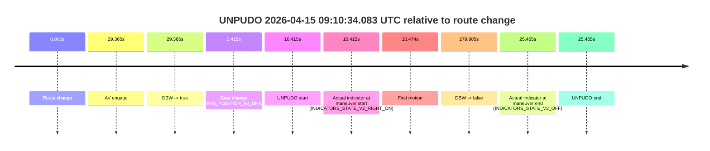
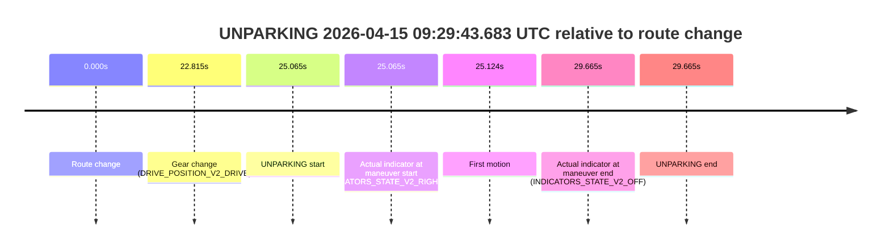

# Run Report: fme20018/2026-04-15--08-45-49--gen2-av-78c06e7c-9310-458b-92c3-a3510ff8b037

| Field | Value |
|---|---|
| Run ID | `fme20018/2026-04-15--08-45-49--gen2-av-78c06e7c-9310-458b-92c3-a3510ff8b037` |
| Date | `2026-04-15` |
| Model(s) | `apricot-crocodile-uproarious` |
| Author | `guy.geva` |
| Event count | `3` |

## unpudo 2026-04-15 09:10:34.083 UTC

| Field | Value |
|---|---|
| Model | `apricot-crocodile-uproarious` |
| Author | `guy.geva` |
| Run ID | `fme20018/2026-04-15--08-45-49--gen2-av-78c06e7c-9310-458b-92c3-a3510ff8b037` |
| Date | `2026-04-15` |
| Time (UTC) | `09:10:34.083` |
| Event type | `unpudo` |
| Disengagement type | `failed_to_unpudo` |
| Route change | `found` |
| Console | [run](https://console.sso.wayve.ai/run/fme20018/2026-04-15--08-45-49--gen2-av-78c06e7c-9310-458b-92c3-a3510ff8b037?id=&time-unixus=1776244234083292) |
| Foxglove | [segment](https://app.foxglove.dev/wayve-on-prem/p/prj_0dX18KZdVHg1fmmI/view?ds=foxglove-stream&ds.deviceName=fme20018&ds.start=2026-04-15T09%3A10%3A13.668329Z&ds.end=2026-04-15T09%3A15%3A13.573227Z&layoutId=lay_0e7VD4WIKDQGU73Y&time=2026-04-15T09%3A10%3A34.083292Z) |

### Event card: non-av

- Non-AV: there is no AV-owned portion anywhere inside the detected unpudo timeline, so it is kept for coverage but excluded from model success / failure scoring.

| Event | Time (UTC) | Delta from route change |
|---|---:|---:|
| Route change | 2026-04-15 09:10:23.668 | `0.000s` |
| AV engage | 2026-04-15 09:10:53.033 | `29.365s` |
| DBW -> true | 2026-04-15 09:10:53.033 | `29.365s` |
| Gear change (DRIVE_POSITION_V2_DRIVE) | 2026-04-15 09:10:24.083 | `0.415s` |
| UNPUDO start | 2026-04-15 09:10:34.083 | `10.415s` |
| Actual indicator at maneuver start (INDICATORS_STATE_V2_RIGHT_ON) | 2026-04-15 09:10:34.083 | `10.415s` |
| First motion | 2026-04-15 09:10:34.142 | `10.474s` |
| DBW -> false | 2026-04-15 09:15:03.573 | `279.905s` |
| Actual indicator at maneuver end (INDICATORS_STATE_V2_OFF) | 2026-04-15 09:10:49.133 | `25.465s` |
| UNPUDO end | 2026-04-15 09:10:49.133 | `25.465s` |

| Metric | Value |
|---|---|
| Outcome | `non-av` |
| Effective failure type | `none` |
| Route change status | `found` |
| DBW at event start | `false` |
| DBW at event end | `false` |
| Predicted gear at AV start | `DRIVE_POSITION_V2_DRIVE` |
| Actual gear at AV start | `DRIVE_POSITION_V2_DRIVE` |
| Predicted gear at event start | `DRIVE_POSITION_V2_DRIVE` |
| Actual gear at event start | `DRIVE_POSITION_V2_DRIVE` |
| Planned indicator direction | `INDICATORS_STATE_V2_RIGHT_ON` |
| Controller indicator direction | `INDICATORS_STATE_V2_RIGHT_ON` |
| Actual indicator direction | `INDICATORS_STATE_V2_RIGHT_ON` |
| Actual indicator at maneuver end | `INDICATORS_STATE_V2_OFF` |
| Driver accel help in AV | `false` |
| Driver accel help timestamp | `n/a` |
| Max accel pedal pct in AV | `0.0%` |
| Max brake pedal pct in AV | `0.0%` |
| Max speed mps in AV | `0.000` |
| Route -> AV | `29.365s` |
| AV -> event start | `-18.950s` |
| AV -> first motion | `-18.891s` |
| AV duration before disengagement | `250.540s` |
| Trajectory waypoint count | `37` |
| Driving-plan step count | `11` |

The scored portion starts from the AV-owned window, not from the pre-AV setup. Route-change search in the stopped pre-event segment was `found`, with the baseline therefore set to route change. At the event anchor the model predicts `DRIVE_POSITION_V2_DRIVE` and the actual gear is `DRIVE_POSITION_V2_DRIVE`. The effective model outcome is `non-av` because `there is no AV-owned overlap inside the event timeline`.

### Resolution

| Field | Value |
|---|---|
| Final outcome | `non-av` |
| Do we agree with this label? | `yes` |
| Source disengagement type | `failed_to_unpudo` |
| Resolved effective failure type | `none` |
| Confidence | `high` |

## unpudo 2026-04-15 09:21:01.433 UTC

| Field | Value |
|---|---|
| Model | `apricot-crocodile-uproarious` |
| Author | `guy.geva` |
| Run ID | `fme20018/2026-04-15--08-45-49--gen2-av-78c06e7c-9310-458b-92c3-a3510ff8b037` |
| Date | `2026-04-15` |
| Time (UTC) | `09:21:01.433` |
| Event type | `unpudo` |
| Disengagement type | `failed_to_unpudo` |
| Route change | `found` |
| Console | [run](https://console.sso.wayve.ai/run/fme20018/2026-04-15--08-45-49--gen2-av-78c06e7c-9310-458b-92c3-a3510ff8b037?id=&time-unixus=1776244861433297) |
| Foxglove | [segment](https://app.foxglove.dev/wayve-on-prem/p/prj_0dX18KZdVHg1fmmI/view?ds=foxglove-stream&ds.deviceName=fme20018&ds.start=2026-04-15T09%3A19%3A11.718963Z&ds.end=2026-04-15T09%3A24%3A58.353267Z&layoutId=lay_0e7VD4WIKDQGU73Y&time=2026-04-15T09%3A21%3A01.433297Z) |

### Event card: non-av

- Non-AV: there is no AV-owned portion anywhere inside the detected unpudo timeline, so it is kept for coverage but excluded from model success / failure scoring.

| Event | Time (UTC) | Delta from route change |
|---|---:|---:|
| Route change | 2026-04-15 09:19:21.718 | `0.000s` |
| AV engage | 2026-04-15 09:21:09.733 | `108.014s` |
| DBW -> true | 2026-04-15 09:21:09.733 | `108.014s` |
| Gear change (DRIVE_POSITION_V2_DRIVE) | 2026-04-15 09:20:58.533 | `96.814s` |
| UNPUDO start | 2026-04-15 09:21:01.433 | `99.714s` |
| Actual indicator at maneuver start (INDICATORS_STATE_V2_RIGHT_ON) | 2026-04-15 09:21:01.433 | `99.714s` |
| First motion | 2026-04-15 09:21:01.462 | `99.743s` |
| DBW -> false | 2026-04-15 09:24:48.353 | `326.634s` |
| Actual indicator at maneuver end (INDICATORS_STATE_V2_OFF) | 2026-04-15 09:21:05.483 | `103.764s` |
| UNPUDO end | 2026-04-15 09:21:05.483 | `103.764s` |

| Metric | Value |
|---|---|
| Outcome | `non-av` |
| Effective failure type | `none` |
| Route change status | `found` |
| DBW at event start | `false` |
| DBW at event end | `false` |
| Predicted gear at AV start | `DRIVE_POSITION_V2_DRIVE` |
| Actual gear at AV start | `DRIVE_POSITION_V2_DRIVE` |
| Predicted gear at event start | `DRIVE_POSITION_V2_DRIVE` |
| Actual gear at event start | `DRIVE_POSITION_V2_DRIVE` |
| Planned indicator direction | `INDICATORS_STATE_V2_RIGHT_ON` |
| Controller indicator direction | `INDICATORS_STATE_V2_RIGHT_ON` |
| Actual indicator direction | `INDICATORS_STATE_V2_RIGHT_ON` |
| Actual indicator at maneuver end | `INDICATORS_STATE_V2_OFF` |
| Driver accel help in AV | `false` |
| Driver accel help timestamp | `n/a` |
| Max accel pedal pct in AV | `0.0%` |
| Max brake pedal pct in AV | `0.0%` |
| Max speed mps in AV | `0.000` |
| Route -> AV | `108.014s` |
| AV -> event start | `-8.300s` |
| AV -> first motion | `-8.271s` |
| AV duration before disengagement | `218.620s` |
| Trajectory waypoint count | `38` |
| Driving-plan step count | `11` |

The scored portion starts from the AV-owned window, not from the pre-AV setup. Route-change search in the stopped pre-event segment was `found`, with the baseline therefore set to route change. At the event anchor the model predicts `DRIVE_POSITION_V2_DRIVE` and the actual gear is `DRIVE_POSITION_V2_DRIVE`. The effective model outcome is `non-av` because `there is no AV-owned overlap inside the event timeline`.

### Resolution

| Field | Value |
|---|---|
| Final outcome | `non-av` |
| Do we agree with this label? | `yes` |
| Source disengagement type | `failed_to_unpudo` |
| Resolved effective failure type | `none` |
| Confidence | `high` |

## unparking 2026-04-15 09:29:43.683 UTC

| Field | Value |
|---|---|
| Model | `apricot-crocodile-uproarious` |
| Author | `guy.geva` |
| Run ID | `fme20018/2026-04-15--08-45-49--gen2-av-78c06e7c-9310-458b-92c3-a3510ff8b037` |
| Date | `2026-04-15` |
| Time (UTC) | `09:29:43.683` |
| Event type | `unparking` |
| Disengagement type | `failed_to_unpudo` |
| Route change | `found` |
| Console | [run](https://console.sso.wayve.ai/run/fme20018/2026-04-15--08-45-49--gen2-av-78c06e7c-9310-458b-92c3-a3510ff8b037?id=&time-unixus=1776245383683295) |
| Foxglove | [segment](https://app.foxglove.dev/wayve-on-prem/p/prj_0dX18KZdVHg1fmmI/view?ds=foxglove-stream&ds.deviceName=fme20018&ds.start=2026-04-15T09%3A29%3A08.618514Z&ds.end=2026-04-15T09%3A29%3A58.283305Z&layoutId=lay_0e7VD4WIKDQGU73Y&time=2026-04-15T09%3A29%3A43.683295Z) |

### Event card: non-av

- Non-AV: there is no AV-owned portion anywhere inside the detected unparking timeline, so it is kept for coverage but excluded from model success / failure scoring.

| Event | Time (UTC) | Delta from route change |
|---|---:|---:|
| Route change | 2026-04-15 09:29:18.618 | `0.000s` |
| Gear change (DRIVE_POSITION_V2_DRIVE) | 2026-04-15 09:29:41.433 | `22.815s` |
| UNPARKING start | 2026-04-15 09:29:43.683 | `25.065s` |
| Actual indicator at maneuver start (INDICATORS_STATE_V2_RIGHT_ON) | 2026-04-15 09:29:43.683 | `25.065s` |
| First motion | 2026-04-15 09:29:43.742 | `25.124s` |
| Actual indicator at maneuver end (INDICATORS_STATE_V2_OFF) | 2026-04-15 09:29:48.283 | `29.665s` |
| UNPARKING end | 2026-04-15 09:29:48.283 | `29.665s` |

| Metric | Value |
|---|---|
| Outcome | `non-av` |
| Effective failure type | `none` |
| Route change status | `found` |
| DBW at event start | `false` |
| DBW at event end | `false` |
| Predicted gear at AV start | `n/a` |
| Actual gear at AV start | `n/a` |
| Predicted gear at event start | `DRIVE_POSITION_V2_DRIVE` |
| Actual gear at event start | `DRIVE_POSITION_V2_DRIVE` |
| Planned indicator direction | `INDICATORS_STATE_V2_OFF` |
| Controller indicator direction | `INDICATORS_STATE_V2_OFF` |
| Actual indicator direction | `INDICATORS_STATE_V2_RIGHT_ON` |
| Actual indicator at maneuver end | `INDICATORS_STATE_V2_OFF` |
| Driver accel help in AV | `false` |
| Driver accel help timestamp | `n/a` |
| Max accel pedal pct in AV | `0.0%` |
| Max brake pedal pct in AV | `0.0%` |
| Max speed mps in AV | `0.000` |
| Route -> AV | `n/a` |
| AV -> event start | `n/a` |
| AV -> first motion | `n/a` |
| AV duration before disengagement | `n/a` |
| Trajectory waypoint count | `37` |
| Driving-plan step count | `11` |

The scored portion starts from the AV-owned window, not from the pre-AV setup. Route-change search in the stopped pre-event segment was `found`, with the baseline therefore set to route change. At the event anchor the model predicts `DRIVE_POSITION_V2_DRIVE` and the actual gear is `DRIVE_POSITION_V2_DRIVE`. The effective model outcome is `non-av` because `there is no AV-owned overlap inside the event timeline`.

### Resolution

| Field | Value |
|---|---|
| Final outcome | `non-av` |
| Do we agree with this label? | `yes` |
| Source disengagement type | `failed_to_unpudo` |
| Resolved effective failure type | `none` |
| Confidence | `high` |
