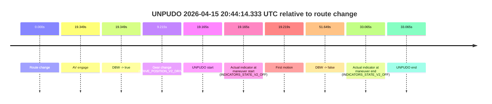
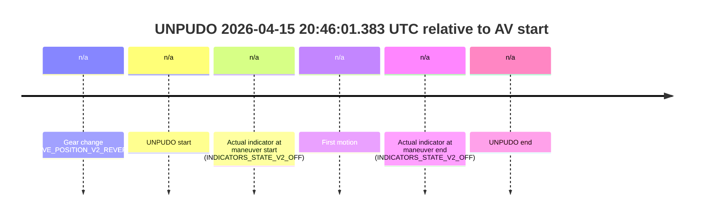

# Run Report: fme20018/2026-04-15--20-28-06--gen2-av-546f5199-5eef-4298-a736-403c53aeb8fc

| Field | Value |
|---|---|
| Run ID | `fme20018/2026-04-15--20-28-06--gen2-av-546f5199-5eef-4298-a736-403c53aeb8fc` |
| Date | `2026-04-15` |
| Model(s) | `satisfied-amber-moose` |
| Author | `guy.geva` |
| Event count | `2` |

## unpudo 2026-04-15 20:44:14.333 UTC

| Field | Value |
|---|---|
| Model | `satisfied-amber-moose` |
| Author | `guy.geva` |
| Run ID | `fme20018/2026-04-15--20-28-06--gen2-av-546f5199-5eef-4298-a736-403c53aeb8fc` |
| Date | `2026-04-15` |
| Time (UTC) | `20:44:14.333` |
| Event type | `unpudo` |
| Disengagement type | `failed_to_unpudo` |
| Route change | `found` |
| Console | [run](https://console.sso.wayve.ai/run/fme20018/2026-04-15--20-28-06--gen2-av-546f5199-5eef-4298-a736-403c53aeb8fc?id=&time-unixus=1776285854333297) |
| Foxglove | [segment](https://app.foxglove.dev/wayve-on-prem/p/prj_0dX18KZdVHg1fmmI/view?ds=foxglove-stream&ds.deviceName=fme20018&ds.start=2026-04-15T20%3A43%3A45.168258Z&ds.end=2026-04-15T20%3A44%3A56.816972Z&layoutId=lay_0e7VD4WIKDQGU73Y&time=2026-04-15T20%3A44%3A14.333297Z) |

### Event card: non-av

- Non-AV: the detected unpudo starts outside AV ownership, so it is kept for coverage but excluded from model success / failure scoring.

| Event | Time (UTC) | Delta from route change |
|---|---:|---:|
| Route change | 2026-04-15 20:43:55.168 | `0.000s` |
| AV engage | 2026-04-15 20:44:14.517 | `19.349s` |
| DBW -> true | 2026-04-15 20:44:14.517 | `19.349s` |
| Gear change (DRIVE_POSITION_V2_DRIVE) | 2026-04-15 20:44:04.383 | `9.215s` |
| UNPUDO start | 2026-04-15 20:44:14.333 | `19.165s` |
| Actual indicator at maneuver start (INDICATORS_STATE_V2_OFF) | 2026-04-15 20:44:14.333 | `19.165s` |
| First motion | 2026-04-15 20:44:14.386 | `19.219s` |
| DBW -> false | 2026-04-15 20:44:46.816 | `51.649s` |
| Actual indicator at maneuver end (INDICATORS_STATE_V2_OFF) | 2026-04-15 20:44:28.233 | `33.065s` |
| UNPUDO end | 2026-04-15 20:44:28.233 | `33.065s` |

| Metric | Value |
|---|---|
| Outcome | `non-av` |
| Effective failure type | `none` |
| Route change status | `found` |
| DBW at event start | `false` |
| DBW at event end | `true` |
| Predicted gear at AV start | `DRIVE_POSITION_V2_DRIVE` |
| Actual gear at AV start | `DRIVE_POSITION_V2_DRIVE` |
| Predicted gear at event start | `DRIVE_POSITION_V2_DRIVE` |
| Actual gear at event start | `DRIVE_POSITION_V2_DRIVE` |
| Planned indicator direction | `INDICATORS_STATE_V2_OFF` |
| Controller indicator direction | `INDICATORS_STATE_V2_OFF` |
| Actual indicator direction | `INDICATORS_STATE_V2_OFF` |
| Actual indicator at maneuver end | `INDICATORS_STATE_V2_OFF` |
| Driver accel help in AV | `false` |
| Driver accel help timestamp | `n/a` |
| Max accel pedal pct in AV | `0.0%` |
| Max brake pedal pct in AV | `4.1%` |
| Max speed mps in AV | `2.442` |
| Route -> AV | `19.349s` |
| AV -> event start | `-0.184s` |
| AV -> first motion | `-0.131s` |
| AV duration before disengagement | `32.299s` |
| Trajectory waypoint count | `35` |
| Driving-plan step count | `11` |

The scored portion starts from the AV-owned window, not from the pre-AV setup. Route-change search in the stopped pre-event segment was `found`, with the baseline therefore set to route change. At the event anchor the model predicts `DRIVE_POSITION_V2_DRIVE` and the actual gear is `DRIVE_POSITION_V2_DRIVE`. The effective model outcome is `non-av` because `the event does not begin in AV ownership`.

### Resolution

| Field | Value |
|---|---|
| Final outcome | `non-av` |
| Do we agree with this label? | `yes` |
| Source disengagement type | `failed_to_unpudo` |
| Resolved effective failure type | `none` |
| Confidence | `high` |

## unpudo 2026-04-15 20:46:01.383 UTC

| Field | Value |
|---|---|
| Model | `satisfied-amber-moose` |
| Author | `guy.geva` |
| Run ID | `fme20018/2026-04-15--20-28-06--gen2-av-546f5199-5eef-4298-a736-403c53aeb8fc` |
| Date | `2026-04-15` |
| Time (UTC) | `20:46:01.383` |
| Event type | `unpudo` |
| Disengagement type | `none observed` |
| Route change | `unclear` |
| Console | [run](https://console.sso.wayve.ai/run/fme20018/2026-04-15--20-28-06--gen2-av-546f5199-5eef-4298-a736-403c53aeb8fc?id=&time-unixus=1776285961383305) |
| Foxglove | [segment](https://app.foxglove.dev/wayve-on-prem/p/prj_0dX18KZdVHg1fmmI/view?ds=foxglove-stream&ds.deviceName=fme20018&ds.start=2026-04-15T20%3A45%3A47.433316Z&ds.end=2026-04-15T20%3A46%3A39.533293Z&layoutId=lay_0e7VD4WIKDQGU73Y&time=2026-04-15T20%3A46%3A01.383305Z) |

### Event card: non-av

- Non-AV: the detected unpudo starts outside AV ownership, so it is kept for coverage but excluded from model success / failure scoring.

| Event | Time (UTC) | Delta from AV start |
|---|---:|---:|
| Gear change (DRIVE_POSITION_V2_REVERSE) | 2026-04-15 20:45:57.433 | `n/a` |
| UNPUDO start | 2026-04-15 20:46:01.383 | `n/a` |
| Actual indicator at maneuver start (INDICATORS_STATE_V2_OFF) | 2026-04-15 20:46:01.383 | `n/a` |
| First motion | 2026-04-15 20:46:09.766 | `n/a` |
| Actual indicator at maneuver end (INDICATORS_STATE_V2_OFF) | 2026-04-15 20:46:29.533 | `n/a` |
| UNPUDO end | 2026-04-15 20:46:29.533 | `n/a` |

| Metric | Value |
|---|---|
| Outcome | `non-av` |
| Effective failure type | `none` |
| Route change status | `unclear` |
| DBW at event start | `false` |
| DBW at event end | `false` |
| Predicted gear at AV start | `n/a` |
| Actual gear at AV start | `n/a` |
| Predicted gear at event start | `DRIVE_POSITION_V2_REVERSE` |
| Actual gear at event start | `DRIVE_POSITION_V2_REVERSE` |
| Planned indicator direction | `INDICATORS_STATE_V2_OFF` |
| Controller indicator direction | `INDICATORS_STATE_V2_OFF` |
| Actual indicator direction | `INDICATORS_STATE_V2_OFF` |
| Actual indicator at maneuver end | `INDICATORS_STATE_V2_OFF` |
| Driver accel help in AV | `false` |
| Driver accel help timestamp | `n/a` |
| Max accel pedal pct in AV | `0.0%` |
| Max brake pedal pct in AV | `0.0%` |
| Max speed mps in AV | `0.000` |
| Route -> AV | `n/a` |
| AV -> event start | `n/a` |
| AV -> first motion | `n/a` |
| AV duration before disengagement | `n/a` |
| Trajectory waypoint count | `36` |
| Driving-plan step count | `11` |

The scored portion starts from the AV-owned window, not from the pre-AV setup. Route-change search in the stopped pre-event segment was `unclear`, with the baseline therefore set to AV start. At the event anchor the model predicts `DRIVE_POSITION_V2_REVERSE` and the actual gear is `DRIVE_POSITION_V2_REVERSE`. The effective model outcome is `non-av` because `the event does not begin in AV ownership`.

### Resolution

| Field | Value |
|---|---|
| Final outcome | `non-av` |
| Do we agree with this label? | `yes` |
| Source disengagement type | `none observed` |
| Resolved effective failure type | `none` |
| Confidence | `medium` |
