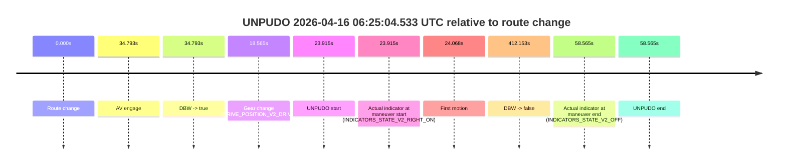
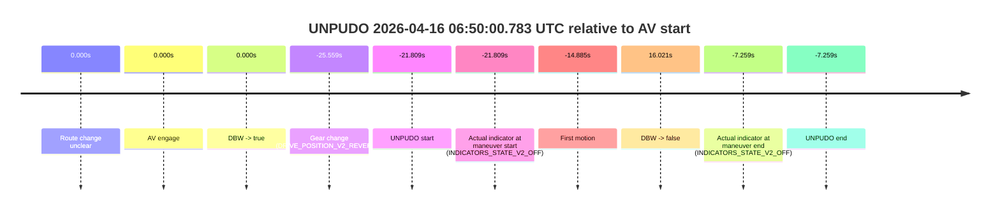
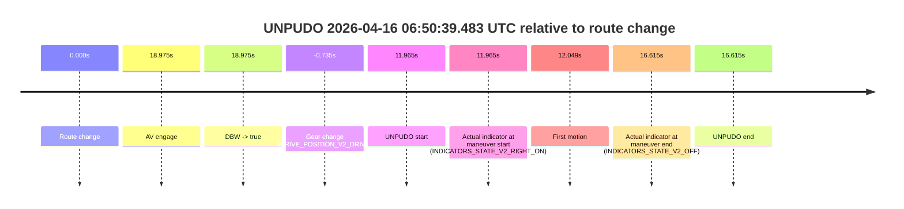

# Run Report: fme20018/2026-04-16--06-12-54--gen2-av-da55f8be-9337-4b00-9191-7039385e61c8

| Field | Value |
|---|---|
| Run ID | `fme20018/2026-04-16--06-12-54--gen2-av-da55f8be-9337-4b00-9191-7039385e61c8` |
| Date | `2026-04-16` |
| Model(s) | `plum-timeless-beaver` |
| Author | `peng.tang` |
| Event count | `5` |

## unpudo 2026-04-16 06:17:02.533 UTC

| Field | Value |
|---|---|
| Model | `plum-timeless-beaver` |
| Author | `peng.tang` |
| Run ID | `fme20018/2026-04-16--06-12-54--gen2-av-da55f8be-9337-4b00-9191-7039385e61c8` |
| Date | `2026-04-16` |
| Time (UTC) | `06:17:02.533` |
| Event type | `unpudo` |
| Disengagement type | `failed_to_unpudo` |
| Route change | `found` |
| Console | [run](https://console.sso.wayve.ai/run/fme20018/2026-04-16--06-12-54--gen2-av-da55f8be-9337-4b00-9191-7039385e61c8?id=&time-unixus=1776320222533305) |
| Foxglove | [segment](https://app.foxglove.dev/wayve-on-prem/p/prj_0dX18KZdVHg1fmmI/view?ds=foxglove-stream&ds.deviceName=fme20018&ds.start=2026-04-16T06%3A16%3A45.768260Z&ds.end=2026-04-16T06%3A17%3A55.083291Z&layoutId=lay_0e7VD4WIKDQGU73Y&time=2026-04-16T06%3A17%3A02.533305Z) |

### Event card: non-av

- Non-AV: the detected unpudo starts outside AV ownership, so it is kept for coverage but excluded from model success / failure scoring.

| Event | Time (UTC) | Delta from route change |
|---|---:|---:|
| Route change | 2026-04-16 06:16:55.768 | `0.000s` |
| AV engage | 2026-04-16 06:17:37.071 | `41.304s` |
| DBW -> true | 2026-04-16 06:17:37.071 | `41.304s` |
| Gear change (DRIVE_POSITION_V2_DRIVE) | 2026-04-16 06:16:56.033 | `0.265s` |
| UNPUDO start | 2026-04-16 06:17:02.533 | `6.765s` |
| Actual indicator at maneuver start (INDICATORS_STATE_V2_OFF) | 2026-04-16 06:17:02.533 | `6.765s` |
| First motion | 2026-04-16 06:17:02.546 | `6.779s` |
| DBW -> false | 2026-04-16 06:17:42.653 | `46.885s` |
| Actual indicator at maneuver end (INDICATORS_STATE_V2_OFF) | 2026-04-16 06:17:45.083 | `49.315s` |
| UNPUDO end | 2026-04-16 06:17:45.083 | `49.315s` |

| Metric | Value |
|---|---|
| Outcome | `non-av` |
| Effective failure type | `none` |
| Route change status | `found` |
| DBW at event start | `false` |
| DBW at event end | `false` |
| Predicted gear at AV start | `DRIVE_POSITION_V2_DRIVE` |
| Actual gear at AV start | `DRIVE_POSITION_V2_PARK` |
| Predicted gear at event start | `DRIVE_POSITION_V2_DRIVE` |
| Actual gear at event start | `DRIVE_POSITION_V2_DRIVE` |
| Planned indicator direction | `INDICATORS_STATE_V2_LEFT_ON` |
| Controller indicator direction | `INDICATORS_STATE_V2_LEFT_ON` |
| Actual indicator direction | `INDICATORS_STATE_V2_OFF` |
| Actual indicator at maneuver end | `INDICATORS_STATE_V2_OFF` |
| Driver accel help in AV | `false` |
| Driver accel help timestamp | `n/a` |
| Max accel pedal pct in AV | `0.0%` |
| Max brake pedal pct in AV | `11.7%` |
| Max speed mps in AV | `0.000` |
| Route -> AV | `41.304s` |
| AV -> event start | `-34.539s` |
| AV -> first motion | `-34.525s` |
| AV duration before disengagement | `5.582s` |
| Trajectory waypoint count | `36` |
| Driving-plan step count | `11` |

The scored portion starts from the AV-owned window, not from the pre-AV setup. Route-change search in the stopped pre-event segment was `found`, with the baseline therefore set to route change. At the event anchor the model predicts `DRIVE_POSITION_V2_DRIVE` and the actual gear is `DRIVE_POSITION_V2_DRIVE`. The effective model outcome is `non-av` because `the event does not begin in AV ownership`.

### Resolution

| Field | Value |
|---|---|
| Final outcome | `non-av` |
| Do we agree with this label? | `yes` |
| Source disengagement type | `failed_to_unpudo` |
| Resolved effective failure type | `none` |
| Confidence | `high` |

## unpudo 2026-04-16 06:25:04.533 UTC

| Field | Value |
|---|---|
| Model | `plum-timeless-beaver` |
| Author | `peng.tang` |
| Run ID | `fme20018/2026-04-16--06-12-54--gen2-av-da55f8be-9337-4b00-9191-7039385e61c8` |
| Date | `2026-04-16` |
| Time (UTC) | `06:25:04.533` |
| Event type | `unpudo` |
| Disengagement type | `failed_to_unpudo` |
| Route change | `found` |
| Console | [run](https://console.sso.wayve.ai/run/fme20018/2026-04-16--06-12-54--gen2-av-da55f8be-9337-4b00-9191-7039385e61c8?id=&time-unixus=1776320704533296) |
| Foxglove | [segment](https://app.foxglove.dev/wayve-on-prem/p/prj_0dX18KZdVHg1fmmI/view?ds=foxglove-stream&ds.deviceName=fme20018&ds.start=2026-04-16T06%3A24%3A30.618426Z&ds.end=2026-04-16T06%3A31%3A42.771748Z&layoutId=lay_0e7VD4WIKDQGU73Y&time=2026-04-16T06%3A25%3A04.533296Z) |

### Event card: non-av

- Non-AV: the detected unpudo starts outside AV ownership, so it is kept for coverage but excluded from model success / failure scoring.

| Event | Time (UTC) | Delta from route change |
|---|---:|---:|
| Route change | 2026-04-16 06:24:40.618 | `0.000s` |
| AV engage | 2026-04-16 06:25:15.411 | `34.793s` |
| DBW -> true | 2026-04-16 06:25:15.411 | `34.793s` |
| Gear change (DRIVE_POSITION_V2_DRIVE) | 2026-04-16 06:24:59.183 | `18.565s` |
| UNPUDO start | 2026-04-16 06:25:04.533 | `23.915s` |
| Actual indicator at maneuver start (INDICATORS_STATE_V2_RIGHT_ON) | 2026-04-16 06:25:04.533 | `23.915s` |
| First motion | 2026-04-16 06:25:04.686 | `24.068s` |
| DBW -> false | 2026-04-16 06:31:32.771 | `412.153s` |
| Actual indicator at maneuver end (INDICATORS_STATE_V2_OFF) | 2026-04-16 06:25:39.183 | `58.565s` |
| UNPUDO end | 2026-04-16 06:25:39.183 | `58.565s` |

| Metric | Value |
|---|---|
| Outcome | `non-av` |
| Effective failure type | `none` |
| Route change status | `found` |
| DBW at event start | `false` |
| DBW at event end | `true` |
| Predicted gear at AV start | `DRIVE_POSITION_V2_DRIVE` |
| Actual gear at AV start | `DRIVE_POSITION_V2_DRIVE` |
| Predicted gear at event start | `DRIVE_POSITION_V2_DRIVE` |
| Actual gear at event start | `DRIVE_POSITION_V2_DRIVE` |
| Planned indicator direction | `INDICATORS_STATE_V2_RIGHT_ON` |
| Controller indicator direction | `INDICATORS_STATE_V2_RIGHT_ON` |
| Actual indicator direction | `INDICATORS_STATE_V2_RIGHT_ON` |
| Actual indicator at maneuver end | `INDICATORS_STATE_V2_OFF` |
| Driver accel help in AV | `false` |
| Driver accel help timestamp | `n/a` |
| Max accel pedal pct in AV | `0.0%` |
| Max brake pedal pct in AV | `11.0%` |
| Max speed mps in AV | `2.250` |
| Route -> AV | `34.793s` |
| AV -> event start | `-10.879s` |
| AV -> first motion | `-10.725s` |
| AV duration before disengagement | `377.360s` |
| Trajectory waypoint count | `36` |
| Driving-plan step count | `11` |

The scored portion starts from the AV-owned window, not from the pre-AV setup. Route-change search in the stopped pre-event segment was `found`, with the baseline therefore set to route change. At the event anchor the model predicts `DRIVE_POSITION_V2_DRIVE` and the actual gear is `DRIVE_POSITION_V2_DRIVE`. The effective model outcome is `non-av` because `the event does not begin in AV ownership`.

### Resolution

| Field | Value |
|---|---|
| Final outcome | `non-av` |
| Do we agree with this label? | `yes` |
| Source disengagement type | `failed_to_unpudo` |
| Resolved effective failure type | `none` |
| Confidence | `high` |

## unpudo 2026-04-16 06:45:43.883 UTC

| Field | Value |
|---|---|
| Model | `plum-timeless-beaver` |
| Author | `peng.tang` |
| Run ID | `fme20018/2026-04-16--06-12-54--gen2-av-da55f8be-9337-4b00-9191-7039385e61c8` |
| Date | `2026-04-16` |
| Time (UTC) | `06:45:43.883` |
| Event type | `unpudo` |
| Disengagement type | `failed_to_unpudo` |
| Route change | `unclear` |
| Console | [run](https://console.sso.wayve.ai/run/fme20018/2026-04-16--06-12-54--gen2-av-da55f8be-9337-4b00-9191-7039385e61c8?id=&time-unixus=1776321943883306) |
| Foxglove | [segment](https://app.foxglove.dev/wayve-on-prem/p/prj_0dX18KZdVHg1fmmI/view?ds=foxglove-stream&ds.deviceName=fme20018&ds.start=2026-04-16T06%3A45%3A32.383316Z&ds.end=2026-04-16T06%3A46%3A24.683296Z&layoutId=lay_0e7VD4WIKDQGU73Y&time=2026-04-16T06%3A45%3A43.883306Z) |

### Event card: non-av

- Non-AV: the detected unpudo starts outside AV ownership, so it is kept for coverage but excluded from model success / failure scoring.

| Event | Time (UTC) | Delta from AV start |
|---|---:|---:|
| Route change unclear | 2026-04-16 06:46:06.431 | `0.000s` |
| AV engage | 2026-04-16 06:46:06.431 | `0.000s` |
| DBW -> true | 2026-04-16 06:46:06.431 | `0.000s` |
| Gear change (DRIVE_POSITION_V2_DRIVE) | 2026-04-16 06:45:42.383 | `-24.049s` |
| UNPUDO start | 2026-04-16 06:45:43.883 | `-22.549s` |
| Actual indicator at maneuver start (INDICATORS_STATE_V2_OFF) | 2026-04-16 06:45:43.883 | `-22.549s` |
| First motion | 2026-04-16 06:45:44.006 | `-22.425s` |
| DBW -> false | 2026-04-16 06:46:09.894 | `3.462s` |
| Actual indicator at maneuver end (INDICATORS_STATE_V2_OFF) | 2026-04-16 06:46:14.683 | `8.251s` |
| UNPUDO end | 2026-04-16 06:46:14.683 | `8.251s` |

| Metric | Value |
|---|---|
| Outcome | `non-av` |
| Effective failure type | `none` |
| Route change status | `unclear` |
| DBW at event start | `false` |
| DBW at event end | `false` |
| Predicted gear at AV start | `DRIVE_POSITION_V2_DRIVE` |
| Actual gear at AV start | `DRIVE_POSITION_V2_PARK` |
| Predicted gear at event start | `DRIVE_POSITION_V2_DRIVE` |
| Actual gear at event start | `DRIVE_POSITION_V2_DRIVE` |
| Planned indicator direction | `INDICATORS_STATE_V2_OFF` |
| Controller indicator direction | `INDICATORS_STATE_V2_OFF` |
| Actual indicator direction | `INDICATORS_STATE_V2_OFF` |
| Actual indicator at maneuver end | `INDICATORS_STATE_V2_OFF` |
| Driver accel help in AV | `false` |
| Driver accel help timestamp | `n/a` |
| Max accel pedal pct in AV | `0.0%` |
| Max brake pedal pct in AV | `8.0%` |
| Max speed mps in AV | `0.000` |
| Route -> AV | `n/a` |
| AV -> event start | `-22.549s` |
| AV -> first motion | `-22.425s` |
| AV duration before disengagement | `3.462s` |
| Trajectory waypoint count | `37` |
| Driving-plan step count | `11` |

The scored portion starts from the AV-owned window, not from the pre-AV setup. Route-change search in the stopped pre-event segment was `unclear`, with the baseline therefore set to AV start. At the event anchor the model predicts `DRIVE_POSITION_V2_DRIVE` and the actual gear is `DRIVE_POSITION_V2_DRIVE`. The effective model outcome is `non-av` because `the event does not begin in AV ownership`.

### Resolution

| Field | Value |
|---|---|
| Final outcome | `non-av` |
| Do we agree with this label? | `yes` |
| Source disengagement type | `failed_to_unpudo` |
| Resolved effective failure type | `none` |
| Confidence | `medium` |

## unpudo 2026-04-16 06:50:00.783 UTC

| Field | Value |
|---|---|
| Model | `plum-timeless-beaver` |
| Author | `peng.tang` |
| Run ID | `fme20018/2026-04-16--06-12-54--gen2-av-da55f8be-9337-4b00-9191-7039385e61c8` |
| Date | `2026-04-16` |
| Time (UTC) | `06:50:00.783` |
| Event type | `unpudo` |
| Disengagement type | `failed_to_pudo` |
| Route change | `unclear` |
| Console | [run](https://console.sso.wayve.ai/run/fme20018/2026-04-16--06-12-54--gen2-av-da55f8be-9337-4b00-9191-7039385e61c8?id=&time-unixus=1776322200783310) |
| Foxglove | [segment](https://app.foxglove.dev/wayve-on-prem/p/prj_0dX18KZdVHg1fmmI/view?ds=foxglove-stream&ds.deviceName=fme20018&ds.start=2026-04-16T06%3A49%3A47.033296Z&ds.end=2026-04-16T06%3A50%3A48.612771Z&layoutId=lay_0e7VD4WIKDQGU73Y&time=2026-04-16T06%3A50%3A00.783310Z) |

### Event card: accidental

- Accidental: AV ownership is present for less than `2s`, so this is treated as an accidental brush with the maneuver rather than a meaningful model attempt.

| Event | Time (UTC) | Delta from AV start |
|---|---:|---:|
| Route change unclear | 2026-04-16 06:50:22.591 | `0.000s` |
| AV engage | 2026-04-16 06:50:22.591 | `0.000s` |
| DBW -> true | 2026-04-16 06:50:22.591 | `0.000s` |
| Gear change (DRIVE_POSITION_V2_REVERSE) | 2026-04-16 06:49:57.033 | `-25.559s` |
| UNPUDO start | 2026-04-16 06:50:00.783 | `-21.809s` |
| Actual indicator at maneuver start (INDICATORS_STATE_V2_OFF) | 2026-04-16 06:50:00.783 | `-21.809s` |
| First motion | 2026-04-16 06:50:07.706 | `-14.885s` |
| DBW -> false | 2026-04-16 06:50:38.612 | `16.021s` |
| Actual indicator at maneuver end (INDICATORS_STATE_V2_OFF) | 2026-04-16 06:50:15.333 | `-7.259s` |
| UNPUDO end | 2026-04-16 06:50:15.333 | `-7.259s` |

| Metric | Value |
|---|---|
| Outcome | `accidental` |
| Effective failure type | `none` |
| Route change status | `unclear` |
| DBW at event start | `false` |
| DBW at event end | `false` |
| Predicted gear at AV start | `DRIVE_POSITION_V2_REVERSE` |
| Actual gear at AV start | `DRIVE_POSITION_V2_PARK` |
| Predicted gear at event start | `DRIVE_POSITION_V2_REVERSE` |
| Actual gear at event start | `DRIVE_POSITION_V2_REVERSE` |
| Planned indicator direction | `INDICATORS_STATE_V2_OFF` |
| Controller indicator direction | `INDICATORS_STATE_V2_OFF` |
| Actual indicator direction | `INDICATORS_STATE_V2_OFF` |
| Actual indicator at maneuver end | `INDICATORS_STATE_V2_OFF` |
| Driver accel help in AV | `false` |
| Driver accel help timestamp | `n/a` |
| Max accel pedal pct in AV | `0.0%` |
| Max brake pedal pct in AV | `0.0%` |
| Max speed mps in AV | `0.000` |
| Route -> AV | `n/a` |
| AV -> event start | `-21.809s` |
| AV -> first motion | `-14.885s` |
| AV duration before disengagement | `16.021s` |
| Trajectory waypoint count | `37` |
| Driving-plan step count | `11` |

The scored portion starts from the AV-owned window, not from the pre-AV setup. Route-change search in the stopped pre-event segment was `unclear`, with the baseline therefore set to AV start. At the event anchor the model predicts `DRIVE_POSITION_V2_REVERSE` and the actual gear is `DRIVE_POSITION_V2_REVERSE`. The effective model outcome is `accidental` because `the AV-owned portion is shorter than 2s`.

### Resolution

| Field | Value |
|---|---|
| Final outcome | `accidental` |
| Do we agree with this label? | `yes` |
| Source disengagement type | `failed_to_pudo` |
| Resolved effective failure type | `none` |
| Confidence | `medium` |

## unpudo 2026-04-16 06:50:39.483 UTC

| Field | Value |
|---|---|
| Model | `plum-timeless-beaver` |
| Author | `peng.tang` |
| Run ID | `fme20018/2026-04-16--06-12-54--gen2-av-da55f8be-9337-4b00-9191-7039385e61c8` |
| Date | `2026-04-16` |
| Time (UTC) | `06:50:39.483` |
| Event type | `unpudo` |
| Disengagement type | `failed_to_unpudo` |
| Route change | `found` |
| Console | [run](https://console.sso.wayve.ai/run/fme20018/2026-04-16--06-12-54--gen2-av-da55f8be-9337-4b00-9191-7039385e61c8?id=&time-unixus=1776322239483302) |
| Foxglove | [segment](https://app.foxglove.dev/wayve-on-prem/p/prj_0dX18KZdVHg1fmmI/view?ds=foxglove-stream&ds.deviceName=fme20018&ds.start=2026-04-16T06%3A50%3A16.783298Z&ds.end=2026-04-16T06%3A50%3A54.133300Z&layoutId=lay_0e7VD4WIKDQGU73Y&time=2026-04-16T06%3A50%3A39.483302Z) |

### Event card: accidental

- Accidental: AV ownership is present for less than `2s`, so this is treated as an accidental brush with the maneuver rather than a meaningful model attempt.

| Event | Time (UTC) | Delta from route change |
|---|---:|---:|
| Route change | 2026-04-16 06:50:27.518 | `0.000s` |
| AV engage | 2026-04-16 06:50:46.492 | `18.975s` |
| DBW -> true | 2026-04-16 06:50:46.492 | `18.975s` |
| Gear change (DRIVE_POSITION_V2_DRIVE) | 2026-04-16 06:50:26.783 | `-0.735s` |
| UNPUDO start | 2026-04-16 06:50:39.483 | `11.965s` |
| Actual indicator at maneuver start (INDICATORS_STATE_V2_RIGHT_ON) | 2026-04-16 06:50:39.483 | `11.965s` |
| First motion | 2026-04-16 06:50:39.566 | `12.049s` |
| Actual indicator at maneuver end (INDICATORS_STATE_V2_OFF) | 2026-04-16 06:50:44.133 | `16.615s` |
| UNPUDO end | 2026-04-16 06:50:44.133 | `16.615s` |

| Metric | Value |
|---|---|
| Outcome | `accidental` |
| Effective failure type | `none` |
| Route change status | `found` |
| DBW at event start | `false` |
| DBW at event end | `false` |
| Predicted gear at AV start | `DRIVE_POSITION_V2_DRIVE` |
| Actual gear at AV start | `DRIVE_POSITION_V2_DRIVE` |
| Predicted gear at event start | `DRIVE_POSITION_V2_DRIVE` |
| Actual gear at event start | `DRIVE_POSITION_V2_DRIVE` |
| Planned indicator direction | `INDICATORS_STATE_V2_RIGHT_ON` |
| Controller indicator direction | `INDICATORS_STATE_V2_RIGHT_ON` |
| Actual indicator direction | `INDICATORS_STATE_V2_RIGHT_ON` |
| Actual indicator at maneuver end | `INDICATORS_STATE_V2_OFF` |
| Driver accel help in AV | `false` |
| Driver accel help timestamp | `n/a` |
| Max accel pedal pct in AV | `0.0%` |
| Max brake pedal pct in AV | `0.0%` |
| Max speed mps in AV | `0.000` |
| Route -> AV | `18.975s` |
| AV -> event start | `-7.010s` |
| AV -> first motion | `-6.926s` |
| AV duration before disengagement | `n/a` |
| Trajectory waypoint count | `37` |
| Driving-plan step count | `11` |

The scored portion starts from the AV-owned window, not from the pre-AV setup. Route-change search in the stopped pre-event segment was `found`, with the baseline therefore set to route change. At the event anchor the model predicts `DRIVE_POSITION_V2_DRIVE` and the actual gear is `DRIVE_POSITION_V2_DRIVE`. The effective model outcome is `accidental` because `the AV-owned portion is shorter than 2s`.

### Resolution

| Field | Value |
|---|---|
| Final outcome | `accidental` |
| Do we agree with this label? | `yes` |
| Source disengagement type | `failed_to_unpudo` |
| Resolved effective failure type | `none` |
| Confidence | `high` |
