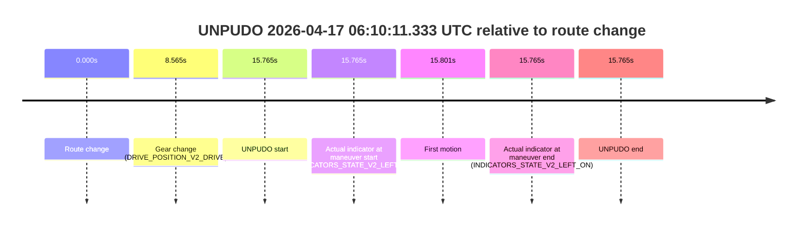
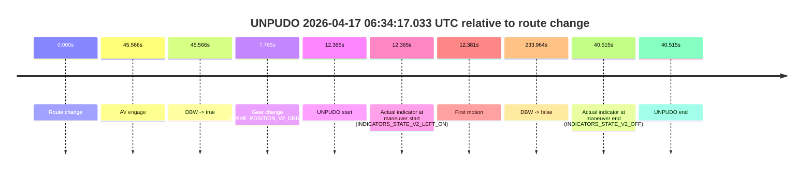
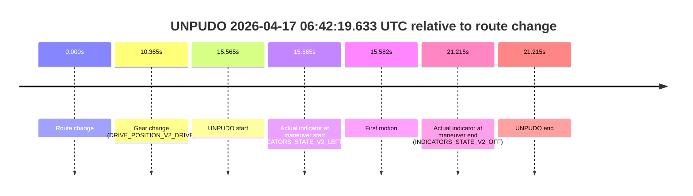
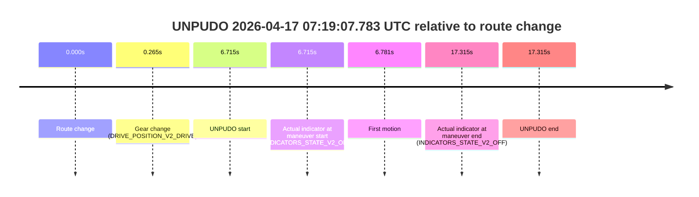
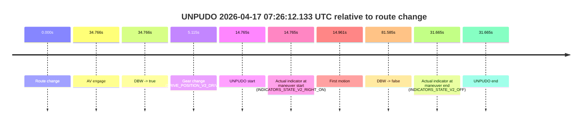
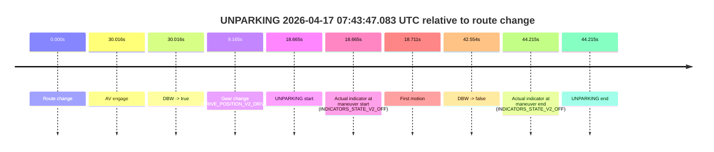

# Run Report: fme20018/2026-04-17--05-57-02--gen2-av-d45ee9dd-20b3-4f55-abd8-db430f613455

| Field | Value |
|---|---|
| Run ID | `fme20018/2026-04-17--05-57-02--gen2-av-d45ee9dd-20b3-4f55-abd8-db430f613455` |
| Date | `2026-04-17` |
| Model(s) | `plum-timeless-beaver` |
| Author | `peng.tang` |
| Event count | `20` |

## unpudo 2026-04-17 06:10:11.333 UTC

| Field | Value |
|---|---|
| Model | `plum-timeless-beaver` |
| Author | `peng.tang` |
| Run ID | `fme20018/2026-04-17--05-57-02--gen2-av-d45ee9dd-20b3-4f55-abd8-db430f613455` |
| Date | `2026-04-17` |
| Time (UTC) | `06:10:11.333` |
| Event type | `unpudo` |
| Disengagement type | `none observed` |
| Route change | `found` |
| Console | [run](https://console.sso.wayve.ai/run/fme20018/2026-04-17--05-57-02--gen2-av-d45ee9dd-20b3-4f55-abd8-db430f613455?id=&time-unixus=1776406211333308) |
| Foxglove | [segment](https://app.foxglove.dev/wayve-on-prem/p/prj_0dX18KZdVHg1fmmI/view?ds=foxglove-stream&ds.deviceName=fme20018&ds.start=2026-04-17T06%3A09%3A45.568288Z&ds.end=2026-04-17T06%3A10%3A21.333308Z&layoutId=lay_0e7VD4WIKDQGU73Y&time=2026-04-17T06%3A10%3A11.333308Z) |

### Event card: non-av

- Non-AV: there is no AV-owned portion anywhere inside the detected unpudo timeline, so it is kept for coverage but excluded from model success / failure scoring.

| Event | Time (UTC) | Delta from route change |
|---|---:|---:|
| Route change | 2026-04-17 06:09:55.568 | `0.000s` |
| Gear change (DRIVE_POSITION_V2_DRIVE) | 2026-04-17 06:10:04.133 | `8.565s` |
| UNPUDO start | 2026-04-17 06:10:11.333 | `15.765s` |
| Actual indicator at maneuver start (INDICATORS_STATE_V2_LEFT_ON) | 2026-04-17 06:10:11.333 | `15.765s` |
| First motion | 2026-04-17 06:10:11.369 | `15.801s` |
| Actual indicator at maneuver end (INDICATORS_STATE_V2_LEFT_ON) | 2026-04-17 06:10:11.333 | `15.765s` |
| UNPUDO end | 2026-04-17 06:10:11.333 | `15.765s` |

| Metric | Value |
|---|---|
| Outcome | `non-av` |
| Effective failure type | `none` |
| Route change status | `found` |
| DBW at event start | `false` |
| DBW at event end | `false` |
| Predicted gear at AV start | `n/a` |
| Actual gear at AV start | `n/a` |
| Predicted gear at event start | `DRIVE_POSITION_V2_DRIVE` |
| Actual gear at event start | `DRIVE_POSITION_V2_DRIVE` |
| Planned indicator direction | `INDICATORS_STATE_V2_LEFT_ON` |
| Controller indicator direction | `INDICATORS_STATE_V2_LEFT_ON` |
| Actual indicator direction | `INDICATORS_STATE_V2_LEFT_ON` |
| Actual indicator at maneuver end | `INDICATORS_STATE_V2_LEFT_ON` |
| Driver accel help in AV | `false` |
| Driver accel help timestamp | `n/a` |
| Max accel pedal pct in AV | `0.0%` |
| Max brake pedal pct in AV | `0.0%` |
| Max speed mps in AV | `0.000` |
| Route -> AV | `n/a` |
| AV -> event start | `n/a` |
| AV -> first motion | `n/a` |
| AV duration before disengagement | `n/a` |
| Trajectory waypoint count | `36` |
| Driving-plan step count | `11` |

The scored portion starts from the AV-owned window, not from the pre-AV setup. Route-change search in the stopped pre-event segment was `found`, with the baseline therefore set to route change. At the event anchor the model predicts `DRIVE_POSITION_V2_DRIVE` and the actual gear is `DRIVE_POSITION_V2_DRIVE`. The effective model outcome is `non-av` because `there is no AV-owned overlap inside the event timeline`.

### Resolution

| Field | Value |
|---|---|
| Final outcome | `non-av` |
| Do we agree with this label? | `yes` |
| Source disengagement type | `none observed` |
| Resolved effective failure type | `none` |
| Confidence | `high` |

## unpudo 2026-04-17 06:10:22.633 UTC

| Field | Value |
|---|---|
| Model | `plum-timeless-beaver` |
| Author | `peng.tang` |
| Run ID | `fme20018/2026-04-17--05-57-02--gen2-av-d45ee9dd-20b3-4f55-abd8-db430f613455` |
| Date | `2026-04-17` |
| Time (UTC) | `06:10:22.633` |
| Event type | `unpudo` |
| Disengagement type | `none observed` |
| Route change | `found` |
| Console | [run](https://console.sso.wayve.ai/run/fme20018/2026-04-17--05-57-02--gen2-av-d45ee9dd-20b3-4f55-abd8-db430f613455?id=&time-unixus=1776406222633293) |
| Foxglove | [segment](https://app.foxglove.dev/wayve-on-prem/p/prj_0dX18KZdVHg1fmmI/view?ds=foxglove-stream&ds.deviceName=fme20018&ds.start=2026-04-17T06%3A09%3A45.568288Z&ds.end=2026-04-17T06%3A10%3A50.783318Z&layoutId=lay_0e7VD4WIKDQGU73Y&time=2026-04-17T06%3A10%3A22.633293Z) |

### Event card: non-av

- Non-AV: there is no AV-owned portion anywhere inside the detected unpudo timeline, so it is kept for coverage but excluded from model success / failure scoring.

| Event | Time (UTC) | Delta from route change |
|---|---:|---:|
| Route change | 2026-04-17 06:09:55.568 | `0.000s` |
| Gear change (DRIVE_POSITION_V2_REVERSE) | 2026-04-17 06:10:22.483 | `26.915s` |
| UNPUDO start | 2026-04-17 06:10:22.633 | `27.065s` |
| Actual indicator at maneuver start (INDICATORS_STATE_V2_OFF) | 2026-04-17 06:10:22.633 | `27.065s` |
| First motion | 2026-04-17 06:10:22.689 | `27.121s` |
| Actual indicator at maneuver end (INDICATORS_STATE_V2_OFF) | 2026-04-17 06:10:40.783 | `45.215s` |
| UNPUDO end | 2026-04-17 06:10:40.783 | `45.215s` |

| Metric | Value |
|---|---|
| Outcome | `non-av` |
| Effective failure type | `none` |
| Route change status | `found` |
| DBW at event start | `false` |
| DBW at event end | `false` |
| Predicted gear at AV start | `n/a` |
| Actual gear at AV start | `n/a` |
| Predicted gear at event start | `DRIVE_POSITION_V2_DRIVE` |
| Actual gear at event start | `DRIVE_POSITION_V2_REVERSE` |
| Planned indicator direction | `INDICATORS_STATE_V2_OFF` |
| Controller indicator direction | `INDICATORS_STATE_V2_OFF` |
| Actual indicator direction | `INDICATORS_STATE_V2_OFF` |
| Actual indicator at maneuver end | `INDICATORS_STATE_V2_OFF` |
| Driver accel help in AV | `false` |
| Driver accel help timestamp | `n/a` |
| Max accel pedal pct in AV | `0.0%` |
| Max brake pedal pct in AV | `0.0%` |
| Max speed mps in AV | `0.000` |
| Route -> AV | `n/a` |
| AV -> event start | `n/a` |
| AV -> first motion | `n/a` |
| AV duration before disengagement | `n/a` |
| Trajectory waypoint count | `36` |
| Driving-plan step count | `11` |

The scored portion starts from the AV-owned window, not from the pre-AV setup. Route-change search in the stopped pre-event segment was `found`, with the baseline therefore set to route change. At the event anchor the model predicts `DRIVE_POSITION_V2_DRIVE` and the actual gear is `DRIVE_POSITION_V2_REVERSE`. The effective model outcome is `non-av` because `there is no AV-owned overlap inside the event timeline`.

### Resolution

| Field | Value |
|---|---|
| Final outcome | `non-av` |
| Do we agree with this label? | `yes` |
| Source disengagement type | `none observed` |
| Resolved effective failure type | `none` |
| Confidence | `high` |

## unpudo 2026-04-17 06:13:16.033 UTC

| Field | Value |
|---|---|
| Model | `plum-timeless-beaver` |
| Author | `peng.tang` |
| Run ID | `fme20018/2026-04-17--05-57-02--gen2-av-d45ee9dd-20b3-4f55-abd8-db430f613455` |
| Date | `2026-04-17` |
| Time (UTC) | `06:13:16.033` |
| Event type | `unpudo` |
| Disengagement type | `none observed` |
| Route change | `found` |
| Console | [run](https://console.sso.wayve.ai/run/fme20018/2026-04-17--05-57-02--gen2-av-d45ee9dd-20b3-4f55-abd8-db430f613455?id=&time-unixus=1776406396033302) |
| Foxglove | [segment](https://app.foxglove.dev/wayve-on-prem/p/prj_0dX18KZdVHg1fmmI/view?ds=foxglove-stream&ds.deviceName=fme20018&ds.start=2026-04-17T06%3A13%3A00.818395Z&ds.end=2026-04-17T06%3A14%3A43.312103Z&layoutId=lay_0e7VD4WIKDQGU73Y&time=2026-04-17T06%3A13%3A16.033302Z) |

### Event card: non-av

- Non-AV: there is no AV-owned portion anywhere inside the detected unpudo timeline, so it is kept for coverage but excluded from model success / failure scoring.

| Event | Time (UTC) | Delta from route change |
|---|---:|---:|
| Route change | 2026-04-17 06:13:10.818 | `0.000s` |
| AV engage | 2026-04-17 06:13:24.273 | `13.456s` |
| DBW -> true | 2026-04-17 06:13:24.273 | `13.456s` |
| Gear change (DRIVE_POSITION_V2_DRIVE) | 2026-04-17 06:13:11.833 | `1.015s` |
| UNPUDO start | 2026-04-17 06:13:16.033 | `5.215s` |
| Actual indicator at maneuver start (INDICATORS_STATE_V2_RIGHT_ON) | 2026-04-17 06:13:16.033 | `5.215s` |
| First motion | 2026-04-17 06:13:16.089 | `5.271s` |
| DBW -> false | 2026-04-17 06:14:33.312 | `82.494s` |
| Actual indicator at maneuver end (INDICATORS_STATE_V2_OFF) | 2026-04-17 06:13:20.933 | `10.115s` |
| UNPUDO end | 2026-04-17 06:13:20.933 | `10.115s` |

| Metric | Value |
|---|---|
| Outcome | `non-av` |
| Effective failure type | `none` |
| Route change status | `found` |
| DBW at event start | `false` |
| DBW at event end | `false` |
| Predicted gear at AV start | `DRIVE_POSITION_V2_DRIVE` |
| Actual gear at AV start | `DRIVE_POSITION_V2_DRIVE` |
| Predicted gear at event start | `DRIVE_POSITION_V2_DRIVE` |
| Actual gear at event start | `DRIVE_POSITION_V2_DRIVE` |
| Planned indicator direction | `INDICATORS_STATE_V2_RIGHT_ON` |
| Controller indicator direction | `INDICATORS_STATE_V2_RIGHT_ON` |
| Actual indicator direction | `INDICATORS_STATE_V2_RIGHT_ON` |
| Actual indicator at maneuver end | `INDICATORS_STATE_V2_OFF` |
| Driver accel help in AV | `false` |
| Driver accel help timestamp | `n/a` |
| Max accel pedal pct in AV | `0.0%` |
| Max brake pedal pct in AV | `0.0%` |
| Max speed mps in AV | `0.000` |
| Route -> AV | `13.456s` |
| AV -> event start | `-8.241s` |
| AV -> first motion | `-8.184s` |
| AV duration before disengagement | `69.038s` |
| Trajectory waypoint count | `36` |
| Driving-plan step count | `11` |

The scored portion starts from the AV-owned window, not from the pre-AV setup. Route-change search in the stopped pre-event segment was `found`, with the baseline therefore set to route change. At the event anchor the model predicts `DRIVE_POSITION_V2_DRIVE` and the actual gear is `DRIVE_POSITION_V2_DRIVE`. The effective model outcome is `non-av` because `there is no AV-owned overlap inside the event timeline`.

### Resolution

| Field | Value |
|---|---|
| Final outcome | `non-av` |
| Do we agree with this label? | `yes` |
| Source disengagement type | `none observed` |
| Resolved effective failure type | `none` |
| Confidence | `high` |

## unpudo 2026-04-17 06:16:28.433 UTC

| Field | Value |
|---|---|
| Model | `plum-timeless-beaver` |
| Author | `peng.tang` |
| Run ID | `fme20018/2026-04-17--05-57-02--gen2-av-d45ee9dd-20b3-4f55-abd8-db430f613455` |
| Date | `2026-04-17` |
| Time (UTC) | `06:16:28.433` |
| Event type | `unpudo` |
| Disengagement type | `none observed` |
| Route change | `found` |
| Console | [run](https://console.sso.wayve.ai/run/fme20018/2026-04-17--05-57-02--gen2-av-d45ee9dd-20b3-4f55-abd8-db430f613455?id=&time-unixus=1776406588433316) |
| Foxglove | [segment](https://app.foxglove.dev/wayve-on-prem/p/prj_0dX18KZdVHg1fmmI/view?ds=foxglove-stream&ds.deviceName=fme20018&ds.start=2026-04-17T06%3A16%3A12.118257Z&ds.end=2026-04-17T06%3A17%3A58.612643Z&layoutId=lay_0e7VD4WIKDQGU73Y&time=2026-04-17T06%3A16%3A28.433316Z) |

### Event card: non-av

- Non-AV: there is no AV-owned portion anywhere inside the detected unpudo timeline, so it is kept for coverage but excluded from model success / failure scoring.

| Event | Time (UTC) | Delta from route change |
|---|---:|---:|
| Route change | 2026-04-17 06:16:22.118 | `0.000s` |
| AV engage | 2026-04-17 06:16:34.012 | `11.894s` |
| DBW -> true | 2026-04-17 06:16:34.012 | `11.894s` |
| Gear change (DRIVE_POSITION_V2_DRIVE) | 2026-04-17 06:16:24.333 | `2.215s` |
| UNPUDO start | 2026-04-17 06:16:28.433 | `6.315s` |
| Actual indicator at maneuver start (INDICATORS_STATE_V2_RIGHT_ON) | 2026-04-17 06:16:28.433 | `6.315s` |
| First motion | 2026-04-17 06:16:28.489 | `6.371s` |
| DBW -> false | 2026-04-17 06:17:48.612 | `86.494s` |
| Actual indicator at maneuver end (INDICATORS_STATE_V2_OFF) | 2026-04-17 06:16:31.633 | `9.515s` |
| UNPUDO end | 2026-04-17 06:16:31.633 | `9.515s` |

| Metric | Value |
|---|---|
| Outcome | `non-av` |
| Effective failure type | `none` |
| Route change status | `found` |
| DBW at event start | `false` |
| DBW at event end | `false` |
| Predicted gear at AV start | `DRIVE_POSITION_V2_DRIVE` |
| Actual gear at AV start | `DRIVE_POSITION_V2_DRIVE` |
| Predicted gear at event start | `DRIVE_POSITION_V2_DRIVE` |
| Actual gear at event start | `DRIVE_POSITION_V2_DRIVE` |
| Planned indicator direction | `INDICATORS_STATE_V2_RIGHT_ON` |
| Controller indicator direction | `INDICATORS_STATE_V2_RIGHT_ON` |
| Actual indicator direction | `INDICATORS_STATE_V2_RIGHT_ON` |
| Actual indicator at maneuver end | `INDICATORS_STATE_V2_OFF` |
| Driver accel help in AV | `false` |
| Driver accel help timestamp | `n/a` |
| Max accel pedal pct in AV | `0.0%` |
| Max brake pedal pct in AV | `0.0%` |
| Max speed mps in AV | `0.000` |
| Route -> AV | `11.894s` |
| AV -> event start | `-5.579s` |
| AV -> first motion | `-5.523s` |
| AV duration before disengagement | `74.600s` |
| Trajectory waypoint count | `36` |
| Driving-plan step count | `11` |

The scored portion starts from the AV-owned window, not from the pre-AV setup. Route-change search in the stopped pre-event segment was `found`, with the baseline therefore set to route change. At the event anchor the model predicts `DRIVE_POSITION_V2_DRIVE` and the actual gear is `DRIVE_POSITION_V2_DRIVE`. The effective model outcome is `non-av` because `there is no AV-owned overlap inside the event timeline`.

### Resolution

| Field | Value |
|---|---|
| Final outcome | `non-av` |
| Do we agree with this label? | `yes` |
| Source disengagement type | `none observed` |
| Resolved effective failure type | `none` |
| Confidence | `high` |

## unpudo 2026-04-17 06:18:19.233 UTC

| Field | Value |
|---|---|
| Model | `plum-timeless-beaver` |
| Author | `peng.tang` |
| Run ID | `fme20018/2026-04-17--05-57-02--gen2-av-d45ee9dd-20b3-4f55-abd8-db430f613455` |
| Date | `2026-04-17` |
| Time (UTC) | `06:18:19.233` |
| Event type | `unpudo` |
| Disengagement type | `none observed` |
| Route change | `found` |
| Console | [run](https://console.sso.wayve.ai/run/fme20018/2026-04-17--05-57-02--gen2-av-d45ee9dd-20b3-4f55-abd8-db430f613455?id=&time-unixus=1776406699233308) |
| Foxglove | [segment](https://app.foxglove.dev/wayve-on-prem/p/prj_0dX18KZdVHg1fmmI/view?ds=foxglove-stream&ds.deviceName=fme20018&ds.start=2026-04-17T06%3A16%3A12.118257Z&ds.end=2026-04-17T06%3A20%3A16.312635Z&layoutId=lay_0e7VD4WIKDQGU73Y&time=2026-04-17T06%3A18%3A19.233308Z) |

### Event card: non-av

- Non-AV: there is no AV-owned portion anywhere inside the detected unpudo timeline, so it is kept for coverage but excluded from model success / failure scoring.

| Event | Time (UTC) | Delta from route change |
|---|---:|---:|
| Route change | 2026-04-17 06:16:22.118 | `0.000s` |
| AV engage | 2026-04-17 06:18:23.273 | `121.156s` |
| DBW -> true | 2026-04-17 06:18:23.273 | `121.156s` |
| Gear change (DRIVE_POSITION_V2_DRIVE) | 2026-04-17 06:18:13.033 | `110.915s` |
| UNPUDO start | 2026-04-17 06:18:19.233 | `117.115s` |
| Actual indicator at maneuver start (INDICATORS_STATE_V2_RIGHT_ON) | 2026-04-17 06:18:19.233 | `117.115s` |
| First motion | 2026-04-17 06:18:19.289 | `117.171s` |
| DBW -> false | 2026-04-17 06:20:06.312 | `224.194s` |
| Actual indicator at maneuver end (INDICATORS_STATE_V2_OFF) | 2026-04-17 06:18:22.933 | `120.815s` |
| UNPUDO end | 2026-04-17 06:18:22.933 | `120.815s` |

| Metric | Value |
|---|---|
| Outcome | `non-av` |
| Effective failure type | `none` |
| Route change status | `found` |
| DBW at event start | `false` |
| DBW at event end | `false` |
| Predicted gear at AV start | `DRIVE_POSITION_V2_DRIVE` |
| Actual gear at AV start | `DRIVE_POSITION_V2_DRIVE` |
| Predicted gear at event start | `DRIVE_POSITION_V2_DRIVE` |
| Actual gear at event start | `DRIVE_POSITION_V2_DRIVE` |
| Planned indicator direction | `INDICATORS_STATE_V2_OFF` |
| Controller indicator direction | `INDICATORS_STATE_V2_OFF` |
| Actual indicator direction | `INDICATORS_STATE_V2_RIGHT_ON` |
| Actual indicator at maneuver end | `INDICATORS_STATE_V2_OFF` |
| Driver accel help in AV | `false` |
| Driver accel help timestamp | `n/a` |
| Max accel pedal pct in AV | `0.0%` |
| Max brake pedal pct in AV | `0.0%` |
| Max speed mps in AV | `0.000` |
| Route -> AV | `121.156s` |
| AV -> event start | `-4.041s` |
| AV -> first motion | `-3.984s` |
| AV duration before disengagement | `103.039s` |
| Trajectory waypoint count | `36` |
| Driving-plan step count | `11` |

The scored portion starts from the AV-owned window, not from the pre-AV setup. Route-change search in the stopped pre-event segment was `found`, with the baseline therefore set to route change. At the event anchor the model predicts `DRIVE_POSITION_V2_DRIVE` and the actual gear is `DRIVE_POSITION_V2_DRIVE`. The effective model outcome is `non-av` because `there is no AV-owned overlap inside the event timeline`.

### Resolution

| Field | Value |
|---|---|
| Final outcome | `non-av` |
| Do we agree with this label? | `yes` |
| Source disengagement type | `none observed` |
| Resolved effective failure type | `none` |
| Confidence | `high` |

## unpudo 2026-04-17 06:22:13.033 UTC

| Field | Value |
|---|---|
| Model | `plum-timeless-beaver` |
| Author | `peng.tang` |
| Run ID | `fme20018/2026-04-17--05-57-02--gen2-av-d45ee9dd-20b3-4f55-abd8-db430f613455` |
| Date | `2026-04-17` |
| Time (UTC) | `06:22:13.033` |
| Event type | `unpudo` |
| Disengagement type | `none observed` |
| Route change | `found` |
| Console | [run](https://console.sso.wayve.ai/run/fme20018/2026-04-17--05-57-02--gen2-av-d45ee9dd-20b3-4f55-abd8-db430f613455?id=&time-unixus=1776406933033294) |
| Foxglove | [segment](https://app.foxglove.dev/wayve-on-prem/p/prj_0dX18KZdVHg1fmmI/view?ds=foxglove-stream&ds.deviceName=fme20018&ds.start=2026-04-17T06%3A21%3A53.518258Z&ds.end=2026-04-17T06%3A24%3A22.953434Z&layoutId=lay_0e7VD4WIKDQGU73Y&time=2026-04-17T06%3A22%3A13.033294Z) |

### Event card: non-av

- Non-AV: there is no AV-owned portion anywhere inside the detected unpudo timeline, so it is kept for coverage but excluded from model success / failure scoring.

| Event | Time (UTC) | Delta from route change |
|---|---:|---:|
| Route change | 2026-04-17 06:22:03.518 | `0.000s` |
| AV engage | 2026-04-17 06:22:21.212 | `17.694s` |
| DBW -> true | 2026-04-17 06:22:21.212 | `17.694s` |
| Gear change (DRIVE_POSITION_V2_DRIVE) | 2026-04-17 06:22:07.133 | `3.615s` |
| UNPUDO start | 2026-04-17 06:22:13.033 | `9.515s` |
| Actual indicator at maneuver start (INDICATORS_STATE_V2_OFF) | 2026-04-17 06:22:13.033 | `9.515s` |
| First motion | 2026-04-17 06:22:13.089 | `9.571s` |
| DBW -> false | 2026-04-17 06:24:12.953 | `129.435s` |
| Actual indicator at maneuver end (INDICATORS_STATE_V2_OFF) | 2026-04-17 06:22:16.983 | `13.465s` |
| UNPUDO end | 2026-04-17 06:22:16.983 | `13.465s` |

| Metric | Value |
|---|---|
| Outcome | `non-av` |
| Effective failure type | `none` |
| Route change status | `found` |
| DBW at event start | `false` |
| DBW at event end | `false` |
| Predicted gear at AV start | `DRIVE_POSITION_V2_DRIVE` |
| Actual gear at AV start | `DRIVE_POSITION_V2_DRIVE` |
| Predicted gear at event start | `DRIVE_POSITION_V2_DRIVE` |
| Actual gear at event start | `DRIVE_POSITION_V2_DRIVE` |
| Planned indicator direction | `INDICATORS_STATE_V2_RIGHT_ON` |
| Controller indicator direction | `INDICATORS_STATE_V2_RIGHT_ON` |
| Actual indicator direction | `INDICATORS_STATE_V2_OFF` |
| Actual indicator at maneuver end | `INDICATORS_STATE_V2_OFF` |
| Driver accel help in AV | `false` |
| Driver accel help timestamp | `n/a` |
| Max accel pedal pct in AV | `0.0%` |
| Max brake pedal pct in AV | `0.0%` |
| Max speed mps in AV | `0.000` |
| Route -> AV | `17.694s` |
| AV -> event start | `-8.179s` |
| AV -> first motion | `-8.123s` |
| AV duration before disengagement | `111.741s` |
| Trajectory waypoint count | `36` |
| Driving-plan step count | `11` |

The scored portion starts from the AV-owned window, not from the pre-AV setup. Route-change search in the stopped pre-event segment was `found`, with the baseline therefore set to route change. At the event anchor the model predicts `DRIVE_POSITION_V2_DRIVE` and the actual gear is `DRIVE_POSITION_V2_DRIVE`. The effective model outcome is `non-av` because `there is no AV-owned overlap inside the event timeline`.

### Resolution

| Field | Value |
|---|---|
| Final outcome | `non-av` |
| Do we agree with this label? | `yes` |
| Source disengagement type | `none observed` |
| Resolved effective failure type | `none` |
| Confidence | `high` |

## unpudo 2026-04-17 06:26:58.933 UTC

| Field | Value |
|---|---|
| Model | `plum-timeless-beaver` |
| Author | `peng.tang` |
| Run ID | `fme20018/2026-04-17--05-57-02--gen2-av-d45ee9dd-20b3-4f55-abd8-db430f613455` |
| Date | `2026-04-17` |
| Time (UTC) | `06:26:58.933` |
| Event type | `unpudo` |
| Disengagement type | `none observed` |
| Route change | `found` |
| Console | [run](https://console.sso.wayve.ai/run/fme20018/2026-04-17--05-57-02--gen2-av-d45ee9dd-20b3-4f55-abd8-db430f613455?id=&time-unixus=1776407218933304) |
| Foxglove | [segment](https://app.foxglove.dev/wayve-on-prem/p/prj_0dX18KZdVHg1fmmI/view?ds=foxglove-stream&ds.deviceName=fme20018&ds.start=2026-04-17T06%3A26%3A07.368414Z&ds.end=2026-04-17T06%3A32%3A30.474777Z&layoutId=lay_0e7VD4WIKDQGU73Y&time=2026-04-17T06%3A26%3A58.933304Z) |

### Event card: non-av

- Non-AV: there is no AV-owned portion anywhere inside the detected unpudo timeline, so it is kept for coverage but excluded from model success / failure scoring.

| Event | Time (UTC) | Delta from route change |
|---|---:|---:|
| Route change | 2026-04-17 06:26:17.368 | `0.000s` |
| AV engage | 2026-04-17 06:27:39.832 | `82.464s` |
| DBW -> true | 2026-04-17 06:27:39.832 | `82.464s` |
| Gear change (DRIVE_POSITION_V2_REVERSE) | 2026-04-17 06:26:53.083 | `35.715s` |
| UNPUDO start | 2026-04-17 06:26:58.933 | `41.565s` |
| Actual indicator at maneuver start (INDICATORS_STATE_V2_OFF) | 2026-04-17 06:26:58.933 | `41.565s` |
| First motion | 2026-04-17 06:27:07.789 | `50.421s` |
| DBW -> false | 2026-04-17 06:32:20.474 | `363.106s` |
| Actual indicator at maneuver end (INDICATORS_STATE_V2_OFF) | 2026-04-17 06:27:20.483 | `63.115s` |
| UNPUDO end | 2026-04-17 06:27:20.483 | `63.115s` |

| Metric | Value |
|---|---|
| Outcome | `non-av` |
| Effective failure type | `none` |
| Route change status | `found` |
| DBW at event start | `false` |
| DBW at event end | `false` |
| Predicted gear at AV start | `DRIVE_POSITION_V2_DRIVE` |
| Actual gear at AV start | `DRIVE_POSITION_V2_DRIVE` |
| Predicted gear at event start | `DRIVE_POSITION_V2_REVERSE` |
| Actual gear at event start | `DRIVE_POSITION_V2_REVERSE` |
| Planned indicator direction | `INDICATORS_STATE_V2_OFF` |
| Controller indicator direction | `INDICATORS_STATE_V2_OFF` |
| Actual indicator direction | `INDICATORS_STATE_V2_OFF` |
| Actual indicator at maneuver end | `INDICATORS_STATE_V2_OFF` |
| Driver accel help in AV | `false` |
| Driver accel help timestamp | `n/a` |
| Max accel pedal pct in AV | `0.0%` |
| Max brake pedal pct in AV | `0.0%` |
| Max speed mps in AV | `0.000` |
| Route -> AV | `82.464s` |
| AV -> event start | `-40.899s` |
| AV -> first motion | `-32.043s` |
| AV duration before disengagement | `280.642s` |
| Trajectory waypoint count | `36` |
| Driving-plan step count | `11` |

The scored portion starts from the AV-owned window, not from the pre-AV setup. Route-change search in the stopped pre-event segment was `found`, with the baseline therefore set to route change. At the event anchor the model predicts `DRIVE_POSITION_V2_REVERSE` and the actual gear is `DRIVE_POSITION_V2_REVERSE`. The effective model outcome is `non-av` because `there is no AV-owned overlap inside the event timeline`.

### Resolution

| Field | Value |
|---|---|
| Final outcome | `non-av` |
| Do we agree with this label? | `yes` |
| Source disengagement type | `none observed` |
| Resolved effective failure type | `none` |
| Confidence | `high` |

## unpudo 2026-04-17 06:34:17.033 UTC

| Field | Value |
|---|---|
| Model | `plum-timeless-beaver` |
| Author | `peng.tang` |
| Run ID | `fme20018/2026-04-17--05-57-02--gen2-av-d45ee9dd-20b3-4f55-abd8-db430f613455` |
| Date | `2026-04-17` |
| Time (UTC) | `06:34:17.033` |
| Event type | `unpudo` |
| Disengagement type | `none observed` |
| Route change | `found` |
| Console | [run](https://console.sso.wayve.ai/run/fme20018/2026-04-17--05-57-02--gen2-av-d45ee9dd-20b3-4f55-abd8-db430f613455?id=&time-unixus=1776407657033302) |
| Foxglove | [segment](https://app.foxglove.dev/wayve-on-prem/p/prj_0dX18KZdVHg1fmmI/view?ds=foxglove-stream&ds.deviceName=fme20018&ds.start=2026-04-17T06%3A33%3A54.668264Z&ds.end=2026-04-17T06%3A38%3A08.632612Z&layoutId=lay_0e7VD4WIKDQGU73Y&time=2026-04-17T06%3A34%3A17.033302Z) |

### Event card: non-av

- Non-AV: there is no AV-owned portion anywhere inside the detected unpudo timeline, so it is kept for coverage but excluded from model success / failure scoring.

| Event | Time (UTC) | Delta from route change |
|---|---:|---:|
| Route change | 2026-04-17 06:34:04.668 | `0.000s` |
| AV engage | 2026-04-17 06:34:50.233 | `45.566s` |
| DBW -> true | 2026-04-17 06:34:50.233 | `45.566s` |
| Gear change (DRIVE_POSITION_V2_DRIVE) | 2026-04-17 06:34:12.433 | `7.765s` |
| UNPUDO start | 2026-04-17 06:34:17.033 | `12.365s` |
| Actual indicator at maneuver start (INDICATORS_STATE_V2_LEFT_ON) | 2026-04-17 06:34:17.033 | `12.365s` |
| First motion | 2026-04-17 06:34:17.049 | `12.381s` |
| DBW -> false | 2026-04-17 06:37:58.632 | `233.964s` |
| Actual indicator at maneuver end (INDICATORS_STATE_V2_OFF) | 2026-04-17 06:34:45.183 | `40.515s` |
| UNPUDO end | 2026-04-17 06:34:45.183 | `40.515s` |

| Metric | Value |
|---|---|
| Outcome | `non-av` |
| Effective failure type | `none` |
| Route change status | `found` |
| DBW at event start | `false` |
| DBW at event end | `false` |
| Predicted gear at AV start | `DRIVE_POSITION_V2_DRIVE` |
| Actual gear at AV start | `DRIVE_POSITION_V2_DRIVE` |
| Predicted gear at event start | `DRIVE_POSITION_V2_DRIVE` |
| Actual gear at event start | `DRIVE_POSITION_V2_DRIVE` |
| Planned indicator direction | `INDICATORS_STATE_V2_OFF` |
| Controller indicator direction | `INDICATORS_STATE_V2_OFF` |
| Actual indicator direction | `INDICATORS_STATE_V2_LEFT_ON` |
| Actual indicator at maneuver end | `INDICATORS_STATE_V2_OFF` |
| Driver accel help in AV | `false` |
| Driver accel help timestamp | `n/a` |
| Max accel pedal pct in AV | `0.0%` |
| Max brake pedal pct in AV | `0.0%` |
| Max speed mps in AV | `0.000` |
| Route -> AV | `45.566s` |
| AV -> event start | `-33.201s` |
| AV -> first motion | `-33.184s` |
| AV duration before disengagement | `188.399s` |
| Trajectory waypoint count | `36` |
| Driving-plan step count | `11` |

The scored portion starts from the AV-owned window, not from the pre-AV setup. Route-change search in the stopped pre-event segment was `found`, with the baseline therefore set to route change. At the event anchor the model predicts `DRIVE_POSITION_V2_DRIVE` and the actual gear is `DRIVE_POSITION_V2_DRIVE`. The effective model outcome is `non-av` because `there is no AV-owned overlap inside the event timeline`.

### Resolution

| Field | Value |
|---|---|
| Final outcome | `non-av` |
| Do we agree with this label? | `yes` |
| Source disengagement type | `none observed` |
| Resolved effective failure type | `none` |
| Confidence | `high` |

## unpudo 2026-04-17 06:38:29.233 UTC

| Field | Value |
|---|---|
| Model | `plum-timeless-beaver` |
| Author | `peng.tang` |
| Run ID | `fme20018/2026-04-17--05-57-02--gen2-av-d45ee9dd-20b3-4f55-abd8-db430f613455` |
| Date | `2026-04-17` |
| Time (UTC) | `06:38:29.233` |
| Event type | `unpudo` |
| Disengagement type | `none observed` |
| Route change | `found` |
| Console | [run](https://console.sso.wayve.ai/run/fme20018/2026-04-17--05-57-02--gen2-av-d45ee9dd-20b3-4f55-abd8-db430f613455?id=&time-unixus=1776407909233290) |
| Foxglove | [segment](https://app.foxglove.dev/wayve-on-prem/p/prj_0dX18KZdVHg1fmmI/view?ds=foxglove-stream&ds.deviceName=fme20018&ds.start=2026-04-17T06%3A38%3A12.718416Z&ds.end=2026-04-17T06%3A40%3A12.753959Z&layoutId=lay_0e7VD4WIKDQGU73Y&time=2026-04-17T06%3A38%3A29.233290Z) |

### Event card: non-av

- Non-AV: there is no AV-owned portion anywhere inside the detected unpudo timeline, so it is kept for coverage but excluded from model success / failure scoring.

| Event | Time (UTC) | Delta from route change |
|---|---:|---:|
| Route change | 2026-04-17 06:38:22.718 | `0.000s` |
| AV engage | 2026-04-17 06:38:37.433 | `14.715s` |
| DBW -> true | 2026-04-17 06:38:37.433 | `14.715s` |
| Gear change (DRIVE_POSITION_V2_DRIVE) | 2026-04-17 06:38:26.733 | `4.015s` |
| UNPUDO start | 2026-04-17 06:38:29.233 | `6.515s` |
| Actual indicator at maneuver start (INDICATORS_STATE_V2_RIGHT_ON) | 2026-04-17 06:38:29.233 | `6.515s` |
| First motion | 2026-04-17 06:38:29.289 | `6.571s` |
| DBW -> false | 2026-04-17 06:40:02.753 | `100.036s` |
| Actual indicator at maneuver end (INDICATORS_STATE_V2_OFF) | 2026-04-17 06:38:33.783 | `11.065s` |
| UNPUDO end | 2026-04-17 06:38:33.783 | `11.065s` |

| Metric | Value |
|---|---|
| Outcome | `non-av` |
| Effective failure type | `none` |
| Route change status | `found` |
| DBW at event start | `false` |
| DBW at event end | `false` |
| Predicted gear at AV start | `DRIVE_POSITION_V2_DRIVE` |
| Actual gear at AV start | `DRIVE_POSITION_V2_DRIVE` |
| Predicted gear at event start | `DRIVE_POSITION_V2_DRIVE` |
| Actual gear at event start | `DRIVE_POSITION_V2_DRIVE` |
| Planned indicator direction | `INDICATORS_STATE_V2_OFF` |
| Controller indicator direction | `INDICATORS_STATE_V2_OFF` |
| Actual indicator direction | `INDICATORS_STATE_V2_RIGHT_ON` |
| Actual indicator at maneuver end | `INDICATORS_STATE_V2_OFF` |
| Driver accel help in AV | `false` |
| Driver accel help timestamp | `n/a` |
| Max accel pedal pct in AV | `0.0%` |
| Max brake pedal pct in AV | `0.0%` |
| Max speed mps in AV | `0.000` |
| Route -> AV | `14.715s` |
| AV -> event start | `-8.200s` |
| AV -> first motion | `-8.144s` |
| AV duration before disengagement | `85.321s` |
| Trajectory waypoint count | `36` |
| Driving-plan step count | `11` |

The scored portion starts from the AV-owned window, not from the pre-AV setup. Route-change search in the stopped pre-event segment was `found`, with the baseline therefore set to route change. At the event anchor the model predicts `DRIVE_POSITION_V2_DRIVE` and the actual gear is `DRIVE_POSITION_V2_DRIVE`. The effective model outcome is `non-av` because `there is no AV-owned overlap inside the event timeline`.

### Resolution

| Field | Value |
|---|---|
| Final outcome | `non-av` |
| Do we agree with this label? | `yes` |
| Source disengagement type | `none observed` |
| Resolved effective failure type | `none` |
| Confidence | `high` |

## unpudo 2026-04-17 06:40:03.383 UTC

| Field | Value |
|---|---|
| Model | `plum-timeless-beaver` |
| Author | `peng.tang` |
| Run ID | `fme20018/2026-04-17--05-57-02--gen2-av-d45ee9dd-20b3-4f55-abd8-db430f613455` |
| Date | `2026-04-17` |
| Time (UTC) | `06:40:03.383` |
| Event type | `unpudo` |
| Disengagement type | `none observed` |
| Route change | `found` |
| Console | [run](https://console.sso.wayve.ai/run/fme20018/2026-04-17--05-57-02--gen2-av-d45ee9dd-20b3-4f55-abd8-db430f613455?id=&time-unixus=1776408003383294) |
| Foxglove | [segment](https://app.foxglove.dev/wayve-on-prem/p/prj_0dX18KZdVHg1fmmI/view?ds=foxglove-stream&ds.deviceName=fme20018&ds.start=2026-04-17T06%3A38%3A12.718416Z&ds.end=2026-04-17T06%3A41%3A53.192812Z&layoutId=lay_0e7VD4WIKDQGU73Y&time=2026-04-17T06%3A40%3A03.383294Z) |

### Event card: non-av

- Non-AV: there is no AV-owned portion anywhere inside the detected unpudo timeline, so it is kept for coverage but excluded from model success / failure scoring.

| Event | Time (UTC) | Delta from route change |
|---|---:|---:|
| Route change | 2026-04-17 06:38:22.718 | `0.000s` |
| AV engage | 2026-04-17 06:40:10.032 | `107.314s` |
| DBW -> true | 2026-04-17 06:40:10.032 | `107.314s` |
| Gear change (DRIVE_POSITION_V2_DRIVE) | 2026-04-17 06:39:58.033 | `95.315s` |
| UNPUDO start | 2026-04-17 06:40:03.383 | `100.665s` |
| Actual indicator at maneuver start (INDICATORS_STATE_V2_RIGHT_ON) | 2026-04-17 06:40:03.383 | `100.665s` |
| First motion | 2026-04-17 06:40:03.429 | `100.711s` |
| DBW -> false | 2026-04-17 06:41:43.192 | `200.474s` |
| Actual indicator at maneuver end (INDICATORS_STATE_V2_OFF) | 2026-04-17 06:40:07.183 | `104.465s` |
| UNPUDO end | 2026-04-17 06:40:07.183 | `104.465s` |

| Metric | Value |
|---|---|
| Outcome | `non-av` |
| Effective failure type | `none` |
| Route change status | `found` |
| DBW at event start | `false` |
| DBW at event end | `false` |
| Predicted gear at AV start | `DRIVE_POSITION_V2_DRIVE` |
| Actual gear at AV start | `DRIVE_POSITION_V2_DRIVE` |
| Predicted gear at event start | `DRIVE_POSITION_V2_DRIVE` |
| Actual gear at event start | `DRIVE_POSITION_V2_DRIVE` |
| Planned indicator direction | `INDICATORS_STATE_V2_RIGHT_ON` |
| Controller indicator direction | `INDICATORS_STATE_V2_RIGHT_ON` |
| Actual indicator direction | `INDICATORS_STATE_V2_RIGHT_ON` |
| Actual indicator at maneuver end | `INDICATORS_STATE_V2_OFF` |
| Driver accel help in AV | `false` |
| Driver accel help timestamp | `n/a` |
| Max accel pedal pct in AV | `0.0%` |
| Max brake pedal pct in AV | `0.0%` |
| Max speed mps in AV | `0.000` |
| Route -> AV | `107.314s` |
| AV -> event start | `-6.649s` |
| AV -> first motion | `-6.603s` |
| AV duration before disengagement | `93.160s` |
| Trajectory waypoint count | `37` |
| Driving-plan step count | `11` |

The scored portion starts from the AV-owned window, not from the pre-AV setup. Route-change search in the stopped pre-event segment was `found`, with the baseline therefore set to route change. At the event anchor the model predicts `DRIVE_POSITION_V2_DRIVE` and the actual gear is `DRIVE_POSITION_V2_DRIVE`. The effective model outcome is `non-av` because `there is no AV-owned overlap inside the event timeline`.

### Resolution

| Field | Value |
|---|---|
| Final outcome | `non-av` |
| Do we agree with this label? | `yes` |
| Source disengagement type | `none observed` |
| Resolved effective failure type | `none` |
| Confidence | `high` |

## unpudo 2026-04-17 06:42:19.633 UTC

| Field | Value |
|---|---|
| Model | `plum-timeless-beaver` |
| Author | `peng.tang` |
| Run ID | `fme20018/2026-04-17--05-57-02--gen2-av-d45ee9dd-20b3-4f55-abd8-db430f613455` |
| Date | `2026-04-17` |
| Time (UTC) | `06:42:19.633` |
| Event type | `unpudo` |
| Disengagement type | `none observed` |
| Route change | `found` |
| Console | [run](https://console.sso.wayve.ai/run/fme20018/2026-04-17--05-57-02--gen2-av-d45ee9dd-20b3-4f55-abd8-db430f613455?id=&time-unixus=1776408139633307) |
| Foxglove | [segment](https://app.foxglove.dev/wayve-on-prem/p/prj_0dX18KZdVHg1fmmI/view?ds=foxglove-stream&ds.deviceName=fme20018&ds.start=2026-04-17T06%3A41%3A54.068367Z&ds.end=2026-04-17T06%3A42%3A35.283293Z&layoutId=lay_0e7VD4WIKDQGU73Y&time=2026-04-17T06%3A42%3A19.633307Z) |

### Event card: non-av

- Non-AV: there is no AV-owned portion anywhere inside the detected unpudo timeline, so it is kept for coverage but excluded from model success / failure scoring.

| Event | Time (UTC) | Delta from route change |
|---|---:|---:|
| Route change | 2026-04-17 06:42:04.068 | `0.000s` |
| Gear change (DRIVE_POSITION_V2_DRIVE) | 2026-04-17 06:42:14.433 | `10.365s` |
| UNPUDO start | 2026-04-17 06:42:19.633 | `15.565s` |
| Actual indicator at maneuver start (INDICATORS_STATE_V2_LEFT_ON) | 2026-04-17 06:42:19.633 | `15.565s` |
| First motion | 2026-04-17 06:42:19.649 | `15.582s` |
| Actual indicator at maneuver end (INDICATORS_STATE_V2_OFF) | 2026-04-17 06:42:25.283 | `21.215s` |
| UNPUDO end | 2026-04-17 06:42:25.283 | `21.215s` |

| Metric | Value |
|---|---|
| Outcome | `non-av` |
| Effective failure type | `none` |
| Route change status | `found` |
| DBW at event start | `false` |
| DBW at event end | `false` |
| Predicted gear at AV start | `n/a` |
| Actual gear at AV start | `n/a` |
| Predicted gear at event start | `DRIVE_POSITION_V2_DRIVE` |
| Actual gear at event start | `DRIVE_POSITION_V2_DRIVE` |
| Planned indicator direction | `INDICATORS_STATE_V2_OFF` |
| Controller indicator direction | `INDICATORS_STATE_V2_OFF` |
| Actual indicator direction | `INDICATORS_STATE_V2_LEFT_ON` |
| Actual indicator at maneuver end | `INDICATORS_STATE_V2_OFF` |
| Driver accel help in AV | `false` |
| Driver accel help timestamp | `n/a` |
| Max accel pedal pct in AV | `0.0%` |
| Max brake pedal pct in AV | `0.0%` |
| Max speed mps in AV | `0.000` |
| Route -> AV | `n/a` |
| AV -> event start | `n/a` |
| AV -> first motion | `n/a` |
| AV duration before disengagement | `n/a` |
| Trajectory waypoint count | `36` |
| Driving-plan step count | `11` |

The scored portion starts from the AV-owned window, not from the pre-AV setup. Route-change search in the stopped pre-event segment was `found`, with the baseline therefore set to route change. At the event anchor the model predicts `DRIVE_POSITION_V2_DRIVE` and the actual gear is `DRIVE_POSITION_V2_DRIVE`. The effective model outcome is `non-av` because `there is no AV-owned overlap inside the event timeline`.

### Resolution

| Field | Value |
|---|---|
| Final outcome | `non-av` |
| Do we agree with this label? | `yes` |
| Source disengagement type | `none observed` |
| Resolved effective failure type | `none` |
| Confidence | `high` |

## unpudo 2026-04-17 06:50:21.733 UTC

| Field | Value |
|---|---|
| Model | `plum-timeless-beaver` |
| Author | `peng.tang` |
| Run ID | `fme20018/2026-04-17--05-57-02--gen2-av-d45ee9dd-20b3-4f55-abd8-db430f613455` |
| Date | `2026-04-17` |
| Time (UTC) | `06:50:21.733` |
| Event type | `unpudo` |
| Disengagement type | `none observed` |
| Route change | `found` |
| Console | [run](https://console.sso.wayve.ai/run/fme20018/2026-04-17--05-57-02--gen2-av-d45ee9dd-20b3-4f55-abd8-db430f613455?id=&time-unixus=1776408621733307) |
| Foxglove | [segment](https://app.foxglove.dev/wayve-on-prem/p/prj_0dX18KZdVHg1fmmI/view?ds=foxglove-stream&ds.deviceName=fme20018&ds.start=2026-04-17T06%3A50%3A00.918295Z&ds.end=2026-04-17T06%3A51%3A29.053906Z&layoutId=lay_0e7VD4WIKDQGU73Y&time=2026-04-17T06%3A50%3A21.733307Z) |

### Event card: non-av

- Non-AV: there is no AV-owned portion anywhere inside the detected unpudo timeline, so it is kept for coverage but excluded from model success / failure scoring.

| Event | Time (UTC) | Delta from route change |
|---|---:|---:|
| Route change | 2026-04-17 06:50:10.918 | `0.000s` |
| AV engage | 2026-04-17 06:50:38.052 | `27.134s` |
| DBW -> true | 2026-04-17 06:50:38.052 | `27.134s` |
| Gear change (DRIVE_POSITION_V2_DRIVE) | 2026-04-17 06:50:15.133 | `4.215s` |
| UNPUDO start | 2026-04-17 06:50:21.733 | `10.815s` |
| Actual indicator at maneuver start (INDICATORS_STATE_V2_LEFT_ON) | 2026-04-17 06:50:21.733 | `10.815s` |
| First motion | 2026-04-17 06:50:21.829 | `10.911s` |
| DBW -> false | 2026-04-17 06:51:19.053 | `68.136s` |
| Actual indicator at maneuver end (INDICATORS_STATE_V2_LEFT_ON) | 2026-04-17 06:50:28.833 | `17.915s` |
| UNPUDO end | 2026-04-17 06:50:28.833 | `17.915s` |

| Metric | Value |
|---|---|
| Outcome | `non-av` |
| Effective failure type | `none` |
| Route change status | `found` |
| DBW at event start | `false` |
| DBW at event end | `false` |
| Predicted gear at AV start | `DRIVE_POSITION_V2_DRIVE` |
| Actual gear at AV start | `DRIVE_POSITION_V2_DRIVE` |
| Predicted gear at event start | `DRIVE_POSITION_V2_DRIVE` |
| Actual gear at event start | `DRIVE_POSITION_V2_DRIVE` |
| Planned indicator direction | `INDICATORS_STATE_V2_OFF` |
| Controller indicator direction | `INDICATORS_STATE_V2_OFF` |
| Actual indicator direction | `INDICATORS_STATE_V2_LEFT_ON` |
| Actual indicator at maneuver end | `INDICATORS_STATE_V2_LEFT_ON` |
| Driver accel help in AV | `false` |
| Driver accel help timestamp | `n/a` |
| Max accel pedal pct in AV | `0.0%` |
| Max brake pedal pct in AV | `0.0%` |
| Max speed mps in AV | `0.000` |
| Route -> AV | `27.134s` |
| AV -> event start | `-16.319s` |
| AV -> first motion | `-16.223s` |
| AV duration before disengagement | `41.001s` |
| Trajectory waypoint count | `36` |
| Driving-plan step count | `11` |

The scored portion starts from the AV-owned window, not from the pre-AV setup. Route-change search in the stopped pre-event segment was `found`, with the baseline therefore set to route change. At the event anchor the model predicts `DRIVE_POSITION_V2_DRIVE` and the actual gear is `DRIVE_POSITION_V2_DRIVE`. The effective model outcome is `non-av` because `there is no AV-owned overlap inside the event timeline`.

### Resolution

| Field | Value |
|---|---|
| Final outcome | `non-av` |
| Do we agree with this label? | `yes` |
| Source disengagement type | `none observed` |
| Resolved effective failure type | `none` |
| Confidence | `high` |

## unpudo 2026-04-17 06:59:03.333 UTC

| Field | Value |
|---|---|
| Model | `plum-timeless-beaver` |
| Author | `peng.tang` |
| Run ID | `fme20018/2026-04-17--05-57-02--gen2-av-d45ee9dd-20b3-4f55-abd8-db430f613455` |
| Date | `2026-04-17` |
| Time (UTC) | `06:59:03.333` |
| Event type | `unpudo` |
| Disengagement type | `none observed` |
| Route change | `found` |
| Console | [run](https://console.sso.wayve.ai/run/fme20018/2026-04-17--05-57-02--gen2-av-d45ee9dd-20b3-4f55-abd8-db430f613455?id=&time-unixus=1776409143333304) |
| Foxglove | [segment](https://app.foxglove.dev/wayve-on-prem/p/prj_0dX18KZdVHg1fmmI/view?ds=foxglove-stream&ds.deviceName=fme20018&ds.start=2026-04-17T06%3A58%3A49.818285Z&ds.end=2026-04-17T07%3A00%3A33.053964Z&layoutId=lay_0e7VD4WIKDQGU73Y&time=2026-04-17T06%3A59%3A03.333304Z) |

### Event card: non-av

- Non-AV: there is no AV-owned portion anywhere inside the detected unpudo timeline, so it is kept for coverage but excluded from model success / failure scoring.

| Event | Time (UTC) | Delta from route change |
|---|---:|---:|
| Route change | 2026-04-17 06:58:59.818 | `0.000s` |
| AV engage | 2026-04-17 06:59:20.793 | `20.975s` |
| DBW -> true | 2026-04-17 06:59:20.793 | `20.975s` |
| Gear change (DRIVE_POSITION_V2_DRIVE) | 2026-04-17 06:59:00.033 | `0.215s` |
| UNPUDO start | 2026-04-17 06:59:03.333 | `3.515s` |
| Actual indicator at maneuver start (INDICATORS_STATE_V2_RIGHT_ON) | 2026-04-17 06:59:03.333 | `3.515s` |
| First motion | 2026-04-17 06:59:03.390 | `3.572s` |
| DBW -> false | 2026-04-17 07:00:23.053 | `83.236s` |
| Actual indicator at maneuver end (INDICATORS_STATE_V2_OFF) | 2026-04-17 06:59:08.333 | `8.515s` |
| UNPUDO end | 2026-04-17 06:59:08.333 | `8.515s` |

| Metric | Value |
|---|---|
| Outcome | `non-av` |
| Effective failure type | `none` |
| Route change status | `found` |
| DBW at event start | `false` |
| DBW at event end | `false` |
| Predicted gear at AV start | `DRIVE_POSITION_V2_DRIVE` |
| Actual gear at AV start | `DRIVE_POSITION_V2_DRIVE` |
| Predicted gear at event start | `DRIVE_POSITION_V2_DRIVE` |
| Actual gear at event start | `DRIVE_POSITION_V2_DRIVE` |
| Planned indicator direction | `INDICATORS_STATE_V2_RIGHT_ON` |
| Controller indicator direction | `INDICATORS_STATE_V2_RIGHT_ON` |
| Actual indicator direction | `INDICATORS_STATE_V2_RIGHT_ON` |
| Actual indicator at maneuver end | `INDICATORS_STATE_V2_OFF` |
| Driver accel help in AV | `false` |
| Driver accel help timestamp | `n/a` |
| Max accel pedal pct in AV | `0.0%` |
| Max brake pedal pct in AV | `0.0%` |
| Max speed mps in AV | `0.000` |
| Route -> AV | `20.975s` |
| AV -> event start | `-17.460s` |
| AV -> first motion | `-17.403s` |
| AV duration before disengagement | `62.261s` |
| Trajectory waypoint count | `38` |
| Driving-plan step count | `11` |

The scored portion starts from the AV-owned window, not from the pre-AV setup. Route-change search in the stopped pre-event segment was `found`, with the baseline therefore set to route change. At the event anchor the model predicts `DRIVE_POSITION_V2_DRIVE` and the actual gear is `DRIVE_POSITION_V2_DRIVE`. The effective model outcome is `non-av` because `there is no AV-owned overlap inside the event timeline`.

### Resolution

| Field | Value |
|---|---|
| Final outcome | `non-av` |
| Do we agree with this label? | `yes` |
| Source disengagement type | `none observed` |
| Resolved effective failure type | `none` |
| Confidence | `high` |

## unpudo 2026-04-17 07:00:48.183 UTC

| Field | Value |
|---|---|
| Model | `plum-timeless-beaver` |
| Author | `peng.tang` |
| Run ID | `fme20018/2026-04-17--05-57-02--gen2-av-d45ee9dd-20b3-4f55-abd8-db430f613455` |
| Date | `2026-04-17` |
| Time (UTC) | `07:00:48.183` |
| Event type | `unpudo` |
| Disengagement type | `none observed` |
| Route change | `found` |
| Console | [run](https://console.sso.wayve.ai/run/fme20018/2026-04-17--05-57-02--gen2-av-d45ee9dd-20b3-4f55-abd8-db430f613455?id=&time-unixus=1776409248183292) |
| Foxglove | [segment](https://app.foxglove.dev/wayve-on-prem/p/prj_0dX18KZdVHg1fmmI/view?ds=foxglove-stream&ds.deviceName=fme20018&ds.start=2026-04-17T06%3A58%3A49.818285Z&ds.end=2026-04-17T07%3A06%3A38.513790Z&layoutId=lay_0e7VD4WIKDQGU73Y&time=2026-04-17T07%3A00%3A48.183292Z) |

### Event card: non-av

- Non-AV: there is no AV-owned portion anywhere inside the detected unpudo timeline, so it is kept for coverage but excluded from model success / failure scoring.

| Event | Time (UTC) | Delta from route change |
|---|---:|---:|
| Route change | 2026-04-17 06:58:59.818 | `0.000s` |
| AV engage | 2026-04-17 07:01:04.794 | `124.976s` |
| DBW -> true | 2026-04-17 07:01:04.794 | `124.976s` |
| Gear change (DRIVE_POSITION_V2_DRIVE) | 2026-04-17 07:00:44.133 | `104.315s` |
| UNPUDO start | 2026-04-17 07:00:48.183 | `108.365s` |
| Actual indicator at maneuver start (INDICATORS_STATE_V2_OFF) | 2026-04-17 07:00:48.183 | `108.365s` |
| First motion | 2026-04-17 07:00:48.209 | `108.391s` |
| DBW -> false | 2026-04-17 07:06:28.513 | `448.696s` |
| Actual indicator at maneuver end (INDICATORS_STATE_V2_OFF) | 2026-04-17 07:00:55.233 | `115.415s` |
| UNPUDO end | 2026-04-17 07:00:55.233 | `115.415s` |

| Metric | Value |
|---|---|
| Outcome | `non-av` |
| Effective failure type | `none` |
| Route change status | `found` |
| DBW at event start | `false` |
| DBW at event end | `false` |
| Predicted gear at AV start | `DRIVE_POSITION_V2_DRIVE` |
| Actual gear at AV start | `DRIVE_POSITION_V2_DRIVE` |
| Predicted gear at event start | `DRIVE_POSITION_V2_DRIVE` |
| Actual gear at event start | `DRIVE_POSITION_V2_DRIVE` |
| Planned indicator direction | `INDICATORS_STATE_V2_RIGHT_ON` |
| Controller indicator direction | `INDICATORS_STATE_V2_RIGHT_ON` |
| Actual indicator direction | `INDICATORS_STATE_V2_OFF` |
| Actual indicator at maneuver end | `INDICATORS_STATE_V2_OFF` |
| Driver accel help in AV | `false` |
| Driver accel help timestamp | `n/a` |
| Max accel pedal pct in AV | `0.0%` |
| Max brake pedal pct in AV | `0.0%` |
| Max speed mps in AV | `0.000` |
| Route -> AV | `124.976s` |
| AV -> event start | `-16.611s` |
| AV -> first motion | `-16.585s` |
| AV duration before disengagement | `323.719s` |
| Trajectory waypoint count | `37` |
| Driving-plan step count | `11` |

The scored portion starts from the AV-owned window, not from the pre-AV setup. Route-change search in the stopped pre-event segment was `found`, with the baseline therefore set to route change. At the event anchor the model predicts `DRIVE_POSITION_V2_DRIVE` and the actual gear is `DRIVE_POSITION_V2_DRIVE`. The effective model outcome is `non-av` because `there is no AV-owned overlap inside the event timeline`.

### Resolution

| Field | Value |
|---|---|
| Final outcome | `non-av` |
| Do we agree with this label? | `yes` |
| Source disengagement type | `none observed` |
| Resolved effective failure type | `none` |
| Confidence | `high` |

## unpudo 2026-04-17 07:03:12.933 UTC

| Field | Value |
|---|---|
| Model | `plum-timeless-beaver` |
| Author | `peng.tang` |
| Run ID | `fme20018/2026-04-17--05-57-02--gen2-av-d45ee9dd-20b3-4f55-abd8-db430f613455` |
| Date | `2026-04-17` |
| Time (UTC) | `07:03:12.933` |
| Event type | `unpudo` |
| Disengagement type | `none observed` |
| Route change | `found` |
| Console | [run](https://console.sso.wayve.ai/run/fme20018/2026-04-17--05-57-02--gen2-av-d45ee9dd-20b3-4f55-abd8-db430f613455?id=&time-unixus=1776409392933317) |
| Foxglove | [segment](https://app.foxglove.dev/wayve-on-prem/p/prj_0dX18KZdVHg1fmmI/view?ds=foxglove-stream&ds.deviceName=fme20018&ds.start=2026-04-17T07%3A00%3A54.794706Z&ds.end=2026-04-17T07%3A06%3A38.513790Z&layoutId=lay_0e7VD4WIKDQGU73Y&time=2026-04-17T07%3A03%3A12.933317Z) |

### Event card: pass

- Pass: AV owns the credited unpudo through the official event window, the gear state is aligned at the anchor, and the vehicle moves without driver accelerator help in AV.

| Event | Time (UTC) | Delta from route change |
|---|---:|---:|
| Route change | 2026-04-17 07:02:57.018 | `0.000s` |
| AV engage | 2026-04-17 07:01:04.794 | `-112.224s` |
| DBW -> true | 2026-04-17 07:01:04.794 | `-112.224s` |
| Gear change (DRIVE_POSITION_V2_DRIVE) | 2026-04-17 07:02:57.333 | `0.315s` |
| UNPUDO start | 2026-04-17 07:03:12.933 | `15.915s` |
| Actual indicator at maneuver start (INDICATORS_STATE_V2_OFF) | 2026-04-17 07:03:12.933 | `15.915s` |
| First motion | 2026-04-17 07:03:12.989 | `15.971s` |
| DBW -> false | 2026-04-17 07:06:28.513 | `211.496s` |
| Actual indicator at maneuver end (INDICATORS_STATE_V2_OFF) | 2026-04-17 07:03:16.383 | `19.365s` |
| UNPUDO end | 2026-04-17 07:03:16.383 | `19.365s` |

| Metric | Value |
|---|---|
| Outcome | `pass` |
| Effective failure type | `none` |
| Route change status | `found` |
| DBW at event start | `true` |
| DBW at event end | `true` |
| Predicted gear at AV start | `DRIVE_POSITION_V2_DRIVE` |
| Actual gear at AV start | `DRIVE_POSITION_V2_DRIVE` |
| Predicted gear at event start | `DRIVE_POSITION_V2_DRIVE` |
| Actual gear at event start | `DRIVE_POSITION_V2_DRIVE` |
| Planned indicator direction | `INDICATORS_STATE_V2_LEFT_ON` |
| Controller indicator direction | `INDICATORS_STATE_V2_LEFT_ON` |
| Actual indicator direction | `INDICATORS_STATE_V2_OFF` |
| Actual indicator at maneuver end | `INDICATORS_STATE_V2_OFF` |
| Driver accel help in AV | `false` |
| Driver accel help timestamp | `n/a` |
| Max accel pedal pct in AV | `0.0%` |
| Max brake pedal pct in AV | `0.0%` |
| Max speed mps in AV | `4.922` |
| Route -> AV | `-112.224s` |
| AV -> event start | `128.139s` |
| AV -> first motion | `128.195s` |
| AV duration before disengagement | `323.719s` |
| Trajectory waypoint count | `36` |
| Driving-plan step count | `11` |

The scored portion starts from the AV-owned window, not from the pre-AV setup. Route-change search in the stopped pre-event segment was `found`, with the baseline therefore set to route change. At the event anchor the model predicts `DRIVE_POSITION_V2_DRIVE` and the actual gear is `DRIVE_POSITION_V2_DRIVE`. The effective model outcome is `pass` because `the credited maneuver stays AV-owned through the official event end`.

### Resolution

| Field | Value |
|---|---|
| Final outcome | `pass` |
| Do we agree with this label? | `yes` |
| Source disengagement type | `none observed` |
| Resolved effective failure type | `none` |
| Confidence | `high` |

## unpudo 2026-04-17 07:19:07.783 UTC

| Field | Value |
|---|---|
| Model | `plum-timeless-beaver` |
| Author | `peng.tang` |
| Run ID | `fme20018/2026-04-17--05-57-02--gen2-av-d45ee9dd-20b3-4f55-abd8-db430f613455` |
| Date | `2026-04-17` |
| Time (UTC) | `07:19:07.783` |
| Event type | `unpudo` |
| Disengagement type | `none observed` |
| Route change | `found` |
| Console | [run](https://console.sso.wayve.ai/run/fme20018/2026-04-17--05-57-02--gen2-av-d45ee9dd-20b3-4f55-abd8-db430f613455?id=&time-unixus=1776410347783314) |
| Foxglove | [segment](https://app.foxglove.dev/wayve-on-prem/p/prj_0dX18KZdVHg1fmmI/view?ds=foxglove-stream&ds.deviceName=fme20018&ds.start=2026-04-17T07%3A18%3A51.068265Z&ds.end=2026-04-17T07%3A19%3A28.383303Z&layoutId=lay_0e7VD4WIKDQGU73Y&time=2026-04-17T07%3A19%3A07.783314Z) |

### Event card: non-av

- Non-AV: there is no AV-owned portion anywhere inside the detected unpudo timeline, so it is kept for coverage but excluded from model success / failure scoring.

| Event | Time (UTC) | Delta from route change |
|---|---:|---:|
| Route change | 2026-04-17 07:19:01.068 | `0.000s` |
| Gear change (DRIVE_POSITION_V2_DRIVE) | 2026-04-17 07:19:01.333 | `0.265s` |
| UNPUDO start | 2026-04-17 07:19:07.783 | `6.715s` |
| Actual indicator at maneuver start (INDICATORS_STATE_V2_OFF) | 2026-04-17 07:19:07.783 | `6.715s` |
| First motion | 2026-04-17 07:19:07.849 | `6.781s` |
| Actual indicator at maneuver end (INDICATORS_STATE_V2_OFF) | 2026-04-17 07:19:18.383 | `17.315s` |
| UNPUDO end | 2026-04-17 07:19:18.383 | `17.315s` |

| Metric | Value |
|---|---|
| Outcome | `non-av` |
| Effective failure type | `none` |
| Route change status | `found` |
| DBW at event start | `false` |
| DBW at event end | `false` |
| Predicted gear at AV start | `n/a` |
| Actual gear at AV start | `n/a` |
| Predicted gear at event start | `DRIVE_POSITION_V2_DRIVE` |
| Actual gear at event start | `DRIVE_POSITION_V2_DRIVE` |
| Planned indicator direction | `INDICATORS_STATE_V2_OFF` |
| Controller indicator direction | `INDICATORS_STATE_V2_OFF` |
| Actual indicator direction | `INDICATORS_STATE_V2_OFF` |
| Actual indicator at maneuver end | `INDICATORS_STATE_V2_OFF` |
| Driver accel help in AV | `false` |
| Driver accel help timestamp | `n/a` |
| Max accel pedal pct in AV | `0.0%` |
| Max brake pedal pct in AV | `0.0%` |
| Max speed mps in AV | `0.000` |
| Route -> AV | `n/a` |
| AV -> event start | `n/a` |
| AV -> first motion | `n/a` |
| AV duration before disengagement | `n/a` |
| Trajectory waypoint count | `37` |
| Driving-plan step count | `11` |

The scored portion starts from the AV-owned window, not from the pre-AV setup. Route-change search in the stopped pre-event segment was `found`, with the baseline therefore set to route change. At the event anchor the model predicts `DRIVE_POSITION_V2_DRIVE` and the actual gear is `DRIVE_POSITION_V2_DRIVE`. The effective model outcome is `non-av` because `there is no AV-owned overlap inside the event timeline`.

### Resolution

| Field | Value |
|---|---|
| Final outcome | `non-av` |
| Do we agree with this label? | `yes` |
| Source disengagement type | `none observed` |
| Resolved effective failure type | `none` |
| Confidence | `high` |

## unpudo 2026-04-17 07:26:12.133 UTC

| Field | Value |
|---|---|
| Model | `plum-timeless-beaver` |
| Author | `peng.tang` |
| Run ID | `fme20018/2026-04-17--05-57-02--gen2-av-d45ee9dd-20b3-4f55-abd8-db430f613455` |
| Date | `2026-04-17` |
| Time (UTC) | `07:26:12.133` |
| Event type | `unpudo` |
| Disengagement type | `none observed` |
| Route change | `found` |
| Console | [run](https://console.sso.wayve.ai/run/fme20018/2026-04-17--05-57-02--gen2-av-d45ee9dd-20b3-4f55-abd8-db430f613455?id=&time-unixus=1776410772133302) |
| Foxglove | [segment](https://app.foxglove.dev/wayve-on-prem/p/prj_0dX18KZdVHg1fmmI/view?ds=foxglove-stream&ds.deviceName=fme20018&ds.start=2026-04-17T07%3A25%3A47.368259Z&ds.end=2026-04-17T07%3A27%3A28.953628Z&layoutId=lay_0e7VD4WIKDQGU73Y&time=2026-04-17T07%3A26%3A12.133302Z) |

### Event card: non-av

- Non-AV: there is no AV-owned portion anywhere inside the detected unpudo timeline, so it is kept for coverage but excluded from model success / failure scoring.

| Event | Time (UTC) | Delta from route change |
|---|---:|---:|
| Route change | 2026-04-17 07:25:57.368 | `0.000s` |
| AV engage | 2026-04-17 07:26:32.133 | `34.766s` |
| DBW -> true | 2026-04-17 07:26:32.133 | `34.766s` |
| Gear change (DRIVE_POSITION_V2_DRIVE) | 2026-04-17 07:26:02.483 | `5.115s` |
| UNPUDO start | 2026-04-17 07:26:12.133 | `14.765s` |
| Actual indicator at maneuver start (INDICATORS_STATE_V2_RIGHT_ON) | 2026-04-17 07:26:12.133 | `14.765s` |
| First motion | 2026-04-17 07:26:12.329 | `14.961s` |
| DBW -> false | 2026-04-17 07:27:18.953 | `81.585s` |
| Actual indicator at maneuver end (INDICATORS_STATE_V2_OFF) | 2026-04-17 07:26:29.033 | `31.665s` |
| UNPUDO end | 2026-04-17 07:26:29.033 | `31.665s` |

| Metric | Value |
|---|---|
| Outcome | `non-av` |
| Effective failure type | `none` |
| Route change status | `found` |
| DBW at event start | `false` |
| DBW at event end | `false` |
| Predicted gear at AV start | `DRIVE_POSITION_V2_DRIVE` |
| Actual gear at AV start | `DRIVE_POSITION_V2_DRIVE` |
| Predicted gear at event start | `DRIVE_POSITION_V2_DRIVE` |
| Actual gear at event start | `DRIVE_POSITION_V2_DRIVE` |
| Planned indicator direction | `INDICATORS_STATE_V2_OFF` |
| Controller indicator direction | `INDICATORS_STATE_V2_OFF` |
| Actual indicator direction | `INDICATORS_STATE_V2_RIGHT_ON` |
| Actual indicator at maneuver end | `INDICATORS_STATE_V2_OFF` |
| Driver accel help in AV | `false` |
| Driver accel help timestamp | `n/a` |
| Max accel pedal pct in AV | `0.0%` |
| Max brake pedal pct in AV | `0.0%` |
| Max speed mps in AV | `0.000` |
| Route -> AV | `34.766s` |
| AV -> event start | `-20.001s` |
| AV -> first motion | `-19.804s` |
| AV duration before disengagement | `46.820s` |
| Trajectory waypoint count | `36` |
| Driving-plan step count | `11` |

The scored portion starts from the AV-owned window, not from the pre-AV setup. Route-change search in the stopped pre-event segment was `found`, with the baseline therefore set to route change. At the event anchor the model predicts `DRIVE_POSITION_V2_DRIVE` and the actual gear is `DRIVE_POSITION_V2_DRIVE`. The effective model outcome is `non-av` because `there is no AV-owned overlap inside the event timeline`.

### Resolution

| Field | Value |
|---|---|
| Final outcome | `non-av` |
| Do we agree with this label? | `yes` |
| Source disengagement type | `none observed` |
| Resolved effective failure type | `none` |
| Confidence | `high` |

## unpudo 2026-04-17 07:31:54.183 UTC

| Field | Value |
|---|---|
| Model | `plum-timeless-beaver` |
| Author | `peng.tang` |
| Run ID | `fme20018/2026-04-17--05-57-02--gen2-av-d45ee9dd-20b3-4f55-abd8-db430f613455` |
| Date | `2026-04-17` |
| Time (UTC) | `07:31:54.183` |
| Event type | `unpudo` |
| Disengagement type | `none observed` |
| Route change | `found` |
| Console | [run](https://console.sso.wayve.ai/run/fme20018/2026-04-17--05-57-02--gen2-av-d45ee9dd-20b3-4f55-abd8-db430f613455?id=&time-unixus=1776411114183324) |
| Foxglove | [segment](https://app.foxglove.dev/wayve-on-prem/p/prj_0dX18KZdVHg1fmmI/view?ds=foxglove-stream&ds.deviceName=fme20018&ds.start=2026-04-17T07%3A31%3A35.018270Z&ds.end=2026-04-17T07%3A35%3A01.172629Z&layoutId=lay_0e7VD4WIKDQGU73Y&time=2026-04-17T07%3A31%3A54.183324Z) |

### Event card: non-av

- Non-AV: there is no AV-owned portion anywhere inside the detected unpudo timeline, so it is kept for coverage but excluded from model success / failure scoring.

| Event | Time (UTC) | Delta from route change |
|---|---:|---:|
| Route change | 2026-04-17 07:31:45.018 | `0.000s` |
| AV engage | 2026-04-17 07:32:05.733 | `20.715s` |
| DBW -> true | 2026-04-17 07:32:05.733 | `20.715s` |
| Gear change (DRIVE_POSITION_V2_DRIVE) | 2026-04-17 07:31:47.483 | `2.465s` |
| UNPUDO start | 2026-04-17 07:31:54.183 | `9.165s` |
| Actual indicator at maneuver start (INDICATORS_STATE_V2_RIGHT_ON) | 2026-04-17 07:31:54.183 | `9.165s` |
| First motion | 2026-04-17 07:31:54.229 | `9.211s` |
| DBW -> false | 2026-04-17 07:34:51.172 | `186.154s` |
| Actual indicator at maneuver end (INDICATORS_STATE_V2_OFF) | 2026-04-17 07:31:58.033 | `13.015s` |
| UNPUDO end | 2026-04-17 07:31:58.033 | `13.015s` |

| Metric | Value |
|---|---|
| Outcome | `non-av` |
| Effective failure type | `none` |
| Route change status | `found` |
| DBW at event start | `false` |
| DBW at event end | `false` |
| Predicted gear at AV start | `DRIVE_POSITION_V2_DRIVE` |
| Actual gear at AV start | `DRIVE_POSITION_V2_DRIVE` |
| Predicted gear at event start | `DRIVE_POSITION_V2_DRIVE` |
| Actual gear at event start | `DRIVE_POSITION_V2_DRIVE` |
| Planned indicator direction | `INDICATORS_STATE_V2_OFF` |
| Controller indicator direction | `INDICATORS_STATE_V2_OFF` |
| Actual indicator direction | `INDICATORS_STATE_V2_RIGHT_ON` |
| Actual indicator at maneuver end | `INDICATORS_STATE_V2_OFF` |
| Driver accel help in AV | `false` |
| Driver accel help timestamp | `n/a` |
| Max accel pedal pct in AV | `0.0%` |
| Max brake pedal pct in AV | `0.0%` |
| Max speed mps in AV | `0.000` |
| Route -> AV | `20.715s` |
| AV -> event start | `-11.550s` |
| AV -> first motion | `-11.504s` |
| AV duration before disengagement | `165.439s` |
| Trajectory waypoint count | `37` |
| Driving-plan step count | `11` |

The scored portion starts from the AV-owned window, not from the pre-AV setup. Route-change search in the stopped pre-event segment was `found`, with the baseline therefore set to route change. At the event anchor the model predicts `DRIVE_POSITION_V2_DRIVE` and the actual gear is `DRIVE_POSITION_V2_DRIVE`. The effective model outcome is `non-av` because `there is no AV-owned overlap inside the event timeline`.

### Resolution

| Field | Value |
|---|---|
| Final outcome | `non-av` |
| Do we agree with this label? | `yes` |
| Source disengagement type | `none observed` |
| Resolved effective failure type | `none` |
| Confidence | `high` |

## unpudo 2026-04-17 07:37:20.333 UTC

| Field | Value |
|---|---|
| Model | `plum-timeless-beaver` |
| Author | `peng.tang` |
| Run ID | `fme20018/2026-04-17--05-57-02--gen2-av-d45ee9dd-20b3-4f55-abd8-db430f613455` |
| Date | `2026-04-17` |
| Time (UTC) | `07:37:20.333` |
| Event type | `unpudo` |
| Disengagement type | `none observed` |
| Route change | `found` |
| Console | [run](https://console.sso.wayve.ai/run/fme20018/2026-04-17--05-57-02--gen2-av-d45ee9dd-20b3-4f55-abd8-db430f613455?id=&time-unixus=1776411440333301) |
| Foxglove | [segment](https://app.foxglove.dev/wayve-on-prem/p/prj_0dX18KZdVHg1fmmI/view?ds=foxglove-stream&ds.deviceName=fme20018&ds.start=2026-04-17T07%3A37%3A00.668259Z&ds.end=2026-04-17T07%3A38%3A57.292609Z&layoutId=lay_0e7VD4WIKDQGU73Y&time=2026-04-17T07%3A37%3A20.333301Z) |

### Event card: non-av

- Non-AV: there is no AV-owned portion anywhere inside the detected unpudo timeline, so it is kept for coverage but excluded from model success / failure scoring.

| Event | Time (UTC) | Delta from route change |
|---|---:|---:|
| Route change | 2026-04-17 07:37:10.668 | `0.000s` |
| AV engage | 2026-04-17 07:37:27.173 | `16.506s` |
| DBW -> true | 2026-04-17 07:37:27.173 | `16.506s` |
| Gear change (DRIVE_POSITION_V2_DRIVE) | 2026-04-17 07:37:14.983 | `4.315s` |
| UNPUDO start | 2026-04-17 07:37:20.333 | `9.665s` |
| Actual indicator at maneuver start (INDICATORS_STATE_V2_RIGHT_ON) | 2026-04-17 07:37:20.333 | `9.665s` |
| First motion | 2026-04-17 07:37:20.349 | `9.681s` |
| DBW -> false | 2026-04-17 07:38:47.292 | `96.624s` |
| Actual indicator at maneuver end (INDICATORS_STATE_V2_OFF) | 2026-04-17 07:37:24.433 | `13.765s` |
| UNPUDO end | 2026-04-17 07:37:24.433 | `13.765s` |

| Metric | Value |
|---|---|
| Outcome | `non-av` |
| Effective failure type | `none` |
| Route change status | `found` |
| DBW at event start | `false` |
| DBW at event end | `false` |
| Predicted gear at AV start | `DRIVE_POSITION_V2_DRIVE` |
| Actual gear at AV start | `DRIVE_POSITION_V2_DRIVE` |
| Predicted gear at event start | `DRIVE_POSITION_V2_DRIVE` |
| Actual gear at event start | `DRIVE_POSITION_V2_DRIVE` |
| Planned indicator direction | `INDICATORS_STATE_V2_RIGHT_ON` |
| Controller indicator direction | `INDICATORS_STATE_V2_RIGHT_ON` |
| Actual indicator direction | `INDICATORS_STATE_V2_RIGHT_ON` |
| Actual indicator at maneuver end | `INDICATORS_STATE_V2_OFF` |
| Driver accel help in AV | `false` |
| Driver accel help timestamp | `n/a` |
| Max accel pedal pct in AV | `0.0%` |
| Max brake pedal pct in AV | `0.0%` |
| Max speed mps in AV | `0.000` |
| Route -> AV | `16.506s` |
| AV -> event start | `-6.841s` |
| AV -> first motion | `-6.824s` |
| AV duration before disengagement | `80.119s` |
| Trajectory waypoint count | `36` |
| Driving-plan step count | `11` |

The scored portion starts from the AV-owned window, not from the pre-AV setup. Route-change search in the stopped pre-event segment was `found`, with the baseline therefore set to route change. At the event anchor the model predicts `DRIVE_POSITION_V2_DRIVE` and the actual gear is `DRIVE_POSITION_V2_DRIVE`. The effective model outcome is `non-av` because `there is no AV-owned overlap inside the event timeline`.

### Resolution

| Field | Value |
|---|---|
| Final outcome | `non-av` |
| Do we agree with this label? | `yes` |
| Source disengagement type | `none observed` |
| Resolved effective failure type | `none` |
| Confidence | `high` |

## unparking 2026-04-17 07:43:47.083 UTC

| Field | Value |
|---|---|
| Model | `plum-timeless-beaver` |
| Author | `peng.tang` |
| Run ID | `fme20018/2026-04-17--05-57-02--gen2-av-d45ee9dd-20b3-4f55-abd8-db430f613455` |
| Date | `2026-04-17` |
| Time (UTC) | `07:43:47.083` |
| Event type | `unparking` |
| Disengagement type | `none observed` |
| Route change | `found` |
| Console | [run](https://console.sso.wayve.ai/run/fme20018/2026-04-17--05-57-02--gen2-av-d45ee9dd-20b3-4f55-abd8-db430f613455?id=&time-unixus=1776411827083296) |
| Foxglove | [segment](https://app.foxglove.dev/wayve-on-prem/p/prj_0dX18KZdVHg1fmmI/view?ds=foxglove-stream&ds.deviceName=fme20018&ds.start=2026-04-17T07%3A43%3A18.418296Z&ds.end=2026-04-17T07%3A44%3A22.633321Z&layoutId=lay_0e7VD4WIKDQGU73Y&time=2026-04-17T07%3A43%3A47.083296Z) |

### Event card: fail

- Fail: the credited unparking does not stay AV-owned. The event window starts with DBW false, and the maneuver outcome lands outside a clean AV-owned segment.

| Event | Time (UTC) | Delta from route change |
|---|---:|---:|
| Route change | 2026-04-17 07:43:28.418 | `0.000s` |
| AV engage | 2026-04-17 07:43:58.434 | `30.016s` |
| DBW -> true | 2026-04-17 07:43:58.434 | `30.016s` |
| Gear change (DRIVE_POSITION_V2_DRIVE) | 2026-04-17 07:43:37.583 | `9.165s` |
| UNPARKING start | 2026-04-17 07:43:47.083 | `18.665s` |
| Actual indicator at maneuver start (INDICATORS_STATE_V2_OFF) | 2026-04-17 07:43:47.083 | `18.665s` |
| First motion | 2026-04-17 07:43:47.129 | `18.711s` |
| DBW -> false | 2026-04-17 07:44:10.972 | `42.554s` |
| Actual indicator at maneuver end (INDICATORS_STATE_V2_OFF) | 2026-04-17 07:44:12.633 | `44.215s` |
| UNPARKING end | 2026-04-17 07:44:12.633 | `44.215s` |

| Metric | Value |
|---|---|
| Outcome | `fail` |
| Effective failure type | `completed_outside_av` |
| Route change status | `found` |
| DBW at event start | `false` |
| DBW at event end | `false` |
| Predicted gear at AV start | `DRIVE_POSITION_V2_DRIVE` |
| Actual gear at AV start | `DRIVE_POSITION_V2_DRIVE` |
| Predicted gear at event start | `DRIVE_POSITION_V2_DRIVE` |
| Actual gear at event start | `DRIVE_POSITION_V2_DRIVE` |
| Planned indicator direction | `INDICATORS_STATE_V2_RIGHT_ON` |
| Controller indicator direction | `INDICATORS_STATE_V2_RIGHT_ON` |
| Actual indicator direction | `INDICATORS_STATE_V2_OFF` |
| Actual indicator at maneuver end | `INDICATORS_STATE_V2_OFF` |
| Driver accel help in AV | `false` |
| Driver accel help timestamp | `n/a` |
| Max accel pedal pct in AV | `0.0%` |
| Max brake pedal pct in AV | `8.0%` |
| Max speed mps in AV | `0.000` |
| Route -> AV | `30.016s` |
| AV -> event start | `-11.351s` |
| AV -> first motion | `-11.304s` |
| AV duration before disengagement | `12.539s` |
| Trajectory waypoint count | `37` |
| Driving-plan step count | `11` |

The scored portion starts from the AV-owned window, not from the pre-AV setup. Route-change search in the stopped pre-event segment was `found`, with the baseline therefore set to route change. At the event anchor the model predicts `DRIVE_POSITION_V2_DRIVE` and the actual gear is `DRIVE_POSITION_V2_DRIVE`. The effective model outcome is `fail` because `completed_outside_av`.

### Resolution

| Field | Value |
|---|---|
| Final outcome | `fail` |
| Do we agree with this label? | `yes` |
| Source disengagement type | `none observed` |
| Resolved effective failure type | `completed_outside_av` |
| Confidence | `high` |
