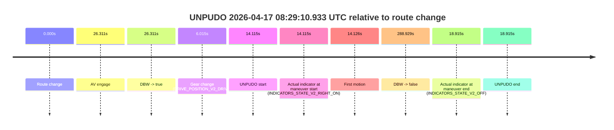
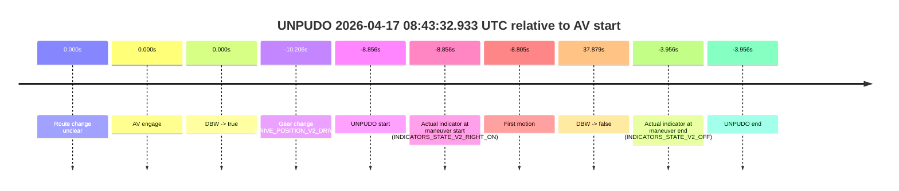
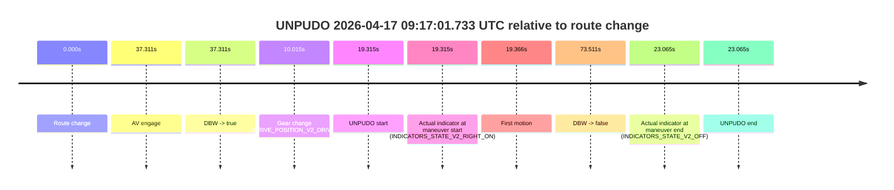
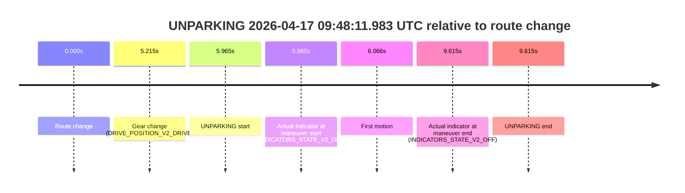

# Run Report: fme20018/2026-04-17--08-23-03--gen2-av-6b29ad9f-0d44-415a-853c-c288e1c27f54

| Field | Value |
|---|---|
| Run ID | `fme20018/2026-04-17--08-23-03--gen2-av-6b29ad9f-0d44-415a-853c-c288e1c27f54` |
| Date | `2026-04-17` |
| Model(s) | `plum-timeless-beaver` |
| Author | `peng.tang` |
| Event count | `13` |

## unpudo 2026-04-17 08:29:10.933 UTC

| Field | Value |
|---|---|
| Model | `plum-timeless-beaver` |
| Author | `peng.tang` |
| Run ID | `fme20018/2026-04-17--08-23-03--gen2-av-6b29ad9f-0d44-415a-853c-c288e1c27f54` |
| Date | `2026-04-17` |
| Time (UTC) | `08:29:10.933` |
| Event type | `unpudo` |
| Disengagement type | `none observed` |
| Route change | `found` |
| Console | [run](https://console.sso.wayve.ai/run/fme20018/2026-04-17--08-23-03--gen2-av-6b29ad9f-0d44-415a-853c-c288e1c27f54?id=&time-unixus=1776414550933315) |
| Foxglove | [segment](https://app.foxglove.dev/wayve-on-prem/p/prj_0dX18KZdVHg1fmmI/view?ds=foxglove-stream&ds.deviceName=fme20018&ds.start=2026-04-17T08%3A28%3A46.818344Z&ds.end=2026-04-17T08%3A33%3A55.747507Z&layoutId=lay_0e7VD4WIKDQGU73Y&time=2026-04-17T08%3A29%3A10.933315Z) |

### Event card: non-av

- Non-AV: there is no AV-owned portion anywhere inside the detected unpudo timeline, so it is kept for coverage but excluded from model success / failure scoring.

| Event | Time (UTC) | Delta from route change |
|---|---:|---:|
| Route change | 2026-04-17 08:28:56.818 | `0.000s` |
| AV engage | 2026-04-17 08:29:23.129 | `26.311s` |
| DBW -> true | 2026-04-17 08:29:23.129 | `26.311s` |
| Gear change (DRIVE_POSITION_V2_DRIVE) | 2026-04-17 08:29:02.833 | `6.015s` |
| UNPUDO start | 2026-04-17 08:29:10.933 | `14.115s` |
| Actual indicator at maneuver start (INDICATORS_STATE_V2_RIGHT_ON) | 2026-04-17 08:29:10.933 | `14.115s` |
| First motion | 2026-04-17 08:29:10.944 | `14.126s` |
| DBW -> false | 2026-04-17 08:33:45.747 | `288.929s` |
| Actual indicator at maneuver end (INDICATORS_STATE_V2_OFF) | 2026-04-17 08:29:15.733 | `18.915s` |
| UNPUDO end | 2026-04-17 08:29:15.733 | `18.915s` |

| Metric | Value |
|---|---|
| Outcome | `non-av` |
| Effective failure type | `none` |
| Route change status | `found` |
| DBW at event start | `false` |
| DBW at event end | `false` |
| Predicted gear at AV start | `DRIVE_POSITION_V2_DRIVE` |
| Actual gear at AV start | `DRIVE_POSITION_V2_DRIVE` |
| Predicted gear at event start | `DRIVE_POSITION_V2_DRIVE` |
| Actual gear at event start | `DRIVE_POSITION_V2_DRIVE` |
| Planned indicator direction | `INDICATORS_STATE_V2_RIGHT_ON` |
| Controller indicator direction | `INDICATORS_STATE_V2_RIGHT_ON` |
| Actual indicator direction | `INDICATORS_STATE_V2_RIGHT_ON` |
| Actual indicator at maneuver end | `INDICATORS_STATE_V2_OFF` |
| Driver accel help in AV | `false` |
| Driver accel help timestamp | `n/a` |
| Max accel pedal pct in AV | `0.0%` |
| Max brake pedal pct in AV | `0.0%` |
| Max speed mps in AV | `0.000` |
| Route -> AV | `26.311s` |
| AV -> event start | `-12.196s` |
| AV -> first motion | `-12.185s` |
| AV duration before disengagement | `262.618s` |
| Trajectory waypoint count | `34` |
| Driving-plan step count | `11` |

The scored portion starts from the AV-owned window, not from the pre-AV setup. Route-change search in the stopped pre-event segment was `found`, with the baseline therefore set to route change. At the event anchor the model predicts `DRIVE_POSITION_V2_DRIVE` and the actual gear is `DRIVE_POSITION_V2_DRIVE`. The effective model outcome is `non-av` because `there is no AV-owned overlap inside the event timeline`.

### Resolution

| Field | Value |
|---|---|
| Final outcome | `non-av` |
| Do we agree with this label? | `yes` |
| Source disengagement type | `none observed` |
| Resolved effective failure type | `none` |
| Confidence | `high` |

## unpudo 2026-04-17 08:34:14.583 UTC

| Field | Value |
|---|---|
| Model | `plum-timeless-beaver` |
| Author | `peng.tang` |
| Run ID | `fme20018/2026-04-17--08-23-03--gen2-av-6b29ad9f-0d44-415a-853c-c288e1c27f54` |
| Date | `2026-04-17` |
| Time (UTC) | `08:34:14.583` |
| Event type | `unpudo` |
| Disengagement type | `none observed` |
| Route change | `found` |
| Console | [run](https://console.sso.wayve.ai/run/fme20018/2026-04-17--08-23-03--gen2-av-6b29ad9f-0d44-415a-853c-c288e1c27f54?id=&time-unixus=1776414854583295) |
| Foxglove | [segment](https://app.foxglove.dev/wayve-on-prem/p/prj_0dX18KZdVHg1fmmI/view?ds=foxglove-stream&ds.deviceName=fme20018&ds.start=2026-04-17T08%3A33%3A55.819517Z&ds.end=2026-04-17T08%3A36%3A43.387436Z&layoutId=lay_0e7VD4WIKDQGU73Y&time=2026-04-17T08%3A34%3A14.583295Z) |

### Event card: non-av

- Non-AV: there is no AV-owned portion anywhere inside the detected unpudo timeline, so it is kept for coverage but excluded from model success / failure scoring.

| Event | Time (UTC) | Delta from route change |
|---|---:|---:|
| Route change | 2026-04-17 08:34:05.819 | `0.000s` |
| AV engage | 2026-04-17 08:34:28.788 | `22.969s` |
| DBW -> true | 2026-04-17 08:34:28.788 | `22.969s` |
| Gear change (DRIVE_POSITION_V2_DRIVE) | 2026-04-17 08:34:09.733 | `3.914s` |
| UNPUDO start | 2026-04-17 08:34:14.583 | `8.764s` |
| Actual indicator at maneuver start (INDICATORS_STATE_V2_OFF) | 2026-04-17 08:34:14.583 | `8.764s` |
| First motion | 2026-04-17 08:34:14.624 | `8.805s` |
| DBW -> false | 2026-04-17 08:36:33.387 | `147.568s` |
| Actual indicator at maneuver end (INDICATORS_STATE_V2_OFF) | 2026-04-17 08:34:18.933 | `13.114s` |
| UNPUDO end | 2026-04-17 08:34:18.933 | `13.114s` |

| Metric | Value |
|---|---|
| Outcome | `non-av` |
| Effective failure type | `none` |
| Route change status | `found` |
| DBW at event start | `false` |
| DBW at event end | `false` |
| Predicted gear at AV start | `DRIVE_POSITION_V2_DRIVE` |
| Actual gear at AV start | `DRIVE_POSITION_V2_DRIVE` |
| Predicted gear at event start | `DRIVE_POSITION_V2_DRIVE` |
| Actual gear at event start | `DRIVE_POSITION_V2_DRIVE` |
| Planned indicator direction | `INDICATORS_STATE_V2_LEFT_ON` |
| Controller indicator direction | `INDICATORS_STATE_V2_LEFT_ON` |
| Actual indicator direction | `INDICATORS_STATE_V2_OFF` |
| Actual indicator at maneuver end | `INDICATORS_STATE_V2_OFF` |
| Driver accel help in AV | `false` |
| Driver accel help timestamp | `n/a` |
| Max accel pedal pct in AV | `0.0%` |
| Max brake pedal pct in AV | `0.0%` |
| Max speed mps in AV | `0.000` |
| Route -> AV | `22.969s` |
| AV -> event start | `-14.205s` |
| AV -> first motion | `-14.164s` |
| AV duration before disengagement | `124.599s` |
| Trajectory waypoint count | `35` |
| Driving-plan step count | `11` |

The scored portion starts from the AV-owned window, not from the pre-AV setup. Route-change search in the stopped pre-event segment was `found`, with the baseline therefore set to route change. At the event anchor the model predicts `DRIVE_POSITION_V2_DRIVE` and the actual gear is `DRIVE_POSITION_V2_DRIVE`. The effective model outcome is `non-av` because `there is no AV-owned overlap inside the event timeline`.

### Resolution

| Field | Value |
|---|---|
| Final outcome | `non-av` |
| Do we agree with this label? | `yes` |
| Source disengagement type | `none observed` |
| Resolved effective failure type | `none` |
| Confidence | `high` |

## unpudo 2026-04-17 08:37:08.583 UTC

| Field | Value |
|---|---|
| Model | `plum-timeless-beaver` |
| Author | `peng.tang` |
| Run ID | `fme20018/2026-04-17--08-23-03--gen2-av-6b29ad9f-0d44-415a-853c-c288e1c27f54` |
| Date | `2026-04-17` |
| Time (UTC) | `08:37:08.583` |
| Event type | `unpudo` |
| Disengagement type | `none observed` |
| Route change | `found` |
| Console | [run](https://console.sso.wayve.ai/run/fme20018/2026-04-17--08-23-03--gen2-av-6b29ad9f-0d44-415a-853c-c288e1c27f54?id=&time-unixus=1776415028583297) |
| Foxglove | [segment](https://app.foxglove.dev/wayve-on-prem/p/prj_0dX18KZdVHg1fmmI/view?ds=foxglove-stream&ds.deviceName=fme20018&ds.start=2026-04-17T08%3A36%3A39.218269Z&ds.end=2026-04-17T08%3A39%3A14.329351Z&layoutId=lay_0e7VD4WIKDQGU73Y&time=2026-04-17T08%3A37%3A08.583297Z) |

### Event card: non-av

- Non-AV: there is no AV-owned portion anywhere inside the detected unpudo timeline, so it is kept for coverage but excluded from model success / failure scoring.

| Event | Time (UTC) | Delta from route change |
|---|---:|---:|
| Route change | 2026-04-17 08:36:49.218 | `0.000s` |
| AV engage | 2026-04-17 08:37:17.308 | `28.090s` |
| DBW -> true | 2026-04-17 08:37:17.308 | `28.090s` |
| Gear change (DRIVE_POSITION_V2_DRIVE) | 2026-04-17 08:37:02.183 | `12.965s` |
| UNPUDO start | 2026-04-17 08:37:08.583 | `19.365s` |
| Actual indicator at maneuver start (INDICATORS_STATE_V2_LEFT_ON) | 2026-04-17 08:37:08.583 | `19.365s` |
| First motion | 2026-04-17 08:37:08.604 | `19.386s` |
| DBW -> false | 2026-04-17 08:39:04.329 | `135.111s` |
| Actual indicator at maneuver end (INDICATORS_STATE_V2_OFF) | 2026-04-17 08:37:13.533 | `24.315s` |
| UNPUDO end | 2026-04-17 08:37:13.533 | `24.315s` |

| Metric | Value |
|---|---|
| Outcome | `non-av` |
| Effective failure type | `none` |
| Route change status | `found` |
| DBW at event start | `false` |
| DBW at event end | `false` |
| Predicted gear at AV start | `DRIVE_POSITION_V2_DRIVE` |
| Actual gear at AV start | `DRIVE_POSITION_V2_DRIVE` |
| Predicted gear at event start | `DRIVE_POSITION_V2_DRIVE` |
| Actual gear at event start | `DRIVE_POSITION_V2_DRIVE` |
| Planned indicator direction | `INDICATORS_STATE_V2_OFF` |
| Controller indicator direction | `INDICATORS_STATE_V2_OFF` |
| Actual indicator direction | `INDICATORS_STATE_V2_LEFT_ON` |
| Actual indicator at maneuver end | `INDICATORS_STATE_V2_OFF` |
| Driver accel help in AV | `false` |
| Driver accel help timestamp | `n/a` |
| Max accel pedal pct in AV | `0.0%` |
| Max brake pedal pct in AV | `0.0%` |
| Max speed mps in AV | `0.000` |
| Route -> AV | `28.090s` |
| AV -> event start | `-8.725s` |
| AV -> first motion | `-8.704s` |
| AV duration before disengagement | `107.021s` |
| Trajectory waypoint count | `37` |
| Driving-plan step count | `11` |

The scored portion starts from the AV-owned window, not from the pre-AV setup. Route-change search in the stopped pre-event segment was `found`, with the baseline therefore set to route change. At the event anchor the model predicts `DRIVE_POSITION_V2_DRIVE` and the actual gear is `DRIVE_POSITION_V2_DRIVE`. The effective model outcome is `non-av` because `there is no AV-owned overlap inside the event timeline`.

### Resolution

| Field | Value |
|---|---|
| Final outcome | `non-av` |
| Do we agree with this label? | `yes` |
| Source disengagement type | `none observed` |
| Resolved effective failure type | `none` |
| Confidence | `high` |

## unpudo 2026-04-17 08:39:04.933 UTC

| Field | Value |
|---|---|
| Model | `plum-timeless-beaver` |
| Author | `peng.tang` |
| Run ID | `fme20018/2026-04-17--08-23-03--gen2-av-6b29ad9f-0d44-415a-853c-c288e1c27f54` |
| Date | `2026-04-17` |
| Time (UTC) | `08:39:04.933` |
| Event type | `unpudo` |
| Disengagement type | `none observed` |
| Route change | `found` |
| Console | [run](https://console.sso.wayve.ai/run/fme20018/2026-04-17--08-23-03--gen2-av-6b29ad9f-0d44-415a-853c-c288e1c27f54?id=&time-unixus=1776415144933320) |
| Foxglove | [segment](https://app.foxglove.dev/wayve-on-prem/p/prj_0dX18KZdVHg1fmmI/view?ds=foxglove-stream&ds.deviceName=fme20018&ds.start=2026-04-17T08%3A38%3A26.718320Z&ds.end=2026-04-17T08%3A40%3A40.688013Z&layoutId=lay_0e7VD4WIKDQGU73Y&time=2026-04-17T08%3A39%3A04.933320Z) |

### Event card: non-av

- Non-AV: there is no AV-owned portion anywhere inside the detected unpudo timeline, so it is kept for coverage but excluded from model success / failure scoring.

| Event | Time (UTC) | Delta from route change |
|---|---:|---:|
| Route change | 2026-04-17 08:38:36.718 | `0.000s` |
| AV engage | 2026-04-17 08:39:11.049 | `34.331s` |
| DBW -> true | 2026-04-17 08:39:11.049 | `34.331s` |
| Gear change (DRIVE_POSITION_V2_DRIVE) | 2026-04-17 08:38:37.033 | `0.315s` |
| UNPUDO start | 2026-04-17 08:39:04.933 | `28.215s` |
| Actual indicator at maneuver start (INDICATORS_STATE_V2_RIGHT_ON) | 2026-04-17 08:39:04.933 | `28.215s` |
| First motion | 2026-04-17 08:39:04.944 | `28.227s` |
| DBW -> false | 2026-04-17 08:40:30.688 | `113.970s` |
| Actual indicator at maneuver end (INDICATORS_STATE_V2_OFF) | 2026-04-17 08:39:08.783 | `32.065s` |
| UNPUDO end | 2026-04-17 08:39:08.783 | `32.065s` |

| Metric | Value |
|---|---|
| Outcome | `non-av` |
| Effective failure type | `none` |
| Route change status | `found` |
| DBW at event start | `false` |
| DBW at event end | `false` |
| Predicted gear at AV start | `DRIVE_POSITION_V2_DRIVE` |
| Actual gear at AV start | `DRIVE_POSITION_V2_DRIVE` |
| Predicted gear at event start | `DRIVE_POSITION_V2_DRIVE` |
| Actual gear at event start | `DRIVE_POSITION_V2_DRIVE` |
| Planned indicator direction | `INDICATORS_STATE_V2_OFF` |
| Controller indicator direction | `INDICATORS_STATE_V2_OFF` |
| Actual indicator direction | `INDICATORS_STATE_V2_RIGHT_ON` |
| Actual indicator at maneuver end | `INDICATORS_STATE_V2_OFF` |
| Driver accel help in AV | `false` |
| Driver accel help timestamp | `n/a` |
| Max accel pedal pct in AV | `0.0%` |
| Max brake pedal pct in AV | `0.0%` |
| Max speed mps in AV | `0.000` |
| Route -> AV | `34.331s` |
| AV -> event start | `-6.116s` |
| AV -> first motion | `-6.104s` |
| AV duration before disengagement | `79.639s` |
| Trajectory waypoint count | `36` |
| Driving-plan step count | `11` |

The scored portion starts from the AV-owned window, not from the pre-AV setup. Route-change search in the stopped pre-event segment was `found`, with the baseline therefore set to route change. At the event anchor the model predicts `DRIVE_POSITION_V2_DRIVE` and the actual gear is `DRIVE_POSITION_V2_DRIVE`. The effective model outcome is `non-av` because `there is no AV-owned overlap inside the event timeline`.

### Resolution

| Field | Value |
|---|---|
| Final outcome | `non-av` |
| Do we agree with this label? | `yes` |
| Source disengagement type | `none observed` |
| Resolved effective failure type | `none` |
| Confidence | `high` |

## unpudo 2026-04-17 08:43:32.933 UTC

| Field | Value |
|---|---|
| Model | `plum-timeless-beaver` |
| Author | `peng.tang` |
| Run ID | `fme20018/2026-04-17--08-23-03--gen2-av-6b29ad9f-0d44-415a-853c-c288e1c27f54` |
| Date | `2026-04-17` |
| Time (UTC) | `08:43:32.933` |
| Event type | `unpudo` |
| Disengagement type | `none observed` |
| Route change | `unclear` |
| Console | [run](https://console.sso.wayve.ai/run/fme20018/2026-04-17--08-23-03--gen2-av-6b29ad9f-0d44-415a-853c-c288e1c27f54?id=&time-unixus=1776415412933304) |
| Foxglove | [segment](https://app.foxglove.dev/wayve-on-prem/p/prj_0dX18KZdVHg1fmmI/view?ds=foxglove-stream&ds.deviceName=fme20018&ds.start=2026-04-17T08%3A43%3A21.583321Z&ds.end=2026-04-17T08%3A44%3A29.668098Z&layoutId=lay_0e7VD4WIKDQGU73Y&time=2026-04-17T08%3A43%3A32.933304Z) |

### Event card: non-av

- Non-AV: there is no AV-owned portion anywhere inside the detected unpudo timeline, so it is kept for coverage but excluded from model success / failure scoring.

| Event | Time (UTC) | Delta from AV start |
|---|---:|---:|
| Route change unclear | 2026-04-17 08:43:41.789 | `0.000s` |
| AV engage | 2026-04-17 08:43:41.789 | `0.000s` |
| DBW -> true | 2026-04-17 08:43:41.789 | `0.000s` |
| Gear change (DRIVE_POSITION_V2_DRIVE) | 2026-04-17 08:43:31.583 | `-10.206s` |
| UNPUDO start | 2026-04-17 08:43:32.933 | `-8.856s` |
| Actual indicator at maneuver start (INDICATORS_STATE_V2_RIGHT_ON) | 2026-04-17 08:43:32.933 | `-8.856s` |
| First motion | 2026-04-17 08:43:32.984 | `-8.805s` |
| DBW -> false | 2026-04-17 08:44:19.668 | `37.879s` |
| Actual indicator at maneuver end (INDICATORS_STATE_V2_OFF) | 2026-04-17 08:43:37.833 | `-3.956s` |
| UNPUDO end | 2026-04-17 08:43:37.833 | `-3.956s` |

| Metric | Value |
|---|---|
| Outcome | `non-av` |
| Effective failure type | `none` |
| Route change status | `unclear` |
| DBW at event start | `false` |
| DBW at event end | `false` |
| Predicted gear at AV start | `DRIVE_POSITION_V2_DRIVE` |
| Actual gear at AV start | `DRIVE_POSITION_V2_DRIVE` |
| Predicted gear at event start | `DRIVE_POSITION_V2_DRIVE` |
| Actual gear at event start | `DRIVE_POSITION_V2_DRIVE` |
| Planned indicator direction | `INDICATORS_STATE_V2_OFF` |
| Controller indicator direction | `INDICATORS_STATE_V2_OFF` |
| Actual indicator direction | `INDICATORS_STATE_V2_RIGHT_ON` |
| Actual indicator at maneuver end | `INDICATORS_STATE_V2_OFF` |
| Driver accel help in AV | `false` |
| Driver accel help timestamp | `n/a` |
| Max accel pedal pct in AV | `0.0%` |
| Max brake pedal pct in AV | `0.0%` |
| Max speed mps in AV | `0.000` |
| Route -> AV | `n/a` |
| AV -> event start | `-8.856s` |
| AV -> first motion | `-8.805s` |
| AV duration before disengagement | `37.879s` |
| Trajectory waypoint count | `37` |
| Driving-plan step count | `11` |

The scored portion starts from the AV-owned window, not from the pre-AV setup. Route-change search in the stopped pre-event segment was `unclear`, with the baseline therefore set to AV start. At the event anchor the model predicts `DRIVE_POSITION_V2_DRIVE` and the actual gear is `DRIVE_POSITION_V2_DRIVE`. The effective model outcome is `non-av` because `there is no AV-owned overlap inside the event timeline`.

### Resolution

| Field | Value |
|---|---|
| Final outcome | `non-av` |
| Do we agree with this label? | `yes` |
| Source disengagement type | `none observed` |
| Resolved effective failure type | `none` |
| Confidence | `medium` |

## unpudo 2026-04-17 08:52:23.233 UTC

| Field | Value |
|---|---|
| Model | `plum-timeless-beaver` |
| Author | `peng.tang` |
| Run ID | `fme20018/2026-04-17--08-23-03--gen2-av-6b29ad9f-0d44-415a-853c-c288e1c27f54` |
| Date | `2026-04-17` |
| Time (UTC) | `08:52:23.233` |
| Event type | `unpudo` |
| Disengagement type | `none observed` |
| Route change | `found` |
| Console | [run](https://console.sso.wayve.ai/run/fme20018/2026-04-17--08-23-03--gen2-av-6b29ad9f-0d44-415a-853c-c288e1c27f54?id=&time-unixus=1776415943233294) |
| Foxglove | [segment](https://app.foxglove.dev/wayve-on-prem/p/prj_0dX18KZdVHg1fmmI/view?ds=foxglove-stream&ds.deviceName=fme20018&ds.start=2026-04-17T08%3A52%3A02.118289Z&ds.end=2026-04-17T08%3A53%3A20.270174Z&layoutId=lay_0e7VD4WIKDQGU73Y&time=2026-04-17T08%3A52%3A23.233294Z) |

### Event card: non-av

- Non-AV: there is no AV-owned portion anywhere inside the detected unpudo timeline, so it is kept for coverage but excluded from model success / failure scoring.

| Event | Time (UTC) | Delta from route change |
|---|---:|---:|
| Route change | 2026-04-17 08:52:12.118 | `0.000s` |
| AV engage | 2026-04-17 08:52:30.248 | `18.131s` |
| DBW -> true | 2026-04-17 08:52:30.248 | `18.131s` |
| Gear change (DRIVE_POSITION_V2_DRIVE) | 2026-04-17 08:52:16.533 | `4.415s` |
| UNPUDO start | 2026-04-17 08:52:23.233 | `11.115s` |
| Actual indicator at maneuver start (INDICATORS_STATE_V2_RIGHT_ON) | 2026-04-17 08:52:23.233 | `11.115s` |
| First motion | 2026-04-17 08:52:23.264 | `11.146s` |
| DBW -> false | 2026-04-17 08:53:10.270 | `58.152s` |
| Actual indicator at maneuver end (INDICATORS_STATE_V2_OFF) | 2026-04-17 08:52:27.233 | `15.115s` |
| UNPUDO end | 2026-04-17 08:52:27.233 | `15.115s` |

| Metric | Value |
|---|---|
| Outcome | `non-av` |
| Effective failure type | `none` |
| Route change status | `found` |
| DBW at event start | `false` |
| DBW at event end | `false` |
| Predicted gear at AV start | `DRIVE_POSITION_V2_DRIVE` |
| Actual gear at AV start | `DRIVE_POSITION_V2_DRIVE` |
| Predicted gear at event start | `DRIVE_POSITION_V2_DRIVE` |
| Actual gear at event start | `DRIVE_POSITION_V2_DRIVE` |
| Planned indicator direction | `INDICATORS_STATE_V2_OFF` |
| Controller indicator direction | `INDICATORS_STATE_V2_OFF` |
| Actual indicator direction | `INDICATORS_STATE_V2_RIGHT_ON` |
| Actual indicator at maneuver end | `INDICATORS_STATE_V2_OFF` |
| Driver accel help in AV | `false` |
| Driver accel help timestamp | `n/a` |
| Max accel pedal pct in AV | `0.0%` |
| Max brake pedal pct in AV | `0.0%` |
| Max speed mps in AV | `0.000` |
| Route -> AV | `18.131s` |
| AV -> event start | `-7.016s` |
| AV -> first motion | `-6.985s` |
| AV duration before disengagement | `40.021s` |
| Trajectory waypoint count | `35` |
| Driving-plan step count | `11` |

The scored portion starts from the AV-owned window, not from the pre-AV setup. Route-change search in the stopped pre-event segment was `found`, with the baseline therefore set to route change. At the event anchor the model predicts `DRIVE_POSITION_V2_DRIVE` and the actual gear is `DRIVE_POSITION_V2_DRIVE`. The effective model outcome is `non-av` because `there is no AV-owned overlap inside the event timeline`.

### Resolution

| Field | Value |
|---|---|
| Final outcome | `non-av` |
| Do we agree with this label? | `yes` |
| Source disengagement type | `none observed` |
| Resolved effective failure type | `none` |
| Confidence | `high` |

## unpudo 2026-04-17 08:58:18.633 UTC

| Field | Value |
|---|---|
| Model | `plum-timeless-beaver` |
| Author | `peng.tang` |
| Run ID | `fme20018/2026-04-17--08-23-03--gen2-av-6b29ad9f-0d44-415a-853c-c288e1c27f54` |
| Date | `2026-04-17` |
| Time (UTC) | `08:58:18.633` |
| Event type | `unpudo` |
| Disengagement type | `none observed` |
| Route change | `found` |
| Console | [run](https://console.sso.wayve.ai/run/fme20018/2026-04-17--08-23-03--gen2-av-6b29ad9f-0d44-415a-853c-c288e1c27f54?id=&time-unixus=1776416298633298) |
| Foxglove | [segment](https://app.foxglove.dev/wayve-on-prem/p/prj_0dX18KZdVHg1fmmI/view?ds=foxglove-stream&ds.deviceName=fme20018&ds.start=2026-04-17T08%3A57%3A04.018238Z&ds.end=2026-04-17T08%3A59%3A54.049444Z&layoutId=lay_0e7VD4WIKDQGU73Y&time=2026-04-17T08%3A58%3A18.633298Z) |

### Event card: non-av

- Non-AV: there is no AV-owned portion anywhere inside the detected unpudo timeline, so it is kept for coverage but excluded from model success / failure scoring.

| Event | Time (UTC) | Delta from route change |
|---|---:|---:|
| Route change | 2026-04-17 08:57:14.018 | `0.000s` |
| AV engage | 2026-04-17 08:58:34.829 | `80.811s` |
| DBW -> true | 2026-04-17 08:58:34.829 | `80.811s` |
| Gear change (DRIVE_POSITION_V2_DRIVE) | 2026-04-17 08:58:12.333 | `58.315s` |
| UNPUDO start | 2026-04-17 08:58:18.633 | `64.615s` |
| Actual indicator at maneuver start (INDICATORS_STATE_V2_RIGHT_ON) | 2026-04-17 08:58:18.633 | `64.615s` |
| First motion | 2026-04-17 08:58:18.644 | `64.626s` |
| DBW -> false | 2026-04-17 08:59:44.049 | `150.031s` |
| Actual indicator at maneuver end (INDICATORS_STATE_V2_OFF) | 2026-04-17 08:58:23.733 | `69.715s` |
| UNPUDO end | 2026-04-17 08:58:23.733 | `69.715s` |

| Metric | Value |
|---|---|
| Outcome | `non-av` |
| Effective failure type | `none` |
| Route change status | `found` |
| DBW at event start | `false` |
| DBW at event end | `false` |
| Predicted gear at AV start | `DRIVE_POSITION_V2_DRIVE` |
| Actual gear at AV start | `DRIVE_POSITION_V2_DRIVE` |
| Predicted gear at event start | `DRIVE_POSITION_V2_DRIVE` |
| Actual gear at event start | `DRIVE_POSITION_V2_DRIVE` |
| Planned indicator direction | `INDICATORS_STATE_V2_OFF` |
| Controller indicator direction | `INDICATORS_STATE_V2_OFF` |
| Actual indicator direction | `INDICATORS_STATE_V2_RIGHT_ON` |
| Actual indicator at maneuver end | `INDICATORS_STATE_V2_OFF` |
| Driver accel help in AV | `false` |
| Driver accel help timestamp | `n/a` |
| Max accel pedal pct in AV | `0.0%` |
| Max brake pedal pct in AV | `0.0%` |
| Max speed mps in AV | `0.000` |
| Route -> AV | `80.811s` |
| AV -> event start | `-16.196s` |
| AV -> first motion | `-16.185s` |
| AV duration before disengagement | `69.220s` |
| Trajectory waypoint count | `36` |
| Driving-plan step count | `11` |

The scored portion starts from the AV-owned window, not from the pre-AV setup. Route-change search in the stopped pre-event segment was `found`, with the baseline therefore set to route change. At the event anchor the model predicts `DRIVE_POSITION_V2_DRIVE` and the actual gear is `DRIVE_POSITION_V2_DRIVE`. The effective model outcome is `non-av` because `there is no AV-owned overlap inside the event timeline`.

### Resolution

| Field | Value |
|---|---|
| Final outcome | `non-av` |
| Do we agree with this label? | `yes` |
| Source disengagement type | `none observed` |
| Resolved effective failure type | `none` |
| Confidence | `high` |

## unpudo 2026-04-17 09:00:03.433 UTC

| Field | Value |
|---|---|
| Model | `plum-timeless-beaver` |
| Author | `peng.tang` |
| Run ID | `fme20018/2026-04-17--08-23-03--gen2-av-6b29ad9f-0d44-415a-853c-c288e1c27f54` |
| Date | `2026-04-17` |
| Time (UTC) | `09:00:03.433` |
| Event type | `unpudo` |
| Disengagement type | `none observed` |
| Route change | `found` |
| Console | [run](https://console.sso.wayve.ai/run/fme20018/2026-04-17--08-23-03--gen2-av-6b29ad9f-0d44-415a-853c-c288e1c27f54?id=&time-unixus=1776416403433304) |
| Foxglove | [segment](https://app.foxglove.dev/wayve-on-prem/p/prj_0dX18KZdVHg1fmmI/view?ds=foxglove-stream&ds.deviceName=fme20018&ds.start=2026-04-17T08%3A57%3A56.418914Z&ds.end=2026-04-17T09%3A01%3A15.209343Z&layoutId=lay_0e7VD4WIKDQGU73Y&time=2026-04-17T09%3A00%3A03.433304Z) |

### Event card: non-av

- Non-AV: there is no AV-owned portion anywhere inside the detected unpudo timeline, so it is kept for coverage but excluded from model success / failure scoring.

| Event | Time (UTC) | Delta from route change |
|---|---:|---:|
| Route change | 2026-04-17 08:58:06.418 | `0.000s` |
| AV engage | 2026-04-17 09:00:12.908 | `126.489s` |
| DBW -> true | 2026-04-17 09:00:12.908 | `126.489s` |
| Gear change (DRIVE_POSITION_V2_DRIVE) | 2026-04-17 08:59:58.733 | `112.314s` |
| UNPUDO start | 2026-04-17 09:00:03.433 | `117.014s` |
| Actual indicator at maneuver start (INDICATORS_STATE_V2_RIGHT_ON) | 2026-04-17 09:00:03.433 | `117.014s` |
| First motion | 2026-04-17 09:00:03.464 | `117.045s` |
| DBW -> false | 2026-04-17 09:01:05.209 | `178.790s` |
| Actual indicator at maneuver end (INDICATORS_STATE_V2_OFF) | 2026-04-17 09:00:07.383 | `120.964s` |
| UNPUDO end | 2026-04-17 09:00:07.383 | `120.964s` |

| Metric | Value |
|---|---|
| Outcome | `non-av` |
| Effective failure type | `none` |
| Route change status | `found` |
| DBW at event start | `false` |
| DBW at event end | `false` |
| Predicted gear at AV start | `DRIVE_POSITION_V2_DRIVE` |
| Actual gear at AV start | `DRIVE_POSITION_V2_DRIVE` |
| Predicted gear at event start | `DRIVE_POSITION_V2_DRIVE` |
| Actual gear at event start | `DRIVE_POSITION_V2_DRIVE` |
| Planned indicator direction | `INDICATORS_STATE_V2_OFF` |
| Controller indicator direction | `INDICATORS_STATE_V2_OFF` |
| Actual indicator direction | `INDICATORS_STATE_V2_RIGHT_ON` |
| Actual indicator at maneuver end | `INDICATORS_STATE_V2_OFF` |
| Driver accel help in AV | `false` |
| Driver accel help timestamp | `n/a` |
| Max accel pedal pct in AV | `0.0%` |
| Max brake pedal pct in AV | `0.0%` |
| Max speed mps in AV | `0.000` |
| Route -> AV | `126.489s` |
| AV -> event start | `-9.475s` |
| AV -> first motion | `-9.444s` |
| AV duration before disengagement | `52.301s` |
| Trajectory waypoint count | `36` |
| Driving-plan step count | `11` |

The scored portion starts from the AV-owned window, not from the pre-AV setup. Route-change search in the stopped pre-event segment was `found`, with the baseline therefore set to route change. At the event anchor the model predicts `DRIVE_POSITION_V2_DRIVE` and the actual gear is `DRIVE_POSITION_V2_DRIVE`. The effective model outcome is `non-av` because `there is no AV-owned overlap inside the event timeline`.

### Resolution

| Field | Value |
|---|---|
| Final outcome | `non-av` |
| Do we agree with this label? | `yes` |
| Source disengagement type | `none observed` |
| Resolved effective failure type | `none` |
| Confidence | `high` |

## unpudo 2026-04-17 09:01:19.083 UTC

| Field | Value |
|---|---|
| Model | `plum-timeless-beaver` |
| Author | `peng.tang` |
| Run ID | `fme20018/2026-04-17--08-23-03--gen2-av-6b29ad9f-0d44-415a-853c-c288e1c27f54` |
| Date | `2026-04-17` |
| Time (UTC) | `09:01:19.083` |
| Event type | `unpudo` |
| Disengagement type | `none observed` |
| Route change | `found` |
| Console | [run](https://console.sso.wayve.ai/run/fme20018/2026-04-17--08-23-03--gen2-av-6b29ad9f-0d44-415a-853c-c288e1c27f54?id=&time-unixus=1776416479083308) |
| Foxglove | [segment](https://app.foxglove.dev/wayve-on-prem/p/prj_0dX18KZdVHg1fmmI/view?ds=foxglove-stream&ds.deviceName=fme20018&ds.start=2026-04-17T08%3A59%3A45.518250Z&ds.end=2026-04-17T09%3A01%3A50.048163Z&layoutId=lay_0e7VD4WIKDQGU73Y&time=2026-04-17T09%3A01%3A19.083308Z) |

### Event card: non-av

- Non-AV: there is no AV-owned portion anywhere inside the detected unpudo timeline, so it is kept for coverage but excluded from model success / failure scoring.

| Event | Time (UTC) | Delta from route change |
|---|---:|---:|
| Route change | 2026-04-17 08:59:55.518 | `0.000s` |
| AV engage | 2026-04-17 09:01:31.468 | `95.950s` |
| DBW -> true | 2026-04-17 09:01:31.468 | `95.950s` |
| Gear change (DRIVE_POSITION_V2_DRIVE) | 2026-04-17 09:01:15.933 | `80.415s` |
| UNPUDO start | 2026-04-17 09:01:19.083 | `83.565s` |
| Actual indicator at maneuver start (INDICATORS_STATE_V2_RIGHT_ON) | 2026-04-17 09:01:19.083 | `83.565s` |
| First motion | 2026-04-17 09:01:19.124 | `83.606s` |
| DBW -> false | 2026-04-17 09:01:40.048 | `104.530s` |
| Actual indicator at maneuver end (INDICATORS_STATE_V2_OFF) | 2026-04-17 09:01:23.783 | `88.265s` |
| UNPUDO end | 2026-04-17 09:01:23.783 | `88.265s` |

| Metric | Value |
|---|---|
| Outcome | `non-av` |
| Effective failure type | `none` |
| Route change status | `found` |
| DBW at event start | `false` |
| DBW at event end | `false` |
| Predicted gear at AV start | `DRIVE_POSITION_V2_DRIVE` |
| Actual gear at AV start | `DRIVE_POSITION_V2_DRIVE` |
| Predicted gear at event start | `DRIVE_POSITION_V2_DRIVE` |
| Actual gear at event start | `DRIVE_POSITION_V2_DRIVE` |
| Planned indicator direction | `INDICATORS_STATE_V2_OFF` |
| Controller indicator direction | `INDICATORS_STATE_V2_OFF` |
| Actual indicator direction | `INDICATORS_STATE_V2_RIGHT_ON` |
| Actual indicator at maneuver end | `INDICATORS_STATE_V2_OFF` |
| Driver accel help in AV | `false` |
| Driver accel help timestamp | `n/a` |
| Max accel pedal pct in AV | `0.0%` |
| Max brake pedal pct in AV | `0.0%` |
| Max speed mps in AV | `0.000` |
| Route -> AV | `95.950s` |
| AV -> event start | `-12.385s` |
| AV -> first motion | `-12.344s` |
| AV duration before disengagement | `8.580s` |
| Trajectory waypoint count | `36` |
| Driving-plan step count | `11` |

The scored portion starts from the AV-owned window, not from the pre-AV setup. Route-change search in the stopped pre-event segment was `found`, with the baseline therefore set to route change. At the event anchor the model predicts `DRIVE_POSITION_V2_DRIVE` and the actual gear is `DRIVE_POSITION_V2_DRIVE`. The effective model outcome is `non-av` because `there is no AV-owned overlap inside the event timeline`.

### Resolution

| Field | Value |
|---|---|
| Final outcome | `non-av` |
| Do we agree with this label? | `yes` |
| Source disengagement type | `none observed` |
| Resolved effective failure type | `none` |
| Confidence | `high` |

## unpudo 2026-04-17 09:05:06.733 UTC

| Field | Value |
|---|---|
| Model | `plum-timeless-beaver` |
| Author | `peng.tang` |
| Run ID | `fme20018/2026-04-17--08-23-03--gen2-av-6b29ad9f-0d44-415a-853c-c288e1c27f54` |
| Date | `2026-04-17` |
| Time (UTC) | `09:05:06.733` |
| Event type | `unpudo` |
| Disengagement type | `none observed` |
| Route change | `found` |
| Console | [run](https://console.sso.wayve.ai/run/fme20018/2026-04-17--08-23-03--gen2-av-6b29ad9f-0d44-415a-853c-c288e1c27f54?id=&time-unixus=1776416706733307) |
| Foxglove | [segment](https://app.foxglove.dev/wayve-on-prem/p/prj_0dX18KZdVHg1fmmI/view?ds=foxglove-stream&ds.deviceName=fme20018&ds.start=2026-04-17T09%3A04%3A39.918346Z&ds.end=2026-04-17T09%3A05%3A36.449487Z&layoutId=lay_0e7VD4WIKDQGU73Y&time=2026-04-17T09%3A05%3A06.733307Z) |

### Event card: non-av

- Non-AV: there is no AV-owned portion anywhere inside the detected unpudo timeline, so it is kept for coverage but excluded from model success / failure scoring.

| Event | Time (UTC) | Delta from route change |
|---|---:|---:|
| Route change | 2026-04-17 09:04:49.918 | `0.000s` |
| AV engage | 2026-04-17 09:05:14.708 | `24.791s` |
| DBW -> true | 2026-04-17 09:05:14.708 | `24.791s` |
| Gear change (DRIVE_POSITION_V2_DRIVE) | 2026-04-17 09:05:00.133 | `10.215s` |
| UNPUDO start | 2026-04-17 09:05:06.733 | `16.815s` |
| Actual indicator at maneuver start (INDICATORS_STATE_V2_RIGHT_ON) | 2026-04-17 09:05:06.733 | `16.815s` |
| First motion | 2026-04-17 09:05:06.764 | `16.846s` |
| DBW -> false | 2026-04-17 09:05:26.449 | `36.531s` |
| Actual indicator at maneuver end (INDICATORS_STATE_V2_OFF) | 2026-04-17 09:05:11.883 | `21.965s` |
| UNPUDO end | 2026-04-17 09:05:11.883 | `21.965s` |

| Metric | Value |
|---|---|
| Outcome | `non-av` |
| Effective failure type | `none` |
| Route change status | `found` |
| DBW at event start | `false` |
| DBW at event end | `false` |
| Predicted gear at AV start | `DRIVE_POSITION_V2_DRIVE` |
| Actual gear at AV start | `DRIVE_POSITION_V2_DRIVE` |
| Predicted gear at event start | `DRIVE_POSITION_V2_DRIVE` |
| Actual gear at event start | `DRIVE_POSITION_V2_DRIVE` |
| Planned indicator direction | `INDICATORS_STATE_V2_OFF` |
| Controller indicator direction | `INDICATORS_STATE_V2_OFF` |
| Actual indicator direction | `INDICATORS_STATE_V2_RIGHT_ON` |
| Actual indicator at maneuver end | `INDICATORS_STATE_V2_OFF` |
| Driver accel help in AV | `false` |
| Driver accel help timestamp | `n/a` |
| Max accel pedal pct in AV | `0.0%` |
| Max brake pedal pct in AV | `0.0%` |
| Max speed mps in AV | `0.000` |
| Route -> AV | `24.791s` |
| AV -> event start | `-7.976s` |
| AV -> first motion | `-7.945s` |
| AV duration before disengagement | `11.740s` |
| Trajectory waypoint count | `35` |
| Driving-plan step count | `11` |

The scored portion starts from the AV-owned window, not from the pre-AV setup. Route-change search in the stopped pre-event segment was `found`, with the baseline therefore set to route change. At the event anchor the model predicts `DRIVE_POSITION_V2_DRIVE` and the actual gear is `DRIVE_POSITION_V2_DRIVE`. The effective model outcome is `non-av` because `there is no AV-owned overlap inside the event timeline`.

### Resolution

| Field | Value |
|---|---|
| Final outcome | `non-av` |
| Do we agree with this label? | `yes` |
| Source disengagement type | `none observed` |
| Resolved effective failure type | `none` |
| Confidence | `high` |

## unpudo 2026-04-17 09:17:01.733 UTC

| Field | Value |
|---|---|
| Model | `plum-timeless-beaver` |
| Author | `peng.tang` |
| Run ID | `fme20018/2026-04-17--08-23-03--gen2-av-6b29ad9f-0d44-415a-853c-c288e1c27f54` |
| Date | `2026-04-17` |
| Time (UTC) | `09:17:01.733` |
| Event type | `unpudo` |
| Disengagement type | `none observed` |
| Route change | `found` |
| Console | [run](https://console.sso.wayve.ai/run/fme20018/2026-04-17--08-23-03--gen2-av-6b29ad9f-0d44-415a-853c-c288e1c27f54?id=&time-unixus=1776417421733300) |
| Foxglove | [segment](https://app.foxglove.dev/wayve-on-prem/p/prj_0dX18KZdVHg1fmmI/view?ds=foxglove-stream&ds.deviceName=fme20018&ds.start=2026-04-17T09%3A16%3A32.418570Z&ds.end=2026-04-17T09%3A18%3A05.929606Z&layoutId=lay_0e7VD4WIKDQGU73Y&time=2026-04-17T09%3A17%3A01.733300Z) |

### Event card: non-av

- Non-AV: there is no AV-owned portion anywhere inside the detected unpudo timeline, so it is kept for coverage but excluded from model success / failure scoring.

| Event | Time (UTC) | Delta from route change |
|---|---:|---:|
| Route change | 2026-04-17 09:16:42.418 | `0.000s` |
| AV engage | 2026-04-17 09:17:19.729 | `37.311s` |
| DBW -> true | 2026-04-17 09:17:19.729 | `37.311s` |
| Gear change (DRIVE_POSITION_V2_DRIVE) | 2026-04-17 09:16:52.433 | `10.015s` |
| UNPUDO start | 2026-04-17 09:17:01.733 | `19.315s` |
| Actual indicator at maneuver start (INDICATORS_STATE_V2_RIGHT_ON) | 2026-04-17 09:17:01.733 | `19.315s` |
| First motion | 2026-04-17 09:17:01.784 | `19.366s` |
| DBW -> false | 2026-04-17 09:17:55.929 | `73.511s` |
| Actual indicator at maneuver end (INDICATORS_STATE_V2_OFF) | 2026-04-17 09:17:05.483 | `23.065s` |
| UNPUDO end | 2026-04-17 09:17:05.483 | `23.065s` |

| Metric | Value |
|---|---|
| Outcome | `non-av` |
| Effective failure type | `none` |
| Route change status | `found` |
| DBW at event start | `false` |
| DBW at event end | `false` |
| Predicted gear at AV start | `DRIVE_POSITION_V2_DRIVE` |
| Actual gear at AV start | `DRIVE_POSITION_V2_DRIVE` |
| Predicted gear at event start | `DRIVE_POSITION_V2_DRIVE` |
| Actual gear at event start | `DRIVE_POSITION_V2_DRIVE` |
| Planned indicator direction | `INDICATORS_STATE_V2_RIGHT_ON` |
| Controller indicator direction | `INDICATORS_STATE_V2_RIGHT_ON` |
| Actual indicator direction | `INDICATORS_STATE_V2_RIGHT_ON` |
| Actual indicator at maneuver end | `INDICATORS_STATE_V2_OFF` |
| Driver accel help in AV | `false` |
| Driver accel help timestamp | `n/a` |
| Max accel pedal pct in AV | `0.0%` |
| Max brake pedal pct in AV | `0.0%` |
| Max speed mps in AV | `0.000` |
| Route -> AV | `37.311s` |
| AV -> event start | `-17.996s` |
| AV -> first motion | `-17.945s` |
| AV duration before disengagement | `36.200s` |
| Trajectory waypoint count | `36` |
| Driving-plan step count | `11` |

The scored portion starts from the AV-owned window, not from the pre-AV setup. Route-change search in the stopped pre-event segment was `found`, with the baseline therefore set to route change. At the event anchor the model predicts `DRIVE_POSITION_V2_DRIVE` and the actual gear is `DRIVE_POSITION_V2_DRIVE`. The effective model outcome is `non-av` because `there is no AV-owned overlap inside the event timeline`.

### Resolution

| Field | Value |
|---|---|
| Final outcome | `non-av` |
| Do we agree with this label? | `yes` |
| Source disengagement type | `none observed` |
| Resolved effective failure type | `none` |
| Confidence | `high` |

## unpudo 2026-04-17 09:22:44.583 UTC

| Field | Value |
|---|---|
| Model | `plum-timeless-beaver` |
| Author | `peng.tang` |
| Run ID | `fme20018/2026-04-17--08-23-03--gen2-av-6b29ad9f-0d44-415a-853c-c288e1c27f54` |
| Date | `2026-04-17` |
| Time (UTC) | `09:22:44.583` |
| Event type | `unpudo` |
| Disengagement type | `none observed` |
| Route change | `found` |
| Console | [run](https://console.sso.wayve.ai/run/fme20018/2026-04-17--08-23-03--gen2-av-6b29ad9f-0d44-415a-853c-c288e1c27f54?id=&time-unixus=1776417764583290) |
| Foxglove | [segment](https://app.foxglove.dev/wayve-on-prem/p/prj_0dX18KZdVHg1fmmI/view?ds=foxglove-stream&ds.deviceName=fme20018&ds.start=2026-04-17T09%3A22%3A00.568332Z&ds.end=2026-04-17T09%3A23%3A59.869648Z&layoutId=lay_0e7VD4WIKDQGU73Y&time=2026-04-17T09%3A22%3A44.583290Z) |

### Event card: non-av

- Non-AV: there is no AV-owned portion anywhere inside the detected unpudo timeline, so it is kept for coverage but excluded from model success / failure scoring.

| Event | Time (UTC) | Delta from route change |
|---|---:|---:|
| Route change | 2026-04-17 09:22:10.568 | `0.000s` |
| AV engage | 2026-04-17 09:23:08.728 | `58.160s` |
| DBW -> true | 2026-04-17 09:23:08.728 | `58.160s` |
| Gear change (DRIVE_POSITION_V2_DRIVE) | 2026-04-17 09:22:40.433 | `29.865s` |
| UNPUDO start | 2026-04-17 09:22:44.583 | `34.015s` |
| Actual indicator at maneuver start (INDICATORS_STATE_V2_RIGHT_ON) | 2026-04-17 09:22:44.583 | `34.015s` |
| First motion | 2026-04-17 09:22:44.624 | `34.056s` |
| DBW -> false | 2026-04-17 09:23:49.869 | `99.301s` |
| Actual indicator at maneuver end (INDICATORS_STATE_V2_OFF) | 2026-04-17 09:22:49.283 | `38.715s` |
| UNPUDO end | 2026-04-17 09:22:49.283 | `38.715s` |

| Metric | Value |
|---|---|
| Outcome | `non-av` |
| Effective failure type | `none` |
| Route change status | `found` |
| DBW at event start | `false` |
| DBW at event end | `false` |
| Predicted gear at AV start | `DRIVE_POSITION_V2_DRIVE` |
| Actual gear at AV start | `DRIVE_POSITION_V2_DRIVE` |
| Predicted gear at event start | `DRIVE_POSITION_V2_DRIVE` |
| Actual gear at event start | `DRIVE_POSITION_V2_DRIVE` |
| Planned indicator direction | `INDICATORS_STATE_V2_OFF` |
| Controller indicator direction | `INDICATORS_STATE_V2_OFF` |
| Actual indicator direction | `INDICATORS_STATE_V2_RIGHT_ON` |
| Actual indicator at maneuver end | `INDICATORS_STATE_V2_OFF` |
| Driver accel help in AV | `false` |
| Driver accel help timestamp | `n/a` |
| Max accel pedal pct in AV | `0.0%` |
| Max brake pedal pct in AV | `0.0%` |
| Max speed mps in AV | `0.000` |
| Route -> AV | `58.160s` |
| AV -> event start | `-24.145s` |
| AV -> first motion | `-24.104s` |
| AV duration before disengagement | `41.142s` |
| Trajectory waypoint count | `36` |
| Driving-plan step count | `11` |

The scored portion starts from the AV-owned window, not from the pre-AV setup. Route-change search in the stopped pre-event segment was `found`, with the baseline therefore set to route change. At the event anchor the model predicts `DRIVE_POSITION_V2_DRIVE` and the actual gear is `DRIVE_POSITION_V2_DRIVE`. The effective model outcome is `non-av` because `there is no AV-owned overlap inside the event timeline`.

### Resolution

| Field | Value |
|---|---|
| Final outcome | `non-av` |
| Do we agree with this label? | `yes` |
| Source disengagement type | `none observed` |
| Resolved effective failure type | `none` |
| Confidence | `high` |

## unparking 2026-04-17 09:48:11.983 UTC

| Field | Value |
|---|---|
| Model | `plum-timeless-beaver` |
| Author | `peng.tang` |
| Run ID | `fme20018/2026-04-17--08-23-03--gen2-av-6b29ad9f-0d44-415a-853c-c288e1c27f54` |
| Date | `2026-04-17` |
| Time (UTC) | `09:48:11.983` |
| Event type | `unparking` |
| Disengagement type | `none observed` |
| Route change | `found` |
| Console | [run](https://console.sso.wayve.ai/run/fme20018/2026-04-17--08-23-03--gen2-av-6b29ad9f-0d44-415a-853c-c288e1c27f54?id=&time-unixus=1776419291983297) |
| Foxglove | [segment](https://app.foxglove.dev/wayve-on-prem/p/prj_0dX18KZdVHg1fmmI/view?ds=foxglove-stream&ds.deviceName=fme20018&ds.start=2026-04-17T09%3A47%3A56.018265Z&ds.end=2026-04-17T09%3A48%3A25.633292Z&layoutId=lay_0e7VD4WIKDQGU73Y&time=2026-04-17T09%3A48%3A11.983297Z) |

### Event card: non-av

- Non-AV: there is no AV-owned portion anywhere inside the detected unparking timeline, so it is kept for coverage but excluded from model success / failure scoring.

| Event | Time (UTC) | Delta from route change |
|---|---:|---:|
| Route change | 2026-04-17 09:48:06.018 | `0.000s` |
| Gear change (DRIVE_POSITION_V2_DRIVE) | 2026-04-17 09:48:11.233 | `5.215s` |
| UNPARKING start | 2026-04-17 09:48:11.983 | `5.965s` |
| Actual indicator at maneuver start (INDICATORS_STATE_V2_OFF) | 2026-04-17 09:48:11.983 | `5.965s` |
| First motion | 2026-04-17 09:48:12.084 | `6.066s` |
| Actual indicator at maneuver end (INDICATORS_STATE_V2_OFF) | 2026-04-17 09:48:15.633 | `9.615s` |
| UNPARKING end | 2026-04-17 09:48:15.633 | `9.615s` |

| Metric | Value |
|---|---|
| Outcome | `non-av` |
| Effective failure type | `none` |
| Route change status | `found` |
| DBW at event start | `false` |
| DBW at event end | `false` |
| Predicted gear at AV start | `n/a` |
| Actual gear at AV start | `n/a` |
| Predicted gear at event start | `DRIVE_POSITION_V2_DRIVE` |
| Actual gear at event start | `DRIVE_POSITION_V2_DRIVE` |
| Planned indicator direction | `INDICATORS_STATE_V2_OFF` |
| Controller indicator direction | `INDICATORS_STATE_V2_OFF` |
| Actual indicator direction | `INDICATORS_STATE_V2_OFF` |
| Actual indicator at maneuver end | `INDICATORS_STATE_V2_OFF` |
| Driver accel help in AV | `false` |
| Driver accel help timestamp | `n/a` |
| Max accel pedal pct in AV | `0.0%` |
| Max brake pedal pct in AV | `0.0%` |
| Max speed mps in AV | `0.000` |
| Route -> AV | `n/a` |
| AV -> event start | `n/a` |
| AV -> first motion | `n/a` |
| AV duration before disengagement | `n/a` |
| Trajectory waypoint count | `37` |
| Driving-plan step count | `11` |

The scored portion starts from the AV-owned window, not from the pre-AV setup. Route-change search in the stopped pre-event segment was `found`, with the baseline therefore set to route change. At the event anchor the model predicts `DRIVE_POSITION_V2_DRIVE` and the actual gear is `DRIVE_POSITION_V2_DRIVE`. The effective model outcome is `non-av` because `there is no AV-owned overlap inside the event timeline`.

### Resolution

| Field | Value |
|---|---|
| Final outcome | `non-av` |
| Do we agree with this label? | `yes` |
| Source disengagement type | `none observed` |
| Resolved effective failure type | `none` |
| Confidence | `high` |
