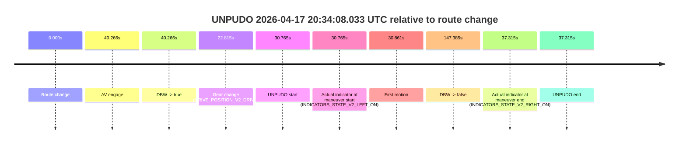
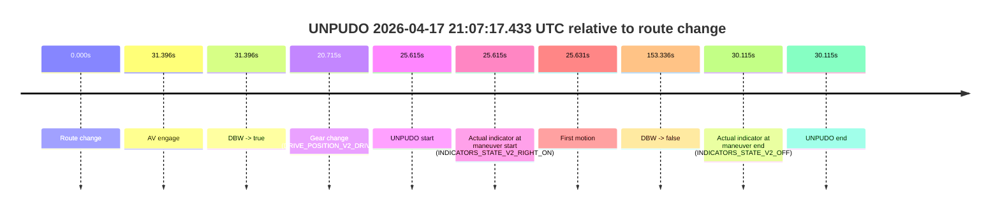
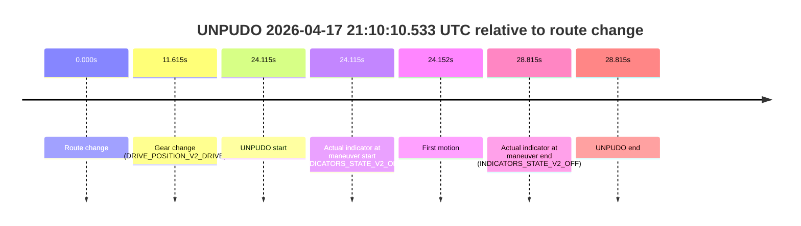
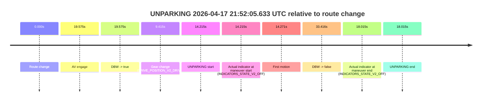
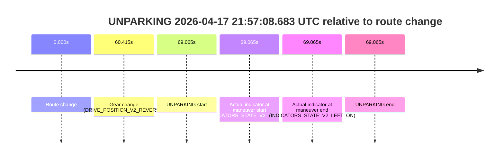

# Run Report: fme20018/2026-04-17--20-19-43--gen2-av-9d8e349e-651f-41ed-9b64-cf1c0512344f

| Field | Value |
|---|---|
| Run ID | `fme20018/2026-04-17--20-19-43--gen2-av-9d8e349e-651f-41ed-9b64-cf1c0512344f` |
| Date | `2026-04-17` |
| Model(s) | `apricot-crocodile-uproarious` |
| Author | `guy.geva` |
| Event count | `10` |

## unpudo 2026-04-17 20:34:08.033 UTC

| Field | Value |
|---|---|
| Model | `apricot-crocodile-uproarious` |
| Author | `guy.geva` |
| Run ID | `fme20018/2026-04-17--20-19-43--gen2-av-9d8e349e-651f-41ed-9b64-cf1c0512344f` |
| Date | `2026-04-17` |
| Time (UTC) | `20:34:08.033` |
| Event type | `unpudo` |
| Disengagement type | `none observed` |
| Route change | `found` |
| Console | [run](https://console.sso.wayve.ai/run/fme20018/2026-04-17--20-19-43--gen2-av-9d8e349e-651f-41ed-9b64-cf1c0512344f?id=&time-unixus=1776458048033306) |
| Foxglove | [segment](https://app.foxglove.dev/wayve-on-prem/p/prj_0dX18KZdVHg1fmmI/view?ds=foxglove-stream&ds.deviceName=fme20018&ds.start=2026-04-17T20%3A33%3A27.268266Z&ds.end=2026-04-17T20%3A36%3A14.653060Z&layoutId=lay_0e7VD4WIKDQGU73Y&time=2026-04-17T20%3A34%3A08.033306Z) |

### Event card: fail

- Fail: the credited unpudo does not stay AV-owned. The event window starts with DBW false, and the maneuver outcome lands outside a clean AV-owned segment.

| Event | Time (UTC) | Delta from route change |
|---|---:|---:|
| Route change | 2026-04-17 20:33:37.268 | `0.000s` |
| AV engage | 2026-04-17 20:34:17.534 | `40.266s` |
| DBW -> true | 2026-04-17 20:34:17.534 | `40.266s` |
| Gear change (DRIVE_POSITION_V2_DRIVE) | 2026-04-17 20:34:00.083 | `22.815s` |
| UNPUDO start | 2026-04-17 20:34:08.033 | `30.765s` |
| Actual indicator at maneuver start (INDICATORS_STATE_V2_LEFT_ON) | 2026-04-17 20:34:08.033 | `30.765s` |
| First motion | 2026-04-17 20:34:08.129 | `30.861s` |
| DBW -> false | 2026-04-17 20:36:04.653 | `147.385s` |
| Actual indicator at maneuver end (INDICATORS_STATE_V2_RIGHT_ON) | 2026-04-17 20:34:14.583 | `37.315s` |
| UNPUDO end | 2026-04-17 20:34:14.583 | `37.315s` |

| Metric | Value |
|---|---|
| Outcome | `fail` |
| Effective failure type | `completed_outside_av` |
| Route change status | `found` |
| DBW at event start | `false` |
| DBW at event end | `false` |
| Predicted gear at AV start | `DRIVE_POSITION_V2_DRIVE` |
| Actual gear at AV start | `DRIVE_POSITION_V2_DRIVE` |
| Predicted gear at event start | `DRIVE_POSITION_V2_DRIVE` |
| Actual gear at event start | `DRIVE_POSITION_V2_DRIVE` |
| Planned indicator direction | `INDICATORS_STATE_V2_LEFT_ON` |
| Controller indicator direction | `INDICATORS_STATE_V2_LEFT_ON` |
| Actual indicator direction | `INDICATORS_STATE_V2_LEFT_ON` |
| Actual indicator at maneuver end | `INDICATORS_STATE_V2_RIGHT_ON` |
| Driver accel help in AV | `false` |
| Driver accel help timestamp | `n/a` |
| Max accel pedal pct in AV | `0.0%` |
| Max brake pedal pct in AV | `0.0%` |
| Max speed mps in AV | `0.000` |
| Route -> AV | `40.266s` |
| AV -> event start | `-9.501s` |
| AV -> first motion | `-9.405s` |
| AV duration before disengagement | `107.119s` |
| Trajectory waypoint count | `36` |
| Driving-plan step count | `11` |

The scored portion starts from the AV-owned window, not from the pre-AV setup. Route-change search in the stopped pre-event segment was `found`, with the baseline therefore set to route change. At the event anchor the model predicts `DRIVE_POSITION_V2_DRIVE` and the actual gear is `DRIVE_POSITION_V2_DRIVE`. The effective model outcome is `fail` because `completed_outside_av`.

### Resolution

| Field | Value |
|---|---|
| Final outcome | `fail` |
| Do we agree with this label? | `yes` |
| Source disengagement type | `none observed` |
| Resolved effective failure type | `completed_outside_av` |
| Confidence | `high` |

## unpudo 2026-04-17 20:45:42.983 UTC

| Field | Value |
|---|---|
| Model | `apricot-crocodile-uproarious` |
| Author | `guy.geva` |
| Run ID | `fme20018/2026-04-17--20-19-43--gen2-av-9d8e349e-651f-41ed-9b64-cf1c0512344f` |
| Date | `2026-04-17` |
| Time (UTC) | `20:45:42.983` |
| Event type | `unpudo` |
| Disengagement type | `none observed` |
| Route change | `found` |
| Console | [run](https://console.sso.wayve.ai/run/fme20018/2026-04-17--20-19-43--gen2-av-9d8e349e-651f-41ed-9b64-cf1c0512344f?id=&time-unixus=1776458742983318) |
| Foxglove | [segment](https://app.foxglove.dev/wayve-on-prem/p/prj_0dX18KZdVHg1fmmI/view?ds=foxglove-stream&ds.deviceName=fme20018&ds.start=2026-04-17T20%3A45%3A07.268359Z&ds.end=2026-04-17T20%3A49%3A30.033130Z&layoutId=lay_0e7VD4WIKDQGU73Y&time=2026-04-17T20%3A45%3A42.983318Z) |

### Event card: fail

- Fail: the credited unpudo does not stay AV-owned. The event window starts with DBW false, and the maneuver outcome lands outside a clean AV-owned segment.

| Event | Time (UTC) | Delta from route change |
|---|---:|---:|
| Route change | 2026-04-17 20:45:17.268 | `0.000s` |
| AV engage | 2026-04-17 20:46:34.594 | `77.326s` |
| DBW -> true | 2026-04-17 20:46:34.594 | `77.326s` |
| Gear change (DRIVE_POSITION_V2_DRIVE) | 2026-04-17 20:45:39.083 | `21.815s` |
| UNPUDO start | 2026-04-17 20:45:42.983 | `25.715s` |
| Actual indicator at maneuver start (INDICATORS_STATE_V2_RIGHT_ON) | 2026-04-17 20:45:42.983 | `25.715s` |
| First motion | 2026-04-17 20:46:21.830 | `64.562s` |
| DBW -> false | 2026-04-17 20:49:20.033 | `242.765s` |
| Actual indicator at maneuver end (INDICATORS_STATE_V2_OFF) | 2026-04-17 20:46:27.533 | `70.265s` |
| UNPUDO end | 2026-04-17 20:46:27.533 | `70.265s` |

| Metric | Value |
|---|---|
| Outcome | `fail` |
| Effective failure type | `completed_outside_av` |
| Route change status | `found` |
| DBW at event start | `false` |
| DBW at event end | `false` |
| Predicted gear at AV start | `DRIVE_POSITION_V2_DRIVE` |
| Actual gear at AV start | `DRIVE_POSITION_V2_DRIVE` |
| Predicted gear at event start | `DRIVE_POSITION_V2_REVERSE` |
| Actual gear at event start | `DRIVE_POSITION_V2_DRIVE` |
| Planned indicator direction | `INDICATORS_STATE_V2_OFF` |
| Controller indicator direction | `INDICATORS_STATE_V2_OFF` |
| Actual indicator direction | `INDICATORS_STATE_V2_RIGHT_ON` |
| Actual indicator at maneuver end | `INDICATORS_STATE_V2_OFF` |
| Driver accel help in AV | `false` |
| Driver accel help timestamp | `n/a` |
| Max accel pedal pct in AV | `0.0%` |
| Max brake pedal pct in AV | `0.0%` |
| Max speed mps in AV | `0.000` |
| Route -> AV | `77.326s` |
| AV -> event start | `-51.611s` |
| AV -> first motion | `-12.764s` |
| AV duration before disengagement | `165.439s` |
| Trajectory waypoint count | `37` |
| Driving-plan step count | `11` |

The scored portion starts from the AV-owned window, not from the pre-AV setup. Route-change search in the stopped pre-event segment was `found`, with the baseline therefore set to route change. At the event anchor the model predicts `DRIVE_POSITION_V2_REVERSE` and the actual gear is `DRIVE_POSITION_V2_DRIVE`. The effective model outcome is `fail` because `completed_outside_av`.

### Resolution

| Field | Value |
|---|---|
| Final outcome | `fail` |
| Do we agree with this label? | `yes` |
| Source disengagement type | `none observed` |
| Resolved effective failure type | `completed_outside_av` |
| Confidence | `high` |

## unpudo 2026-04-17 21:07:17.433 UTC

| Field | Value |
|---|---|
| Model | `apricot-crocodile-uproarious` |
| Author | `guy.geva` |
| Run ID | `fme20018/2026-04-17--20-19-43--gen2-av-9d8e349e-651f-41ed-9b64-cf1c0512344f` |
| Date | `2026-04-17` |
| Time (UTC) | `21:07:17.433` |
| Event type | `unpudo` |
| Disengagement type | `none observed` |
| Route change | `found` |
| Console | [run](https://console.sso.wayve.ai/run/fme20018/2026-04-17--20-19-43--gen2-av-9d8e349e-651f-41ed-9b64-cf1c0512344f?id=&time-unixus=1776460037433293) |
| Foxglove | [segment](https://app.foxglove.dev/wayve-on-prem/p/prj_0dX18KZdVHg1fmmI/view?ds=foxglove-stream&ds.deviceName=fme20018&ds.start=2026-04-17T21%3A06%3A41.818274Z&ds.end=2026-04-17T21%3A09%3A35.153953Z&layoutId=lay_0e7VD4WIKDQGU73Y&time=2026-04-17T21%3A07%3A17.433293Z) |

### Event card: fail

- Fail: the credited unpudo does not stay AV-owned. The event window starts with DBW false, and the maneuver outcome lands outside a clean AV-owned segment.

| Event | Time (UTC) | Delta from route change |
|---|---:|---:|
| Route change | 2026-04-17 21:06:51.818 | `0.000s` |
| AV engage | 2026-04-17 21:07:23.214 | `31.396s` |
| DBW -> true | 2026-04-17 21:07:23.214 | `31.396s` |
| Gear change (DRIVE_POSITION_V2_DRIVE) | 2026-04-17 21:07:12.533 | `20.715s` |
| UNPUDO start | 2026-04-17 21:07:17.433 | `25.615s` |
| Actual indicator at maneuver start (INDICATORS_STATE_V2_RIGHT_ON) | 2026-04-17 21:07:17.433 | `25.615s` |
| First motion | 2026-04-17 21:07:17.449 | `25.631s` |
| DBW -> false | 2026-04-17 21:09:25.153 | `153.336s` |
| Actual indicator at maneuver end (INDICATORS_STATE_V2_OFF) | 2026-04-17 21:07:21.933 | `30.115s` |
| UNPUDO end | 2026-04-17 21:07:21.933 | `30.115s` |

| Metric | Value |
|---|---|
| Outcome | `fail` |
| Effective failure type | `completed_outside_av` |
| Route change status | `found` |
| DBW at event start | `false` |
| DBW at event end | `false` |
| Predicted gear at AV start | `DRIVE_POSITION_V2_DRIVE` |
| Actual gear at AV start | `DRIVE_POSITION_V2_DRIVE` |
| Predicted gear at event start | `DRIVE_POSITION_V2_DRIVE` |
| Actual gear at event start | `DRIVE_POSITION_V2_DRIVE` |
| Planned indicator direction | `INDICATORS_STATE_V2_OFF` |
| Controller indicator direction | `INDICATORS_STATE_V2_OFF` |
| Actual indicator direction | `INDICATORS_STATE_V2_RIGHT_ON` |
| Actual indicator at maneuver end | `INDICATORS_STATE_V2_OFF` |
| Driver accel help in AV | `false` |
| Driver accel help timestamp | `n/a` |
| Max accel pedal pct in AV | `0.0%` |
| Max brake pedal pct in AV | `0.0%` |
| Max speed mps in AV | `0.000` |
| Route -> AV | `31.396s` |
| AV -> event start | `-5.781s` |
| AV -> first motion | `-5.765s` |
| AV duration before disengagement | `121.940s` |
| Trajectory waypoint count | `36` |
| Driving-plan step count | `11` |

The scored portion starts from the AV-owned window, not from the pre-AV setup. Route-change search in the stopped pre-event segment was `found`, with the baseline therefore set to route change. At the event anchor the model predicts `DRIVE_POSITION_V2_DRIVE` and the actual gear is `DRIVE_POSITION_V2_DRIVE`. The effective model outcome is `fail` because `completed_outside_av`.

### Resolution

| Field | Value |
|---|---|
| Final outcome | `fail` |
| Do we agree with this label? | `yes` |
| Source disengagement type | `none observed` |
| Resolved effective failure type | `completed_outside_av` |
| Confidence | `high` |

## unpudo 2026-04-17 21:10:10.533 UTC

| Field | Value |
|---|---|
| Model | `apricot-crocodile-uproarious` |
| Author | `guy.geva` |
| Run ID | `fme20018/2026-04-17--20-19-43--gen2-av-9d8e349e-651f-41ed-9b64-cf1c0512344f` |
| Date | `2026-04-17` |
| Time (UTC) | `21:10:10.533` |
| Event type | `unpudo` |
| Disengagement type | `none observed` |
| Route change | `found` |
| Console | [run](https://console.sso.wayve.ai/run/fme20018/2026-04-17--20-19-43--gen2-av-9d8e349e-651f-41ed-9b64-cf1c0512344f?id=&time-unixus=1776460210533315) |
| Foxglove | [segment](https://app.foxglove.dev/wayve-on-prem/p/prj_0dX18KZdVHg1fmmI/view?ds=foxglove-stream&ds.deviceName=fme20018&ds.start=2026-04-17T21%3A09%3A36.418291Z&ds.end=2026-04-17T21%3A10%3A25.233303Z&layoutId=lay_0e7VD4WIKDQGU73Y&time=2026-04-17T21%3A10%3A10.533315Z) |

### Event card: fail

- Fail: the credited unpudo does not stay AV-owned. The event window starts with DBW false, and the maneuver outcome lands outside a clean AV-owned segment.

| Event | Time (UTC) | Delta from route change |
|---|---:|---:|
| Route change | 2026-04-17 21:09:46.418 | `0.000s` |
| Gear change (DRIVE_POSITION_V2_DRIVE) | 2026-04-17 21:09:58.033 | `11.615s` |
| UNPUDO start | 2026-04-17 21:10:10.533 | `24.115s` |
| Actual indicator at maneuver start (INDICATORS_STATE_V2_OFF) | 2026-04-17 21:10:10.533 | `24.115s` |
| First motion | 2026-04-17 21:10:10.569 | `24.152s` |
| Actual indicator at maneuver end (INDICATORS_STATE_V2_OFF) | 2026-04-17 21:10:15.233 | `28.815s` |
| UNPUDO end | 2026-04-17 21:10:15.233 | `28.815s` |

| Metric | Value |
|---|---|
| Outcome | `fail` |
| Effective failure type | `not_av_owned` |
| Route change status | `found` |
| DBW at event start | `false` |
| DBW at event end | `false` |
| Predicted gear at AV start | `n/a` |
| Actual gear at AV start | `n/a` |
| Predicted gear at event start | `DRIVE_POSITION_V2_DRIVE` |
| Actual gear at event start | `DRIVE_POSITION_V2_DRIVE` |
| Planned indicator direction | `INDICATORS_STATE_V2_RIGHT_ON` |
| Controller indicator direction | `INDICATORS_STATE_V2_RIGHT_ON` |
| Actual indicator direction | `INDICATORS_STATE_V2_OFF` |
| Actual indicator at maneuver end | `INDICATORS_STATE_V2_OFF` |
| Driver accel help in AV | `false` |
| Driver accel help timestamp | `n/a` |
| Max accel pedal pct in AV | `0.0%` |
| Max brake pedal pct in AV | `0.0%` |
| Max speed mps in AV | `0.000` |
| Route -> AV | `n/a` |
| AV -> event start | `n/a` |
| AV -> first motion | `n/a` |
| AV duration before disengagement | `n/a` |
| Trajectory waypoint count | `36` |
| Driving-plan step count | `11` |

The scored portion starts from the AV-owned window, not from the pre-AV setup. Route-change search in the stopped pre-event segment was `found`, with the baseline therefore set to route change. At the event anchor the model predicts `DRIVE_POSITION_V2_DRIVE` and the actual gear is `DRIVE_POSITION_V2_DRIVE`. The effective model outcome is `fail` because `not_av_owned`.

### Resolution

| Field | Value |
|---|---|
| Final outcome | `fail` |
| Do we agree with this label? | `yes` |
| Source disengagement type | `none observed` |
| Resolved effective failure type | `not_av_owned` |
| Confidence | `high` |

## unpudo 2026-04-17 21:15:05.083 UTC

| Field | Value |
|---|---|
| Model | `apricot-crocodile-uproarious` |
| Author | `guy.geva` |
| Run ID | `fme20018/2026-04-17--20-19-43--gen2-av-9d8e349e-651f-41ed-9b64-cf1c0512344f` |
| Date | `2026-04-17` |
| Time (UTC) | `21:15:05.083` |
| Event type | `unpudo` |
| Disengagement type | `none observed` |
| Route change | `found` |
| Console | [run](https://console.sso.wayve.ai/run/fme20018/2026-04-17--20-19-43--gen2-av-9d8e349e-651f-41ed-9b64-cf1c0512344f?id=&time-unixus=1776460505083310) |
| Foxglove | [segment](https://app.foxglove.dev/wayve-on-prem/p/prj_0dX18KZdVHg1fmmI/view?ds=foxglove-stream&ds.deviceName=fme20018&ds.start=2026-04-17T21%3A13%3A24.518515Z&ds.end=2026-04-17T21%3A17%3A10.513072Z&layoutId=lay_0e7VD4WIKDQGU73Y&time=2026-04-17T21%3A15%3A05.083310Z) |

### Event card: fail

- Fail: the credited unpudo does not stay AV-owned. The event window starts with DBW false, and the maneuver outcome lands outside a clean AV-owned segment.

| Event | Time (UTC) | Delta from route change |
|---|---:|---:|
| Route change | 2026-04-17 21:13:34.518 | `0.000s` |
| AV engage | 2026-04-17 21:15:15.114 | `100.596s` |
| DBW -> true | 2026-04-17 21:15:15.114 | `100.596s` |
| Gear change (DRIVE_POSITION_V2_DRIVE) | 2026-04-17 21:15:02.083 | `87.565s` |
| UNPUDO start | 2026-04-17 21:15:05.083 | `90.565s` |
| Actual indicator at maneuver start (INDICATORS_STATE_V2_LEFT_ON) | 2026-04-17 21:15:05.083 | `90.565s` |
| First motion | 2026-04-17 21:15:05.109 | `90.591s` |
| DBW -> false | 2026-04-17 21:17:00.513 | `205.995s` |
| Actual indicator at maneuver end (INDICATORS_STATE_V2_OFF) | 2026-04-17 21:15:09.833 | `95.315s` |
| UNPUDO end | 2026-04-17 21:15:09.833 | `95.315s` |

| Metric | Value |
|---|---|
| Outcome | `fail` |
| Effective failure type | `completed_outside_av` |
| Route change status | `found` |
| DBW at event start | `false` |
| DBW at event end | `false` |
| Predicted gear at AV start | `DRIVE_POSITION_V2_DRIVE` |
| Actual gear at AV start | `DRIVE_POSITION_V2_DRIVE` |
| Predicted gear at event start | `DRIVE_POSITION_V2_DRIVE` |
| Actual gear at event start | `DRIVE_POSITION_V2_DRIVE` |
| Planned indicator direction | `INDICATORS_STATE_V2_LEFT_ON` |
| Controller indicator direction | `INDICATORS_STATE_V2_LEFT_ON` |
| Actual indicator direction | `INDICATORS_STATE_V2_LEFT_ON` |
| Actual indicator at maneuver end | `INDICATORS_STATE_V2_OFF` |
| Driver accel help in AV | `false` |
| Driver accel help timestamp | `n/a` |
| Max accel pedal pct in AV | `0.0%` |
| Max brake pedal pct in AV | `0.0%` |
| Max speed mps in AV | `0.000` |
| Route -> AV | `100.596s` |
| AV -> event start | `-10.031s` |
| AV -> first motion | `-10.005s` |
| AV duration before disengagement | `105.399s` |
| Trajectory waypoint count | `37` |
| Driving-plan step count | `11` |

The scored portion starts from the AV-owned window, not from the pre-AV setup. Route-change search in the stopped pre-event segment was `found`, with the baseline therefore set to route change. At the event anchor the model predicts `DRIVE_POSITION_V2_DRIVE` and the actual gear is `DRIVE_POSITION_V2_DRIVE`. The effective model outcome is `fail` because `completed_outside_av`.

### Resolution

| Field | Value |
|---|---|
| Final outcome | `fail` |
| Do we agree with this label? | `yes` |
| Source disengagement type | `none observed` |
| Resolved effective failure type | `completed_outside_av` |
| Confidence | `high` |

## unpudo 2026-04-17 21:17:48.333 UTC

| Field | Value |
|---|---|
| Model | `apricot-crocodile-uproarious` |
| Author | `guy.geva` |
| Run ID | `fme20018/2026-04-17--20-19-43--gen2-av-9d8e349e-651f-41ed-9b64-cf1c0512344f` |
| Date | `2026-04-17` |
| Time (UTC) | `21:17:48.333` |
| Event type | `unpudo` |
| Disengagement type | `none observed` |
| Route change | `found` |
| Console | [run](https://console.sso.wayve.ai/run/fme20018/2026-04-17--20-19-43--gen2-av-9d8e349e-651f-41ed-9b64-cf1c0512344f?id=&time-unixus=1776460668333318) |
| Foxglove | [segment](https://app.foxglove.dev/wayve-on-prem/p/prj_0dX18KZdVHg1fmmI/view?ds=foxglove-stream&ds.deviceName=fme20018&ds.start=2026-04-17T21%3A17%3A12.868267Z&ds.end=2026-04-17T21%3A21%3A31.473110Z&layoutId=lay_0e7VD4WIKDQGU73Y&time=2026-04-17T21%3A17%3A48.333318Z) |

### Event card: fail

- Fail: the credited unpudo does not stay AV-owned. The event window starts with DBW false, and the maneuver outcome lands outside a clean AV-owned segment.

| Event | Time (UTC) | Delta from route change |
|---|---:|---:|
| Route change | 2026-04-17 21:17:22.868 | `0.000s` |
| AV engage | 2026-04-17 21:18:02.573 | `39.705s` |
| DBW -> true | 2026-04-17 21:18:02.573 | `39.705s` |
| Gear change (DRIVE_POSITION_V2_DRIVE) | 2026-04-17 21:17:44.733 | `21.865s` |
| UNPUDO start | 2026-04-17 21:17:48.333 | `25.465s` |
| Actual indicator at maneuver start (INDICATORS_STATE_V2_RIGHT_ON) | 2026-04-17 21:17:48.333 | `25.465s` |
| First motion | 2026-04-17 21:17:48.389 | `25.521s` |
| DBW -> false | 2026-04-17 21:21:21.473 | `238.605s` |
| Actual indicator at maneuver end (INDICATORS_STATE_V2_OFF) | 2026-04-17 21:17:59.933 | `37.065s` |
| UNPUDO end | 2026-04-17 21:17:59.933 | `37.065s` |

| Metric | Value |
|---|---|
| Outcome | `fail` |
| Effective failure type | `completed_outside_av` |
| Route change status | `found` |
| DBW at event start | `false` |
| DBW at event end | `false` |
| Predicted gear at AV start | `DRIVE_POSITION_V2_DRIVE` |
| Actual gear at AV start | `DRIVE_POSITION_V2_DRIVE` |
| Predicted gear at event start | `DRIVE_POSITION_V2_REVERSE` |
| Actual gear at event start | `DRIVE_POSITION_V2_DRIVE` |
| Planned indicator direction | `INDICATORS_STATE_V2_OFF` |
| Controller indicator direction | `INDICATORS_STATE_V2_LEFT_ON` |
| Actual indicator direction | `INDICATORS_STATE_V2_RIGHT_ON` |
| Actual indicator at maneuver end | `INDICATORS_STATE_V2_OFF` |
| Driver accel help in AV | `false` |
| Driver accel help timestamp | `n/a` |
| Max accel pedal pct in AV | `0.0%` |
| Max brake pedal pct in AV | `0.0%` |
| Max speed mps in AV | `0.000` |
| Route -> AV | `39.705s` |
| AV -> event start | `-14.240s` |
| AV -> first motion | `-14.184s` |
| AV duration before disengagement | `198.900s` |
| Trajectory waypoint count | `36` |
| Driving-plan step count | `11` |

The scored portion starts from the AV-owned window, not from the pre-AV setup. Route-change search in the stopped pre-event segment was `found`, with the baseline therefore set to route change. At the event anchor the model predicts `DRIVE_POSITION_V2_REVERSE` and the actual gear is `DRIVE_POSITION_V2_DRIVE`. The effective model outcome is `fail` because `completed_outside_av`.

### Resolution

| Field | Value |
|---|---|
| Final outcome | `fail` |
| Do we agree with this label? | `yes` |
| Source disengagement type | `none observed` |
| Resolved effective failure type | `completed_outside_av` |
| Confidence | `high` |

## unpudo 2026-04-17 21:42:39.733 UTC

| Field | Value |
|---|---|
| Model | `apricot-crocodile-uproarious` |
| Author | `guy.geva` |
| Run ID | `fme20018/2026-04-17--20-19-43--gen2-av-9d8e349e-651f-41ed-9b64-cf1c0512344f` |
| Date | `2026-04-17` |
| Time (UTC) | `21:42:39.733` |
| Event type | `unpudo` |
| Disengagement type | `none observed` |
| Route change | `found` |
| Console | [run](https://console.sso.wayve.ai/run/fme20018/2026-04-17--20-19-43--gen2-av-9d8e349e-651f-41ed-9b64-cf1c0512344f?id=&time-unixus=1776462159733318) |
| Foxglove | [segment](https://app.foxglove.dev/wayve-on-prem/p/prj_0dX18KZdVHg1fmmI/view?ds=foxglove-stream&ds.deviceName=fme20018&ds.start=2026-04-17T21%3A41%3A19.868252Z&ds.end=2026-04-17T21%3A43%3A27.733308Z&layoutId=lay_0e7VD4WIKDQGU73Y&time=2026-04-17T21%3A42%3A39.733318Z) |

### Event card: fail

- Fail: the credited unpudo does not stay AV-owned. The event window starts with DBW false, and the maneuver outcome lands outside a clean AV-owned segment.

| Event | Time (UTC) | Delta from route change |
|---|---:|---:|
| Route change | 2026-04-17 21:41:29.868 | `0.000s` |
| AV engage | 2026-04-17 21:42:57.533 | `87.665s` |
| DBW -> true | 2026-04-17 21:42:57.533 | `87.665s` |
| Gear change (DRIVE_POSITION_V2_DRIVE) | 2026-04-17 21:42:37.433 | `67.565s` |
| UNPUDO start | 2026-04-17 21:42:39.733 | `69.865s` |
| Actual indicator at maneuver start (INDICATORS_STATE_V2_OFF) | 2026-04-17 21:42:39.733 | `69.865s` |
| First motion | 2026-04-17 21:42:39.789 | `69.921s` |
| DBW -> false | 2026-04-17 21:43:13.472 | `103.604s` |
| Actual indicator at maneuver end (INDICATORS_STATE_V2_OFF) | 2026-04-17 21:43:17.733 | `107.865s` |
| UNPUDO end | 2026-04-17 21:43:17.733 | `107.865s` |

| Metric | Value |
|---|---|
| Outcome | `fail` |
| Effective failure type | `completed_outside_av` |
| Route change status | `found` |
| DBW at event start | `false` |
| DBW at event end | `false` |
| Predicted gear at AV start | `DRIVE_POSITION_V2_REVERSE` |
| Actual gear at AV start | `DRIVE_POSITION_V2_PARK` |
| Predicted gear at event start | `DRIVE_POSITION_V2_DRIVE` |
| Actual gear at event start | `DRIVE_POSITION_V2_DRIVE` |
| Planned indicator direction | `INDICATORS_STATE_V2_RIGHT_ON` |
| Controller indicator direction | `INDICATORS_STATE_V2_RIGHT_ON` |
| Actual indicator direction | `INDICATORS_STATE_V2_OFF` |
| Actual indicator at maneuver end | `INDICATORS_STATE_V2_OFF` |
| Driver accel help in AV | `false` |
| Driver accel help timestamp | `n/a` |
| Max accel pedal pct in AV | `0.0%` |
| Max brake pedal pct in AV | `8.8%` |
| Max speed mps in AV | `0.000` |
| Route -> AV | `87.665s` |
| AV -> event start | `-17.800s` |
| AV -> first motion | `-17.744s` |
| AV duration before disengagement | `15.939s` |
| Trajectory waypoint count | `36` |
| Driving-plan step count | `11` |

The scored portion starts from the AV-owned window, not from the pre-AV setup. Route-change search in the stopped pre-event segment was `found`, with the baseline therefore set to route change. At the event anchor the model predicts `DRIVE_POSITION_V2_DRIVE` and the actual gear is `DRIVE_POSITION_V2_DRIVE`. The effective model outcome is `fail` because `completed_outside_av`.

### Resolution

| Field | Value |
|---|---|
| Final outcome | `fail` |
| Do we agree with this label? | `yes` |
| Source disengagement type | `none observed` |
| Resolved effective failure type | `completed_outside_av` |
| Confidence | `high` |

## unpudo 2026-04-17 21:50:36.733 UTC

| Field | Value |
|---|---|
| Model | `apricot-crocodile-uproarious` |
| Author | `guy.geva` |
| Run ID | `fme20018/2026-04-17--20-19-43--gen2-av-9d8e349e-651f-41ed-9b64-cf1c0512344f` |
| Date | `2026-04-17` |
| Time (UTC) | `21:50:36.733` |
| Event type | `unpudo` |
| Disengagement type | `none observed` |
| Route change | `found` |
| Console | [run](https://console.sso.wayve.ai/run/fme20018/2026-04-17--20-19-43--gen2-av-9d8e349e-651f-41ed-9b64-cf1c0512344f?id=&time-unixus=1776462636733326) |
| Foxglove | [segment](https://app.foxglove.dev/wayve-on-prem/p/prj_0dX18KZdVHg1fmmI/view?ds=foxglove-stream&ds.deviceName=fme20018&ds.start=2026-04-17T21%3A49%3A35.568234Z&ds.end=2026-04-17T21%3A51%3A23.713037Z&layoutId=lay_0e7VD4WIKDQGU73Y&time=2026-04-17T21%3A50%3A36.733326Z) |

### Event card: fail

- Fail: the credited unpudo does not stay AV-owned. The event window starts with DBW false, and the maneuver outcome lands outside a clean AV-owned segment.

| Event | Time (UTC) | Delta from route change |
|---|---:|---:|
| Route change | 2026-04-17 21:49:45.568 | `0.000s` |
| AV engage | 2026-04-17 21:50:46.434 | `60.866s` |
| DBW -> true | 2026-04-17 21:50:46.434 | `60.866s` |
| Gear change (DRIVE_POSITION_V2_DRIVE) | 2026-04-17 21:50:26.883 | `41.315s` |
| UNPUDO start | 2026-04-17 21:50:36.733 | `51.165s` |
| Actual indicator at maneuver start (INDICATORS_STATE_V2_RIGHT_ON) | 2026-04-17 21:50:36.733 | `51.165s` |
| First motion | 2026-04-17 21:50:36.749 | `51.182s` |
| DBW -> false | 2026-04-17 21:51:13.713 | `88.145s` |
| Actual indicator at maneuver end (INDICATORS_STATE_V2_OFF) | 2026-04-17 21:50:44.033 | `58.465s` |
| UNPUDO end | 2026-04-17 21:50:44.033 | `58.465s` |

| Metric | Value |
|---|---|
| Outcome | `fail` |
| Effective failure type | `completed_outside_av` |
| Route change status | `found` |
| DBW at event start | `false` |
| DBW at event end | `false` |
| Predicted gear at AV start | `DRIVE_POSITION_V2_DRIVE` |
| Actual gear at AV start | `DRIVE_POSITION_V2_DRIVE` |
| Predicted gear at event start | `DRIVE_POSITION_V2_REVERSE` |
| Actual gear at event start | `DRIVE_POSITION_V2_DRIVE` |
| Planned indicator direction | `INDICATORS_STATE_V2_RIGHT_ON` |
| Controller indicator direction | `INDICATORS_STATE_V2_RIGHT_ON` |
| Actual indicator direction | `INDICATORS_STATE_V2_RIGHT_ON` |
| Actual indicator at maneuver end | `INDICATORS_STATE_V2_OFF` |
| Driver accel help in AV | `false` |
| Driver accel help timestamp | `n/a` |
| Max accel pedal pct in AV | `0.0%` |
| Max brake pedal pct in AV | `0.0%` |
| Max speed mps in AV | `0.000` |
| Route -> AV | `60.866s` |
| AV -> event start | `-9.701s` |
| AV -> first motion | `-9.684s` |
| AV duration before disengagement | `27.279s` |
| Trajectory waypoint count | `36` |
| Driving-plan step count | `11` |

The scored portion starts from the AV-owned window, not from the pre-AV setup. Route-change search in the stopped pre-event segment was `found`, with the baseline therefore set to route change. At the event anchor the model predicts `DRIVE_POSITION_V2_REVERSE` and the actual gear is `DRIVE_POSITION_V2_DRIVE`. The effective model outcome is `fail` because `completed_outside_av`.

### Resolution

| Field | Value |
|---|---|
| Final outcome | `fail` |
| Do we agree with this label? | `yes` |
| Source disengagement type | `none observed` |
| Resolved effective failure type | `completed_outside_av` |
| Confidence | `high` |

## unparking 2026-04-17 21:52:05.633 UTC

| Field | Value |
|---|---|
| Model | `apricot-crocodile-uproarious` |
| Author | `guy.geva` |
| Run ID | `fme20018/2026-04-17--20-19-43--gen2-av-9d8e349e-651f-41ed-9b64-cf1c0512344f` |
| Date | `2026-04-17` |
| Time (UTC) | `21:52:05.633` |
| Event type | `unparking` |
| Disengagement type | `none observed` |
| Route change | `found` |
| Console | [run](https://console.sso.wayve.ai/run/fme20018/2026-04-17--20-19-43--gen2-av-9d8e349e-651f-41ed-9b64-cf1c0512344f?id=&time-unixus=1776462725633312) |
| Foxglove | [segment](https://app.foxglove.dev/wayve-on-prem/p/prj_0dX18KZdVHg1fmmI/view?ds=foxglove-stream&ds.deviceName=fme20018&ds.start=2026-04-17T21%3A51%3A41.418221Z&ds.end=2026-04-17T21%3A52%3A34.834327Z&layoutId=lay_0e7VD4WIKDQGU73Y&time=2026-04-17T21%3A52%3A05.633312Z) |

### Event card: fail

- Fail: the credited unparking does not stay AV-owned. The event window starts with DBW false, and the maneuver outcome lands outside a clean AV-owned segment.

| Event | Time (UTC) | Delta from route change |
|---|---:|---:|
| Route change | 2026-04-17 21:51:51.418 | `0.000s` |
| AV engage | 2026-04-17 21:52:10.993 | `19.575s` |
| DBW -> true | 2026-04-17 21:52:10.993 | `19.575s` |
| Gear change (DRIVE_POSITION_V2_DRIVE) | 2026-04-17 21:52:00.833 | `9.415s` |
| UNPARKING start | 2026-04-17 21:52:05.633 | `14.215s` |
| Actual indicator at maneuver start (INDICATORS_STATE_V2_OFF) | 2026-04-17 21:52:05.633 | `14.215s` |
| First motion | 2026-04-17 21:52:05.689 | `14.271s` |
| DBW -> false | 2026-04-17 21:52:24.834 | `33.416s` |
| Actual indicator at maneuver end (INDICATORS_STATE_V2_OFF) | 2026-04-17 21:52:09.433 | `18.015s` |
| UNPARKING end | 2026-04-17 21:52:09.433 | `18.015s` |

| Metric | Value |
|---|---|
| Outcome | `fail` |
| Effective failure type | `completed_outside_av` |
| Route change status | `found` |
| DBW at event start | `false` |
| DBW at event end | `false` |
| Predicted gear at AV start | `DRIVE_POSITION_V2_DRIVE` |
| Actual gear at AV start | `DRIVE_POSITION_V2_DRIVE` |
| Predicted gear at event start | `DRIVE_POSITION_V2_REVERSE` |
| Actual gear at event start | `DRIVE_POSITION_V2_DRIVE` |
| Planned indicator direction | `INDICATORS_STATE_V2_OFF` |
| Controller indicator direction | `INDICATORS_STATE_V2_OFF` |
| Actual indicator direction | `INDICATORS_STATE_V2_OFF` |
| Actual indicator at maneuver end | `INDICATORS_STATE_V2_OFF` |
| Driver accel help in AV | `false` |
| Driver accel help timestamp | `n/a` |
| Max accel pedal pct in AV | `0.0%` |
| Max brake pedal pct in AV | `0.0%` |
| Max speed mps in AV | `0.000` |
| Route -> AV | `19.575s` |
| AV -> event start | `-5.360s` |
| AV -> first motion | `-5.304s` |
| AV duration before disengagement | `13.841s` |
| Trajectory waypoint count | `36` |
| Driving-plan step count | `11` |

The scored portion starts from the AV-owned window, not from the pre-AV setup. Route-change search in the stopped pre-event segment was `found`, with the baseline therefore set to route change. At the event anchor the model predicts `DRIVE_POSITION_V2_REVERSE` and the actual gear is `DRIVE_POSITION_V2_DRIVE`. The effective model outcome is `fail` because `completed_outside_av`.

### Resolution

| Field | Value |
|---|---|
| Final outcome | `fail` |
| Do we agree with this label? | `yes` |
| Source disengagement type | `none observed` |
| Resolved effective failure type | `completed_outside_av` |
| Confidence | `high` |

## unparking 2026-04-17 21:57:08.683 UTC

| Field | Value |
|---|---|
| Model | `apricot-crocodile-uproarious` |
| Author | `guy.geva` |
| Run ID | `fme20018/2026-04-17--20-19-43--gen2-av-9d8e349e-651f-41ed-9b64-cf1c0512344f` |
| Date | `2026-04-17` |
| Time (UTC) | `21:57:08.683` |
| Event type | `unparking` |
| Disengagement type | `none observed` |
| Route change | `found` |
| Console | [run](https://console.sso.wayve.ai/run/fme20018/2026-04-17--20-19-43--gen2-av-9d8e349e-651f-41ed-9b64-cf1c0512344f?id=&time-unixus=1776463028683304) |
| Foxglove | [segment](https://app.foxglove.dev/wayve-on-prem/p/prj_0dX18KZdVHg1fmmI/view?ds=foxglove-stream&ds.deviceName=fme20018&ds.start=2026-04-17T21%3A55%3A49.618182Z&ds.end=2026-04-17T21%3A57%3A18.683304Z&layoutId=lay_0e7VD4WIKDQGU73Y&time=2026-04-17T21%3A57%3A08.683304Z) |

### Event card: fail

- Fail: the credited unparking does not stay AV-owned. The event window starts with DBW false, and the maneuver outcome lands outside a clean AV-owned segment.

| Event | Time (UTC) | Delta from route change |
|---|---:|---:|
| Route change | 2026-04-17 21:55:59.618 | `0.000s` |
| Gear change (DRIVE_POSITION_V2_REVERSE) | 2026-04-17 21:57:00.033 | `60.415s` |
| UNPARKING start | 2026-04-17 21:57:08.683 | `69.065s` |
| Actual indicator at maneuver start (INDICATORS_STATE_V2_LEFT_ON) | 2026-04-17 21:57:08.683 | `69.065s` |
| Actual indicator at maneuver end (INDICATORS_STATE_V2_LEFT_ON) | 2026-04-17 21:57:08.683 | `69.065s` |
| UNPARKING end | 2026-04-17 21:57:08.683 | `69.065s` |

| Metric | Value |
|---|---|
| Outcome | `fail` |
| Effective failure type | `not_av_owned` |
| Route change status | `found` |
| DBW at event start | `false` |
| DBW at event end | `false` |
| Predicted gear at AV start | `n/a` |
| Actual gear at AV start | `n/a` |
| Predicted gear at event start | `DRIVE_POSITION_V2_REVERSE` |
| Actual gear at event start | `DRIVE_POSITION_V2_REVERSE` |
| Planned indicator direction | `INDICATORS_STATE_V2_OFF` |
| Controller indicator direction | `INDICATORS_STATE_V2_OFF` |
| Actual indicator direction | `INDICATORS_STATE_V2_LEFT_ON` |
| Actual indicator at maneuver end | `INDICATORS_STATE_V2_LEFT_ON` |
| Driver accel help in AV | `false` |
| Driver accel help timestamp | `n/a` |
| Max accel pedal pct in AV | `0.0%` |
| Max brake pedal pct in AV | `0.0%` |
| Max speed mps in AV | `0.000` |
| Route -> AV | `n/a` |
| AV -> event start | `n/a` |
| AV -> first motion | `n/a` |
| AV duration before disengagement | `n/a` |
| Trajectory waypoint count | `37` |
| Driving-plan step count | `11` |

The scored portion starts from the AV-owned window, not from the pre-AV setup. Route-change search in the stopped pre-event segment was `found`, with the baseline therefore set to route change. At the event anchor the model predicts `DRIVE_POSITION_V2_REVERSE` and the actual gear is `DRIVE_POSITION_V2_REVERSE`. The effective model outcome is `fail` because `not_av_owned`.

### Resolution

| Field | Value |
|---|---|
| Final outcome | `fail` |
| Do we agree with this label? | `yes` |
| Source disengagement type | `none observed` |
| Resolved effective failure type | `not_av_owned` |
| Confidence | `high` |
