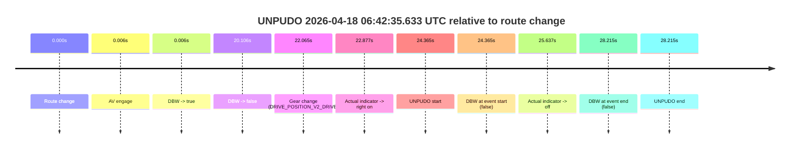
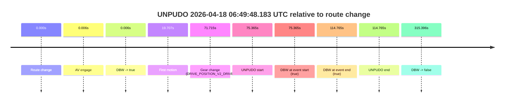
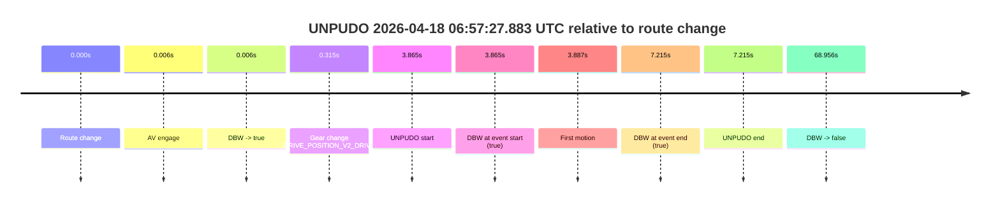
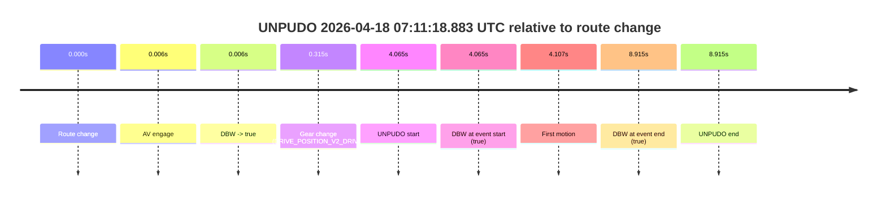

# Run Report: fme20018/2026-04-18--06-35-25--gen2-av-fd0ceb6b-9bbb-43a4-b633-e9d4320d234d

| Field | Value |
|---|---|
| Run ID | `fme20018/2026-04-18--06-35-25--gen2-av-fd0ceb6b-9bbb-43a4-b633-e9d4320d234d` |
| Date | `2026-04-18` |
| Model(s) | `eel-teal-outspoken` |
| Author | `zak` |
| Event count | `5` |

## unpudo 2026-04-18 06:42:35.633 UTC

| Field | Value |
|---|---|
| Model | `eel-teal-outspoken` |
| Author | `zak` |
| Run ID | `fme20018/2026-04-18--06-35-25--gen2-av-fd0ceb6b-9bbb-43a4-b633-e9d4320d234d` |
| Date | `2026-04-18` |
| Time (UTC) | `06:42:35.633` |
| Event type | `unpudo` |
| Disengagement type | `none observed` |
| Route change | `found` |
| Console | [run](https://console.sso.wayve.ai/run/fme20018/2026-04-18--06-35-25--gen2-av-fd0ceb6b-9bbb-43a4-b633-e9d4320d234d?id=&time-unixus=1776494555633300) |
| Foxglove | [segment](https://app.foxglove.dev/wayve-on-prem/p/prj_0dX18KZdVHg1fmmI/view?ds=foxglove-stream&ds.deviceName=fme20018&ds.start=2026-04-18T06%3A42%3A01.268268Z&ds.end=2026-04-18T06%3A42%3A49.483303Z&layoutId=lay_0e7VD4WIKDQGU73Y&time=2026-04-18T06%3A42%3A35.633300Z) |

### Event card: fail

- Fail: the credited unpudo does not stay AV-owned. The event window starts with DBW false, and the maneuver outcome lands outside a clean AV-owned segment.

| Event | Time (UTC) | Delta from route change |
|---|---:|---:|
| Route change | 2026-04-18 06:42:11.268 | `0.000s` |
| AV engage | 2026-04-18 06:42:11.274 | `0.006s` |
| DBW -> true | 2026-04-18 06:42:11.274 | `0.006s` |
| DBW -> false | 2026-04-18 06:42:31.374 | `20.106s` |
| Gear change (DRIVE_POSITION_V2_DRIVE) | 2026-04-18 06:42:33.333 | `22.065s` |
| Actual indicator -> right on | 2026-04-18 06:42:34.145 | `22.877s` |
| UNPUDO start | 2026-04-18 06:42:35.633 | `24.365s` |
| DBW at event start (false) | 2026-04-18 06:42:35.633 | `24.365s` |
| Actual indicator -> off | 2026-04-18 06:42:36.905 | `25.637s` |
| DBW at event end (false) | 2026-04-18 06:42:39.483 | `28.215s` |
| UNPUDO end | 2026-04-18 06:42:39.483 | `28.215s` |

| Metric | Value |
|---|---|
| Outcome | `fail` |
| Effective failure type | `not_av_owned` |
| Route change status | `found` |
| DBW at event start | `false` |
| DBW at event end | `false` |
| Predicted gear at AV start | `DRIVE_POSITION_V2_PARK` |
| Actual gear at AV start | `DRIVE_POSITION_V2_PARK` |
| Predicted gear at event start | `DRIVE_POSITION_V2_DRIVE` |
| Actual gear at event start | `DRIVE_POSITION_V2_DRIVE` |
| Planned indicator direction | `INDICATORS_STATE_V2_RIGHT_ON` |
| Controller indicator direction | `INDICATORS_STATE_V2_RIGHT_ON` |
| Actual indicator direction | `INDICATORS_STATE_V2_RIGHT_ON` |
| Actual indicator at maneuver end | `INDICATORS_STATE_V2_OFF` |
| Driver accel help in AV | `false` |
| Driver accel help timestamp | `n/a` |
| Max accel pedal pct in AV | `0.0%` |
| Max brake pedal pct in AV | `8.0%` |
| Max speed mps in AV | `0.000` |
| Success timing baseline | `route change` |
| Route -> AV | `0.006s` |
| AV -> event start | `24.359s` |
| AV -> first motion | `n/a` |
| Success baseline -> event start | `24.365s` |
| Success baseline -> first motion | `n/a` |
| AV duration before disengagement | `20.100s` |
| Trajectory waypoint count | `38` |
| Driving-plan step count | `11` |

The scored portion starts from the AV-owned window, not from the pre-AV setup. Route-change search in the stopped pre-event segment was `found`, with the baseline therefore set to route change. At the event anchor the model predicts `DRIVE_POSITION_V2_DRIVE` and the actual gear is `DRIVE_POSITION_V2_DRIVE`. The effective model outcome is `fail` because `not_av_owned.`

### Resolution

| Field | Value |
|---|---|
| Final outcome | `fail` |
| Do we agree with this label? | `yes` |
| Source disengagement type | `none observed` |
| Resolved effective failure type | `not_av_owned` |
| Confidence | `high` |

## unpudo 2026-04-18 06:48:52.483 UTC

| Field | Value |
|---|---|
| Model | `eel-teal-outspoken` |
| Author | `zak` |
| Run ID | `fme20018/2026-04-18--06-35-25--gen2-av-fd0ceb6b-9bbb-43a4-b633-e9d4320d234d` |
| Date | `2026-04-18` |
| Time (UTC) | `06:48:52.483` |
| Event type | `unpudo` |
| Disengagement type | `none observed` |
| Route change | `found` |
| Console | [run](https://console.sso.wayve.ai/run/fme20018/2026-04-18--06-35-25--gen2-av-fd0ceb6b-9bbb-43a4-b633-e9d4320d234d?id=&time-unixus=1776494932483309) |
| Foxglove | [segment](https://app.foxglove.dev/wayve-on-prem/p/prj_0dX18KZdVHg1fmmI/view?ds=foxglove-stream&ds.deviceName=fme20018&ds.start=2026-04-18T06%3A48%3A22.818268Z&ds.end=2026-04-18T06%3A53%3A58.213932Z&layoutId=lay_0e7VD4WIKDQGU73Y&time=2026-04-18T06%3A48%3A52.483309Z) |

### Event card: pass

- Pass: AV owns the credited unpudo from route change through the official unpudo window, the gear state is aligned at the anchor, and the vehicle moves without driver accelerator help in AV.

| Event | Time (UTC) | Delta from route change |
|---|---:|---:|
| Route change | 2026-04-18 06:48:32.818 | `0.000s` |
| AV engage | 2026-04-18 06:48:32.824 | `0.006s` |
| DBW -> true | 2026-04-18 06:48:32.824 | `0.006s` |
| Gear change (DRIVE_POSITION_V2_DRIVE) | 2026-04-18 06:48:33.133 | `0.315s` |
| UNPUDO start | 2026-04-18 06:48:52.483 | `19.665s` |
| DBW at event start (true) | 2026-04-18 06:48:52.483 | `19.665s` |
| First motion | 2026-04-18 06:48:52.524 | `19.707s` |
| DBW at event end (true) | 2026-04-18 06:48:55.883 | `23.065s` |
| UNPUDO end | 2026-04-18 06:48:55.883 | `23.065s` |
| DBW -> false | 2026-04-18 06:53:48.213 | `315.396s` |

| Metric | Value |
|---|---|
| Outcome | `pass` |
| Effective failure type | `none` |
| Route change status | `found` |
| DBW at event start | `true` |
| DBW at event end | `true` |
| Predicted gear at AV start | `DRIVE_POSITION_V2_PARK` |
| Actual gear at AV start | `DRIVE_POSITION_V2_PARK` |
| Predicted gear at event start | `DRIVE_POSITION_V2_DRIVE` |
| Actual gear at event start | `DRIVE_POSITION_V2_DRIVE` |
| Planned indicator direction | `INDICATORS_STATE_V2_LEFT_ON` |
| Controller indicator direction | `INDICATORS_STATE_V2_LEFT_ON` |
| Actual indicator direction | `INDICATORS_STATE_V2_OFF` |
| Actual indicator at maneuver end | `INDICATORS_STATE_V2_OFF` |
| Driver accel help in AV | `false` |
| Driver accel help timestamp | `n/a` |
| Max accel pedal pct in AV | `0.0%` |
| Max brake pedal pct in AV | `8.0%` |
| Max speed mps in AV | `5.311` |
| Success timing baseline | `route change` |
| Route -> AV | `0.006s` |
| AV -> event start | `19.659s` |
| AV -> first motion | `19.701s` |
| Success baseline -> event start | `19.665s` |
| Success baseline -> first motion | `19.707s` |
| AV duration before disengagement | `315.390s` |
| Trajectory waypoint count | `37` |
| Driving-plan step count | `11` |

The scored portion starts from the AV-owned window, not from the pre-AV setup. Route-change search in the stopped pre-event segment was `found`, with the baseline therefore set to route change. At the event anchor the model predicts `DRIVE_POSITION_V2_DRIVE` and the actual gear is `DRIVE_POSITION_V2_DRIVE`. The effective model outcome is `pass` because `the credited unpudo stays AV-owned through the official unpudo window.`

### Resolution

| Field | Value |
|---|---|
| Final outcome | `pass` |
| Do we agree with this label? | `yes` |
| Source disengagement type | `none observed` |
| Resolved effective failure type | `none` |
| Confidence | `high` |

## unpudo 2026-04-18 06:49:48.183 UTC

| Field | Value |
|---|---|
| Model | `eel-teal-outspoken` |
| Author | `zak` |
| Run ID | `fme20018/2026-04-18--06-35-25--gen2-av-fd0ceb6b-9bbb-43a4-b633-e9d4320d234d` |
| Date | `2026-04-18` |
| Time (UTC) | `06:49:48.183` |
| Event type | `unpudo` |
| Disengagement type | `none observed` |
| Route change | `found` |
| Console | [run](https://console.sso.wayve.ai/run/fme20018/2026-04-18--06-35-25--gen2-av-fd0ceb6b-9bbb-43a4-b633-e9d4320d234d?id=&time-unixus=1776494988183298) |
| Foxglove | [segment](https://app.foxglove.dev/wayve-on-prem/p/prj_0dX18KZdVHg1fmmI/view?ds=foxglove-stream&ds.deviceName=fme20018&ds.start=2026-04-18T06%3A48%3A22.818268Z&ds.end=2026-04-18T06%3A53%3A58.213932Z&layoutId=lay_0e7VD4WIKDQGU73Y&time=2026-04-18T06%3A49%3A48.183298Z) |

### Event card: pass

- Pass: AV owns the credited unpudo from route change through the official unpudo window, the gear state is aligned at the anchor, and the vehicle moves without driver accelerator help in AV.

| Event | Time (UTC) | Delta from route change |
|---|---:|---:|
| Route change | 2026-04-18 06:48:32.818 | `0.000s` |
| AV engage | 2026-04-18 06:48:32.824 | `0.006s` |
| DBW -> true | 2026-04-18 06:48:32.824 | `0.006s` |
| First motion | 2026-04-18 06:48:52.524 | `19.707s` |
| Gear change (DRIVE_POSITION_V2_DRIVE) | 2026-04-18 06:49:44.533 | `71.715s` |
| UNPUDO start | 2026-04-18 06:49:48.183 | `75.365s` |
| DBW at event start (true) | 2026-04-18 06:49:48.183 | `75.365s` |
| DBW at event end (true) | 2026-04-18 06:50:27.583 | `114.765s` |
| UNPUDO end | 2026-04-18 06:50:27.583 | `114.765s` |
| DBW -> false | 2026-04-18 06:53:48.213 | `315.396s` |

| Metric | Value |
|---|---|
| Outcome | `pass` |
| Effective failure type | `none` |
| Route change status | `found` |
| DBW at event start | `true` |
| DBW at event end | `true` |
| Predicted gear at AV start | `DRIVE_POSITION_V2_PARK` |
| Actual gear at AV start | `DRIVE_POSITION_V2_PARK` |
| Predicted gear at event start | `DRIVE_POSITION_V2_DRIVE` |
| Actual gear at event start | `DRIVE_POSITION_V2_DRIVE` |
| Planned indicator direction | `INDICATORS_STATE_V2_RIGHT_ON` |
| Controller indicator direction | `INDICATORS_STATE_V2_RIGHT_ON` |
| Actual indicator direction | `INDICATORS_STATE_V2_OFF` |
| Actual indicator at maneuver end | `INDICATORS_STATE_V2_OFF` |
| Driver accel help in AV | `false` |
| Driver accel help timestamp | `n/a` |
| Max accel pedal pct in AV | `0.0%` |
| Max brake pedal pct in AV | `8.3%` |
| Max speed mps in AV | `7.831` |
| Success timing baseline | `route change` |
| Route -> AV | `0.006s` |
| AV -> event start | `75.359s` |
| AV -> first motion | `19.701s` |
| Success baseline -> event start | `75.365s` |
| Success baseline -> first motion | `19.707s` |
| AV duration before disengagement | `315.390s` |
| Trajectory waypoint count | `37` |
| Driving-plan step count | `11` |

The scored portion starts from the AV-owned window, not from the pre-AV setup. Route-change search in the stopped pre-event segment was `found`, with the baseline therefore set to route change. At the event anchor the model predicts `DRIVE_POSITION_V2_DRIVE` and the actual gear is `DRIVE_POSITION_V2_DRIVE`. The effective model outcome is `pass` because `the credited unpudo stays AV-owned through the official unpudo window.`

### Resolution

| Field | Value |
|---|---|
| Final outcome | `pass` |
| Do we agree with this label? | `yes` |
| Source disengagement type | `none observed` |
| Resolved effective failure type | `none` |
| Confidence | `high` |

## unpudo 2026-04-18 06:57:27.883 UTC

| Field | Value |
|---|---|
| Model | `eel-teal-outspoken` |
| Author | `zak` |
| Run ID | `fme20018/2026-04-18--06-35-25--gen2-av-fd0ceb6b-9bbb-43a4-b633-e9d4320d234d` |
| Date | `2026-04-18` |
| Time (UTC) | `06:57:27.883` |
| Event type | `unpudo` |
| Disengagement type | `none observed` |
| Route change | `found` |
| Console | [run](https://console.sso.wayve.ai/run/fme20018/2026-04-18--06-35-25--gen2-av-fd0ceb6b-9bbb-43a4-b633-e9d4320d234d?id=&time-unixus=1776495447883306) |
| Foxglove | [segment](https://app.foxglove.dev/wayve-on-prem/p/prj_0dX18KZdVHg1fmmI/view?ds=foxglove-stream&ds.deviceName=fme20018&ds.start=2026-04-18T06%3A57%3A14.018254Z&ds.end=2026-04-18T06%3A58%3A42.973910Z&layoutId=lay_0e7VD4WIKDQGU73Y&time=2026-04-18T06%3A57%3A27.883306Z) |

### Event card: pass

- Pass: AV owns the credited unpudo from route change through the official unpudo window, the gear state is aligned at the anchor, and the vehicle moves without driver accelerator help in AV.

| Event | Time (UTC) | Delta from route change |
|---|---:|---:|
| Route change | 2026-04-18 06:57:24.018 | `0.000s` |
| AV engage | 2026-04-18 06:57:24.024 | `0.006s` |
| DBW -> true | 2026-04-18 06:57:24.024 | `0.006s` |
| Gear change (DRIVE_POSITION_V2_DRIVE) | 2026-04-18 06:57:24.333 | `0.315s` |
| UNPUDO start | 2026-04-18 06:57:27.883 | `3.865s` |
| DBW at event start (true) | 2026-04-18 06:57:27.883 | `3.865s` |
| First motion | 2026-04-18 06:57:27.905 | `3.887s` |
| DBW at event end (true) | 2026-04-18 06:57:31.233 | `7.215s` |
| UNPUDO end | 2026-04-18 06:57:31.233 | `7.215s` |
| DBW -> false | 2026-04-18 06:58:32.973 | `68.956s` |

| Metric | Value |
|---|---|
| Outcome | `pass` |
| Effective failure type | `none` |
| Route change status | `found` |
| DBW at event start | `true` |
| DBW at event end | `true` |
| Predicted gear at AV start | `DRIVE_POSITION_V2_PARK` |
| Actual gear at AV start | `DRIVE_POSITION_V2_PARK` |
| Predicted gear at event start | `DRIVE_POSITION_V2_DRIVE` |
| Actual gear at event start | `DRIVE_POSITION_V2_DRIVE` |
| Planned indicator direction | `INDICATORS_STATE_V2_RIGHT_ON` |
| Controller indicator direction | `INDICATORS_STATE_V2_RIGHT_ON` |
| Actual indicator direction | `INDICATORS_STATE_V2_OFF` |
| Actual indicator at maneuver end | `INDICATORS_STATE_V2_OFF` |
| Driver accel help in AV | `false` |
| Driver accel help timestamp | `n/a` |
| Max accel pedal pct in AV | `0.0%` |
| Max brake pedal pct in AV | `8.0%` |
| Max speed mps in AV | `5.414` |
| Success timing baseline | `route change` |
| Route -> AV | `0.006s` |
| AV -> event start | `3.859s` |
| AV -> first motion | `3.881s` |
| Success baseline -> event start | `3.865s` |
| Success baseline -> first motion | `3.887s` |
| AV duration before disengagement | `68.950s` |
| Trajectory waypoint count | `37` |
| Driving-plan step count | `11` |

The scored portion starts from the AV-owned window, not from the pre-AV setup. Route-change search in the stopped pre-event segment was `found`, with the baseline therefore set to route change. At the event anchor the model predicts `DRIVE_POSITION_V2_DRIVE` and the actual gear is `DRIVE_POSITION_V2_DRIVE`. The effective model outcome is `pass` because `the credited unpudo stays AV-owned through the official unpudo window.`

### Resolution

| Field | Value |
|---|---|
| Final outcome | `pass` |
| Do we agree with this label? | `yes` |
| Source disengagement type | `none observed` |
| Resolved effective failure type | `none` |
| Confidence | `high` |

## unpudo 2026-04-18 07:11:18.883 UTC

| Field | Value |
|---|---|
| Model | `eel-teal-outspoken` |
| Author | `zak` |
| Run ID | `fme20018/2026-04-18--06-35-25--gen2-av-fd0ceb6b-9bbb-43a4-b633-e9d4320d234d` |
| Date | `2026-04-18` |
| Time (UTC) | `07:11:18.883` |
| Event type | `unpudo` |
| Disengagement type | `none observed` |
| Route change | `found` |
| Console | [run](https://console.sso.wayve.ai/run/fme20018/2026-04-18--06-35-25--gen2-av-fd0ceb6b-9bbb-43a4-b633-e9d4320d234d?id=&time-unixus=1776496278883308) |
| Foxglove | [segment](https://app.foxglove.dev/wayve-on-prem/p/prj_0dX18KZdVHg1fmmI/view?ds=foxglove-stream&ds.deviceName=fme20018&ds.start=2026-04-18T07%3A11%3A04.818252Z&ds.end=2026-04-18T07%3A11%3A33.733305Z&layoutId=lay_0e7VD4WIKDQGU73Y&time=2026-04-18T07%3A11%3A18.883308Z) |

### Event card: pass

- Pass: AV owns the credited unpudo from route change through the official unpudo window, the gear state is aligned at the anchor, and the vehicle moves without driver accelerator help in AV.

| Event | Time (UTC) | Delta from route change |
|---|---:|---:|
| Route change | 2026-04-18 07:11:14.818 | `0.000s` |
| AV engage | 2026-04-18 07:11:14.823 | `0.006s` |
| DBW -> true | 2026-04-18 07:11:14.823 | `0.006s` |
| Gear change (DRIVE_POSITION_V2_DRIVE) | 2026-04-18 07:11:15.133 | `0.315s` |
| UNPUDO start | 2026-04-18 07:11:18.883 | `4.065s` |
| DBW at event start (true) | 2026-04-18 07:11:18.883 | `4.065s` |
| First motion | 2026-04-18 07:11:18.925 | `4.107s` |
| DBW at event end (true) | 2026-04-18 07:11:23.733 | `8.915s` |
| UNPUDO end | 2026-04-18 07:11:23.733 | `8.915s` |

| Metric | Value |
|---|---|
| Outcome | `pass` |
| Effective failure type | `none` |
| Route change status | `found` |
| DBW at event start | `true` |
| DBW at event end | `true` |
| Predicted gear at AV start | `DRIVE_POSITION_V2_PARK` |
| Actual gear at AV start | `DRIVE_POSITION_V2_PARK` |
| Predicted gear at event start | `DRIVE_POSITION_V2_DRIVE` |
| Actual gear at event start | `DRIVE_POSITION_V2_DRIVE` |
| Planned indicator direction | `INDICATORS_STATE_V2_RIGHT_ON` |
| Controller indicator direction | `INDICATORS_STATE_V2_RIGHT_ON` |
| Actual indicator direction | `INDICATORS_STATE_V2_OFF` |
| Actual indicator at maneuver end | `INDICATORS_STATE_V2_OFF` |
| Driver accel help in AV | `false` |
| Driver accel help timestamp | `n/a` |
| Max accel pedal pct in AV | `0.0%` |
| Max brake pedal pct in AV | `9.8%` |
| Max speed mps in AV | `4.589` |
| Success timing baseline | `route change` |
| Route -> AV | `0.006s` |
| AV -> event start | `4.059s` |
| AV -> first motion | `4.101s` |
| Success baseline -> event start | `4.065s` |
| Success baseline -> first motion | `4.107s` |
| AV duration before disengagement | `n/a` |
| Trajectory waypoint count | `37` |
| Driving-plan step count | `11` |

The scored portion starts from the AV-owned window, not from the pre-AV setup. Route-change search in the stopped pre-event segment was `found`, with the baseline therefore set to route change. At the event anchor the model predicts `DRIVE_POSITION_V2_DRIVE` and the actual gear is `DRIVE_POSITION_V2_DRIVE`. The effective model outcome is `pass` because `the credited unpudo stays AV-owned through the official unpudo window.`

### Resolution

| Field | Value |
|---|---|
| Final outcome | `pass` |
| Do we agree with this label? | `yes` |
| Source disengagement type | `none observed` |
| Resolved effective failure type | `none` |
| Confidence | `high` |
