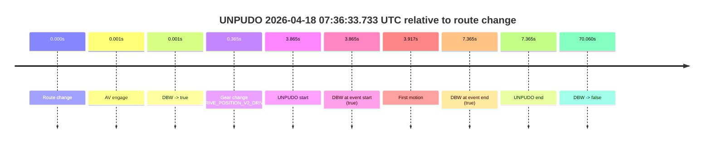
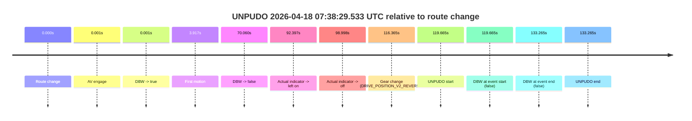
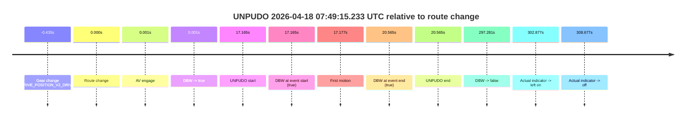
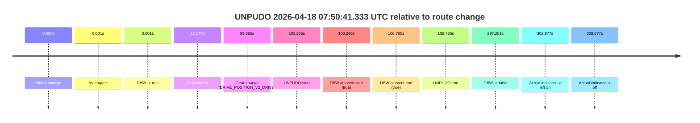

# Run Report: fme20018/2026-04-18--07-23-29--gen2-av-b0e9cd6c-90be-4750-ad94-da70f33ea44c

| Field | Value |
|---|---|
| Run ID | `fme20018/2026-04-18--07-23-29--gen2-av-b0e9cd6c-90be-4750-ad94-da70f33ea44c` |
| Date | `2026-04-18` |
| Model(s) | `eel-teal-outspoken` |
| Author | `zak` |
| Event count | `7` |

## unpudo 2026-04-18 07:29:27.183 UTC

| Field | Value |
|---|---|
| Model | `eel-teal-outspoken` |
| Author | `zak` |
| Run ID | `fme20018/2026-04-18--07-23-29--gen2-av-b0e9cd6c-90be-4750-ad94-da70f33ea44c` |
| Date | `2026-04-18` |
| Time (UTC) | `07:29:27.183` |
| Event type | `unpudo` |
| Disengagement type | `none observed` |
| Route change | `found` |
| Console | [run](https://console.sso.wayve.ai/run/fme20018/2026-04-18--07-23-29--gen2-av-b0e9cd6c-90be-4750-ad94-da70f33ea44c?id=&time-unixus=1776497367183299) |
| Foxglove | [segment](https://app.foxglove.dev/wayve-on-prem/p/prj_0dX18KZdVHg1fmmI/view?ds=foxglove-stream&ds.deviceName=fme20018&ds.start=2026-04-18T07%3A29%3A13.318326Z&ds.end=2026-04-18T07%3A34%3A00.868741Z&layoutId=lay_0e7VD4WIKDQGU73Y&time=2026-04-18T07%3A29%3A27.183299Z) |

### Event card: pass

- Pass: AV owns the credited unpudo from route change through the official unpudo window, the gear state is aligned at the anchor, and the vehicle moves without driver accelerator help in AV.

| Event | Time (UTC) | Delta from route change |
|---|---:|---:|
| Route change | 2026-04-18 07:29:23.318 | `0.000s` |
| AV engage | 2026-04-18 07:29:23.318 | `0.000s` |
| DBW -> true | 2026-04-18 07:29:23.318 | `0.000s` |
| Gear change (DRIVE_POSITION_V2_DRIVE) | 2026-04-18 07:29:23.633 | `0.315s` |
| UNPUDO start | 2026-04-18 07:29:27.183 | `3.865s` |
| DBW at event start (true) | 2026-04-18 07:29:27.183 | `3.865s` |
| First motion | 2026-04-18 07:29:27.225 | `3.907s` |
| DBW at event end (true) | 2026-04-18 07:29:31.683 | `8.365s` |
| UNPUDO end | 2026-04-18 07:29:31.683 | `8.365s` |
| DBW -> false | 2026-04-18 07:33:50.868 | `267.550s` |

| Metric | Value |
|---|---|
| Outcome | `pass` |
| Effective failure type | `none` |
| Route change status | `found` |
| DBW at event start | `true` |
| DBW at event end | `true` |
| Predicted gear at AV start | `DRIVE_POSITION_V2_PARK` |
| Actual gear at AV start | `DRIVE_POSITION_V2_PARK` |
| Predicted gear at event start | `DRIVE_POSITION_V2_DRIVE` |
| Actual gear at event start | `DRIVE_POSITION_V2_DRIVE` |
| Planned indicator direction | `INDICATORS_STATE_V2_OFF` |
| Controller indicator direction | `INDICATORS_STATE_V2_OFF` |
| Actual indicator direction | `INDICATORS_STATE_V2_OFF` |
| Actual indicator at maneuver end | `INDICATORS_STATE_V2_OFF` |
| Driver accel help in AV | `false` |
| Driver accel help timestamp | `n/a` |
| Max accel pedal pct in AV | `0.0%` |
| Max brake pedal pct in AV | `8.0%` |
| Max speed mps in AV | `3.647` |
| Success timing baseline | `route change` |
| Route -> AV | `0.000s` |
| AV -> event start | `3.865s` |
| AV -> first motion | `3.906s` |
| Success baseline -> event start | `3.865s` |
| Success baseline -> first motion | `3.907s` |
| AV duration before disengagement | `267.550s` |
| Trajectory waypoint count | `37` |
| Driving-plan step count | `11` |

The scored portion starts from the AV-owned window, not from the pre-AV setup. Route-change search in the stopped pre-event segment was `found`, with the baseline therefore set to route change. At the event anchor the model predicts `DRIVE_POSITION_V2_DRIVE` and the actual gear is `DRIVE_POSITION_V2_DRIVE`. The effective model outcome is `pass` because `the credited unpudo stays AV-owned through the official unpudo window.`

### Resolution

| Field | Value |
|---|---|
| Final outcome | `pass` |
| Do we agree with this label? | `yes` |
| Source disengagement type | `none observed` |
| Resolved effective failure type | `none` |
| Confidence | `high` |

## unpudo 2026-04-18 07:36:33.733 UTC

| Field | Value |
|---|---|
| Model | `eel-teal-outspoken` |
| Author | `zak` |
| Run ID | `fme20018/2026-04-18--07-23-29--gen2-av-b0e9cd6c-90be-4750-ad94-da70f33ea44c` |
| Date | `2026-04-18` |
| Time (UTC) | `07:36:33.733` |
| Event type | `unpudo` |
| Disengagement type | `none observed` |
| Route change | `found` |
| Console | [run](https://console.sso.wayve.ai/run/fme20018/2026-04-18--07-23-29--gen2-av-b0e9cd6c-90be-4750-ad94-da70f33ea44c?id=&time-unixus=1776497793733316) |
| Foxglove | [segment](https://app.foxglove.dev/wayve-on-prem/p/prj_0dX18KZdVHg1fmmI/view?ds=foxglove-stream&ds.deviceName=fme20018&ds.start=2026-04-18T07%3A36%3A19.868209Z&ds.end=2026-04-18T07%3A37%3A49.928548Z&layoutId=lay_0e7VD4WIKDQGU73Y&time=2026-04-18T07%3A36%3A33.733316Z) |

### Event card: pass

- Pass: AV owns the credited unpudo from route change through the official unpudo window, the gear state is aligned at the anchor, and the vehicle moves without driver accelerator help in AV.

| Event | Time (UTC) | Delta from route change |
|---|---:|---:|
| Route change | 2026-04-18 07:36:29.868 | `0.000s` |
| AV engage | 2026-04-18 07:36:29.868 | `0.001s` |
| DBW -> true | 2026-04-18 07:36:29.868 | `0.001s` |
| Gear change (DRIVE_POSITION_V2_DRIVE) | 2026-04-18 07:36:30.233 | `0.365s` |
| UNPUDO start | 2026-04-18 07:36:33.733 | `3.865s` |
| DBW at event start (true) | 2026-04-18 07:36:33.733 | `3.865s` |
| First motion | 2026-04-18 07:36:33.785 | `3.917s` |
| DBW at event end (true) | 2026-04-18 07:36:37.233 | `7.365s` |
| UNPUDO end | 2026-04-18 07:36:37.233 | `7.365s` |
| DBW -> false | 2026-04-18 07:37:39.928 | `70.060s` |

| Metric | Value |
|---|---|
| Outcome | `pass` |
| Effective failure type | `none` |
| Route change status | `found` |
| DBW at event start | `true` |
| DBW at event end | `true` |
| Predicted gear at AV start | `DRIVE_POSITION_V2_PARK` |
| Actual gear at AV start | `DRIVE_POSITION_V2_PARK` |
| Predicted gear at event start | `DRIVE_POSITION_V2_DRIVE` |
| Actual gear at event start | `DRIVE_POSITION_V2_DRIVE` |
| Planned indicator direction | `INDICATORS_STATE_V2_RIGHT_ON` |
| Controller indicator direction | `INDICATORS_STATE_V2_RIGHT_ON` |
| Actual indicator direction | `INDICATORS_STATE_V2_OFF` |
| Actual indicator at maneuver end | `INDICATORS_STATE_V2_OFF` |
| Driver accel help in AV | `false` |
| Driver accel help timestamp | `n/a` |
| Max accel pedal pct in AV | `0.0%` |
| Max brake pedal pct in AV | `8.0%` |
| Max speed mps in AV | `5.189` |
| Success timing baseline | `route change` |
| Route -> AV | `0.001s` |
| AV -> event start | `3.865s` |
| AV -> first motion | `3.916s` |
| Success baseline -> event start | `3.865s` |
| Success baseline -> first motion | `3.917s` |
| AV duration before disengagement | `70.060s` |
| Trajectory waypoint count | `38` |
| Driving-plan step count | `11` |

The scored portion starts from the AV-owned window, not from the pre-AV setup. Route-change search in the stopped pre-event segment was `found`, with the baseline therefore set to route change. At the event anchor the model predicts `DRIVE_POSITION_V2_DRIVE` and the actual gear is `DRIVE_POSITION_V2_DRIVE`. The effective model outcome is `pass` because `the credited unpudo stays AV-owned through the official unpudo window.`

### Resolution

| Field | Value |
|---|---|
| Final outcome | `pass` |
| Do we agree with this label? | `yes` |
| Source disengagement type | `none observed` |
| Resolved effective failure type | `none` |
| Confidence | `high` |

## unpudo 2026-04-18 07:38:18.983 UTC

| Field | Value |
|---|---|
| Model | `eel-teal-outspoken` |
| Author | `zak` |
| Run ID | `fme20018/2026-04-18--07-23-29--gen2-av-b0e9cd6c-90be-4750-ad94-da70f33ea44c` |
| Date | `2026-04-18` |
| Time (UTC) | `07:38:18.983` |
| Event type | `unpudo` |
| Disengagement type | `none observed` |
| Route change | `found` |
| Console | [run](https://console.sso.wayve.ai/run/fme20018/2026-04-18--07-23-29--gen2-av-b0e9cd6c-90be-4750-ad94-da70f33ea44c?id=&time-unixus=1776497898983297) |
| Foxglove | [segment](https://app.foxglove.dev/wayve-on-prem/p/prj_0dX18KZdVHg1fmmI/view?ds=foxglove-stream&ds.deviceName=fme20018&ds.start=2026-04-18T07%3A36%3A19.868209Z&ds.end=2026-04-18T07%3A38%3A32.433310Z&layoutId=lay_0e7VD4WIKDQGU73Y&time=2026-04-18T07%3A38%3A18.983297Z) |

### Event card: fail

- Fail: the credited unpudo does not stay AV-owned. The event window starts with DBW false, and the maneuver outcome lands outside a clean AV-owned segment.

| Event | Time (UTC) | Delta from route change |
|---|---:|---:|
| Route change | 2026-04-18 07:36:29.868 | `0.000s` |
| AV engage | 2026-04-18 07:36:29.868 | `0.001s` |
| DBW -> true | 2026-04-18 07:36:29.868 | `0.001s` |
| First motion | 2026-04-18 07:36:33.785 | `3.917s` |
| DBW -> false | 2026-04-18 07:37:39.928 | `70.060s` |
| Actual indicator -> left on | 2026-04-18 07:38:02.265 | `92.397s` |
| Actual indicator -> off | 2026-04-18 07:38:08.865 | `98.998s` |
| Gear change (DRIVE_POSITION_V2_DRIVE) | 2026-04-18 07:38:18.033 | `108.165s` |
| UNPUDO start | 2026-04-18 07:38:18.983 | `109.115s` |
| DBW at event start (false) | 2026-04-18 07:38:18.983 | `109.115s` |
| DBW at event end (false) | 2026-04-18 07:38:22.433 | `112.565s` |
| UNPUDO end | 2026-04-18 07:38:22.433 | `112.565s` |

| Metric | Value |
|---|---|
| Outcome | `fail` |
| Effective failure type | `not_av_owned` |
| Route change status | `found` |
| DBW at event start | `false` |
| DBW at event end | `false` |
| Predicted gear at AV start | `DRIVE_POSITION_V2_PARK` |
| Actual gear at AV start | `DRIVE_POSITION_V2_PARK` |
| Predicted gear at event start | `DRIVE_POSITION_V2_DRIVE` |
| Actual gear at event start | `DRIVE_POSITION_V2_DRIVE` |
| Planned indicator direction | `INDICATORS_STATE_V2_OFF` |
| Controller indicator direction | `INDICATORS_STATE_V2_OFF` |
| Actual indicator direction | `INDICATORS_STATE_V2_OFF` |
| Actual indicator at maneuver end | `INDICATORS_STATE_V2_OFF` |
| Driver accel help in AV | `false` |
| Driver accel help timestamp | `n/a` |
| Max accel pedal pct in AV | `0.0%` |
| Max brake pedal pct in AV | `9.2%` |
| Max speed mps in AV | `7.989` |
| Success timing baseline | `route change` |
| Route -> AV | `0.001s` |
| AV -> event start | `109.115s` |
| AV -> first motion | `3.916s` |
| Success baseline -> event start | `109.115s` |
| Success baseline -> first motion | `3.917s` |
| AV duration before disengagement | `70.060s` |
| Trajectory waypoint count | `37` |
| Driving-plan step count | `11` |

The scored portion starts from the AV-owned window, not from the pre-AV setup. Route-change search in the stopped pre-event segment was `found`, with the baseline therefore set to route change. At the event anchor the model predicts `DRIVE_POSITION_V2_DRIVE` and the actual gear is `DRIVE_POSITION_V2_DRIVE`. The effective model outcome is `fail` because `not_av_owned.`

### Resolution

| Field | Value |
|---|---|
| Final outcome | `fail` |
| Do we agree with this label? | `yes` |
| Source disengagement type | `none observed` |
| Resolved effective failure type | `not_av_owned` |
| Confidence | `high` |

## unpudo 2026-04-18 07:38:29.533 UTC

| Field | Value |
|---|---|
| Model | `eel-teal-outspoken` |
| Author | `zak` |
| Run ID | `fme20018/2026-04-18--07-23-29--gen2-av-b0e9cd6c-90be-4750-ad94-da70f33ea44c` |
| Date | `2026-04-18` |
| Time (UTC) | `07:38:29.533` |
| Event type | `unpudo` |
| Disengagement type | `none observed` |
| Route change | `found` |
| Console | [run](https://console.sso.wayve.ai/run/fme20018/2026-04-18--07-23-29--gen2-av-b0e9cd6c-90be-4750-ad94-da70f33ea44c?id=&time-unixus=1776497909533308) |
| Foxglove | [segment](https://app.foxglove.dev/wayve-on-prem/p/prj_0dX18KZdVHg1fmmI/view?ds=foxglove-stream&ds.deviceName=fme20018&ds.start=2026-04-18T07%3A36%3A19.868209Z&ds.end=2026-04-18T07%3A38%3A53.133298Z&layoutId=lay_0e7VD4WIKDQGU73Y&time=2026-04-18T07%3A38%3A29.533308Z) |

### Event card: fail

- Fail: the credited unpudo does not stay AV-owned. The event window starts with DBW false, and the maneuver outcome lands outside a clean AV-owned segment.

| Event | Time (UTC) | Delta from route change |
|---|---:|---:|
| Route change | 2026-04-18 07:36:29.868 | `0.000s` |
| AV engage | 2026-04-18 07:36:29.868 | `0.001s` |
| DBW -> true | 2026-04-18 07:36:29.868 | `0.001s` |
| First motion | 2026-04-18 07:36:33.785 | `3.917s` |
| DBW -> false | 2026-04-18 07:37:39.928 | `70.060s` |
| Actual indicator -> left on | 2026-04-18 07:38:02.265 | `92.397s` |
| Actual indicator -> off | 2026-04-18 07:38:08.865 | `98.998s` |
| Gear change (DRIVE_POSITION_V2_REVERSE) | 2026-04-18 07:38:26.233 | `116.365s` |
| UNPUDO start | 2026-04-18 07:38:29.533 | `119.665s` |
| DBW at event start (false) | 2026-04-18 07:38:29.533 | `119.665s` |
| DBW at event end (false) | 2026-04-18 07:38:43.133 | `133.265s` |
| UNPUDO end | 2026-04-18 07:38:43.133 | `133.265s` |

| Metric | Value |
|---|---|
| Outcome | `fail` |
| Effective failure type | `not_av_owned` |
| Route change status | `found` |
| DBW at event start | `false` |
| DBW at event end | `false` |
| Predicted gear at AV start | `DRIVE_POSITION_V2_PARK` |
| Actual gear at AV start | `DRIVE_POSITION_V2_PARK` |
| Predicted gear at event start | `DRIVE_POSITION_V2_REVERSE` |
| Actual gear at event start | `DRIVE_POSITION_V2_REVERSE` |
| Planned indicator direction | `INDICATORS_STATE_V2_OFF` |
| Controller indicator direction | `INDICATORS_STATE_V2_OFF` |
| Actual indicator direction | `INDICATORS_STATE_V2_OFF` |
| Actual indicator at maneuver end | `INDICATORS_STATE_V2_OFF` |
| Driver accel help in AV | `false` |
| Driver accel help timestamp | `n/a` |
| Max accel pedal pct in AV | `0.0%` |
| Max brake pedal pct in AV | `9.2%` |
| Max speed mps in AV | `7.989` |
| Success timing baseline | `route change` |
| Route -> AV | `0.001s` |
| AV -> event start | `119.665s` |
| AV -> first motion | `3.916s` |
| Success baseline -> event start | `119.665s` |
| Success baseline -> first motion | `3.917s` |
| AV duration before disengagement | `70.060s` |
| Trajectory waypoint count | `38` |
| Driving-plan step count | `11` |

The scored portion starts from the AV-owned window, not from the pre-AV setup. Route-change search in the stopped pre-event segment was `found`, with the baseline therefore set to route change. At the event anchor the model predicts `DRIVE_POSITION_V2_REVERSE` and the actual gear is `DRIVE_POSITION_V2_REVERSE`. The effective model outcome is `fail` because `not_av_owned.`

### Resolution

| Field | Value |
|---|---|
| Final outcome | `fail` |
| Do we agree with this label? | `yes` |
| Source disengagement type | `none observed` |
| Resolved effective failure type | `not_av_owned` |
| Confidence | `high` |

## unpudo 2026-04-18 07:49:15.233 UTC

| Field | Value |
|---|---|
| Model | `eel-teal-outspoken` |
| Author | `zak` |
| Run ID | `fme20018/2026-04-18--07-23-29--gen2-av-b0e9cd6c-90be-4750-ad94-da70f33ea44c` |
| Date | `2026-04-18` |
| Time (UTC) | `07:49:15.233` |
| Event type | `unpudo` |
| Disengagement type | `none observed` |
| Route change | `found` |
| Console | [run](https://console.sso.wayve.ai/run/fme20018/2026-04-18--07-23-29--gen2-av-b0e9cd6c-90be-4750-ad94-da70f33ea44c?id=&time-unixus=1776498555233301) |
| Foxglove | [segment](https://app.foxglove.dev/wayve-on-prem/p/prj_0dX18KZdVHg1fmmI/view?ds=foxglove-stream&ds.deviceName=fme20018&ds.start=2026-04-18T07%3A48%3A47.633317Z&ds.end=2026-04-18T07%3A54%3A05.349062Z&layoutId=lay_0e7VD4WIKDQGU73Y&time=2026-04-18T07%3A49%3A15.233301Z) |

### Event card: pass

- Pass: AV owns the credited unpudo from route change through the official unpudo window, the gear state is aligned at the anchor, and the vehicle moves without driver accelerator help in AV.

| Event | Time (UTC) | Delta from route change |
|---|---:|---:|
| Gear change (DRIVE_POSITION_V2_DRIVE) | 2026-04-18 07:48:57.633 | `-0.435s` |
| Route change | 2026-04-18 07:48:58.068 | `0.000s` |
| AV engage | 2026-04-18 07:48:58.068 | `0.001s` |
| DBW -> true | 2026-04-18 07:48:58.068 | `0.001s` |
| UNPUDO start | 2026-04-18 07:49:15.233 | `17.165s` |
| DBW at event start (true) | 2026-04-18 07:49:15.233 | `17.165s` |
| First motion | 2026-04-18 07:49:15.245 | `17.177s` |
| DBW at event end (true) | 2026-04-18 07:49:18.633 | `20.565s` |
| UNPUDO end | 2026-04-18 07:49:18.633 | `20.565s` |
| DBW -> false | 2026-04-18 07:53:55.349 | `297.281s` |
| Actual indicator -> left on | 2026-04-18 07:54:00.944 | `302.877s` |
| Actual indicator -> off | 2026-04-18 07:54:06.745 | `308.677s` |

| Metric | Value |
|---|---|
| Outcome | `pass` |
| Effective failure type | `none` |
| Route change status | `found` |
| DBW at event start | `true` |
| DBW at event end | `true` |
| Predicted gear at AV start | `DRIVE_POSITION_V2_DRIVE` |
| Actual gear at AV start | `DRIVE_POSITION_V2_DRIVE` |
| Predicted gear at event start | `DRIVE_POSITION_V2_DRIVE` |
| Actual gear at event start | `DRIVE_POSITION_V2_DRIVE` |
| Planned indicator direction | `INDICATORS_STATE_V2_OFF` |
| Controller indicator direction | `INDICATORS_STATE_V2_OFF` |
| Actual indicator direction | `INDICATORS_STATE_V2_OFF` |
| Actual indicator at maneuver end | `INDICATORS_STATE_V2_OFF` |
| Driver accel help in AV | `false` |
| Driver accel help timestamp | `n/a` |
| Max accel pedal pct in AV | `0.0%` |
| Max brake pedal pct in AV | `8.0%` |
| Max speed mps in AV | `5.181` |
| Success timing baseline | `route change` |
| Route -> AV | `0.001s` |
| AV -> event start | `17.164s` |
| AV -> first motion | `17.177s` |
| Success baseline -> event start | `17.165s` |
| Success baseline -> first motion | `17.177s` |
| AV duration before disengagement | `297.280s` |
| Trajectory waypoint count | `36` |
| Driving-plan step count | `11` |

The scored portion starts from the AV-owned window, not from the pre-AV setup. Route-change search in the stopped pre-event segment was `found`, with the baseline therefore set to route change. At the event anchor the model predicts `DRIVE_POSITION_V2_DRIVE` and the actual gear is `DRIVE_POSITION_V2_DRIVE`. The effective model outcome is `pass` because `the credited unpudo stays AV-owned through the official unpudo window.`

### Resolution

| Field | Value |
|---|---|
| Final outcome | `pass` |
| Do we agree with this label? | `yes` |
| Source disengagement type | `none observed` |
| Resolved effective failure type | `none` |
| Confidence | `high` |

## unpudo 2026-04-18 07:50:41.333 UTC

| Field | Value |
|---|---|
| Model | `eel-teal-outspoken` |
| Author | `zak` |
| Run ID | `fme20018/2026-04-18--07-23-29--gen2-av-b0e9cd6c-90be-4750-ad94-da70f33ea44c` |
| Date | `2026-04-18` |
| Time (UTC) | `07:50:41.333` |
| Event type | `unpudo` |
| Disengagement type | `none observed` |
| Route change | `found` |
| Console | [run](https://console.sso.wayve.ai/run/fme20018/2026-04-18--07-23-29--gen2-av-b0e9cd6c-90be-4750-ad94-da70f33ea44c?id=&time-unixus=1776498641333298) |
| Foxglove | [segment](https://app.foxglove.dev/wayve-on-prem/p/prj_0dX18KZdVHg1fmmI/view?ds=foxglove-stream&ds.deviceName=fme20018&ds.start=2026-04-18T07%3A48%3A48.068274Z&ds.end=2026-04-18T07%3A54%3A05.349062Z&layoutId=lay_0e7VD4WIKDQGU73Y&time=2026-04-18T07%3A50%3A41.333298Z) |

### Event card: pass

- Pass: AV owns the credited unpudo from route change through the official unpudo window, the gear state is aligned at the anchor, and the vehicle moves without driver accelerator help in AV.

| Event | Time (UTC) | Delta from route change |
|---|---:|---:|
| Route change | 2026-04-18 07:48:58.068 | `0.000s` |
| AV engage | 2026-04-18 07:48:58.068 | `0.001s` |
| DBW -> true | 2026-04-18 07:48:58.068 | `0.001s` |
| First motion | 2026-04-18 07:49:15.245 | `17.177s` |
| Gear change (DRIVE_POSITION_V2_DRIVE) | 2026-04-18 07:50:37.433 | `99.365s` |
| UNPUDO start | 2026-04-18 07:50:41.333 | `103.265s` |
| DBW at event start (true) | 2026-04-18 07:50:41.333 | `103.265s` |
| DBW at event end (true) | 2026-04-18 07:50:44.833 | `106.765s` |
| UNPUDO end | 2026-04-18 07:50:44.833 | `106.765s` |
| DBW -> false | 2026-04-18 07:53:55.349 | `297.281s` |
| Actual indicator -> left on | 2026-04-18 07:54:00.944 | `302.877s` |
| Actual indicator -> off | 2026-04-18 07:54:06.745 | `308.677s` |

| Metric | Value |
|---|---|
| Outcome | `pass` |
| Effective failure type | `none` |
| Route change status | `found` |
| DBW at event start | `true` |
| DBW at event end | `true` |
| Predicted gear at AV start | `DRIVE_POSITION_V2_DRIVE` |
| Actual gear at AV start | `DRIVE_POSITION_V2_DRIVE` |
| Predicted gear at event start | `DRIVE_POSITION_V2_DRIVE` |
| Actual gear at event start | `DRIVE_POSITION_V2_DRIVE` |
| Planned indicator direction | `INDICATORS_STATE_V2_RIGHT_ON` |
| Controller indicator direction | `INDICATORS_STATE_V2_RIGHT_ON` |
| Actual indicator direction | `INDICATORS_STATE_V2_OFF` |
| Actual indicator at maneuver end | `INDICATORS_STATE_V2_OFF` |
| Driver accel help in AV | `false` |
| Driver accel help timestamp | `n/a` |
| Max accel pedal pct in AV | `0.0%` |
| Max brake pedal pct in AV | `15.8%` |
| Max speed mps in AV | `8.406` |
| Success timing baseline | `route change` |
| Route -> AV | `0.001s` |
| AV -> event start | `103.264s` |
| AV -> first motion | `17.177s` |
| Success baseline -> event start | `103.265s` |
| Success baseline -> first motion | `17.177s` |
| AV duration before disengagement | `297.280s` |
| Trajectory waypoint count | `38` |
| Driving-plan step count | `11` |

The scored portion starts from the AV-owned window, not from the pre-AV setup. Route-change search in the stopped pre-event segment was `found`, with the baseline therefore set to route change. At the event anchor the model predicts `DRIVE_POSITION_V2_DRIVE` and the actual gear is `DRIVE_POSITION_V2_DRIVE`. The effective model outcome is `pass` because `the credited unpudo stays AV-owned through the official unpudo window.`

### Resolution

| Field | Value |
|---|---|
| Final outcome | `pass` |
| Do we agree with this label? | `yes` |
| Source disengagement type | `none observed` |
| Resolved effective failure type | `none` |
| Confidence | `high` |

## unpudo 2026-04-18 07:52:15.033 UTC

| Field | Value |
|---|---|
| Model | `eel-teal-outspoken` |
| Author | `zak` |
| Run ID | `fme20018/2026-04-18--07-23-29--gen2-av-b0e9cd6c-90be-4750-ad94-da70f33ea44c` |
| Date | `2026-04-18` |
| Time (UTC) | `07:52:15.033` |
| Event type | `unpudo` |
| Disengagement type | `none observed` |
| Route change | `found` |
| Console | [run](https://console.sso.wayve.ai/run/fme20018/2026-04-18--07-23-29--gen2-av-b0e9cd6c-90be-4750-ad94-da70f33ea44c?id=&time-unixus=1776498735033316) |
| Foxglove | [segment](https://app.foxglove.dev/wayve-on-prem/p/prj_0dX18KZdVHg1fmmI/view?ds=foxglove-stream&ds.deviceName=fme20018&ds.start=2026-04-18T07%3A50%3A27.168265Z&ds.end=2026-04-18T07%3A54%3A05.349062Z&layoutId=lay_0e7VD4WIKDQGU73Y&time=2026-04-18T07%3A52%3A15.033316Z) |

### Event card: pass

- Pass: AV owns the credited unpudo from route change through the official unpudo window, the gear state is aligned at the anchor, and the vehicle moves without driver accelerator help in AV.

| Event | Time (UTC) | Delta from route change |
|---|---:|---:|
| Route change | 2026-04-18 07:50:37.168 | `0.000s` |
| AV engage | 2026-04-18 07:50:37.168 | `0.000s` |
| DBW -> true | 2026-04-18 07:50:37.168 | `0.000s` |
| First motion | 2026-04-18 07:50:41.425 | `4.257s` |
| Gear change (DRIVE_POSITION_V2_DRIVE) | 2026-04-18 07:52:11.433 | `94.265s` |
| UNPUDO start | 2026-04-18 07:52:15.033 | `97.865s` |
| DBW at event start (true) | 2026-04-18 07:52:15.033 | `97.865s` |
| DBW at event end (true) | 2026-04-18 07:52:18.383 | `101.215s` |
| UNPUDO end | 2026-04-18 07:52:18.383 | `101.215s` |
| DBW -> false | 2026-04-18 07:53:55.349 | `198.181s` |
| Actual indicator -> left on | 2026-04-18 07:54:00.944 | `203.777s` |
| Actual indicator -> off | 2026-04-18 07:54:06.745 | `209.577s` |

| Metric | Value |
|---|---|
| Outcome | `pass` |
| Effective failure type | `none` |
| Route change status | `found` |
| DBW at event start | `true` |
| DBW at event end | `true` |
| Predicted gear at AV start | `DRIVE_POSITION_V2_PARK` |
| Actual gear at AV start | `DRIVE_POSITION_V2_PARK` |
| Predicted gear at event start | `DRIVE_POSITION_V2_DRIVE` |
| Actual gear at event start | `DRIVE_POSITION_V2_DRIVE` |
| Planned indicator direction | `INDICATORS_STATE_V2_RIGHT_ON` |
| Controller indicator direction | `INDICATORS_STATE_V2_RIGHT_ON` |
| Actual indicator direction | `INDICATORS_STATE_V2_OFF` |
| Actual indicator at maneuver end | `INDICATORS_STATE_V2_OFF` |
| Driver accel help in AV | `false` |
| Driver accel help timestamp | `n/a` |
| Max accel pedal pct in AV | `0.0%` |
| Max brake pedal pct in AV | `19.8%` |
| Max speed mps in AV | `8.183` |
| Success timing baseline | `route change` |
| Route -> AV | `0.000s` |
| AV -> event start | `97.865s` |
| AV -> first motion | `4.257s` |
| Success baseline -> event start | `97.865s` |
| Success baseline -> first motion | `4.257s` |
| AV duration before disengagement | `198.180s` |
| Trajectory waypoint count | `36` |
| Driving-plan step count | `11` |

The scored portion starts from the AV-owned window, not from the pre-AV setup. Route-change search in the stopped pre-event segment was `found`, with the baseline therefore set to route change. At the event anchor the model predicts `DRIVE_POSITION_V2_DRIVE` and the actual gear is `DRIVE_POSITION_V2_DRIVE`. The effective model outcome is `pass` because `the credited unpudo stays AV-owned through the official unpudo window.`

### Resolution

| Field | Value |
|---|---|
| Final outcome | `pass` |
| Do we agree with this label? | `yes` |
| Source disengagement type | `none observed` |
| Resolved effective failure type | `none` |
| Confidence | `high` |
