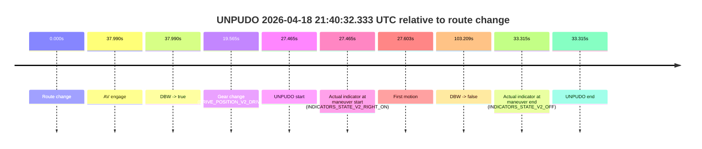

# Run Report: fme20018/2026-04-18--20-42-56--gen2-av-af145dd8-fa51-47ca-aac1-2b720e2d7a5c

| Field | Value |
|---|---|
| Run ID | `fme20018/2026-04-18--20-42-56--gen2-av-af145dd8-fa51-47ca-aac1-2b720e2d7a5c` |
| Date | `2026-04-18` |
| Model(s) | `armadillo-amethyst-squeaky` |
| Author | `guy.geva` |
| Event count | `8` |

## unpudo 2026-04-18 21:09:36.133 UTC

| Field | Value |
|---|---|
| Model | `armadillo-amethyst-squeaky` |
| Author | `guy.geva` |
| Run ID | `fme20018/2026-04-18--20-42-56--gen2-av-af145dd8-fa51-47ca-aac1-2b720e2d7a5c` |
| Date | `2026-04-18` |
| Time (UTC) | `21:09:36.133` |
| Event type | `unpudo` |
| Disengagement type | `none observed` |
| Route change | `found` |
| Console | [run](https://console.sso.wayve.ai/run/fme20018/2026-04-18--20-42-56--gen2-av-af145dd8-fa51-47ca-aac1-2b720e2d7a5c?id=&time-unixus=1776546576133288) |
| Foxglove | [segment](https://app.foxglove.dev/wayve-on-prem/p/prj_0dX18KZdVHg1fmmI/view?ds=foxglove-stream&ds.deviceName=fme20018&ds.start=2026-04-18T21%3A09%3A19.318262Z&ds.end=2026-04-18T21%3A13%3A32.816602Z&layoutId=lay_0e7VD4WIKDQGU73Y&time=2026-04-18T21%3A09%3A36.133288Z) |

### Event card: fail

- Fail: the credited unpudo does not stay AV-owned. The event window starts with DBW false, and the maneuver outcome lands outside a clean AV-owned segment.

| Event | Time (UTC) | Delta from route change |
|---|---:|---:|
| Route change | 2026-04-18 21:09:29.318 | `0.000s` |
| AV engage | 2026-04-18 21:09:43.778 | `14.460s` |
| DBW -> true | 2026-04-18 21:09:43.778 | `14.460s` |
| Gear change (DRIVE_POSITION_V2_DRIVE) | 2026-04-18 21:09:31.383 | `2.065s` |
| UNPUDO start | 2026-04-18 21:09:36.133 | `6.815s` |
| Actual indicator at maneuver start (INDICATORS_STATE_V2_RIGHT_ON) | 2026-04-18 21:09:36.133 | `6.815s` |
| First motion | 2026-04-18 21:09:36.151 | `6.833s` |
| DBW -> false | 2026-04-18 21:13:22.816 | `233.498s` |
| Actual indicator at maneuver end (INDICATORS_STATE_V2_OFF) | 2026-04-18 21:09:39.583 | `10.265s` |
| UNPUDO end | 2026-04-18 21:09:39.583 | `10.265s` |

| Metric | Value |
|---|---|
| Outcome | `fail` |
| Effective failure type | `completed_outside_av` |
| Route change status | `found` |
| DBW at event start | `false` |
| DBW at event end | `false` |
| Predicted gear at AV start | `DRIVE_POSITION_V2_DRIVE` |
| Actual gear at AV start | `DRIVE_POSITION_V2_DRIVE` |
| Predicted gear at event start | `DRIVE_POSITION_V2_DRIVE` |
| Actual gear at event start | `DRIVE_POSITION_V2_DRIVE` |
| Planned indicator direction | `INDICATORS_STATE_V2_RIGHT_ON` |
| Controller indicator direction | `INDICATORS_STATE_V2_RIGHT_ON` |
| Actual indicator direction | `INDICATORS_STATE_V2_RIGHT_ON` |
| Actual indicator at maneuver end | `INDICATORS_STATE_V2_OFF` |
| Driver accel help in AV | `false` |
| Driver accel help timestamp | `n/a` |
| Max accel pedal pct in AV | `0.0%` |
| Max brake pedal pct in AV | `0.0%` |
| Max speed mps in AV | `0.000` |
| Route -> AV | `14.460s` |
| AV -> event start | `-7.645s` |
| AV -> first motion | `-7.626s` |
| AV duration before disengagement | `219.039s` |
| Trajectory waypoint count | `37` |
| Driving-plan step count | `11` |

The scored portion starts from the AV-owned window, not from the pre-AV setup. Route-change search in the stopped pre-event segment was `found`, with the baseline therefore set to route change. At the event anchor the model predicts `DRIVE_POSITION_V2_DRIVE` and the actual gear is `DRIVE_POSITION_V2_DRIVE`. The effective model outcome is `fail` because `completed_outside_av`.

### Resolution

| Field | Value |
|---|---|
| Final outcome | `fail` |
| Do we agree with this label? | `yes` |
| Source disengagement type | `none observed` |
| Resolved effective failure type | `completed_outside_av` |
| Confidence | `high` |

## unpudo 2026-04-18 21:13:56.683 UTC

| Field | Value |
|---|---|
| Model | `armadillo-amethyst-squeaky` |
| Author | `guy.geva` |
| Run ID | `fme20018/2026-04-18--20-42-56--gen2-av-af145dd8-fa51-47ca-aac1-2b720e2d7a5c` |
| Date | `2026-04-18` |
| Time (UTC) | `21:13:56.683` |
| Event type | `unpudo` |
| Disengagement type | `none observed` |
| Route change | `found` |
| Console | [run](https://console.sso.wayve.ai/run/fme20018/2026-04-18--20-42-56--gen2-av-af145dd8-fa51-47ca-aac1-2b720e2d7a5c?id=&time-unixus=1776546836683315) |
| Foxglove | [segment](https://app.foxglove.dev/wayve-on-prem/p/prj_0dX18KZdVHg1fmmI/view?ds=foxglove-stream&ds.deviceName=fme20018&ds.start=2026-04-18T21%3A13%3A30.818397Z&ds.end=2026-04-18T21%3A17%3A19.616012Z&layoutId=lay_0e7VD4WIKDQGU73Y&time=2026-04-18T21%3A13%3A56.683315Z) |

### Event card: fail

- Fail: the credited unpudo does not stay AV-owned. The event window starts with DBW false, and the maneuver outcome lands outside a clean AV-owned segment.

| Event | Time (UTC) | Delta from route change |
|---|---:|---:|
| Route change | 2026-04-18 21:13:40.818 | `0.000s` |
| AV engage | 2026-04-18 21:14:01.597 | `20.779s` |
| DBW -> true | 2026-04-18 21:14:01.597 | `20.779s` |
| Gear change (DRIVE_POSITION_V2_DRIVE) | 2026-04-18 21:13:46.283 | `5.465s` |
| UNPUDO start | 2026-04-18 21:13:56.683 | `15.865s` |
| Actual indicator at maneuver start (INDICATORS_STATE_V2_RIGHT_ON) | 2026-04-18 21:13:56.683 | `15.865s` |
| First motion | 2026-04-18 21:13:56.751 | `15.933s` |
| DBW -> false | 2026-04-18 21:17:09.616 | `208.798s` |
| Actual indicator at maneuver end (INDICATORS_STATE_V2_OFF) | 2026-04-18 21:14:00.333 | `19.515s` |
| UNPUDO end | 2026-04-18 21:14:00.333 | `19.515s` |

| Metric | Value |
|---|---|
| Outcome | `fail` |
| Effective failure type | `completed_outside_av` |
| Route change status | `found` |
| DBW at event start | `false` |
| DBW at event end | `false` |
| Predicted gear at AV start | `DRIVE_POSITION_V2_DRIVE` |
| Actual gear at AV start | `DRIVE_POSITION_V2_DRIVE` |
| Predicted gear at event start | `DRIVE_POSITION_V2_DRIVE` |
| Actual gear at event start | `DRIVE_POSITION_V2_DRIVE` |
| Planned indicator direction | `INDICATORS_STATE_V2_LEFT_ON` |
| Controller indicator direction | `INDICATORS_STATE_V2_LEFT_ON` |
| Actual indicator direction | `INDICATORS_STATE_V2_RIGHT_ON` |
| Actual indicator at maneuver end | `INDICATORS_STATE_V2_OFF` |
| Driver accel help in AV | `false` |
| Driver accel help timestamp | `n/a` |
| Max accel pedal pct in AV | `0.0%` |
| Max brake pedal pct in AV | `0.0%` |
| Max speed mps in AV | `0.000` |
| Route -> AV | `20.779s` |
| AV -> event start | `-4.914s` |
| AV -> first motion | `-4.847s` |
| AV duration before disengagement | `188.018s` |
| Trajectory waypoint count | `36` |
| Driving-plan step count | `11` |

The scored portion starts from the AV-owned window, not from the pre-AV setup. Route-change search in the stopped pre-event segment was `found`, with the baseline therefore set to route change. At the event anchor the model predicts `DRIVE_POSITION_V2_DRIVE` and the actual gear is `DRIVE_POSITION_V2_DRIVE`. The effective model outcome is `fail` because `completed_outside_av`.

### Resolution

| Field | Value |
|---|---|
| Final outcome | `fail` |
| Do we agree with this label? | `yes` |
| Source disengagement type | `none observed` |
| Resolved effective failure type | `completed_outside_av` |
| Confidence | `high` |

## unpudo 2026-04-18 21:19:32.033 UTC

| Field | Value |
|---|---|
| Model | `armadillo-amethyst-squeaky` |
| Author | `guy.geva` |
| Run ID | `fme20018/2026-04-18--20-42-56--gen2-av-af145dd8-fa51-47ca-aac1-2b720e2d7a5c` |
| Date | `2026-04-18` |
| Time (UTC) | `21:19:32.033` |
| Event type | `unpudo` |
| Disengagement type | `none observed` |
| Route change | `found` |
| Console | [run](https://console.sso.wayve.ai/run/fme20018/2026-04-18--20-42-56--gen2-av-af145dd8-fa51-47ca-aac1-2b720e2d7a5c?id=&time-unixus=1776547172033306) |
| Foxglove | [segment](https://app.foxglove.dev/wayve-on-prem/p/prj_0dX18KZdVHg1fmmI/view?ds=foxglove-stream&ds.deviceName=fme20018&ds.start=2026-04-18T21%3A17%3A27.418256Z&ds.end=2026-04-18T21%3A24%3A53.977489Z&layoutId=lay_0e7VD4WIKDQGU73Y&time=2026-04-18T21%3A19%3A32.033306Z) |

### Event card: fail

- Fail: the credited unpudo does not stay AV-owned. The event window starts with DBW false, and the maneuver outcome lands outside a clean AV-owned segment.

| Event | Time (UTC) | Delta from route change |
|---|---:|---:|
| Route change | 2026-04-18 21:17:37.418 | `0.000s` |
| AV engage | 2026-04-18 21:19:38.857 | `121.439s` |
| DBW -> true | 2026-04-18 21:19:38.857 | `121.439s` |
| Gear change (DRIVE_POSITION_V2_DRIVE) | 2026-04-18 21:19:18.133 | `100.715s` |
| UNPUDO start | 2026-04-18 21:19:32.033 | `114.615s` |
| Actual indicator at maneuver start (INDICATORS_STATE_V2_RIGHT_ON) | 2026-04-18 21:19:32.033 | `114.615s` |
| First motion | 2026-04-18 21:19:32.091 | `114.673s` |
| DBW -> false | 2026-04-18 21:24:43.977 | `426.559s` |
| Actual indicator at maneuver end (INDICATORS_STATE_V2_OFF) | 2026-04-18 21:19:37.533 | `120.115s` |
| UNPUDO end | 2026-04-18 21:19:37.533 | `120.115s` |

| Metric | Value |
|---|---|
| Outcome | `fail` |
| Effective failure type | `completed_outside_av` |
| Route change status | `found` |
| DBW at event start | `false` |
| DBW at event end | `false` |
| Predicted gear at AV start | `DRIVE_POSITION_V2_DRIVE` |
| Actual gear at AV start | `DRIVE_POSITION_V2_DRIVE` |
| Predicted gear at event start | `DRIVE_POSITION_V2_DRIVE` |
| Actual gear at event start | `DRIVE_POSITION_V2_DRIVE` |
| Planned indicator direction | `INDICATORS_STATE_V2_RIGHT_ON` |
| Controller indicator direction | `INDICATORS_STATE_V2_RIGHT_ON` |
| Actual indicator direction | `INDICATORS_STATE_V2_RIGHT_ON` |
| Actual indicator at maneuver end | `INDICATORS_STATE_V2_OFF` |
| Driver accel help in AV | `false` |
| Driver accel help timestamp | `n/a` |
| Max accel pedal pct in AV | `0.0%` |
| Max brake pedal pct in AV | `0.0%` |
| Max speed mps in AV | `0.000` |
| Route -> AV | `121.439s` |
| AV -> event start | `-6.824s` |
| AV -> first motion | `-6.766s` |
| AV duration before disengagement | `305.120s` |
| Trajectory waypoint count | `37` |
| Driving-plan step count | `11` |

The scored portion starts from the AV-owned window, not from the pre-AV setup. Route-change search in the stopped pre-event segment was `found`, with the baseline therefore set to route change. At the event anchor the model predicts `DRIVE_POSITION_V2_DRIVE` and the actual gear is `DRIVE_POSITION_V2_DRIVE`. The effective model outcome is `fail` because `completed_outside_av`.

### Resolution

| Field | Value |
|---|---|
| Final outcome | `fail` |
| Do we agree with this label? | `yes` |
| Source disengagement type | `none observed` |
| Resolved effective failure type | `completed_outside_av` |
| Confidence | `high` |

## unpudo 2026-04-18 21:25:25.333 UTC

| Field | Value |
|---|---|
| Model | `armadillo-amethyst-squeaky` |
| Author | `guy.geva` |
| Run ID | `fme20018/2026-04-18--20-42-56--gen2-av-af145dd8-fa51-47ca-aac1-2b720e2d7a5c` |
| Date | `2026-04-18` |
| Time (UTC) | `21:25:25.333` |
| Event type | `unpudo` |
| Disengagement type | `none observed` |
| Route change | `found` |
| Console | [run](https://console.sso.wayve.ai/run/fme20018/2026-04-18--20-42-56--gen2-av-af145dd8-fa51-47ca-aac1-2b720e2d7a5c?id=&time-unixus=1776547525333305) |
| Foxglove | [segment](https://app.foxglove.dev/wayve-on-prem/p/prj_0dX18KZdVHg1fmmI/view?ds=foxglove-stream&ds.deviceName=fme20018&ds.start=2026-04-18T21%3A25%3A09.433301Z&ds.end=2026-04-18T21%3A29%3A40.096561Z&layoutId=lay_0e7VD4WIKDQGU73Y&time=2026-04-18T21%3A25%3A25.333305Z) |

### Event card: fail

- Fail: the credited unpudo does not stay AV-owned. The event window starts with DBW false, and the maneuver outcome lands outside a clean AV-owned segment.

| Event | Time (UTC) | Delta from route change |
|---|---:|---:|
| Route change | 2026-04-18 21:25:19.568 | `0.000s` |
| AV engage | 2026-04-18 21:25:33.536 | `13.968s` |
| DBW -> true | 2026-04-18 21:25:33.536 | `13.968s` |
| Gear change (DRIVE_POSITION_V2_DRIVE) | 2026-04-18 21:25:19.433 | `-0.135s` |
| UNPUDO start | 2026-04-18 21:25:25.333 | `5.765s` |
| Actual indicator at maneuver start (INDICATORS_STATE_V2_RIGHT_ON) | 2026-04-18 21:25:25.333 | `5.765s` |
| First motion | 2026-04-18 21:25:25.391 | `5.823s` |
| DBW -> false | 2026-04-18 21:29:30.096 | `250.528s` |
| Actual indicator at maneuver end (INDICATORS_STATE_V2_OFF) | 2026-04-18 21:25:29.283 | `9.715s` |
| UNPUDO end | 2026-04-18 21:25:29.283 | `9.715s` |

| Metric | Value |
|---|---|
| Outcome | `fail` |
| Effective failure type | `completed_outside_av` |
| Route change status | `found` |
| DBW at event start | `false` |
| DBW at event end | `false` |
| Predicted gear at AV start | `DRIVE_POSITION_V2_DRIVE` |
| Actual gear at AV start | `DRIVE_POSITION_V2_DRIVE` |
| Predicted gear at event start | `DRIVE_POSITION_V2_DRIVE` |
| Actual gear at event start | `DRIVE_POSITION_V2_DRIVE` |
| Planned indicator direction | `INDICATORS_STATE_V2_LEFT_ON` |
| Controller indicator direction | `INDICATORS_STATE_V2_LEFT_ON` |
| Actual indicator direction | `INDICATORS_STATE_V2_RIGHT_ON` |
| Actual indicator at maneuver end | `INDICATORS_STATE_V2_OFF` |
| Driver accel help in AV | `false` |
| Driver accel help timestamp | `n/a` |
| Max accel pedal pct in AV | `0.0%` |
| Max brake pedal pct in AV | `0.0%` |
| Max speed mps in AV | `0.000` |
| Route -> AV | `13.968s` |
| AV -> event start | `-8.203s` |
| AV -> first motion | `-8.146s` |
| AV duration before disengagement | `236.560s` |
| Trajectory waypoint count | `35` |
| Driving-plan step count | `11` |

The scored portion starts from the AV-owned window, not from the pre-AV setup. Route-change search in the stopped pre-event segment was `found`, with the baseline therefore set to route change. At the event anchor the model predicts `DRIVE_POSITION_V2_DRIVE` and the actual gear is `DRIVE_POSITION_V2_DRIVE`. The effective model outcome is `fail` because `completed_outside_av`.

### Resolution

| Field | Value |
|---|---|
| Final outcome | `fail` |
| Do we agree with this label? | `yes` |
| Source disengagement type | `none observed` |
| Resolved effective failure type | `completed_outside_av` |
| Confidence | `high` |

## unpudo 2026-04-18 21:30:14.583 UTC

| Field | Value |
|---|---|
| Model | `armadillo-amethyst-squeaky` |
| Author | `guy.geva` |
| Run ID | `fme20018/2026-04-18--20-42-56--gen2-av-af145dd8-fa51-47ca-aac1-2b720e2d7a5c` |
| Date | `2026-04-18` |
| Time (UTC) | `21:30:14.583` |
| Event type | `unpudo` |
| Disengagement type | `none observed` |
| Route change | `found` |
| Console | [run](https://console.sso.wayve.ai/run/fme20018/2026-04-18--20-42-56--gen2-av-af145dd8-fa51-47ca-aac1-2b720e2d7a5c?id=&time-unixus=1776547814583320) |
| Foxglove | [segment](https://app.foxglove.dev/wayve-on-prem/p/prj_0dX18KZdVHg1fmmI/view?ds=foxglove-stream&ds.deviceName=fme20018&ds.start=2026-04-18T21%3A29%3A56.318269Z&ds.end=2026-04-18T21%3A31%3A49.457107Z&layoutId=lay_0e7VD4WIKDQGU73Y&time=2026-04-18T21%3A30%3A14.583320Z) |

### Event card: fail

- Fail: the credited unpudo does not stay AV-owned. The event window starts with DBW false, and the maneuver outcome lands outside a clean AV-owned segment.

| Event | Time (UTC) | Delta from route change |
|---|---:|---:|
| Route change | 2026-04-18 21:30:06.318 | `0.000s` |
| AV engage | 2026-04-18 21:30:31.436 | `25.118s` |
| DBW -> true | 2026-04-18 21:30:31.436 | `25.118s` |
| Gear change (DRIVE_POSITION_V2_DRIVE) | 2026-04-18 21:30:10.133 | `3.815s` |
| UNPUDO start | 2026-04-18 21:30:14.583 | `8.265s` |
| Actual indicator at maneuver start (INDICATORS_STATE_V2_RIGHT_ON) | 2026-04-18 21:30:14.583 | `8.265s` |
| First motion | 2026-04-18 21:30:14.631 | `8.313s` |
| DBW -> false | 2026-04-18 21:31:39.457 | `93.139s` |
| Actual indicator at maneuver end (INDICATORS_STATE_V2_OFF) | 2026-04-18 21:30:21.033 | `14.715s` |
| UNPUDO end | 2026-04-18 21:30:21.033 | `14.715s` |

| Metric | Value |
|---|---|
| Outcome | `fail` |
| Effective failure type | `completed_outside_av` |
| Route change status | `found` |
| DBW at event start | `false` |
| DBW at event end | `false` |
| Predicted gear at AV start | `DRIVE_POSITION_V2_DRIVE` |
| Actual gear at AV start | `DRIVE_POSITION_V2_DRIVE` |
| Predicted gear at event start | `DRIVE_POSITION_V2_DRIVE` |
| Actual gear at event start | `DRIVE_POSITION_V2_DRIVE` |
| Planned indicator direction | `INDICATORS_STATE_V2_RIGHT_ON` |
| Controller indicator direction | `INDICATORS_STATE_V2_RIGHT_ON` |
| Actual indicator direction | `INDICATORS_STATE_V2_RIGHT_ON` |
| Actual indicator at maneuver end | `INDICATORS_STATE_V2_OFF` |
| Driver accel help in AV | `false` |
| Driver accel help timestamp | `n/a` |
| Max accel pedal pct in AV | `0.0%` |
| Max brake pedal pct in AV | `0.0%` |
| Max speed mps in AV | `0.000` |
| Route -> AV | `25.118s` |
| AV -> event start | `-16.853s` |
| AV -> first motion | `-16.805s` |
| AV duration before disengagement | `68.021s` |
| Trajectory waypoint count | `36` |
| Driving-plan step count | `11` |

The scored portion starts from the AV-owned window, not from the pre-AV setup. Route-change search in the stopped pre-event segment was `found`, with the baseline therefore set to route change. At the event anchor the model predicts `DRIVE_POSITION_V2_DRIVE` and the actual gear is `DRIVE_POSITION_V2_DRIVE`. The effective model outcome is `fail` because `completed_outside_av`.

### Resolution

| Field | Value |
|---|---|
| Final outcome | `fail` |
| Do we agree with this label? | `yes` |
| Source disengagement type | `none observed` |
| Resolved effective failure type | `completed_outside_av` |
| Confidence | `high` |

## unpudo 2026-04-18 21:34:19.783 UTC

| Field | Value |
|---|---|
| Model | `armadillo-amethyst-squeaky` |
| Author | `guy.geva` |
| Run ID | `fme20018/2026-04-18--20-42-56--gen2-av-af145dd8-fa51-47ca-aac1-2b720e2d7a5c` |
| Date | `2026-04-18` |
| Time (UTC) | `21:34:19.783` |
| Event type | `unpudo` |
| Disengagement type | `none observed` |
| Route change | `found` |
| Console | [run](https://console.sso.wayve.ai/run/fme20018/2026-04-18--20-42-56--gen2-av-af145dd8-fa51-47ca-aac1-2b720e2d7a5c?id=&time-unixus=1776548059783316) |
| Foxglove | [segment](https://app.foxglove.dev/wayve-on-prem/p/prj_0dX18KZdVHg1fmmI/view?ds=foxglove-stream&ds.deviceName=fme20018&ds.start=2026-04-18T21%3A33%3A54.368349Z&ds.end=2026-04-18T21%3A37%3A12.636555Z&layoutId=lay_0e7VD4WIKDQGU73Y&time=2026-04-18T21%3A34%3A19.783316Z) |

### Event card: fail

- Fail: the credited unpudo does not stay AV-owned. The event window starts with DBW false, and the maneuver outcome lands outside a clean AV-owned segment.

| Event | Time (UTC) | Delta from route change |
|---|---:|---:|
| Route change | 2026-04-18 21:34:04.368 | `0.000s` |
| AV engage | 2026-04-18 21:34:26.036 | `21.668s` |
| DBW -> true | 2026-04-18 21:34:26.036 | `21.668s` |
| Gear change (DRIVE_POSITION_V2_DRIVE) | 2026-04-18 21:34:06.833 | `2.465s` |
| UNPUDO start | 2026-04-18 21:34:19.783 | `15.415s` |
| Actual indicator at maneuver start (INDICATORS_STATE_V2_RIGHT_ON) | 2026-04-18 21:34:19.783 | `15.415s` |
| First motion | 2026-04-18 21:34:19.831 | `15.463s` |
| DBW -> false | 2026-04-18 21:37:02.636 | `178.268s` |
| Actual indicator at maneuver end (INDICATORS_STATE_V2_OFF) | 2026-04-18 21:34:24.183 | `19.815s` |
| UNPUDO end | 2026-04-18 21:34:24.183 | `19.815s` |

| Metric | Value |
|---|---|
| Outcome | `fail` |
| Effective failure type | `completed_outside_av` |
| Route change status | `found` |
| DBW at event start | `false` |
| DBW at event end | `false` |
| Predicted gear at AV start | `DRIVE_POSITION_V2_DRIVE` |
| Actual gear at AV start | `DRIVE_POSITION_V2_DRIVE` |
| Predicted gear at event start | `DRIVE_POSITION_V2_DRIVE` |
| Actual gear at event start | `DRIVE_POSITION_V2_DRIVE` |
| Planned indicator direction | `INDICATORS_STATE_V2_RIGHT_ON` |
| Controller indicator direction | `INDICATORS_STATE_V2_RIGHT_ON` |
| Actual indicator direction | `INDICATORS_STATE_V2_RIGHT_ON` |
| Actual indicator at maneuver end | `INDICATORS_STATE_V2_OFF` |
| Driver accel help in AV | `false` |
| Driver accel help timestamp | `n/a` |
| Max accel pedal pct in AV | `0.0%` |
| Max brake pedal pct in AV | `0.0%` |
| Max speed mps in AV | `0.000` |
| Route -> AV | `21.668s` |
| AV -> event start | `-6.253s` |
| AV -> first motion | `-6.205s` |
| AV duration before disengagement | `156.600s` |
| Trajectory waypoint count | `36` |
| Driving-plan step count | `11` |

The scored portion starts from the AV-owned window, not from the pre-AV setup. Route-change search in the stopped pre-event segment was `found`, with the baseline therefore set to route change. At the event anchor the model predicts `DRIVE_POSITION_V2_DRIVE` and the actual gear is `DRIVE_POSITION_V2_DRIVE`. The effective model outcome is `fail` because `completed_outside_av`.

### Resolution

| Field | Value |
|---|---|
| Final outcome | `fail` |
| Do we agree with this label? | `yes` |
| Source disengagement type | `none observed` |
| Resolved effective failure type | `completed_outside_av` |
| Confidence | `high` |

## unpudo 2026-04-18 21:40:32.333 UTC

| Field | Value |
|---|---|
| Model | `armadillo-amethyst-squeaky` |
| Author | `guy.geva` |
| Run ID | `fme20018/2026-04-18--20-42-56--gen2-av-af145dd8-fa51-47ca-aac1-2b720e2d7a5c` |
| Date | `2026-04-18` |
| Time (UTC) | `21:40:32.333` |
| Event type | `unpudo` |
| Disengagement type | `none observed` |
| Route change | `found` |
| Console | [run](https://console.sso.wayve.ai/run/fme20018/2026-04-18--20-42-56--gen2-av-af145dd8-fa51-47ca-aac1-2b720e2d7a5c?id=&time-unixus=1776548432333296) |
| Foxglove | [segment](https://app.foxglove.dev/wayve-on-prem/p/prj_0dX18KZdVHg1fmmI/view?ds=foxglove-stream&ds.deviceName=fme20018&ds.start=2026-04-18T21%3A39%3A54.868273Z&ds.end=2026-04-18T21%3A41%3A58.077410Z&layoutId=lay_0e7VD4WIKDQGU73Y&time=2026-04-18T21%3A40%3A32.333296Z) |

### Event card: fail

- Fail: the credited unpudo does not stay AV-owned. The event window starts with DBW false, and the maneuver outcome lands outside a clean AV-owned segment.

| Event | Time (UTC) | Delta from route change |
|---|---:|---:|
| Route change | 2026-04-18 21:40:04.868 | `0.000s` |
| AV engage | 2026-04-18 21:40:42.857 | `37.990s` |
| DBW -> true | 2026-04-18 21:40:42.857 | `37.990s` |
| Gear change (DRIVE_POSITION_V2_DRIVE) | 2026-04-18 21:40:24.433 | `19.565s` |
| UNPUDO start | 2026-04-18 21:40:32.333 | `27.465s` |
| Actual indicator at maneuver start (INDICATORS_STATE_V2_RIGHT_ON) | 2026-04-18 21:40:32.333 | `27.465s` |
| First motion | 2026-04-18 21:40:32.471 | `27.603s` |
| DBW -> false | 2026-04-18 21:41:48.077 | `103.209s` |
| Actual indicator at maneuver end (INDICATORS_STATE_V2_OFF) | 2026-04-18 21:40:38.183 | `33.315s` |
| UNPUDO end | 2026-04-18 21:40:38.183 | `33.315s` |

| Metric | Value |
|---|---|
| Outcome | `fail` |
| Effective failure type | `completed_outside_av` |
| Route change status | `found` |
| DBW at event start | `false` |
| DBW at event end | `false` |
| Predicted gear at AV start | `DRIVE_POSITION_V2_DRIVE` |
| Actual gear at AV start | `DRIVE_POSITION_V2_DRIVE` |
| Predicted gear at event start | `DRIVE_POSITION_V2_DRIVE` |
| Actual gear at event start | `DRIVE_POSITION_V2_DRIVE` |
| Planned indicator direction | `INDICATORS_STATE_V2_RIGHT_ON` |
| Controller indicator direction | `INDICATORS_STATE_V2_RIGHT_ON` |
| Actual indicator direction | `INDICATORS_STATE_V2_RIGHT_ON` |
| Actual indicator at maneuver end | `INDICATORS_STATE_V2_OFF` |
| Driver accel help in AV | `false` |
| Driver accel help timestamp | `n/a` |
| Max accel pedal pct in AV | `0.0%` |
| Max brake pedal pct in AV | `0.0%` |
| Max speed mps in AV | `0.000` |
| Route -> AV | `37.990s` |
| AV -> event start | `-10.525s` |
| AV -> first motion | `-10.387s` |
| AV duration before disengagement | `65.220s` |
| Trajectory waypoint count | `35` |
| Driving-plan step count | `11` |

The scored portion starts from the AV-owned window, not from the pre-AV setup. Route-change search in the stopped pre-event segment was `found`, with the baseline therefore set to route change. At the event anchor the model predicts `DRIVE_POSITION_V2_DRIVE` and the actual gear is `DRIVE_POSITION_V2_DRIVE`. The effective model outcome is `fail` because `completed_outside_av`.

### Resolution

| Field | Value |
|---|---|
| Final outcome | `fail` |
| Do we agree with this label? | `yes` |
| Source disengagement type | `none observed` |
| Resolved effective failure type | `completed_outside_av` |
| Confidence | `high` |

## unpudo 2026-04-18 21:43:52.583 UTC

| Field | Value |
|---|---|
| Model | `armadillo-amethyst-squeaky` |
| Author | `guy.geva` |
| Run ID | `fme20018/2026-04-18--20-42-56--gen2-av-af145dd8-fa51-47ca-aac1-2b720e2d7a5c` |
| Date | `2026-04-18` |
| Time (UTC) | `21:43:52.583` |
| Event type | `unpudo` |
| Disengagement type | `none observed` |
| Route change | `found` |
| Console | [run](https://console.sso.wayve.ai/run/fme20018/2026-04-18--20-42-56--gen2-av-af145dd8-fa51-47ca-aac1-2b720e2d7a5c?id=&time-unixus=1776548632583305) |
| Foxglove | [segment](https://app.foxglove.dev/wayve-on-prem/p/prj_0dX18KZdVHg1fmmI/view?ds=foxglove-stream&ds.deviceName=fme20018&ds.start=2026-04-18T21%3A43%3A25.418254Z&ds.end=2026-04-18T21%3A44%3A13.396633Z&layoutId=lay_0e7VD4WIKDQGU73Y&time=2026-04-18T21%3A43%3A52.583305Z) |

### Event card: fail

- Fail: the credited unpudo does not stay AV-owned. The event window starts with DBW false, and the maneuver outcome lands outside a clean AV-owned segment.

| Event | Time (UTC) | Delta from route change |
|---|---:|---:|
| Route change | 2026-04-18 21:43:35.418 | `0.000s` |
| AV engage | 2026-04-18 21:43:57.717 | `22.300s` |
| DBW -> true | 2026-04-18 21:43:57.717 | `22.300s` |
| Gear change (DRIVE_POSITION_V2_DRIVE) | 2026-04-18 21:43:41.283 | `5.865s` |
| UNPUDO start | 2026-04-18 21:43:52.583 | `17.165s` |
| Actual indicator at maneuver start (INDICATORS_STATE_V2_RIGHT_ON) | 2026-04-18 21:43:52.583 | `17.165s` |
| First motion | 2026-04-18 21:43:52.631 | `17.213s` |
| DBW -> false | 2026-04-18 21:44:03.396 | `27.978s` |
| Actual indicator at maneuver end (INDICATORS_STATE_V2_OFF) | 2026-04-18 21:43:56.033 | `20.615s` |
| UNPUDO end | 2026-04-18 21:43:56.033 | `20.615s` |

| Metric | Value |
|---|---|
| Outcome | `fail` |
| Effective failure type | `completed_outside_av` |
| Route change status | `found` |
| DBW at event start | `false` |
| DBW at event end | `false` |
| Predicted gear at AV start | `DRIVE_POSITION_V2_DRIVE` |
| Actual gear at AV start | `DRIVE_POSITION_V2_DRIVE` |
| Predicted gear at event start | `DRIVE_POSITION_V2_DRIVE` |
| Actual gear at event start | `DRIVE_POSITION_V2_DRIVE` |
| Planned indicator direction | `INDICATORS_STATE_V2_RIGHT_ON` |
| Controller indicator direction | `INDICATORS_STATE_V2_RIGHT_ON` |
| Actual indicator direction | `INDICATORS_STATE_V2_RIGHT_ON` |
| Actual indicator at maneuver end | `INDICATORS_STATE_V2_OFF` |
| Driver accel help in AV | `false` |
| Driver accel help timestamp | `n/a` |
| Max accel pedal pct in AV | `0.0%` |
| Max brake pedal pct in AV | `0.0%` |
| Max speed mps in AV | `0.000` |
| Route -> AV | `22.300s` |
| AV -> event start | `-5.134s` |
| AV -> first motion | `-5.087s` |
| AV duration before disengagement | `5.679s` |
| Trajectory waypoint count | `34` |
| Driving-plan step count | `11` |

The scored portion starts from the AV-owned window, not from the pre-AV setup. Route-change search in the stopped pre-event segment was `found`, with the baseline therefore set to route change. At the event anchor the model predicts `DRIVE_POSITION_V2_DRIVE` and the actual gear is `DRIVE_POSITION_V2_DRIVE`. The effective model outcome is `fail` because `completed_outside_av`.

### Resolution

| Field | Value |
|---|---|
| Final outcome | `fail` |
| Do we agree with this label? | `yes` |
| Source disengagement type | `none observed` |
| Resolved effective failure type | `completed_outside_av` |
| Confidence | `high` |
