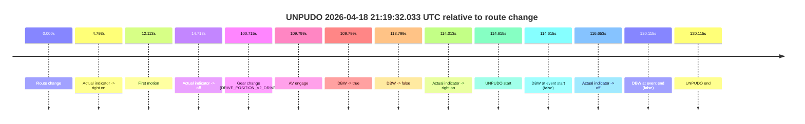
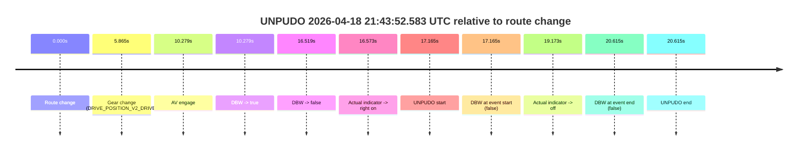

# Run Report: fme20018/2026-04-18--20-42-56--gen2-av-af145dd8-fa51-47ca-aac1-2b720e2d7a5c

| Field | Value |
|---|---|
| Run ID | `fme20018/2026-04-18--20-42-56--gen2-av-af145dd8-fa51-47ca-aac1-2b720e2d7a5c` |
| Date | `2026-04-18` |
| Model(s) | `armadillo-amethyst-squeaky` |
| Author | `guy.geva` |
| Event count | `3` |

## unpudo 2026-04-18 21:19:32.033 UTC

| Field | Value |
|---|---|
| Model | `armadillo-amethyst-squeaky` |
| Author | `guy.geva` |
| Run ID | `fme20018/2026-04-18--20-42-56--gen2-av-af145dd8-fa51-47ca-aac1-2b720e2d7a5c` |
| Date | `2026-04-18` |
| Time (UTC) | `21:19:32.033` |
| Event type | `unpudo` |
| Disengagement type | `none observed` |
| Route change | `found` |
| Console | [run](https://console.sso.wayve.ai/run/fme20018/2026-04-18--20-42-56--gen2-av-af145dd8-fa51-47ca-aac1-2b720e2d7a5c?id=&time-unixus=1776547172033306) |
| Foxglove | [segment](https://app.foxglove.dev/wayve-on-prem/p/prj_0dX18KZdVHg1fmmI/view?ds=foxglove-stream&ds.deviceName=fme20018&ds.start=2026-04-18T21%3A17%3A27.418256Z&ds.end=2026-04-18T21%3A19%3A47.533303Z&layoutId=lay_0e7VD4WIKDQGU73Y&time=2026-04-18T21%3A19%3A32.033306Z) |

### Event card: fail

- Fail: the credited unpudo does not stay AV-owned. The event window starts with DBW false, and the maneuver outcome lands outside a clean AV-owned segment.

| Event | Time (UTC) | Delta from route change |
|---|---:|---:|
| Route change | 2026-04-18 21:17:37.418 | `0.000s` |
| Actual indicator -> right on | 2026-04-18 21:17:42.211 | `4.793s` |
| First motion | 2026-04-18 21:17:49.531 | `12.113s` |
| Actual indicator -> off | 2026-04-18 21:17:52.131 | `14.713s` |
| Gear change (DRIVE_POSITION_V2_DRIVE) | 2026-04-18 21:19:18.133 | `100.715s` |
| AV engage | 2026-04-18 21:19:27.217 | `109.799s` |
| DBW -> true | 2026-04-18 21:19:27.217 | `109.799s` |
| DBW -> false | 2026-04-18 21:19:31.216 | `113.799s` |
| Actual indicator -> right on | 2026-04-18 21:19:31.431 | `114.013s` |
| UNPUDO start | 2026-04-18 21:19:32.033 | `114.615s` |
| DBW at event start (false) | 2026-04-18 21:19:32.033 | `114.615s` |
| Actual indicator -> off | 2026-04-18 21:19:34.071 | `116.653s` |
| DBW at event end (false) | 2026-04-18 21:19:37.533 | `120.115s` |
| UNPUDO end | 2026-04-18 21:19:37.533 | `120.115s` |

| Metric | Value |
|---|---|
| Outcome | `fail` |
| Effective failure type | `completed_outside_av` |
| Route change status | `found` |
| DBW at event start | `false` |
| DBW at event end | `false` |
| Predicted gear at AV start | `DRIVE_POSITION_V2_DRIVE` |
| Actual gear at AV start | `DRIVE_POSITION_V2_DRIVE` |
| Predicted gear at event start | `DRIVE_POSITION_V2_DRIVE` |
| Actual gear at event start | `DRIVE_POSITION_V2_DRIVE` |
| Planned indicator direction | `INDICATORS_STATE_V2_RIGHT_ON` |
| Controller indicator direction | `INDICATORS_STATE_V2_RIGHT_ON` |
| Actual indicator direction | `INDICATORS_STATE_V2_RIGHT_ON` |
| Actual indicator at maneuver end | `INDICATORS_STATE_V2_OFF` |
| Driver accel help in AV | `false` |
| Driver accel help timestamp | `n/a` |
| Max accel pedal pct in AV | `0.0%` |
| Max brake pedal pct in AV | `8.0%` |
| Max speed mps in AV | `0.000` |
| Success timing baseline | `route change` |
| Route -> AV | `109.799s` |
| AV -> event start | `4.816s` |
| AV -> first motion | `-97.686s` |
| Success baseline -> event start | `114.615s` |
| Success baseline -> first motion | `12.113s` |
| AV duration before disengagement | `4.000s` |
| Trajectory waypoint count | `37` |
| Driving-plan step count | `11` |

The scored portion starts from the AV-owned window, not from the pre-AV setup. Route-change search in the stopped pre-event segment was `found`, with the baseline therefore set to route change. At the event anchor the model predicts `DRIVE_POSITION_V2_DRIVE` and the actual gear is `DRIVE_POSITION_V2_DRIVE`. The effective model outcome is `fail` because `completed_outside_av.`

### Resolution

| Field | Value |
|---|---|
| Final outcome | `fail` |
| Do we agree with this label? | `yes` |
| Source disengagement type | `none observed` |
| Resolved effective failure type | `completed_outside_av` |
| Confidence | `high` |

## unpudo 2026-04-18 21:34:19.783 UTC

| Field | Value |
|---|---|
| Model | `armadillo-amethyst-squeaky` |
| Author | `guy.geva` |
| Run ID | `fme20018/2026-04-18--20-42-56--gen2-av-af145dd8-fa51-47ca-aac1-2b720e2d7a5c` |
| Date | `2026-04-18` |
| Time (UTC) | `21:34:19.783` |
| Event type | `unpudo` |
| Disengagement type | `none observed` |
| Route change | `found` |
| Console | [run](https://console.sso.wayve.ai/run/fme20018/2026-04-18--20-42-56--gen2-av-af145dd8-fa51-47ca-aac1-2b720e2d7a5c?id=&time-unixus=1776548059783316) |
| Foxglove | [segment](https://app.foxglove.dev/wayve-on-prem/p/prj_0dX18KZdVHg1fmmI/view?ds=foxglove-stream&ds.deviceName=fme20018&ds.start=2026-04-18T21%3A33%3A54.368349Z&ds.end=2026-04-18T21%3A34%3A34.183305Z&layoutId=lay_0e7VD4WIKDQGU73Y&time=2026-04-18T21%3A34%3A19.783316Z) |

### Event card: fail

- Fail: the credited unpudo does not stay AV-owned. The event window starts with DBW false, and the maneuver outcome lands outside a clean AV-owned segment.

| Event | Time (UTC) | Delta from route change |
|---|---:|---:|
| Route change | 2026-04-18 21:34:04.368 | `0.000s` |
| Gear change (DRIVE_POSITION_V2_DRIVE) | 2026-04-18 21:34:06.833 | `2.465s` |
| AV engage | 2026-04-18 21:34:13.236 | `8.869s` |
| DBW -> true | 2026-04-18 21:34:13.236 | `8.869s` |
| DBW -> false | 2026-04-18 21:34:19.136 | `14.769s` |
| Actual indicator -> right on | 2026-04-18 21:34:19.151 | `14.783s` |
| UNPUDO start | 2026-04-18 21:34:19.783 | `15.415s` |
| DBW at event start (false) | 2026-04-18 21:34:19.783 | `15.415s` |
| Actual indicator -> off | 2026-04-18 21:34:22.791 | `18.423s` |
| DBW at event end (false) | 2026-04-18 21:34:24.183 | `19.815s` |
| UNPUDO end | 2026-04-18 21:34:24.183 | `19.815s` |

| Metric | Value |
|---|---|
| Outcome | `fail` |
| Effective failure type | `not_av_owned` |
| Route change status | `found` |
| DBW at event start | `false` |
| DBW at event end | `false` |
| Predicted gear at AV start | `DRIVE_POSITION_V2_DRIVE` |
| Actual gear at AV start | `DRIVE_POSITION_V2_DRIVE` |
| Predicted gear at event start | `DRIVE_POSITION_V2_DRIVE` |
| Actual gear at event start | `DRIVE_POSITION_V2_DRIVE` |
| Planned indicator direction | `INDICATORS_STATE_V2_RIGHT_ON` |
| Controller indicator direction | `INDICATORS_STATE_V2_RIGHT_ON` |
| Actual indicator direction | `INDICATORS_STATE_V2_RIGHT_ON` |
| Actual indicator at maneuver end | `INDICATORS_STATE_V2_OFF` |
| Driver accel help in AV | `false` |
| Driver accel help timestamp | `n/a` |
| Max accel pedal pct in AV | `0.0%` |
| Max brake pedal pct in AV | `8.0%` |
| Max speed mps in AV | `0.000` |
| Success timing baseline | `route change` |
| Route -> AV | `8.869s` |
| AV -> event start | `6.546s` |
| AV -> first motion | `n/a` |
| Success baseline -> event start | `15.415s` |
| Success baseline -> first motion | `n/a` |
| AV duration before disengagement | `5.900s` |
| Trajectory waypoint count | `36` |
| Driving-plan step count | `11` |

The scored portion starts from the AV-owned window, not from the pre-AV setup. Route-change search in the stopped pre-event segment was `found`, with the baseline therefore set to route change. At the event anchor the model predicts `DRIVE_POSITION_V2_DRIVE` and the actual gear is `DRIVE_POSITION_V2_DRIVE`. The effective model outcome is `fail` because `not_av_owned.`

### Resolution

| Field | Value |
|---|---|
| Final outcome | `fail` |
| Do we agree with this label? | `yes` |
| Source disengagement type | `none observed` |
| Resolved effective failure type | `not_av_owned` |
| Confidence | `high` |

## unpudo 2026-04-18 21:43:52.583 UTC

| Field | Value |
|---|---|
| Model | `armadillo-amethyst-squeaky` |
| Author | `guy.geva` |
| Run ID | `fme20018/2026-04-18--20-42-56--gen2-av-af145dd8-fa51-47ca-aac1-2b720e2d7a5c` |
| Date | `2026-04-18` |
| Time (UTC) | `21:43:52.583` |
| Event type | `unpudo` |
| Disengagement type | `none observed` |
| Route change | `found` |
| Console | [run](https://console.sso.wayve.ai/run/fme20018/2026-04-18--20-42-56--gen2-av-af145dd8-fa51-47ca-aac1-2b720e2d7a5c?id=&time-unixus=1776548632583305) |
| Foxglove | [segment](https://app.foxglove.dev/wayve-on-prem/p/prj_0dX18KZdVHg1fmmI/view?ds=foxglove-stream&ds.deviceName=fme20018&ds.start=2026-04-18T21%3A43%3A25.418254Z&ds.end=2026-04-18T21%3A44%3A06.033314Z&layoutId=lay_0e7VD4WIKDQGU73Y&time=2026-04-18T21%3A43%3A52.583305Z) |

### Event card: fail

- Fail: the credited unpudo does not stay AV-owned. The event window starts with DBW false, and the maneuver outcome lands outside a clean AV-owned segment.

| Event | Time (UTC) | Delta from route change |
|---|---:|---:|
| Route change | 2026-04-18 21:43:35.418 | `0.000s` |
| Gear change (DRIVE_POSITION_V2_DRIVE) | 2026-04-18 21:43:41.283 | `5.865s` |
| AV engage | 2026-04-18 21:43:45.697 | `10.279s` |
| DBW -> true | 2026-04-18 21:43:45.697 | `10.279s` |
| DBW -> false | 2026-04-18 21:43:51.936 | `16.519s` |
| Actual indicator -> right on | 2026-04-18 21:43:51.991 | `16.573s` |
| UNPUDO start | 2026-04-18 21:43:52.583 | `17.165s` |
| DBW at event start (false) | 2026-04-18 21:43:52.583 | `17.165s` |
| Actual indicator -> off | 2026-04-18 21:43:54.591 | `19.173s` |
| DBW at event end (false) | 2026-04-18 21:43:56.033 | `20.615s` |
| UNPUDO end | 2026-04-18 21:43:56.033 | `20.615s` |

| Metric | Value |
|---|---|
| Outcome | `fail` |
| Effective failure type | `not_av_owned` |
| Route change status | `found` |
| DBW at event start | `false` |
| DBW at event end | `false` |
| Predicted gear at AV start | `DRIVE_POSITION_V2_DRIVE` |
| Actual gear at AV start | `DRIVE_POSITION_V2_DRIVE` |
| Predicted gear at event start | `DRIVE_POSITION_V2_DRIVE` |
| Actual gear at event start | `DRIVE_POSITION_V2_DRIVE` |
| Planned indicator direction | `INDICATORS_STATE_V2_RIGHT_ON` |
| Controller indicator direction | `INDICATORS_STATE_V2_RIGHT_ON` |
| Actual indicator direction | `INDICATORS_STATE_V2_RIGHT_ON` |
| Actual indicator at maneuver end | `INDICATORS_STATE_V2_OFF` |
| Driver accel help in AV | `false` |
| Driver accel help timestamp | `n/a` |
| Max accel pedal pct in AV | `0.0%` |
| Max brake pedal pct in AV | `8.0%` |
| Max speed mps in AV | `0.000` |
| Success timing baseline | `route change` |
| Route -> AV | `10.279s` |
| AV -> event start | `6.886s` |
| AV -> first motion | `n/a` |
| Success baseline -> event start | `17.165s` |
| Success baseline -> first motion | `n/a` |
| AV duration before disengagement | `6.240s` |
| Trajectory waypoint count | `34` |
| Driving-plan step count | `11` |

The scored portion starts from the AV-owned window, not from the pre-AV setup. Route-change search in the stopped pre-event segment was `found`, with the baseline therefore set to route change. At the event anchor the model predicts `DRIVE_POSITION_V2_DRIVE` and the actual gear is `DRIVE_POSITION_V2_DRIVE`. The effective model outcome is `fail` because `not_av_owned.`

### Resolution

| Field | Value |
|---|---|
| Final outcome | `fail` |
| Do we agree with this label? | `yes` |
| Source disengagement type | `none observed` |
| Resolved effective failure type | `not_av_owned` |
| Confidence | `high` |
