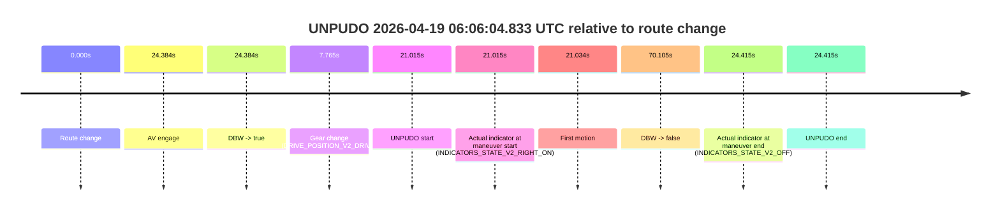
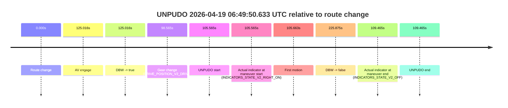
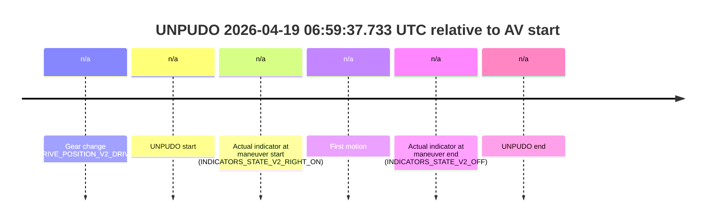
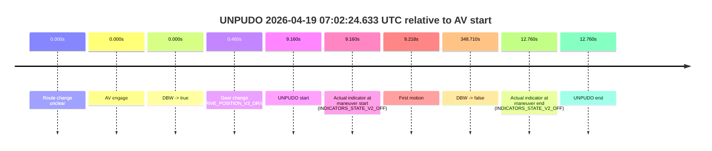
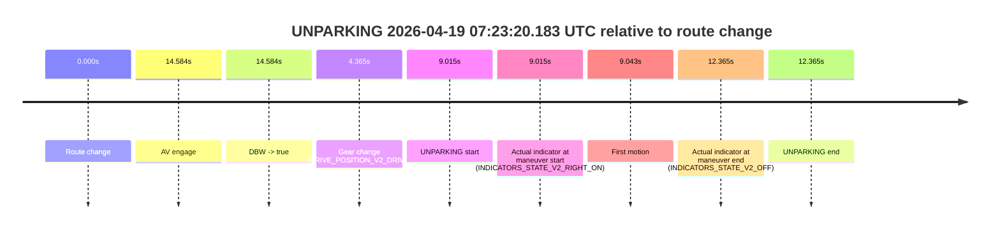

# Run Report: fme20018/2026-04-19--05-55-03--gen2-av-81988ec5-e526-4e4f-8a10-9c715d5bfa2f

| Field | Value |
|---|---|
| Run ID | `fme20018/2026-04-19--05-55-03--gen2-av-81988ec5-e526-4e4f-8a10-9c715d5bfa2f` |
| Date | `2026-04-19` |
| Model(s) | `satisfied-amber-moose` |
| Author | `guy.geva` |
| Event count | `16` |

## unpudo 2026-04-19 06:01:32.233 UTC

| Field | Value |
|---|---|
| Model | `satisfied-amber-moose` |
| Author | `guy.geva` |
| Run ID | `fme20018/2026-04-19--05-55-03--gen2-av-81988ec5-e526-4e4f-8a10-9c715d5bfa2f` |
| Date | `2026-04-19` |
| Time (UTC) | `06:01:32.233` |
| Event type | `unpudo` |
| Disengagement type | `none observed` |
| Route change | `found` |
| Console | [run](https://console.sso.wayve.ai/run/fme20018/2026-04-19--05-55-03--gen2-av-81988ec5-e526-4e4f-8a10-9c715d5bfa2f?id=&time-unixus=1776578492233293) |
| Foxglove | [segment](https://app.foxglove.dev/wayve-on-prem/p/prj_0dX18KZdVHg1fmmI/view?ds=foxglove-stream&ds.deviceName=fme20018&ds.start=2026-04-19T06%3A00%3A16.518374Z&ds.end=2026-04-19T06%3A05%3A36.942702Z&layoutId=lay_0e7VD4WIKDQGU73Y&time=2026-04-19T06%3A01%3A32.233293Z) |

### Event card: accidental

- Accidental: AV ownership is present for less than `2s`, so this is treated as an accidental brush with the maneuver rather than a meaningful model attempt.

| Event | Time (UTC) | Delta from route change |
|---|---:|---:|
| Route change | 2026-04-19 06:00:26.518 | `0.000s` |
| AV engage | 2026-04-19 06:01:46.784 | `80.266s` |
| DBW -> true | 2026-04-19 06:01:46.784 | `80.266s` |
| Gear change (DRIVE_POSITION_V2_DRIVE) | 2026-04-19 06:01:23.483 | `56.965s` |
| UNPUDO start | 2026-04-19 06:01:32.233 | `65.715s` |
| Actual indicator at maneuver start (INDICATORS_STATE_V2_RIGHT_ON) | 2026-04-19 06:01:32.233 | `65.715s` |
| First motion | 2026-04-19 06:01:32.271 | `65.753s` |
| DBW -> false | 2026-04-19 06:05:26.942 | `300.424s` |
| Actual indicator at maneuver end (INDICATORS_STATE_V2_OFF) | 2026-04-19 06:01:36.133 | `69.615s` |
| UNPUDO end | 2026-04-19 06:01:36.133 | `69.615s` |

| Metric | Value |
|---|---|
| Outcome | `accidental` |
| Effective failure type | `none` |
| Route change status | `found` |
| DBW at event start | `false` |
| DBW at event end | `false` |
| Predicted gear at AV start | `DRIVE_POSITION_V2_DRIVE` |
| Actual gear at AV start | `DRIVE_POSITION_V2_DRIVE` |
| Predicted gear at event start | `DRIVE_POSITION_V2_DRIVE` |
| Actual gear at event start | `DRIVE_POSITION_V2_DRIVE` |
| Planned indicator direction | `INDICATORS_STATE_V2_RIGHT_ON` |
| Controller indicator direction | `INDICATORS_STATE_V2_RIGHT_ON` |
| Actual indicator direction | `INDICATORS_STATE_V2_RIGHT_ON` |
| Actual indicator at maneuver end | `INDICATORS_STATE_V2_OFF` |
| Driver accel help in AV | `false` |
| Driver accel help timestamp | `n/a` |
| Max accel pedal pct in AV | `0.0%` |
| Max brake pedal pct in AV | `0.0%` |
| Max speed mps in AV | `0.000` |
| Route -> AV | `80.266s` |
| AV -> event start | `-14.551s` |
| AV -> first motion | `-14.512s` |
| AV duration before disengagement | `220.159s` |
| Trajectory waypoint count | `36` |
| Driving-plan step count | `11` |

The scored portion starts from the AV-owned window, not from the pre-AV setup. Route-change search in the stopped pre-event segment was `found`, with the baseline therefore set to route change. At the event anchor the model predicts `DRIVE_POSITION_V2_DRIVE` and the actual gear is `DRIVE_POSITION_V2_DRIVE`. The effective model outcome is `accidental` because `the AV-owned portion is shorter than 2s`.

### Resolution

| Field | Value |
|---|---|
| Final outcome | `accidental` |
| Do we agree with this label? | `yes` |
| Source disengagement type | `none observed` |
| Resolved effective failure type | `none` |
| Confidence | `high` |

## unpudo 2026-04-19 06:06:04.833 UTC

| Field | Value |
|---|---|
| Model | `satisfied-amber-moose` |
| Author | `guy.geva` |
| Run ID | `fme20018/2026-04-19--05-55-03--gen2-av-81988ec5-e526-4e4f-8a10-9c715d5bfa2f` |
| Date | `2026-04-19` |
| Time (UTC) | `06:06:04.833` |
| Event type | `unpudo` |
| Disengagement type | `none observed` |
| Route change | `found` |
| Console | [run](https://console.sso.wayve.ai/run/fme20018/2026-04-19--05-55-03--gen2-av-81988ec5-e526-4e4f-8a10-9c715d5bfa2f?id=&time-unixus=1776578764833300) |
| Foxglove | [segment](https://app.foxglove.dev/wayve-on-prem/p/prj_0dX18KZdVHg1fmmI/view?ds=foxglove-stream&ds.deviceName=fme20018&ds.start=2026-04-19T06%3A05%3A33.818234Z&ds.end=2026-04-19T06%3A07%3A03.923171Z&layoutId=lay_0e7VD4WIKDQGU73Y&time=2026-04-19T06%3A06%3A04.833300Z) |

### Event card: accidental

- Accidental: AV ownership is present for less than `2s`, so this is treated as an accidental brush with the maneuver rather than a meaningful model attempt.

| Event | Time (UTC) | Delta from route change |
|---|---:|---:|
| Route change | 2026-04-19 06:05:43.818 | `0.000s` |
| AV engage | 2026-04-19 06:06:08.202 | `24.384s` |
| DBW -> true | 2026-04-19 06:06:08.202 | `24.384s` |
| Gear change (DRIVE_POSITION_V2_DRIVE) | 2026-04-19 06:05:51.583 | `7.765s` |
| UNPUDO start | 2026-04-19 06:06:04.833 | `21.015s` |
| Actual indicator at maneuver start (INDICATORS_STATE_V2_RIGHT_ON) | 2026-04-19 06:06:04.833 | `21.015s` |
| First motion | 2026-04-19 06:06:04.851 | `21.034s` |
| DBW -> false | 2026-04-19 06:06:53.923 | `70.105s` |
| Actual indicator at maneuver end (INDICATORS_STATE_V2_OFF) | 2026-04-19 06:06:08.233 | `24.415s` |
| UNPUDO end | 2026-04-19 06:06:08.233 | `24.415s` |

| Metric | Value |
|---|---|
| Outcome | `accidental` |
| Effective failure type | `none` |
| Route change status | `found` |
| DBW at event start | `false` |
| DBW at event end | `true` |
| Predicted gear at AV start | `DRIVE_POSITION_V2_DRIVE` |
| Actual gear at AV start | `DRIVE_POSITION_V2_DRIVE` |
| Predicted gear at event start | `DRIVE_POSITION_V2_DRIVE` |
| Actual gear at event start | `DRIVE_POSITION_V2_DRIVE` |
| Planned indicator direction | `INDICATORS_STATE_V2_LEFT_ON` |
| Controller indicator direction | `INDICATORS_STATE_V2_LEFT_ON` |
| Actual indicator direction | `INDICATORS_STATE_V2_RIGHT_ON` |
| Actual indicator at maneuver end | `INDICATORS_STATE_V2_OFF` |
| Driver accel help in AV | `false` |
| Driver accel help timestamp | `n/a` |
| Max accel pedal pct in AV | `0.0%` |
| Max brake pedal pct in AV | `0.0%` |
| Max speed mps in AV | `4.931` |
| Route -> AV | `24.384s` |
| AV -> event start | `-3.369s` |
| AV -> first motion | `-3.351s` |
| AV duration before disengagement | `45.720s` |
| Trajectory waypoint count | `36` |
| Driving-plan step count | `11` |

The scored portion starts from the AV-owned window, not from the pre-AV setup. Route-change search in the stopped pre-event segment was `found`, with the baseline therefore set to route change. At the event anchor the model predicts `DRIVE_POSITION_V2_DRIVE` and the actual gear is `DRIVE_POSITION_V2_DRIVE`. The effective model outcome is `accidental` because `the AV-owned portion is shorter than 2s`.

### Resolution

| Field | Value |
|---|---|
| Final outcome | `accidental` |
| Do we agree with this label? | `yes` |
| Source disengagement type | `none observed` |
| Resolved effective failure type | `none` |
| Confidence | `high` |

## unpudo 2026-04-19 06:06:54.433 UTC

| Field | Value |
|---|---|
| Model | `satisfied-amber-moose` |
| Author | `guy.geva` |
| Run ID | `fme20018/2026-04-19--05-55-03--gen2-av-81988ec5-e526-4e4f-8a10-9c715d5bfa2f` |
| Date | `2026-04-19` |
| Time (UTC) | `06:06:54.433` |
| Event type | `unpudo` |
| Disengagement type | `failed_to_accelerate` |
| Route change | `found` |
| Console | [run](https://console.sso.wayve.ai/run/fme20018/2026-04-19--05-55-03--gen2-av-81988ec5-e526-4e4f-8a10-9c715d5bfa2f?id=&time-unixus=1776578814433309) |
| Foxglove | [segment](https://app.foxglove.dev/wayve-on-prem/p/prj_0dX18KZdVHg1fmmI/view?ds=foxglove-stream&ds.deviceName=fme20018&ds.start=2026-04-19T06%3A05%3A33.818234Z&ds.end=2026-04-19T06%3A08%3A27.242990Z&layoutId=lay_0e7VD4WIKDQGU73Y&time=2026-04-19T06%3A06%3A54.433309Z) |

### Event card: accidental

- Accidental: AV ownership is present for less than `2s`, so this is treated as an accidental brush with the maneuver rather than a meaningful model attempt.

| Event | Time (UTC) | Delta from route change |
|---|---:|---:|
| Route change | 2026-04-19 06:05:43.818 | `0.000s` |
| AV engage | 2026-04-19 06:06:58.102 | `74.285s` |
| DBW -> true | 2026-04-19 06:06:58.102 | `74.285s` |
| Gear change (DRIVE_POSITION_V2_DRIVE) | 2026-04-19 06:06:47.433 | `63.615s` |
| UNPUDO start | 2026-04-19 06:06:54.433 | `70.615s` |
| Actual indicator at maneuver start (INDICATORS_STATE_V2_RIGHT_ON) | 2026-04-19 06:06:54.433 | `70.615s` |
| First motion | 2026-04-19 06:06:54.511 | `70.693s` |
| DBW -> false | 2026-04-19 06:08:17.242 | `153.425s` |
| Actual indicator at maneuver end (INDICATORS_STATE_V2_OFF) | 2026-04-19 06:06:57.833 | `74.015s` |
| UNPUDO end | 2026-04-19 06:06:57.833 | `74.015s` |

| Metric | Value |
|---|---|
| Outcome | `accidental` |
| Effective failure type | `none` |
| Route change status | `found` |
| DBW at event start | `false` |
| DBW at event end | `false` |
| Predicted gear at AV start | `DRIVE_POSITION_V2_DRIVE` |
| Actual gear at AV start | `DRIVE_POSITION_V2_DRIVE` |
| Predicted gear at event start | `DRIVE_POSITION_V2_DRIVE` |
| Actual gear at event start | `DRIVE_POSITION_V2_DRIVE` |
| Planned indicator direction | `INDICATORS_STATE_V2_RIGHT_ON` |
| Controller indicator direction | `INDICATORS_STATE_V2_RIGHT_ON` |
| Actual indicator direction | `INDICATORS_STATE_V2_RIGHT_ON` |
| Actual indicator at maneuver end | `INDICATORS_STATE_V2_OFF` |
| Driver accel help in AV | `false` |
| Driver accel help timestamp | `n/a` |
| Max accel pedal pct in AV | `0.0%` |
| Max brake pedal pct in AV | `0.0%` |
| Max speed mps in AV | `0.000` |
| Route -> AV | `74.285s` |
| AV -> event start | `-3.669s` |
| AV -> first motion | `-3.592s` |
| AV duration before disengagement | `79.140s` |
| Trajectory waypoint count | `36` |
| Driving-plan step count | `11` |

The scored portion starts from the AV-owned window, not from the pre-AV setup. Route-change search in the stopped pre-event segment was `found`, with the baseline therefore set to route change. At the event anchor the model predicts `DRIVE_POSITION_V2_DRIVE` and the actual gear is `DRIVE_POSITION_V2_DRIVE`. The effective model outcome is `accidental` because `the AV-owned portion is shorter than 2s`.

### Resolution

| Field | Value |
|---|---|
| Final outcome | `accidental` |
| Do we agree with this label? | `yes` |
| Source disengagement type | `failed_to_accelerate` |
| Resolved effective failure type | `none` |
| Confidence | `high` |

## unpudo 2026-04-19 06:08:58.633 UTC

| Field | Value |
|---|---|
| Model | `satisfied-amber-moose` |
| Author | `guy.geva` |
| Run ID | `fme20018/2026-04-19--05-55-03--gen2-av-81988ec5-e526-4e4f-8a10-9c715d5bfa2f` |
| Date | `2026-04-19` |
| Time (UTC) | `06:08:58.633` |
| Event type | `unpudo` |
| Disengagement type | `none observed` |
| Route change | `found` |
| Console | [run](https://console.sso.wayve.ai/run/fme20018/2026-04-19--05-55-03--gen2-av-81988ec5-e526-4e4f-8a10-9c715d5bfa2f?id=&time-unixus=1776578938633317) |
| Foxglove | [segment](https://app.foxglove.dev/wayve-on-prem/p/prj_0dX18KZdVHg1fmmI/view?ds=foxglove-stream&ds.deviceName=fme20018&ds.start=2026-04-19T06%3A08%3A04.268967Z&ds.end=2026-04-19T06%3A09%3A57.042954Z&layoutId=lay_0e7VD4WIKDQGU73Y&time=2026-04-19T06%3A08%3A58.633317Z) |

### Event card: accidental

- Accidental: AV ownership is present for less than `2s`, so this is treated as an accidental brush with the maneuver rather than a meaningful model attempt.

| Event | Time (UTC) | Delta from route change |
|---|---:|---:|
| Route change | 2026-04-19 06:08:14.268 | `0.000s` |
| AV engage | 2026-04-19 06:09:07.292 | `53.024s` |
| DBW -> true | 2026-04-19 06:09:07.292 | `53.024s` |
| Gear change (DRIVE_POSITION_V2_DRIVE) | 2026-04-19 06:08:47.783 | `33.514s` |
| UNPUDO start | 2026-04-19 06:08:58.633 | `44.364s` |
| Actual indicator at maneuver start (INDICATORS_STATE_V2_OFF) | 2026-04-19 06:08:58.633 | `44.364s` |
| First motion | 2026-04-19 06:08:58.651 | `44.382s` |
| DBW -> false | 2026-04-19 06:09:47.042 | `92.774s` |
| Actual indicator at maneuver end (INDICATORS_STATE_V2_LEFT_ON) | 2026-04-19 06:09:03.433 | `49.164s` |
| UNPUDO end | 2026-04-19 06:09:03.433 | `49.164s` |

| Metric | Value |
|---|---|
| Outcome | `accidental` |
| Effective failure type | `none` |
| Route change status | `found` |
| DBW at event start | `false` |
| DBW at event end | `false` |
| Predicted gear at AV start | `DRIVE_POSITION_V2_DRIVE` |
| Actual gear at AV start | `DRIVE_POSITION_V2_DRIVE` |
| Predicted gear at event start | `DRIVE_POSITION_V2_DRIVE` |
| Actual gear at event start | `DRIVE_POSITION_V2_DRIVE` |
| Planned indicator direction | `INDICATORS_STATE_V2_LEFT_ON` |
| Controller indicator direction | `INDICATORS_STATE_V2_LEFT_ON` |
| Actual indicator direction | `INDICATORS_STATE_V2_OFF` |
| Actual indicator at maneuver end | `INDICATORS_STATE_V2_LEFT_ON` |
| Driver accel help in AV | `false` |
| Driver accel help timestamp | `n/a` |
| Max accel pedal pct in AV | `0.0%` |
| Max brake pedal pct in AV | `0.0%` |
| Max speed mps in AV | `0.000` |
| Route -> AV | `53.024s` |
| AV -> event start | `-8.659s` |
| AV -> first motion | `-8.642s` |
| AV duration before disengagement | `39.750s` |
| Trajectory waypoint count | `36` |
| Driving-plan step count | `11` |

The scored portion starts from the AV-owned window, not from the pre-AV setup. Route-change search in the stopped pre-event segment was `found`, with the baseline therefore set to route change. At the event anchor the model predicts `DRIVE_POSITION_V2_DRIVE` and the actual gear is `DRIVE_POSITION_V2_DRIVE`. The effective model outcome is `accidental` because `the AV-owned portion is shorter than 2s`.

### Resolution

| Field | Value |
|---|---|
| Final outcome | `accidental` |
| Do we agree with this label? | `yes` |
| Source disengagement type | `none observed` |
| Resolved effective failure type | `none` |
| Confidence | `high` |

## unpudo 2026-04-19 06:11:46.933 UTC

| Field | Value |
|---|---|
| Model | `satisfied-amber-moose` |
| Author | `guy.geva` |
| Run ID | `fme20018/2026-04-19--05-55-03--gen2-av-81988ec5-e526-4e4f-8a10-9c715d5bfa2f` |
| Date | `2026-04-19` |
| Time (UTC) | `06:11:46.933` |
| Event type | `unpudo` |
| Disengagement type | `none observed` |
| Route change | `found` |
| Console | [run](https://console.sso.wayve.ai/run/fme20018/2026-04-19--05-55-03--gen2-av-81988ec5-e526-4e4f-8a10-9c715d5bfa2f?id=&time-unixus=1776579106933298) |
| Foxglove | [segment](https://app.foxglove.dev/wayve-on-prem/p/prj_0dX18KZdVHg1fmmI/view?ds=foxglove-stream&ds.deviceName=fme20018&ds.start=2026-04-19T06%3A09%3A41.818343Z&ds.end=2026-04-19T06%3A12%3A39.823420Z&layoutId=lay_0e7VD4WIKDQGU73Y&time=2026-04-19T06%3A11%3A46.933298Z) |

### Event card: accidental

- Accidental: AV ownership is present for less than `2s`, so this is treated as an accidental brush with the maneuver rather than a meaningful model attempt.

| Event | Time (UTC) | Delta from route change |
|---|---:|---:|
| Route change | 2026-04-19 06:09:51.818 | `0.000s` |
| AV engage | 2026-04-19 06:11:53.542 | `121.724s` |
| DBW -> true | 2026-04-19 06:11:53.542 | `121.724s` |
| Gear change (DRIVE_POSITION_V2_DRIVE) | 2026-04-19 06:11:39.383 | `107.565s` |
| UNPUDO start | 2026-04-19 06:11:46.933 | `115.115s` |
| Actual indicator at maneuver start (INDICATORS_STATE_V2_RIGHT_ON) | 2026-04-19 06:11:46.933 | `115.115s` |
| First motion | 2026-04-19 06:11:46.991 | `115.173s` |
| DBW -> false | 2026-04-19 06:12:29.823 | `158.005s` |
| Actual indicator at maneuver end (INDICATORS_STATE_V2_OFF) | 2026-04-19 06:11:51.683 | `119.865s` |
| UNPUDO end | 2026-04-19 06:11:51.683 | `119.865s` |

| Metric | Value |
|---|---|
| Outcome | `accidental` |
| Effective failure type | `none` |
| Route change status | `found` |
| DBW at event start | `false` |
| DBW at event end | `false` |
| Predicted gear at AV start | `DRIVE_POSITION_V2_DRIVE` |
| Actual gear at AV start | `DRIVE_POSITION_V2_DRIVE` |
| Predicted gear at event start | `DRIVE_POSITION_V2_DRIVE` |
| Actual gear at event start | `DRIVE_POSITION_V2_DRIVE` |
| Planned indicator direction | `INDICATORS_STATE_V2_RIGHT_ON` |
| Controller indicator direction | `INDICATORS_STATE_V2_RIGHT_ON` |
| Actual indicator direction | `INDICATORS_STATE_V2_RIGHT_ON` |
| Actual indicator at maneuver end | `INDICATORS_STATE_V2_OFF` |
| Driver accel help in AV | `false` |
| Driver accel help timestamp | `n/a` |
| Max accel pedal pct in AV | `0.0%` |
| Max brake pedal pct in AV | `0.0%` |
| Max speed mps in AV | `0.000` |
| Route -> AV | `121.724s` |
| AV -> event start | `-6.609s` |
| AV -> first motion | `-6.551s` |
| AV duration before disengagement | `36.281s` |
| Trajectory waypoint count | `36` |
| Driving-plan step count | `11` |

The scored portion starts from the AV-owned window, not from the pre-AV setup. Route-change search in the stopped pre-event segment was `found`, with the baseline therefore set to route change. At the event anchor the model predicts `DRIVE_POSITION_V2_DRIVE` and the actual gear is `DRIVE_POSITION_V2_DRIVE`. The effective model outcome is `accidental` because `the AV-owned portion is shorter than 2s`.

### Resolution

| Field | Value |
|---|---|
| Final outcome | `accidental` |
| Do we agree with this label? | `yes` |
| Source disengagement type | `none observed` |
| Resolved effective failure type | `none` |
| Confidence | `high` |

## unpudo 2026-04-19 06:14:38.933 UTC

| Field | Value |
|---|---|
| Model | `satisfied-amber-moose` |
| Author | `guy.geva` |
| Run ID | `fme20018/2026-04-19--05-55-03--gen2-av-81988ec5-e526-4e4f-8a10-9c715d5bfa2f` |
| Date | `2026-04-19` |
| Time (UTC) | `06:14:38.933` |
| Event type | `unpudo` |
| Disengagement type | `none observed` |
| Route change | `found` |
| Console | [run](https://console.sso.wayve.ai/run/fme20018/2026-04-19--05-55-03--gen2-av-81988ec5-e526-4e4f-8a10-9c715d5bfa2f?id=&time-unixus=1776579278933317) |
| Foxglove | [segment](https://app.foxglove.dev/wayve-on-prem/p/prj_0dX18KZdVHg1fmmI/view?ds=foxglove-stream&ds.deviceName=fme20018&ds.start=2026-04-19T06%3A12%3A34.668266Z&ds.end=2026-04-19T06%3A17%3A42.203723Z&layoutId=lay_0e7VD4WIKDQGU73Y&time=2026-04-19T06%3A14%3A38.933317Z) |

### Event card: pass

- Pass: AV owns the credited unpudo through the official event window, the gear state is aligned at the anchor, and the vehicle moves without driver accelerator help in AV.

| Event | Time (UTC) | Delta from route change |
|---|---:|---:|
| Route change | 2026-04-19 06:12:44.668 | `0.000s` |
| AV engage | 2026-04-19 06:12:47.702 | `3.035s` |
| DBW -> true | 2026-04-19 06:12:47.702 | `3.035s` |
| Gear change (DRIVE_POSITION_V2_DRIVE) | 2026-04-19 06:14:16.733 | `92.065s` |
| UNPUDO start | 2026-04-19 06:14:38.933 | `114.265s` |
| Actual indicator at maneuver start (INDICATORS_STATE_V2_OFF) | 2026-04-19 06:14:38.933 | `114.265s` |
| First motion | 2026-04-19 06:14:38.971 | `114.303s` |
| DBW -> false | 2026-04-19 06:17:32.203 | `287.535s` |
| Actual indicator at maneuver end (INDICATORS_STATE_V2_OFF) | 2026-04-19 06:14:42.283 | `117.615s` |
| UNPUDO end | 2026-04-19 06:14:42.283 | `117.615s` |

| Metric | Value |
|---|---|
| Outcome | `pass` |
| Effective failure type | `none` |
| Route change status | `found` |
| DBW at event start | `true` |
| DBW at event end | `true` |
| Predicted gear at AV start | `DRIVE_POSITION_V2_DRIVE` |
| Actual gear at AV start | `DRIVE_POSITION_V2_PARK` |
| Predicted gear at event start | `DRIVE_POSITION_V2_DRIVE` |
| Actual gear at event start | `DRIVE_POSITION_V2_DRIVE` |
| Planned indicator direction | `INDICATORS_STATE_V2_OFF` |
| Controller indicator direction | `INDICATORS_STATE_V2_OFF` |
| Actual indicator direction | `INDICATORS_STATE_V2_OFF` |
| Actual indicator at maneuver end | `INDICATORS_STATE_V2_OFF` |
| Driver accel help in AV | `false` |
| Driver accel help timestamp | `n/a` |
| Max accel pedal pct in AV | `0.0%` |
| Max brake pedal pct in AV | `8.0%` |
| Max speed mps in AV | `8.131` |
| Route -> AV | `3.035s` |
| AV -> event start | `111.230s` |
| AV -> first motion | `111.268s` |
| AV duration before disengagement | `284.501s` |
| Trajectory waypoint count | `36` |
| Driving-plan step count | `11` |

The scored portion starts from the AV-owned window, not from the pre-AV setup. Route-change search in the stopped pre-event segment was `found`, with the baseline therefore set to route change. At the event anchor the model predicts `DRIVE_POSITION_V2_DRIVE` and the actual gear is `DRIVE_POSITION_V2_DRIVE`. The effective model outcome is `pass` because `the credited maneuver stays AV-owned through the official event end`.

### Resolution

| Field | Value |
|---|---|
| Final outcome | `pass` |
| Do we agree with this label? | `yes` |
| Source disengagement type | `none observed` |
| Resolved effective failure type | `none` |
| Confidence | `high` |

## unpudo 2026-04-19 06:19:15.433 UTC

| Field | Value |
|---|---|
| Model | `satisfied-amber-moose` |
| Author | `guy.geva` |
| Run ID | `fme20018/2026-04-19--05-55-03--gen2-av-81988ec5-e526-4e4f-8a10-9c715d5bfa2f` |
| Date | `2026-04-19` |
| Time (UTC) | `06:19:15.433` |
| Event type | `unpudo` |
| Disengagement type | `none observed` |
| Route change | `found` |
| Console | [run](https://console.sso.wayve.ai/run/fme20018/2026-04-19--05-55-03--gen2-av-81988ec5-e526-4e4f-8a10-9c715d5bfa2f?id=&time-unixus=1776579555433311) |
| Foxglove | [segment](https://app.foxglove.dev/wayve-on-prem/p/prj_0dX18KZdVHg1fmmI/view?ds=foxglove-stream&ds.deviceName=fme20018&ds.start=2026-04-19T06%3A17%3A17.368274Z&ds.end=2026-04-19T06%3A22%3A09.242790Z&layoutId=lay_0e7VD4WIKDQGU73Y&time=2026-04-19T06%3A19%3A15.433311Z) |

### Event card: accidental

- Accidental: AV ownership is present for less than `2s`, so this is treated as an accidental brush with the maneuver rather than a meaningful model attempt.

| Event | Time (UTC) | Delta from route change |
|---|---:|---:|
| Route change | 2026-04-19 06:17:27.368 | `0.000s` |
| AV engage | 2026-04-19 06:19:34.403 | `127.036s` |
| DBW -> true | 2026-04-19 06:19:34.403 | `127.036s` |
| Gear change (DRIVE_POSITION_V2_DRIVE) | 2026-04-19 06:19:08.083 | `100.715s` |
| UNPUDO start | 2026-04-19 06:19:15.433 | `108.065s` |
| Actual indicator at maneuver start (INDICATORS_STATE_V2_RIGHT_ON) | 2026-04-19 06:19:15.433 | `108.065s` |
| First motion | 2026-04-19 06:19:15.531 | `108.163s` |
| DBW -> false | 2026-04-19 06:21:59.242 | `271.875s` |
| Actual indicator at maneuver end (INDICATORS_STATE_V2_OFF) | 2026-04-19 06:19:19.083 | `111.715s` |
| UNPUDO end | 2026-04-19 06:19:19.083 | `111.715s` |

| Metric | Value |
|---|---|
| Outcome | `accidental` |
| Effective failure type | `none` |
| Route change status | `found` |
| DBW at event start | `false` |
| DBW at event end | `false` |
| Predicted gear at AV start | `DRIVE_POSITION_V2_DRIVE` |
| Actual gear at AV start | `DRIVE_POSITION_V2_DRIVE` |
| Predicted gear at event start | `DRIVE_POSITION_V2_DRIVE` |
| Actual gear at event start | `DRIVE_POSITION_V2_DRIVE` |
| Planned indicator direction | `INDICATORS_STATE_V2_OFF` |
| Controller indicator direction | `INDICATORS_STATE_V2_OFF` |
| Actual indicator direction | `INDICATORS_STATE_V2_RIGHT_ON` |
| Actual indicator at maneuver end | `INDICATORS_STATE_V2_OFF` |
| Driver accel help in AV | `false` |
| Driver accel help timestamp | `n/a` |
| Max accel pedal pct in AV | `0.0%` |
| Max brake pedal pct in AV | `0.0%` |
| Max speed mps in AV | `0.000` |
| Route -> AV | `127.036s` |
| AV -> event start | `-18.971s` |
| AV -> first motion | `-18.873s` |
| AV duration before disengagement | `144.839s` |
| Trajectory waypoint count | `36` |
| Driving-plan step count | `11` |

The scored portion starts from the AV-owned window, not from the pre-AV setup. Route-change search in the stopped pre-event segment was `found`, with the baseline therefore set to route change. At the event anchor the model predicts `DRIVE_POSITION_V2_DRIVE` and the actual gear is `DRIVE_POSITION_V2_DRIVE`. The effective model outcome is `accidental` because `the AV-owned portion is shorter than 2s`.

### Resolution

| Field | Value |
|---|---|
| Final outcome | `accidental` |
| Do we agree with this label? | `yes` |
| Source disengagement type | `none observed` |
| Resolved effective failure type | `none` |
| Confidence | `high` |

## unpudo 2026-04-19 06:27:43.833 UTC

| Field | Value |
|---|---|
| Model | `satisfied-amber-moose` |
| Author | `guy.geva` |
| Run ID | `fme20018/2026-04-19--05-55-03--gen2-av-81988ec5-e526-4e4f-8a10-9c715d5bfa2f` |
| Date | `2026-04-19` |
| Time (UTC) | `06:27:43.833` |
| Event type | `unpudo` |
| Disengagement type | `none observed` |
| Route change | `found` |
| Console | [run](https://console.sso.wayve.ai/run/fme20018/2026-04-19--05-55-03--gen2-av-81988ec5-e526-4e4f-8a10-9c715d5bfa2f?id=&time-unixus=1776580063833316) |
| Foxglove | [segment](https://app.foxglove.dev/wayve-on-prem/p/prj_0dX18KZdVHg1fmmI/view?ds=foxglove-stream&ds.deviceName=fme20018&ds.start=2026-04-19T06%3A26%3A10.368262Z&ds.end=2026-04-19T06%3A30%3A53.222663Z&layoutId=lay_0e7VD4WIKDQGU73Y&time=2026-04-19T06%3A27%3A43.833316Z) |

### Event card: accidental

- Accidental: AV ownership is present for less than `2s`, so this is treated as an accidental brush with the maneuver rather than a meaningful model attempt.

| Event | Time (UTC) | Delta from route change |
|---|---:|---:|
| Route change | 2026-04-19 06:26:20.368 | `0.000s` |
| AV engage | 2026-04-19 06:27:50.423 | `90.056s` |
| DBW -> true | 2026-04-19 06:27:50.423 | `90.056s` |
| Gear change (DRIVE_POSITION_V2_DRIVE) | 2026-04-19 06:27:38.733 | `78.365s` |
| UNPUDO start | 2026-04-19 06:27:43.833 | `83.465s` |
| Actual indicator at maneuver start (INDICATORS_STATE_V2_RIGHT_ON) | 2026-04-19 06:27:43.833 | `83.465s` |
| First motion | 2026-04-19 06:27:43.871 | `83.503s` |
| DBW -> false | 2026-04-19 06:30:43.222 | `262.854s` |
| Actual indicator at maneuver end (INDICATORS_STATE_V2_OFF) | 2026-04-19 06:27:48.933 | `88.565s` |
| UNPUDO end | 2026-04-19 06:27:48.933 | `88.565s` |

| Metric | Value |
|---|---|
| Outcome | `accidental` |
| Effective failure type | `none` |
| Route change status | `found` |
| DBW at event start | `false` |
| DBW at event end | `false` |
| Predicted gear at AV start | `DRIVE_POSITION_V2_DRIVE` |
| Actual gear at AV start | `DRIVE_POSITION_V2_DRIVE` |
| Predicted gear at event start | `DRIVE_POSITION_V2_DRIVE` |
| Actual gear at event start | `DRIVE_POSITION_V2_DRIVE` |
| Planned indicator direction | `INDICATORS_STATE_V2_RIGHT_ON` |
| Controller indicator direction | `INDICATORS_STATE_V2_RIGHT_ON` |
| Actual indicator direction | `INDICATORS_STATE_V2_RIGHT_ON` |
| Actual indicator at maneuver end | `INDICATORS_STATE_V2_OFF` |
| Driver accel help in AV | `false` |
| Driver accel help timestamp | `n/a` |
| Max accel pedal pct in AV | `0.0%` |
| Max brake pedal pct in AV | `0.0%` |
| Max speed mps in AV | `0.000` |
| Route -> AV | `90.056s` |
| AV -> event start | `-6.590s` |
| AV -> first motion | `-6.553s` |
| AV duration before disengagement | `172.799s` |
| Trajectory waypoint count | `36` |
| Driving-plan step count | `11` |

The scored portion starts from the AV-owned window, not from the pre-AV setup. Route-change search in the stopped pre-event segment was `found`, with the baseline therefore set to route change. At the event anchor the model predicts `DRIVE_POSITION_V2_DRIVE` and the actual gear is `DRIVE_POSITION_V2_DRIVE`. The effective model outcome is `accidental` because `the AV-owned portion is shorter than 2s`.

### Resolution

| Field | Value |
|---|---|
| Final outcome | `accidental` |
| Do we agree with this label? | `yes` |
| Source disengagement type | `none observed` |
| Resolved effective failure type | `none` |
| Confidence | `high` |

## unpudo 2026-04-19 06:43:05.733 UTC

| Field | Value |
|---|---|
| Model | `satisfied-amber-moose` |
| Author | `guy.geva` |
| Run ID | `fme20018/2026-04-19--05-55-03--gen2-av-81988ec5-e526-4e4f-8a10-9c715d5bfa2f` |
| Date | `2026-04-19` |
| Time (UTC) | `06:43:05.733` |
| Event type | `unpudo` |
| Disengagement type | `none observed` |
| Route change | `found` |
| Console | [run](https://console.sso.wayve.ai/run/fme20018/2026-04-19--05-55-03--gen2-av-81988ec5-e526-4e4f-8a10-9c715d5bfa2f?id=&time-unixus=1776580985733309) |
| Foxglove | [segment](https://app.foxglove.dev/wayve-on-prem/p/prj_0dX18KZdVHg1fmmI/view?ds=foxglove-stream&ds.deviceName=fme20018&ds.start=2026-04-19T06%3A42%3A47.218291Z&ds.end=2026-04-19T06%3A45%3A42.223863Z&layoutId=lay_0e7VD4WIKDQGU73Y&time=2026-04-19T06%3A43%3A05.733309Z) |

### Event card: accidental

- Accidental: AV ownership is present for less than `2s`, so this is treated as an accidental brush with the maneuver rather than a meaningful model attempt.

| Event | Time (UTC) | Delta from route change |
|---|---:|---:|
| Route change | 2026-04-19 06:42:57.218 | `0.000s` |
| AV engage | 2026-04-19 06:43:10.282 | `13.064s` |
| DBW -> true | 2026-04-19 06:43:10.282 | `13.064s` |
| Gear change (DRIVE_POSITION_V2_DRIVE) | 2026-04-19 06:42:57.533 | `0.315s` |
| UNPUDO start | 2026-04-19 06:43:05.733 | `8.515s` |
| Actual indicator at maneuver start (INDICATORS_STATE_V2_RIGHT_ON) | 2026-04-19 06:43:05.733 | `8.515s` |
| First motion | 2026-04-19 06:43:05.811 | `8.593s` |
| DBW -> false | 2026-04-19 06:45:32.223 | `155.006s` |
| Actual indicator at maneuver end (INDICATORS_STATE_V2_OFF) | 2026-04-19 06:43:10.233 | `13.015s` |
| UNPUDO end | 2026-04-19 06:43:10.233 | `13.015s` |

| Metric | Value |
|---|---|
| Outcome | `accidental` |
| Effective failure type | `none` |
| Route change status | `found` |
| DBW at event start | `false` |
| DBW at event end | `false` |
| Predicted gear at AV start | `DRIVE_POSITION_V2_DRIVE` |
| Actual gear at AV start | `DRIVE_POSITION_V2_DRIVE` |
| Predicted gear at event start | `DRIVE_POSITION_V2_DRIVE` |
| Actual gear at event start | `DRIVE_POSITION_V2_DRIVE` |
| Planned indicator direction | `INDICATORS_STATE_V2_RIGHT_ON` |
| Controller indicator direction | `INDICATORS_STATE_V2_RIGHT_ON` |
| Actual indicator direction | `INDICATORS_STATE_V2_RIGHT_ON` |
| Actual indicator at maneuver end | `INDICATORS_STATE_V2_OFF` |
| Driver accel help in AV | `false` |
| Driver accel help timestamp | `n/a` |
| Max accel pedal pct in AV | `0.0%` |
| Max brake pedal pct in AV | `0.0%` |
| Max speed mps in AV | `0.000` |
| Route -> AV | `13.064s` |
| AV -> event start | `-4.549s` |
| AV -> first motion | `-4.471s` |
| AV duration before disengagement | `141.941s` |
| Trajectory waypoint count | `36` |
| Driving-plan step count | `11` |

The scored portion starts from the AV-owned window, not from the pre-AV setup. Route-change search in the stopped pre-event segment was `found`, with the baseline therefore set to route change. At the event anchor the model predicts `DRIVE_POSITION_V2_DRIVE` and the actual gear is `DRIVE_POSITION_V2_DRIVE`. The effective model outcome is `accidental` because `the AV-owned portion is shorter than 2s`.

### Resolution

| Field | Value |
|---|---|
| Final outcome | `accidental` |
| Do we agree with this label? | `yes` |
| Source disengagement type | `none observed` |
| Resolved effective failure type | `none` |
| Confidence | `high` |

## unpudo 2026-04-19 06:45:55.333 UTC

| Field | Value |
|---|---|
| Model | `satisfied-amber-moose` |
| Author | `guy.geva` |
| Run ID | `fme20018/2026-04-19--05-55-03--gen2-av-81988ec5-e526-4e4f-8a10-9c715d5bfa2f` |
| Date | `2026-04-19` |
| Time (UTC) | `06:45:55.333` |
| Event type | `unpudo` |
| Disengagement type | `none observed` |
| Route change | `found` |
| Console | [run](https://console.sso.wayve.ai/run/fme20018/2026-04-19--05-55-03--gen2-av-81988ec5-e526-4e4f-8a10-9c715d5bfa2f?id=&time-unixus=1776581155333290) |
| Foxglove | [segment](https://app.foxglove.dev/wayve-on-prem/p/prj_0dX18KZdVHg1fmmI/view?ds=foxglove-stream&ds.deviceName=fme20018&ds.start=2026-04-19T06%3A45%3A36.618304Z&ds.end=2026-04-19T06%3A47%3A31.722680Z&layoutId=lay_0e7VD4WIKDQGU73Y&time=2026-04-19T06%3A45%3A55.333290Z) |

### Event card: pass

- Pass: AV owns the credited unpudo through the official event window, the gear state is aligned at the anchor, and the vehicle moves without driver accelerator help in AV.

| Event | Time (UTC) | Delta from route change |
|---|---:|---:|
| Route change | 2026-04-19 06:45:46.618 | `0.000s` |
| AV engage | 2026-04-19 06:45:49.812 | `3.195s` |
| DBW -> true | 2026-04-19 06:45:49.812 | `3.195s` |
| Gear change (DRIVE_POSITION_V2_DRIVE) | 2026-04-19 06:45:50.233 | `3.615s` |
| UNPUDO start | 2026-04-19 06:45:55.333 | `8.715s` |
| Actual indicator at maneuver start (INDICATORS_STATE_V2_OFF) | 2026-04-19 06:45:55.333 | `8.715s` |
| First motion | 2026-04-19 06:45:55.411 | `8.793s` |
| DBW -> false | 2026-04-19 06:47:21.722 | `95.104s` |
| Actual indicator at maneuver end (INDICATORS_STATE_V2_OFF) | 2026-04-19 06:46:10.433 | `23.815s` |
| UNPUDO end | 2026-04-19 06:46:10.433 | `23.815s` |

| Metric | Value |
|---|---|
| Outcome | `pass` |
| Effective failure type | `none` |
| Route change status | `found` |
| DBW at event start | `true` |
| DBW at event end | `true` |
| Predicted gear at AV start | `DRIVE_POSITION_V2_DRIVE` |
| Actual gear at AV start | `DRIVE_POSITION_V2_PARK` |
| Predicted gear at event start | `DRIVE_POSITION_V2_DRIVE` |
| Actual gear at event start | `DRIVE_POSITION_V2_DRIVE` |
| Planned indicator direction | `INDICATORS_STATE_V2_OFF` |
| Controller indicator direction | `INDICATORS_STATE_V2_OFF` |
| Actual indicator direction | `INDICATORS_STATE_V2_OFF` |
| Actual indicator at maneuver end | `INDICATORS_STATE_V2_OFF` |
| Driver accel help in AV | `false` |
| Driver accel help timestamp | `n/a` |
| Max accel pedal pct in AV | `0.0%` |
| Max brake pedal pct in AV | `8.6%` |
| Max speed mps in AV | `2.950` |
| Route -> AV | `3.195s` |
| AV -> event start | `5.520s` |
| AV -> first motion | `5.598s` |
| AV duration before disengagement | `91.910s` |
| Trajectory waypoint count | `36` |
| Driving-plan step count | `11` |

The scored portion starts from the AV-owned window, not from the pre-AV setup. Route-change search in the stopped pre-event segment was `found`, with the baseline therefore set to route change. At the event anchor the model predicts `DRIVE_POSITION_V2_DRIVE` and the actual gear is `DRIVE_POSITION_V2_DRIVE`. The effective model outcome is `pass` because `the credited maneuver stays AV-owned through the official event end`.

### Resolution

| Field | Value |
|---|---|
| Final outcome | `pass` |
| Do we agree with this label? | `yes` |
| Source disengagement type | `none observed` |
| Resolved effective failure type | `none` |
| Confidence | `high` |

## unpudo 2026-04-19 06:49:50.633 UTC

| Field | Value |
|---|---|
| Model | `satisfied-amber-moose` |
| Author | `guy.geva` |
| Run ID | `fme20018/2026-04-19--05-55-03--gen2-av-81988ec5-e526-4e4f-8a10-9c715d5bfa2f` |
| Date | `2026-04-19` |
| Time (UTC) | `06:49:50.633` |
| Event type | `unpudo` |
| Disengagement type | `none observed` |
| Route change | `found` |
| Console | [run](https://console.sso.wayve.ai/run/fme20018/2026-04-19--05-55-03--gen2-av-81988ec5-e526-4e4f-8a10-9c715d5bfa2f?id=&time-unixus=1776581390633304) |
| Foxglove | [segment](https://app.foxglove.dev/wayve-on-prem/p/prj_0dX18KZdVHg1fmmI/view?ds=foxglove-stream&ds.deviceName=fme20018&ds.start=2026-04-19T06%3A47%3A55.068268Z&ds.end=2026-04-19T06%3A52%3A00.942843Z&layoutId=lay_0e7VD4WIKDQGU73Y&time=2026-04-19T06%3A49%3A50.633304Z) |

### Event card: accidental

- Accidental: AV ownership is present for less than `2s`, so this is treated as an accidental brush with the maneuver rather than a meaningful model attempt.

| Event | Time (UTC) | Delta from route change |
|---|---:|---:|
| Route change | 2026-04-19 06:48:05.068 | `0.000s` |
| AV engage | 2026-04-19 06:50:10.083 | `125.016s` |
| DBW -> true | 2026-04-19 06:50:10.083 | `125.016s` |
| Gear change (DRIVE_POSITION_V2_DRIVE) | 2026-04-19 06:49:43.633 | `98.565s` |
| UNPUDO start | 2026-04-19 06:49:50.633 | `105.565s` |
| Actual indicator at maneuver start (INDICATORS_STATE_V2_RIGHT_ON) | 2026-04-19 06:49:50.633 | `105.565s` |
| First motion | 2026-04-19 06:49:50.731 | `105.663s` |
| DBW -> false | 2026-04-19 06:51:50.942 | `225.875s` |
| Actual indicator at maneuver end (INDICATORS_STATE_V2_OFF) | 2026-04-19 06:49:54.533 | `109.465s` |
| UNPUDO end | 2026-04-19 06:49:54.533 | `109.465s` |

| Metric | Value |
|---|---|
| Outcome | `accidental` |
| Effective failure type | `none` |
| Route change status | `found` |
| DBW at event start | `false` |
| DBW at event end | `false` |
| Predicted gear at AV start | `DRIVE_POSITION_V2_DRIVE` |
| Actual gear at AV start | `DRIVE_POSITION_V2_DRIVE` |
| Predicted gear at event start | `DRIVE_POSITION_V2_DRIVE` |
| Actual gear at event start | `DRIVE_POSITION_V2_DRIVE` |
| Planned indicator direction | `INDICATORS_STATE_V2_RIGHT_ON` |
| Controller indicator direction | `INDICATORS_STATE_V2_RIGHT_ON` |
| Actual indicator direction | `INDICATORS_STATE_V2_RIGHT_ON` |
| Actual indicator at maneuver end | `INDICATORS_STATE_V2_OFF` |
| Driver accel help in AV | `false` |
| Driver accel help timestamp | `n/a` |
| Max accel pedal pct in AV | `0.0%` |
| Max brake pedal pct in AV | `0.0%` |
| Max speed mps in AV | `0.000` |
| Route -> AV | `125.016s` |
| AV -> event start | `-19.451s` |
| AV -> first motion | `-19.353s` |
| AV duration before disengagement | `100.859s` |
| Trajectory waypoint count | `34` |
| Driving-plan step count | `11` |

The scored portion starts from the AV-owned window, not from the pre-AV setup. Route-change search in the stopped pre-event segment was `found`, with the baseline therefore set to route change. At the event anchor the model predicts `DRIVE_POSITION_V2_DRIVE` and the actual gear is `DRIVE_POSITION_V2_DRIVE`. The effective model outcome is `accidental` because `the AV-owned portion is shorter than 2s`.

### Resolution

| Field | Value |
|---|---|
| Final outcome | `accidental` |
| Do we agree with this label? | `yes` |
| Source disengagement type | `none observed` |
| Resolved effective failure type | `none` |
| Confidence | `high` |

## unpudo 2026-04-19 06:52:15.783 UTC

| Field | Value |
|---|---|
| Model | `satisfied-amber-moose` |
| Author | `guy.geva` |
| Run ID | `fme20018/2026-04-19--05-55-03--gen2-av-81988ec5-e526-4e4f-8a10-9c715d5bfa2f` |
| Date | `2026-04-19` |
| Time (UTC) | `06:52:15.783` |
| Event type | `unpudo` |
| Disengagement type | `none observed` |
| Route change | `found` |
| Console | [run](https://console.sso.wayve.ai/run/fme20018/2026-04-19--05-55-03--gen2-av-81988ec5-e526-4e4f-8a10-9c715d5bfa2f?id=&time-unixus=1776581535783306) |
| Foxglove | [segment](https://app.foxglove.dev/wayve-on-prem/p/prj_0dX18KZdVHg1fmmI/view?ds=foxglove-stream&ds.deviceName=fme20018&ds.start=2026-04-19T06%3A51%3A51.218265Z&ds.end=2026-04-19T06%3A54%3A48.243803Z&layoutId=lay_0e7VD4WIKDQGU73Y&time=2026-04-19T06%3A52%3A15.783306Z) |

### Event card: pass

- Pass: AV owns the credited unpudo through the official event window, the gear state is aligned at the anchor, and the vehicle moves without driver accelerator help in AV.

| Event | Time (UTC) | Delta from route change |
|---|---:|---:|
| Route change | 2026-04-19 06:52:01.218 | `0.000s` |
| AV engage | 2026-04-19 06:52:08.422 | `7.205s` |
| DBW -> true | 2026-04-19 06:52:08.422 | `7.205s` |
| Gear change (DRIVE_POSITION_V2_DRIVE) | 2026-04-19 06:52:08.933 | `7.715s` |
| UNPUDO start | 2026-04-19 06:52:15.783 | `14.565s` |
| Actual indicator at maneuver start (INDICATORS_STATE_V2_RIGHT_ON) | 2026-04-19 06:52:15.783 | `14.565s` |
| First motion | 2026-04-19 06:52:15.951 | `14.734s` |
| DBW -> false | 2026-04-19 06:54:38.243 | `157.026s` |
| Actual indicator at maneuver end (INDICATORS_STATE_V2_OFF) | 2026-04-19 06:52:20.333 | `19.115s` |
| UNPUDO end | 2026-04-19 06:52:20.333 | `19.115s` |

| Metric | Value |
|---|---|
| Outcome | `pass` |
| Effective failure type | `none` |
| Route change status | `found` |
| DBW at event start | `true` |
| DBW at event end | `true` |
| Predicted gear at AV start | `DRIVE_POSITION_V2_DRIVE` |
| Actual gear at AV start | `DRIVE_POSITION_V2_PARK` |
| Predicted gear at event start | `DRIVE_POSITION_V2_DRIVE` |
| Actual gear at event start | `DRIVE_POSITION_V2_DRIVE` |
| Planned indicator direction | `INDICATORS_STATE_V2_RIGHT_ON` |
| Controller indicator direction | `INDICATORS_STATE_V2_RIGHT_ON` |
| Actual indicator direction | `INDICATORS_STATE_V2_RIGHT_ON` |
| Actual indicator at maneuver end | `INDICATORS_STATE_V2_OFF` |
| Driver accel help in AV | `false` |
| Driver accel help timestamp | `n/a` |
| Max accel pedal pct in AV | `0.0%` |
| Max brake pedal pct in AV | `8.8%` |
| Max speed mps in AV | `4.664` |
| Route -> AV | `7.205s` |
| AV -> event start | `7.360s` |
| AV -> first motion | `7.529s` |
| AV duration before disengagement | `149.821s` |
| Trajectory waypoint count | `37` |
| Driving-plan step count | `11` |

The scored portion starts from the AV-owned window, not from the pre-AV setup. Route-change search in the stopped pre-event segment was `found`, with the baseline therefore set to route change. At the event anchor the model predicts `DRIVE_POSITION_V2_DRIVE` and the actual gear is `DRIVE_POSITION_V2_DRIVE`. The effective model outcome is `pass` because `the credited maneuver stays AV-owned through the official event end`.

### Resolution

| Field | Value |
|---|---|
| Final outcome | `pass` |
| Do we agree with this label? | `yes` |
| Source disengagement type | `none observed` |
| Resolved effective failure type | `none` |
| Confidence | `high` |

## unpudo 2026-04-19 06:59:37.733 UTC

| Field | Value |
|---|---|
| Model | `satisfied-amber-moose` |
| Author | `guy.geva` |
| Run ID | `fme20018/2026-04-19--05-55-03--gen2-av-81988ec5-e526-4e4f-8a10-9c715d5bfa2f` |
| Date | `2026-04-19` |
| Time (UTC) | `06:59:37.733` |
| Event type | `unpudo` |
| Disengagement type | `none observed` |
| Route change | `not found` |
| Console | [run](https://console.sso.wayve.ai/run/fme20018/2026-04-19--05-55-03--gen2-av-81988ec5-e526-4e4f-8a10-9c715d5bfa2f?id=&time-unixus=1776581977733321) |
| Foxglove | [segment](https://app.foxglove.dev/wayve-on-prem/p/prj_0dX18KZdVHg1fmmI/view?ds=foxglove-stream&ds.deviceName=fme20018&ds.start=2026-04-19T06%3A59%3A24.333312Z&ds.end=2026-04-19T07%3A00%3A05.183304Z&layoutId=lay_0e7VD4WIKDQGU73Y&time=2026-04-19T06%3A59%3A37.733321Z) |

### Event card: non-av

- Non-AV: the detected unpudo starts outside AV ownership, so it is kept for coverage but excluded from model success / failure scoring.

| Event | Time (UTC) | Delta from AV start |
|---|---:|---:|
| Gear change (DRIVE_POSITION_V2_DRIVE) | 2026-04-19 06:59:34.333 | `n/a` |
| UNPUDO start | 2026-04-19 06:59:37.733 | `n/a` |
| Actual indicator at maneuver start (INDICATORS_STATE_V2_RIGHT_ON) | 2026-04-19 06:59:37.733 | `n/a` |
| First motion | 2026-04-19 06:59:37.831 | `n/a` |
| Actual indicator at maneuver end (INDICATORS_STATE_V2_OFF) | 2026-04-19 06:59:55.183 | `n/a` |
| UNPUDO end | 2026-04-19 06:59:55.183 | `n/a` |

| Metric | Value |
|---|---|
| Outcome | `non-av` |
| Effective failure type | `none` |
| Route change status | `not found` |
| DBW at event start | `false` |
| DBW at event end | `false` |
| Predicted gear at AV start | `n/a` |
| Actual gear at AV start | `n/a` |
| Predicted gear at event start | `DRIVE_POSITION_V2_DRIVE` |
| Actual gear at event start | `DRIVE_POSITION_V2_DRIVE` |
| Planned indicator direction | `INDICATORS_STATE_V2_OFF` |
| Controller indicator direction | `INDICATORS_STATE_V2_OFF` |
| Actual indicator direction | `INDICATORS_STATE_V2_RIGHT_ON` |
| Actual indicator at maneuver end | `INDICATORS_STATE_V2_OFF` |
| Driver accel help in AV | `false` |
| Driver accel help timestamp | `n/a` |
| Max accel pedal pct in AV | `0.0%` |
| Max brake pedal pct in AV | `0.0%` |
| Max speed mps in AV | `0.000` |
| Route -> AV | `n/a` |
| AV -> event start | `n/a` |
| AV -> first motion | `n/a` |
| AV duration before disengagement | `n/a` |
| Trajectory waypoint count | `36` |
| Driving-plan step count | `11` |

The scored portion starts from the AV-owned window, not from the pre-AV setup. Route-change search in the stopped pre-event segment was `not found`, with the baseline therefore set to AV start. At the event anchor the model predicts `DRIVE_POSITION_V2_DRIVE` and the actual gear is `DRIVE_POSITION_V2_DRIVE`. The effective model outcome is `non-av` because `the event does not begin in AV ownership`.

### Resolution

| Field | Value |
|---|---|
| Final outcome | `non-av` |
| Do we agree with this label? | `yes` |
| Source disengagement type | `none observed` |
| Resolved effective failure type | `none` |
| Confidence | `high` |

## unpudo 2026-04-19 07:02:24.633 UTC

| Field | Value |
|---|---|
| Model | `satisfied-amber-moose` |
| Author | `guy.geva` |
| Run ID | `fme20018/2026-04-19--05-55-03--gen2-av-81988ec5-e526-4e4f-8a10-9c715d5bfa2f` |
| Date | `2026-04-19` |
| Time (UTC) | `07:02:24.633` |
| Event type | `unpudo` |
| Disengagement type | `none observed` |
| Route change | `unclear` |
| Console | [run](https://console.sso.wayve.ai/run/fme20018/2026-04-19--05-55-03--gen2-av-81988ec5-e526-4e4f-8a10-9c715d5bfa2f?id=&time-unixus=1776582144633304) |
| Foxglove | [segment](https://app.foxglove.dev/wayve-on-prem/p/prj_0dX18KZdVHg1fmmI/view?ds=foxglove-stream&ds.deviceName=fme20018&ds.start=2026-04-19T07%3A02%3A05.472866Z&ds.end=2026-04-19T07%3A08%3A14.182787Z&layoutId=lay_0e7VD4WIKDQGU73Y&time=2026-04-19T07%3A02%3A24.633304Z) |

### Event card: pass

- Pass: AV owns the credited unpudo through the official event window, the gear state is aligned at the anchor, and the vehicle moves without driver accelerator help in AV.

| Event | Time (UTC) | Delta from AV start |
|---|---:|---:|
| Route change unclear | 2026-04-19 07:02:15.472 | `0.000s` |
| AV engage | 2026-04-19 07:02:15.472 | `0.000s` |
| DBW -> true | 2026-04-19 07:02:15.472 | `0.000s` |
| Gear change (DRIVE_POSITION_V2_DRIVE) | 2026-04-19 07:02:15.933 | `0.460s` |
| UNPUDO start | 2026-04-19 07:02:24.633 | `9.160s` |
| Actual indicator at maneuver start (INDICATORS_STATE_V2_OFF) | 2026-04-19 07:02:24.633 | `9.160s` |
| First motion | 2026-04-19 07:02:24.691 | `9.218s` |
| DBW -> false | 2026-04-19 07:08:04.182 | `348.710s` |
| Actual indicator at maneuver end (INDICATORS_STATE_V2_OFF) | 2026-04-19 07:02:28.233 | `12.760s` |
| UNPUDO end | 2026-04-19 07:02:28.233 | `12.760s` |

| Metric | Value |
|---|---|
| Outcome | `pass` |
| Effective failure type | `none` |
| Route change status | `unclear` |
| DBW at event start | `true` |
| DBW at event end | `true` |
| Predicted gear at AV start | `DRIVE_POSITION_V2_DRIVE` |
| Actual gear at AV start | `DRIVE_POSITION_V2_PARK` |
| Predicted gear at event start | `DRIVE_POSITION_V2_DRIVE` |
| Actual gear at event start | `DRIVE_POSITION_V2_DRIVE` |
| Planned indicator direction | `INDICATORS_STATE_V2_RIGHT_ON` |
| Controller indicator direction | `INDICATORS_STATE_V2_RIGHT_ON` |
| Actual indicator direction | `INDICATORS_STATE_V2_OFF` |
| Actual indicator at maneuver end | `INDICATORS_STATE_V2_OFF` |
| Driver accel help in AV | `false` |
| Driver accel help timestamp | `n/a` |
| Max accel pedal pct in AV | `0.0%` |
| Max brake pedal pct in AV | `8.0%` |
| Max speed mps in AV | `5.125` |
| Route -> AV | `n/a` |
| AV -> event start | `9.160s` |
| AV -> first motion | `9.218s` |
| AV duration before disengagement | `348.710s` |
| Trajectory waypoint count | `36` |
| Driving-plan step count | `11` |

The scored portion starts from the AV-owned window, not from the pre-AV setup. Route-change search in the stopped pre-event segment was `unclear`, with the baseline therefore set to AV start. At the event anchor the model predicts `DRIVE_POSITION_V2_DRIVE` and the actual gear is `DRIVE_POSITION_V2_DRIVE`. The effective model outcome is `pass` because `the credited maneuver stays AV-owned through the official event end`.

### Resolution

| Field | Value |
|---|---|
| Final outcome | `pass` |
| Do we agree with this label? | `yes` |
| Source disengagement type | `none observed` |
| Resolved effective failure type | `none` |
| Confidence | `medium` |

## unpudo 2026-04-19 07:14:48.433 UTC

| Field | Value |
|---|---|
| Model | `satisfied-amber-moose` |
| Author | `guy.geva` |
| Run ID | `fme20018/2026-04-19--05-55-03--gen2-av-81988ec5-e526-4e4f-8a10-9c715d5bfa2f` |
| Date | `2026-04-19` |
| Time (UTC) | `07:14:48.433` |
| Event type | `unpudo` |
| Disengagement type | `none observed` |
| Route change | `found` |
| Console | [run](https://console.sso.wayve.ai/run/fme20018/2026-04-19--05-55-03--gen2-av-81988ec5-e526-4e4f-8a10-9c715d5bfa2f?id=&time-unixus=1776582888433312) |
| Foxglove | [segment](https://app.foxglove.dev/wayve-on-prem/p/prj_0dX18KZdVHg1fmmI/view?ds=foxglove-stream&ds.deviceName=fme20018&ds.start=2026-04-19T07%3A12%3A50.168320Z&ds.end=2026-04-19T07%3A17%3A38.802922Z&layoutId=lay_0e7VD4WIKDQGU73Y&time=2026-04-19T07%3A14%3A48.433312Z) |

### Event card: accidental

- Accidental: AV ownership is present for less than `2s`, so this is treated as an accidental brush with the maneuver rather than a meaningful model attempt.

| Event | Time (UTC) | Delta from route change |
|---|---:|---:|
| Route change | 2026-04-19 07:13:00.168 | `0.000s` |
| AV engage | 2026-04-19 07:14:53.293 | `113.126s` |
| DBW -> true | 2026-04-19 07:14:53.293 | `113.126s` |
| Gear change (DRIVE_POSITION_V2_DRIVE) | 2026-04-19 07:14:45.833 | `105.665s` |
| UNPUDO start | 2026-04-19 07:14:48.433 | `108.265s` |
| Actual indicator at maneuver start (INDICATORS_STATE_V2_RIGHT_ON) | 2026-04-19 07:14:48.433 | `108.265s` |
| First motion | 2026-04-19 07:14:48.451 | `108.283s` |
| DBW -> false | 2026-04-19 07:17:28.802 | `268.635s` |
| Actual indicator at maneuver end (INDICATORS_STATE_V2_OFF) | 2026-04-19 07:14:52.233 | `112.065s` |
| UNPUDO end | 2026-04-19 07:14:52.233 | `112.065s` |

| Metric | Value |
|---|---|
| Outcome | `accidental` |
| Effective failure type | `none` |
| Route change status | `found` |
| DBW at event start | `false` |
| DBW at event end | `false` |
| Predicted gear at AV start | `DRIVE_POSITION_V2_DRIVE` |
| Actual gear at AV start | `DRIVE_POSITION_V2_DRIVE` |
| Predicted gear at event start | `DRIVE_POSITION_V2_DRIVE` |
| Actual gear at event start | `DRIVE_POSITION_V2_DRIVE` |
| Planned indicator direction | `INDICATORS_STATE_V2_RIGHT_ON` |
| Controller indicator direction | `INDICATORS_STATE_V2_RIGHT_ON` |
| Actual indicator direction | `INDICATORS_STATE_V2_RIGHT_ON` |
| Actual indicator at maneuver end | `INDICATORS_STATE_V2_OFF` |
| Driver accel help in AV | `false` |
| Driver accel help timestamp | `n/a` |
| Max accel pedal pct in AV | `0.0%` |
| Max brake pedal pct in AV | `0.0%` |
| Max speed mps in AV | `0.000` |
| Route -> AV | `113.126s` |
| AV -> event start | `-4.861s` |
| AV -> first motion | `-4.843s` |
| AV duration before disengagement | `155.509s` |
| Trajectory waypoint count | `36` |
| Driving-plan step count | `11` |

The scored portion starts from the AV-owned window, not from the pre-AV setup. Route-change search in the stopped pre-event segment was `found`, with the baseline therefore set to route change. At the event anchor the model predicts `DRIVE_POSITION_V2_DRIVE` and the actual gear is `DRIVE_POSITION_V2_DRIVE`. The effective model outcome is `accidental` because `the AV-owned portion is shorter than 2s`.

### Resolution

| Field | Value |
|---|---|
| Final outcome | `accidental` |
| Do we agree with this label? | `yes` |
| Source disengagement type | `none observed` |
| Resolved effective failure type | `none` |
| Confidence | `high` |

## unparking 2026-04-19 07:23:20.183 UTC

| Field | Value |
|---|---|
| Model | `satisfied-amber-moose` |
| Author | `guy.geva` |
| Run ID | `fme20018/2026-04-19--05-55-03--gen2-av-81988ec5-e526-4e4f-8a10-9c715d5bfa2f` |
| Date | `2026-04-19` |
| Time (UTC) | `07:23:20.183` |
| Event type | `unparking` |
| Disengagement type | `none observed` |
| Route change | `found` |
| Console | [run](https://console.sso.wayve.ai/run/fme20018/2026-04-19--05-55-03--gen2-av-81988ec5-e526-4e4f-8a10-9c715d5bfa2f?id=&time-unixus=1776583400183302) |
| Foxglove | [segment](https://app.foxglove.dev/wayve-on-prem/p/prj_0dX18KZdVHg1fmmI/view?ds=foxglove-stream&ds.deviceName=fme20018&ds.start=2026-04-19T07%3A23%3A01.168266Z&ds.end=2026-04-19T07%3A23%3A33.533311Z&layoutId=lay_0e7VD4WIKDQGU73Y&time=2026-04-19T07%3A23%3A20.183302Z) |

### Event card: accidental

- Accidental: AV ownership is present for less than `2s`, so this is treated as an accidental brush with the maneuver rather than a meaningful model attempt.

| Event | Time (UTC) | Delta from route change |
|---|---:|---:|
| Route change | 2026-04-19 07:23:11.168 | `0.000s` |
| AV engage | 2026-04-19 07:23:25.752 | `14.584s` |
| DBW -> true | 2026-04-19 07:23:25.752 | `14.584s` |
| Gear change (DRIVE_POSITION_V2_DRIVE) | 2026-04-19 07:23:15.533 | `4.365s` |
| UNPARKING start | 2026-04-19 07:23:20.183 | `9.015s` |
| Actual indicator at maneuver start (INDICATORS_STATE_V2_RIGHT_ON) | 2026-04-19 07:23:20.183 | `9.015s` |
| First motion | 2026-04-19 07:23:20.211 | `9.043s` |
| Actual indicator at maneuver end (INDICATORS_STATE_V2_OFF) | 2026-04-19 07:23:23.533 | `12.365s` |
| UNPARKING end | 2026-04-19 07:23:23.533 | `12.365s` |

| Metric | Value |
|---|---|
| Outcome | `accidental` |
| Effective failure type | `none` |
| Route change status | `found` |
| DBW at event start | `false` |
| DBW at event end | `false` |
| Predicted gear at AV start | `DRIVE_POSITION_V2_DRIVE` |
| Actual gear at AV start | `DRIVE_POSITION_V2_DRIVE` |
| Predicted gear at event start | `DRIVE_POSITION_V2_DRIVE` |
| Actual gear at event start | `DRIVE_POSITION_V2_DRIVE` |
| Planned indicator direction | `INDICATORS_STATE_V2_RIGHT_ON` |
| Controller indicator direction | `INDICATORS_STATE_V2_RIGHT_ON` |
| Actual indicator direction | `INDICATORS_STATE_V2_RIGHT_ON` |
| Actual indicator at maneuver end | `INDICATORS_STATE_V2_OFF` |
| Driver accel help in AV | `false` |
| Driver accel help timestamp | `n/a` |
| Max accel pedal pct in AV | `0.0%` |
| Max brake pedal pct in AV | `0.0%` |
| Max speed mps in AV | `0.000` |
| Route -> AV | `14.584s` |
| AV -> event start | `-5.569s` |
| AV -> first motion | `-5.542s` |
| AV duration before disengagement | `n/a` |
| Trajectory waypoint count | `37` |
| Driving-plan step count | `11` |

The scored portion starts from the AV-owned window, not from the pre-AV setup. Route-change search in the stopped pre-event segment was `found`, with the baseline therefore set to route change. At the event anchor the model predicts `DRIVE_POSITION_V2_DRIVE` and the actual gear is `DRIVE_POSITION_V2_DRIVE`. The effective model outcome is `accidental` because `the AV-owned portion is shorter than 2s`.

### Resolution

| Field | Value |
|---|---|
| Final outcome | `accidental` |
| Do we agree with this label? | `yes` |
| Source disengagement type | `none observed` |
| Resolved effective failure type | `none` |
| Confidence | `high` |
