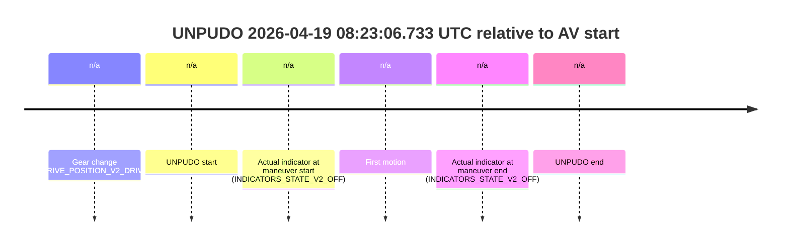
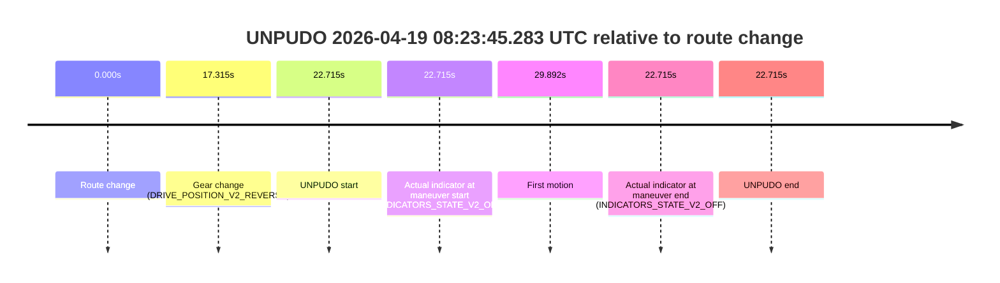
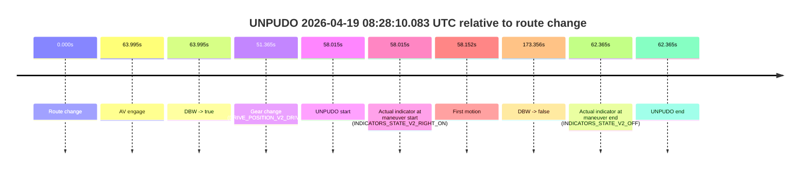
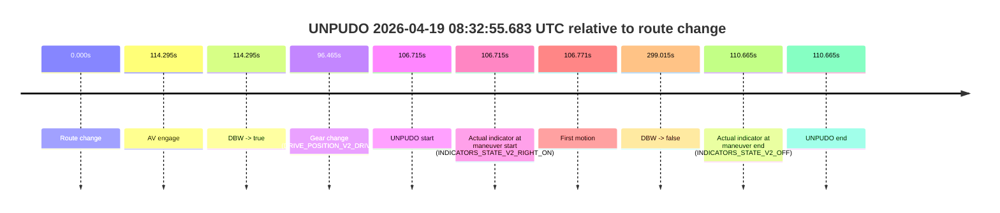
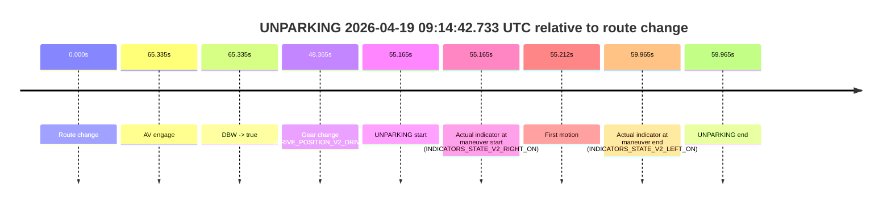

# Run Report: fme20018/2026-04-19--08-14-53--gen2-av-f45e2ac1-1cf7-4767-bdff-dc6df9969f83

| Field | Value |
|---|---|
| Run ID | `fme20018/2026-04-19--08-14-53--gen2-av-f45e2ac1-1cf7-4767-bdff-dc6df9969f83` |
| Date | `2026-04-19` |
| Model(s) | `satisfied-amber-moose` |
| Author | `guy.geva` |
| Event count | `8` |

## unpudo 2026-04-19 08:23:06.733 UTC

| Field | Value |
|---|---|
| Model | `satisfied-amber-moose` |
| Author | `guy.geva` |
| Run ID | `fme20018/2026-04-19--08-14-53--gen2-av-f45e2ac1-1cf7-4767-bdff-dc6df9969f83` |
| Date | `2026-04-19` |
| Time (UTC) | `08:23:06.733` |
| Event type | `unpudo` |
| Disengagement type | `none observed` |
| Route change | `unclear` |
| Console | [run](https://console.sso.wayve.ai/run/fme20018/2026-04-19--08-14-53--gen2-av-f45e2ac1-1cf7-4767-bdff-dc6df9969f83?id=&time-unixus=1776586986733317) |
| Foxglove | [segment](https://app.foxglove.dev/wayve-on-prem/p/prj_0dX18KZdVHg1fmmI/view?ds=foxglove-stream&ds.deviceName=fme20018&ds.start=2026-04-19T08%3A22%3A54.983317Z&ds.end=2026-04-19T08%3A23%3A16.733317Z&layoutId=lay_0e7VD4WIKDQGU73Y&time=2026-04-19T08%3A23%3A06.733317Z) |

### Event card: fail

- Fail: the credited unpudo does not stay AV-owned. The event window starts with DBW false, and the maneuver outcome lands outside a clean AV-owned segment.

| Event | Time (UTC) | Delta from AV start |
|---|---:|---:|
| Gear change (DRIVE_POSITION_V2_DRIVE) | 2026-04-19 08:23:04.983 | `n/a` |
| UNPUDO start | 2026-04-19 08:23:06.733 | `n/a` |
| Actual indicator at maneuver start (INDICATORS_STATE_V2_OFF) | 2026-04-19 08:23:06.733 | `n/a` |
| First motion | 2026-04-19 08:23:06.759 | `n/a` |
| Actual indicator at maneuver end (INDICATORS_STATE_V2_OFF) | 2026-04-19 08:23:06.733 | `n/a` |
| UNPUDO end | 2026-04-19 08:23:06.733 | `n/a` |

| Metric | Value |
|---|---|
| Outcome | `fail` |
| Effective failure type | `not_av_owned` |
| Route change status | `unclear` |
| DBW at event start | `false` |
| DBW at event end | `false` |
| Predicted gear at AV start | `n/a` |
| Actual gear at AV start | `n/a` |
| Predicted gear at event start | `DRIVE_POSITION_V2_DRIVE` |
| Actual gear at event start | `DRIVE_POSITION_V2_DRIVE` |
| Planned indicator direction | `INDICATORS_STATE_V2_OFF` |
| Controller indicator direction | `INDICATORS_STATE_V2_OFF` |
| Actual indicator direction | `INDICATORS_STATE_V2_OFF` |
| Actual indicator at maneuver end | `INDICATORS_STATE_V2_OFF` |
| Driver accel help in AV | `false` |
| Driver accel help timestamp | `n/a` |
| Max accel pedal pct in AV | `0.0%` |
| Max brake pedal pct in AV | `0.0%` |
| Max speed mps in AV | `0.000` |
| Route -> AV | `n/a` |
| AV -> event start | `n/a` |
| AV -> first motion | `n/a` |
| AV duration before disengagement | `n/a` |
| Trajectory waypoint count | `36` |
| Driving-plan step count | `11` |

The scored portion starts from the AV-owned window, not from the pre-AV setup. Route-change search in the stopped pre-event segment was `unclear`, with the baseline therefore set to AV start. At the event anchor the model predicts `DRIVE_POSITION_V2_DRIVE` and the actual gear is `DRIVE_POSITION_V2_DRIVE`. The effective model outcome is `fail` because `not_av_owned`.

### Resolution

| Field | Value |
|---|---|
| Final outcome | `fail` |
| Do we agree with this label? | `yes` |
| Source disengagement type | `none observed` |
| Resolved effective failure type | `not_av_owned` |
| Confidence | `medium` |

## unpudo 2026-04-19 08:23:45.283 UTC

| Field | Value |
|---|---|
| Model | `satisfied-amber-moose` |
| Author | `guy.geva` |
| Run ID | `fme20018/2026-04-19--08-14-53--gen2-av-f45e2ac1-1cf7-4767-bdff-dc6df9969f83` |
| Date | `2026-04-19` |
| Time (UTC) | `08:23:45.283` |
| Event type | `unpudo` |
| Disengagement type | `none observed` |
| Route change | `found` |
| Console | [run](https://console.sso.wayve.ai/run/fme20018/2026-04-19--08-14-53--gen2-av-f45e2ac1-1cf7-4767-bdff-dc6df9969f83?id=&time-unixus=1776587025283302) |
| Foxglove | [segment](https://app.foxglove.dev/wayve-on-prem/p/prj_0dX18KZdVHg1fmmI/view?ds=foxglove-stream&ds.deviceName=fme20018&ds.start=2026-04-19T08%3A23%3A12.568265Z&ds.end=2026-04-19T08%3A23%3A55.283302Z&layoutId=lay_0e7VD4WIKDQGU73Y&time=2026-04-19T08%3A23%3A45.283302Z) |

### Event card: fail

- Fail: the credited unpudo does not stay AV-owned. The event window starts with DBW false, and the maneuver outcome lands outside a clean AV-owned segment.

| Event | Time (UTC) | Delta from route change |
|---|---:|---:|
| Route change | 2026-04-19 08:23:22.568 | `0.000s` |
| Gear change (DRIVE_POSITION_V2_REVERSE) | 2026-04-19 08:23:39.883 | `17.315s` |
| UNPUDO start | 2026-04-19 08:23:45.283 | `22.715s` |
| Actual indicator at maneuver start (INDICATORS_STATE_V2_OFF) | 2026-04-19 08:23:45.283 | `22.715s` |
| First motion | 2026-04-19 08:23:52.460 | `29.892s` |
| Actual indicator at maneuver end (INDICATORS_STATE_V2_OFF) | 2026-04-19 08:23:45.283 | `22.715s` |
| UNPUDO end | 2026-04-19 08:23:45.283 | `22.715s` |

| Metric | Value |
|---|---|
| Outcome | `fail` |
| Effective failure type | `not_av_owned` |
| Route change status | `found` |
| DBW at event start | `false` |
| DBW at event end | `false` |
| Predicted gear at AV start | `n/a` |
| Actual gear at AV start | `n/a` |
| Predicted gear at event start | `DRIVE_POSITION_V2_REVERSE` |
| Actual gear at event start | `DRIVE_POSITION_V2_REVERSE` |
| Planned indicator direction | `INDICATORS_STATE_V2_OFF` |
| Controller indicator direction | `INDICATORS_STATE_V2_OFF` |
| Actual indicator direction | `INDICATORS_STATE_V2_OFF` |
| Actual indicator at maneuver end | `INDICATORS_STATE_V2_OFF` |
| Driver accel help in AV | `false` |
| Driver accel help timestamp | `n/a` |
| Max accel pedal pct in AV | `0.0%` |
| Max brake pedal pct in AV | `0.0%` |
| Max speed mps in AV | `0.000` |
| Route -> AV | `n/a` |
| AV -> event start | `n/a` |
| AV -> first motion | `n/a` |
| AV duration before disengagement | `n/a` |
| Trajectory waypoint count | `37` |
| Driving-plan step count | `11` |

The scored portion starts from the AV-owned window, not from the pre-AV setup. Route-change search in the stopped pre-event segment was `found`, with the baseline therefore set to route change. At the event anchor the model predicts `DRIVE_POSITION_V2_REVERSE` and the actual gear is `DRIVE_POSITION_V2_REVERSE`. The effective model outcome is `fail` because `not_av_owned`.

### Resolution

| Field | Value |
|---|---|
| Final outcome | `fail` |
| Do we agree with this label? | `yes` |
| Source disengagement type | `none observed` |
| Resolved effective failure type | `not_av_owned` |
| Confidence | `high` |

## unpudo 2026-04-19 08:28:10.083 UTC

| Field | Value |
|---|---|
| Model | `satisfied-amber-moose` |
| Author | `guy.geva` |
| Run ID | `fme20018/2026-04-19--08-14-53--gen2-av-f45e2ac1-1cf7-4767-bdff-dc6df9969f83` |
| Date | `2026-04-19` |
| Time (UTC) | `08:28:10.083` |
| Event type | `unpudo` |
| Disengagement type | `none observed` |
| Route change | `found` |
| Console | [run](https://console.sso.wayve.ai/run/fme20018/2026-04-19--08-14-53--gen2-av-f45e2ac1-1cf7-4767-bdff-dc6df9969f83?id=&time-unixus=1776587290083288) |
| Foxglove | [segment](https://app.foxglove.dev/wayve-on-prem/p/prj_0dX18KZdVHg1fmmI/view?ds=foxglove-stream&ds.deviceName=fme20018&ds.start=2026-04-19T08%3A27%3A02.068260Z&ds.end=2026-04-19T08%3A30%3A15.424403Z&layoutId=lay_0e7VD4WIKDQGU73Y&time=2026-04-19T08%3A28%3A10.083288Z) |

### Event card: fail

- Fail: the credited unpudo does not stay AV-owned. The event window starts with DBW false, and the maneuver outcome lands outside a clean AV-owned segment.

| Event | Time (UTC) | Delta from route change |
|---|---:|---:|
| Route change | 2026-04-19 08:27:12.068 | `0.000s` |
| AV engage | 2026-04-19 08:28:16.063 | `63.995s` |
| DBW -> true | 2026-04-19 08:28:16.063 | `63.995s` |
| Gear change (DRIVE_POSITION_V2_DRIVE) | 2026-04-19 08:28:03.433 | `51.365s` |
| UNPUDO start | 2026-04-19 08:28:10.083 | `58.015s` |
| Actual indicator at maneuver start (INDICATORS_STATE_V2_RIGHT_ON) | 2026-04-19 08:28:10.083 | `58.015s` |
| First motion | 2026-04-19 08:28:10.220 | `58.152s` |
| DBW -> false | 2026-04-19 08:30:05.424 | `173.356s` |
| Actual indicator at maneuver end (INDICATORS_STATE_V2_OFF) | 2026-04-19 08:28:14.433 | `62.365s` |
| UNPUDO end | 2026-04-19 08:28:14.433 | `62.365s` |

| Metric | Value |
|---|---|
| Outcome | `fail` |
| Effective failure type | `completed_outside_av` |
| Route change status | `found` |
| DBW at event start | `false` |
| DBW at event end | `false` |
| Predicted gear at AV start | `DRIVE_POSITION_V2_DRIVE` |
| Actual gear at AV start | `DRIVE_POSITION_V2_DRIVE` |
| Predicted gear at event start | `DRIVE_POSITION_V2_DRIVE` |
| Actual gear at event start | `DRIVE_POSITION_V2_DRIVE` |
| Planned indicator direction | `INDICATORS_STATE_V2_RIGHT_ON` |
| Controller indicator direction | `INDICATORS_STATE_V2_RIGHT_ON` |
| Actual indicator direction | `INDICATORS_STATE_V2_RIGHT_ON` |
| Actual indicator at maneuver end | `INDICATORS_STATE_V2_OFF` |
| Driver accel help in AV | `false` |
| Driver accel help timestamp | `n/a` |
| Max accel pedal pct in AV | `0.0%` |
| Max brake pedal pct in AV | `0.0%` |
| Max speed mps in AV | `0.000` |
| Route -> AV | `63.995s` |
| AV -> event start | `-5.980s` |
| AV -> first motion | `-5.843s` |
| AV duration before disengagement | `109.361s` |
| Trajectory waypoint count | `37` |
| Driving-plan step count | `11` |

The scored portion starts from the AV-owned window, not from the pre-AV setup. Route-change search in the stopped pre-event segment was `found`, with the baseline therefore set to route change. At the event anchor the model predicts `DRIVE_POSITION_V2_DRIVE` and the actual gear is `DRIVE_POSITION_V2_DRIVE`. The effective model outcome is `fail` because `completed_outside_av`.

### Resolution

| Field | Value |
|---|---|
| Final outcome | `fail` |
| Do we agree with this label? | `yes` |
| Source disengagement type | `none observed` |
| Resolved effective failure type | `completed_outside_av` |
| Confidence | `high` |

## unpudo 2026-04-19 08:32:55.683 UTC

| Field | Value |
|---|---|
| Model | `satisfied-amber-moose` |
| Author | `guy.geva` |
| Run ID | `fme20018/2026-04-19--08-14-53--gen2-av-f45e2ac1-1cf7-4767-bdff-dc6df9969f83` |
| Date | `2026-04-19` |
| Time (UTC) | `08:32:55.683` |
| Event type | `unpudo` |
| Disengagement type | `none observed` |
| Route change | `found` |
| Console | [run](https://console.sso.wayve.ai/run/fme20018/2026-04-19--08-14-53--gen2-av-f45e2ac1-1cf7-4767-bdff-dc6df9969f83?id=&time-unixus=1776587575683302) |
| Foxglove | [segment](https://app.foxglove.dev/wayve-on-prem/p/prj_0dX18KZdVHg1fmmI/view?ds=foxglove-stream&ds.deviceName=fme20018&ds.start=2026-04-19T08%3A30%3A58.968263Z&ds.end=2026-04-19T08%3A36%3A17.983307Z&layoutId=lay_0e7VD4WIKDQGU73Y&time=2026-04-19T08%3A32%3A55.683302Z) |

### Event card: fail

- Fail: the credited unpudo does not stay AV-owned. The event window starts with DBW false, and the maneuver outcome lands outside a clean AV-owned segment.

| Event | Time (UTC) | Delta from route change |
|---|---:|---:|
| Route change | 2026-04-19 08:31:08.968 | `0.000s` |
| AV engage | 2026-04-19 08:33:03.263 | `114.295s` |
| DBW -> true | 2026-04-19 08:33:03.263 | `114.295s` |
| Gear change (DRIVE_POSITION_V2_DRIVE) | 2026-04-19 08:32:45.433 | `96.465s` |
| UNPUDO start | 2026-04-19 08:32:55.683 | `106.715s` |
| Actual indicator at maneuver start (INDICATORS_STATE_V2_RIGHT_ON) | 2026-04-19 08:32:55.683 | `106.715s` |
| First motion | 2026-04-19 08:32:55.739 | `106.771s` |
| DBW -> false | 2026-04-19 08:36:07.983 | `299.015s` |
| Actual indicator at maneuver end (INDICATORS_STATE_V2_OFF) | 2026-04-19 08:32:59.633 | `110.665s` |
| UNPUDO end | 2026-04-19 08:32:59.633 | `110.665s` |

| Metric | Value |
|---|---|
| Outcome | `fail` |
| Effective failure type | `completed_outside_av` |
| Route change status | `found` |
| DBW at event start | `false` |
| DBW at event end | `false` |
| Predicted gear at AV start | `DRIVE_POSITION_V2_DRIVE` |
| Actual gear at AV start | `DRIVE_POSITION_V2_DRIVE` |
| Predicted gear at event start | `DRIVE_POSITION_V2_DRIVE` |
| Actual gear at event start | `DRIVE_POSITION_V2_DRIVE` |
| Planned indicator direction | `INDICATORS_STATE_V2_RIGHT_ON` |
| Controller indicator direction | `INDICATORS_STATE_V2_RIGHT_ON` |
| Actual indicator direction | `INDICATORS_STATE_V2_RIGHT_ON` |
| Actual indicator at maneuver end | `INDICATORS_STATE_V2_OFF` |
| Driver accel help in AV | `false` |
| Driver accel help timestamp | `n/a` |
| Max accel pedal pct in AV | `0.0%` |
| Max brake pedal pct in AV | `0.0%` |
| Max speed mps in AV | `0.000` |
| Route -> AV | `114.295s` |
| AV -> event start | `-7.580s` |
| AV -> first motion | `-7.524s` |
| AV duration before disengagement | `184.720s` |
| Trajectory waypoint count | `37` |
| Driving-plan step count | `11` |

The scored portion starts from the AV-owned window, not from the pre-AV setup. Route-change search in the stopped pre-event segment was `found`, with the baseline therefore set to route change. At the event anchor the model predicts `DRIVE_POSITION_V2_DRIVE` and the actual gear is `DRIVE_POSITION_V2_DRIVE`. The effective model outcome is `fail` because `completed_outside_av`.

### Resolution

| Field | Value |
|---|---|
| Final outcome | `fail` |
| Do we agree with this label? | `yes` |
| Source disengagement type | `none observed` |
| Resolved effective failure type | `completed_outside_av` |
| Confidence | `high` |

## unpudo 2026-04-19 08:42:17.733 UTC

| Field | Value |
|---|---|
| Model | `satisfied-amber-moose` |
| Author | `guy.geva` |
| Run ID | `fme20018/2026-04-19--08-14-53--gen2-av-f45e2ac1-1cf7-4767-bdff-dc6df9969f83` |
| Date | `2026-04-19` |
| Time (UTC) | `08:42:17.733` |
| Event type | `unpudo` |
| Disengagement type | `none observed` |
| Route change | `found` |
| Console | [run](https://console.sso.wayve.ai/run/fme20018/2026-04-19--08-14-53--gen2-av-f45e2ac1-1cf7-4767-bdff-dc6df9969f83?id=&time-unixus=1776588137733312) |
| Foxglove | [segment](https://app.foxglove.dev/wayve-on-prem/p/prj_0dX18KZdVHg1fmmI/view?ds=foxglove-stream&ds.deviceName=fme20018&ds.start=2026-04-19T08%3A41%3A19.468291Z&ds.end=2026-04-19T08%3A43%3A20.223230Z&layoutId=lay_0e7VD4WIKDQGU73Y&time=2026-04-19T08%3A42%3A17.733312Z) |

### Event card: fail

- Fail: the credited unpudo does not stay AV-owned. The event window starts with DBW false, and the maneuver outcome lands outside a clean AV-owned segment.

| Event | Time (UTC) | Delta from route change |
|---|---:|---:|
| Route change | 2026-04-19 08:41:29.468 | `0.000s` |
| AV engage | 2026-04-19 08:42:32.863 | `63.395s` |
| DBW -> true | 2026-04-19 08:42:32.863 | `63.395s` |
| Gear change (DRIVE_POSITION_V2_DRIVE) | 2026-04-19 08:41:56.533 | `27.065s` |
| UNPUDO start | 2026-04-19 08:42:17.733 | `48.265s` |
| Actual indicator at maneuver start (INDICATORS_STATE_V2_LEFT_ON) | 2026-04-19 08:42:17.733 | `48.265s` |
| First motion | 2026-04-19 08:42:17.899 | `48.432s` |
| DBW -> false | 2026-04-19 08:43:10.223 | `100.755s` |
| Actual indicator at maneuver end (INDICATORS_STATE_V2_OFF) | 2026-04-19 08:42:22.683 | `53.215s` |
| UNPUDO end | 2026-04-19 08:42:22.683 | `53.215s` |

| Metric | Value |
|---|---|
| Outcome | `fail` |
| Effective failure type | `completed_outside_av` |
| Route change status | `found` |
| DBW at event start | `false` |
| DBW at event end | `false` |
| Predicted gear at AV start | `DRIVE_POSITION_V2_DRIVE` |
| Actual gear at AV start | `DRIVE_POSITION_V2_DRIVE` |
| Predicted gear at event start | `DRIVE_POSITION_V2_DRIVE` |
| Actual gear at event start | `DRIVE_POSITION_V2_DRIVE` |
| Planned indicator direction | `INDICATORS_STATE_V2_LEFT_ON` |
| Controller indicator direction | `INDICATORS_STATE_V2_LEFT_ON` |
| Actual indicator direction | `INDICATORS_STATE_V2_LEFT_ON` |
| Actual indicator at maneuver end | `INDICATORS_STATE_V2_OFF` |
| Driver accel help in AV | `false` |
| Driver accel help timestamp | `n/a` |
| Max accel pedal pct in AV | `0.0%` |
| Max brake pedal pct in AV | `0.0%` |
| Max speed mps in AV | `0.000` |
| Route -> AV | `63.395s` |
| AV -> event start | `-15.130s` |
| AV -> first motion | `-14.963s` |
| AV duration before disengagement | `37.360s` |
| Trajectory waypoint count | `36` |
| Driving-plan step count | `11` |

The scored portion starts from the AV-owned window, not from the pre-AV setup. Route-change search in the stopped pre-event segment was `found`, with the baseline therefore set to route change. At the event anchor the model predicts `DRIVE_POSITION_V2_DRIVE` and the actual gear is `DRIVE_POSITION_V2_DRIVE`. The effective model outcome is `fail` because `completed_outside_av`.

### Resolution

| Field | Value |
|---|---|
| Final outcome | `fail` |
| Do we agree with this label? | `yes` |
| Source disengagement type | `none observed` |
| Resolved effective failure type | `completed_outside_av` |
| Confidence | `high` |

## unpudo 2026-04-19 08:51:22.983 UTC

| Field | Value |
|---|---|
| Model | `satisfied-amber-moose` |
| Author | `guy.geva` |
| Run ID | `fme20018/2026-04-19--08-14-53--gen2-av-f45e2ac1-1cf7-4767-bdff-dc6df9969f83` |
| Date | `2026-04-19` |
| Time (UTC) | `08:51:22.983` |
| Event type | `unpudo` |
| Disengagement type | `none observed` |
| Route change | `found` |
| Console | [run](https://console.sso.wayve.ai/run/fme20018/2026-04-19--08-14-53--gen2-av-f45e2ac1-1cf7-4767-bdff-dc6df9969f83?id=&time-unixus=1776588682983315) |
| Foxglove | [segment](https://app.foxglove.dev/wayve-on-prem/p/prj_0dX18KZdVHg1fmmI/view?ds=foxglove-stream&ds.deviceName=fme20018&ds.start=2026-04-19T08%3A50%3A38.718285Z&ds.end=2026-04-19T08%3A54%3A01.343219Z&layoutId=lay_0e7VD4WIKDQGU73Y&time=2026-04-19T08%3A51%3A22.983315Z) |

### Event card: fail

- Fail: the credited unpudo does not stay AV-owned. The event window starts with DBW false, and the maneuver outcome lands outside a clean AV-owned segment.

| Event | Time (UTC) | Delta from route change |
|---|---:|---:|
| Route change | 2026-04-19 08:50:48.718 | `0.000s` |
| AV engage | 2026-04-19 08:51:26.784 | `38.066s` |
| DBW -> true | 2026-04-19 08:51:26.784 | `38.066s` |
| Gear change (DRIVE_POSITION_V2_DRIVE) | 2026-04-19 08:51:20.033 | `31.315s` |
| UNPUDO start | 2026-04-19 08:51:22.983 | `34.265s` |
| Actual indicator at maneuver start (INDICATORS_STATE_V2_RIGHT_ON) | 2026-04-19 08:51:22.983 | `34.265s` |
| First motion | 2026-04-19 08:51:23.099 | `34.381s` |
| DBW -> false | 2026-04-19 08:53:51.343 | `182.625s` |
| Actual indicator at maneuver end (INDICATORS_STATE_V2_OFF) | 2026-04-19 08:51:27.033 | `38.315s` |
| UNPUDO end | 2026-04-19 08:51:27.033 | `38.315s` |

| Metric | Value |
|---|---|
| Outcome | `fail` |
| Effective failure type | `completed_outside_av` |
| Route change status | `found` |
| DBW at event start | `false` |
| DBW at event end | `true` |
| Predicted gear at AV start | `DRIVE_POSITION_V2_DRIVE` |
| Actual gear at AV start | `DRIVE_POSITION_V2_DRIVE` |
| Predicted gear at event start | `DRIVE_POSITION_V2_DRIVE` |
| Actual gear at event start | `DRIVE_POSITION_V2_DRIVE` |
| Planned indicator direction | `INDICATORS_STATE_V2_OFF` |
| Controller indicator direction | `INDICATORS_STATE_V2_OFF` |
| Actual indicator direction | `INDICATORS_STATE_V2_RIGHT_ON` |
| Actual indicator at maneuver end | `INDICATORS_STATE_V2_OFF` |
| Driver accel help in AV | `false` |
| Driver accel help timestamp | `n/a` |
| Max accel pedal pct in AV | `0.0%` |
| Max brake pedal pct in AV | `0.0%` |
| Max speed mps in AV | `4.208` |
| Route -> AV | `38.066s` |
| AV -> event start | `-3.801s` |
| AV -> first motion | `-3.685s` |
| AV duration before disengagement | `144.559s` |
| Trajectory waypoint count | `37` |
| Driving-plan step count | `11` |

The scored portion starts from the AV-owned window, not from the pre-AV setup. Route-change search in the stopped pre-event segment was `found`, with the baseline therefore set to route change. At the event anchor the model predicts `DRIVE_POSITION_V2_DRIVE` and the actual gear is `DRIVE_POSITION_V2_DRIVE`. The effective model outcome is `fail` because `completed_outside_av`.

### Resolution

| Field | Value |
|---|---|
| Final outcome | `fail` |
| Do we agree with this label? | `yes` |
| Source disengagement type | `none observed` |
| Resolved effective failure type | `completed_outside_av` |
| Confidence | `high` |

## unpudo 2026-04-19 08:57:43.283 UTC

| Field | Value |
|---|---|
| Model | `satisfied-amber-moose` |
| Author | `guy.geva` |
| Run ID | `fme20018/2026-04-19--08-14-53--gen2-av-f45e2ac1-1cf7-4767-bdff-dc6df9969f83` |
| Date | `2026-04-19` |
| Time (UTC) | `08:57:43.283` |
| Event type | `unpudo` |
| Disengagement type | `none observed` |
| Route change | `found` |
| Console | [run](https://console.sso.wayve.ai/run/fme20018/2026-04-19--08-14-53--gen2-av-f45e2ac1-1cf7-4767-bdff-dc6df9969f83?id=&time-unixus=1776589063283318) |
| Foxglove | [segment](https://app.foxglove.dev/wayve-on-prem/p/prj_0dX18KZdVHg1fmmI/view?ds=foxglove-stream&ds.deviceName=fme20018&ds.start=2026-04-19T08%3A56%3A35.168302Z&ds.end=2026-04-19T09%3A00%3A02.924341Z&layoutId=lay_0e7VD4WIKDQGU73Y&time=2026-04-19T08%3A57%3A43.283318Z) |

### Event card: pass

- Pass: AV owns the credited unpudo through the official event window, the gear state is aligned at the anchor, and the vehicle moves without driver accelerator help in AV.

| Event | Time (UTC) | Delta from route change |
|---|---:|---:|
| Route change | 2026-04-19 08:56:45.168 | `0.000s` |
| AV engage | 2026-04-19 08:57:36.583 | `51.415s` |
| DBW -> true | 2026-04-19 08:57:36.583 | `51.415s` |
| Gear change (DRIVE_POSITION_V2_DRIVE) | 2026-04-19 08:57:37.033 | `51.865s` |
| UNPUDO start | 2026-04-19 08:57:43.283 | `58.115s` |
| Actual indicator at maneuver start (INDICATORS_STATE_V2_LEFT_ON) | 2026-04-19 08:57:43.283 | `58.115s` |
| First motion | 2026-04-19 08:57:43.419 | `58.251s` |
| DBW -> false | 2026-04-19 08:59:52.924 | `187.756s` |
| Actual indicator at maneuver end (INDICATORS_STATE_V2_OFF) | 2026-04-19 08:57:48.733 | `63.565s` |
| UNPUDO end | 2026-04-19 08:57:48.733 | `63.565s` |

| Metric | Value |
|---|---|
| Outcome | `pass` |
| Effective failure type | `none` |
| Route change status | `found` |
| DBW at event start | `true` |
| DBW at event end | `true` |
| Predicted gear at AV start | `DRIVE_POSITION_V2_DRIVE` |
| Actual gear at AV start | `DRIVE_POSITION_V2_PARK` |
| Predicted gear at event start | `DRIVE_POSITION_V2_DRIVE` |
| Actual gear at event start | `DRIVE_POSITION_V2_DRIVE` |
| Planned indicator direction | `INDICATORS_STATE_V2_OFF` |
| Controller indicator direction | `INDICATORS_STATE_V2_OFF` |
| Actual indicator direction | `INDICATORS_STATE_V2_LEFT_ON` |
| Actual indicator at maneuver end | `INDICATORS_STATE_V2_OFF` |
| Driver accel help in AV | `false` |
| Driver accel help timestamp | `n/a` |
| Max accel pedal pct in AV | `0.0%` |
| Max brake pedal pct in AV | `8.7%` |
| Max speed mps in AV | `3.667` |
| Route -> AV | `51.415s` |
| AV -> event start | `6.700s` |
| AV -> first motion | `6.836s` |
| AV duration before disengagement | `136.341s` |
| Trajectory waypoint count | `35` |
| Driving-plan step count | `11` |

The scored portion starts from the AV-owned window, not from the pre-AV setup. Route-change search in the stopped pre-event segment was `found`, with the baseline therefore set to route change. At the event anchor the model predicts `DRIVE_POSITION_V2_DRIVE` and the actual gear is `DRIVE_POSITION_V2_DRIVE`. The effective model outcome is `pass` because `the credited maneuver stays AV-owned through the official event end`.

### Resolution

| Field | Value |
|---|---|
| Final outcome | `pass` |
| Do we agree with this label? | `yes` |
| Source disengagement type | `none observed` |
| Resolved effective failure type | `none` |
| Confidence | `high` |

## unparking 2026-04-19 09:14:42.733 UTC

| Field | Value |
|---|---|
| Model | `satisfied-amber-moose` |
| Author | `guy.geva` |
| Run ID | `fme20018/2026-04-19--08-14-53--gen2-av-f45e2ac1-1cf7-4767-bdff-dc6df9969f83` |
| Date | `2026-04-19` |
| Time (UTC) | `09:14:42.733` |
| Event type | `unparking` |
| Disengagement type | `none observed` |
| Route change | `found` |
| Console | [run](https://console.sso.wayve.ai/run/fme20018/2026-04-19--08-14-53--gen2-av-f45e2ac1-1cf7-4767-bdff-dc6df9969f83?id=&time-unixus=1776590082733302) |
| Foxglove | [segment](https://app.foxglove.dev/wayve-on-prem/p/prj_0dX18KZdVHg1fmmI/view?ds=foxglove-stream&ds.deviceName=fme20018&ds.start=2026-04-19T09%3A13%3A37.568259Z&ds.end=2026-04-19T09%3A14%3A57.533294Z&layoutId=lay_0e7VD4WIKDQGU73Y&time=2026-04-19T09%3A14%3A42.733302Z) |

### Event card: fail

- Fail: the credited unparking does not stay AV-owned. The event window starts with DBW false, and the maneuver outcome lands outside a clean AV-owned segment.

| Event | Time (UTC) | Delta from route change |
|---|---:|---:|
| Route change | 2026-04-19 09:13:47.568 | `0.000s` |
| AV engage | 2026-04-19 09:14:52.903 | `65.335s` |
| DBW -> true | 2026-04-19 09:14:52.903 | `65.335s` |
| Gear change (DRIVE_POSITION_V2_DRIVE) | 2026-04-19 09:14:35.933 | `48.365s` |
| UNPARKING start | 2026-04-19 09:14:42.733 | `55.165s` |
| Actual indicator at maneuver start (INDICATORS_STATE_V2_RIGHT_ON) | 2026-04-19 09:14:42.733 | `55.165s` |
| First motion | 2026-04-19 09:14:42.779 | `55.212s` |
| Actual indicator at maneuver end (INDICATORS_STATE_V2_LEFT_ON) | 2026-04-19 09:14:47.533 | `59.965s` |
| UNPARKING end | 2026-04-19 09:14:47.533 | `59.965s` |

| Metric | Value |
|---|---|
| Outcome | `fail` |
| Effective failure type | `completed_outside_av` |
| Route change status | `found` |
| DBW at event start | `false` |
| DBW at event end | `false` |
| Predicted gear at AV start | `DRIVE_POSITION_V2_DRIVE` |
| Actual gear at AV start | `DRIVE_POSITION_V2_DRIVE` |
| Predicted gear at event start | `DRIVE_POSITION_V2_DRIVE` |
| Actual gear at event start | `DRIVE_POSITION_V2_DRIVE` |
| Planned indicator direction | `INDICATORS_STATE_V2_RIGHT_ON` |
| Controller indicator direction | `INDICATORS_STATE_V2_RIGHT_ON` |
| Actual indicator direction | `INDICATORS_STATE_V2_RIGHT_ON` |
| Actual indicator at maneuver end | `INDICATORS_STATE_V2_LEFT_ON` |
| Driver accel help in AV | `false` |
| Driver accel help timestamp | `n/a` |
| Max accel pedal pct in AV | `0.0%` |
| Max brake pedal pct in AV | `0.0%` |
| Max speed mps in AV | `0.000` |
| Route -> AV | `65.335s` |
| AV -> event start | `-10.170s` |
| AV -> first motion | `-10.123s` |
| AV duration before disengagement | `n/a` |
| Trajectory waypoint count | `36` |
| Driving-plan step count | `11` |

The scored portion starts from the AV-owned window, not from the pre-AV setup. Route-change search in the stopped pre-event segment was `found`, with the baseline therefore set to route change. At the event anchor the model predicts `DRIVE_POSITION_V2_DRIVE` and the actual gear is `DRIVE_POSITION_V2_DRIVE`. The effective model outcome is `fail` because `completed_outside_av`.

### Resolution

| Field | Value |
|---|---|
| Final outcome | `fail` |
| Do we agree with this label? | `yes` |
| Source disengagement type | `none observed` |
| Resolved effective failure type | `completed_outside_av` |
| Confidence | `high` |
