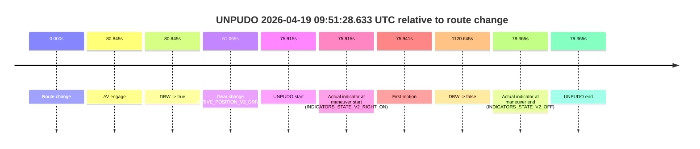
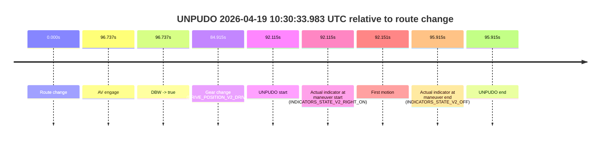

# Run Report: fme20018/2026-04-19--09-42-22--gen2-av-dee0160c-f3e6-4f83-9cc8-293f0b4ee526

| Field | Value |
|---|---|
| Run ID | `fme20018/2026-04-19--09-42-22--gen2-av-dee0160c-f3e6-4f83-9cc8-293f0b4ee526` |
| Date | `2026-04-19` |
| Model(s) | `satisfied-amber-moose` |
| Author | `guy.geva` |
| Event count | `3` |

## unpudo 2026-04-19 09:50:54.333 UTC

| Field | Value |
|---|---|
| Model | `satisfied-amber-moose` |
| Author | `guy.geva` |
| Run ID | `fme20018/2026-04-19--09-42-22--gen2-av-dee0160c-f3e6-4f83-9cc8-293f0b4ee526` |
| Date | `2026-04-19` |
| Time (UTC) | `09:50:54.333` |
| Event type | `unpudo` |
| Disengagement type | `none observed` |
| Route change | `found` |
| Console | [run](https://console.sso.wayve.ai/run/fme20018/2026-04-19--09-42-22--gen2-av-dee0160c-f3e6-4f83-9cc8-293f0b4ee526?id=&time-unixus=1776592254333300) |
| Foxglove | [segment](https://app.foxglove.dev/wayve-on-prem/p/prj_0dX18KZdVHg1fmmI/view?ds=foxglove-stream&ds.deviceName=fme20018&ds.start=2026-04-19T09%3A50%3A02.718610Z&ds.end=2026-04-19T09%3A51%3A31.484152Z&layoutId=lay_0e7VD4WIKDQGU73Y&time=2026-04-19T09%3A50%3A54.333300Z) |

### Event card: fail

- Fail: the credited unpudo does not stay AV-owned. The event window starts with DBW false, and the maneuver outcome lands outside a clean AV-owned segment.

| Event | Time (UTC) | Delta from route change |
|---|---:|---:|
| Route change | 2026-04-19 09:50:12.718 | `0.000s` |
| AV engage | 2026-04-19 09:51:13.264 | `60.545s` |
| DBW -> true | 2026-04-19 09:51:13.264 | `60.545s` |
| Gear change (DRIVE_POSITION_V2_DRIVE) | 2026-04-19 09:50:52.333 | `39.615s` |
| UNPUDO start | 2026-04-19 09:50:54.333 | `41.615s` |
| Actual indicator at maneuver start (INDICATORS_STATE_V2_RIGHT_ON) | 2026-04-19 09:50:54.333 | `41.615s` |
| First motion | 2026-04-19 09:50:54.359 | `41.641s` |
| DBW -> false | 2026-04-19 09:51:21.484 | `68.766s` |
| Actual indicator at maneuver end (INDICATORS_STATE_V2_OFF) | 2026-04-19 09:50:57.983 | `45.265s` |
| UNPUDO end | 2026-04-19 09:50:57.983 | `45.265s` |

| Metric | Value |
|---|---|
| Outcome | `fail` |
| Effective failure type | `completed_outside_av` |
| Route change status | `found` |
| DBW at event start | `false` |
| DBW at event end | `false` |
| Predicted gear at AV start | `DRIVE_POSITION_V2_DRIVE` |
| Actual gear at AV start | `DRIVE_POSITION_V2_PARK` |
| Predicted gear at event start | `DRIVE_POSITION_V2_DRIVE` |
| Actual gear at event start | `DRIVE_POSITION_V2_DRIVE` |
| Planned indicator direction | `INDICATORS_STATE_V2_LEFT_ON` |
| Controller indicator direction | `INDICATORS_STATE_V2_LEFT_ON` |
| Actual indicator direction | `INDICATORS_STATE_V2_RIGHT_ON` |
| Actual indicator at maneuver end | `INDICATORS_STATE_V2_OFF` |
| Driver accel help in AV | `false` |
| Driver accel help timestamp | `n/a` |
| Max accel pedal pct in AV | `0.0%` |
| Max brake pedal pct in AV | `0.0%` |
| Max speed mps in AV | `0.000` |
| Route -> AV | `60.545s` |
| AV -> event start | `-18.931s` |
| AV -> first motion | `-18.905s` |
| AV duration before disengagement | `8.220s` |
| Trajectory waypoint count | `38` |
| Driving-plan step count | `11` |

The scored portion starts from the AV-owned window, not from the pre-AV setup. Route-change search in the stopped pre-event segment was `found`, with the baseline therefore set to route change. At the event anchor the model predicts `DRIVE_POSITION_V2_DRIVE` and the actual gear is `DRIVE_POSITION_V2_DRIVE`. The effective model outcome is `fail` because `completed_outside_av`.

### Resolution

| Field | Value |
|---|---|
| Final outcome | `fail` |
| Do we agree with this label? | `yes` |
| Source disengagement type | `none observed` |
| Resolved effective failure type | `completed_outside_av` |
| Confidence | `high` |

## unpudo 2026-04-19 09:51:28.633 UTC

| Field | Value |
|---|---|
| Model | `satisfied-amber-moose` |
| Author | `guy.geva` |
| Run ID | `fme20018/2026-04-19--09-42-22--gen2-av-dee0160c-f3e6-4f83-9cc8-293f0b4ee526` |
| Date | `2026-04-19` |
| Time (UTC) | `09:51:28.633` |
| Event type | `unpudo` |
| Disengagement type | `none observed` |
| Route change | `found` |
| Console | [run](https://console.sso.wayve.ai/run/fme20018/2026-04-19--09-42-22--gen2-av-dee0160c-f3e6-4f83-9cc8-293f0b4ee526?id=&time-unixus=1776592288633301) |
| Foxglove | [segment](https://app.foxglove.dev/wayve-on-prem/p/prj_0dX18KZdVHg1fmmI/view?ds=foxglove-stream&ds.deviceName=fme20018&ds.start=2026-04-19T09%3A50%3A02.718610Z&ds.end=2026-04-19T10%3A09%3A03.364043Z&layoutId=lay_0e7VD4WIKDQGU73Y&time=2026-04-19T09%3A51%3A28.633301Z) |

### Event card: fail

- Fail: the credited unpudo does not stay AV-owned. The event window starts with DBW false, and the maneuver outcome lands outside a clean AV-owned segment.

| Event | Time (UTC) | Delta from route change |
|---|---:|---:|
| Route change | 2026-04-19 09:50:12.718 | `0.000s` |
| AV engage | 2026-04-19 09:51:33.563 | `80.845s` |
| DBW -> true | 2026-04-19 09:51:33.563 | `80.845s` |
| Gear change (DRIVE_POSITION_V2_DRIVE) | 2026-04-19 09:51:13.783 | `61.065s` |
| UNPUDO start | 2026-04-19 09:51:28.633 | `75.915s` |
| Actual indicator at maneuver start (INDICATORS_STATE_V2_RIGHT_ON) | 2026-04-19 09:51:28.633 | `75.915s` |
| First motion | 2026-04-19 09:51:28.659 | `75.941s` |
| DBW -> false | 2026-04-19 10:08:53.364 | `1120.645s` |
| Actual indicator at maneuver end (INDICATORS_STATE_V2_OFF) | 2026-04-19 09:51:32.083 | `79.365s` |
| UNPUDO end | 2026-04-19 09:51:32.083 | `79.365s` |

| Metric | Value |
|---|---|
| Outcome | `fail` |
| Effective failure type | `completed_outside_av` |
| Route change status | `found` |
| DBW at event start | `false` |
| DBW at event end | `false` |
| Predicted gear at AV start | `DRIVE_POSITION_V2_DRIVE` |
| Actual gear at AV start | `DRIVE_POSITION_V2_DRIVE` |
| Predicted gear at event start | `DRIVE_POSITION_V2_DRIVE` |
| Actual gear at event start | `DRIVE_POSITION_V2_DRIVE` |
| Planned indicator direction | `INDICATORS_STATE_V2_RIGHT_ON` |
| Controller indicator direction | `INDICATORS_STATE_V2_RIGHT_ON` |
| Actual indicator direction | `INDICATORS_STATE_V2_RIGHT_ON` |
| Actual indicator at maneuver end | `INDICATORS_STATE_V2_OFF` |
| Driver accel help in AV | `false` |
| Driver accel help timestamp | `n/a` |
| Max accel pedal pct in AV | `0.0%` |
| Max brake pedal pct in AV | `0.0%` |
| Max speed mps in AV | `0.000` |
| Route -> AV | `80.845s` |
| AV -> event start | `-4.931s` |
| AV -> first motion | `-4.904s` |
| AV duration before disengagement | `1039.800s` |
| Trajectory waypoint count | `36` |
| Driving-plan step count | `11` |

The scored portion starts from the AV-owned window, not from the pre-AV setup. Route-change search in the stopped pre-event segment was `found`, with the baseline therefore set to route change. At the event anchor the model predicts `DRIVE_POSITION_V2_DRIVE` and the actual gear is `DRIVE_POSITION_V2_DRIVE`. The effective model outcome is `fail` because `completed_outside_av`.

### Resolution

| Field | Value |
|---|---|
| Final outcome | `fail` |
| Do we agree with this label? | `yes` |
| Source disengagement type | `none observed` |
| Resolved effective failure type | `completed_outside_av` |
| Confidence | `high` |

## unpudo 2026-04-19 10:30:33.983 UTC

| Field | Value |
|---|---|
| Model | `satisfied-amber-moose` |
| Author | `guy.geva` |
| Run ID | `fme20018/2026-04-19--09-42-22--gen2-av-dee0160c-f3e6-4f83-9cc8-293f0b4ee526` |
| Date | `2026-04-19` |
| Time (UTC) | `10:30:33.983` |
| Event type | `unpudo` |
| Disengagement type | `none observed` |
| Route change | `found` |
| Console | [run](https://console.sso.wayve.ai/run/fme20018/2026-04-19--09-42-22--gen2-av-dee0160c-f3e6-4f83-9cc8-293f0b4ee526?id=&time-unixus=1776594633983326) |
| Foxglove | [segment](https://app.foxglove.dev/wayve-on-prem/p/prj_0dX18KZdVHg1fmmI/view?ds=foxglove-stream&ds.deviceName=fme20018&ds.start=2026-04-19T10%3A28%3A51.868248Z&ds.end=2026-04-19T10%3A30%3A47.783296Z&layoutId=lay_0e7VD4WIKDQGU73Y&time=2026-04-19T10%3A30%3A33.983326Z) |

### Event card: fail

- Fail: the credited unpudo does not stay AV-owned. The event window starts with DBW false, and the maneuver outcome lands outside a clean AV-owned segment.

| Event | Time (UTC) | Delta from route change |
|---|---:|---:|
| Route change | 2026-04-19 10:29:01.868 | `0.000s` |
| AV engage | 2026-04-19 10:30:38.605 | `96.737s` |
| DBW -> true | 2026-04-19 10:30:38.605 | `96.737s` |
| Gear change (DRIVE_POSITION_V2_DRIVE) | 2026-04-19 10:30:26.783 | `84.915s` |
| UNPUDO start | 2026-04-19 10:30:33.983 | `92.115s` |
| Actual indicator at maneuver start (INDICATORS_STATE_V2_RIGHT_ON) | 2026-04-19 10:30:33.983 | `92.115s` |
| First motion | 2026-04-19 10:30:34.019 | `92.151s` |
| Actual indicator at maneuver end (INDICATORS_STATE_V2_OFF) | 2026-04-19 10:30:37.783 | `95.915s` |
| UNPUDO end | 2026-04-19 10:30:37.783 | `95.915s` |

| Metric | Value |
|---|---|
| Outcome | `fail` |
| Effective failure type | `completed_outside_av` |
| Route change status | `found` |
| DBW at event start | `false` |
| DBW at event end | `false` |
| Predicted gear at AV start | `DRIVE_POSITION_V2_DRIVE` |
| Actual gear at AV start | `DRIVE_POSITION_V2_DRIVE` |
| Predicted gear at event start | `DRIVE_POSITION_V2_DRIVE` |
| Actual gear at event start | `DRIVE_POSITION_V2_DRIVE` |
| Planned indicator direction | `INDICATORS_STATE_V2_LEFT_ON` |
| Controller indicator direction | `INDICATORS_STATE_V2_LEFT_ON` |
| Actual indicator direction | `INDICATORS_STATE_V2_RIGHT_ON` |
| Actual indicator at maneuver end | `INDICATORS_STATE_V2_OFF` |
| Driver accel help in AV | `false` |
| Driver accel help timestamp | `n/a` |
| Max accel pedal pct in AV | `0.0%` |
| Max brake pedal pct in AV | `0.0%` |
| Max speed mps in AV | `0.000` |
| Route -> AV | `96.737s` |
| AV -> event start | `-4.622s` |
| AV -> first motion | `-4.586s` |
| AV duration before disengagement | `n/a` |
| Trajectory waypoint count | `37` |
| Driving-plan step count | `11` |

The scored portion starts from the AV-owned window, not from the pre-AV setup. Route-change search in the stopped pre-event segment was `found`, with the baseline therefore set to route change. At the event anchor the model predicts `DRIVE_POSITION_V2_DRIVE` and the actual gear is `DRIVE_POSITION_V2_DRIVE`. The effective model outcome is `fail` because `completed_outside_av`.

### Resolution

| Field | Value |
|---|---|
| Final outcome | `fail` |
| Do we agree with this label? | `yes` |
| Source disengagement type | `none observed` |
| Resolved effective failure type | `completed_outside_av` |
| Confidence | `high` |
