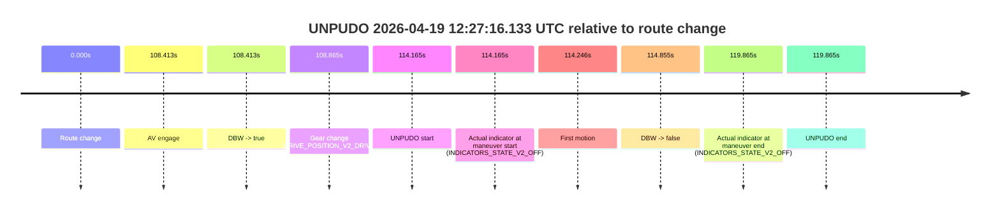
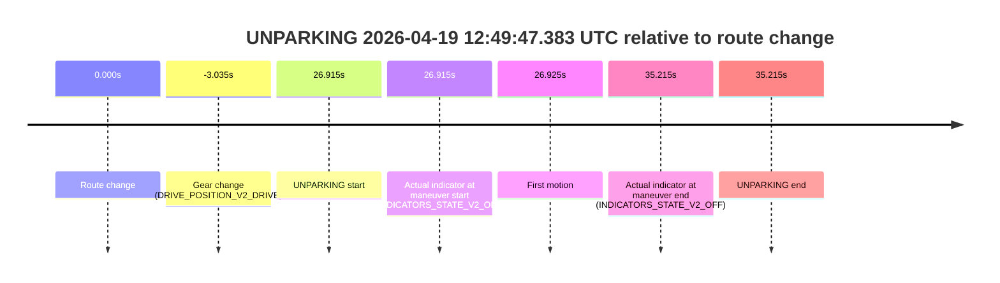
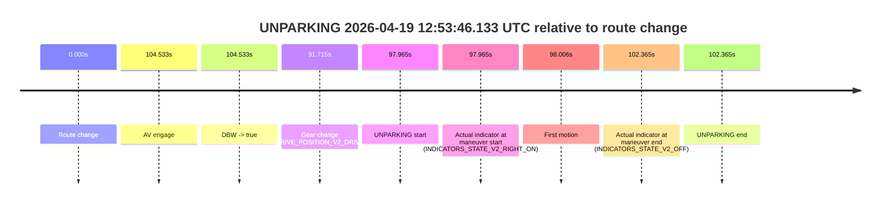

# Run Report: fme20018/2026-04-19--12-11-04--gen2-av-bd0b91b3-1771-4606-b812-73d68f9c406f

| Field | Value |
|---|---|
| Run ID | `fme20018/2026-04-19--12-11-04--gen2-av-bd0b91b3-1771-4606-b812-73d68f9c406f` |
| Date | `2026-04-19` |
| Model(s) | `satisfied-amber-moose` |
| Author | `guy.geva` |
| Event count | `3` |

## unpudo 2026-04-19 12:27:16.133 UTC

| Field | Value |
|---|---|
| Model | `satisfied-amber-moose` |
| Author | `guy.geva` |
| Run ID | `fme20018/2026-04-19--12-11-04--gen2-av-bd0b91b3-1771-4606-b812-73d68f9c406f` |
| Date | `2026-04-19` |
| Time (UTC) | `12:27:16.133` |
| Event type | `unpudo` |
| Disengagement type | `failed_to_unpudo` |
| Route change | `found` |
| Console | [run](https://console.sso.wayve.ai/run/fme20018/2026-04-19--12-11-04--gen2-av-bd0b91b3-1771-4606-b812-73d68f9c406f?id=&time-unixus=1776601636133288) |
| Foxglove | [segment](https://app.foxglove.dev/wayve-on-prem/p/prj_0dX18KZdVHg1fmmI/view?ds=foxglove-stream&ds.deviceName=fme20018&ds.start=2026-04-19T12%3A25%3A11.968231Z&ds.end=2026-04-19T12%3A27%3A31.833300Z&layoutId=lay_0e7VD4WIKDQGU73Y&time=2026-04-19T12%3A27%3A16.133288Z) |

### Event card: fail

- Fail: AV owns part of the segment, but the event still resolves as a model-performance failure under the AV-only scoring rule.

| Event | Time (UTC) | Delta from route change |
|---|---:|---:|
| Route change | 2026-04-19 12:25:21.968 | `0.000s` |
| AV engage | 2026-04-19 12:27:10.381 | `108.413s` |
| DBW -> true | 2026-04-19 12:27:10.381 | `108.413s` |
| Gear change (DRIVE_POSITION_V2_DRIVE) | 2026-04-19 12:27:10.833 | `108.865s` |
| UNPUDO start | 2026-04-19 12:27:16.133 | `114.165s` |
| Actual indicator at maneuver start (INDICATORS_STATE_V2_OFF) | 2026-04-19 12:27:16.133 | `114.165s` |
| First motion | 2026-04-19 12:27:16.214 | `114.246s` |
| DBW -> false | 2026-04-19 12:27:16.823 | `114.855s` |
| Actual indicator at maneuver end (INDICATORS_STATE_V2_OFF) | 2026-04-19 12:27:21.833 | `119.865s` |
| UNPUDO end | 2026-04-19 12:27:21.833 | `119.865s` |

| Metric | Value |
|---|---|
| Outcome | `fail` |
| Effective failure type | `failed_to_unpudo` |
| Route change status | `found` |
| DBW at event start | `true` |
| DBW at event end | `false` |
| Predicted gear at AV start | `DRIVE_POSITION_V2_DRIVE` |
| Actual gear at AV start | `DRIVE_POSITION_V2_PARK` |
| Predicted gear at event start | `DRIVE_POSITION_V2_DRIVE` |
| Actual gear at event start | `DRIVE_POSITION_V2_DRIVE` |
| Planned indicator direction | `INDICATORS_STATE_V2_RIGHT_ON` |
| Controller indicator direction | `INDICATORS_STATE_V2_RIGHT_ON` |
| Actual indicator direction | `INDICATORS_STATE_V2_OFF` |
| Actual indicator at maneuver end | `INDICATORS_STATE_V2_OFF` |
| Driver accel help in AV | `false` |
| Driver accel help timestamp | `n/a` |
| Max accel pedal pct in AV | `0.0%` |
| Max brake pedal pct in AV | `9.8%` |
| Max speed mps in AV | `0.103` |
| Route -> AV | `108.413s` |
| AV -> event start | `5.752s` |
| AV -> first motion | `5.833s` |
| AV duration before disengagement | `6.442s` |
| Trajectory waypoint count | `36` |
| Driving-plan step count | `11` |

The scored portion starts from the AV-owned window, not from the pre-AV setup. Route-change search in the stopped pre-event segment was `found`, with the baseline therefore set to route change. At the event anchor the model predicts `DRIVE_POSITION_V2_DRIVE` and the actual gear is `DRIVE_POSITION_V2_DRIVE`. The effective model outcome is `fail` because `failed_to_unpudo`.

### Resolution

| Field | Value |
|---|---|
| Final outcome | `fail` |
| Do we agree with this label? | `yes` |
| Source disengagement type | `failed_to_unpudo` |
| Resolved effective failure type | `failed_to_unpudo` |
| Confidence | `high` |

## unparking 2026-04-19 12:49:47.383 UTC

| Field | Value |
|---|---|
| Model | `satisfied-amber-moose` |
| Author | `guy.geva` |
| Run ID | `fme20018/2026-04-19--12-11-04--gen2-av-bd0b91b3-1771-4606-b812-73d68f9c406f` |
| Date | `2026-04-19` |
| Time (UTC) | `12:49:47.383` |
| Event type | `unparking` |
| Disengagement type | `none observed` |
| Route change | `found` |
| Console | [run](https://console.sso.wayve.ai/run/fme20018/2026-04-19--12-11-04--gen2-av-bd0b91b3-1771-4606-b812-73d68f9c406f?id=&time-unixus=1776602987383309) |
| Foxglove | [segment](https://app.foxglove.dev/wayve-on-prem/p/prj_0dX18KZdVHg1fmmI/view?ds=foxglove-stream&ds.deviceName=fme20018&ds.start=2026-04-19T12%3A49%3A07.433298Z&ds.end=2026-04-19T12%3A50%3A05.683312Z&layoutId=lay_0e7VD4WIKDQGU73Y&time=2026-04-19T12%3A49%3A47.383309Z) |

### Event card: fail

- Fail: the credited unparking does not stay AV-owned. The event window starts with DBW false, and the maneuver outcome lands outside a clean AV-owned segment.

| Event | Time (UTC) | Delta from route change |
|---|---:|---:|
| Route change | 2026-04-19 12:49:20.468 | `0.000s` |
| Gear change (DRIVE_POSITION_V2_DRIVE) | 2026-04-19 12:49:17.433 | `-3.035s` |
| UNPARKING start | 2026-04-19 12:49:47.383 | `26.915s` |
| Actual indicator at maneuver start (INDICATORS_STATE_V2_OFF) | 2026-04-19 12:49:47.383 | `26.915s` |
| First motion | 2026-04-19 12:49:47.394 | `26.925s` |
| Actual indicator at maneuver end (INDICATORS_STATE_V2_OFF) | 2026-04-19 12:49:55.683 | `35.215s` |
| UNPARKING end | 2026-04-19 12:49:55.683 | `35.215s` |

| Metric | Value |
|---|---|
| Outcome | `fail` |
| Effective failure type | `not_av_owned` |
| Route change status | `found` |
| DBW at event start | `false` |
| DBW at event end | `false` |
| Predicted gear at AV start | `n/a` |
| Actual gear at AV start | `n/a` |
| Predicted gear at event start | `DRIVE_POSITION_V2_DRIVE` |
| Actual gear at event start | `DRIVE_POSITION_V2_DRIVE` |
| Planned indicator direction | `INDICATORS_STATE_V2_OFF` |
| Controller indicator direction | `INDICATORS_STATE_V2_OFF` |
| Actual indicator direction | `INDICATORS_STATE_V2_OFF` |
| Actual indicator at maneuver end | `INDICATORS_STATE_V2_OFF` |
| Driver accel help in AV | `false` |
| Driver accel help timestamp | `n/a` |
| Max accel pedal pct in AV | `0.0%` |
| Max brake pedal pct in AV | `0.0%` |
| Max speed mps in AV | `0.000` |
| Route -> AV | `n/a` |
| AV -> event start | `n/a` |
| AV -> first motion | `n/a` |
| AV duration before disengagement | `n/a` |
| Trajectory waypoint count | `37` |
| Driving-plan step count | `11` |

The scored portion starts from the AV-owned window, not from the pre-AV setup. Route-change search in the stopped pre-event segment was `found`, with the baseline therefore set to route change. At the event anchor the model predicts `DRIVE_POSITION_V2_DRIVE` and the actual gear is `DRIVE_POSITION_V2_DRIVE`. The effective model outcome is `fail` because `not_av_owned`.

### Resolution

| Field | Value |
|---|---|
| Final outcome | `fail` |
| Do we agree with this label? | `yes` |
| Source disengagement type | `none observed` |
| Resolved effective failure type | `not_av_owned` |
| Confidence | `high` |

## unparking 2026-04-19 12:53:46.133 UTC

| Field | Value |
|---|---|
| Model | `satisfied-amber-moose` |
| Author | `guy.geva` |
| Run ID | `fme20018/2026-04-19--12-11-04--gen2-av-bd0b91b3-1771-4606-b812-73d68f9c406f` |
| Date | `2026-04-19` |
| Time (UTC) | `12:53:46.133` |
| Event type | `unparking` |
| Disengagement type | `none observed` |
| Route change | `found` |
| Console | [run](https://console.sso.wayve.ai/run/fme20018/2026-04-19--12-11-04--gen2-av-bd0b91b3-1771-4606-b812-73d68f9c406f?id=&time-unixus=1776603226133290) |
| Foxglove | [segment](https://app.foxglove.dev/wayve-on-prem/p/prj_0dX18KZdVHg1fmmI/view?ds=foxglove-stream&ds.deviceName=fme20018&ds.start=2026-04-19T12%3A51%3A58.168254Z&ds.end=2026-04-19T12%3A54%3A00.533310Z&layoutId=lay_0e7VD4WIKDQGU73Y&time=2026-04-19T12%3A53%3A46.133290Z) |

### Event card: fail

- Fail: the credited unparking does not stay AV-owned. The event window starts with DBW false, and the maneuver outcome lands outside a clean AV-owned segment.

| Event | Time (UTC) | Delta from route change |
|---|---:|---:|
| Route change | 2026-04-19 12:52:08.168 | `0.000s` |
| AV engage | 2026-04-19 12:53:52.701 | `104.533s` |
| DBW -> true | 2026-04-19 12:53:52.701 | `104.533s` |
| Gear change (DRIVE_POSITION_V2_DRIVE) | 2026-04-19 12:53:39.883 | `91.715s` |
| UNPARKING start | 2026-04-19 12:53:46.133 | `97.965s` |
| Actual indicator at maneuver start (INDICATORS_STATE_V2_RIGHT_ON) | 2026-04-19 12:53:46.133 | `97.965s` |
| First motion | 2026-04-19 12:53:46.174 | `98.006s` |
| Actual indicator at maneuver end (INDICATORS_STATE_V2_OFF) | 2026-04-19 12:53:50.533 | `102.365s` |
| UNPARKING end | 2026-04-19 12:53:50.533 | `102.365s` |

| Metric | Value |
|---|---|
| Outcome | `fail` |
| Effective failure type | `completed_outside_av` |
| Route change status | `found` |
| DBW at event start | `false` |
| DBW at event end | `false` |
| Predicted gear at AV start | `DRIVE_POSITION_V2_DRIVE` |
| Actual gear at AV start | `DRIVE_POSITION_V2_DRIVE` |
| Predicted gear at event start | `DRIVE_POSITION_V2_DRIVE` |
| Actual gear at event start | `DRIVE_POSITION_V2_DRIVE` |
| Planned indicator direction | `INDICATORS_STATE_V2_RIGHT_ON` |
| Controller indicator direction | `INDICATORS_STATE_V2_RIGHT_ON` |
| Actual indicator direction | `INDICATORS_STATE_V2_RIGHT_ON` |
| Actual indicator at maneuver end | `INDICATORS_STATE_V2_OFF` |
| Driver accel help in AV | `false` |
| Driver accel help timestamp | `n/a` |
| Max accel pedal pct in AV | `0.0%` |
| Max brake pedal pct in AV | `0.0%` |
| Max speed mps in AV | `0.000` |
| Route -> AV | `104.533s` |
| AV -> event start | `-6.568s` |
| AV -> first motion | `-6.527s` |
| AV duration before disengagement | `n/a` |
| Trajectory waypoint count | `36` |
| Driving-plan step count | `11` |

The scored portion starts from the AV-owned window, not from the pre-AV setup. Route-change search in the stopped pre-event segment was `found`, with the baseline therefore set to route change. At the event anchor the model predicts `DRIVE_POSITION_V2_DRIVE` and the actual gear is `DRIVE_POSITION_V2_DRIVE`. The effective model outcome is `fail` because `completed_outside_av`.

### Resolution

| Field | Value |
|---|---|
| Final outcome | `fail` |
| Do we agree with this label? | `yes` |
| Source disengagement type | `none observed` |
| Resolved effective failure type | `completed_outside_av` |
| Confidence | `high` |
