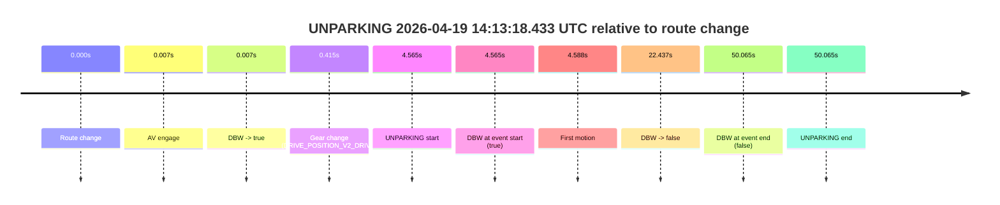

# Run Report: fme20018/2026-04-19--14-04-52--gen2-av-41188d22-876c-4189-9792-6aded4581951

| Field | Value |
|---|---|
| Run ID | `fme20018/2026-04-19--14-04-52--gen2-av-41188d22-876c-4189-9792-6aded4581951` |
| Date | `2026-04-19` |
| Model(s) | `eel-teal-outspoken` |
| Author | `zak` |
| Event count | `1` |

## unparking 2026-04-19 14:13:18.433 UTC

| Field | Value |
|---|---|
| Model | `eel-teal-outspoken` |
| Author | `zak` |
| Run ID | `fme20018/2026-04-19--14-04-52--gen2-av-41188d22-876c-4189-9792-6aded4581951` |
| Date | `2026-04-19` |
| Time (UTC) | `14:13:18.433` |
| Event type | `unparking` |
| Disengagement type | `none observed` |
| Route change | `found` |
| Console | [run](https://console.sso.wayve.ai/run/fme20018/2026-04-19--14-04-52--gen2-av-41188d22-876c-4189-9792-6aded4581951?id=&time-unixus=1776607998433296) |
| Foxglove | [segment](https://app.foxglove.dev/wayve-on-prem/p/prj_0dX18KZdVHg1fmmI/view?ds=foxglove-stream&ds.deviceName=fme20018&ds.start=2026-04-19T14%3A13%3A03.868637Z&ds.end=2026-04-19T14%3A14%3A13.933302Z&layoutId=lay_0e7VD4WIKDQGU73Y&time=2026-04-19T14%3A13%3A18.433296Z) |

### Event card: fail

- Fail: the credited unparking does not stay AV-owned. The event window starts with DBW true, and the maneuver outcome lands outside a clean AV-owned segment.

| Event | Time (UTC) | Delta from route change |
|---|---:|---:|
| Route change | 2026-04-19 14:13:13.868 | `0.000s` |
| AV engage | 2026-04-19 14:13:13.875 | `0.007s` |
| DBW -> true | 2026-04-19 14:13:13.875 | `0.007s` |
| Gear change (DRIVE_POSITION_V2_DRIVE) | 2026-04-19 14:13:14.283 | `0.415s` |
| UNPARKING start | 2026-04-19 14:13:18.433 | `4.565s` |
| DBW at event start (true) | 2026-04-19 14:13:18.433 | `4.565s` |
| First motion | 2026-04-19 14:13:18.456 | `4.588s` |
| DBW -> false | 2026-04-19 14:13:36.305 | `22.437s` |
| DBW at event end (false) | 2026-04-19 14:14:03.933 | `50.065s` |
| UNPARKING end | 2026-04-19 14:14:03.933 | `50.065s` |

| Metric | Value |
|---|---|
| Outcome | `fail` |
| Effective failure type | `driver_completed_maneuver` |
| Route change status | `found` |
| DBW at event start | `true` |
| DBW at event end | `false` |
| Predicted gear at AV start | `DRIVE_POSITION_V2_PARK` |
| Actual gear at AV start | `DRIVE_POSITION_V2_PARK` |
| Predicted gear at event start | `DRIVE_POSITION_V2_DRIVE` |
| Actual gear at event start | `DRIVE_POSITION_V2_DRIVE` |
| Planned indicator direction | `INDICATORS_STATE_V2_OFF` |
| Controller indicator direction | `INDICATORS_STATE_V2_OFF` |
| Actual indicator direction | `INDICATORS_STATE_V2_OFF` |
| Actual indicator at maneuver end | `INDICATORS_STATE_V2_OFF` |
| Driver accel help in AV | `false` |
| Driver accel help timestamp | `n/a` |
| Max accel pedal pct in AV | `0.0%` |
| Max brake pedal pct in AV | `25.4%` |
| Max speed mps in AV | `1.975` |
| Success timing baseline | `route change` |
| Route -> AV | `0.007s` |
| AV -> event start | `4.557s` |
| AV -> first motion | `4.581s` |
| Success baseline -> event start | `4.565s` |
| Success baseline -> first motion | `4.588s` |
| AV duration before disengagement | `22.430s` |
| Trajectory waypoint count | `37` |
| Driving-plan step count | `11` |

The scored portion starts from the AV-owned window, not from the pre-AV setup. Route-change search in the stopped pre-event segment was `found`, with the baseline therefore set to route change. At the event anchor the model predicts `DRIVE_POSITION_V2_DRIVE` and the actual gear is `DRIVE_POSITION_V2_DRIVE`. The effective model outcome is `fail` because `driver_completed_maneuver.`

### Resolution

| Field | Value |
|---|---|
| Final outcome | `fail` |
| Do we agree with this label? | `yes` |
| Source disengagement type | `none observed` |
| Resolved effective failure type | `driver_completed_maneuver` |
| Confidence | `high` |
