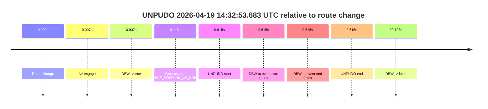
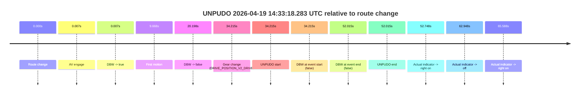
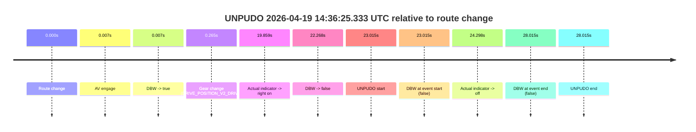

# Run Report: fme20018/2026-04-19--14-22-25--gen2-av-a616e8d2-cd1c-4b32-a2f3-d4dfdf333800

| Field | Value |
|---|---|
| Run ID | `fme20018/2026-04-19--14-22-25--gen2-av-a616e8d2-cd1c-4b32-a2f3-d4dfdf333800` |
| Date | `2026-04-19` |
| Model(s) | `eel-teal-outspoken` |
| Author | `zak` |
| Event count | `3` |

## unpudo 2026-04-19 14:32:53.683 UTC

| Field | Value |
|---|---|
| Model | `eel-teal-outspoken` |
| Author | `zak` |
| Run ID | `fme20018/2026-04-19--14-22-25--gen2-av-a616e8d2-cd1c-4b32-a2f3-d4dfdf333800` |
| Date | `2026-04-19` |
| Time (UTC) | `14:32:53.683` |
| Event type | `unpudo` |
| Disengagement type | `none observed` |
| Route change | `found` |
| Console | [run](https://console.sso.wayve.ai/run/fme20018/2026-04-19--14-22-25--gen2-av-a616e8d2-cd1c-4b32-a2f3-d4dfdf333800?id=&time-unixus=1776609173683309) |
| Foxglove | [segment](https://app.foxglove.dev/wayve-on-prem/p/prj_0dX18KZdVHg1fmmI/view?ds=foxglove-stream&ds.deviceName=fme20018&ds.start=2026-04-19T14%3A32%3A34.068262Z&ds.end=2026-04-19T14%3A33%3A14.266630Z&layoutId=lay_0e7VD4WIKDQGU73Y&time=2026-04-19T14%3A32%3A53.683309Z) |

### Event card: fail

- Fail: AV owns part of the segment, but the event still resolves as a model-performance failure under the AV-only scoring rule.

| Event | Time (UTC) | Delta from route change |
|---|---:|---:|
| Route change | 2026-04-19 14:32:44.068 | `0.000s` |
| AV engage | 2026-04-19 14:32:44.075 | `0.007s` |
| DBW -> true | 2026-04-19 14:32:44.075 | `0.007s` |
| Gear change (DRIVE_POSITION_V2_DRIVE) | 2026-04-19 14:32:50.183 | `6.115s` |
| UNPUDO start | 2026-04-19 14:32:53.683 | `9.615s` |
| DBW at event start (true) | 2026-04-19 14:32:53.683 | `9.615s` |
| DBW at event end (true) | 2026-04-19 14:32:53.683 | `9.615s` |
| UNPUDO end | 2026-04-19 14:32:53.683 | `9.615s` |
| DBW -> false | 2026-04-19 14:33:04.266 | `20.198s` |

| Metric | Value |
|---|---|
| Outcome | `fail` |
| Effective failure type | `unknown_needs_review` |
| Route change status | `found` |
| DBW at event start | `true` |
| DBW at event end | `true` |
| Predicted gear at AV start | `DRIVE_POSITION_V2_PARK` |
| Actual gear at AV start | `DRIVE_POSITION_V2_PARK` |
| Predicted gear at event start | `DRIVE_POSITION_V2_DRIVE` |
| Actual gear at event start | `DRIVE_POSITION_V2_DRIVE` |
| Planned indicator direction | `INDICATORS_STATE_V2_OFF` |
| Controller indicator direction | `INDICATORS_STATE_V2_OFF` |
| Actual indicator direction | `INDICATORS_STATE_V2_OFF` |
| Actual indicator at maneuver end | `INDICATORS_STATE_V2_OFF` |
| Driver accel help in AV | `false` |
| Driver accel help timestamp | `n/a` |
| Max accel pedal pct in AV | `0.0%` |
| Max brake pedal pct in AV | `8.0%` |
| Max speed mps in AV | `0.000` |
| Success timing baseline | `route change` |
| Route -> AV | `0.007s` |
| AV -> event start | `9.608s` |
| AV -> first motion | `n/a` |
| Success baseline -> event start | `9.615s` |
| Success baseline -> first motion | `n/a` |
| AV duration before disengagement | `20.191s` |
| Trajectory waypoint count | `36` |
| Driving-plan step count | `11` |

The scored portion starts from the AV-owned window, not from the pre-AV setup. Route-change search in the stopped pre-event segment was `found`, with the baseline therefore set to route change. At the event anchor the model predicts `DRIVE_POSITION_V2_DRIVE` and the actual gear is `DRIVE_POSITION_V2_DRIVE`. The effective model outcome is `fail` because `unknown_needs_review.`

### Resolution

| Field | Value |
|---|---|
| Final outcome | `fail` |
| Do we agree with this label? | `yes` |
| Source disengagement type | `none observed` |
| Resolved effective failure type | `unknown_needs_review` |
| Confidence | `high` |

## unpudo 2026-04-19 14:33:18.283 UTC

| Field | Value |
|---|---|
| Model | `eel-teal-outspoken` |
| Author | `zak` |
| Run ID | `fme20018/2026-04-19--14-22-25--gen2-av-a616e8d2-cd1c-4b32-a2f3-d4dfdf333800` |
| Date | `2026-04-19` |
| Time (UTC) | `14:33:18.283` |
| Event type | `unpudo` |
| Disengagement type | `none observed` |
| Route change | `found` |
| Console | [run](https://console.sso.wayve.ai/run/fme20018/2026-04-19--14-22-25--gen2-av-a616e8d2-cd1c-4b32-a2f3-d4dfdf333800?id=&time-unixus=1776609198283297) |
| Foxglove | [segment](https://app.foxglove.dev/wayve-on-prem/p/prj_0dX18KZdVHg1fmmI/view?ds=foxglove-stream&ds.deviceName=fme20018&ds.start=2026-04-19T14%3A32%3A34.068262Z&ds.end=2026-04-19T14%3A33%3A46.083306Z&layoutId=lay_0e7VD4WIKDQGU73Y&time=2026-04-19T14%3A33%3A18.283297Z) |

### Event card: fail

- Fail: the credited unpudo does not stay AV-owned. The event window starts with DBW false, and the maneuver outcome lands outside a clean AV-owned segment.

| Event | Time (UTC) | Delta from route change |
|---|---:|---:|
| Route change | 2026-04-19 14:32:44.068 | `0.000s` |
| AV engage | 2026-04-19 14:32:44.075 | `0.007s` |
| DBW -> true | 2026-04-19 14:32:44.075 | `0.007s` |
| First motion | 2026-04-19 14:32:53.736 | `9.668s` |
| DBW -> false | 2026-04-19 14:33:04.266 | `20.198s` |
| Gear change (DRIVE_POSITION_V2_DRIVE) | 2026-04-19 14:33:18.283 | `34.215s` |
| UNPUDO start | 2026-04-19 14:33:18.283 | `34.215s` |
| DBW at event start (false) | 2026-04-19 14:33:18.283 | `34.215s` |
| DBW at event end (false) | 2026-04-19 14:33:36.083 | `52.015s` |
| UNPUDO end | 2026-04-19 14:33:36.083 | `52.015s` |
| Actual indicator -> right on | 2026-04-19 14:33:36.816 | `52.748s` |
| Actual indicator -> off | 2026-04-19 14:33:47.016 | `62.948s` |
| Actual indicator -> right on | 2026-04-19 14:33:49.656 | `65.588s` |

| Metric | Value |
|---|---|
| Outcome | `fail` |
| Effective failure type | `not_av_owned` |
| Route change status | `found` |
| DBW at event start | `false` |
| DBW at event end | `false` |
| Predicted gear at AV start | `DRIVE_POSITION_V2_PARK` |
| Actual gear at AV start | `DRIVE_POSITION_V2_PARK` |
| Predicted gear at event start | `DRIVE_POSITION_V2_DRIVE` |
| Actual gear at event start | `DRIVE_POSITION_V2_DRIVE` |
| Planned indicator direction | `INDICATORS_STATE_V2_OFF` |
| Controller indicator direction | `INDICATORS_STATE_V2_OFF` |
| Actual indicator direction | `INDICATORS_STATE_V2_OFF` |
| Actual indicator at maneuver end | `INDICATORS_STATE_V2_OFF` |
| Driver accel help in AV | `false` |
| Driver accel help timestamp | `n/a` |
| Max accel pedal pct in AV | `0.0%` |
| Max brake pedal pct in AV | `8.0%` |
| Max speed mps in AV | `2.281` |
| Success timing baseline | `route change` |
| Route -> AV | `0.007s` |
| AV -> event start | `34.208s` |
| AV -> first motion | `9.661s` |
| Success baseline -> event start | `34.215s` |
| Success baseline -> first motion | `9.668s` |
| AV duration before disengagement | `20.191s` |
| Trajectory waypoint count | `36` |
| Driving-plan step count | `11` |

The scored portion starts from the AV-owned window, not from the pre-AV setup. Route-change search in the stopped pre-event segment was `found`, with the baseline therefore set to route change. At the event anchor the model predicts `DRIVE_POSITION_V2_DRIVE` and the actual gear is `DRIVE_POSITION_V2_DRIVE`. The effective model outcome is `fail` because `not_av_owned.`

### Resolution

| Field | Value |
|---|---|
| Final outcome | `fail` |
| Do we agree with this label? | `yes` |
| Source disengagement type | `none observed` |
| Resolved effective failure type | `not_av_owned` |
| Confidence | `high` |

## unpudo 2026-04-19 14:36:25.333 UTC

| Field | Value |
|---|---|
| Model | `eel-teal-outspoken` |
| Author | `zak` |
| Run ID | `fme20018/2026-04-19--14-22-25--gen2-av-a616e8d2-cd1c-4b32-a2f3-d4dfdf333800` |
| Date | `2026-04-19` |
| Time (UTC) | `14:36:25.333` |
| Event type | `unpudo` |
| Disengagement type | `none observed` |
| Route change | `found` |
| Console | [run](https://console.sso.wayve.ai/run/fme20018/2026-04-19--14-22-25--gen2-av-a616e8d2-cd1c-4b32-a2f3-d4dfdf333800?id=&time-unixus=1776609385333289) |
| Foxglove | [segment](https://app.foxglove.dev/wayve-on-prem/p/prj_0dX18KZdVHg1fmmI/view?ds=foxglove-stream&ds.deviceName=fme20018&ds.start=2026-04-19T14%3A35%3A52.318254Z&ds.end=2026-04-19T14%3A36%3A40.333294Z&layoutId=lay_0e7VD4WIKDQGU73Y&time=2026-04-19T14%3A36%3A25.333289Z) |

### Event card: fail

- Fail: the credited unpudo does not stay AV-owned. The event window starts with DBW false, and the maneuver outcome lands outside a clean AV-owned segment.

| Event | Time (UTC) | Delta from route change |
|---|---:|---:|
| Route change | 2026-04-19 14:36:02.318 | `0.000s` |
| AV engage | 2026-04-19 14:36:02.325 | `0.007s` |
| DBW -> true | 2026-04-19 14:36:02.325 | `0.007s` |
| Gear change (DRIVE_POSITION_V2_DRIVE) | 2026-04-19 14:36:02.583 | `0.265s` |
| Actual indicator -> right on | 2026-04-19 14:36:22.176 | `19.859s` |
| DBW -> false | 2026-04-19 14:36:24.586 | `22.268s` |
| UNPUDO start | 2026-04-19 14:36:25.333 | `23.015s` |
| DBW at event start (false) | 2026-04-19 14:36:25.333 | `23.015s` |
| Actual indicator -> off | 2026-04-19 14:36:26.616 | `24.298s` |
| DBW at event end (false) | 2026-04-19 14:36:30.333 | `28.015s` |
| UNPUDO end | 2026-04-19 14:36:30.333 | `28.015s` |

| Metric | Value |
|---|---|
| Outcome | `fail` |
| Effective failure type | `not_av_owned` |
| Route change status | `found` |
| DBW at event start | `false` |
| DBW at event end | `false` |
| Predicted gear at AV start | `DRIVE_POSITION_V2_PARK` |
| Actual gear at AV start | `DRIVE_POSITION_V2_PARK` |
| Predicted gear at event start | `DRIVE_POSITION_V2_DRIVE` |
| Actual gear at event start | `DRIVE_POSITION_V2_DRIVE` |
| Planned indicator direction | `INDICATORS_STATE_V2_OFF` |
| Controller indicator direction | `INDICATORS_STATE_V2_OFF` |
| Actual indicator direction | `INDICATORS_STATE_V2_RIGHT_ON` |
| Actual indicator at maneuver end | `INDICATORS_STATE_V2_OFF` |
| Driver accel help in AV | `false` |
| Driver accel help timestamp | `n/a` |
| Max accel pedal pct in AV | `0.0%` |
| Max brake pedal pct in AV | `8.0%` |
| Max speed mps in AV | `0.000` |
| Success timing baseline | `route change` |
| Route -> AV | `0.007s` |
| AV -> event start | `23.008s` |
| AV -> first motion | `n/a` |
| Success baseline -> event start | `23.015s` |
| Success baseline -> first motion | `n/a` |
| AV duration before disengagement | `22.261s` |
| Trajectory waypoint count | `37` |
| Driving-plan step count | `11` |

The scored portion starts from the AV-owned window, not from the pre-AV setup. Route-change search in the stopped pre-event segment was `found`, with the baseline therefore set to route change. At the event anchor the model predicts `DRIVE_POSITION_V2_DRIVE` and the actual gear is `DRIVE_POSITION_V2_DRIVE`. The effective model outcome is `fail` because `not_av_owned.`

### Resolution

| Field | Value |
|---|---|
| Final outcome | `fail` |
| Do we agree with this label? | `yes` |
| Source disengagement type | `none observed` |
| Resolved effective failure type | `not_av_owned` |
| Confidence | `high` |
