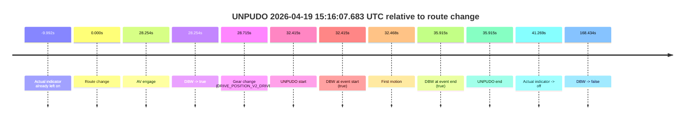
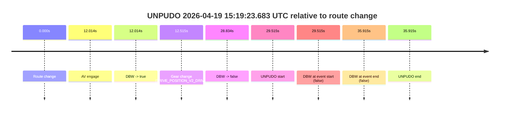
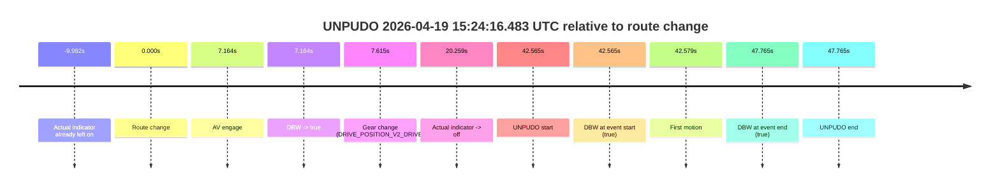

# Run Report: fme20018/2026-04-19--15-06-25--gen2-av-a8db5caa-c65c-4100-b908-18089f733493

| Field | Value |
|---|---|
| Run ID | `fme20018/2026-04-19--15-06-25--gen2-av-a8db5caa-c65c-4100-b908-18089f733493` |
| Date | `2026-04-19` |
| Model(s) | `eel-teal-outspoken` |
| Author | `zak` |
| Event count | `3` |

## unpudo 2026-04-19 15:16:07.683 UTC

| Field | Value |
|---|---|
| Model | `eel-teal-outspoken` |
| Author | `zak` |
| Run ID | `fme20018/2026-04-19--15-06-25--gen2-av-a8db5caa-c65c-4100-b908-18089f733493` |
| Date | `2026-04-19` |
| Time (UTC) | `15:16:07.683` |
| Event type | `unpudo` |
| Disengagement type | `none observed` |
| Route change | `found` |
| Console | [run](https://console.sso.wayve.ai/run/fme20018/2026-04-19--15-06-25--gen2-av-a8db5caa-c65c-4100-b908-18089f733493?id=&time-unixus=1776611767683320) |
| Foxglove | [segment](https://app.foxglove.dev/wayve-on-prem/p/prj_0dX18KZdVHg1fmmI/view?ds=foxglove-stream&ds.deviceName=fme20018&ds.start=2026-04-19T15%3A15%3A25.268268Z&ds.end=2026-04-19T15%3A18%3A33.701803Z&layoutId=lay_0e7VD4WIKDQGU73Y&time=2026-04-19T15%3A16%3A07.683320Z) |

### Event card: pass

- Pass: AV owns the credited unpudo from route change through the official unpudo window, the gear state is aligned at the anchor, and the vehicle moves without driver accelerator help in AV.

| Event | Time (UTC) | Delta from route change |
|---|---:|---:|
| Actual indicator already left on | 2026-04-19 15:15:25.276 | `-9.992s` |
| Route change | 2026-04-19 15:15:35.268 | `0.000s` |
| AV engage | 2026-04-19 15:16:03.521 | `28.254s` |
| DBW -> true | 2026-04-19 15:16:03.521 | `28.254s` |
| Gear change (DRIVE_POSITION_V2_DRIVE) | 2026-04-19 15:16:03.983 | `28.715s` |
| UNPUDO start | 2026-04-19 15:16:07.683 | `32.415s` |
| DBW at event start (true) | 2026-04-19 15:16:07.683 | `32.415s` |
| First motion | 2026-04-19 15:16:07.736 | `32.468s` |
| DBW at event end (true) | 2026-04-19 15:16:11.183 | `35.915s` |
| UNPUDO end | 2026-04-19 15:16:11.183 | `35.915s` |
| Actual indicator -> off | 2026-04-19 15:16:16.536 | `41.269s` |
| DBW -> false | 2026-04-19 15:18:23.701 | `168.434s` |

| Metric | Value |
|---|---|
| Outcome | `pass` |
| Effective failure type | `none` |
| Route change status | `found` |
| DBW at event start | `true` |
| DBW at event end | `true` |
| Predicted gear at AV start | `DRIVE_POSITION_V2_DRIVE` |
| Actual gear at AV start | `DRIVE_POSITION_V2_PARK` |
| Predicted gear at event start | `DRIVE_POSITION_V2_DRIVE` |
| Actual gear at event start | `DRIVE_POSITION_V2_DRIVE` |
| Planned indicator direction | `INDICATORS_STATE_V2_RIGHT_ON` |
| Controller indicator direction | `INDICATORS_STATE_V2_RIGHT_ON` |
| Actual indicator direction | `INDICATORS_STATE_V2_LEFT_ON` |
| Actual indicator at maneuver end | `INDICATORS_STATE_V2_LEFT_ON` |
| Driver accel help in AV | `false` |
| Driver accel help timestamp | `n/a` |
| Max accel pedal pct in AV | `0.0%` |
| Max brake pedal pct in AV | `10.6%` |
| Max speed mps in AV | `4.328` |
| Success timing baseline | `route change` |
| Route -> AV | `28.254s` |
| AV -> event start | `4.161s` |
| AV -> first motion | `4.215s` |
| Success baseline -> event start | `32.415s` |
| Success baseline -> first motion | `32.468s` |
| AV duration before disengagement | `140.180s` |
| Trajectory waypoint count | `37` |
| Driving-plan step count | `11` |

The scored portion starts from the AV-owned window, not from the pre-AV setup. Route-change search in the stopped pre-event segment was `found`, with the baseline therefore set to route change. At the event anchor the model predicts `DRIVE_POSITION_V2_DRIVE` and the actual gear is `DRIVE_POSITION_V2_DRIVE`. The effective model outcome is `pass` because `the credited unpudo stays AV-owned through the official unpudo window.`

### Resolution

| Field | Value |
|---|---|
| Final outcome | `pass` |
| Do we agree with this label? | `yes` |
| Source disengagement type | `none observed` |
| Resolved effective failure type | `none` |
| Confidence | `high` |

## unpudo 2026-04-19 15:19:23.683 UTC

| Field | Value |
|---|---|
| Model | `eel-teal-outspoken` |
| Author | `zak` |
| Run ID | `fme20018/2026-04-19--15-06-25--gen2-av-a8db5caa-c65c-4100-b908-18089f733493` |
| Date | `2026-04-19` |
| Time (UTC) | `15:19:23.683` |
| Event type | `unpudo` |
| Disengagement type | `none observed` |
| Route change | `found` |
| Console | [run](https://console.sso.wayve.ai/run/fme20018/2026-04-19--15-06-25--gen2-av-a8db5caa-c65c-4100-b908-18089f733493?id=&time-unixus=1776611963683307) |
| Foxglove | [segment](https://app.foxglove.dev/wayve-on-prem/p/prj_0dX18KZdVHg1fmmI/view?ds=foxglove-stream&ds.deviceName=fme20018&ds.start=2026-04-19T15%3A18%3A44.168255Z&ds.end=2026-04-19T15%3A19%3A40.083295Z&layoutId=lay_0e7VD4WIKDQGU73Y&time=2026-04-19T15%3A19%3A23.683307Z) |

### Event card: fail

- Fail: the credited unpudo does not stay AV-owned. The event window starts with DBW false, and the maneuver outcome lands outside a clean AV-owned segment.

| Event | Time (UTC) | Delta from route change |
|---|---:|---:|
| Route change | 2026-04-19 15:18:54.168 | `0.000s` |
| AV engage | 2026-04-19 15:19:06.181 | `12.014s` |
| DBW -> true | 2026-04-19 15:19:06.181 | `12.014s` |
| Gear change (DRIVE_POSITION_V2_DRIVE) | 2026-04-19 15:19:06.683 | `12.515s` |
| DBW -> false | 2026-04-19 15:19:23.001 | `28.834s` |
| UNPUDO start | 2026-04-19 15:19:23.683 | `29.515s` |
| DBW at event start (false) | 2026-04-19 15:19:23.683 | `29.515s` |
| DBW at event end (false) | 2026-04-19 15:19:30.083 | `35.915s` |
| UNPUDO end | 2026-04-19 15:19:30.083 | `35.915s` |

| Metric | Value |
|---|---|
| Outcome | `fail` |
| Effective failure type | `not_av_owned` |
| Route change status | `found` |
| DBW at event start | `false` |
| DBW at event end | `false` |
| Predicted gear at AV start | `DRIVE_POSITION_V2_DRIVE` |
| Actual gear at AV start | `DRIVE_POSITION_V2_PARK` |
| Predicted gear at event start | `DRIVE_POSITION_V2_DRIVE` |
| Actual gear at event start | `DRIVE_POSITION_V2_DRIVE` |
| Planned indicator direction | `INDICATORS_STATE_V2_LEFT_ON` |
| Controller indicator direction | `INDICATORS_STATE_V2_LEFT_ON` |
| Actual indicator direction | `INDICATORS_STATE_V2_OFF` |
| Actual indicator at maneuver end | `INDICATORS_STATE_V2_OFF` |
| Driver accel help in AV | `false` |
| Driver accel help timestamp | `n/a` |
| Max accel pedal pct in AV | `0.0%` |
| Max brake pedal pct in AV | `8.0%` |
| Max speed mps in AV | `0.000` |
| Success timing baseline | `route change` |
| Route -> AV | `12.014s` |
| AV -> event start | `17.501s` |
| AV -> first motion | `n/a` |
| Success baseline -> event start | `29.515s` |
| Success baseline -> first motion | `n/a` |
| AV duration before disengagement | `16.820s` |
| Trajectory waypoint count | `37` |
| Driving-plan step count | `11` |

The scored portion starts from the AV-owned window, not from the pre-AV setup. Route-change search in the stopped pre-event segment was `found`, with the baseline therefore set to route change. At the event anchor the model predicts `DRIVE_POSITION_V2_DRIVE` and the actual gear is `DRIVE_POSITION_V2_DRIVE`. The effective model outcome is `fail` because `not_av_owned.`

### Resolution

| Field | Value |
|---|---|
| Final outcome | `fail` |
| Do we agree with this label? | `yes` |
| Source disengagement type | `none observed` |
| Resolved effective failure type | `not_av_owned` |
| Confidence | `high` |

## unpudo 2026-04-19 15:24:16.483 UTC

| Field | Value |
|---|---|
| Model | `eel-teal-outspoken` |
| Author | `zak` |
| Run ID | `fme20018/2026-04-19--15-06-25--gen2-av-a8db5caa-c65c-4100-b908-18089f733493` |
| Date | `2026-04-19` |
| Time (UTC) | `15:24:16.483` |
| Event type | `unpudo` |
| Disengagement type | `none observed` |
| Route change | `found` |
| Console | [run](https://console.sso.wayve.ai/run/fme20018/2026-04-19--15-06-25--gen2-av-a8db5caa-c65c-4100-b908-18089f733493?id=&time-unixus=1776612256483302) |
| Foxglove | [segment](https://app.foxglove.dev/wayve-on-prem/p/prj_0dX18KZdVHg1fmmI/view?ds=foxglove-stream&ds.deviceName=fme20018&ds.start=2026-04-19T15%3A23%3A23.918272Z&ds.end=2026-04-19T15%3A24%3A31.683300Z&layoutId=lay_0e7VD4WIKDQGU73Y&time=2026-04-19T15%3A24%3A16.483302Z) |

### Event card: pass

- Pass: AV owns the credited unpudo from route change through the official unpudo window, the gear state is aligned at the anchor, and the vehicle moves without driver accelerator help in AV.

| Event | Time (UTC) | Delta from route change |
|---|---:|---:|
| Actual indicator already left on | 2026-04-19 15:23:23.936 | `-9.982s` |
| Route change | 2026-04-19 15:23:33.918 | `0.000s` |
| AV engage | 2026-04-19 15:23:41.081 | `7.164s` |
| DBW -> true | 2026-04-19 15:23:41.081 | `7.164s` |
| Gear change (DRIVE_POSITION_V2_DRIVE) | 2026-04-19 15:23:41.533 | `7.615s` |
| Actual indicator -> off | 2026-04-19 15:23:54.176 | `20.259s` |
| UNPUDO start | 2026-04-19 15:24:16.483 | `42.565s` |
| DBW at event start (true) | 2026-04-19 15:24:16.483 | `42.565s` |
| First motion | 2026-04-19 15:24:16.496 | `42.579s` |
| DBW at event end (true) | 2026-04-19 15:24:21.683 | `47.765s` |
| UNPUDO end | 2026-04-19 15:24:21.683 | `47.765s` |

| Metric | Value |
|---|---|
| Outcome | `pass` |
| Effective failure type | `none` |
| Route change status | `found` |
| DBW at event start | `true` |
| DBW at event end | `true` |
| Predicted gear at AV start | `DRIVE_POSITION_V2_DRIVE` |
| Actual gear at AV start | `DRIVE_POSITION_V2_PARK` |
| Predicted gear at event start | `DRIVE_POSITION_V2_DRIVE` |
| Actual gear at event start | `DRIVE_POSITION_V2_DRIVE` |
| Planned indicator direction | `INDICATORS_STATE_V2_RIGHT_ON` |
| Controller indicator direction | `INDICATORS_STATE_V2_RIGHT_ON` |
| Actual indicator direction | `INDICATORS_STATE_V2_OFF` |
| Actual indicator at maneuver end | `INDICATORS_STATE_V2_OFF` |
| Driver accel help in AV | `false` |
| Driver accel help timestamp | `n/a` |
| Max accel pedal pct in AV | `0.0%` |
| Max brake pedal pct in AV | `8.0%` |
| Max speed mps in AV | `2.544` |
| Success timing baseline | `route change` |
| Route -> AV | `7.164s` |
| AV -> event start | `35.401s` |
| AV -> first motion | `35.415s` |
| Success baseline -> event start | `42.565s` |
| Success baseline -> first motion | `42.579s` |
| AV duration before disengagement | `n/a` |
| Trajectory waypoint count | `37` |
| Driving-plan step count | `11` |

The scored portion starts from the AV-owned window, not from the pre-AV setup. Route-change search in the stopped pre-event segment was `found`, with the baseline therefore set to route change. At the event anchor the model predicts `DRIVE_POSITION_V2_DRIVE` and the actual gear is `DRIVE_POSITION_V2_DRIVE`. The effective model outcome is `pass` because `the credited unpudo stays AV-owned through the official unpudo window.`

### Resolution

| Field | Value |
|---|---|
| Final outcome | `pass` |
| Do we agree with this label? | `yes` |
| Source disengagement type | `none observed` |
| Resolved effective failure type | `none` |
| Confidence | `high` |
