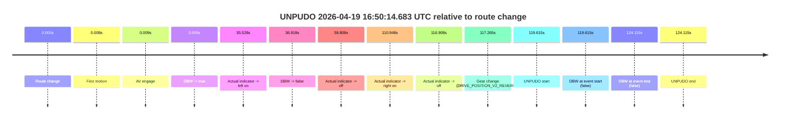
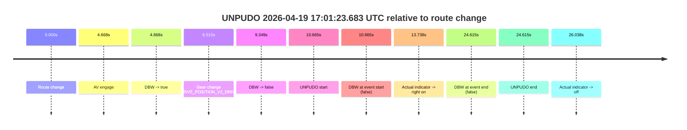
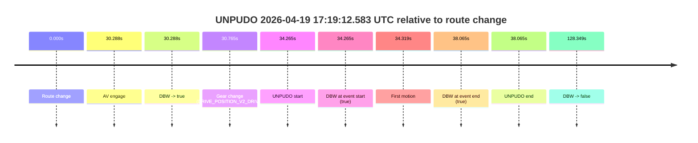
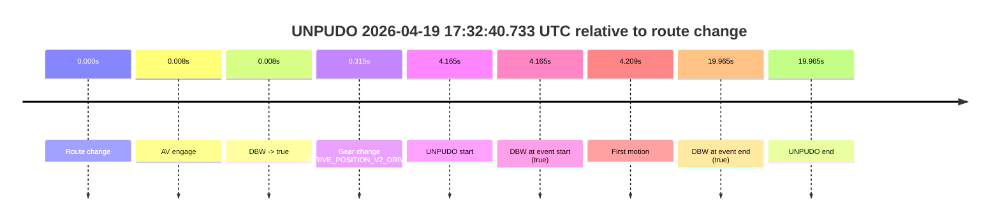
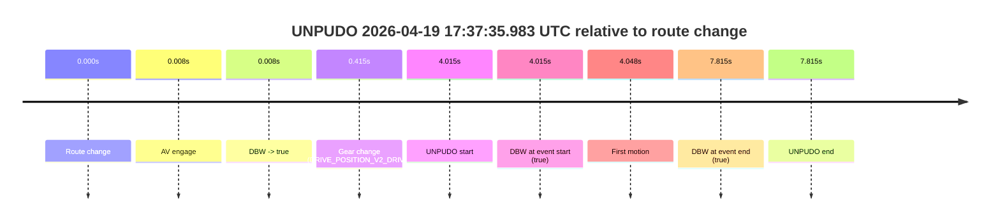
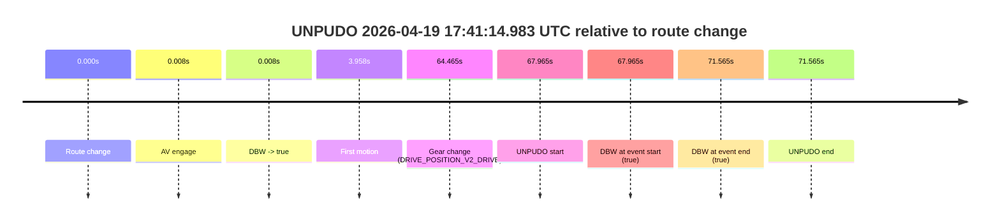
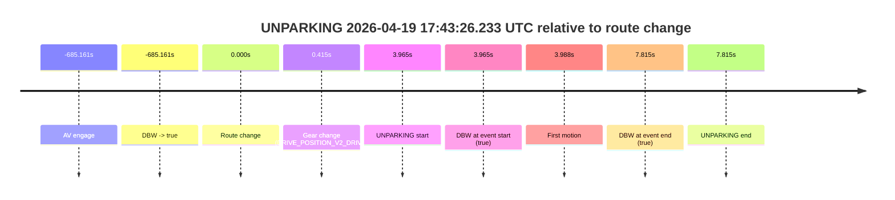

# Run Report: fme20018/2026-04-19--16-45-19--gen2-av-255d5dfa-c814-4ca6-aa46-ed93ed2e25f5

| Field | Value |
|---|---|
| Run ID | `fme20018/2026-04-19--16-45-19--gen2-av-255d5dfa-c814-4ca6-aa46-ed93ed2e25f5` |
| Date | `2026-04-19` |
| Model(s) | `eel-teal-outspoken` |
| Author | `zak` |
| Event count | `8` |

## unpudo 2026-04-19 16:50:14.683 UTC

| Field | Value |
|---|---|
| Model | `eel-teal-outspoken` |
| Author | `zak` |
| Run ID | `fme20018/2026-04-19--16-45-19--gen2-av-255d5dfa-c814-4ca6-aa46-ed93ed2e25f5` |
| Date | `2026-04-19` |
| Time (UTC) | `16:50:14.683` |
| Event type | `unpudo` |
| Disengagement type | `none observed` |
| Route change | `found` |
| Console | [run](https://console.sso.wayve.ai/run/fme20018/2026-04-19--16-45-19--gen2-av-255d5dfa-c814-4ca6-aa46-ed93ed2e25f5?id=&time-unixus=1776617414683300) |
| Foxglove | [segment](https://app.foxglove.dev/wayve-on-prem/p/prj_0dX18KZdVHg1fmmI/view?ds=foxglove-stream&ds.deviceName=fme20018&ds.start=2026-04-19T16%3A48%3A05.068215Z&ds.end=2026-04-19T16%3A50%3A29.183310Z&layoutId=lay_0e7VD4WIKDQGU73Y&time=2026-04-19T16%3A50%3A14.683300Z) |

### Event card: fail

- Fail: the credited unpudo does not stay AV-owned. The event window starts with DBW false, and the maneuver outcome lands outside a clean AV-owned segment.

| Event | Time (UTC) | Delta from route change |
|---|---:|---:|
| Route change | 2026-04-19 16:48:15.068 | `0.000s` |
| First motion | 2026-04-19 16:48:15.076 | `0.008s` |
| AV engage | 2026-04-19 16:48:15.077 | `0.009s` |
| DBW -> true | 2026-04-19 16:48:15.077 | `0.009s` |
| Actual indicator -> left on | 2026-04-19 16:48:50.596 | `35.528s` |
| DBW -> false | 2026-04-19 16:48:51.986 | `36.918s` |
| Actual indicator -> off | 2026-04-19 16:49:14.876 | `59.808s` |
| Actual indicator -> right on | 2026-04-19 16:50:06.016 | `110.948s` |
| Actual indicator -> off | 2026-04-19 16:50:11.976 | `116.908s` |
| Gear change (DRIVE_POSITION_V2_REVERSE) | 2026-04-19 16:50:12.333 | `117.265s` |
| UNPUDO start | 2026-04-19 16:50:14.683 | `119.615s` |
| DBW at event start (false) | 2026-04-19 16:50:14.683 | `119.615s` |
| DBW at event end (false) | 2026-04-19 16:50:19.183 | `124.115s` |
| UNPUDO end | 2026-04-19 16:50:19.183 | `124.115s` |

| Metric | Value |
|---|---|
| Outcome | `fail` |
| Effective failure type | `completed_outside_av` |
| Route change status | `found` |
| DBW at event start | `false` |
| DBW at event end | `false` |
| Predicted gear at AV start | `DRIVE_POSITION_V2_DRIVE` |
| Actual gear at AV start | `DRIVE_POSITION_V2_DRIVE` |
| Predicted gear at event start | `DRIVE_POSITION_V2_DRIVE` |
| Actual gear at event start | `DRIVE_POSITION_V2_REVERSE` |
| Planned indicator direction | `INDICATORS_STATE_V2_OFF` |
| Controller indicator direction | `INDICATORS_STATE_V2_OFF` |
| Actual indicator direction | `INDICATORS_STATE_V2_OFF` |
| Actual indicator at maneuver end | `INDICATORS_STATE_V2_OFF` |
| Driver accel help in AV | `false` |
| Driver accel help timestamp | `n/a` |
| Max accel pedal pct in AV | `0.0%` |
| Max brake pedal pct in AV | `0.0%` |
| Max speed mps in AV | `8.419` |
| Success timing baseline | `route change` |
| Route -> AV | `0.009s` |
| AV -> event start | `119.606s` |
| AV -> first motion | `-0.001s` |
| Success baseline -> event start | `119.615s` |
| Success baseline -> first motion | `0.008s` |
| AV duration before disengagement | `36.909s` |
| Trajectory waypoint count | `36` |
| Driving-plan step count | `11` |

The scored portion starts from the AV-owned window, not from the pre-AV setup. Route-change search in the stopped pre-event segment was `found`, with the baseline therefore set to route change. At the event anchor the model predicts `DRIVE_POSITION_V2_DRIVE` and the actual gear is `DRIVE_POSITION_V2_REVERSE`. The effective model outcome is `fail` because `completed_outside_av.`

### Resolution

| Field | Value |
|---|---|
| Final outcome | `fail` |
| Do we agree with this label? | `yes` |
| Source disengagement type | `none observed` |
| Resolved effective failure type | `completed_outside_av` |
| Confidence | `high` |

## unpudo 2026-04-19 17:01:23.683 UTC

| Field | Value |
|---|---|
| Model | `eel-teal-outspoken` |
| Author | `zak` |
| Run ID | `fme20018/2026-04-19--16-45-19--gen2-av-255d5dfa-c814-4ca6-aa46-ed93ed2e25f5` |
| Date | `2026-04-19` |
| Time (UTC) | `17:01:23.683` |
| Event type | `unpudo` |
| Disengagement type | `none observed` |
| Route change | `found` |
| Console | [run](https://console.sso.wayve.ai/run/fme20018/2026-04-19--16-45-19--gen2-av-255d5dfa-c814-4ca6-aa46-ed93ed2e25f5?id=&time-unixus=1776618083683322) |
| Foxglove | [segment](https://app.foxglove.dev/wayve-on-prem/p/prj_0dX18KZdVHg1fmmI/view?ds=foxglove-stream&ds.deviceName=fme20018&ds.start=2026-04-19T17%3A01%3A03.018269Z&ds.end=2026-04-19T17%3A01%3A47.633305Z&layoutId=lay_0e7VD4WIKDQGU73Y&time=2026-04-19T17%3A01%3A23.683322Z) |

### Event card: fail

- Fail: the credited unpudo does not stay AV-owned. The event window starts with DBW false, and the maneuver outcome lands outside a clean AV-owned segment.

| Event | Time (UTC) | Delta from route change |
|---|---:|---:|
| Route change | 2026-04-19 17:01:13.018 | `0.000s` |
| AV engage | 2026-04-19 17:01:17.686 | `4.668s` |
| DBW -> true | 2026-04-19 17:01:17.686 | `4.668s` |
| Gear change (DRIVE_POSITION_V2_DRIVE) | 2026-04-19 17:01:19.533 | `6.515s` |
| DBW -> false | 2026-04-19 17:01:22.367 | `9.349s` |
| UNPUDO start | 2026-04-19 17:01:23.683 | `10.665s` |
| DBW at event start (false) | 2026-04-19 17:01:23.683 | `10.665s` |
| Actual indicator -> right on | 2026-04-19 17:01:26.756 | `13.738s` |
| DBW at event end (false) | 2026-04-19 17:01:37.633 | `24.615s` |
| UNPUDO end | 2026-04-19 17:01:37.633 | `24.615s` |
| Actual indicator -> off | 2026-04-19 17:01:39.056 | `26.038s` |

| Metric | Value |
|---|---|
| Outcome | `fail` |
| Effective failure type | `not_av_owned` |
| Route change status | `found` |
| DBW at event start | `false` |
| DBW at event end | `false` |
| Predicted gear at AV start | `DRIVE_POSITION_V2_DRIVE` |
| Actual gear at AV start | `DRIVE_POSITION_V2_PARK` |
| Predicted gear at event start | `DRIVE_POSITION_V2_DRIVE` |
| Actual gear at event start | `DRIVE_POSITION_V2_DRIVE` |
| Planned indicator direction | `INDICATORS_STATE_V2_RIGHT_ON` |
| Controller indicator direction | `INDICATORS_STATE_V2_RIGHT_ON` |
| Actual indicator direction | `INDICATORS_STATE_V2_OFF` |
| Actual indicator at maneuver end | `INDICATORS_STATE_V2_RIGHT_ON` |
| Driver accel help in AV | `false` |
| Driver accel help timestamp | `n/a` |
| Max accel pedal pct in AV | `0.0%` |
| Max brake pedal pct in AV | `8.0%` |
| Max speed mps in AV | `0.000` |
| Success timing baseline | `route change` |
| Route -> AV | `4.668s` |
| AV -> event start | `5.997s` |
| AV -> first motion | `n/a` |
| Success baseline -> event start | `10.665s` |
| Success baseline -> first motion | `n/a` |
| AV duration before disengagement | `4.681s` |
| Trajectory waypoint count | `36` |
| Driving-plan step count | `11` |

The scored portion starts from the AV-owned window, not from the pre-AV setup. Route-change search in the stopped pre-event segment was `found`, with the baseline therefore set to route change. At the event anchor the model predicts `DRIVE_POSITION_V2_DRIVE` and the actual gear is `DRIVE_POSITION_V2_DRIVE`. The effective model outcome is `fail` because `not_av_owned.`

### Resolution

| Field | Value |
|---|---|
| Final outcome | `fail` |
| Do we agree with this label? | `yes` |
| Source disengagement type | `none observed` |
| Resolved effective failure type | `not_av_owned` |
| Confidence | `high` |

## unpudo 2026-04-19 17:19:12.583 UTC

| Field | Value |
|---|---|
| Model | `eel-teal-outspoken` |
| Author | `zak` |
| Run ID | `fme20018/2026-04-19--16-45-19--gen2-av-255d5dfa-c814-4ca6-aa46-ed93ed2e25f5` |
| Date | `2026-04-19` |
| Time (UTC) | `17:19:12.583` |
| Event type | `unpudo` |
| Disengagement type | `none observed` |
| Route change | `found` |
| Console | [run](https://console.sso.wayve.ai/run/fme20018/2026-04-19--16-45-19--gen2-av-255d5dfa-c814-4ca6-aa46-ed93ed2e25f5?id=&time-unixus=1776619152583320) |
| Foxglove | [segment](https://app.foxglove.dev/wayve-on-prem/p/prj_0dX18KZdVHg1fmmI/view?ds=foxglove-stream&ds.deviceName=fme20018&ds.start=2026-04-19T17%3A18%3A28.318421Z&ds.end=2026-04-19T17%3A20%3A56.667058Z&layoutId=lay_0e7VD4WIKDQGU73Y&time=2026-04-19T17%3A19%3A12.583320Z) |

### Event card: pass

- Pass: AV owns the credited unpudo from route change through the official unpudo window, the gear state is aligned at the anchor, and the vehicle moves without driver accelerator help in AV.

| Event | Time (UTC) | Delta from route change |
|---|---:|---:|
| Route change | 2026-04-19 17:18:38.318 | `0.000s` |
| AV engage | 2026-04-19 17:19:08.606 | `30.288s` |
| DBW -> true | 2026-04-19 17:19:08.606 | `30.288s` |
| Gear change (DRIVE_POSITION_V2_DRIVE) | 2026-04-19 17:19:09.083 | `30.765s` |
| UNPUDO start | 2026-04-19 17:19:12.583 | `34.265s` |
| DBW at event start (true) | 2026-04-19 17:19:12.583 | `34.265s` |
| First motion | 2026-04-19 17:19:12.636 | `34.319s` |
| DBW at event end (true) | 2026-04-19 17:19:16.383 | `38.065s` |
| UNPUDO end | 2026-04-19 17:19:16.383 | `38.065s` |
| DBW -> false | 2026-04-19 17:20:46.667 | `128.349s` |

| Metric | Value |
|---|---|
| Outcome | `pass` |
| Effective failure type | `none` |
| Route change status | `found` |
| DBW at event start | `true` |
| DBW at event end | `true` |
| Predicted gear at AV start | `DRIVE_POSITION_V2_DRIVE` |
| Actual gear at AV start | `DRIVE_POSITION_V2_PARK` |
| Predicted gear at event start | `DRIVE_POSITION_V2_DRIVE` |
| Actual gear at event start | `DRIVE_POSITION_V2_DRIVE` |
| Planned indicator direction | `INDICATORS_STATE_V2_RIGHT_ON` |
| Controller indicator direction | `INDICATORS_STATE_V2_RIGHT_ON` |
| Actual indicator direction | `INDICATORS_STATE_V2_OFF` |
| Actual indicator at maneuver end | `INDICATORS_STATE_V2_OFF` |
| Driver accel help in AV | `false` |
| Driver accel help timestamp | `n/a` |
| Max accel pedal pct in AV | `0.0%` |
| Max brake pedal pct in AV | `8.0%` |
| Max speed mps in AV | `4.797` |
| Success timing baseline | `route change` |
| Route -> AV | `30.288s` |
| AV -> event start | `3.977s` |
| AV -> first motion | `4.030s` |
| Success baseline -> event start | `34.265s` |
| Success baseline -> first motion | `34.319s` |
| AV duration before disengagement | `98.061s` |
| Trajectory waypoint count | `36` |
| Driving-plan step count | `11` |

The scored portion starts from the AV-owned window, not from the pre-AV setup. Route-change search in the stopped pre-event segment was `found`, with the baseline therefore set to route change. At the event anchor the model predicts `DRIVE_POSITION_V2_DRIVE` and the actual gear is `DRIVE_POSITION_V2_DRIVE`. The effective model outcome is `pass` because `the credited unpudo stays AV-owned through the official unpudo window.`

### Resolution

| Field | Value |
|---|---|
| Final outcome | `pass` |
| Do we agree with this label? | `yes` |
| Source disengagement type | `none observed` |
| Resolved effective failure type | `none` |
| Confidence | `high` |

## unpudo 2026-04-19 17:30:01.583 UTC

| Field | Value |
|---|---|
| Model | `eel-teal-outspoken` |
| Author | `zak` |
| Run ID | `fme20018/2026-04-19--16-45-19--gen2-av-255d5dfa-c814-4ca6-aa46-ed93ed2e25f5` |
| Date | `2026-04-19` |
| Time (UTC) | `17:30:01.583` |
| Event type | `unpudo` |
| Disengagement type | `none observed` |
| Route change | `found` |
| Console | [run](https://console.sso.wayve.ai/run/fme20018/2026-04-19--16-45-19--gen2-av-255d5dfa-c814-4ca6-aa46-ed93ed2e25f5?id=&time-unixus=1776619801583308) |
| Foxglove | [segment](https://app.foxglove.dev/wayve-on-prem/p/prj_0dX18KZdVHg1fmmI/view?ds=foxglove-stream&ds.deviceName=fme20018&ds.start=2026-04-19T17%3A29%3A47.418252Z&ds.end=2026-04-19T17%3A31%3A50.446841Z&layoutId=lay_0e7VD4WIKDQGU73Y&time=2026-04-19T17%3A30%3A01.583308Z) |

### Event card: pass

- Pass: AV owns the credited unpudo from route change through the official unpudo window, the gear state is aligned at the anchor, and the vehicle moves without driver accelerator help in AV.

| Event | Time (UTC) | Delta from route change |
|---|---:|---:|
| Route change | 2026-04-19 17:29:57.418 | `0.000s` |
| AV engage | 2026-04-19 17:29:57.426 | `0.008s` |
| DBW -> true | 2026-04-19 17:29:57.426 | `0.008s` |
| Gear change (DRIVE_POSITION_V2_DRIVE) | 2026-04-19 17:29:57.783 | `0.365s` |
| UNPUDO start | 2026-04-19 17:30:01.583 | `4.165s` |
| DBW at event start (true) | 2026-04-19 17:30:01.583 | `4.165s` |
| First motion | 2026-04-19 17:30:01.616 | `4.198s` |
| DBW at event end (true) | 2026-04-19 17:30:05.933 | `8.515s` |
| UNPUDO end | 2026-04-19 17:30:05.933 | `8.515s` |
| DBW -> false | 2026-04-19 17:31:40.446 | `103.029s` |

| Metric | Value |
|---|---|
| Outcome | `pass` |
| Effective failure type | `none` |
| Route change status | `found` |
| DBW at event start | `true` |
| DBW at event end | `true` |
| Predicted gear at AV start | `DRIVE_POSITION_V2_PARK` |
| Actual gear at AV start | `DRIVE_POSITION_V2_PARK` |
| Predicted gear at event start | `DRIVE_POSITION_V2_DRIVE` |
| Actual gear at event start | `DRIVE_POSITION_V2_DRIVE` |
| Planned indicator direction | `INDICATORS_STATE_V2_RIGHT_ON` |
| Controller indicator direction | `INDICATORS_STATE_V2_RIGHT_ON` |
| Actual indicator direction | `INDICATORS_STATE_V2_OFF` |
| Actual indicator at maneuver end | `INDICATORS_STATE_V2_OFF` |
| Driver accel help in AV | `false` |
| Driver accel help timestamp | `n/a` |
| Max accel pedal pct in AV | `0.0%` |
| Max brake pedal pct in AV | `8.4%` |
| Max speed mps in AV | `4.375` |
| Success timing baseline | `route change` |
| Route -> AV | `0.008s` |
| AV -> event start | `4.157s` |
| AV -> first motion | `4.190s` |
| Success baseline -> event start | `4.165s` |
| Success baseline -> first motion | `4.198s` |
| AV duration before disengagement | `103.020s` |
| Trajectory waypoint count | `36` |
| Driving-plan step count | `11` |

The scored portion starts from the AV-owned window, not from the pre-AV setup. Route-change search in the stopped pre-event segment was `found`, with the baseline therefore set to route change. At the event anchor the model predicts `DRIVE_POSITION_V2_DRIVE` and the actual gear is `DRIVE_POSITION_V2_DRIVE`. The effective model outcome is `pass` because `the credited unpudo stays AV-owned through the official unpudo window.`

### Resolution

| Field | Value |
|---|---|
| Final outcome | `pass` |
| Do we agree with this label? | `yes` |
| Source disengagement type | `none observed` |
| Resolved effective failure type | `none` |
| Confidence | `high` |

## unpudo 2026-04-19 17:32:40.733 UTC

| Field | Value |
|---|---|
| Model | `eel-teal-outspoken` |
| Author | `zak` |
| Run ID | `fme20018/2026-04-19--16-45-19--gen2-av-255d5dfa-c814-4ca6-aa46-ed93ed2e25f5` |
| Date | `2026-04-19` |
| Time (UTC) | `17:32:40.733` |
| Event type | `unpudo` |
| Disengagement type | `none observed` |
| Route change | `found` |
| Console | [run](https://console.sso.wayve.ai/run/fme20018/2026-04-19--16-45-19--gen2-av-255d5dfa-c814-4ca6-aa46-ed93ed2e25f5?id=&time-unixus=1776619960733300) |
| Foxglove | [segment](https://app.foxglove.dev/wayve-on-prem/p/prj_0dX18KZdVHg1fmmI/view?ds=foxglove-stream&ds.deviceName=fme20018&ds.start=2026-04-19T17%3A32%3A26.568285Z&ds.end=2026-04-19T17%3A33%3A06.533302Z&layoutId=lay_0e7VD4WIKDQGU73Y&time=2026-04-19T17%3A32%3A40.733300Z) |

### Event card: pass

- Pass: AV owns the credited unpudo from route change through the official unpudo window, the gear state is aligned at the anchor, and the vehicle moves without driver accelerator help in AV.

| Event | Time (UTC) | Delta from route change |
|---|---:|---:|
| Route change | 2026-04-19 17:32:36.568 | `0.000s` |
| AV engage | 2026-04-19 17:32:36.576 | `0.008s` |
| DBW -> true | 2026-04-19 17:32:36.576 | `0.008s` |
| Gear change (DRIVE_POSITION_V2_DRIVE) | 2026-04-19 17:32:36.883 | `0.315s` |
| UNPUDO start | 2026-04-19 17:32:40.733 | `4.165s` |
| DBW at event start (true) | 2026-04-19 17:32:40.733 | `4.165s` |
| First motion | 2026-04-19 17:32:40.776 | `4.209s` |
| DBW at event end (true) | 2026-04-19 17:32:56.533 | `19.965s` |
| UNPUDO end | 2026-04-19 17:32:56.533 | `19.965s` |

| Metric | Value |
|---|---|
| Outcome | `pass` |
| Effective failure type | `none` |
| Route change status | `found` |
| DBW at event start | `true` |
| DBW at event end | `true` |
| Predicted gear at AV start | `DRIVE_POSITION_V2_PARK` |
| Actual gear at AV start | `DRIVE_POSITION_V2_PARK` |
| Predicted gear at event start | `DRIVE_POSITION_V2_DRIVE` |
| Actual gear at event start | `DRIVE_POSITION_V2_DRIVE` |
| Planned indicator direction | `INDICATORS_STATE_V2_RIGHT_ON` |
| Controller indicator direction | `INDICATORS_STATE_V2_RIGHT_ON` |
| Actual indicator direction | `INDICATORS_STATE_V2_OFF` |
| Actual indicator at maneuver end | `INDICATORS_STATE_V2_OFF` |
| Driver accel help in AV | `false` |
| Driver accel help timestamp | `n/a` |
| Max accel pedal pct in AV | `0.0%` |
| Max brake pedal pct in AV | `8.0%` |
| Max speed mps in AV | `2.392` |
| Success timing baseline | `route change` |
| Route -> AV | `0.008s` |
| AV -> event start | `4.157s` |
| AV -> first motion | `4.200s` |
| Success baseline -> event start | `4.165s` |
| Success baseline -> first motion | `4.209s` |
| AV duration before disengagement | `n/a` |
| Trajectory waypoint count | `37` |
| Driving-plan step count | `11` |

The scored portion starts from the AV-owned window, not from the pre-AV setup. Route-change search in the stopped pre-event segment was `found`, with the baseline therefore set to route change. At the event anchor the model predicts `DRIVE_POSITION_V2_DRIVE` and the actual gear is `DRIVE_POSITION_V2_DRIVE`. The effective model outcome is `pass` because `the credited unpudo stays AV-owned through the official unpudo window.`

### Resolution

| Field | Value |
|---|---|
| Final outcome | `pass` |
| Do we agree with this label? | `yes` |
| Source disengagement type | `none observed` |
| Resolved effective failure type | `none` |
| Confidence | `high` |

## unpudo 2026-04-19 17:37:35.983 UTC

| Field | Value |
|---|---|
| Model | `eel-teal-outspoken` |
| Author | `zak` |
| Run ID | `fme20018/2026-04-19--16-45-19--gen2-av-255d5dfa-c814-4ca6-aa46-ed93ed2e25f5` |
| Date | `2026-04-19` |
| Time (UTC) | `17:37:35.983` |
| Event type | `unpudo` |
| Disengagement type | `none observed` |
| Route change | `found` |
| Console | [run](https://console.sso.wayve.ai/run/fme20018/2026-04-19--16-45-19--gen2-av-255d5dfa-c814-4ca6-aa46-ed93ed2e25f5?id=&time-unixus=1776620255983312) |
| Foxglove | [segment](https://app.foxglove.dev/wayve-on-prem/p/prj_0dX18KZdVHg1fmmI/view?ds=foxglove-stream&ds.deviceName=fme20018&ds.start=2026-04-19T17%3A37%3A21.968266Z&ds.end=2026-04-19T17%3A37%3A49.783304Z&layoutId=lay_0e7VD4WIKDQGU73Y&time=2026-04-19T17%3A37%3A35.983312Z) |

### Event card: pass

- Pass: AV owns the credited unpudo from route change through the official unpudo window, the gear state is aligned at the anchor, and the vehicle moves without driver accelerator help in AV.

| Event | Time (UTC) | Delta from route change |
|---|---:|---:|
| Route change | 2026-04-19 17:37:31.968 | `0.000s` |
| AV engage | 2026-04-19 17:37:31.976 | `0.008s` |
| DBW -> true | 2026-04-19 17:37:31.976 | `0.008s` |
| Gear change (DRIVE_POSITION_V2_DRIVE) | 2026-04-19 17:37:32.383 | `0.415s` |
| UNPUDO start | 2026-04-19 17:37:35.983 | `4.015s` |
| DBW at event start (true) | 2026-04-19 17:37:35.983 | `4.015s` |
| First motion | 2026-04-19 17:37:36.016 | `4.048s` |
| DBW at event end (true) | 2026-04-19 17:37:39.783 | `7.815s` |
| UNPUDO end | 2026-04-19 17:37:39.783 | `7.815s` |

| Metric | Value |
|---|---|
| Outcome | `pass` |
| Effective failure type | `none` |
| Route change status | `found` |
| DBW at event start | `true` |
| DBW at event end | `true` |
| Predicted gear at AV start | `DRIVE_POSITION_V2_PARK` |
| Actual gear at AV start | `DRIVE_POSITION_V2_PARK` |
| Predicted gear at event start | `DRIVE_POSITION_V2_DRIVE` |
| Actual gear at event start | `DRIVE_POSITION_V2_DRIVE` |
| Planned indicator direction | `INDICATORS_STATE_V2_RIGHT_ON` |
| Controller indicator direction | `INDICATORS_STATE_V2_RIGHT_ON` |
| Actual indicator direction | `INDICATORS_STATE_V2_OFF` |
| Actual indicator at maneuver end | `INDICATORS_STATE_V2_OFF` |
| Driver accel help in AV | `false` |
| Driver accel help timestamp | `n/a` |
| Max accel pedal pct in AV | `0.0%` |
| Max brake pedal pct in AV | `9.5%` |
| Max speed mps in AV | `5.094` |
| Success timing baseline | `route change` |
| Route -> AV | `0.008s` |
| AV -> event start | `4.007s` |
| AV -> first motion | `4.040s` |
| Success baseline -> event start | `4.015s` |
| Success baseline -> first motion | `4.048s` |
| AV duration before disengagement | `n/a` |
| Trajectory waypoint count | `36` |
| Driving-plan step count | `11` |

The scored portion starts from the AV-owned window, not from the pre-AV setup. Route-change search in the stopped pre-event segment was `found`, with the baseline therefore set to route change. At the event anchor the model predicts `DRIVE_POSITION_V2_DRIVE` and the actual gear is `DRIVE_POSITION_V2_DRIVE`. The effective model outcome is `pass` because `the credited unpudo stays AV-owned through the official unpudo window.`

### Resolution

| Field | Value |
|---|---|
| Final outcome | `pass` |
| Do we agree with this label? | `yes` |
| Source disengagement type | `none observed` |
| Resolved effective failure type | `none` |
| Confidence | `high` |

## unpudo 2026-04-19 17:41:14.983 UTC

| Field | Value |
|---|---|
| Model | `eel-teal-outspoken` |
| Author | `zak` |
| Run ID | `fme20018/2026-04-19--16-45-19--gen2-av-255d5dfa-c814-4ca6-aa46-ed93ed2e25f5` |
| Date | `2026-04-19` |
| Time (UTC) | `17:41:14.983` |
| Event type | `unpudo` |
| Disengagement type | `none observed` |
| Route change | `found` |
| Console | [run](https://console.sso.wayve.ai/run/fme20018/2026-04-19--16-45-19--gen2-av-255d5dfa-c814-4ca6-aa46-ed93ed2e25f5?id=&time-unixus=1776620474983309) |
| Foxglove | [segment](https://app.foxglove.dev/wayve-on-prem/p/prj_0dX18KZdVHg1fmmI/view?ds=foxglove-stream&ds.deviceName=fme20018&ds.start=2026-04-19T17%3A39%3A57.018255Z&ds.end=2026-04-19T17%3A41%3A28.583304Z&layoutId=lay_0e7VD4WIKDQGU73Y&time=2026-04-19T17%3A41%3A14.983309Z) |

### Event card: pass

- Pass: AV owns the credited unpudo from route change through the official unpudo window, the gear state is aligned at the anchor, and the vehicle moves without driver accelerator help in AV.

| Event | Time (UTC) | Delta from route change |
|---|---:|---:|
| Route change | 2026-04-19 17:40:07.018 | `0.000s` |
| AV engage | 2026-04-19 17:40:07.026 | `0.008s` |
| DBW -> true | 2026-04-19 17:40:07.026 | `0.008s` |
| First motion | 2026-04-19 17:40:10.976 | `3.958s` |
| Gear change (DRIVE_POSITION_V2_DRIVE) | 2026-04-19 17:41:11.483 | `64.465s` |
| UNPUDO start | 2026-04-19 17:41:14.983 | `67.965s` |
| DBW at event start (true) | 2026-04-19 17:41:14.983 | `67.965s` |
| DBW at event end (true) | 2026-04-19 17:41:18.583 | `71.565s` |
| UNPUDO end | 2026-04-19 17:41:18.583 | `71.565s` |

| Metric | Value |
|---|---|
| Outcome | `pass` |
| Effective failure type | `none` |
| Route change status | `found` |
| DBW at event start | `true` |
| DBW at event end | `true` |
| Predicted gear at AV start | `DRIVE_POSITION_V2_PARK` |
| Actual gear at AV start | `DRIVE_POSITION_V2_PARK` |
| Predicted gear at event start | `DRIVE_POSITION_V2_DRIVE` |
| Actual gear at event start | `DRIVE_POSITION_V2_DRIVE` |
| Planned indicator direction | `INDICATORS_STATE_V2_RIGHT_ON` |
| Controller indicator direction | `INDICATORS_STATE_V2_RIGHT_ON` |
| Actual indicator direction | `INDICATORS_STATE_V2_OFF` |
| Actual indicator at maneuver end | `INDICATORS_STATE_V2_OFF` |
| Driver accel help in AV | `false` |
| Driver accel help timestamp | `n/a` |
| Max accel pedal pct in AV | `0.0%` |
| Max brake pedal pct in AV | `9.3%` |
| Max speed mps in AV | `7.878` |
| Success timing baseline | `route change` |
| Route -> AV | `0.008s` |
| AV -> event start | `67.957s` |
| AV -> first motion | `3.950s` |
| Success baseline -> event start | `67.965s` |
| Success baseline -> first motion | `3.958s` |
| AV duration before disengagement | `n/a` |
| Trajectory waypoint count | `36` |
| Driving-plan step count | `11` |

The scored portion starts from the AV-owned window, not from the pre-AV setup. Route-change search in the stopped pre-event segment was `found`, with the baseline therefore set to route change. At the event anchor the model predicts `DRIVE_POSITION_V2_DRIVE` and the actual gear is `DRIVE_POSITION_V2_DRIVE`. The effective model outcome is `pass` because `the credited unpudo stays AV-owned through the official unpudo window.`

### Resolution

| Field | Value |
|---|---|
| Final outcome | `pass` |
| Do we agree with this label? | `yes` |
| Source disengagement type | `none observed` |
| Resolved effective failure type | `none` |
| Confidence | `high` |

## unparking 2026-04-19 17:43:26.233 UTC

| Field | Value |
|---|---|
| Model | `eel-teal-outspoken` |
| Author | `zak` |
| Run ID | `fme20018/2026-04-19--16-45-19--gen2-av-255d5dfa-c814-4ca6-aa46-ed93ed2e25f5` |
| Date | `2026-04-19` |
| Time (UTC) | `17:43:26.233` |
| Event type | `unparking` |
| Disengagement type | `none observed` |
| Route change | `found` |
| Console | [run](https://console.sso.wayve.ai/run/fme20018/2026-04-19--16-45-19--gen2-av-255d5dfa-c814-4ca6-aa46-ed93ed2e25f5?id=&time-unixus=1776620606233307) |
| Foxglove | [segment](https://app.foxglove.dev/wayve-on-prem/p/prj_0dX18KZdVHg1fmmI/view?ds=foxglove-stream&ds.deviceName=fme20018&ds.start=2026-04-19T17%3A31%3A47.107494Z&ds.end=2026-04-19T17%3A43%3A40.083306Z&layoutId=lay_0e7VD4WIKDQGU73Y&time=2026-04-19T17%3A43%3A26.233307Z) |

### Event card: pass

- Pass: AV owns the credited unparking through the official event window, the gear state is aligned at the anchor, and the vehicle moves without driver accelerator help in AV.

| Event | Time (UTC) | Delta from route change |
|---|---:|---:|
| AV engage | 2026-04-19 17:31:57.107 | `-685.161s` |
| DBW -> true | 2026-04-19 17:31:57.107 | `-685.161s` |
| Route change | 2026-04-19 17:43:22.268 | `0.000s` |
| Gear change (DRIVE_POSITION_V2_DRIVE) | 2026-04-19 17:43:22.683 | `0.415s` |
| UNPARKING start | 2026-04-19 17:43:26.233 | `3.965s` |
| DBW at event start (true) | 2026-04-19 17:43:26.233 | `3.965s` |
| First motion | 2026-04-19 17:43:26.256 | `3.988s` |
| DBW at event end (true) | 2026-04-19 17:43:30.083 | `7.815s` |
| UNPARKING end | 2026-04-19 17:43:30.083 | `7.815s` |

| Metric | Value |
|---|---|
| Outcome | `pass` |
| Effective failure type | `none` |
| Route change status | `found` |
| DBW at event start | `true` |
| DBW at event end | `true` |
| Predicted gear at AV start | `DRIVE_POSITION_V2_DRIVE` |
| Actual gear at AV start | `DRIVE_POSITION_V2_DRIVE` |
| Predicted gear at event start | `DRIVE_POSITION_V2_DRIVE` |
| Actual gear at event start | `DRIVE_POSITION_V2_DRIVE` |
| Planned indicator direction | `INDICATORS_STATE_V2_RIGHT_ON` |
| Controller indicator direction | `INDICATORS_STATE_V2_RIGHT_ON` |
| Actual indicator direction | `INDICATORS_STATE_V2_OFF` |
| Actual indicator at maneuver end | `INDICATORS_STATE_V2_OFF` |
| Driver accel help in AV | `false` |
| Driver accel help timestamp | `n/a` |
| Max accel pedal pct in AV | `0.0%` |
| Max brake pedal pct in AV | `0.0%` |
| Max speed mps in AV | `4.600` |
| Success timing baseline | `AV start` |
| Route -> AV | `-685.161s` |
| AV -> event start | `689.126s` |
| AV -> first motion | `689.149s` |
| Success baseline -> event start | `689.126s` |
| Success baseline -> first motion | `689.149s` |
| AV duration before disengagement | `n/a` |
| Trajectory waypoint count | `37` |
| Driving-plan step count | `11` |

The scored portion starts from the AV-owned window, not from the pre-AV setup. Route-change search in the stopped pre-event segment was `found`, with the baseline therefore set to route change. At the event anchor the model predicts `DRIVE_POSITION_V2_DRIVE` and the actual gear is `DRIVE_POSITION_V2_DRIVE`. The effective model outcome is `pass` because `the credited maneuver stays AV-owned through the official event end.`

### Resolution

| Field | Value |
|---|---|
| Final outcome | `pass` |
| Do we agree with this label? | `yes` |
| Source disengagement type | `none observed` |
| Resolved effective failure type | `none` |
| Confidence | `high` |
