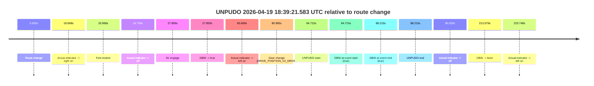
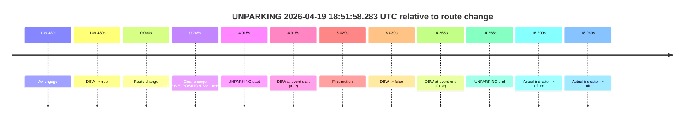

# Run Report: fme20018/2026-04-19--18-22-35--gen2-av-80f1f8af-a341-40a7-8295-06ab766fba2f

| Field | Value |
|---|---|
| Run ID | `fme20018/2026-04-19--18-22-35--gen2-av-80f1f8af-a341-40a7-8295-06ab766fba2f` |
| Date | `2026-04-19` |
| Model(s) | `eel-teal-outspoken` |
| Author | `zak` |
| Event count | `2` |

## unpudo 2026-04-19 18:39:21.583 UTC

| Field | Value |
|---|---|
| Model | `eel-teal-outspoken` |
| Author | `zak` |
| Run ID | `fme20018/2026-04-19--18-22-35--gen2-av-80f1f8af-a341-40a7-8295-06ab766fba2f` |
| Date | `2026-04-19` |
| Time (UTC) | `18:39:21.583` |
| Event type | `unpudo` |
| Disengagement type | `none observed` |
| Route change | `found` |
| Console | [run](https://console.sso.wayve.ai/run/fme20018/2026-04-19--18-22-35--gen2-av-80f1f8af-a341-40a7-8295-06ab766fba2f?id=&time-unixus=1776623961583306) |
| Foxglove | [segment](https://app.foxglove.dev/wayve-on-prem/p/prj_0dX18KZdVHg1fmmI/view?ds=foxglove-stream&ds.deviceName=fme20018&ds.start=2026-04-19T18%3A37%3A46.868248Z&ds.end=2026-04-19T18%3A41%3A40.447305Z&layoutId=lay_0e7VD4WIKDQGU73Y&time=2026-04-19T18%3A39%3A21.583306Z) |

### Event card: pass

- Pass: AV owns the credited unpudo from route change through the official unpudo window, the gear state is aligned at the anchor, and the vehicle moves without driver accelerator help in AV.

| Event | Time (UTC) | Delta from route change |
|---|---:|---:|
| Route change | 2026-04-19 18:37:56.868 | `0.000s` |
| Actual indicator -> right on | 2026-04-19 18:38:15.436 | `18.568s` |
| First motion | 2026-04-19 18:38:17.836 | `20.968s` |
| Actual indicator -> off | 2026-04-19 18:38:21.576 | `24.709s` |
| AV engage | 2026-04-19 18:38:24.727 | `27.859s` |
| DBW -> true | 2026-04-19 18:38:24.727 | `27.859s` |
| Actual indicator -> left on | 2026-04-19 18:39:02.537 | `65.669s` |
| Gear change (DRIVE_POSITION_V2_DRIVE) | 2026-04-19 18:39:17.833 | `80.965s` |
| UNPUDO start | 2026-04-19 18:39:21.583 | `84.715s` |
| DBW at event start (true) | 2026-04-19 18:39:21.583 | `84.715s` |
| DBW at event end (true) | 2026-04-19 18:39:25.083 | `88.215s` |
| UNPUDO end | 2026-04-19 18:39:25.083 | `88.215s` |
| Actual indicator -> off | 2026-04-19 18:39:26.896 | `90.028s` |
| DBW -> false | 2026-04-19 18:41:30.447 | `213.579s` |
| Actual indicator -> left on | 2026-04-19 18:41:40.616 | `223.748s` |

| Metric | Value |
|---|---|
| Outcome | `pass` |
| Effective failure type | `none` |
| Route change status | `found` |
| DBW at event start | `true` |
| DBW at event end | `true` |
| Predicted gear at AV start | `DRIVE_POSITION_V2_DRIVE` |
| Actual gear at AV start | `DRIVE_POSITION_V2_DRIVE` |
| Predicted gear at event start | `DRIVE_POSITION_V2_DRIVE` |
| Actual gear at event start | `DRIVE_POSITION_V2_DRIVE` |
| Planned indicator direction | `INDICATORS_STATE_V2_RIGHT_ON` |
| Controller indicator direction | `INDICATORS_STATE_V2_RIGHT_ON` |
| Actual indicator direction | `INDICATORS_STATE_V2_LEFT_ON` |
| Actual indicator at maneuver end | `INDICATORS_STATE_V2_LEFT_ON` |
| Driver accel help in AV | `false` |
| Driver accel help timestamp | `n/a` |
| Max accel pedal pct in AV | `0.0%` |
| Max brake pedal pct in AV | `17.9%` |
| Max speed mps in AV | `8.222` |
| Success timing baseline | `route change` |
| Route -> AV | `27.859s` |
| AV -> event start | `56.856s` |
| AV -> first motion | `-6.891s` |
| Success baseline -> event start | `84.715s` |
| Success baseline -> first motion | `20.968s` |
| AV duration before disengagement | `185.720s` |
| Trajectory waypoint count | `36` |
| Driving-plan step count | `11` |

The scored portion starts from the AV-owned window, not from the pre-AV setup. Route-change search in the stopped pre-event segment was `found`, with the baseline therefore set to route change. At the event anchor the model predicts `DRIVE_POSITION_V2_DRIVE` and the actual gear is `DRIVE_POSITION_V2_DRIVE`. The effective model outcome is `pass` because `the credited unpudo stays AV-owned through the official unpudo window.`

### Resolution

| Field | Value |
|---|---|
| Final outcome | `pass` |
| Do we agree with this label? | `yes` |
| Source disengagement type | `none observed` |
| Resolved effective failure type | `none` |
| Confidence | `high` |

## unparking 2026-04-19 18:51:58.283 UTC

| Field | Value |
|---|---|
| Model | `eel-teal-outspoken` |
| Author | `zak` |
| Run ID | `fme20018/2026-04-19--18-22-35--gen2-av-80f1f8af-a341-40a7-8295-06ab766fba2f` |
| Date | `2026-04-19` |
| Time (UTC) | `18:51:58.283` |
| Event type | `unparking` |
| Disengagement type | `failed_to_slow` |
| Route change | `found` |
| Console | [run](https://console.sso.wayve.ai/run/fme20018/2026-04-19--18-22-35--gen2-av-80f1f8af-a341-40a7-8295-06ab766fba2f?id=&time-unixus=1776624718283306) |
| Foxglove | [segment](https://app.foxglove.dev/wayve-on-prem/p/prj_0dX18KZdVHg1fmmI/view?ds=foxglove-stream&ds.deviceName=fme20018&ds.start=2026-04-19T18%3A49%3A56.888401Z&ds.end=2026-04-19T18%3A52%3A17.633297Z&layoutId=lay_0e7VD4WIKDQGU73Y&time=2026-04-19T18%3A51%3A58.283306Z) |

### Event card: fail

- Fail: AV owns part of the segment, but the event still resolves as a model-performance failure under the AV-only scoring rule.

| Event | Time (UTC) | Delta from route change |
|---|---:|---:|
| AV engage | 2026-04-19 18:50:06.888 | `-106.480s` |
| DBW -> true | 2026-04-19 18:50:06.888 | `-106.480s` |
| Route change | 2026-04-19 18:51:53.368 | `0.000s` |
| Gear change (DRIVE_POSITION_V2_DRIVE) | 2026-04-19 18:51:53.633 | `0.265s` |
| UNPARKING start | 2026-04-19 18:51:58.283 | `4.915s` |
| DBW at event start (true) | 2026-04-19 18:51:58.283 | `4.915s` |
| First motion | 2026-04-19 18:51:58.396 | `5.029s` |
| DBW -> false | 2026-04-19 18:52:01.407 | `8.039s` |
| DBW at event end (false) | 2026-04-19 18:52:07.633 | `14.265s` |
| UNPARKING end | 2026-04-19 18:52:07.633 | `14.265s` |
| Actual indicator -> left on | 2026-04-19 18:52:09.577 | `16.209s` |
| Actual indicator -> off | 2026-04-19 18:52:12.337 | `18.969s` |

| Metric | Value |
|---|---|
| Outcome | `fail` |
| Effective failure type | `failed_to_slow` |
| Route change status | `found` |
| DBW at event start | `true` |
| DBW at event end | `false` |
| Predicted gear at AV start | `DRIVE_POSITION_V2_DRIVE` |
| Actual gear at AV start | `DRIVE_POSITION_V2_DRIVE` |
| Predicted gear at event start | `DRIVE_POSITION_V2_DRIVE` |
| Actual gear at event start | `DRIVE_POSITION_V2_DRIVE` |
| Planned indicator direction | `INDICATORS_STATE_V2_RIGHT_ON` |
| Controller indicator direction | `INDICATORS_STATE_V2_RIGHT_ON` |
| Actual indicator direction | `INDICATORS_STATE_V2_OFF` |
| Actual indicator at maneuver end | `INDICATORS_STATE_V2_OFF` |
| Driver accel help in AV | `false` |
| Driver accel help timestamp | `n/a` |
| Max accel pedal pct in AV | `0.0%` |
| Max brake pedal pct in AV | `0.0%` |
| Max speed mps in AV | `1.125` |
| Success timing baseline | `AV start` |
| Route -> AV | `-106.480s` |
| AV -> event start | `111.395s` |
| AV -> first motion | `111.509s` |
| Success baseline -> event start | `111.395s` |
| Success baseline -> first motion | `111.509s` |
| AV duration before disengagement | `114.519s` |
| Trajectory waypoint count | `36` |
| Driving-plan step count | `11` |

The scored portion starts from the AV-owned window, not from the pre-AV setup. Route-change search in the stopped pre-event segment was `found`, with the baseline therefore set to route change. At the event anchor the model predicts `DRIVE_POSITION_V2_DRIVE` and the actual gear is `DRIVE_POSITION_V2_DRIVE`. The effective model outcome is `fail` because `failed_to_slow.`

### Resolution

| Field | Value |
|---|---|
| Final outcome | `fail` |
| Do we agree with this label? | `yes` |
| Source disengagement type | `failed_to_slow` |
| Resolved effective failure type | `failed_to_slow` |
| Confidence | `high` |
