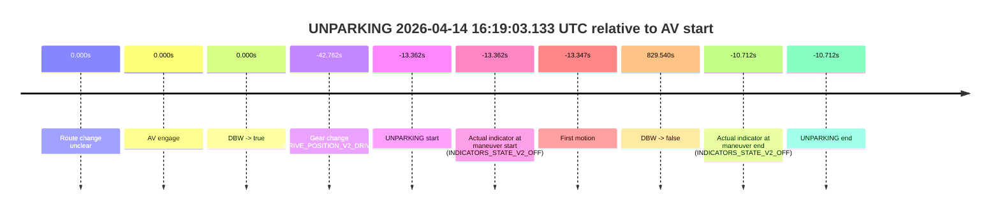
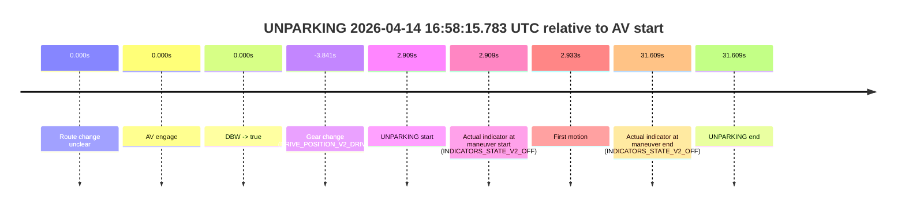

# Run Report: fme20023/2026-04-14--15-39-41--gen2-av-32f289ea-c02f-49dc-8a18-f0fc2cdf2801

| Field | Value |
|---|---|
| Run ID | `fme20023/2026-04-14--15-39-41--gen2-av-32f289ea-c02f-49dc-8a18-f0fc2cdf2801` |
| Date | `2026-04-14` |
| Model(s) | `apricot-crocodile-uproarious` |
| Author | `guy.geva` |
| Event count | `2` |

## unparking 2026-04-14 16:19:03.133 UTC

| Field | Value |
|---|---|
| Model | `apricot-crocodile-uproarious` |
| Author | `guy.geva` |
| Run ID | `fme20023/2026-04-14--15-39-41--gen2-av-32f289ea-c02f-49dc-8a18-f0fc2cdf2801` |
| Date | `2026-04-14` |
| Time (UTC) | `16:19:03.133` |
| Event type | `unparking` |
| Disengagement type | `failed_to_accelerate` |
| Route change | `unclear` |
| Console | [run](https://console.sso.wayve.ai/run/fme20023/2026-04-14--15-39-41--gen2-av-32f289ea-c02f-49dc-8a18-f0fc2cdf2801?id=&time-unixus=1776183543133307) |
| Foxglove | [segment](https://app.foxglove.dev/wayve-on-prem/p/prj_0dX18KZdVHg1fmmI/view?ds=foxglove-stream&ds.deviceName=fme20023&ds.start=2026-04-14T16%3A18%3A23.733308Z&ds.end=2026-04-14T16%3A33%3A16.035039Z&layoutId=lay_0e7VD4WIKDQGU73Y&time=2026-04-14T16%3A19%3A03.133307Z) |

### Event card: fail

- Fail: AV owns part of the segment, but the event still resolves as a model-performance failure under the AV-only scoring rule.

| Event | Time (UTC) | Delta from AV start |
|---|---:|---:|
| Route change unclear | 2026-04-14 16:19:16.494 | `0.000s` |
| AV engage | 2026-04-14 16:19:16.494 | `0.000s` |
| DBW -> true | 2026-04-14 16:19:16.494 | `0.000s` |
| Gear change (DRIVE_POSITION_V2_DRIVE) | 2026-04-14 16:18:33.733 | `-42.762s` |
| UNPARKING start | 2026-04-14 16:19:03.133 | `-13.362s` |
| Actual indicator at maneuver start (INDICATORS_STATE_V2_OFF) | 2026-04-14 16:19:03.133 | `-13.362s` |
| First motion | 2026-04-14 16:19:03.147 | `-13.347s` |
| DBW -> false | 2026-04-14 16:33:06.035 | `829.540s` |
| Actual indicator at maneuver end (INDICATORS_STATE_V2_OFF) | 2026-04-14 16:19:05.783 | `-10.712s` |
| UNPARKING end | 2026-04-14 16:19:05.783 | `-10.712s` |

| Metric | Value |
|---|---|
| Outcome | `fail` |
| Effective failure type | `failed_to_accelerate` |
| Route change status | `unclear` |
| DBW at event start | `false` |
| DBW at event end | `false` |
| Predicted gear at AV start | `DRIVE_POSITION_V2_DRIVE` |
| Actual gear at AV start | `DRIVE_POSITION_V2_DRIVE` |
| Predicted gear at event start | `DRIVE_POSITION_V2_DRIVE` |
| Actual gear at event start | `DRIVE_POSITION_V2_DRIVE` |
| Planned indicator direction | `INDICATORS_STATE_V2_OFF` |
| Controller indicator direction | `INDICATORS_STATE_V2_OFF` |
| Actual indicator direction | `INDICATORS_STATE_V2_OFF` |
| Actual indicator at maneuver end | `INDICATORS_STATE_V2_OFF` |
| Driver accel help in AV | `false` |
| Driver accel help timestamp | `n/a` |
| Max accel pedal pct in AV | `0.0%` |
| Max brake pedal pct in AV | `0.0%` |
| Max speed mps in AV | `0.000` |
| Route -> AV | `n/a` |
| AV -> event start | `-13.362s` |
| AV -> first motion | `-13.347s` |
| AV duration before disengagement | `829.540s` |
| Trajectory waypoint count | `35` |
| Driving-plan step count | `11` |

The scored portion starts from the AV-owned window, not from the pre-AV setup. Route-change search in the stopped pre-event segment was `unclear`, with the baseline therefore set to AV start. At the event anchor the model predicts `DRIVE_POSITION_V2_DRIVE` and the actual gear is `DRIVE_POSITION_V2_DRIVE`. The effective model outcome is `fail` because `failed_to_accelerate`.

### Resolution

| Field | Value |
|---|---|
| Final outcome | `fail` |
| Do we agree with this label? | `yes` |
| Source disengagement type | `failed_to_accelerate` |
| Resolved effective failure type | `failed_to_accelerate` |
| Confidence | `medium` |

## unparking 2026-04-14 16:58:15.783 UTC

| Field | Value |
|---|---|
| Model | `apricot-crocodile-uproarious` |
| Author | `guy.geva` |
| Run ID | `fme20023/2026-04-14--15-39-41--gen2-av-32f289ea-c02f-49dc-8a18-f0fc2cdf2801` |
| Date | `2026-04-14` |
| Time (UTC) | `16:58:15.783` |
| Event type | `unparking` |
| Disengagement type | `none observed` |
| Route change | `unclear` |
| Console | [run](https://console.sso.wayve.ai/run/fme20023/2026-04-14--15-39-41--gen2-av-32f289ea-c02f-49dc-8a18-f0fc2cdf2801?id=&time-unixus=1776185895783318) |
| Foxglove | [segment](https://app.foxglove.dev/wayve-on-prem/p/prj_0dX18KZdVHg1fmmI/view?ds=foxglove-stream&ds.deviceName=fme20023&ds.start=2026-04-14T16%3A57%3A59.033314Z&ds.end=2026-04-14T16%3A58%3A54.483315Z&layoutId=lay_0e7VD4WIKDQGU73Y&time=2026-04-14T16%3A58%3A15.783318Z) |

### Event card: pass

- Pass: AV owns the credited unparking through the official event window, the gear state is aligned at the anchor, and the vehicle moves without driver accelerator help in AV.

| Event | Time (UTC) | Delta from AV start |
|---|---:|---:|
| Route change unclear | 2026-04-14 16:58:12.874 | `0.000s` |
| AV engage | 2026-04-14 16:58:12.874 | `0.000s` |
| DBW -> true | 2026-04-14 16:58:12.874 | `0.000s` |
| Gear change (DRIVE_POSITION_V2_DRIVE) | 2026-04-14 16:58:09.033 | `-3.841s` |
| UNPARKING start | 2026-04-14 16:58:15.783 | `2.909s` |
| Actual indicator at maneuver start (INDICATORS_STATE_V2_OFF) | 2026-04-14 16:58:15.783 | `2.909s` |
| First motion | 2026-04-14 16:58:15.807 | `2.933s` |
| Actual indicator at maneuver end (INDICATORS_STATE_V2_OFF) | 2026-04-14 16:58:44.483 | `31.609s` |
| UNPARKING end | 2026-04-14 16:58:44.483 | `31.609s` |

| Metric | Value |
|---|---|
| Outcome | `pass` |
| Effective failure type | `none` |
| Route change status | `unclear` |
| DBW at event start | `true` |
| DBW at event end | `true` |
| Predicted gear at AV start | `DRIVE_POSITION_V2_DRIVE` |
| Actual gear at AV start | `DRIVE_POSITION_V2_DRIVE` |
| Predicted gear at event start | `DRIVE_POSITION_V2_DRIVE` |
| Actual gear at event start | `DRIVE_POSITION_V2_DRIVE` |
| Planned indicator direction | `INDICATORS_STATE_V2_OFF` |
| Controller indicator direction | `INDICATORS_STATE_V2_OFF` |
| Actual indicator direction | `INDICATORS_STATE_V2_OFF` |
| Actual indicator at maneuver end | `INDICATORS_STATE_V2_OFF` |
| Driver accel help in AV | `false` |
| Driver accel help timestamp | `n/a` |
| Max accel pedal pct in AV | `0.0%` |
| Max brake pedal pct in AV | `8.0%` |
| Max speed mps in AV | `2.242` |
| Route -> AV | `n/a` |
| AV -> event start | `2.909s` |
| AV -> first motion | `2.933s` |
| AV duration before disengagement | `n/a` |
| Trajectory waypoint count | `36` |
| Driving-plan step count | `11` |

The scored portion starts from the AV-owned window, not from the pre-AV setup. Route-change search in the stopped pre-event segment was `unclear`, with the baseline therefore set to AV start. At the event anchor the model predicts `DRIVE_POSITION_V2_DRIVE` and the actual gear is `DRIVE_POSITION_V2_DRIVE`. The effective model outcome is `pass` because `the credited maneuver stays AV-owned through the official event end`.

### Resolution

| Field | Value |
|---|---|
| Final outcome | `pass` |
| Do we agree with this label? | `yes` |
| Source disengagement type | `none observed` |
| Resolved effective failure type | `none` |
| Confidence | `medium` |
