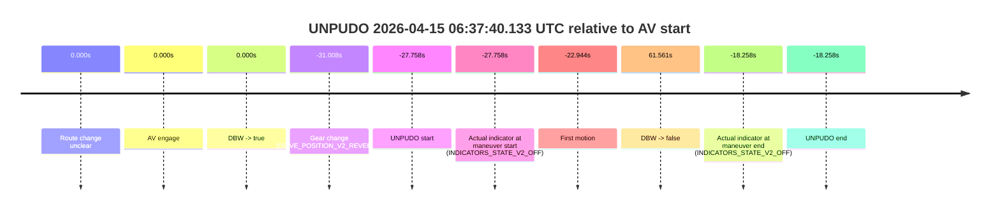
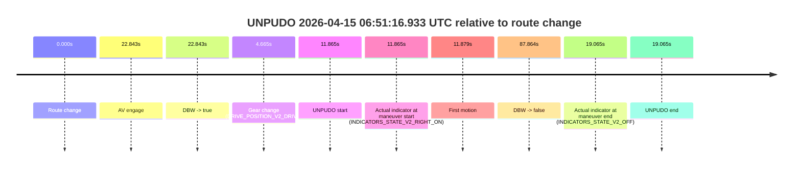
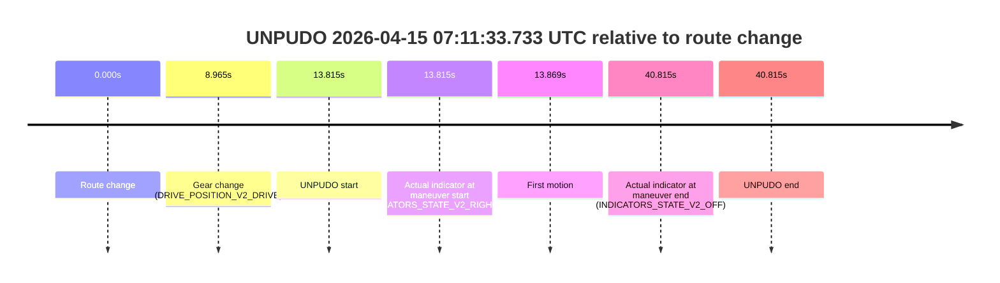
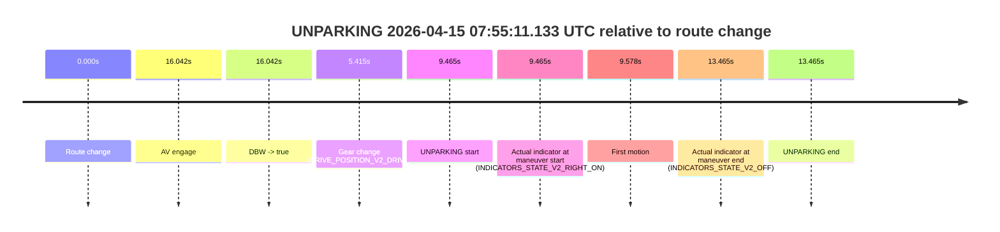

# Run Report: fme20029/2026-04-15--06-18-24--gen2-av-0130e302-8b84-437c-a676-5e0107043edb

| Field | Value |
|---|---|
| Run ID | `fme20029/2026-04-15--06-18-24--gen2-av-0130e302-8b84-437c-a676-5e0107043edb` |
| Date | `2026-04-15` |
| Model(s) | `plum-timeless-beaver` |
| Author | `peng.tang` |
| Event count | `17` |

## unpudo 2026-04-15 06:22:21.833 UTC

| Field | Value |
|---|---|
| Model | `plum-timeless-beaver` |
| Author | `peng.tang` |
| Run ID | `fme20029/2026-04-15--06-18-24--gen2-av-0130e302-8b84-437c-a676-5e0107043edb` |
| Date | `2026-04-15` |
| Time (UTC) | `06:22:21.833` |
| Event type | `unpudo` |
| Disengagement type | `none observed` |
| Route change | `unclear` |
| Console | [run](https://console.sso.wayve.ai/run/fme20029/2026-04-15--06-18-24--gen2-av-0130e302-8b84-437c-a676-5e0107043edb?id=&time-unixus=1776234141833302) |
| Foxglove | [segment](https://app.foxglove.dev/wayve-on-prem/p/prj_0dX18KZdVHg1fmmI/view?ds=foxglove-stream&ds.deviceName=fme20029&ds.start=2026-04-15T06%3A22%3A11.783302Z&ds.end=2026-04-15T06%3A23%3A45.851562Z&layoutId=lay_0e7VD4WIKDQGU73Y&time=2026-04-15T06%3A22%3A21.833302Z) |

### Event card: non-av

- Non-AV: there is no AV-owned portion anywhere inside the detected unpudo timeline, so it is kept for coverage but excluded from model success / failure scoring.

| Event | Time (UTC) | Delta from AV start |
|---|---:|---:|
| Route change unclear | 2026-04-15 06:22:45.672 | `0.000s` |
| AV engage | 2026-04-15 06:22:45.672 | `0.000s` |
| DBW -> true | 2026-04-15 06:22:45.672 | `0.000s` |
| Gear change (DRIVE_POSITION_V2_REVERSE) | 2026-04-15 06:22:21.783 | `-23.889s` |
| UNPUDO start | 2026-04-15 06:22:21.833 | `-23.839s` |
| Actual indicator at maneuver start (INDICATORS_STATE_V2_OFF) | 2026-04-15 06:22:21.833 | `-23.839s` |
| First motion | 2026-04-15 06:22:34.546 | `-11.125s` |
| DBW -> false | 2026-04-15 06:23:35.851 | `50.180s` |
| Actual indicator at maneuver end (INDICATORS_STATE_V2_OFF) | 2026-04-15 06:22:42.083 | `-3.589s` |
| UNPUDO end | 2026-04-15 06:22:42.083 | `-3.589s` |

| Metric | Value |
|---|---|
| Outcome | `non-av` |
| Effective failure type | `none` |
| Route change status | `unclear` |
| DBW at event start | `false` |
| DBW at event end | `false` |
| Predicted gear at AV start | `DRIVE_POSITION_V2_DRIVE` |
| Actual gear at AV start | `DRIVE_POSITION_V2_DRIVE` |
| Predicted gear at event start | `DRIVE_POSITION_V2_DRIVE` |
| Actual gear at event start | `DRIVE_POSITION_V2_REVERSE` |
| Planned indicator direction | `INDICATORS_STATE_V2_OFF` |
| Controller indicator direction | `INDICATORS_STATE_V2_OFF` |
| Actual indicator direction | `INDICATORS_STATE_V2_OFF` |
| Actual indicator at maneuver end | `INDICATORS_STATE_V2_OFF` |
| Driver accel help in AV | `false` |
| Driver accel help timestamp | `n/a` |
| Max accel pedal pct in AV | `0.0%` |
| Max brake pedal pct in AV | `0.0%` |
| Max speed mps in AV | `0.000` |
| Route -> AV | `n/a` |
| AV -> event start | `-23.839s` |
| AV -> first motion | `-11.125s` |
| AV duration before disengagement | `50.180s` |
| Trajectory waypoint count | `38` |
| Driving-plan step count | `11` |

The scored portion starts from the AV-owned window, not from the pre-AV setup. Route-change search in the stopped pre-event segment was `unclear`, with the baseline therefore set to AV start. At the event anchor the model predicts `DRIVE_POSITION_V2_DRIVE` and the actual gear is `DRIVE_POSITION_V2_REVERSE`. The effective model outcome is `non-av` because `there is no AV-owned overlap inside the event timeline`.

### Resolution

| Field | Value |
|---|---|
| Final outcome | `non-av` |
| Do we agree with this label? | `yes` |
| Source disengagement type | `none observed` |
| Resolved effective failure type | `none` |
| Confidence | `medium` |

## unpudo 2026-04-15 06:37:40.133 UTC

| Field | Value |
|---|---|
| Model | `plum-timeless-beaver` |
| Author | `peng.tang` |
| Run ID | `fme20029/2026-04-15--06-18-24--gen2-av-0130e302-8b84-437c-a676-5e0107043edb` |
| Date | `2026-04-15` |
| Time (UTC) | `06:37:40.133` |
| Event type | `unpudo` |
| Disengagement type | `none observed` |
| Route change | `unclear` |
| Console | [run](https://console.sso.wayve.ai/run/fme20029/2026-04-15--06-18-24--gen2-av-0130e302-8b84-437c-a676-5e0107043edb?id=&time-unixus=1776235060133307) |
| Foxglove | [segment](https://app.foxglove.dev/wayve-on-prem/p/prj_0dX18KZdVHg1fmmI/view?ds=foxglove-stream&ds.deviceName=fme20029&ds.start=2026-04-15T06%3A37%3A26.883305Z&ds.end=2026-04-15T06%3A39%3A19.451927Z&layoutId=lay_0e7VD4WIKDQGU73Y&time=2026-04-15T06%3A37%3A40.133307Z) |

### Event card: non-av

- Non-AV: there is no AV-owned portion anywhere inside the detected unpudo timeline, so it is kept for coverage but excluded from model success / failure scoring.

| Event | Time (UTC) | Delta from AV start |
|---|---:|---:|
| Route change unclear | 2026-04-15 06:38:07.890 | `0.000s` |
| AV engage | 2026-04-15 06:38:07.890 | `0.000s` |
| DBW -> true | 2026-04-15 06:38:07.890 | `0.000s` |
| Gear change (DRIVE_POSITION_V2_REVERSE) | 2026-04-15 06:37:36.883 | `-31.008s` |
| UNPUDO start | 2026-04-15 06:37:40.133 | `-27.758s` |
| Actual indicator at maneuver start (INDICATORS_STATE_V2_OFF) | 2026-04-15 06:37:40.133 | `-27.758s` |
| First motion | 2026-04-15 06:37:44.946 | `-22.944s` |
| DBW -> false | 2026-04-15 06:39:09.451 | `61.561s` |
| Actual indicator at maneuver end (INDICATORS_STATE_V2_OFF) | 2026-04-15 06:37:49.633 | `-18.258s` |
| UNPUDO end | 2026-04-15 06:37:49.633 | `-18.258s` |

| Metric | Value |
|---|---|
| Outcome | `non-av` |
| Effective failure type | `none` |
| Route change status | `unclear` |
| DBW at event start | `false` |
| DBW at event end | `false` |
| Predicted gear at AV start | `DRIVE_POSITION_V2_DRIVE` |
| Actual gear at AV start | `DRIVE_POSITION_V2_DRIVE` |
| Predicted gear at event start | `DRIVE_POSITION_V2_REVERSE` |
| Actual gear at event start | `DRIVE_POSITION_V2_REVERSE` |
| Planned indicator direction | `INDICATORS_STATE_V2_OFF` |
| Controller indicator direction | `INDICATORS_STATE_V2_OFF` |
| Actual indicator direction | `INDICATORS_STATE_V2_OFF` |
| Actual indicator at maneuver end | `INDICATORS_STATE_V2_OFF` |
| Driver accel help in AV | `false` |
| Driver accel help timestamp | `n/a` |
| Max accel pedal pct in AV | `0.0%` |
| Max brake pedal pct in AV | `0.0%` |
| Max speed mps in AV | `0.000` |
| Route -> AV | `n/a` |
| AV -> event start | `-27.758s` |
| AV -> first motion | `-22.944s` |
| AV duration before disengagement | `61.561s` |
| Trajectory waypoint count | `36` |
| Driving-plan step count | `11` |

The scored portion starts from the AV-owned window, not from the pre-AV setup. Route-change search in the stopped pre-event segment was `unclear`, with the baseline therefore set to AV start. At the event anchor the model predicts `DRIVE_POSITION_V2_REVERSE` and the actual gear is `DRIVE_POSITION_V2_REVERSE`. The effective model outcome is `non-av` because `there is no AV-owned overlap inside the event timeline`.

### Resolution

| Field | Value |
|---|---|
| Final outcome | `non-av` |
| Do we agree with this label? | `yes` |
| Source disengagement type | `none observed` |
| Resolved effective failure type | `none` |
| Confidence | `medium` |

## unpudo 2026-04-15 06:42:31.083 UTC

| Field | Value |
|---|---|
| Model | `plum-timeless-beaver` |
| Author | `peng.tang` |
| Run ID | `fme20029/2026-04-15--06-18-24--gen2-av-0130e302-8b84-437c-a676-5e0107043edb` |
| Date | `2026-04-15` |
| Time (UTC) | `06:42:31.083` |
| Event type | `unpudo` |
| Disengagement type | `failed_to_unpudo` |
| Route change | `found` |
| Console | [run](https://console.sso.wayve.ai/run/fme20029/2026-04-15--06-18-24--gen2-av-0130e302-8b84-437c-a676-5e0107043edb?id=&time-unixus=1776235351083288) |
| Foxglove | [segment](https://app.foxglove.dev/wayve-on-prem/p/prj_0dX18KZdVHg1fmmI/view?ds=foxglove-stream&ds.deviceName=fme20029&ds.start=2026-04-15T06%3A41%3A40.618248Z&ds.end=2026-04-15T06%3A43%3A57.892041Z&layoutId=lay_0e7VD4WIKDQGU73Y&time=2026-04-15T06%3A42%3A31.083288Z) |

### Event card: non-av

- Non-AV: there is no AV-owned portion anywhere inside the detected unpudo timeline, so it is kept for coverage but excluded from model success / failure scoring.

| Event | Time (UTC) | Delta from route change |
|---|---:|---:|
| Route change | 2026-04-15 06:41:50.618 | `0.000s` |
| AV engage | 2026-04-15 06:42:46.791 | `56.173s` |
| DBW -> true | 2026-04-15 06:42:46.791 | `56.173s` |
| Gear change (DRIVE_POSITION_V2_DRIVE) | 2026-04-15 06:42:18.033 | `27.415s` |
| UNPUDO start | 2026-04-15 06:42:31.083 | `40.465s` |
| Actual indicator at maneuver start (INDICATORS_STATE_V2_RIGHT_ON) | 2026-04-15 06:42:31.083 | `40.465s` |
| First motion | 2026-04-15 06:42:31.186 | `40.569s` |
| DBW -> false | 2026-04-15 06:43:47.892 | `117.274s` |
| Actual indicator at maneuver end (INDICATORS_STATE_V2_OFF) | 2026-04-15 06:42:36.933 | `46.315s` |
| UNPUDO end | 2026-04-15 06:42:36.933 | `46.315s` |

| Metric | Value |
|---|---|
| Outcome | `non-av` |
| Effective failure type | `none` |
| Route change status | `found` |
| DBW at event start | `false` |
| DBW at event end | `false` |
| Predicted gear at AV start | `DRIVE_POSITION_V2_DRIVE` |
| Actual gear at AV start | `DRIVE_POSITION_V2_DRIVE` |
| Predicted gear at event start | `DRIVE_POSITION_V2_DRIVE` |
| Actual gear at event start | `DRIVE_POSITION_V2_DRIVE` |
| Planned indicator direction | `INDICATORS_STATE_V2_RIGHT_ON` |
| Controller indicator direction | `INDICATORS_STATE_V2_RIGHT_ON` |
| Actual indicator direction | `INDICATORS_STATE_V2_RIGHT_ON` |
| Actual indicator at maneuver end | `INDICATORS_STATE_V2_OFF` |
| Driver accel help in AV | `false` |
| Driver accel help timestamp | `n/a` |
| Max accel pedal pct in AV | `0.0%` |
| Max brake pedal pct in AV | `0.0%` |
| Max speed mps in AV | `0.000` |
| Route -> AV | `56.173s` |
| AV -> event start | `-15.708s` |
| AV -> first motion | `-15.605s` |
| AV duration before disengagement | `61.100s` |
| Trajectory waypoint count | `37` |
| Driving-plan step count | `11` |

The scored portion starts from the AV-owned window, not from the pre-AV setup. Route-change search in the stopped pre-event segment was `found`, with the baseline therefore set to route change. At the event anchor the model predicts `DRIVE_POSITION_V2_DRIVE` and the actual gear is `DRIVE_POSITION_V2_DRIVE`. The effective model outcome is `non-av` because `there is no AV-owned overlap inside the event timeline`.

### Resolution

| Field | Value |
|---|---|
| Final outcome | `non-av` |
| Do we agree with this label? | `yes` |
| Source disengagement type | `failed_to_unpudo` |
| Resolved effective failure type | `none` |
| Confidence | `high` |

## unpudo 2026-04-15 06:51:16.933 UTC

| Field | Value |
|---|---|
| Model | `plum-timeless-beaver` |
| Author | `peng.tang` |
| Run ID | `fme20029/2026-04-15--06-18-24--gen2-av-0130e302-8b84-437c-a676-5e0107043edb` |
| Date | `2026-04-15` |
| Time (UTC) | `06:51:16.933` |
| Event type | `unpudo` |
| Disengagement type | `failed_to_unpudo` |
| Route change | `found` |
| Console | [run](https://console.sso.wayve.ai/run/fme20029/2026-04-15--06-18-24--gen2-av-0130e302-8b84-437c-a676-5e0107043edb?id=&time-unixus=1776235876933308) |
| Foxglove | [segment](https://app.foxglove.dev/wayve-on-prem/p/prj_0dX18KZdVHg1fmmI/view?ds=foxglove-stream&ds.deviceName=fme20029&ds.start=2026-04-15T06%3A50%3A55.068283Z&ds.end=2026-04-15T06%3A52%3A42.932329Z&layoutId=lay_0e7VD4WIKDQGU73Y&time=2026-04-15T06%3A51%3A16.933308Z) |

### Event card: non-av

- Non-AV: there is no AV-owned portion anywhere inside the detected unpudo timeline, so it is kept for coverage but excluded from model success / failure scoring.

| Event | Time (UTC) | Delta from route change |
|---|---:|---:|
| Route change | 2026-04-15 06:51:05.068 | `0.000s` |
| AV engage | 2026-04-15 06:51:27.911 | `22.843s` |
| DBW -> true | 2026-04-15 06:51:27.911 | `22.843s` |
| Gear change (DRIVE_POSITION_V2_DRIVE) | 2026-04-15 06:51:09.733 | `4.665s` |
| UNPUDO start | 2026-04-15 06:51:16.933 | `11.865s` |
| Actual indicator at maneuver start (INDICATORS_STATE_V2_RIGHT_ON) | 2026-04-15 06:51:16.933 | `11.865s` |
| First motion | 2026-04-15 06:51:16.947 | `11.879s` |
| DBW -> false | 2026-04-15 06:52:32.932 | `87.864s` |
| Actual indicator at maneuver end (INDICATORS_STATE_V2_OFF) | 2026-04-15 06:51:24.133 | `19.065s` |
| UNPUDO end | 2026-04-15 06:51:24.133 | `19.065s` |

| Metric | Value |
|---|---|
| Outcome | `non-av` |
| Effective failure type | `none` |
| Route change status | `found` |
| DBW at event start | `false` |
| DBW at event end | `false` |
| Predicted gear at AV start | `DRIVE_POSITION_V2_DRIVE` |
| Actual gear at AV start | `DRIVE_POSITION_V2_DRIVE` |
| Predicted gear at event start | `DRIVE_POSITION_V2_DRIVE` |
| Actual gear at event start | `DRIVE_POSITION_V2_DRIVE` |
| Planned indicator direction | `INDICATORS_STATE_V2_RIGHT_ON` |
| Controller indicator direction | `INDICATORS_STATE_V2_RIGHT_ON` |
| Actual indicator direction | `INDICATORS_STATE_V2_RIGHT_ON` |
| Actual indicator at maneuver end | `INDICATORS_STATE_V2_OFF` |
| Driver accel help in AV | `false` |
| Driver accel help timestamp | `n/a` |
| Max accel pedal pct in AV | `0.0%` |
| Max brake pedal pct in AV | `0.0%` |
| Max speed mps in AV | `0.000` |
| Route -> AV | `22.843s` |
| AV -> event start | `-10.978s` |
| AV -> first motion | `-10.964s` |
| AV duration before disengagement | `65.021s` |
| Trajectory waypoint count | `36` |
| Driving-plan step count | `11` |

The scored portion starts from the AV-owned window, not from the pre-AV setup. Route-change search in the stopped pre-event segment was `found`, with the baseline therefore set to route change. At the event anchor the model predicts `DRIVE_POSITION_V2_DRIVE` and the actual gear is `DRIVE_POSITION_V2_DRIVE`. The effective model outcome is `non-av` because `there is no AV-owned overlap inside the event timeline`.

### Resolution

| Field | Value |
|---|---|
| Final outcome | `non-av` |
| Do we agree with this label? | `yes` |
| Source disengagement type | `failed_to_unpudo` |
| Resolved effective failure type | `none` |
| Confidence | `high` |

## unpudo 2026-04-15 06:55:52.733 UTC

| Field | Value |
|---|---|
| Model | `plum-timeless-beaver` |
| Author | `peng.tang` |
| Run ID | `fme20029/2026-04-15--06-18-24--gen2-av-0130e302-8b84-437c-a676-5e0107043edb` |
| Date | `2026-04-15` |
| Time (UTC) | `06:55:52.733` |
| Event type | `unpudo` |
| Disengagement type | `failed_to_unpudo` |
| Route change | `found` |
| Console | [run](https://console.sso.wayve.ai/run/fme20029/2026-04-15--06-18-24--gen2-av-0130e302-8b84-437c-a676-5e0107043edb?id=&time-unixus=1776236152733299) |
| Foxglove | [segment](https://app.foxglove.dev/wayve-on-prem/p/prj_0dX18KZdVHg1fmmI/view?ds=foxglove-stream&ds.deviceName=fme20029&ds.start=2026-04-15T06%3A55%3A29.318272Z&ds.end=2026-04-15T06%3A59%3A49.872009Z&layoutId=lay_0e7VD4WIKDQGU73Y&time=2026-04-15T06%3A55%3A52.733299Z) |

### Event card: non-av

- Non-AV: there is no AV-owned portion anywhere inside the detected unpudo timeline, so it is kept for coverage but excluded from model success / failure scoring.

| Event | Time (UTC) | Delta from route change |
|---|---:|---:|
| Route change | 2026-04-15 06:55:39.318 | `0.000s` |
| AV engage | 2026-04-15 06:56:04.030 | `24.713s` |
| DBW -> true | 2026-04-15 06:56:04.030 | `24.713s` |
| Gear change (DRIVE_POSITION_V2_DRIVE) | 2026-04-15 06:55:46.833 | `7.515s` |
| UNPUDO start | 2026-04-15 06:55:52.733 | `13.415s` |
| Actual indicator at maneuver start (INDICATORS_STATE_V2_OFF) | 2026-04-15 06:55:52.733 | `13.415s` |
| First motion | 2026-04-15 06:55:52.747 | `13.429s` |
| DBW -> false | 2026-04-15 06:59:39.872 | `240.554s` |
| Actual indicator at maneuver end (INDICATORS_STATE_V2_OFF) | 2026-04-15 06:56:00.533 | `21.215s` |
| UNPUDO end | 2026-04-15 06:56:00.533 | `21.215s` |

| Metric | Value |
|---|---|
| Outcome | `non-av` |
| Effective failure type | `none` |
| Route change status | `found` |
| DBW at event start | `false` |
| DBW at event end | `false` |
| Predicted gear at AV start | `DRIVE_POSITION_V2_DRIVE` |
| Actual gear at AV start | `DRIVE_POSITION_V2_DRIVE` |
| Predicted gear at event start | `DRIVE_POSITION_V2_DRIVE` |
| Actual gear at event start | `DRIVE_POSITION_V2_DRIVE` |
| Planned indicator direction | `INDICATORS_STATE_V2_RIGHT_ON` |
| Controller indicator direction | `INDICATORS_STATE_V2_RIGHT_ON` |
| Actual indicator direction | `INDICATORS_STATE_V2_OFF` |
| Actual indicator at maneuver end | `INDICATORS_STATE_V2_OFF` |
| Driver accel help in AV | `false` |
| Driver accel help timestamp | `n/a` |
| Max accel pedal pct in AV | `0.0%` |
| Max brake pedal pct in AV | `0.0%` |
| Max speed mps in AV | `0.000` |
| Route -> AV | `24.713s` |
| AV -> event start | `-11.298s` |
| AV -> first motion | `-11.283s` |
| AV duration before disengagement | `215.841s` |
| Trajectory waypoint count | `36` |
| Driving-plan step count | `11` |

The scored portion starts from the AV-owned window, not from the pre-AV setup. Route-change search in the stopped pre-event segment was `found`, with the baseline therefore set to route change. At the event anchor the model predicts `DRIVE_POSITION_V2_DRIVE` and the actual gear is `DRIVE_POSITION_V2_DRIVE`. The effective model outcome is `non-av` because `there is no AV-owned overlap inside the event timeline`.

### Resolution

| Field | Value |
|---|---|
| Final outcome | `non-av` |
| Do we agree with this label? | `yes` |
| Source disengagement type | `failed_to_unpudo` |
| Resolved effective failure type | `none` |
| Confidence | `high` |

## unpudo 2026-04-15 06:59:40.483 UTC

| Field | Value |
|---|---|
| Model | `plum-timeless-beaver` |
| Author | `peng.tang` |
| Run ID | `fme20029/2026-04-15--06-18-24--gen2-av-0130e302-8b84-437c-a676-5e0107043edb` |
| Date | `2026-04-15` |
| Time (UTC) | `06:59:40.483` |
| Event type | `unpudo` |
| Disengagement type | `failed_to_unpudo` |
| Route change | `found` |
| Console | [run](https://console.sso.wayve.ai/run/fme20029/2026-04-15--06-18-24--gen2-av-0130e302-8b84-437c-a676-5e0107043edb?id=&time-unixus=1776236380483294) |
| Foxglove | [segment](https://app.foxglove.dev/wayve-on-prem/p/prj_0dX18KZdVHg1fmmI/view?ds=foxglove-stream&ds.deviceName=fme20029&ds.start=2026-04-15T06%3A59%3A20.770297Z&ds.end=2026-04-15T07%3A02%3A35.110289Z&layoutId=lay_0e7VD4WIKDQGU73Y&time=2026-04-15T06%3A59%3A40.483294Z) |

### Event card: non-av

- Non-AV: there is no AV-owned portion anywhere inside the detected unpudo timeline, so it is kept for coverage but excluded from model success / failure scoring.

| Event | Time (UTC) | Delta from route change |
|---|---:|---:|
| Route change | 2026-04-15 06:59:30.770 | `0.000s` |
| AV engage | 2026-04-15 06:59:52.212 | `21.442s` |
| DBW -> true | 2026-04-15 06:59:52.212 | `21.442s` |
| Gear change (DRIVE_POSITION_V2_DRIVE) | 2026-04-15 06:59:31.933 | `1.163s` |
| UNPUDO start | 2026-04-15 06:59:40.483 | `9.713s` |
| Actual indicator at maneuver start (INDICATORS_STATE_V2_RIGHT_ON) | 2026-04-15 06:59:40.483 | `9.713s` |
| First motion | 2026-04-15 06:59:40.507 | `9.737s` |
| DBW -> false | 2026-04-15 07:02:25.110 | `174.340s` |
| Actual indicator at maneuver end (INDICATORS_STATE_V2_OFF) | 2026-04-15 06:59:45.383 | `14.613s` |
| UNPUDO end | 2026-04-15 06:59:45.383 | `14.613s` |

| Metric | Value |
|---|---|
| Outcome | `non-av` |
| Effective failure type | `none` |
| Route change status | `found` |
| DBW at event start | `false` |
| DBW at event end | `false` |
| Predicted gear at AV start | `DRIVE_POSITION_V2_DRIVE` |
| Actual gear at AV start | `DRIVE_POSITION_V2_DRIVE` |
| Predicted gear at event start | `DRIVE_POSITION_V2_DRIVE` |
| Actual gear at event start | `DRIVE_POSITION_V2_DRIVE` |
| Planned indicator direction | `INDICATORS_STATE_V2_OFF` |
| Controller indicator direction | `INDICATORS_STATE_V2_OFF` |
| Actual indicator direction | `INDICATORS_STATE_V2_RIGHT_ON` |
| Actual indicator at maneuver end | `INDICATORS_STATE_V2_OFF` |
| Driver accel help in AV | `false` |
| Driver accel help timestamp | `n/a` |
| Max accel pedal pct in AV | `0.0%` |
| Max brake pedal pct in AV | `0.0%` |
| Max speed mps in AV | `0.000` |
| Route -> AV | `21.442s` |
| AV -> event start | `-11.729s` |
| AV -> first motion | `-11.704s` |
| AV duration before disengagement | `152.898s` |
| Trajectory waypoint count | `37` |
| Driving-plan step count | `11` |

The scored portion starts from the AV-owned window, not from the pre-AV setup. Route-change search in the stopped pre-event segment was `found`, with the baseline therefore set to route change. At the event anchor the model predicts `DRIVE_POSITION_V2_DRIVE` and the actual gear is `DRIVE_POSITION_V2_DRIVE`. The effective model outcome is `non-av` because `there is no AV-owned overlap inside the event timeline`.

### Resolution

| Field | Value |
|---|---|
| Final outcome | `non-av` |
| Do we agree with this label? | `yes` |
| Source disengagement type | `failed_to_unpudo` |
| Resolved effective failure type | `none` |
| Confidence | `high` |

## unpudo 2026-04-15 07:09:49.533 UTC

| Field | Value |
|---|---|
| Model | `plum-timeless-beaver` |
| Author | `peng.tang` |
| Run ID | `fme20029/2026-04-15--06-18-24--gen2-av-0130e302-8b84-437c-a676-5e0107043edb` |
| Date | `2026-04-15` |
| Time (UTC) | `07:09:49.533` |
| Event type | `unpudo` |
| Disengagement type | `failed_to_unpudo` |
| Route change | `found` |
| Console | [run](https://console.sso.wayve.ai/run/fme20029/2026-04-15--06-18-24--gen2-av-0130e302-8b84-437c-a676-5e0107043edb?id=&time-unixus=1776236989533312) |
| Foxglove | [segment](https://app.foxglove.dev/wayve-on-prem/p/prj_0dX18KZdVHg1fmmI/view?ds=foxglove-stream&ds.deviceName=fme20029&ds.start=2026-04-15T07%3A09%3A04.718485Z&ds.end=2026-04-15T07%3A11%3A14.772031Z&layoutId=lay_0e7VD4WIKDQGU73Y&time=2026-04-15T07%3A09%3A49.533312Z) |

### Event card: non-av

- Non-AV: there is no AV-owned portion anywhere inside the detected unpudo timeline, so it is kept for coverage but excluded from model success / failure scoring.

| Event | Time (UTC) | Delta from route change |
|---|---:|---:|
| Route change | 2026-04-15 07:09:14.718 | `0.000s` |
| AV engage | 2026-04-15 07:09:59.730 | `45.012s` |
| DBW -> true | 2026-04-15 07:09:59.730 | `45.012s` |
| Gear change (DRIVE_POSITION_V2_DRIVE) | 2026-04-15 07:09:42.833 | `28.115s` |
| UNPUDO start | 2026-04-15 07:09:49.533 | `34.815s` |
| Actual indicator at maneuver start (INDICATORS_STATE_V2_OFF) | 2026-04-15 07:09:49.533 | `34.815s` |
| First motion | 2026-04-15 07:09:49.587 | `34.869s` |
| DBW -> false | 2026-04-15 07:11:04.772 | `110.054s` |
| Actual indicator at maneuver end (INDICATORS_STATE_V2_OFF) | 2026-04-15 07:09:54.983 | `40.265s` |
| UNPUDO end | 2026-04-15 07:09:54.983 | `40.265s` |

| Metric | Value |
|---|---|
| Outcome | `non-av` |
| Effective failure type | `none` |
| Route change status | `found` |
| DBW at event start | `false` |
| DBW at event end | `false` |
| Predicted gear at AV start | `DRIVE_POSITION_V2_DRIVE` |
| Actual gear at AV start | `DRIVE_POSITION_V2_DRIVE` |
| Predicted gear at event start | `DRIVE_POSITION_V2_DRIVE` |
| Actual gear at event start | `DRIVE_POSITION_V2_DRIVE` |
| Planned indicator direction | `INDICATORS_STATE_V2_RIGHT_ON` |
| Controller indicator direction | `INDICATORS_STATE_V2_RIGHT_ON` |
| Actual indicator direction | `INDICATORS_STATE_V2_OFF` |
| Actual indicator at maneuver end | `INDICATORS_STATE_V2_OFF` |
| Driver accel help in AV | `false` |
| Driver accel help timestamp | `n/a` |
| Max accel pedal pct in AV | `0.0%` |
| Max brake pedal pct in AV | `0.0%` |
| Max speed mps in AV | `0.000` |
| Route -> AV | `45.012s` |
| AV -> event start | `-10.198s` |
| AV -> first motion | `-10.143s` |
| AV duration before disengagement | `65.041s` |
| Trajectory waypoint count | `36` |
| Driving-plan step count | `11` |

The scored portion starts from the AV-owned window, not from the pre-AV setup. Route-change search in the stopped pre-event segment was `found`, with the baseline therefore set to route change. At the event anchor the model predicts `DRIVE_POSITION_V2_DRIVE` and the actual gear is `DRIVE_POSITION_V2_DRIVE`. The effective model outcome is `non-av` because `there is no AV-owned overlap inside the event timeline`.

### Resolution

| Field | Value |
|---|---|
| Final outcome | `non-av` |
| Do we agree with this label? | `yes` |
| Source disengagement type | `failed_to_unpudo` |
| Resolved effective failure type | `none` |
| Confidence | `high` |

## unpudo 2026-04-15 07:11:33.733 UTC

| Field | Value |
|---|---|
| Model | `plum-timeless-beaver` |
| Author | `peng.tang` |
| Run ID | `fme20029/2026-04-15--06-18-24--gen2-av-0130e302-8b84-437c-a676-5e0107043edb` |
| Date | `2026-04-15` |
| Time (UTC) | `07:11:33.733` |
| Event type | `unpudo` |
| Disengagement type | `failed_to_unpudo` |
| Route change | `found` |
| Console | [run](https://console.sso.wayve.ai/run/fme20029/2026-04-15--06-18-24--gen2-av-0130e302-8b84-437c-a676-5e0107043edb?id=&time-unixus=1776237093733301) |
| Foxglove | [segment](https://app.foxglove.dev/wayve-on-prem/p/prj_0dX18KZdVHg1fmmI/view?ds=foxglove-stream&ds.deviceName=fme20029&ds.start=2026-04-15T07%3A11%3A09.918275Z&ds.end=2026-04-15T07%3A12%3A10.733295Z&layoutId=lay_0e7VD4WIKDQGU73Y&time=2026-04-15T07%3A11%3A33.733301Z) |

### Event card: non-av

- Non-AV: there is no AV-owned portion anywhere inside the detected unpudo timeline, so it is kept for coverage but excluded from model success / failure scoring.

| Event | Time (UTC) | Delta from route change |
|---|---:|---:|
| Route change | 2026-04-15 07:11:19.918 | `0.000s` |
| Gear change (DRIVE_POSITION_V2_DRIVE) | 2026-04-15 07:11:28.883 | `8.965s` |
| UNPUDO start | 2026-04-15 07:11:33.733 | `13.815s` |
| Actual indicator at maneuver start (INDICATORS_STATE_V2_RIGHT_ON) | 2026-04-15 07:11:33.733 | `13.815s` |
| First motion | 2026-04-15 07:11:33.786 | `13.869s` |
| Actual indicator at maneuver end (INDICATORS_STATE_V2_OFF) | 2026-04-15 07:12:00.733 | `40.815s` |
| UNPUDO end | 2026-04-15 07:12:00.733 | `40.815s` |

| Metric | Value |
|---|---|
| Outcome | `non-av` |
| Effective failure type | `none` |
| Route change status | `found` |
| DBW at event start | `false` |
| DBW at event end | `false` |
| Predicted gear at AV start | `n/a` |
| Actual gear at AV start | `n/a` |
| Predicted gear at event start | `DRIVE_POSITION_V2_DRIVE` |
| Actual gear at event start | `DRIVE_POSITION_V2_DRIVE` |
| Planned indicator direction | `INDICATORS_STATE_V2_OFF` |
| Controller indicator direction | `INDICATORS_STATE_V2_OFF` |
| Actual indicator direction | `INDICATORS_STATE_V2_RIGHT_ON` |
| Actual indicator at maneuver end | `INDICATORS_STATE_V2_OFF` |
| Driver accel help in AV | `false` |
| Driver accel help timestamp | `n/a` |
| Max accel pedal pct in AV | `0.0%` |
| Max brake pedal pct in AV | `0.0%` |
| Max speed mps in AV | `0.000` |
| Route -> AV | `n/a` |
| AV -> event start | `n/a` |
| AV -> first motion | `n/a` |
| AV duration before disengagement | `n/a` |
| Trajectory waypoint count | `36` |
| Driving-plan step count | `11` |

The scored portion starts from the AV-owned window, not from the pre-AV setup. Route-change search in the stopped pre-event segment was `found`, with the baseline therefore set to route change. At the event anchor the model predicts `DRIVE_POSITION_V2_DRIVE` and the actual gear is `DRIVE_POSITION_V2_DRIVE`. The effective model outcome is `non-av` because `there is no AV-owned overlap inside the event timeline`.

### Resolution

| Field | Value |
|---|---|
| Final outcome | `non-av` |
| Do we agree with this label? | `yes` |
| Source disengagement type | `failed_to_unpudo` |
| Resolved effective failure type | `none` |
| Confidence | `high` |

## unpudo 2026-04-15 07:18:43.933 UTC

| Field | Value |
|---|---|
| Model | `plum-timeless-beaver` |
| Author | `peng.tang` |
| Run ID | `fme20029/2026-04-15--06-18-24--gen2-av-0130e302-8b84-437c-a676-5e0107043edb` |
| Date | `2026-04-15` |
| Time (UTC) | `07:18:43.933` |
| Event type | `unpudo` |
| Disengagement type | `failed_to_unpudo` |
| Route change | `found` |
| Console | [run](https://console.sso.wayve.ai/run/fme20029/2026-04-15--06-18-24--gen2-av-0130e302-8b84-437c-a676-5e0107043edb?id=&time-unixus=1776237523933309) |
| Foxglove | [segment](https://app.foxglove.dev/wayve-on-prem/p/prj_0dX18KZdVHg1fmmI/view?ds=foxglove-stream&ds.deviceName=fme20029&ds.start=2026-04-15T07%3A18%3A11.768272Z&ds.end=2026-04-15T07%3A20%3A32.090854Z&layoutId=lay_0e7VD4WIKDQGU73Y&time=2026-04-15T07%3A18%3A43.933309Z) |

### Event card: non-av

- Non-AV: there is no AV-owned portion anywhere inside the detected unpudo timeline, so it is kept for coverage but excluded from model success / failure scoring.

| Event | Time (UTC) | Delta from route change |
|---|---:|---:|
| Route change | 2026-04-15 07:18:21.768 | `0.000s` |
| AV engage | 2026-04-15 07:18:52.030 | `30.263s` |
| DBW -> true | 2026-04-15 07:18:52.030 | `30.263s` |
| Gear change (DRIVE_POSITION_V2_DRIVE) | 2026-04-15 07:18:22.733 | `0.965s` |
| UNPUDO start | 2026-04-15 07:18:43.933 | `22.165s` |
| Actual indicator at maneuver start (INDICATORS_STATE_V2_RIGHT_ON) | 2026-04-15 07:18:43.933 | `22.165s` |
| First motion | 2026-04-15 07:18:43.967 | `22.199s` |
| DBW -> false | 2026-04-15 07:20:22.090 | `120.323s` |
| Actual indicator at maneuver end (INDICATORS_STATE_V2_OFF) | 2026-04-15 07:18:46.933 | `25.165s` |
| UNPUDO end | 2026-04-15 07:18:46.933 | `25.165s` |

| Metric | Value |
|---|---|
| Outcome | `non-av` |
| Effective failure type | `none` |
| Route change status | `found` |
| DBW at event start | `false` |
| DBW at event end | `false` |
| Predicted gear at AV start | `DRIVE_POSITION_V2_DRIVE` |
| Actual gear at AV start | `DRIVE_POSITION_V2_DRIVE` |
| Predicted gear at event start | `DRIVE_POSITION_V2_DRIVE` |
| Actual gear at event start | `DRIVE_POSITION_V2_DRIVE` |
| Planned indicator direction | `INDICATORS_STATE_V2_RIGHT_ON` |
| Controller indicator direction | `INDICATORS_STATE_V2_RIGHT_ON` |
| Actual indicator direction | `INDICATORS_STATE_V2_RIGHT_ON` |
| Actual indicator at maneuver end | `INDICATORS_STATE_V2_OFF` |
| Driver accel help in AV | `false` |
| Driver accel help timestamp | `n/a` |
| Max accel pedal pct in AV | `0.0%` |
| Max brake pedal pct in AV | `0.0%` |
| Max speed mps in AV | `0.000` |
| Route -> AV | `30.263s` |
| AV -> event start | `-8.098s` |
| AV -> first motion | `-8.064s` |
| AV duration before disengagement | `90.060s` |
| Trajectory waypoint count | `36` |
| Driving-plan step count | `11` |

The scored portion starts from the AV-owned window, not from the pre-AV setup. Route-change search in the stopped pre-event segment was `found`, with the baseline therefore set to route change. At the event anchor the model predicts `DRIVE_POSITION_V2_DRIVE` and the actual gear is `DRIVE_POSITION_V2_DRIVE`. The effective model outcome is `non-av` because `there is no AV-owned overlap inside the event timeline`.

### Resolution

| Field | Value |
|---|---|
| Final outcome | `non-av` |
| Do we agree with this label? | `yes` |
| Source disengagement type | `failed_to_unpudo` |
| Resolved effective failure type | `none` |
| Confidence | `high` |

## unpudo 2026-04-15 07:23:21.183 UTC

| Field | Value |
|---|---|
| Model | `plum-timeless-beaver` |
| Author | `peng.tang` |
| Run ID | `fme20029/2026-04-15--06-18-24--gen2-av-0130e302-8b84-437c-a676-5e0107043edb` |
| Date | `2026-04-15` |
| Time (UTC) | `07:23:21.183` |
| Event type | `unpudo` |
| Disengagement type | `failed_to_unpudo` |
| Route change | `found` |
| Console | [run](https://console.sso.wayve.ai/run/fme20029/2026-04-15--06-18-24--gen2-av-0130e302-8b84-437c-a676-5e0107043edb?id=&time-unixus=1776237801183315) |
| Foxglove | [segment](https://app.foxglove.dev/wayve-on-prem/p/prj_0dX18KZdVHg1fmmI/view?ds=foxglove-stream&ds.deviceName=fme20029&ds.start=2026-04-15T07%3A23%3A00.568338Z&ds.end=2026-04-15T07%3A27%3A11.890823Z&layoutId=lay_0e7VD4WIKDQGU73Y&time=2026-04-15T07%3A23%3A21.183315Z) |

### Event card: non-av

- Non-AV: there is no AV-owned portion anywhere inside the detected unpudo timeline, so it is kept for coverage but excluded from model success / failure scoring.

| Event | Time (UTC) | Delta from route change |
|---|---:|---:|
| Route change | 2026-04-15 07:23:10.568 | `0.000s` |
| AV engage | 2026-04-15 07:23:34.830 | `24.263s` |
| DBW -> true | 2026-04-15 07:23:34.830 | `24.263s` |
| Gear change (DRIVE_POSITION_V2_DRIVE) | 2026-04-15 07:23:14.333 | `3.765s` |
| UNPUDO start | 2026-04-15 07:23:21.183 | `10.615s` |
| Actual indicator at maneuver start (INDICATORS_STATE_V2_RIGHT_ON) | 2026-04-15 07:23:21.183 | `10.615s` |
| First motion | 2026-04-15 07:23:21.226 | `10.659s` |
| DBW -> false | 2026-04-15 07:27:01.890 | `231.322s` |
| Actual indicator at maneuver end (INDICATORS_STATE_V2_OFF) | 2026-04-15 07:23:25.133 | `14.565s` |
| UNPUDO end | 2026-04-15 07:23:25.133 | `14.565s` |

| Metric | Value |
|---|---|
| Outcome | `non-av` |
| Effective failure type | `none` |
| Route change status | `found` |
| DBW at event start | `false` |
| DBW at event end | `false` |
| Predicted gear at AV start | `DRIVE_POSITION_V2_DRIVE` |
| Actual gear at AV start | `DRIVE_POSITION_V2_DRIVE` |
| Predicted gear at event start | `DRIVE_POSITION_V2_DRIVE` |
| Actual gear at event start | `DRIVE_POSITION_V2_DRIVE` |
| Planned indicator direction | `INDICATORS_STATE_V2_RIGHT_ON` |
| Controller indicator direction | `INDICATORS_STATE_V2_RIGHT_ON` |
| Actual indicator direction | `INDICATORS_STATE_V2_RIGHT_ON` |
| Actual indicator at maneuver end | `INDICATORS_STATE_V2_OFF` |
| Driver accel help in AV | `false` |
| Driver accel help timestamp | `n/a` |
| Max accel pedal pct in AV | `0.0%` |
| Max brake pedal pct in AV | `0.0%` |
| Max speed mps in AV | `0.000` |
| Route -> AV | `24.263s` |
| AV -> event start | `-13.648s` |
| AV -> first motion | `-13.604s` |
| AV duration before disengagement | `207.060s` |
| Trajectory waypoint count | `37` |
| Driving-plan step count | `11` |

The scored portion starts from the AV-owned window, not from the pre-AV setup. Route-change search in the stopped pre-event segment was `found`, with the baseline therefore set to route change. At the event anchor the model predicts `DRIVE_POSITION_V2_DRIVE` and the actual gear is `DRIVE_POSITION_V2_DRIVE`. The effective model outcome is `non-av` because `there is no AV-owned overlap inside the event timeline`.

### Resolution

| Field | Value |
|---|---|
| Final outcome | `non-av` |
| Do we agree with this label? | `yes` |
| Source disengagement type | `failed_to_unpudo` |
| Resolved effective failure type | `none` |
| Confidence | `high` |

## unpudo 2026-04-15 07:27:37.883 UTC

| Field | Value |
|---|---|
| Model | `plum-timeless-beaver` |
| Author | `peng.tang` |
| Run ID | `fme20029/2026-04-15--06-18-24--gen2-av-0130e302-8b84-437c-a676-5e0107043edb` |
| Date | `2026-04-15` |
| Time (UTC) | `07:27:37.883` |
| Event type | `unpudo` |
| Disengagement type | `failed_to_unpudo` |
| Route change | `found` |
| Console | [run](https://console.sso.wayve.ai/run/fme20029/2026-04-15--06-18-24--gen2-av-0130e302-8b84-437c-a676-5e0107043edb?id=&time-unixus=1776238057883324) |
| Foxglove | [segment](https://app.foxglove.dev/wayve-on-prem/p/prj_0dX18KZdVHg1fmmI/view?ds=foxglove-stream&ds.deviceName=fme20029&ds.start=2026-04-15T07%3A26%3A00.618242Z&ds.end=2026-04-15T07%3A34%3A33.691134Z&layoutId=lay_0e7VD4WIKDQGU73Y&time=2026-04-15T07%3A27%3A37.883324Z) |

### Event card: non-av

- Non-AV: there is no AV-owned portion anywhere inside the detected unpudo timeline, so it is kept for coverage but excluded from model success / failure scoring.

| Event | Time (UTC) | Delta from route change |
|---|---:|---:|
| Route change | 2026-04-15 07:26:10.618 | `0.000s` |
| AV engage | 2026-04-15 07:27:48.190 | `97.573s` |
| DBW -> true | 2026-04-15 07:27:48.190 | `97.573s` |
| Gear change (DRIVE_POSITION_V2_DRIVE) | 2026-04-15 07:27:32.633 | `82.015s` |
| UNPUDO start | 2026-04-15 07:27:37.883 | `87.265s` |
| Actual indicator at maneuver start (INDICATORS_STATE_V2_RIGHT_ON) | 2026-04-15 07:27:37.883 | `87.265s` |
| First motion | 2026-04-15 07:27:37.926 | `87.309s` |
| DBW -> false | 2026-04-15 07:34:23.691 | `493.073s` |
| Actual indicator at maneuver end (INDICATORS_STATE_V2_OFF) | 2026-04-15 07:27:43.733 | `93.115s` |
| UNPUDO end | 2026-04-15 07:27:43.733 | `93.115s` |

| Metric | Value |
|---|---|
| Outcome | `non-av` |
| Effective failure type | `none` |
| Route change status | `found` |
| DBW at event start | `false` |
| DBW at event end | `false` |
| Predicted gear at AV start | `DRIVE_POSITION_V2_DRIVE` |
| Actual gear at AV start | `DRIVE_POSITION_V2_DRIVE` |
| Predicted gear at event start | `DRIVE_POSITION_V2_DRIVE` |
| Actual gear at event start | `DRIVE_POSITION_V2_DRIVE` |
| Planned indicator direction | `INDICATORS_STATE_V2_RIGHT_ON` |
| Controller indicator direction | `INDICATORS_STATE_V2_RIGHT_ON` |
| Actual indicator direction | `INDICATORS_STATE_V2_RIGHT_ON` |
| Actual indicator at maneuver end | `INDICATORS_STATE_V2_OFF` |
| Driver accel help in AV | `false` |
| Driver accel help timestamp | `n/a` |
| Max accel pedal pct in AV | `0.0%` |
| Max brake pedal pct in AV | `0.0%` |
| Max speed mps in AV | `0.000` |
| Route -> AV | `97.573s` |
| AV -> event start | `-10.308s` |
| AV -> first motion | `-10.264s` |
| AV duration before disengagement | `395.500s` |
| Trajectory waypoint count | `37` |
| Driving-plan step count | `11` |

The scored portion starts from the AV-owned window, not from the pre-AV setup. Route-change search in the stopped pre-event segment was `found`, with the baseline therefore set to route change. At the event anchor the model predicts `DRIVE_POSITION_V2_DRIVE` and the actual gear is `DRIVE_POSITION_V2_DRIVE`. The effective model outcome is `non-av` because `there is no AV-owned overlap inside the event timeline`.

### Resolution

| Field | Value |
|---|---|
| Final outcome | `non-av` |
| Do we agree with this label? | `yes` |
| Source disengagement type | `failed_to_unpudo` |
| Resolved effective failure type | `none` |
| Confidence | `high` |

## unpudo 2026-04-15 07:35:30.333 UTC

| Field | Value |
|---|---|
| Model | `plum-timeless-beaver` |
| Author | `peng.tang` |
| Run ID | `fme20029/2026-04-15--06-18-24--gen2-av-0130e302-8b84-437c-a676-5e0107043edb` |
| Date | `2026-04-15` |
| Time (UTC) | `07:35:30.333` |
| Event type | `unpudo` |
| Disengagement type | `failed_to_unpudo` |
| Route change | `found` |
| Console | [run](https://console.sso.wayve.ai/run/fme20029/2026-04-15--06-18-24--gen2-av-0130e302-8b84-437c-a676-5e0107043edb?id=&time-unixus=1776238530333317) |
| Foxglove | [segment](https://app.foxglove.dev/wayve-on-prem/p/prj_0dX18KZdVHg1fmmI/view?ds=foxglove-stream&ds.deviceName=fme20029&ds.start=2026-04-15T07%3A34%3A54.918311Z&ds.end=2026-04-15T07%3A39%3A06.710920Z&layoutId=lay_0e7VD4WIKDQGU73Y&time=2026-04-15T07%3A35%3A30.333317Z) |

### Event card: non-av

- Non-AV: there is no AV-owned portion anywhere inside the detected unpudo timeline, so it is kept for coverage but excluded from model success / failure scoring.

| Event | Time (UTC) | Delta from route change |
|---|---:|---:|
| Route change | 2026-04-15 07:35:04.918 | `0.000s` |
| AV engage | 2026-04-15 07:35:52.690 | `47.773s` |
| DBW -> true | 2026-04-15 07:35:52.690 | `47.773s` |
| Gear change (DRIVE_POSITION_V2_DRIVE) | 2026-04-15 07:35:10.183 | `5.265s` |
| UNPUDO start | 2026-04-15 07:35:30.333 | `25.415s` |
| Actual indicator at maneuver start (INDICATORS_STATE_V2_LEFT_ON) | 2026-04-15 07:35:30.333 | `25.415s` |
| First motion | 2026-04-15 07:35:30.387 | `25.469s` |
| DBW -> false | 2026-04-15 07:38:56.710 | `231.793s` |
| Actual indicator at maneuver end (INDICATORS_STATE_V2_OFF) | 2026-04-15 07:35:37.183 | `32.265s` |
| UNPUDO end | 2026-04-15 07:35:37.183 | `32.265s` |

| Metric | Value |
|---|---|
| Outcome | `non-av` |
| Effective failure type | `none` |
| Route change status | `found` |
| DBW at event start | `false` |
| DBW at event end | `false` |
| Predicted gear at AV start | `DRIVE_POSITION_V2_DRIVE` |
| Actual gear at AV start | `DRIVE_POSITION_V2_DRIVE` |
| Predicted gear at event start | `DRIVE_POSITION_V2_DRIVE` |
| Actual gear at event start | `DRIVE_POSITION_V2_DRIVE` |
| Planned indicator direction | `INDICATORS_STATE_V2_LEFT_ON` |
| Controller indicator direction | `INDICATORS_STATE_V2_LEFT_ON` |
| Actual indicator direction | `INDICATORS_STATE_V2_LEFT_ON` |
| Actual indicator at maneuver end | `INDICATORS_STATE_V2_OFF` |
| Driver accel help in AV | `false` |
| Driver accel help timestamp | `n/a` |
| Max accel pedal pct in AV | `0.0%` |
| Max brake pedal pct in AV | `0.0%` |
| Max speed mps in AV | `0.000` |
| Route -> AV | `47.773s` |
| AV -> event start | `-22.358s` |
| AV -> first motion | `-22.304s` |
| AV duration before disengagement | `184.020s` |
| Trajectory waypoint count | `36` |
| Driving-plan step count | `11` |

The scored portion starts from the AV-owned window, not from the pre-AV setup. Route-change search in the stopped pre-event segment was `found`, with the baseline therefore set to route change. At the event anchor the model predicts `DRIVE_POSITION_V2_DRIVE` and the actual gear is `DRIVE_POSITION_V2_DRIVE`. The effective model outcome is `non-av` because `there is no AV-owned overlap inside the event timeline`.

### Resolution

| Field | Value |
|---|---|
| Final outcome | `non-av` |
| Do we agree with this label? | `yes` |
| Source disengagement type | `failed_to_unpudo` |
| Resolved effective failure type | `none` |
| Confidence | `high` |

## unpudo 2026-04-15 07:40:28.433 UTC

| Field | Value |
|---|---|
| Model | `plum-timeless-beaver` |
| Author | `peng.tang` |
| Run ID | `fme20029/2026-04-15--06-18-24--gen2-av-0130e302-8b84-437c-a676-5e0107043edb` |
| Date | `2026-04-15` |
| Time (UTC) | `07:40:28.433` |
| Event type | `unpudo` |
| Disengagement type | `failed_to_unpudo` |
| Route change | `found` |
| Console | [run](https://console.sso.wayve.ai/run/fme20029/2026-04-15--06-18-24--gen2-av-0130e302-8b84-437c-a676-5e0107043edb?id=&time-unixus=1776238828433316) |
| Foxglove | [segment](https://app.foxglove.dev/wayve-on-prem/p/prj_0dX18KZdVHg1fmmI/view?ds=foxglove-stream&ds.deviceName=fme20029&ds.start=2026-04-15T07%3A40%3A11.518261Z&ds.end=2026-04-15T07%3A41%3A35.811396Z&layoutId=lay_0e7VD4WIKDQGU73Y&time=2026-04-15T07%3A40%3A28.433316Z) |

### Event card: non-av

- Non-AV: there is no AV-owned portion anywhere inside the detected unpudo timeline, so it is kept for coverage but excluded from model success / failure scoring.

| Event | Time (UTC) | Delta from route change |
|---|---:|---:|
| Route change | 2026-04-15 07:40:21.518 | `0.000s` |
| AV engage | 2026-04-15 07:40:40.691 | `19.173s` |
| DBW -> true | 2026-04-15 07:40:40.691 | `19.173s` |
| Gear change (DRIVE_POSITION_V2_DRIVE) | 2026-04-15 07:40:24.783 | `3.265s` |
| UNPUDO start | 2026-04-15 07:40:28.433 | `6.915s` |
| Actual indicator at maneuver start (INDICATORS_STATE_V2_RIGHT_ON) | 2026-04-15 07:40:28.433 | `6.915s` |
| First motion | 2026-04-15 07:40:28.486 | `6.969s` |
| DBW -> false | 2026-04-15 07:41:25.811 | `64.293s` |
| Actual indicator at maneuver end (INDICATORS_STATE_V2_OFF) | 2026-04-15 07:40:35.233 | `13.715s` |
| UNPUDO end | 2026-04-15 07:40:35.233 | `13.715s` |

| Metric | Value |
|---|---|
| Outcome | `non-av` |
| Effective failure type | `none` |
| Route change status | `found` |
| DBW at event start | `false` |
| DBW at event end | `false` |
| Predicted gear at AV start | `DRIVE_POSITION_V2_DRIVE` |
| Actual gear at AV start | `DRIVE_POSITION_V2_DRIVE` |
| Predicted gear at event start | `DRIVE_POSITION_V2_DRIVE` |
| Actual gear at event start | `DRIVE_POSITION_V2_DRIVE` |
| Planned indicator direction | `INDICATORS_STATE_V2_OFF` |
| Controller indicator direction | `INDICATORS_STATE_V2_OFF` |
| Actual indicator direction | `INDICATORS_STATE_V2_RIGHT_ON` |
| Actual indicator at maneuver end | `INDICATORS_STATE_V2_OFF` |
| Driver accel help in AV | `false` |
| Driver accel help timestamp | `n/a` |
| Max accel pedal pct in AV | `0.0%` |
| Max brake pedal pct in AV | `0.0%` |
| Max speed mps in AV | `0.000` |
| Route -> AV | `19.173s` |
| AV -> event start | `-12.258s` |
| AV -> first motion | `-12.204s` |
| AV duration before disengagement | `45.120s` |
| Trajectory waypoint count | `36` |
| Driving-plan step count | `11` |

The scored portion starts from the AV-owned window, not from the pre-AV setup. Route-change search in the stopped pre-event segment was `found`, with the baseline therefore set to route change. At the event anchor the model predicts `DRIVE_POSITION_V2_DRIVE` and the actual gear is `DRIVE_POSITION_V2_DRIVE`. The effective model outcome is `non-av` because `there is no AV-owned overlap inside the event timeline`.

### Resolution

| Field | Value |
|---|---|
| Final outcome | `non-av` |
| Do we agree with this label? | `yes` |
| Source disengagement type | `failed_to_unpudo` |
| Resolved effective failure type | `none` |
| Confidence | `high` |

## unpudo 2026-04-15 07:47:06.483 UTC

| Field | Value |
|---|---|
| Model | `plum-timeless-beaver` |
| Author | `peng.tang` |
| Run ID | `fme20029/2026-04-15--06-18-24--gen2-av-0130e302-8b84-437c-a676-5e0107043edb` |
| Date | `2026-04-15` |
| Time (UTC) | `07:47:06.483` |
| Event type | `unpudo` |
| Disengagement type | `failed_to_unpudo` |
| Route change | `found` |
| Console | [run](https://console.sso.wayve.ai/run/fme20029/2026-04-15--06-18-24--gen2-av-0130e302-8b84-437c-a676-5e0107043edb?id=&time-unixus=1776239226483311) |
| Foxglove | [segment](https://app.foxglove.dev/wayve-on-prem/p/prj_0dX18KZdVHg1fmmI/view?ds=foxglove-stream&ds.deviceName=fme20029&ds.start=2026-04-15T07%3A46%3A35.118494Z&ds.end=2026-04-15T07%3A50%3A16.790868Z&layoutId=lay_0e7VD4WIKDQGU73Y&time=2026-04-15T07%3A47%3A06.483311Z) |

### Event card: non-av

- Non-AV: there is no AV-owned portion anywhere inside the detected unpudo timeline, so it is kept for coverage but excluded from model success / failure scoring.

| Event | Time (UTC) | Delta from route change |
|---|---:|---:|
| Route change | 2026-04-15 07:46:45.118 | `0.000s` |
| AV engage | 2026-04-15 07:47:24.110 | `38.992s` |
| DBW -> true | 2026-04-15 07:47:24.110 | `38.992s` |
| Gear change (DRIVE_POSITION_V2_DRIVE) | 2026-04-15 07:46:51.183 | `6.065s` |
| UNPUDO start | 2026-04-15 07:47:06.483 | `21.365s` |
| Actual indicator at maneuver start (INDICATORS_STATE_V2_OFF) | 2026-04-15 07:47:06.483 | `21.365s` |
| First motion | 2026-04-15 07:47:06.507 | `21.389s` |
| DBW -> false | 2026-04-15 07:50:06.790 | `201.672s` |
| Actual indicator at maneuver end (INDICATORS_STATE_V2_OFF) | 2026-04-15 07:47:11.083 | `25.965s` |
| UNPUDO end | 2026-04-15 07:47:11.083 | `25.965s` |

| Metric | Value |
|---|---|
| Outcome | `non-av` |
| Effective failure type | `none` |
| Route change status | `found` |
| DBW at event start | `false` |
| DBW at event end | `false` |
| Predicted gear at AV start | `DRIVE_POSITION_V2_DRIVE` |
| Actual gear at AV start | `DRIVE_POSITION_V2_DRIVE` |
| Predicted gear at event start | `DRIVE_POSITION_V2_DRIVE` |
| Actual gear at event start | `DRIVE_POSITION_V2_DRIVE` |
| Planned indicator direction | `INDICATORS_STATE_V2_RIGHT_ON` |
| Controller indicator direction | `INDICATORS_STATE_V2_RIGHT_ON` |
| Actual indicator direction | `INDICATORS_STATE_V2_OFF` |
| Actual indicator at maneuver end | `INDICATORS_STATE_V2_OFF` |
| Driver accel help in AV | `false` |
| Driver accel help timestamp | `n/a` |
| Max accel pedal pct in AV | `0.0%` |
| Max brake pedal pct in AV | `0.0%` |
| Max speed mps in AV | `0.000` |
| Route -> AV | `38.992s` |
| AV -> event start | `-17.628s` |
| AV -> first motion | `-17.603s` |
| AV duration before disengagement | `162.680s` |
| Trajectory waypoint count | `37` |
| Driving-plan step count | `11` |

The scored portion starts from the AV-owned window, not from the pre-AV setup. Route-change search in the stopped pre-event segment was `found`, with the baseline therefore set to route change. At the event anchor the model predicts `DRIVE_POSITION_V2_DRIVE` and the actual gear is `DRIVE_POSITION_V2_DRIVE`. The effective model outcome is `non-av` because `there is no AV-owned overlap inside the event timeline`.

### Resolution

| Field | Value |
|---|---|
| Final outcome | `non-av` |
| Do we agree with this label? | `yes` |
| Source disengagement type | `failed_to_unpudo` |
| Resolved effective failure type | `none` |
| Confidence | `high` |

## unpudo 2026-04-15 07:50:44.783 UTC

| Field | Value |
|---|---|
| Model | `plum-timeless-beaver` |
| Author | `peng.tang` |
| Run ID | `fme20029/2026-04-15--06-18-24--gen2-av-0130e302-8b84-437c-a676-5e0107043edb` |
| Date | `2026-04-15` |
| Time (UTC) | `07:50:44.783` |
| Event type | `unpudo` |
| Disengagement type | `failed_to_unpudo` |
| Route change | `found` |
| Console | [run](https://console.sso.wayve.ai/run/fme20029/2026-04-15--06-18-24--gen2-av-0130e302-8b84-437c-a676-5e0107043edb?id=&time-unixus=1776239444783302) |
| Foxglove | [segment](https://app.foxglove.dev/wayve-on-prem/p/prj_0dX18KZdVHg1fmmI/view?ds=foxglove-stream&ds.deviceName=fme20029&ds.start=2026-04-15T07%3A50%3A21.118291Z&ds.end=2026-04-15T07%3A52%3A21.012261Z&layoutId=lay_0e7VD4WIKDQGU73Y&time=2026-04-15T07%3A50%3A44.783302Z) |

### Event card: non-av

- Non-AV: there is no AV-owned portion anywhere inside the detected unpudo timeline, so it is kept for coverage but excluded from model success / failure scoring.

| Event | Time (UTC) | Delta from route change |
|---|---:|---:|
| Route change | 2026-04-15 07:50:31.118 | `0.000s` |
| AV engage | 2026-04-15 07:50:51.372 | `20.254s` |
| DBW -> true | 2026-04-15 07:50:51.372 | `20.254s` |
| Gear change (DRIVE_POSITION_V2_DRIVE) | 2026-04-15 07:50:37.083 | `5.965s` |
| UNPUDO start | 2026-04-15 07:50:44.783 | `13.665s` |
| Actual indicator at maneuver start (INDICATORS_STATE_V2_RIGHT_ON) | 2026-04-15 07:50:44.783 | `13.665s` |
| First motion | 2026-04-15 07:50:44.826 | `13.709s` |
| DBW -> false | 2026-04-15 07:52:11.012 | `99.894s` |
| Actual indicator at maneuver end (INDICATORS_STATE_V2_OFF) | 2026-04-15 07:50:49.033 | `17.915s` |
| UNPUDO end | 2026-04-15 07:50:49.033 | `17.915s` |

| Metric | Value |
|---|---|
| Outcome | `non-av` |
| Effective failure type | `none` |
| Route change status | `found` |
| DBW at event start | `false` |
| DBW at event end | `false` |
| Predicted gear at AV start | `DRIVE_POSITION_V2_DRIVE` |
| Actual gear at AV start | `DRIVE_POSITION_V2_DRIVE` |
| Predicted gear at event start | `DRIVE_POSITION_V2_DRIVE` |
| Actual gear at event start | `DRIVE_POSITION_V2_DRIVE` |
| Planned indicator direction | `INDICATORS_STATE_V2_OFF` |
| Controller indicator direction | `INDICATORS_STATE_V2_OFF` |
| Actual indicator direction | `INDICATORS_STATE_V2_RIGHT_ON` |
| Actual indicator at maneuver end | `INDICATORS_STATE_V2_OFF` |
| Driver accel help in AV | `false` |
| Driver accel help timestamp | `n/a` |
| Max accel pedal pct in AV | `0.0%` |
| Max brake pedal pct in AV | `0.0%` |
| Max speed mps in AV | `0.000` |
| Route -> AV | `20.254s` |
| AV -> event start | `-6.589s` |
| AV -> first motion | `-6.545s` |
| AV duration before disengagement | `79.640s` |
| Trajectory waypoint count | `37` |
| Driving-plan step count | `11` |

The scored portion starts from the AV-owned window, not from the pre-AV setup. Route-change search in the stopped pre-event segment was `found`, with the baseline therefore set to route change. At the event anchor the model predicts `DRIVE_POSITION_V2_DRIVE` and the actual gear is `DRIVE_POSITION_V2_DRIVE`. The effective model outcome is `non-av` because `there is no AV-owned overlap inside the event timeline`.

### Resolution

| Field | Value |
|---|---|
| Final outcome | `non-av` |
| Do we agree with this label? | `yes` |
| Source disengagement type | `failed_to_unpudo` |
| Resolved effective failure type | `none` |
| Confidence | `high` |

## unpudo 2026-04-15 07:52:50.933 UTC

| Field | Value |
|---|---|
| Model | `plum-timeless-beaver` |
| Author | `peng.tang` |
| Run ID | `fme20029/2026-04-15--06-18-24--gen2-av-0130e302-8b84-437c-a676-5e0107043edb` |
| Date | `2026-04-15` |
| Time (UTC) | `07:52:50.933` |
| Event type | `unpudo` |
| Disengagement type | `failed_to_unpudo` |
| Route change | `found` |
| Console | [run](https://console.sso.wayve.ai/run/fme20029/2026-04-15--06-18-24--gen2-av-0130e302-8b84-437c-a676-5e0107043edb?id=&time-unixus=1776239570933323) |
| Foxglove | [segment](https://app.foxglove.dev/wayve-on-prem/p/prj_0dX18KZdVHg1fmmI/view?ds=foxglove-stream&ds.deviceName=fme20029&ds.start=2026-04-15T07%3A52%3A26.968244Z&ds.end=2026-04-15T07%3A54%3A19.650946Z&layoutId=lay_0e7VD4WIKDQGU73Y&time=2026-04-15T07%3A52%3A50.933323Z) |

### Event card: non-av

- Non-AV: there is no AV-owned portion anywhere inside the detected unpudo timeline, so it is kept for coverage but excluded from model success / failure scoring.

| Event | Time (UTC) | Delta from route change |
|---|---:|---:|
| Route change | 2026-04-15 07:52:36.968 | `0.000s` |
| AV engage | 2026-04-15 07:53:09.770 | `32.803s` |
| DBW -> true | 2026-04-15 07:53:09.770 | `32.803s` |
| Gear change (DRIVE_POSITION_V2_DRIVE) | 2026-04-15 07:52:45.983 | `9.015s` |
| UNPUDO start | 2026-04-15 07:52:50.933 | `13.965s` |
| Actual indicator at maneuver start (INDICATORS_STATE_V2_RIGHT_ON) | 2026-04-15 07:52:50.933 | `13.965s` |
| First motion | 2026-04-15 07:52:50.966 | `13.999s` |
| DBW -> false | 2026-04-15 07:54:09.650 | `92.683s` |
| Actual indicator at maneuver end (INDICATORS_STATE_V2_OFF) | 2026-04-15 07:52:54.733 | `17.765s` |
| UNPUDO end | 2026-04-15 07:52:54.733 | `17.765s` |

| Metric | Value |
|---|---|
| Outcome | `non-av` |
| Effective failure type | `none` |
| Route change status | `found` |
| DBW at event start | `false` |
| DBW at event end | `false` |
| Predicted gear at AV start | `DRIVE_POSITION_V2_DRIVE` |
| Actual gear at AV start | `DRIVE_POSITION_V2_DRIVE` |
| Predicted gear at event start | `DRIVE_POSITION_V2_DRIVE` |
| Actual gear at event start | `DRIVE_POSITION_V2_DRIVE` |
| Planned indicator direction | `INDICATORS_STATE_V2_OFF` |
| Controller indicator direction | `INDICATORS_STATE_V2_OFF` |
| Actual indicator direction | `INDICATORS_STATE_V2_RIGHT_ON` |
| Actual indicator at maneuver end | `INDICATORS_STATE_V2_OFF` |
| Driver accel help in AV | `false` |
| Driver accel help timestamp | `n/a` |
| Max accel pedal pct in AV | `0.0%` |
| Max brake pedal pct in AV | `0.0%` |
| Max speed mps in AV | `0.000` |
| Route -> AV | `32.803s` |
| AV -> event start | `-18.838s` |
| AV -> first motion | `-18.804s` |
| AV duration before disengagement | `59.880s` |
| Trajectory waypoint count | `36` |
| Driving-plan step count | `11` |

The scored portion starts from the AV-owned window, not from the pre-AV setup. Route-change search in the stopped pre-event segment was `found`, with the baseline therefore set to route change. At the event anchor the model predicts `DRIVE_POSITION_V2_DRIVE` and the actual gear is `DRIVE_POSITION_V2_DRIVE`. The effective model outcome is `non-av` because `there is no AV-owned overlap inside the event timeline`.

### Resolution

| Field | Value |
|---|---|
| Final outcome | `non-av` |
| Do we agree with this label? | `yes` |
| Source disengagement type | `failed_to_unpudo` |
| Resolved effective failure type | `none` |
| Confidence | `high` |

## unparking 2026-04-15 07:55:11.133 UTC

| Field | Value |
|---|---|
| Model | `plum-timeless-beaver` |
| Author | `peng.tang` |
| Run ID | `fme20029/2026-04-15--06-18-24--gen2-av-0130e302-8b84-437c-a676-5e0107043edb` |
| Date | `2026-04-15` |
| Time (UTC) | `07:55:11.133` |
| Event type | `unparking` |
| Disengagement type | `failed_to_unpudo` |
| Route change | `found` |
| Console | [run](https://console.sso.wayve.ai/run/fme20029/2026-04-15--06-18-24--gen2-av-0130e302-8b84-437c-a676-5e0107043edb?id=&time-unixus=1776239711133301) |
| Foxglove | [segment](https://app.foxglove.dev/wayve-on-prem/p/prj_0dX18KZdVHg1fmmI/view?ds=foxglove-stream&ds.deviceName=fme20029&ds.start=2026-04-15T07%3A54%3A51.668538Z&ds.end=2026-04-15T07%3A55%3A25.133316Z&layoutId=lay_0e7VD4WIKDQGU73Y&time=2026-04-15T07%3A55%3A11.133301Z) |

### Event card: non-av

- Non-AV: there is no AV-owned portion anywhere inside the detected unparking timeline, so it is kept for coverage but excluded from model success / failure scoring.

| Event | Time (UTC) | Delta from route change |
|---|---:|---:|
| Route change | 2026-04-15 07:55:01.668 | `0.000s` |
| AV engage | 2026-04-15 07:55:17.710 | `16.042s` |
| DBW -> true | 2026-04-15 07:55:17.710 | `16.042s` |
| Gear change (DRIVE_POSITION_V2_DRIVE) | 2026-04-15 07:55:07.083 | `5.415s` |
| UNPARKING start | 2026-04-15 07:55:11.133 | `9.465s` |
| Actual indicator at maneuver start (INDICATORS_STATE_V2_RIGHT_ON) | 2026-04-15 07:55:11.133 | `9.465s` |
| First motion | 2026-04-15 07:55:11.246 | `9.578s` |
| Actual indicator at maneuver end (INDICATORS_STATE_V2_OFF) | 2026-04-15 07:55:15.133 | `13.465s` |
| UNPARKING end | 2026-04-15 07:55:15.133 | `13.465s` |

| Metric | Value |
|---|---|
| Outcome | `non-av` |
| Effective failure type | `none` |
| Route change status | `found` |
| DBW at event start | `false` |
| DBW at event end | `false` |
| Predicted gear at AV start | `DRIVE_POSITION_V2_DRIVE` |
| Actual gear at AV start | `DRIVE_POSITION_V2_DRIVE` |
| Predicted gear at event start | `DRIVE_POSITION_V2_DRIVE` |
| Actual gear at event start | `DRIVE_POSITION_V2_DRIVE` |
| Planned indicator direction | `INDICATORS_STATE_V2_OFF` |
| Controller indicator direction | `INDICATORS_STATE_V2_OFF` |
| Actual indicator direction | `INDICATORS_STATE_V2_RIGHT_ON` |
| Actual indicator at maneuver end | `INDICATORS_STATE_V2_OFF` |
| Driver accel help in AV | `false` |
| Driver accel help timestamp | `n/a` |
| Max accel pedal pct in AV | `0.0%` |
| Max brake pedal pct in AV | `0.0%` |
| Max speed mps in AV | `0.000` |
| Route -> AV | `16.042s` |
| AV -> event start | `-6.578s` |
| AV -> first motion | `-6.464s` |
| AV duration before disengagement | `n/a` |
| Trajectory waypoint count | `36` |
| Driving-plan step count | `11` |

The scored portion starts from the AV-owned window, not from the pre-AV setup. Route-change search in the stopped pre-event segment was `found`, with the baseline therefore set to route change. At the event anchor the model predicts `DRIVE_POSITION_V2_DRIVE` and the actual gear is `DRIVE_POSITION_V2_DRIVE`. The effective model outcome is `non-av` because `there is no AV-owned overlap inside the event timeline`.

### Resolution

| Field | Value |
|---|---|
| Final outcome | `non-av` |
| Do we agree with this label? | `yes` |
| Source disengagement type | `failed_to_unpudo` |
| Resolved effective failure type | `none` |
| Confidence | `high` |
