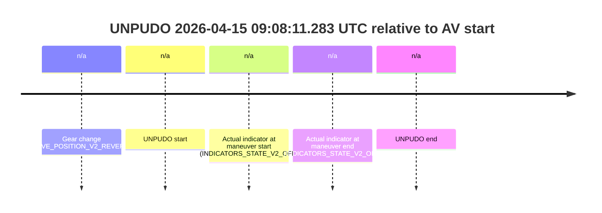
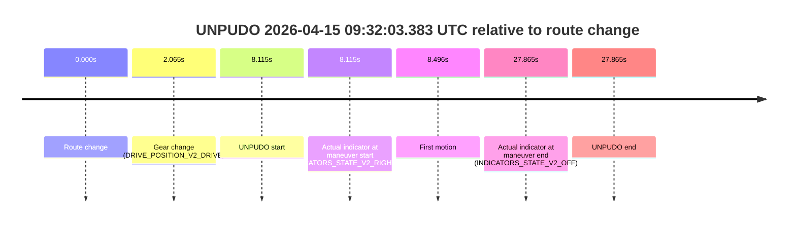
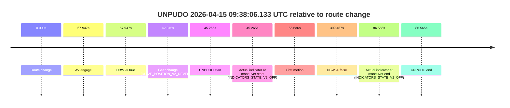
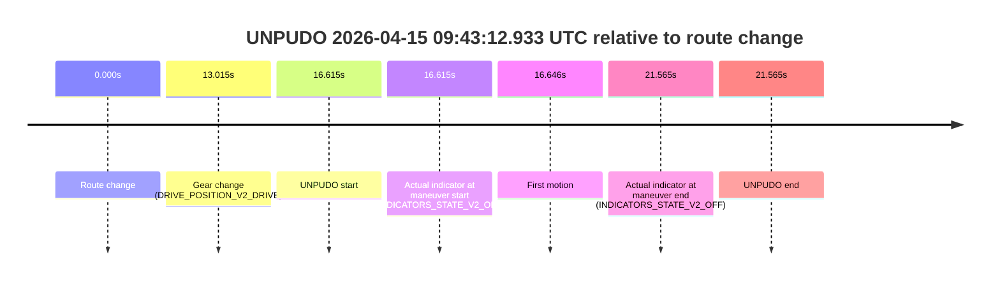

# Run Report: fme20029/2026-04-15--08-33-19--gen2-av-1ef36711-4c28-43c2-92aa-18d56c2d58d4

| Field | Value |
|---|---|
| Run ID | `fme20029/2026-04-15--08-33-19--gen2-av-1ef36711-4c28-43c2-92aa-18d56c2d58d4` |
| Date | `2026-04-15` |
| Model(s) | `plum-timeless-beaver` |
| Author | `peng.tang` |
| Event count | `11` |

## unpudo 2026-04-15 08:48:57.533 UTC

| Field | Value |
|---|---|
| Model | `plum-timeless-beaver` |
| Author | `peng.tang` |
| Run ID | `fme20029/2026-04-15--08-33-19--gen2-av-1ef36711-4c28-43c2-92aa-18d56c2d58d4` |
| Date | `2026-04-15` |
| Time (UTC) | `08:48:57.533` |
| Event type | `unpudo` |
| Disengagement type | `failed_to_unpudo` |
| Route change | `found` |
| Console | [run](https://console.sso.wayve.ai/run/fme20029/2026-04-15--08-33-19--gen2-av-1ef36711-4c28-43c2-92aa-18d56c2d58d4?id=&time-unixus=1776242937533320) |
| Foxglove | [segment](https://app.foxglove.dev/wayve-on-prem/p/prj_0dX18KZdVHg1fmmI/view?ds=foxglove-stream&ds.deviceName=fme20029&ds.start=2026-04-15T08%3A48%3A38.271587Z&ds.end=2026-04-15T08%3A50%3A00.154986Z&layoutId=lay_0e7VD4WIKDQGU73Y&time=2026-04-15T08%3A48%3A57.533320Z) |

### Event card: accidental

- Accidental: AV ownership is present for less than `2s`, so this is treated as an accidental brush with the maneuver rather than a meaningful model attempt.

| Event | Time (UTC) | Delta from route change |
|---|---:|---:|
| Route change | 2026-04-15 08:48:48.271 | `0.000s` |
| AV engage | 2026-04-15 08:49:05.314 | `17.043s` |
| DBW -> true | 2026-04-15 08:49:05.314 | `17.043s` |
| Gear change (DRIVE_POSITION_V2_DRIVE) | 2026-04-15 08:48:48.533 | `0.262s` |
| UNPUDO start | 2026-04-15 08:48:57.533 | `9.262s` |
| Actual indicator at maneuver start (INDICATORS_STATE_V2_RIGHT_ON) | 2026-04-15 08:48:57.533 | `9.262s` |
| First motion | 2026-04-15 08:48:57.564 | `9.293s` |
| DBW -> false | 2026-04-15 08:49:50.154 | `61.883s` |
| Actual indicator at maneuver end (INDICATORS_STATE_V2_OFF) | 2026-04-15 08:49:01.933 | `13.662s` |
| UNPUDO end | 2026-04-15 08:49:01.933 | `13.662s` |

| Metric | Value |
|---|---|
| Outcome | `accidental` |
| Effective failure type | `none` |
| Route change status | `found` |
| DBW at event start | `false` |
| DBW at event end | `false` |
| Predicted gear at AV start | `DRIVE_POSITION_V2_DRIVE` |
| Actual gear at AV start | `DRIVE_POSITION_V2_DRIVE` |
| Predicted gear at event start | `DRIVE_POSITION_V2_DRIVE` |
| Actual gear at event start | `DRIVE_POSITION_V2_DRIVE` |
| Planned indicator direction | `INDICATORS_STATE_V2_RIGHT_ON` |
| Controller indicator direction | `INDICATORS_STATE_V2_RIGHT_ON` |
| Actual indicator direction | `INDICATORS_STATE_V2_RIGHT_ON` |
| Actual indicator at maneuver end | `INDICATORS_STATE_V2_OFF` |
| Driver accel help in AV | `false` |
| Driver accel help timestamp | `n/a` |
| Max accel pedal pct in AV | `0.0%` |
| Max brake pedal pct in AV | `0.0%` |
| Max speed mps in AV | `0.000` |
| Route -> AV | `17.043s` |
| AV -> event start | `-7.782s` |
| AV -> first motion | `-7.751s` |
| AV duration before disengagement | `44.840s` |
| Trajectory waypoint count | `35` |
| Driving-plan step count | `11` |

The scored portion starts from the AV-owned window, not from the pre-AV setup. Route-change search in the stopped pre-event segment was `found`, with the baseline therefore set to route change. At the event anchor the model predicts `DRIVE_POSITION_V2_DRIVE` and the actual gear is `DRIVE_POSITION_V2_DRIVE`. The effective model outcome is `accidental` because `the AV-owned portion is shorter than 2s`.

### Resolution

| Field | Value |
|---|---|
| Final outcome | `accidental` |
| Do we agree with this label? | `yes` |
| Source disengagement type | `failed_to_unpudo` |
| Resolved effective failure type | `none` |
| Confidence | `high` |

## unpudo 2026-04-15 08:52:10.583 UTC

| Field | Value |
|---|---|
| Model | `plum-timeless-beaver` |
| Author | `peng.tang` |
| Run ID | `fme20029/2026-04-15--08-33-19--gen2-av-1ef36711-4c28-43c2-92aa-18d56c2d58d4` |
| Date | `2026-04-15` |
| Time (UTC) | `08:52:10.583` |
| Event type | `unpudo` |
| Disengagement type | `failed_to_unpudo` |
| Route change | `found` |
| Console | [run](https://console.sso.wayve.ai/run/fme20029/2026-04-15--08-33-19--gen2-av-1ef36711-4c28-43c2-92aa-18d56c2d58d4?id=&time-unixus=1776243130583304) |
| Foxglove | [segment](https://app.foxglove.dev/wayve-on-prem/p/prj_0dX18KZdVHg1fmmI/view?ds=foxglove-stream&ds.deviceName=fme20029&ds.start=2026-04-15T08%3A51%3A50.118281Z&ds.end=2026-04-15T08%3A55%3A45.074891Z&layoutId=lay_0e7VD4WIKDQGU73Y&time=2026-04-15T08%3A52%3A10.583304Z) |

### Event card: accidental

- Accidental: AV ownership is present for less than `2s`, so this is treated as an accidental brush with the maneuver rather than a meaningful model attempt.

| Event | Time (UTC) | Delta from route change |
|---|---:|---:|
| Route change | 2026-04-15 08:52:00.118 | `0.000s` |
| AV engage | 2026-04-15 08:52:25.554 | `25.437s` |
| DBW -> true | 2026-04-15 08:52:25.554 | `25.437s` |
| Gear change (DRIVE_POSITION_V2_DRIVE) | 2026-04-15 08:52:05.233 | `5.115s` |
| UNPUDO start | 2026-04-15 08:52:10.583 | `10.465s` |
| Actual indicator at maneuver start (INDICATORS_STATE_V2_RIGHT_ON) | 2026-04-15 08:52:10.583 | `10.465s` |
| First motion | 2026-04-15 08:52:10.704 | `10.586s` |
| DBW -> false | 2026-04-15 08:55:35.074 | `214.957s` |
| Actual indicator at maneuver end (INDICATORS_STATE_V2_OFF) | 2026-04-15 08:52:17.383 | `17.265s` |
| UNPUDO end | 2026-04-15 08:52:17.383 | `17.265s` |

| Metric | Value |
|---|---|
| Outcome | `accidental` |
| Effective failure type | `none` |
| Route change status | `found` |
| DBW at event start | `false` |
| DBW at event end | `false` |
| Predicted gear at AV start | `DRIVE_POSITION_V2_DRIVE` |
| Actual gear at AV start | `DRIVE_POSITION_V2_DRIVE` |
| Predicted gear at event start | `DRIVE_POSITION_V2_DRIVE` |
| Actual gear at event start | `DRIVE_POSITION_V2_DRIVE` |
| Planned indicator direction | `INDICATORS_STATE_V2_RIGHT_ON` |
| Controller indicator direction | `INDICATORS_STATE_V2_RIGHT_ON` |
| Actual indicator direction | `INDICATORS_STATE_V2_RIGHT_ON` |
| Actual indicator at maneuver end | `INDICATORS_STATE_V2_OFF` |
| Driver accel help in AV | `false` |
| Driver accel help timestamp | `n/a` |
| Max accel pedal pct in AV | `0.0%` |
| Max brake pedal pct in AV | `0.0%` |
| Max speed mps in AV | `0.000` |
| Route -> AV | `25.437s` |
| AV -> event start | `-14.972s` |
| AV -> first motion | `-14.850s` |
| AV duration before disengagement | `189.520s` |
| Trajectory waypoint count | `36` |
| Driving-plan step count | `11` |

The scored portion starts from the AV-owned window, not from the pre-AV setup. Route-change search in the stopped pre-event segment was `found`, with the baseline therefore set to route change. At the event anchor the model predicts `DRIVE_POSITION_V2_DRIVE` and the actual gear is `DRIVE_POSITION_V2_DRIVE`. The effective model outcome is `accidental` because `the AV-owned portion is shorter than 2s`.

### Resolution

| Field | Value |
|---|---|
| Final outcome | `accidental` |
| Do we agree with this label? | `yes` |
| Source disengagement type | `failed_to_unpudo` |
| Resolved effective failure type | `none` |
| Confidence | `high` |

## unpudo 2026-04-15 09:03:28.833 UTC

| Field | Value |
|---|---|
| Model | `plum-timeless-beaver` |
| Author | `peng.tang` |
| Run ID | `fme20029/2026-04-15--08-33-19--gen2-av-1ef36711-4c28-43c2-92aa-18d56c2d58d4` |
| Date | `2026-04-15` |
| Time (UTC) | `09:03:28.833` |
| Event type | `unpudo` |
| Disengagement type | `failed_to_unpudo` |
| Route change | `found` |
| Console | [run](https://console.sso.wayve.ai/run/fme20029/2026-04-15--08-33-19--gen2-av-1ef36711-4c28-43c2-92aa-18d56c2d58d4?id=&time-unixus=1776243808833323) |
| Foxglove | [segment](https://app.foxglove.dev/wayve-on-prem/p/prj_0dX18KZdVHg1fmmI/view?ds=foxglove-stream&ds.deviceName=fme20029&ds.start=2026-04-15T09%3A03%3A05.868243Z&ds.end=2026-04-15T09%3A03%3A55.976253Z&layoutId=lay_0e7VD4WIKDQGU73Y&time=2026-04-15T09%3A03%3A28.833323Z) |

### Event card: accidental

- Accidental: AV ownership is present for less than `2s`, so this is treated as an accidental brush with the maneuver rather than a meaningful model attempt.

| Event | Time (UTC) | Delta from route change |
|---|---:|---:|
| Route change | 2026-04-15 09:03:15.868 | `0.000s` |
| AV engage | 2026-04-15 09:03:34.376 | `18.508s` |
| DBW -> true | 2026-04-15 09:03:34.376 | `18.508s` |
| Gear change (DRIVE_POSITION_V2_DRIVE) | 2026-04-15 09:03:20.833 | `4.965s` |
| UNPUDO start | 2026-04-15 09:03:28.833 | `12.965s` |
| Actual indicator at maneuver start (INDICATORS_STATE_V2_RIGHT_ON) | 2026-04-15 09:03:28.833 | `12.965s` |
| First motion | 2026-04-15 09:03:28.924 | `13.057s` |
| DBW -> false | 2026-04-15 09:03:45.976 | `30.108s` |
| Actual indicator at maneuver end (INDICATORS_STATE_V2_OFF) | 2026-04-15 09:03:33.033 | `17.165s` |
| UNPUDO end | 2026-04-15 09:03:33.033 | `17.165s` |

| Metric | Value |
|---|---|
| Outcome | `accidental` |
| Effective failure type | `none` |
| Route change status | `found` |
| DBW at event start | `false` |
| DBW at event end | `false` |
| Predicted gear at AV start | `DRIVE_POSITION_V2_DRIVE` |
| Actual gear at AV start | `DRIVE_POSITION_V2_DRIVE` |
| Predicted gear at event start | `DRIVE_POSITION_V2_DRIVE` |
| Actual gear at event start | `DRIVE_POSITION_V2_DRIVE` |
| Planned indicator direction | `INDICATORS_STATE_V2_OFF` |
| Controller indicator direction | `INDICATORS_STATE_V2_OFF` |
| Actual indicator direction | `INDICATORS_STATE_V2_RIGHT_ON` |
| Actual indicator at maneuver end | `INDICATORS_STATE_V2_OFF` |
| Driver accel help in AV | `false` |
| Driver accel help timestamp | `n/a` |
| Max accel pedal pct in AV | `0.0%` |
| Max brake pedal pct in AV | `0.0%` |
| Max speed mps in AV | `0.000` |
| Route -> AV | `18.508s` |
| AV -> event start | `-5.543s` |
| AV -> first motion | `-5.451s` |
| AV duration before disengagement | `11.600s` |
| Trajectory waypoint count | `35` |
| Driving-plan step count | `11` |

The scored portion starts from the AV-owned window, not from the pre-AV setup. Route-change search in the stopped pre-event segment was `found`, with the baseline therefore set to route change. At the event anchor the model predicts `DRIVE_POSITION_V2_DRIVE` and the actual gear is `DRIVE_POSITION_V2_DRIVE`. The effective model outcome is `accidental` because `the AV-owned portion is shorter than 2s`.

### Resolution

| Field | Value |
|---|---|
| Final outcome | `accidental` |
| Do we agree with this label? | `yes` |
| Source disengagement type | `failed_to_unpudo` |
| Resolved effective failure type | `none` |
| Confidence | `high` |

## unpudo 2026-04-15 09:08:11.283 UTC

| Field | Value |
|---|---|
| Model | `plum-timeless-beaver` |
| Author | `peng.tang` |
| Run ID | `fme20029/2026-04-15--08-33-19--gen2-av-1ef36711-4c28-43c2-92aa-18d56c2d58d4` |
| Date | `2026-04-15` |
| Time (UTC) | `09:08:11.283` |
| Event type | `unpudo` |
| Disengagement type | `none observed` |
| Route change | `unclear` |
| Console | [run](https://console.sso.wayve.ai/run/fme20029/2026-04-15--08-33-19--gen2-av-1ef36711-4c28-43c2-92aa-18d56c2d58d4?id=&time-unixus=1776244091283303) |
| Foxglove | [segment](https://app.foxglove.dev/wayve-on-prem/p/prj_0dX18KZdVHg1fmmI/view?ds=foxglove-stream&ds.deviceName=fme20029&ds.start=2026-04-15T09%3A07%3A57.883322Z&ds.end=2026-04-15T09%3A08%3A21.283303Z&layoutId=lay_0e7VD4WIKDQGU73Y&time=2026-04-15T09%3A08%3A11.283303Z) |

### Event card: non-av

- Non-AV: the detected unpudo starts outside AV ownership, so it is kept for coverage but excluded from model success / failure scoring.

| Event | Time (UTC) | Delta from AV start |
|---|---:|---:|
| Gear change (DRIVE_POSITION_V2_REVERSE) | 2026-04-15 09:08:07.883 | `n/a` |
| UNPUDO start | 2026-04-15 09:08:11.283 | `n/a` |
| Actual indicator at maneuver start (INDICATORS_STATE_V2_OFF) | 2026-04-15 09:08:11.283 | `n/a` |
| Actual indicator at maneuver end (INDICATORS_STATE_V2_OFF) | 2026-04-15 09:08:11.283 | `n/a` |
| UNPUDO end | 2026-04-15 09:08:11.283 | `n/a` |

| Metric | Value |
|---|---|
| Outcome | `non-av` |
| Effective failure type | `none` |
| Route change status | `unclear` |
| DBW at event start | `false` |
| DBW at event end | `false` |
| Predicted gear at AV start | `n/a` |
| Actual gear at AV start | `n/a` |
| Predicted gear at event start | `DRIVE_POSITION_V2_REVERSE` |
| Actual gear at event start | `DRIVE_POSITION_V2_REVERSE` |
| Planned indicator direction | `INDICATORS_STATE_V2_OFF` |
| Controller indicator direction | `INDICATORS_STATE_V2_OFF` |
| Actual indicator direction | `INDICATORS_STATE_V2_OFF` |
| Actual indicator at maneuver end | `INDICATORS_STATE_V2_OFF` |
| Driver accel help in AV | `false` |
| Driver accel help timestamp | `n/a` |
| Max accel pedal pct in AV | `0.0%` |
| Max brake pedal pct in AV | `0.0%` |
| Max speed mps in AV | `0.000` |
| Route -> AV | `n/a` |
| AV -> event start | `n/a` |
| AV -> first motion | `n/a` |
| AV duration before disengagement | `n/a` |
| Trajectory waypoint count | `36` |
| Driving-plan step count | `11` |

The scored portion starts from the AV-owned window, not from the pre-AV setup. Route-change search in the stopped pre-event segment was `unclear`, with the baseline therefore set to AV start. At the event anchor the model predicts `DRIVE_POSITION_V2_REVERSE` and the actual gear is `DRIVE_POSITION_V2_REVERSE`. The effective model outcome is `non-av` because `the event does not begin in AV ownership`.

### Resolution

| Field | Value |
|---|---|
| Final outcome | `non-av` |
| Do we agree with this label? | `yes` |
| Source disengagement type | `none observed` |
| Resolved effective failure type | `none` |
| Confidence | `medium` |

## unpudo 2026-04-15 09:13:30.533 UTC

| Field | Value |
|---|---|
| Model | `plum-timeless-beaver` |
| Author | `peng.tang` |
| Run ID | `fme20029/2026-04-15--08-33-19--gen2-av-1ef36711-4c28-43c2-92aa-18d56c2d58d4` |
| Date | `2026-04-15` |
| Time (UTC) | `09:13:30.533` |
| Event type | `unpudo` |
| Disengagement type | `none observed` |
| Route change | `found` |
| Console | [run](https://console.sso.wayve.ai/run/fme20029/2026-04-15--08-33-19--gen2-av-1ef36711-4c28-43c2-92aa-18d56c2d58d4?id=&time-unixus=1776244410533293) |
| Foxglove | [segment](https://app.foxglove.dev/wayve-on-prem/p/prj_0dX18KZdVHg1fmmI/view?ds=foxglove-stream&ds.deviceName=fme20029&ds.start=2026-04-15T09%3A12%3A17.818307Z&ds.end=2026-04-15T09%3A13%3A54.833299Z&layoutId=lay_0e7VD4WIKDQGU73Y&time=2026-04-15T09%3A13%3A30.533293Z) |

### Event card: non-av

- Non-AV: the detected unpudo starts outside AV ownership, so it is kept for coverage but excluded from model success / failure scoring.

| Event | Time (UTC) | Delta from route change |
|---|---:|---:|
| Route change | 2026-04-15 09:12:27.818 | `0.000s` |
| Gear change (DRIVE_POSITION_V2_REVERSE) | 2026-04-15 09:13:27.533 | `59.715s` |
| UNPUDO start | 2026-04-15 09:13:30.533 | `62.715s` |
| Actual indicator at maneuver start (INDICATORS_STATE_V2_OFF) | 2026-04-15 09:13:30.533 | `62.715s` |
| First motion | 2026-04-15 09:13:40.524 | `72.706s` |
| Actual indicator at maneuver end (INDICATORS_STATE_V2_OFF) | 2026-04-15 09:13:44.833 | `77.015s` |
| UNPUDO end | 2026-04-15 09:13:44.833 | `77.015s` |

| Metric | Value |
|---|---|
| Outcome | `non-av` |
| Effective failure type | `none` |
| Route change status | `found` |
| DBW at event start | `false` |
| DBW at event end | `false` |
| Predicted gear at AV start | `n/a` |
| Actual gear at AV start | `n/a` |
| Predicted gear at event start | `DRIVE_POSITION_V2_REVERSE` |
| Actual gear at event start | `DRIVE_POSITION_V2_REVERSE` |
| Planned indicator direction | `INDICATORS_STATE_V2_OFF` |
| Controller indicator direction | `INDICATORS_STATE_V2_OFF` |
| Actual indicator direction | `INDICATORS_STATE_V2_OFF` |
| Actual indicator at maneuver end | `INDICATORS_STATE_V2_OFF` |
| Driver accel help in AV | `false` |
| Driver accel help timestamp | `n/a` |
| Max accel pedal pct in AV | `0.0%` |
| Max brake pedal pct in AV | `0.0%` |
| Max speed mps in AV | `0.000` |
| Route -> AV | `n/a` |
| AV -> event start | `n/a` |
| AV -> first motion | `n/a` |
| AV duration before disengagement | `n/a` |
| Trajectory waypoint count | `35` |
| Driving-plan step count | `11` |

The scored portion starts from the AV-owned window, not from the pre-AV setup. Route-change search in the stopped pre-event segment was `found`, with the baseline therefore set to route change. At the event anchor the model predicts `DRIVE_POSITION_V2_REVERSE` and the actual gear is `DRIVE_POSITION_V2_REVERSE`. The effective model outcome is `non-av` because `the event does not begin in AV ownership`.

### Resolution

| Field | Value |
|---|---|
| Final outcome | `non-av` |
| Do we agree with this label? | `yes` |
| Source disengagement type | `none observed` |
| Resolved effective failure type | `none` |
| Confidence | `high` |

## unpudo 2026-04-15 09:15:02.833 UTC

| Field | Value |
|---|---|
| Model | `plum-timeless-beaver` |
| Author | `peng.tang` |
| Run ID | `fme20029/2026-04-15--08-33-19--gen2-av-1ef36711-4c28-43c2-92aa-18d56c2d58d4` |
| Date | `2026-04-15` |
| Time (UTC) | `09:15:02.833` |
| Event type | `unpudo` |
| Disengagement type | `failed_to_unpudo` |
| Route change | `found` |
| Console | [run](https://console.sso.wayve.ai/run/fme20029/2026-04-15--08-33-19--gen2-av-1ef36711-4c28-43c2-92aa-18d56c2d58d4?id=&time-unixus=1776244502833310) |
| Foxglove | [segment](https://app.foxglove.dev/wayve-on-prem/p/prj_0dX18KZdVHg1fmmI/view?ds=foxglove-stream&ds.deviceName=fme20029&ds.start=2026-04-15T09%3A13%3A26.918644Z&ds.end=2026-04-15T09%3A18%3A09.575030Z&layoutId=lay_0e7VD4WIKDQGU73Y&time=2026-04-15T09%3A15%3A02.833310Z) |

### Event card: accidental

- Accidental: AV ownership is present for less than `2s`, so this is treated as an accidental brush with the maneuver rather than a meaningful model attempt.

| Event | Time (UTC) | Delta from route change |
|---|---:|---:|
| Route change | 2026-04-15 09:13:36.918 | `0.000s` |
| AV engage | 2026-04-15 09:15:12.334 | `95.416s` |
| DBW -> true | 2026-04-15 09:15:12.334 | `95.416s` |
| Gear change (DRIVE_POSITION_V2_DRIVE) | 2026-04-15 09:14:53.933 | `77.015s` |
| UNPUDO start | 2026-04-15 09:15:02.833 | `85.915s` |
| Actual indicator at maneuver start (INDICATORS_STATE_V2_LEFT_ON) | 2026-04-15 09:15:02.833 | `85.915s` |
| First motion | 2026-04-15 09:15:02.864 | `85.946s` |
| DBW -> false | 2026-04-15 09:17:59.575 | `262.656s` |
| Actual indicator at maneuver end (INDICATORS_STATE_V2_OFF) | 2026-04-15 09:15:08.383 | `91.465s` |
| UNPUDO end | 2026-04-15 09:15:08.383 | `91.465s` |

| Metric | Value |
|---|---|
| Outcome | `accidental` |
| Effective failure type | `none` |
| Route change status | `found` |
| DBW at event start | `false` |
| DBW at event end | `false` |
| Predicted gear at AV start | `DRIVE_POSITION_V2_DRIVE` |
| Actual gear at AV start | `DRIVE_POSITION_V2_DRIVE` |
| Predicted gear at event start | `DRIVE_POSITION_V2_DRIVE` |
| Actual gear at event start | `DRIVE_POSITION_V2_DRIVE` |
| Planned indicator direction | `INDICATORS_STATE_V2_LEFT_ON` |
| Controller indicator direction | `INDICATORS_STATE_V2_LEFT_ON` |
| Actual indicator direction | `INDICATORS_STATE_V2_LEFT_ON` |
| Actual indicator at maneuver end | `INDICATORS_STATE_V2_OFF` |
| Driver accel help in AV | `false` |
| Driver accel help timestamp | `n/a` |
| Max accel pedal pct in AV | `0.0%` |
| Max brake pedal pct in AV | `0.0%` |
| Max speed mps in AV | `0.000` |
| Route -> AV | `95.416s` |
| AV -> event start | `-9.502s` |
| AV -> first motion | `-9.471s` |
| AV duration before disengagement | `167.240s` |
| Trajectory waypoint count | `35` |
| Driving-plan step count | `11` |

The scored portion starts from the AV-owned window, not from the pre-AV setup. Route-change search in the stopped pre-event segment was `found`, with the baseline therefore set to route change. At the event anchor the model predicts `DRIVE_POSITION_V2_DRIVE` and the actual gear is `DRIVE_POSITION_V2_DRIVE`. The effective model outcome is `accidental` because `the AV-owned portion is shorter than 2s`.

### Resolution

| Field | Value |
|---|---|
| Final outcome | `accidental` |
| Do we agree with this label? | `yes` |
| Source disengagement type | `failed_to_unpudo` |
| Resolved effective failure type | `none` |
| Confidence | `high` |

## unpudo 2026-04-15 09:19:02.933 UTC

| Field | Value |
|---|---|
| Model | `plum-timeless-beaver` |
| Author | `peng.tang` |
| Run ID | `fme20029/2026-04-15--08-33-19--gen2-av-1ef36711-4c28-43c2-92aa-18d56c2d58d4` |
| Date | `2026-04-15` |
| Time (UTC) | `09:19:02.933` |
| Event type | `unpudo` |
| Disengagement type | `failed_to_unpudo` |
| Route change | `found` |
| Console | [run](https://console.sso.wayve.ai/run/fme20029/2026-04-15--08-33-19--gen2-av-1ef36711-4c28-43c2-92aa-18d56c2d58d4?id=&time-unixus=1776244742933320) |
| Foxglove | [segment](https://app.foxglove.dev/wayve-on-prem/p/prj_0dX18KZdVHg1fmmI/view?ds=foxglove-stream&ds.deviceName=fme20029&ds.start=2026-04-15T09%3A18%3A44.268218Z&ds.end=2026-04-15T09%3A19%3A17.533314Z&layoutId=lay_0e7VD4WIKDQGU73Y&time=2026-04-15T09%3A19%3A02.933320Z) |

### Event card: non-av

- Non-AV: the detected unpudo starts outside AV ownership, so it is kept for coverage but excluded from model success / failure scoring.

| Event | Time (UTC) | Delta from route change |
|---|---:|---:|
| Route change | 2026-04-15 09:18:54.268 | `0.000s` |
| Gear change (DRIVE_POSITION_V2_DRIVE) | 2026-04-15 09:18:58.433 | `4.165s` |
| UNPUDO start | 2026-04-15 09:19:02.933 | `8.665s` |
| Actual indicator at maneuver start (INDICATORS_STATE_V2_RIGHT_ON) | 2026-04-15 09:19:02.933 | `8.665s` |
| First motion | 2026-04-15 09:19:02.964 | `8.696s` |
| Actual indicator at maneuver end (INDICATORS_STATE_V2_RIGHT_ON) | 2026-04-15 09:19:07.533 | `13.265s` |
| UNPUDO end | 2026-04-15 09:19:07.533 | `13.265s` |

| Metric | Value |
|---|---|
| Outcome | `non-av` |
| Effective failure type | `none` |
| Route change status | `found` |
| DBW at event start | `false` |
| DBW at event end | `false` |
| Predicted gear at AV start | `n/a` |
| Actual gear at AV start | `n/a` |
| Predicted gear at event start | `DRIVE_POSITION_V2_DRIVE` |
| Actual gear at event start | `DRIVE_POSITION_V2_DRIVE` |
| Planned indicator direction | `INDICATORS_STATE_V2_OFF` |
| Controller indicator direction | `INDICATORS_STATE_V2_OFF` |
| Actual indicator direction | `INDICATORS_STATE_V2_RIGHT_ON` |
| Actual indicator at maneuver end | `INDICATORS_STATE_V2_RIGHT_ON` |
| Driver accel help in AV | `false` |
| Driver accel help timestamp | `n/a` |
| Max accel pedal pct in AV | `0.0%` |
| Max brake pedal pct in AV | `0.0%` |
| Max speed mps in AV | `0.000` |
| Route -> AV | `n/a` |
| AV -> event start | `n/a` |
| AV -> first motion | `n/a` |
| AV duration before disengagement | `n/a` |
| Trajectory waypoint count | `35` |
| Driving-plan step count | `11` |

The scored portion starts from the AV-owned window, not from the pre-AV setup. Route-change search in the stopped pre-event segment was `found`, with the baseline therefore set to route change. At the event anchor the model predicts `DRIVE_POSITION_V2_DRIVE` and the actual gear is `DRIVE_POSITION_V2_DRIVE`. The effective model outcome is `non-av` because `the event does not begin in AV ownership`.

### Resolution

| Field | Value |
|---|---|
| Final outcome | `non-av` |
| Do we agree with this label? | `yes` |
| Source disengagement type | `failed_to_unpudo` |
| Resolved effective failure type | `none` |
| Confidence | `high` |

## unpudo 2026-04-15 09:20:35.183 UTC

| Field | Value |
|---|---|
| Model | `plum-timeless-beaver` |
| Author | `peng.tang` |
| Run ID | `fme20029/2026-04-15--08-33-19--gen2-av-1ef36711-4c28-43c2-92aa-18d56c2d58d4` |
| Date | `2026-04-15` |
| Time (UTC) | `09:20:35.183` |
| Event type | `unpudo` |
| Disengagement type | `failed_to_unpudo` |
| Route change | `found` |
| Console | [run](https://console.sso.wayve.ai/run/fme20029/2026-04-15--08-33-19--gen2-av-1ef36711-4c28-43c2-92aa-18d56c2d58d4?id=&time-unixus=1776244835183308) |
| Foxglove | [segment](https://app.foxglove.dev/wayve-on-prem/p/prj_0dX18KZdVHg1fmmI/view?ds=foxglove-stream&ds.deviceName=fme20029&ds.start=2026-04-15T09%3A18%3A44.268218Z&ds.end=2026-04-15T09%3A21%3A25.534908Z&layoutId=lay_0e7VD4WIKDQGU73Y&time=2026-04-15T09%3A20%3A35.183308Z) |

### Event card: accidental

- Accidental: AV ownership is present for less than `2s`, so this is treated as an accidental brush with the maneuver rather than a meaningful model attempt.

| Event | Time (UTC) | Delta from route change |
|---|---:|---:|
| Route change | 2026-04-15 09:18:54.268 | `0.000s` |
| AV engage | 2026-04-15 09:20:43.776 | `109.508s` |
| DBW -> true | 2026-04-15 09:20:43.776 | `109.508s` |
| Gear change (DRIVE_POSITION_V2_DRIVE) | 2026-04-15 09:20:24.533 | `90.265s` |
| UNPUDO start | 2026-04-15 09:20:35.183 | `100.915s` |
| Actual indicator at maneuver start (INDICATORS_STATE_V2_RIGHT_ON) | 2026-04-15 09:20:35.183 | `100.915s` |
| First motion | 2026-04-15 09:20:35.244 | `100.976s` |
| DBW -> false | 2026-04-15 09:21:15.534 | `141.267s` |
| Actual indicator at maneuver end (INDICATORS_STATE_V2_OFF) | 2026-04-15 09:20:40.233 | `105.965s` |
| UNPUDO end | 2026-04-15 09:20:40.233 | `105.965s` |

| Metric | Value |
|---|---|
| Outcome | `accidental` |
| Effective failure type | `none` |
| Route change status | `found` |
| DBW at event start | `false` |
| DBW at event end | `false` |
| Predicted gear at AV start | `DRIVE_POSITION_V2_DRIVE` |
| Actual gear at AV start | `DRIVE_POSITION_V2_DRIVE` |
| Predicted gear at event start | `DRIVE_POSITION_V2_DRIVE` |
| Actual gear at event start | `DRIVE_POSITION_V2_DRIVE` |
| Planned indicator direction | `INDICATORS_STATE_V2_RIGHT_ON` |
| Controller indicator direction | `INDICATORS_STATE_V2_RIGHT_ON` |
| Actual indicator direction | `INDICATORS_STATE_V2_RIGHT_ON` |
| Actual indicator at maneuver end | `INDICATORS_STATE_V2_OFF` |
| Driver accel help in AV | `false` |
| Driver accel help timestamp | `n/a` |
| Max accel pedal pct in AV | `0.0%` |
| Max brake pedal pct in AV | `0.0%` |
| Max speed mps in AV | `0.000` |
| Route -> AV | `109.508s` |
| AV -> event start | `-8.593s` |
| AV -> first motion | `-8.532s` |
| AV duration before disengagement | `31.759s` |
| Trajectory waypoint count | `36` |
| Driving-plan step count | `11` |

The scored portion starts from the AV-owned window, not from the pre-AV setup. Route-change search in the stopped pre-event segment was `found`, with the baseline therefore set to route change. At the event anchor the model predicts `DRIVE_POSITION_V2_DRIVE` and the actual gear is `DRIVE_POSITION_V2_DRIVE`. The effective model outcome is `accidental` because `the AV-owned portion is shorter than 2s`.

### Resolution

| Field | Value |
|---|---|
| Final outcome | `accidental` |
| Do we agree with this label? | `yes` |
| Source disengagement type | `failed_to_unpudo` |
| Resolved effective failure type | `none` |
| Confidence | `high` |

## unpudo 2026-04-15 09:32:03.383 UTC

| Field | Value |
|---|---|
| Model | `plum-timeless-beaver` |
| Author | `peng.tang` |
| Run ID | `fme20029/2026-04-15--08-33-19--gen2-av-1ef36711-4c28-43c2-92aa-18d56c2d58d4` |
| Date | `2026-04-15` |
| Time (UTC) | `09:32:03.383` |
| Event type | `unpudo` |
| Disengagement type | `failed_to_unpudo` |
| Route change | `found` |
| Console | [run](https://console.sso.wayve.ai/run/fme20029/2026-04-15--08-33-19--gen2-av-1ef36711-4c28-43c2-92aa-18d56c2d58d4?id=&time-unixus=1776245523383304) |
| Foxglove | [segment](https://app.foxglove.dev/wayve-on-prem/p/prj_0dX18KZdVHg1fmmI/view?ds=foxglove-stream&ds.deviceName=fme20029&ds.start=2026-04-15T09%3A31%3A45.268258Z&ds.end=2026-04-15T09%3A32%3A33.133308Z&layoutId=lay_0e7VD4WIKDQGU73Y&time=2026-04-15T09%3A32%3A03.383304Z) |

### Event card: non-av

- Non-AV: the detected unpudo starts outside AV ownership, so it is kept for coverage but excluded from model success / failure scoring.

| Event | Time (UTC) | Delta from route change |
|---|---:|---:|
| Route change | 2026-04-15 09:31:55.268 | `0.000s` |
| Gear change (DRIVE_POSITION_V2_DRIVE) | 2026-04-15 09:31:57.333 | `2.065s` |
| UNPUDO start | 2026-04-15 09:32:03.383 | `8.115s` |
| Actual indicator at maneuver start (INDICATORS_STATE_V2_RIGHT_ON) | 2026-04-15 09:32:03.383 | `8.115s` |
| First motion | 2026-04-15 09:32:03.764 | `8.496s` |
| Actual indicator at maneuver end (INDICATORS_STATE_V2_OFF) | 2026-04-15 09:32:23.133 | `27.865s` |
| UNPUDO end | 2026-04-15 09:32:23.133 | `27.865s` |

| Metric | Value |
|---|---|
| Outcome | `non-av` |
| Effective failure type | `none` |
| Route change status | `found` |
| DBW at event start | `false` |
| DBW at event end | `false` |
| Predicted gear at AV start | `n/a` |
| Actual gear at AV start | `n/a` |
| Predicted gear at event start | `DRIVE_POSITION_V2_DRIVE` |
| Actual gear at event start | `DRIVE_POSITION_V2_DRIVE` |
| Planned indicator direction | `INDICATORS_STATE_V2_RIGHT_ON` |
| Controller indicator direction | `INDICATORS_STATE_V2_RIGHT_ON` |
| Actual indicator direction | `INDICATORS_STATE_V2_RIGHT_ON` |
| Actual indicator at maneuver end | `INDICATORS_STATE_V2_OFF` |
| Driver accel help in AV | `false` |
| Driver accel help timestamp | `n/a` |
| Max accel pedal pct in AV | `0.0%` |
| Max brake pedal pct in AV | `0.0%` |
| Max speed mps in AV | `0.000` |
| Route -> AV | `n/a` |
| AV -> event start | `n/a` |
| AV -> first motion | `n/a` |
| AV duration before disengagement | `n/a` |
| Trajectory waypoint count | `36` |
| Driving-plan step count | `11` |

The scored portion starts from the AV-owned window, not from the pre-AV setup. Route-change search in the stopped pre-event segment was `found`, with the baseline therefore set to route change. At the event anchor the model predicts `DRIVE_POSITION_V2_DRIVE` and the actual gear is `DRIVE_POSITION_V2_DRIVE`. The effective model outcome is `non-av` because `the event does not begin in AV ownership`.

### Resolution

| Field | Value |
|---|---|
| Final outcome | `non-av` |
| Do we agree with this label? | `yes` |
| Source disengagement type | `failed_to_unpudo` |
| Resolved effective failure type | `none` |
| Confidence | `high` |

## unpudo 2026-04-15 09:38:06.133 UTC

| Field | Value |
|---|---|
| Model | `plum-timeless-beaver` |
| Author | `peng.tang` |
| Run ID | `fme20029/2026-04-15--08-33-19--gen2-av-1ef36711-4c28-43c2-92aa-18d56c2d58d4` |
| Date | `2026-04-15` |
| Time (UTC) | `09:38:06.133` |
| Event type | `unpudo` |
| Disengagement type | `diversion` |
| Route change | `found` |
| Console | [run](https://console.sso.wayve.ai/run/fme20029/2026-04-15--08-33-19--gen2-av-1ef36711-4c28-43c2-92aa-18d56c2d58d4?id=&time-unixus=1776245886133312) |
| Foxglove | [segment](https://app.foxglove.dev/wayve-on-prem/p/prj_0dX18KZdVHg1fmmI/view?ds=foxglove-stream&ds.deviceName=fme20029&ds.start=2026-04-15T09%3A37%3A10.868272Z&ds.end=2026-04-15T09%3A42%3A40.354867Z&layoutId=lay_0e7VD4WIKDQGU73Y&time=2026-04-15T09%3A38%3A06.133312Z) |

### Event card: non-av

- Non-AV: the detected unpudo starts outside AV ownership, so it is kept for coverage but excluded from model success / failure scoring.

| Event | Time (UTC) | Delta from route change |
|---|---:|---:|
| Route change | 2026-04-15 09:37:20.868 | `0.000s` |
| AV engage | 2026-04-15 09:38:28.815 | `67.947s` |
| DBW -> true | 2026-04-15 09:38:28.815 | `67.947s` |
| Gear change (DRIVE_POSITION_V2_REVERSE) | 2026-04-15 09:38:03.183 | `42.315s` |
| UNPUDO start | 2026-04-15 09:38:06.133 | `45.265s` |
| Actual indicator at maneuver start (INDICATORS_STATE_V2_OFF) | 2026-04-15 09:38:06.133 | `45.265s` |
| First motion | 2026-04-15 09:38:16.504 | `55.636s` |
| DBW -> false | 2026-04-15 09:42:30.354 | `309.487s` |
| Actual indicator at maneuver end (INDICATORS_STATE_V2_OFF) | 2026-04-15 09:38:47.433 | `86.565s` |
| UNPUDO end | 2026-04-15 09:38:47.433 | `86.565s` |

| Metric | Value |
|---|---|
| Outcome | `non-av` |
| Effective failure type | `none` |
| Route change status | `found` |
| DBW at event start | `false` |
| DBW at event end | `true` |
| Predicted gear at AV start | `DRIVE_POSITION_V2_DRIVE` |
| Actual gear at AV start | `DRIVE_POSITION_V2_DRIVE` |
| Predicted gear at event start | `DRIVE_POSITION_V2_REVERSE` |
| Actual gear at event start | `DRIVE_POSITION_V2_REVERSE` |
| Planned indicator direction | `INDICATORS_STATE_V2_OFF` |
| Controller indicator direction | `INDICATORS_STATE_V2_OFF` |
| Actual indicator direction | `INDICATORS_STATE_V2_OFF` |
| Actual indicator at maneuver end | `INDICATORS_STATE_V2_OFF` |
| Driver accel help in AV | `false` |
| Driver accel help timestamp | `n/a` |
| Max accel pedal pct in AV | `0.0%` |
| Max brake pedal pct in AV | `8.0%` |
| Max speed mps in AV | `2.283` |
| Route -> AV | `67.947s` |
| AV -> event start | `-22.682s` |
| AV -> first motion | `-12.310s` |
| AV duration before disengagement | `241.540s` |
| Trajectory waypoint count | `37` |
| Driving-plan step count | `11` |

The scored portion starts from the AV-owned window, not from the pre-AV setup. Route-change search in the stopped pre-event segment was `found`, with the baseline therefore set to route change. At the event anchor the model predicts `DRIVE_POSITION_V2_REVERSE` and the actual gear is `DRIVE_POSITION_V2_REVERSE`. The effective model outcome is `non-av` because `the event does not begin in AV ownership`.

### Resolution

| Field | Value |
|---|---|
| Final outcome | `non-av` |
| Do we agree with this label? | `yes` |
| Source disengagement type | `diversion` |
| Resolved effective failure type | `none` |
| Confidence | `high` |

## unpudo 2026-04-15 09:43:12.933 UTC

| Field | Value |
|---|---|
| Model | `plum-timeless-beaver` |
| Author | `peng.tang` |
| Run ID | `fme20029/2026-04-15--08-33-19--gen2-av-1ef36711-4c28-43c2-92aa-18d56c2d58d4` |
| Date | `2026-04-15` |
| Time (UTC) | `09:43:12.933` |
| Event type | `unpudo` |
| Disengagement type | `failed_to_unpudo` |
| Route change | `found` |
| Console | [run](https://console.sso.wayve.ai/run/fme20029/2026-04-15--08-33-19--gen2-av-1ef36711-4c28-43c2-92aa-18d56c2d58d4?id=&time-unixus=1776246192933323) |
| Foxglove | [segment](https://app.foxglove.dev/wayve-on-prem/p/prj_0dX18KZdVHg1fmmI/view?ds=foxglove-stream&ds.deviceName=fme20029&ds.start=2026-04-15T09%3A42%3A46.318417Z&ds.end=2026-04-15T09%3A43%3A27.883314Z&layoutId=lay_0e7VD4WIKDQGU73Y&time=2026-04-15T09%3A43%3A12.933323Z) |

### Event card: non-av

- Non-AV: the detected unpudo starts outside AV ownership, so it is kept for coverage but excluded from model success / failure scoring.

| Event | Time (UTC) | Delta from route change |
|---|---:|---:|
| Route change | 2026-04-15 09:42:56.318 | `0.000s` |
| Gear change (DRIVE_POSITION_V2_DRIVE) | 2026-04-15 09:43:09.333 | `13.015s` |
| UNPUDO start | 2026-04-15 09:43:12.933 | `16.615s` |
| Actual indicator at maneuver start (INDICATORS_STATE_V2_OFF) | 2026-04-15 09:43:12.933 | `16.615s` |
| First motion | 2026-04-15 09:43:12.964 | `16.646s` |
| Actual indicator at maneuver end (INDICATORS_STATE_V2_OFF) | 2026-04-15 09:43:17.883 | `21.565s` |
| UNPUDO end | 2026-04-15 09:43:17.883 | `21.565s` |

| Metric | Value |
|---|---|
| Outcome | `non-av` |
| Effective failure type | `none` |
| Route change status | `found` |
| DBW at event start | `false` |
| DBW at event end | `false` |
| Predicted gear at AV start | `n/a` |
| Actual gear at AV start | `n/a` |
| Predicted gear at event start | `DRIVE_POSITION_V2_DRIVE` |
| Actual gear at event start | `DRIVE_POSITION_V2_DRIVE` |
| Planned indicator direction | `INDICATORS_STATE_V2_RIGHT_ON` |
| Controller indicator direction | `INDICATORS_STATE_V2_RIGHT_ON` |
| Actual indicator direction | `INDICATORS_STATE_V2_OFF` |
| Actual indicator at maneuver end | `INDICATORS_STATE_V2_OFF` |
| Driver accel help in AV | `false` |
| Driver accel help timestamp | `n/a` |
| Max accel pedal pct in AV | `0.0%` |
| Max brake pedal pct in AV | `0.0%` |
| Max speed mps in AV | `0.000` |
| Route -> AV | `n/a` |
| AV -> event start | `n/a` |
| AV -> first motion | `n/a` |
| AV duration before disengagement | `n/a` |
| Trajectory waypoint count | `35` |
| Driving-plan step count | `11` |

The scored portion starts from the AV-owned window, not from the pre-AV setup. Route-change search in the stopped pre-event segment was `found`, with the baseline therefore set to route change. At the event anchor the model predicts `DRIVE_POSITION_V2_DRIVE` and the actual gear is `DRIVE_POSITION_V2_DRIVE`. The effective model outcome is `non-av` because `the event does not begin in AV ownership`.

### Resolution

| Field | Value |
|---|---|
| Final outcome | `non-av` |
| Do we agree with this label? | `yes` |
| Source disengagement type | `failed_to_unpudo` |
| Resolved effective failure type | `none` |
| Confidence | `high` |
