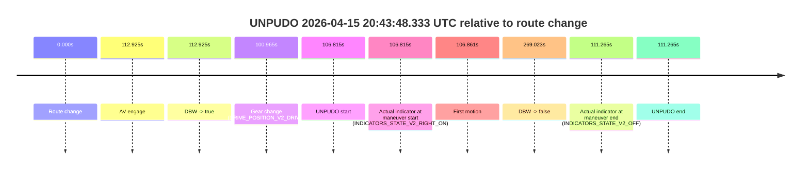
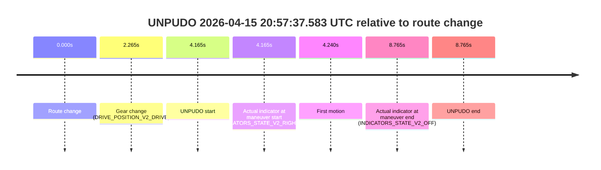
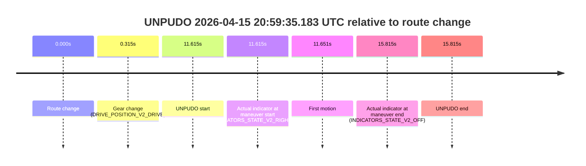
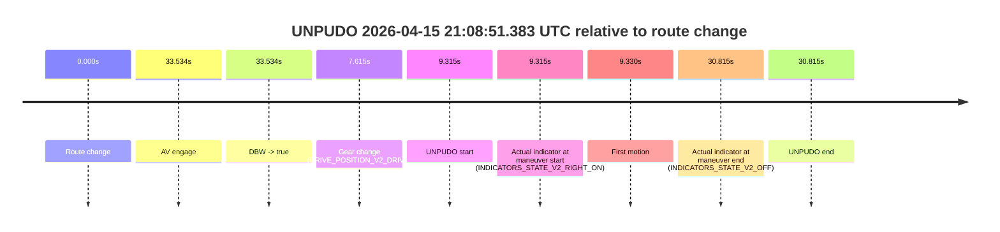

# Run Report: fme20029/2026-04-15--20-19-29--gen2-av-0bdec7a5-650e-48af-98c7-62119b02bbd2

| Field | Value |
|---|---|
| Run ID | `fme20029/2026-04-15--20-19-29--gen2-av-0bdec7a5-650e-48af-98c7-62119b02bbd2` |
| Date | `2026-04-15` |
| Model(s) | `satisfied-amber-moose` |
| Author | `guy.geva` |
| Event count | `8` |

## unpudo 2026-04-15 20:32:18.433 UTC

| Field | Value |
|---|---|
| Model | `satisfied-amber-moose` |
| Author | `guy.geva` |
| Run ID | `fme20029/2026-04-15--20-19-29--gen2-av-0bdec7a5-650e-48af-98c7-62119b02bbd2` |
| Date | `2026-04-15` |
| Time (UTC) | `20:32:18.433` |
| Event type | `unpudo` |
| Disengagement type | `none observed` |
| Route change | `found` |
| Console | [run](https://console.sso.wayve.ai/run/fme20029/2026-04-15--20-19-29--gen2-av-0bdec7a5-650e-48af-98c7-62119b02bbd2?id=&time-unixus=1776285138433300) |
| Foxglove | [segment](https://app.foxglove.dev/wayve-on-prem/p/prj_0dX18KZdVHg1fmmI/view?ds=foxglove-stream&ds.deviceName=fme20029&ds.start=2026-04-15T20%3A31%3A59.118326Z&ds.end=2026-04-15T20%3A35%3A58.002218Z&layoutId=lay_0e7VD4WIKDQGU73Y&time=2026-04-15T20%3A32%3A18.433300Z) |

### Event card: accidental

- Accidental: AV ownership is present for less than `2s`, so this is treated as an accidental brush with the maneuver rather than a meaningful model attempt.

| Event | Time (UTC) | Delta from route change |
|---|---:|---:|
| Route change | 2026-04-15 20:32:09.118 | `0.000s` |
| AV engage | 2026-04-15 20:32:57.523 | `48.405s` |
| DBW -> true | 2026-04-15 20:32:57.523 | `48.405s` |
| Gear change (DRIVE_POSITION_V2_REVERSE) | 2026-04-15 20:32:11.233 | `2.115s` |
| UNPUDO start | 2026-04-15 20:32:18.433 | `9.315s` |
| Actual indicator at maneuver start (INDICATORS_STATE_V2_OFF) | 2026-04-15 20:32:18.433 | `9.315s` |
| First motion | 2026-04-15 20:32:29.018 | `19.900s` |
| DBW -> false | 2026-04-15 20:35:48.002 | `218.884s` |
| Actual indicator at maneuver end (INDICATORS_STATE_V2_OFF) | 2026-04-15 20:32:52.783 | `43.665s` |
| UNPUDO end | 2026-04-15 20:32:52.783 | `43.665s` |

| Metric | Value |
|---|---|
| Outcome | `accidental` |
| Effective failure type | `none` |
| Route change status | `found` |
| DBW at event start | `false` |
| DBW at event end | `false` |
| Predicted gear at AV start | `DRIVE_POSITION_V2_DRIVE` |
| Actual gear at AV start | `DRIVE_POSITION_V2_DRIVE` |
| Predicted gear at event start | `DRIVE_POSITION_V2_REVERSE` |
| Actual gear at event start | `DRIVE_POSITION_V2_REVERSE` |
| Planned indicator direction | `INDICATORS_STATE_V2_OFF` |
| Controller indicator direction | `INDICATORS_STATE_V2_OFF` |
| Actual indicator direction | `INDICATORS_STATE_V2_OFF` |
| Actual indicator at maneuver end | `INDICATORS_STATE_V2_OFF` |
| Driver accel help in AV | `false` |
| Driver accel help timestamp | `n/a` |
| Max accel pedal pct in AV | `0.0%` |
| Max brake pedal pct in AV | `0.0%` |
| Max speed mps in AV | `0.000` |
| Route -> AV | `48.405s` |
| AV -> event start | `-39.090s` |
| AV -> first motion | `-28.505s` |
| AV duration before disengagement | `170.479s` |
| Trajectory waypoint count | `36` |
| Driving-plan step count | `11` |

The scored portion starts from the AV-owned window, not from the pre-AV setup. Route-change search in the stopped pre-event segment was `found`, with the baseline therefore set to route change. At the event anchor the model predicts `DRIVE_POSITION_V2_REVERSE` and the actual gear is `DRIVE_POSITION_V2_REVERSE`. The effective model outcome is `accidental` because `the AV-owned portion is shorter than 2s`.

### Resolution

| Field | Value |
|---|---|
| Final outcome | `accidental` |
| Do we agree with this label? | `yes` |
| Source disengagement type | `none observed` |
| Resolved effective failure type | `none` |
| Confidence | `high` |

## unpudo 2026-04-15 20:43:48.333 UTC

| Field | Value |
|---|---|
| Model | `satisfied-amber-moose` |
| Author | `guy.geva` |
| Run ID | `fme20029/2026-04-15--20-19-29--gen2-av-0bdec7a5-650e-48af-98c7-62119b02bbd2` |
| Date | `2026-04-15` |
| Time (UTC) | `20:43:48.333` |
| Event type | `unpudo` |
| Disengagement type | `failed_to_unpudo` |
| Route change | `found` |
| Console | [run](https://console.sso.wayve.ai/run/fme20029/2026-04-15--20-19-29--gen2-av-0bdec7a5-650e-48af-98c7-62119b02bbd2?id=&time-unixus=1776285828333310) |
| Foxglove | [segment](https://app.foxglove.dev/wayve-on-prem/p/prj_0dX18KZdVHg1fmmI/view?ds=foxglove-stream&ds.deviceName=fme20029&ds.start=2026-04-15T20%3A41%3A51.518245Z&ds.end=2026-04-15T20%3A46%3A40.541527Z&layoutId=lay_0e7VD4WIKDQGU73Y&time=2026-04-15T20%3A43%3A48.333310Z) |

### Event card: accidental

- Accidental: AV ownership is present for less than `2s`, so this is treated as an accidental brush with the maneuver rather than a meaningful model attempt.

| Event | Time (UTC) | Delta from route change |
|---|---:|---:|
| Route change | 2026-04-15 20:42:01.518 | `0.000s` |
| AV engage | 2026-04-15 20:43:54.443 | `112.925s` |
| DBW -> true | 2026-04-15 20:43:54.443 | `112.925s` |
| Gear change (DRIVE_POSITION_V2_DRIVE) | 2026-04-15 20:43:42.483 | `100.965s` |
| UNPUDO start | 2026-04-15 20:43:48.333 | `106.815s` |
| Actual indicator at maneuver start (INDICATORS_STATE_V2_RIGHT_ON) | 2026-04-15 20:43:48.333 | `106.815s` |
| First motion | 2026-04-15 20:43:48.378 | `106.861s` |
| DBW -> false | 2026-04-15 20:46:30.541 | `269.023s` |
| Actual indicator at maneuver end (INDICATORS_STATE_V2_OFF) | 2026-04-15 20:43:52.783 | `111.265s` |
| UNPUDO end | 2026-04-15 20:43:52.783 | `111.265s` |

| Metric | Value |
|---|---|
| Outcome | `accidental` |
| Effective failure type | `none` |
| Route change status | `found` |
| DBW at event start | `false` |
| DBW at event end | `false` |
| Predicted gear at AV start | `DRIVE_POSITION_V2_DRIVE` |
| Actual gear at AV start | `DRIVE_POSITION_V2_DRIVE` |
| Predicted gear at event start | `DRIVE_POSITION_V2_DRIVE` |
| Actual gear at event start | `DRIVE_POSITION_V2_DRIVE` |
| Planned indicator direction | `INDICATORS_STATE_V2_OFF` |
| Controller indicator direction | `INDICATORS_STATE_V2_LEFT_ON` |
| Actual indicator direction | `INDICATORS_STATE_V2_RIGHT_ON` |
| Actual indicator at maneuver end | `INDICATORS_STATE_V2_OFF` |
| Driver accel help in AV | `false` |
| Driver accel help timestamp | `n/a` |
| Max accel pedal pct in AV | `0.0%` |
| Max brake pedal pct in AV | `0.0%` |
| Max speed mps in AV | `0.000` |
| Route -> AV | `112.925s` |
| AV -> event start | `-6.110s` |
| AV -> first motion | `-6.065s` |
| AV duration before disengagement | `156.098s` |
| Trajectory waypoint count | `36` |
| Driving-plan step count | `11` |

The scored portion starts from the AV-owned window, not from the pre-AV setup. Route-change search in the stopped pre-event segment was `found`, with the baseline therefore set to route change. At the event anchor the model predicts `DRIVE_POSITION_V2_DRIVE` and the actual gear is `DRIVE_POSITION_V2_DRIVE`. The effective model outcome is `accidental` because `the AV-owned portion is shorter than 2s`.

### Resolution

| Field | Value |
|---|---|
| Final outcome | `accidental` |
| Do we agree with this label? | `yes` |
| Source disengagement type | `failed_to_unpudo` |
| Resolved effective failure type | `none` |
| Confidence | `high` |

## unpudo 2026-04-15 20:46:31.133 UTC

| Field | Value |
|---|---|
| Model | `satisfied-amber-moose` |
| Author | `guy.geva` |
| Run ID | `fme20029/2026-04-15--20-19-29--gen2-av-0bdec7a5-650e-48af-98c7-62119b02bbd2` |
| Date | `2026-04-15` |
| Time (UTC) | `20:46:31.133` |
| Event type | `unpudo` |
| Disengagement type | `failed_to_unpudo` |
| Route change | `found` |
| Console | [run](https://console.sso.wayve.ai/run/fme20029/2026-04-15--20-19-29--gen2-av-0bdec7a5-650e-48af-98c7-62119b02bbd2?id=&time-unixus=1776285991133298) |
| Foxglove | [segment](https://app.foxglove.dev/wayve-on-prem/p/prj_0dX18KZdVHg1fmmI/view?ds=foxglove-stream&ds.deviceName=fme20029&ds.start=2026-04-15T20%3A46%3A02.618317Z&ds.end=2026-04-15T20%3A49%3A28.042365Z&layoutId=lay_0e7VD4WIKDQGU73Y&time=2026-04-15T20%3A46%3A31.133298Z) |

### Event card: accidental

- Accidental: AV ownership is present for less than `2s`, so this is treated as an accidental brush with the maneuver rather than a meaningful model attempt.

| Event | Time (UTC) | Delta from route change |
|---|---:|---:|
| Route change | 2026-04-15 20:46:12.618 | `0.000s` |
| AV engage | 2026-04-15 20:46:38.542 | `25.924s` |
| DBW -> true | 2026-04-15 20:46:38.542 | `25.924s` |
| Gear change (DRIVE_POSITION_V2_DRIVE) | 2026-04-15 20:46:12.883 | `0.265s` |
| UNPUDO start | 2026-04-15 20:46:31.133 | `18.515s` |
| Actual indicator at maneuver start (INDICATORS_STATE_V2_OFF) | 2026-04-15 20:46:31.133 | `18.515s` |
| First motion | 2026-04-15 20:46:31.179 | `18.561s` |
| DBW -> false | 2026-04-15 20:49:18.042 | `185.424s` |
| Actual indicator at maneuver end (INDICATORS_STATE_V2_OFF) | 2026-04-15 20:46:35.683 | `23.065s` |
| UNPUDO end | 2026-04-15 20:46:35.683 | `23.065s` |

| Metric | Value |
|---|---|
| Outcome | `accidental` |
| Effective failure type | `none` |
| Route change status | `found` |
| DBW at event start | `false` |
| DBW at event end | `false` |
| Predicted gear at AV start | `DRIVE_POSITION_V2_DRIVE` |
| Actual gear at AV start | `DRIVE_POSITION_V2_DRIVE` |
| Predicted gear at event start | `DRIVE_POSITION_V2_DRIVE` |
| Actual gear at event start | `DRIVE_POSITION_V2_DRIVE` |
| Planned indicator direction | `INDICATORS_STATE_V2_RIGHT_ON` |
| Controller indicator direction | `INDICATORS_STATE_V2_RIGHT_ON` |
| Actual indicator direction | `INDICATORS_STATE_V2_OFF` |
| Actual indicator at maneuver end | `INDICATORS_STATE_V2_OFF` |
| Driver accel help in AV | `false` |
| Driver accel help timestamp | `n/a` |
| Max accel pedal pct in AV | `0.0%` |
| Max brake pedal pct in AV | `0.0%` |
| Max speed mps in AV | `0.000` |
| Route -> AV | `25.924s` |
| AV -> event start | `-7.409s` |
| AV -> first motion | `-7.363s` |
| AV duration before disengagement | `159.500s` |
| Trajectory waypoint count | `36` |
| Driving-plan step count | `11` |

The scored portion starts from the AV-owned window, not from the pre-AV setup. Route-change search in the stopped pre-event segment was `found`, with the baseline therefore set to route change. At the event anchor the model predicts `DRIVE_POSITION_V2_DRIVE` and the actual gear is `DRIVE_POSITION_V2_DRIVE`. The effective model outcome is `accidental` because `the AV-owned portion is shorter than 2s`.

### Resolution

| Field | Value |
|---|---|
| Final outcome | `accidental` |
| Do we agree with this label? | `yes` |
| Source disengagement type | `failed_to_unpudo` |
| Resolved effective failure type | `none` |
| Confidence | `high` |

## unpudo 2026-04-15 20:49:21.833 UTC

| Field | Value |
|---|---|
| Model | `satisfied-amber-moose` |
| Author | `guy.geva` |
| Run ID | `fme20029/2026-04-15--20-19-29--gen2-av-0bdec7a5-650e-48af-98c7-62119b02bbd2` |
| Date | `2026-04-15` |
| Time (UTC) | `20:49:21.833` |
| Event type | `unpudo` |
| Disengagement type | `failed_to_unpudo` |
| Route change | `found` |
| Console | [run](https://console.sso.wayve.ai/run/fme20029/2026-04-15--20-19-29--gen2-av-0bdec7a5-650e-48af-98c7-62119b02bbd2?id=&time-unixus=1776286161833295) |
| Foxglove | [segment](https://app.foxglove.dev/wayve-on-prem/p/prj_0dX18KZdVHg1fmmI/view?ds=foxglove-stream&ds.deviceName=fme20029&ds.start=2026-04-15T20%3A48%3A59.818384Z&ds.end=2026-04-15T20%3A49%3A59.262163Z&layoutId=lay_0e7VD4WIKDQGU73Y&time=2026-04-15T20%3A49%3A21.833295Z) |

### Event card: accidental

- Accidental: AV ownership is present for less than `2s`, so this is treated as an accidental brush with the maneuver rather than a meaningful model attempt.

| Event | Time (UTC) | Delta from route change |
|---|---:|---:|
| Route change | 2026-04-15 20:49:09.818 | `0.000s` |
| AV engage | 2026-04-15 20:49:28.242 | `18.424s` |
| DBW -> true | 2026-04-15 20:49:28.242 | `18.424s` |
| Gear change (DRIVE_POSITION_V2_DRIVE) | 2026-04-15 20:49:10.083 | `0.265s` |
| UNPUDO start | 2026-04-15 20:49:21.833 | `12.015s` |
| Actual indicator at maneuver start (INDICATORS_STATE_V2_RIGHT_ON) | 2026-04-15 20:49:21.833 | `12.015s` |
| First motion | 2026-04-15 20:49:21.938 | `12.121s` |
| DBW -> false | 2026-04-15 20:49:49.262 | `39.444s` |
| Actual indicator at maneuver end (INDICATORS_STATE_V2_OFF) | 2026-04-15 20:49:26.783 | `16.965s` |
| UNPUDO end | 2026-04-15 20:49:26.783 | `16.965s` |

| Metric | Value |
|---|---|
| Outcome | `accidental` |
| Effective failure type | `none` |
| Route change status | `found` |
| DBW at event start | `false` |
| DBW at event end | `false` |
| Predicted gear at AV start | `DRIVE_POSITION_V2_DRIVE` |
| Actual gear at AV start | `DRIVE_POSITION_V2_DRIVE` |
| Predicted gear at event start | `DRIVE_POSITION_V2_DRIVE` |
| Actual gear at event start | `DRIVE_POSITION_V2_DRIVE` |
| Planned indicator direction | `INDICATORS_STATE_V2_RIGHT_ON` |
| Controller indicator direction | `INDICATORS_STATE_V2_RIGHT_ON` |
| Actual indicator direction | `INDICATORS_STATE_V2_RIGHT_ON` |
| Actual indicator at maneuver end | `INDICATORS_STATE_V2_OFF` |
| Driver accel help in AV | `false` |
| Driver accel help timestamp | `n/a` |
| Max accel pedal pct in AV | `0.0%` |
| Max brake pedal pct in AV | `0.0%` |
| Max speed mps in AV | `0.000` |
| Route -> AV | `18.424s` |
| AV -> event start | `-6.409s` |
| AV -> first motion | `-6.303s` |
| AV duration before disengagement | `21.020s` |
| Trajectory waypoint count | `36` |
| Driving-plan step count | `11` |

The scored portion starts from the AV-owned window, not from the pre-AV setup. Route-change search in the stopped pre-event segment was `found`, with the baseline therefore set to route change. At the event anchor the model predicts `DRIVE_POSITION_V2_DRIVE` and the actual gear is `DRIVE_POSITION_V2_DRIVE`. The effective model outcome is `accidental` because `the AV-owned portion is shorter than 2s`.

### Resolution

| Field | Value |
|---|---|
| Final outcome | `accidental` |
| Do we agree with this label? | `yes` |
| Source disengagement type | `failed_to_unpudo` |
| Resolved effective failure type | `none` |
| Confidence | `high` |

## unpudo 2026-04-15 20:57:37.583 UTC

| Field | Value |
|---|---|
| Model | `satisfied-amber-moose` |
| Author | `guy.geva` |
| Run ID | `fme20029/2026-04-15--20-19-29--gen2-av-0bdec7a5-650e-48af-98c7-62119b02bbd2` |
| Date | `2026-04-15` |
| Time (UTC) | `20:57:37.583` |
| Event type | `unpudo` |
| Disengagement type | `none observed` |
| Route change | `found` |
| Console | [run](https://console.sso.wayve.ai/run/fme20029/2026-04-15--20-19-29--gen2-av-0bdec7a5-650e-48af-98c7-62119b02bbd2?id=&time-unixus=1776286657583319) |
| Foxglove | [segment](https://app.foxglove.dev/wayve-on-prem/p/prj_0dX18KZdVHg1fmmI/view?ds=foxglove-stream&ds.deviceName=fme20029&ds.start=2026-04-15T20%3A57%3A23.418243Z&ds.end=2026-04-15T20%3A57%3A52.183311Z&layoutId=lay_0e7VD4WIKDQGU73Y&time=2026-04-15T20%3A57%3A37.583319Z) |

### Event card: non-av

- Non-AV: the detected unpudo starts outside AV ownership, so it is kept for coverage but excluded from model success / failure scoring.

| Event | Time (UTC) | Delta from route change |
|---|---:|---:|
| Route change | 2026-04-15 20:57:33.418 | `0.000s` |
| Gear change (DRIVE_POSITION_V2_DRIVE) | 2026-04-15 20:57:35.683 | `2.265s` |
| UNPUDO start | 2026-04-15 20:57:37.583 | `4.165s` |
| Actual indicator at maneuver start (INDICATORS_STATE_V2_RIGHT_ON) | 2026-04-15 20:57:37.583 | `4.165s` |
| First motion | 2026-04-15 20:57:37.658 | `4.240s` |
| Actual indicator at maneuver end (INDICATORS_STATE_V2_OFF) | 2026-04-15 20:57:42.183 | `8.765s` |
| UNPUDO end | 2026-04-15 20:57:42.183 | `8.765s` |

| Metric | Value |
|---|---|
| Outcome | `non-av` |
| Effective failure type | `none` |
| Route change status | `found` |
| DBW at event start | `false` |
| DBW at event end | `false` |
| Predicted gear at AV start | `n/a` |
| Actual gear at AV start | `n/a` |
| Predicted gear at event start | `DRIVE_POSITION_V2_DRIVE` |
| Actual gear at event start | `DRIVE_POSITION_V2_DRIVE` |
| Planned indicator direction | `INDICATORS_STATE_V2_OFF` |
| Controller indicator direction | `INDICATORS_STATE_V2_OFF` |
| Actual indicator direction | `INDICATORS_STATE_V2_RIGHT_ON` |
| Actual indicator at maneuver end | `INDICATORS_STATE_V2_OFF` |
| Driver accel help in AV | `false` |
| Driver accel help timestamp | `n/a` |
| Max accel pedal pct in AV | `0.0%` |
| Max brake pedal pct in AV | `0.0%` |
| Max speed mps in AV | `0.000` |
| Route -> AV | `n/a` |
| AV -> event start | `n/a` |
| AV -> first motion | `n/a` |
| AV duration before disengagement | `n/a` |
| Trajectory waypoint count | `37` |
| Driving-plan step count | `11` |

The scored portion starts from the AV-owned window, not from the pre-AV setup. Route-change search in the stopped pre-event segment was `found`, with the baseline therefore set to route change. At the event anchor the model predicts `DRIVE_POSITION_V2_DRIVE` and the actual gear is `DRIVE_POSITION_V2_DRIVE`. The effective model outcome is `non-av` because `the event does not begin in AV ownership`.

### Resolution

| Field | Value |
|---|---|
| Final outcome | `non-av` |
| Do we agree with this label? | `yes` |
| Source disengagement type | `none observed` |
| Resolved effective failure type | `none` |
| Confidence | `high` |

## unpudo 2026-04-15 20:59:35.183 UTC

| Field | Value |
|---|---|
| Model | `satisfied-amber-moose` |
| Author | `guy.geva` |
| Run ID | `fme20029/2026-04-15--20-19-29--gen2-av-0bdec7a5-650e-48af-98c7-62119b02bbd2` |
| Date | `2026-04-15` |
| Time (UTC) | `20:59:35.183` |
| Event type | `unpudo` |
| Disengagement type | `failed_to_unpudo` |
| Route change | `found` |
| Console | [run](https://console.sso.wayve.ai/run/fme20029/2026-04-15--20-19-29--gen2-av-0bdec7a5-650e-48af-98c7-62119b02bbd2?id=&time-unixus=1776286775183320) |
| Foxglove | [segment](https://app.foxglove.dev/wayve-on-prem/p/prj_0dX18KZdVHg1fmmI/view?ds=foxglove-stream&ds.deviceName=fme20029&ds.start=2026-04-15T20%3A59%3A13.568274Z&ds.end=2026-04-15T20%3A59%3A49.383303Z&layoutId=lay_0e7VD4WIKDQGU73Y&time=2026-04-15T20%3A59%3A35.183320Z) |

### Event card: non-av

- Non-AV: the detected unpudo starts outside AV ownership, so it is kept for coverage but excluded from model success / failure scoring.

| Event | Time (UTC) | Delta from route change |
|---|---:|---:|
| Route change | 2026-04-15 20:59:23.568 | `0.000s` |
| Gear change (DRIVE_POSITION_V2_DRIVE) | 2026-04-15 20:59:23.883 | `0.315s` |
| UNPUDO start | 2026-04-15 20:59:35.183 | `11.615s` |
| Actual indicator at maneuver start (INDICATORS_STATE_V2_RIGHT_ON) | 2026-04-15 20:59:35.183 | `11.615s` |
| First motion | 2026-04-15 20:59:35.219 | `11.651s` |
| Actual indicator at maneuver end (INDICATORS_STATE_V2_OFF) | 2026-04-15 20:59:39.383 | `15.815s` |
| UNPUDO end | 2026-04-15 20:59:39.383 | `15.815s` |

| Metric | Value |
|---|---|
| Outcome | `non-av` |
| Effective failure type | `none` |
| Route change status | `found` |
| DBW at event start | `false` |
| DBW at event end | `false` |
| Predicted gear at AV start | `n/a` |
| Actual gear at AV start | `n/a` |
| Predicted gear at event start | `DRIVE_POSITION_V2_DRIVE` |
| Actual gear at event start | `DRIVE_POSITION_V2_DRIVE` |
| Planned indicator direction | `INDICATORS_STATE_V2_OFF` |
| Controller indicator direction | `INDICATORS_STATE_V2_OFF` |
| Actual indicator direction | `INDICATORS_STATE_V2_RIGHT_ON` |
| Actual indicator at maneuver end | `INDICATORS_STATE_V2_OFF` |
| Driver accel help in AV | `false` |
| Driver accel help timestamp | `n/a` |
| Max accel pedal pct in AV | `0.0%` |
| Max brake pedal pct in AV | `0.0%` |
| Max speed mps in AV | `0.000` |
| Route -> AV | `n/a` |
| AV -> event start | `n/a` |
| AV -> first motion | `n/a` |
| AV duration before disengagement | `n/a` |
| Trajectory waypoint count | `37` |
| Driving-plan step count | `11` |

The scored portion starts from the AV-owned window, not from the pre-AV setup. Route-change search in the stopped pre-event segment was `found`, with the baseline therefore set to route change. At the event anchor the model predicts `DRIVE_POSITION_V2_DRIVE` and the actual gear is `DRIVE_POSITION_V2_DRIVE`. The effective model outcome is `non-av` because `the event does not begin in AV ownership`.

### Resolution

| Field | Value |
|---|---|
| Final outcome | `non-av` |
| Do we agree with this label? | `yes` |
| Source disengagement type | `failed_to_unpudo` |
| Resolved effective failure type | `none` |
| Confidence | `high` |

## unpudo 2026-04-15 21:06:58.483 UTC

| Field | Value |
|---|---|
| Model | `satisfied-amber-moose` |
| Author | `guy.geva` |
| Run ID | `fme20029/2026-04-15--20-19-29--gen2-av-0bdec7a5-650e-48af-98c7-62119b02bbd2` |
| Date | `2026-04-15` |
| Time (UTC) | `21:06:58.483` |
| Event type | `unpudo` |
| Disengagement type | `none observed` |
| Route change | `found` |
| Console | [run](https://console.sso.wayve.ai/run/fme20029/2026-04-15--20-19-29--gen2-av-0bdec7a5-650e-48af-98c7-62119b02bbd2?id=&time-unixus=1776287218483325) |
| Foxglove | [segment](https://app.foxglove.dev/wayve-on-prem/p/prj_0dX18KZdVHg1fmmI/view?ds=foxglove-stream&ds.deviceName=fme20029&ds.start=2026-04-15T21%3A06%3A19.018335Z&ds.end=2026-04-15T21%3A08%3A31.642839Z&layoutId=lay_0e7VD4WIKDQGU73Y&time=2026-04-15T21%3A06%3A58.483325Z) |

### Event card: accidental

- Accidental: AV ownership is present for less than `2s`, so this is treated as an accidental brush with the maneuver rather than a meaningful model attempt.

| Event | Time (UTC) | Delta from route change |
|---|---:|---:|
| Route change | 2026-04-15 21:06:29.018 | `0.000s` |
| AV engage | 2026-04-15 21:07:02.663 | `33.645s` |
| DBW -> true | 2026-04-15 21:07:02.663 | `33.645s` |
| Gear change (DRIVE_POSITION_V2_DRIVE) | 2026-04-15 21:06:57.383 | `28.365s` |
| UNPUDO start | 2026-04-15 21:06:58.483 | `29.465s` |
| Actual indicator at maneuver start (INDICATORS_STATE_V2_RIGHT_ON) | 2026-04-15 21:06:58.483 | `29.465s` |
| First motion | 2026-04-15 21:06:58.539 | `29.521s` |
| DBW -> false | 2026-04-15 21:08:21.642 | `112.625s` |
| Actual indicator at maneuver end (INDICATORS_STATE_V2_OFF) | 2026-04-15 21:07:02.233 | `33.215s` |
| UNPUDO end | 2026-04-15 21:07:02.233 | `33.215s` |

| Metric | Value |
|---|---|
| Outcome | `accidental` |
| Effective failure type | `none` |
| Route change status | `found` |
| DBW at event start | `false` |
| DBW at event end | `false` |
| Predicted gear at AV start | `DRIVE_POSITION_V2_DRIVE` |
| Actual gear at AV start | `DRIVE_POSITION_V2_DRIVE` |
| Predicted gear at event start | `DRIVE_POSITION_V2_DRIVE` |
| Actual gear at event start | `DRIVE_POSITION_V2_DRIVE` |
| Planned indicator direction | `INDICATORS_STATE_V2_LEFT_ON` |
| Controller indicator direction | `INDICATORS_STATE_V2_LEFT_ON` |
| Actual indicator direction | `INDICATORS_STATE_V2_RIGHT_ON` |
| Actual indicator at maneuver end | `INDICATORS_STATE_V2_OFF` |
| Driver accel help in AV | `false` |
| Driver accel help timestamp | `n/a` |
| Max accel pedal pct in AV | `0.0%` |
| Max brake pedal pct in AV | `0.0%` |
| Max speed mps in AV | `0.000` |
| Route -> AV | `33.645s` |
| AV -> event start | `-4.180s` |
| AV -> first motion | `-4.124s` |
| AV duration before disengagement | `78.980s` |
| Trajectory waypoint count | `37` |
| Driving-plan step count | `11` |

The scored portion starts from the AV-owned window, not from the pre-AV setup. Route-change search in the stopped pre-event segment was `found`, with the baseline therefore set to route change. At the event anchor the model predicts `DRIVE_POSITION_V2_DRIVE` and the actual gear is `DRIVE_POSITION_V2_DRIVE`. The effective model outcome is `accidental` because `the AV-owned portion is shorter than 2s`.

### Resolution

| Field | Value |
|---|---|
| Final outcome | `accidental` |
| Do we agree with this label? | `yes` |
| Source disengagement type | `none observed` |
| Resolved effective failure type | `none` |
| Confidence | `high` |

## unpudo 2026-04-15 21:08:51.383 UTC

| Field | Value |
|---|---|
| Model | `satisfied-amber-moose` |
| Author | `guy.geva` |
| Run ID | `fme20029/2026-04-15--20-19-29--gen2-av-0bdec7a5-650e-48af-98c7-62119b02bbd2` |
| Date | `2026-04-15` |
| Time (UTC) | `21:08:51.383` |
| Event type | `unpudo` |
| Disengagement type | `none observed` |
| Route change | `found` |
| Console | [run](https://console.sso.wayve.ai/run/fme20029/2026-04-15--20-19-29--gen2-av-0bdec7a5-650e-48af-98c7-62119b02bbd2?id=&time-unixus=1776287331383319) |
| Foxglove | [segment](https://app.foxglove.dev/wayve-on-prem/p/prj_0dX18KZdVHg1fmmI/view?ds=foxglove-stream&ds.deviceName=fme20029&ds.start=2026-04-15T21%3A08%3A32.068338Z&ds.end=2026-04-15T21%3A09%3A22.883306Z&layoutId=lay_0e7VD4WIKDQGU73Y&time=2026-04-15T21%3A08%3A51.383319Z) |

### Event card: accidental

- Accidental: AV ownership is present for less than `2s`, so this is treated as an accidental brush with the maneuver rather than a meaningful model attempt.

| Event | Time (UTC) | Delta from route change |
|---|---:|---:|
| Route change | 2026-04-15 21:08:42.068 | `0.000s` |
| AV engage | 2026-04-15 21:09:15.602 | `33.534s` |
| DBW -> true | 2026-04-15 21:09:15.602 | `33.534s` |
| Gear change (DRIVE_POSITION_V2_DRIVE) | 2026-04-15 21:08:49.683 | `7.615s` |
| UNPUDO start | 2026-04-15 21:08:51.383 | `9.315s` |
| Actual indicator at maneuver start (INDICATORS_STATE_V2_RIGHT_ON) | 2026-04-15 21:08:51.383 | `9.315s` |
| First motion | 2026-04-15 21:08:51.398 | `9.330s` |
| Actual indicator at maneuver end (INDICATORS_STATE_V2_OFF) | 2026-04-15 21:09:12.883 | `30.815s` |
| UNPUDO end | 2026-04-15 21:09:12.883 | `30.815s` |

| Metric | Value |
|---|---|
| Outcome | `accidental` |
| Effective failure type | `none` |
| Route change status | `found` |
| DBW at event start | `false` |
| DBW at event end | `false` |
| Predicted gear at AV start | `DRIVE_POSITION_V2_DRIVE` |
| Actual gear at AV start | `DRIVE_POSITION_V2_DRIVE` |
| Predicted gear at event start | `DRIVE_POSITION_V2_DRIVE` |
| Actual gear at event start | `DRIVE_POSITION_V2_DRIVE` |
| Planned indicator direction | `INDICATORS_STATE_V2_OFF` |
| Controller indicator direction | `INDICATORS_STATE_V2_OFF` |
| Actual indicator direction | `INDICATORS_STATE_V2_RIGHT_ON` |
| Actual indicator at maneuver end | `INDICATORS_STATE_V2_OFF` |
| Driver accel help in AV | `false` |
| Driver accel help timestamp | `n/a` |
| Max accel pedal pct in AV | `0.0%` |
| Max brake pedal pct in AV | `0.0%` |
| Max speed mps in AV | `0.000` |
| Route -> AV | `33.534s` |
| AV -> event start | `-24.219s` |
| AV -> first motion | `-24.203s` |
| AV duration before disengagement | `n/a` |
| Trajectory waypoint count | `37` |
| Driving-plan step count | `11` |

The scored portion starts from the AV-owned window, not from the pre-AV setup. Route-change search in the stopped pre-event segment was `found`, with the baseline therefore set to route change. At the event anchor the model predicts `DRIVE_POSITION_V2_DRIVE` and the actual gear is `DRIVE_POSITION_V2_DRIVE`. The effective model outcome is `accidental` because `the AV-owned portion is shorter than 2s`.

### Resolution

| Field | Value |
|---|---|
| Final outcome | `accidental` |
| Do we agree with this label? | `yes` |
| Source disengagement type | `none observed` |
| Resolved effective failure type | `none` |
| Confidence | `high` |
