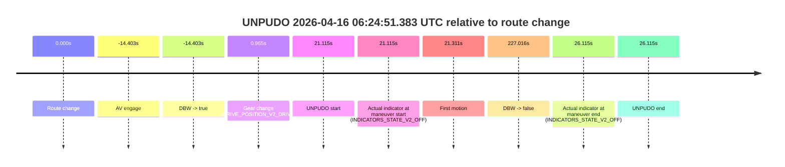
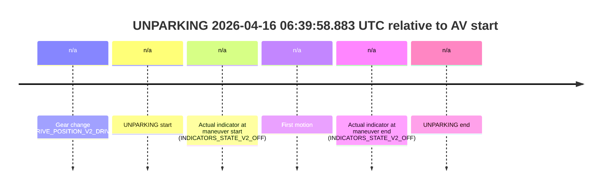

# Run Report: fme20029/2026-04-16--06-05-05--gen2-av-9848f661-e931-45fe-8d44-4ab043e718b8

| Field | Value |
|---|---|
| Run ID | `fme20029/2026-04-16--06-05-05--gen2-av-9848f661-e931-45fe-8d44-4ab043e718b8` |
| Date | `2026-04-16` |
| Model(s) | `plum-timeless-beaver` |
| Author | `peng.tang` |
| Event count | `7` |

## unpudo 2026-04-16 06:11:13.183 UTC

| Field | Value |
|---|---|
| Model | `plum-timeless-beaver` |
| Author | `peng.tang` |
| Run ID | `fme20029/2026-04-16--06-05-05--gen2-av-9848f661-e931-45fe-8d44-4ab043e718b8` |
| Date | `2026-04-16` |
| Time (UTC) | `06:11:13.183` |
| Event type | `unpudo` |
| Disengagement type | `none observed` |
| Route change | `found` |
| Console | [run](https://console.sso.wayve.ai/run/fme20029/2026-04-16--06-05-05--gen2-av-9848f661-e931-45fe-8d44-4ab043e718b8?id=&time-unixus=1776319873183288) |
| Foxglove | [segment](https://app.foxglove.dev/wayve-on-prem/p/prj_0dX18KZdVHg1fmmI/view?ds=foxglove-stream&ds.deviceName=fme20029&ds.start=2026-04-16T06%3A10%3A32.718258Z&ds.end=2026-04-16T06%3A18%3A23.351147Z&layoutId=lay_0e7VD4WIKDQGU73Y&time=2026-04-16T06%3A11%3A13.183288Z) |

### Event card: pass

- Pass: AV owns the credited unpudo through the official event window, the gear state is aligned at the anchor, and the vehicle moves without driver accelerator help in AV.

| Event | Time (UTC) | Delta from route change |
|---|---:|---:|
| Route change | 2026-04-16 06:10:42.718 | `0.000s` |
| AV engage | 2026-04-16 06:10:42.720 | `0.003s` |
| DBW -> true | 2026-04-16 06:10:42.720 | `0.003s` |
| Gear change (DRIVE_POSITION_V2_DRIVE) | 2026-04-16 06:10:43.033 | `0.315s` |
| UNPUDO start | 2026-04-16 06:11:13.183 | `30.465s` |
| Actual indicator at maneuver start (INDICATORS_STATE_V2_RIGHT_ON) | 2026-04-16 06:11:13.183 | `30.465s` |
| First motion | 2026-04-16 06:11:13.218 | `30.500s` |
| DBW -> false | 2026-04-16 06:18:13.351 | `450.633s` |
| Actual indicator at maneuver end (INDICATORS_STATE_V2_OFF) | 2026-04-16 06:11:19.483 | `36.765s` |
| UNPUDO end | 2026-04-16 06:11:19.483 | `36.765s` |

| Metric | Value |
|---|---|
| Outcome | `pass` |
| Effective failure type | `none` |
| Route change status | `found` |
| DBW at event start | `true` |
| DBW at event end | `true` |
| Predicted gear at AV start | `DRIVE_POSITION_V2_PARK` |
| Actual gear at AV start | `DRIVE_POSITION_V2_PARK` |
| Predicted gear at event start | `DRIVE_POSITION_V2_DRIVE` |
| Actual gear at event start | `DRIVE_POSITION_V2_DRIVE` |
| Planned indicator direction | `INDICATORS_STATE_V2_OFF` |
| Controller indicator direction | `INDICATORS_STATE_V2_OFF` |
| Actual indicator direction | `INDICATORS_STATE_V2_RIGHT_ON` |
| Actual indicator at maneuver end | `INDICATORS_STATE_V2_OFF` |
| Driver accel help in AV | `false` |
| Driver accel help timestamp | `n/a` |
| Max accel pedal pct in AV | `0.0%` |
| Max brake pedal pct in AV | `0.0%` |
| Max speed mps in AV | `3.911` |
| Route -> AV | `0.003s` |
| AV -> event start | `30.462s` |
| AV -> first motion | `30.498s` |
| AV duration before disengagement | `450.630s` |
| Trajectory waypoint count | `37` |
| Driving-plan step count | `11` |

The scored portion starts from the AV-owned window, not from the pre-AV setup. Route-change search in the stopped pre-event segment was `found`, with the baseline therefore set to route change. At the event anchor the model predicts `DRIVE_POSITION_V2_DRIVE` and the actual gear is `DRIVE_POSITION_V2_DRIVE`. The effective model outcome is `pass` because `the credited maneuver stays AV-owned through the official event end`.

### Resolution

| Field | Value |
|---|---|
| Final outcome | `pass` |
| Do we agree with this label? | `yes` |
| Source disengagement type | `none observed` |
| Resolved effective failure type | `none` |
| Confidence | `high` |

## unpudo 2026-04-16 06:14:16.883 UTC

| Field | Value |
|---|---|
| Model | `plum-timeless-beaver` |
| Author | `peng.tang` |
| Run ID | `fme20029/2026-04-16--06-05-05--gen2-av-9848f661-e931-45fe-8d44-4ab043e718b8` |
| Date | `2026-04-16` |
| Time (UTC) | `06:14:16.883` |
| Event type | `unpudo` |
| Disengagement type | `none observed` |
| Route change | `found` |
| Console | [run](https://console.sso.wayve.ai/run/fme20029/2026-04-16--06-05-05--gen2-av-9848f661-e931-45fe-8d44-4ab043e718b8?id=&time-unixus=1776320056883324) |
| Foxglove | [segment](https://app.foxglove.dev/wayve-on-prem/p/prj_0dX18KZdVHg1fmmI/view?ds=foxglove-stream&ds.deviceName=fme20029&ds.start=2026-04-16T06%3A13%3A57.918241Z&ds.end=2026-04-16T06%3A18%3A23.351147Z&layoutId=lay_0e7VD4WIKDQGU73Y&time=2026-04-16T06%3A14%3A16.883324Z) |

### Event card: pass

- Pass: AV owns the credited unpudo through the official event window, the gear state is aligned at the anchor, and the vehicle moves without driver accelerator help in AV.

| Event | Time (UTC) | Delta from route change |
|---|---:|---:|
| Route change | 2026-04-16 06:14:07.918 | `0.000s` |
| AV engage | 2026-04-16 06:14:07.920 | `0.003s` |
| DBW -> true | 2026-04-16 06:14:07.920 | `0.003s` |
| Gear change (DRIVE_POSITION_V2_DRIVE) | 2026-04-16 06:14:08.233 | `0.315s` |
| UNPUDO start | 2026-04-16 06:14:16.883 | `8.965s` |
| Actual indicator at maneuver start (INDICATORS_STATE_V2_RIGHT_ON) | 2026-04-16 06:14:16.883 | `8.965s` |
| First motion | 2026-04-16 06:14:17.218 | `9.301s` |
| DBW -> false | 2026-04-16 06:18:13.351 | `245.433s` |
| Actual indicator at maneuver end (INDICATORS_STATE_V2_OFF) | 2026-04-16 06:14:21.733 | `13.815s` |
| UNPUDO end | 2026-04-16 06:14:21.733 | `13.815s` |

| Metric | Value |
|---|---|
| Outcome | `pass` |
| Effective failure type | `none` |
| Route change status | `found` |
| DBW at event start | `true` |
| DBW at event end | `true` |
| Predicted gear at AV start | `DRIVE_POSITION_V2_PARK` |
| Actual gear at AV start | `DRIVE_POSITION_V2_PARK` |
| Predicted gear at event start | `DRIVE_POSITION_V2_DRIVE` |
| Actual gear at event start | `DRIVE_POSITION_V2_DRIVE` |
| Planned indicator direction | `INDICATORS_STATE_V2_RIGHT_ON` |
| Controller indicator direction | `INDICATORS_STATE_V2_RIGHT_ON` |
| Actual indicator direction | `INDICATORS_STATE_V2_RIGHT_ON` |
| Actual indicator at maneuver end | `INDICATORS_STATE_V2_OFF` |
| Driver accel help in AV | `false` |
| Driver accel help timestamp | `n/a` |
| Max accel pedal pct in AV | `0.0%` |
| Max brake pedal pct in AV | `0.0%` |
| Max speed mps in AV | `3.986` |
| Route -> AV | `0.003s` |
| AV -> event start | `8.962s` |
| AV -> first motion | `9.298s` |
| AV duration before disengagement | `245.430s` |
| Trajectory waypoint count | `37` |
| Driving-plan step count | `11` |

The scored portion starts from the AV-owned window, not from the pre-AV setup. Route-change search in the stopped pre-event segment was `found`, with the baseline therefore set to route change. At the event anchor the model predicts `DRIVE_POSITION_V2_DRIVE` and the actual gear is `DRIVE_POSITION_V2_DRIVE`. The effective model outcome is `pass` because `the credited maneuver stays AV-owned through the official event end`.

### Resolution

| Field | Value |
|---|---|
| Final outcome | `pass` |
| Do we agree with this label? | `yes` |
| Source disengagement type | `none observed` |
| Resolved effective failure type | `none` |
| Confidence | `high` |

## unpudo 2026-04-16 06:15:24.583 UTC

| Field | Value |
|---|---|
| Model | `plum-timeless-beaver` |
| Author | `peng.tang` |
| Run ID | `fme20029/2026-04-16--06-05-05--gen2-av-9848f661-e931-45fe-8d44-4ab043e718b8` |
| Date | `2026-04-16` |
| Time (UTC) | `06:15:24.583` |
| Event type | `unpudo` |
| Disengagement type | `none observed` |
| Route change | `found` |
| Console | [run](https://console.sso.wayve.ai/run/fme20029/2026-04-16--06-05-05--gen2-av-9848f661-e931-45fe-8d44-4ab043e718b8?id=&time-unixus=1776320124583304) |
| Foxglove | [segment](https://app.foxglove.dev/wayve-on-prem/p/prj_0dX18KZdVHg1fmmI/view?ds=foxglove-stream&ds.deviceName=fme20029&ds.start=2026-04-16T06%3A13%3A57.918241Z&ds.end=2026-04-16T06%3A18%3A23.351147Z&layoutId=lay_0e7VD4WIKDQGU73Y&time=2026-04-16T06%3A15%3A24.583304Z) |

### Event card: pass

- Pass: AV owns the credited unpudo through the official event window, the gear state is aligned at the anchor, and the vehicle moves without driver accelerator help in AV.

| Event | Time (UTC) | Delta from route change |
|---|---:|---:|
| Route change | 2026-04-16 06:14:07.918 | `0.000s` |
| AV engage | 2026-04-16 06:14:07.920 | `0.003s` |
| DBW -> true | 2026-04-16 06:14:07.920 | `0.003s` |
| Gear change (DRIVE_POSITION_V2_DRIVE) | 2026-04-16 06:15:03.233 | `55.315s` |
| UNPUDO start | 2026-04-16 06:15:24.583 | `76.665s` |
| Actual indicator at maneuver start (INDICATORS_STATE_V2_OFF) | 2026-04-16 06:15:24.583 | `76.665s` |
| First motion | 2026-04-16 06:15:24.778 | `76.861s` |
| DBW -> false | 2026-04-16 06:18:13.351 | `245.433s` |
| Actual indicator at maneuver end (INDICATORS_STATE_V2_OFF) | 2026-04-16 06:15:29.933 | `82.015s` |
| UNPUDO end | 2026-04-16 06:15:29.933 | `82.015s` |

| Metric | Value |
|---|---|
| Outcome | `pass` |
| Effective failure type | `none` |
| Route change status | `found` |
| DBW at event start | `true` |
| DBW at event end | `true` |
| Predicted gear at AV start | `DRIVE_POSITION_V2_PARK` |
| Actual gear at AV start | `DRIVE_POSITION_V2_PARK` |
| Predicted gear at event start | `DRIVE_POSITION_V2_DRIVE` |
| Actual gear at event start | `DRIVE_POSITION_V2_DRIVE` |
| Planned indicator direction | `INDICATORS_STATE_V2_RIGHT_ON` |
| Controller indicator direction | `INDICATORS_STATE_V2_RIGHT_ON` |
| Actual indicator direction | `INDICATORS_STATE_V2_OFF` |
| Actual indicator at maneuver end | `INDICATORS_STATE_V2_OFF` |
| Driver accel help in AV | `false` |
| Driver accel help timestamp | `n/a` |
| Max accel pedal pct in AV | `0.0%` |
| Max brake pedal pct in AV | `0.0%` |
| Max speed mps in AV | `4.619` |
| Route -> AV | `0.003s` |
| AV -> event start | `76.662s` |
| AV -> first motion | `76.858s` |
| AV duration before disengagement | `245.430s` |
| Trajectory waypoint count | `37` |
| Driving-plan step count | `11` |

The scored portion starts from the AV-owned window, not from the pre-AV setup. Route-change search in the stopped pre-event segment was `found`, with the baseline therefore set to route change. At the event anchor the model predicts `DRIVE_POSITION_V2_DRIVE` and the actual gear is `DRIVE_POSITION_V2_DRIVE`. The effective model outcome is `pass` because `the credited maneuver stays AV-owned through the official event end`.

### Resolution

| Field | Value |
|---|---|
| Final outcome | `pass` |
| Do we agree with this label? | `yes` |
| Source disengagement type | `none observed` |
| Resolved effective failure type | `none` |
| Confidence | `high` |

## unpudo 2026-04-16 06:18:13.433 UTC

| Field | Value |
|---|---|
| Model | `plum-timeless-beaver` |
| Author | `peng.tang` |
| Run ID | `fme20029/2026-04-16--06-05-05--gen2-av-9848f661-e931-45fe-8d44-4ab043e718b8` |
| Date | `2026-04-16` |
| Time (UTC) | `06:18:13.433` |
| Event type | `unpudo` |
| Disengagement type | `failed_to_unpudo` |
| Route change | `found` |
| Console | [run](https://console.sso.wayve.ai/run/fme20029/2026-04-16--06-05-05--gen2-av-9848f661-e931-45fe-8d44-4ab043e718b8?id=&time-unixus=1776320293433302) |
| Foxglove | [segment](https://app.foxglove.dev/wayve-on-prem/p/prj_0dX18KZdVHg1fmmI/view?ds=foxglove-stream&ds.deviceName=fme20029&ds.start=2026-04-16T06%3A17%3A50.168235Z&ds.end=2026-04-16T06%3A19%3A46.265546Z&layoutId=lay_0e7VD4WIKDQGU73Y&time=2026-04-16T06%3A18%3A13.433302Z) |

### Event card: non-av

- Non-AV: there is no AV-owned portion anywhere inside the detected unpudo timeline, so it is kept for coverage but excluded from model success / failure scoring.

| Event | Time (UTC) | Delta from route change |
|---|---:|---:|
| Route change | 2026-04-16 06:18:00.168 | `0.000s` |
| AV engage | 2026-04-16 06:18:23.032 | `22.864s` |
| DBW -> true | 2026-04-16 06:18:23.032 | `22.864s` |
| Gear change (DRIVE_POSITION_V2_DRIVE) | 2026-04-16 06:18:00.983 | `0.815s` |
| UNPUDO start | 2026-04-16 06:18:13.433 | `13.265s` |
| Actual indicator at maneuver start (INDICATORS_STATE_V2_RIGHT_ON) | 2026-04-16 06:18:13.433 | `13.265s` |
| First motion | 2026-04-16 06:18:13.519 | `13.351s` |
| DBW -> false | 2026-04-16 06:19:36.265 | `96.097s` |
| Actual indicator at maneuver end (INDICATORS_STATE_V2_OFF) | 2026-04-16 06:18:18.833 | `18.665s` |
| UNPUDO end | 2026-04-16 06:18:18.833 | `18.665s` |

| Metric | Value |
|---|---|
| Outcome | `non-av` |
| Effective failure type | `none` |
| Route change status | `found` |
| DBW at event start | `false` |
| DBW at event end | `false` |
| Predicted gear at AV start | `DRIVE_POSITION_V2_DRIVE` |
| Actual gear at AV start | `DRIVE_POSITION_V2_DRIVE` |
| Predicted gear at event start | `DRIVE_POSITION_V2_DRIVE` |
| Actual gear at event start | `DRIVE_POSITION_V2_DRIVE` |
| Planned indicator direction | `INDICATORS_STATE_V2_OFF` |
| Controller indicator direction | `INDICATORS_STATE_V2_OFF` |
| Actual indicator direction | `INDICATORS_STATE_V2_RIGHT_ON` |
| Actual indicator at maneuver end | `INDICATORS_STATE_V2_OFF` |
| Driver accel help in AV | `false` |
| Driver accel help timestamp | `n/a` |
| Max accel pedal pct in AV | `0.0%` |
| Max brake pedal pct in AV | `0.0%` |
| Max speed mps in AV | `0.000` |
| Route -> AV | `22.864s` |
| AV -> event start | `-9.599s` |
| AV -> first motion | `-9.513s` |
| AV duration before disengagement | `73.233s` |
| Trajectory waypoint count | `36` |
| Driving-plan step count | `11` |

The scored portion starts from the AV-owned window, not from the pre-AV setup. Route-change search in the stopped pre-event segment was `found`, with the baseline therefore set to route change. At the event anchor the model predicts `DRIVE_POSITION_V2_DRIVE` and the actual gear is `DRIVE_POSITION_V2_DRIVE`. The effective model outcome is `non-av` because `there is no AV-owned overlap inside the event timeline`.

### Resolution

| Field | Value |
|---|---|
| Final outcome | `non-av` |
| Do we agree with this label? | `yes` |
| Source disengagement type | `failed_to_unpudo` |
| Resolved effective failure type | `none` |
| Confidence | `high` |

## unpudo 2026-04-16 06:24:51.383 UTC

| Field | Value |
|---|---|
| Model | `plum-timeless-beaver` |
| Author | `peng.tang` |
| Run ID | `fme20029/2026-04-16--06-05-05--gen2-av-9848f661-e931-45fe-8d44-4ab043e718b8` |
| Date | `2026-04-16` |
| Time (UTC) | `06:24:51.383` |
| Event type | `unpudo` |
| Disengagement type | `none observed` |
| Route change | `found` |
| Console | [run](https://console.sso.wayve.ai/run/fme20029/2026-04-16--06-05-05--gen2-av-9848f661-e931-45fe-8d44-4ab043e718b8?id=&time-unixus=1776320691383317) |
| Foxglove | [segment](https://app.foxglove.dev/wayve-on-prem/p/prj_0dX18KZdVHg1fmmI/view?ds=foxglove-stream&ds.deviceName=fme20029&ds.start=2026-04-16T06%3A24%3A05.865448Z&ds.end=2026-04-16T06%3A28%3A27.284338Z&layoutId=lay_0e7VD4WIKDQGU73Y&time=2026-04-16T06%3A24%3A51.383317Z) |

### Event card: pass

- Pass: AV owns the credited unpudo through the official event window, the gear state is aligned at the anchor, and the vehicle moves without driver accelerator help in AV.

| Event | Time (UTC) | Delta from route change |
|---|---:|---:|
| Route change | 2026-04-16 06:24:30.268 | `0.000s` |
| AV engage | 2026-04-16 06:24:15.865 | `-14.403s` |
| DBW -> true | 2026-04-16 06:24:15.865 | `-14.403s` |
| Gear change (DRIVE_POSITION_V2_DRIVE) | 2026-04-16 06:24:31.233 | `0.965s` |
| UNPUDO start | 2026-04-16 06:24:51.383 | `21.115s` |
| Actual indicator at maneuver start (INDICATORS_STATE_V2_OFF) | 2026-04-16 06:24:51.383 | `21.115s` |
| First motion | 2026-04-16 06:24:51.579 | `21.311s` |
| DBW -> false | 2026-04-16 06:28:17.284 | `227.016s` |
| Actual indicator at maneuver end (INDICATORS_STATE_V2_OFF) | 2026-04-16 06:24:56.383 | `26.115s` |
| UNPUDO end | 2026-04-16 06:24:56.383 | `26.115s` |

| Metric | Value |
|---|---|
| Outcome | `pass` |
| Effective failure type | `none` |
| Route change status | `found` |
| DBW at event start | `true` |
| DBW at event end | `true` |
| Predicted gear at AV start | `DRIVE_POSITION_V2_PARK` |
| Actual gear at AV start | `DRIVE_POSITION_V2_DRIVE` |
| Predicted gear at event start | `DRIVE_POSITION_V2_DRIVE` |
| Actual gear at event start | `DRIVE_POSITION_V2_DRIVE` |
| Planned indicator direction | `INDICATORS_STATE_V2_LEFT_ON` |
| Controller indicator direction | `INDICATORS_STATE_V2_LEFT_ON` |
| Actual indicator direction | `INDICATORS_STATE_V2_OFF` |
| Actual indicator at maneuver end | `INDICATORS_STATE_V2_OFF` |
| Driver accel help in AV | `false` |
| Driver accel help timestamp | `n/a` |
| Max accel pedal pct in AV | `0.0%` |
| Max brake pedal pct in AV | `0.0%` |
| Max speed mps in AV | `5.006` |
| Route -> AV | `-14.403s` |
| AV -> event start | `35.518s` |
| AV -> first motion | `35.714s` |
| AV duration before disengagement | `241.419s` |
| Trajectory waypoint count | `37` |
| Driving-plan step count | `11` |

The scored portion starts from the AV-owned window, not from the pre-AV setup. Route-change search in the stopped pre-event segment was `found`, with the baseline therefore set to route change. At the event anchor the model predicts `DRIVE_POSITION_V2_DRIVE` and the actual gear is `DRIVE_POSITION_V2_DRIVE`. The effective model outcome is `pass` because `the credited maneuver stays AV-owned through the official event end`.

### Resolution

| Field | Value |
|---|---|
| Final outcome | `pass` |
| Do we agree with this label? | `yes` |
| Source disengagement type | `none observed` |
| Resolved effective failure type | `none` |
| Confidence | `high` |

## unpudo 2026-04-16 06:38:01.733 UTC

| Field | Value |
|---|---|
| Model | `plum-timeless-beaver` |
| Author | `peng.tang` |
| Run ID | `fme20029/2026-04-16--06-05-05--gen2-av-9848f661-e931-45fe-8d44-4ab043e718b8` |
| Date | `2026-04-16` |
| Time (UTC) | `06:38:01.733` |
| Event type | `unpudo` |
| Disengagement type | `failed_to_unpudo` |
| Route change | `found` |
| Console | [run](https://console.sso.wayve.ai/run/fme20029/2026-04-16--06-05-05--gen2-av-9848f661-e931-45fe-8d44-4ab043e718b8?id=&time-unixus=1776321481733317) |
| Foxglove | [segment](https://app.foxglove.dev/wayve-on-prem/p/prj_0dX18KZdVHg1fmmI/view?ds=foxglove-stream&ds.deviceName=fme20029&ds.start=2026-04-16T06%3A37%3A21.924313Z&ds.end=2026-04-16T06%3A38%3A53.783318Z&layoutId=lay_0e7VD4WIKDQGU73Y&time=2026-04-16T06%3A38%3A01.733317Z) |

### Event card: accidental

- Accidental: AV ownership is present for less than `2s`, so this is treated as an accidental brush with the maneuver rather than a meaningful model attempt.

| Event | Time (UTC) | Delta from route change |
|---|---:|---:|
| Route change | 2026-04-16 06:37:51.268 | `0.000s` |
| AV engage | 2026-04-16 06:37:31.924 | `-19.344s` |
| DBW -> true | 2026-04-16 06:37:31.924 | `-19.344s` |
| Gear change (DRIVE_POSITION_V2_DRIVE) | 2026-04-16 06:37:52.333 | `1.065s` |
| UNPUDO start | 2026-04-16 06:38:01.733 | `10.465s` |
| Actual indicator at maneuver start (INDICATORS_STATE_V2_RIGHT_ON) | 2026-04-16 06:38:01.733 | `10.465s` |
| First motion | 2026-04-16 06:38:02.018 | `10.750s` |
| DBW -> false | 2026-04-16 06:38:01.765 | `10.497s` |
| Actual indicator at maneuver end (INDICATORS_STATE_V2_LEFT_ON) | 2026-04-16 06:38:43.783 | `52.515s` |
| UNPUDO end | 2026-04-16 06:38:43.783 | `52.515s` |

| Metric | Value |
|---|---|
| Outcome | `accidental` |
| Effective failure type | `none` |
| Route change status | `found` |
| DBW at event start | `true` |
| DBW at event end | `true` |
| Predicted gear at AV start | `DRIVE_POSITION_V2_DRIVE` |
| Actual gear at AV start | `DRIVE_POSITION_V2_DRIVE` |
| Predicted gear at event start | `DRIVE_POSITION_V2_DRIVE` |
| Actual gear at event start | `DRIVE_POSITION_V2_DRIVE` |
| Planned indicator direction | `INDICATORS_STATE_V2_RIGHT_ON` |
| Controller indicator direction | `INDICATORS_STATE_V2_OFF` |
| Actual indicator direction | `INDICATORS_STATE_V2_RIGHT_ON` |
| Actual indicator at maneuver end | `INDICATORS_STATE_V2_LEFT_ON` |
| Driver accel help in AV | `false` |
| Driver accel help timestamp | `n/a` |
| Max accel pedal pct in AV | `0.0%` |
| Max brake pedal pct in AV | `0.0%` |
| Max speed mps in AV | `0.056` |
| Route -> AV | `-19.344s` |
| AV -> event start | `29.809s` |
| AV -> first motion | `30.094s` |
| AV duration before disengagement | `29.841s` |
| Trajectory waypoint count | `36` |
| Driving-plan step count | `11` |

The scored portion starts from the AV-owned window, not from the pre-AV setup. Route-change search in the stopped pre-event segment was `found`, with the baseline therefore set to route change. At the event anchor the model predicts `DRIVE_POSITION_V2_DRIVE` and the actual gear is `DRIVE_POSITION_V2_DRIVE`. The effective model outcome is `accidental` because `the AV-owned portion is shorter than 2s`.

### Resolution

| Field | Value |
|---|---|
| Final outcome | `accidental` |
| Do we agree with this label? | `yes` |
| Source disengagement type | `failed_to_unpudo` |
| Resolved effective failure type | `none` |
| Confidence | `high` |

## unparking 2026-04-16 06:39:58.883 UTC

| Field | Value |
|---|---|
| Model | `plum-timeless-beaver` |
| Author | `peng.tang` |
| Run ID | `fme20029/2026-04-16--06-05-05--gen2-av-9848f661-e931-45fe-8d44-4ab043e718b8` |
| Date | `2026-04-16` |
| Time (UTC) | `06:39:58.883` |
| Event type | `unparking` |
| Disengagement type | `failed_to_pudo` |
| Route change | `unclear` |
| Console | [run](https://console.sso.wayve.ai/run/fme20029/2026-04-16--06-05-05--gen2-av-9848f661-e931-45fe-8d44-4ab043e718b8?id=&time-unixus=1776321598883304) |
| Foxglove | [segment](https://app.foxglove.dev/wayve-on-prem/p/prj_0dX18KZdVHg1fmmI/view?ds=foxglove-stream&ds.deviceName=fme20029&ds.start=2026-04-16T06%3A39%3A47.183290Z&ds.end=2026-04-16T06%3A40%3A12.433307Z&layoutId=lay_0e7VD4WIKDQGU73Y&time=2026-04-16T06%3A39%3A58.883304Z) |

### Event card: non-av

- Non-AV: there is no AV-owned portion anywhere inside the detected unparking timeline, so it is kept for coverage but excluded from model success / failure scoring.

| Event | Time (UTC) | Delta from AV start |
|---|---:|---:|
| Gear change (DRIVE_POSITION_V2_DRIVE) | 2026-04-16 06:39:57.183 | `n/a` |
| UNPARKING start | 2026-04-16 06:39:58.883 | `n/a` |
| Actual indicator at maneuver start (INDICATORS_STATE_V2_OFF) | 2026-04-16 06:39:58.883 | `n/a` |
| First motion | 2026-04-16 06:39:58.898 | `n/a` |
| Actual indicator at maneuver end (INDICATORS_STATE_V2_OFF) | 2026-04-16 06:40:02.433 | `n/a` |
| UNPARKING end | 2026-04-16 06:40:02.433 | `n/a` |

| Metric | Value |
|---|---|
| Outcome | `non-av` |
| Effective failure type | `none` |
| Route change status | `unclear` |
| DBW at event start | `false` |
| DBW at event end | `false` |
| Predicted gear at AV start | `n/a` |
| Actual gear at AV start | `n/a` |
| Predicted gear at event start | `DRIVE_POSITION_V2_DRIVE` |
| Actual gear at event start | `DRIVE_POSITION_V2_DRIVE` |
| Planned indicator direction | `INDICATORS_STATE_V2_OFF` |
| Controller indicator direction | `INDICATORS_STATE_V2_OFF` |
| Actual indicator direction | `INDICATORS_STATE_V2_OFF` |
| Actual indicator at maneuver end | `INDICATORS_STATE_V2_OFF` |
| Driver accel help in AV | `false` |
| Driver accel help timestamp | `n/a` |
| Max accel pedal pct in AV | `0.0%` |
| Max brake pedal pct in AV | `0.0%` |
| Max speed mps in AV | `0.000` |
| Route -> AV | `n/a` |
| AV -> event start | `n/a` |
| AV -> first motion | `n/a` |
| AV duration before disengagement | `n/a` |
| Trajectory waypoint count | `37` |
| Driving-plan step count | `11` |

The scored portion starts from the AV-owned window, not from the pre-AV setup. Route-change search in the stopped pre-event segment was `unclear`, with the baseline therefore set to AV start. At the event anchor the model predicts `DRIVE_POSITION_V2_DRIVE` and the actual gear is `DRIVE_POSITION_V2_DRIVE`. The effective model outcome is `non-av` because `there is no AV-owned overlap inside the event timeline`.

### Resolution

| Field | Value |
|---|---|
| Final outcome | `non-av` |
| Do we agree with this label? | `yes` |
| Source disengagement type | `failed_to_pudo` |
| Resolved effective failure type | `none` |
| Confidence | `medium` |
