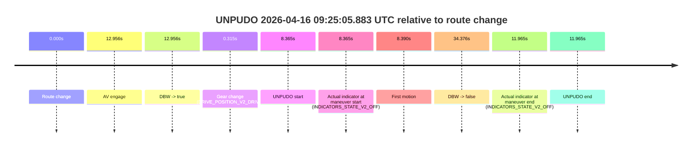
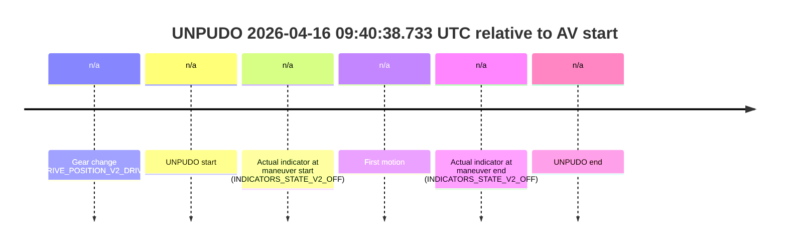
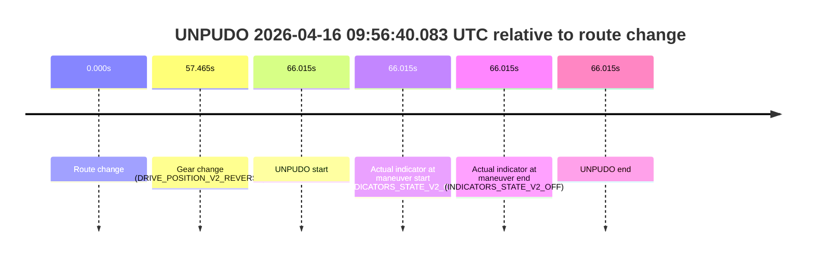
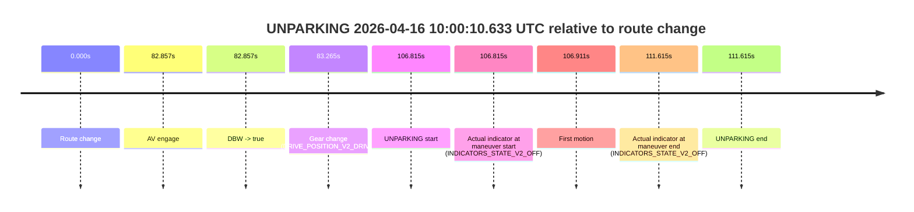

# Run Report: fme20029/2026-04-16--08-38-21--gen2-av-e2a98545-0986-40d0-bfcf-344ef0ccafb8

| Field | Value |
|---|---|
| Run ID | `fme20029/2026-04-16--08-38-21--gen2-av-e2a98545-0986-40d0-bfcf-344ef0ccafb8` |
| Date | `2026-04-16` |
| Model(s) | `plum-timeless-beaver` |
| Author | `peng.tang` |
| Event count | `8` |

## unpudo 2026-04-16 08:52:13.883 UTC

| Field | Value |
|---|---|
| Model | `plum-timeless-beaver` |
| Author | `peng.tang` |
| Run ID | `fme20029/2026-04-16--08-38-21--gen2-av-e2a98545-0986-40d0-bfcf-344ef0ccafb8` |
| Date | `2026-04-16` |
| Time (UTC) | `08:52:13.883` |
| Event type | `unpudo` |
| Disengagement type | `failed_to_unpudo` |
| Route change | `found` |
| Console | [run](https://console.sso.wayve.ai/run/fme20029/2026-04-16--08-38-21--gen2-av-e2a98545-0986-40d0-bfcf-344ef0ccafb8?id=&time-unixus=1776329533883308) |
| Foxglove | [segment](https://app.foxglove.dev/wayve-on-prem/p/prj_0dX18KZdVHg1fmmI/view?ds=foxglove-stream&ds.deviceName=fme20029&ds.start=2026-04-16T08%3A51%3A46.394784Z&ds.end=2026-04-16T08%3A52%3A30.183315Z&layoutId=lay_0e7VD4WIKDQGU73Y&time=2026-04-16T08%3A52%3A13.883308Z) |

### Event card: fail

- Fail: AV owns part of the segment, but the event still resolves as a model-performance failure under the AV-only scoring rule.

| Event | Time (UTC) | Delta from route change |
|---|---:|---:|
| Route change | 2026-04-16 08:51:59.368 | `0.000s` |
| AV engage | 2026-04-16 08:51:56.394 | `-2.974s` |
| DBW -> true | 2026-04-16 08:51:56.394 | `-2.974s` |
| Gear change (DRIVE_POSITION_V2_DRIVE) | 2026-04-16 08:51:59.733 | `0.365s` |
| UNPUDO start | 2026-04-16 08:52:13.883 | `14.515s` |
| Actual indicator at maneuver start (INDICATORS_STATE_V2_OFF) | 2026-04-16 08:52:13.883 | `14.515s` |
| First motion | 2026-04-16 08:52:13.969 | `14.601s` |
| DBW -> false | 2026-04-16 08:52:14.034 | `14.666s` |
| Actual indicator at maneuver end (INDICATORS_STATE_V2_OFF) | 2026-04-16 08:52:20.183 | `20.815s` |
| UNPUDO end | 2026-04-16 08:52:20.183 | `20.815s` |

| Metric | Value |
|---|---|
| Outcome | `fail` |
| Effective failure type | `failed_to_unpudo` |
| Route change status | `found` |
| DBW at event start | `true` |
| DBW at event end | `false` |
| Predicted gear at AV start | `DRIVE_POSITION_V2_PARK` |
| Actual gear at AV start | `DRIVE_POSITION_V2_PARK` |
| Predicted gear at event start | `DRIVE_POSITION_V2_DRIVE` |
| Actual gear at event start | `DRIVE_POSITION_V2_DRIVE` |
| Planned indicator direction | `INDICATORS_STATE_V2_RIGHT_ON` |
| Controller indicator direction | `INDICATORS_STATE_V2_RIGHT_ON` |
| Actual indicator direction | `INDICATORS_STATE_V2_OFF` |
| Actual indicator at maneuver end | `INDICATORS_STATE_V2_OFF` |
| Driver accel help in AV | `false` |
| Driver accel help timestamp | `n/a` |
| Max accel pedal pct in AV | `0.0%` |
| Max brake pedal pct in AV | `8.7%` |
| Max speed mps in AV | `0.103` |
| Route -> AV | `-2.974s` |
| AV -> event start | `17.489s` |
| AV -> first motion | `17.575s` |
| AV duration before disengagement | `17.640s` |
| Trajectory waypoint count | `36` |
| Driving-plan step count | `11` |

The scored portion starts from the AV-owned window, not from the pre-AV setup. Route-change search in the stopped pre-event segment was `found`, with the baseline therefore set to route change. At the event anchor the model predicts `DRIVE_POSITION_V2_DRIVE` and the actual gear is `DRIVE_POSITION_V2_DRIVE`. The effective model outcome is `fail` because `failed_to_unpudo`.

### Resolution

| Field | Value |
|---|---|
| Final outcome | `fail` |
| Do we agree with this label? | `yes` |
| Source disengagement type | `failed_to_unpudo` |
| Resolved effective failure type | `failed_to_unpudo` |
| Confidence | `high` |

## unpudo 2026-04-16 08:59:54.783 UTC

| Field | Value |
|---|---|
| Model | `plum-timeless-beaver` |
| Author | `peng.tang` |
| Run ID | `fme20029/2026-04-16--08-38-21--gen2-av-e2a98545-0986-40d0-bfcf-344ef0ccafb8` |
| Date | `2026-04-16` |
| Time (UTC) | `08:59:54.783` |
| Event type | `unpudo` |
| Disengagement type | `failed_to_unpudo` |
| Route change | `found` |
| Console | [run](https://console.sso.wayve.ai/run/fme20029/2026-04-16--08-38-21--gen2-av-e2a98545-0986-40d0-bfcf-344ef0ccafb8?id=&time-unixus=1776329994783311) |
| Foxglove | [segment](https://app.foxglove.dev/wayve-on-prem/p/prj_0dX18KZdVHg1fmmI/view?ds=foxglove-stream&ds.deviceName=fme20029&ds.start=2026-04-16T08%3A59%3A26.818302Z&ds.end=2026-04-16T09%3A00%3A22.483311Z&layoutId=lay_0e7VD4WIKDQGU73Y&time=2026-04-16T08%3A59%3A54.783311Z) |

### Event card: non-av

- Non-AV: the detected unpudo starts outside AV ownership, so it is kept for coverage but excluded from model success / failure scoring.

| Event | Time (UTC) | Delta from route change |
|---|---:|---:|
| Route change | 2026-04-16 08:59:36.818 | `0.000s` |
| AV engage | 2026-04-16 09:00:03.454 | `26.637s` |
| DBW -> true | 2026-04-16 09:00:03.454 | `26.637s` |
| Gear change (DRIVE_POSITION_V2_REVERSE) | 2026-04-16 08:59:37.833 | `1.015s` |
| UNPUDO start | 2026-04-16 08:59:54.783 | `17.965s` |
| Actual indicator at maneuver start (INDICATORS_STATE_V2_OFF) | 2026-04-16 08:59:54.783 | `17.965s` |
| First motion | 2026-04-16 09:00:08.849 | `32.031s` |
| DBW -> false | 2026-04-16 09:00:07.835 | `31.017s` |
| Actual indicator at maneuver end (INDICATORS_STATE_V2_OFF) | 2026-04-16 09:00:12.483 | `35.665s` |
| UNPUDO end | 2026-04-16 09:00:12.483 | `35.665s` |

| Metric | Value |
|---|---|
| Outcome | `non-av` |
| Effective failure type | `none` |
| Route change status | `found` |
| DBW at event start | `false` |
| DBW at event end | `false` |
| Predicted gear at AV start | `DRIVE_POSITION_V2_DRIVE` |
| Actual gear at AV start | `DRIVE_POSITION_V2_PARK` |
| Predicted gear at event start | `DRIVE_POSITION_V2_REVERSE` |
| Actual gear at event start | `DRIVE_POSITION_V2_REVERSE` |
| Planned indicator direction | `INDICATORS_STATE_V2_OFF` |
| Controller indicator direction | `INDICATORS_STATE_V2_OFF` |
| Actual indicator direction | `INDICATORS_STATE_V2_OFF` |
| Actual indicator at maneuver end | `INDICATORS_STATE_V2_OFF` |
| Driver accel help in AV | `false` |
| Driver accel help timestamp | `n/a` |
| Max accel pedal pct in AV | `0.0%` |
| Max brake pedal pct in AV | `8.0%` |
| Max speed mps in AV | `0.000` |
| Route -> AV | `26.637s` |
| AV -> event start | `-8.672s` |
| AV -> first motion | `5.394s` |
| AV duration before disengagement | `4.381s` |
| Trajectory waypoint count | `36` |
| Driving-plan step count | `11` |

The scored portion starts from the AV-owned window, not from the pre-AV setup. Route-change search in the stopped pre-event segment was `found`, with the baseline therefore set to route change. At the event anchor the model predicts `DRIVE_POSITION_V2_REVERSE` and the actual gear is `DRIVE_POSITION_V2_REVERSE`. The effective model outcome is `non-av` because `the event does not begin in AV ownership`.

### Resolution

| Field | Value |
|---|---|
| Final outcome | `non-av` |
| Do we agree with this label? | `yes` |
| Source disengagement type | `failed_to_unpudo` |
| Resolved effective failure type | `none` |
| Confidence | `high` |

## unpudo 2026-04-16 09:07:59.533 UTC

| Field | Value |
|---|---|
| Model | `plum-timeless-beaver` |
| Author | `peng.tang` |
| Run ID | `fme20029/2026-04-16--08-38-21--gen2-av-e2a98545-0986-40d0-bfcf-344ef0ccafb8` |
| Date | `2026-04-16` |
| Time (UTC) | `09:07:59.533` |
| Event type | `unpudo` |
| Disengagement type | `failed_to_unpudo` |
| Route change | `found` |
| Console | [run](https://console.sso.wayve.ai/run/fme20029/2026-04-16--08-38-21--gen2-av-e2a98545-0986-40d0-bfcf-344ef0ccafb8?id=&time-unixus=1776330479533307) |
| Foxglove | [segment](https://app.foxglove.dev/wayve-on-prem/p/prj_0dX18KZdVHg1fmmI/view?ds=foxglove-stream&ds.deviceName=fme20029&ds.start=2026-04-16T09%3A07%3A29.118254Z&ds.end=2026-04-16T09%3A10%3A37.595665Z&layoutId=lay_0e7VD4WIKDQGU73Y&time=2026-04-16T09%3A07%3A59.533307Z) |

### Event card: accidental

- Accidental: AV ownership is present for less than `2s`, so this is treated as an accidental brush with the maneuver rather than a meaningful model attempt.

| Event | Time (UTC) | Delta from route change |
|---|---:|---:|
| Route change | 2026-04-16 09:07:39.118 | `0.000s` |
| AV engage | 2026-04-16 09:08:04.954 | `25.836s` |
| DBW -> true | 2026-04-16 09:08:04.954 | `25.836s` |
| Gear change (DRIVE_POSITION_V2_DRIVE) | 2026-04-16 09:07:39.433 | `0.315s` |
| UNPUDO start | 2026-04-16 09:07:59.533 | `20.415s` |
| Actual indicator at maneuver start (INDICATORS_STATE_V2_RIGHT_ON) | 2026-04-16 09:07:59.533 | `20.415s` |
| First motion | 2026-04-16 09:07:59.588 | `20.470s` |
| DBW -> false | 2026-04-16 09:10:27.595 | `168.477s` |
| Actual indicator at maneuver end (INDICATORS_STATE_V2_OFF) | 2026-04-16 09:08:03.733 | `24.615s` |
| UNPUDO end | 2026-04-16 09:08:03.733 | `24.615s` |

| Metric | Value |
|---|---|
| Outcome | `accidental` |
| Effective failure type | `none` |
| Route change status | `found` |
| DBW at event start | `false` |
| DBW at event end | `false` |
| Predicted gear at AV start | `DRIVE_POSITION_V2_DRIVE` |
| Actual gear at AV start | `DRIVE_POSITION_V2_DRIVE` |
| Predicted gear at event start | `DRIVE_POSITION_V2_DRIVE` |
| Actual gear at event start | `DRIVE_POSITION_V2_DRIVE` |
| Planned indicator direction | `INDICATORS_STATE_V2_OFF` |
| Controller indicator direction | `INDICATORS_STATE_V2_OFF` |
| Actual indicator direction | `INDICATORS_STATE_V2_RIGHT_ON` |
| Actual indicator at maneuver end | `INDICATORS_STATE_V2_OFF` |
| Driver accel help in AV | `false` |
| Driver accel help timestamp | `n/a` |
| Max accel pedal pct in AV | `0.0%` |
| Max brake pedal pct in AV | `0.0%` |
| Max speed mps in AV | `0.000` |
| Route -> AV | `25.836s` |
| AV -> event start | `-5.421s` |
| AV -> first motion | `-5.366s` |
| AV duration before disengagement | `142.641s` |
| Trajectory waypoint count | `35` |
| Driving-plan step count | `11` |

The scored portion starts from the AV-owned window, not from the pre-AV setup. Route-change search in the stopped pre-event segment was `found`, with the baseline therefore set to route change. At the event anchor the model predicts `DRIVE_POSITION_V2_DRIVE` and the actual gear is `DRIVE_POSITION_V2_DRIVE`. The effective model outcome is `accidental` because `the AV-owned portion is shorter than 2s`.

### Resolution

| Field | Value |
|---|---|
| Final outcome | `accidental` |
| Do we agree with this label? | `yes` |
| Source disengagement type | `failed_to_unpudo` |
| Resolved effective failure type | `none` |
| Confidence | `high` |

## unpudo 2026-04-16 09:10:28.533 UTC

| Field | Value |
|---|---|
| Model | `plum-timeless-beaver` |
| Author | `peng.tang` |
| Run ID | `fme20029/2026-04-16--08-38-21--gen2-av-e2a98545-0986-40d0-bfcf-344ef0ccafb8` |
| Date | `2026-04-16` |
| Time (UTC) | `09:10:28.533` |
| Event type | `unpudo` |
| Disengagement type | `failed_to_unpudo` |
| Route change | `found` |
| Console | [run](https://console.sso.wayve.ai/run/fme20029/2026-04-16--08-38-21--gen2-av-e2a98545-0986-40d0-bfcf-344ef0ccafb8?id=&time-unixus=1776330628533298) |
| Foxglove | [segment](https://app.foxglove.dev/wayve-on-prem/p/prj_0dX18KZdVHg1fmmI/view?ds=foxglove-stream&ds.deviceName=fme20029&ds.start=2026-04-16T09%3A09%3A42.318297Z&ds.end=2026-04-16T09%3A11%3A38.514765Z&layoutId=lay_0e7VD4WIKDQGU73Y&time=2026-04-16T09%3A10%3A28.533298Z) |

### Event card: accidental

- Accidental: AV ownership is present for less than `2s`, so this is treated as an accidental brush with the maneuver rather than a meaningful model attempt.

| Event | Time (UTC) | Delta from route change |
|---|---:|---:|
| Route change | 2026-04-16 09:09:52.318 | `0.000s` |
| AV engage | 2026-04-16 09:10:51.254 | `58.936s` |
| DBW -> true | 2026-04-16 09:10:51.254 | `58.936s` |
| Gear change (DRIVE_POSITION_V2_DRIVE) | 2026-04-16 09:09:52.633 | `0.315s` |
| UNPUDO start | 2026-04-16 09:10:28.533 | `36.215s` |
| Actual indicator at maneuver start (INDICATORS_STATE_V2_RIGHT_ON) | 2026-04-16 09:10:28.533 | `36.215s` |
| First motion | 2026-04-16 09:10:28.569 | `36.251s` |
| DBW -> false | 2026-04-16 09:11:28.514 | `96.196s` |
| Actual indicator at maneuver end (INDICATORS_STATE_V2_OFF) | 2026-04-16 09:10:34.033 | `41.715s` |
| UNPUDO end | 2026-04-16 09:10:34.033 | `41.715s` |

| Metric | Value |
|---|---|
| Outcome | `accidental` |
| Effective failure type | `none` |
| Route change status | `found` |
| DBW at event start | `false` |
| DBW at event end | `false` |
| Predicted gear at AV start | `DRIVE_POSITION_V2_DRIVE` |
| Actual gear at AV start | `DRIVE_POSITION_V2_DRIVE` |
| Predicted gear at event start | `DRIVE_POSITION_V2_DRIVE` |
| Actual gear at event start | `DRIVE_POSITION_V2_DRIVE` |
| Planned indicator direction | `INDICATORS_STATE_V2_OFF` |
| Controller indicator direction | `INDICATORS_STATE_V2_OFF` |
| Actual indicator direction | `INDICATORS_STATE_V2_RIGHT_ON` |
| Actual indicator at maneuver end | `INDICATORS_STATE_V2_OFF` |
| Driver accel help in AV | `false` |
| Driver accel help timestamp | `n/a` |
| Max accel pedal pct in AV | `0.0%` |
| Max brake pedal pct in AV | `0.0%` |
| Max speed mps in AV | `0.000` |
| Route -> AV | `58.936s` |
| AV -> event start | `-22.721s` |
| AV -> first motion | `-22.685s` |
| AV duration before disengagement | `37.260s` |
| Trajectory waypoint count | `35` |
| Driving-plan step count | `11` |

The scored portion starts from the AV-owned window, not from the pre-AV setup. Route-change search in the stopped pre-event segment was `found`, with the baseline therefore set to route change. At the event anchor the model predicts `DRIVE_POSITION_V2_DRIVE` and the actual gear is `DRIVE_POSITION_V2_DRIVE`. The effective model outcome is `accidental` because `the AV-owned portion is shorter than 2s`.

### Resolution

| Field | Value |
|---|---|
| Final outcome | `accidental` |
| Do we agree with this label? | `yes` |
| Source disengagement type | `failed_to_unpudo` |
| Resolved effective failure type | `none` |
| Confidence | `high` |

## unpudo 2026-04-16 09:25:05.883 UTC

| Field | Value |
|---|---|
| Model | `plum-timeless-beaver` |
| Author | `peng.tang` |
| Run ID | `fme20029/2026-04-16--08-38-21--gen2-av-e2a98545-0986-40d0-bfcf-344ef0ccafb8` |
| Date | `2026-04-16` |
| Time (UTC) | `09:25:05.883` |
| Event type | `unpudo` |
| Disengagement type | `failed_to_unpudo` |
| Route change | `found` |
| Console | [run](https://console.sso.wayve.ai/run/fme20029/2026-04-16--08-38-21--gen2-av-e2a98545-0986-40d0-bfcf-344ef0ccafb8?id=&time-unixus=1776331505883326) |
| Foxglove | [segment](https://app.foxglove.dev/wayve-on-prem/p/prj_0dX18KZdVHg1fmmI/view?ds=foxglove-stream&ds.deviceName=fme20029&ds.start=2026-04-16T09%3A24%3A47.518262Z&ds.end=2026-04-16T09%3A25%3A41.894680Z&layoutId=lay_0e7VD4WIKDQGU73Y&time=2026-04-16T09%3A25%3A05.883326Z) |

### Event card: accidental

- Accidental: AV ownership is present for less than `2s`, so this is treated as an accidental brush with the maneuver rather than a meaningful model attempt.

| Event | Time (UTC) | Delta from route change |
|---|---:|---:|
| Route change | 2026-04-16 09:24:57.518 | `0.000s` |
| AV engage | 2026-04-16 09:25:10.474 | `12.956s` |
| DBW -> true | 2026-04-16 09:25:10.474 | `12.956s` |
| Gear change (DRIVE_POSITION_V2_DRIVE) | 2026-04-16 09:24:57.833 | `0.315s` |
| UNPUDO start | 2026-04-16 09:25:05.883 | `8.365s` |
| Actual indicator at maneuver start (INDICATORS_STATE_V2_OFF) | 2026-04-16 09:25:05.883 | `8.365s` |
| First motion | 2026-04-16 09:25:05.908 | `8.390s` |
| DBW -> false | 2026-04-16 09:25:31.894 | `34.376s` |
| Actual indicator at maneuver end (INDICATORS_STATE_V2_OFF) | 2026-04-16 09:25:09.483 | `11.965s` |
| UNPUDO end | 2026-04-16 09:25:09.483 | `11.965s` |

| Metric | Value |
|---|---|
| Outcome | `accidental` |
| Effective failure type | `none` |
| Route change status | `found` |
| DBW at event start | `false` |
| DBW at event end | `false` |
| Predicted gear at AV start | `DRIVE_POSITION_V2_DRIVE` |
| Actual gear at AV start | `DRIVE_POSITION_V2_DRIVE` |
| Predicted gear at event start | `DRIVE_POSITION_V2_DRIVE` |
| Actual gear at event start | `DRIVE_POSITION_V2_DRIVE` |
| Planned indicator direction | `INDICATORS_STATE_V2_RIGHT_ON` |
| Controller indicator direction | `INDICATORS_STATE_V2_RIGHT_ON` |
| Actual indicator direction | `INDICATORS_STATE_V2_OFF` |
| Actual indicator at maneuver end | `INDICATORS_STATE_V2_OFF` |
| Driver accel help in AV | `false` |
| Driver accel help timestamp | `n/a` |
| Max accel pedal pct in AV | `0.0%` |
| Max brake pedal pct in AV | `0.0%` |
| Max speed mps in AV | `0.000` |
| Route -> AV | `12.956s` |
| AV -> event start | `-4.591s` |
| AV -> first motion | `-4.566s` |
| AV duration before disengagement | `21.420s` |
| Trajectory waypoint count | `36` |
| Driving-plan step count | `11` |

The scored portion starts from the AV-owned window, not from the pre-AV setup. Route-change search in the stopped pre-event segment was `found`, with the baseline therefore set to route change. At the event anchor the model predicts `DRIVE_POSITION_V2_DRIVE` and the actual gear is `DRIVE_POSITION_V2_DRIVE`. The effective model outcome is `accidental` because `the AV-owned portion is shorter than 2s`.

### Resolution

| Field | Value |
|---|---|
| Final outcome | `accidental` |
| Do we agree with this label? | `yes` |
| Source disengagement type | `failed_to_unpudo` |
| Resolved effective failure type | `none` |
| Confidence | `high` |

## unpudo 2026-04-16 09:40:38.733 UTC

| Field | Value |
|---|---|
| Model | `plum-timeless-beaver` |
| Author | `peng.tang` |
| Run ID | `fme20029/2026-04-16--08-38-21--gen2-av-e2a98545-0986-40d0-bfcf-344ef0ccafb8` |
| Date | `2026-04-16` |
| Time (UTC) | `09:40:38.733` |
| Event type | `unpudo` |
| Disengagement type | `none observed` |
| Route change | `unclear` |
| Console | [run](https://console.sso.wayve.ai/run/fme20029/2026-04-16--08-38-21--gen2-av-e2a98545-0986-40d0-bfcf-344ef0ccafb8?id=&time-unixus=1776332438733304) |
| Foxglove | [segment](https://app.foxglove.dev/wayve-on-prem/p/prj_0dX18KZdVHg1fmmI/view?ds=foxglove-stream&ds.deviceName=fme20029&ds.start=2026-04-16T09%3A40%3A21.633300Z&ds.end=2026-04-16T09%3A40%3A48.733304Z&layoutId=lay_0e7VD4WIKDQGU73Y&time=2026-04-16T09%3A40%3A38.733304Z) |

### Event card: non-av

- Non-AV: the detected unpudo starts outside AV ownership, so it is kept for coverage but excluded from model success / failure scoring.

| Event | Time (UTC) | Delta from AV start |
|---|---:|---:|
| Gear change (DRIVE_POSITION_V2_DRIVE) | 2026-04-16 09:40:31.633 | `n/a` |
| UNPUDO start | 2026-04-16 09:40:38.733 | `n/a` |
| Actual indicator at maneuver start (INDICATORS_STATE_V2_OFF) | 2026-04-16 09:40:38.733 | `n/a` |
| First motion | 2026-04-16 09:40:38.748 | `n/a` |
| Actual indicator at maneuver end (INDICATORS_STATE_V2_OFF) | 2026-04-16 09:40:38.733 | `n/a` |
| UNPUDO end | 2026-04-16 09:40:38.733 | `n/a` |

| Metric | Value |
|---|---|
| Outcome | `non-av` |
| Effective failure type | `none` |
| Route change status | `unclear` |
| DBW at event start | `false` |
| DBW at event end | `false` |
| Predicted gear at AV start | `n/a` |
| Actual gear at AV start | `n/a` |
| Predicted gear at event start | `DRIVE_POSITION_V2_DRIVE` |
| Actual gear at event start | `DRIVE_POSITION_V2_DRIVE` |
| Planned indicator direction | `INDICATORS_STATE_V2_OFF` |
| Controller indicator direction | `INDICATORS_STATE_V2_OFF` |
| Actual indicator direction | `INDICATORS_STATE_V2_OFF` |
| Actual indicator at maneuver end | `INDICATORS_STATE_V2_OFF` |
| Driver accel help in AV | `false` |
| Driver accel help timestamp | `n/a` |
| Max accel pedal pct in AV | `0.0%` |
| Max brake pedal pct in AV | `0.0%` |
| Max speed mps in AV | `0.000` |
| Route -> AV | `n/a` |
| AV -> event start | `n/a` |
| AV -> first motion | `n/a` |
| AV duration before disengagement | `n/a` |
| Trajectory waypoint count | `35` |
| Driving-plan step count | `11` |

The scored portion starts from the AV-owned window, not from the pre-AV setup. Route-change search in the stopped pre-event segment was `unclear`, with the baseline therefore set to AV start. At the event anchor the model predicts `DRIVE_POSITION_V2_DRIVE` and the actual gear is `DRIVE_POSITION_V2_DRIVE`. The effective model outcome is `non-av` because `the event does not begin in AV ownership`.

### Resolution

| Field | Value |
|---|---|
| Final outcome | `non-av` |
| Do we agree with this label? | `yes` |
| Source disengagement type | `none observed` |
| Resolved effective failure type | `none` |
| Confidence | `medium` |

## unpudo 2026-04-16 09:56:40.083 UTC

| Field | Value |
|---|---|
| Model | `plum-timeless-beaver` |
| Author | `peng.tang` |
| Run ID | `fme20029/2026-04-16--08-38-21--gen2-av-e2a98545-0986-40d0-bfcf-344ef0ccafb8` |
| Date | `2026-04-16` |
| Time (UTC) | `09:56:40.083` |
| Event type | `unpudo` |
| Disengagement type | `none observed` |
| Route change | `found` |
| Console | [run](https://console.sso.wayve.ai/run/fme20029/2026-04-16--08-38-21--gen2-av-e2a98545-0986-40d0-bfcf-344ef0ccafb8?id=&time-unixus=1776333400083290) |
| Foxglove | [segment](https://app.foxglove.dev/wayve-on-prem/p/prj_0dX18KZdVHg1fmmI/view?ds=foxglove-stream&ds.deviceName=fme20029&ds.start=2026-04-16T09%3A55%3A24.068325Z&ds.end=2026-04-16T09%3A56%3A50.083290Z&layoutId=lay_0e7VD4WIKDQGU73Y&time=2026-04-16T09%3A56%3A40.083290Z) |

### Event card: non-av

- Non-AV: the detected unpudo starts outside AV ownership, so it is kept for coverage but excluded from model success / failure scoring.

| Event | Time (UTC) | Delta from route change |
|---|---:|---:|
| Route change | 2026-04-16 09:55:34.068 | `0.000s` |
| Gear change (DRIVE_POSITION_V2_REVERSE) | 2026-04-16 09:56:31.533 | `57.465s` |
| UNPUDO start | 2026-04-16 09:56:40.083 | `66.015s` |
| Actual indicator at maneuver start (INDICATORS_STATE_V2_OFF) | 2026-04-16 09:56:40.083 | `66.015s` |
| Actual indicator at maneuver end (INDICATORS_STATE_V2_OFF) | 2026-04-16 09:56:40.083 | `66.015s` |
| UNPUDO end | 2026-04-16 09:56:40.083 | `66.015s` |

| Metric | Value |
|---|---|
| Outcome | `non-av` |
| Effective failure type | `none` |
| Route change status | `found` |
| DBW at event start | `false` |
| DBW at event end | `false` |
| Predicted gear at AV start | `n/a` |
| Actual gear at AV start | `n/a` |
| Predicted gear at event start | `DRIVE_POSITION_V2_REVERSE` |
| Actual gear at event start | `DRIVE_POSITION_V2_REVERSE` |
| Planned indicator direction | `INDICATORS_STATE_V2_RIGHT_ON` |
| Controller indicator direction | `INDICATORS_STATE_V2_RIGHT_ON` |
| Actual indicator direction | `INDICATORS_STATE_V2_OFF` |
| Actual indicator at maneuver end | `INDICATORS_STATE_V2_OFF` |
| Driver accel help in AV | `false` |
| Driver accel help timestamp | `n/a` |
| Max accel pedal pct in AV | `0.0%` |
| Max brake pedal pct in AV | `0.0%` |
| Max speed mps in AV | `0.000` |
| Route -> AV | `n/a` |
| AV -> event start | `n/a` |
| AV -> first motion | `n/a` |
| AV duration before disengagement | `n/a` |
| Trajectory waypoint count | `36` |
| Driving-plan step count | `11` |

The scored portion starts from the AV-owned window, not from the pre-AV setup. Route-change search in the stopped pre-event segment was `found`, with the baseline therefore set to route change. At the event anchor the model predicts `DRIVE_POSITION_V2_REVERSE` and the actual gear is `DRIVE_POSITION_V2_REVERSE`. The effective model outcome is `non-av` because `the event does not begin in AV ownership`.

### Resolution

| Field | Value |
|---|---|
| Final outcome | `non-av` |
| Do we agree with this label? | `yes` |
| Source disengagement type | `none observed` |
| Resolved effective failure type | `none` |
| Confidence | `high` |

## unparking 2026-04-16 10:00:10.633 UTC

| Field | Value |
|---|---|
| Model | `plum-timeless-beaver` |
| Author | `peng.tang` |
| Run ID | `fme20029/2026-04-16--08-38-21--gen2-av-e2a98545-0986-40d0-bfcf-344ef0ccafb8` |
| Date | `2026-04-16` |
| Time (UTC) | `10:00:10.633` |
| Event type | `unparking` |
| Disengagement type | `none observed` |
| Route change | `found` |
| Console | [run](https://console.sso.wayve.ai/run/fme20029/2026-04-16--08-38-21--gen2-av-e2a98545-0986-40d0-bfcf-344ef0ccafb8?id=&time-unixus=1776333610633308) |
| Foxglove | [segment](https://app.foxglove.dev/wayve-on-prem/p/prj_0dX18KZdVHg1fmmI/view?ds=foxglove-stream&ds.deviceName=fme20029&ds.start=2026-04-16T09%3A58%3A13.818277Z&ds.end=2026-04-16T10%3A00%3A25.433293Z&layoutId=lay_0e7VD4WIKDQGU73Y&time=2026-04-16T10%3A00%3A10.633308Z) |

### Event card: pass

- Pass: AV owns the credited unparking through the official event window, the gear state is aligned at the anchor, and the vehicle moves without driver accelerator help in AV.

| Event | Time (UTC) | Delta from route change |
|---|---:|---:|
| Route change | 2026-04-16 09:58:23.818 | `0.000s` |
| AV engage | 2026-04-16 09:59:46.674 | `82.857s` |
| DBW -> true | 2026-04-16 09:59:46.674 | `82.857s` |
| Gear change (DRIVE_POSITION_V2_DRIVE) | 2026-04-16 09:59:47.083 | `83.265s` |
| UNPARKING start | 2026-04-16 10:00:10.633 | `106.815s` |
| Actual indicator at maneuver start (INDICATORS_STATE_V2_OFF) | 2026-04-16 10:00:10.633 | `106.815s` |
| First motion | 2026-04-16 10:00:10.728 | `106.911s` |
| Actual indicator at maneuver end (INDICATORS_STATE_V2_OFF) | 2026-04-16 10:00:15.433 | `111.615s` |
| UNPARKING end | 2026-04-16 10:00:15.433 | `111.615s` |

| Metric | Value |
|---|---|
| Outcome | `pass` |
| Effective failure type | `none` |
| Route change status | `found` |
| DBW at event start | `true` |
| DBW at event end | `true` |
| Predicted gear at AV start | `DRIVE_POSITION_V2_DRIVE` |
| Actual gear at AV start | `DRIVE_POSITION_V2_PARK` |
| Predicted gear at event start | `DRIVE_POSITION_V2_DRIVE` |
| Actual gear at event start | `DRIVE_POSITION_V2_DRIVE` |
| Planned indicator direction | `INDICATORS_STATE_V2_LEFT_ON` |
| Controller indicator direction | `INDICATORS_STATE_V2_LEFT_ON` |
| Actual indicator direction | `INDICATORS_STATE_V2_OFF` |
| Actual indicator at maneuver end | `INDICATORS_STATE_V2_OFF` |
| Driver accel help in AV | `false` |
| Driver accel help timestamp | `n/a` |
| Max accel pedal pct in AV | `0.0%` |
| Max brake pedal pct in AV | `8.0%` |
| Max speed mps in AV | `4.547` |
| Route -> AV | `82.857s` |
| AV -> event start | `23.958s` |
| AV -> first motion | `24.054s` |
| AV duration before disengagement | `n/a` |
| Trajectory waypoint count | `35` |
| Driving-plan step count | `11` |

The scored portion starts from the AV-owned window, not from the pre-AV setup. Route-change search in the stopped pre-event segment was `found`, with the baseline therefore set to route change. At the event anchor the model predicts `DRIVE_POSITION_V2_DRIVE` and the actual gear is `DRIVE_POSITION_V2_DRIVE`. The effective model outcome is `pass` because `the credited maneuver stays AV-owned through the official event end`.

### Resolution

| Field | Value |
|---|---|
| Final outcome | `pass` |
| Do we agree with this label? | `yes` |
| Source disengagement type | `none observed` |
| Resolved effective failure type | `none` |
| Confidence | `high` |
