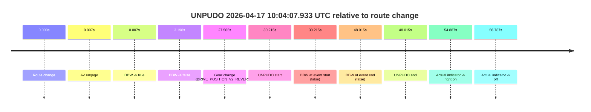
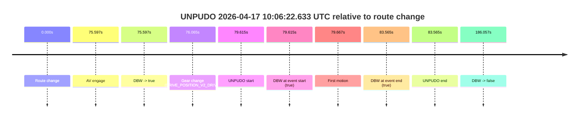
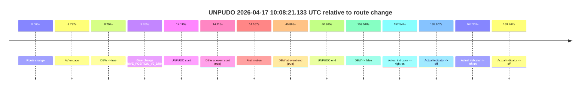
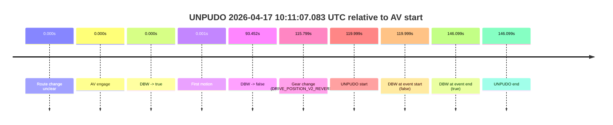
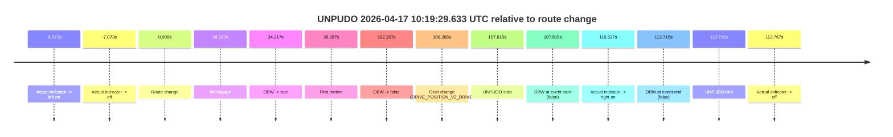

# Run Report: fme20029/2026-04-17--09-56-40--gen2-av-93d048a7-0d14-49ce-a493-be732b1ee4dc

| Field | Value |
|---|---|
| Run ID | `fme20029/2026-04-17--09-56-40--gen2-av-93d048a7-0d14-49ce-a493-be732b1ee4dc` |
| Date | `2026-04-17` |
| Model(s) | `eel-teal-outspoken` |
| Author | `zak` |
| Event count | `5` |

## unpudo 2026-04-17 10:04:07.933 UTC

| Field | Value |
|---|---|
| Model | `eel-teal-outspoken` |
| Author | `zak` |
| Run ID | `fme20029/2026-04-17--09-56-40--gen2-av-93d048a7-0d14-49ce-a493-be732b1ee4dc` |
| Date | `2026-04-17` |
| Time (UTC) | `10:04:07.933` |
| Event type | `unpudo` |
| Disengagement type | `none observed` |
| Route change | `found` |
| Console | [run](https://console.sso.wayve.ai/run/fme20029/2026-04-17--09-56-40--gen2-av-93d048a7-0d14-49ce-a493-be732b1ee4dc?id=&time-unixus=1776420247933320) |
| Foxglove | [segment](https://app.foxglove.dev/wayve-on-prem/p/prj_0dX18KZdVHg1fmmI/view?ds=foxglove-stream&ds.deviceName=fme20029&ds.start=2026-04-17T10%3A03%3A27.718264Z&ds.end=2026-04-17T10%3A04%3A35.733309Z&layoutId=lay_0e7VD4WIKDQGU73Y&time=2026-04-17T10%3A04%3A07.933320Z) |

### Event card: fail

- Fail: the credited unpudo does not stay AV-owned. The event window starts with DBW false, and the maneuver outcome lands outside a clean AV-owned segment.

| Event | Time (UTC) | Delta from route change |
|---|---:|---:|
| Route change | 2026-04-17 10:03:37.718 | `0.000s` |
| AV engage | 2026-04-17 10:03:37.725 | `0.007s` |
| DBW -> true | 2026-04-17 10:03:37.725 | `0.007s` |
| DBW -> false | 2026-04-17 10:03:40.916 | `3.198s` |
| Gear change (DRIVE_POSITION_V2_REVERSE) | 2026-04-17 10:04:05.283 | `27.565s` |
| UNPUDO start | 2026-04-17 10:04:07.933 | `30.215s` |
| DBW at event start (false) | 2026-04-17 10:04:07.933 | `30.215s` |
| DBW at event end (false) | 2026-04-17 10:04:25.733 | `48.015s` |
| UNPUDO end | 2026-04-17 10:04:25.733 | `48.015s` |
| Actual indicator -> right on | 2026-04-17 10:04:32.605 | `54.887s` |
| Actual indicator -> off | 2026-04-17 10:04:34.505 | `56.787s` |

| Metric | Value |
|---|---|
| Outcome | `fail` |
| Effective failure type | `not_av_owned` |
| Route change status | `found` |
| DBW at event start | `false` |
| DBW at event end | `false` |
| Predicted gear at AV start | `DRIVE_POSITION_V2_PARK` |
| Actual gear at AV start | `DRIVE_POSITION_V2_PARK` |
| Predicted gear at event start | `DRIVE_POSITION_V2_REVERSE` |
| Actual gear at event start | `DRIVE_POSITION_V2_REVERSE` |
| Planned indicator direction | `INDICATORS_STATE_V2_OFF` |
| Controller indicator direction | `INDICATORS_STATE_V2_OFF` |
| Actual indicator direction | `INDICATORS_STATE_V2_OFF` |
| Actual indicator at maneuver end | `INDICATORS_STATE_V2_OFF` |
| Driver accel help in AV | `false` |
| Driver accel help timestamp | `n/a` |
| Max accel pedal pct in AV | `0.0%` |
| Max brake pedal pct in AV | `8.0%` |
| Max speed mps in AV | `0.000` |
| Success timing baseline | `route change` |
| Route -> AV | `0.007s` |
| AV -> event start | `30.208s` |
| AV -> first motion | `n/a` |
| Success baseline -> event start | `30.215s` |
| Success baseline -> first motion | `n/a` |
| AV duration before disengagement | `3.191s` |
| Trajectory waypoint count | `37` |
| Driving-plan step count | `11` |

The scored portion starts from the AV-owned window, not from the pre-AV setup. Route-change search in the stopped pre-event segment was `found`, with the baseline therefore set to route change. At the event anchor the model predicts `DRIVE_POSITION_V2_REVERSE` and the actual gear is `DRIVE_POSITION_V2_REVERSE`. The effective model outcome is `fail` because `not_av_owned.`

### Resolution

| Field | Value |
|---|---|
| Final outcome | `fail` |
| Do we agree with this label? | `yes` |
| Source disengagement type | `none observed` |
| Resolved effective failure type | `not_av_owned` |
| Confidence | `high` |

## unpudo 2026-04-17 10:06:22.633 UTC

| Field | Value |
|---|---|
| Model | `eel-teal-outspoken` |
| Author | `zak` |
| Run ID | `fme20029/2026-04-17--09-56-40--gen2-av-93d048a7-0d14-49ce-a493-be732b1ee4dc` |
| Date | `2026-04-17` |
| Time (UTC) | `10:06:22.633` |
| Event type | `unpudo` |
| Disengagement type | `none observed` |
| Route change | `found` |
| Console | [run](https://console.sso.wayve.ai/run/fme20029/2026-04-17--09-56-40--gen2-av-93d048a7-0d14-49ce-a493-be732b1ee4dc?id=&time-unixus=1776420382633316) |
| Foxglove | [segment](https://app.foxglove.dev/wayve-on-prem/p/prj_0dX18KZdVHg1fmmI/view?ds=foxglove-stream&ds.deviceName=fme20029&ds.start=2026-04-17T10%3A04%3A53.018264Z&ds.end=2026-04-17T10%3A08%3A19.075470Z&layoutId=lay_0e7VD4WIKDQGU73Y&time=2026-04-17T10%3A06%3A22.633316Z) |

### Event card: pass

- Pass: AV owns the credited unpudo from route change through the official unpudo window, the gear state is aligned at the anchor, and the vehicle moves without driver accelerator help in AV.

| Event | Time (UTC) | Delta from route change |
|---|---:|---:|
| Route change | 2026-04-17 10:05:03.018 | `0.000s` |
| AV engage | 2026-04-17 10:06:18.615 | `75.597s` |
| DBW -> true | 2026-04-17 10:06:18.615 | `75.597s` |
| Gear change (DRIVE_POSITION_V2_DRIVE) | 2026-04-17 10:06:19.083 | `76.065s` |
| UNPUDO start | 2026-04-17 10:06:22.633 | `79.615s` |
| DBW at event start (true) | 2026-04-17 10:06:22.633 | `79.615s` |
| First motion | 2026-04-17 10:06:22.685 | `79.667s` |
| DBW at event end (true) | 2026-04-17 10:06:26.583 | `83.565s` |
| UNPUDO end | 2026-04-17 10:06:26.583 | `83.565s` |
| DBW -> false | 2026-04-17 10:08:09.075 | `186.057s` |

| Metric | Value |
|---|---|
| Outcome | `pass` |
| Effective failure type | `none` |
| Route change status | `found` |
| DBW at event start | `true` |
| DBW at event end | `true` |
| Predicted gear at AV start | `DRIVE_POSITION_V2_DRIVE` |
| Actual gear at AV start | `DRIVE_POSITION_V2_PARK` |
| Predicted gear at event start | `DRIVE_POSITION_V2_DRIVE` |
| Actual gear at event start | `DRIVE_POSITION_V2_DRIVE` |
| Planned indicator direction | `INDICATORS_STATE_V2_LEFT_ON` |
| Controller indicator direction | `INDICATORS_STATE_V2_LEFT_ON` |
| Actual indicator direction | `INDICATORS_STATE_V2_OFF` |
| Actual indicator at maneuver end | `INDICATORS_STATE_V2_OFF` |
| Driver accel help in AV | `false` |
| Driver accel help timestamp | `n/a` |
| Max accel pedal pct in AV | `0.0%` |
| Max brake pedal pct in AV | `8.0%` |
| Max speed mps in AV | `4.550` |
| Success timing baseline | `route change` |
| Route -> AV | `75.597s` |
| AV -> event start | `4.018s` |
| AV -> first motion | `4.070s` |
| Success baseline -> event start | `79.615s` |
| Success baseline -> first motion | `79.667s` |
| AV duration before disengagement | `110.460s` |
| Trajectory waypoint count | `37` |
| Driving-plan step count | `11` |

The scored portion starts from the AV-owned window, not from the pre-AV setup. Route-change search in the stopped pre-event segment was `found`, with the baseline therefore set to route change. At the event anchor the model predicts `DRIVE_POSITION_V2_DRIVE` and the actual gear is `DRIVE_POSITION_V2_DRIVE`. The effective model outcome is `pass` because `the credited unpudo stays AV-owned through the official unpudo window.`

### Resolution

| Field | Value |
|---|---|
| Final outcome | `pass` |
| Do we agree with this label? | `yes` |
| Source disengagement type | `none observed` |
| Resolved effective failure type | `none` |
| Confidence | `high` |

## unpudo 2026-04-17 10:08:21.133 UTC

| Field | Value |
|---|---|
| Model | `eel-teal-outspoken` |
| Author | `zak` |
| Run ID | `fme20029/2026-04-17--09-56-40--gen2-av-93d048a7-0d14-49ce-a493-be732b1ee4dc` |
| Date | `2026-04-17` |
| Time (UTC) | `10:08:21.133` |
| Event type | `unpudo` |
| Disengagement type | `none observed` |
| Route change | `found` |
| Console | [run](https://console.sso.wayve.ai/run/fme20029/2026-04-17--09-56-40--gen2-av-93d048a7-0d14-49ce-a493-be732b1ee4dc?id=&time-unixus=1776420501133296) |
| Foxglove | [segment](https://app.foxglove.dev/wayve-on-prem/p/prj_0dX18KZdVHg1fmmI/view?ds=foxglove-stream&ds.deviceName=fme20029&ds.start=2026-04-17T10%3A07%3A57.018252Z&ds.end=2026-04-17T10%3A10%3A50.536095Z&layoutId=lay_0e7VD4WIKDQGU73Y&time=2026-04-17T10%3A08%3A21.133296Z) |

### Event card: pass

- Pass: AV owns the credited unpudo from route change through the official unpudo window, the gear state is aligned at the anchor, and the vehicle moves without driver accelerator help in AV.

| Event | Time (UTC) | Delta from route change |
|---|---:|---:|
| Route change | 2026-04-17 10:08:07.018 | `0.000s` |
| AV engage | 2026-04-17 10:08:15.815 | `8.797s` |
| DBW -> true | 2026-04-17 10:08:15.815 | `8.797s` |
| Gear change (DRIVE_POSITION_V2_DRIVE) | 2026-04-17 10:08:16.283 | `9.265s` |
| UNPUDO start | 2026-04-17 10:08:21.133 | `14.115s` |
| DBW at event start (true) | 2026-04-17 10:08:21.133 | `14.115s` |
| First motion | 2026-04-17 10:08:21.185 | `14.167s` |
| DBW at event end (true) | 2026-04-17 10:08:47.883 | `40.865s` |
| UNPUDO end | 2026-04-17 10:08:47.883 | `40.865s` |
| DBW -> false | 2026-04-17 10:10:40.536 | `153.518s` |
| Actual indicator -> right on | 2026-04-17 10:10:44.565 | `157.547s` |
| Actual indicator -> off | 2026-04-17 10:10:52.625 | `165.607s` |
| Actual indicator -> left on | 2026-04-17 10:10:54.325 | `167.307s` |
| Actual indicator -> off | 2026-04-17 10:10:56.785 | `169.767s` |

| Metric | Value |
|---|---|
| Outcome | `pass` |
| Effective failure type | `none` |
| Route change status | `found` |
| DBW at event start | `true` |
| DBW at event end | `true` |
| Predicted gear at AV start | `DRIVE_POSITION_V2_DRIVE` |
| Actual gear at AV start | `DRIVE_POSITION_V2_PARK` |
| Predicted gear at event start | `DRIVE_POSITION_V2_DRIVE` |
| Actual gear at event start | `DRIVE_POSITION_V2_DRIVE` |
| Planned indicator direction | `INDICATORS_STATE_V2_LEFT_ON` |
| Controller indicator direction | `INDICATORS_STATE_V2_LEFT_ON` |
| Actual indicator direction | `INDICATORS_STATE_V2_OFF` |
| Actual indicator at maneuver end | `INDICATORS_STATE_V2_OFF` |
| Driver accel help in AV | `false` |
| Driver accel help timestamp | `n/a` |
| Max accel pedal pct in AV | `0.0%` |
| Max brake pedal pct in AV | `8.2%` |
| Max speed mps in AV | `2.461` |
| Success timing baseline | `route change` |
| Route -> AV | `8.797s` |
| AV -> event start | `5.318s` |
| AV -> first motion | `5.370s` |
| Success baseline -> event start | `14.115s` |
| Success baseline -> first motion | `14.167s` |
| AV duration before disengagement | `144.721s` |
| Trajectory waypoint count | `37` |
| Driving-plan step count | `11` |

The scored portion starts from the AV-owned window, not from the pre-AV setup. Route-change search in the stopped pre-event segment was `found`, with the baseline therefore set to route change. At the event anchor the model predicts `DRIVE_POSITION_V2_DRIVE` and the actual gear is `DRIVE_POSITION_V2_DRIVE`. The effective model outcome is `pass` because `the credited unpudo stays AV-owned through the official unpudo window.`

### Resolution

| Field | Value |
|---|---|
| Final outcome | `pass` |
| Do we agree with this label? | `yes` |
| Source disengagement type | `none observed` |
| Resolved effective failure type | `none` |
| Confidence | `high` |

## unpudo 2026-04-17 10:11:07.083 UTC

| Field | Value |
|---|---|
| Model | `eel-teal-outspoken` |
| Author | `zak` |
| Run ID | `fme20029/2026-04-17--09-56-40--gen2-av-93d048a7-0d14-49ce-a493-be732b1ee4dc` |
| Date | `2026-04-17` |
| Time (UTC) | `10:11:07.083` |
| Event type | `unpudo` |
| Disengagement type | `none observed` |
| Route change | `unclear` |
| Console | [run](https://console.sso.wayve.ai/run/fme20029/2026-04-17--09-56-40--gen2-av-93d048a7-0d14-49ce-a493-be732b1ee4dc?id=&time-unixus=1776420667083305) |
| Foxglove | [segment](https://app.foxglove.dev/wayve-on-prem/p/prj_0dX18KZdVHg1fmmI/view?ds=foxglove-stream&ds.deviceName=fme20029&ds.start=2026-04-17T10%3A08%3A57.084282Z&ds.end=2026-04-17T10%3A11%3A43.183302Z&layoutId=lay_0e7VD4WIKDQGU73Y&time=2026-04-17T10%3A11%3A07.083305Z) |

### Event card: fail

- Fail: the credited unpudo does not stay AV-owned. The event window starts with DBW false, and the maneuver outcome lands outside a clean AV-owned segment.

| Event | Time (UTC) | Delta from AV start |
|---|---:|---:|
| Route change unclear | 2026-04-17 10:09:07.084 | `0.000s` |
| AV engage | 2026-04-17 10:09:07.084 | `0.000s` |
| DBW -> true | 2026-04-17 10:09:07.084 | `0.000s` |
| First motion | 2026-04-17 10:09:07.085 | `0.001s` |
| DBW -> false | 2026-04-17 10:10:40.536 | `93.452s` |
| Gear change (DRIVE_POSITION_V2_REVERSE) | 2026-04-17 10:11:02.883 | `115.799s` |
| UNPUDO start | 2026-04-17 10:11:07.083 | `119.999s` |
| DBW at event start (false) | 2026-04-17 10:11:07.083 | `119.999s` |
| DBW at event end (true) | 2026-04-17 10:11:33.183 | `146.099s` |
| UNPUDO end | 2026-04-17 10:11:33.183 | `146.099s` |

| Metric | Value |
|---|---|
| Outcome | `fail` |
| Effective failure type | `not_av_owned` |
| Route change status | `unclear` |
| DBW at event start | `false` |
| DBW at event end | `true` |
| Predicted gear at AV start | `DRIVE_POSITION_V2_DRIVE` |
| Actual gear at AV start | `DRIVE_POSITION_V2_DRIVE` |
| Predicted gear at event start | `DRIVE_POSITION_V2_REVERSE` |
| Actual gear at event start | `DRIVE_POSITION_V2_REVERSE` |
| Planned indicator direction | `INDICATORS_STATE_V2_OFF` |
| Controller indicator direction | `INDICATORS_STATE_V2_OFF` |
| Actual indicator direction | `INDICATORS_STATE_V2_OFF` |
| Actual indicator at maneuver end | `INDICATORS_STATE_V2_OFF` |
| Driver accel help in AV | `false` |
| Driver accel help timestamp | `n/a` |
| Max accel pedal pct in AV | `0.0%` |
| Max brake pedal pct in AV | `13.5%` |
| Max speed mps in AV | `7.753` |
| Success timing baseline | `AV start` |
| Route -> AV | `n/a` |
| AV -> event start | `119.999s` |
| AV -> first motion | `0.001s` |
| Success baseline -> event start | `119.999s` |
| Success baseline -> first motion | `0.001s` |
| AV duration before disengagement | `93.452s` |
| Trajectory waypoint count | `36` |
| Driving-plan step count | `11` |

The scored portion starts from the AV-owned window, not from the pre-AV setup. Route-change search in the stopped pre-event segment was `unclear`, with the baseline therefore set to AV start. At the event anchor the model predicts `DRIVE_POSITION_V2_REVERSE` and the actual gear is `DRIVE_POSITION_V2_REVERSE`. The effective model outcome is `fail` because `not_av_owned.`

### Resolution

| Field | Value |
|---|---|
| Final outcome | `fail` |
| Do we agree with this label? | `yes` |
| Source disengagement type | `none observed` |
| Resolved effective failure type | `not_av_owned` |
| Confidence | `medium` |

## unpudo 2026-04-17 10:19:29.633 UTC

| Field | Value |
|---|---|
| Model | `eel-teal-outspoken` |
| Author | `zak` |
| Run ID | `fme20029/2026-04-17--09-56-40--gen2-av-93d048a7-0d14-49ce-a493-be732b1ee4dc` |
| Date | `2026-04-17` |
| Time (UTC) | `10:19:29.633` |
| Event type | `unpudo` |
| Disengagement type | `none observed` |
| Route change | `found` |
| Console | [run](https://console.sso.wayve.ai/run/fme20029/2026-04-17--09-56-40--gen2-av-93d048a7-0d14-49ce-a493-be732b1ee4dc?id=&time-unixus=1776421169633307) |
| Foxglove | [segment](https://app.foxglove.dev/wayve-on-prem/p/prj_0dX18KZdVHg1fmmI/view?ds=foxglove-stream&ds.deviceName=fme20029&ds.start=2026-04-17T10%3A17%3A31.818264Z&ds.end=2026-04-17T10%3A19%3A45.533304Z&layoutId=lay_0e7VD4WIKDQGU73Y&time=2026-04-17T10%3A19%3A29.633307Z) |

### Event card: fail

- Fail: the credited unpudo does not stay AV-owned. The event window starts with DBW false, and the maneuver outcome lands outside a clean AV-owned segment.

| Event | Time (UTC) | Delta from route change |
|---|---:|---:|
| Actual indicator -> left on | 2026-04-17 10:17:33.245 | `-8.573s` |
| Actual indicator -> off | 2026-04-17 10:17:34.745 | `-7.073s` |
| Route change | 2026-04-17 10:17:41.818 | `0.000s` |
| AV engage | 2026-04-17 10:18:16.035 | `34.217s` |
| DBW -> true | 2026-04-17 10:18:16.035 | `34.217s` |
| First motion | 2026-04-17 10:18:20.105 | `38.287s` |
| DBW -> false | 2026-04-17 10:19:23.974 | `102.157s` |
| Gear change (DRIVE_POSITION_V2_DRIVE) | 2026-04-17 10:19:28.083 | `106.265s` |
| UNPUDO start | 2026-04-17 10:19:29.633 | `107.815s` |
| DBW at event start (false) | 2026-04-17 10:19:29.633 | `107.815s` |
| Actual indicator -> right on | 2026-04-17 10:19:32.345 | `110.527s` |
| DBW at event end (false) | 2026-04-17 10:19:35.533 | `113.715s` |
| UNPUDO end | 2026-04-17 10:19:35.533 | `113.715s` |
| Actual indicator -> off | 2026-04-17 10:19:35.585 | `113.767s` |

| Metric | Value |
|---|---|
| Outcome | `fail` |
| Effective failure type | `not_av_owned` |
| Route change status | `found` |
| DBW at event start | `false` |
| DBW at event end | `false` |
| Predicted gear at AV start | `DRIVE_POSITION_V2_DRIVE` |
| Actual gear at AV start | `DRIVE_POSITION_V2_PARK` |
| Predicted gear at event start | `DRIVE_POSITION_V2_DRIVE` |
| Actual gear at event start | `DRIVE_POSITION_V2_DRIVE` |
| Planned indicator direction | `INDICATORS_STATE_V2_RIGHT_ON` |
| Controller indicator direction | `INDICATORS_STATE_V2_RIGHT_ON` |
| Actual indicator direction | `INDICATORS_STATE_V2_OFF` |
| Actual indicator at maneuver end | `INDICATORS_STATE_V2_RIGHT_ON` |
| Driver accel help in AV | `false` |
| Driver accel help timestamp | `n/a` |
| Max accel pedal pct in AV | `0.0%` |
| Max brake pedal pct in AV | `15.9%` |
| Max speed mps in AV | `7.811` |
| Success timing baseline | `route change` |
| Route -> AV | `34.217s` |
| AV -> event start | `73.598s` |
| AV -> first motion | `4.070s` |
| Success baseline -> event start | `107.815s` |
| Success baseline -> first motion | `38.287s` |
| AV duration before disengagement | `67.940s` |
| Trajectory waypoint count | `37` |
| Driving-plan step count | `11` |

The scored portion starts from the AV-owned window, not from the pre-AV setup. Route-change search in the stopped pre-event segment was `found`, with the baseline therefore set to route change. At the event anchor the model predicts `DRIVE_POSITION_V2_DRIVE` and the actual gear is `DRIVE_POSITION_V2_DRIVE`. The effective model outcome is `fail` because `not_av_owned.`

### Resolution

| Field | Value |
|---|---|
| Final outcome | `fail` |
| Do we agree with this label? | `yes` |
| Source disengagement type | `none observed` |
| Resolved effective failure type | `not_av_owned` |
| Confidence | `high` |
