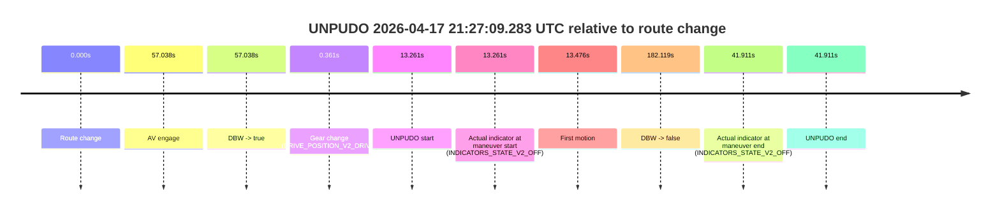
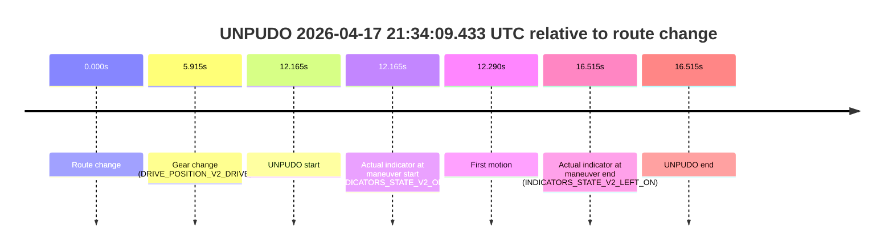
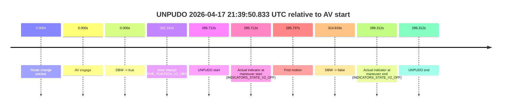
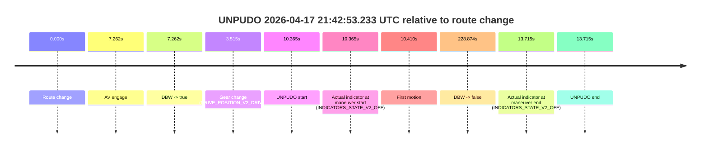
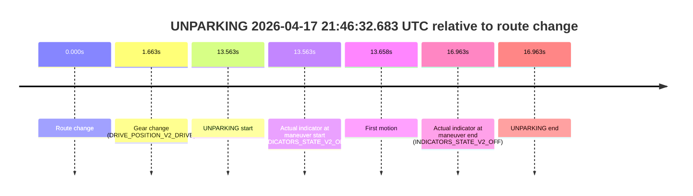

# Run Report: fme20029/2026-04-17--20-46-39--gen2-av-8da0e614-9dc4-46b4-9346-ed2468faf793

| Field | Value |
|---|---|
| Run ID | `fme20029/2026-04-17--20-46-39--gen2-av-8da0e614-9dc4-46b4-9346-ed2468faf793` |
| Date | `2026-04-17` |
| Model(s) | `satisfied-amber-moose` |
| Author | `guy.geva` |
| Event count | `10` |

## unpudo 2026-04-17 20:50:16.633 UTC

| Field | Value |
|---|---|
| Model | `satisfied-amber-moose` |
| Author | `guy.geva` |
| Run ID | `fme20029/2026-04-17--20-46-39--gen2-av-8da0e614-9dc4-46b4-9346-ed2468faf793` |
| Date | `2026-04-17` |
| Time (UTC) | `20:50:16.633` |
| Event type | `unpudo` |
| Disengagement type | `none observed` |
| Route change | `found` |
| Console | [run](https://console.sso.wayve.ai/run/fme20029/2026-04-17--20-46-39--gen2-av-8da0e614-9dc4-46b4-9346-ed2468faf793?id=&time-unixus=1776459016633303) |
| Foxglove | [segment](https://app.foxglove.dev/wayve-on-prem/p/prj_0dX18KZdVHg1fmmI/view?ds=foxglove-stream&ds.deviceName=fme20029&ds.start=2026-04-17T20%3A49%3A51.018263Z&ds.end=2026-04-17T20%3A52%3A58.999925Z&layoutId=lay_0e7VD4WIKDQGU73Y&time=2026-04-17T20%3A50%3A16.633303Z) |

### Event card: accidental

- Accidental: AV ownership is present for less than `2s`, so this is treated as an accidental brush with the maneuver rather than a meaningful model attempt.

| Event | Time (UTC) | Delta from route change |
|---|---:|---:|
| Route change | 2026-04-17 20:50:01.018 | `0.000s` |
| AV engage | 2026-04-17 20:50:30.621 | `29.603s` |
| DBW -> true | 2026-04-17 20:50:30.621 | `29.603s` |
| Gear change (DRIVE_POSITION_V2_DRIVE) | 2026-04-17 20:50:04.883 | `3.865s` |
| UNPUDO start | 2026-04-17 20:50:16.633 | `15.615s` |
| Actual indicator at maneuver start (INDICATORS_STATE_V2_OFF) | 2026-04-17 20:50:16.633 | `15.615s` |
| First motion | 2026-04-17 20:50:16.677 | `15.660s` |
| DBW -> false | 2026-04-17 20:52:48.999 | `167.982s` |
| Actual indicator at maneuver end (INDICATORS_STATE_V2_OFF) | 2026-04-17 20:50:20.933 | `19.915s` |
| UNPUDO end | 2026-04-17 20:50:20.933 | `19.915s` |

| Metric | Value |
|---|---|
| Outcome | `accidental` |
| Effective failure type | `none` |
| Route change status | `found` |
| DBW at event start | `false` |
| DBW at event end | `false` |
| Predicted gear at AV start | `DRIVE_POSITION_V2_DRIVE` |
| Actual gear at AV start | `DRIVE_POSITION_V2_DRIVE` |
| Predicted gear at event start | `DRIVE_POSITION_V2_DRIVE` |
| Actual gear at event start | `DRIVE_POSITION_V2_DRIVE` |
| Planned indicator direction | `INDICATORS_STATE_V2_RIGHT_ON` |
| Controller indicator direction | `INDICATORS_STATE_V2_RIGHT_ON` |
| Actual indicator direction | `INDICATORS_STATE_V2_OFF` |
| Actual indicator at maneuver end | `INDICATORS_STATE_V2_OFF` |
| Driver accel help in AV | `false` |
| Driver accel help timestamp | `n/a` |
| Max accel pedal pct in AV | `0.0%` |
| Max brake pedal pct in AV | `0.0%` |
| Max speed mps in AV | `0.000` |
| Route -> AV | `29.603s` |
| AV -> event start | `-13.988s` |
| AV -> first motion | `-13.943s` |
| AV duration before disengagement | `138.379s` |
| Trajectory waypoint count | `36` |
| Driving-plan step count | `11` |

The scored portion starts from the AV-owned window, not from the pre-AV setup. Route-change search in the stopped pre-event segment was `found`, with the baseline therefore set to route change. At the event anchor the model predicts `DRIVE_POSITION_V2_DRIVE` and the actual gear is `DRIVE_POSITION_V2_DRIVE`. The effective model outcome is `accidental` because `the AV-owned portion is shorter than 2s`.

### Resolution

| Field | Value |
|---|---|
| Final outcome | `accidental` |
| Do we agree with this label? | `yes` |
| Source disengagement type | `none observed` |
| Resolved effective failure type | `none` |
| Confidence | `high` |

## unpudo 2026-04-17 21:00:59.483 UTC

| Field | Value |
|---|---|
| Model | `satisfied-amber-moose` |
| Author | `guy.geva` |
| Run ID | `fme20029/2026-04-17--20-46-39--gen2-av-8da0e614-9dc4-46b4-9346-ed2468faf793` |
| Date | `2026-04-17` |
| Time (UTC) | `21:00:59.483` |
| Event type | `unpudo` |
| Disengagement type | `none observed` |
| Route change | `found` |
| Console | [run](https://console.sso.wayve.ai/run/fme20029/2026-04-17--20-46-39--gen2-av-8da0e614-9dc4-46b4-9346-ed2468faf793?id=&time-unixus=1776459659483317) |
| Foxglove | [segment](https://app.foxglove.dev/wayve-on-prem/p/prj_0dX18KZdVHg1fmmI/view?ds=foxglove-stream&ds.deviceName=fme20029&ds.start=2026-04-17T21%3A00%3A43.768256Z&ds.end=2026-04-17T21%3A02%3A31.820173Z&layoutId=lay_0e7VD4WIKDQGU73Y&time=2026-04-17T21%3A00%3A59.483317Z) |

### Event card: accidental

- Accidental: AV ownership is present for less than `2s`, so this is treated as an accidental brush with the maneuver rather than a meaningful model attempt.

| Event | Time (UTC) | Delta from route change |
|---|---:|---:|
| Route change | 2026-04-17 21:00:53.768 | `0.000s` |
| AV engage | 2026-04-17 21:01:08.149 | `14.382s` |
| DBW -> true | 2026-04-17 21:01:08.149 | `14.382s` |
| Gear change (DRIVE_POSITION_V2_DRIVE) | 2026-04-17 21:00:54.133 | `0.365s` |
| UNPUDO start | 2026-04-17 21:00:59.483 | `5.715s` |
| Actual indicator at maneuver start (INDICATORS_STATE_V2_OFF) | 2026-04-17 21:00:59.483 | `5.715s` |
| First motion | 2026-04-17 21:00:59.538 | `5.770s` |
| DBW -> false | 2026-04-17 21:02:21.820 | `88.052s` |
| Actual indicator at maneuver end (INDICATORS_STATE_V2_OFF) | 2026-04-17 21:01:04.083 | `10.315s` |
| UNPUDO end | 2026-04-17 21:01:04.083 | `10.315s` |

| Metric | Value |
|---|---|
| Outcome | `accidental` |
| Effective failure type | `none` |
| Route change status | `found` |
| DBW at event start | `false` |
| DBW at event end | `false` |
| Predicted gear at AV start | `DRIVE_POSITION_V2_DRIVE` |
| Actual gear at AV start | `DRIVE_POSITION_V2_DRIVE` |
| Predicted gear at event start | `DRIVE_POSITION_V2_DRIVE` |
| Actual gear at event start | `DRIVE_POSITION_V2_DRIVE` |
| Planned indicator direction | `INDICATORS_STATE_V2_RIGHT_ON` |
| Controller indicator direction | `INDICATORS_STATE_V2_RIGHT_ON` |
| Actual indicator direction | `INDICATORS_STATE_V2_OFF` |
| Actual indicator at maneuver end | `INDICATORS_STATE_V2_OFF` |
| Driver accel help in AV | `false` |
| Driver accel help timestamp | `n/a` |
| Max accel pedal pct in AV | `0.0%` |
| Max brake pedal pct in AV | `0.0%` |
| Max speed mps in AV | `0.000` |
| Route -> AV | `14.382s` |
| AV -> event start | `-8.667s` |
| AV -> first motion | `-8.612s` |
| AV duration before disengagement | `73.670s` |
| Trajectory waypoint count | `37` |
| Driving-plan step count | `11` |

The scored portion starts from the AV-owned window, not from the pre-AV setup. Route-change search in the stopped pre-event segment was `found`, with the baseline therefore set to route change. At the event anchor the model predicts `DRIVE_POSITION_V2_DRIVE` and the actual gear is `DRIVE_POSITION_V2_DRIVE`. The effective model outcome is `accidental` because `the AV-owned portion is shorter than 2s`.

### Resolution

| Field | Value |
|---|---|
| Final outcome | `accidental` |
| Do we agree with this label? | `yes` |
| Source disengagement type | `none observed` |
| Resolved effective failure type | `none` |
| Confidence | `high` |

## unpudo 2026-04-17 21:02:47.583 UTC

| Field | Value |
|---|---|
| Model | `satisfied-amber-moose` |
| Author | `guy.geva` |
| Run ID | `fme20029/2026-04-17--20-46-39--gen2-av-8da0e614-9dc4-46b4-9346-ed2468faf793` |
| Date | `2026-04-17` |
| Time (UTC) | `21:02:47.583` |
| Event type | `unpudo` |
| Disengagement type | `none observed` |
| Route change | `found` |
| Console | [run](https://console.sso.wayve.ai/run/fme20029/2026-04-17--20-46-39--gen2-av-8da0e614-9dc4-46b4-9346-ed2468faf793?id=&time-unixus=1776459767583317) |
| Foxglove | [segment](https://app.foxglove.dev/wayve-on-prem/p/prj_0dX18KZdVHg1fmmI/view?ds=foxglove-stream&ds.deviceName=fme20029&ds.start=2026-04-17T21%3A00%3A43.768256Z&ds.end=2026-04-17T21%3A04%3A13.150270Z&layoutId=lay_0e7VD4WIKDQGU73Y&time=2026-04-17T21%3A02%3A47.583317Z) |

### Event card: accidental

- Accidental: AV ownership is present for less than `2s`, so this is treated as an accidental brush with the maneuver rather than a meaningful model attempt.

| Event | Time (UTC) | Delta from route change |
|---|---:|---:|
| Route change | 2026-04-17 21:00:53.768 | `0.000s` |
| AV engage | 2026-04-17 21:02:56.679 | `122.912s` |
| DBW -> true | 2026-04-17 21:02:56.679 | `122.912s` |
| Gear change (DRIVE_POSITION_V2_DRIVE) | 2026-04-17 21:02:39.633 | `105.865s` |
| UNPUDO start | 2026-04-17 21:02:47.583 | `113.815s` |
| Actual indicator at maneuver start (INDICATORS_STATE_V2_OFF) | 2026-04-17 21:02:47.583 | `113.815s` |
| First motion | 2026-04-17 21:02:47.638 | `113.870s` |
| DBW -> false | 2026-04-17 21:04:03.150 | `189.382s` |
| Actual indicator at maneuver end (INDICATORS_STATE_V2_OFF) | 2026-04-17 21:02:51.083 | `117.315s` |
| UNPUDO end | 2026-04-17 21:02:51.083 | `117.315s` |

| Metric | Value |
|---|---|
| Outcome | `accidental` |
| Effective failure type | `none` |
| Route change status | `found` |
| DBW at event start | `false` |
| DBW at event end | `false` |
| Predicted gear at AV start | `DRIVE_POSITION_V2_DRIVE` |
| Actual gear at AV start | `DRIVE_POSITION_V2_DRIVE` |
| Predicted gear at event start | `DRIVE_POSITION_V2_DRIVE` |
| Actual gear at event start | `DRIVE_POSITION_V2_DRIVE` |
| Planned indicator direction | `INDICATORS_STATE_V2_RIGHT_ON` |
| Controller indicator direction | `INDICATORS_STATE_V2_RIGHT_ON` |
| Actual indicator direction | `INDICATORS_STATE_V2_OFF` |
| Actual indicator at maneuver end | `INDICATORS_STATE_V2_OFF` |
| Driver accel help in AV | `false` |
| Driver accel help timestamp | `n/a` |
| Max accel pedal pct in AV | `0.0%` |
| Max brake pedal pct in AV | `0.0%` |
| Max speed mps in AV | `0.000` |
| Route -> AV | `122.912s` |
| AV -> event start | `-9.097s` |
| AV -> first motion | `-9.042s` |
| AV duration before disengagement | `66.470s` |
| Trajectory waypoint count | `37` |
| Driving-plan step count | `11` |

The scored portion starts from the AV-owned window, not from the pre-AV setup. Route-change search in the stopped pre-event segment was `found`, with the baseline therefore set to route change. At the event anchor the model predicts `DRIVE_POSITION_V2_DRIVE` and the actual gear is `DRIVE_POSITION_V2_DRIVE`. The effective model outcome is `accidental` because `the AV-owned portion is shorter than 2s`.

### Resolution

| Field | Value |
|---|---|
| Final outcome | `accidental` |
| Do we agree with this label? | `yes` |
| Source disengagement type | `none observed` |
| Resolved effective failure type | `none` |
| Confidence | `high` |

## unpudo 2026-04-17 21:04:30.983 UTC

| Field | Value |
|---|---|
| Model | `satisfied-amber-moose` |
| Author | `guy.geva` |
| Run ID | `fme20029/2026-04-17--20-46-39--gen2-av-8da0e614-9dc4-46b4-9346-ed2468faf793` |
| Date | `2026-04-17` |
| Time (UTC) | `21:04:30.983` |
| Event type | `unpudo` |
| Disengagement type | `none observed` |
| Route change | `found` |
| Console | [run](https://console.sso.wayve.ai/run/fme20029/2026-04-17--20-46-39--gen2-av-8da0e614-9dc4-46b4-9346-ed2468faf793?id=&time-unixus=1776459870983297) |
| Foxglove | [segment](https://app.foxglove.dev/wayve-on-prem/p/prj_0dX18KZdVHg1fmmI/view?ds=foxglove-stream&ds.deviceName=fme20029&ds.start=2026-04-17T21%3A02%3A28.618268Z&ds.end=2026-04-17T21%3A13%3A18.319968Z&layoutId=lay_0e7VD4WIKDQGU73Y&time=2026-04-17T21%3A04%3A30.983297Z) |

### Event card: accidental

- Accidental: AV ownership is present for less than `2s`, so this is treated as an accidental brush with the maneuver rather than a meaningful model attempt.

| Event | Time (UTC) | Delta from route change |
|---|---:|---:|
| Route change | 2026-04-17 21:02:38.618 | `0.000s` |
| AV engage | 2026-04-17 21:04:41.179 | `122.562s` |
| DBW -> true | 2026-04-17 21:04:41.179 | `122.562s` |
| Gear change (DRIVE_POSITION_V2_DRIVE) | 2026-04-17 21:04:23.783 | `105.165s` |
| UNPUDO start | 2026-04-17 21:04:30.983 | `112.365s` |
| Actual indicator at maneuver start (INDICATORS_STATE_V2_OFF) | 2026-04-17 21:04:30.983 | `112.365s` |
| First motion | 2026-04-17 21:04:31.077 | `112.460s` |
| DBW -> false | 2026-04-17 21:13:08.319 | `629.702s` |
| Actual indicator at maneuver end (INDICATORS_STATE_V2_OFF) | 2026-04-17 21:04:35.233 | `116.615s` |
| UNPUDO end | 2026-04-17 21:04:35.233 | `116.615s` |

| Metric | Value |
|---|---|
| Outcome | `accidental` |
| Effective failure type | `none` |
| Route change status | `found` |
| DBW at event start | `false` |
| DBW at event end | `false` |
| Predicted gear at AV start | `DRIVE_POSITION_V2_DRIVE` |
| Actual gear at AV start | `DRIVE_POSITION_V2_DRIVE` |
| Predicted gear at event start | `DRIVE_POSITION_V2_DRIVE` |
| Actual gear at event start | `DRIVE_POSITION_V2_DRIVE` |
| Planned indicator direction | `INDICATORS_STATE_V2_RIGHT_ON` |
| Controller indicator direction | `INDICATORS_STATE_V2_RIGHT_ON` |
| Actual indicator direction | `INDICATORS_STATE_V2_OFF` |
| Actual indicator at maneuver end | `INDICATORS_STATE_V2_OFF` |
| Driver accel help in AV | `false` |
| Driver accel help timestamp | `n/a` |
| Max accel pedal pct in AV | `0.0%` |
| Max brake pedal pct in AV | `0.0%` |
| Max speed mps in AV | `0.000` |
| Route -> AV | `122.562s` |
| AV -> event start | `-10.197s` |
| AV -> first motion | `-10.102s` |
| AV duration before disengagement | `507.140s` |
| Trajectory waypoint count | `37` |
| Driving-plan step count | `11` |

The scored portion starts from the AV-owned window, not from the pre-AV setup. Route-change search in the stopped pre-event segment was `found`, with the baseline therefore set to route change. At the event anchor the model predicts `DRIVE_POSITION_V2_DRIVE` and the actual gear is `DRIVE_POSITION_V2_DRIVE`. The effective model outcome is `accidental` because `the AV-owned portion is shorter than 2s`.

### Resolution

| Field | Value |
|---|---|
| Final outcome | `accidental` |
| Do we agree with this label? | `yes` |
| Source disengagement type | `none observed` |
| Resolved effective failure type | `none` |
| Confidence | `high` |

## unpudo 2026-04-17 21:27:09.283 UTC

| Field | Value |
|---|---|
| Model | `satisfied-amber-moose` |
| Author | `guy.geva` |
| Run ID | `fme20029/2026-04-17--20-46-39--gen2-av-8da0e614-9dc4-46b4-9346-ed2468faf793` |
| Date | `2026-04-17` |
| Time (UTC) | `21:27:09.283` |
| Event type | `unpudo` |
| Disengagement type | `none observed` |
| Route change | `found` |
| Console | [run](https://console.sso.wayve.ai/run/fme20029/2026-04-17--20-46-39--gen2-av-8da0e614-9dc4-46b4-9346-ed2468faf793?id=&time-unixus=1776461229283307) |
| Foxglove | [segment](https://app.foxglove.dev/wayve-on-prem/p/prj_0dX18KZdVHg1fmmI/view?ds=foxglove-stream&ds.deviceName=fme20029&ds.start=2026-04-17T21%3A26%3A46.021953Z&ds.end=2026-04-17T21%3A30%3A08.141288Z&layoutId=lay_0e7VD4WIKDQGU73Y&time=2026-04-17T21%3A27%3A09.283307Z) |

### Event card: accidental

- Accidental: AV ownership is present for less than `2s`, so this is treated as an accidental brush with the maneuver rather than a meaningful model attempt.

| Event | Time (UTC) | Delta from route change |
|---|---:|---:|
| Route change | 2026-04-17 21:26:56.021 | `0.000s` |
| AV engage | 2026-04-17 21:27:53.059 | `57.038s` |
| DBW -> true | 2026-04-17 21:27:53.059 | `57.038s` |
| Gear change (DRIVE_POSITION_V2_DRIVE) | 2026-04-17 21:26:56.383 | `0.361s` |
| UNPUDO start | 2026-04-17 21:27:09.283 | `13.261s` |
| Actual indicator at maneuver start (INDICATORS_STATE_V2_OFF) | 2026-04-17 21:27:09.283 | `13.261s` |
| First motion | 2026-04-17 21:27:09.498 | `13.476s` |
| DBW -> false | 2026-04-17 21:29:58.141 | `182.119s` |
| Actual indicator at maneuver end (INDICATORS_STATE_V2_OFF) | 2026-04-17 21:27:37.933 | `41.911s` |
| UNPUDO end | 2026-04-17 21:27:37.933 | `41.911s` |

| Metric | Value |
|---|---|
| Outcome | `accidental` |
| Effective failure type | `none` |
| Route change status | `found` |
| DBW at event start | `false` |
| DBW at event end | `false` |
| Predicted gear at AV start | `DRIVE_POSITION_V2_DRIVE` |
| Actual gear at AV start | `DRIVE_POSITION_V2_DRIVE` |
| Predicted gear at event start | `DRIVE_POSITION_V2_DRIVE` |
| Actual gear at event start | `DRIVE_POSITION_V2_DRIVE` |
| Planned indicator direction | `INDICATORS_STATE_V2_OFF` |
| Controller indicator direction | `INDICATORS_STATE_V2_OFF` |
| Actual indicator direction | `INDICATORS_STATE_V2_OFF` |
| Actual indicator at maneuver end | `INDICATORS_STATE_V2_OFF` |
| Driver accel help in AV | `false` |
| Driver accel help timestamp | `n/a` |
| Max accel pedal pct in AV | `0.0%` |
| Max brake pedal pct in AV | `0.0%` |
| Max speed mps in AV | `0.000` |
| Route -> AV | `57.038s` |
| AV -> event start | `-43.777s` |
| AV -> first motion | `-43.562s` |
| AV duration before disengagement | `125.081s` |
| Trajectory waypoint count | `37` |
| Driving-plan step count | `11` |

The scored portion starts from the AV-owned window, not from the pre-AV setup. Route-change search in the stopped pre-event segment was `found`, with the baseline therefore set to route change. At the event anchor the model predicts `DRIVE_POSITION_V2_DRIVE` and the actual gear is `DRIVE_POSITION_V2_DRIVE`. The effective model outcome is `accidental` because `the AV-owned portion is shorter than 2s`.

### Resolution

| Field | Value |
|---|---|
| Final outcome | `accidental` |
| Do we agree with this label? | `yes` |
| Source disengagement type | `none observed` |
| Resolved effective failure type | `none` |
| Confidence | `high` |

## unpudo 2026-04-17 21:34:09.433 UTC

| Field | Value |
|---|---|
| Model | `satisfied-amber-moose` |
| Author | `guy.geva` |
| Run ID | `fme20029/2026-04-17--20-46-39--gen2-av-8da0e614-9dc4-46b4-9346-ed2468faf793` |
| Date | `2026-04-17` |
| Time (UTC) | `21:34:09.433` |
| Event type | `unpudo` |
| Disengagement type | `none observed` |
| Route change | `found` |
| Console | [run](https://console.sso.wayve.ai/run/fme20029/2026-04-17--20-46-39--gen2-av-8da0e614-9dc4-46b4-9346-ed2468faf793?id=&time-unixus=1776461649433305) |
| Foxglove | [segment](https://app.foxglove.dev/wayve-on-prem/p/prj_0dX18KZdVHg1fmmI/view?ds=foxglove-stream&ds.deviceName=fme20029&ds.start=2026-04-17T21%3A33%3A47.268276Z&ds.end=2026-04-17T21%3A34%3A23.783306Z&layoutId=lay_0e7VD4WIKDQGU73Y&time=2026-04-17T21%3A34%3A09.433305Z) |

### Event card: non-av

- Non-AV: the detected unpudo starts outside AV ownership, so it is kept for coverage but excluded from model success / failure scoring.

| Event | Time (UTC) | Delta from route change |
|---|---:|---:|
| Route change | 2026-04-17 21:33:57.268 | `0.000s` |
| Gear change (DRIVE_POSITION_V2_DRIVE) | 2026-04-17 21:34:03.183 | `5.915s` |
| UNPUDO start | 2026-04-17 21:34:09.433 | `12.165s` |
| Actual indicator at maneuver start (INDICATORS_STATE_V2_OFF) | 2026-04-17 21:34:09.433 | `12.165s` |
| First motion | 2026-04-17 21:34:09.558 | `12.290s` |
| Actual indicator at maneuver end (INDICATORS_STATE_V2_LEFT_ON) | 2026-04-17 21:34:13.783 | `16.515s` |
| UNPUDO end | 2026-04-17 21:34:13.783 | `16.515s` |

| Metric | Value |
|---|---|
| Outcome | `non-av` |
| Effective failure type | `none` |
| Route change status | `found` |
| DBW at event start | `false` |
| DBW at event end | `false` |
| Predicted gear at AV start | `n/a` |
| Actual gear at AV start | `n/a` |
| Predicted gear at event start | `DRIVE_POSITION_V2_DRIVE` |
| Actual gear at event start | `DRIVE_POSITION_V2_DRIVE` |
| Planned indicator direction | `INDICATORS_STATE_V2_RIGHT_ON` |
| Controller indicator direction | `INDICATORS_STATE_V2_RIGHT_ON` |
| Actual indicator direction | `INDICATORS_STATE_V2_OFF` |
| Actual indicator at maneuver end | `INDICATORS_STATE_V2_LEFT_ON` |
| Driver accel help in AV | `false` |
| Driver accel help timestamp | `n/a` |
| Max accel pedal pct in AV | `0.0%` |
| Max brake pedal pct in AV | `0.0%` |
| Max speed mps in AV | `0.000` |
| Route -> AV | `n/a` |
| AV -> event start | `n/a` |
| AV -> first motion | `n/a` |
| AV duration before disengagement | `n/a` |
| Trajectory waypoint count | `36` |
| Driving-plan step count | `11` |

The scored portion starts from the AV-owned window, not from the pre-AV setup. Route-change search in the stopped pre-event segment was `found`, with the baseline therefore set to route change. At the event anchor the model predicts `DRIVE_POSITION_V2_DRIVE` and the actual gear is `DRIVE_POSITION_V2_DRIVE`. The effective model outcome is `non-av` because `the event does not begin in AV ownership`.

### Resolution

| Field | Value |
|---|---|
| Final outcome | `non-av` |
| Do we agree with this label? | `yes` |
| Source disengagement type | `none observed` |
| Resolved effective failure type | `none` |
| Confidence | `high` |

## unpudo 2026-04-17 21:39:50.833 UTC

| Field | Value |
|---|---|
| Model | `satisfied-amber-moose` |
| Author | `guy.geva` |
| Run ID | `fme20029/2026-04-17--20-46-39--gen2-av-8da0e614-9dc4-46b4-9346-ed2468faf793` |
| Date | `2026-04-17` |
| Time (UTC) | `21:39:50.833` |
| Event type | `unpudo` |
| Disengagement type | `none observed` |
| Route change | `unclear` |
| Console | [run](https://console.sso.wayve.ai/run/fme20029/2026-04-17--20-46-39--gen2-av-8da0e614-9dc4-46b4-9346-ed2468faf793?id=&time-unixus=1776461990833311) |
| Foxglove | [segment](https://app.foxglove.dev/wayve-on-prem/p/prj_0dX18KZdVHg1fmmI/view?ds=foxglove-stream&ds.deviceName=fme20029&ds.start=2026-04-17T21%3A34%3A55.121099Z&ds.end=2026-04-17T21%3A40%3A30.040528Z&layoutId=lay_0e7VD4WIKDQGU73Y&time=2026-04-17T21%3A39%3A50.833311Z) |

### Event card: pass

- Pass: AV owns the credited unpudo through the official event window, the gear state is aligned at the anchor, and the vehicle moves without driver accelerator help in AV.

| Event | Time (UTC) | Delta from AV start |
|---|---:|---:|
| Route change unclear | 2026-04-17 21:35:05.121 | `0.000s` |
| AV engage | 2026-04-17 21:35:05.121 | `0.000s` |
| DBW -> true | 2026-04-17 21:35:05.121 | `0.000s` |
| Gear change (DRIVE_POSITION_V2_DRIVE) | 2026-04-17 21:39:47.283 | `282.162s` |
| UNPUDO start | 2026-04-17 21:39:50.833 | `285.712s` |
| Actual indicator at maneuver start (INDICATORS_STATE_V2_OFF) | 2026-04-17 21:39:50.833 | `285.712s` |
| First motion | 2026-04-17 21:39:50.857 | `285.737s` |
| DBW -> false | 2026-04-17 21:40:20.040 | `314.919s` |
| Actual indicator at maneuver end (INDICATORS_STATE_V2_OFF) | 2026-04-17 21:39:54.433 | `289.312s` |
| UNPUDO end | 2026-04-17 21:39:54.433 | `289.312s` |

| Metric | Value |
|---|---|
| Outcome | `pass` |
| Effective failure type | `none` |
| Route change status | `unclear` |
| DBW at event start | `true` |
| DBW at event end | `true` |
| Predicted gear at AV start | `DRIVE_POSITION_V2_DRIVE` |
| Actual gear at AV start | `DRIVE_POSITION_V2_DRIVE` |
| Predicted gear at event start | `DRIVE_POSITION_V2_DRIVE` |
| Actual gear at event start | `DRIVE_POSITION_V2_DRIVE` |
| Planned indicator direction | `INDICATORS_STATE_V2_OFF` |
| Controller indicator direction | `INDICATORS_STATE_V2_OFF` |
| Actual indicator direction | `INDICATORS_STATE_V2_OFF` |
| Actual indicator at maneuver end | `INDICATORS_STATE_V2_OFF` |
| Driver accel help in AV | `false` |
| Driver accel help timestamp | `n/a` |
| Max accel pedal pct in AV | `0.0%` |
| Max brake pedal pct in AV | `10.5%` |
| Max speed mps in AV | `7.581` |
| Route -> AV | `n/a` |
| AV -> event start | `285.712s` |
| AV -> first motion | `285.737s` |
| AV duration before disengagement | `314.919s` |
| Trajectory waypoint count | `36` |
| Driving-plan step count | `11` |

The scored portion starts from the AV-owned window, not from the pre-AV setup. Route-change search in the stopped pre-event segment was `unclear`, with the baseline therefore set to AV start. At the event anchor the model predicts `DRIVE_POSITION_V2_DRIVE` and the actual gear is `DRIVE_POSITION_V2_DRIVE`. The effective model outcome is `pass` because `the credited maneuver stays AV-owned through the official event end`.

### Resolution

| Field | Value |
|---|---|
| Final outcome | `pass` |
| Do we agree with this label? | `yes` |
| Source disengagement type | `none observed` |
| Resolved effective failure type | `none` |
| Confidence | `medium` |

## unpudo 2026-04-17 21:40:21.233 UTC

| Field | Value |
|---|---|
| Model | `satisfied-amber-moose` |
| Author | `guy.geva` |
| Run ID | `fme20029/2026-04-17--20-46-39--gen2-av-8da0e614-9dc4-46b4-9346-ed2468faf793` |
| Date | `2026-04-17` |
| Time (UTC) | `21:40:21.233` |
| Event type | `unpudo` |
| Disengagement type | `none observed` |
| Route change | `found` |
| Console | [run](https://console.sso.wayve.ai/run/fme20029/2026-04-17--20-46-39--gen2-av-8da0e614-9dc4-46b4-9346-ed2468faf793?id=&time-unixus=1776462021233297) |
| Foxglove | [segment](https://app.foxglove.dev/wayve-on-prem/p/prj_0dX18KZdVHg1fmmI/view?ds=foxglove-stream&ds.deviceName=fme20029&ds.start=2026-04-17T21%3A40%3A03.568273Z&ds.end=2026-04-17T21%3A42%3A44.580187Z&layoutId=lay_0e7VD4WIKDQGU73Y&time=2026-04-17T21%3A40%3A21.233297Z) |

### Event card: non-av

- Non-AV: the detected unpudo starts outside AV ownership, so it is kept for coverage but excluded from model success / failure scoring.

| Event | Time (UTC) | Delta from route change |
|---|---:|---:|
| Route change | 2026-04-17 21:40:13.568 | `0.000s` |
| AV engage | 2026-04-17 21:40:29.460 | `15.892s` |
| DBW -> true | 2026-04-17 21:40:29.460 | `15.892s` |
| Gear change (DRIVE_POSITION_V2_DRIVE) | 2026-04-17 21:40:13.883 | `0.315s` |
| UNPUDO start | 2026-04-17 21:40:21.233 | `7.665s` |
| Actual indicator at maneuver start (INDICATORS_STATE_V2_RIGHT_ON) | 2026-04-17 21:40:21.233 | `7.665s` |
| First motion | 2026-04-17 21:40:21.278 | `7.710s` |
| DBW -> false | 2026-04-17 21:42:34.580 | `141.012s` |
| Actual indicator at maneuver end (INDICATORS_STATE_V2_OFF) | 2026-04-17 21:40:54.983 | `41.415s` |
| UNPUDO end | 2026-04-17 21:40:54.983 | `41.415s` |

| Metric | Value |
|---|---|
| Outcome | `non-av` |
| Effective failure type | `none` |
| Route change status | `found` |
| DBW at event start | `false` |
| DBW at event end | `true` |
| Predicted gear at AV start | `DRIVE_POSITION_V2_DRIVE` |
| Actual gear at AV start | `DRIVE_POSITION_V2_DRIVE` |
| Predicted gear at event start | `DRIVE_POSITION_V2_DRIVE` |
| Actual gear at event start | `DRIVE_POSITION_V2_DRIVE` |
| Planned indicator direction | `INDICATORS_STATE_V2_RIGHT_ON` |
| Controller indicator direction | `INDICATORS_STATE_V2_RIGHT_ON` |
| Actual indicator direction | `INDICATORS_STATE_V2_RIGHT_ON` |
| Actual indicator at maneuver end | `INDICATORS_STATE_V2_OFF` |
| Driver accel help in AV | `false` |
| Driver accel help timestamp | `n/a` |
| Max accel pedal pct in AV | `0.0%` |
| Max brake pedal pct in AV | `8.0%` |
| Max speed mps in AV | `4.058` |
| Route -> AV | `15.892s` |
| AV -> event start | `-8.227s` |
| AV -> first motion | `-8.182s` |
| AV duration before disengagement | `125.120s` |
| Trajectory waypoint count | `36` |
| Driving-plan step count | `11` |

The scored portion starts from the AV-owned window, not from the pre-AV setup. Route-change search in the stopped pre-event segment was `found`, with the baseline therefore set to route change. At the event anchor the model predicts `DRIVE_POSITION_V2_DRIVE` and the actual gear is `DRIVE_POSITION_V2_DRIVE`. The effective model outcome is `non-av` because `the event does not begin in AV ownership`.

### Resolution

| Field | Value |
|---|---|
| Final outcome | `non-av` |
| Do we agree with this label? | `yes` |
| Source disengagement type | `none observed` |
| Resolved effective failure type | `none` |
| Confidence | `high` |

## unpudo 2026-04-17 21:42:53.233 UTC

| Field | Value |
|---|---|
| Model | `satisfied-amber-moose` |
| Author | `guy.geva` |
| Run ID | `fme20029/2026-04-17--20-46-39--gen2-av-8da0e614-9dc4-46b4-9346-ed2468faf793` |
| Date | `2026-04-17` |
| Time (UTC) | `21:42:53.233` |
| Event type | `unpudo` |
| Disengagement type | `none observed` |
| Route change | `found` |
| Console | [run](https://console.sso.wayve.ai/run/fme20029/2026-04-17--20-46-39--gen2-av-8da0e614-9dc4-46b4-9346-ed2468faf793?id=&time-unixus=1776462173233311) |
| Foxglove | [segment](https://app.foxglove.dev/wayve-on-prem/p/prj_0dX18KZdVHg1fmmI/view?ds=foxglove-stream&ds.deviceName=fme20029&ds.start=2026-04-17T21%3A42%3A32.868283Z&ds.end=2026-04-17T21%3A46%3A41.741973Z&layoutId=lay_0e7VD4WIKDQGU73Y&time=2026-04-17T21%3A42%3A53.233311Z) |

### Event card: pass

- Pass: AV owns the credited unpudo through the official event window, the gear state is aligned at the anchor, and the vehicle moves without driver accelerator help in AV.

| Event | Time (UTC) | Delta from route change |
|---|---:|---:|
| Route change | 2026-04-17 21:42:42.868 | `0.000s` |
| AV engage | 2026-04-17 21:42:50.130 | `7.262s` |
| DBW -> true | 2026-04-17 21:42:50.130 | `7.262s` |
| Gear change (DRIVE_POSITION_V2_DRIVE) | 2026-04-17 21:42:46.383 | `3.515s` |
| UNPUDO start | 2026-04-17 21:42:53.233 | `10.365s` |
| Actual indicator at maneuver start (INDICATORS_STATE_V2_OFF) | 2026-04-17 21:42:53.233 | `10.365s` |
| First motion | 2026-04-17 21:42:53.278 | `10.410s` |
| DBW -> false | 2026-04-17 21:46:31.741 | `228.874s` |
| Actual indicator at maneuver end (INDICATORS_STATE_V2_OFF) | 2026-04-17 21:42:56.583 | `13.715s` |
| UNPUDO end | 2026-04-17 21:42:56.583 | `13.715s` |

| Metric | Value |
|---|---|
| Outcome | `pass` |
| Effective failure type | `none` |
| Route change status | `found` |
| DBW at event start | `true` |
| DBW at event end | `true` |
| Predicted gear at AV start | `DRIVE_POSITION_V2_DRIVE` |
| Actual gear at AV start | `DRIVE_POSITION_V2_DRIVE` |
| Predicted gear at event start | `DRIVE_POSITION_V2_DRIVE` |
| Actual gear at event start | `DRIVE_POSITION_V2_DRIVE` |
| Planned indicator direction | `INDICATORS_STATE_V2_RIGHT_ON` |
| Controller indicator direction | `INDICATORS_STATE_V2_RIGHT_ON` |
| Actual indicator direction | `INDICATORS_STATE_V2_OFF` |
| Actual indicator at maneuver end | `INDICATORS_STATE_V2_OFF` |
| Driver accel help in AV | `false` |
| Driver accel help timestamp | `n/a` |
| Max accel pedal pct in AV | `0.0%` |
| Max brake pedal pct in AV | `8.0%` |
| Max speed mps in AV | `5.231` |
| Route -> AV | `7.262s` |
| AV -> event start | `3.103s` |
| AV -> first motion | `3.148s` |
| AV duration before disengagement | `221.612s` |
| Trajectory waypoint count | `36` |
| Driving-plan step count | `11` |

The scored portion starts from the AV-owned window, not from the pre-AV setup. Route-change search in the stopped pre-event segment was `found`, with the baseline therefore set to route change. At the event anchor the model predicts `DRIVE_POSITION_V2_DRIVE` and the actual gear is `DRIVE_POSITION_V2_DRIVE`. The effective model outcome is `pass` because `the credited maneuver stays AV-owned through the official event end`.

### Resolution

| Field | Value |
|---|---|
| Final outcome | `pass` |
| Do we agree with this label? | `yes` |
| Source disengagement type | `none observed` |
| Resolved effective failure type | `none` |
| Confidence | `high` |

## unparking 2026-04-17 21:46:32.683 UTC

| Field | Value |
|---|---|
| Model | `satisfied-amber-moose` |
| Author | `guy.geva` |
| Run ID | `fme20029/2026-04-17--20-46-39--gen2-av-8da0e614-9dc4-46b4-9346-ed2468faf793` |
| Date | `2026-04-17` |
| Time (UTC) | `21:46:32.683` |
| Event type | `unparking` |
| Disengagement type | `none observed` |
| Route change | `found` |
| Console | [run](https://console.sso.wayve.ai/run/fme20029/2026-04-17--20-46-39--gen2-av-8da0e614-9dc4-46b4-9346-ed2468faf793?id=&time-unixus=1776462392683298) |
| Foxglove | [segment](https://app.foxglove.dev/wayve-on-prem/p/prj_0dX18KZdVHg1fmmI/view?ds=foxglove-stream&ds.deviceName=fme20029&ds.start=2026-04-17T21%3A46%3A09.120314Z&ds.end=2026-04-17T21%3A46%3A46.083294Z&layoutId=lay_0e7VD4WIKDQGU73Y&time=2026-04-17T21%3A46%3A32.683298Z) |

### Event card: non-av

- Non-AV: the detected unparking starts outside AV ownership, so it is kept for coverage but excluded from model success / failure scoring.

| Event | Time (UTC) | Delta from route change |
|---|---:|---:|
| Route change | 2026-04-17 21:46:19.120 | `0.000s` |
| Gear change (DRIVE_POSITION_V2_DRIVE) | 2026-04-17 21:46:20.783 | `1.663s` |
| UNPARKING start | 2026-04-17 21:46:32.683 | `13.563s` |
| Actual indicator at maneuver start (INDICATORS_STATE_V2_OFF) | 2026-04-17 21:46:32.683 | `13.563s` |
| First motion | 2026-04-17 21:46:32.777 | `13.658s` |
| Actual indicator at maneuver end (INDICATORS_STATE_V2_OFF) | 2026-04-17 21:46:36.083 | `16.963s` |
| UNPARKING end | 2026-04-17 21:46:36.083 | `16.963s` |

| Metric | Value |
|---|---|
| Outcome | `non-av` |
| Effective failure type | `none` |
| Route change status | `found` |
| DBW at event start | `false` |
| DBW at event end | `false` |
| Predicted gear at AV start | `n/a` |
| Actual gear at AV start | `n/a` |
| Predicted gear at event start | `DRIVE_POSITION_V2_DRIVE` |
| Actual gear at event start | `DRIVE_POSITION_V2_DRIVE` |
| Planned indicator direction | `INDICATORS_STATE_V2_RIGHT_ON` |
| Controller indicator direction | `INDICATORS_STATE_V2_RIGHT_ON` |
| Actual indicator direction | `INDICATORS_STATE_V2_OFF` |
| Actual indicator at maneuver end | `INDICATORS_STATE_V2_OFF` |
| Driver accel help in AV | `false` |
| Driver accel help timestamp | `n/a` |
| Max accel pedal pct in AV | `0.0%` |
| Max brake pedal pct in AV | `0.0%` |
| Max speed mps in AV | `0.000` |
| Route -> AV | `n/a` |
| AV -> event start | `n/a` |
| AV -> first motion | `n/a` |
| AV duration before disengagement | `n/a` |
| Trajectory waypoint count | `37` |
| Driving-plan step count | `11` |

The scored portion starts from the AV-owned window, not from the pre-AV setup. Route-change search in the stopped pre-event segment was `found`, with the baseline therefore set to route change. At the event anchor the model predicts `DRIVE_POSITION_V2_DRIVE` and the actual gear is `DRIVE_POSITION_V2_DRIVE`. The effective model outcome is `non-av` because `the event does not begin in AV ownership`.

### Resolution

| Field | Value |
|---|---|
| Final outcome | `non-av` |
| Do we agree with this label? | `yes` |
| Source disengagement type | `none observed` |
| Resolved effective failure type | `none` |
| Confidence | `high` |
