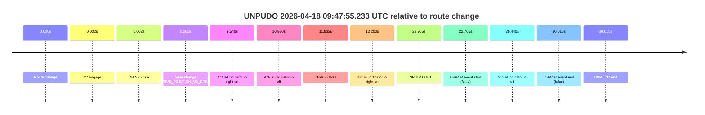
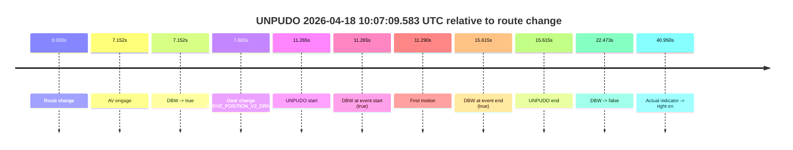
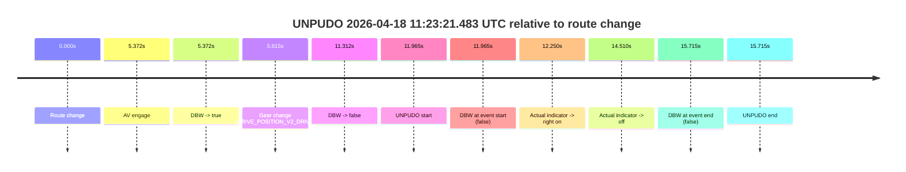
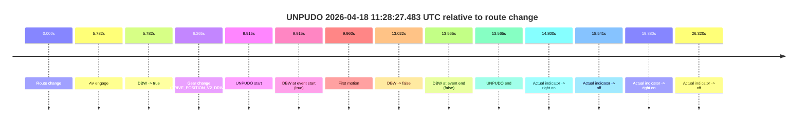
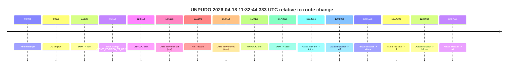
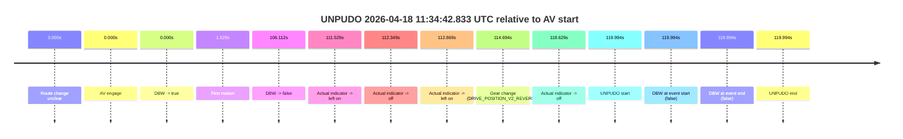

# Run Report: fme20029/2026-04-18--09-35-39--gen2-av-c7a05cb0-89c3-42ef-96e0-6d9cb91dfe95

| Field | Value |
|---|---|
| Run ID | `fme20029/2026-04-18--09-35-39--gen2-av-c7a05cb0-89c3-42ef-96e0-6d9cb91dfe95` |
| Date | `2026-04-18` |
| Model(s) | `eel-teal-outspoken` |
| Author | `zak` |
| Event count | `7` |

## unpudo 2026-04-18 09:47:55.233 UTC

| Field | Value |
|---|---|
| Model | `eel-teal-outspoken` |
| Author | `zak` |
| Run ID | `fme20029/2026-04-18--09-35-39--gen2-av-c7a05cb0-89c3-42ef-96e0-6d9cb91dfe95` |
| Date | `2026-04-18` |
| Time (UTC) | `09:47:55.233` |
| Event type | `unpudo` |
| Disengagement type | `failed_to_unpudo` |
| Route change | `found` |
| Console | [run](https://console.sso.wayve.ai/run/fme20029/2026-04-18--09-35-39--gen2-av-c7a05cb0-89c3-42ef-96e0-6d9cb91dfe95?id=&time-unixus=1776505675233319) |
| Foxglove | [segment](https://app.foxglove.dev/wayve-on-prem/p/prj_0dX18KZdVHg1fmmI/view?ds=foxglove-stream&ds.deviceName=fme20029&ds.start=2026-04-18T09%3A47%3A22.468384Z&ds.end=2026-04-18T09%3A48%3A12.483309Z&layoutId=lay_0e7VD4WIKDQGU73Y&time=2026-04-18T09%3A47%3A55.233319Z) |

### Event card: fail

- Fail: AV owns part of the segment, but the event still resolves as a model-performance failure under the AV-only scoring rule.

| Event | Time (UTC) | Delta from route change |
|---|---:|---:|
| Route change | 2026-04-18 09:47:32.468 | `0.000s` |
| AV engage | 2026-04-18 09:47:32.470 | `0.002s` |
| DBW -> true | 2026-04-18 09:47:32.470 | `0.002s` |
| Gear change (DRIVE_POSITION_V2_DRIVE) | 2026-04-18 09:47:32.733 | `0.265s` |
| Actual indicator -> right on | 2026-04-18 09:47:42.008 | `9.540s` |
| Actual indicator -> off | 2026-04-18 09:47:43.448 | `10.980s` |
| DBW -> false | 2026-04-18 09:47:44.300 | `11.832s` |
| Actual indicator -> right on | 2026-04-18 09:47:44.668 | `12.200s` |
| UNPUDO start | 2026-04-18 09:47:55.233 | `22.765s` |
| DBW at event start (false) | 2026-04-18 09:47:55.233 | `22.765s` |
| Actual indicator -> off | 2026-04-18 09:47:58.908 | `26.440s` |
| DBW at event end (false) | 2026-04-18 09:48:02.483 | `30.015s` |
| UNPUDO end | 2026-04-18 09:48:02.483 | `30.015s` |

| Metric | Value |
|---|---|
| Outcome | `fail` |
| Effective failure type | `failed_to_unpudo` |
| Route change status | `found` |
| DBW at event start | `false` |
| DBW at event end | `false` |
| Predicted gear at AV start | `DRIVE_POSITION_V2_PARK` |
| Actual gear at AV start | `DRIVE_POSITION_V2_PARK` |
| Predicted gear at event start | `DRIVE_POSITION_V2_DRIVE` |
| Actual gear at event start | `DRIVE_POSITION_V2_DRIVE` |
| Planned indicator direction | `INDICATORS_STATE_V2_RIGHT_ON` |
| Controller indicator direction | `INDICATORS_STATE_V2_RIGHT_ON` |
| Actual indicator direction | `INDICATORS_STATE_V2_RIGHT_ON` |
| Actual indicator at maneuver end | `INDICATORS_STATE_V2_OFF` |
| Driver accel help in AV | `false` |
| Driver accel help timestamp | `n/a` |
| Max accel pedal pct in AV | `0.0%` |
| Max brake pedal pct in AV | `9.6%` |
| Max speed mps in AV | `0.000` |
| Success timing baseline | `route change` |
| Route -> AV | `0.002s` |
| AV -> event start | `22.763s` |
| AV -> first motion | `n/a` |
| Success baseline -> event start | `22.765s` |
| Success baseline -> first motion | `n/a` |
| AV duration before disengagement | `11.830s` |
| Trajectory waypoint count | `36` |
| Driving-plan step count | `11` |

The scored portion starts from the AV-owned window, not from the pre-AV setup. Route-change search in the stopped pre-event segment was `found`, with the baseline therefore set to route change. At the event anchor the model predicts `DRIVE_POSITION_V2_DRIVE` and the actual gear is `DRIVE_POSITION_V2_DRIVE`. The effective model outcome is `fail` because `failed_to_unpudo.`

### Resolution

| Field | Value |
|---|---|
| Final outcome | `fail` |
| Do we agree with this label? | `yes` |
| Source disengagement type | `failed_to_unpudo` |
| Resolved effective failure type | `failed_to_unpudo` |
| Confidence | `high` |

## unpudo 2026-04-18 10:07:09.583 UTC

| Field | Value |
|---|---|
| Model | `eel-teal-outspoken` |
| Author | `zak` |
| Run ID | `fme20029/2026-04-18--09-35-39--gen2-av-c7a05cb0-89c3-42ef-96e0-6d9cb91dfe95` |
| Date | `2026-04-18` |
| Time (UTC) | `10:07:09.583` |
| Event type | `unpudo` |
| Disengagement type | `none observed` |
| Route change | `found` |
| Console | [run](https://console.sso.wayve.ai/run/fme20029/2026-04-18--09-35-39--gen2-av-c7a05cb0-89c3-42ef-96e0-6d9cb91dfe95?id=&time-unixus=1776506829583298) |
| Foxglove | [segment](https://app.foxglove.dev/wayve-on-prem/p/prj_0dX18KZdVHg1fmmI/view?ds=foxglove-stream&ds.deviceName=fme20029&ds.start=2026-04-18T10%3A06%3A48.318565Z&ds.end=2026-04-18T10%3A07%3A30.791208Z&layoutId=lay_0e7VD4WIKDQGU73Y&time=2026-04-18T10%3A07%3A09.583298Z) |

### Event card: pass

- Pass: AV owns the credited unpudo from route change through the official unpudo window, the gear state is aligned at the anchor, and the vehicle moves without driver accelerator help in AV.

| Event | Time (UTC) | Delta from route change |
|---|---:|---:|
| Route change | 2026-04-18 10:06:58.318 | `0.000s` |
| AV engage | 2026-04-18 10:07:05.470 | `7.152s` |
| DBW -> true | 2026-04-18 10:07:05.470 | `7.152s` |
| Gear change (DRIVE_POSITION_V2_DRIVE) | 2026-04-18 10:07:05.983 | `7.665s` |
| UNPUDO start | 2026-04-18 10:07:09.583 | `11.265s` |
| DBW at event start (true) | 2026-04-18 10:07:09.583 | `11.265s` |
| First motion | 2026-04-18 10:07:09.608 | `11.290s` |
| DBW at event end (true) | 2026-04-18 10:07:13.933 | `15.615s` |
| UNPUDO end | 2026-04-18 10:07:13.933 | `15.615s` |
| DBW -> false | 2026-04-18 10:07:20.791 | `22.473s` |
| Actual indicator -> right on | 2026-04-18 10:07:39.268 | `40.950s` |

| Metric | Value |
|---|---|
| Outcome | `pass` |
| Effective failure type | `none` |
| Route change status | `found` |
| DBW at event start | `true` |
| DBW at event end | `true` |
| Predicted gear at AV start | `DRIVE_POSITION_V2_DRIVE` |
| Actual gear at AV start | `DRIVE_POSITION_V2_PARK` |
| Predicted gear at event start | `DRIVE_POSITION_V2_DRIVE` |
| Actual gear at event start | `DRIVE_POSITION_V2_DRIVE` |
| Planned indicator direction | `INDICATORS_STATE_V2_OFF` |
| Controller indicator direction | `INDICATORS_STATE_V2_OFF` |
| Actual indicator direction | `INDICATORS_STATE_V2_OFF` |
| Actual indicator at maneuver end | `INDICATORS_STATE_V2_OFF` |
| Driver accel help in AV | `false` |
| Driver accel help timestamp | `n/a` |
| Max accel pedal pct in AV | `0.0%` |
| Max brake pedal pct in AV | `8.0%` |
| Max speed mps in AV | `3.025` |
| Success timing baseline | `route change` |
| Route -> AV | `7.152s` |
| AV -> event start | `4.113s` |
| AV -> first motion | `4.138s` |
| Success baseline -> event start | `11.265s` |
| Success baseline -> first motion | `11.290s` |
| AV duration before disengagement | `15.321s` |
| Trajectory waypoint count | `37` |
| Driving-plan step count | `11` |

The scored portion starts from the AV-owned window, not from the pre-AV setup. Route-change search in the stopped pre-event segment was `found`, with the baseline therefore set to route change. At the event anchor the model predicts `DRIVE_POSITION_V2_DRIVE` and the actual gear is `DRIVE_POSITION_V2_DRIVE`. The effective model outcome is `pass` because `the credited unpudo stays AV-owned through the official unpudo window.`

### Resolution

| Field | Value |
|---|---|
| Final outcome | `pass` |
| Do we agree with this label? | `yes` |
| Source disengagement type | `none observed` |
| Resolved effective failure type | `none` |
| Confidence | `high` |

## unpudo 2026-04-18 11:23:21.483 UTC

| Field | Value |
|---|---|
| Model | `eel-teal-outspoken` |
| Author | `zak` |
| Run ID | `fme20029/2026-04-18--09-35-39--gen2-av-c7a05cb0-89c3-42ef-96e0-6d9cb91dfe95` |
| Date | `2026-04-18` |
| Time (UTC) | `11:23:21.483` |
| Event type | `unpudo` |
| Disengagement type | `failed_to_unpudo` |
| Route change | `found` |
| Console | [run](https://console.sso.wayve.ai/run/fme20029/2026-04-18--09-35-39--gen2-av-c7a05cb0-89c3-42ef-96e0-6d9cb91dfe95?id=&time-unixus=1776511401483311) |
| Foxglove | [segment](https://app.foxglove.dev/wayve-on-prem/p/prj_0dX18KZdVHg1fmmI/view?ds=foxglove-stream&ds.deviceName=fme20029&ds.start=2026-04-18T11%3A22%3A59.518260Z&ds.end=2026-04-18T11%3A23%3A35.233307Z&layoutId=lay_0e7VD4WIKDQGU73Y&time=2026-04-18T11%3A23%3A21.483311Z) |

### Event card: fail

- Fail: AV owns part of the segment, but the event still resolves as a model-performance failure under the AV-only scoring rule.

| Event | Time (UTC) | Delta from route change |
|---|---:|---:|
| Route change | 2026-04-18 11:23:09.518 | `0.000s` |
| AV engage | 2026-04-18 11:23:14.890 | `5.372s` |
| DBW -> true | 2026-04-18 11:23:14.890 | `5.372s` |
| Gear change (DRIVE_POSITION_V2_DRIVE) | 2026-04-18 11:23:15.333 | `5.815s` |
| DBW -> false | 2026-04-18 11:23:20.830 | `11.312s` |
| UNPUDO start | 2026-04-18 11:23:21.483 | `11.965s` |
| DBW at event start (false) | 2026-04-18 11:23:21.483 | `11.965s` |
| Actual indicator -> right on | 2026-04-18 11:23:21.768 | `12.250s` |
| Actual indicator -> off | 2026-04-18 11:23:24.028 | `14.510s` |
| DBW at event end (false) | 2026-04-18 11:23:25.233 | `15.715s` |
| UNPUDO end | 2026-04-18 11:23:25.233 | `15.715s` |

| Metric | Value |
|---|---|
| Outcome | `fail` |
| Effective failure type | `failed_to_unpudo` |
| Route change status | `found` |
| DBW at event start | `false` |
| DBW at event end | `false` |
| Predicted gear at AV start | `DRIVE_POSITION_V2_DRIVE` |
| Actual gear at AV start | `DRIVE_POSITION_V2_PARK` |
| Predicted gear at event start | `DRIVE_POSITION_V2_DRIVE` |
| Actual gear at event start | `DRIVE_POSITION_V2_DRIVE` |
| Planned indicator direction | `INDICATORS_STATE_V2_RIGHT_ON` |
| Controller indicator direction | `INDICATORS_STATE_V2_RIGHT_ON` |
| Actual indicator direction | `INDICATORS_STATE_V2_OFF` |
| Actual indicator at maneuver end | `INDICATORS_STATE_V2_OFF` |
| Driver accel help in AV | `false` |
| Driver accel help timestamp | `n/a` |
| Max accel pedal pct in AV | `0.0%` |
| Max brake pedal pct in AV | `8.0%` |
| Max speed mps in AV | `0.000` |
| Success timing baseline | `route change` |
| Route -> AV | `5.372s` |
| AV -> event start | `6.593s` |
| AV -> first motion | `n/a` |
| Success baseline -> event start | `11.965s` |
| Success baseline -> first motion | `n/a` |
| AV duration before disengagement | `5.941s` |
| Trajectory waypoint count | `37` |
| Driving-plan step count | `11` |

The scored portion starts from the AV-owned window, not from the pre-AV setup. Route-change search in the stopped pre-event segment was `found`, with the baseline therefore set to route change. At the event anchor the model predicts `DRIVE_POSITION_V2_DRIVE` and the actual gear is `DRIVE_POSITION_V2_DRIVE`. The effective model outcome is `fail` because `failed_to_unpudo.`

### Resolution

| Field | Value |
|---|---|
| Final outcome | `fail` |
| Do we agree with this label? | `yes` |
| Source disengagement type | `failed_to_unpudo` |
| Resolved effective failure type | `failed_to_unpudo` |
| Confidence | `high` |

## unpudo 2026-04-18 11:26:14.783 UTC

| Field | Value |
|---|---|
| Model | `eel-teal-outspoken` |
| Author | `zak` |
| Run ID | `fme20029/2026-04-18--09-35-39--gen2-av-c7a05cb0-89c3-42ef-96e0-6d9cb91dfe95` |
| Date | `2026-04-18` |
| Time (UTC) | `11:26:14.783` |
| Event type | `unpudo` |
| Disengagement type | `none observed` |
| Route change | `found` |
| Console | [run](https://console.sso.wayve.ai/run/fme20029/2026-04-18--09-35-39--gen2-av-c7a05cb0-89c3-42ef-96e0-6d9cb91dfe95?id=&time-unixus=1776511574783302) |
| Foxglove | [segment](https://app.foxglove.dev/wayve-on-prem/p/prj_0dX18KZdVHg1fmmI/view?ds=foxglove-stream&ds.deviceName=fme20029&ds.start=2026-04-18T11%3A26%3A00.818378Z&ds.end=2026-04-18T11%3A26%3A52.030460Z&layoutId=lay_0e7VD4WIKDQGU73Y&time=2026-04-18T11%3A26%3A14.783302Z) |

### Event card: pass

- Pass: AV owns the credited unpudo from route change through the official unpudo window, the gear state is aligned at the anchor, and the vehicle moves without driver accelerator help in AV.

| Event | Time (UTC) | Delta from route change |
|---|---:|---:|
| Route change | 2026-04-18 11:26:10.818 | `0.000s` |
| AV engage | 2026-04-18 11:26:10.820 | `0.002s` |
| DBW -> true | 2026-04-18 11:26:10.820 | `0.002s` |
| Gear change (DRIVE_POSITION_V2_DRIVE) | 2026-04-18 11:26:11.133 | `0.315s` |
| UNPUDO start | 2026-04-18 11:26:14.783 | `3.965s` |
| DBW at event start (true) | 2026-04-18 11:26:14.783 | `3.965s` |
| First motion | 2026-04-18 11:26:14.829 | `4.011s` |
| DBW at event end (true) | 2026-04-18 11:26:20.983 | `10.165s` |
| UNPUDO end | 2026-04-18 11:26:20.983 | `10.165s` |
| DBW -> false | 2026-04-18 11:26:42.030 | `31.212s` |
| Actual indicator -> left on | 2026-04-18 11:26:54.108 | `43.290s` |

| Metric | Value |
|---|---|
| Outcome | `pass` |
| Effective failure type | `none` |
| Route change status | `found` |
| DBW at event start | `true` |
| DBW at event end | `true` |
| Predicted gear at AV start | `DRIVE_POSITION_V2_PARK` |
| Actual gear at AV start | `DRIVE_POSITION_V2_PARK` |
| Predicted gear at event start | `DRIVE_POSITION_V2_DRIVE` |
| Actual gear at event start | `DRIVE_POSITION_V2_DRIVE` |
| Planned indicator direction | `INDICATORS_STATE_V2_RIGHT_ON` |
| Controller indicator direction | `INDICATORS_STATE_V2_RIGHT_ON` |
| Actual indicator direction | `INDICATORS_STATE_V2_OFF` |
| Actual indicator at maneuver end | `INDICATORS_STATE_V2_OFF` |
| Driver accel help in AV | `false` |
| Driver accel help timestamp | `n/a` |
| Max accel pedal pct in AV | `0.0%` |
| Max brake pedal pct in AV | `8.0%` |
| Max speed mps in AV | `2.700` |
| Success timing baseline | `route change` |
| Route -> AV | `0.002s` |
| AV -> event start | `3.963s` |
| AV -> first motion | `4.009s` |
| Success baseline -> event start | `3.965s` |
| Success baseline -> first motion | `4.011s` |
| AV duration before disengagement | `31.210s` |
| Trajectory waypoint count | `37` |
| Driving-plan step count | `11` |

The scored portion starts from the AV-owned window, not from the pre-AV setup. Route-change search in the stopped pre-event segment was `found`, with the baseline therefore set to route change. At the event anchor the model predicts `DRIVE_POSITION_V2_DRIVE` and the actual gear is `DRIVE_POSITION_V2_DRIVE`. The effective model outcome is `pass` because `the credited unpudo stays AV-owned through the official unpudo window.`

### Resolution

| Field | Value |
|---|---|
| Final outcome | `pass` |
| Do we agree with this label? | `yes` |
| Source disengagement type | `none observed` |
| Resolved effective failure type | `none` |
| Confidence | `high` |

## unpudo 2026-04-18 11:28:27.483 UTC

| Field | Value |
|---|---|
| Model | `eel-teal-outspoken` |
| Author | `zak` |
| Run ID | `fme20029/2026-04-18--09-35-39--gen2-av-c7a05cb0-89c3-42ef-96e0-6d9cb91dfe95` |
| Date | `2026-04-18` |
| Time (UTC) | `11:28:27.483` |
| Event type | `unpudo` |
| Disengagement type | `failed_to_unpudo` |
| Route change | `found` |
| Console | [run](https://console.sso.wayve.ai/run/fme20029/2026-04-18--09-35-39--gen2-av-c7a05cb0-89c3-42ef-96e0-6d9cb91dfe95?id=&time-unixus=1776511707483316) |
| Foxglove | [segment](https://app.foxglove.dev/wayve-on-prem/p/prj_0dX18KZdVHg1fmmI/view?ds=foxglove-stream&ds.deviceName=fme20029&ds.start=2026-04-18T11%3A28%3A07.568275Z&ds.end=2026-04-18T11%3A28%3A41.133307Z&layoutId=lay_0e7VD4WIKDQGU73Y&time=2026-04-18T11%3A28%3A27.483316Z) |

### Event card: fail

- Fail: AV owns part of the segment, but the event still resolves as a model-performance failure under the AV-only scoring rule.

| Event | Time (UTC) | Delta from route change |
|---|---:|---:|
| Route change | 2026-04-18 11:28:17.568 | `0.000s` |
| AV engage | 2026-04-18 11:28:23.350 | `5.782s` |
| DBW -> true | 2026-04-18 11:28:23.350 | `5.782s` |
| Gear change (DRIVE_POSITION_V2_DRIVE) | 2026-04-18 11:28:23.833 | `6.265s` |
| UNPUDO start | 2026-04-18 11:28:27.483 | `9.915s` |
| DBW at event start (true) | 2026-04-18 11:28:27.483 | `9.915s` |
| First motion | 2026-04-18 11:28:27.528 | `9.960s` |
| DBW -> false | 2026-04-18 11:28:30.590 | `13.022s` |
| DBW at event end (false) | 2026-04-18 11:28:31.133 | `13.565s` |
| UNPUDO end | 2026-04-18 11:28:31.133 | `13.565s` |
| Actual indicator -> right on | 2026-04-18 11:28:32.368 | `14.800s` |
| Actual indicator -> off | 2026-04-18 11:28:36.108 | `18.541s` |
| Actual indicator -> right on | 2026-04-18 11:28:37.448 | `19.880s` |
| Actual indicator -> off | 2026-04-18 11:28:43.888 | `26.320s` |

| Metric | Value |
|---|---|
| Outcome | `fail` |
| Effective failure type | `failed_to_unpudo` |
| Route change status | `found` |
| DBW at event start | `true` |
| DBW at event end | `false` |
| Predicted gear at AV start | `DRIVE_POSITION_V2_DRIVE` |
| Actual gear at AV start | `DRIVE_POSITION_V2_PARK` |
| Predicted gear at event start | `DRIVE_POSITION_V2_DRIVE` |
| Actual gear at event start | `DRIVE_POSITION_V2_DRIVE` |
| Planned indicator direction | `INDICATORS_STATE_V2_RIGHT_ON` |
| Controller indicator direction | `INDICATORS_STATE_V2_RIGHT_ON` |
| Actual indicator direction | `INDICATORS_STATE_V2_OFF` |
| Actual indicator at maneuver end | `INDICATORS_STATE_V2_OFF` |
| Driver accel help in AV | `false` |
| Driver accel help timestamp | `n/a` |
| Max accel pedal pct in AV | `0.0%` |
| Max brake pedal pct in AV | `9.0%` |
| Max speed mps in AV | `4.542` |
| Success timing baseline | `route change` |
| Route -> AV | `5.782s` |
| AV -> event start | `4.133s` |
| AV -> first motion | `4.178s` |
| Success baseline -> event start | `9.915s` |
| Success baseline -> first motion | `9.960s` |
| AV duration before disengagement | `7.240s` |
| Trajectory waypoint count | `37` |
| Driving-plan step count | `11` |

The scored portion starts from the AV-owned window, not from the pre-AV setup. Route-change search in the stopped pre-event segment was `found`, with the baseline therefore set to route change. At the event anchor the model predicts `DRIVE_POSITION_V2_DRIVE` and the actual gear is `DRIVE_POSITION_V2_DRIVE`. The effective model outcome is `fail` because `failed_to_unpudo.`

### Resolution

| Field | Value |
|---|---|
| Final outcome | `fail` |
| Do we agree with this label? | `yes` |
| Source disengagement type | `failed_to_unpudo` |
| Resolved effective failure type | `failed_to_unpudo` |
| Confidence | `high` |

## unpudo 2026-04-18 11:32:44.333 UTC

| Field | Value |
|---|---|
| Model | `eel-teal-outspoken` |
| Author | `zak` |
| Run ID | `fme20029/2026-04-18--09-35-39--gen2-av-c7a05cb0-89c3-42ef-96e0-6d9cb91dfe95` |
| Date | `2026-04-18` |
| Time (UTC) | `11:32:44.333` |
| Event type | `unpudo` |
| Disengagement type | `none observed` |
| Route change | `found` |
| Console | [run](https://console.sso.wayve.ai/run/fme20029/2026-04-18--09-35-39--gen2-av-c7a05cb0-89c3-42ef-96e0-6d9cb91dfe95?id=&time-unixus=1776511964333299) |
| Foxglove | [segment](https://app.foxglove.dev/wayve-on-prem/p/prj_0dX18KZdVHg1fmmI/view?ds=foxglove-stream&ds.deviceName=fme20029&ds.start=2026-04-18T11%3A32%3A21.718244Z&ds.end=2026-04-18T11%3A34%3A38.951287Z&layoutId=lay_0e7VD4WIKDQGU73Y&time=2026-04-18T11%3A32%3A44.333299Z) |

### Event card: pass

- Pass: AV owns the credited unpudo from route change through the official unpudo window, the gear state is aligned at the anchor, and the vehicle moves without driver accelerator help in AV.

| Event | Time (UTC) | Delta from route change |
|---|---:|---:|
| Route change | 2026-04-18 11:32:31.718 | `0.000s` |
| AV engage | 2026-04-18 11:32:31.720 | `0.002s` |
| DBW -> true | 2026-04-18 11:32:31.720 | `0.002s` |
| Gear change (DRIVE_POSITION_V2_DRIVE) | 2026-04-18 11:32:32.033 | `0.315s` |
| UNPUDO start | 2026-04-18 11:32:44.333 | `12.615s` |
| DBW at event start (true) | 2026-04-18 11:32:44.333 | `12.615s` |
| First motion | 2026-04-18 11:32:44.368 | `12.650s` |
| DBW at event end (true) | 2026-04-18 11:32:47.633 | `15.915s` |
| UNPUDO end | 2026-04-18 11:32:47.633 | `15.915s` |
| DBW -> false | 2026-04-18 11:34:28.951 | `117.233s` |
| Actual indicator -> left on | 2026-04-18 11:34:30.208 | `118.491s` |
| Actual indicator -> off | 2026-04-18 11:34:32.608 | `120.890s` |
| Actual indicator -> left on | 2026-04-18 11:34:34.368 | `122.650s` |
| Actual indicator -> off | 2026-04-18 11:34:35.188 | `123.470s` |
| Actual indicator -> left on | 2026-04-18 11:34:35.708 | `123.990s` |
| Actual indicator -> off | 2026-04-18 11:34:41.468 | `129.750s` |

| Metric | Value |
|---|---|
| Outcome | `pass` |
| Effective failure type | `none` |
| Route change status | `found` |
| DBW at event start | `true` |
| DBW at event end | `true` |
| Predicted gear at AV start | `DRIVE_POSITION_V2_PARK` |
| Actual gear at AV start | `DRIVE_POSITION_V2_PARK` |
| Predicted gear at event start | `DRIVE_POSITION_V2_DRIVE` |
| Actual gear at event start | `DRIVE_POSITION_V2_DRIVE` |
| Planned indicator direction | `INDICATORS_STATE_V2_LEFT_ON` |
| Controller indicator direction | `INDICATORS_STATE_V2_LEFT_ON` |
| Actual indicator direction | `INDICATORS_STATE_V2_OFF` |
| Actual indicator at maneuver end | `INDICATORS_STATE_V2_OFF` |
| Driver accel help in AV | `false` |
| Driver accel help timestamp | `n/a` |
| Max accel pedal pct in AV | `0.0%` |
| Max brake pedal pct in AV | `8.0%` |
| Max speed mps in AV | `5.694` |
| Success timing baseline | `route change` |
| Route -> AV | `0.002s` |
| AV -> event start | `12.613s` |
| AV -> first motion | `12.648s` |
| Success baseline -> event start | `12.615s` |
| Success baseline -> first motion | `12.650s` |
| AV duration before disengagement | `117.231s` |
| Trajectory waypoint count | `38` |
| Driving-plan step count | `11` |

The scored portion starts from the AV-owned window, not from the pre-AV setup. Route-change search in the stopped pre-event segment was `found`, with the baseline therefore set to route change. At the event anchor the model predicts `DRIVE_POSITION_V2_DRIVE` and the actual gear is `DRIVE_POSITION_V2_DRIVE`. The effective model outcome is `pass` because `the credited unpudo stays AV-owned through the official unpudo window.`

### Resolution

| Field | Value |
|---|---|
| Final outcome | `pass` |
| Do we agree with this label? | `yes` |
| Source disengagement type | `none observed` |
| Resolved effective failure type | `none` |
| Confidence | `high` |

## unpudo 2026-04-18 11:34:42.833 UTC

| Field | Value |
|---|---|
| Model | `eel-teal-outspoken` |
| Author | `zak` |
| Run ID | `fme20029/2026-04-18--09-35-39--gen2-av-c7a05cb0-89c3-42ef-96e0-6d9cb91dfe95` |
| Date | `2026-04-18` |
| Time (UTC) | `11:34:42.833` |
| Event type | `unpudo` |
| Disengagement type | `failed_to_pudo` |
| Route change | `unclear` |
| Console | [run](https://console.sso.wayve.ai/run/fme20029/2026-04-18--09-35-39--gen2-av-c7a05cb0-89c3-42ef-96e0-6d9cb91dfe95?id=&time-unixus=1776512082833321) |
| Foxglove | [segment](https://app.foxglove.dev/wayve-on-prem/p/prj_0dX18KZdVHg1fmmI/view?ds=foxglove-stream&ds.deviceName=fme20029&ds.start=2026-04-18T11%3A32%3A32.839369Z&ds.end=2026-04-18T11%3A34%3A52.833321Z&layoutId=lay_0e7VD4WIKDQGU73Y&time=2026-04-18T11%3A34%3A42.833321Z) |

### Event card: fail

- Fail: AV owns part of the segment, but the event still resolves as a model-performance failure under the AV-only scoring rule.

| Event | Time (UTC) | Delta from AV start |
|---|---:|---:|
| Route change unclear | 2026-04-18 11:32:42.839 | `0.000s` |
| AV engage | 2026-04-18 11:32:42.839 | `0.000s` |
| DBW -> true | 2026-04-18 11:32:42.839 | `0.000s` |
| First motion | 2026-04-18 11:32:44.368 | `1.529s` |
| DBW -> false | 2026-04-18 11:34:28.951 | `106.112s` |
| Actual indicator -> left on | 2026-04-18 11:34:34.368 | `111.529s` |
| Actual indicator -> off | 2026-04-18 11:34:35.188 | `112.349s` |
| Actual indicator -> left on | 2026-04-18 11:34:35.708 | `112.869s` |
| Gear change (DRIVE_POSITION_V2_REVERSE) | 2026-04-18 11:34:37.533 | `114.694s` |
| Actual indicator -> off | 2026-04-18 11:34:41.468 | `118.629s` |
| UNPUDO start | 2026-04-18 11:34:42.833 | `119.994s` |
| DBW at event start (false) | 2026-04-18 11:34:42.833 | `119.994s` |
| DBW at event end (false) | 2026-04-18 11:34:42.833 | `119.994s` |
| UNPUDO end | 2026-04-18 11:34:42.833 | `119.994s` |

| Metric | Value |
|---|---|
| Outcome | `fail` |
| Effective failure type | `failed_to_pudo` |
| Route change status | `unclear` |
| DBW at event start | `false` |
| DBW at event end | `false` |
| Predicted gear at AV start | `DRIVE_POSITION_V2_DRIVE` |
| Actual gear at AV start | `DRIVE_POSITION_V2_DRIVE` |
| Predicted gear at event start | `DRIVE_POSITION_V2_REVERSE` |
| Actual gear at event start | `DRIVE_POSITION_V2_REVERSE` |
| Planned indicator direction | `INDICATORS_STATE_V2_OFF` |
| Controller indicator direction | `INDICATORS_STATE_V2_OFF` |
| Actual indicator direction | `INDICATORS_STATE_V2_OFF` |
| Actual indicator at maneuver end | `INDICATORS_STATE_V2_OFF` |
| Driver accel help in AV | `false` |
| Driver accel help timestamp | `n/a` |
| Max accel pedal pct in AV | `0.0%` |
| Max brake pedal pct in AV | `8.0%` |
| Max speed mps in AV | `7.883` |
| Success timing baseline | `AV start` |
| Route -> AV | `n/a` |
| AV -> event start | `119.994s` |
| AV -> first motion | `1.529s` |
| Success baseline -> event start | `119.994s` |
| Success baseline -> first motion | `1.529s` |
| AV duration before disengagement | `106.112s` |
| Trajectory waypoint count | `38` |
| Driving-plan step count | `11` |

The scored portion starts from the AV-owned window, not from the pre-AV setup. Route-change search in the stopped pre-event segment was `unclear`, with the baseline therefore set to AV start. At the event anchor the model predicts `DRIVE_POSITION_V2_REVERSE` and the actual gear is `DRIVE_POSITION_V2_REVERSE`. The effective model outcome is `fail` because `failed_to_pudo.`

### Resolution

| Field | Value |
|---|---|
| Final outcome | `fail` |
| Do we agree with this label? | `yes` |
| Source disengagement type | `failed_to_pudo` |
| Resolved effective failure type | `failed_to_pudo` |
| Confidence | `medium` |
