# Run Report: fme20029/2026-04-19--06-36-02--gen2-av-b402a447-b7b3-4c9b-8b39-97d05bbba226

| Field | Value |
|---|---|
| Run ID | `fme20029/2026-04-19--06-36-02--gen2-av-b402a447-b7b3-4c9b-8b39-97d05bbba226` |
| Date | `2026-04-19` |
| Model(s) | `eel-teal-outspoken` |
| Author | `zak` |
| Event count | `14` |

## unpudo 2026-04-19 06:42:43.833 UTC

| Field | Value |
|---|---|
| Model | `eel-teal-outspoken` |
| Author | `zak` |
| Run ID | `fme20029/2026-04-19--06-36-02--gen2-av-b402a447-b7b3-4c9b-8b39-97d05bbba226` |
| Date | `2026-04-19` |
| Time (UTC) | `06:42:43.833` |
| Event type | `unpudo` |
| Disengagement type | `none observed` |
| Route change | `found` |
| Console | [run](https://console.sso.wayve.ai/run/fme20029/2026-04-19--06-36-02--gen2-av-b402a447-b7b3-4c9b-8b39-97d05bbba226?id=&time-unixus=1776580963833298) |
| Foxglove | [segment](https://app.foxglove.dev/wayve-on-prem/p/prj_0dX18KZdVHg1fmmI/view?ds=foxglove-stream&ds.deviceName=fme20029&ds.start=2026-04-19T06%3A42%3A24.468243Z&ds.end=2026-04-19T06%3A44%3A00.352168Z&layoutId=lay_0e7VD4WIKDQGU73Y&time=2026-04-19T06%3A42%3A43.833298Z) |

### Event card: pass

- Pass: AV owns the credited unpudo from route change through the official unpudo window, the gear state is aligned at the anchor, and the vehicle moves without driver accelerator help in AV.

| Event | Time (UTC) | Delta from route change |
|---|---:|---:|
| Actual indicator already left on | 2026-04-19 06:42:24.480 | `-9.988s` |
| Actual indicator -> off | 2026-04-19 06:42:25.120 | `-9.348s` |
| Route change | 2026-04-19 06:42:34.468 | `0.000s` |
| Gear change (DRIVE_POSITION_V2_DRIVE) | 2026-04-19 06:42:39.083 | `4.615s` |
| AV engage | 2026-04-19 06:42:43.292 | `8.824s` |
| DBW -> true | 2026-04-19 06:42:43.292 | `8.824s` |
| UNPUDO start | 2026-04-19 06:42:43.833 | `9.365s` |
| DBW at event start (true) | 2026-04-19 06:42:43.833 | `9.365s` |
| First motion | 2026-04-19 06:42:43.880 | `9.412s` |
| DBW at event end (true) | 2026-04-19 06:42:47.333 | `12.865s` |
| UNPUDO end | 2026-04-19 06:42:47.333 | `12.865s` |
| DBW -> false | 2026-04-19 06:43:50.352 | `75.884s` |
| Actual indicator -> left on | 2026-04-19 06:43:54.121 | `79.653s` |
| Actual indicator -> off | 2026-04-19 06:43:58.720 | `84.252s` |

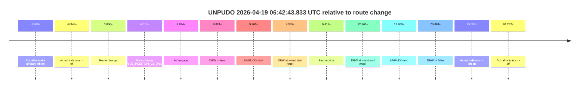

| Metric | Value |
|---|---|
| Outcome | `pass` |
| Effective failure type | `none` |
| Route change status | `found` |
| DBW at event start | `true` |
| DBW at event end | `true` |
| Predicted gear at AV start | `DRIVE_POSITION_V2_DRIVE` |
| Actual gear at AV start | `DRIVE_POSITION_V2_DRIVE` |
| Predicted gear at event start | `DRIVE_POSITION_V2_DRIVE` |
| Actual gear at event start | `DRIVE_POSITION_V2_DRIVE` |
| Planned indicator direction | `INDICATORS_STATE_V2_RIGHT_ON` |
| Controller indicator direction | `INDICATORS_STATE_V2_RIGHT_ON` |
| Actual indicator direction | `INDICATORS_STATE_V2_OFF` |
| Actual indicator at maneuver end | `INDICATORS_STATE_V2_OFF` |
| Driver accel help in AV | `false` |
| Driver accel help timestamp | `n/a` |
| Max accel pedal pct in AV | `0.0%` |
| Max brake pedal pct in AV | `0.0%` |
| Max speed mps in AV | `5.114` |
| Success timing baseline | `route change` |
| Route -> AV | `8.824s` |
| AV -> event start | `0.541s` |
| AV -> first motion | `0.588s` |
| Success baseline -> event start | `9.365s` |
| Success baseline -> first motion | `9.412s` |
| AV duration before disengagement | `67.060s` |
| Trajectory waypoint count | `38` |
| Driving-plan step count | `11` |

The scored portion starts from the AV-owned window, not from the pre-AV setup. Route-change search in the stopped pre-event segment was `found`, with the baseline therefore set to route change. At the event anchor the model predicts `DRIVE_POSITION_V2_DRIVE` and the actual gear is `DRIVE_POSITION_V2_DRIVE`. The effective model outcome is `pass` because `the credited unpudo stays AV-owned through the official unpudo window.`

### Resolution

| Field | Value |
|---|---|
| Final outcome | `pass` |
| Do we agree with this label? | `yes` |
| Source disengagement type | `none observed` |
| Resolved effective failure type | `none` |
| Confidence | `high` |

## unpudo 2026-04-19 06:45:45.833 UTC

| Field | Value |
|---|---|
| Model | `eel-teal-outspoken` |
| Author | `zak` |
| Run ID | `fme20029/2026-04-19--06-36-02--gen2-av-b402a447-b7b3-4c9b-8b39-97d05bbba226` |
| Date | `2026-04-19` |
| Time (UTC) | `06:45:45.833` |
| Event type | `unpudo` |
| Disengagement type | `none observed` |
| Route change | `found` |
| Console | [run](https://console.sso.wayve.ai/run/fme20029/2026-04-19--06-36-02--gen2-av-b402a447-b7b3-4c9b-8b39-97d05bbba226?id=&time-unixus=1776581145833305) |
| Foxglove | [segment](https://app.foxglove.dev/wayve-on-prem/p/prj_0dX18KZdVHg1fmmI/view?ds=foxglove-stream&ds.deviceName=fme20029&ds.start=2026-04-19T06%3A43%3A56.818249Z&ds.end=2026-04-19T06%3A46%3A09.583313Z&layoutId=lay_0e7VD4WIKDQGU73Y&time=2026-04-19T06%3A45%3A45.833305Z) |

### Event card: fail

- Fail: the credited unpudo does not stay AV-owned. The event window starts with DBW false, and the maneuver outcome lands outside a clean AV-owned segment.

| Event | Time (UTC) | Delta from route change |
|---|---:|---:|
| Actual indicator already left on | 2026-04-19 06:43:56.820 | `-9.998s` |
| Actual indicator -> off | 2026-04-19 06:43:58.720 | `-8.098s` |
| Route change | 2026-04-19 06:44:06.818 | `0.000s` |
| AV engage | 2026-04-19 06:44:22.893 | `16.075s` |
| DBW -> true | 2026-04-19 06:44:22.893 | `16.075s` |
| First motion | 2026-04-19 06:44:23.761 | `16.943s` |
| DBW -> false | 2026-04-19 06:45:27.992 | `81.175s` |
| Gear change (DRIVE_POSITION_V2_REVERSE) | 2026-04-19 06:45:41.533 | `94.715s` |
| UNPUDO start | 2026-04-19 06:45:45.833 | `99.015s` |
| DBW at event start (false) | 2026-04-19 06:45:45.833 | `99.015s` |
| Actual indicator -> right on | 2026-04-19 06:45:52.320 | `105.503s` |
| Actual indicator -> off | 2026-04-19 06:45:56.981 | `110.163s` |
| DBW at event end (true) | 2026-04-19 06:45:59.583 | `112.765s` |
| UNPUDO end | 2026-04-19 06:45:59.583 | `112.765s` |

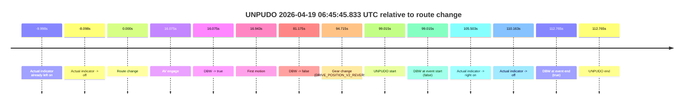

| Metric | Value |
|---|---|
| Outcome | `fail` |
| Effective failure type | `not_av_owned` |
| Route change status | `found` |
| DBW at event start | `false` |
| DBW at event end | `true` |
| Predicted gear at AV start | `DRIVE_POSITION_V2_DRIVE` |
| Actual gear at AV start | `DRIVE_POSITION_V2_DRIVE` |
| Predicted gear at event start | `DRIVE_POSITION_V2_REVERSE` |
| Actual gear at event start | `DRIVE_POSITION_V2_REVERSE` |
| Planned indicator direction | `INDICATORS_STATE_V2_OFF` |
| Controller indicator direction | `INDICATORS_STATE_V2_OFF` |
| Actual indicator direction | `INDICATORS_STATE_V2_OFF` |
| Actual indicator at maneuver end | `INDICATORS_STATE_V2_OFF` |
| Driver accel help in AV | `false` |
| Driver accel help timestamp | `n/a` |
| Max accel pedal pct in AV | `0.0%` |
| Max brake pedal pct in AV | `12.3%` |
| Max speed mps in AV | `7.872` |
| Success timing baseline | `route change` |
| Route -> AV | `16.075s` |
| AV -> event start | `82.940s` |
| AV -> first motion | `0.868s` |
| Success baseline -> event start | `99.015s` |
| Success baseline -> first motion | `16.943s` |
| AV duration before disengagement | `65.100s` |
| Trajectory waypoint count | `38` |
| Driving-plan step count | `11` |

The scored portion starts from the AV-owned window, not from the pre-AV setup. Route-change search in the stopped pre-event segment was `found`, with the baseline therefore set to route change. At the event anchor the model predicts `DRIVE_POSITION_V2_REVERSE` and the actual gear is `DRIVE_POSITION_V2_REVERSE`. The effective model outcome is `fail` because `not_av_owned.`

### Resolution

| Field | Value |
|---|---|
| Final outcome | `fail` |
| Do we agree with this label? | `yes` |
| Source disengagement type | `none observed` |
| Resolved effective failure type | `not_av_owned` |
| Confidence | `high` |

## unpudo 2026-04-19 06:46:58.383 UTC

| Field | Value |
|---|---|
| Model | `eel-teal-outspoken` |
| Author | `zak` |
| Run ID | `fme20029/2026-04-19--06-36-02--gen2-av-b402a447-b7b3-4c9b-8b39-97d05bbba226` |
| Date | `2026-04-19` |
| Time (UTC) | `06:46:58.383` |
| Event type | `unpudo` |
| Disengagement type | `none observed` |
| Route change | `found` |
| Console | [run](https://console.sso.wayve.ai/run/fme20029/2026-04-19--06-36-02--gen2-av-b402a447-b7b3-4c9b-8b39-97d05bbba226?id=&time-unixus=1776581218383293) |
| Foxglove | [segment](https://app.foxglove.dev/wayve-on-prem/p/prj_0dX18KZdVHg1fmmI/view?ds=foxglove-stream&ds.deviceName=fme20029&ds.start=2026-04-19T06%3A45%3A28.568249Z&ds.end=2026-04-19T06%3A47%3A18.083292Z&layoutId=lay_0e7VD4WIKDQGU73Y&time=2026-04-19T06%3A46%3A58.383293Z) |

### Event card: fail

- Fail: the credited unpudo does not stay AV-owned. The event window starts with DBW false, and the maneuver outcome lands outside a clean AV-owned segment.

| Event | Time (UTC) | Delta from route change |
|---|---:|---:|
| Route change | 2026-04-19 06:45:38.568 | `0.000s` |
| Actual indicator -> right on | 2026-04-19 06:45:52.320 | `13.753s` |
| AV engage | 2026-04-19 06:45:54.032 | `15.464s` |
| DBW -> true | 2026-04-19 06:45:54.032 | `15.464s` |
| First motion | 2026-04-19 06:45:54.880 | `16.313s` |
| Actual indicator -> off | 2026-04-19 06:45:56.981 | `18.413s` |
| DBW -> false | 2026-04-19 06:46:47.934 | `69.366s` |
| Gear change (DRIVE_POSITION_V2_REVERSE) | 2026-04-19 06:46:54.283 | `75.715s` |
| UNPUDO start | 2026-04-19 06:46:58.383 | `79.815s` |
| DBW at event start (false) | 2026-04-19 06:46:58.383 | `79.815s` |
| Actual indicator -> right on | 2026-04-19 06:46:59.900 | `81.333s` |
| Actual indicator -> off | 2026-04-19 06:47:05.100 | `86.532s` |
| DBW at event end (false) | 2026-04-19 06:47:08.083 | `89.515s` |
| UNPUDO end | 2026-04-19 06:47:08.083 | `89.515s` |

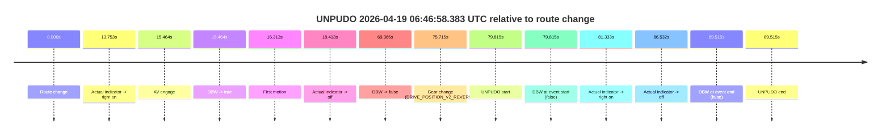

| Metric | Value |
|---|---|
| Outcome | `fail` |
| Effective failure type | `not_av_owned` |
| Route change status | `found` |
| DBW at event start | `false` |
| DBW at event end | `false` |
| Predicted gear at AV start | `DRIVE_POSITION_V2_DRIVE` |
| Actual gear at AV start | `DRIVE_POSITION_V2_DRIVE` |
| Predicted gear at event start | `DRIVE_POSITION_V2_REVERSE` |
| Actual gear at event start | `DRIVE_POSITION_V2_REVERSE` |
| Planned indicator direction | `INDICATORS_STATE_V2_OFF` |
| Controller indicator direction | `INDICATORS_STATE_V2_OFF` |
| Actual indicator direction | `INDICATORS_STATE_V2_OFF` |
| Actual indicator at maneuver end | `INDICATORS_STATE_V2_OFF` |
| Driver accel help in AV | `false` |
| Driver accel help timestamp | `n/a` |
| Max accel pedal pct in AV | `0.0%` |
| Max brake pedal pct in AV | `14.0%` |
| Max speed mps in AV | `7.842` |
| Success timing baseline | `route change` |
| Route -> AV | `15.464s` |
| AV -> event start | `64.351s` |
| AV -> first motion | `0.848s` |
| Success baseline -> event start | `79.815s` |
| Success baseline -> first motion | `16.313s` |
| AV duration before disengagement | `53.902s` |
| Trajectory waypoint count | `37` |
| Driving-plan step count | `11` |

The scored portion starts from the AV-owned window, not from the pre-AV setup. Route-change search in the stopped pre-event segment was `found`, with the baseline therefore set to route change. At the event anchor the model predicts `DRIVE_POSITION_V2_REVERSE` and the actual gear is `DRIVE_POSITION_V2_REVERSE`. The effective model outcome is `fail` because `not_av_owned.`

### Resolution

| Field | Value |
|---|---|
| Final outcome | `fail` |
| Do we agree with this label? | `yes` |
| Source disengagement type | `none observed` |
| Resolved effective failure type | `not_av_owned` |
| Confidence | `high` |

## unpudo 2026-04-19 07:00:18.433 UTC

| Field | Value |
|---|---|
| Model | `eel-teal-outspoken` |
| Author | `zak` |
| Run ID | `fme20029/2026-04-19--06-36-02--gen2-av-b402a447-b7b3-4c9b-8b39-97d05bbba226` |
| Date | `2026-04-19` |
| Time (UTC) | `07:00:18.433` |
| Event type | `unpudo` |
| Disengagement type | `none observed` |
| Route change | `found` |
| Console | [run](https://console.sso.wayve.ai/run/fme20029/2026-04-19--06-36-02--gen2-av-b402a447-b7b3-4c9b-8b39-97d05bbba226?id=&time-unixus=1776582018433289) |
| Foxglove | [segment](https://app.foxglove.dev/wayve-on-prem/p/prj_0dX18KZdVHg1fmmI/view?ds=foxglove-stream&ds.deviceName=fme20029&ds.start=2026-04-19T06%3A59%3A57.118397Z&ds.end=2026-04-19T07%3A06%3A00.772189Z&layoutId=lay_0e7VD4WIKDQGU73Y&time=2026-04-19T07%3A00%3A18.433289Z) |

### Event card: pass

- Pass: AV owns the credited unpudo from route change through the official unpudo window, the gear state is aligned at the anchor, and the vehicle moves without driver accelerator help in AV.

| Event | Time (UTC) | Delta from route change |
|---|---:|---:|
| Route change | 2026-04-19 07:00:07.118 | `0.000s` |
| AV engage | 2026-04-19 07:00:07.122 | `0.004s` |
| DBW -> true | 2026-04-19 07:00:07.122 | `0.004s` |
| Gear change (DRIVE_POSITION_V2_DRIVE) | 2026-04-19 07:00:07.483 | `0.365s` |
| UNPUDO start | 2026-04-19 07:00:18.433 | `11.315s` |
| DBW at event start (true) | 2026-04-19 07:00:18.433 | `11.315s` |
| First motion | 2026-04-19 07:00:18.461 | `11.343s` |
| DBW at event end (true) | 2026-04-19 07:00:22.133 | `15.015s` |
| UNPUDO end | 2026-04-19 07:00:22.133 | `15.015s` |
| DBW -> false | 2026-04-19 07:05:50.772 | `343.654s` |

| Metric | Value |
|---|---|
| Outcome | `pass` |
| Effective failure type | `none` |
| Route change status | `found` |
| DBW at event start | `true` |
| DBW at event end | `true` |
| Predicted gear at AV start | `DRIVE_POSITION_V2_PARK` |
| Actual gear at AV start | `DRIVE_POSITION_V2_PARK` |
| Predicted gear at event start | `DRIVE_POSITION_V2_DRIVE` |
| Actual gear at event start | `DRIVE_POSITION_V2_DRIVE` |
| Planned indicator direction | `INDICATORS_STATE_V2_RIGHT_ON` |
| Controller indicator direction | `INDICATORS_STATE_V2_RIGHT_ON` |
| Actual indicator direction | `INDICATORS_STATE_V2_OFF` |
| Actual indicator at maneuver end | `INDICATORS_STATE_V2_OFF` |
| Driver accel help in AV | `false` |
| Driver accel help timestamp | `n/a` |
| Max accel pedal pct in AV | `0.0%` |
| Max brake pedal pct in AV | `8.0%` |
| Max speed mps in AV | `4.953` |
| Success timing baseline | `route change` |
| Route -> AV | `0.004s` |
| AV -> event start | `11.311s` |
| AV -> first motion | `11.339s` |
| Success baseline -> event start | `11.315s` |
| Success baseline -> first motion | `11.343s` |
| AV duration before disengagement | `343.650s` |
| Trajectory waypoint count | `38` |
| Driving-plan step count | `11` |

The scored portion starts from the AV-owned window, not from the pre-AV setup. Route-change search in the stopped pre-event segment was `found`, with the baseline therefore set to route change. At the event anchor the model predicts `DRIVE_POSITION_V2_DRIVE` and the actual gear is `DRIVE_POSITION_V2_DRIVE`. The effective model outcome is `pass` because `the credited unpudo stays AV-owned through the official unpudo window.`

### Resolution

| Field | Value |
|---|---|
| Final outcome | `pass` |
| Do we agree with this label? | `yes` |
| Source disengagement type | `none observed` |
| Resolved effective failure type | `none` |
| Confidence | `high` |

## unpudo 2026-04-19 07:08:47.783 UTC

| Field | Value |
|---|---|
| Model | `eel-teal-outspoken` |
| Author | `zak` |
| Run ID | `fme20029/2026-04-19--06-36-02--gen2-av-b402a447-b7b3-4c9b-8b39-97d05bbba226` |
| Date | `2026-04-19` |
| Time (UTC) | `07:08:47.783` |
| Event type | `unpudo` |
| Disengagement type | `none observed` |
| Route change | `found` |
| Console | [run](https://console.sso.wayve.ai/run/fme20029/2026-04-19--06-36-02--gen2-av-b402a447-b7b3-4c9b-8b39-97d05bbba226?id=&time-unixus=1776582527783297) |
| Foxglove | [segment](https://app.foxglove.dev/wayve-on-prem/p/prj_0dX18KZdVHg1fmmI/view?ds=foxglove-stream&ds.deviceName=fme20029&ds.start=2026-04-19T07%3A08%3A32.568284Z&ds.end=2026-04-19T07%3A10%3A13.712130Z&layoutId=lay_0e7VD4WIKDQGU73Y&time=2026-04-19T07%3A08%3A47.783297Z) |

### Event card: pass

- Pass: AV owns the credited unpudo from route change through the official unpudo window, the gear state is aligned at the anchor, and the vehicle moves without driver accelerator help in AV.

| Event | Time (UTC) | Delta from route change |
|---|---:|---:|
| Actual indicator already left on | 2026-04-19 07:08:32.580 | `-9.987s` |
| Actual indicator -> off | 2026-04-19 07:08:36.080 | `-6.487s` |
| Route change | 2026-04-19 07:08:42.568 | `0.000s` |
| Gear change (DRIVE_POSITION_V2_DRIVE) | 2026-04-19 07:08:43.983 | `1.415s` |
| Actual indicator -> right on | 2026-04-19 07:08:45.561 | `2.993s` |
| AV engage | 2026-04-19 07:08:47.152 | `4.584s` |
| DBW -> true | 2026-04-19 07:08:47.152 | `4.584s` |
| UNPUDO start | 2026-04-19 07:08:47.783 | `5.215s` |
| DBW at event start (true) | 2026-04-19 07:08:47.783 | `5.215s` |
| First motion | 2026-04-19 07:08:47.840 | `5.273s` |
| Actual indicator -> off | 2026-04-19 07:08:49.661 | `7.093s` |
| DBW at event end (true) | 2026-04-19 07:08:51.133 | `8.565s` |
| UNPUDO end | 2026-04-19 07:08:51.133 | `8.565s` |
| DBW -> false | 2026-04-19 07:10:03.712 | `81.144s` |
| Actual indicator -> left on | 2026-04-19 07:10:06.540 | `83.972s` |
| Actual indicator -> off | 2026-04-19 07:10:16.141 | `93.573s` |

| Metric | Value |
|---|---|
| Outcome | `pass` |
| Effective failure type | `none` |
| Route change status | `found` |
| DBW at event start | `true` |
| DBW at event end | `true` |
| Predicted gear at AV start | `DRIVE_POSITION_V2_DRIVE` |
| Actual gear at AV start | `DRIVE_POSITION_V2_DRIVE` |
| Predicted gear at event start | `DRIVE_POSITION_V2_DRIVE` |
| Actual gear at event start | `DRIVE_POSITION_V2_DRIVE` |
| Planned indicator direction | `INDICATORS_STATE_V2_RIGHT_ON` |
| Controller indicator direction | `INDICATORS_STATE_V2_RIGHT_ON` |
| Actual indicator direction | `INDICATORS_STATE_V2_RIGHT_ON` |
| Actual indicator at maneuver end | `INDICATORS_STATE_V2_OFF` |
| Driver accel help in AV | `false` |
| Driver accel help timestamp | `n/a` |
| Max accel pedal pct in AV | `0.0%` |
| Max brake pedal pct in AV | `0.0%` |
| Max speed mps in AV | `5.472` |
| Success timing baseline | `route change` |
| Route -> AV | `4.584s` |
| AV -> event start | `0.631s` |
| AV -> first motion | `0.689s` |
| Success baseline -> event start | `5.215s` |
| Success baseline -> first motion | `5.273s` |
| AV duration before disengagement | `76.560s` |
| Trajectory waypoint count | `37` |
| Driving-plan step count | `11` |

The scored portion starts from the AV-owned window, not from the pre-AV setup. Route-change search in the stopped pre-event segment was `found`, with the baseline therefore set to route change. At the event anchor the model predicts `DRIVE_POSITION_V2_DRIVE` and the actual gear is `DRIVE_POSITION_V2_DRIVE`. The effective model outcome is `pass` because `the credited unpudo stays AV-owned through the official unpudo window.`

### Resolution

| Field | Value |
|---|---|
| Final outcome | `pass` |
| Do we agree with this label? | `yes` |
| Source disengagement type | `none observed` |
| Resolved effective failure type | `none` |
| Confidence | `high` |

## unpudo 2026-04-19 07:13:54.083 UTC

| Field | Value |
|---|---|
| Model | `eel-teal-outspoken` |
| Author | `zak` |
| Run ID | `fme20029/2026-04-19--06-36-02--gen2-av-b402a447-b7b3-4c9b-8b39-97d05bbba226` |
| Date | `2026-04-19` |
| Time (UTC) | `07:13:54.083` |
| Event type | `unpudo` |
| Disengagement type | `none observed` |
| Route change | `found` |
| Console | [run](https://console.sso.wayve.ai/run/fme20029/2026-04-19--06-36-02--gen2-av-b402a447-b7b3-4c9b-8b39-97d05bbba226?id=&time-unixus=1776582834083290) |
| Foxglove | [segment](https://app.foxglove.dev/wayve-on-prem/p/prj_0dX18KZdVHg1fmmI/view?ds=foxglove-stream&ds.deviceName=fme20029&ds.start=2026-04-19T07%3A11%3A45.518242Z&ds.end=2026-04-19T07%3A14%3A10.033315Z&layoutId=lay_0e7VD4WIKDQGU73Y&time=2026-04-19T07%3A13%3A54.083290Z) |

### Event card: fail

- Fail: the credited unpudo does not stay AV-owned. The event window starts with DBW false, and the maneuver outcome lands outside a clean AV-owned segment.

| Event | Time (UTC) | Delta from route change |
|---|---:|---:|
| Actual indicator already left on | 2026-04-19 07:11:45.520 | `-9.998s` |
| Actual indicator -> off | 2026-04-19 07:11:48.140 | `-7.377s` |
| Route change | 2026-04-19 07:11:55.518 | `0.000s` |
| AV engage | 2026-04-19 07:12:01.502 | `5.984s` |
| DBW -> true | 2026-04-19 07:12:01.502 | `5.984s` |
| First motion | 2026-04-19 07:12:02.120 | `6.602s` |
| Gear change (DRIVE_POSITION_V2_DRIVE) | 2026-04-19 07:13:47.983 | `112.465s` |
| Actual indicator -> right on | 2026-04-19 07:13:53.400 | `117.883s` |
| DBW -> false | 2026-04-19 07:13:53.453 | `117.935s` |
| UNPUDO start | 2026-04-19 07:13:54.083 | `118.565s` |
| DBW at event start (false) | 2026-04-19 07:13:54.083 | `118.565s` |
| Actual indicator -> off | 2026-04-19 07:13:56.660 | `121.142s` |
| DBW at event end (false) | 2026-04-19 07:14:00.033 | `124.515s` |
| UNPUDO end | 2026-04-19 07:14:00.033 | `124.515s` |
| Actual indicator -> left on | 2026-04-19 07:14:00.640 | `125.123s` |
| Actual indicator -> off | 2026-04-19 07:14:02.541 | `127.023s` |

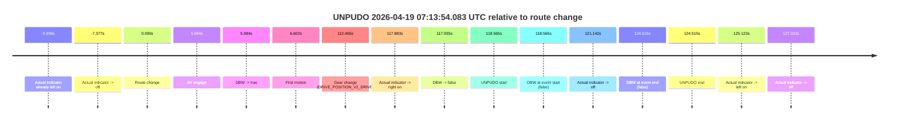

| Metric | Value |
|---|---|
| Outcome | `fail` |
| Effective failure type | `not_av_owned` |
| Route change status | `found` |
| DBW at event start | `false` |
| DBW at event end | `false` |
| Predicted gear at AV start | `DRIVE_POSITION_V2_DRIVE` |
| Actual gear at AV start | `DRIVE_POSITION_V2_DRIVE` |
| Predicted gear at event start | `DRIVE_POSITION_V2_DRIVE` |
| Actual gear at event start | `DRIVE_POSITION_V2_DRIVE` |
| Planned indicator direction | `INDICATORS_STATE_V2_RIGHT_ON` |
| Controller indicator direction | `INDICATORS_STATE_V2_RIGHT_ON` |
| Actual indicator direction | `INDICATORS_STATE_V2_RIGHT_ON` |
| Actual indicator at maneuver end | `INDICATORS_STATE_V2_OFF` |
| Driver accel help in AV | `false` |
| Driver accel help timestamp | `n/a` |
| Max accel pedal pct in AV | `0.0%` |
| Max brake pedal pct in AV | `15.6%` |
| Max speed mps in AV | `8.078` |
| Success timing baseline | `route change` |
| Route -> AV | `5.984s` |
| AV -> event start | `112.581s` |
| AV -> first motion | `0.618s` |
| Success baseline -> event start | `118.565s` |
| Success baseline -> first motion | `6.602s` |
| AV duration before disengagement | `111.951s` |
| Trajectory waypoint count | `37` |
| Driving-plan step count | `11` |

The scored portion starts from the AV-owned window, not from the pre-AV setup. Route-change search in the stopped pre-event segment was `found`, with the baseline therefore set to route change. At the event anchor the model predicts `DRIVE_POSITION_V2_DRIVE` and the actual gear is `DRIVE_POSITION_V2_DRIVE`. The effective model outcome is `fail` because `not_av_owned.`

### Resolution

| Field | Value |
|---|---|
| Final outcome | `fail` |
| Do we agree with this label? | `yes` |
| Source disengagement type | `none observed` |
| Resolved effective failure type | `not_av_owned` |
| Confidence | `high` |

## unpudo 2026-04-19 07:23:16.683 UTC

| Field | Value |
|---|---|
| Model | `eel-teal-outspoken` |
| Author | `zak` |
| Run ID | `fme20029/2026-04-19--06-36-02--gen2-av-b402a447-b7b3-4c9b-8b39-97d05bbba226` |
| Date | `2026-04-19` |
| Time (UTC) | `07:23:16.683` |
| Event type | `unpudo` |
| Disengagement type | `none observed` |
| Route change | `found` |
| Console | [run](https://console.sso.wayve.ai/run/fme20029/2026-04-19--06-36-02--gen2-av-b402a447-b7b3-4c9b-8b39-97d05bbba226?id=&time-unixus=1776583396683307) |
| Foxglove | [segment](https://app.foxglove.dev/wayve-on-prem/p/prj_0dX18KZdVHg1fmmI/view?ds=foxglove-stream&ds.deviceName=fme20029&ds.start=2026-04-19T07%3A23%3A02.868261Z&ds.end=2026-04-19T07%3A25%3A10.433637Z&layoutId=lay_0e7VD4WIKDQGU73Y&time=2026-04-19T07%3A23%3A16.683307Z) |

### Event card: pass

- Pass: AV owns the credited unpudo from route change through the official unpudo window, the gear state is aligned at the anchor, and the vehicle moves without driver accelerator help in AV.

| Event | Time (UTC) | Delta from route change |
|---|---:|---:|
| Route change | 2026-04-19 07:23:12.868 | `0.000s` |
| AV engage | 2026-04-19 07:23:12.872 | `0.004s` |
| DBW -> true | 2026-04-19 07:23:12.872 | `0.004s` |
| Gear change (DRIVE_POSITION_V2_DRIVE) | 2026-04-19 07:23:13.083 | `0.215s` |
| UNPUDO start | 2026-04-19 07:23:16.683 | `3.815s` |
| DBW at event start (true) | 2026-04-19 07:23:16.683 | `3.815s` |
| First motion | 2026-04-19 07:23:16.700 | `3.833s` |
| DBW at event end (true) | 2026-04-19 07:23:20.133 | `7.265s` |
| UNPUDO end | 2026-04-19 07:23:20.133 | `7.265s` |
| DBW -> false | 2026-04-19 07:25:00.433 | `107.565s` |

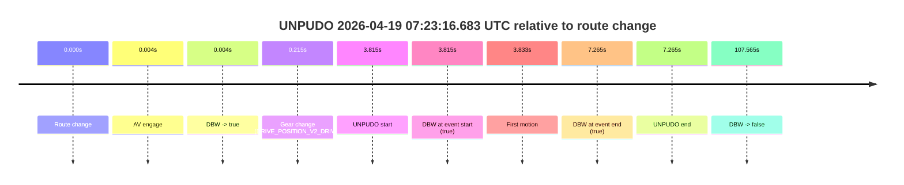

| Metric | Value |
|---|---|
| Outcome | `pass` |
| Effective failure type | `none` |
| Route change status | `found` |
| DBW at event start | `true` |
| DBW at event end | `true` |
| Predicted gear at AV start | `DRIVE_POSITION_V2_PARK` |
| Actual gear at AV start | `DRIVE_POSITION_V2_PARK` |
| Predicted gear at event start | `DRIVE_POSITION_V2_DRIVE` |
| Actual gear at event start | `DRIVE_POSITION_V2_DRIVE` |
| Planned indicator direction | `INDICATORS_STATE_V2_RIGHT_ON` |
| Controller indicator direction | `INDICATORS_STATE_V2_RIGHT_ON` |
| Actual indicator direction | `INDICATORS_STATE_V2_OFF` |
| Actual indicator at maneuver end | `INDICATORS_STATE_V2_OFF` |
| Driver accel help in AV | `false` |
| Driver accel help timestamp | `n/a` |
| Max accel pedal pct in AV | `0.0%` |
| Max brake pedal pct in AV | `8.0%` |
| Max speed mps in AV | `4.983` |
| Success timing baseline | `route change` |
| Route -> AV | `0.004s` |
| AV -> event start | `3.811s` |
| AV -> first motion | `3.829s` |
| Success baseline -> event start | `3.815s` |
| Success baseline -> first motion | `3.833s` |
| AV duration before disengagement | `107.561s` |
| Trajectory waypoint count | `37` |
| Driving-plan step count | `11` |

The scored portion starts from the AV-owned window, not from the pre-AV setup. Route-change search in the stopped pre-event segment was `found`, with the baseline therefore set to route change. At the event anchor the model predicts `DRIVE_POSITION_V2_DRIVE` and the actual gear is `DRIVE_POSITION_V2_DRIVE`. The effective model outcome is `pass` because `the credited unpudo stays AV-owned through the official unpudo window.`

### Resolution

| Field | Value |
|---|---|
| Final outcome | `pass` |
| Do we agree with this label? | `yes` |
| Source disengagement type | `none observed` |
| Resolved effective failure type | `none` |
| Confidence | `high` |

## unpudo 2026-04-19 07:25:18.183 UTC

| Field | Value |
|---|---|
| Model | `eel-teal-outspoken` |
| Author | `zak` |
| Run ID | `fme20029/2026-04-19--06-36-02--gen2-av-b402a447-b7b3-4c9b-8b39-97d05bbba226` |
| Date | `2026-04-19` |
| Time (UTC) | `07:25:18.183` |
| Event type | `unpudo` |
| Disengagement type | `none observed` |
| Route change | `found` |
| Console | [run](https://console.sso.wayve.ai/run/fme20029/2026-04-19--06-36-02--gen2-av-b402a447-b7b3-4c9b-8b39-97d05bbba226?id=&time-unixus=1776583518183300) |
| Foxglove | [segment](https://app.foxglove.dev/wayve-on-prem/p/prj_0dX18KZdVHg1fmmI/view?ds=foxglove-stream&ds.deviceName=fme20029&ds.start=2026-04-19T07%3A25%3A04.318261Z&ds.end=2026-04-19T07%3A26%3A39.592747Z&layoutId=lay_0e7VD4WIKDQGU73Y&time=2026-04-19T07%3A25%3A18.183300Z) |

### Event card: pass

- Pass: AV owns the credited unpudo from route change through the official unpudo window, the gear state is aligned at the anchor, and the vehicle moves without driver accelerator help in AV.

| Event | Time (UTC) | Delta from route change |
|---|---:|---:|
| Route change | 2026-04-19 07:25:14.318 | `0.000s` |
| Gear change (DRIVE_POSITION_V2_DRIVE) | 2026-04-19 07:25:14.583 | `0.265s` |
| AV engage | 2026-04-19 07:25:17.432 | `3.114s` |
| DBW -> true | 2026-04-19 07:25:17.432 | `3.114s` |
| UNPUDO start | 2026-04-19 07:25:18.183 | `3.865s` |
| DBW at event start (true) | 2026-04-19 07:25:18.183 | `3.865s` |
| First motion | 2026-04-19 07:25:18.200 | `3.882s` |
| DBW at event end (true) | 2026-04-19 07:25:21.533 | `7.215s` |
| UNPUDO end | 2026-04-19 07:25:21.533 | `7.215s` |
| DBW -> false | 2026-04-19 07:26:29.592 | `75.274s` |

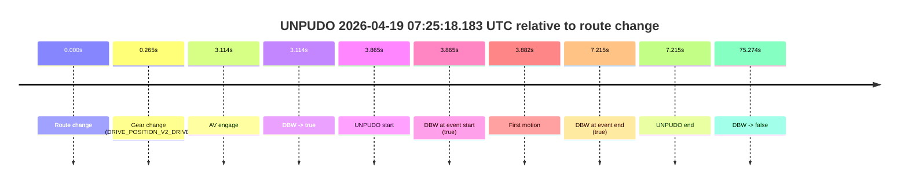

| Metric | Value |
|---|---|
| Outcome | `pass` |
| Effective failure type | `none` |
| Route change status | `found` |
| DBW at event start | `true` |
| DBW at event end | `true` |
| Predicted gear at AV start | `DRIVE_POSITION_V2_DRIVE` |
| Actual gear at AV start | `DRIVE_POSITION_V2_DRIVE` |
| Predicted gear at event start | `DRIVE_POSITION_V2_DRIVE` |
| Actual gear at event start | `DRIVE_POSITION_V2_DRIVE` |
| Planned indicator direction | `INDICATORS_STATE_V2_RIGHT_ON` |
| Controller indicator direction | `INDICATORS_STATE_V2_RIGHT_ON` |
| Actual indicator direction | `INDICATORS_STATE_V2_OFF` |
| Actual indicator at maneuver end | `INDICATORS_STATE_V2_OFF` |
| Driver accel help in AV | `false` |
| Driver accel help timestamp | `n/a` |
| Max accel pedal pct in AV | `0.0%` |
| Max brake pedal pct in AV | `0.0%` |
| Max speed mps in AV | `5.575` |
| Success timing baseline | `route change` |
| Route -> AV | `3.114s` |
| AV -> event start | `0.751s` |
| AV -> first motion | `0.768s` |
| Success baseline -> event start | `3.865s` |
| Success baseline -> first motion | `3.882s` |
| AV duration before disengagement | `72.160s` |
| Trajectory waypoint count | `37` |
| Driving-plan step count | `11` |

The scored portion starts from the AV-owned window, not from the pre-AV setup. Route-change search in the stopped pre-event segment was `found`, with the baseline therefore set to route change. At the event anchor the model predicts `DRIVE_POSITION_V2_DRIVE` and the actual gear is `DRIVE_POSITION_V2_DRIVE`. The effective model outcome is `pass` because `the credited unpudo stays AV-owned through the official unpudo window.`

### Resolution

| Field | Value |
|---|---|
| Final outcome | `pass` |
| Do we agree with this label? | `yes` |
| Source disengagement type | `none observed` |
| Resolved effective failure type | `none` |
| Confidence | `high` |

## unpudo 2026-04-19 07:26:49.683 UTC

| Field | Value |
|---|---|
| Model | `eel-teal-outspoken` |
| Author | `zak` |
| Run ID | `fme20029/2026-04-19--06-36-02--gen2-av-b402a447-b7b3-4c9b-8b39-97d05bbba226` |
| Date | `2026-04-19` |
| Time (UTC) | `07:26:49.683` |
| Event type | `unpudo` |
| Disengagement type | `none observed` |
| Route change | `found` |
| Console | [run](https://console.sso.wayve.ai/run/fme20029/2026-04-19--06-36-02--gen2-av-b402a447-b7b3-4c9b-8b39-97d05bbba226?id=&time-unixus=1776583609683309) |
| Foxglove | [segment](https://app.foxglove.dev/wayve-on-prem/p/prj_0dX18KZdVHg1fmmI/view?ds=foxglove-stream&ds.deviceName=fme20029&ds.start=2026-04-19T07%3A25%3A04.318261Z&ds.end=2026-04-19T07%3A30%3A34.632320Z&layoutId=lay_0e7VD4WIKDQGU73Y&time=2026-04-19T07%3A26%3A49.683309Z) |

### Event card: pass

- Pass: AV owns the credited unpudo from route change through the official unpudo window, the gear state is aligned at the anchor, and the vehicle moves without driver accelerator help in AV.

| Event | Time (UTC) | Delta from route change |
|---|---:|---:|
| Route change | 2026-04-19 07:25:14.318 | `0.000s` |
| First motion | 2026-04-19 07:25:18.200 | `3.882s` |
| Gear change (DRIVE_POSITION_V2_DRIVE) | 2026-04-19 07:26:45.083 | `90.765s` |
| AV engage | 2026-04-19 07:26:49.072 | `94.754s` |
| DBW -> true | 2026-04-19 07:26:49.072 | `94.754s` |
| UNPUDO start | 2026-04-19 07:26:49.683 | `95.365s` |
| DBW at event start (true) | 2026-04-19 07:26:49.683 | `95.365s` |
| DBW at event end (true) | 2026-04-19 07:26:53.033 | `98.715s` |
| UNPUDO end | 2026-04-19 07:26:53.033 | `98.715s` |
| DBW -> false | 2026-04-19 07:30:24.632 | `310.314s` |
| Actual indicator -> left on | 2026-04-19 07:30:24.801 | `310.483s` |
| Actual indicator -> off | 2026-04-19 07:30:27.680 | `313.362s` |

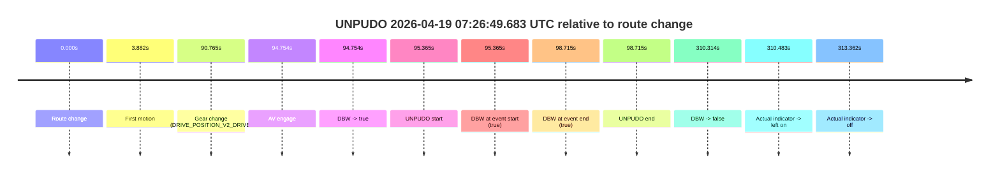

| Metric | Value |
|---|---|
| Outcome | `pass` |
| Effective failure type | `none` |
| Route change status | `found` |
| DBW at event start | `true` |
| DBW at event end | `true` |
| Predicted gear at AV start | `DRIVE_POSITION_V2_DRIVE` |
| Actual gear at AV start | `DRIVE_POSITION_V2_DRIVE` |
| Predicted gear at event start | `DRIVE_POSITION_V2_DRIVE` |
| Actual gear at event start | `DRIVE_POSITION_V2_DRIVE` |
| Planned indicator direction | `INDICATORS_STATE_V2_RIGHT_ON` |
| Controller indicator direction | `INDICATORS_STATE_V2_RIGHT_ON` |
| Actual indicator direction | `INDICATORS_STATE_V2_OFF` |
| Actual indicator at maneuver end | `INDICATORS_STATE_V2_OFF` |
| Driver accel help in AV | `false` |
| Driver accel help timestamp | `n/a` |
| Max accel pedal pct in AV | `0.0%` |
| Max brake pedal pct in AV | `0.0%` |
| Max speed mps in AV | `5.308` |
| Success timing baseline | `route change` |
| Route -> AV | `94.754s` |
| AV -> event start | `0.611s` |
| AV -> first motion | `-90.871s` |
| Success baseline -> event start | `95.365s` |
| Success baseline -> first motion | `3.882s` |
| AV duration before disengagement | `215.560s` |
| Trajectory waypoint count | `37` |
| Driving-plan step count | `11` |

The scored portion starts from the AV-owned window, not from the pre-AV setup. Route-change search in the stopped pre-event segment was `found`, with the baseline therefore set to route change. At the event anchor the model predicts `DRIVE_POSITION_V2_DRIVE` and the actual gear is `DRIVE_POSITION_V2_DRIVE`. The effective model outcome is `pass` because `the credited unpudo stays AV-owned through the official unpudo window.`

### Resolution

| Field | Value |
|---|---|
| Final outcome | `pass` |
| Do we agree with this label? | `yes` |
| Source disengagement type | `none observed` |
| Resolved effective failure type | `none` |
| Confidence | `high` |

## unpudo 2026-04-19 07:28:02.633 UTC

| Field | Value |
|---|---|
| Model | `eel-teal-outspoken` |
| Author | `zak` |
| Run ID | `fme20029/2026-04-19--06-36-02--gen2-av-b402a447-b7b3-4c9b-8b39-97d05bbba226` |
| Date | `2026-04-19` |
| Time (UTC) | `07:28:02.633` |
| Event type | `unpudo` |
| Disengagement type | `none observed` |
| Route change | `found` |
| Console | [run](https://console.sso.wayve.ai/run/fme20029/2026-04-19--06-36-02--gen2-av-b402a447-b7b3-4c9b-8b39-97d05bbba226?id=&time-unixus=1776583682633317) |
| Foxglove | [segment](https://app.foxglove.dev/wayve-on-prem/p/prj_0dX18KZdVHg1fmmI/view?ds=foxglove-stream&ds.deviceName=fme20029&ds.start=2026-04-19T07%3A26%3A30.218258Z&ds.end=2026-04-19T07%3A30%3A34.632320Z&layoutId=lay_0e7VD4WIKDQGU73Y&time=2026-04-19T07%3A28%3A02.633317Z) |

### Event card: pass

- Pass: AV owns the credited unpudo from route change through the official unpudo window, the gear state is aligned at the anchor, and the vehicle moves without driver accelerator help in AV.

| Event | Time (UTC) | Delta from route change |
|---|---:|---:|
| Route change | 2026-04-19 07:26:40.218 | `0.000s` |
| AV engage | 2026-04-19 07:26:49.072 | `8.854s` |
| DBW -> true | 2026-04-19 07:26:49.072 | `8.854s` |
| First motion | 2026-04-19 07:26:49.700 | `9.482s` |
| Gear change (DRIVE_POSITION_V2_DRIVE) | 2026-04-19 07:27:52.483 | `72.265s` |
| UNPUDO start | 2026-04-19 07:28:02.633 | `82.415s` |
| DBW at event start (true) | 2026-04-19 07:28:02.633 | `82.415s` |
| DBW at event end (true) | 2026-04-19 07:28:05.883 | `85.665s` |
| UNPUDO end | 2026-04-19 07:28:05.883 | `85.665s` |
| DBW -> false | 2026-04-19 07:30:24.632 | `224.414s` |
| Actual indicator -> left on | 2026-04-19 07:30:24.801 | `224.583s` |
| Actual indicator -> off | 2026-04-19 07:30:27.680 | `227.462s` |

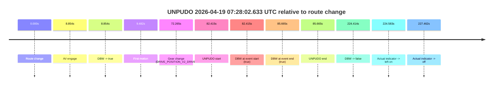

| Metric | Value |
|---|---|
| Outcome | `pass` |
| Effective failure type | `none` |
| Route change status | `found` |
| DBW at event start | `true` |
| DBW at event end | `true` |
| Predicted gear at AV start | `DRIVE_POSITION_V2_DRIVE` |
| Actual gear at AV start | `DRIVE_POSITION_V2_DRIVE` |
| Predicted gear at event start | `DRIVE_POSITION_V2_DRIVE` |
| Actual gear at event start | `DRIVE_POSITION_V2_DRIVE` |
| Planned indicator direction | `INDICATORS_STATE_V2_RIGHT_ON` |
| Controller indicator direction | `INDICATORS_STATE_V2_RIGHT_ON` |
| Actual indicator direction | `INDICATORS_STATE_V2_OFF` |
| Actual indicator at maneuver end | `INDICATORS_STATE_V2_OFF` |
| Driver accel help in AV | `false` |
| Driver accel help timestamp | `n/a` |
| Max accel pedal pct in AV | `0.0%` |
| Max brake pedal pct in AV | `18.0%` |
| Max speed mps in AV | `8.242` |
| Success timing baseline | `route change` |
| Route -> AV | `8.854s` |
| AV -> event start | `73.561s` |
| AV -> first motion | `0.629s` |
| Success baseline -> event start | `82.415s` |
| Success baseline -> first motion | `9.482s` |
| AV duration before disengagement | `215.560s` |
| Trajectory waypoint count | `38` |
| Driving-plan step count | `11` |

The scored portion starts from the AV-owned window, not from the pre-AV setup. Route-change search in the stopped pre-event segment was `found`, with the baseline therefore set to route change. At the event anchor the model predicts `DRIVE_POSITION_V2_DRIVE` and the actual gear is `DRIVE_POSITION_V2_DRIVE`. The effective model outcome is `pass` because `the credited unpudo stays AV-owned through the official unpudo window.`

### Resolution

| Field | Value |
|---|---|
| Final outcome | `pass` |
| Do we agree with this label? | `yes` |
| Source disengagement type | `none observed` |
| Resolved effective failure type | `none` |
| Confidence | `high` |

## unpudo 2026-04-19 07:30:47.183 UTC

| Field | Value |
|---|---|
| Model | `eel-teal-outspoken` |
| Author | `zak` |
| Run ID | `fme20029/2026-04-19--06-36-02--gen2-av-b402a447-b7b3-4c9b-8b39-97d05bbba226` |
| Date | `2026-04-19` |
| Time (UTC) | `07:30:47.183` |
| Event type | `unpudo` |
| Disengagement type | `none observed` |
| Route change | `found` |
| Console | [run](https://console.sso.wayve.ai/run/fme20029/2026-04-19--06-36-02--gen2-av-b402a447-b7b3-4c9b-8b39-97d05bbba226?id=&time-unixus=1776583847183313) |
| Foxglove | [segment](https://app.foxglove.dev/wayve-on-prem/p/prj_0dX18KZdVHg1fmmI/view?ds=foxglove-stream&ds.deviceName=fme20029&ds.start=2026-04-19T07%3A30%3A28.068348Z&ds.end=2026-04-19T07%3A36%3A36.192153Z&layoutId=lay_0e7VD4WIKDQGU73Y&time=2026-04-19T07%3A30%3A47.183313Z) |

### Event card: pass

- Pass: AV owns the credited unpudo from route change through the official unpudo window, the gear state is aligned at the anchor, and the vehicle moves without driver accelerator help in AV.

| Event | Time (UTC) | Delta from route change |
|---|---:|---:|
| Route change | 2026-04-19 07:30:38.068 | `0.000s` |
| Gear change (DRIVE_POSITION_V2_DRIVE) | 2026-04-19 07:30:43.633 | `5.565s` |
| AV engage | 2026-04-19 07:30:45.592 | `7.524s` |
| DBW -> true | 2026-04-19 07:30:45.592 | `7.524s` |
| UNPUDO start | 2026-04-19 07:30:47.183 | `9.115s` |
| DBW at event start (true) | 2026-04-19 07:30:47.183 | `9.115s` |
| First motion | 2026-04-19 07:30:47.241 | `9.173s` |
| DBW at event end (true) | 2026-04-19 07:30:50.583 | `12.515s` |
| UNPUDO end | 2026-04-19 07:30:50.583 | `12.515s` |
| DBW -> false | 2026-04-19 07:36:26.192 | `348.124s` |
| Actual indicator -> right on | 2026-04-19 07:36:27.880 | `349.812s` |
| Actual indicator -> off | 2026-04-19 07:36:35.040 | `356.972s` |

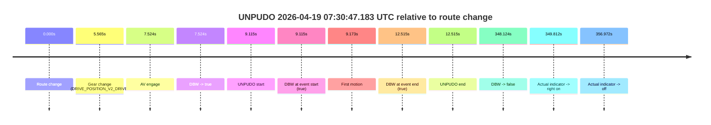

| Metric | Value |
|---|---|
| Outcome | `pass` |
| Effective failure type | `none` |
| Route change status | `found` |
| DBW at event start | `true` |
| DBW at event end | `true` |
| Predicted gear at AV start | `DRIVE_POSITION_V2_DRIVE` |
| Actual gear at AV start | `DRIVE_POSITION_V2_DRIVE` |
| Predicted gear at event start | `DRIVE_POSITION_V2_DRIVE` |
| Actual gear at event start | `DRIVE_POSITION_V2_DRIVE` |
| Planned indicator direction | `INDICATORS_STATE_V2_RIGHT_ON` |
| Controller indicator direction | `INDICATORS_STATE_V2_RIGHT_ON` |
| Actual indicator direction | `INDICATORS_STATE_V2_OFF` |
| Actual indicator at maneuver end | `INDICATORS_STATE_V2_OFF` |
| Driver accel help in AV | `false` |
| Driver accel help timestamp | `n/a` |
| Max accel pedal pct in AV | `0.0%` |
| Max brake pedal pct in AV | `0.0%` |
| Max speed mps in AV | `5.333` |
| Success timing baseline | `route change` |
| Route -> AV | `7.524s` |
| AV -> event start | `1.591s` |
| AV -> first motion | `1.649s` |
| Success baseline -> event start | `9.115s` |
| Success baseline -> first motion | `9.173s` |
| AV duration before disengagement | `340.600s` |
| Trajectory waypoint count | `37` |
| Driving-plan step count | `11` |

The scored portion starts from the AV-owned window, not from the pre-AV setup. Route-change search in the stopped pre-event segment was `found`, with the baseline therefore set to route change. At the event anchor the model predicts `DRIVE_POSITION_V2_DRIVE` and the actual gear is `DRIVE_POSITION_V2_DRIVE`. The effective model outcome is `pass` because `the credited unpudo stays AV-owned through the official unpudo window.`

### Resolution

| Field | Value |
|---|---|
| Final outcome | `pass` |
| Do we agree with this label? | `yes` |
| Source disengagement type | `none observed` |
| Resolved effective failure type | `none` |
| Confidence | `high` |

## unpudo 2026-04-19 07:37:03.083 UTC

| Field | Value |
|---|---|
| Model | `eel-teal-outspoken` |
| Author | `zak` |
| Run ID | `fme20029/2026-04-19--06-36-02--gen2-av-b402a447-b7b3-4c9b-8b39-97d05bbba226` |
| Date | `2026-04-19` |
| Time (UTC) | `07:37:03.083` |
| Event type | `unpudo` |
| Disengagement type | `none observed` |
| Route change | `found` |
| Console | [run](https://console.sso.wayve.ai/run/fme20029/2026-04-19--06-36-02--gen2-av-b402a447-b7b3-4c9b-8b39-97d05bbba226?id=&time-unixus=1776584223083313) |
| Foxglove | [segment](https://app.foxglove.dev/wayve-on-prem/p/prj_0dX18KZdVHg1fmmI/view?ds=foxglove-stream&ds.deviceName=fme20029&ds.start=2026-04-19T07%3A35%3A12.068282Z&ds.end=2026-04-19T07%3A37%3A16.783297Z&layoutId=lay_0e7VD4WIKDQGU73Y&time=2026-04-19T07%3A37%3A03.083313Z) |

### Event card: fail

- Fail: the credited unpudo does not stay AV-owned. The event window starts with DBW false, and the maneuver outcome lands outside a clean AV-owned segment.

| Event | Time (UTC) | Delta from route change |
|---|---:|---:|
| Route change | 2026-04-19 07:35:22.068 | `0.000s` |
| AV engage | 2026-04-19 07:35:22.072 | `0.004s` |
| DBW -> true | 2026-04-19 07:35:22.072 | `0.004s` |
| First motion | 2026-04-19 07:35:26.140 | `4.072s` |
| DBW -> false | 2026-04-19 07:36:26.192 | `64.124s` |
| Actual indicator -> right on | 2026-04-19 07:36:27.880 | `65.812s` |
| Actual indicator -> off | 2026-04-19 07:36:35.040 | `72.972s` |
| Gear change (DRIVE_POSITION_V2_DRIVE) | 2026-04-19 07:36:59.183 | `97.115s` |
| UNPUDO start | 2026-04-19 07:37:03.083 | `101.015s` |
| DBW at event start (false) | 2026-04-19 07:37:03.083 | `101.015s` |
| DBW at event end (false) | 2026-04-19 07:37:06.783 | `104.715s` |
| UNPUDO end | 2026-04-19 07:37:06.783 | `104.715s` |
| Actual indicator -> left on | 2026-04-19 07:37:13.020 | `110.952s` |
| Actual indicator -> off | 2026-04-19 07:37:19.600 | `117.532s` |

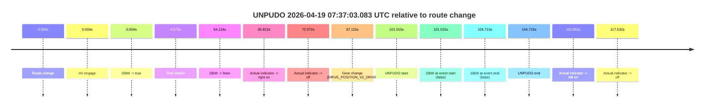

| Metric | Value |
|---|---|
| Outcome | `fail` |
| Effective failure type | `not_av_owned` |
| Route change status | `found` |
| DBW at event start | `false` |
| DBW at event end | `false` |
| Predicted gear at AV start | `DRIVE_POSITION_V2_PARK` |
| Actual gear at AV start | `DRIVE_POSITION_V2_PARK` |
| Predicted gear at event start | `DRIVE_POSITION_V2_DRIVE` |
| Actual gear at event start | `DRIVE_POSITION_V2_DRIVE` |
| Planned indicator direction | `INDICATORS_STATE_V2_OFF` |
| Controller indicator direction | `INDICATORS_STATE_V2_OFF` |
| Actual indicator direction | `INDICATORS_STATE_V2_OFF` |
| Actual indicator at maneuver end | `INDICATORS_STATE_V2_OFF` |
| Driver accel help in AV | `false` |
| Driver accel help timestamp | `n/a` |
| Max accel pedal pct in AV | `0.0%` |
| Max brake pedal pct in AV | `8.1%` |
| Max speed mps in AV | `8.250` |
| Success timing baseline | `route change` |
| Route -> AV | `0.004s` |
| AV -> event start | `101.011s` |
| AV -> first motion | `4.068s` |
| Success baseline -> event start | `101.015s` |
| Success baseline -> first motion | `4.072s` |
| AV duration before disengagement | `64.120s` |
| Trajectory waypoint count | `37` |
| Driving-plan step count | `11` |

The scored portion starts from the AV-owned window, not from the pre-AV setup. Route-change search in the stopped pre-event segment was `found`, with the baseline therefore set to route change. At the event anchor the model predicts `DRIVE_POSITION_V2_DRIVE` and the actual gear is `DRIVE_POSITION_V2_DRIVE`. The effective model outcome is `fail` because `not_av_owned.`

### Resolution

| Field | Value |
|---|---|
| Final outcome | `fail` |
| Do we agree with this label? | `yes` |
| Source disengagement type | `none observed` |
| Resolved effective failure type | `not_av_owned` |
| Confidence | `high` |

## unpudo 2026-04-19 07:41:10.133 UTC

| Field | Value |
|---|---|
| Model | `eel-teal-outspoken` |
| Author | `zak` |
| Run ID | `fme20029/2026-04-19--06-36-02--gen2-av-b402a447-b7b3-4c9b-8b39-97d05bbba226` |
| Date | `2026-04-19` |
| Time (UTC) | `07:41:10.133` |
| Event type | `unpudo` |
| Disengagement type | `none observed` |
| Route change | `found` |
| Console | [run](https://console.sso.wayve.ai/run/fme20029/2026-04-19--06-36-02--gen2-av-b402a447-b7b3-4c9b-8b39-97d05bbba226?id=&time-unixus=1776584470133295) |
| Foxglove | [segment](https://app.foxglove.dev/wayve-on-prem/p/prj_0dX18KZdVHg1fmmI/view?ds=foxglove-stream&ds.deviceName=fme20029&ds.start=2026-04-19T07%3A39%3A10.418295Z&ds.end=2026-04-19T07%3A50%3A34.173342Z&layoutId=lay_0e7VD4WIKDQGU73Y&time=2026-04-19T07%3A41%3A10.133295Z) |

### Event card: pass

- Pass: AV owns the credited unpudo from route change through the official unpudo window, the gear state is aligned at the anchor, and the vehicle moves without driver accelerator help in AV.

| Event | Time (UTC) | Delta from route change |
|---|---:|---:|
| Actual indicator already left on | 2026-04-19 07:39:10.420 | `-9.998s` |
| Route change | 2026-04-19 07:39:20.418 | `0.000s` |
| Actual indicator -> off | 2026-04-19 07:39:24.060 | `3.642s` |
| Actual indicator -> right on | 2026-04-19 07:39:24.500 | `4.082s` |
| First motion | 2026-04-19 07:39:24.960 | `4.542s` |
| Actual indicator -> off | 2026-04-19 07:39:26.860 | `6.443s` |
| AV engage | 2026-04-19 07:39:31.993 | `11.575s` |
| DBW -> true | 2026-04-19 07:39:31.993 | `11.575s` |
| Gear change (DRIVE_POSITION_V2_DRIVE) | 2026-04-19 07:40:37.683 | `77.265s` |
| UNPUDO start | 2026-04-19 07:41:10.133 | `109.715s` |
| DBW at event start (true) | 2026-04-19 07:41:10.133 | `109.715s` |
| DBW at event end (true) | 2026-04-19 07:41:25.433 | `125.015s` |
| UNPUDO end | 2026-04-19 07:41:25.433 | `125.015s` |
| DBW -> false | 2026-04-19 07:50:24.173 | `663.755s` |
| Actual indicator -> left on | 2026-04-19 07:50:24.900 | `664.482s` |
| Actual indicator -> off | 2026-04-19 07:50:27.100 | `666.683s` |

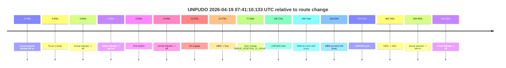

| Metric | Value |
|---|---|
| Outcome | `pass` |
| Effective failure type | `none` |
| Route change status | `found` |
| DBW at event start | `true` |
| DBW at event end | `true` |
| Predicted gear at AV start | `DRIVE_POSITION_V2_DRIVE` |
| Actual gear at AV start | `DRIVE_POSITION_V2_DRIVE` |
| Predicted gear at event start | `DRIVE_POSITION_V2_DRIVE` |
| Actual gear at event start | `DRIVE_POSITION_V2_DRIVE` |
| Planned indicator direction | `INDICATORS_STATE_V2_RIGHT_ON` |
| Controller indicator direction | `INDICATORS_STATE_V2_RIGHT_ON` |
| Actual indicator direction | `INDICATORS_STATE_V2_OFF` |
| Actual indicator at maneuver end | `INDICATORS_STATE_V2_OFF` |
| Driver accel help in AV | `false` |
| Driver accel help timestamp | `n/a` |
| Max accel pedal pct in AV | `0.0%` |
| Max brake pedal pct in AV | `8.0%` |
| Max speed mps in AV | `8.181` |
| Success timing baseline | `route change` |
| Route -> AV | `11.575s` |
| AV -> event start | `98.140s` |
| AV -> first motion | `-7.033s` |
| Success baseline -> event start | `109.715s` |
| Success baseline -> first motion | `4.542s` |
| AV duration before disengagement | `652.180s` |
| Trajectory waypoint count | `38` |
| Driving-plan step count | `11` |

The scored portion starts from the AV-owned window, not from the pre-AV setup. Route-change search in the stopped pre-event segment was `found`, with the baseline therefore set to route change. At the event anchor the model predicts `DRIVE_POSITION_V2_DRIVE` and the actual gear is `DRIVE_POSITION_V2_DRIVE`. The effective model outcome is `pass` because `the credited unpudo stays AV-owned through the official unpudo window.`

### Resolution

| Field | Value |
|---|---|
| Final outcome | `pass` |
| Do we agree with this label? | `yes` |
| Source disengagement type | `none observed` |
| Resolved effective failure type | `none` |
| Confidence | `high` |

## unpudo 2026-04-19 07:48:01.283 UTC

| Field | Value |
|---|---|
| Model | `eel-teal-outspoken` |
| Author | `zak` |
| Run ID | `fme20029/2026-04-19--06-36-02--gen2-av-b402a447-b7b3-4c9b-8b39-97d05bbba226` |
| Date | `2026-04-19` |
| Time (UTC) | `07:48:01.283` |
| Event type | `unpudo` |
| Disengagement type | `none observed` |
| Route change | `found` |
| Console | [run](https://console.sso.wayve.ai/run/fme20029/2026-04-19--06-36-02--gen2-av-b402a447-b7b3-4c9b-8b39-97d05bbba226?id=&time-unixus=1776584881283292) |
| Foxglove | [segment](https://app.foxglove.dev/wayve-on-prem/p/prj_0dX18KZdVHg1fmmI/view?ds=foxglove-stream&ds.deviceName=fme20029&ds.start=2026-04-19T07%3A47%3A47.418258Z&ds.end=2026-04-19T07%3A50%3A34.173342Z&layoutId=lay_0e7VD4WIKDQGU73Y&time=2026-04-19T07%3A48%3A01.283292Z) |

### Event card: pass

- Pass: AV owns the credited unpudo from route change through the official unpudo window, the gear state is aligned at the anchor, and the vehicle moves without driver accelerator help in AV.

| Event | Time (UTC) | Delta from route change |
|---|---:|---:|
| Route change | 2026-04-19 07:47:57.418 | `0.000s` |
| AV engage | 2026-04-19 07:47:57.422 | `0.004s` |
| DBW -> true | 2026-04-19 07:47:57.422 | `0.004s` |
| Gear change (DRIVE_POSITION_V2_DRIVE) | 2026-04-19 07:47:57.683 | `0.265s` |
| UNPUDO start | 2026-04-19 07:48:01.283 | `3.865s` |
| DBW at event start (true) | 2026-04-19 07:48:01.283 | `3.865s` |
| First motion | 2026-04-19 07:48:01.300 | `3.882s` |
| DBW at event end (true) | 2026-04-19 07:48:04.633 | `7.215s` |
| UNPUDO end | 2026-04-19 07:48:04.633 | `7.215s` |
| DBW -> false | 2026-04-19 07:50:24.173 | `146.755s` |
| Actual indicator -> left on | 2026-04-19 07:50:24.900 | `147.482s` |
| Actual indicator -> off | 2026-04-19 07:50:27.100 | `149.683s` |

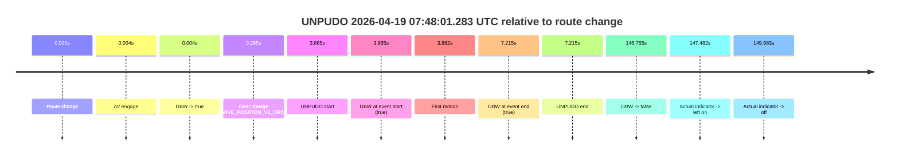

| Metric | Value |
|---|---|
| Outcome | `pass` |
| Effective failure type | `none` |
| Route change status | `found` |
| DBW at event start | `true` |
| DBW at event end | `true` |
| Predicted gear at AV start | `DRIVE_POSITION_V2_PARK` |
| Actual gear at AV start | `DRIVE_POSITION_V2_PARK` |
| Predicted gear at event start | `DRIVE_POSITION_V2_DRIVE` |
| Actual gear at event start | `DRIVE_POSITION_V2_DRIVE` |
| Planned indicator direction | `INDICATORS_STATE_V2_RIGHT_ON` |
| Controller indicator direction | `INDICATORS_STATE_V2_RIGHT_ON` |
| Actual indicator direction | `INDICATORS_STATE_V2_OFF` |
| Actual indicator at maneuver end | `INDICATORS_STATE_V2_OFF` |
| Driver accel help in AV | `false` |
| Driver accel help timestamp | `n/a` |
| Max accel pedal pct in AV | `0.0%` |
| Max brake pedal pct in AV | `8.0%` |
| Max speed mps in AV | `5.389` |
| Success timing baseline | `route change` |
| Route -> AV | `0.004s` |
| AV -> event start | `3.861s` |
| AV -> first motion | `3.878s` |
| Success baseline -> event start | `3.865s` |
| Success baseline -> first motion | `3.882s` |
| AV duration before disengagement | `146.751s` |
| Trajectory waypoint count | `37` |
| Driving-plan step count | `11` |

The scored portion starts from the AV-owned window, not from the pre-AV setup. Route-change search in the stopped pre-event segment was `found`, with the baseline therefore set to route change. At the event anchor the model predicts `DRIVE_POSITION_V2_DRIVE` and the actual gear is `DRIVE_POSITION_V2_DRIVE`. The effective model outcome is `pass` because `the credited unpudo stays AV-owned through the official unpudo window.`

### Resolution

| Field | Value |
|---|---|
| Final outcome | `pass` |
| Do we agree with this label? | `yes` |
| Source disengagement type | `none observed` |
| Resolved effective failure type | `none` |
| Confidence | `high` |
