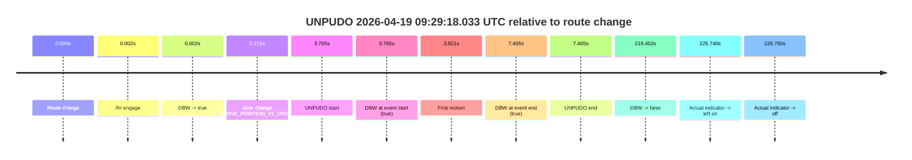
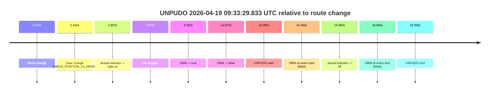
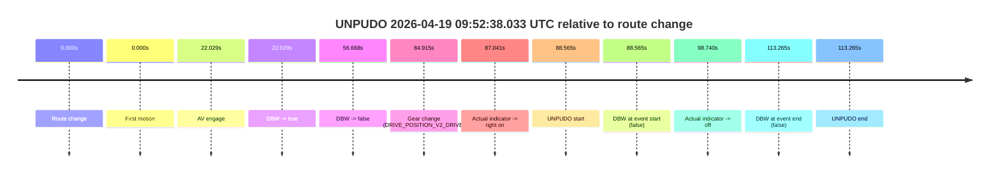
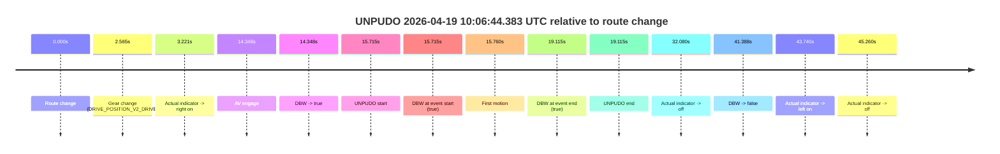
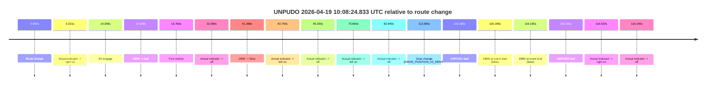
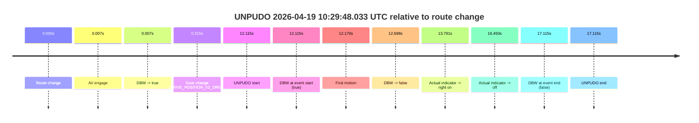
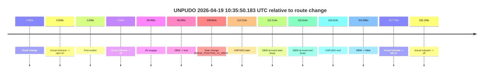
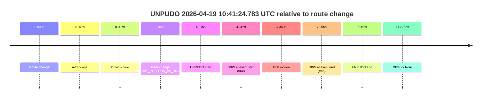
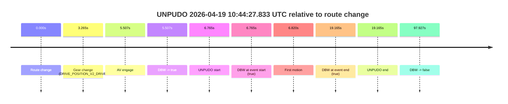
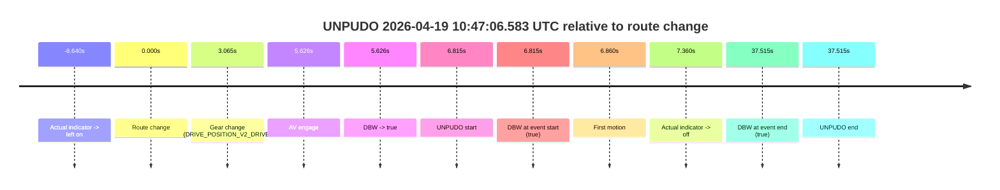

# Run Report: fme20029/2026-04-19--09-04-12--gen2-av-c67fed38-c47b-4e4b-b311-36cdfde00923

| Field | Value |
|---|---|
| Run ID | `fme20029/2026-04-19--09-04-12--gen2-av-c67fed38-c47b-4e4b-b311-36cdfde00923` |
| Date | `2026-04-19` |
| Model(s) | `eel-teal-outspoken` |
| Author | `zak` |
| Event count | `11` |

## unpudo 2026-04-19 09:11:28.533 UTC

| Field | Value |
|---|---|
| Model | `eel-teal-outspoken` |
| Author | `zak` |
| Run ID | `fme20029/2026-04-19--09-04-12--gen2-av-c67fed38-c47b-4e4b-b311-36cdfde00923` |
| Date | `2026-04-19` |
| Time (UTC) | `09:11:28.533` |
| Event type | `unpudo` |
| Disengagement type | `none observed` |
| Route change | `found` |
| Console | [run](https://console.sso.wayve.ai/run/fme20029/2026-04-19--09-04-12--gen2-av-c67fed38-c47b-4e4b-b311-36cdfde00923?id=&time-unixus=1776589888533291) |
| Foxglove | [segment](https://app.foxglove.dev/wayve-on-prem/p/prj_0dX18KZdVHg1fmmI/view?ds=foxglove-stream&ds.deviceName=fme20029&ds.start=2026-04-19T09%3A11%3A14.768318Z&ds.end=2026-04-19T09%3A12%3A12.233302Z&layoutId=lay_0e7VD4WIKDQGU73Y&time=2026-04-19T09%3A11%3A28.533291Z) |

### Event card: fail

- Fail: the credited unpudo does not stay AV-owned. The event window starts with DBW true, and the maneuver outcome lands outside a clean AV-owned segment.

| Event | Time (UTC) | Delta from route change |
|---|---:|---:|
| Route change | 2026-04-19 09:11:24.768 | `0.000s` |
| AV engage | 2026-04-19 09:11:24.770 | `0.002s` |
| DBW -> true | 2026-04-19 09:11:24.770 | `0.002s` |
| Gear change (DRIVE_POSITION_V2_DRIVE) | 2026-04-19 09:11:24.983 | `0.215s` |
| UNPUDO start | 2026-04-19 09:11:28.533 | `3.765s` |
| DBW at event start (true) | 2026-04-19 09:11:28.533 | `3.765s` |
| First motion | 2026-04-19 09:11:28.588 | `3.820s` |
| DBW -> false | 2026-04-19 09:11:46.780 | `22.012s` |
| DBW at event end (false) | 2026-04-19 09:12:02.233 | `37.465s` |
| UNPUDO end | 2026-04-19 09:12:02.233 | `37.465s` |

| Metric | Value |
|---|---|
| Outcome | `fail` |
| Effective failure type | `driver_completed_maneuver` |
| Route change status | `found` |
| DBW at event start | `true` |
| DBW at event end | `false` |
| Predicted gear at AV start | `DRIVE_POSITION_V2_PARK` |
| Actual gear at AV start | `DRIVE_POSITION_V2_PARK` |
| Predicted gear at event start | `DRIVE_POSITION_V2_DRIVE` |
| Actual gear at event start | `DRIVE_POSITION_V2_DRIVE` |
| Planned indicator direction | `INDICATORS_STATE_V2_OFF` |
| Controller indicator direction | `INDICATORS_STATE_V2_OFF` |
| Actual indicator direction | `INDICATORS_STATE_V2_OFF` |
| Actual indicator at maneuver end | `INDICATORS_STATE_V2_OFF` |
| Driver accel help in AV | `false` |
| Driver accel help timestamp | `n/a` |
| Max accel pedal pct in AV | `0.0%` |
| Max brake pedal pct in AV | `29.1%` |
| Max speed mps in AV | `2.053` |
| Success timing baseline | `route change` |
| Route -> AV | `0.002s` |
| AV -> event start | `3.763s` |
| AV -> first motion | `3.818s` |
| Success baseline -> event start | `3.765s` |
| Success baseline -> first motion | `3.820s` |
| AV duration before disengagement | `22.010s` |
| Trajectory waypoint count | `38` |
| Driving-plan step count | `11` |

The scored portion starts from the AV-owned window, not from the pre-AV setup. Route-change search in the stopped pre-event segment was `found`, with the baseline therefore set to route change. At the event anchor the model predicts `DRIVE_POSITION_V2_DRIVE` and the actual gear is `DRIVE_POSITION_V2_DRIVE`. The effective model outcome is `fail` because `driver_completed_maneuver.`

### Resolution

| Field | Value |
|---|---|
| Final outcome | `fail` |
| Do we agree with this label? | `yes` |
| Source disengagement type | `none observed` |
| Resolved effective failure type | `driver_completed_maneuver` |
| Confidence | `high` |

## unpudo 2026-04-19 09:29:18.033 UTC

| Field | Value |
|---|---|
| Model | `eel-teal-outspoken` |
| Author | `zak` |
| Run ID | `fme20029/2026-04-19--09-04-12--gen2-av-c67fed38-c47b-4e4b-b311-36cdfde00923` |
| Date | `2026-04-19` |
| Time (UTC) | `09:29:18.033` |
| Event type | `unpudo` |
| Disengagement type | `none observed` |
| Route change | `found` |
| Console | [run](https://console.sso.wayve.ai/run/fme20029/2026-04-19--09-04-12--gen2-av-c67fed38-c47b-4e4b-b311-36cdfde00923?id=&time-unixus=1776590958033303) |
| Foxglove | [segment](https://app.foxglove.dev/wayve-on-prem/p/prj_0dX18KZdVHg1fmmI/view?ds=foxglove-stream&ds.deviceName=fme20029&ds.start=2026-04-19T09%3A29%3A04.268271Z&ds.end=2026-04-19T09%3A33%3A03.670231Z&layoutId=lay_0e7VD4WIKDQGU73Y&time=2026-04-19T09%3A29%3A18.033303Z) |

### Event card: pass

- Pass: AV owns the credited unpudo from route change through the official unpudo window, the gear state is aligned at the anchor, and the vehicle moves without driver accelerator help in AV.

| Event | Time (UTC) | Delta from route change |
|---|---:|---:|
| Route change | 2026-04-19 09:29:14.268 | `0.000s` |
| AV engage | 2026-04-19 09:29:14.270 | `0.002s` |
| DBW -> true | 2026-04-19 09:29:14.270 | `0.002s` |
| Gear change (DRIVE_POSITION_V2_DRIVE) | 2026-04-19 09:29:14.483 | `0.215s` |
| UNPUDO start | 2026-04-19 09:29:18.033 | `3.765s` |
| DBW at event start (true) | 2026-04-19 09:29:18.033 | `3.765s` |
| First motion | 2026-04-19 09:29:18.088 | `3.821s` |
| DBW at event end (true) | 2026-04-19 09:29:21.733 | `7.465s` |
| UNPUDO end | 2026-04-19 09:29:21.733 | `7.465s` |
| DBW -> false | 2026-04-19 09:32:53.670 | `219.402s` |
| Actual indicator -> left on | 2026-04-19 09:33:00.008 | `225.740s` |
| Actual indicator -> off | 2026-04-19 09:33:04.028 | `229.760s` |

| Metric | Value |
|---|---|
| Outcome | `pass` |
| Effective failure type | `none` |
| Route change status | `found` |
| DBW at event start | `true` |
| DBW at event end | `true` |
| Predicted gear at AV start | `DRIVE_POSITION_V2_PARK` |
| Actual gear at AV start | `DRIVE_POSITION_V2_PARK` |
| Predicted gear at event start | `DRIVE_POSITION_V2_DRIVE` |
| Actual gear at event start | `DRIVE_POSITION_V2_DRIVE` |
| Planned indicator direction | `INDICATORS_STATE_V2_RIGHT_ON` |
| Controller indicator direction | `INDICATORS_STATE_V2_RIGHT_ON` |
| Actual indicator direction | `INDICATORS_STATE_V2_OFF` |
| Actual indicator at maneuver end | `INDICATORS_STATE_V2_OFF` |
| Driver accel help in AV | `false` |
| Driver accel help timestamp | `n/a` |
| Max accel pedal pct in AV | `0.0%` |
| Max brake pedal pct in AV | `8.0%` |
| Max speed mps in AV | `4.761` |
| Success timing baseline | `route change` |
| Route -> AV | `0.002s` |
| AV -> event start | `3.763s` |
| AV -> first motion | `3.818s` |
| Success baseline -> event start | `3.765s` |
| Success baseline -> first motion | `3.821s` |
| AV duration before disengagement | `219.400s` |
| Trajectory waypoint count | `38` |
| Driving-plan step count | `11` |

The scored portion starts from the AV-owned window, not from the pre-AV setup. Route-change search in the stopped pre-event segment was `found`, with the baseline therefore set to route change. At the event anchor the model predicts `DRIVE_POSITION_V2_DRIVE` and the actual gear is `DRIVE_POSITION_V2_DRIVE`. The effective model outcome is `pass` because `the credited unpudo stays AV-owned through the official unpudo window.`

### Resolution

| Field | Value |
|---|---|
| Final outcome | `pass` |
| Do we agree with this label? | `yes` |
| Source disengagement type | `none observed` |
| Resolved effective failure type | `none` |
| Confidence | `high` |

## unpudo 2026-04-19 09:33:29.833 UTC

| Field | Value |
|---|---|
| Model | `eel-teal-outspoken` |
| Author | `zak` |
| Run ID | `fme20029/2026-04-19--09-04-12--gen2-av-c67fed38-c47b-4e4b-b311-36cdfde00923` |
| Date | `2026-04-19` |
| Time (UTC) | `09:33:29.833` |
| Event type | `unpudo` |
| Disengagement type | `none observed` |
| Route change | `found` |
| Console | [run](https://console.sso.wayve.ai/run/fme20029/2026-04-19--09-04-12--gen2-av-c67fed38-c47b-4e4b-b311-36cdfde00923?id=&time-unixus=1776591209833314) |
| Foxglove | [segment](https://app.foxglove.dev/wayve-on-prem/p/prj_0dX18KZdVHg1fmmI/view?ds=foxglove-stream&ds.deviceName=fme20029&ds.start=2026-04-19T09%3A33%3A04.368269Z&ds.end=2026-04-19T09%3A33%3A43.333320Z&layoutId=lay_0e7VD4WIKDQGU73Y&time=2026-04-19T09%3A33%3A29.833314Z) |

### Event card: fail

- Fail: the credited unpudo does not stay AV-owned. The event window starts with DBW false, and the maneuver outcome lands outside a clean AV-owned segment.

| Event | Time (UTC) | Delta from route change |
|---|---:|---:|
| Route change | 2026-04-19 09:33:14.368 | `0.000s` |
| Gear change (DRIVE_POSITION_V2_DRIVE) | 2026-04-19 09:33:16.783 | `2.415s` |
| Actual indicator -> right on | 2026-04-19 09:33:17.288 | `2.920s` |
| AV engage | 2026-04-19 09:33:19.370 | `5.002s` |
| DBW -> true | 2026-04-19 09:33:19.370 | `5.002s` |
| DBW -> false | 2026-04-19 09:33:29.340 | `14.973s` |
| UNPUDO start | 2026-04-19 09:33:29.833 | `15.465s` |
| DBW at event start (false) | 2026-04-19 09:33:29.833 | `15.465s` |
| Actual indicator -> off | 2026-04-19 09:33:31.328 | `16.960s` |
| DBW at event end (false) | 2026-04-19 09:33:33.333 | `18.965s` |
| UNPUDO end | 2026-04-19 09:33:33.333 | `18.965s` |

| Metric | Value |
|---|---|
| Outcome | `fail` |
| Effective failure type | `not_av_owned` |
| Route change status | `found` |
| DBW at event start | `false` |
| DBW at event end | `false` |
| Predicted gear at AV start | `DRIVE_POSITION_V2_DRIVE` |
| Actual gear at AV start | `DRIVE_POSITION_V2_DRIVE` |
| Predicted gear at event start | `DRIVE_POSITION_V2_DRIVE` |
| Actual gear at event start | `DRIVE_POSITION_V2_DRIVE` |
| Planned indicator direction | `INDICATORS_STATE_V2_RIGHT_ON` |
| Controller indicator direction | `INDICATORS_STATE_V2_RIGHT_ON` |
| Actual indicator direction | `INDICATORS_STATE_V2_RIGHT_ON` |
| Actual indicator at maneuver end | `INDICATORS_STATE_V2_OFF` |
| Driver accel help in AV | `false` |
| Driver accel help timestamp | `n/a` |
| Max accel pedal pct in AV | `0.0%` |
| Max brake pedal pct in AV | `8.0%` |
| Max speed mps in AV | `0.000` |
| Success timing baseline | `route change` |
| Route -> AV | `5.002s` |
| AV -> event start | `10.463s` |
| AV -> first motion | `n/a` |
| Success baseline -> event start | `15.465s` |
| Success baseline -> first motion | `n/a` |
| AV duration before disengagement | `9.971s` |
| Trajectory waypoint count | `38` |
| Driving-plan step count | `11` |

The scored portion starts from the AV-owned window, not from the pre-AV setup. Route-change search in the stopped pre-event segment was `found`, with the baseline therefore set to route change. At the event anchor the model predicts `DRIVE_POSITION_V2_DRIVE` and the actual gear is `DRIVE_POSITION_V2_DRIVE`. The effective model outcome is `fail` because `not_av_owned.`

### Resolution

| Field | Value |
|---|---|
| Final outcome | `fail` |
| Do we agree with this label? | `yes` |
| Source disengagement type | `none observed` |
| Resolved effective failure type | `not_av_owned` |
| Confidence | `high` |

## unpudo 2026-04-19 09:52:38.033 UTC

| Field | Value |
|---|---|
| Model | `eel-teal-outspoken` |
| Author | `zak` |
| Run ID | `fme20029/2026-04-19--09-04-12--gen2-av-c67fed38-c47b-4e4b-b311-36cdfde00923` |
| Date | `2026-04-19` |
| Time (UTC) | `09:52:38.033` |
| Event type | `unpudo` |
| Disengagement type | `none observed` |
| Route change | `found` |
| Console | [run](https://console.sso.wayve.ai/run/fme20029/2026-04-19--09-04-12--gen2-av-c67fed38-c47b-4e4b-b311-36cdfde00923?id=&time-unixus=1776592358033323) |
| Foxglove | [segment](https://app.foxglove.dev/wayve-on-prem/p/prj_0dX18KZdVHg1fmmI/view?ds=foxglove-stream&ds.deviceName=fme20029&ds.start=2026-04-19T09%3A50%3A59.468237Z&ds.end=2026-04-19T09%3A53%3A12.733317Z&layoutId=lay_0e7VD4WIKDQGU73Y&time=2026-04-19T09%3A52%3A38.033323Z) |

### Event card: fail

- Fail: the credited unpudo does not stay AV-owned. The event window starts with DBW false, and the maneuver outcome lands outside a clean AV-owned segment.

| Event | Time (UTC) | Delta from route change |
|---|---:|---:|
| Route change | 2026-04-19 09:51:09.468 | `0.000s` |
| First motion | 2026-04-19 09:51:09.468 | `0.000s` |
| AV engage | 2026-04-19 09:51:31.497 | `22.029s` |
| DBW -> true | 2026-04-19 09:51:31.497 | `22.029s` |
| DBW -> false | 2026-04-19 09:52:06.136 | `56.668s` |
| Gear change (DRIVE_POSITION_V2_DRIVE) | 2026-04-19 09:52:34.383 | `84.915s` |
| Actual indicator -> right on | 2026-04-19 09:52:36.508 | `87.041s` |
| UNPUDO start | 2026-04-19 09:52:38.033 | `88.565s` |
| DBW at event start (false) | 2026-04-19 09:52:38.033 | `88.565s` |
| Actual indicator -> off | 2026-04-19 09:52:48.208 | `98.740s` |
| DBW at event end (false) | 2026-04-19 09:53:02.733 | `113.265s` |
| UNPUDO end | 2026-04-19 09:53:02.733 | `113.265s` |

| Metric | Value |
|---|---|
| Outcome | `fail` |
| Effective failure type | `completed_outside_av` |
| Route change status | `found` |
| DBW at event start | `false` |
| DBW at event end | `false` |
| Predicted gear at AV start | `DRIVE_POSITION_V2_DRIVE` |
| Actual gear at AV start | `DRIVE_POSITION_V2_DRIVE` |
| Predicted gear at event start | `DRIVE_POSITION_V2_DRIVE` |
| Actual gear at event start | `DRIVE_POSITION_V2_DRIVE` |
| Planned indicator direction | `INDICATORS_STATE_V2_RIGHT_ON` |
| Controller indicator direction | `INDICATORS_STATE_V2_RIGHT_ON` |
| Actual indicator direction | `INDICATORS_STATE_V2_RIGHT_ON` |
| Actual indicator at maneuver end | `INDICATORS_STATE_V2_OFF` |
| Driver accel help in AV | `false` |
| Driver accel help timestamp | `n/a` |
| Max accel pedal pct in AV | `0.0%` |
| Max brake pedal pct in AV | `0.0%` |
| Max speed mps in AV | `6.094` |
| Success timing baseline | `route change` |
| Route -> AV | `22.029s` |
| AV -> event start | `66.536s` |
| AV -> first motion | `-22.028s` |
| Success baseline -> event start | `88.565s` |
| Success baseline -> first motion | `0.000s` |
| AV duration before disengagement | `34.639s` |
| Trajectory waypoint count | `37` |
| Driving-plan step count | `11` |

The scored portion starts from the AV-owned window, not from the pre-AV setup. Route-change search in the stopped pre-event segment was `found`, with the baseline therefore set to route change. At the event anchor the model predicts `DRIVE_POSITION_V2_DRIVE` and the actual gear is `DRIVE_POSITION_V2_DRIVE`. The effective model outcome is `fail` because `completed_outside_av.`

### Resolution

| Field | Value |
|---|---|
| Final outcome | `fail` |
| Do we agree with this label? | `yes` |
| Source disengagement type | `none observed` |
| Resolved effective failure type | `completed_outside_av` |
| Confidence | `high` |

## unpudo 2026-04-19 10:06:44.383 UTC

| Field | Value |
|---|---|
| Model | `eel-teal-outspoken` |
| Author | `zak` |
| Run ID | `fme20029/2026-04-19--09-04-12--gen2-av-c67fed38-c47b-4e4b-b311-36cdfde00923` |
| Date | `2026-04-19` |
| Time (UTC) | `10:06:44.383` |
| Event type | `unpudo` |
| Disengagement type | `none observed` |
| Route change | `found` |
| Console | [run](https://console.sso.wayve.ai/run/fme20029/2026-04-19--09-04-12--gen2-av-c67fed38-c47b-4e4b-b311-36cdfde00923?id=&time-unixus=1776593204383300) |
| Foxglove | [segment](https://app.foxglove.dev/wayve-on-prem/p/prj_0dX18KZdVHg1fmmI/view?ds=foxglove-stream&ds.deviceName=fme20029&ds.start=2026-04-19T10%3A06%3A18.668239Z&ds.end=2026-04-19T10%3A07%3A20.056018Z&layoutId=lay_0e7VD4WIKDQGU73Y&time=2026-04-19T10%3A06%3A44.383300Z) |

### Event card: pass

- Pass: AV owns the credited unpudo from route change through the official unpudo window, the gear state is aligned at the anchor, and the vehicle moves without driver accelerator help in AV.

| Event | Time (UTC) | Delta from route change |
|---|---:|---:|
| Route change | 2026-04-19 10:06:28.668 | `0.000s` |
| Gear change (DRIVE_POSITION_V2_DRIVE) | 2026-04-19 10:06:31.233 | `2.565s` |
| Actual indicator -> right on | 2026-04-19 10:06:31.889 | `3.221s` |
| AV engage | 2026-04-19 10:06:43.016 | `14.348s` |
| DBW -> true | 2026-04-19 10:06:43.016 | `14.348s` |
| UNPUDO start | 2026-04-19 10:06:44.383 | `15.715s` |
| DBW at event start (true) | 2026-04-19 10:06:44.383 | `15.715s` |
| First motion | 2026-04-19 10:06:44.428 | `15.760s` |
| DBW at event end (true) | 2026-04-19 10:06:47.783 | `19.115s` |
| UNPUDO end | 2026-04-19 10:06:47.783 | `19.115s` |
| Actual indicator -> off | 2026-04-19 10:07:00.748 | `32.080s` |
| DBW -> false | 2026-04-19 10:07:10.056 | `41.388s` |
| Actual indicator -> left on | 2026-04-19 10:07:12.408 | `43.740s` |
| Actual indicator -> off | 2026-04-19 10:07:13.928 | `45.260s` |

| Metric | Value |
|---|---|
| Outcome | `pass` |
| Effective failure type | `none` |
| Route change status | `found` |
| DBW at event start | `true` |
| DBW at event end | `true` |
| Predicted gear at AV start | `DRIVE_POSITION_V2_DRIVE` |
| Actual gear at AV start | `DRIVE_POSITION_V2_DRIVE` |
| Predicted gear at event start | `DRIVE_POSITION_V2_DRIVE` |
| Actual gear at event start | `DRIVE_POSITION_V2_DRIVE` |
| Planned indicator direction | `INDICATORS_STATE_V2_OFF` |
| Controller indicator direction | `INDICATORS_STATE_V2_OFF` |
| Actual indicator direction | `INDICATORS_STATE_V2_RIGHT_ON` |
| Actual indicator at maneuver end | `INDICATORS_STATE_V2_RIGHT_ON` |
| Driver accel help in AV | `false` |
| Driver accel help timestamp | `n/a` |
| Max accel pedal pct in AV | `0.0%` |
| Max brake pedal pct in AV | `8.0%` |
| Max speed mps in AV | `4.808` |
| Success timing baseline | `route change` |
| Route -> AV | `14.348s` |
| AV -> event start | `1.367s` |
| AV -> first motion | `1.412s` |
| Success baseline -> event start | `15.715s` |
| Success baseline -> first motion | `15.760s` |
| AV duration before disengagement | `27.039s` |
| Trajectory waypoint count | `36` |
| Driving-plan step count | `11` |

The scored portion starts from the AV-owned window, not from the pre-AV setup. Route-change search in the stopped pre-event segment was `found`, with the baseline therefore set to route change. At the event anchor the model predicts `DRIVE_POSITION_V2_DRIVE` and the actual gear is `DRIVE_POSITION_V2_DRIVE`. The effective model outcome is `pass` because `the credited unpudo stays AV-owned through the official unpudo window.`

### Resolution

| Field | Value |
|---|---|
| Final outcome | `pass` |
| Do we agree with this label? | `yes` |
| Source disengagement type | `none observed` |
| Resolved effective failure type | `none` |
| Confidence | `high` |

## unpudo 2026-04-19 10:08:24.833 UTC

| Field | Value |
|---|---|
| Model | `eel-teal-outspoken` |
| Author | `zak` |
| Run ID | `fme20029/2026-04-19--09-04-12--gen2-av-c67fed38-c47b-4e4b-b311-36cdfde00923` |
| Date | `2026-04-19` |
| Time (UTC) | `10:08:24.833` |
| Event type | `unpudo` |
| Disengagement type | `none observed` |
| Route change | `found` |
| Console | [run](https://console.sso.wayve.ai/run/fme20029/2026-04-19--09-04-12--gen2-av-c67fed38-c47b-4e4b-b311-36cdfde00923?id=&time-unixus=1776593304833302) |
| Foxglove | [segment](https://app.foxglove.dev/wayve-on-prem/p/prj_0dX18KZdVHg1fmmI/view?ds=foxglove-stream&ds.deviceName=fme20029&ds.start=2026-04-19T10%3A06%3A18.668239Z&ds.end=2026-04-19T10%3A08%3A34.833302Z&layoutId=lay_0e7VD4WIKDQGU73Y&time=2026-04-19T10%3A08%3A24.833302Z) |

### Event card: fail

- Fail: the credited unpudo does not stay AV-owned. The event window starts with DBW false, and the maneuver outcome lands outside a clean AV-owned segment.

| Event | Time (UTC) | Delta from route change |
|---|---:|---:|
| Route change | 2026-04-19 10:06:28.668 | `0.000s` |
| Actual indicator -> right on | 2026-04-19 10:06:31.889 | `3.221s` |
| AV engage | 2026-04-19 10:06:43.016 | `14.348s` |
| DBW -> true | 2026-04-19 10:06:43.016 | `14.348s` |
| First motion | 2026-04-19 10:06:44.428 | `15.760s` |
| Actual indicator -> off | 2026-04-19 10:07:00.748 | `32.080s` |
| DBW -> false | 2026-04-19 10:07:10.056 | `41.388s` |
| Actual indicator -> left on | 2026-04-19 10:07:12.408 | `43.740s` |
| Actual indicator -> off | 2026-04-19 10:07:13.928 | `45.260s` |
| Actual indicator -> left on | 2026-04-19 10:07:44.328 | `75.660s` |
| Actual indicator -> off | 2026-04-19 10:07:51.608 | `82.940s` |
| Gear change (DRIVE_POSITION_V2_DRIVE) | 2026-04-19 10:08:21.733 | `113.065s` |
| UNPUDO start | 2026-04-19 10:08:24.833 | `116.165s` |
| DBW at event start (false) | 2026-04-19 10:08:24.833 | `116.165s` |
| DBW at event end (false) | 2026-04-19 10:08:24.833 | `116.165s` |
| UNPUDO end | 2026-04-19 10:08:24.833 | `116.165s` |
| Actual indicator -> right on | 2026-04-19 10:08:25.188 | `116.520s` |
| Actual indicator -> off | 2026-04-19 10:08:27.808 | `119.140s` |

| Metric | Value |
|---|---|
| Outcome | `fail` |
| Effective failure type | `not_av_owned` |
| Route change status | `found` |
| DBW at event start | `false` |
| DBW at event end | `false` |
| Predicted gear at AV start | `DRIVE_POSITION_V2_DRIVE` |
| Actual gear at AV start | `DRIVE_POSITION_V2_DRIVE` |
| Predicted gear at event start | `DRIVE_POSITION_V2_DRIVE` |
| Actual gear at event start | `DRIVE_POSITION_V2_DRIVE` |
| Planned indicator direction | `INDICATORS_STATE_V2_OFF` |
| Controller indicator direction | `INDICATORS_STATE_V2_OFF` |
| Actual indicator direction | `INDICATORS_STATE_V2_OFF` |
| Actual indicator at maneuver end | `INDICATORS_STATE_V2_OFF` |
| Driver accel help in AV | `false` |
| Driver accel help timestamp | `n/a` |
| Max accel pedal pct in AV | `0.0%` |
| Max brake pedal pct in AV | `8.0%` |
| Max speed mps in AV | `7.761` |
| Success timing baseline | `route change` |
| Route -> AV | `14.348s` |
| AV -> event start | `101.817s` |
| AV -> first motion | `1.412s` |
| Success baseline -> event start | `116.165s` |
| Success baseline -> first motion | `15.760s` |
| AV duration before disengagement | `27.039s` |
| Trajectory waypoint count | `37` |
| Driving-plan step count | `11` |

The scored portion starts from the AV-owned window, not from the pre-AV setup. Route-change search in the stopped pre-event segment was `found`, with the baseline therefore set to route change. At the event anchor the model predicts `DRIVE_POSITION_V2_DRIVE` and the actual gear is `DRIVE_POSITION_V2_DRIVE`. The effective model outcome is `fail` because `not_av_owned.`

### Resolution

| Field | Value |
|---|---|
| Final outcome | `fail` |
| Do we agree with this label? | `yes` |
| Source disengagement type | `none observed` |
| Resolved effective failure type | `not_av_owned` |
| Confidence | `high` |

## unpudo 2026-04-19 10:29:48.033 UTC

| Field | Value |
|---|---|
| Model | `eel-teal-outspoken` |
| Author | `zak` |
| Run ID | `fme20029/2026-04-19--09-04-12--gen2-av-c67fed38-c47b-4e4b-b311-36cdfde00923` |
| Date | `2026-04-19` |
| Time (UTC) | `10:29:48.033` |
| Event type | `unpudo` |
| Disengagement type | `failed_to_slow` |
| Route change | `found` |
| Console | [run](https://console.sso.wayve.ai/run/fme20029/2026-04-19--09-04-12--gen2-av-c67fed38-c47b-4e4b-b311-36cdfde00923?id=&time-unixus=1776594588033322) |
| Foxglove | [segment](https://app.foxglove.dev/wayve-on-prem/p/prj_0dX18KZdVHg1fmmI/view?ds=foxglove-stream&ds.deviceName=fme20029&ds.start=2026-04-19T10%3A29%3A25.918251Z&ds.end=2026-04-19T10%3A30%3A03.033311Z&layoutId=lay_0e7VD4WIKDQGU73Y&time=2026-04-19T10%3A29%3A48.033322Z) |

### Event card: fail

- Fail: AV owns part of the segment, but the event still resolves as a model-performance failure under the AV-only scoring rule.

| Event | Time (UTC) | Delta from route change |
|---|---:|---:|
| Route change | 2026-04-19 10:29:35.918 | `0.000s` |
| AV engage | 2026-04-19 10:29:35.924 | `0.007s` |
| DBW -> true | 2026-04-19 10:29:35.924 | `0.007s` |
| Gear change (DRIVE_POSITION_V2_DRIVE) | 2026-04-19 10:29:36.233 | `0.315s` |
| UNPUDO start | 2026-04-19 10:29:48.033 | `12.115s` |
| DBW at event start (true) | 2026-04-19 10:29:48.033 | `12.115s` |
| First motion | 2026-04-19 10:29:48.088 | `12.170s` |
| DBW -> false | 2026-04-19 10:29:48.615 | `12.698s` |
| Actual indicator -> right on | 2026-04-19 10:29:49.708 | `13.791s` |
| Actual indicator -> off | 2026-04-19 10:29:52.368 | `16.450s` |
| DBW at event end (false) | 2026-04-19 10:29:53.033 | `17.115s` |
| UNPUDO end | 2026-04-19 10:29:53.033 | `17.115s` |

| Metric | Value |
|---|---|
| Outcome | `fail` |
| Effective failure type | `failed_to_slow` |
| Route change status | `found` |
| DBW at event start | `true` |
| DBW at event end | `false` |
| Predicted gear at AV start | `DRIVE_POSITION_V2_PARK` |
| Actual gear at AV start | `DRIVE_POSITION_V2_PARK` |
| Predicted gear at event start | `DRIVE_POSITION_V2_DRIVE` |
| Actual gear at event start | `DRIVE_POSITION_V2_DRIVE` |
| Planned indicator direction | `INDICATORS_STATE_V2_RIGHT_ON` |
| Controller indicator direction | `INDICATORS_STATE_V2_RIGHT_ON` |
| Actual indicator direction | `INDICATORS_STATE_V2_OFF` |
| Actual indicator at maneuver end | `INDICATORS_STATE_V2_OFF` |
| Driver accel help in AV | `false` |
| Driver accel help timestamp | `n/a` |
| Max accel pedal pct in AV | `0.0%` |
| Max brake pedal pct in AV | `8.0%` |
| Max speed mps in AV | `1.269` |
| Success timing baseline | `route change` |
| Route -> AV | `0.007s` |
| AV -> event start | `12.109s` |
| AV -> first motion | `12.164s` |
| Success baseline -> event start | `12.115s` |
| Success baseline -> first motion | `12.170s` |
| AV duration before disengagement | `12.691s` |
| Trajectory waypoint count | `37` |
| Driving-plan step count | `11` |

The scored portion starts from the AV-owned window, not from the pre-AV setup. Route-change search in the stopped pre-event segment was `found`, with the baseline therefore set to route change. At the event anchor the model predicts `DRIVE_POSITION_V2_DRIVE` and the actual gear is `DRIVE_POSITION_V2_DRIVE`. The effective model outcome is `fail` because `failed_to_slow.`

### Resolution

| Field | Value |
|---|---|
| Final outcome | `fail` |
| Do we agree with this label? | `yes` |
| Source disengagement type | `failed_to_slow` |
| Resolved effective failure type | `failed_to_slow` |
| Confidence | `high` |

## unpudo 2026-04-19 10:35:50.183 UTC

| Field | Value |
|---|---|
| Model | `eel-teal-outspoken` |
| Author | `zak` |
| Run ID | `fme20029/2026-04-19--09-04-12--gen2-av-c67fed38-c47b-4e4b-b311-36cdfde00923` |
| Date | `2026-04-19` |
| Time (UTC) | `10:35:50.183` |
| Event type | `unpudo` |
| Disengagement type | `none observed` |
| Route change | `found` |
| Console | [run](https://console.sso.wayve.ai/run/fme20029/2026-04-19--09-04-12--gen2-av-c67fed38-c47b-4e4b-b311-36cdfde00923?id=&time-unixus=1776594950183312) |
| Foxglove | [segment](https://app.foxglove.dev/wayve-on-prem/p/prj_0dX18KZdVHg1fmmI/view?ds=foxglove-stream&ds.deviceName=fme20029&ds.start=2026-04-19T10%3A33%3A47.969570Z&ds.end=2026-04-19T10%3A39%3A23.854607Z&layoutId=lay_0e7VD4WIKDQGU73Y&time=2026-04-19T10%3A35%3A50.183312Z) |

### Event card: pass

- Pass: AV owns the credited unpudo from route change through the official unpudo window, the gear state is aligned at the anchor, and the vehicle moves without driver accelerator help in AV.

| Event | Time (UTC) | Delta from route change |
|---|---:|---:|
| Route change | 2026-04-19 10:33:57.969 | `0.000s` |
| Actual indicator -> right on | 2026-04-19 10:33:58.808 | `0.839s` |
| First motion | 2026-04-19 10:33:59.608 | `1.639s` |
| Actual indicator -> off | 2026-04-19 10:34:01.008 | `3.039s` |
| AV engage | 2026-04-19 10:34:56.034 | `58.065s` |
| DBW -> true | 2026-04-19 10:34:56.034 | `58.065s` |
| Gear change (DRIVE_POSITION_V2_DRIVE) | 2026-04-19 10:35:46.633 | `108.664s` |
| UNPUDO start | 2026-04-19 10:35:50.183 | `112.214s` |
| DBW at event start (true) | 2026-04-19 10:35:50.183 | `112.214s` |
| DBW at event end (true) | 2026-04-19 10:35:53.583 | `115.614s` |
| UNPUDO end | 2026-04-19 10:35:53.583 | `115.614s` |
| DBW -> false | 2026-04-19 10:39:13.854 | `315.885s` |
| Actual indicator -> left on | 2026-04-19 10:39:15.708 | `317.739s` |
| Actual indicator -> off | 2026-04-19 10:39:28.128 | `330.159s` |

| Metric | Value |
|---|---|
| Outcome | `pass` |
| Effective failure type | `none` |
| Route change status | `found` |
| DBW at event start | `true` |
| DBW at event end | `true` |
| Predicted gear at AV start | `DRIVE_POSITION_V2_DRIVE` |
| Actual gear at AV start | `DRIVE_POSITION_V2_DRIVE` |
| Predicted gear at event start | `DRIVE_POSITION_V2_DRIVE` |
| Actual gear at event start | `DRIVE_POSITION_V2_DRIVE` |
| Planned indicator direction | `INDICATORS_STATE_V2_RIGHT_ON` |
| Controller indicator direction | `INDICATORS_STATE_V2_RIGHT_ON` |
| Actual indicator direction | `INDICATORS_STATE_V2_OFF` |
| Actual indicator at maneuver end | `INDICATORS_STATE_V2_OFF` |
| Driver accel help in AV | `false` |
| Driver accel help timestamp | `n/a` |
| Max accel pedal pct in AV | `0.0%` |
| Max brake pedal pct in AV | `11.1%` |
| Max speed mps in AV | `6.006` |
| Success timing baseline | `route change` |
| Route -> AV | `58.065s` |
| AV -> event start | `54.148s` |
| AV -> first motion | `-56.426s` |
| Success baseline -> event start | `112.214s` |
| Success baseline -> first motion | `1.639s` |
| AV duration before disengagement | `257.820s` |
| Trajectory waypoint count | `36` |
| Driving-plan step count | `11` |

The scored portion starts from the AV-owned window, not from the pre-AV setup. Route-change search in the stopped pre-event segment was `found`, with the baseline therefore set to route change. At the event anchor the model predicts `DRIVE_POSITION_V2_DRIVE` and the actual gear is `DRIVE_POSITION_V2_DRIVE`. The effective model outcome is `pass` because `the credited unpudo stays AV-owned through the official unpudo window.`

### Resolution

| Field | Value |
|---|---|
| Final outcome | `pass` |
| Do we agree with this label? | `yes` |
| Source disengagement type | `none observed` |
| Resolved effective failure type | `none` |
| Confidence | `high` |

## unpudo 2026-04-19 10:41:24.783 UTC

| Field | Value |
|---|---|
| Model | `eel-teal-outspoken` |
| Author | `zak` |
| Run ID | `fme20029/2026-04-19--09-04-12--gen2-av-c67fed38-c47b-4e4b-b311-36cdfde00923` |
| Date | `2026-04-19` |
| Time (UTC) | `10:41:24.783` |
| Event type | `unpudo` |
| Disengagement type | `none observed` |
| Route change | `found` |
| Console | [run](https://console.sso.wayve.ai/run/fme20029/2026-04-19--09-04-12--gen2-av-c67fed38-c47b-4e4b-b311-36cdfde00923?id=&time-unixus=1776595284783324) |
| Foxglove | [segment](https://app.foxglove.dev/wayve-on-prem/p/prj_0dX18KZdVHg1fmmI/view?ds=foxglove-stream&ds.deviceName=fme20029&ds.start=2026-04-19T10%3A41%3A10.468270Z&ds.end=2026-04-19T10%3A44%3A22.254611Z&layoutId=lay_0e7VD4WIKDQGU73Y&time=2026-04-19T10%3A41%3A24.783324Z) |

### Event card: pass

- Pass: AV owns the credited unpudo from route change through the official unpudo window, the gear state is aligned at the anchor, and the vehicle moves without driver accelerator help in AV.

| Event | Time (UTC) | Delta from route change |
|---|---:|---:|
| Route change | 2026-04-19 10:41:20.468 | `0.000s` |
| AV engage | 2026-04-19 10:41:20.474 | `0.007s` |
| DBW -> true | 2026-04-19 10:41:20.474 | `0.007s` |
| Gear change (DRIVE_POSITION_V2_DRIVE) | 2026-04-19 10:41:20.833 | `0.365s` |
| UNPUDO start | 2026-04-19 10:41:24.783 | `4.315s` |
| DBW at event start (true) | 2026-04-19 10:41:24.783 | `4.315s` |
| First motion | 2026-04-19 10:41:24.808 | `4.340s` |
| DBW at event end (true) | 2026-04-19 10:41:28.433 | `7.965s` |
| UNPUDO end | 2026-04-19 10:41:28.433 | `7.965s` |
| DBW -> false | 2026-04-19 10:44:12.254 | `171.786s` |

| Metric | Value |
|---|---|
| Outcome | `pass` |
| Effective failure type | `none` |
| Route change status | `found` |
| DBW at event start | `true` |
| DBW at event end | `true` |
| Predicted gear at AV start | `DRIVE_POSITION_V2_PARK` |
| Actual gear at AV start | `DRIVE_POSITION_V2_PARK` |
| Predicted gear at event start | `DRIVE_POSITION_V2_DRIVE` |
| Actual gear at event start | `DRIVE_POSITION_V2_DRIVE` |
| Planned indicator direction | `INDICATORS_STATE_V2_RIGHT_ON` |
| Controller indicator direction | `INDICATORS_STATE_V2_RIGHT_ON` |
| Actual indicator direction | `INDICATORS_STATE_V2_OFF` |
| Actual indicator at maneuver end | `INDICATORS_STATE_V2_OFF` |
| Driver accel help in AV | `false` |
| Driver accel help timestamp | `n/a` |
| Max accel pedal pct in AV | `0.0%` |
| Max brake pedal pct in AV | `8.0%` |
| Max speed mps in AV | `4.294` |
| Success timing baseline | `route change` |
| Route -> AV | `0.007s` |
| AV -> event start | `4.308s` |
| AV -> first motion | `4.334s` |
| Success baseline -> event start | `4.315s` |
| Success baseline -> first motion | `4.340s` |
| AV duration before disengagement | `171.780s` |
| Trajectory waypoint count | `36` |
| Driving-plan step count | `11` |

The scored portion starts from the AV-owned window, not from the pre-AV setup. Route-change search in the stopped pre-event segment was `found`, with the baseline therefore set to route change. At the event anchor the model predicts `DRIVE_POSITION_V2_DRIVE` and the actual gear is `DRIVE_POSITION_V2_DRIVE`. The effective model outcome is `pass` because `the credited unpudo stays AV-owned through the official unpudo window.`

### Resolution

| Field | Value |
|---|---|
| Final outcome | `pass` |
| Do we agree with this label? | `yes` |
| Source disengagement type | `none observed` |
| Resolved effective failure type | `none` |
| Confidence | `high` |

## unpudo 2026-04-19 10:44:27.833 UTC

| Field | Value |
|---|---|
| Model | `eel-teal-outspoken` |
| Author | `zak` |
| Run ID | `fme20029/2026-04-19--09-04-12--gen2-av-c67fed38-c47b-4e4b-b311-36cdfde00923` |
| Date | `2026-04-19` |
| Time (UTC) | `10:44:27.833` |
| Event type | `unpudo` |
| Disengagement type | `none observed` |
| Route change | `found` |
| Console | [run](https://console.sso.wayve.ai/run/fme20029/2026-04-19--09-04-12--gen2-av-c67fed38-c47b-4e4b-b311-36cdfde00923?id=&time-unixus=1776595467833321) |
| Foxglove | [segment](https://app.foxglove.dev/wayve-on-prem/p/prj_0dX18KZdVHg1fmmI/view?ds=foxglove-stream&ds.deviceName=fme20029&ds.start=2026-04-19T10%3A44%3A11.068243Z&ds.end=2026-04-19T10%3A46%3A08.995080Z&layoutId=lay_0e7VD4WIKDQGU73Y&time=2026-04-19T10%3A44%3A27.833321Z) |

### Event card: pass

- Pass: AV owns the credited unpudo from route change through the official unpudo window, the gear state is aligned at the anchor, and the vehicle moves without driver accelerator help in AV.

| Event | Time (UTC) | Delta from route change |
|---|---:|---:|
| Route change | 2026-04-19 10:44:21.068 | `0.000s` |
| Gear change (DRIVE_POSITION_V2_DRIVE) | 2026-04-19 10:44:24.333 | `3.265s` |
| AV engage | 2026-04-19 10:44:26.574 | `5.507s` |
| DBW -> true | 2026-04-19 10:44:26.574 | `5.507s` |
| UNPUDO start | 2026-04-19 10:44:27.833 | `6.765s` |
| DBW at event start (true) | 2026-04-19 10:44:27.833 | `6.765s` |
| First motion | 2026-04-19 10:44:27.888 | `6.820s` |
| DBW at event end (true) | 2026-04-19 10:44:40.233 | `19.165s` |
| UNPUDO end | 2026-04-19 10:44:40.233 | `19.165s` |
| DBW -> false | 2026-04-19 10:45:58.995 | `97.927s` |

| Metric | Value |
|---|---|
| Outcome | `pass` |
| Effective failure type | `none` |
| Route change status | `found` |
| DBW at event start | `true` |
| DBW at event end | `true` |
| Predicted gear at AV start | `DRIVE_POSITION_V2_DRIVE` |
| Actual gear at AV start | `DRIVE_POSITION_V2_DRIVE` |
| Predicted gear at event start | `DRIVE_POSITION_V2_DRIVE` |
| Actual gear at event start | `DRIVE_POSITION_V2_DRIVE` |
| Planned indicator direction | `INDICATORS_STATE_V2_RIGHT_ON` |
| Controller indicator direction | `INDICATORS_STATE_V2_RIGHT_ON` |
| Actual indicator direction | `INDICATORS_STATE_V2_OFF` |
| Actual indicator at maneuver end | `INDICATORS_STATE_V2_OFF` |
| Driver accel help in AV | `false` |
| Driver accel help timestamp | `n/a` |
| Max accel pedal pct in AV | `0.0%` |
| Max brake pedal pct in AV | `1.4%` |
| Max speed mps in AV | `2.250` |
| Success timing baseline | `route change` |
| Route -> AV | `5.507s` |
| AV -> event start | `1.259s` |
| AV -> first motion | `1.314s` |
| Success baseline -> event start | `6.765s` |
| Success baseline -> first motion | `6.820s` |
| AV duration before disengagement | `92.420s` |
| Trajectory waypoint count | `37` |
| Driving-plan step count | `11` |

The scored portion starts from the AV-owned window, not from the pre-AV setup. Route-change search in the stopped pre-event segment was `found`, with the baseline therefore set to route change. At the event anchor the model predicts `DRIVE_POSITION_V2_DRIVE` and the actual gear is `DRIVE_POSITION_V2_DRIVE`. The effective model outcome is `pass` because `the credited unpudo stays AV-owned through the official unpudo window.`

### Resolution

| Field | Value |
|---|---|
| Final outcome | `pass` |
| Do we agree with this label? | `yes` |
| Source disengagement type | `none observed` |
| Resolved effective failure type | `none` |
| Confidence | `high` |

## unpudo 2026-04-19 10:47:06.583 UTC

| Field | Value |
|---|---|
| Model | `eel-teal-outspoken` |
| Author | `zak` |
| Run ID | `fme20029/2026-04-19--09-04-12--gen2-av-c67fed38-c47b-4e4b-b311-36cdfde00923` |
| Date | `2026-04-19` |
| Time (UTC) | `10:47:06.583` |
| Event type | `unpudo` |
| Disengagement type | `none observed` |
| Route change | `found` |
| Console | [run](https://console.sso.wayve.ai/run/fme20029/2026-04-19--09-04-12--gen2-av-c67fed38-c47b-4e4b-b311-36cdfde00923?id=&time-unixus=1776595626583304) |
| Foxglove | [segment](https://app.foxglove.dev/wayve-on-prem/p/prj_0dX18KZdVHg1fmmI/view?ds=foxglove-stream&ds.deviceName=fme20029&ds.start=2026-04-19T10%3A46%3A49.768417Z&ds.end=2026-04-19T10%3A47%3A47.283290Z&layoutId=lay_0e7VD4WIKDQGU73Y&time=2026-04-19T10%3A47%3A06.583304Z) |

### Event card: pass

- Pass: AV owns the credited unpudo from route change through the official unpudo window, the gear state is aligned at the anchor, and the vehicle moves without driver accelerator help in AV.

| Event | Time (UTC) | Delta from route change |
|---|---:|---:|
| Actual indicator -> left on | 2026-04-19 10:46:51.128 | `-8.640s` |
| Route change | 2026-04-19 10:46:59.768 | `0.000s` |
| Gear change (DRIVE_POSITION_V2_DRIVE) | 2026-04-19 10:47:02.833 | `3.065s` |
| AV engage | 2026-04-19 10:47:05.394 | `5.626s` |
| DBW -> true | 2026-04-19 10:47:05.394 | `5.626s` |
| UNPUDO start | 2026-04-19 10:47:06.583 | `6.815s` |
| DBW at event start (true) | 2026-04-19 10:47:06.583 | `6.815s` |
| First motion | 2026-04-19 10:47:06.628 | `6.860s` |
| Actual indicator -> off | 2026-04-19 10:47:07.128 | `7.360s` |
| DBW at event end (true) | 2026-04-19 10:47:37.283 | `37.515s` |
| UNPUDO end | 2026-04-19 10:47:37.283 | `37.515s` |

| Metric | Value |
|---|---|
| Outcome | `pass` |
| Effective failure type | `none` |
| Route change status | `found` |
| DBW at event start | `true` |
| DBW at event end | `true` |
| Predicted gear at AV start | `DRIVE_POSITION_V2_DRIVE` |
| Actual gear at AV start | `DRIVE_POSITION_V2_DRIVE` |
| Predicted gear at event start | `DRIVE_POSITION_V2_DRIVE` |
| Actual gear at event start | `DRIVE_POSITION_V2_DRIVE` |
| Planned indicator direction | `INDICATORS_STATE_V2_RIGHT_ON` |
| Controller indicator direction | `INDICATORS_STATE_V2_RIGHT_ON` |
| Actual indicator direction | `INDICATORS_STATE_V2_LEFT_ON` |
| Actual indicator at maneuver end | `INDICATORS_STATE_V2_OFF` |
| Driver accel help in AV | `false` |
| Driver accel help timestamp | `n/a` |
| Max accel pedal pct in AV | `0.0%` |
| Max brake pedal pct in AV | `8.0%` |
| Max speed mps in AV | `2.836` |
| Success timing baseline | `route change` |
| Route -> AV | `5.626s` |
| AV -> event start | `1.189s` |
| AV -> first motion | `1.234s` |
| Success baseline -> event start | `6.815s` |
| Success baseline -> first motion | `6.860s` |
| AV duration before disengagement | `n/a` |
| Trajectory waypoint count | `36` |
| Driving-plan step count | `11` |

The scored portion starts from the AV-owned window, not from the pre-AV setup. Route-change search in the stopped pre-event segment was `found`, with the baseline therefore set to route change. At the event anchor the model predicts `DRIVE_POSITION_V2_DRIVE` and the actual gear is `DRIVE_POSITION_V2_DRIVE`. The effective model outcome is `pass` because `the credited unpudo stays AV-owned through the official unpudo window.`

### Resolution

| Field | Value |
|---|---|
| Final outcome | `pass` |
| Do we agree with this label? | `yes` |
| Source disengagement type | `none observed` |
| Resolved effective failure type | `none` |
| Confidence | `high` |
