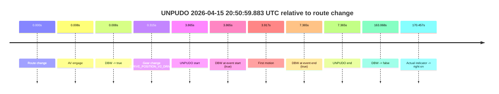
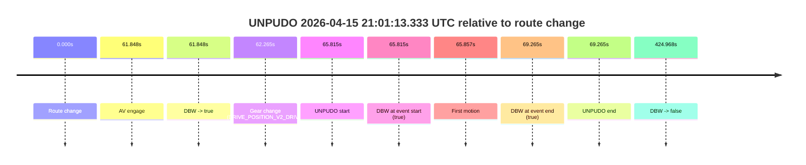
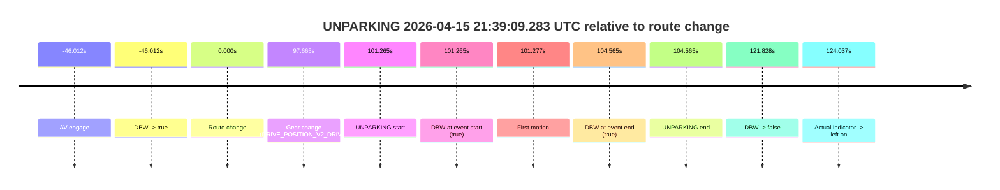

# Run Report: fme20031/2026-04-15--20-22-17--gen2-av-3a1fcd52-272e-4d90-b7f6-f003a622d594

| Field | Value |
|---|---|
| Run ID | `fme20031/2026-04-15--20-22-17--gen2-av-3a1fcd52-272e-4d90-b7f6-f003a622d594` |
| Date | `2026-04-15` |
| Model(s) | `eel-teal-outspoken` |
| Author | `zak` |
| Event count | `4` |

## unpudo 2026-04-15 20:42:00.783 UTC

| Field | Value |
|---|---|
| Model | `eel-teal-outspoken` |
| Author | `zak` |
| Run ID | `fme20031/2026-04-15--20-22-17--gen2-av-3a1fcd52-272e-4d90-b7f6-f003a622d594` |
| Date | `2026-04-15` |
| Time (UTC) | `20:42:00.783` |
| Event type | `unpudo` |
| Disengagement type | `none observed` |
| Route change | `found` |
| Console | [run](https://console.sso.wayve.ai/run/fme20031/2026-04-15--20-22-17--gen2-av-3a1fcd52-272e-4d90-b7f6-f003a622d594?id=&time-unixus=1776285720783307) |
| Foxglove | [segment](https://app.foxglove.dev/wayve-on-prem/p/prj_0dX18KZdVHg1fmmI/view?ds=foxglove-stream&ds.deviceName=fme20031&ds.start=2026-04-15T20%3A41%3A46.918248Z&ds.end=2026-04-15T20%3A42%3A38.206511Z&layoutId=lay_0e7VD4WIKDQGU73Y&time=2026-04-15T20%3A42%3A00.783307Z) |

### Event card: pass

- Pass: AV owns the credited unpudo from route change through the official unpudo window, the gear state is aligned at the anchor, and the vehicle moves without driver accelerator help in AV.

| Event | Time (UTC) | Delta from route change |
|---|---:|---:|
| Route change | 2026-04-15 20:41:56.918 | `0.000s` |
| AV engage | 2026-04-15 20:41:56.926 | `0.008s` |
| DBW -> true | 2026-04-15 20:41:56.926 | `0.008s` |
| Gear change (DRIVE_POSITION_V2_DRIVE) | 2026-04-15 20:41:57.233 | `0.315s` |
| UNPUDO start | 2026-04-15 20:42:00.783 | `3.865s` |
| DBW at event start (true) | 2026-04-15 20:42:00.783 | `3.865s` |
| First motion | 2026-04-15 20:42:00.834 | `3.917s` |
| DBW at event end (true) | 2026-04-15 20:42:04.783 | `7.865s` |
| UNPUDO end | 2026-04-15 20:42:04.783 | `7.865s` |
| DBW -> false | 2026-04-15 20:42:28.206 | `31.288s` |

| Metric | Value |
|---|---|
| Outcome | `pass` |
| Effective failure type | `none` |
| Route change status | `found` |
| DBW at event start | `true` |
| DBW at event end | `true` |
| Predicted gear at AV start | `DRIVE_POSITION_V2_PARK` |
| Actual gear at AV start | `DRIVE_POSITION_V2_PARK` |
| Predicted gear at event start | `DRIVE_POSITION_V2_DRIVE` |
| Actual gear at event start | `DRIVE_POSITION_V2_DRIVE` |
| Planned indicator direction | `INDICATORS_STATE_V2_LEFT_ON` |
| Controller indicator direction | `INDICATORS_STATE_V2_LEFT_ON` |
| Actual indicator direction | `INDICATORS_STATE_V2_OFF` |
| Actual indicator at maneuver end | `INDICATORS_STATE_V2_OFF` |
| Driver accel help in AV | `false` |
| Driver accel help timestamp | `n/a` |
| Max accel pedal pct in AV | `0.0%` |
| Max brake pedal pct in AV | `8.0%` |
| Max speed mps in AV | `4.325` |
| Success timing baseline | `route change` |
| Route -> AV | `0.008s` |
| AV -> event start | `3.857s` |
| AV -> first motion | `3.908s` |
| Success baseline -> event start | `3.865s` |
| Success baseline -> first motion | `3.917s` |
| AV duration before disengagement | `31.280s` |
| Trajectory waypoint count | `36` |
| Driving-plan step count | `11` |

The scored portion starts from the AV-owned window, not from the pre-AV setup. Route-change search in the stopped pre-event segment was `found`, with the baseline therefore set to route change. At the event anchor the model predicts `DRIVE_POSITION_V2_DRIVE` and the actual gear is `DRIVE_POSITION_V2_DRIVE`. The effective model outcome is `pass` because `the credited unpudo stays AV-owned through the official unpudo window.`

### Resolution

| Field | Value |
|---|---|
| Final outcome | `pass` |
| Do we agree with this label? | `yes` |
| Source disengagement type | `none observed` |
| Resolved effective failure type | `none` |
| Confidence | `high` |

## unpudo 2026-04-15 20:50:59.883 UTC

| Field | Value |
|---|---|
| Model | `eel-teal-outspoken` |
| Author | `zak` |
| Run ID | `fme20031/2026-04-15--20-22-17--gen2-av-3a1fcd52-272e-4d90-b7f6-f003a622d594` |
| Date | `2026-04-15` |
| Time (UTC) | `20:50:59.883` |
| Event type | `unpudo` |
| Disengagement type | `none observed` |
| Route change | `found` |
| Console | [run](https://console.sso.wayve.ai/run/fme20031/2026-04-15--20-22-17--gen2-av-3a1fcd52-272e-4d90-b7f6-f003a622d594?id=&time-unixus=1776286259883302) |
| Foxglove | [segment](https://app.foxglove.dev/wayve-on-prem/p/prj_0dX18KZdVHg1fmmI/view?ds=foxglove-stream&ds.deviceName=fme20031&ds.start=2026-04-15T20%3A50%3A46.018268Z&ds.end=2026-04-15T20%3A53%3A49.085807Z&layoutId=lay_0e7VD4WIKDQGU73Y&time=2026-04-15T20%3A50%3A59.883302Z) |

### Event card: pass

- Pass: AV owns the credited unpudo from route change through the official unpudo window, the gear state is aligned at the anchor, and the vehicle moves without driver accelerator help in AV.

| Event | Time (UTC) | Delta from route change |
|---|---:|---:|
| Route change | 2026-04-15 20:50:56.018 | `0.000s` |
| AV engage | 2026-04-15 20:50:56.026 | `0.008s` |
| DBW -> true | 2026-04-15 20:50:56.026 | `0.008s` |
| Gear change (DRIVE_POSITION_V2_DRIVE) | 2026-04-15 20:50:56.333 | `0.315s` |
| UNPUDO start | 2026-04-15 20:50:59.883 | `3.865s` |
| DBW at event start (true) | 2026-04-15 20:50:59.883 | `3.865s` |
| First motion | 2026-04-15 20:50:59.934 | `3.917s` |
| DBW at event end (true) | 2026-04-15 20:51:03.383 | `7.365s` |
| UNPUDO end | 2026-04-15 20:51:03.383 | `7.365s` |
| DBW -> false | 2026-04-15 20:53:39.085 | `163.068s` |
| Actual indicator -> right on | 2026-04-15 20:53:46.474 | `170.457s` |

| Metric | Value |
|---|---|
| Outcome | `pass` |
| Effective failure type | `none` |
| Route change status | `found` |
| DBW at event start | `true` |
| DBW at event end | `true` |
| Predicted gear at AV start | `DRIVE_POSITION_V2_PARK` |
| Actual gear at AV start | `DRIVE_POSITION_V2_PARK` |
| Predicted gear at event start | `DRIVE_POSITION_V2_DRIVE` |
| Actual gear at event start | `DRIVE_POSITION_V2_DRIVE` |
| Planned indicator direction | `INDICATORS_STATE_V2_RIGHT_ON` |
| Controller indicator direction | `INDICATORS_STATE_V2_RIGHT_ON` |
| Actual indicator direction | `INDICATORS_STATE_V2_OFF` |
| Actual indicator at maneuver end | `INDICATORS_STATE_V2_OFF` |
| Driver accel help in AV | `false` |
| Driver accel help timestamp | `n/a` |
| Max accel pedal pct in AV | `0.0%` |
| Max brake pedal pct in AV | `8.0%` |
| Max speed mps in AV | `4.489` |
| Success timing baseline | `route change` |
| Route -> AV | `0.008s` |
| AV -> event start | `3.857s` |
| AV -> first motion | `3.908s` |
| Success baseline -> event start | `3.865s` |
| Success baseline -> first motion | `3.917s` |
| AV duration before disengagement | `163.059s` |
| Trajectory waypoint count | `36` |
| Driving-plan step count | `11` |

The scored portion starts from the AV-owned window, not from the pre-AV setup. Route-change search in the stopped pre-event segment was `found`, with the baseline therefore set to route change. At the event anchor the model predicts `DRIVE_POSITION_V2_DRIVE` and the actual gear is `DRIVE_POSITION_V2_DRIVE`. The effective model outcome is `pass` because `the credited unpudo stays AV-owned through the official unpudo window.`

### Resolution

| Field | Value |
|---|---|
| Final outcome | `pass` |
| Do we agree with this label? | `yes` |
| Source disengagement type | `none observed` |
| Resolved effective failure type | `none` |
| Confidence | `high` |

## unpudo 2026-04-15 21:01:13.333 UTC

| Field | Value |
|---|---|
| Model | `eel-teal-outspoken` |
| Author | `zak` |
| Run ID | `fme20031/2026-04-15--20-22-17--gen2-av-3a1fcd52-272e-4d90-b7f6-f003a622d594` |
| Date | `2026-04-15` |
| Time (UTC) | `21:01:13.333` |
| Event type | `unpudo` |
| Disengagement type | `none observed` |
| Route change | `found` |
| Console | [run](https://console.sso.wayve.ai/run/fme20031/2026-04-15--20-22-17--gen2-av-3a1fcd52-272e-4d90-b7f6-f003a622d594?id=&time-unixus=1776286873333294) |
| Foxglove | [segment](https://app.foxglove.dev/wayve-on-prem/p/prj_0dX18KZdVHg1fmmI/view?ds=foxglove-stream&ds.deviceName=fme20031&ds.start=2026-04-15T20%3A59%3A57.518274Z&ds.end=2026-04-15T21%3A07%3A22.486333Z&layoutId=lay_0e7VD4WIKDQGU73Y&time=2026-04-15T21%3A01%3A13.333294Z) |

### Event card: pass

- Pass: AV owns the credited unpudo from route change through the official unpudo window, the gear state is aligned at the anchor, and the vehicle moves without driver accelerator help in AV.

| Event | Time (UTC) | Delta from route change |
|---|---:|---:|
| Route change | 2026-04-15 21:00:07.518 | `0.000s` |
| AV engage | 2026-04-15 21:01:09.366 | `61.848s` |
| DBW -> true | 2026-04-15 21:01:09.366 | `61.848s` |
| Gear change (DRIVE_POSITION_V2_DRIVE) | 2026-04-15 21:01:09.783 | `62.265s` |
| UNPUDO start | 2026-04-15 21:01:13.333 | `65.815s` |
| DBW at event start (true) | 2026-04-15 21:01:13.333 | `65.815s` |
| First motion | 2026-04-15 21:01:13.375 | `65.857s` |
| DBW at event end (true) | 2026-04-15 21:01:16.783 | `69.265s` |
| UNPUDO end | 2026-04-15 21:01:16.783 | `69.265s` |
| DBW -> false | 2026-04-15 21:07:12.486 | `424.968s` |

| Metric | Value |
|---|---|
| Outcome | `pass` |
| Effective failure type | `none` |
| Route change status | `found` |
| DBW at event start | `true` |
| DBW at event end | `true` |
| Predicted gear at AV start | `DRIVE_POSITION_V2_DRIVE` |
| Actual gear at AV start | `DRIVE_POSITION_V2_PARK` |
| Predicted gear at event start | `DRIVE_POSITION_V2_DRIVE` |
| Actual gear at event start | `DRIVE_POSITION_V2_DRIVE` |
| Planned indicator direction | `INDICATORS_STATE_V2_RIGHT_ON` |
| Controller indicator direction | `INDICATORS_STATE_V2_RIGHT_ON` |
| Actual indicator direction | `INDICATORS_STATE_V2_OFF` |
| Actual indicator at maneuver end | `INDICATORS_STATE_V2_OFF` |
| Driver accel help in AV | `false` |
| Driver accel help timestamp | `n/a` |
| Max accel pedal pct in AV | `0.0%` |
| Max brake pedal pct in AV | `8.0%` |
| Max speed mps in AV | `4.522` |
| Success timing baseline | `route change` |
| Route -> AV | `61.848s` |
| AV -> event start | `3.967s` |
| AV -> first motion | `4.009s` |
| Success baseline -> event start | `65.815s` |
| Success baseline -> first motion | `65.857s` |
| AV duration before disengagement | `363.120s` |
| Trajectory waypoint count | `37` |
| Driving-plan step count | `11` |

The scored portion starts from the AV-owned window, not from the pre-AV setup. Route-change search in the stopped pre-event segment was `found`, with the baseline therefore set to route change. At the event anchor the model predicts `DRIVE_POSITION_V2_DRIVE` and the actual gear is `DRIVE_POSITION_V2_DRIVE`. The effective model outcome is `pass` because `the credited unpudo stays AV-owned through the official unpudo window.`

### Resolution

| Field | Value |
|---|---|
| Final outcome | `pass` |
| Do we agree with this label? | `yes` |
| Source disengagement type | `none observed` |
| Resolved effective failure type | `none` |
| Confidence | `high` |

## unparking 2026-04-15 21:39:09.283 UTC

| Field | Value |
|---|---|
| Model | `eel-teal-outspoken` |
| Author | `zak` |
| Run ID | `fme20031/2026-04-15--20-22-17--gen2-av-3a1fcd52-272e-4d90-b7f6-f003a622d594` |
| Date | `2026-04-15` |
| Time (UTC) | `21:39:09.283` |
| Event type | `unparking` |
| Disengagement type | `none observed` |
| Route change | `found` |
| Console | [run](https://console.sso.wayve.ai/run/fme20031/2026-04-15--20-22-17--gen2-av-3a1fcd52-272e-4d90-b7f6-f003a622d594?id=&time-unixus=1776289149283304) |
| Foxglove | [segment](https://app.foxglove.dev/wayve-on-prem/p/prj_0dX18KZdVHg1fmmI/view?ds=foxglove-stream&ds.deviceName=fme20031&ds.start=2026-04-15T21%3A36%3A32.006370Z&ds.end=2026-04-15T21%3A39%3A39.846292Z&layoutId=lay_0e7VD4WIKDQGU73Y&time=2026-04-15T21%3A39%3A09.283304Z) |

### Event card: pass

- Pass: AV owns the credited unparking through the official event window, the gear state is aligned at the anchor, and the vehicle moves without driver accelerator help in AV.

| Event | Time (UTC) | Delta from route change |
|---|---:|---:|
| AV engage | 2026-04-15 21:36:42.006 | `-46.012s` |
| DBW -> true | 2026-04-15 21:36:42.006 | `-46.012s` |
| Route change | 2026-04-15 21:37:28.018 | `0.000s` |
| Gear change (DRIVE_POSITION_V2_DRIVE) | 2026-04-15 21:39:05.683 | `97.665s` |
| UNPARKING start | 2026-04-15 21:39:09.283 | `101.265s` |
| DBW at event start (true) | 2026-04-15 21:39:09.283 | `101.265s` |
| First motion | 2026-04-15 21:39:09.295 | `101.277s` |
| DBW at event end (true) | 2026-04-15 21:39:12.583 | `104.565s` |
| UNPARKING end | 2026-04-15 21:39:12.583 | `104.565s` |
| DBW -> false | 2026-04-15 21:39:29.846 | `121.828s` |
| Actual indicator -> left on | 2026-04-15 21:39:32.055 | `124.037s` |

| Metric | Value |
|---|---|
| Outcome | `pass` |
| Effective failure type | `none` |
| Route change status | `found` |
| DBW at event start | `true` |
| DBW at event end | `true` |
| Predicted gear at AV start | `DRIVE_POSITION_V2_DRIVE` |
| Actual gear at AV start | `DRIVE_POSITION_V2_DRIVE` |
| Predicted gear at event start | `DRIVE_POSITION_V2_DRIVE` |
| Actual gear at event start | `DRIVE_POSITION_V2_DRIVE` |
| Planned indicator direction | `INDICATORS_STATE_V2_RIGHT_ON` |
| Controller indicator direction | `INDICATORS_STATE_V2_RIGHT_ON` |
| Actual indicator direction | `INDICATORS_STATE_V2_OFF` |
| Actual indicator at maneuver end | `INDICATORS_STATE_V2_OFF` |
| Driver accel help in AV | `false` |
| Driver accel help timestamp | `n/a` |
| Max accel pedal pct in AV | `0.0%` |
| Max brake pedal pct in AV | `0.0%` |
| Max speed mps in AV | `5.358` |
| Success timing baseline | `AV start` |
| Route -> AV | `-46.012s` |
| AV -> event start | `147.277s` |
| AV -> first motion | `147.289s` |
| Success baseline -> event start | `147.277s` |
| Success baseline -> first motion | `147.289s` |
| AV duration before disengagement | `167.840s` |
| Trajectory waypoint count | `36` |
| Driving-plan step count | `11` |

The scored portion starts from the AV-owned window, not from the pre-AV setup. Route-change search in the stopped pre-event segment was `found`, with the baseline therefore set to route change. At the event anchor the model predicts `DRIVE_POSITION_V2_DRIVE` and the actual gear is `DRIVE_POSITION_V2_DRIVE`. The effective model outcome is `pass` because `the credited maneuver stays AV-owned through the official event end.`

### Resolution

| Field | Value |
|---|---|
| Final outcome | `pass` |
| Do we agree with this label? | `yes` |
| Source disengagement type | `none observed` |
| Resolved effective failure type | `none` |
| Confidence | `high` |
