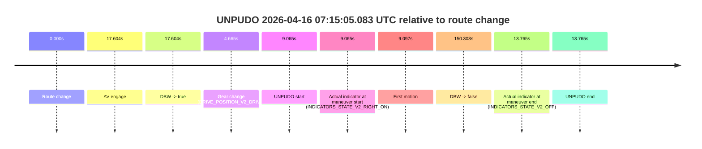
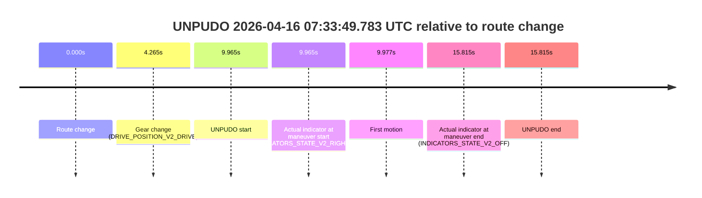

# Run Report: fme20031/2026-04-16--05-57-28--gen2-av-c118bd72-388e-4d69-9749-8dfee923313b

| Field | Value |
|---|---|
| Run ID | `fme20031/2026-04-16--05-57-28--gen2-av-c118bd72-388e-4d69-9749-8dfee923313b` |
| Date | `2026-04-16` |
| Model(s) | `plum-timeless-beaver` |
| Author | `peng.tang` |
| Event count | `10` |

## unpudo 2026-04-16 06:07:11.283 UTC

| Field | Value |
|---|---|
| Model | `plum-timeless-beaver` |
| Author | `peng.tang` |
| Run ID | `fme20031/2026-04-16--05-57-28--gen2-av-c118bd72-388e-4d69-9749-8dfee923313b` |
| Date | `2026-04-16` |
| Time (UTC) | `06:07:11.283` |
| Event type | `unpudo` |
| Disengagement type | `failed_to_unpudo` |
| Route change | `found` |
| Console | [run](https://console.sso.wayve.ai/run/fme20031/2026-04-16--05-57-28--gen2-av-c118bd72-388e-4d69-9749-8dfee923313b?id=&time-unixus=1776319631283298) |
| Foxglove | [segment](https://app.foxglove.dev/wayve-on-prem/p/prj_0dX18KZdVHg1fmmI/view?ds=foxglove-stream&ds.deviceName=fme20031&ds.start=2026-04-16T06%3A06%3A47.168292Z&ds.end=2026-04-16T06%3A10%3A13.362178Z&layoutId=lay_0e7VD4WIKDQGU73Y&time=2026-04-16T06%3A07%3A11.283298Z) |

### Event card: accidental

- Accidental: AV ownership is present for less than `2s`, so this is treated as an accidental brush with the maneuver rather than a meaningful model attempt.

| Event | Time (UTC) | Delta from route change |
|---|---:|---:|
| Route change | 2026-04-16 06:06:57.168 | `0.000s` |
| AV engage | 2026-04-16 06:07:41.161 | `43.994s` |
| DBW -> true | 2026-04-16 06:07:41.161 | `43.994s` |
| Gear change (DRIVE_POSITION_V2_DRIVE) | 2026-04-16 06:07:02.533 | `5.365s` |
| UNPUDO start | 2026-04-16 06:07:11.283 | `14.115s` |
| Actual indicator at maneuver start (INDICATORS_STATE_V2_RIGHT_ON) | 2026-04-16 06:07:11.283 | `14.115s` |
| First motion | 2026-04-16 06:07:11.314 | `14.147s` |
| DBW -> false | 2026-04-16 06:10:03.362 | `186.194s` |
| Actual indicator at maneuver end (INDICATORS_STATE_V2_LEFT_ON) | 2026-04-16 06:07:30.233 | `33.065s` |
| UNPUDO end | 2026-04-16 06:07:30.233 | `33.065s` |

| Metric | Value |
|---|---|
| Outcome | `accidental` |
| Effective failure type | `none` |
| Route change status | `found` |
| DBW at event start | `false` |
| DBW at event end | `false` |
| Predicted gear at AV start | `DRIVE_POSITION_V2_DRIVE` |
| Actual gear at AV start | `DRIVE_POSITION_V2_DRIVE` |
| Predicted gear at event start | `DRIVE_POSITION_V2_DRIVE` |
| Actual gear at event start | `DRIVE_POSITION_V2_DRIVE` |
| Planned indicator direction | `INDICATORS_STATE_V2_RIGHT_ON` |
| Controller indicator direction | `INDICATORS_STATE_V2_RIGHT_ON` |
| Actual indicator direction | `INDICATORS_STATE_V2_RIGHT_ON` |
| Actual indicator at maneuver end | `INDICATORS_STATE_V2_LEFT_ON` |
| Driver accel help in AV | `false` |
| Driver accel help timestamp | `n/a` |
| Max accel pedal pct in AV | `0.0%` |
| Max brake pedal pct in AV | `0.0%` |
| Max speed mps in AV | `0.000` |
| Route -> AV | `43.994s` |
| AV -> event start | `-29.879s` |
| AV -> first motion | `-29.847s` |
| AV duration before disengagement | `142.200s` |
| Trajectory waypoint count | `37` |
| Driving-plan step count | `11` |

The scored portion starts from the AV-owned window, not from the pre-AV setup. Route-change search in the stopped pre-event segment was `found`, with the baseline therefore set to route change. At the event anchor the model predicts `DRIVE_POSITION_V2_DRIVE` and the actual gear is `DRIVE_POSITION_V2_DRIVE`. The effective model outcome is `accidental` because `the AV-owned portion is shorter than 2s`.

### Resolution

| Field | Value |
|---|---|
| Final outcome | `accidental` |
| Do we agree with this label? | `yes` |
| Source disengagement type | `failed_to_unpudo` |
| Resolved effective failure type | `none` |
| Confidence | `high` |

## unpudo 2026-04-16 06:36:53.333 UTC

| Field | Value |
|---|---|
| Model | `plum-timeless-beaver` |
| Author | `peng.tang` |
| Run ID | `fme20031/2026-04-16--05-57-28--gen2-av-c118bd72-388e-4d69-9749-8dfee923313b` |
| Date | `2026-04-16` |
| Time (UTC) | `06:36:53.333` |
| Event type | `unpudo` |
| Disengagement type | `failed_to_unpudo` |
| Route change | `found` |
| Console | [run](https://console.sso.wayve.ai/run/fme20031/2026-04-16--05-57-28--gen2-av-c118bd72-388e-4d69-9749-8dfee923313b?id=&time-unixus=1776321413333305) |
| Foxglove | [segment](https://app.foxglove.dev/wayve-on-prem/p/prj_0dX18KZdVHg1fmmI/view?ds=foxglove-stream&ds.deviceName=fme20031&ds.start=2026-04-16T06%3A36%3A30.418289Z&ds.end=2026-04-16T06%3A46%3A01.780749Z&layoutId=lay_0e7VD4WIKDQGU73Y&time=2026-04-16T06%3A36%3A53.333305Z) |

### Event card: accidental

- Accidental: AV ownership is present for less than `2s`, so this is treated as an accidental brush with the maneuver rather than a meaningful model attempt.

| Event | Time (UTC) | Delta from route change |
|---|---:|---:|
| Route change | 2026-04-16 06:36:40.418 | `0.000s` |
| AV engage | 2026-04-16 06:37:14.441 | `34.023s` |
| DBW -> true | 2026-04-16 06:37:14.441 | `34.023s` |
| Gear change (DRIVE_POSITION_V2_DRIVE) | 2026-04-16 06:36:43.983 | `3.565s` |
| UNPUDO start | 2026-04-16 06:36:53.333 | `12.915s` |
| Actual indicator at maneuver start (INDICATORS_STATE_V2_RIGHT_ON) | 2026-04-16 06:36:53.333 | `12.915s` |
| First motion | 2026-04-16 06:36:53.415 | `12.997s` |
| DBW -> false | 2026-04-16 06:45:51.780 | `551.362s` |
| Actual indicator at maneuver end (INDICATORS_STATE_V2_OFF) | 2026-04-16 06:37:03.083 | `22.665s` |
| UNPUDO end | 2026-04-16 06:37:03.083 | `22.665s` |

| Metric | Value |
|---|---|
| Outcome | `accidental` |
| Effective failure type | `none` |
| Route change status | `found` |
| DBW at event start | `false` |
| DBW at event end | `false` |
| Predicted gear at AV start | `DRIVE_POSITION_V2_DRIVE` |
| Actual gear at AV start | `DRIVE_POSITION_V2_DRIVE` |
| Predicted gear at event start | `DRIVE_POSITION_V2_DRIVE` |
| Actual gear at event start | `DRIVE_POSITION_V2_DRIVE` |
| Planned indicator direction | `INDICATORS_STATE_V2_RIGHT_ON` |
| Controller indicator direction | `INDICATORS_STATE_V2_RIGHT_ON` |
| Actual indicator direction | `INDICATORS_STATE_V2_RIGHT_ON` |
| Actual indicator at maneuver end | `INDICATORS_STATE_V2_OFF` |
| Driver accel help in AV | `false` |
| Driver accel help timestamp | `n/a` |
| Max accel pedal pct in AV | `0.0%` |
| Max brake pedal pct in AV | `0.0%` |
| Max speed mps in AV | `0.000` |
| Route -> AV | `34.023s` |
| AV -> event start | `-21.108s` |
| AV -> first motion | `-21.026s` |
| AV duration before disengagement | `517.339s` |
| Trajectory waypoint count | `36` |
| Driving-plan step count | `11` |

The scored portion starts from the AV-owned window, not from the pre-AV setup. Route-change search in the stopped pre-event segment was `found`, with the baseline therefore set to route change. At the event anchor the model predicts `DRIVE_POSITION_V2_DRIVE` and the actual gear is `DRIVE_POSITION_V2_DRIVE`. The effective model outcome is `accidental` because `the AV-owned portion is shorter than 2s`.

### Resolution

| Field | Value |
|---|---|
| Final outcome | `accidental` |
| Do we agree with this label? | `yes` |
| Source disengagement type | `failed_to_unpudo` |
| Resolved effective failure type | `none` |
| Confidence | `high` |

## unpudo 2026-04-16 06:46:53.133 UTC

| Field | Value |
|---|---|
| Model | `plum-timeless-beaver` |
| Author | `peng.tang` |
| Run ID | `fme20031/2026-04-16--05-57-28--gen2-av-c118bd72-388e-4d69-9749-8dfee923313b` |
| Date | `2026-04-16` |
| Time (UTC) | `06:46:53.133` |
| Event type | `unpudo` |
| Disengagement type | `failed_to_unpudo` |
| Route change | `found` |
| Console | [run](https://console.sso.wayve.ai/run/fme20031/2026-04-16--05-57-28--gen2-av-c118bd72-388e-4d69-9749-8dfee923313b?id=&time-unixus=1776322013133301) |
| Foxglove | [segment](https://app.foxglove.dev/wayve-on-prem/p/prj_0dX18KZdVHg1fmmI/view?ds=foxglove-stream&ds.deviceName=fme20031&ds.start=2026-04-16T06%3A46%3A28.568271Z&ds.end=2026-04-16T06%3A51%3A31.242073Z&layoutId=lay_0e7VD4WIKDQGU73Y&time=2026-04-16T06%3A46%3A53.133301Z) |

### Event card: accidental

- Accidental: AV ownership is present for less than `2s`, so this is treated as an accidental brush with the maneuver rather than a meaningful model attempt.

| Event | Time (UTC) | Delta from route change |
|---|---:|---:|
| Route change | 2026-04-16 06:46:38.568 | `0.000s` |
| AV engage | 2026-04-16 06:46:59.040 | `20.472s` |
| DBW -> true | 2026-04-16 06:46:59.040 | `20.472s` |
| Gear change (DRIVE_POSITION_V2_DRIVE) | 2026-04-16 06:46:43.283 | `4.715s` |
| UNPUDO start | 2026-04-16 06:46:53.133 | `14.565s` |
| Actual indicator at maneuver start (INDICATORS_STATE_V2_RIGHT_ON) | 2026-04-16 06:46:53.133 | `14.565s` |
| First motion | 2026-04-16 06:46:53.174 | `14.607s` |
| DBW -> false | 2026-04-16 06:51:21.242 | `282.674s` |
| Actual indicator at maneuver end (INDICATORS_STATE_V2_OFF) | 2026-04-16 06:46:57.083 | `18.515s` |
| UNPUDO end | 2026-04-16 06:46:57.083 | `18.515s` |

| Metric | Value |
|---|---|
| Outcome | `accidental` |
| Effective failure type | `none` |
| Route change status | `found` |
| DBW at event start | `false` |
| DBW at event end | `false` |
| Predicted gear at AV start | `DRIVE_POSITION_V2_DRIVE` |
| Actual gear at AV start | `DRIVE_POSITION_V2_DRIVE` |
| Predicted gear at event start | `DRIVE_POSITION_V2_DRIVE` |
| Actual gear at event start | `DRIVE_POSITION_V2_DRIVE` |
| Planned indicator direction | `INDICATORS_STATE_V2_LEFT_ON` |
| Controller indicator direction | `INDICATORS_STATE_V2_LEFT_ON` |
| Actual indicator direction | `INDICATORS_STATE_V2_RIGHT_ON` |
| Actual indicator at maneuver end | `INDICATORS_STATE_V2_OFF` |
| Driver accel help in AV | `false` |
| Driver accel help timestamp | `n/a` |
| Max accel pedal pct in AV | `0.0%` |
| Max brake pedal pct in AV | `0.0%` |
| Max speed mps in AV | `0.000` |
| Route -> AV | `20.472s` |
| AV -> event start | `-5.907s` |
| AV -> first motion | `-5.866s` |
| AV duration before disengagement | `262.201s` |
| Trajectory waypoint count | `38` |
| Driving-plan step count | `11` |

The scored portion starts from the AV-owned window, not from the pre-AV setup. Route-change search in the stopped pre-event segment was `found`, with the baseline therefore set to route change. At the event anchor the model predicts `DRIVE_POSITION_V2_DRIVE` and the actual gear is `DRIVE_POSITION_V2_DRIVE`. The effective model outcome is `accidental` because `the AV-owned portion is shorter than 2s`.

### Resolution

| Field | Value |
|---|---|
| Final outcome | `accidental` |
| Do we agree with this label? | `yes` |
| Source disengagement type | `failed_to_unpudo` |
| Resolved effective failure type | `none` |
| Confidence | `high` |

## unpudo 2026-04-16 06:51:52.533 UTC

| Field | Value |
|---|---|
| Model | `plum-timeless-beaver` |
| Author | `peng.tang` |
| Run ID | `fme20031/2026-04-16--05-57-28--gen2-av-c118bd72-388e-4d69-9749-8dfee923313b` |
| Date | `2026-04-16` |
| Time (UTC) | `06:51:52.533` |
| Event type | `unpudo` |
| Disengagement type | `failed_to_unpudo` |
| Route change | `found` |
| Console | [run](https://console.sso.wayve.ai/run/fme20031/2026-04-16--05-57-28--gen2-av-c118bd72-388e-4d69-9749-8dfee923313b?id=&time-unixus=1776322312533319) |
| Foxglove | [segment](https://app.foxglove.dev/wayve-on-prem/p/prj_0dX18KZdVHg1fmmI/view?ds=foxglove-stream&ds.deviceName=fme20031&ds.start=2026-04-16T06%3A51%3A32.968257Z&ds.end=2026-04-16T06%3A53%3A53.500828Z&layoutId=lay_0e7VD4WIKDQGU73Y&time=2026-04-16T06%3A51%3A52.533319Z) |

### Event card: accidental

- Accidental: AV ownership is present for less than `2s`, so this is treated as an accidental brush with the maneuver rather than a meaningful model attempt.

| Event | Time (UTC) | Delta from route change |
|---|---:|---:|
| Route change | 2026-04-16 06:51:42.968 | `0.000s` |
| AV engage | 2026-04-16 06:52:00.802 | `17.834s` |
| DBW -> true | 2026-04-16 06:52:00.802 | `17.834s` |
| Gear change (DRIVE_POSITION_V2_DRIVE) | 2026-04-16 06:51:45.683 | `2.715s` |
| UNPUDO start | 2026-04-16 06:51:52.533 | `9.565s` |
| Actual indicator at maneuver start (INDICATORS_STATE_V2_RIGHT_ON) | 2026-04-16 06:51:52.533 | `9.565s` |
| First motion | 2026-04-16 06:51:52.595 | `9.627s` |
| DBW -> false | 2026-04-16 06:53:43.500 | `120.533s` |
| Actual indicator at maneuver end (INDICATORS_STATE_V2_OFF) | 2026-04-16 06:51:57.133 | `14.165s` |
| UNPUDO end | 2026-04-16 06:51:57.133 | `14.165s` |

| Metric | Value |
|---|---|
| Outcome | `accidental` |
| Effective failure type | `none` |
| Route change status | `found` |
| DBW at event start | `false` |
| DBW at event end | `false` |
| Predicted gear at AV start | `DRIVE_POSITION_V2_DRIVE` |
| Actual gear at AV start | `DRIVE_POSITION_V2_DRIVE` |
| Predicted gear at event start | `DRIVE_POSITION_V2_DRIVE` |
| Actual gear at event start | `DRIVE_POSITION_V2_DRIVE` |
| Planned indicator direction | `INDICATORS_STATE_V2_RIGHT_ON` |
| Controller indicator direction | `INDICATORS_STATE_V2_RIGHT_ON` |
| Actual indicator direction | `INDICATORS_STATE_V2_RIGHT_ON` |
| Actual indicator at maneuver end | `INDICATORS_STATE_V2_OFF` |
| Driver accel help in AV | `false` |
| Driver accel help timestamp | `n/a` |
| Max accel pedal pct in AV | `0.0%` |
| Max brake pedal pct in AV | `0.0%` |
| Max speed mps in AV | `0.000` |
| Route -> AV | `17.834s` |
| AV -> event start | `-8.269s` |
| AV -> first motion | `-8.207s` |
| AV duration before disengagement | `102.699s` |
| Trajectory waypoint count | `36` |
| Driving-plan step count | `11` |

The scored portion starts from the AV-owned window, not from the pre-AV setup. Route-change search in the stopped pre-event segment was `found`, with the baseline therefore set to route change. At the event anchor the model predicts `DRIVE_POSITION_V2_DRIVE` and the actual gear is `DRIVE_POSITION_V2_DRIVE`. The effective model outcome is `accidental` because `the AV-owned portion is shorter than 2s`.

### Resolution

| Field | Value |
|---|---|
| Final outcome | `accidental` |
| Do we agree with this label? | `yes` |
| Source disengagement type | `failed_to_unpudo` |
| Resolved effective failure type | `none` |
| Confidence | `high` |

## unpudo 2026-04-16 07:15:05.083 UTC

| Field | Value |
|---|---|
| Model | `plum-timeless-beaver` |
| Author | `peng.tang` |
| Run ID | `fme20031/2026-04-16--05-57-28--gen2-av-c118bd72-388e-4d69-9749-8dfee923313b` |
| Date | `2026-04-16` |
| Time (UTC) | `07:15:05.083` |
| Event type | `unpudo` |
| Disengagement type | `failed_to_unpudo` |
| Route change | `found` |
| Console | [run](https://console.sso.wayve.ai/run/fme20031/2026-04-16--05-57-28--gen2-av-c118bd72-388e-4d69-9749-8dfee923313b?id=&time-unixus=1776323705083291) |
| Foxglove | [segment](https://app.foxglove.dev/wayve-on-prem/p/prj_0dX18KZdVHg1fmmI/view?ds=foxglove-stream&ds.deviceName=fme20031&ds.start=2026-04-16T07%3A14%3A46.018261Z&ds.end=2026-04-16T07%3A17%3A36.321074Z&layoutId=lay_0e7VD4WIKDQGU73Y&time=2026-04-16T07%3A15%3A05.083291Z) |

### Event card: accidental

- Accidental: AV ownership is present for less than `2s`, so this is treated as an accidental brush with the maneuver rather than a meaningful model attempt.

| Event | Time (UTC) | Delta from route change |
|---|---:|---:|
| Route change | 2026-04-16 07:14:56.018 | `0.000s` |
| AV engage | 2026-04-16 07:15:13.621 | `17.604s` |
| DBW -> true | 2026-04-16 07:15:13.621 | `17.604s` |
| Gear change (DRIVE_POSITION_V2_DRIVE) | 2026-04-16 07:15:00.683 | `4.665s` |
| UNPUDO start | 2026-04-16 07:15:05.083 | `9.065s` |
| Actual indicator at maneuver start (INDICATORS_STATE_V2_RIGHT_ON) | 2026-04-16 07:15:05.083 | `9.065s` |
| First motion | 2026-04-16 07:15:05.114 | `9.097s` |
| DBW -> false | 2026-04-16 07:17:26.321 | `150.303s` |
| Actual indicator at maneuver end (INDICATORS_STATE_V2_OFF) | 2026-04-16 07:15:09.783 | `13.765s` |
| UNPUDO end | 2026-04-16 07:15:09.783 | `13.765s` |

| Metric | Value |
|---|---|
| Outcome | `accidental` |
| Effective failure type | `none` |
| Route change status | `found` |
| DBW at event start | `false` |
| DBW at event end | `false` |
| Predicted gear at AV start | `DRIVE_POSITION_V2_DRIVE` |
| Actual gear at AV start | `DRIVE_POSITION_V2_DRIVE` |
| Predicted gear at event start | `DRIVE_POSITION_V2_DRIVE` |
| Actual gear at event start | `DRIVE_POSITION_V2_DRIVE` |
| Planned indicator direction | `INDICATORS_STATE_V2_RIGHT_ON` |
| Controller indicator direction | `INDICATORS_STATE_V2_RIGHT_ON` |
| Actual indicator direction | `INDICATORS_STATE_V2_RIGHT_ON` |
| Actual indicator at maneuver end | `INDICATORS_STATE_V2_OFF` |
| Driver accel help in AV | `false` |
| Driver accel help timestamp | `n/a` |
| Max accel pedal pct in AV | `0.0%` |
| Max brake pedal pct in AV | `0.0%` |
| Max speed mps in AV | `0.000` |
| Route -> AV | `17.604s` |
| AV -> event start | `-8.539s` |
| AV -> first motion | `-8.507s` |
| AV duration before disengagement | `132.699s` |
| Trajectory waypoint count | `37` |
| Driving-plan step count | `11` |

The scored portion starts from the AV-owned window, not from the pre-AV setup. Route-change search in the stopped pre-event segment was `found`, with the baseline therefore set to route change. At the event anchor the model predicts `DRIVE_POSITION_V2_DRIVE` and the actual gear is `DRIVE_POSITION_V2_DRIVE`. The effective model outcome is `accidental` because `the AV-owned portion is shorter than 2s`.

### Resolution

| Field | Value |
|---|---|
| Final outcome | `accidental` |
| Do we agree with this label? | `yes` |
| Source disengagement type | `failed_to_unpudo` |
| Resolved effective failure type | `none` |
| Confidence | `high` |

## unpudo 2026-04-16 07:18:08.933 UTC

| Field | Value |
|---|---|
| Model | `plum-timeless-beaver` |
| Author | `peng.tang` |
| Run ID | `fme20031/2026-04-16--05-57-28--gen2-av-c118bd72-388e-4d69-9749-8dfee923313b` |
| Date | `2026-04-16` |
| Time (UTC) | `07:18:08.933` |
| Event type | `unpudo` |
| Disengagement type | `failed_to_unpudo` |
| Route change | `found` |
| Console | [run](https://console.sso.wayve.ai/run/fme20031/2026-04-16--05-57-28--gen2-av-c118bd72-388e-4d69-9749-8dfee923313b?id=&time-unixus=1776323888933324) |
| Foxglove | [segment](https://app.foxglove.dev/wayve-on-prem/p/prj_0dX18KZdVHg1fmmI/view?ds=foxglove-stream&ds.deviceName=fme20031&ds.start=2026-04-16T07%3A17%3A46.218258Z&ds.end=2026-04-16T07%3A22%3A53.422151Z&layoutId=lay_0e7VD4WIKDQGU73Y&time=2026-04-16T07%3A18%3A08.933324Z) |

### Event card: accidental

- Accidental: AV ownership is present for less than `2s`, so this is treated as an accidental brush with the maneuver rather than a meaningful model attempt.

| Event | Time (UTC) | Delta from route change |
|---|---:|---:|
| Route change | 2026-04-16 07:17:56.218 | `0.000s` |
| AV engage | 2026-04-16 07:18:21.322 | `25.104s` |
| DBW -> true | 2026-04-16 07:18:21.322 | `25.104s` |
| Gear change (DRIVE_POSITION_V2_DRIVE) | 2026-04-16 07:17:58.833 | `2.615s` |
| UNPUDO start | 2026-04-16 07:18:08.933 | `12.715s` |
| Actual indicator at maneuver start (INDICATORS_STATE_V2_RIGHT_ON) | 2026-04-16 07:18:08.933 | `12.715s` |
| First motion | 2026-04-16 07:18:08.974 | `12.757s` |
| DBW -> false | 2026-04-16 07:22:43.422 | `287.204s` |
| Actual indicator at maneuver end (INDICATORS_STATE_V2_OFF) | 2026-04-16 07:18:13.633 | `17.415s` |
| UNPUDO end | 2026-04-16 07:18:13.633 | `17.415s` |

| Metric | Value |
|---|---|
| Outcome | `accidental` |
| Effective failure type | `none` |
| Route change status | `found` |
| DBW at event start | `false` |
| DBW at event end | `false` |
| Predicted gear at AV start | `DRIVE_POSITION_V2_DRIVE` |
| Actual gear at AV start | `DRIVE_POSITION_V2_DRIVE` |
| Predicted gear at event start | `DRIVE_POSITION_V2_DRIVE` |
| Actual gear at event start | `DRIVE_POSITION_V2_DRIVE` |
| Planned indicator direction | `INDICATORS_STATE_V2_LEFT_ON` |
| Controller indicator direction | `INDICATORS_STATE_V2_LEFT_ON` |
| Actual indicator direction | `INDICATORS_STATE_V2_RIGHT_ON` |
| Actual indicator at maneuver end | `INDICATORS_STATE_V2_OFF` |
| Driver accel help in AV | `false` |
| Driver accel help timestamp | `n/a` |
| Max accel pedal pct in AV | `0.0%` |
| Max brake pedal pct in AV | `0.0%` |
| Max speed mps in AV | `0.000` |
| Route -> AV | `25.104s` |
| AV -> event start | `-12.389s` |
| AV -> first motion | `-12.347s` |
| AV duration before disengagement | `262.100s` |
| Trajectory waypoint count | `36` |
| Driving-plan step count | `11` |

The scored portion starts from the AV-owned window, not from the pre-AV setup. Route-change search in the stopped pre-event segment was `found`, with the baseline therefore set to route change. At the event anchor the model predicts `DRIVE_POSITION_V2_DRIVE` and the actual gear is `DRIVE_POSITION_V2_DRIVE`. The effective model outcome is `accidental` because `the AV-owned portion is shorter than 2s`.

### Resolution

| Field | Value |
|---|---|
| Final outcome | `accidental` |
| Do we agree with this label? | `yes` |
| Source disengagement type | `failed_to_unpudo` |
| Resolved effective failure type | `none` |
| Confidence | `high` |

## unpudo 2026-04-16 07:22:43.983 UTC

| Field | Value |
|---|---|
| Model | `plum-timeless-beaver` |
| Author | `peng.tang` |
| Run ID | `fme20031/2026-04-16--05-57-28--gen2-av-c118bd72-388e-4d69-9749-8dfee923313b` |
| Date | `2026-04-16` |
| Time (UTC) | `07:22:43.983` |
| Event type | `unpudo` |
| Disengagement type | `failed_to_unpudo` |
| Route change | `found` |
| Console | [run](https://console.sso.wayve.ai/run/fme20031/2026-04-16--05-57-28--gen2-av-c118bd72-388e-4d69-9749-8dfee923313b?id=&time-unixus=1776324163983301) |
| Foxglove | [segment](https://app.foxglove.dev/wayve-on-prem/p/prj_0dX18KZdVHg1fmmI/view?ds=foxglove-stream&ds.deviceName=fme20031&ds.start=2026-04-16T07%3A20%3A59.768248Z&ds.end=2026-04-16T07%3A23%3A08.880781Z&layoutId=lay_0e7VD4WIKDQGU73Y&time=2026-04-16T07%3A22%3A43.983301Z) |

### Event card: accidental

- Accidental: AV ownership is present for less than `2s`, so this is treated as an accidental brush with the maneuver rather than a meaningful model attempt.

| Event | Time (UTC) | Delta from route change |
|---|---:|---:|
| Route change | 2026-04-16 07:21:09.768 | `0.000s` |
| AV engage | 2026-04-16 07:22:49.640 | `99.872s` |
| DBW -> true | 2026-04-16 07:22:49.640 | `99.872s` |
| Gear change (DRIVE_POSITION_V2_DRIVE) | 2026-04-16 07:22:36.483 | `86.715s` |
| UNPUDO start | 2026-04-16 07:22:43.983 | `94.215s` |
| Actual indicator at maneuver start (INDICATORS_STATE_V2_OFF) | 2026-04-16 07:22:43.983 | `94.215s` |
| First motion | 2026-04-16 07:22:44.015 | `94.247s` |
| DBW -> false | 2026-04-16 07:22:58.880 | `109.113s` |
| Actual indicator at maneuver end (INDICATORS_STATE_V2_OFF) | 2026-04-16 07:22:47.683 | `97.915s` |
| UNPUDO end | 2026-04-16 07:22:47.683 | `97.915s` |

| Metric | Value |
|---|---|
| Outcome | `accidental` |
| Effective failure type | `none` |
| Route change status | `found` |
| DBW at event start | `false` |
| DBW at event end | `false` |
| Predicted gear at AV start | `DRIVE_POSITION_V2_DRIVE` |
| Actual gear at AV start | `DRIVE_POSITION_V2_DRIVE` |
| Predicted gear at event start | `DRIVE_POSITION_V2_DRIVE` |
| Actual gear at event start | `DRIVE_POSITION_V2_DRIVE` |
| Planned indicator direction | `INDICATORS_STATE_V2_LEFT_ON` |
| Controller indicator direction | `INDICATORS_STATE_V2_LEFT_ON` |
| Actual indicator direction | `INDICATORS_STATE_V2_OFF` |
| Actual indicator at maneuver end | `INDICATORS_STATE_V2_OFF` |
| Driver accel help in AV | `false` |
| Driver accel help timestamp | `n/a` |
| Max accel pedal pct in AV | `0.0%` |
| Max brake pedal pct in AV | `0.0%` |
| Max speed mps in AV | `0.000` |
| Route -> AV | `99.872s` |
| AV -> event start | `-5.657s` |
| AV -> first motion | `-5.625s` |
| AV duration before disengagement | `9.240s` |
| Trajectory waypoint count | `37` |
| Driving-plan step count | `11` |

The scored portion starts from the AV-owned window, not from the pre-AV setup. Route-change search in the stopped pre-event segment was `found`, with the baseline therefore set to route change. At the event anchor the model predicts `DRIVE_POSITION_V2_DRIVE` and the actual gear is `DRIVE_POSITION_V2_DRIVE`. The effective model outcome is `accidental` because `the AV-owned portion is shorter than 2s`.

### Resolution

| Field | Value |
|---|---|
| Final outcome | `accidental` |
| Do we agree with this label? | `yes` |
| Source disengagement type | `failed_to_unpudo` |
| Resolved effective failure type | `none` |
| Confidence | `high` |

## unpudo 2026-04-16 07:29:43.083 UTC

| Field | Value |
|---|---|
| Model | `plum-timeless-beaver` |
| Author | `peng.tang` |
| Run ID | `fme20031/2026-04-16--05-57-28--gen2-av-c118bd72-388e-4d69-9749-8dfee923313b` |
| Date | `2026-04-16` |
| Time (UTC) | `07:29:43.083` |
| Event type | `unpudo` |
| Disengagement type | `failed_to_unpudo` |
| Route change | `found` |
| Console | [run](https://console.sso.wayve.ai/run/fme20031/2026-04-16--05-57-28--gen2-av-c118bd72-388e-4d69-9749-8dfee923313b?id=&time-unixus=1776324583083296) |
| Foxglove | [segment](https://app.foxglove.dev/wayve-on-prem/p/prj_0dX18KZdVHg1fmmI/view?ds=foxglove-stream&ds.deviceName=fme20031&ds.start=2026-04-16T07%3A29%3A16.868297Z&ds.end=2026-04-16T07%3A32%3A57.940899Z&layoutId=lay_0e7VD4WIKDQGU73Y&time=2026-04-16T07%3A29%3A43.083296Z) |

### Event card: accidental

- Accidental: AV ownership is present for less than `2s`, so this is treated as an accidental brush with the maneuver rather than a meaningful model attempt.

| Event | Time (UTC) | Delta from route change |
|---|---:|---:|
| Route change | 2026-04-16 07:29:26.868 | `0.000s` |
| AV engage | 2026-04-16 07:29:54.242 | `27.374s` |
| DBW -> true | 2026-04-16 07:29:54.242 | `27.374s` |
| Gear change (DRIVE_POSITION_V2_DRIVE) | 2026-04-16 07:29:30.383 | `3.515s` |
| UNPUDO start | 2026-04-16 07:29:43.083 | `16.215s` |
| Actual indicator at maneuver start (INDICATORS_STATE_V2_OFF) | 2026-04-16 07:29:43.083 | `16.215s` |
| First motion | 2026-04-16 07:29:43.194 | `16.327s` |
| DBW -> false | 2026-04-16 07:32:47.940 | `201.073s` |
| Actual indicator at maneuver end (INDICATORS_STATE_V2_OFF) | 2026-04-16 07:29:49.183 | `22.315s` |
| UNPUDO end | 2026-04-16 07:29:49.183 | `22.315s` |

| Metric | Value |
|---|---|
| Outcome | `accidental` |
| Effective failure type | `none` |
| Route change status | `found` |
| DBW at event start | `false` |
| DBW at event end | `false` |
| Predicted gear at AV start | `DRIVE_POSITION_V2_DRIVE` |
| Actual gear at AV start | `DRIVE_POSITION_V2_DRIVE` |
| Predicted gear at event start | `DRIVE_POSITION_V2_DRIVE` |
| Actual gear at event start | `DRIVE_POSITION_V2_DRIVE` |
| Planned indicator direction | `INDICATORS_STATE_V2_RIGHT_ON` |
| Controller indicator direction | `INDICATORS_STATE_V2_RIGHT_ON` |
| Actual indicator direction | `INDICATORS_STATE_V2_OFF` |
| Actual indicator at maneuver end | `INDICATORS_STATE_V2_OFF` |
| Driver accel help in AV | `false` |
| Driver accel help timestamp | `n/a` |
| Max accel pedal pct in AV | `0.0%` |
| Max brake pedal pct in AV | `0.0%` |
| Max speed mps in AV | `0.000` |
| Route -> AV | `27.374s` |
| AV -> event start | `-11.159s` |
| AV -> first motion | `-11.047s` |
| AV duration before disengagement | `173.699s` |
| Trajectory waypoint count | `37` |
| Driving-plan step count | `11` |

The scored portion starts from the AV-owned window, not from the pre-AV setup. Route-change search in the stopped pre-event segment was `found`, with the baseline therefore set to route change. At the event anchor the model predicts `DRIVE_POSITION_V2_DRIVE` and the actual gear is `DRIVE_POSITION_V2_DRIVE`. The effective model outcome is `accidental` because `the AV-owned portion is shorter than 2s`.

### Resolution

| Field | Value |
|---|---|
| Final outcome | `accidental` |
| Do we agree with this label? | `yes` |
| Source disengagement type | `failed_to_unpudo` |
| Resolved effective failure type | `none` |
| Confidence | `high` |

## unpudo 2026-04-16 07:33:49.783 UTC

| Field | Value |
|---|---|
| Model | `plum-timeless-beaver` |
| Author | `peng.tang` |
| Run ID | `fme20031/2026-04-16--05-57-28--gen2-av-c118bd72-388e-4d69-9749-8dfee923313b` |
| Date | `2026-04-16` |
| Time (UTC) | `07:33:49.783` |
| Event type | `unpudo` |
| Disengagement type | `none observed` |
| Route change | `found` |
| Console | [run](https://console.sso.wayve.ai/run/fme20031/2026-04-16--05-57-28--gen2-av-c118bd72-388e-4d69-9749-8dfee923313b?id=&time-unixus=1776324829783308) |
| Foxglove | [segment](https://app.foxglove.dev/wayve-on-prem/p/prj_0dX18KZdVHg1fmmI/view?ds=foxglove-stream&ds.deviceName=fme20031&ds.start=2026-04-16T07%3A33%3A29.818261Z&ds.end=2026-04-16T07%3A34%3A05.633322Z&layoutId=lay_0e7VD4WIKDQGU73Y&time=2026-04-16T07%3A33%3A49.783308Z) |

### Event card: non-av

- Non-AV: the detected unpudo starts outside AV ownership, so it is kept for coverage but excluded from model success / failure scoring.

| Event | Time (UTC) | Delta from route change |
|---|---:|---:|
| Route change | 2026-04-16 07:33:39.818 | `0.000s` |
| Gear change (DRIVE_POSITION_V2_DRIVE) | 2026-04-16 07:33:44.083 | `4.265s` |
| UNPUDO start | 2026-04-16 07:33:49.783 | `9.965s` |
| Actual indicator at maneuver start (INDICATORS_STATE_V2_RIGHT_ON) | 2026-04-16 07:33:49.783 | `9.965s` |
| First motion | 2026-04-16 07:33:49.795 | `9.977s` |
| Actual indicator at maneuver end (INDICATORS_STATE_V2_OFF) | 2026-04-16 07:33:55.633 | `15.815s` |
| UNPUDO end | 2026-04-16 07:33:55.633 | `15.815s` |

| Metric | Value |
|---|---|
| Outcome | `non-av` |
| Effective failure type | `none` |
| Route change status | `found` |
| DBW at event start | `false` |
| DBW at event end | `false` |
| Predicted gear at AV start | `n/a` |
| Actual gear at AV start | `n/a` |
| Predicted gear at event start | `DRIVE_POSITION_V2_DRIVE` |
| Actual gear at event start | `DRIVE_POSITION_V2_DRIVE` |
| Planned indicator direction | `INDICATORS_STATE_V2_RIGHT_ON` |
| Controller indicator direction | `INDICATORS_STATE_V2_RIGHT_ON` |
| Actual indicator direction | `INDICATORS_STATE_V2_RIGHT_ON` |
| Actual indicator at maneuver end | `INDICATORS_STATE_V2_OFF` |
| Driver accel help in AV | `false` |
| Driver accel help timestamp | `n/a` |
| Max accel pedal pct in AV | `0.0%` |
| Max brake pedal pct in AV | `0.0%` |
| Max speed mps in AV | `0.000` |
| Route -> AV | `n/a` |
| AV -> event start | `n/a` |
| AV -> first motion | `n/a` |
| AV duration before disengagement | `n/a` |
| Trajectory waypoint count | `37` |
| Driving-plan step count | `11` |

The scored portion starts from the AV-owned window, not from the pre-AV setup. Route-change search in the stopped pre-event segment was `found`, with the baseline therefore set to route change. At the event anchor the model predicts `DRIVE_POSITION_V2_DRIVE` and the actual gear is `DRIVE_POSITION_V2_DRIVE`. The effective model outcome is `non-av` because `the event does not begin in AV ownership`.

### Resolution

| Field | Value |
|---|---|
| Final outcome | `non-av` |
| Do we agree with this label? | `yes` |
| Source disengagement type | `none observed` |
| Resolved effective failure type | `none` |
| Confidence | `high` |

## unpudo 2026-04-16 07:34:06.583 UTC

| Field | Value |
|---|---|
| Model | `plum-timeless-beaver` |
| Author | `peng.tang` |
| Run ID | `fme20031/2026-04-16--05-57-28--gen2-av-c118bd72-388e-4d69-9749-8dfee923313b` |
| Date | `2026-04-16` |
| Time (UTC) | `07:34:06.583` |
| Event type | `unpudo` |
| Disengagement type | `none observed` |
| Route change | `found` |
| Console | [run](https://console.sso.wayve.ai/run/fme20031/2026-04-16--05-57-28--gen2-av-c118bd72-388e-4d69-9749-8dfee923313b?id=&time-unixus=1776324846583296) |
| Foxglove | [segment](https://app.foxglove.dev/wayve-on-prem/p/prj_0dX18KZdVHg1fmmI/view?ds=foxglove-stream&ds.deviceName=fme20031&ds.start=2026-04-16T07%3A33%3A29.818261Z&ds.end=2026-04-16T07%3A34%3A36.833311Z&layoutId=lay_0e7VD4WIKDQGU73Y&time=2026-04-16T07%3A34%3A06.583296Z) |

### Event card: non-av

- Non-AV: the detected unpudo starts outside AV ownership, so it is kept for coverage but excluded from model success / failure scoring.

| Event | Time (UTC) | Delta from route change |
|---|---:|---:|
| Route change | 2026-04-16 07:33:39.818 | `0.000s` |
| Gear change (DRIVE_POSITION_V2_REVERSE) | 2026-04-16 07:34:02.183 | `22.365s` |
| UNPUDO start | 2026-04-16 07:34:06.583 | `26.765s` |
| Actual indicator at maneuver start (INDICATORS_STATE_V2_OFF) | 2026-04-16 07:34:06.583 | `26.765s` |
| First motion | 2026-04-16 07:34:20.835 | `41.017s` |
| Actual indicator at maneuver end (INDICATORS_STATE_V2_OFF) | 2026-04-16 07:34:26.833 | `47.015s` |
| UNPUDO end | 2026-04-16 07:34:26.833 | `47.015s` |

| Metric | Value |
|---|---|
| Outcome | `non-av` |
| Effective failure type | `none` |
| Route change status | `found` |
| DBW at event start | `false` |
| DBW at event end | `false` |
| Predicted gear at AV start | `n/a` |
| Actual gear at AV start | `n/a` |
| Predicted gear at event start | `DRIVE_POSITION_V2_REVERSE` |
| Actual gear at event start | `DRIVE_POSITION_V2_REVERSE` |
| Planned indicator direction | `INDICATORS_STATE_V2_OFF` |
| Controller indicator direction | `INDICATORS_STATE_V2_OFF` |
| Actual indicator direction | `INDICATORS_STATE_V2_OFF` |
| Actual indicator at maneuver end | `INDICATORS_STATE_V2_OFF` |
| Driver accel help in AV | `false` |
| Driver accel help timestamp | `n/a` |
| Max accel pedal pct in AV | `0.0%` |
| Max brake pedal pct in AV | `0.0%` |
| Max speed mps in AV | `0.000` |
| Route -> AV | `n/a` |
| AV -> event start | `n/a` |
| AV -> first motion | `n/a` |
| AV duration before disengagement | `n/a` |
| Trajectory waypoint count | `37` |
| Driving-plan step count | `11` |

The scored portion starts from the AV-owned window, not from the pre-AV setup. Route-change search in the stopped pre-event segment was `found`, with the baseline therefore set to route change. At the event anchor the model predicts `DRIVE_POSITION_V2_REVERSE` and the actual gear is `DRIVE_POSITION_V2_REVERSE`. The effective model outcome is `non-av` because `the event does not begin in AV ownership`.

### Resolution

| Field | Value |
|---|---|
| Final outcome | `non-av` |
| Do we agree with this label? | `yes` |
| Source disengagement type | `none observed` |
| Resolved effective failure type | `none` |
| Confidence | `high` |
