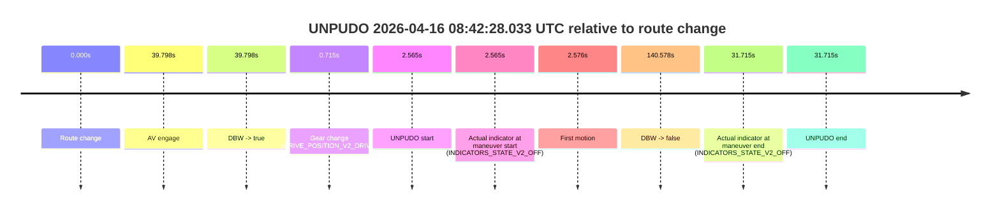
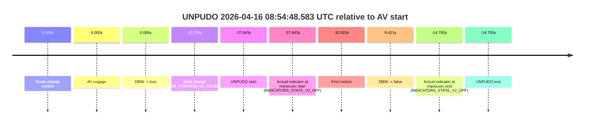
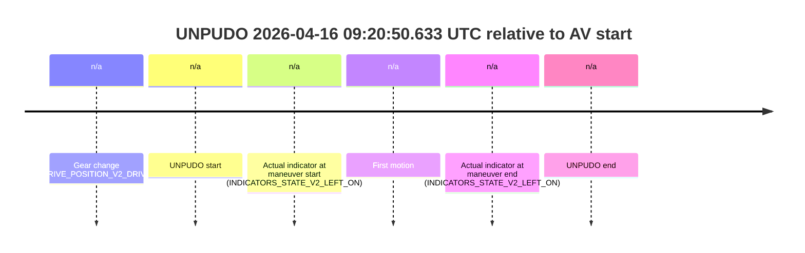
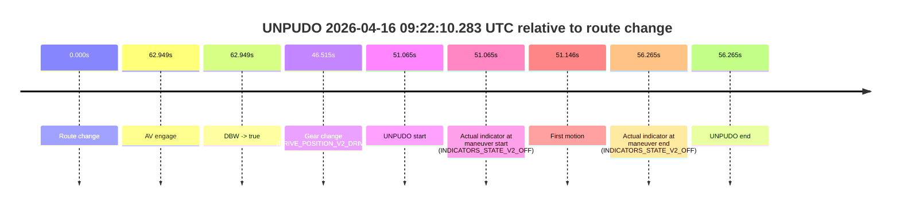

# Run Report: fme20031/2026-04-16--08-20-59--gen2-av-6e9c8335-1c0b-4fa9-a810-e7a9acb5daf9

| Field | Value |
|---|---|
| Run ID | `fme20031/2026-04-16--08-20-59--gen2-av-6e9c8335-1c0b-4fa9-a810-e7a9acb5daf9` |
| Date | `2026-04-16` |
| Model(s) | `plum-timeless-beaver` |
| Author | `peng.tang` |
| Event count | `9` |

## unpudo 2026-04-16 08:31:28.633 UTC

| Field | Value |
|---|---|
| Model | `plum-timeless-beaver` |
| Author | `peng.tang` |
| Run ID | `fme20031/2026-04-16--08-20-59--gen2-av-6e9c8335-1c0b-4fa9-a810-e7a9acb5daf9` |
| Date | `2026-04-16` |
| Time (UTC) | `08:31:28.633` |
| Event type | `unpudo` |
| Disengagement type | `failed_to_unpudo` |
| Route change | `found` |
| Console | [run](https://console.sso.wayve.ai/run/fme20031/2026-04-16--08-20-59--gen2-av-6e9c8335-1c0b-4fa9-a810-e7a9acb5daf9?id=&time-unixus=1776328288633316) |
| Foxglove | [segment](https://app.foxglove.dev/wayve-on-prem/p/prj_0dX18KZdVHg1fmmI/view?ds=foxglove-stream&ds.deviceName=fme20031&ds.start=2026-04-16T08%3A31%3A04.868247Z&ds.end=2026-04-16T08%3A33%3A32.576984Z&layoutId=lay_0e7VD4WIKDQGU73Y&time=2026-04-16T08%3A31%3A28.633316Z) |

### Event card: accidental

- Accidental: AV ownership is present for less than `2s`, so this is treated as an accidental brush with the maneuver rather than a meaningful model attempt.

| Event | Time (UTC) | Delta from route change |
|---|---:|---:|
| Route change | 2026-04-16 08:31:14.868 | `0.000s` |
| AV engage | 2026-04-16 08:31:37.286 | `22.418s` |
| DBW -> true | 2026-04-16 08:31:37.286 | `22.418s` |
| Gear change (DRIVE_POSITION_V2_DRIVE) | 2026-04-16 08:31:21.083 | `6.215s` |
| UNPUDO start | 2026-04-16 08:31:28.633 | `13.765s` |
| Actual indicator at maneuver start (INDICATORS_STATE_V2_RIGHT_ON) | 2026-04-16 08:31:28.633 | `13.765s` |
| First motion | 2026-04-16 08:31:28.704 | `13.836s` |
| DBW -> false | 2026-04-16 08:33:22.576 | `127.709s` |
| Actual indicator at maneuver end (INDICATORS_STATE_V2_OFF) | 2026-04-16 08:31:35.033 | `20.165s` |
| UNPUDO end | 2026-04-16 08:31:35.033 | `20.165s` |

| Metric | Value |
|---|---|
| Outcome | `accidental` |
| Effective failure type | `none` |
| Route change status | `found` |
| DBW at event start | `false` |
| DBW at event end | `false` |
| Predicted gear at AV start | `DRIVE_POSITION_V2_DRIVE` |
| Actual gear at AV start | `DRIVE_POSITION_V2_DRIVE` |
| Predicted gear at event start | `DRIVE_POSITION_V2_DRIVE` |
| Actual gear at event start | `DRIVE_POSITION_V2_DRIVE` |
| Planned indicator direction | `INDICATORS_STATE_V2_OFF` |
| Controller indicator direction | `INDICATORS_STATE_V2_OFF` |
| Actual indicator direction | `INDICATORS_STATE_V2_RIGHT_ON` |
| Actual indicator at maneuver end | `INDICATORS_STATE_V2_OFF` |
| Driver accel help in AV | `false` |
| Driver accel help timestamp | `n/a` |
| Max accel pedal pct in AV | `0.0%` |
| Max brake pedal pct in AV | `0.0%` |
| Max speed mps in AV | `0.000` |
| Route -> AV | `22.418s` |
| AV -> event start | `-8.653s` |
| AV -> first motion | `-8.582s` |
| AV duration before disengagement | `105.291s` |
| Trajectory waypoint count | `35` |
| Driving-plan step count | `11` |

The scored portion starts from the AV-owned window, not from the pre-AV setup. Route-change search in the stopped pre-event segment was `found`, with the baseline therefore set to route change. At the event anchor the model predicts `DRIVE_POSITION_V2_DRIVE` and the actual gear is `DRIVE_POSITION_V2_DRIVE`. The effective model outcome is `accidental` because `the AV-owned portion is shorter than 2s`.

### Resolution

| Field | Value |
|---|---|
| Final outcome | `accidental` |
| Do we agree with this label? | `yes` |
| Source disengagement type | `failed_to_unpudo` |
| Resolved effective failure type | `none` |
| Confidence | `high` |

## unpudo 2026-04-16 08:42:28.033 UTC

| Field | Value |
|---|---|
| Model | `plum-timeless-beaver` |
| Author | `peng.tang` |
| Run ID | `fme20031/2026-04-16--08-20-59--gen2-av-6e9c8335-1c0b-4fa9-a810-e7a9acb5daf9` |
| Date | `2026-04-16` |
| Time (UTC) | `08:42:28.033` |
| Event type | `unpudo` |
| Disengagement type | `none observed` |
| Route change | `found` |
| Console | [run](https://console.sso.wayve.ai/run/fme20031/2026-04-16--08-20-59--gen2-av-6e9c8335-1c0b-4fa9-a810-e7a9acb5daf9?id=&time-unixus=1776328948033316) |
| Foxglove | [segment](https://app.foxglove.dev/wayve-on-prem/p/prj_0dX18KZdVHg1fmmI/view?ds=foxglove-stream&ds.deviceName=fme20031&ds.start=2026-04-16T08%3A42%3A15.468275Z&ds.end=2026-04-16T08%3A44%3A56.046577Z&layoutId=lay_0e7VD4WIKDQGU73Y&time=2026-04-16T08%3A42%3A28.033316Z) |

### Event card: accidental

- Accidental: AV ownership is present for less than `2s`, so this is treated as an accidental brush with the maneuver rather than a meaningful model attempt.

| Event | Time (UTC) | Delta from route change |
|---|---:|---:|
| Route change | 2026-04-16 08:42:25.468 | `0.000s` |
| AV engage | 2026-04-16 08:43:05.266 | `39.798s` |
| DBW -> true | 2026-04-16 08:43:05.266 | `39.798s` |
| Gear change (DRIVE_POSITION_V2_DRIVE) | 2026-04-16 08:42:26.183 | `0.715s` |
| UNPUDO start | 2026-04-16 08:42:28.033 | `2.565s` |
| Actual indicator at maneuver start (INDICATORS_STATE_V2_OFF) | 2026-04-16 08:42:28.033 | `2.565s` |
| First motion | 2026-04-16 08:42:28.044 | `2.576s` |
| DBW -> false | 2026-04-16 08:44:46.046 | `140.578s` |
| Actual indicator at maneuver end (INDICATORS_STATE_V2_OFF) | 2026-04-16 08:42:57.183 | `31.715s` |
| UNPUDO end | 2026-04-16 08:42:57.183 | `31.715s` |

| Metric | Value |
|---|---|
| Outcome | `accidental` |
| Effective failure type | `none` |
| Route change status | `found` |
| DBW at event start | `false` |
| DBW at event end | `false` |
| Predicted gear at AV start | `DRIVE_POSITION_V2_DRIVE` |
| Actual gear at AV start | `DRIVE_POSITION_V2_DRIVE` |
| Predicted gear at event start | `DRIVE_POSITION_V2_DRIVE` |
| Actual gear at event start | `DRIVE_POSITION_V2_DRIVE` |
| Planned indicator direction | `INDICATORS_STATE_V2_OFF` |
| Controller indicator direction | `INDICATORS_STATE_V2_OFF` |
| Actual indicator direction | `INDICATORS_STATE_V2_OFF` |
| Actual indicator at maneuver end | `INDICATORS_STATE_V2_OFF` |
| Driver accel help in AV | `false` |
| Driver accel help timestamp | `n/a` |
| Max accel pedal pct in AV | `0.0%` |
| Max brake pedal pct in AV | `0.0%` |
| Max speed mps in AV | `0.000` |
| Route -> AV | `39.798s` |
| AV -> event start | `-37.233s` |
| AV -> first motion | `-37.222s` |
| AV duration before disengagement | `100.780s` |
| Trajectory waypoint count | `35` |
| Driving-plan step count | `11` |

The scored portion starts from the AV-owned window, not from the pre-AV setup. Route-change search in the stopped pre-event segment was `found`, with the baseline therefore set to route change. At the event anchor the model predicts `DRIVE_POSITION_V2_DRIVE` and the actual gear is `DRIVE_POSITION_V2_DRIVE`. The effective model outcome is `accidental` because `the AV-owned portion is shorter than 2s`.

### Resolution

| Field | Value |
|---|---|
| Final outcome | `accidental` |
| Do we agree with this label? | `yes` |
| Source disengagement type | `none observed` |
| Resolved effective failure type | `none` |
| Confidence | `high` |

## unpudo 2026-04-16 08:44:50.983 UTC

| Field | Value |
|---|---|
| Model | `plum-timeless-beaver` |
| Author | `peng.tang` |
| Run ID | `fme20031/2026-04-16--08-20-59--gen2-av-6e9c8335-1c0b-4fa9-a810-e7a9acb5daf9` |
| Date | `2026-04-16` |
| Time (UTC) | `08:44:50.983` |
| Event type | `unpudo` |
| Disengagement type | `failed_to_pudo` |
| Route change | `unclear` |
| Console | [run](https://console.sso.wayve.ai/run/fme20031/2026-04-16--08-20-59--gen2-av-6e9c8335-1c0b-4fa9-a810-e7a9acb5daf9?id=&time-unixus=1776329090983313) |
| Foxglove | [segment](https://app.foxglove.dev/wayve-on-prem/p/prj_0dX18KZdVHg1fmmI/view?ds=foxglove-stream&ds.deviceName=fme20031&ds.start=2026-04-16T08%3A44%3A39.883323Z&ds.end=2026-04-16T08%3A45%3A05.933310Z&layoutId=lay_0e7VD4WIKDQGU73Y&time=2026-04-16T08%3A44%3A50.983313Z) |

### Event card: non-av

- Non-AV: the detected unpudo starts outside AV ownership, so it is kept for coverage but excluded from model success / failure scoring.

| Event | Time (UTC) | Delta from AV start |
|---|---:|---:|
| Gear change (DRIVE_POSITION_V2_DRIVE) | 2026-04-16 08:44:49.883 | `n/a` |
| UNPUDO start | 2026-04-16 08:44:50.983 | `n/a` |
| Actual indicator at maneuver start (INDICATORS_STATE_V2_OFF) | 2026-04-16 08:44:50.983 | `n/a` |
| First motion | 2026-04-16 08:44:51.004 | `n/a` |
| Actual indicator at maneuver end (INDICATORS_STATE_V2_OFF) | 2026-04-16 08:44:55.933 | `n/a` |
| UNPUDO end | 2026-04-16 08:44:55.933 | `n/a` |

| Metric | Value |
|---|---|
| Outcome | `non-av` |
| Effective failure type | `none` |
| Route change status | `unclear` |
| DBW at event start | `false` |
| DBW at event end | `false` |
| Predicted gear at AV start | `n/a` |
| Actual gear at AV start | `n/a` |
| Predicted gear at event start | `DRIVE_POSITION_V2_DRIVE` |
| Actual gear at event start | `DRIVE_POSITION_V2_DRIVE` |
| Planned indicator direction | `INDICATORS_STATE_V2_OFF` |
| Controller indicator direction | `INDICATORS_STATE_V2_OFF` |
| Actual indicator direction | `INDICATORS_STATE_V2_OFF` |
| Actual indicator at maneuver end | `INDICATORS_STATE_V2_OFF` |
| Driver accel help in AV | `false` |
| Driver accel help timestamp | `n/a` |
| Max accel pedal pct in AV | `0.0%` |
| Max brake pedal pct in AV | `0.0%` |
| Max speed mps in AV | `0.000` |
| Route -> AV | `n/a` |
| AV -> event start | `n/a` |
| AV -> first motion | `n/a` |
| AV duration before disengagement | `n/a` |
| Trajectory waypoint count | `36` |
| Driving-plan step count | `11` |

The scored portion starts from the AV-owned window, not from the pre-AV setup. Route-change search in the stopped pre-event segment was `unclear`, with the baseline therefore set to AV start. At the event anchor the model predicts `DRIVE_POSITION_V2_DRIVE` and the actual gear is `DRIVE_POSITION_V2_DRIVE`. The effective model outcome is `non-av` because `the event does not begin in AV ownership`.

### Resolution

| Field | Value |
|---|---|
| Final outcome | `non-av` |
| Do we agree with this label? | `yes` |
| Source disengagement type | `failed_to_pudo` |
| Resolved effective failure type | `none` |
| Confidence | `medium` |

## unpudo 2026-04-16 08:45:56.233 UTC

| Field | Value |
|---|---|
| Model | `plum-timeless-beaver` |
| Author | `peng.tang` |
| Run ID | `fme20031/2026-04-16--08-20-59--gen2-av-6e9c8335-1c0b-4fa9-a810-e7a9acb5daf9` |
| Date | `2026-04-16` |
| Time (UTC) | `08:45:56.233` |
| Event type | `unpudo` |
| Disengagement type | `failed_to_unpudo` |
| Route change | `found` |
| Console | [run](https://console.sso.wayve.ai/run/fme20031/2026-04-16--08-20-59--gen2-av-6e9c8335-1c0b-4fa9-a810-e7a9acb5daf9?id=&time-unixus=1776329156233312) |
| Foxglove | [segment](https://app.foxglove.dev/wayve-on-prem/p/prj_0dX18KZdVHg1fmmI/view?ds=foxglove-stream&ds.deviceName=fme20031&ds.start=2026-04-16T08%3A45%3A28.568254Z&ds.end=2026-04-16T08%3A47%3A33.606504Z&layoutId=lay_0e7VD4WIKDQGU73Y&time=2026-04-16T08%3A45%3A56.233312Z) |

### Event card: accidental

- Accidental: AV ownership is present for less than `2s`, so this is treated as an accidental brush with the maneuver rather than a meaningful model attempt.

| Event | Time (UTC) | Delta from route change |
|---|---:|---:|
| Route change | 2026-04-16 08:45:38.568 | `0.000s` |
| AV engage | 2026-04-16 08:46:19.407 | `40.839s` |
| DBW -> true | 2026-04-16 08:46:19.407 | `40.839s` |
| Gear change (DRIVE_POSITION_V2_DRIVE) | 2026-04-16 08:45:45.083 | `6.515s` |
| UNPUDO start | 2026-04-16 08:45:56.233 | `17.665s` |
| Actual indicator at maneuver start (INDICATORS_STATE_V2_RIGHT_ON) | 2026-04-16 08:45:56.233 | `17.665s` |
| First motion | 2026-04-16 08:45:56.264 | `17.696s` |
| DBW -> false | 2026-04-16 08:47:23.606 | `105.038s` |
| Actual indicator at maneuver end (INDICATORS_STATE_V2_OFF) | 2026-04-16 08:46:00.933 | `22.365s` |
| UNPUDO end | 2026-04-16 08:46:00.933 | `22.365s` |

| Metric | Value |
|---|---|
| Outcome | `accidental` |
| Effective failure type | `none` |
| Route change status | `found` |
| DBW at event start | `false` |
| DBW at event end | `false` |
| Predicted gear at AV start | `DRIVE_POSITION_V2_DRIVE` |
| Actual gear at AV start | `DRIVE_POSITION_V2_DRIVE` |
| Predicted gear at event start | `DRIVE_POSITION_V2_DRIVE` |
| Actual gear at event start | `DRIVE_POSITION_V2_DRIVE` |
| Planned indicator direction | `INDICATORS_STATE_V2_OFF` |
| Controller indicator direction | `INDICATORS_STATE_V2_OFF` |
| Actual indicator direction | `INDICATORS_STATE_V2_RIGHT_ON` |
| Actual indicator at maneuver end | `INDICATORS_STATE_V2_OFF` |
| Driver accel help in AV | `false` |
| Driver accel help timestamp | `n/a` |
| Max accel pedal pct in AV | `0.0%` |
| Max brake pedal pct in AV | `0.0%` |
| Max speed mps in AV | `0.000` |
| Route -> AV | `40.839s` |
| AV -> event start | `-23.174s` |
| AV -> first motion | `-23.144s` |
| AV duration before disengagement | `64.199s` |
| Trajectory waypoint count | `37` |
| Driving-plan step count | `11` |

The scored portion starts from the AV-owned window, not from the pre-AV setup. Route-change search in the stopped pre-event segment was `found`, with the baseline therefore set to route change. At the event anchor the model predicts `DRIVE_POSITION_V2_DRIVE` and the actual gear is `DRIVE_POSITION_V2_DRIVE`. The effective model outcome is `accidental` because `the AV-owned portion is shorter than 2s`.

### Resolution

| Field | Value |
|---|---|
| Final outcome | `accidental` |
| Do we agree with this label? | `yes` |
| Source disengagement type | `failed_to_unpudo` |
| Resolved effective failure type | `none` |
| Confidence | `high` |

## unpudo 2026-04-16 08:48:05.483 UTC

| Field | Value |
|---|---|
| Model | `plum-timeless-beaver` |
| Author | `peng.tang` |
| Run ID | `fme20031/2026-04-16--08-20-59--gen2-av-6e9c8335-1c0b-4fa9-a810-e7a9acb5daf9` |
| Date | `2026-04-16` |
| Time (UTC) | `08:48:05.483` |
| Event type | `unpudo` |
| Disengagement type | `failed_to_unpudo` |
| Route change | `found` |
| Console | [run](https://console.sso.wayve.ai/run/fme20031/2026-04-16--08-20-59--gen2-av-6e9c8335-1c0b-4fa9-a810-e7a9acb5daf9?id=&time-unixus=1776329285483318) |
| Foxglove | [segment](https://app.foxglove.dev/wayve-on-prem/p/prj_0dX18KZdVHg1fmmI/view?ds=foxglove-stream&ds.deviceName=fme20031&ds.start=2026-04-16T08%3A47%3A37.268244Z&ds.end=2026-04-16T08%3A49%3A06.727627Z&layoutId=lay_0e7VD4WIKDQGU73Y&time=2026-04-16T08%3A48%3A05.483318Z) |

### Event card: accidental

- Accidental: AV ownership is present for less than `2s`, so this is treated as an accidental brush with the maneuver rather than a meaningful model attempt.

| Event | Time (UTC) | Delta from route change |
|---|---:|---:|
| Route change | 2026-04-16 08:47:47.268 | `0.000s` |
| AV engage | 2026-04-16 08:48:14.506 | `27.238s` |
| DBW -> true | 2026-04-16 08:48:14.506 | `27.238s` |
| Gear change (DRIVE_POSITION_V2_DRIVE) | 2026-04-16 08:47:52.183 | `4.915s` |
| UNPUDO start | 2026-04-16 08:48:05.483 | `18.215s` |
| Actual indicator at maneuver start (INDICATORS_STATE_V2_OFF) | 2026-04-16 08:48:05.483 | `18.215s` |
| First motion | 2026-04-16 08:48:05.604 | `18.336s` |
| DBW -> false | 2026-04-16 08:48:56.727 | `69.459s` |
| Actual indicator at maneuver end (INDICATORS_STATE_V2_OFF) | 2026-04-16 08:48:11.433 | `24.165s` |
| UNPUDO end | 2026-04-16 08:48:11.433 | `24.165s` |

| Metric | Value |
|---|---|
| Outcome | `accidental` |
| Effective failure type | `none` |
| Route change status | `found` |
| DBW at event start | `false` |
| DBW at event end | `false` |
| Predicted gear at AV start | `DRIVE_POSITION_V2_DRIVE` |
| Actual gear at AV start | `DRIVE_POSITION_V2_DRIVE` |
| Predicted gear at event start | `DRIVE_POSITION_V2_DRIVE` |
| Actual gear at event start | `DRIVE_POSITION_V2_DRIVE` |
| Planned indicator direction | `INDICATORS_STATE_V2_RIGHT_ON` |
| Controller indicator direction | `INDICATORS_STATE_V2_RIGHT_ON` |
| Actual indicator direction | `INDICATORS_STATE_V2_OFF` |
| Actual indicator at maneuver end | `INDICATORS_STATE_V2_OFF` |
| Driver accel help in AV | `false` |
| Driver accel help timestamp | `n/a` |
| Max accel pedal pct in AV | `0.0%` |
| Max brake pedal pct in AV | `0.0%` |
| Max speed mps in AV | `0.000` |
| Route -> AV | `27.238s` |
| AV -> event start | `-9.023s` |
| AV -> first motion | `-8.902s` |
| AV duration before disengagement | `42.221s` |
| Trajectory waypoint count | `36` |
| Driving-plan step count | `11` |

The scored portion starts from the AV-owned window, not from the pre-AV setup. Route-change search in the stopped pre-event segment was `found`, with the baseline therefore set to route change. At the event anchor the model predicts `DRIVE_POSITION_V2_DRIVE` and the actual gear is `DRIVE_POSITION_V2_DRIVE`. The effective model outcome is `accidental` because `the AV-owned portion is shorter than 2s`.

### Resolution

| Field | Value |
|---|---|
| Final outcome | `accidental` |
| Do we agree with this label? | `yes` |
| Source disengagement type | `failed_to_unpudo` |
| Resolved effective failure type | `none` |
| Confidence | `high` |

## unpudo 2026-04-16 08:54:48.583 UTC

| Field | Value |
|---|---|
| Model | `plum-timeless-beaver` |
| Author | `peng.tang` |
| Run ID | `fme20031/2026-04-16--08-20-59--gen2-av-6e9c8335-1c0b-4fa9-a810-e7a9acb5daf9` |
| Date | `2026-04-16` |
| Time (UTC) | `08:54:48.583` |
| Event type | `unpudo` |
| Disengagement type | `none observed` |
| Route change | `unclear` |
| Console | [run](https://console.sso.wayve.ai/run/fme20031/2026-04-16--08-20-59--gen2-av-6e9c8335-1c0b-4fa9-a810-e7a9acb5daf9?id=&time-unixus=1776329688583297) |
| Foxglove | [segment](https://app.foxglove.dev/wayve-on-prem/p/prj_0dX18KZdVHg1fmmI/view?ds=foxglove-stream&ds.deviceName=fme20031&ds.start=2026-04-16T08%3A54%3A33.633300Z&ds.end=2026-04-16T08%3A55%3A45.847526Z&layoutId=lay_0e7VD4WIKDQGU73Y&time=2026-04-16T08%3A54%3A48.583297Z) |

### Event card: accidental

- Accidental: AV ownership is present for less than `2s`, so this is treated as an accidental brush with the maneuver rather than a meaningful model attempt.

| Event | Time (UTC) | Delta from AV start |
|---|---:|---:|
| Route change unclear | 2026-04-16 08:55:26.426 | `0.000s` |
| AV engage | 2026-04-16 08:55:26.426 | `0.000s` |
| DBW -> true | 2026-04-16 08:55:26.426 | `0.000s` |
| Gear change (DRIVE_POSITION_V2_REVERSE) | 2026-04-16 08:54:43.633 | `-42.793s` |
| UNPUDO start | 2026-04-16 08:54:48.583 | `-37.843s` |
| Actual indicator at maneuver start (INDICATORS_STATE_V2_OFF) | 2026-04-16 08:54:48.583 | `-37.843s` |
| First motion | 2026-04-16 08:54:54.404 | `-32.023s` |
| DBW -> false | 2026-04-16 08:55:35.847 | `9.421s` |
| Actual indicator at maneuver end (INDICATORS_STATE_V2_OFF) | 2026-04-16 08:55:11.633 | `-14.793s` |
| UNPUDO end | 2026-04-16 08:55:11.633 | `-14.793s` |

| Metric | Value |
|---|---|
| Outcome | `accidental` |
| Effective failure type | `none` |
| Route change status | `unclear` |
| DBW at event start | `false` |
| DBW at event end | `false` |
| Predicted gear at AV start | `DRIVE_POSITION_V2_DRIVE` |
| Actual gear at AV start | `DRIVE_POSITION_V2_PARK` |
| Predicted gear at event start | `DRIVE_POSITION_V2_REVERSE` |
| Actual gear at event start | `DRIVE_POSITION_V2_REVERSE` |
| Planned indicator direction | `INDICATORS_STATE_V2_OFF` |
| Controller indicator direction | `INDICATORS_STATE_V2_OFF` |
| Actual indicator direction | `INDICATORS_STATE_V2_OFF` |
| Actual indicator at maneuver end | `INDICATORS_STATE_V2_OFF` |
| Driver accel help in AV | `false` |
| Driver accel help timestamp | `n/a` |
| Max accel pedal pct in AV | `0.0%` |
| Max brake pedal pct in AV | `0.0%` |
| Max speed mps in AV | `0.000` |
| Route -> AV | `n/a` |
| AV -> event start | `-37.843s` |
| AV -> first motion | `-32.023s` |
| AV duration before disengagement | `9.421s` |
| Trajectory waypoint count | `36` |
| Driving-plan step count | `11` |

The scored portion starts from the AV-owned window, not from the pre-AV setup. Route-change search in the stopped pre-event segment was `unclear`, with the baseline therefore set to AV start. At the event anchor the model predicts `DRIVE_POSITION_V2_REVERSE` and the actual gear is `DRIVE_POSITION_V2_REVERSE`. The effective model outcome is `accidental` because `the AV-owned portion is shorter than 2s`.

### Resolution

| Field | Value |
|---|---|
| Final outcome | `accidental` |
| Do we agree with this label? | `yes` |
| Source disengagement type | `none observed` |
| Resolved effective failure type | `none` |
| Confidence | `medium` |

## unpudo 2026-04-16 08:55:36.483 UTC

| Field | Value |
|---|---|
| Model | `plum-timeless-beaver` |
| Author | `peng.tang` |
| Run ID | `fme20031/2026-04-16--08-20-59--gen2-av-6e9c8335-1c0b-4fa9-a810-e7a9acb5daf9` |
| Date | `2026-04-16` |
| Time (UTC) | `08:55:36.483` |
| Event type | `unpudo` |
| Disengagement type | `failed_to_unpudo` |
| Route change | `found` |
| Console | [run](https://console.sso.wayve.ai/run/fme20031/2026-04-16--08-20-59--gen2-av-6e9c8335-1c0b-4fa9-a810-e7a9acb5daf9?id=&time-unixus=1776329736483303) |
| Foxglove | [segment](https://app.foxglove.dev/wayve-on-prem/p/prj_0dX18KZdVHg1fmmI/view?ds=foxglove-stream&ds.deviceName=fme20031&ds.start=2026-04-16T08%3A55%3A02.920337Z&ds.end=2026-04-16T09%3A01%3A33.236554Z&layoutId=lay_0e7VD4WIKDQGU73Y&time=2026-04-16T08%3A55%3A36.483303Z) |

### Event card: accidental

- Accidental: AV ownership is present for less than `2s`, so this is treated as an accidental brush with the maneuver rather than a meaningful model attempt.

| Event | Time (UTC) | Delta from route change |
|---|---:|---:|
| Route change | 2026-04-16 08:55:12.920 | `0.000s` |
| AV engage | 2026-04-16 08:55:45.427 | `32.507s` |
| DBW -> true | 2026-04-16 08:55:45.427 | `32.507s` |
| Gear change (DRIVE_POSITION_V2_DRIVE) | 2026-04-16 08:55:26.883 | `13.963s` |
| UNPUDO start | 2026-04-16 08:55:36.483 | `23.563s` |
| Actual indicator at maneuver start (INDICATORS_STATE_V2_RIGHT_ON) | 2026-04-16 08:55:36.483 | `23.563s` |
| First motion | 2026-04-16 08:55:36.524 | `23.604s` |
| DBW -> false | 2026-04-16 09:01:23.236 | `370.316s` |
| Actual indicator at maneuver end (INDICATORS_STATE_V2_OFF) | 2026-04-16 08:55:40.833 | `27.913s` |
| UNPUDO end | 2026-04-16 08:55:40.833 | `27.913s` |

| Metric | Value |
|---|---|
| Outcome | `accidental` |
| Effective failure type | `none` |
| Route change status | `found` |
| DBW at event start | `false` |
| DBW at event end | `false` |
| Predicted gear at AV start | `DRIVE_POSITION_V2_DRIVE` |
| Actual gear at AV start | `DRIVE_POSITION_V2_DRIVE` |
| Predicted gear at event start | `DRIVE_POSITION_V2_DRIVE` |
| Actual gear at event start | `DRIVE_POSITION_V2_DRIVE` |
| Planned indicator direction | `INDICATORS_STATE_V2_OFF` |
| Controller indicator direction | `INDICATORS_STATE_V2_OFF` |
| Actual indicator direction | `INDICATORS_STATE_V2_RIGHT_ON` |
| Actual indicator at maneuver end | `INDICATORS_STATE_V2_OFF` |
| Driver accel help in AV | `false` |
| Driver accel help timestamp | `n/a` |
| Max accel pedal pct in AV | `0.0%` |
| Max brake pedal pct in AV | `0.0%` |
| Max speed mps in AV | `0.000` |
| Route -> AV | `32.507s` |
| AV -> event start | `-8.944s` |
| AV -> first motion | `-8.903s` |
| AV duration before disengagement | `337.809s` |
| Trajectory waypoint count | `36` |
| Driving-plan step count | `11` |

The scored portion starts from the AV-owned window, not from the pre-AV setup. Route-change search in the stopped pre-event segment was `found`, with the baseline therefore set to route change. At the event anchor the model predicts `DRIVE_POSITION_V2_DRIVE` and the actual gear is `DRIVE_POSITION_V2_DRIVE`. The effective model outcome is `accidental` because `the AV-owned portion is shorter than 2s`.

### Resolution

| Field | Value |
|---|---|
| Final outcome | `accidental` |
| Do we agree with this label? | `yes` |
| Source disengagement type | `failed_to_unpudo` |
| Resolved effective failure type | `none` |
| Confidence | `high` |

## unpudo 2026-04-16 09:20:50.633 UTC

| Field | Value |
|---|---|
| Model | `plum-timeless-beaver` |
| Author | `peng.tang` |
| Run ID | `fme20031/2026-04-16--08-20-59--gen2-av-6e9c8335-1c0b-4fa9-a810-e7a9acb5daf9` |
| Date | `2026-04-16` |
| Time (UTC) | `09:20:50.633` |
| Event type | `unpudo` |
| Disengagement type | `failed_to_pudo` |
| Route change | `unclear` |
| Console | [run](https://console.sso.wayve.ai/run/fme20031/2026-04-16--08-20-59--gen2-av-6e9c8335-1c0b-4fa9-a810-e7a9acb5daf9?id=&time-unixus=1776331250633316) |
| Foxglove | [segment](https://app.foxglove.dev/wayve-on-prem/p/prj_0dX18KZdVHg1fmmI/view?ds=foxglove-stream&ds.deviceName=fme20031&ds.start=2026-04-16T09%3A20%3A30.083293Z&ds.end=2026-04-16T09%3A21%3A05.933314Z&layoutId=lay_0e7VD4WIKDQGU73Y&time=2026-04-16T09%3A20%3A50.633316Z) |

### Event card: non-av

- Non-AV: the detected unpudo starts outside AV ownership, so it is kept for coverage but excluded from model success / failure scoring.

| Event | Time (UTC) | Delta from AV start |
|---|---:|---:|
| Gear change (DRIVE_POSITION_V2_DRIVE) | 2026-04-16 09:20:40.083 | `n/a` |
| UNPUDO start | 2026-04-16 09:20:50.633 | `n/a` |
| Actual indicator at maneuver start (INDICATORS_STATE_V2_LEFT_ON) | 2026-04-16 09:20:50.633 | `n/a` |
| First motion | 2026-04-16 09:20:50.684 | `n/a` |
| Actual indicator at maneuver end (INDICATORS_STATE_V2_LEFT_ON) | 2026-04-16 09:20:55.933 | `n/a` |
| UNPUDO end | 2026-04-16 09:20:55.933 | `n/a` |

| Metric | Value |
|---|---|
| Outcome | `non-av` |
| Effective failure type | `none` |
| Route change status | `unclear` |
| DBW at event start | `false` |
| DBW at event end | `false` |
| Predicted gear at AV start | `n/a` |
| Actual gear at AV start | `n/a` |
| Predicted gear at event start | `DRIVE_POSITION_V2_DRIVE` |
| Actual gear at event start | `DRIVE_POSITION_V2_DRIVE` |
| Planned indicator direction | `INDICATORS_STATE_V2_LEFT_ON` |
| Controller indicator direction | `INDICATORS_STATE_V2_LEFT_ON` |
| Actual indicator direction | `INDICATORS_STATE_V2_LEFT_ON` |
| Actual indicator at maneuver end | `INDICATORS_STATE_V2_LEFT_ON` |
| Driver accel help in AV | `false` |
| Driver accel help timestamp | `n/a` |
| Max accel pedal pct in AV | `0.0%` |
| Max brake pedal pct in AV | `0.0%` |
| Max speed mps in AV | `0.000` |
| Route -> AV | `n/a` |
| AV -> event start | `n/a` |
| AV -> first motion | `n/a` |
| AV duration before disengagement | `n/a` |
| Trajectory waypoint count | `37` |
| Driving-plan step count | `11` |

The scored portion starts from the AV-owned window, not from the pre-AV setup. Route-change search in the stopped pre-event segment was `unclear`, with the baseline therefore set to AV start. At the event anchor the model predicts `DRIVE_POSITION_V2_DRIVE` and the actual gear is `DRIVE_POSITION_V2_DRIVE`. The effective model outcome is `non-av` because `the event does not begin in AV ownership`.

### Resolution

| Field | Value |
|---|---|
| Final outcome | `non-av` |
| Do we agree with this label? | `yes` |
| Source disengagement type | `failed_to_pudo` |
| Resolved effective failure type | `none` |
| Confidence | `medium` |

## unpudo 2026-04-16 09:22:10.283 UTC

| Field | Value |
|---|---|
| Model | `plum-timeless-beaver` |
| Author | `peng.tang` |
| Run ID | `fme20031/2026-04-16--08-20-59--gen2-av-6e9c8335-1c0b-4fa9-a810-e7a9acb5daf9` |
| Date | `2026-04-16` |
| Time (UTC) | `09:22:10.283` |
| Event type | `unpudo` |
| Disengagement type | `failed_to_unpudo` |
| Route change | `found` |
| Console | [run](https://console.sso.wayve.ai/run/fme20031/2026-04-16--08-20-59--gen2-av-6e9c8335-1c0b-4fa9-a810-e7a9acb5daf9?id=&time-unixus=1776331330283304) |
| Foxglove | [segment](https://app.foxglove.dev/wayve-on-prem/p/prj_0dX18KZdVHg1fmmI/view?ds=foxglove-stream&ds.deviceName=fme20031&ds.start=2026-04-16T09%3A21%3A09.218308Z&ds.end=2026-04-16T09%3A22%3A25.483299Z&layoutId=lay_0e7VD4WIKDQGU73Y&time=2026-04-16T09%3A22%3A10.283304Z) |

### Event card: accidental

- Accidental: AV ownership is present for less than `2s`, so this is treated as an accidental brush with the maneuver rather than a meaningful model attempt.

| Event | Time (UTC) | Delta from route change |
|---|---:|---:|
| Route change | 2026-04-16 09:21:19.218 | `0.000s` |
| AV engage | 2026-04-16 09:22:22.167 | `62.949s` |
| DBW -> true | 2026-04-16 09:22:22.167 | `62.949s` |
| Gear change (DRIVE_POSITION_V2_DRIVE) | 2026-04-16 09:22:05.733 | `46.515s` |
| UNPUDO start | 2026-04-16 09:22:10.283 | `51.065s` |
| Actual indicator at maneuver start (INDICATORS_STATE_V2_OFF) | 2026-04-16 09:22:10.283 | `51.065s` |
| First motion | 2026-04-16 09:22:10.364 | `51.146s` |
| Actual indicator at maneuver end (INDICATORS_STATE_V2_OFF) | 2026-04-16 09:22:15.483 | `56.265s` |
| UNPUDO end | 2026-04-16 09:22:15.483 | `56.265s` |

| Metric | Value |
|---|---|
| Outcome | `accidental` |
| Effective failure type | `none` |
| Route change status | `found` |
| DBW at event start | `false` |
| DBW at event end | `false` |
| Predicted gear at AV start | `DRIVE_POSITION_V2_DRIVE` |
| Actual gear at AV start | `DRIVE_POSITION_V2_DRIVE` |
| Predicted gear at event start | `DRIVE_POSITION_V2_DRIVE` |
| Actual gear at event start | `DRIVE_POSITION_V2_DRIVE` |
| Planned indicator direction | `INDICATORS_STATE_V2_RIGHT_ON` |
| Controller indicator direction | `INDICATORS_STATE_V2_RIGHT_ON` |
| Actual indicator direction | `INDICATORS_STATE_V2_OFF` |
| Actual indicator at maneuver end | `INDICATORS_STATE_V2_OFF` |
| Driver accel help in AV | `false` |
| Driver accel help timestamp | `n/a` |
| Max accel pedal pct in AV | `0.0%` |
| Max brake pedal pct in AV | `0.0%` |
| Max speed mps in AV | `0.000` |
| Route -> AV | `62.949s` |
| AV -> event start | `-11.884s` |
| AV -> first motion | `-11.803s` |
| AV duration before disengagement | `n/a` |
| Trajectory waypoint count | `36` |
| Driving-plan step count | `11` |

The scored portion starts from the AV-owned window, not from the pre-AV setup. Route-change search in the stopped pre-event segment was `found`, with the baseline therefore set to route change. At the event anchor the model predicts `DRIVE_POSITION_V2_DRIVE` and the actual gear is `DRIVE_POSITION_V2_DRIVE`. The effective model outcome is `accidental` because `the AV-owned portion is shorter than 2s`.

### Resolution

| Field | Value |
|---|---|
| Final outcome | `accidental` |
| Do we agree with this label? | `yes` |
| Source disengagement type | `failed_to_unpudo` |
| Resolved effective failure type | `none` |
| Confidence | `high` |
