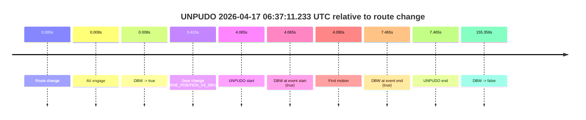
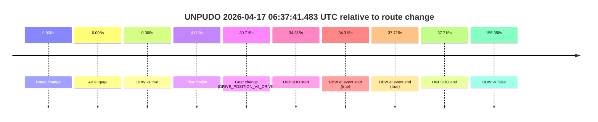
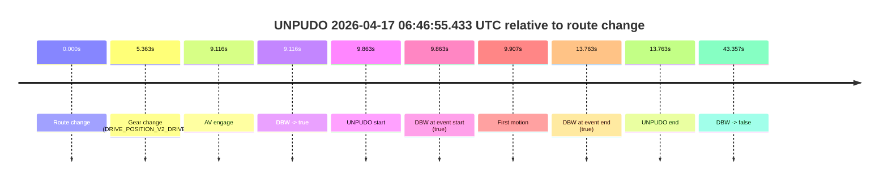
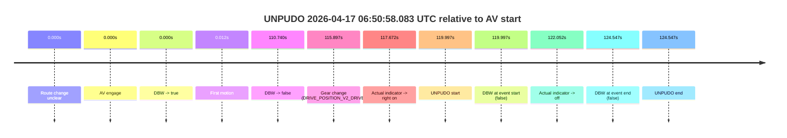
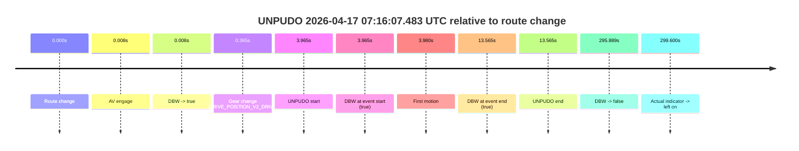

# Run Report: fme20031/2026-04-17--06-19-04--gen2-av-a3dd5700-1ec3-482d-9ec0-b4662ec10d52

| Field | Value |
|---|---|
| Run ID | `fme20031/2026-04-17--06-19-04--gen2-av-a3dd5700-1ec3-482d-9ec0-b4662ec10d52` |
| Date | `2026-04-17` |
| Model(s) | `eel-teal-outspoken` |
| Author | `zak` |
| Event count | `7` |

## unpudo 2026-04-17 06:27:20.783 UTC

| Field | Value |
|---|---|
| Model | `eel-teal-outspoken` |
| Author | `zak` |
| Run ID | `fme20031/2026-04-17--06-19-04--gen2-av-a3dd5700-1ec3-482d-9ec0-b4662ec10d52` |
| Date | `2026-04-17` |
| Time (UTC) | `06:27:20.783` |
| Event type | `unpudo` |
| Disengagement type | `none observed` |
| Route change | `found` |
| Console | [run](https://console.sso.wayve.ai/run/fme20031/2026-04-17--06-19-04--gen2-av-a3dd5700-1ec3-482d-9ec0-b4662ec10d52?id=&time-unixus=1776407240783295) |
| Foxglove | [segment](https://app.foxglove.dev/wayve-on-prem/p/prj_0dX18KZdVHg1fmmI/view?ds=foxglove-stream&ds.deviceName=fme20031&ds.start=2026-04-17T06%3A27%3A06.868243Z&ds.end=2026-04-17T06%3A27%3A46.306139Z&layoutId=lay_0e7VD4WIKDQGU73Y&time=2026-04-17T06%3A27%3A20.783295Z) |

### Event card: pass

- Pass: AV owns the credited unpudo from route change through the official unpudo window, the gear state is aligned at the anchor, and the vehicle moves without driver accelerator help in AV.

| Event | Time (UTC) | Delta from route change |
|---|---:|---:|
| Route change | 2026-04-17 06:27:16.868 | `0.000s` |
| AV engage | 2026-04-17 06:27:16.876 | `0.008s` |
| DBW -> true | 2026-04-17 06:27:16.876 | `0.008s` |
| Gear change (DRIVE_POSITION_V2_DRIVE) | 2026-04-17 06:27:17.183 | `0.315s` |
| UNPUDO start | 2026-04-17 06:27:20.783 | `3.915s` |
| DBW at event start (true) | 2026-04-17 06:27:20.783 | `3.915s` |
| First motion | 2026-04-17 06:27:20.798 | `3.930s` |
| DBW at event end (true) | 2026-04-17 06:27:25.483 | `8.615s` |
| UNPUDO end | 2026-04-17 06:27:25.483 | `8.615s` |
| DBW -> false | 2026-04-17 06:27:36.306 | `19.438s` |

| Metric | Value |
|---|---|
| Outcome | `pass` |
| Effective failure type | `none` |
| Route change status | `found` |
| DBW at event start | `true` |
| DBW at event end | `true` |
| Predicted gear at AV start | `DRIVE_POSITION_V2_PARK` |
| Actual gear at AV start | `DRIVE_POSITION_V2_PARK` |
| Predicted gear at event start | `DRIVE_POSITION_V2_DRIVE` |
| Actual gear at event start | `DRIVE_POSITION_V2_DRIVE` |
| Planned indicator direction | `INDICATORS_STATE_V2_LEFT_ON` |
| Controller indicator direction | `INDICATORS_STATE_V2_LEFT_ON` |
| Actual indicator direction | `INDICATORS_STATE_V2_OFF` |
| Actual indicator at maneuver end | `INDICATORS_STATE_V2_OFF` |
| Driver accel help in AV | `false` |
| Driver accel help timestamp | `n/a` |
| Max accel pedal pct in AV | `0.0%` |
| Max brake pedal pct in AV | `9.8%` |
| Max speed mps in AV | `3.781` |
| Success timing baseline | `route change` |
| Route -> AV | `0.008s` |
| AV -> event start | `3.907s` |
| AV -> first motion | `3.922s` |
| Success baseline -> event start | `3.915s` |
| Success baseline -> first motion | `3.930s` |
| AV duration before disengagement | `19.430s` |
| Trajectory waypoint count | `36` |
| Driving-plan step count | `11` |

The scored portion starts from the AV-owned window, not from the pre-AV setup. Route-change search in the stopped pre-event segment was `found`, with the baseline therefore set to route change. At the event anchor the model predicts `DRIVE_POSITION_V2_DRIVE` and the actual gear is `DRIVE_POSITION_V2_DRIVE`. The effective model outcome is `pass` because `the credited unpudo stays AV-owned through the official unpudo window.`

### Resolution

| Field | Value |
|---|---|
| Final outcome | `pass` |
| Do we agree with this label? | `yes` |
| Source disengagement type | `none observed` |
| Resolved effective failure type | `none` |
| Confidence | `high` |

## unpudo 2026-04-17 06:37:11.233 UTC

| Field | Value |
|---|---|
| Model | `eel-teal-outspoken` |
| Author | `zak` |
| Run ID | `fme20031/2026-04-17--06-19-04--gen2-av-a3dd5700-1ec3-482d-9ec0-b4662ec10d52` |
| Date | `2026-04-17` |
| Time (UTC) | `06:37:11.233` |
| Event type | `unpudo` |
| Disengagement type | `none observed` |
| Route change | `found` |
| Console | [run](https://console.sso.wayve.ai/run/fme20031/2026-04-17--06-19-04--gen2-av-a3dd5700-1ec3-482d-9ec0-b4662ec10d52?id=&time-unixus=1776407831233311) |
| Foxglove | [segment](https://app.foxglove.dev/wayve-on-prem/p/prj_0dX18KZdVHg1fmmI/view?ds=foxglove-stream&ds.deviceName=fme20031&ds.start=2026-04-17T06%3A36%3A57.168233Z&ds.end=2026-04-17T06%3A39%3A52.526304Z&layoutId=lay_0e7VD4WIKDQGU73Y&time=2026-04-17T06%3A37%3A11.233311Z) |

### Event card: pass

- Pass: AV owns the credited unpudo from route change through the official unpudo window, the gear state is aligned at the anchor, and the vehicle moves without driver accelerator help in AV.

| Event | Time (UTC) | Delta from route change |
|---|---:|---:|
| Route change | 2026-04-17 06:37:07.168 | `0.000s` |
| AV engage | 2026-04-17 06:37:07.176 | `0.008s` |
| DBW -> true | 2026-04-17 06:37:07.176 | `0.008s` |
| Gear change (DRIVE_POSITION_V2_DRIVE) | 2026-04-17 06:37:07.583 | `0.415s` |
| UNPUDO start | 2026-04-17 06:37:11.233 | `4.065s` |
| DBW at event start (true) | 2026-04-17 06:37:11.233 | `4.065s` |
| First motion | 2026-04-17 06:37:11.258 | `4.090s` |
| DBW at event end (true) | 2026-04-17 06:37:14.633 | `7.465s` |
| UNPUDO end | 2026-04-17 06:37:14.633 | `7.465s` |
| DBW -> false | 2026-04-17 06:39:42.526 | `155.358s` |

| Metric | Value |
|---|---|
| Outcome | `pass` |
| Effective failure type | `none` |
| Route change status | `found` |
| DBW at event start | `true` |
| DBW at event end | `true` |
| Predicted gear at AV start | `DRIVE_POSITION_V2_PARK` |
| Actual gear at AV start | `DRIVE_POSITION_V2_PARK` |
| Predicted gear at event start | `DRIVE_POSITION_V2_DRIVE` |
| Actual gear at event start | `DRIVE_POSITION_V2_DRIVE` |
| Planned indicator direction | `INDICATORS_STATE_V2_RIGHT_ON` |
| Controller indicator direction | `INDICATORS_STATE_V2_RIGHT_ON` |
| Actual indicator direction | `INDICATORS_STATE_V2_OFF` |
| Actual indicator at maneuver end | `INDICATORS_STATE_V2_OFF` |
| Driver accel help in AV | `false` |
| Driver accel help timestamp | `n/a` |
| Max accel pedal pct in AV | `0.0%` |
| Max brake pedal pct in AV | `17.6%` |
| Max speed mps in AV | `5.644` |
| Success timing baseline | `route change` |
| Route -> AV | `0.008s` |
| AV -> event start | `4.057s` |
| AV -> first motion | `4.082s` |
| Success baseline -> event start | `4.065s` |
| Success baseline -> first motion | `4.090s` |
| AV duration before disengagement | `155.350s` |
| Trajectory waypoint count | `37` |
| Driving-plan step count | `11` |

The scored portion starts from the AV-owned window, not from the pre-AV setup. Route-change search in the stopped pre-event segment was `found`, with the baseline therefore set to route change. At the event anchor the model predicts `DRIVE_POSITION_V2_DRIVE` and the actual gear is `DRIVE_POSITION_V2_DRIVE`. The effective model outcome is `pass` because `the credited unpudo stays AV-owned through the official unpudo window.`

### Resolution

| Field | Value |
|---|---|
| Final outcome | `pass` |
| Do we agree with this label? | `yes` |
| Source disengagement type | `none observed` |
| Resolved effective failure type | `none` |
| Confidence | `high` |

## unpudo 2026-04-17 06:37:41.483 UTC

| Field | Value |
|---|---|
| Model | `eel-teal-outspoken` |
| Author | `zak` |
| Run ID | `fme20031/2026-04-17--06-19-04--gen2-av-a3dd5700-1ec3-482d-9ec0-b4662ec10d52` |
| Date | `2026-04-17` |
| Time (UTC) | `06:37:41.483` |
| Event type | `unpudo` |
| Disengagement type | `none observed` |
| Route change | `found` |
| Console | [run](https://console.sso.wayve.ai/run/fme20031/2026-04-17--06-19-04--gen2-av-a3dd5700-1ec3-482d-9ec0-b4662ec10d52?id=&time-unixus=1776407861483316) |
| Foxglove | [segment](https://app.foxglove.dev/wayve-on-prem/p/prj_0dX18KZdVHg1fmmI/view?ds=foxglove-stream&ds.deviceName=fme20031&ds.start=2026-04-17T06%3A36%3A57.168233Z&ds.end=2026-04-17T06%3A39%3A52.526304Z&layoutId=lay_0e7VD4WIKDQGU73Y&time=2026-04-17T06%3A37%3A41.483316Z) |

### Event card: pass

- Pass: AV owns the credited unpudo from route change through the official unpudo window, the gear state is aligned at the anchor, and the vehicle moves without driver accelerator help in AV.

| Event | Time (UTC) | Delta from route change |
|---|---:|---:|
| Route change | 2026-04-17 06:37:07.168 | `0.000s` |
| AV engage | 2026-04-17 06:37:07.176 | `0.008s` |
| DBW -> true | 2026-04-17 06:37:07.176 | `0.008s` |
| First motion | 2026-04-17 06:37:11.258 | `4.090s` |
| Gear change (DRIVE_POSITION_V2_DRIVE) | 2026-04-17 06:37:37.883 | `30.715s` |
| UNPUDO start | 2026-04-17 06:37:41.483 | `34.315s` |
| DBW at event start (true) | 2026-04-17 06:37:41.483 | `34.315s` |
| DBW at event end (true) | 2026-04-17 06:37:44.883 | `37.715s` |
| UNPUDO end | 2026-04-17 06:37:44.883 | `37.715s` |
| DBW -> false | 2026-04-17 06:39:42.526 | `155.358s` |

| Metric | Value |
|---|---|
| Outcome | `pass` |
| Effective failure type | `none` |
| Route change status | `found` |
| DBW at event start | `true` |
| DBW at event end | `true` |
| Predicted gear at AV start | `DRIVE_POSITION_V2_PARK` |
| Actual gear at AV start | `DRIVE_POSITION_V2_PARK` |
| Predicted gear at event start | `DRIVE_POSITION_V2_DRIVE` |
| Actual gear at event start | `DRIVE_POSITION_V2_DRIVE` |
| Planned indicator direction | `INDICATORS_STATE_V2_RIGHT_ON` |
| Controller indicator direction | `INDICATORS_STATE_V2_RIGHT_ON` |
| Actual indicator direction | `INDICATORS_STATE_V2_OFF` |
| Actual indicator at maneuver end | `INDICATORS_STATE_V2_OFF` |
| Driver accel help in AV | `false` |
| Driver accel help timestamp | `n/a` |
| Max accel pedal pct in AV | `0.0%` |
| Max brake pedal pct in AV | `20.8%` |
| Max speed mps in AV | `7.161` |
| Success timing baseline | `route change` |
| Route -> AV | `0.008s` |
| AV -> event start | `34.307s` |
| AV -> first motion | `4.082s` |
| Success baseline -> event start | `34.315s` |
| Success baseline -> first motion | `4.090s` |
| AV duration before disengagement | `155.350s` |
| Trajectory waypoint count | `36` |
| Driving-plan step count | `11` |

The scored portion starts from the AV-owned window, not from the pre-AV setup. Route-change search in the stopped pre-event segment was `found`, with the baseline therefore set to route change. At the event anchor the model predicts `DRIVE_POSITION_V2_DRIVE` and the actual gear is `DRIVE_POSITION_V2_DRIVE`. The effective model outcome is `pass` because `the credited unpudo stays AV-owned through the official unpudo window.`

### Resolution

| Field | Value |
|---|---|
| Final outcome | `pass` |
| Do we agree with this label? | `yes` |
| Source disengagement type | `none observed` |
| Resolved effective failure type | `none` |
| Confidence | `high` |

## unpudo 2026-04-17 06:46:55.433 UTC

| Field | Value |
|---|---|
| Model | `eel-teal-outspoken` |
| Author | `zak` |
| Run ID | `fme20031/2026-04-17--06-19-04--gen2-av-a3dd5700-1ec3-482d-9ec0-b4662ec10d52` |
| Date | `2026-04-17` |
| Time (UTC) | `06:46:55.433` |
| Event type | `unpudo` |
| Disengagement type | `none observed` |
| Route change | `found` |
| Console | [run](https://console.sso.wayve.ai/run/fme20031/2026-04-17--06-19-04--gen2-av-a3dd5700-1ec3-482d-9ec0-b4662ec10d52?id=&time-unixus=1776408415433318) |
| Foxglove | [segment](https://app.foxglove.dev/wayve-on-prem/p/prj_0dX18KZdVHg1fmmI/view?ds=foxglove-stream&ds.deviceName=fme20031&ds.start=2026-04-17T06%3A46%3A35.570738Z&ds.end=2026-04-17T06%3A47%3A38.927385Z&layoutId=lay_0e7VD4WIKDQGU73Y&time=2026-04-17T06%3A46%3A55.433318Z) |

### Event card: pass

- Pass: AV owns the credited unpudo from route change through the official unpudo window, the gear state is aligned at the anchor, and the vehicle moves without driver accelerator help in AV.

| Event | Time (UTC) | Delta from route change |
|---|---:|---:|
| Route change | 2026-04-17 06:46:45.570 | `0.000s` |
| Gear change (DRIVE_POSITION_V2_DRIVE) | 2026-04-17 06:46:50.933 | `5.363s` |
| AV engage | 2026-04-17 06:46:54.686 | `9.116s` |
| DBW -> true | 2026-04-17 06:46:54.686 | `9.116s` |
| UNPUDO start | 2026-04-17 06:46:55.433 | `9.863s` |
| DBW at event start (true) | 2026-04-17 06:46:55.433 | `9.863s` |
| First motion | 2026-04-17 06:46:55.478 | `9.907s` |
| DBW at event end (true) | 2026-04-17 06:46:59.333 | `13.763s` |
| UNPUDO end | 2026-04-17 06:46:59.333 | `13.763s` |
| DBW -> false | 2026-04-17 06:47:28.927 | `43.357s` |

| Metric | Value |
|---|---|
| Outcome | `pass` |
| Effective failure type | `none` |
| Route change status | `found` |
| DBW at event start | `true` |
| DBW at event end | `true` |
| Predicted gear at AV start | `DRIVE_POSITION_V2_DRIVE` |
| Actual gear at AV start | `DRIVE_POSITION_V2_DRIVE` |
| Predicted gear at event start | `DRIVE_POSITION_V2_DRIVE` |
| Actual gear at event start | `DRIVE_POSITION_V2_DRIVE` |
| Planned indicator direction | `INDICATORS_STATE_V2_LEFT_ON` |
| Controller indicator direction | `INDICATORS_STATE_V2_LEFT_ON` |
| Actual indicator direction | `INDICATORS_STATE_V2_OFF` |
| Actual indicator at maneuver end | `INDICATORS_STATE_V2_OFF` |
| Driver accel help in AV | `false` |
| Driver accel help timestamp | `n/a` |
| Max accel pedal pct in AV | `0.0%` |
| Max brake pedal pct in AV | `0.0%` |
| Max speed mps in AV | `4.375` |
| Success timing baseline | `route change` |
| Route -> AV | `9.116s` |
| AV -> event start | `0.746s` |
| AV -> first motion | `0.791s` |
| Success baseline -> event start | `9.863s` |
| Success baseline -> first motion | `9.907s` |
| AV duration before disengagement | `34.240s` |
| Trajectory waypoint count | `37` |
| Driving-plan step count | `11` |

The scored portion starts from the AV-owned window, not from the pre-AV setup. Route-change search in the stopped pre-event segment was `found`, with the baseline therefore set to route change. At the event anchor the model predicts `DRIVE_POSITION_V2_DRIVE` and the actual gear is `DRIVE_POSITION_V2_DRIVE`. The effective model outcome is `pass` because `the credited unpudo stays AV-owned through the official unpudo window.`

### Resolution

| Field | Value |
|---|---|
| Final outcome | `pass` |
| Do we agree with this label? | `yes` |
| Source disengagement type | `none observed` |
| Resolved effective failure type | `none` |
| Confidence | `high` |

## unpudo 2026-04-17 06:50:58.083 UTC

| Field | Value |
|---|---|
| Model | `eel-teal-outspoken` |
| Author | `zak` |
| Run ID | `fme20031/2026-04-17--06-19-04--gen2-av-a3dd5700-1ec3-482d-9ec0-b4662ec10d52` |
| Date | `2026-04-17` |
| Time (UTC) | `06:50:58.083` |
| Event type | `unpudo` |
| Disengagement type | `none observed` |
| Route change | `unclear` |
| Console | [run](https://console.sso.wayve.ai/run/fme20031/2026-04-17--06-19-04--gen2-av-a3dd5700-1ec3-482d-9ec0-b4662ec10d52?id=&time-unixus=1776408658083303) |
| Foxglove | [segment](https://app.foxglove.dev/wayve-on-prem/p/prj_0dX18KZdVHg1fmmI/view?ds=foxglove-stream&ds.deviceName=fme20031&ds.start=2026-04-17T06%3A48%3A48.086069Z&ds.end=2026-04-17T06%3A51%3A12.633314Z&layoutId=lay_0e7VD4WIKDQGU73Y&time=2026-04-17T06%3A50%3A58.083303Z) |

### Event card: fail

- Fail: the credited unpudo does not stay AV-owned. The event window starts with DBW false, and the maneuver outcome lands outside a clean AV-owned segment.

| Event | Time (UTC) | Delta from AV start |
|---|---:|---:|
| Route change unclear | 2026-04-17 06:48:58.086 | `0.000s` |
| AV engage | 2026-04-17 06:48:58.086 | `0.000s` |
| DBW -> true | 2026-04-17 06:48:58.086 | `0.000s` |
| First motion | 2026-04-17 06:48:58.098 | `0.012s` |
| DBW -> false | 2026-04-17 06:50:48.826 | `110.740s` |
| Gear change (DRIVE_POSITION_V2_DRIVE) | 2026-04-17 06:50:53.983 | `115.897s` |
| Actual indicator -> right on | 2026-04-17 06:50:55.758 | `117.672s` |
| UNPUDO start | 2026-04-17 06:50:58.083 | `119.997s` |
| DBW at event start (false) | 2026-04-17 06:50:58.083 | `119.997s` |
| Actual indicator -> off | 2026-04-17 06:51:00.137 | `122.052s` |
| DBW at event end (false) | 2026-04-17 06:51:02.633 | `124.547s` |
| UNPUDO end | 2026-04-17 06:51:02.633 | `124.547s` |

| Metric | Value |
|---|---|
| Outcome | `fail` |
| Effective failure type | `not_av_owned` |
| Route change status | `unclear` |
| DBW at event start | `false` |
| DBW at event end | `false` |
| Predicted gear at AV start | `DRIVE_POSITION_V2_DRIVE` |
| Actual gear at AV start | `DRIVE_POSITION_V2_DRIVE` |
| Predicted gear at event start | `DRIVE_POSITION_V2_DRIVE` |
| Actual gear at event start | `DRIVE_POSITION_V2_DRIVE` |
| Planned indicator direction | `INDICATORS_STATE_V2_OFF` |
| Controller indicator direction | `INDICATORS_STATE_V2_OFF` |
| Actual indicator direction | `INDICATORS_STATE_V2_RIGHT_ON` |
| Actual indicator at maneuver end | `INDICATORS_STATE_V2_OFF` |
| Driver accel help in AV | `false` |
| Driver accel help timestamp | `n/a` |
| Max accel pedal pct in AV | `0.0%` |
| Max brake pedal pct in AV | `13.3%` |
| Max speed mps in AV | `8.122` |
| Success timing baseline | `AV start` |
| Route -> AV | `n/a` |
| AV -> event start | `119.997s` |
| AV -> first motion | `0.012s` |
| Success baseline -> event start | `119.997s` |
| Success baseline -> first motion | `0.012s` |
| AV duration before disengagement | `110.740s` |
| Trajectory waypoint count | `36` |
| Driving-plan step count | `11` |

The scored portion starts from the AV-owned window, not from the pre-AV setup. Route-change search in the stopped pre-event segment was `unclear`, with the baseline therefore set to AV start. At the event anchor the model predicts `DRIVE_POSITION_V2_DRIVE` and the actual gear is `DRIVE_POSITION_V2_DRIVE`. The effective model outcome is `fail` because `not_av_owned.`

### Resolution

| Field | Value |
|---|---|
| Final outcome | `fail` |
| Do we agree with this label? | `yes` |
| Source disengagement type | `none observed` |
| Resolved effective failure type | `not_av_owned` |
| Confidence | `medium` |

## unpudo 2026-04-17 06:55:34.033 UTC

| Field | Value |
|---|---|
| Model | `eel-teal-outspoken` |
| Author | `zak` |
| Run ID | `fme20031/2026-04-17--06-19-04--gen2-av-a3dd5700-1ec3-482d-9ec0-b4662ec10d52` |
| Date | `2026-04-17` |
| Time (UTC) | `06:55:34.033` |
| Event type | `unpudo` |
| Disengagement type | `none observed` |
| Route change | `found` |
| Console | [run](https://console.sso.wayve.ai/run/fme20031/2026-04-17--06-19-04--gen2-av-a3dd5700-1ec3-482d-9ec0-b4662ec10d52?id=&time-unixus=1776408934033320) |
| Foxglove | [segment](https://app.foxglove.dev/wayve-on-prem/p/prj_0dX18KZdVHg1fmmI/view?ds=foxglove-stream&ds.deviceName=fme20031&ds.start=2026-04-17T06%3A55%3A07.468245Z&ds.end=2026-04-17T06%3A59%3A21.046743Z&layoutId=lay_0e7VD4WIKDQGU73Y&time=2026-04-17T06%3A55%3A34.033320Z) |

### Event card: pass

- Pass: AV owns the credited unpudo from route change through the official unpudo window, the gear state is aligned at the anchor, and the vehicle moves without driver accelerator help in AV.

| Event | Time (UTC) | Delta from route change |
|---|---:|---:|
| Route change | 2026-04-17 06:55:17.468 | `0.000s` |
| Gear change (DRIVE_POSITION_V2_DRIVE) | 2026-04-17 06:55:20.333 | `2.865s` |
| AV engage | 2026-04-17 06:55:28.306 | `10.838s` |
| DBW -> true | 2026-04-17 06:55:28.306 | `10.838s` |
| UNPUDO start | 2026-04-17 06:55:34.033 | `16.565s` |
| DBW at event start (true) | 2026-04-17 06:55:34.033 | `16.565s` |
| First motion | 2026-04-17 06:55:34.138 | `16.670s` |
| DBW at event end (true) | 2026-04-17 06:55:38.983 | `21.515s` |
| UNPUDO end | 2026-04-17 06:55:38.983 | `21.515s` |
| DBW -> false | 2026-04-17 06:59:11.046 | `233.578s` |

| Metric | Value |
|---|---|
| Outcome | `pass` |
| Effective failure type | `none` |
| Route change status | `found` |
| DBW at event start | `true` |
| DBW at event end | `true` |
| Predicted gear at AV start | `DRIVE_POSITION_V2_DRIVE` |
| Actual gear at AV start | `DRIVE_POSITION_V2_DRIVE` |
| Predicted gear at event start | `DRIVE_POSITION_V2_DRIVE` |
| Actual gear at event start | `DRIVE_POSITION_V2_DRIVE` |
| Planned indicator direction | `INDICATORS_STATE_V2_RIGHT_ON` |
| Controller indicator direction | `INDICATORS_STATE_V2_RIGHT_ON` |
| Actual indicator direction | `INDICATORS_STATE_V2_OFF` |
| Actual indicator at maneuver end | `INDICATORS_STATE_V2_OFF` |
| Driver accel help in AV | `false` |
| Driver accel help timestamp | `n/a` |
| Max accel pedal pct in AV | `0.0%` |
| Max brake pedal pct in AV | `15.3%` |
| Max speed mps in AV | `4.392` |
| Success timing baseline | `route change` |
| Route -> AV | `10.838s` |
| AV -> event start | `5.727s` |
| AV -> first motion | `5.832s` |
| Success baseline -> event start | `16.565s` |
| Success baseline -> first motion | `16.670s` |
| AV duration before disengagement | `222.740s` |
| Trajectory waypoint count | `37` |
| Driving-plan step count | `11` |

The scored portion starts from the AV-owned window, not from the pre-AV setup. Route-change search in the stopped pre-event segment was `found`, with the baseline therefore set to route change. At the event anchor the model predicts `DRIVE_POSITION_V2_DRIVE` and the actual gear is `DRIVE_POSITION_V2_DRIVE`. The effective model outcome is `pass` because `the credited unpudo stays AV-owned through the official unpudo window.`

### Resolution

| Field | Value |
|---|---|
| Final outcome | `pass` |
| Do we agree with this label? | `yes` |
| Source disengagement type | `none observed` |
| Resolved effective failure type | `none` |
| Confidence | `high` |

## unpudo 2026-04-17 07:16:07.483 UTC

| Field | Value |
|---|---|
| Model | `eel-teal-outspoken` |
| Author | `zak` |
| Run ID | `fme20031/2026-04-17--06-19-04--gen2-av-a3dd5700-1ec3-482d-9ec0-b4662ec10d52` |
| Date | `2026-04-17` |
| Time (UTC) | `07:16:07.483` |
| Event type | `unpudo` |
| Disengagement type | `none observed` |
| Route change | `found` |
| Console | [run](https://console.sso.wayve.ai/run/fme20031/2026-04-17--06-19-04--gen2-av-a3dd5700-1ec3-482d-9ec0-b4662ec10d52?id=&time-unixus=1776410167483305) |
| Foxglove | [segment](https://app.foxglove.dev/wayve-on-prem/p/prj_0dX18KZdVHg1fmmI/view?ds=foxglove-stream&ds.deviceName=fme20031&ds.start=2026-04-17T07%3A15%3A53.518420Z&ds.end=2026-04-17T07%3A21%3A09.407133Z&layoutId=lay_0e7VD4WIKDQGU73Y&time=2026-04-17T07%3A16%3A07.483305Z) |

### Event card: pass

- Pass: AV owns the credited unpudo from route change through the official unpudo window, the gear state is aligned at the anchor, and the vehicle moves without driver accelerator help in AV.

| Event | Time (UTC) | Delta from route change |
|---|---:|---:|
| Route change | 2026-04-17 07:16:03.518 | `0.000s` |
| AV engage | 2026-04-17 07:16:03.526 | `0.008s` |
| DBW -> true | 2026-04-17 07:16:03.526 | `0.008s` |
| Gear change (DRIVE_POSITION_V2_DRIVE) | 2026-04-17 07:16:03.883 | `0.365s` |
| UNPUDO start | 2026-04-17 07:16:07.483 | `3.965s` |
| DBW at event start (true) | 2026-04-17 07:16:07.483 | `3.965s` |
| First motion | 2026-04-17 07:16:07.498 | `3.980s` |
| DBW at event end (true) | 2026-04-17 07:16:17.083 | `13.565s` |
| UNPUDO end | 2026-04-17 07:16:17.083 | `13.565s` |
| DBW -> false | 2026-04-17 07:20:59.407 | `295.889s` |
| Actual indicator -> left on | 2026-04-17 07:21:03.117 | `299.600s` |

| Metric | Value |
|---|---|
| Outcome | `pass` |
| Effective failure type | `none` |
| Route change status | `found` |
| DBW at event start | `true` |
| DBW at event end | `true` |
| Predicted gear at AV start | `DRIVE_POSITION_V2_PARK` |
| Actual gear at AV start | `DRIVE_POSITION_V2_PARK` |
| Predicted gear at event start | `DRIVE_POSITION_V2_DRIVE` |
| Actual gear at event start | `DRIVE_POSITION_V2_DRIVE` |
| Planned indicator direction | `INDICATORS_STATE_V2_RIGHT_ON` |
| Controller indicator direction | `INDICATORS_STATE_V2_RIGHT_ON` |
| Actual indicator direction | `INDICATORS_STATE_V2_OFF` |
| Actual indicator at maneuver end | `INDICATORS_STATE_V2_OFF` |
| Driver accel help in AV | `false` |
| Driver accel help timestamp | `n/a` |
| Max accel pedal pct in AV | `0.0%` |
| Max brake pedal pct in AV | `10.9%` |
| Max speed mps in AV | `3.078` |
| Success timing baseline | `route change` |
| Route -> AV | `0.008s` |
| AV -> event start | `3.957s` |
| AV -> first motion | `3.972s` |
| Success baseline -> event start | `3.965s` |
| Success baseline -> first motion | `3.980s` |
| AV duration before disengagement | `295.881s` |
| Trajectory waypoint count | `36` |
| Driving-plan step count | `11` |

The scored portion starts from the AV-owned window, not from the pre-AV setup. Route-change search in the stopped pre-event segment was `found`, with the baseline therefore set to route change. At the event anchor the model predicts `DRIVE_POSITION_V2_DRIVE` and the actual gear is `DRIVE_POSITION_V2_DRIVE`. The effective model outcome is `pass` because `the credited unpudo stays AV-owned through the official unpudo window.`

### Resolution

| Field | Value |
|---|---|
| Final outcome | `pass` |
| Do we agree with this label? | `yes` |
| Source disengagement type | `none observed` |
| Resolved effective failure type | `none` |
| Confidence | `high` |
