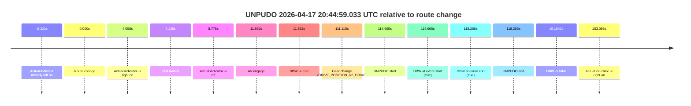
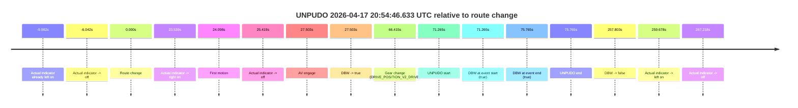
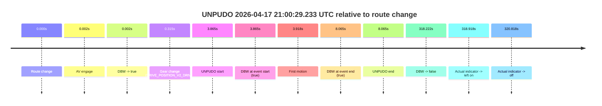

# Run Report: fme20031/2026-04-17--20-37-18--gen2-av-c0532c1c-1dc9-47f9-bf61-1150824d2c0e

| Field | Value |
|---|---|
| Run ID | `fme20031/2026-04-17--20-37-18--gen2-av-c0532c1c-1dc9-47f9-bf61-1150824d2c0e` |
| Date | `2026-04-17` |
| Model(s) | `eel-teal-outspoken` |
| Author | `zak` |
| Event count | `3` |

## unpudo 2026-04-17 20:44:59.033 UTC

| Field | Value |
|---|---|
| Model | `eel-teal-outspoken` |
| Author | `zak` |
| Run ID | `fme20031/2026-04-17--20-37-18--gen2-av-c0532c1c-1dc9-47f9-bf61-1150824d2c0e` |
| Date | `2026-04-17` |
| Time (UTC) | `20:44:59.033` |
| Event type | `unpudo` |
| Disengagement type | `none observed` |
| Route change | `found` |
| Console | [run](https://console.sso.wayve.ai/run/fme20031/2026-04-17--20-37-18--gen2-av-c0532c1c-1dc9-47f9-bf61-1150824d2c0e?id=&time-unixus=1776458699033318) |
| Foxglove | [segment](https://app.foxglove.dev/wayve-on-prem/p/prj_0dX18KZdVHg1fmmI/view?ds=foxglove-stream&ds.deviceName=fme20031&ds.start=2026-04-17T20%3A42%3A54.368244Z&ds.end=2026-04-17T20%3A45%3A46.209923Z&layoutId=lay_0e7VD4WIKDQGU73Y&time=2026-04-17T20%3A44%3A59.033318Z) |

### Event card: pass

- Pass: AV owns the credited unpudo from route change through the official unpudo window, the gear state is aligned at the anchor, and the vehicle moves without driver accelerator help in AV.

| Event | Time (UTC) | Delta from route change |
|---|---:|---:|
| Actual indicator already left on | 2026-04-17 20:42:59.046 | `-5.322s` |
| Route change | 2026-04-17 20:43:04.368 | `0.000s` |
| Actual indicator -> right on | 2026-04-17 20:43:08.426 | `4.058s` |
| First motion | 2026-04-17 20:43:11.506 | `7.138s` |
| Actual indicator -> off | 2026-04-17 20:43:13.146 | `8.778s` |
| AV engage | 2026-04-17 20:43:16.229 | `11.862s` |
| DBW -> true | 2026-04-17 20:43:16.229 | `11.862s` |
| Gear change (DRIVE_POSITION_V2_DRIVE) | 2026-04-17 20:44:55.483 | `111.115s` |
| UNPUDO start | 2026-04-17 20:44:59.033 | `114.665s` |
| DBW at event start (true) | 2026-04-17 20:44:59.033 | `114.665s` |
| DBW at event end (true) | 2026-04-17 20:45:02.633 | `118.265s` |
| UNPUDO end | 2026-04-17 20:45:02.633 | `118.265s` |
| DBW -> false | 2026-04-17 20:45:36.209 | `151.842s` |
| Actual indicator -> right on | 2026-04-17 20:45:37.466 | `153.098s` |

| Metric | Value |
|---|---|
| Outcome | `pass` |
| Effective failure type | `none` |
| Route change status | `found` |
| DBW at event start | `true` |
| DBW at event end | `true` |
| Predicted gear at AV start | `DRIVE_POSITION_V2_DRIVE` |
| Actual gear at AV start | `DRIVE_POSITION_V2_DRIVE` |
| Predicted gear at event start | `DRIVE_POSITION_V2_DRIVE` |
| Actual gear at event start | `DRIVE_POSITION_V2_DRIVE` |
| Planned indicator direction | `INDICATORS_STATE_V2_LEFT_ON` |
| Controller indicator direction | `INDICATORS_STATE_V2_LEFT_ON` |
| Actual indicator direction | `INDICATORS_STATE_V2_OFF` |
| Actual indicator at maneuver end | `INDICATORS_STATE_V2_OFF` |
| Driver accel help in AV | `false` |
| Driver accel help timestamp | `n/a` |
| Max accel pedal pct in AV | `0.0%` |
| Max brake pedal pct in AV | `20.6%` |
| Max speed mps in AV | `6.472` |
| Success timing baseline | `route change` |
| Route -> AV | `11.862s` |
| AV -> event start | `102.803s` |
| AV -> first motion | `-4.724s` |
| Success baseline -> event start | `114.665s` |
| Success baseline -> first motion | `7.138s` |
| AV duration before disengagement | `139.980s` |
| Trajectory waypoint count | `38` |
| Driving-plan step count | `11` |

The scored portion starts from the AV-owned window, not from the pre-AV setup. Route-change search in the stopped pre-event segment was `found`, with the baseline therefore set to route change. At the event anchor the model predicts `DRIVE_POSITION_V2_DRIVE` and the actual gear is `DRIVE_POSITION_V2_DRIVE`. The effective model outcome is `pass` because `the credited unpudo stays AV-owned through the official unpudo window.`

### Resolution

| Field | Value |
|---|---|
| Final outcome | `pass` |
| Do we agree with this label? | `yes` |
| Source disengagement type | `none observed` |
| Resolved effective failure type | `none` |
| Confidence | `high` |

## unpudo 2026-04-17 20:54:46.633 UTC

| Field | Value |
|---|---|
| Model | `eel-teal-outspoken` |
| Author | `zak` |
| Run ID | `fme20031/2026-04-17--20-37-18--gen2-av-c0532c1c-1dc9-47f9-bf61-1150824d2c0e` |
| Date | `2026-04-17` |
| Time (UTC) | `20:54:46.633` |
| Event type | `unpudo` |
| Disengagement type | `none observed` |
| Route change | `found` |
| Console | [run](https://console.sso.wayve.ai/run/fme20031/2026-04-17--20-37-18--gen2-av-c0532c1c-1dc9-47f9-bf61-1150824d2c0e?id=&time-unixus=1776459286633311) |
| Foxglove | [segment](https://app.foxglove.dev/wayve-on-prem/p/prj_0dX18KZdVHg1fmmI/view?ds=foxglove-stream&ds.deviceName=fme20031&ds.start=2026-04-17T20%3A53%3A25.368278Z&ds.end=2026-04-17T20%3A58%3A03.171535Z&layoutId=lay_0e7VD4WIKDQGU73Y&time=2026-04-17T20%3A54%3A46.633311Z) |

### Event card: pass

- Pass: AV owns the credited unpudo from route change through the official unpudo window, the gear state is aligned at the anchor, and the vehicle moves without driver accelerator help in AV.

| Event | Time (UTC) | Delta from route change |
|---|---:|---:|
| Actual indicator already left on | 2026-04-17 20:53:25.386 | `-9.982s` |
| Actual indicator -> off | 2026-04-17 20:53:29.326 | `-6.042s` |
| Route change | 2026-04-17 20:53:35.368 | `0.000s` |
| Actual indicator -> right on | 2026-04-17 20:53:58.907 | `23.539s` |
| First motion | 2026-04-17 20:53:59.466 | `24.098s` |
| Actual indicator -> off | 2026-04-17 20:54:00.786 | `25.419s` |
| AV engage | 2026-04-17 20:54:02.871 | `27.503s` |
| DBW -> true | 2026-04-17 20:54:02.871 | `27.503s` |
| Gear change (DRIVE_POSITION_V2_DRIVE) | 2026-04-17 20:54:41.783 | `66.415s` |
| UNPUDO start | 2026-04-17 20:54:46.633 | `71.265s` |
| DBW at event start (true) | 2026-04-17 20:54:46.633 | `71.265s` |
| DBW at event end (true) | 2026-04-17 20:54:51.133 | `75.765s` |
| UNPUDO end | 2026-04-17 20:54:51.133 | `75.765s` |
| DBW -> false | 2026-04-17 20:57:53.171 | `257.803s` |
| Actual indicator -> left on | 2026-04-17 20:57:55.046 | `259.678s` |
| Actual indicator -> off | 2026-04-17 20:58:02.586 | `267.218s` |

| Metric | Value |
|---|---|
| Outcome | `pass` |
| Effective failure type | `none` |
| Route change status | `found` |
| DBW at event start | `true` |
| DBW at event end | `true` |
| Predicted gear at AV start | `DRIVE_POSITION_V2_DRIVE` |
| Actual gear at AV start | `DRIVE_POSITION_V2_DRIVE` |
| Predicted gear at event start | `DRIVE_POSITION_V2_DRIVE` |
| Actual gear at event start | `DRIVE_POSITION_V2_DRIVE` |
| Planned indicator direction | `INDICATORS_STATE_V2_RIGHT_ON` |
| Controller indicator direction | `INDICATORS_STATE_V2_RIGHT_ON` |
| Actual indicator direction | `INDICATORS_STATE_V2_OFF` |
| Actual indicator at maneuver end | `INDICATORS_STATE_V2_OFF` |
| Driver accel help in AV | `false` |
| Driver accel help timestamp | `n/a` |
| Max accel pedal pct in AV | `0.0%` |
| Max brake pedal pct in AV | `8.0%` |
| Max speed mps in AV | `4.372` |
| Success timing baseline | `route change` |
| Route -> AV | `27.503s` |
| AV -> event start | `43.762s` |
| AV -> first motion | `-3.405s` |
| Success baseline -> event start | `71.265s` |
| Success baseline -> first motion | `24.098s` |
| AV duration before disengagement | `230.300s` |
| Trajectory waypoint count | `38` |
| Driving-plan step count | `11` |

The scored portion starts from the AV-owned window, not from the pre-AV setup. Route-change search in the stopped pre-event segment was `found`, with the baseline therefore set to route change. At the event anchor the model predicts `DRIVE_POSITION_V2_DRIVE` and the actual gear is `DRIVE_POSITION_V2_DRIVE`. The effective model outcome is `pass` because `the credited unpudo stays AV-owned through the official unpudo window.`

### Resolution

| Field | Value |
|---|---|
| Final outcome | `pass` |
| Do we agree with this label? | `yes` |
| Source disengagement type | `none observed` |
| Resolved effective failure type | `none` |
| Confidence | `high` |

## unpudo 2026-04-17 21:00:29.233 UTC

| Field | Value |
|---|---|
| Model | `eel-teal-outspoken` |
| Author | `zak` |
| Run ID | `fme20031/2026-04-17--20-37-18--gen2-av-c0532c1c-1dc9-47f9-bf61-1150824d2c0e` |
| Date | `2026-04-17` |
| Time (UTC) | `21:00:29.233` |
| Event type | `unpudo` |
| Disengagement type | `none observed` |
| Route change | `found` |
| Console | [run](https://console.sso.wayve.ai/run/fme20031/2026-04-17--20-37-18--gen2-av-c0532c1c-1dc9-47f9-bf61-1150824d2c0e?id=&time-unixus=1776459629233302) |
| Foxglove | [segment](https://app.foxglove.dev/wayve-on-prem/p/prj_0dX18KZdVHg1fmmI/view?ds=foxglove-stream&ds.deviceName=fme20031&ds.start=2026-04-17T21%3A00%3A15.368315Z&ds.end=2026-04-17T21%3A05%3A53.589844Z&layoutId=lay_0e7VD4WIKDQGU73Y&time=2026-04-17T21%3A00%3A29.233302Z) |

### Event card: pass

- Pass: AV owns the credited unpudo from route change through the official unpudo window, the gear state is aligned at the anchor, and the vehicle moves without driver accelerator help in AV.

| Event | Time (UTC) | Delta from route change |
|---|---:|---:|
| Route change | 2026-04-17 21:00:25.368 | `0.000s` |
| AV engage | 2026-04-17 21:00:25.369 | `0.002s` |
| DBW -> true | 2026-04-17 21:00:25.369 | `0.002s` |
| Gear change (DRIVE_POSITION_V2_DRIVE) | 2026-04-17 21:00:25.683 | `0.315s` |
| UNPUDO start | 2026-04-17 21:00:29.233 | `3.865s` |
| DBW at event start (true) | 2026-04-17 21:00:29.233 | `3.865s` |
| First motion | 2026-04-17 21:00:29.286 | `3.918s` |
| DBW at event end (true) | 2026-04-17 21:00:33.433 | `8.065s` |
| UNPUDO end | 2026-04-17 21:00:33.433 | `8.065s` |
| DBW -> false | 2026-04-17 21:05:43.589 | `318.222s` |
| Actual indicator -> left on | 2026-04-17 21:05:44.286 | `318.918s` |
| Actual indicator -> off | 2026-04-17 21:05:46.186 | `320.818s` |

| Metric | Value |
|---|---|
| Outcome | `pass` |
| Effective failure type | `none` |
| Route change status | `found` |
| DBW at event start | `true` |
| DBW at event end | `true` |
| Predicted gear at AV start | `DRIVE_POSITION_V2_PARK` |
| Actual gear at AV start | `DRIVE_POSITION_V2_PARK` |
| Predicted gear at event start | `DRIVE_POSITION_V2_DRIVE` |
| Actual gear at event start | `DRIVE_POSITION_V2_DRIVE` |
| Planned indicator direction | `INDICATORS_STATE_V2_RIGHT_ON` |
| Controller indicator direction | `INDICATORS_STATE_V2_RIGHT_ON` |
| Actual indicator direction | `INDICATORS_STATE_V2_OFF` |
| Actual indicator at maneuver end | `INDICATORS_STATE_V2_OFF` |
| Driver accel help in AV | `false` |
| Driver accel help timestamp | `n/a` |
| Max accel pedal pct in AV | `0.0%` |
| Max brake pedal pct in AV | `8.0%` |
| Max speed mps in AV | `4.164` |
| Success timing baseline | `route change` |
| Route -> AV | `0.002s` |
| AV -> event start | `3.863s` |
| AV -> first motion | `3.916s` |
| Success baseline -> event start | `3.865s` |
| Success baseline -> first motion | `3.918s` |
| AV duration before disengagement | `318.220s` |
| Trajectory waypoint count | `38` |
| Driving-plan step count | `11` |

The scored portion starts from the AV-owned window, not from the pre-AV setup. Route-change search in the stopped pre-event segment was `found`, with the baseline therefore set to route change. At the event anchor the model predicts `DRIVE_POSITION_V2_DRIVE` and the actual gear is `DRIVE_POSITION_V2_DRIVE`. The effective model outcome is `pass` because `the credited unpudo stays AV-owned through the official unpudo window.`

### Resolution

| Field | Value |
|---|---|
| Final outcome | `pass` |
| Do we agree with this label? | `yes` |
| Source disengagement type | `none observed` |
| Resolved effective failure type | `none` |
| Confidence | `high` |
