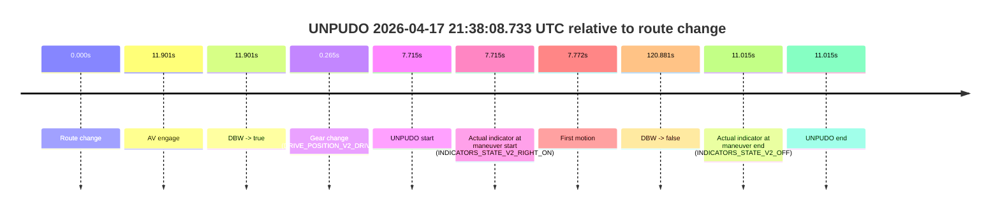
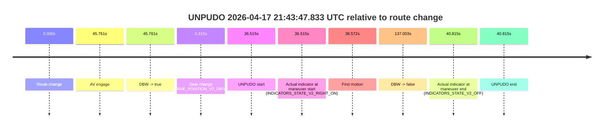
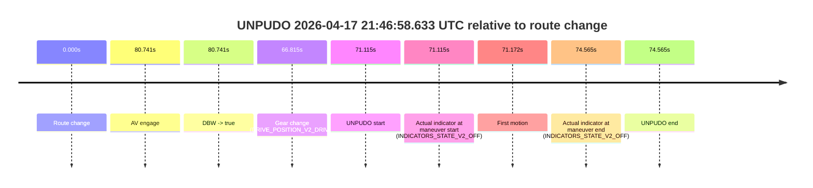

# Run Report: fme20031/2026-04-17--21-26-56--gen2-av-ac94ac3e-bf48-481e-bc17-f0cef5b833a0

| Field | Value |
|---|---|
| Run ID | `fme20031/2026-04-17--21-26-56--gen2-av-ac94ac3e-bf48-481e-bc17-f0cef5b833a0` |
| Date | `2026-04-17` |
| Model(s) | `satisfied-amber-moose` |
| Author | `guy.geva` |
| Event count | `4` |

## unpudo 2026-04-17 21:38:08.733 UTC

| Field | Value |
|---|---|
| Model | `satisfied-amber-moose` |
| Author | `guy.geva` |
| Run ID | `fme20031/2026-04-17--21-26-56--gen2-av-ac94ac3e-bf48-481e-bc17-f0cef5b833a0` |
| Date | `2026-04-17` |
| Time (UTC) | `21:38:08.733` |
| Event type | `unpudo` |
| Disengagement type | `failed_to_unpudo` |
| Route change | `found` |
| Console | [run](https://console.sso.wayve.ai/run/fme20031/2026-04-17--21-26-56--gen2-av-ac94ac3e-bf48-481e-bc17-f0cef5b833a0?id=&time-unixus=1776461888733329) |
| Foxglove | [segment](https://app.foxglove.dev/wayve-on-prem/p/prj_0dX18KZdVHg1fmmI/view?ds=foxglove-stream&ds.deviceName=fme20031&ds.start=2026-04-17T21%3A37%3A51.018364Z&ds.end=2026-04-17T21%3A40%3A11.899539Z&layoutId=lay_0e7VD4WIKDQGU73Y&time=2026-04-17T21%3A38%3A08.733329Z) |

### Event card: fail

- Fail: AV owns part of the segment, but the event still resolves as a model-performance failure under the AV-only scoring rule.

| Event | Time (UTC) | Delta from route change |
|---|---:|---:|
| Route change | 2026-04-17 21:38:01.018 | `0.000s` |
| AV engage | 2026-04-17 21:38:12.919 | `11.901s` |
| DBW -> true | 2026-04-17 21:38:12.919 | `11.901s` |
| Gear change (DRIVE_POSITION_V2_DRIVE) | 2026-04-17 21:38:01.283 | `0.265s` |
| UNPUDO start | 2026-04-17 21:38:08.733 | `7.715s` |
| Actual indicator at maneuver start (INDICATORS_STATE_V2_RIGHT_ON) | 2026-04-17 21:38:08.733 | `7.715s` |
| First motion | 2026-04-17 21:38:08.790 | `7.772s` |
| DBW -> false | 2026-04-17 21:40:01.899 | `120.881s` |
| Actual indicator at maneuver end (INDICATORS_STATE_V2_OFF) | 2026-04-17 21:38:12.033 | `11.015s` |
| UNPUDO end | 2026-04-17 21:38:12.033 | `11.015s` |

| Metric | Value |
|---|---|
| Outcome | `fail` |
| Effective failure type | `failed_to_unpudo` |
| Route change status | `found` |
| DBW at event start | `false` |
| DBW at event end | `false` |
| Predicted gear at AV start | `DRIVE_POSITION_V2_DRIVE` |
| Actual gear at AV start | `DRIVE_POSITION_V2_DRIVE` |
| Predicted gear at event start | `DRIVE_POSITION_V2_DRIVE` |
| Actual gear at event start | `DRIVE_POSITION_V2_DRIVE` |
| Planned indicator direction | `INDICATORS_STATE_V2_RIGHT_ON` |
| Controller indicator direction | `INDICATORS_STATE_V2_RIGHT_ON` |
| Actual indicator direction | `INDICATORS_STATE_V2_RIGHT_ON` |
| Actual indicator at maneuver end | `INDICATORS_STATE_V2_OFF` |
| Driver accel help in AV | `false` |
| Driver accel help timestamp | `n/a` |
| Max accel pedal pct in AV | `0.0%` |
| Max brake pedal pct in AV | `0.0%` |
| Max speed mps in AV | `0.000` |
| Route -> AV | `11.901s` |
| AV -> event start | `-4.186s` |
| AV -> first motion | `-4.129s` |
| AV duration before disengagement | `108.980s` |
| Trajectory waypoint count | `36` |
| Driving-plan step count | `11` |

The scored portion starts from the AV-owned window, not from the pre-AV setup. Route-change search in the stopped pre-event segment was `found`, with the baseline therefore set to route change. At the event anchor the model predicts `DRIVE_POSITION_V2_DRIVE` and the actual gear is `DRIVE_POSITION_V2_DRIVE`. The effective model outcome is `fail` because `failed_to_unpudo`.

### Resolution

| Field | Value |
|---|---|
| Final outcome | `fail` |
| Do we agree with this label? | `yes` |
| Source disengagement type | `failed_to_unpudo` |
| Resolved effective failure type | `failed_to_unpudo` |
| Confidence | `high` |

## unpudo 2026-04-17 21:40:41.933 UTC

| Field | Value |
|---|---|
| Model | `satisfied-amber-moose` |
| Author | `guy.geva` |
| Run ID | `fme20031/2026-04-17--21-26-56--gen2-av-ac94ac3e-bf48-481e-bc17-f0cef5b833a0` |
| Date | `2026-04-17` |
| Time (UTC) | `21:40:41.933` |
| Event type | `unpudo` |
| Disengagement type | `failed_to_unpudo` |
| Route change | `found` |
| Console | [run](https://console.sso.wayve.ai/run/fme20031/2026-04-17--21-26-56--gen2-av-ac94ac3e-bf48-481e-bc17-f0cef5b833a0?id=&time-unixus=1776462041933303) |
| Foxglove | [segment](https://app.foxglove.dev/wayve-on-prem/p/prj_0dX18KZdVHg1fmmI/view?ds=foxglove-stream&ds.deviceName=fme20031&ds.start=2026-04-17T21%3A40%3A08.218320Z&ds.end=2026-04-17T21%3A43%3A57.320111Z&layoutId=lay_0e7VD4WIKDQGU73Y&time=2026-04-17T21%3A40%3A41.933303Z) |

### Event card: fail

- Fail: AV owns part of the segment, but the event still resolves as a model-performance failure under the AV-only scoring rule.

| Event | Time (UTC) | Delta from route change |
|---|---:|---:|
| Route change | 2026-04-17 21:40:18.218 | `0.000s` |
| AV engage | 2026-04-17 21:40:58.400 | `40.182s` |
| DBW -> true | 2026-04-17 21:40:58.400 | `40.182s` |
| Gear change (DRIVE_POSITION_V2_DRIVE) | 2026-04-17 21:40:19.783 | `1.565s` |
| UNPUDO start | 2026-04-17 21:40:41.933 | `23.715s` |
| Actual indicator at maneuver start (INDICATORS_STATE_V2_RIGHT_ON) | 2026-04-17 21:40:41.933 | `23.715s` |
| First motion | 2026-04-17 21:40:41.990 | `23.773s` |
| DBW -> false | 2026-04-17 21:43:47.320 | `209.102s` |
| Actual indicator at maneuver end (INDICATORS_STATE_V2_OFF) | 2026-04-17 21:40:45.033 | `26.815s` |
| UNPUDO end | 2026-04-17 21:40:45.033 | `26.815s` |

| Metric | Value |
|---|---|
| Outcome | `fail` |
| Effective failure type | `failed_to_unpudo` |
| Route change status | `found` |
| DBW at event start | `false` |
| DBW at event end | `false` |
| Predicted gear at AV start | `DRIVE_POSITION_V2_DRIVE` |
| Actual gear at AV start | `DRIVE_POSITION_V2_DRIVE` |
| Predicted gear at event start | `DRIVE_POSITION_V2_DRIVE` |
| Actual gear at event start | `DRIVE_POSITION_V2_DRIVE` |
| Planned indicator direction | `INDICATORS_STATE_V2_LEFT_ON` |
| Controller indicator direction | `INDICATORS_STATE_V2_LEFT_ON` |
| Actual indicator direction | `INDICATORS_STATE_V2_RIGHT_ON` |
| Actual indicator at maneuver end | `INDICATORS_STATE_V2_OFF` |
| Driver accel help in AV | `false` |
| Driver accel help timestamp | `n/a` |
| Max accel pedal pct in AV | `0.0%` |
| Max brake pedal pct in AV | `0.0%` |
| Max speed mps in AV | `0.000` |
| Route -> AV | `40.182s` |
| AV -> event start | `-16.467s` |
| AV -> first motion | `-16.410s` |
| AV duration before disengagement | `168.919s` |
| Trajectory waypoint count | `36` |
| Driving-plan step count | `11` |

The scored portion starts from the AV-owned window, not from the pre-AV setup. Route-change search in the stopped pre-event segment was `found`, with the baseline therefore set to route change. At the event anchor the model predicts `DRIVE_POSITION_V2_DRIVE` and the actual gear is `DRIVE_POSITION_V2_DRIVE`. The effective model outcome is `fail` because `failed_to_unpudo`.

### Resolution

| Field | Value |
|---|---|
| Final outcome | `fail` |
| Do we agree with this label? | `yes` |
| Source disengagement type | `failed_to_unpudo` |
| Resolved effective failure type | `failed_to_unpudo` |
| Confidence | `high` |

## unpudo 2026-04-17 21:43:47.833 UTC

| Field | Value |
|---|---|
| Model | `satisfied-amber-moose` |
| Author | `guy.geva` |
| Run ID | `fme20031/2026-04-17--21-26-56--gen2-av-ac94ac3e-bf48-481e-bc17-f0cef5b833a0` |
| Date | `2026-04-17` |
| Time (UTC) | `21:43:47.833` |
| Event type | `unpudo` |
| Disengagement type | `failed_to_unpudo` |
| Route change | `found` |
| Console | [run](https://console.sso.wayve.ai/run/fme20031/2026-04-17--21-26-56--gen2-av-ac94ac3e-bf48-481e-bc17-f0cef5b833a0?id=&time-unixus=1776462227833299) |
| Foxglove | [segment](https://app.foxglove.dev/wayve-on-prem/p/prj_0dX18KZdVHg1fmmI/view?ds=foxglove-stream&ds.deviceName=fme20031&ds.start=2026-04-17T21%3A43%3A01.318323Z&ds.end=2026-04-17T21%3A45%3A38.321096Z&layoutId=lay_0e7VD4WIKDQGU73Y&time=2026-04-17T21%3A43%3A47.833299Z) |

### Event card: fail

- Fail: AV owns part of the segment, but the event still resolves as a model-performance failure under the AV-only scoring rule.

| Event | Time (UTC) | Delta from route change |
|---|---:|---:|
| Route change | 2026-04-17 21:43:11.318 | `0.000s` |
| AV engage | 2026-04-17 21:43:57.079 | `45.761s` |
| DBW -> true | 2026-04-17 21:43:57.079 | `45.761s` |
| Gear change (DRIVE_POSITION_V2_DRIVE) | 2026-04-17 21:43:11.633 | `0.315s` |
| UNPUDO start | 2026-04-17 21:43:47.833 | `36.515s` |
| Actual indicator at maneuver start (INDICATORS_STATE_V2_RIGHT_ON) | 2026-04-17 21:43:47.833 | `36.515s` |
| First motion | 2026-04-17 21:43:47.890 | `36.572s` |
| DBW -> false | 2026-04-17 21:45:28.321 | `137.003s` |
| Actual indicator at maneuver end (INDICATORS_STATE_V2_OFF) | 2026-04-17 21:43:52.133 | `40.815s` |
| UNPUDO end | 2026-04-17 21:43:52.133 | `40.815s` |

| Metric | Value |
|---|---|
| Outcome | `fail` |
| Effective failure type | `failed_to_unpudo` |
| Route change status | `found` |
| DBW at event start | `false` |
| DBW at event end | `false` |
| Predicted gear at AV start | `DRIVE_POSITION_V2_DRIVE` |
| Actual gear at AV start | `DRIVE_POSITION_V2_DRIVE` |
| Predicted gear at event start | `DRIVE_POSITION_V2_DRIVE` |
| Actual gear at event start | `DRIVE_POSITION_V2_DRIVE` |
| Planned indicator direction | `INDICATORS_STATE_V2_RIGHT_ON` |
| Controller indicator direction | `INDICATORS_STATE_V2_RIGHT_ON` |
| Actual indicator direction | `INDICATORS_STATE_V2_RIGHT_ON` |
| Actual indicator at maneuver end | `INDICATORS_STATE_V2_OFF` |
| Driver accel help in AV | `false` |
| Driver accel help timestamp | `n/a` |
| Max accel pedal pct in AV | `0.0%` |
| Max brake pedal pct in AV | `0.0%` |
| Max speed mps in AV | `0.000` |
| Route -> AV | `45.761s` |
| AV -> event start | `-9.246s` |
| AV -> first motion | `-9.189s` |
| AV duration before disengagement | `91.242s` |
| Trajectory waypoint count | `36` |
| Driving-plan step count | `11` |

The scored portion starts from the AV-owned window, not from the pre-AV setup. Route-change search in the stopped pre-event segment was `found`, with the baseline therefore set to route change. At the event anchor the model predicts `DRIVE_POSITION_V2_DRIVE` and the actual gear is `DRIVE_POSITION_V2_DRIVE`. The effective model outcome is `fail` because `failed_to_unpudo`.

### Resolution

| Field | Value |
|---|---|
| Final outcome | `fail` |
| Do we agree with this label? | `yes` |
| Source disengagement type | `failed_to_unpudo` |
| Resolved effective failure type | `failed_to_unpudo` |
| Confidence | `high` |

## unpudo 2026-04-17 21:46:58.633 UTC

| Field | Value |
|---|---|
| Model | `satisfied-amber-moose` |
| Author | `guy.geva` |
| Run ID | `fme20031/2026-04-17--21-26-56--gen2-av-ac94ac3e-bf48-481e-bc17-f0cef5b833a0` |
| Date | `2026-04-17` |
| Time (UTC) | `21:46:58.633` |
| Event type | `unpudo` |
| Disengagement type | `failed_to_unpudo` |
| Route change | `found` |
| Console | [run](https://console.sso.wayve.ai/run/fme20031/2026-04-17--21-26-56--gen2-av-ac94ac3e-bf48-481e-bc17-f0cef5b833a0?id=&time-unixus=1776462418633298) |
| Foxglove | [segment](https://app.foxglove.dev/wayve-on-prem/p/prj_0dX18KZdVHg1fmmI/view?ds=foxglove-stream&ds.deviceName=fme20031&ds.start=2026-04-17T21%3A45%3A37.518238Z&ds.end=2026-04-17T21%3A47%3A12.083312Z&layoutId=lay_0e7VD4WIKDQGU73Y&time=2026-04-17T21%3A46%3A58.633298Z) |

### Event card: fail

- Fail: AV owns part of the segment, but the event still resolves as a model-performance failure under the AV-only scoring rule.

| Event | Time (UTC) | Delta from route change |
|---|---:|---:|
| Route change | 2026-04-17 21:45:47.518 | `0.000s` |
| AV engage | 2026-04-17 21:47:08.259 | `80.741s` |
| DBW -> true | 2026-04-17 21:47:08.259 | `80.741s` |
| Gear change (DRIVE_POSITION_V2_DRIVE) | 2026-04-17 21:46:54.333 | `66.815s` |
| UNPUDO start | 2026-04-17 21:46:58.633 | `71.115s` |
| Actual indicator at maneuver start (INDICATORS_STATE_V2_OFF) | 2026-04-17 21:46:58.633 | `71.115s` |
| First motion | 2026-04-17 21:46:58.690 | `71.172s` |
| Actual indicator at maneuver end (INDICATORS_STATE_V2_OFF) | 2026-04-17 21:47:02.083 | `74.565s` |
| UNPUDO end | 2026-04-17 21:47:02.083 | `74.565s` |

| Metric | Value |
|---|---|
| Outcome | `fail` |
| Effective failure type | `failed_to_unpudo` |
| Route change status | `found` |
| DBW at event start | `false` |
| DBW at event end | `false` |
| Predicted gear at AV start | `DRIVE_POSITION_V2_DRIVE` |
| Actual gear at AV start | `DRIVE_POSITION_V2_DRIVE` |
| Predicted gear at event start | `DRIVE_POSITION_V2_DRIVE` |
| Actual gear at event start | `DRIVE_POSITION_V2_DRIVE` |
| Planned indicator direction | `INDICATORS_STATE_V2_LEFT_ON` |
| Controller indicator direction | `INDICATORS_STATE_V2_LEFT_ON` |
| Actual indicator direction | `INDICATORS_STATE_V2_OFF` |
| Actual indicator at maneuver end | `INDICATORS_STATE_V2_OFF` |
| Driver accel help in AV | `false` |
| Driver accel help timestamp | `n/a` |
| Max accel pedal pct in AV | `0.0%` |
| Max brake pedal pct in AV | `0.0%` |
| Max speed mps in AV | `0.000` |
| Route -> AV | `80.741s` |
| AV -> event start | `-9.626s` |
| AV -> first motion | `-9.569s` |
| AV duration before disengagement | `n/a` |
| Trajectory waypoint count | `36` |
| Driving-plan step count | `11` |

The scored portion starts from the AV-owned window, not from the pre-AV setup. Route-change search in the stopped pre-event segment was `found`, with the baseline therefore set to route change. At the event anchor the model predicts `DRIVE_POSITION_V2_DRIVE` and the actual gear is `DRIVE_POSITION_V2_DRIVE`. The effective model outcome is `fail` because `failed_to_unpudo`.

### Resolution

| Field | Value |
|---|---|
| Final outcome | `fail` |
| Do we agree with this label? | `yes` |
| Source disengagement type | `failed_to_unpudo` |
| Resolved effective failure type | `failed_to_unpudo` |
| Confidence | `high` |
