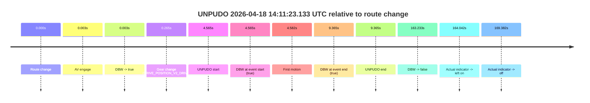
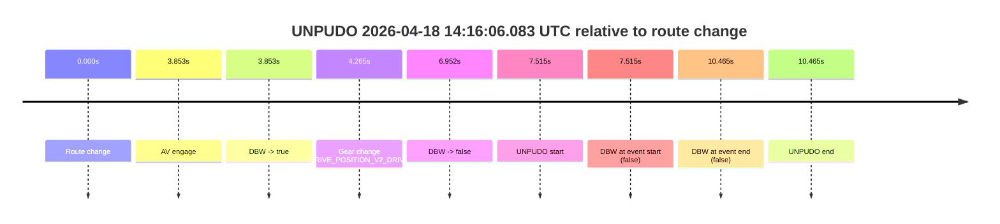
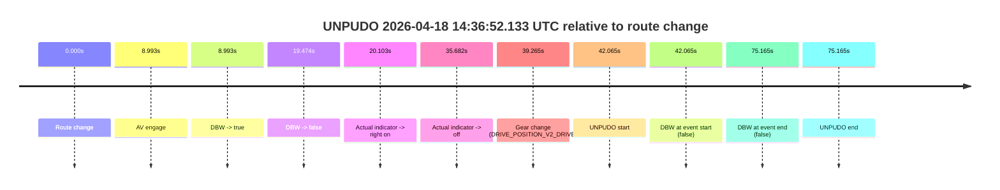
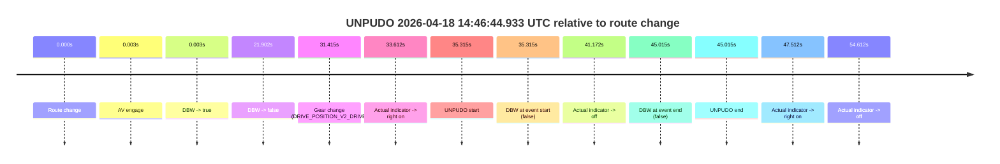
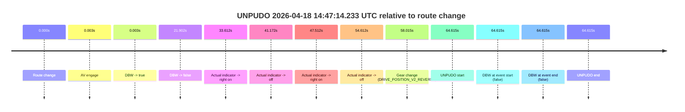
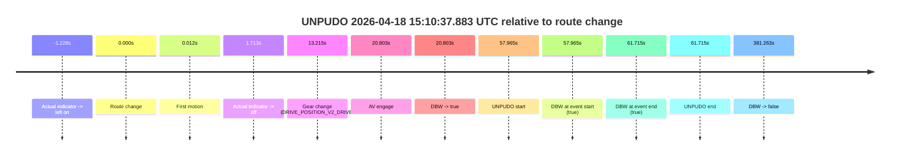
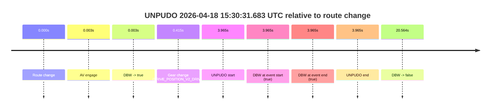
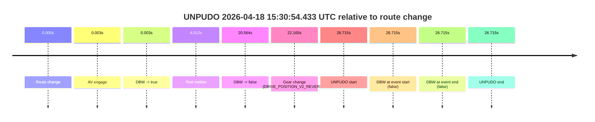

# Run Report: fme20031/2026-04-18--14-00-41--gen2-av-7e9d7d44-e838-4236-8d36-e744ade00ee8

| Field | Value |
|---|---|
| Run ID | `fme20031/2026-04-18--14-00-41--gen2-av-7e9d7d44-e838-4236-8d36-e744ade00ee8` |
| Date | `2026-04-18` |
| Model(s) | `eel-teal-outspoken` |
| Author | `zak` |
| Event count | `8` |

## unpudo 2026-04-18 14:11:23.133 UTC

| Field | Value |
|---|---|
| Model | `eel-teal-outspoken` |
| Author | `zak` |
| Run ID | `fme20031/2026-04-18--14-00-41--gen2-av-7e9d7d44-e838-4236-8d36-e744ade00ee8` |
| Date | `2026-04-18` |
| Time (UTC) | `14:11:23.133` |
| Event type | `unpudo` |
| Disengagement type | `none observed` |
| Route change | `found` |
| Console | [run](https://console.sso.wayve.ai/run/fme20031/2026-04-18--14-00-41--gen2-av-7e9d7d44-e838-4236-8d36-e744ade00ee8?id=&time-unixus=1776521483133303) |
| Foxglove | [segment](https://app.foxglove.dev/wayve-on-prem/p/prj_0dX18KZdVHg1fmmI/view?ds=foxglove-stream&ds.deviceName=fme20031&ds.start=2026-04-18T14%3A11%3A08.568266Z&ds.end=2026-04-18T14%3A14%3A11.801635Z&layoutId=lay_0e7VD4WIKDQGU73Y&time=2026-04-18T14%3A11%3A23.133303Z) |

### Event card: pass

- Pass: AV owns the credited unpudo from route change through the official unpudo window, the gear state is aligned at the anchor, and the vehicle moves without driver accelerator help in AV.

| Event | Time (UTC) | Delta from route change |
|---|---:|---:|
| Route change | 2026-04-18 14:11:18.568 | `0.000s` |
| AV engage | 2026-04-18 14:11:18.571 | `0.003s` |
| DBW -> true | 2026-04-18 14:11:18.571 | `0.003s` |
| Gear change (DRIVE_POSITION_V2_DRIVE) | 2026-04-18 14:11:18.833 | `0.265s` |
| UNPUDO start | 2026-04-18 14:11:23.133 | `4.565s` |
| DBW at event start (true) | 2026-04-18 14:11:23.133 | `4.565s` |
| First motion | 2026-04-18 14:11:23.150 | `4.582s` |
| DBW at event end (true) | 2026-04-18 14:11:27.933 | `9.365s` |
| UNPUDO end | 2026-04-18 14:11:27.933 | `9.365s` |
| DBW -> false | 2026-04-18 14:14:01.801 | `163.233s` |
| Actual indicator -> left on | 2026-04-18 14:14:02.610 | `164.042s` |
| Actual indicator -> off | 2026-04-18 14:14:07.950 | `169.382s` |

| Metric | Value |
|---|---|
| Outcome | `pass` |
| Effective failure type | `none` |
| Route change status | `found` |
| DBW at event start | `true` |
| DBW at event end | `true` |
| Predicted gear at AV start | `DRIVE_POSITION_V2_PARK` |
| Actual gear at AV start | `DRIVE_POSITION_V2_PARK` |
| Predicted gear at event start | `DRIVE_POSITION_V2_DRIVE` |
| Actual gear at event start | `DRIVE_POSITION_V2_DRIVE` |
| Planned indicator direction | `INDICATORS_STATE_V2_RIGHT_ON` |
| Controller indicator direction | `INDICATORS_STATE_V2_RIGHT_ON` |
| Actual indicator direction | `INDICATORS_STATE_V2_OFF` |
| Actual indicator at maneuver end | `INDICATORS_STATE_V2_OFF` |
| Driver accel help in AV | `false` |
| Driver accel help timestamp | `n/a` |
| Max accel pedal pct in AV | `0.0%` |
| Max brake pedal pct in AV | `8.9%` |
| Max speed mps in AV | `2.858` |
| Success timing baseline | `route change` |
| Route -> AV | `0.003s` |
| AV -> event start | `4.562s` |
| AV -> first motion | `4.579s` |
| Success baseline -> event start | `4.565s` |
| Success baseline -> first motion | `4.582s` |
| AV duration before disengagement | `163.230s` |
| Trajectory waypoint count | `38` |
| Driving-plan step count | `11` |

The scored portion starts from the AV-owned window, not from the pre-AV setup. Route-change search in the stopped pre-event segment was `found`, with the baseline therefore set to route change. At the event anchor the model predicts `DRIVE_POSITION_V2_DRIVE` and the actual gear is `DRIVE_POSITION_V2_DRIVE`. The effective model outcome is `pass` because `the credited unpudo stays AV-owned through the official unpudo window.`

### Resolution

| Field | Value |
|---|---|
| Final outcome | `pass` |
| Do we agree with this label? | `yes` |
| Source disengagement type | `none observed` |
| Resolved effective failure type | `none` |
| Confidence | `high` |

## unpudo 2026-04-18 14:16:06.083 UTC

| Field | Value |
|---|---|
| Model | `eel-teal-outspoken` |
| Author | `zak` |
| Run ID | `fme20031/2026-04-18--14-00-41--gen2-av-7e9d7d44-e838-4236-8d36-e744ade00ee8` |
| Date | `2026-04-18` |
| Time (UTC) | `14:16:06.083` |
| Event type | `unpudo` |
| Disengagement type | `none observed` |
| Route change | `found` |
| Console | [run](https://console.sso.wayve.ai/run/fme20031/2026-04-18--14-00-41--gen2-av-7e9d7d44-e838-4236-8d36-e744ade00ee8?id=&time-unixus=1776521766083299) |
| Foxglove | [segment](https://app.foxglove.dev/wayve-on-prem/p/prj_0dX18KZdVHg1fmmI/view?ds=foxglove-stream&ds.deviceName=fme20031&ds.start=2026-04-18T14%3A15%3A48.568280Z&ds.end=2026-04-18T14%3A16%3A19.033298Z&layoutId=lay_0e7VD4WIKDQGU73Y&time=2026-04-18T14%3A16%3A06.083299Z) |

### Event card: fail

- Fail: the credited unpudo does not stay AV-owned. The event window starts with DBW false, and the maneuver outcome lands outside a clean AV-owned segment.

| Event | Time (UTC) | Delta from route change |
|---|---:|---:|
| Route change | 2026-04-18 14:15:58.568 | `0.000s` |
| AV engage | 2026-04-18 14:16:02.421 | `3.853s` |
| DBW -> true | 2026-04-18 14:16:02.421 | `3.853s` |
| Gear change (DRIVE_POSITION_V2_DRIVE) | 2026-04-18 14:16:02.833 | `4.265s` |
| DBW -> false | 2026-04-18 14:16:05.520 | `6.952s` |
| UNPUDO start | 2026-04-18 14:16:06.083 | `7.515s` |
| DBW at event start (false) | 2026-04-18 14:16:06.083 | `7.515s` |
| DBW at event end (false) | 2026-04-18 14:16:09.033 | `10.465s` |
| UNPUDO end | 2026-04-18 14:16:09.033 | `10.465s` |

| Metric | Value |
|---|---|
| Outcome | `fail` |
| Effective failure type | `not_av_owned` |
| Route change status | `found` |
| DBW at event start | `false` |
| DBW at event end | `false` |
| Predicted gear at AV start | `DRIVE_POSITION_V2_DRIVE` |
| Actual gear at AV start | `DRIVE_POSITION_V2_PARK` |
| Predicted gear at event start | `DRIVE_POSITION_V2_DRIVE` |
| Actual gear at event start | `DRIVE_POSITION_V2_DRIVE` |
| Planned indicator direction | `INDICATORS_STATE_V2_RIGHT_ON` |
| Controller indicator direction | `INDICATORS_STATE_V2_RIGHT_ON` |
| Actual indicator direction | `INDICATORS_STATE_V2_OFF` |
| Actual indicator at maneuver end | `INDICATORS_STATE_V2_OFF` |
| Driver accel help in AV | `false` |
| Driver accel help timestamp | `n/a` |
| Max accel pedal pct in AV | `0.0%` |
| Max brake pedal pct in AV | `8.5%` |
| Max speed mps in AV | `0.000` |
| Success timing baseline | `route change` |
| Route -> AV | `3.853s` |
| AV -> event start | `3.662s` |
| AV -> first motion | `n/a` |
| Success baseline -> event start | `7.515s` |
| Success baseline -> first motion | `n/a` |
| AV duration before disengagement | `3.099s` |
| Trajectory waypoint count | `37` |
| Driving-plan step count | `11` |

The scored portion starts from the AV-owned window, not from the pre-AV setup. Route-change search in the stopped pre-event segment was `found`, with the baseline therefore set to route change. At the event anchor the model predicts `DRIVE_POSITION_V2_DRIVE` and the actual gear is `DRIVE_POSITION_V2_DRIVE`. The effective model outcome is `fail` because `not_av_owned.`

### Resolution

| Field | Value |
|---|---|
| Final outcome | `fail` |
| Do we agree with this label? | `yes` |
| Source disengagement type | `none observed` |
| Resolved effective failure type | `not_av_owned` |
| Confidence | `high` |

## unpudo 2026-04-18 14:36:52.133 UTC

| Field | Value |
|---|---|
| Model | `eel-teal-outspoken` |
| Author | `zak` |
| Run ID | `fme20031/2026-04-18--14-00-41--gen2-av-7e9d7d44-e838-4236-8d36-e744ade00ee8` |
| Date | `2026-04-18` |
| Time (UTC) | `14:36:52.133` |
| Event type | `unpudo` |
| Disengagement type | `none observed` |
| Route change | `found` |
| Console | [run](https://console.sso.wayve.ai/run/fme20031/2026-04-18--14-00-41--gen2-av-7e9d7d44-e838-4236-8d36-e744ade00ee8?id=&time-unixus=1776523012133295) |
| Foxglove | [segment](https://app.foxglove.dev/wayve-on-prem/p/prj_0dX18KZdVHg1fmmI/view?ds=foxglove-stream&ds.deviceName=fme20031&ds.start=2026-04-18T14%3A36%3A00.068289Z&ds.end=2026-04-18T14%3A37%3A35.233290Z&layoutId=lay_0e7VD4WIKDQGU73Y&time=2026-04-18T14%3A36%3A52.133295Z) |

### Event card: fail

- Fail: the credited unpudo does not stay AV-owned. The event window starts with DBW false, and the maneuver outcome lands outside a clean AV-owned segment.

| Event | Time (UTC) | Delta from route change |
|---|---:|---:|
| Route change | 2026-04-18 14:36:10.068 | `0.000s` |
| AV engage | 2026-04-18 14:36:19.061 | `8.993s` |
| DBW -> true | 2026-04-18 14:36:19.061 | `8.993s` |
| DBW -> false | 2026-04-18 14:36:29.541 | `19.474s` |
| Actual indicator -> right on | 2026-04-18 14:36:30.171 | `20.103s` |
| Actual indicator -> off | 2026-04-18 14:36:45.750 | `35.682s` |
| Gear change (DRIVE_POSITION_V2_DRIVE) | 2026-04-18 14:36:49.333 | `39.265s` |
| UNPUDO start | 2026-04-18 14:36:52.133 | `42.065s` |
| DBW at event start (false) | 2026-04-18 14:36:52.133 | `42.065s` |
| DBW at event end (false) | 2026-04-18 14:37:25.233 | `75.165s` |
| UNPUDO end | 2026-04-18 14:37:25.233 | `75.165s` |

| Metric | Value |
|---|---|
| Outcome | `fail` |
| Effective failure type | `not_av_owned` |
| Route change status | `found` |
| DBW at event start | `false` |
| DBW at event end | `false` |
| Predicted gear at AV start | `DRIVE_POSITION_V2_DRIVE` |
| Actual gear at AV start | `DRIVE_POSITION_V2_DRIVE` |
| Predicted gear at event start | `DRIVE_POSITION_V2_DRIVE` |
| Actual gear at event start | `DRIVE_POSITION_V2_DRIVE` |
| Planned indicator direction | `INDICATORS_STATE_V2_OFF` |
| Controller indicator direction | `INDICATORS_STATE_V2_OFF` |
| Actual indicator direction | `INDICATORS_STATE_V2_OFF` |
| Actual indicator at maneuver end | `INDICATORS_STATE_V2_OFF` |
| Driver accel help in AV | `false` |
| Driver accel help timestamp | `n/a` |
| Max accel pedal pct in AV | `0.0%` |
| Max brake pedal pct in AV | `8.0%` |
| Max speed mps in AV | `0.000` |
| Success timing baseline | `route change` |
| Route -> AV | `8.993s` |
| AV -> event start | `33.072s` |
| AV -> first motion | `n/a` |
| Success baseline -> event start | `42.065s` |
| Success baseline -> first motion | `n/a` |
| AV duration before disengagement | `10.480s` |
| Trajectory waypoint count | `38` |
| Driving-plan step count | `11` |

The scored portion starts from the AV-owned window, not from the pre-AV setup. Route-change search in the stopped pre-event segment was `found`, with the baseline therefore set to route change. At the event anchor the model predicts `DRIVE_POSITION_V2_DRIVE` and the actual gear is `DRIVE_POSITION_V2_DRIVE`. The effective model outcome is `fail` because `not_av_owned.`

### Resolution

| Field | Value |
|---|---|
| Final outcome | `fail` |
| Do we agree with this label? | `yes` |
| Source disengagement type | `none observed` |
| Resolved effective failure type | `not_av_owned` |
| Confidence | `high` |

## unpudo 2026-04-18 14:46:44.933 UTC

| Field | Value |
|---|---|
| Model | `eel-teal-outspoken` |
| Author | `zak` |
| Run ID | `fme20031/2026-04-18--14-00-41--gen2-av-7e9d7d44-e838-4236-8d36-e744ade00ee8` |
| Date | `2026-04-18` |
| Time (UTC) | `14:46:44.933` |
| Event type | `unpudo` |
| Disengagement type | `none observed` |
| Route change | `found` |
| Console | [run](https://console.sso.wayve.ai/run/fme20031/2026-04-18--14-00-41--gen2-av-7e9d7d44-e838-4236-8d36-e744ade00ee8?id=&time-unixus=1776523604933303) |
| Foxglove | [segment](https://app.foxglove.dev/wayve-on-prem/p/prj_0dX18KZdVHg1fmmI/view?ds=foxglove-stream&ds.deviceName=fme20031&ds.start=2026-04-18T14%3A45%3A59.618270Z&ds.end=2026-04-18T14%3A47%3A04.633308Z&layoutId=lay_0e7VD4WIKDQGU73Y&time=2026-04-18T14%3A46%3A44.933303Z) |

### Event card: fail

- Fail: the credited unpudo does not stay AV-owned. The event window starts with DBW false, and the maneuver outcome lands outside a clean AV-owned segment.

| Event | Time (UTC) | Delta from route change |
|---|---:|---:|
| Route change | 2026-04-18 14:46:09.618 | `0.000s` |
| AV engage | 2026-04-18 14:46:09.621 | `0.003s` |
| DBW -> true | 2026-04-18 14:46:09.621 | `0.003s` |
| DBW -> false | 2026-04-18 14:46:31.520 | `21.902s` |
| Gear change (DRIVE_POSITION_V2_DRIVE) | 2026-04-18 14:46:41.033 | `31.415s` |
| Actual indicator -> right on | 2026-04-18 14:46:43.230 | `33.612s` |
| UNPUDO start | 2026-04-18 14:46:44.933 | `35.315s` |
| DBW at event start (false) | 2026-04-18 14:46:44.933 | `35.315s` |
| Actual indicator -> off | 2026-04-18 14:46:50.790 | `41.172s` |
| DBW at event end (false) | 2026-04-18 14:46:54.633 | `45.015s` |
| UNPUDO end | 2026-04-18 14:46:54.633 | `45.015s` |
| Actual indicator -> right on | 2026-04-18 14:46:57.130 | `47.512s` |
| Actual indicator -> off | 2026-04-18 14:47:04.230 | `54.612s` |

| Metric | Value |
|---|---|
| Outcome | `fail` |
| Effective failure type | `not_av_owned` |
| Route change status | `found` |
| DBW at event start | `false` |
| DBW at event end | `false` |
| Predicted gear at AV start | `DRIVE_POSITION_V2_PARK` |
| Actual gear at AV start | `DRIVE_POSITION_V2_PARK` |
| Predicted gear at event start | `DRIVE_POSITION_V2_DRIVE` |
| Actual gear at event start | `DRIVE_POSITION_V2_DRIVE` |
| Planned indicator direction | `INDICATORS_STATE_V2_OFF` |
| Controller indicator direction | `INDICATORS_STATE_V2_OFF` |
| Actual indicator direction | `INDICATORS_STATE_V2_RIGHT_ON` |
| Actual indicator at maneuver end | `INDICATORS_STATE_V2_OFF` |
| Driver accel help in AV | `false` |
| Driver accel help timestamp | `n/a` |
| Max accel pedal pct in AV | `0.0%` |
| Max brake pedal pct in AV | `8.0%` |
| Max speed mps in AV | `0.000` |
| Success timing baseline | `route change` |
| Route -> AV | `0.003s` |
| AV -> event start | `35.312s` |
| AV -> first motion | `n/a` |
| Success baseline -> event start | `35.315s` |
| Success baseline -> first motion | `n/a` |
| AV duration before disengagement | `21.899s` |
| Trajectory waypoint count | `36` |
| Driving-plan step count | `11` |

The scored portion starts from the AV-owned window, not from the pre-AV setup. Route-change search in the stopped pre-event segment was `found`, with the baseline therefore set to route change. At the event anchor the model predicts `DRIVE_POSITION_V2_DRIVE` and the actual gear is `DRIVE_POSITION_V2_DRIVE`. The effective model outcome is `fail` because `not_av_owned.`

### Resolution

| Field | Value |
|---|---|
| Final outcome | `fail` |
| Do we agree with this label? | `yes` |
| Source disengagement type | `none observed` |
| Resolved effective failure type | `not_av_owned` |
| Confidence | `high` |

## unpudo 2026-04-18 14:47:14.233 UTC

| Field | Value |
|---|---|
| Model | `eel-teal-outspoken` |
| Author | `zak` |
| Run ID | `fme20031/2026-04-18--14-00-41--gen2-av-7e9d7d44-e838-4236-8d36-e744ade00ee8` |
| Date | `2026-04-18` |
| Time (UTC) | `14:47:14.233` |
| Event type | `unpudo` |
| Disengagement type | `none observed` |
| Route change | `found` |
| Console | [run](https://console.sso.wayve.ai/run/fme20031/2026-04-18--14-00-41--gen2-av-7e9d7d44-e838-4236-8d36-e744ade00ee8?id=&time-unixus=1776523634233293) |
| Foxglove | [segment](https://app.foxglove.dev/wayve-on-prem/p/prj_0dX18KZdVHg1fmmI/view?ds=foxglove-stream&ds.deviceName=fme20031&ds.start=2026-04-18T14%3A45%3A59.618270Z&ds.end=2026-04-18T14%3A47%3A24.233293Z&layoutId=lay_0e7VD4WIKDQGU73Y&time=2026-04-18T14%3A47%3A14.233293Z) |

### Event card: fail

- Fail: the credited unpudo does not stay AV-owned. The event window starts with DBW false, and the maneuver outcome lands outside a clean AV-owned segment.

| Event | Time (UTC) | Delta from route change |
|---|---:|---:|
| Route change | 2026-04-18 14:46:09.618 | `0.000s` |
| AV engage | 2026-04-18 14:46:09.621 | `0.003s` |
| DBW -> true | 2026-04-18 14:46:09.621 | `0.003s` |
| DBW -> false | 2026-04-18 14:46:31.520 | `21.902s` |
| Actual indicator -> right on | 2026-04-18 14:46:43.230 | `33.612s` |
| Actual indicator -> off | 2026-04-18 14:46:50.790 | `41.172s` |
| Actual indicator -> right on | 2026-04-18 14:46:57.130 | `47.512s` |
| Actual indicator -> off | 2026-04-18 14:47:04.230 | `54.612s` |
| Gear change (DRIVE_POSITION_V2_REVERSE) | 2026-04-18 14:47:07.633 | `58.015s` |
| UNPUDO start | 2026-04-18 14:47:14.233 | `64.615s` |
| DBW at event start (false) | 2026-04-18 14:47:14.233 | `64.615s` |
| DBW at event end (false) | 2026-04-18 14:47:14.233 | `64.615s` |
| UNPUDO end | 2026-04-18 14:47:14.233 | `64.615s` |

| Metric | Value |
|---|---|
| Outcome | `fail` |
| Effective failure type | `not_av_owned` |
| Route change status | `found` |
| DBW at event start | `false` |
| DBW at event end | `false` |
| Predicted gear at AV start | `DRIVE_POSITION_V2_PARK` |
| Actual gear at AV start | `DRIVE_POSITION_V2_PARK` |
| Predicted gear at event start | `DRIVE_POSITION_V2_REVERSE` |
| Actual gear at event start | `DRIVE_POSITION_V2_REVERSE` |
| Planned indicator direction | `INDICATORS_STATE_V2_OFF` |
| Controller indicator direction | `INDICATORS_STATE_V2_OFF` |
| Actual indicator direction | `INDICATORS_STATE_V2_OFF` |
| Actual indicator at maneuver end | `INDICATORS_STATE_V2_OFF` |
| Driver accel help in AV | `false` |
| Driver accel help timestamp | `n/a` |
| Max accel pedal pct in AV | `0.0%` |
| Max brake pedal pct in AV | `8.0%` |
| Max speed mps in AV | `0.000` |
| Success timing baseline | `route change` |
| Route -> AV | `0.003s` |
| AV -> event start | `64.612s` |
| AV -> first motion | `n/a` |
| Success baseline -> event start | `64.615s` |
| Success baseline -> first motion | `n/a` |
| AV duration before disengagement | `21.899s` |
| Trajectory waypoint count | `38` |
| Driving-plan step count | `11` |

The scored portion starts from the AV-owned window, not from the pre-AV setup. Route-change search in the stopped pre-event segment was `found`, with the baseline therefore set to route change. At the event anchor the model predicts `DRIVE_POSITION_V2_REVERSE` and the actual gear is `DRIVE_POSITION_V2_REVERSE`. The effective model outcome is `fail` because `not_av_owned.`

### Resolution

| Field | Value |
|---|---|
| Final outcome | `fail` |
| Do we agree with this label? | `yes` |
| Source disengagement type | `none observed` |
| Resolved effective failure type | `not_av_owned` |
| Confidence | `high` |

## unpudo 2026-04-18 15:10:37.883 UTC

| Field | Value |
|---|---|
| Model | `eel-teal-outspoken` |
| Author | `zak` |
| Run ID | `fme20031/2026-04-18--14-00-41--gen2-av-7e9d7d44-e838-4236-8d36-e744ade00ee8` |
| Date | `2026-04-18` |
| Time (UTC) | `15:10:37.883` |
| Event type | `unpudo` |
| Disengagement type | `none observed` |
| Route change | `found` |
| Console | [run](https://console.sso.wayve.ai/run/fme20031/2026-04-18--14-00-41--gen2-av-7e9d7d44-e838-4236-8d36-e744ade00ee8?id=&time-unixus=1776525037883321) |
| Foxglove | [segment](https://app.foxglove.dev/wayve-on-prem/p/prj_0dX18KZdVHg1fmmI/view?ds=foxglove-stream&ds.deviceName=fme20031&ds.start=2026-04-18T15%3A09%3A29.918553Z&ds.end=2026-04-18T15%3A16%3A11.181379Z&layoutId=lay_0e7VD4WIKDQGU73Y&time=2026-04-18T15%3A10%3A37.883321Z) |

### Event card: pass

- Pass: AV owns the credited unpudo from route change through the official unpudo window, the gear state is aligned at the anchor, and the vehicle moves without driver accelerator help in AV.

| Event | Time (UTC) | Delta from route change |
|---|---:|---:|
| Actual indicator -> left on | 2026-04-18 15:09:38.690 | `-1.228s` |
| Route change | 2026-04-18 15:09:39.918 | `0.000s` |
| First motion | 2026-04-18 15:09:39.930 | `0.012s` |
| Actual indicator -> off | 2026-04-18 15:09:41.631 | `1.713s` |
| Gear change (DRIVE_POSITION_V2_DRIVE) | 2026-04-18 15:09:53.133 | `13.215s` |
| AV engage | 2026-04-18 15:10:00.721 | `20.803s` |
| DBW -> true | 2026-04-18 15:10:00.721 | `20.803s` |
| UNPUDO start | 2026-04-18 15:10:37.883 | `57.965s` |
| DBW at event start (true) | 2026-04-18 15:10:37.883 | `57.965s` |
| DBW at event end (true) | 2026-04-18 15:10:41.633 | `61.715s` |
| UNPUDO end | 2026-04-18 15:10:41.633 | `61.715s` |
| DBW -> false | 2026-04-18 15:16:01.181 | `381.263s` |

| Metric | Value |
|---|---|
| Outcome | `pass` |
| Effective failure type | `none` |
| Route change status | `found` |
| DBW at event start | `true` |
| DBW at event end | `true` |
| Predicted gear at AV start | `DRIVE_POSITION_V2_DRIVE` |
| Actual gear at AV start | `DRIVE_POSITION_V2_DRIVE` |
| Predicted gear at event start | `DRIVE_POSITION_V2_DRIVE` |
| Actual gear at event start | `DRIVE_POSITION_V2_DRIVE` |
| Planned indicator direction | `INDICATORS_STATE_V2_OFF` |
| Controller indicator direction | `INDICATORS_STATE_V2_OFF` |
| Actual indicator direction | `INDICATORS_STATE_V2_OFF` |
| Actual indicator at maneuver end | `INDICATORS_STATE_V2_OFF` |
| Driver accel help in AV | `false` |
| Driver accel help timestamp | `n/a` |
| Max accel pedal pct in AV | `0.0%` |
| Max brake pedal pct in AV | `8.0%` |
| Max speed mps in AV | `4.197` |
| Success timing baseline | `route change` |
| Route -> AV | `20.803s` |
| AV -> event start | `37.162s` |
| AV -> first motion | `-20.791s` |
| Success baseline -> event start | `57.965s` |
| Success baseline -> first motion | `0.012s` |
| AV duration before disengagement | `360.460s` |
| Trajectory waypoint count | `37` |
| Driving-plan step count | `11` |

The scored portion starts from the AV-owned window, not from the pre-AV setup. Route-change search in the stopped pre-event segment was `found`, with the baseline therefore set to route change. At the event anchor the model predicts `DRIVE_POSITION_V2_DRIVE` and the actual gear is `DRIVE_POSITION_V2_DRIVE`. The effective model outcome is `pass` because `the credited unpudo stays AV-owned through the official unpudo window.`

### Resolution

| Field | Value |
|---|---|
| Final outcome | `pass` |
| Do we agree with this label? | `yes` |
| Source disengagement type | `none observed` |
| Resolved effective failure type | `none` |
| Confidence | `high` |

## unpudo 2026-04-18 15:30:31.683 UTC

| Field | Value |
|---|---|
| Model | `eel-teal-outspoken` |
| Author | `zak` |
| Run ID | `fme20031/2026-04-18--14-00-41--gen2-av-7e9d7d44-e838-4236-8d36-e744ade00ee8` |
| Date | `2026-04-18` |
| Time (UTC) | `15:30:31.683` |
| Event type | `unpudo` |
| Disengagement type | `none observed` |
| Route change | `found` |
| Console | [run](https://console.sso.wayve.ai/run/fme20031/2026-04-18--14-00-41--gen2-av-7e9d7d44-e838-4236-8d36-e744ade00ee8?id=&time-unixus=1776526231683316) |
| Foxglove | [segment](https://app.foxglove.dev/wayve-on-prem/p/prj_0dX18KZdVHg1fmmI/view?ds=foxglove-stream&ds.deviceName=fme20031&ds.start=2026-04-18T15%3A30%3A17.718283Z&ds.end=2026-04-18T15%3A30%3A58.281866Z&layoutId=lay_0e7VD4WIKDQGU73Y&time=2026-04-18T15%3A30%3A31.683316Z) |

### Event card: fail

- Fail: AV owns part of the segment, but the event still resolves as a model-performance failure under the AV-only scoring rule.

| Event | Time (UTC) | Delta from route change |
|---|---:|---:|
| Route change | 2026-04-18 15:30:27.718 | `0.000s` |
| AV engage | 2026-04-18 15:30:27.721 | `0.003s` |
| DBW -> true | 2026-04-18 15:30:27.721 | `0.003s` |
| Gear change (DRIVE_POSITION_V2_DRIVE) | 2026-04-18 15:30:28.133 | `0.415s` |
| UNPUDO start | 2026-04-18 15:30:31.683 | `3.965s` |
| DBW at event start (true) | 2026-04-18 15:30:31.683 | `3.965s` |
| DBW at event end (true) | 2026-04-18 15:30:31.683 | `3.965s` |
| UNPUDO end | 2026-04-18 15:30:31.683 | `3.965s` |
| DBW -> false | 2026-04-18 15:30:48.281 | `20.564s` |

| Metric | Value |
|---|---|
| Outcome | `fail` |
| Effective failure type | `unknown_needs_review` |
| Route change status | `found` |
| DBW at event start | `true` |
| DBW at event end | `true` |
| Predicted gear at AV start | `DRIVE_POSITION_V2_PARK` |
| Actual gear at AV start | `DRIVE_POSITION_V2_PARK` |
| Predicted gear at event start | `DRIVE_POSITION_V2_DRIVE` |
| Actual gear at event start | `DRIVE_POSITION_V2_DRIVE` |
| Planned indicator direction | `INDICATORS_STATE_V2_OFF` |
| Controller indicator direction | `INDICATORS_STATE_V2_OFF` |
| Actual indicator direction | `INDICATORS_STATE_V2_OFF` |
| Actual indicator at maneuver end | `INDICATORS_STATE_V2_OFF` |
| Driver accel help in AV | `false` |
| Driver accel help timestamp | `n/a` |
| Max accel pedal pct in AV | `0.0%` |
| Max brake pedal pct in AV | `8.0%` |
| Max speed mps in AV | `0.000` |
| Success timing baseline | `route change` |
| Route -> AV | `0.003s` |
| AV -> event start | `3.962s` |
| AV -> first motion | `n/a` |
| Success baseline -> event start | `3.965s` |
| Success baseline -> first motion | `n/a` |
| AV duration before disengagement | `20.560s` |
| Trajectory waypoint count | `37` |
| Driving-plan step count | `11` |

The scored portion starts from the AV-owned window, not from the pre-AV setup. Route-change search in the stopped pre-event segment was `found`, with the baseline therefore set to route change. At the event anchor the model predicts `DRIVE_POSITION_V2_DRIVE` and the actual gear is `DRIVE_POSITION_V2_DRIVE`. The effective model outcome is `fail` because `unknown_needs_review.`

### Resolution

| Field | Value |
|---|---|
| Final outcome | `fail` |
| Do we agree with this label? | `yes` |
| Source disengagement type | `none observed` |
| Resolved effective failure type | `unknown_needs_review` |
| Confidence | `high` |

## unpudo 2026-04-18 15:30:54.433 UTC

| Field | Value |
|---|---|
| Model | `eel-teal-outspoken` |
| Author | `zak` |
| Run ID | `fme20031/2026-04-18--14-00-41--gen2-av-7e9d7d44-e838-4236-8d36-e744ade00ee8` |
| Date | `2026-04-18` |
| Time (UTC) | `15:30:54.433` |
| Event type | `unpudo` |
| Disengagement type | `none observed` |
| Route change | `found` |
| Console | [run](https://console.sso.wayve.ai/run/fme20031/2026-04-18--14-00-41--gen2-av-7e9d7d44-e838-4236-8d36-e744ade00ee8?id=&time-unixus=1776526254433308) |
| Foxglove | [segment](https://app.foxglove.dev/wayve-on-prem/p/prj_0dX18KZdVHg1fmmI/view?ds=foxglove-stream&ds.deviceName=fme20031&ds.start=2026-04-18T15%3A30%3A17.718283Z&ds.end=2026-04-18T15%3A31%3A04.433308Z&layoutId=lay_0e7VD4WIKDQGU73Y&time=2026-04-18T15%3A30%3A54.433308Z) |

### Event card: fail

- Fail: the credited unpudo does not stay AV-owned. The event window starts with DBW false, and the maneuver outcome lands outside a clean AV-owned segment.

| Event | Time (UTC) | Delta from route change |
|---|---:|---:|
| Route change | 2026-04-18 15:30:27.718 | `0.000s` |
| AV engage | 2026-04-18 15:30:27.721 | `0.003s` |
| DBW -> true | 2026-04-18 15:30:27.721 | `0.003s` |
| First motion | 2026-04-18 15:30:31.730 | `4.012s` |
| DBW -> false | 2026-04-18 15:30:48.281 | `20.564s` |
| Gear change (DRIVE_POSITION_V2_REVERSE) | 2026-04-18 15:30:49.883 | `22.165s` |
| UNPUDO start | 2026-04-18 15:30:54.433 | `26.715s` |
| DBW at event start (false) | 2026-04-18 15:30:54.433 | `26.715s` |
| DBW at event end (false) | 2026-04-18 15:30:54.433 | `26.715s` |
| UNPUDO end | 2026-04-18 15:30:54.433 | `26.715s` |

| Metric | Value |
|---|---|
| Outcome | `fail` |
| Effective failure type | `not_av_owned` |
| Route change status | `found` |
| DBW at event start | `false` |
| DBW at event end | `false` |
| Predicted gear at AV start | `DRIVE_POSITION_V2_PARK` |
| Actual gear at AV start | `DRIVE_POSITION_V2_PARK` |
| Predicted gear at event start | `DRIVE_POSITION_V2_REVERSE` |
| Actual gear at event start | `DRIVE_POSITION_V2_REVERSE` |
| Planned indicator direction | `INDICATORS_STATE_V2_OFF` |
| Controller indicator direction | `INDICATORS_STATE_V2_OFF` |
| Actual indicator direction | `INDICATORS_STATE_V2_OFF` |
| Actual indicator at maneuver end | `INDICATORS_STATE_V2_OFF` |
| Driver accel help in AV | `false` |
| Driver accel help timestamp | `n/a` |
| Max accel pedal pct in AV | `0.0%` |
| Max brake pedal pct in AV | `8.4%` |
| Max speed mps in AV | `2.406` |
| Success timing baseline | `route change` |
| Route -> AV | `0.003s` |
| AV -> event start | `26.712s` |
| AV -> first motion | `4.009s` |
| Success baseline -> event start | `26.715s` |
| Success baseline -> first motion | `4.012s` |
| AV duration before disengagement | `20.560s` |
| Trajectory waypoint count | `38` |
| Driving-plan step count | `11` |

The scored portion starts from the AV-owned window, not from the pre-AV setup. Route-change search in the stopped pre-event segment was `found`, with the baseline therefore set to route change. At the event anchor the model predicts `DRIVE_POSITION_V2_REVERSE` and the actual gear is `DRIVE_POSITION_V2_REVERSE`. The effective model outcome is `fail` because `not_av_owned.`

### Resolution

| Field | Value |
|---|---|
| Final outcome | `fail` |
| Do we agree with this label? | `yes` |
| Source disengagement type | `none observed` |
| Resolved effective failure type | `not_av_owned` |
| Confidence | `high` |
