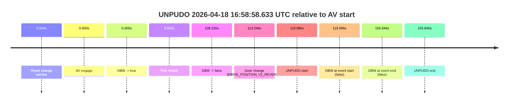
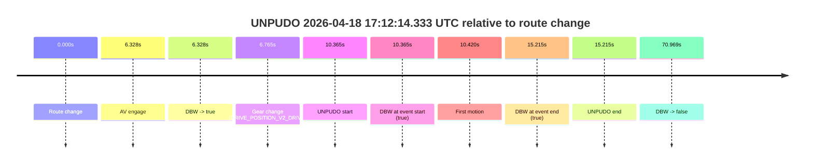
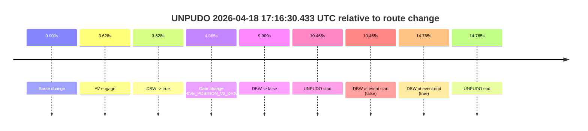
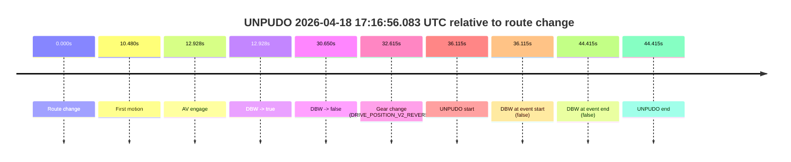
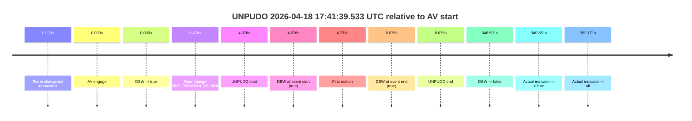

# Run Report: fme20031/2026-04-18--16-34-58--gen2-av-e3ddc9a0-8262-4c49-8188-a601fd722cbf

| Field | Value |
|---|---|
| Run ID | `fme20031/2026-04-18--16-34-58--gen2-av-e3ddc9a0-8262-4c49-8188-a601fd722cbf` |
| Date | `2026-04-18` |
| Model(s) | `armadillo-amethyst-squeaky` |
| Author | `guy.geva` |
| Event count | `6` |

## unpudo 2026-04-18 16:58:58.633 UTC

| Field | Value |
|---|---|
| Model | `armadillo-amethyst-squeaky` |
| Author | `guy.geva` |
| Run ID | `fme20031/2026-04-18--16-34-58--gen2-av-e3ddc9a0-8262-4c49-8188-a601fd722cbf` |
| Date | `2026-04-18` |
| Time (UTC) | `16:58:58.633` |
| Event type | `unpudo` |
| Disengagement type | `none observed` |
| Route change | `unclear` |
| Console | [run](https://console.sso.wayve.ai/run/fme20031/2026-04-18--16-34-58--gen2-av-e3ddc9a0-8262-4c49-8188-a601fd722cbf?id=&time-unixus=1776531538633305) |
| Foxglove | [segment](https://app.foxglove.dev/wayve-on-prem/p/prj_0dX18KZdVHg1fmmI/view?ds=foxglove-stream&ds.deviceName=fme20031&ds.start=2026-04-18T16%3A56%3A48.637628Z&ds.end=2026-04-18T16%3A59%3A44.483309Z&layoutId=lay_0e7VD4WIKDQGU73Y&time=2026-04-18T16%3A58%3A58.633305Z) |

### Event card: fail

- Fail: the credited unpudo does not stay AV-owned. The event window starts with DBW false, and the maneuver outcome lands outside a clean AV-owned segment.

| Event | Time (UTC) | Delta from AV start |
|---|---:|---:|
| Route change unclear | 2026-04-18 16:56:58.637 | `0.000s` |
| AV engage | 2026-04-18 16:56:58.637 | `0.000s` |
| DBW -> true | 2026-04-18 16:56:58.637 | `0.000s` |
| First motion | 2026-04-18 16:56:59.628 | `0.990s` |
| DBW -> false | 2026-04-18 16:58:46.857 | `108.220s` |
| Gear change (DRIVE_POSITION_V2_REVERSE) | 2026-04-18 16:58:52.183 | `113.546s` |
| UNPUDO start | 2026-04-18 16:58:58.633 | `119.996s` |
| DBW at event start (false) | 2026-04-18 16:58:58.633 | `119.996s` |
| DBW at event end (false) | 2026-04-18 16:59:34.483 | `155.846s` |
| UNPUDO end | 2026-04-18 16:59:34.483 | `155.846s` |

| Metric | Value |
|---|---|
| Outcome | `fail` |
| Effective failure type | `not_av_owned` |
| Route change status | `unclear` |
| DBW at event start | `false` |
| DBW at event end | `false` |
| Predicted gear at AV start | `DRIVE_POSITION_V2_DRIVE` |
| Actual gear at AV start | `DRIVE_POSITION_V2_DRIVE` |
| Predicted gear at event start | `DRIVE_POSITION_V2_REVERSE` |
| Actual gear at event start | `DRIVE_POSITION_V2_REVERSE` |
| Planned indicator direction | `INDICATORS_STATE_V2_OFF` |
| Controller indicator direction | `INDICATORS_STATE_V2_OFF` |
| Actual indicator direction | `INDICATORS_STATE_V2_OFF` |
| Actual indicator at maneuver end | `INDICATORS_STATE_V2_OFF` |
| Driver accel help in AV | `false` |
| Driver accel help timestamp | `n/a` |
| Max accel pedal pct in AV | `0.0%` |
| Max brake pedal pct in AV | `21.3%` |
| Max speed mps in AV | `8.017` |
| Success timing baseline | `AV start` |
| Route -> AV | `n/a` |
| AV -> event start | `119.996s` |
| AV -> first motion | `0.990s` |
| Success baseline -> event start | `119.996s` |
| Success baseline -> first motion | `0.990s` |
| AV duration before disengagement | `108.220s` |
| Trajectory waypoint count | `37` |
| Driving-plan step count | `11` |

The scored portion starts from the AV-owned window, not from the pre-AV setup. Route-change search in the stopped pre-event segment was `unclear`, with the baseline therefore set to AV start. At the event anchor the model predicts `DRIVE_POSITION_V2_REVERSE` and the actual gear is `DRIVE_POSITION_V2_REVERSE`. The effective model outcome is `fail` because `not_av_owned.`

### Resolution

| Field | Value |
|---|---|
| Final outcome | `fail` |
| Do we agree with this label? | `yes` |
| Source disengagement type | `none observed` |
| Resolved effective failure type | `not_av_owned` |
| Confidence | `medium` |

## unpudo 2026-04-18 17:12:14.333 UTC

| Field | Value |
|---|---|
| Model | `armadillo-amethyst-squeaky` |
| Author | `guy.geva` |
| Run ID | `fme20031/2026-04-18--16-34-58--gen2-av-e3ddc9a0-8262-4c49-8188-a601fd722cbf` |
| Date | `2026-04-18` |
| Time (UTC) | `17:12:14.333` |
| Event type | `unpudo` |
| Disengagement type | `none observed` |
| Route change | `found` |
| Console | [run](https://console.sso.wayve.ai/run/fme20031/2026-04-18--16-34-58--gen2-av-e3ddc9a0-8262-4c49-8188-a601fd722cbf?id=&time-unixus=1776532334333304) |
| Foxglove | [segment](https://app.foxglove.dev/wayve-on-prem/p/prj_0dX18KZdVHg1fmmI/view?ds=foxglove-stream&ds.deviceName=fme20031&ds.start=2026-04-18T17%3A11%3A53.968345Z&ds.end=2026-04-18T17%3A13%3A24.937300Z&layoutId=lay_0e7VD4WIKDQGU73Y&time=2026-04-18T17%3A12%3A14.333304Z) |

### Event card: pass

- Pass: AV owns the credited unpudo from route change through the official unpudo window, the gear state is aligned at the anchor, and the vehicle moves without driver accelerator help in AV.

| Event | Time (UTC) | Delta from route change |
|---|---:|---:|
| Route change | 2026-04-18 17:12:03.968 | `0.000s` |
| AV engage | 2026-04-18 17:12:10.296 | `6.328s` |
| DBW -> true | 2026-04-18 17:12:10.296 | `6.328s` |
| Gear change (DRIVE_POSITION_V2_DRIVE) | 2026-04-18 17:12:10.733 | `6.765s` |
| UNPUDO start | 2026-04-18 17:12:14.333 | `10.365s` |
| DBW at event start (true) | 2026-04-18 17:12:14.333 | `10.365s` |
| First motion | 2026-04-18 17:12:14.388 | `10.420s` |
| DBW at event end (true) | 2026-04-18 17:12:19.183 | `15.215s` |
| UNPUDO end | 2026-04-18 17:12:19.183 | `15.215s` |
| DBW -> false | 2026-04-18 17:13:14.937 | `70.969s` |

| Metric | Value |
|---|---|
| Outcome | `pass` |
| Effective failure type | `none` |
| Route change status | `found` |
| DBW at event start | `true` |
| DBW at event end | `true` |
| Predicted gear at AV start | `DRIVE_POSITION_V2_DRIVE` |
| Actual gear at AV start | `DRIVE_POSITION_V2_PARK` |
| Predicted gear at event start | `DRIVE_POSITION_V2_DRIVE` |
| Actual gear at event start | `DRIVE_POSITION_V2_DRIVE` |
| Planned indicator direction | `INDICATORS_STATE_V2_OFF` |
| Controller indicator direction | `INDICATORS_STATE_V2_OFF` |
| Actual indicator direction | `INDICATORS_STATE_V2_OFF` |
| Actual indicator at maneuver end | `INDICATORS_STATE_V2_OFF` |
| Driver accel help in AV | `false` |
| Driver accel help timestamp | `n/a` |
| Max accel pedal pct in AV | `0.0%` |
| Max brake pedal pct in AV | `8.0%` |
| Max speed mps in AV | `2.422` |
| Success timing baseline | `route change` |
| Route -> AV | `6.328s` |
| AV -> event start | `4.037s` |
| AV -> first motion | `4.091s` |
| Success baseline -> event start | `10.365s` |
| Success baseline -> first motion | `10.420s` |
| AV duration before disengagement | `64.641s` |
| Trajectory waypoint count | `35` |
| Driving-plan step count | `11` |

The scored portion starts from the AV-owned window, not from the pre-AV setup. Route-change search in the stopped pre-event segment was `found`, with the baseline therefore set to route change. At the event anchor the model predicts `DRIVE_POSITION_V2_DRIVE` and the actual gear is `DRIVE_POSITION_V2_DRIVE`. The effective model outcome is `pass` because `the credited unpudo stays AV-owned through the official unpudo window.`

### Resolution

| Field | Value |
|---|---|
| Final outcome | `pass` |
| Do we agree with this label? | `yes` |
| Source disengagement type | `none observed` |
| Resolved effective failure type | `none` |
| Confidence | `high` |

## unpudo 2026-04-18 17:16:30.433 UTC

| Field | Value |
|---|---|
| Model | `armadillo-amethyst-squeaky` |
| Author | `guy.geva` |
| Run ID | `fme20031/2026-04-18--16-34-58--gen2-av-e3ddc9a0-8262-4c49-8188-a601fd722cbf` |
| Date | `2026-04-18` |
| Time (UTC) | `17:16:30.433` |
| Event type | `unpudo` |
| Disengagement type | `none observed` |
| Route change | `found` |
| Console | [run](https://console.sso.wayve.ai/run/fme20031/2026-04-18--16-34-58--gen2-av-e3ddc9a0-8262-4c49-8188-a601fd722cbf?id=&time-unixus=1776532590433308) |
| Foxglove | [segment](https://app.foxglove.dev/wayve-on-prem/p/prj_0dX18KZdVHg1fmmI/view?ds=foxglove-stream&ds.deviceName=fme20031&ds.start=2026-04-18T17%3A16%3A09.968251Z&ds.end=2026-04-18T17%3A16%3A44.733314Z&layoutId=lay_0e7VD4WIKDQGU73Y&time=2026-04-18T17%3A16%3A30.433308Z) |

### Event card: fail

- Fail: the credited unpudo does not stay AV-owned. The event window starts with DBW false, and the maneuver outcome lands outside a clean AV-owned segment.

| Event | Time (UTC) | Delta from route change |
|---|---:|---:|
| Route change | 2026-04-18 17:16:19.968 | `0.000s` |
| AV engage | 2026-04-18 17:16:23.596 | `3.628s` |
| DBW -> true | 2026-04-18 17:16:23.596 | `3.628s` |
| Gear change (DRIVE_POSITION_V2_DRIVE) | 2026-04-18 17:16:24.033 | `4.065s` |
| DBW -> false | 2026-04-18 17:16:29.876 | `9.909s` |
| UNPUDO start | 2026-04-18 17:16:30.433 | `10.465s` |
| DBW at event start (false) | 2026-04-18 17:16:30.433 | `10.465s` |
| DBW at event end (true) | 2026-04-18 17:16:34.733 | `14.765s` |
| UNPUDO end | 2026-04-18 17:16:34.733 | `14.765s` |

| Metric | Value |
|---|---|
| Outcome | `fail` |
| Effective failure type | `not_av_owned` |
| Route change status | `found` |
| DBW at event start | `false` |
| DBW at event end | `true` |
| Predicted gear at AV start | `DRIVE_POSITION_V2_DRIVE` |
| Actual gear at AV start | `DRIVE_POSITION_V2_PARK` |
| Predicted gear at event start | `DRIVE_POSITION_V2_DRIVE` |
| Actual gear at event start | `DRIVE_POSITION_V2_DRIVE` |
| Planned indicator direction | `INDICATORS_STATE_V2_LEFT_ON` |
| Controller indicator direction | `INDICATORS_STATE_V2_LEFT_ON` |
| Actual indicator direction | `INDICATORS_STATE_V2_OFF` |
| Actual indicator at maneuver end | `INDICATORS_STATE_V2_OFF` |
| Driver accel help in AV | `false` |
| Driver accel help timestamp | `n/a` |
| Max accel pedal pct in AV | `0.0%` |
| Max brake pedal pct in AV | `8.0%` |
| Max speed mps in AV | `0.000` |
| Success timing baseline | `route change` |
| Route -> AV | `3.628s` |
| AV -> event start | `6.837s` |
| AV -> first motion | `n/a` |
| Success baseline -> event start | `10.465s` |
| Success baseline -> first motion | `n/a` |
| AV duration before disengagement | `6.280s` |
| Trajectory waypoint count | `37` |
| Driving-plan step count | `11` |

The scored portion starts from the AV-owned window, not from the pre-AV setup. Route-change search in the stopped pre-event segment was `found`, with the baseline therefore set to route change. At the event anchor the model predicts `DRIVE_POSITION_V2_DRIVE` and the actual gear is `DRIVE_POSITION_V2_DRIVE`. The effective model outcome is `fail` because `not_av_owned.`

### Resolution

| Field | Value |
|---|---|
| Final outcome | `fail` |
| Do we agree with this label? | `yes` |
| Source disengagement type | `none observed` |
| Resolved effective failure type | `not_av_owned` |
| Confidence | `high` |

## unpudo 2026-04-18 17:16:56.083 UTC

| Field | Value |
|---|---|
| Model | `armadillo-amethyst-squeaky` |
| Author | `guy.geva` |
| Run ID | `fme20031/2026-04-18--16-34-58--gen2-av-e3ddc9a0-8262-4c49-8188-a601fd722cbf` |
| Date | `2026-04-18` |
| Time (UTC) | `17:16:56.083` |
| Event type | `unpudo` |
| Disengagement type | `none observed` |
| Route change | `found` |
| Console | [run](https://console.sso.wayve.ai/run/fme20031/2026-04-18--16-34-58--gen2-av-e3ddc9a0-8262-4c49-8188-a601fd722cbf?id=&time-unixus=1776532616083290) |
| Foxglove | [segment](https://app.foxglove.dev/wayve-on-prem/p/prj_0dX18KZdVHg1fmmI/view?ds=foxglove-stream&ds.deviceName=fme20031&ds.start=2026-04-18T17%3A16%3A09.968251Z&ds.end=2026-04-18T17%3A17%3A14.383298Z&layoutId=lay_0e7VD4WIKDQGU73Y&time=2026-04-18T17%3A16%3A56.083290Z) |

### Event card: fail

- Fail: the credited unpudo does not stay AV-owned. The event window starts with DBW false, and the maneuver outcome lands outside a clean AV-owned segment.

| Event | Time (UTC) | Delta from route change |
|---|---:|---:|
| Route change | 2026-04-18 17:16:19.968 | `0.000s` |
| First motion | 2026-04-18 17:16:30.448 | `10.480s` |
| AV engage | 2026-04-18 17:16:32.896 | `12.928s` |
| DBW -> true | 2026-04-18 17:16:32.896 | `12.928s` |
| DBW -> false | 2026-04-18 17:16:50.618 | `30.650s` |
| Gear change (DRIVE_POSITION_V2_REVERSE) | 2026-04-18 17:16:52.583 | `32.615s` |
| UNPUDO start | 2026-04-18 17:16:56.083 | `36.115s` |
| DBW at event start (false) | 2026-04-18 17:16:56.083 | `36.115s` |
| DBW at event end (false) | 2026-04-18 17:17:04.383 | `44.415s` |
| UNPUDO end | 2026-04-18 17:17:04.383 | `44.415s` |

| Metric | Value |
|---|---|
| Outcome | `fail` |
| Effective failure type | `completed_outside_av` |
| Route change status | `found` |
| DBW at event start | `false` |
| DBW at event end | `false` |
| Predicted gear at AV start | `DRIVE_POSITION_V2_DRIVE` |
| Actual gear at AV start | `DRIVE_POSITION_V2_DRIVE` |
| Predicted gear at event start | `DRIVE_POSITION_V2_REVERSE` |
| Actual gear at event start | `DRIVE_POSITION_V2_REVERSE` |
| Planned indicator direction | `INDICATORS_STATE_V2_OFF` |
| Controller indicator direction | `INDICATORS_STATE_V2_OFF` |
| Actual indicator direction | `INDICATORS_STATE_V2_OFF` |
| Actual indicator at maneuver end | `INDICATORS_STATE_V2_OFF` |
| Driver accel help in AV | `false` |
| Driver accel help timestamp | `n/a` |
| Max accel pedal pct in AV | `0.0%` |
| Max brake pedal pct in AV | `8.1%` |
| Max speed mps in AV | `4.000` |
| Success timing baseline | `route change` |
| Route -> AV | `12.928s` |
| AV -> event start | `23.187s` |
| AV -> first motion | `-2.448s` |
| Success baseline -> event start | `36.115s` |
| Success baseline -> first motion | `10.480s` |
| AV duration before disengagement | `17.722s` |
| Trajectory waypoint count | `36` |
| Driving-plan step count | `11` |

The scored portion starts from the AV-owned window, not from the pre-AV setup. Route-change search in the stopped pre-event segment was `found`, with the baseline therefore set to route change. At the event anchor the model predicts `DRIVE_POSITION_V2_REVERSE` and the actual gear is `DRIVE_POSITION_V2_REVERSE`. The effective model outcome is `fail` because `completed_outside_av.`

### Resolution

| Field | Value |
|---|---|
| Final outcome | `fail` |
| Do we agree with this label? | `yes` |
| Source disengagement type | `none observed` |
| Resolved effective failure type | `completed_outside_av` |
| Confidence | `high` |

## unpudo 2026-04-18 17:41:39.533 UTC

| Field | Value |
|---|---|
| Model | `armadillo-amethyst-squeaky` |
| Author | `guy.geva` |
| Run ID | `fme20031/2026-04-18--16-34-58--gen2-av-e3ddc9a0-8262-4c49-8188-a601fd722cbf` |
| Date | `2026-04-18` |
| Time (UTC) | `17:41:39.533` |
| Event type | `unpudo` |
| Disengagement type | `none observed` |
| Route change | `not found` |
| Console | [run](https://console.sso.wayve.ai/run/fme20031/2026-04-18--16-34-58--gen2-av-e3ddc9a0-8262-4c49-8188-a601fd722cbf?id=&time-unixus=1776534099533313) |
| Foxglove | [segment](https://app.foxglove.dev/wayve-on-prem/p/prj_0dX18KZdVHg1fmmI/view?ds=foxglove-stream&ds.deviceName=fme20031&ds.start=2026-04-18T17%3A41%3A24.856880Z&ds.end=2026-04-18T17%3A47%3A31.357554Z&layoutId=lay_0e7VD4WIKDQGU73Y&time=2026-04-18T17%3A41%3A39.533313Z) |

### Event card: pass

- Pass: AV owns the credited unpudo from route change through the official unpudo window, the gear state is aligned at the anchor, and the vehicle moves without driver accelerator help in AV.

| Event | Time (UTC) | Delta from AV start |
|---|---:|---:|
| Route change not recovered | 2026-04-18 17:41:34.856 | `0.000s` |
| AV engage | 2026-04-18 17:41:34.856 | `0.000s` |
| DBW -> true | 2026-04-18 17:41:34.856 | `0.000s` |
| Gear change (DRIVE_POSITION_V2_DRIVE) | 2026-04-18 17:41:35.333 | `0.476s` |
| UNPUDO start | 2026-04-18 17:41:39.533 | `4.676s` |
| DBW at event start (true) | 2026-04-18 17:41:39.533 | `4.676s` |
| First motion | 2026-04-18 17:41:39.588 | `4.731s` |
| DBW at event end (true) | 2026-04-18 17:41:42.933 | `8.076s` |
| UNPUDO end | 2026-04-18 17:41:42.933 | `8.076s` |
| DBW -> false | 2026-04-18 17:47:21.357 | `346.501s` |
| Actual indicator -> left on | 2026-04-18 17:47:24.708 | `349.851s` |
| Actual indicator -> off | 2026-04-18 17:47:27.028 | `352.171s` |

| Metric | Value |
|---|---|
| Outcome | `pass` |
| Effective failure type | `none` |
| Route change status | `not found` |
| DBW at event start | `true` |
| DBW at event end | `true` |
| Predicted gear at AV start | `DRIVE_POSITION_V2_DRIVE` |
| Actual gear at AV start | `DRIVE_POSITION_V2_PARK` |
| Predicted gear at event start | `DRIVE_POSITION_V2_DRIVE` |
| Actual gear at event start | `DRIVE_POSITION_V2_DRIVE` |
| Planned indicator direction | `INDICATORS_STATE_V2_RIGHT_ON` |
| Controller indicator direction | `INDICATORS_STATE_V2_RIGHT_ON` |
| Actual indicator direction | `INDICATORS_STATE_V2_OFF` |
| Actual indicator at maneuver end | `INDICATORS_STATE_V2_OFF` |
| Driver accel help in AV | `false` |
| Driver accel help timestamp | `n/a` |
| Max accel pedal pct in AV | `0.0%` |
| Max brake pedal pct in AV | `8.0%` |
| Max speed mps in AV | `4.972` |
| Success timing baseline | `AV start` |
| Route -> AV | `n/a` |
| AV -> event start | `4.676s` |
| AV -> first motion | `4.731s` |
| Success baseline -> event start | `4.676s` |
| Success baseline -> first motion | `4.731s` |
| AV duration before disengagement | `346.501s` |
| Trajectory waypoint count | `35` |
| Driving-plan step count | `11` |

The scored portion starts from the AV-owned window, not from the pre-AV setup. Route-change search in the stopped pre-event segment was `not found`, with the baseline therefore set to AV start. At the event anchor the model predicts `DRIVE_POSITION_V2_DRIVE` and the actual gear is `DRIVE_POSITION_V2_DRIVE`. The effective model outcome is `pass` because `the credited unpudo stays AV-owned through the official unpudo window.`

### Resolution

| Field | Value |
|---|---|
| Final outcome | `pass` |
| Do we agree with this label? | `yes` |
| Source disengagement type | `none observed` |
| Resolved effective failure type | `none` |
| Confidence | `high` |

## unpudo 2026-04-18 17:51:24.533 UTC

| Field | Value |
|---|---|
| Model | `armadillo-amethyst-squeaky` |
| Author | `guy.geva` |
| Run ID | `fme20031/2026-04-18--16-34-58--gen2-av-e3ddc9a0-8262-4c49-8188-a601fd722cbf` |
| Date | `2026-04-18` |
| Time (UTC) | `17:51:24.533` |
| Event type | `unpudo` |
| Disengagement type | `none observed` |
| Route change | `found` |
| Console | [run](https://console.sso.wayve.ai/run/fme20031/2026-04-18--16-34-58--gen2-av-e3ddc9a0-8262-4c49-8188-a601fd722cbf?id=&time-unixus=1776534684533307) |
| Foxglove | [segment](https://app.foxglove.dev/wayve-on-prem/p/prj_0dX18KZdVHg1fmmI/view?ds=foxglove-stream&ds.deviceName=fme20031&ds.start=2026-04-18T17%3A51%3A06.768253Z&ds.end=2026-04-18T17%3A54%3A53.436725Z&layoutId=lay_0e7VD4WIKDQGU73Y&time=2026-04-18T17%3A51%3A24.533307Z) |

### Event card: pass

- Pass: AV owns the credited unpudo from route change through the official unpudo window, the gear state is aligned at the anchor, and the vehicle moves without driver accelerator help in AV.

| Event | Time (UTC) | Delta from route change |
|---|---:|---:|
| Route change | 2026-04-18 17:51:16.768 | `0.000s` |
| AV engage | 2026-04-18 17:51:20.016 | `3.248s` |
| DBW -> true | 2026-04-18 17:51:20.016 | `3.248s` |
| Gear change (DRIVE_POSITION_V2_DRIVE) | 2026-04-18 17:51:20.483 | `3.715s` |
| UNPUDO start | 2026-04-18 17:51:24.533 | `7.765s` |
| DBW at event start (true) | 2026-04-18 17:51:24.533 | `7.765s` |
| First motion | 2026-04-18 17:51:24.548 | `7.780s` |
| DBW at event end (true) | 2026-04-18 17:51:48.883 | `32.115s` |
| UNPUDO end | 2026-04-18 17:51:48.883 | `32.115s` |
| DBW -> false | 2026-04-18 17:54:43.436 | `206.668s` |

| Metric | Value |
|---|---|
| Outcome | `pass` |
| Effective failure type | `none` |
| Route change status | `found` |
| DBW at event start | `true` |
| DBW at event end | `true` |
| Predicted gear at AV start | `DRIVE_POSITION_V2_DRIVE` |
| Actual gear at AV start | `DRIVE_POSITION_V2_PARK` |
| Predicted gear at event start | `DRIVE_POSITION_V2_DRIVE` |
| Actual gear at event start | `DRIVE_POSITION_V2_DRIVE` |
| Planned indicator direction | `INDICATORS_STATE_V2_OFF` |
| Controller indicator direction | `INDICATORS_STATE_V2_OFF` |
| Actual indicator direction | `INDICATORS_STATE_V2_OFF` |
| Actual indicator at maneuver end | `INDICATORS_STATE_V2_OFF` |
| Driver accel help in AV | `false` |
| Driver accel help timestamp | `n/a` |
| Max accel pedal pct in AV | `0.0%` |
| Max brake pedal pct in AV | `8.8%` |
| Max speed mps in AV | `3.544` |
| Success timing baseline | `route change` |
| Route -> AV | `3.248s` |
| AV -> event start | `4.517s` |
| AV -> first motion | `4.531s` |
| Success baseline -> event start | `7.765s` |
| Success baseline -> first motion | `7.780s` |
| AV duration before disengagement | `203.420s` |
| Trajectory waypoint count | `37` |
| Driving-plan step count | `11` |

The scored portion starts from the AV-owned window, not from the pre-AV setup. Route-change search in the stopped pre-event segment was `found`, with the baseline therefore set to route change. At the event anchor the model predicts `DRIVE_POSITION_V2_DRIVE` and the actual gear is `DRIVE_POSITION_V2_DRIVE`. The effective model outcome is `pass` because `the credited unpudo stays AV-owned through the official unpudo window.`

### Resolution

| Field | Value |
|---|---|
| Final outcome | `pass` |
| Do we agree with this label? | `yes` |
| Source disengagement type | `none observed` |
| Resolved effective failure type | `none` |
| Confidence | `high` |
