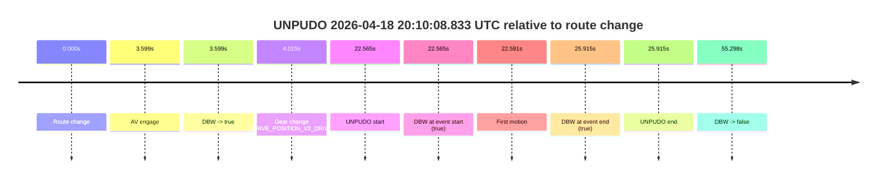
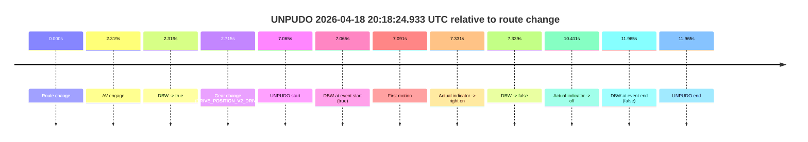
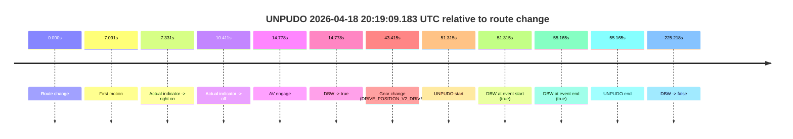
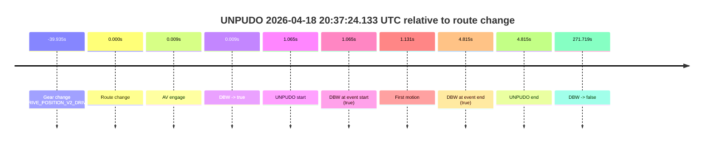
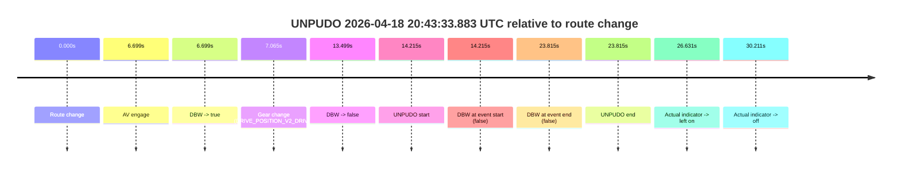
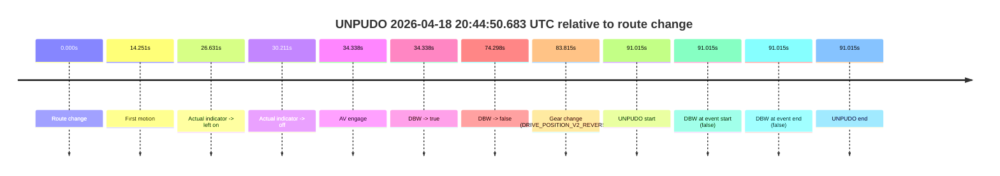

# Run Report: fme20031/2026-04-18--20-01-35--gen2-av-488757f4-84a2-41cf-ba93-f1418f8e3bc7

| Field | Value |
|---|---|
| Run ID | `fme20031/2026-04-18--20-01-35--gen2-av-488757f4-84a2-41cf-ba93-f1418f8e3bc7` |
| Date | `2026-04-18` |
| Model(s) | `armadillo-amethyst-squeaky` |
| Author | `guy.geva` |
| Event count | `6` |

## unpudo 2026-04-18 20:10:08.833 UTC

| Field | Value |
|---|---|
| Model | `armadillo-amethyst-squeaky` |
| Author | `guy.geva` |
| Run ID | `fme20031/2026-04-18--20-01-35--gen2-av-488757f4-84a2-41cf-ba93-f1418f8e3bc7` |
| Date | `2026-04-18` |
| Time (UTC) | `20:10:08.833` |
| Event type | `unpudo` |
| Disengagement type | `none observed` |
| Route change | `found` |
| Console | [run](https://console.sso.wayve.ai/run/fme20031/2026-04-18--20-01-35--gen2-av-488757f4-84a2-41cf-ba93-f1418f8e3bc7?id=&time-unixus=1776543008833302) |
| Foxglove | [segment](https://app.foxglove.dev/wayve-on-prem/p/prj_0dX18KZdVHg1fmmI/view?ds=foxglove-stream&ds.deviceName=fme20031&ds.start=2026-04-18T20%3A09%3A36.268255Z&ds.end=2026-04-18T20%3A10%3A51.566619Z&layoutId=lay_0e7VD4WIKDQGU73Y&time=2026-04-18T20%3A10%3A08.833302Z) |

### Event card: pass

- Pass: AV owns the credited unpudo from route change through the official unpudo window, the gear state is aligned at the anchor, and the vehicle moves without driver accelerator help in AV.

| Event | Time (UTC) | Delta from route change |
|---|---:|---:|
| Route change | 2026-04-18 20:09:46.268 | `0.000s` |
| AV engage | 2026-04-18 20:09:49.866 | `3.599s` |
| DBW -> true | 2026-04-18 20:09:49.866 | `3.599s` |
| Gear change (DRIVE_POSITION_V2_DRIVE) | 2026-04-18 20:09:50.283 | `4.015s` |
| UNPUDO start | 2026-04-18 20:10:08.833 | `22.565s` |
| DBW at event start (true) | 2026-04-18 20:10:08.833 | `22.565s` |
| First motion | 2026-04-18 20:10:08.859 | `22.591s` |
| DBW at event end (true) | 2026-04-18 20:10:12.183 | `25.915s` |
| UNPUDO end | 2026-04-18 20:10:12.183 | `25.915s` |
| DBW -> false | 2026-04-18 20:10:41.566 | `55.298s` |

| Metric | Value |
|---|---|
| Outcome | `pass` |
| Effective failure type | `none` |
| Route change status | `found` |
| DBW at event start | `true` |
| DBW at event end | `true` |
| Predicted gear at AV start | `DRIVE_POSITION_V2_DRIVE` |
| Actual gear at AV start | `DRIVE_POSITION_V2_PARK` |
| Predicted gear at event start | `DRIVE_POSITION_V2_DRIVE` |
| Actual gear at event start | `DRIVE_POSITION_V2_DRIVE` |
| Planned indicator direction | `INDICATORS_STATE_V2_OFF` |
| Controller indicator direction | `INDICATORS_STATE_V2_OFF` |
| Actual indicator direction | `INDICATORS_STATE_V2_OFF` |
| Actual indicator at maneuver end | `INDICATORS_STATE_V2_OFF` |
| Driver accel help in AV | `false` |
| Driver accel help timestamp | `n/a` |
| Max accel pedal pct in AV | `0.0%` |
| Max brake pedal pct in AV | `11.4%` |
| Max speed mps in AV | `5.450` |
| Success timing baseline | `route change` |
| Route -> AV | `3.599s` |
| AV -> event start | `18.967s` |
| AV -> first motion | `18.992s` |
| Success baseline -> event start | `22.565s` |
| Success baseline -> first motion | `22.591s` |
| AV duration before disengagement | `51.700s` |
| Trajectory waypoint count | `35` |
| Driving-plan step count | `11` |

The scored portion starts from the AV-owned window, not from the pre-AV setup. Route-change search in the stopped pre-event segment was `found`, with the baseline therefore set to route change. At the event anchor the model predicts `DRIVE_POSITION_V2_DRIVE` and the actual gear is `DRIVE_POSITION_V2_DRIVE`. The effective model outcome is `pass` because `the credited unpudo stays AV-owned through the official unpudo window.`

### Resolution

| Field | Value |
|---|---|
| Final outcome | `pass` |
| Do we agree with this label? | `yes` |
| Source disengagement type | `none observed` |
| Resolved effective failure type | `none` |
| Confidence | `high` |

## unpudo 2026-04-18 20:18:24.933 UTC

| Field | Value |
|---|---|
| Model | `armadillo-amethyst-squeaky` |
| Author | `guy.geva` |
| Run ID | `fme20031/2026-04-18--20-01-35--gen2-av-488757f4-84a2-41cf-ba93-f1418f8e3bc7` |
| Date | `2026-04-18` |
| Time (UTC) | `20:18:24.933` |
| Event type | `unpudo` |
| Disengagement type | `none observed` |
| Route change | `found` |
| Console | [run](https://console.sso.wayve.ai/run/fme20031/2026-04-18--20-01-35--gen2-av-488757f4-84a2-41cf-ba93-f1418f8e3bc7?id=&time-unixus=1776543504933313) |
| Foxglove | [segment](https://app.foxglove.dev/wayve-on-prem/p/prj_0dX18KZdVHg1fmmI/view?ds=foxglove-stream&ds.deviceName=fme20031&ds.start=2026-04-18T20%3A18%3A07.868235Z&ds.end=2026-04-18T20%3A18%3A39.833323Z&layoutId=lay_0e7VD4WIKDQGU73Y&time=2026-04-18T20%3A18%3A24.933313Z) |

### Event card: fail

- Fail: this is a short AV stint rather than a durable model-owned maneuver. The vehicle never settles into a long enough AV-owned attempt to credit the model.

| Event | Time (UTC) | Delta from route change |
|---|---:|---:|
| Route change | 2026-04-18 20:18:17.868 | `0.000s` |
| AV engage | 2026-04-18 20:18:20.186 | `2.319s` |
| DBW -> true | 2026-04-18 20:18:20.186 | `2.319s` |
| Gear change (DRIVE_POSITION_V2_DRIVE) | 2026-04-18 20:18:20.583 | `2.715s` |
| UNPUDO start | 2026-04-18 20:18:24.933 | `7.065s` |
| DBW at event start (true) | 2026-04-18 20:18:24.933 | `7.065s` |
| First motion | 2026-04-18 20:18:24.959 | `7.091s` |
| Actual indicator -> right on | 2026-04-18 20:18:25.199 | `7.331s` |
| DBW -> false | 2026-04-18 20:18:25.207 | `7.339s` |
| Actual indicator -> off | 2026-04-18 20:18:28.279 | `10.411s` |
| DBW at event end (false) | 2026-04-18 20:18:29.833 | `11.965s` |
| UNPUDO end | 2026-04-18 20:18:29.833 | `11.965s` |

| Metric | Value |
|---|---|
| Outcome | `fail` |
| Effective failure type | `interrupted_handover` |
| Route change status | `found` |
| DBW at event start | `true` |
| DBW at event end | `false` |
| Predicted gear at AV start | `DRIVE_POSITION_V2_DRIVE` |
| Actual gear at AV start | `DRIVE_POSITION_V2_PARK` |
| Predicted gear at event start | `DRIVE_POSITION_V2_DRIVE` |
| Actual gear at event start | `DRIVE_POSITION_V2_DRIVE` |
| Planned indicator direction | `INDICATORS_STATE_V2_LEFT_ON` |
| Controller indicator direction | `INDICATORS_STATE_V2_LEFT_ON` |
| Actual indicator direction | `INDICATORS_STATE_V2_OFF` |
| Actual indicator at maneuver end | `INDICATORS_STATE_V2_OFF` |
| Driver accel help in AV | `false` |
| Driver accel help timestamp | `n/a` |
| Max accel pedal pct in AV | `0.0%` |
| Max brake pedal pct in AV | `8.0%` |
| Max speed mps in AV | `0.817` |
| Success timing baseline | `route change` |
| Route -> AV | `2.319s` |
| AV -> event start | `4.747s` |
| AV -> first motion | `4.773s` |
| Success baseline -> event start | `7.065s` |
| Success baseline -> first motion | `7.091s` |
| AV duration before disengagement | `5.021s` |
| Trajectory waypoint count | `35` |
| Driving-plan step count | `11` |

The scored portion starts from the AV-owned window, not from the pre-AV setup. Route-change search in the stopped pre-event segment was `found`, with the baseline therefore set to route change. At the event anchor the model predicts `DRIVE_POSITION_V2_DRIVE` and the actual gear is `DRIVE_POSITION_V2_DRIVE`. The effective model outcome is `fail` because `interrupted_handover.`

### Resolution

| Field | Value |
|---|---|
| Final outcome | `fail` |
| Do we agree with this label? | `yes` |
| Source disengagement type | `none observed` |
| Resolved effective failure type | `interrupted_handover` |
| Confidence | `high` |

## unpudo 2026-04-18 20:19:09.183 UTC

| Field | Value |
|---|---|
| Model | `armadillo-amethyst-squeaky` |
| Author | `guy.geva` |
| Run ID | `fme20031/2026-04-18--20-01-35--gen2-av-488757f4-84a2-41cf-ba93-f1418f8e3bc7` |
| Date | `2026-04-18` |
| Time (UTC) | `20:19:09.183` |
| Event type | `unpudo` |
| Disengagement type | `none observed` |
| Route change | `found` |
| Console | [run](https://console.sso.wayve.ai/run/fme20031/2026-04-18--20-01-35--gen2-av-488757f4-84a2-41cf-ba93-f1418f8e3bc7?id=&time-unixus=1776543549183308) |
| Foxglove | [segment](https://app.foxglove.dev/wayve-on-prem/p/prj_0dX18KZdVHg1fmmI/view?ds=foxglove-stream&ds.deviceName=fme20031&ds.start=2026-04-18T20%3A18%3A07.868235Z&ds.end=2026-04-18T20%3A22%3A13.086539Z&layoutId=lay_0e7VD4WIKDQGU73Y&time=2026-04-18T20%3A19%3A09.183308Z) |

### Event card: pass

- Pass: AV owns the credited unpudo from route change through the official unpudo window, the gear state is aligned at the anchor, and the vehicle moves without driver accelerator help in AV.

| Event | Time (UTC) | Delta from route change |
|---|---:|---:|
| Route change | 2026-04-18 20:18:17.868 | `0.000s` |
| First motion | 2026-04-18 20:18:24.959 | `7.091s` |
| Actual indicator -> right on | 2026-04-18 20:18:25.199 | `7.331s` |
| Actual indicator -> off | 2026-04-18 20:18:28.279 | `10.411s` |
| AV engage | 2026-04-18 20:18:32.646 | `14.778s` |
| DBW -> true | 2026-04-18 20:18:32.646 | `14.778s` |
| Gear change (DRIVE_POSITION_V2_DRIVE) | 2026-04-18 20:19:01.283 | `43.415s` |
| UNPUDO start | 2026-04-18 20:19:09.183 | `51.315s` |
| DBW at event start (true) | 2026-04-18 20:19:09.183 | `51.315s` |
| DBW at event end (true) | 2026-04-18 20:19:13.033 | `55.165s` |
| UNPUDO end | 2026-04-18 20:19:13.033 | `55.165s` |
| DBW -> false | 2026-04-18 20:22:03.086 | `225.218s` |

| Metric | Value |
|---|---|
| Outcome | `pass` |
| Effective failure type | `none` |
| Route change status | `found` |
| DBW at event start | `true` |
| DBW at event end | `true` |
| Predicted gear at AV start | `DRIVE_POSITION_V2_DRIVE` |
| Actual gear at AV start | `DRIVE_POSITION_V2_DRIVE` |
| Predicted gear at event start | `DRIVE_POSITION_V2_DRIVE` |
| Actual gear at event start | `DRIVE_POSITION_V2_DRIVE` |
| Planned indicator direction | `INDICATORS_STATE_V2_RIGHT_ON` |
| Controller indicator direction | `INDICATORS_STATE_V2_RIGHT_ON` |
| Actual indicator direction | `INDICATORS_STATE_V2_OFF` |
| Actual indicator at maneuver end | `INDICATORS_STATE_V2_OFF` |
| Driver accel help in AV | `false` |
| Driver accel help timestamp | `n/a` |
| Max accel pedal pct in AV | `0.0%` |
| Max brake pedal pct in AV | `17.0%` |
| Max speed mps in AV | `6.569` |
| Success timing baseline | `route change` |
| Route -> AV | `14.778s` |
| AV -> event start | `36.537s` |
| AV -> first motion | `-7.687s` |
| Success baseline -> event start | `51.315s` |
| Success baseline -> first motion | `7.091s` |
| AV duration before disengagement | `210.440s` |
| Trajectory waypoint count | `36` |
| Driving-plan step count | `11` |

The scored portion starts from the AV-owned window, not from the pre-AV setup. Route-change search in the stopped pre-event segment was `found`, with the baseline therefore set to route change. At the event anchor the model predicts `DRIVE_POSITION_V2_DRIVE` and the actual gear is `DRIVE_POSITION_V2_DRIVE`. The effective model outcome is `pass` because `the credited unpudo stays AV-owned through the official unpudo window.`

### Resolution

| Field | Value |
|---|---|
| Final outcome | `pass` |
| Do we agree with this label? | `yes` |
| Source disengagement type | `none observed` |
| Resolved effective failure type | `none` |
| Confidence | `high` |

## unpudo 2026-04-18 20:37:24.133 UTC

| Field | Value |
|---|---|
| Model | `armadillo-amethyst-squeaky` |
| Author | `guy.geva` |
| Run ID | `fme20031/2026-04-18--20-01-35--gen2-av-488757f4-84a2-41cf-ba93-f1418f8e3bc7` |
| Date | `2026-04-18` |
| Time (UTC) | `20:37:24.133` |
| Event type | `unpudo` |
| Disengagement type | `none observed` |
| Route change | `found` |
| Console | [run](https://console.sso.wayve.ai/run/fme20031/2026-04-18--20-01-35--gen2-av-488757f4-84a2-41cf-ba93-f1418f8e3bc7?id=&time-unixus=1776544644133298) |
| Foxglove | [segment](https://app.foxglove.dev/wayve-on-prem/p/prj_0dX18KZdVHg1fmmI/view?ds=foxglove-stream&ds.deviceName=fme20031&ds.start=2026-04-18T20%3A36%3A33.133307Z&ds.end=2026-04-18T20%3A42%3A04.787867Z&layoutId=lay_0e7VD4WIKDQGU73Y&time=2026-04-18T20%3A37%3A24.133298Z) |

### Event card: pass

- Pass: AV owns the credited unpudo from route change through the official unpudo window, the gear state is aligned at the anchor, and the vehicle moves without driver accelerator help in AV.

| Event | Time (UTC) | Delta from route change |
|---|---:|---:|
| Gear change (DRIVE_POSITION_V2_DRIVE) | 2026-04-18 20:36:43.133 | `-39.935s` |
| Route change | 2026-04-18 20:37:23.068 | `0.000s` |
| AV engage | 2026-04-18 20:37:23.077 | `0.009s` |
| DBW -> true | 2026-04-18 20:37:23.077 | `0.009s` |
| UNPUDO start | 2026-04-18 20:37:24.133 | `1.065s` |
| DBW at event start (true) | 2026-04-18 20:37:24.133 | `1.065s` |
| First motion | 2026-04-18 20:37:24.199 | `1.131s` |
| DBW at event end (true) | 2026-04-18 20:37:27.883 | `4.815s` |
| UNPUDO end | 2026-04-18 20:37:27.883 | `4.815s` |
| DBW -> false | 2026-04-18 20:41:54.787 | `271.719s` |

| Metric | Value |
|---|---|
| Outcome | `pass` |
| Effective failure type | `none` |
| Route change status | `found` |
| DBW at event start | `true` |
| DBW at event end | `true` |
| Predicted gear at AV start | `DRIVE_POSITION_V2_DRIVE` |
| Actual gear at AV start | `DRIVE_POSITION_V2_DRIVE` |
| Predicted gear at event start | `DRIVE_POSITION_V2_DRIVE` |
| Actual gear at event start | `DRIVE_POSITION_V2_DRIVE` |
| Planned indicator direction | `INDICATORS_STATE_V2_LEFT_ON` |
| Controller indicator direction | `INDICATORS_STATE_V2_LEFT_ON` |
| Actual indicator direction | `INDICATORS_STATE_V2_OFF` |
| Actual indicator at maneuver end | `INDICATORS_STATE_V2_OFF` |
| Driver accel help in AV | `false` |
| Driver accel help timestamp | `n/a` |
| Max accel pedal pct in AV | `0.0%` |
| Max brake pedal pct in AV | `8.0%` |
| Max speed mps in AV | `3.769` |
| Success timing baseline | `route change` |
| Route -> AV | `0.009s` |
| AV -> event start | `1.056s` |
| AV -> first motion | `1.122s` |
| Success baseline -> event start | `1.065s` |
| Success baseline -> first motion | `1.131s` |
| AV duration before disengagement | `271.711s` |
| Trajectory waypoint count | `35` |
| Driving-plan step count | `11` |

The scored portion starts from the AV-owned window, not from the pre-AV setup. Route-change search in the stopped pre-event segment was `found`, with the baseline therefore set to route change. At the event anchor the model predicts `DRIVE_POSITION_V2_DRIVE` and the actual gear is `DRIVE_POSITION_V2_DRIVE`. The effective model outcome is `pass` because `the credited unpudo stays AV-owned through the official unpudo window.`

### Resolution

| Field | Value |
|---|---|
| Final outcome | `pass` |
| Do we agree with this label? | `yes` |
| Source disengagement type | `none observed` |
| Resolved effective failure type | `none` |
| Confidence | `high` |

## unpudo 2026-04-18 20:43:33.883 UTC

| Field | Value |
|---|---|
| Model | `armadillo-amethyst-squeaky` |
| Author | `guy.geva` |
| Run ID | `fme20031/2026-04-18--20-01-35--gen2-av-488757f4-84a2-41cf-ba93-f1418f8e3bc7` |
| Date | `2026-04-18` |
| Time (UTC) | `20:43:33.883` |
| Event type | `unpudo` |
| Disengagement type | `none observed` |
| Route change | `found` |
| Console | [run](https://console.sso.wayve.ai/run/fme20031/2026-04-18--20-01-35--gen2-av-488757f4-84a2-41cf-ba93-f1418f8e3bc7?id=&time-unixus=1776545013883324) |
| Foxglove | [segment](https://app.foxglove.dev/wayve-on-prem/p/prj_0dX18KZdVHg1fmmI/view?ds=foxglove-stream&ds.deviceName=fme20031&ds.start=2026-04-18T20%3A43%3A09.668259Z&ds.end=2026-04-18T20%3A43%3A53.483300Z&layoutId=lay_0e7VD4WIKDQGU73Y&time=2026-04-18T20%3A43%3A33.883324Z) |

### Event card: fail

- Fail: the credited unpudo does not stay AV-owned. The event window starts with DBW false, and the maneuver outcome lands outside a clean AV-owned segment.

| Event | Time (UTC) | Delta from route change |
|---|---:|---:|
| Route change | 2026-04-18 20:43:19.668 | `0.000s` |
| AV engage | 2026-04-18 20:43:26.366 | `6.699s` |
| DBW -> true | 2026-04-18 20:43:26.366 | `6.699s` |
| Gear change (DRIVE_POSITION_V2_DRIVE) | 2026-04-18 20:43:26.733 | `7.065s` |
| DBW -> false | 2026-04-18 20:43:33.166 | `13.499s` |
| UNPUDO start | 2026-04-18 20:43:33.883 | `14.215s` |
| DBW at event start (false) | 2026-04-18 20:43:33.883 | `14.215s` |
| DBW at event end (false) | 2026-04-18 20:43:43.483 | `23.815s` |
| UNPUDO end | 2026-04-18 20:43:43.483 | `23.815s` |
| Actual indicator -> left on | 2026-04-18 20:43:46.299 | `26.631s` |
| Actual indicator -> off | 2026-04-18 20:43:49.879 | `30.211s` |

| Metric | Value |
|---|---|
| Outcome | `fail` |
| Effective failure type | `not_av_owned` |
| Route change status | `found` |
| DBW at event start | `false` |
| DBW at event end | `false` |
| Predicted gear at AV start | `DRIVE_POSITION_V2_REVERSE` |
| Actual gear at AV start | `DRIVE_POSITION_V2_PARK` |
| Predicted gear at event start | `DRIVE_POSITION_V2_DRIVE` |
| Actual gear at event start | `DRIVE_POSITION_V2_DRIVE` |
| Planned indicator direction | `INDICATORS_STATE_V2_OFF` |
| Controller indicator direction | `INDICATORS_STATE_V2_OFF` |
| Actual indicator direction | `INDICATORS_STATE_V2_OFF` |
| Actual indicator at maneuver end | `INDICATORS_STATE_V2_OFF` |
| Driver accel help in AV | `false` |
| Driver accel help timestamp | `n/a` |
| Max accel pedal pct in AV | `0.0%` |
| Max brake pedal pct in AV | `8.1%` |
| Max speed mps in AV | `0.000` |
| Success timing baseline | `route change` |
| Route -> AV | `6.699s` |
| AV -> event start | `7.517s` |
| AV -> first motion | `n/a` |
| Success baseline -> event start | `14.215s` |
| Success baseline -> first motion | `n/a` |
| AV duration before disengagement | `6.800s` |
| Trajectory waypoint count | `36` |
| Driving-plan step count | `11` |

The scored portion starts from the AV-owned window, not from the pre-AV setup. Route-change search in the stopped pre-event segment was `found`, with the baseline therefore set to route change. At the event anchor the model predicts `DRIVE_POSITION_V2_DRIVE` and the actual gear is `DRIVE_POSITION_V2_DRIVE`. The effective model outcome is `fail` because `not_av_owned.`

### Resolution

| Field | Value |
|---|---|
| Final outcome | `fail` |
| Do we agree with this label? | `yes` |
| Source disengagement type | `none observed` |
| Resolved effective failure type | `not_av_owned` |
| Confidence | `high` |

## unpudo 2026-04-18 20:44:50.683 UTC

| Field | Value |
|---|---|
| Model | `armadillo-amethyst-squeaky` |
| Author | `guy.geva` |
| Run ID | `fme20031/2026-04-18--20-01-35--gen2-av-488757f4-84a2-41cf-ba93-f1418f8e3bc7` |
| Date | `2026-04-18` |
| Time (UTC) | `20:44:50.683` |
| Event type | `unpudo` |
| Disengagement type | `none observed` |
| Route change | `found` |
| Console | [run](https://console.sso.wayve.ai/run/fme20031/2026-04-18--20-01-35--gen2-av-488757f4-84a2-41cf-ba93-f1418f8e3bc7?id=&time-unixus=1776545090683298) |
| Foxglove | [segment](https://app.foxglove.dev/wayve-on-prem/p/prj_0dX18KZdVHg1fmmI/view?ds=foxglove-stream&ds.deviceName=fme20031&ds.start=2026-04-18T20%3A43%3A09.668259Z&ds.end=2026-04-18T20%3A45%3A00.683298Z&layoutId=lay_0e7VD4WIKDQGU73Y&time=2026-04-18T20%3A44%3A50.683298Z) |

### Event card: fail

- Fail: the credited unpudo does not stay AV-owned. The event window starts with DBW false, and the maneuver outcome lands outside a clean AV-owned segment.

| Event | Time (UTC) | Delta from route change |
|---|---:|---:|
| Route change | 2026-04-18 20:43:19.668 | `0.000s` |
| First motion | 2026-04-18 20:43:33.919 | `14.251s` |
| Actual indicator -> left on | 2026-04-18 20:43:46.299 | `26.631s` |
| Actual indicator -> off | 2026-04-18 20:43:49.879 | `30.211s` |
| AV engage | 2026-04-18 20:43:54.006 | `34.338s` |
| DBW -> true | 2026-04-18 20:43:54.006 | `34.338s` |
| DBW -> false | 2026-04-18 20:44:33.966 | `74.298s` |
| Gear change (DRIVE_POSITION_V2_REVERSE) | 2026-04-18 20:44:43.483 | `83.815s` |
| UNPUDO start | 2026-04-18 20:44:50.683 | `91.015s` |
| DBW at event start (false) | 2026-04-18 20:44:50.683 | `91.015s` |
| DBW at event end (false) | 2026-04-18 20:44:50.683 | `91.015s` |
| UNPUDO end | 2026-04-18 20:44:50.683 | `91.015s` |

| Metric | Value |
|---|---|
| Outcome | `fail` |
| Effective failure type | `completed_outside_av` |
| Route change status | `found` |
| DBW at event start | `false` |
| DBW at event end | `false` |
| Predicted gear at AV start | `DRIVE_POSITION_V2_DRIVE` |
| Actual gear at AV start | `DRIVE_POSITION_V2_DRIVE` |
| Predicted gear at event start | `DRIVE_POSITION_V2_REVERSE` |
| Actual gear at event start | `DRIVE_POSITION_V2_REVERSE` |
| Planned indicator direction | `INDICATORS_STATE_V2_OFF` |
| Controller indicator direction | `INDICATORS_STATE_V2_OFF` |
| Actual indicator direction | `INDICATORS_STATE_V2_OFF` |
| Actual indicator at maneuver end | `INDICATORS_STATE_V2_OFF` |
| Driver accel help in AV | `false` |
| Driver accel help timestamp | `n/a` |
| Max accel pedal pct in AV | `0.0%` |
| Max brake pedal pct in AV | `0.0%` |
| Max speed mps in AV | `7.933` |
| Success timing baseline | `route change` |
| Route -> AV | `34.338s` |
| AV -> event start | `56.677s` |
| AV -> first motion | `-20.087s` |
| Success baseline -> event start | `91.015s` |
| Success baseline -> first motion | `14.251s` |
| AV duration before disengagement | `39.960s` |
| Trajectory waypoint count | `36` |
| Driving-plan step count | `11` |

The scored portion starts from the AV-owned window, not from the pre-AV setup. Route-change search in the stopped pre-event segment was `found`, with the baseline therefore set to route change. At the event anchor the model predicts `DRIVE_POSITION_V2_REVERSE` and the actual gear is `DRIVE_POSITION_V2_REVERSE`. The effective model outcome is `fail` because `completed_outside_av.`

### Resolution

| Field | Value |
|---|---|
| Final outcome | `fail` |
| Do we agree with this label? | `yes` |
| Source disengagement type | `none observed` |
| Resolved effective failure type | `completed_outside_av` |
| Confidence | `high` |
