# Run Report: fme20031/2026-04-19--05-54-18--gen2-av-83040b68-bdc7-4fc4-9d25-8ea9b9ad322e

| Field | Value |
|---|---|
| Run ID | `fme20031/2026-04-19--05-54-18--gen2-av-83040b68-bdc7-4fc4-9d25-8ea9b9ad322e` |
| Date | `2026-04-19` |
| Model(s) | `eel-teal-outspoken` |
| Author | `zak` |
| Event count | `12` |

## unpudo 2026-04-19 05:58:25.533 UTC

| Field | Value |
|---|---|
| Model | `eel-teal-outspoken` |
| Author | `zak` |
| Run ID | `fme20031/2026-04-19--05-54-18--gen2-av-83040b68-bdc7-4fc4-9d25-8ea9b9ad322e` |
| Date | `2026-04-19` |
| Time (UTC) | `05:58:25.533` |
| Event type | `unpudo` |
| Disengagement type | `none observed` |
| Route change | `found` |
| Console | [run](https://console.sso.wayve.ai/run/fme20031/2026-04-19--05-54-18--gen2-av-83040b68-bdc7-4fc4-9d25-8ea9b9ad322e?id=&time-unixus=1776578305533313) |
| Foxglove | [segment](https://app.foxglove.dev/wayve-on-prem/p/prj_0dX18KZdVHg1fmmI/view?ds=foxglove-stream&ds.deviceName=fme20031&ds.start=2026-04-19T05%3A58%3A02.018394Z&ds.end=2026-04-19T05%3A59%3A33.079918Z&layoutId=lay_0e7VD4WIKDQGU73Y&time=2026-04-19T05%3A58%3A25.533313Z) |

### Event card: pass

- Pass: AV owns the credited unpudo from route change through the official unpudo window, the gear state is aligned at the anchor, and the vehicle moves without driver accelerator help in AV.

| Event | Time (UTC) | Delta from route change |
|---|---:|---:|
| Route change | 2026-04-19 05:58:12.018 | `0.000s` |
| AV engage | 2026-04-19 05:58:17.500 | `5.482s` |
| DBW -> true | 2026-04-19 05:58:17.500 | `5.482s` |
| Gear change (DRIVE_POSITION_V2_DRIVE) | 2026-04-19 05:58:20.833 | `8.815s` |
| UNPUDO start | 2026-04-19 05:58:25.533 | `13.515s` |
| DBW at event start (true) | 2026-04-19 05:58:25.533 | `13.515s` |
| First motion | 2026-04-19 05:58:25.572 | `13.554s` |
| DBW at event end (true) | 2026-04-19 05:58:42.133 | `30.115s` |
| UNPUDO end | 2026-04-19 05:58:42.133 | `30.115s` |
| DBW -> false | 2026-04-19 05:59:23.079 | `71.062s` |
| Actual indicator -> right on | 2026-04-19 05:59:25.952 | `73.934s` |
| Actual indicator -> off | 2026-04-19 05:59:27.512 | `75.494s` |
| Actual indicator -> left on | 2026-04-19 05:59:34.872 | `82.854s` |
| Actual indicator -> off | 2026-04-19 05:59:36.792 | `84.774s` |

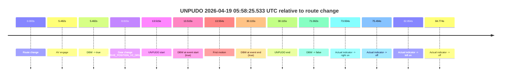

| Metric | Value |
|---|---|
| Outcome | `pass` |
| Effective failure type | `none` |
| Route change status | `found` |
| DBW at event start | `true` |
| DBW at event end | `true` |
| Predicted gear at AV start | `DRIVE_POSITION_V2_DRIVE` |
| Actual gear at AV start | `DRIVE_POSITION_V2_PARK` |
| Predicted gear at event start | `DRIVE_POSITION_V2_DRIVE` |
| Actual gear at event start | `DRIVE_POSITION_V2_DRIVE` |
| Planned indicator direction | `INDICATORS_STATE_V2_RIGHT_ON` |
| Controller indicator direction | `INDICATORS_STATE_V2_RIGHT_ON` |
| Actual indicator direction | `INDICATORS_STATE_V2_OFF` |
| Actual indicator at maneuver end | `INDICATORS_STATE_V2_OFF` |
| Driver accel help in AV | `false` |
| Driver accel help timestamp | `n/a` |
| Max accel pedal pct in AV | `0.0%` |
| Max brake pedal pct in AV | `11.7%` |
| Max speed mps in AV | `2.364` |
| Success timing baseline | `route change` |
| Route -> AV | `5.482s` |
| AV -> event start | `8.033s` |
| AV -> first motion | `8.072s` |
| Success baseline -> event start | `13.515s` |
| Success baseline -> first motion | `13.554s` |
| AV duration before disengagement | `65.580s` |
| Trajectory waypoint count | `38` |
| Driving-plan step count | `11` |

The scored portion starts from the AV-owned window, not from the pre-AV setup. Route-change search in the stopped pre-event segment was `found`, with the baseline therefore set to route change. At the event anchor the model predicts `DRIVE_POSITION_V2_DRIVE` and the actual gear is `DRIVE_POSITION_V2_DRIVE`. The effective model outcome is `pass` because `the credited unpudo stays AV-owned through the official unpudo window.`

### Resolution

| Field | Value |
|---|---|
| Final outcome | `pass` |
| Do we agree with this label? | `yes` |
| Source disengagement type | `none observed` |
| Resolved effective failure type | `none` |
| Confidence | `high` |

## unpudo 2026-04-19 06:03:09.583 UTC

| Field | Value |
|---|---|
| Model | `eel-teal-outspoken` |
| Author | `zak` |
| Run ID | `fme20031/2026-04-19--05-54-18--gen2-av-83040b68-bdc7-4fc4-9d25-8ea9b9ad322e` |
| Date | `2026-04-19` |
| Time (UTC) | `06:03:09.583` |
| Event type | `unpudo` |
| Disengagement type | `none observed` |
| Route change | `found` |
| Console | [run](https://console.sso.wayve.ai/run/fme20031/2026-04-19--05-54-18--gen2-av-83040b68-bdc7-4fc4-9d25-8ea9b9ad322e?id=&time-unixus=1776578589583296) |
| Foxglove | [segment](https://app.foxglove.dev/wayve-on-prem/p/prj_0dX18KZdVHg1fmmI/view?ds=foxglove-stream&ds.deviceName=fme20031&ds.start=2026-04-19T06%3A01%3A01.868282Z&ds.end=2026-04-19T06%3A04%3A48.320068Z&layoutId=lay_0e7VD4WIKDQGU73Y&time=2026-04-19T06%3A03%3A09.583296Z) |

### Event card: pass

- Pass: AV owns the credited unpudo from route change through the official unpudo window, the gear state is aligned at the anchor, and the vehicle moves without driver accelerator help in AV.

| Event | Time (UTC) | Delta from route change |
|---|---:|---:|
| Route change | 2026-04-19 06:01:11.868 | `0.000s` |
| First motion | 2026-04-19 06:01:47.832 | `35.964s` |
| AV engage | 2026-04-19 06:03:05.420 | `113.552s` |
| DBW -> true | 2026-04-19 06:03:05.420 | `113.552s` |
| Gear change (DRIVE_POSITION_V2_DRIVE) | 2026-04-19 06:03:05.883 | `114.015s` |
| UNPUDO start | 2026-04-19 06:03:09.583 | `117.715s` |
| DBW at event start (true) | 2026-04-19 06:03:09.583 | `117.715s` |
| DBW at event end (true) | 2026-04-19 06:03:13.133 | `121.265s` |
| UNPUDO end | 2026-04-19 06:03:13.133 | `121.265s` |
| DBW -> false | 2026-04-19 06:04:38.320 | `206.452s` |

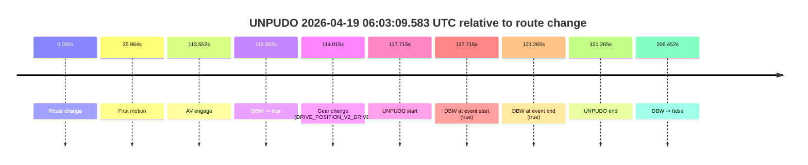

| Metric | Value |
|---|---|
| Outcome | `pass` |
| Effective failure type | `none` |
| Route change status | `found` |
| DBW at event start | `true` |
| DBW at event end | `true` |
| Predicted gear at AV start | `DRIVE_POSITION_V2_DRIVE` |
| Actual gear at AV start | `DRIVE_POSITION_V2_PARK` |
| Predicted gear at event start | `DRIVE_POSITION_V2_DRIVE` |
| Actual gear at event start | `DRIVE_POSITION_V2_DRIVE` |
| Planned indicator direction | `INDICATORS_STATE_V2_RIGHT_ON` |
| Controller indicator direction | `INDICATORS_STATE_V2_RIGHT_ON` |
| Actual indicator direction | `INDICATORS_STATE_V2_OFF` |
| Actual indicator at maneuver end | `INDICATORS_STATE_V2_OFF` |
| Driver accel help in AV | `false` |
| Driver accel help timestamp | `n/a` |
| Max accel pedal pct in AV | `0.0%` |
| Max brake pedal pct in AV | `8.0%` |
| Max speed mps in AV | `5.056` |
| Success timing baseline | `route change` |
| Route -> AV | `113.552s` |
| AV -> event start | `4.163s` |
| AV -> first motion | `-77.588s` |
| Success baseline -> event start | `117.715s` |
| Success baseline -> first motion | `35.964s` |
| AV duration before disengagement | `92.900s` |
| Trajectory waypoint count | `37` |
| Driving-plan step count | `11` |

The scored portion starts from the AV-owned window, not from the pre-AV setup. Route-change search in the stopped pre-event segment was `found`, with the baseline therefore set to route change. At the event anchor the model predicts `DRIVE_POSITION_V2_DRIVE` and the actual gear is `DRIVE_POSITION_V2_DRIVE`. The effective model outcome is `pass` because `the credited unpudo stays AV-owned through the official unpudo window.`

### Resolution

| Field | Value |
|---|---|
| Final outcome | `pass` |
| Do we agree with this label? | `yes` |
| Source disengagement type | `none observed` |
| Resolved effective failure type | `none` |
| Confidence | `high` |

## unpudo 2026-04-19 06:04:47.383 UTC

| Field | Value |
|---|---|
| Model | `eel-teal-outspoken` |
| Author | `zak` |
| Run ID | `fme20031/2026-04-19--05-54-18--gen2-av-83040b68-bdc7-4fc4-9d25-8ea9b9ad322e` |
| Date | `2026-04-19` |
| Time (UTC) | `06:04:47.383` |
| Event type | `unpudo` |
| Disengagement type | `none observed` |
| Route change | `unclear` |
| Console | [run](https://console.sso.wayve.ai/run/fme20031/2026-04-19--05-54-18--gen2-av-83040b68-bdc7-4fc4-9d25-8ea9b9ad322e?id=&time-unixus=1776578687383309) |
| Foxglove | [segment](https://app.foxglove.dev/wayve-on-prem/p/prj_0dX18KZdVHg1fmmI/view?ds=foxglove-stream&ds.deviceName=fme20031&ds.start=2026-04-19T06%3A02%3A55.420005Z&ds.end=2026-04-19T06%3A04%3A57.383309Z&layoutId=lay_0e7VD4WIKDQGU73Y&time=2026-04-19T06%3A04%3A47.383309Z) |

### Event card: fail

- Fail: the credited unpudo does not stay AV-owned. The event window starts with DBW false, and the maneuver outcome lands outside a clean AV-owned segment.

| Event | Time (UTC) | Delta from AV start |
|---|---:|---:|
| Route change unclear | 2026-04-19 06:03:05.420 | `0.000s` |
| AV engage | 2026-04-19 06:03:05.420 | `0.000s` |
| DBW -> true | 2026-04-19 06:03:05.420 | `0.000s` |
| First motion | 2026-04-19 06:03:09.632 | `4.212s` |
| DBW -> false | 2026-04-19 06:04:38.320 | `92.900s` |
| Gear change (DRIVE_POSITION_V2_DRIVE) | 2026-04-19 06:04:40.583 | `95.163s` |
| UNPUDO start | 2026-04-19 06:04:47.383 | `101.963s` |
| DBW at event start (false) | 2026-04-19 06:04:47.383 | `101.963s` |
| DBW at event end (false) | 2026-04-19 06:04:47.383 | `101.963s` |
| UNPUDO end | 2026-04-19 06:04:47.383 | `101.963s` |

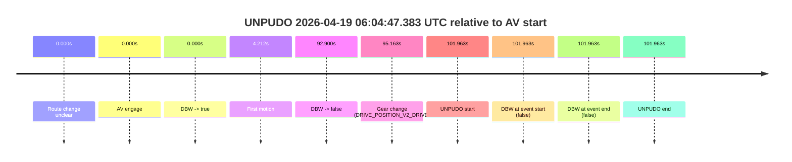

| Metric | Value |
|---|---|
| Outcome | `fail` |
| Effective failure type | `not_av_owned` |
| Route change status | `unclear` |
| DBW at event start | `false` |
| DBW at event end | `false` |
| Predicted gear at AV start | `DRIVE_POSITION_V2_DRIVE` |
| Actual gear at AV start | `DRIVE_POSITION_V2_PARK` |
| Predicted gear at event start | `DRIVE_POSITION_V2_DRIVE` |
| Actual gear at event start | `DRIVE_POSITION_V2_DRIVE` |
| Planned indicator direction | `INDICATORS_STATE_V2_LEFT_ON` |
| Controller indicator direction | `INDICATORS_STATE_V2_LEFT_ON` |
| Actual indicator direction | `INDICATORS_STATE_V2_OFF` |
| Actual indicator at maneuver end | `INDICATORS_STATE_V2_OFF` |
| Driver accel help in AV | `false` |
| Driver accel help timestamp | `n/a` |
| Max accel pedal pct in AV | `0.0%` |
| Max brake pedal pct in AV | `16.9%` |
| Max speed mps in AV | `8.081` |
| Success timing baseline | `AV start` |
| Route -> AV | `n/a` |
| AV -> event start | `101.963s` |
| AV -> first motion | `4.212s` |
| Success baseline -> event start | `101.963s` |
| Success baseline -> first motion | `4.212s` |
| AV duration before disengagement | `92.900s` |
| Trajectory waypoint count | `37` |
| Driving-plan step count | `11` |

The scored portion starts from the AV-owned window, not from the pre-AV setup. Route-change search in the stopped pre-event segment was `unclear`, with the baseline therefore set to AV start. At the event anchor the model predicts `DRIVE_POSITION_V2_DRIVE` and the actual gear is `DRIVE_POSITION_V2_DRIVE`. The effective model outcome is `fail` because `not_av_owned.`

### Resolution

| Field | Value |
|---|---|
| Final outcome | `fail` |
| Do we agree with this label? | `yes` |
| Source disengagement type | `none observed` |
| Resolved effective failure type | `not_av_owned` |
| Confidence | `medium` |

## unpudo 2026-04-19 06:05:26.133 UTC

| Field | Value |
|---|---|
| Model | `eel-teal-outspoken` |
| Author | `zak` |
| Run ID | `fme20031/2026-04-19--05-54-18--gen2-av-83040b68-bdc7-4fc4-9d25-8ea9b9ad322e` |
| Date | `2026-04-19` |
| Time (UTC) | `06:05:26.133` |
| Event type | `unpudo` |
| Disengagement type | `none observed` |
| Route change | `found` |
| Console | [run](https://console.sso.wayve.ai/run/fme20031/2026-04-19--05-54-18--gen2-av-83040b68-bdc7-4fc4-9d25-8ea9b9ad322e?id=&time-unixus=1776578726133294) |
| Foxglove | [segment](https://app.foxglove.dev/wayve-on-prem/p/prj_0dX18KZdVHg1fmmI/view?ds=foxglove-stream&ds.deviceName=fme20031&ds.start=2026-04-19T06%3A04%3A57.918240Z&ds.end=2026-04-19T06%3A10%3A17.620806Z&layoutId=lay_0e7VD4WIKDQGU73Y&time=2026-04-19T06%3A05%3A26.133294Z) |

### Event card: pass

- Pass: AV owns the credited unpudo from route change through the official unpudo window, the gear state is aligned at the anchor, and the vehicle moves without driver accelerator help in AV.

| Event | Time (UTC) | Delta from route change |
|---|---:|---:|
| Route change | 2026-04-19 06:05:07.918 | `0.000s` |
| AV engage | 2026-04-19 06:05:22.020 | `14.102s` |
| DBW -> true | 2026-04-19 06:05:22.020 | `14.102s` |
| Gear change (DRIVE_POSITION_V2_DRIVE) | 2026-04-19 06:05:22.483 | `14.565s` |
| UNPUDO start | 2026-04-19 06:05:26.133 | `18.215s` |
| DBW at event start (true) | 2026-04-19 06:05:26.133 | `18.215s` |
| First motion | 2026-04-19 06:05:26.192 | `18.275s` |
| DBW at event end (true) | 2026-04-19 06:05:29.583 | `21.665s` |
| UNPUDO end | 2026-04-19 06:05:29.583 | `21.665s` |
| Actual indicator -> right on | 2026-04-19 06:07:16.392 | `128.474s` |
| Actual indicator -> off | 2026-04-19 06:07:19.452 | `131.534s` |
| DBW -> false | 2026-04-19 06:10:07.620 | `299.703s` |

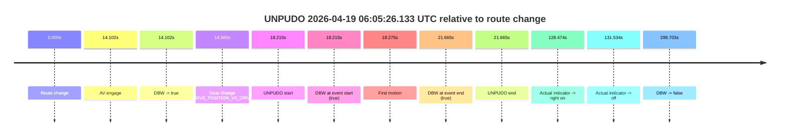

| Metric | Value |
|---|---|
| Outcome | `pass` |
| Effective failure type | `none` |
| Route change status | `found` |
| DBW at event start | `true` |
| DBW at event end | `true` |
| Predicted gear at AV start | `DRIVE_POSITION_V2_DRIVE` |
| Actual gear at AV start | `DRIVE_POSITION_V2_PARK` |
| Predicted gear at event start | `DRIVE_POSITION_V2_DRIVE` |
| Actual gear at event start | `DRIVE_POSITION_V2_DRIVE` |
| Planned indicator direction | `INDICATORS_STATE_V2_RIGHT_ON` |
| Controller indicator direction | `INDICATORS_STATE_V2_RIGHT_ON` |
| Actual indicator direction | `INDICATORS_STATE_V2_OFF` |
| Actual indicator at maneuver end | `INDICATORS_STATE_V2_OFF` |
| Driver accel help in AV | `false` |
| Driver accel help timestamp | `n/a` |
| Max accel pedal pct in AV | `0.0%` |
| Max brake pedal pct in AV | `8.0%` |
| Max speed mps in AV | `5.503` |
| Success timing baseline | `route change` |
| Route -> AV | `14.102s` |
| AV -> event start | `4.113s` |
| AV -> first motion | `4.173s` |
| Success baseline -> event start | `18.215s` |
| Success baseline -> first motion | `18.275s` |
| AV duration before disengagement | `285.601s` |
| Trajectory waypoint count | `38` |
| Driving-plan step count | `11` |

The scored portion starts from the AV-owned window, not from the pre-AV setup. Route-change search in the stopped pre-event segment was `found`, with the baseline therefore set to route change. At the event anchor the model predicts `DRIVE_POSITION_V2_DRIVE` and the actual gear is `DRIVE_POSITION_V2_DRIVE`. The effective model outcome is `pass` because `the credited unpudo stays AV-owned through the official unpudo window.`

### Resolution

| Field | Value |
|---|---|
| Final outcome | `pass` |
| Do we agree with this label? | `yes` |
| Source disengagement type | `none observed` |
| Resolved effective failure type | `none` |
| Confidence | `high` |

## unpudo 2026-04-19 06:09:01.783 UTC

| Field | Value |
|---|---|
| Model | `eel-teal-outspoken` |
| Author | `zak` |
| Run ID | `fme20031/2026-04-19--05-54-18--gen2-av-83040b68-bdc7-4fc4-9d25-8ea9b9ad322e` |
| Date | `2026-04-19` |
| Time (UTC) | `06:09:01.783` |
| Event type | `unpudo` |
| Disengagement type | `none observed` |
| Route change | `found` |
| Console | [run](https://console.sso.wayve.ai/run/fme20031/2026-04-19--05-54-18--gen2-av-83040b68-bdc7-4fc4-9d25-8ea9b9ad322e?id=&time-unixus=1776578941783308) |
| Foxglove | [segment](https://app.foxglove.dev/wayve-on-prem/p/prj_0dX18KZdVHg1fmmI/view?ds=foxglove-stream&ds.deviceName=fme20031&ds.start=2026-04-19T06%3A06%3A57.868246Z&ds.end=2026-04-19T06%3A10%3A17.620806Z&layoutId=lay_0e7VD4WIKDQGU73Y&time=2026-04-19T06%3A09%3A01.783308Z) |

### Event card: pass

- Pass: AV owns the credited unpudo from route change through the official unpudo window, the gear state is aligned at the anchor, and the vehicle moves without driver accelerator help in AV.

| Event | Time (UTC) | Delta from route change |
|---|---:|---:|
| Route change | 2026-04-19 06:07:07.868 | `0.000s` |
| AV engage | 2026-04-19 06:07:07.870 | `0.002s` |
| DBW -> true | 2026-04-19 06:07:07.870 | `0.002s` |
| Actual indicator -> right on | 2026-04-19 06:07:16.392 | `8.524s` |
| First motion | 2026-04-19 06:07:17.532 | `9.664s` |
| Actual indicator -> off | 2026-04-19 06:07:19.452 | `11.584s` |
| Gear change (DRIVE_POSITION_V2_DRIVE) | 2026-04-19 06:08:57.783 | `109.915s` |
| UNPUDO start | 2026-04-19 06:09:01.783 | `113.915s` |
| DBW at event start (true) | 2026-04-19 06:09:01.783 | `113.915s` |
| DBW at event end (true) | 2026-04-19 06:09:05.333 | `117.465s` |
| UNPUDO end | 2026-04-19 06:09:05.333 | `117.465s` |
| DBW -> false | 2026-04-19 06:10:07.620 | `179.753s` |

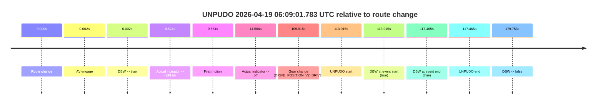

| Metric | Value |
|---|---|
| Outcome | `pass` |
| Effective failure type | `none` |
| Route change status | `found` |
| DBW at event start | `true` |
| DBW at event end | `true` |
| Predicted gear at AV start | `DRIVE_POSITION_V2_PARK` |
| Actual gear at AV start | `DRIVE_POSITION_V2_PARK` |
| Predicted gear at event start | `DRIVE_POSITION_V2_DRIVE` |
| Actual gear at event start | `DRIVE_POSITION_V2_DRIVE` |
| Planned indicator direction | `INDICATORS_STATE_V2_RIGHT_ON` |
| Controller indicator direction | `INDICATORS_STATE_V2_RIGHT_ON` |
| Actual indicator direction | `INDICATORS_STATE_V2_OFF` |
| Actual indicator at maneuver end | `INDICATORS_STATE_V2_OFF` |
| Driver accel help in AV | `false` |
| Driver accel help timestamp | `n/a` |
| Max accel pedal pct in AV | `0.0%` |
| Max brake pedal pct in AV | `20.0%` |
| Max speed mps in AV | `7.742` |
| Success timing baseline | `route change` |
| Route -> AV | `0.002s` |
| AV -> event start | `113.913s` |
| AV -> first motion | `9.662s` |
| Success baseline -> event start | `113.915s` |
| Success baseline -> first motion | `9.664s` |
| AV duration before disengagement | `179.751s` |
| Trajectory waypoint count | `37` |
| Driving-plan step count | `11` |

The scored portion starts from the AV-owned window, not from the pre-AV setup. Route-change search in the stopped pre-event segment was `found`, with the baseline therefore set to route change. At the event anchor the model predicts `DRIVE_POSITION_V2_DRIVE` and the actual gear is `DRIVE_POSITION_V2_DRIVE`. The effective model outcome is `pass` because `the credited unpudo stays AV-owned through the official unpudo window.`

### Resolution

| Field | Value |
|---|---|
| Final outcome | `pass` |
| Do we agree with this label? | `yes` |
| Source disengagement type | `none observed` |
| Resolved effective failure type | `none` |
| Confidence | `high` |

## unpudo 2026-04-19 06:17:29.533 UTC

| Field | Value |
|---|---|
| Model | `eel-teal-outspoken` |
| Author | `zak` |
| Run ID | `fme20031/2026-04-19--05-54-18--gen2-av-83040b68-bdc7-4fc4-9d25-8ea9b9ad322e` |
| Date | `2026-04-19` |
| Time (UTC) | `06:17:29.533` |
| Event type | `unpudo` |
| Disengagement type | `none observed` |
| Route change | `found` |
| Console | [run](https://console.sso.wayve.ai/run/fme20031/2026-04-19--05-54-18--gen2-av-83040b68-bdc7-4fc4-9d25-8ea9b9ad322e?id=&time-unixus=1776579449533311) |
| Foxglove | [segment](https://app.foxglove.dev/wayve-on-prem/p/prj_0dX18KZdVHg1fmmI/view?ds=foxglove-stream&ds.deviceName=fme20031&ds.start=2026-04-19T06%3A17%3A15.718381Z&ds.end=2026-04-19T06%3A18%3A31.159960Z&layoutId=lay_0e7VD4WIKDQGU73Y&time=2026-04-19T06%3A17%3A29.533311Z) |

### Event card: pass

- Pass: AV owns the credited unpudo from route change through the official unpudo window, the gear state is aligned at the anchor, and the vehicle moves without driver accelerator help in AV.

| Event | Time (UTC) | Delta from route change |
|---|---:|---:|
| Route change | 2026-04-19 06:17:25.718 | `0.000s` |
| AV engage | 2026-04-19 06:17:25.720 | `0.002s` |
| DBW -> true | 2026-04-19 06:17:25.720 | `0.002s` |
| Gear change (DRIVE_POSITION_V2_DRIVE) | 2026-04-19 06:17:26.033 | `0.315s` |
| UNPUDO start | 2026-04-19 06:17:29.533 | `3.815s` |
| DBW at event start (true) | 2026-04-19 06:17:29.533 | `3.815s` |
| First motion | 2026-04-19 06:17:29.572 | `3.854s` |
| DBW at event end (true) | 2026-04-19 06:17:33.233 | `7.515s` |
| UNPUDO end | 2026-04-19 06:17:33.233 | `7.515s` |
| DBW -> false | 2026-04-19 06:18:21.159 | `55.442s` |
| Actual indicator -> right on | 2026-04-19 06:18:22.632 | `56.914s` |
| Actual indicator -> off | 2026-04-19 06:18:33.672 | `67.954s` |

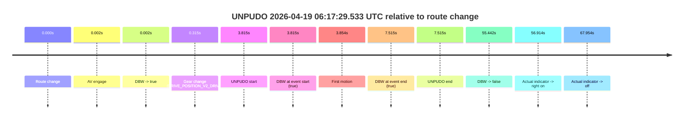

| Metric | Value |
|---|---|
| Outcome | `pass` |
| Effective failure type | `none` |
| Route change status | `found` |
| DBW at event start | `true` |
| DBW at event end | `true` |
| Predicted gear at AV start | `DRIVE_POSITION_V2_PARK` |
| Actual gear at AV start | `DRIVE_POSITION_V2_PARK` |
| Predicted gear at event start | `DRIVE_POSITION_V2_DRIVE` |
| Actual gear at event start | `DRIVE_POSITION_V2_DRIVE` |
| Planned indicator direction | `INDICATORS_STATE_V2_RIGHT_ON` |
| Controller indicator direction | `INDICATORS_STATE_V2_RIGHT_ON` |
| Actual indicator direction | `INDICATORS_STATE_V2_OFF` |
| Actual indicator at maneuver end | `INDICATORS_STATE_V2_OFF` |
| Driver accel help in AV | `false` |
| Driver accel help timestamp | `n/a` |
| Max accel pedal pct in AV | `0.0%` |
| Max brake pedal pct in AV | `8.0%` |
| Max speed mps in AV | `4.492` |
| Success timing baseline | `route change` |
| Route -> AV | `0.002s` |
| AV -> event start | `3.813s` |
| AV -> first motion | `3.853s` |
| Success baseline -> event start | `3.815s` |
| Success baseline -> first motion | `3.854s` |
| AV duration before disengagement | `55.440s` |
| Trajectory waypoint count | `36` |
| Driving-plan step count | `11` |

The scored portion starts from the AV-owned window, not from the pre-AV setup. Route-change search in the stopped pre-event segment was `found`, with the baseline therefore set to route change. At the event anchor the model predicts `DRIVE_POSITION_V2_DRIVE` and the actual gear is `DRIVE_POSITION_V2_DRIVE`. The effective model outcome is `pass` because `the credited unpudo stays AV-owned through the official unpudo window.`

### Resolution

| Field | Value |
|---|---|
| Final outcome | `pass` |
| Do we agree with this label? | `yes` |
| Source disengagement type | `none observed` |
| Resolved effective failure type | `none` |
| Confidence | `high` |

## unpudo 2026-04-19 06:40:47.483 UTC

| Field | Value |
|---|---|
| Model | `eel-teal-outspoken` |
| Author | `zak` |
| Run ID | `fme20031/2026-04-19--05-54-18--gen2-av-83040b68-bdc7-4fc4-9d25-8ea9b9ad322e` |
| Date | `2026-04-19` |
| Time (UTC) | `06:40:47.483` |
| Event type | `unpudo` |
| Disengagement type | `none observed` |
| Route change | `found` |
| Console | [run](https://console.sso.wayve.ai/run/fme20031/2026-04-19--05-54-18--gen2-av-83040b68-bdc7-4fc4-9d25-8ea9b9ad322e?id=&time-unixus=1776580847483295) |
| Foxglove | [segment](https://app.foxglove.dev/wayve-on-prem/p/prj_0dX18KZdVHg1fmmI/view?ds=foxglove-stream&ds.deviceName=fme20031&ds.start=2026-04-19T06%3A40%3A22.268298Z&ds.end=2026-04-19T06%3A53%3A38.640077Z&layoutId=lay_0e7VD4WIKDQGU73Y&time=2026-04-19T06%3A40%3A47.483295Z) |

### Event card: pass

- Pass: AV owns the credited unpudo from route change through the official unpudo window, the gear state is aligned at the anchor, and the vehicle moves without driver accelerator help in AV.

| Event | Time (UTC) | Delta from route change |
|---|---:|---:|
| Route change | 2026-04-19 06:40:32.268 | `0.000s` |
| AV engage | 2026-04-19 06:40:43.440 | `11.172s` |
| DBW -> true | 2026-04-19 06:40:43.440 | `11.172s` |
| Gear change (DRIVE_POSITION_V2_DRIVE) | 2026-04-19 06:40:43.933 | `11.665s` |
| UNPUDO start | 2026-04-19 06:40:47.483 | `15.215s` |
| DBW at event start (true) | 2026-04-19 06:40:47.483 | `15.215s` |
| First motion | 2026-04-19 06:40:47.513 | `15.245s` |
| DBW at event end (true) | 2026-04-19 06:40:51.233 | `18.965s` |
| UNPUDO end | 2026-04-19 06:40:51.233 | `18.965s` |
| DBW -> false | 2026-04-19 06:53:28.640 | `776.372s` |

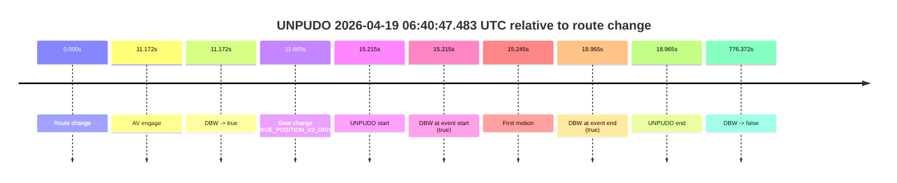

| Metric | Value |
|---|---|
| Outcome | `pass` |
| Effective failure type | `none` |
| Route change status | `found` |
| DBW at event start | `true` |
| DBW at event end | `true` |
| Predicted gear at AV start | `DRIVE_POSITION_V2_DRIVE` |
| Actual gear at AV start | `DRIVE_POSITION_V2_PARK` |
| Predicted gear at event start | `DRIVE_POSITION_V2_DRIVE` |
| Actual gear at event start | `DRIVE_POSITION_V2_DRIVE` |
| Planned indicator direction | `INDICATORS_STATE_V2_RIGHT_ON` |
| Controller indicator direction | `INDICATORS_STATE_V2_RIGHT_ON` |
| Actual indicator direction | `INDICATORS_STATE_V2_OFF` |
| Actual indicator at maneuver end | `INDICATORS_STATE_V2_OFF` |
| Driver accel help in AV | `false` |
| Driver accel help timestamp | `n/a` |
| Max accel pedal pct in AV | `0.0%` |
| Max brake pedal pct in AV | `8.0%` |
| Max speed mps in AV | `4.400` |
| Success timing baseline | `route change` |
| Route -> AV | `11.172s` |
| AV -> event start | `4.043s` |
| AV -> first motion | `4.073s` |
| Success baseline -> event start | `15.215s` |
| Success baseline -> first motion | `15.245s` |
| AV duration before disengagement | `765.200s` |
| Trajectory waypoint count | `37` |
| Driving-plan step count | `11` |

The scored portion starts from the AV-owned window, not from the pre-AV setup. Route-change search in the stopped pre-event segment was `found`, with the baseline therefore set to route change. At the event anchor the model predicts `DRIVE_POSITION_V2_DRIVE` and the actual gear is `DRIVE_POSITION_V2_DRIVE`. The effective model outcome is `pass` because `the credited unpudo stays AV-owned through the official unpudo window.`

### Resolution

| Field | Value |
|---|---|
| Final outcome | `pass` |
| Do we agree with this label? | `yes` |
| Source disengagement type | `none observed` |
| Resolved effective failure type | `none` |
| Confidence | `high` |

## unpudo 2026-04-19 06:47:47.983 UTC

| Field | Value |
|---|---|
| Model | `eel-teal-outspoken` |
| Author | `zak` |
| Run ID | `fme20031/2026-04-19--05-54-18--gen2-av-83040b68-bdc7-4fc4-9d25-8ea9b9ad322e` |
| Date | `2026-04-19` |
| Time (UTC) | `06:47:47.983` |
| Event type | `unpudo` |
| Disengagement type | `none observed` |
| Route change | `found` |
| Console | [run](https://console.sso.wayve.ai/run/fme20031/2026-04-19--05-54-18--gen2-av-83040b68-bdc7-4fc4-9d25-8ea9b9ad322e?id=&time-unixus=1776581267983303) |
| Foxglove | [segment](https://app.foxglove.dev/wayve-on-prem/p/prj_0dX18KZdVHg1fmmI/view?ds=foxglove-stream&ds.deviceName=fme20031&ds.start=2026-04-19T06%3A47%3A33.971749Z&ds.end=2026-04-19T06%3A53%3A38.640077Z&layoutId=lay_0e7VD4WIKDQGU73Y&time=2026-04-19T06%3A47%3A47.983303Z) |

### Event card: pass

- Pass: AV owns the credited unpudo from route change through the official unpudo window, the gear state is aligned at the anchor, and the vehicle moves without driver accelerator help in AV.

| Event | Time (UTC) | Delta from route change |
|---|---:|---:|
| Route change | 2026-04-19 06:47:43.971 | `0.000s` |
| AV engage | 2026-04-19 06:47:43.980 | `0.008s` |
| DBW -> true | 2026-04-19 06:47:43.980 | `0.008s` |
| Gear change (DRIVE_POSITION_V2_DRIVE) | 2026-04-19 06:47:44.333 | `0.362s` |
| UNPUDO start | 2026-04-19 06:47:47.983 | `4.012s` |
| DBW at event start (true) | 2026-04-19 06:47:47.983 | `4.012s` |
| First motion | 2026-04-19 06:47:48.013 | `4.041s` |
| DBW at event end (true) | 2026-04-19 06:47:52.733 | `8.762s` |
| UNPUDO end | 2026-04-19 06:47:52.733 | `8.762s` |
| DBW -> false | 2026-04-19 06:53:28.640 | `344.668s` |

| Metric | Value |
|---|---|
| Outcome | `pass` |
| Effective failure type | `none` |
| Route change status | `found` |
| DBW at event start | `true` |
| DBW at event end | `true` |
| Predicted gear at AV start | `DRIVE_POSITION_V2_PARK` |
| Actual gear at AV start | `DRIVE_POSITION_V2_PARK` |
| Predicted gear at event start | `DRIVE_POSITION_V2_DRIVE` |
| Actual gear at event start | `DRIVE_POSITION_V2_DRIVE` |
| Planned indicator direction | `INDICATORS_STATE_V2_OFF` |
| Controller indicator direction | `INDICATORS_STATE_V2_OFF` |
| Actual indicator direction | `INDICATORS_STATE_V2_OFF` |
| Actual indicator at maneuver end | `INDICATORS_STATE_V2_OFF` |
| Driver accel help in AV | `false` |
| Driver accel help timestamp | `n/a` |
| Max accel pedal pct in AV | `0.0%` |
| Max brake pedal pct in AV | `25.2%` |
| Max speed mps in AV | `3.631` |
| Success timing baseline | `route change` |
| Route -> AV | `0.008s` |
| AV -> event start | `4.003s` |
| AV -> first motion | `4.033s` |
| Success baseline -> event start | `4.012s` |
| Success baseline -> first motion | `4.041s` |
| AV duration before disengagement | `344.660s` |
| Trajectory waypoint count | `37` |
| Driving-plan step count | `11` |

The scored portion starts from the AV-owned window, not from the pre-AV setup. Route-change search in the stopped pre-event segment was `found`, with the baseline therefore set to route change. At the event anchor the model predicts `DRIVE_POSITION_V2_DRIVE` and the actual gear is `DRIVE_POSITION_V2_DRIVE`. The effective model outcome is `pass` because `the credited unpudo stays AV-owned through the official unpudo window.`

### Resolution

| Field | Value |
|---|---|
| Final outcome | `pass` |
| Do we agree with this label? | `yes` |
| Source disengagement type | `none observed` |
| Resolved effective failure type | `none` |
| Confidence | `high` |

## unpudo 2026-04-19 06:59:56.533 UTC

| Field | Value |
|---|---|
| Model | `eel-teal-outspoken` |
| Author | `zak` |
| Run ID | `fme20031/2026-04-19--05-54-18--gen2-av-83040b68-bdc7-4fc4-9d25-8ea9b9ad322e` |
| Date | `2026-04-19` |
| Time (UTC) | `06:59:56.533` |
| Event type | `unpudo` |
| Disengagement type | `none observed` |
| Route change | `found` |
| Console | [run](https://console.sso.wayve.ai/run/fme20031/2026-04-19--05-54-18--gen2-av-83040b68-bdc7-4fc4-9d25-8ea9b9ad322e?id=&time-unixus=1776581996533300) |
| Foxglove | [segment](https://app.foxglove.dev/wayve-on-prem/p/prj_0dX18KZdVHg1fmmI/view?ds=foxglove-stream&ds.deviceName=fme20031&ds.start=2026-04-19T06%3A59%3A42.470300Z&ds.end=2026-04-19T07%3A17%3A43.020058Z&layoutId=lay_0e7VD4WIKDQGU73Y&time=2026-04-19T06%3A59%3A56.533300Z) |

### Event card: pass

- Pass: AV owns the credited unpudo from route change through the official unpudo window, the gear state is aligned at the anchor, and the vehicle moves without driver accelerator help in AV.

| Event | Time (UTC) | Delta from route change |
|---|---:|---:|
| Route change | 2026-04-19 06:59:52.470 | `0.000s` |
| AV engage | 2026-04-19 06:59:52.480 | `0.010s` |
| DBW -> true | 2026-04-19 06:59:52.480 | `0.010s` |
| Gear change (DRIVE_POSITION_V2_DRIVE) | 2026-04-19 06:59:52.833 | `0.363s` |
| UNPUDO start | 2026-04-19 06:59:56.533 | `4.063s` |
| DBW at event start (true) | 2026-04-19 06:59:56.533 | `4.063s` |
| First motion | 2026-04-19 06:59:56.572 | `4.102s` |
| DBW at event end (true) | 2026-04-19 07:00:00.533 | `8.063s` |
| UNPUDO end | 2026-04-19 07:00:00.533 | `8.063s` |
| DBW -> false | 2026-04-19 07:17:33.020 | `1060.550s` |
| Actual indicator -> right on | 2026-04-19 07:17:33.032 | `1060.562s` |
| Actual indicator -> off | 2026-04-19 07:17:48.392 | `1075.922s` |

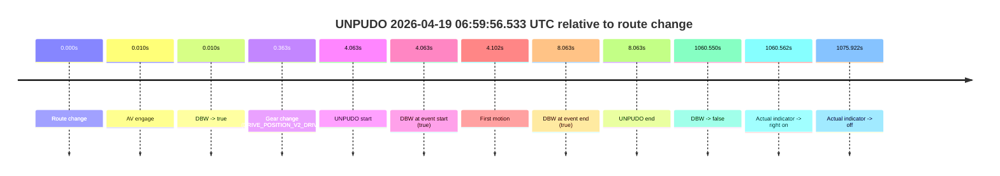

| Metric | Value |
|---|---|
| Outcome | `pass` |
| Effective failure type | `none` |
| Route change status | `found` |
| DBW at event start | `true` |
| DBW at event end | `true` |
| Predicted gear at AV start | `DRIVE_POSITION_V2_PARK` |
| Actual gear at AV start | `DRIVE_POSITION_V2_PARK` |
| Predicted gear at event start | `DRIVE_POSITION_V2_DRIVE` |
| Actual gear at event start | `DRIVE_POSITION_V2_DRIVE` |
| Planned indicator direction | `INDICATORS_STATE_V2_RIGHT_ON` |
| Controller indicator direction | `INDICATORS_STATE_V2_RIGHT_ON` |
| Actual indicator direction | `INDICATORS_STATE_V2_OFF` |
| Actual indicator at maneuver end | `INDICATORS_STATE_V2_OFF` |
| Driver accel help in AV | `false` |
| Driver accel help timestamp | `n/a` |
| Max accel pedal pct in AV | `0.0%` |
| Max brake pedal pct in AV | `8.0%` |
| Max speed mps in AV | `3.522` |
| Success timing baseline | `route change` |
| Route -> AV | `0.010s` |
| AV -> event start | `4.053s` |
| AV -> first motion | `4.092s` |
| Success baseline -> event start | `4.063s` |
| Success baseline -> first motion | `4.102s` |
| AV duration before disengagement | `1060.540s` |
| Trajectory waypoint count | `38` |
| Driving-plan step count | `11` |

The scored portion starts from the AV-owned window, not from the pre-AV setup. Route-change search in the stopped pre-event segment was `found`, with the baseline therefore set to route change. At the event anchor the model predicts `DRIVE_POSITION_V2_DRIVE` and the actual gear is `DRIVE_POSITION_V2_DRIVE`. The effective model outcome is `pass` because `the credited unpudo stays AV-owned through the official unpudo window.`

### Resolution

| Field | Value |
|---|---|
| Final outcome | `pass` |
| Do we agree with this label? | `yes` |
| Source disengagement type | `none observed` |
| Resolved effective failure type | `none` |
| Confidence | `high` |

## unpudo 2026-04-19 07:27:04.433 UTC

| Field | Value |
|---|---|
| Model | `eel-teal-outspoken` |
| Author | `zak` |
| Run ID | `fme20031/2026-04-19--05-54-18--gen2-av-83040b68-bdc7-4fc4-9d25-8ea9b9ad322e` |
| Date | `2026-04-19` |
| Time (UTC) | `07:27:04.433` |
| Event type | `unpudo` |
| Disengagement type | `none observed` |
| Route change | `found` |
| Console | [run](https://console.sso.wayve.ai/run/fme20031/2026-04-19--05-54-18--gen2-av-83040b68-bdc7-4fc4-9d25-8ea9b9ad322e?id=&time-unixus=1776583624433301) |
| Foxglove | [segment](https://app.foxglove.dev/wayve-on-prem/p/prj_0dX18KZdVHg1fmmI/view?ds=foxglove-stream&ds.deviceName=fme20031&ds.start=2026-04-19T07%3A26%3A50.368298Z&ds.end=2026-04-19T07%3A31%3A07.059933Z&layoutId=lay_0e7VD4WIKDQGU73Y&time=2026-04-19T07%3A27%3A04.433301Z) |

### Event card: pass

- Pass: AV owns the credited unpudo from route change through the official unpudo window, the gear state is aligned at the anchor, and the vehicle moves without driver accelerator help in AV.

| Event | Time (UTC) | Delta from route change |
|---|---:|---:|
| Route change | 2026-04-19 07:27:00.368 | `0.000s` |
| AV engage | 2026-04-19 07:27:00.370 | `0.002s` |
| DBW -> true | 2026-04-19 07:27:00.370 | `0.002s` |
| Gear change (DRIVE_POSITION_V2_DRIVE) | 2026-04-19 07:27:00.733 | `0.365s` |
| UNPUDO start | 2026-04-19 07:27:04.433 | `4.065s` |
| DBW at event start (true) | 2026-04-19 07:27:04.433 | `4.065s` |
| First motion | 2026-04-19 07:27:04.452 | `4.084s` |
| DBW at event end (true) | 2026-04-19 07:27:08.683 | `8.315s` |
| UNPUDO end | 2026-04-19 07:27:08.683 | `8.315s` |
| DBW -> false | 2026-04-19 07:30:57.059 | `236.692s` |
| Actual indicator -> left on | 2026-04-19 07:31:11.172 | `250.804s` |

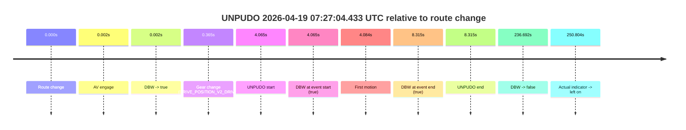

| Metric | Value |
|---|---|
| Outcome | `pass` |
| Effective failure type | `none` |
| Route change status | `found` |
| DBW at event start | `true` |
| DBW at event end | `true` |
| Predicted gear at AV start | `DRIVE_POSITION_V2_PARK` |
| Actual gear at AV start | `DRIVE_POSITION_V2_PARK` |
| Predicted gear at event start | `DRIVE_POSITION_V2_DRIVE` |
| Actual gear at event start | `DRIVE_POSITION_V2_DRIVE` |
| Planned indicator direction | `INDICATORS_STATE_V2_RIGHT_ON` |
| Controller indicator direction | `INDICATORS_STATE_V2_RIGHT_ON` |
| Actual indicator direction | `INDICATORS_STATE_V2_OFF` |
| Actual indicator at maneuver end | `INDICATORS_STATE_V2_OFF` |
| Driver accel help in AV | `false` |
| Driver accel help timestamp | `n/a` |
| Max accel pedal pct in AV | `0.0%` |
| Max brake pedal pct in AV | `12.8%` |
| Max speed mps in AV | `3.669` |
| Success timing baseline | `route change` |
| Route -> AV | `0.002s` |
| AV -> event start | `4.063s` |
| AV -> first motion | `4.082s` |
| Success baseline -> event start | `4.065s` |
| Success baseline -> first motion | `4.084s` |
| AV duration before disengagement | `236.690s` |
| Trajectory waypoint count | `38` |
| Driving-plan step count | `11` |

The scored portion starts from the AV-owned window, not from the pre-AV setup. Route-change search in the stopped pre-event segment was `found`, with the baseline therefore set to route change. At the event anchor the model predicts `DRIVE_POSITION_V2_DRIVE` and the actual gear is `DRIVE_POSITION_V2_DRIVE`. The effective model outcome is `pass` because `the credited unpudo stays AV-owned through the official unpudo window.`

### Resolution

| Field | Value |
|---|---|
| Final outcome | `pass` |
| Do we agree with this label? | `yes` |
| Source disengagement type | `none observed` |
| Resolved effective failure type | `none` |
| Confidence | `high` |

## unpudo 2026-04-19 07:34:13.083 UTC

| Field | Value |
|---|---|
| Model | `eel-teal-outspoken` |
| Author | `zak` |
| Run ID | `fme20031/2026-04-19--05-54-18--gen2-av-83040b68-bdc7-4fc4-9d25-8ea9b9ad322e` |
| Date | `2026-04-19` |
| Time (UTC) | `07:34:13.083` |
| Event type | `unpudo` |
| Disengagement type | `none observed` |
| Route change | `found` |
| Console | [run](https://console.sso.wayve.ai/run/fme20031/2026-04-19--05-54-18--gen2-av-83040b68-bdc7-4fc4-9d25-8ea9b9ad322e?id=&time-unixus=1776584053083316) |
| Foxglove | [segment](https://app.foxglove.dev/wayve-on-prem/p/prj_0dX18KZdVHg1fmmI/view?ds=foxglove-stream&ds.deviceName=fme20031&ds.start=2026-04-19T07%3A33%3A59.168363Z&ds.end=2026-04-19T07%3A34%3A37.483319Z&layoutId=lay_0e7VD4WIKDQGU73Y&time=2026-04-19T07%3A34%3A13.083316Z) |

### Event card: pass

- Pass: AV owns the credited unpudo from route change through the official unpudo window, the gear state is aligned at the anchor, and the vehicle moves without driver accelerator help in AV.

| Event | Time (UTC) | Delta from route change |
|---|---:|---:|
| Route change | 2026-04-19 07:34:09.168 | `0.000s` |
| AV engage | 2026-04-19 07:34:09.169 | `0.001s` |
| DBW -> true | 2026-04-19 07:34:09.169 | `0.001s` |
| Gear change (DRIVE_POSITION_V2_DRIVE) | 2026-04-19 07:34:09.483 | `0.315s` |
| UNPUDO start | 2026-04-19 07:34:13.083 | `3.915s` |
| DBW at event start (true) | 2026-04-19 07:34:13.083 | `3.915s` |
| First motion | 2026-04-19 07:34:13.112 | `3.944s` |
| DBW at event end (true) | 2026-04-19 07:34:27.483 | `18.315s` |
| UNPUDO end | 2026-04-19 07:34:27.483 | `18.315s` |

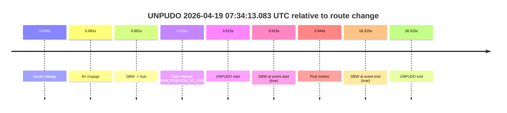

| Metric | Value |
|---|---|
| Outcome | `pass` |
| Effective failure type | `none` |
| Route change status | `found` |
| DBW at event start | `true` |
| DBW at event end | `true` |
| Predicted gear at AV start | `DRIVE_POSITION_V2_PARK` |
| Actual gear at AV start | `DRIVE_POSITION_V2_PARK` |
| Predicted gear at event start | `DRIVE_POSITION_V2_DRIVE` |
| Actual gear at event start | `DRIVE_POSITION_V2_DRIVE` |
| Planned indicator direction | `INDICATORS_STATE_V2_OFF` |
| Controller indicator direction | `INDICATORS_STATE_V2_OFF` |
| Actual indicator direction | `INDICATORS_STATE_V2_OFF` |
| Actual indicator at maneuver end | `INDICATORS_STATE_V2_OFF` |
| Driver accel help in AV | `false` |
| Driver accel help timestamp | `n/a` |
| Max accel pedal pct in AV | `0.0%` |
| Max brake pedal pct in AV | `8.0%` |
| Max speed mps in AV | `4.008` |
| Success timing baseline | `route change` |
| Route -> AV | `0.001s` |
| AV -> event start | `3.914s` |
| AV -> first motion | `3.943s` |
| Success baseline -> event start | `3.915s` |
| Success baseline -> first motion | `3.944s` |
| AV duration before disengagement | `n/a` |
| Trajectory waypoint count | `37` |
| Driving-plan step count | `11` |

The scored portion starts from the AV-owned window, not from the pre-AV setup. Route-change search in the stopped pre-event segment was `found`, with the baseline therefore set to route change. At the event anchor the model predicts `DRIVE_POSITION_V2_DRIVE` and the actual gear is `DRIVE_POSITION_V2_DRIVE`. The effective model outcome is `pass` because `the credited unpudo stays AV-owned through the official unpudo window.`

### Resolution

| Field | Value |
|---|---|
| Final outcome | `pass` |
| Do we agree with this label? | `yes` |
| Source disengagement type | `none observed` |
| Resolved effective failure type | `none` |
| Confidence | `high` |

## unparking 2026-04-19 07:35:48.033 UTC

| Field | Value |
|---|---|
| Model | `eel-teal-outspoken` |
| Author | `zak` |
| Run ID | `fme20031/2026-04-19--05-54-18--gen2-av-83040b68-bdc7-4fc4-9d25-8ea9b9ad322e` |
| Date | `2026-04-19` |
| Time (UTC) | `07:35:48.033` |
| Event type | `unparking` |
| Disengagement type | `none observed` |
| Route change | `found` |
| Console | [run](https://console.sso.wayve.ai/run/fme20031/2026-04-19--05-54-18--gen2-av-83040b68-bdc7-4fc4-9d25-8ea9b9ad322e?id=&time-unixus=1776584148033323) |
| Foxglove | [segment](https://app.foxglove.dev/wayve-on-prem/p/prj_0dX18KZdVHg1fmmI/view?ds=foxglove-stream&ds.deviceName=fme20031&ds.start=2026-04-19T07%3A31%3A23.880068Z&ds.end=2026-04-19T07%3A36%3A01.383314Z&layoutId=lay_0e7VD4WIKDQGU73Y&time=2026-04-19T07%3A35%3A48.033323Z) |

### Event card: pass

- Pass: AV owns the credited unparking through the official event window, the gear state is aligned at the anchor, and the vehicle moves without driver accelerator help in AV.

| Event | Time (UTC) | Delta from route change |
|---|---:|---:|
| AV engage | 2026-04-19 07:31:33.880 | `-155.288s` |
| DBW -> true | 2026-04-19 07:31:33.880 | `-155.288s` |
| Route change | 2026-04-19 07:34:09.168 | `0.000s` |
| Gear change (DRIVE_POSITION_V2_DRIVE) | 2026-04-19 07:35:44.433 | `95.265s` |
| UNPARKING start | 2026-04-19 07:35:48.033 | `98.865s` |
| DBW at event start (true) | 2026-04-19 07:35:48.033 | `98.865s` |
| First motion | 2026-04-19 07:35:48.052 | `98.884s` |
| DBW at event end (true) | 2026-04-19 07:35:51.383 | `102.215s` |
| UNPARKING end | 2026-04-19 07:35:51.383 | `102.215s` |

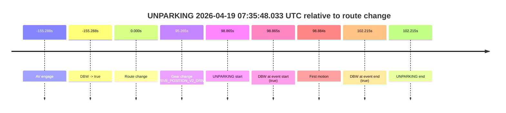

| Metric | Value |
|---|---|
| Outcome | `pass` |
| Effective failure type | `none` |
| Route change status | `found` |
| DBW at event start | `true` |
| DBW at event end | `true` |
| Predicted gear at AV start | `DRIVE_POSITION_V2_DRIVE` |
| Actual gear at AV start | `DRIVE_POSITION_V2_PARK` |
| Predicted gear at event start | `DRIVE_POSITION_V2_DRIVE` |
| Actual gear at event start | `DRIVE_POSITION_V2_DRIVE` |
| Planned indicator direction | `INDICATORS_STATE_V2_RIGHT_ON` |
| Controller indicator direction | `INDICATORS_STATE_V2_RIGHT_ON` |
| Actual indicator direction | `INDICATORS_STATE_V2_OFF` |
| Actual indicator at maneuver end | `INDICATORS_STATE_V2_OFF` |
| Driver accel help in AV | `false` |
| Driver accel help timestamp | `n/a` |
| Max accel pedal pct in AV | `0.0%` |
| Max brake pedal pct in AV | `0.0%` |
| Max speed mps in AV | `5.428` |
| Success timing baseline | `AV start` |
| Route -> AV | `-155.288s` |
| AV -> event start | `254.153s` |
| AV -> first motion | `254.172s` |
| Success baseline -> event start | `254.153s` |
| Success baseline -> first motion | `254.172s` |
| AV duration before disengagement | `n/a` |
| Trajectory waypoint count | `38` |
| Driving-plan step count | `11` |

The scored portion starts from the AV-owned window, not from the pre-AV setup. Route-change search in the stopped pre-event segment was `found`, with the baseline therefore set to route change. At the event anchor the model predicts `DRIVE_POSITION_V2_DRIVE` and the actual gear is `DRIVE_POSITION_V2_DRIVE`. The effective model outcome is `pass` because `the credited maneuver stays AV-owned through the official event end.`

### Resolution

| Field | Value |
|---|---|
| Final outcome | `pass` |
| Do we agree with this label? | `yes` |
| Source disengagement type | `none observed` |
| Resolved effective failure type | `none` |
| Confidence | `high` |
