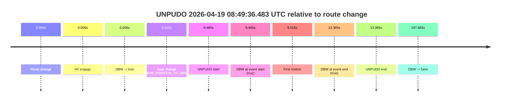
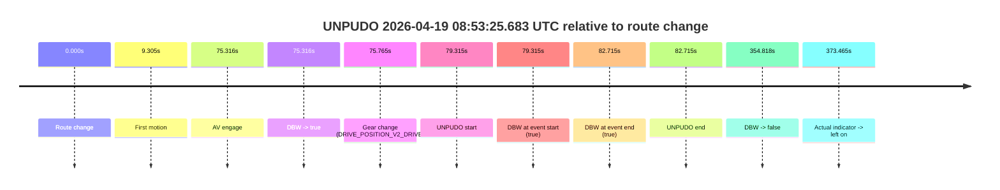
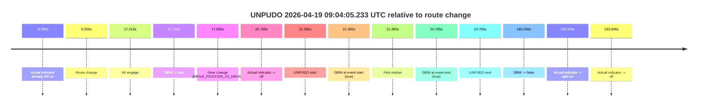
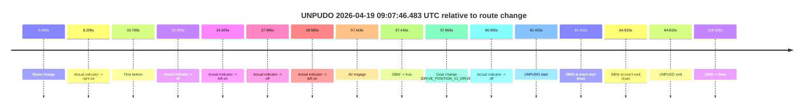
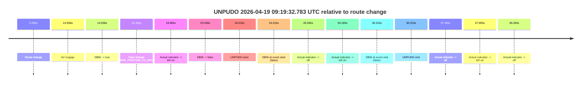
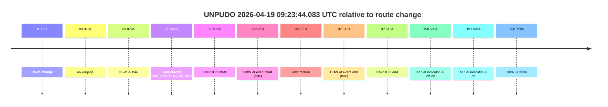
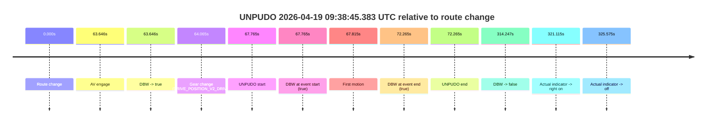
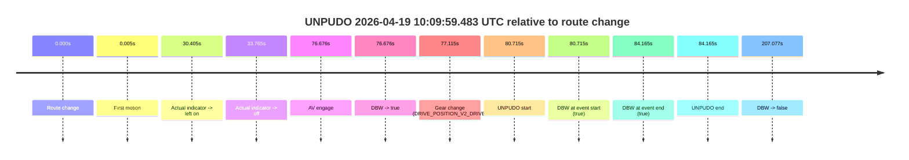
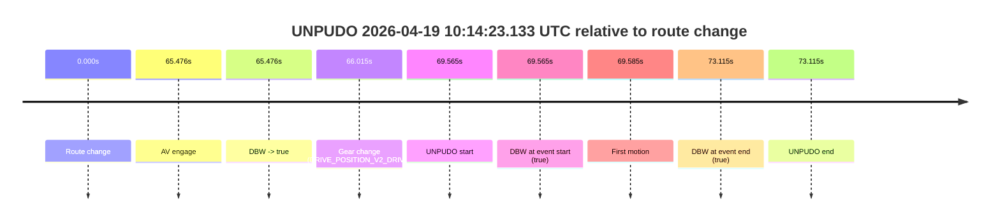

# Run Report: fme20031/2026-04-19--08-36-49--gen2-av-f35b290f-bc0a-4a38-a4b1-f0f456b0360c

| Field | Value |
|---|---|
| Run ID | `fme20031/2026-04-19--08-36-49--gen2-av-f35b290f-bc0a-4a38-a4b1-f0f456b0360c` |
| Date | `2026-04-19` |
| Model(s) | `eel-teal-outspoken` |
| Author | `zak` |
| Event count | `14` |

## unpudo 2026-04-19 08:42:36.783 UTC

| Field | Value |
|---|---|
| Model | `eel-teal-outspoken` |
| Author | `zak` |
| Run ID | `fme20031/2026-04-19--08-36-49--gen2-av-f35b290f-bc0a-4a38-a4b1-f0f456b0360c` |
| Date | `2026-04-19` |
| Time (UTC) | `08:42:36.783` |
| Event type | `unpudo` |
| Disengagement type | `none observed` |
| Route change | `found` |
| Console | [run](https://console.sso.wayve.ai/run/fme20031/2026-04-19--08-36-49--gen2-av-f35b290f-bc0a-4a38-a4b1-f0f456b0360c?id=&time-unixus=1776588156783312) |
| Foxglove | [segment](https://app.foxglove.dev/wayve-on-prem/p/prj_0dX18KZdVHg1fmmI/view?ds=foxglove-stream&ds.deviceName=fme20031&ds.start=2026-04-19T08%3A42%3A22.968282Z&ds.end=2026-04-19T08%3A43%3A03.064550Z&layoutId=lay_0e7VD4WIKDQGU73Y&time=2026-04-19T08%3A42%3A36.783312Z) |

### Event card: pass

- Pass: AV owns the credited unpudo from route change through the official unpudo window, the gear state is aligned at the anchor, and the vehicle moves without driver accelerator help in AV.

| Event | Time (UTC) | Delta from route change |
|---|---:|---:|
| Route change | 2026-04-19 08:42:32.968 | `0.000s` |
| AV engage | 2026-04-19 08:42:32.974 | `0.006s` |
| DBW -> true | 2026-04-19 08:42:32.974 | `0.006s` |
| Gear change (DRIVE_POSITION_V2_DRIVE) | 2026-04-19 08:42:33.233 | `0.265s` |
| UNPUDO start | 2026-04-19 08:42:36.783 | `3.815s` |
| DBW at event start (true) | 2026-04-19 08:42:36.783 | `3.815s` |
| First motion | 2026-04-19 08:42:36.833 | `3.865s` |
| DBW at event end (true) | 2026-04-19 08:42:40.233 | `7.265s` |
| UNPUDO end | 2026-04-19 08:42:40.233 | `7.265s` |
| DBW -> false | 2026-04-19 08:42:53.064 | `20.096s` |

| Metric | Value |
|---|---|
| Outcome | `pass` |
| Effective failure type | `none` |
| Route change status | `found` |
| DBW at event start | `true` |
| DBW at event end | `true` |
| Predicted gear at AV start | `DRIVE_POSITION_V2_PARK` |
| Actual gear at AV start | `DRIVE_POSITION_V2_PARK` |
| Predicted gear at event start | `DRIVE_POSITION_V2_DRIVE` |
| Actual gear at event start | `DRIVE_POSITION_V2_DRIVE` |
| Planned indicator direction | `INDICATORS_STATE_V2_RIGHT_ON` |
| Controller indicator direction | `INDICATORS_STATE_V2_RIGHT_ON` |
| Actual indicator direction | `INDICATORS_STATE_V2_OFF` |
| Actual indicator at maneuver end | `INDICATORS_STATE_V2_OFF` |
| Driver accel help in AV | `false` |
| Driver accel help timestamp | `n/a` |
| Max accel pedal pct in AV | `0.0%` |
| Max brake pedal pct in AV | `8.8%` |
| Max speed mps in AV | `5.283` |
| Success timing baseline | `route change` |
| Route -> AV | `0.006s` |
| AV -> event start | `3.809s` |
| AV -> first motion | `3.859s` |
| Success baseline -> event start | `3.815s` |
| Success baseline -> first motion | `3.865s` |
| AV duration before disengagement | `20.090s` |
| Trajectory waypoint count | `37` |
| Driving-plan step count | `11` |

The scored portion starts from the AV-owned window, not from the pre-AV setup. Route-change search in the stopped pre-event segment was `found`, with the baseline therefore set to route change. At the event anchor the model predicts `DRIVE_POSITION_V2_DRIVE` and the actual gear is `DRIVE_POSITION_V2_DRIVE`. The effective model outcome is `pass` because `the credited unpudo stays AV-owned through the official unpudo window.`

### Resolution

| Field | Value |
|---|---|
| Final outcome | `pass` |
| Do we agree with this label? | `yes` |
| Source disengagement type | `none observed` |
| Resolved effective failure type | `none` |
| Confidence | `high` |

## unpudo 2026-04-19 08:49:36.483 UTC

| Field | Value |
|---|---|
| Model | `eel-teal-outspoken` |
| Author | `zak` |
| Run ID | `fme20031/2026-04-19--08-36-49--gen2-av-f35b290f-bc0a-4a38-a4b1-f0f456b0360c` |
| Date | `2026-04-19` |
| Time (UTC) | `08:49:36.483` |
| Event type | `unpudo` |
| Disengagement type | `none observed` |
| Route change | `found` |
| Console | [run](https://console.sso.wayve.ai/run/fme20031/2026-04-19--08-36-49--gen2-av-f35b290f-bc0a-4a38-a4b1-f0f456b0360c?id=&time-unixus=1776588576483317) |
| Foxglove | [segment](https://app.foxglove.dev/wayve-on-prem/p/prj_0dX18KZdVHg1fmmI/view?ds=foxglove-stream&ds.deviceName=fme20031&ds.start=2026-04-19T08%3A49%3A17.018353Z&ds.end=2026-04-19T08%3A52%3A54.684455Z&layoutId=lay_0e7VD4WIKDQGU73Y&time=2026-04-19T08%3A49%3A36.483317Z) |

### Event card: pass

- Pass: AV owns the credited unpudo from route change through the official unpudo window, the gear state is aligned at the anchor, and the vehicle moves without driver accelerator help in AV.

| Event | Time (UTC) | Delta from route change |
|---|---:|---:|
| Route change | 2026-04-19 08:49:27.018 | `0.000s` |
| AV engage | 2026-04-19 08:49:27.024 | `0.006s` |
| DBW -> true | 2026-04-19 08:49:27.024 | `0.006s` |
| Gear change (DRIVE_POSITION_V2_DRIVE) | 2026-04-19 08:49:27.333 | `0.315s` |
| UNPUDO start | 2026-04-19 08:49:36.483 | `9.465s` |
| DBW at event start (true) | 2026-04-19 08:49:36.483 | `9.465s` |
| First motion | 2026-04-19 08:49:36.533 | `9.515s` |
| DBW at event end (true) | 2026-04-19 08:49:40.383 | `13.365s` |
| UNPUDO end | 2026-04-19 08:49:40.383 | `13.365s` |
| DBW -> false | 2026-04-19 08:52:44.684 | `197.666s` |

| Metric | Value |
|---|---|
| Outcome | `pass` |
| Effective failure type | `none` |
| Route change status | `found` |
| DBW at event start | `true` |
| DBW at event end | `true` |
| Predicted gear at AV start | `DRIVE_POSITION_V2_PARK` |
| Actual gear at AV start | `DRIVE_POSITION_V2_PARK` |
| Predicted gear at event start | `DRIVE_POSITION_V2_DRIVE` |
| Actual gear at event start | `DRIVE_POSITION_V2_DRIVE` |
| Planned indicator direction | `INDICATORS_STATE_V2_RIGHT_ON` |
| Controller indicator direction | `INDICATORS_STATE_V2_RIGHT_ON` |
| Actual indicator direction | `INDICATORS_STATE_V2_OFF` |
| Actual indicator at maneuver end | `INDICATORS_STATE_V2_OFF` |
| Driver accel help in AV | `false` |
| Driver accel help timestamp | `n/a` |
| Max accel pedal pct in AV | `0.0%` |
| Max brake pedal pct in AV | `8.0%` |
| Max speed mps in AV | `4.775` |
| Success timing baseline | `route change` |
| Route -> AV | `0.006s` |
| AV -> event start | `9.459s` |
| AV -> first motion | `9.509s` |
| Success baseline -> event start | `9.465s` |
| Success baseline -> first motion | `9.515s` |
| AV duration before disengagement | `197.660s` |
| Trajectory waypoint count | `37` |
| Driving-plan step count | `11` |

The scored portion starts from the AV-owned window, not from the pre-AV setup. Route-change search in the stopped pre-event segment was `found`, with the baseline therefore set to route change. At the event anchor the model predicts `DRIVE_POSITION_V2_DRIVE` and the actual gear is `DRIVE_POSITION_V2_DRIVE`. The effective model outcome is `pass` because `the credited unpudo stays AV-owned through the official unpudo window.`

### Resolution

| Field | Value |
|---|---|
| Final outcome | `pass` |
| Do we agree with this label? | `yes` |
| Source disengagement type | `none observed` |
| Resolved effective failure type | `none` |
| Confidence | `high` |

## unpudo 2026-04-19 08:52:15.633 UTC

| Field | Value |
|---|---|
| Model | `eel-teal-outspoken` |
| Author | `zak` |
| Run ID | `fme20031/2026-04-19--08-36-49--gen2-av-f35b290f-bc0a-4a38-a4b1-f0f456b0360c` |
| Date | `2026-04-19` |
| Time (UTC) | `08:52:15.633` |
| Event type | `unpudo` |
| Disengagement type | `none observed` |
| Route change | `found` |
| Console | [run](https://console.sso.wayve.ai/run/fme20031/2026-04-19--08-36-49--gen2-av-f35b290f-bc0a-4a38-a4b1-f0f456b0360c?id=&time-unixus=1776588735633317) |
| Foxglove | [segment](https://app.foxglove.dev/wayve-on-prem/p/prj_0dX18KZdVHg1fmmI/view?ds=foxglove-stream&ds.deviceName=fme20031&ds.start=2026-04-19T08%3A51%3A56.368255Z&ds.end=2026-04-19T08%3A52%3A54.684455Z&layoutId=lay_0e7VD4WIKDQGU73Y&time=2026-04-19T08%3A52%3A15.633317Z) |

### Event card: pass

- Pass: AV owns the credited unpudo from route change through the official unpudo window, the gear state is aligned at the anchor, and the vehicle moves without driver accelerator help in AV.

| Event | Time (UTC) | Delta from route change |
|---|---:|---:|
| Route change | 2026-04-19 08:52:06.368 | `0.000s` |
| AV engage | 2026-04-19 08:52:06.374 | `0.006s` |
| DBW -> true | 2026-04-19 08:52:06.374 | `0.006s` |
| Gear change (DRIVE_POSITION_V2_DRIVE) | 2026-04-19 08:52:06.633 | `0.265s` |
| UNPUDO start | 2026-04-19 08:52:15.633 | `9.265s` |
| DBW at event start (true) | 2026-04-19 08:52:15.633 | `9.265s` |
| First motion | 2026-04-19 08:52:15.673 | `9.305s` |
| DBW at event end (true) | 2026-04-19 08:52:19.283 | `12.915s` |
| UNPUDO end | 2026-04-19 08:52:19.283 | `12.915s` |
| DBW -> false | 2026-04-19 08:52:44.684 | `38.316s` |

| Metric | Value |
|---|---|
| Outcome | `pass` |
| Effective failure type | `none` |
| Route change status | `found` |
| DBW at event start | `true` |
| DBW at event end | `true` |
| Predicted gear at AV start | `DRIVE_POSITION_V2_PARK` |
| Actual gear at AV start | `DRIVE_POSITION_V2_PARK` |
| Predicted gear at event start | `DRIVE_POSITION_V2_DRIVE` |
| Actual gear at event start | `DRIVE_POSITION_V2_DRIVE` |
| Planned indicator direction | `INDICATORS_STATE_V2_OFF` |
| Controller indicator direction | `INDICATORS_STATE_V2_OFF` |
| Actual indicator direction | `INDICATORS_STATE_V2_OFF` |
| Actual indicator at maneuver end | `INDICATORS_STATE_V2_OFF` |
| Driver accel help in AV | `false` |
| Driver accel help timestamp | `n/a` |
| Max accel pedal pct in AV | `0.0%` |
| Max brake pedal pct in AV | `8.0%` |
| Max speed mps in AV | `3.831` |
| Success timing baseline | `route change` |
| Route -> AV | `0.006s` |
| AV -> event start | `9.259s` |
| AV -> first motion | `9.299s` |
| Success baseline -> event start | `9.265s` |
| Success baseline -> first motion | `9.305s` |
| AV duration before disengagement | `38.310s` |
| Trajectory waypoint count | `38` |
| Driving-plan step count | `11` |

The scored portion starts from the AV-owned window, not from the pre-AV setup. Route-change search in the stopped pre-event segment was `found`, with the baseline therefore set to route change. At the event anchor the model predicts `DRIVE_POSITION_V2_DRIVE` and the actual gear is `DRIVE_POSITION_V2_DRIVE`. The effective model outcome is `pass` because `the credited unpudo stays AV-owned through the official unpudo window.`

### Resolution

| Field | Value |
|---|---|
| Final outcome | `pass` |
| Do we agree with this label? | `yes` |
| Source disengagement type | `none observed` |
| Resolved effective failure type | `none` |
| Confidence | `high` |

## unpudo 2026-04-19 08:53:25.683 UTC

| Field | Value |
|---|---|
| Model | `eel-teal-outspoken` |
| Author | `zak` |
| Run ID | `fme20031/2026-04-19--08-36-49--gen2-av-f35b290f-bc0a-4a38-a4b1-f0f456b0360c` |
| Date | `2026-04-19` |
| Time (UTC) | `08:53:25.683` |
| Event type | `unpudo` |
| Disengagement type | `none observed` |
| Route change | `found` |
| Console | [run](https://console.sso.wayve.ai/run/fme20031/2026-04-19--08-36-49--gen2-av-f35b290f-bc0a-4a38-a4b1-f0f456b0360c?id=&time-unixus=1776588805683314) |
| Foxglove | [segment](https://app.foxglove.dev/wayve-on-prem/p/prj_0dX18KZdVHg1fmmI/view?ds=foxglove-stream&ds.deviceName=fme20031&ds.start=2026-04-19T08%3A51%3A56.368255Z&ds.end=2026-04-19T08%3A58%3A11.185807Z&layoutId=lay_0e7VD4WIKDQGU73Y&time=2026-04-19T08%3A53%3A25.683314Z) |

### Event card: pass

- Pass: AV owns the credited unpudo from route change through the official unpudo window, the gear state is aligned at the anchor, and the vehicle moves without driver accelerator help in AV.

| Event | Time (UTC) | Delta from route change |
|---|---:|---:|
| Route change | 2026-04-19 08:52:06.368 | `0.000s` |
| First motion | 2026-04-19 08:52:15.673 | `9.305s` |
| AV engage | 2026-04-19 08:53:21.684 | `75.316s` |
| DBW -> true | 2026-04-19 08:53:21.684 | `75.316s` |
| Gear change (DRIVE_POSITION_V2_DRIVE) | 2026-04-19 08:53:22.133 | `75.765s` |
| UNPUDO start | 2026-04-19 08:53:25.683 | `79.315s` |
| DBW at event start (true) | 2026-04-19 08:53:25.683 | `79.315s` |
| DBW at event end (true) | 2026-04-19 08:53:29.083 | `82.715s` |
| UNPUDO end | 2026-04-19 08:53:29.083 | `82.715s` |
| DBW -> false | 2026-04-19 08:58:01.185 | `354.818s` |
| Actual indicator -> left on | 2026-04-19 08:58:19.833 | `373.465s` |

| Metric | Value |
|---|---|
| Outcome | `pass` |
| Effective failure type | `none` |
| Route change status | `found` |
| DBW at event start | `true` |
| DBW at event end | `true` |
| Predicted gear at AV start | `DRIVE_POSITION_V2_DRIVE` |
| Actual gear at AV start | `DRIVE_POSITION_V2_PARK` |
| Predicted gear at event start | `DRIVE_POSITION_V2_DRIVE` |
| Actual gear at event start | `DRIVE_POSITION_V2_DRIVE` |
| Planned indicator direction | `INDICATORS_STATE_V2_RIGHT_ON` |
| Controller indicator direction | `INDICATORS_STATE_V2_RIGHT_ON` |
| Actual indicator direction | `INDICATORS_STATE_V2_OFF` |
| Actual indicator at maneuver end | `INDICATORS_STATE_V2_OFF` |
| Driver accel help in AV | `false` |
| Driver accel help timestamp | `n/a` |
| Max accel pedal pct in AV | `0.0%` |
| Max brake pedal pct in AV | `8.2%` |
| Max speed mps in AV | `5.392` |
| Success timing baseline | `route change` |
| Route -> AV | `75.316s` |
| AV -> event start | `3.999s` |
| AV -> first motion | `-66.011s` |
| Success baseline -> event start | `79.315s` |
| Success baseline -> first motion | `9.305s` |
| AV duration before disengagement | `279.501s` |
| Trajectory waypoint count | `37` |
| Driving-plan step count | `11` |

The scored portion starts from the AV-owned window, not from the pre-AV setup. Route-change search in the stopped pre-event segment was `found`, with the baseline therefore set to route change. At the event anchor the model predicts `DRIVE_POSITION_V2_DRIVE` and the actual gear is `DRIVE_POSITION_V2_DRIVE`. The effective model outcome is `pass` because `the credited unpudo stays AV-owned through the official unpudo window.`

### Resolution

| Field | Value |
|---|---|
| Final outcome | `pass` |
| Do we agree with this label? | `yes` |
| Source disengagement type | `none observed` |
| Resolved effective failure type | `none` |
| Confidence | `high` |

## unpudo 2026-04-19 09:04:05.233 UTC

| Field | Value |
|---|---|
| Model | `eel-teal-outspoken` |
| Author | `zak` |
| Run ID | `fme20031/2026-04-19--08-36-49--gen2-av-f35b290f-bc0a-4a38-a4b1-f0f456b0360c` |
| Date | `2026-04-19` |
| Time (UTC) | `09:04:05.233` |
| Event type | `unpudo` |
| Disengagement type | `none observed` |
| Route change | `found` |
| Console | [run](https://console.sso.wayve.ai/run/fme20031/2026-04-19--08-36-49--gen2-av-f35b290f-bc0a-4a38-a4b1-f0f456b0360c?id=&time-unixus=1776589445233313) |
| Foxglove | [segment](https://app.foxglove.dev/wayve-on-prem/p/prj_0dX18KZdVHg1fmmI/view?ds=foxglove-stream&ds.deviceName=fme20031&ds.start=2026-04-19T09%3A03%3A33.868393Z&ds.end=2026-04-19T09%3A06%3A58.924552Z&layoutId=lay_0e7VD4WIKDQGU73Y&time=2026-04-19T09%3A04%3A05.233313Z) |

### Event card: pass

- Pass: AV owns the credited unpudo from route change through the official unpudo window, the gear state is aligned at the anchor, and the vehicle moves without driver accelerator help in AV.

| Event | Time (UTC) | Delta from route change |
|---|---:|---:|
| Actual indicator already left on | 2026-04-19 09:03:33.873 | `-9.995s` |
| Route change | 2026-04-19 09:03:43.868 | `0.000s` |
| AV engage | 2026-04-19 09:04:01.084 | `17.216s` |
| DBW -> true | 2026-04-19 09:04:01.084 | `17.216s` |
| Gear change (DRIVE_POSITION_V2_DRIVE) | 2026-04-19 09:04:01.533 | `17.665s` |
| Actual indicator -> off | 2026-04-19 09:04:04.573 | `20.705s` |
| UNPUDO start | 2026-04-19 09:04:05.233 | `21.365s` |
| DBW at event start (true) | 2026-04-19 09:04:05.233 | `21.365s` |
| First motion | 2026-04-19 09:04:05.253 | `21.385s` |
| DBW at event end (true) | 2026-04-19 09:04:08.633 | `24.765s` |
| UNPUDO end | 2026-04-19 09:04:08.633 | `24.765s` |
| DBW -> false | 2026-04-19 09:06:48.924 | `185.056s` |
| Actual indicator -> right on | 2026-04-19 09:06:53.274 | `189.406s` |
| Actual indicator -> off | 2026-04-19 09:06:57.474 | `193.606s` |

| Metric | Value |
|---|---|
| Outcome | `pass` |
| Effective failure type | `none` |
| Route change status | `found` |
| DBW at event start | `true` |
| DBW at event end | `true` |
| Predicted gear at AV start | `DRIVE_POSITION_V2_DRIVE` |
| Actual gear at AV start | `DRIVE_POSITION_V2_PARK` |
| Predicted gear at event start | `DRIVE_POSITION_V2_DRIVE` |
| Actual gear at event start | `DRIVE_POSITION_V2_DRIVE` |
| Planned indicator direction | `INDICATORS_STATE_V2_RIGHT_ON` |
| Controller indicator direction | `INDICATORS_STATE_V2_RIGHT_ON` |
| Actual indicator direction | `INDICATORS_STATE_V2_OFF` |
| Actual indicator at maneuver end | `INDICATORS_STATE_V2_OFF` |
| Driver accel help in AV | `false` |
| Driver accel help timestamp | `n/a` |
| Max accel pedal pct in AV | `0.0%` |
| Max brake pedal pct in AV | `8.0%` |
| Max speed mps in AV | `5.131` |
| Success timing baseline | `route change` |
| Route -> AV | `17.216s` |
| AV -> event start | `4.149s` |
| AV -> first motion | `4.169s` |
| Success baseline -> event start | `21.365s` |
| Success baseline -> first motion | `21.385s` |
| AV duration before disengagement | `167.840s` |
| Trajectory waypoint count | `38` |
| Driving-plan step count | `11` |

The scored portion starts from the AV-owned window, not from the pre-AV setup. Route-change search in the stopped pre-event segment was `found`, with the baseline therefore set to route change. At the event anchor the model predicts `DRIVE_POSITION_V2_DRIVE` and the actual gear is `DRIVE_POSITION_V2_DRIVE`. The effective model outcome is `pass` because `the credited unpudo stays AV-owned through the official unpudo window.`

### Resolution

| Field | Value |
|---|---|
| Final outcome | `pass` |
| Do we agree with this label? | `yes` |
| Source disengagement type | `none observed` |
| Resolved effective failure type | `none` |
| Confidence | `high` |

## unpudo 2026-04-19 09:07:46.483 UTC

| Field | Value |
|---|---|
| Model | `eel-teal-outspoken` |
| Author | `zak` |
| Run ID | `fme20031/2026-04-19--08-36-49--gen2-av-f35b290f-bc0a-4a38-a4b1-f0f456b0360c` |
| Date | `2026-04-19` |
| Time (UTC) | `09:07:46.483` |
| Event type | `unpudo` |
| Disengagement type | `none observed` |
| Route change | `found` |
| Console | [run](https://console.sso.wayve.ai/run/fme20031/2026-04-19--08-36-49--gen2-av-f35b290f-bc0a-4a38-a4b1-f0f456b0360c?id=&time-unixus=1776589666483295) |
| Foxglove | [segment](https://app.foxglove.dev/wayve-on-prem/p/prj_0dX18KZdVHg1fmmI/view?ds=foxglove-stream&ds.deviceName=fme20031&ds.start=2026-04-19T09%3A06%3A35.068243Z&ds.end=2026-04-19T09%3A10%3A33.664451Z&layoutId=lay_0e7VD4WIKDQGU73Y&time=2026-04-19T09%3A07%3A46.483295Z) |

### Event card: pass

- Pass: AV owns the credited unpudo from route change through the official unpudo window, the gear state is aligned at the anchor, and the vehicle moves without driver accelerator help in AV.

| Event | Time (UTC) | Delta from route change |
|---|---:|---:|
| Route change | 2026-04-19 09:06:45.068 | `0.000s` |
| Actual indicator -> right on | 2026-04-19 09:06:53.274 | `8.206s` |
| First motion | 2026-04-19 09:06:55.773 | `10.705s` |
| Actual indicator -> off | 2026-04-19 09:06:57.474 | `12.406s` |
| Actual indicator -> left on | 2026-04-19 09:07:09.993 | `24.925s` |
| Actual indicator -> off | 2026-04-19 09:07:13.033 | `27.965s` |
| Actual indicator -> left on | 2026-04-19 09:07:13.633 | `28.565s` |
| AV engage | 2026-04-19 09:07:42.484 | `57.416s` |
| DBW -> true | 2026-04-19 09:07:42.484 | `57.416s` |
| Gear change (DRIVE_POSITION_V2_DRIVE) | 2026-04-19 09:07:42.933 | `57.865s` |
| Actual indicator -> off | 2026-04-19 09:07:45.633 | `60.565s` |
| UNPUDO start | 2026-04-19 09:07:46.483 | `61.415s` |
| DBW at event start (true) | 2026-04-19 09:07:46.483 | `61.415s` |
| DBW at event end (true) | 2026-04-19 09:07:49.883 | `64.815s` |
| UNPUDO end | 2026-04-19 09:07:49.883 | `64.815s` |
| DBW -> false | 2026-04-19 09:10:23.664 | `218.596s` |

| Metric | Value |
|---|---|
| Outcome | `pass` |
| Effective failure type | `none` |
| Route change status | `found` |
| DBW at event start | `true` |
| DBW at event end | `true` |
| Predicted gear at AV start | `DRIVE_POSITION_V2_DRIVE` |
| Actual gear at AV start | `DRIVE_POSITION_V2_PARK` |
| Predicted gear at event start | `DRIVE_POSITION_V2_DRIVE` |
| Actual gear at event start | `DRIVE_POSITION_V2_DRIVE` |
| Planned indicator direction | `INDICATORS_STATE_V2_RIGHT_ON` |
| Controller indicator direction | `INDICATORS_STATE_V2_RIGHT_ON` |
| Actual indicator direction | `INDICATORS_STATE_V2_OFF` |
| Actual indicator at maneuver end | `INDICATORS_STATE_V2_OFF` |
| Driver accel help in AV | `false` |
| Driver accel help timestamp | `n/a` |
| Max accel pedal pct in AV | `0.0%` |
| Max brake pedal pct in AV | `8.0%` |
| Max speed mps in AV | `5.408` |
| Success timing baseline | `route change` |
| Route -> AV | `57.416s` |
| AV -> event start | `3.999s` |
| AV -> first motion | `-46.711s` |
| Success baseline -> event start | `61.415s` |
| Success baseline -> first motion | `10.705s` |
| AV duration before disengagement | `161.180s` |
| Trajectory waypoint count | `37` |
| Driving-plan step count | `11` |

The scored portion starts from the AV-owned window, not from the pre-AV setup. Route-change search in the stopped pre-event segment was `found`, with the baseline therefore set to route change. At the event anchor the model predicts `DRIVE_POSITION_V2_DRIVE` and the actual gear is `DRIVE_POSITION_V2_DRIVE`. The effective model outcome is `pass` because `the credited unpudo stays AV-owned through the official unpudo window.`

### Resolution

| Field | Value |
|---|---|
| Final outcome | `pass` |
| Do we agree with this label? | `yes` |
| Source disengagement type | `none observed` |
| Resolved effective failure type | `none` |
| Confidence | `high` |

## unpudo 2026-04-19 09:19:32.783 UTC

| Field | Value |
|---|---|
| Model | `eel-teal-outspoken` |
| Author | `zak` |
| Run ID | `fme20031/2026-04-19--08-36-49--gen2-av-f35b290f-bc0a-4a38-a4b1-f0f456b0360c` |
| Date | `2026-04-19` |
| Time (UTC) | `09:19:32.783` |
| Event type | `unpudo` |
| Disengagement type | `none observed` |
| Route change | `found` |
| Console | [run](https://console.sso.wayve.ai/run/fme20031/2026-04-19--08-36-49--gen2-av-f35b290f-bc0a-4a38-a4b1-f0f456b0360c?id=&time-unixus=1776590372783312) |
| Foxglove | [segment](https://app.foxglove.dev/wayve-on-prem/p/prj_0dX18KZdVHg1fmmI/view?ds=foxglove-stream&ds.deviceName=fme20031&ds.start=2026-04-19T09%3A18%3A58.768301Z&ds.end=2026-04-19T09%3A19%3A49.083303Z&layoutId=lay_0e7VD4WIKDQGU73Y&time=2026-04-19T09%3A19%3A32.783312Z) |

### Event card: fail

- Fail: the credited unpudo does not stay AV-owned. The event window starts with DBW false, and the maneuver outcome lands outside a clean AV-owned segment.

| Event | Time (UTC) | Delta from route change |
|---|---:|---:|
| Route change | 2026-04-19 09:19:08.768 | `0.000s` |
| AV engage | 2026-04-19 09:19:23.704 | `14.936s` |
| DBW -> true | 2026-04-19 09:19:23.704 | `14.936s` |
| Gear change (DRIVE_POSITION_V2_DRIVE) | 2026-04-19 09:19:24.133 | `15.365s` |
| Actual indicator -> left on | 2026-04-19 09:19:28.633 | `19.865s` |
| DBW -> false | 2026-04-19 09:19:32.204 | `23.436s` |
| UNPUDO start | 2026-04-19 09:19:32.783 | `24.015s` |
| DBW at event start (false) | 2026-04-19 09:19:32.783 | `24.015s` |
| Actual indicator -> off | 2026-04-19 09:19:35.713 | `26.945s` |
| Actual indicator -> left on | 2026-04-19 09:19:38.953 | `30.185s` |
| DBW at event end (false) | 2026-04-19 09:19:39.083 | `30.315s` |
| UNPUDO end | 2026-04-19 09:19:39.083 | `30.315s` |
| Actual indicator -> off | 2026-04-19 09:19:46.173 | `37.405s` |
| Actual indicator -> left on | 2026-04-19 09:19:46.673 | `37.905s` |
| Actual indicator -> off | 2026-04-19 09:19:54.033 | `45.265s` |

| Metric | Value |
|---|---|
| Outcome | `fail` |
| Effective failure type | `not_av_owned` |
| Route change status | `found` |
| DBW at event start | `false` |
| DBW at event end | `false` |
| Predicted gear at AV start | `DRIVE_POSITION_V2_DRIVE` |
| Actual gear at AV start | `DRIVE_POSITION_V2_PARK` |
| Predicted gear at event start | `DRIVE_POSITION_V2_DRIVE` |
| Actual gear at event start | `DRIVE_POSITION_V2_DRIVE` |
| Planned indicator direction | `INDICATORS_STATE_V2_LEFT_ON` |
| Controller indicator direction | `INDICATORS_STATE_V2_LEFT_ON` |
| Actual indicator direction | `INDICATORS_STATE_V2_LEFT_ON` |
| Actual indicator at maneuver end | `INDICATORS_STATE_V2_LEFT_ON` |
| Driver accel help in AV | `false` |
| Driver accel help timestamp | `n/a` |
| Max accel pedal pct in AV | `0.0%` |
| Max brake pedal pct in AV | `9.1%` |
| Max speed mps in AV | `0.000` |
| Success timing baseline | `route change` |
| Route -> AV | `14.936s` |
| AV -> event start | `9.079s` |
| AV -> first motion | `n/a` |
| Success baseline -> event start | `24.015s` |
| Success baseline -> first motion | `n/a` |
| AV duration before disengagement | `8.500s` |
| Trajectory waypoint count | `37` |
| Driving-plan step count | `11` |

The scored portion starts from the AV-owned window, not from the pre-AV setup. Route-change search in the stopped pre-event segment was `found`, with the baseline therefore set to route change. At the event anchor the model predicts `DRIVE_POSITION_V2_DRIVE` and the actual gear is `DRIVE_POSITION_V2_DRIVE`. The effective model outcome is `fail` because `not_av_owned.`

### Resolution

| Field | Value |
|---|---|
| Final outcome | `fail` |
| Do we agree with this label? | `yes` |
| Source disengagement type | `none observed` |
| Resolved effective failure type | `not_av_owned` |
| Confidence | `high` |

## unpudo 2026-04-19 09:23:44.083 UTC

| Field | Value |
|---|---|
| Model | `eel-teal-outspoken` |
| Author | `zak` |
| Run ID | `fme20031/2026-04-19--08-36-49--gen2-av-f35b290f-bc0a-4a38-a4b1-f0f456b0360c` |
| Date | `2026-04-19` |
| Time (UTC) | `09:23:44.083` |
| Event type | `unpudo` |
| Disengagement type | `none observed` |
| Route change | `found` |
| Console | [run](https://console.sso.wayve.ai/run/fme20031/2026-04-19--08-36-49--gen2-av-f35b290f-bc0a-4a38-a4b1-f0f456b0360c?id=&time-unixus=1776590624083313) |
| Foxglove | [segment](https://app.foxglove.dev/wayve-on-prem/p/prj_0dX18KZdVHg1fmmI/view?ds=foxglove-stream&ds.deviceName=fme20031&ds.start=2026-04-19T09%3A22%3A00.168257Z&ds.end=2026-04-19T09%3A28%3A20.925824Z&layoutId=lay_0e7VD4WIKDQGU73Y&time=2026-04-19T09%3A23%3A44.083313Z) |

### Event card: pass

- Pass: AV owns the credited unpudo from route change through the official unpudo window, the gear state is aligned at the anchor, and the vehicle moves without driver accelerator help in AV.

| Event | Time (UTC) | Delta from route change |
|---|---:|---:|
| Route change | 2026-04-19 09:22:10.168 | `0.000s` |
| AV engage | 2026-04-19 09:23:40.044 | `89.876s` |
| DBW -> true | 2026-04-19 09:23:40.044 | `89.876s` |
| Gear change (DRIVE_POSITION_V2_DRIVE) | 2026-04-19 09:23:40.533 | `90.365s` |
| UNPUDO start | 2026-04-19 09:23:44.083 | `93.915s` |
| DBW at event start (true) | 2026-04-19 09:23:44.083 | `93.915s` |
| First motion | 2026-04-19 09:23:44.133 | `93.965s` |
| DBW at event end (true) | 2026-04-19 09:23:47.683 | `97.515s` |
| UNPUDO end | 2026-04-19 09:23:47.683 | `97.515s` |
| Actual indicator -> left on | 2026-04-19 09:24:40.673 | `150.505s` |
| Actual indicator -> off | 2026-04-19 09:25:21.853 | `191.685s` |
| DBW -> false | 2026-04-19 09:28:10.925 | `360.758s` |

| Metric | Value |
|---|---|
| Outcome | `pass` |
| Effective failure type | `none` |
| Route change status | `found` |
| DBW at event start | `true` |
| DBW at event end | `true` |
| Predicted gear at AV start | `DRIVE_POSITION_V2_DRIVE` |
| Actual gear at AV start | `DRIVE_POSITION_V2_PARK` |
| Predicted gear at event start | `DRIVE_POSITION_V2_DRIVE` |
| Actual gear at event start | `DRIVE_POSITION_V2_DRIVE` |
| Planned indicator direction | `INDICATORS_STATE_V2_RIGHT_ON` |
| Controller indicator direction | `INDICATORS_STATE_V2_RIGHT_ON` |
| Actual indicator direction | `INDICATORS_STATE_V2_OFF` |
| Actual indicator at maneuver end | `INDICATORS_STATE_V2_OFF` |
| Driver accel help in AV | `false` |
| Driver accel help timestamp | `n/a` |
| Max accel pedal pct in AV | `0.0%` |
| Max brake pedal pct in AV | `8.0%` |
| Max speed mps in AV | `4.936` |
| Success timing baseline | `route change` |
| Route -> AV | `89.876s` |
| AV -> event start | `4.039s` |
| AV -> first motion | `4.089s` |
| Success baseline -> event start | `93.915s` |
| Success baseline -> first motion | `93.965s` |
| AV duration before disengagement | `270.881s` |
| Trajectory waypoint count | `37` |
| Driving-plan step count | `11` |

The scored portion starts from the AV-owned window, not from the pre-AV setup. Route-change search in the stopped pre-event segment was `found`, with the baseline therefore set to route change. At the event anchor the model predicts `DRIVE_POSITION_V2_DRIVE` and the actual gear is `DRIVE_POSITION_V2_DRIVE`. The effective model outcome is `pass` because `the credited unpudo stays AV-owned through the official unpudo window.`

### Resolution

| Field | Value |
|---|---|
| Final outcome | `pass` |
| Do we agree with this label? | `yes` |
| Source disengagement type | `none observed` |
| Resolved effective failure type | `none` |
| Confidence | `high` |

## unpudo 2026-04-19 09:27:18.833 UTC

| Field | Value |
|---|---|
| Model | `eel-teal-outspoken` |
| Author | `zak` |
| Run ID | `fme20031/2026-04-19--08-36-49--gen2-av-f35b290f-bc0a-4a38-a4b1-f0f456b0360c` |
| Date | `2026-04-19` |
| Time (UTC) | `09:27:18.833` |
| Event type | `unpudo` |
| Disengagement type | `none observed` |
| Route change | `found` |
| Console | [run](https://console.sso.wayve.ai/run/fme20031/2026-04-19--08-36-49--gen2-av-f35b290f-bc0a-4a38-a4b1-f0f456b0360c?id=&time-unixus=1776590838833323) |
| Foxglove | [segment](https://app.foxglove.dev/wayve-on-prem/p/prj_0dX18KZdVHg1fmmI/view?ds=foxglove-stream&ds.deviceName=fme20031&ds.start=2026-04-19T09%3A27%3A04.918247Z&ds.end=2026-04-19T09%3A28%3A20.925824Z&layoutId=lay_0e7VD4WIKDQGU73Y&time=2026-04-19T09%3A27%3A18.833323Z) |

### Event card: pass

- Pass: AV owns the credited unpudo from route change through the official unpudo window, the gear state is aligned at the anchor, and the vehicle moves without driver accelerator help in AV.

| Event | Time (UTC) | Delta from route change |
|---|---:|---:|
| Route change | 2026-04-19 09:27:14.918 | `0.000s` |
| AV engage | 2026-04-19 09:27:14.924 | `0.006s` |
| DBW -> true | 2026-04-19 09:27:14.924 | `0.006s` |
| Gear change (DRIVE_POSITION_V2_DRIVE) | 2026-04-19 09:27:15.233 | `0.315s` |
| UNPUDO start | 2026-04-19 09:27:18.833 | `3.915s` |
| DBW at event start (true) | 2026-04-19 09:27:18.833 | `3.915s` |
| First motion | 2026-04-19 09:27:18.853 | `3.935s` |
| DBW at event end (true) | 2026-04-19 09:27:22.183 | `7.265s` |
| UNPUDO end | 2026-04-19 09:27:22.183 | `7.265s` |
| DBW -> false | 2026-04-19 09:28:10.925 | `56.008s` |

| Metric | Value |
|---|---|
| Outcome | `pass` |
| Effective failure type | `none` |
| Route change status | `found` |
| DBW at event start | `true` |
| DBW at event end | `true` |
| Predicted gear at AV start | `DRIVE_POSITION_V2_PARK` |
| Actual gear at AV start | `DRIVE_POSITION_V2_PARK` |
| Predicted gear at event start | `DRIVE_POSITION_V2_DRIVE` |
| Actual gear at event start | `DRIVE_POSITION_V2_DRIVE` |
| Planned indicator direction | `INDICATORS_STATE_V2_RIGHT_ON` |
| Controller indicator direction | `INDICATORS_STATE_V2_RIGHT_ON` |
| Actual indicator direction | `INDICATORS_STATE_V2_OFF` |
| Actual indicator at maneuver end | `INDICATORS_STATE_V2_OFF` |
| Driver accel help in AV | `false` |
| Driver accel help timestamp | `n/a` |
| Max accel pedal pct in AV | `0.0%` |
| Max brake pedal pct in AV | `8.0%` |
| Max speed mps in AV | `5.219` |
| Success timing baseline | `route change` |
| Route -> AV | `0.006s` |
| AV -> event start | `3.909s` |
| AV -> first motion | `3.929s` |
| Success baseline -> event start | `3.915s` |
| Success baseline -> first motion | `3.935s` |
| AV duration before disengagement | `56.001s` |
| Trajectory waypoint count | `38` |
| Driving-plan step count | `11` |

The scored portion starts from the AV-owned window, not from the pre-AV setup. Route-change search in the stopped pre-event segment was `found`, with the baseline therefore set to route change. At the event anchor the model predicts `DRIVE_POSITION_V2_DRIVE` and the actual gear is `DRIVE_POSITION_V2_DRIVE`. The effective model outcome is `pass` because `the credited unpudo stays AV-owned through the official unpudo window.`

### Resolution

| Field | Value |
|---|---|
| Final outcome | `pass` |
| Do we agree with this label? | `yes` |
| Source disengagement type | `none observed` |
| Resolved effective failure type | `none` |
| Confidence | `high` |

## unpudo 2026-04-19 09:30:41.683 UTC

| Field | Value |
|---|---|
| Model | `eel-teal-outspoken` |
| Author | `zak` |
| Run ID | `fme20031/2026-04-19--08-36-49--gen2-av-f35b290f-bc0a-4a38-a4b1-f0f456b0360c` |
| Date | `2026-04-19` |
| Time (UTC) | `09:30:41.683` |
| Event type | `unpudo` |
| Disengagement type | `none observed` |
| Route change | `found` |
| Console | [run](https://console.sso.wayve.ai/run/fme20031/2026-04-19--08-36-49--gen2-av-f35b290f-bc0a-4a38-a4b1-f0f456b0360c?id=&time-unixus=1776591041683300) |
| Foxglove | [segment](https://app.foxglove.dev/wayve-on-prem/p/prj_0dX18KZdVHg1fmmI/view?ds=foxglove-stream&ds.deviceName=fme20031&ds.start=2026-04-19T09%3A30%3A21.418230Z&ds.end=2026-04-19T09%3A33%3A10.344752Z&layoutId=lay_0e7VD4WIKDQGU73Y&time=2026-04-19T09%3A30%3A41.683300Z) |

### Event card: pass

- Pass: AV owns the credited unpudo from route change through the official unpudo window, the gear state is aligned at the anchor, and the vehicle moves without driver accelerator help in AV.

| Event | Time (UTC) | Delta from route change |
|---|---:|---:|
| Route change | 2026-04-19 09:30:31.418 | `0.000s` |
| AV engage | 2026-04-19 09:30:37.564 | `6.146s` |
| DBW -> true | 2026-04-19 09:30:37.564 | `6.146s` |
| Gear change (DRIVE_POSITION_V2_DRIVE) | 2026-04-19 09:30:38.083 | `6.665s` |
| UNPUDO start | 2026-04-19 09:30:41.683 | `10.265s` |
| DBW at event start (true) | 2026-04-19 09:30:41.683 | `10.265s` |
| First motion | 2026-04-19 09:30:41.734 | `10.316s` |
| DBW at event end (true) | 2026-04-19 09:30:45.083 | `13.665s` |
| UNPUDO end | 2026-04-19 09:30:45.083 | `13.665s` |
| DBW -> false | 2026-04-19 09:33:00.344 | `148.927s` |

| Metric | Value |
|---|---|
| Outcome | `pass` |
| Effective failure type | `none` |
| Route change status | `found` |
| DBW at event start | `true` |
| DBW at event end | `true` |
| Predicted gear at AV start | `DRIVE_POSITION_V2_DRIVE` |
| Actual gear at AV start | `DRIVE_POSITION_V2_PARK` |
| Predicted gear at event start | `DRIVE_POSITION_V2_DRIVE` |
| Actual gear at event start | `DRIVE_POSITION_V2_DRIVE` |
| Planned indicator direction | `INDICATORS_STATE_V2_RIGHT_ON` |
| Controller indicator direction | `INDICATORS_STATE_V2_RIGHT_ON` |
| Actual indicator direction | `INDICATORS_STATE_V2_OFF` |
| Actual indicator at maneuver end | `INDICATORS_STATE_V2_OFF` |
| Driver accel help in AV | `false` |
| Driver accel help timestamp | `n/a` |
| Max accel pedal pct in AV | `0.0%` |
| Max brake pedal pct in AV | `8.0%` |
| Max speed mps in AV | `5.303` |
| Success timing baseline | `route change` |
| Route -> AV | `6.146s` |
| AV -> event start | `4.119s` |
| AV -> first motion | `4.170s` |
| Success baseline -> event start | `10.265s` |
| Success baseline -> first motion | `10.316s` |
| AV duration before disengagement | `142.780s` |
| Trajectory waypoint count | `37` |
| Driving-plan step count | `11` |

The scored portion starts from the AV-owned window, not from the pre-AV setup. Route-change search in the stopped pre-event segment was `found`, with the baseline therefore set to route change. At the event anchor the model predicts `DRIVE_POSITION_V2_DRIVE` and the actual gear is `DRIVE_POSITION_V2_DRIVE`. The effective model outcome is `pass` because `the credited unpudo stays AV-owned through the official unpudo window.`

### Resolution

| Field | Value |
|---|---|
| Final outcome | `pass` |
| Do we agree with this label? | `yes` |
| Source disengagement type | `none observed` |
| Resolved effective failure type | `none` |
| Confidence | `high` |

## unpudo 2026-04-19 09:33:24.233 UTC

| Field | Value |
|---|---|
| Model | `eel-teal-outspoken` |
| Author | `zak` |
| Run ID | `fme20031/2026-04-19--08-36-49--gen2-av-f35b290f-bc0a-4a38-a4b1-f0f456b0360c` |
| Date | `2026-04-19` |
| Time (UTC) | `09:33:24.233` |
| Event type | `unpudo` |
| Disengagement type | `none observed` |
| Route change | `found` |
| Console | [run](https://console.sso.wayve.ai/run/fme20031/2026-04-19--08-36-49--gen2-av-f35b290f-bc0a-4a38-a4b1-f0f456b0360c?id=&time-unixus=1776591204233305) |
| Foxglove | [segment](https://app.foxglove.dev/wayve-on-prem/p/prj_0dX18KZdVHg1fmmI/view?ds=foxglove-stream&ds.deviceName=fme20031&ds.start=2026-04-19T09%3A32%3A57.668302Z&ds.end=2026-04-19T09%3A36%3A51.403897Z&layoutId=lay_0e7VD4WIKDQGU73Y&time=2026-04-19T09%3A33%3A24.233305Z) |

### Event card: pass

- Pass: AV owns the credited unpudo from route change through the official unpudo window, the gear state is aligned at the anchor, and the vehicle moves without driver accelerator help in AV.

| Event | Time (UTC) | Delta from route change |
|---|---:|---:|
| Route change | 2026-04-19 09:33:07.668 | `0.000s` |
| AV engage | 2026-04-19 09:33:14.304 | `6.636s` |
| DBW -> true | 2026-04-19 09:33:14.304 | `6.636s` |
| Gear change (DRIVE_POSITION_V2_DRIVE) | 2026-04-19 09:33:14.783 | `7.115s` |
| UNPUDO start | 2026-04-19 09:33:24.233 | `16.565s` |
| DBW at event start (true) | 2026-04-19 09:33:24.233 | `16.565s` |
| First motion | 2026-04-19 09:33:24.254 | `16.586s` |
| DBW at event end (true) | 2026-04-19 09:33:27.633 | `19.965s` |
| UNPUDO end | 2026-04-19 09:33:27.633 | `19.965s` |
| DBW -> false | 2026-04-19 09:36:41.403 | `213.736s` |

| Metric | Value |
|---|---|
| Outcome | `pass` |
| Effective failure type | `none` |
| Route change status | `found` |
| DBW at event start | `true` |
| DBW at event end | `true` |
| Predicted gear at AV start | `DRIVE_POSITION_V2_DRIVE` |
| Actual gear at AV start | `DRIVE_POSITION_V2_PARK` |
| Predicted gear at event start | `DRIVE_POSITION_V2_DRIVE` |
| Actual gear at event start | `DRIVE_POSITION_V2_DRIVE` |
| Planned indicator direction | `INDICATORS_STATE_V2_OFF` |
| Controller indicator direction | `INDICATORS_STATE_V2_OFF` |
| Actual indicator direction | `INDICATORS_STATE_V2_OFF` |
| Actual indicator at maneuver end | `INDICATORS_STATE_V2_OFF` |
| Driver accel help in AV | `false` |
| Driver accel help timestamp | `n/a` |
| Max accel pedal pct in AV | `0.0%` |
| Max brake pedal pct in AV | `8.0%` |
| Max speed mps in AV | `5.139` |
| Success timing baseline | `route change` |
| Route -> AV | `6.636s` |
| AV -> event start | `9.929s` |
| AV -> first motion | `9.949s` |
| Success baseline -> event start | `16.565s` |
| Success baseline -> first motion | `16.586s` |
| AV duration before disengagement | `207.099s` |
| Trajectory waypoint count | `38` |
| Driving-plan step count | `11` |

The scored portion starts from the AV-owned window, not from the pre-AV setup. Route-change search in the stopped pre-event segment was `found`, with the baseline therefore set to route change. At the event anchor the model predicts `DRIVE_POSITION_V2_DRIVE` and the actual gear is `DRIVE_POSITION_V2_DRIVE`. The effective model outcome is `pass` because `the credited unpudo stays AV-owned through the official unpudo window.`

### Resolution

| Field | Value |
|---|---|
| Final outcome | `pass` |
| Do we agree with this label? | `yes` |
| Source disengagement type | `none observed` |
| Resolved effective failure type | `none` |
| Confidence | `high` |

## unpudo 2026-04-19 09:38:45.383 UTC

| Field | Value |
|---|---|
| Model | `eel-teal-outspoken` |
| Author | `zak` |
| Run ID | `fme20031/2026-04-19--08-36-49--gen2-av-f35b290f-bc0a-4a38-a4b1-f0f456b0360c` |
| Date | `2026-04-19` |
| Time (UTC) | `09:38:45.383` |
| Event type | `unpudo` |
| Disengagement type | `none observed` |
| Route change | `found` |
| Console | [run](https://console.sso.wayve.ai/run/fme20031/2026-04-19--08-36-49--gen2-av-f35b290f-bc0a-4a38-a4b1-f0f456b0360c?id=&time-unixus=1776591525383313) |
| Foxglove | [segment](https://app.foxglove.dev/wayve-on-prem/p/prj_0dX18KZdVHg1fmmI/view?ds=foxglove-stream&ds.deviceName=fme20031&ds.start=2026-04-19T09%3A37%3A27.618262Z&ds.end=2026-04-19T09%3A43%3A01.865322Z&layoutId=lay_0e7VD4WIKDQGU73Y&time=2026-04-19T09%3A38%3A45.383313Z) |

### Event card: pass

- Pass: AV owns the credited unpudo from route change through the official unpudo window, the gear state is aligned at the anchor, and the vehicle moves without driver accelerator help in AV.

| Event | Time (UTC) | Delta from route change |
|---|---:|---:|
| Route change | 2026-04-19 09:37:37.618 | `0.000s` |
| AV engage | 2026-04-19 09:38:41.264 | `63.646s` |
| DBW -> true | 2026-04-19 09:38:41.264 | `63.646s` |
| Gear change (DRIVE_POSITION_V2_DRIVE) | 2026-04-19 09:38:41.683 | `64.065s` |
| UNPUDO start | 2026-04-19 09:38:45.383 | `67.765s` |
| DBW at event start (true) | 2026-04-19 09:38:45.383 | `67.765s` |
| First motion | 2026-04-19 09:38:45.433 | `67.815s` |
| DBW at event end (true) | 2026-04-19 09:38:49.883 | `72.265s` |
| UNPUDO end | 2026-04-19 09:38:49.883 | `72.265s` |
| DBW -> false | 2026-04-19 09:42:51.865 | `314.247s` |
| Actual indicator -> right on | 2026-04-19 09:42:58.733 | `321.115s` |
| Actual indicator -> off | 2026-04-19 09:43:03.193 | `325.575s` |

| Metric | Value |
|---|---|
| Outcome | `pass` |
| Effective failure type | `none` |
| Route change status | `found` |
| DBW at event start | `true` |
| DBW at event end | `true` |
| Predicted gear at AV start | `DRIVE_POSITION_V2_DRIVE` |
| Actual gear at AV start | `DRIVE_POSITION_V2_PARK` |
| Predicted gear at event start | `DRIVE_POSITION_V2_DRIVE` |
| Actual gear at event start | `DRIVE_POSITION_V2_DRIVE` |
| Planned indicator direction | `INDICATORS_STATE_V2_RIGHT_ON` |
| Controller indicator direction | `INDICATORS_STATE_V2_RIGHT_ON` |
| Actual indicator direction | `INDICATORS_STATE_V2_OFF` |
| Actual indicator at maneuver end | `INDICATORS_STATE_V2_OFF` |
| Driver accel help in AV | `false` |
| Driver accel help timestamp | `n/a` |
| Max accel pedal pct in AV | `0.0%` |
| Max brake pedal pct in AV | `8.0%` |
| Max speed mps in AV | `4.444` |
| Success timing baseline | `route change` |
| Route -> AV | `63.646s` |
| AV -> event start | `4.119s` |
| AV -> first motion | `4.169s` |
| Success baseline -> event start | `67.765s` |
| Success baseline -> first motion | `67.815s` |
| AV duration before disengagement | `250.601s` |
| Trajectory waypoint count | `37` |
| Driving-plan step count | `11` |

The scored portion starts from the AV-owned window, not from the pre-AV setup. Route-change search in the stopped pre-event segment was `found`, with the baseline therefore set to route change. At the event anchor the model predicts `DRIVE_POSITION_V2_DRIVE` and the actual gear is `DRIVE_POSITION_V2_DRIVE`. The effective model outcome is `pass` because `the credited unpudo stays AV-owned through the official unpudo window.`

### Resolution

| Field | Value |
|---|---|
| Final outcome | `pass` |
| Do we agree with this label? | `yes` |
| Source disengagement type | `none observed` |
| Resolved effective failure type | `none` |
| Confidence | `high` |

## unpudo 2026-04-19 10:09:59.483 UTC

| Field | Value |
|---|---|
| Model | `eel-teal-outspoken` |
| Author | `zak` |
| Run ID | `fme20031/2026-04-19--08-36-49--gen2-av-f35b290f-bc0a-4a38-a4b1-f0f456b0360c` |
| Date | `2026-04-19` |
| Time (UTC) | `10:09:59.483` |
| Event type | `unpudo` |
| Disengagement type | `none observed` |
| Route change | `found` |
| Console | [run](https://console.sso.wayve.ai/run/fme20031/2026-04-19--08-36-49--gen2-av-f35b290f-bc0a-4a38-a4b1-f0f456b0360c?id=&time-unixus=1776593399483302) |
| Foxglove | [segment](https://app.foxglove.dev/wayve-on-prem/p/prj_0dX18KZdVHg1fmmI/view?ds=foxglove-stream&ds.deviceName=fme20031&ds.start=2026-04-19T10%3A08%3A28.768280Z&ds.end=2026-04-19T10%3A12%3A15.845765Z&layoutId=lay_0e7VD4WIKDQGU73Y&time=2026-04-19T10%3A09%3A59.483302Z) |

### Event card: pass

- Pass: AV owns the credited unpudo from route change through the official unpudo window, the gear state is aligned at the anchor, and the vehicle moves without driver accelerator help in AV.

| Event | Time (UTC) | Delta from route change |
|---|---:|---:|
| Route change | 2026-04-19 10:08:38.768 | `0.000s` |
| First motion | 2026-04-19 10:08:38.773 | `0.005s` |
| Actual indicator -> left on | 2026-04-19 10:09:09.173 | `30.405s` |
| Actual indicator -> off | 2026-04-19 10:09:12.533 | `33.765s` |
| AV engage | 2026-04-19 10:09:55.444 | `76.676s` |
| DBW -> true | 2026-04-19 10:09:55.444 | `76.676s` |
| Gear change (DRIVE_POSITION_V2_DRIVE) | 2026-04-19 10:09:55.883 | `77.115s` |
| UNPUDO start | 2026-04-19 10:09:59.483 | `80.715s` |
| DBW at event start (true) | 2026-04-19 10:09:59.483 | `80.715s` |
| DBW at event end (true) | 2026-04-19 10:10:02.933 | `84.165s` |
| UNPUDO end | 2026-04-19 10:10:02.933 | `84.165s` |
| DBW -> false | 2026-04-19 10:12:05.845 | `207.077s` |

| Metric | Value |
|---|---|
| Outcome | `pass` |
| Effective failure type | `none` |
| Route change status | `found` |
| DBW at event start | `true` |
| DBW at event end | `true` |
| Predicted gear at AV start | `DRIVE_POSITION_V2_DRIVE` |
| Actual gear at AV start | `DRIVE_POSITION_V2_PARK` |
| Predicted gear at event start | `DRIVE_POSITION_V2_DRIVE` |
| Actual gear at event start | `DRIVE_POSITION_V2_DRIVE` |
| Planned indicator direction | `INDICATORS_STATE_V2_RIGHT_ON` |
| Controller indicator direction | `INDICATORS_STATE_V2_RIGHT_ON` |
| Actual indicator direction | `INDICATORS_STATE_V2_OFF` |
| Actual indicator at maneuver end | `INDICATORS_STATE_V2_OFF` |
| Driver accel help in AV | `false` |
| Driver accel help timestamp | `n/a` |
| Max accel pedal pct in AV | `0.0%` |
| Max brake pedal pct in AV | `8.0%` |
| Max speed mps in AV | `4.786` |
| Success timing baseline | `route change` |
| Route -> AV | `76.676s` |
| AV -> event start | `4.039s` |
| AV -> first motion | `-76.671s` |
| Success baseline -> event start | `80.715s` |
| Success baseline -> first motion | `0.005s` |
| AV duration before disengagement | `130.401s` |
| Trajectory waypoint count | `37` |
| Driving-plan step count | `11` |

The scored portion starts from the AV-owned window, not from the pre-AV setup. Route-change search in the stopped pre-event segment was `found`, with the baseline therefore set to route change. At the event anchor the model predicts `DRIVE_POSITION_V2_DRIVE` and the actual gear is `DRIVE_POSITION_V2_DRIVE`. The effective model outcome is `pass` because `the credited unpudo stays AV-owned through the official unpudo window.`

### Resolution

| Field | Value |
|---|---|
| Final outcome | `pass` |
| Do we agree with this label? | `yes` |
| Source disengagement type | `none observed` |
| Resolved effective failure type | `none` |
| Confidence | `high` |

## unpudo 2026-04-19 10:14:23.133 UTC

| Field | Value |
|---|---|
| Model | `eel-teal-outspoken` |
| Author | `zak` |
| Run ID | `fme20031/2026-04-19--08-36-49--gen2-av-f35b290f-bc0a-4a38-a4b1-f0f456b0360c` |
| Date | `2026-04-19` |
| Time (UTC) | `10:14:23.133` |
| Event type | `unpudo` |
| Disengagement type | `none observed` |
| Route change | `found` |
| Console | [run](https://console.sso.wayve.ai/run/fme20031/2026-04-19--08-36-49--gen2-av-f35b290f-bc0a-4a38-a4b1-f0f456b0360c?id=&time-unixus=1776593663133308) |
| Foxglove | [segment](https://app.foxglove.dev/wayve-on-prem/p/prj_0dX18KZdVHg1fmmI/view?ds=foxglove-stream&ds.deviceName=fme20031&ds.start=2026-04-19T10%3A13%3A03.568244Z&ds.end=2026-04-19T10%3A14%3A36.683308Z&layoutId=lay_0e7VD4WIKDQGU73Y&time=2026-04-19T10%3A14%3A23.133308Z) |

### Event card: pass

- Pass: AV owns the credited unpudo from route change through the official unpudo window, the gear state is aligned at the anchor, and the vehicle moves without driver accelerator help in AV.

| Event | Time (UTC) | Delta from route change |
|---|---:|---:|
| Route change | 2026-04-19 10:13:13.568 | `0.000s` |
| AV engage | 2026-04-19 10:14:19.044 | `65.476s` |
| DBW -> true | 2026-04-19 10:14:19.044 | `65.476s` |
| Gear change (DRIVE_POSITION_V2_DRIVE) | 2026-04-19 10:14:19.583 | `66.015s` |
| UNPUDO start | 2026-04-19 10:14:23.133 | `69.565s` |
| DBW at event start (true) | 2026-04-19 10:14:23.133 | `69.565s` |
| First motion | 2026-04-19 10:14:23.153 | `69.585s` |
| DBW at event end (true) | 2026-04-19 10:14:26.683 | `73.115s` |
| UNPUDO end | 2026-04-19 10:14:26.683 | `73.115s` |

| Metric | Value |
|---|---|
| Outcome | `pass` |
| Effective failure type | `none` |
| Route change status | `found` |
| DBW at event start | `true` |
| DBW at event end | `true` |
| Predicted gear at AV start | `DRIVE_POSITION_V2_DRIVE` |
| Actual gear at AV start | `DRIVE_POSITION_V2_PARK` |
| Predicted gear at event start | `DRIVE_POSITION_V2_DRIVE` |
| Actual gear at event start | `DRIVE_POSITION_V2_DRIVE` |
| Planned indicator direction | `INDICATORS_STATE_V2_RIGHT_ON` |
| Controller indicator direction | `INDICATORS_STATE_V2_RIGHT_ON` |
| Actual indicator direction | `INDICATORS_STATE_V2_OFF` |
| Actual indicator at maneuver end | `INDICATORS_STATE_V2_OFF` |
| Driver accel help in AV | `false` |
| Driver accel help timestamp | `n/a` |
| Max accel pedal pct in AV | `0.0%` |
| Max brake pedal pct in AV | `8.0%` |
| Max speed mps in AV | `4.556` |
| Success timing baseline | `route change` |
| Route -> AV | `65.476s` |
| AV -> event start | `4.089s` |
| AV -> first motion | `4.109s` |
| Success baseline -> event start | `69.565s` |
| Success baseline -> first motion | `69.585s` |
| AV duration before disengagement | `n/a` |
| Trajectory waypoint count | `38` |
| Driving-plan step count | `11` |

The scored portion starts from the AV-owned window, not from the pre-AV setup. Route-change search in the stopped pre-event segment was `found`, with the baseline therefore set to route change. At the event anchor the model predicts `DRIVE_POSITION_V2_DRIVE` and the actual gear is `DRIVE_POSITION_V2_DRIVE`. The effective model outcome is `pass` because `the credited unpudo stays AV-owned through the official unpudo window.`

### Resolution

| Field | Value |
|---|---|
| Final outcome | `pass` |
| Do we agree with this label? | `yes` |
| Source disengagement type | `none observed` |
| Resolved effective failure type | `none` |
| Confidence | `high` |
