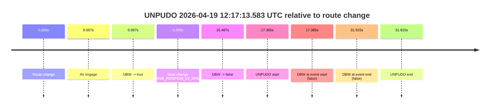
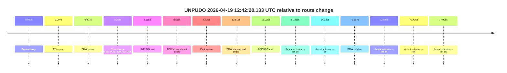
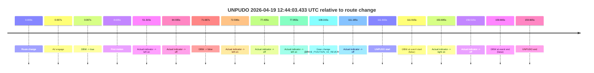
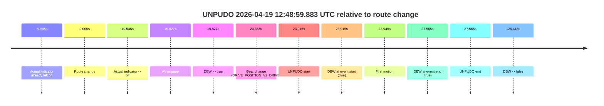
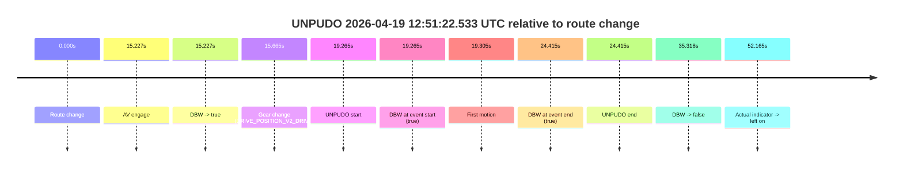
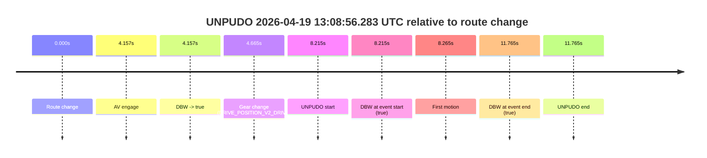

# Run Report: fme20031/2026-04-19--12-01-01--gen2-av-742dabc2-8b22-4165-8577-5e432f1829a5

| Field | Value |
|---|---|
| Run ID | `fme20031/2026-04-19--12-01-01--gen2-av-742dabc2-8b22-4165-8577-5e432f1829a5` |
| Date | `2026-04-19` |
| Model(s) | `eel-teal-outspoken` |
| Author | `zak` |
| Event count | `8` |

## unpudo 2026-04-19 12:17:13.583 UTC

| Field | Value |
|---|---|
| Model | `eel-teal-outspoken` |
| Author | `zak` |
| Run ID | `fme20031/2026-04-19--12-01-01--gen2-av-742dabc2-8b22-4165-8577-5e432f1829a5` |
| Date | `2026-04-19` |
| Time (UTC) | `12:17:13.583` |
| Event type | `unpudo` |
| Disengagement type | `none observed` |
| Route change | `found` |
| Console | [run](https://console.sso.wayve.ai/run/fme20031/2026-04-19--12-01-01--gen2-av-742dabc2-8b22-4165-8577-5e432f1829a5?id=&time-unixus=1776601033583300) |
| Foxglove | [segment](https://app.foxglove.dev/wayve-on-prem/p/prj_0dX18KZdVHg1fmmI/view?ds=foxglove-stream&ds.deviceName=fme20031&ds.start=2026-04-19T12%3A16%3A46.218290Z&ds.end=2026-04-19T12%3A17%3A38.133296Z&layoutId=lay_0e7VD4WIKDQGU73Y&time=2026-04-19T12%3A17%3A13.583300Z) |

### Event card: fail

- Fail: the credited unpudo does not stay AV-owned. The event window starts with DBW false, and the maneuver outcome lands outside a clean AV-owned segment.

| Event | Time (UTC) | Delta from route change |
|---|---:|---:|
| Route change | 2026-04-19 12:16:56.218 | `0.000s` |
| AV engage | 2026-04-19 12:16:56.225 | `0.007s` |
| DBW -> true | 2026-04-19 12:16:56.225 | `0.007s` |
| Gear change (DRIVE_POSITION_V2_DRIVE) | 2026-04-19 12:16:56.483 | `0.265s` |
| DBW -> false | 2026-04-19 12:17:11.705 | `15.487s` |
| UNPUDO start | 2026-04-19 12:17:13.583 | `17.365s` |
| DBW at event start (false) | 2026-04-19 12:17:13.583 | `17.365s` |
| DBW at event end (false) | 2026-04-19 12:17:28.133 | `31.915s` |
| UNPUDO end | 2026-04-19 12:17:28.133 | `31.915s` |

| Metric | Value |
|---|---|
| Outcome | `fail` |
| Effective failure type | `not_av_owned` |
| Route change status | `found` |
| DBW at event start | `false` |
| DBW at event end | `false` |
| Predicted gear at AV start | `DRIVE_POSITION_V2_PARK` |
| Actual gear at AV start | `DRIVE_POSITION_V2_PARK` |
| Predicted gear at event start | `DRIVE_POSITION_V2_DRIVE` |
| Actual gear at event start | `DRIVE_POSITION_V2_DRIVE` |
| Planned indicator direction | `INDICATORS_STATE_V2_RIGHT_ON` |
| Controller indicator direction | `INDICATORS_STATE_V2_RIGHT_ON` |
| Actual indicator direction | `INDICATORS_STATE_V2_OFF` |
| Actual indicator at maneuver end | `INDICATORS_STATE_V2_OFF` |
| Driver accel help in AV | `false` |
| Driver accel help timestamp | `n/a` |
| Max accel pedal pct in AV | `0.0%` |
| Max brake pedal pct in AV | `8.0%` |
| Max speed mps in AV | `0.000` |
| Success timing baseline | `route change` |
| Route -> AV | `0.007s` |
| AV -> event start | `17.358s` |
| AV -> first motion | `n/a` |
| Success baseline -> event start | `17.365s` |
| Success baseline -> first motion | `n/a` |
| AV duration before disengagement | `15.480s` |
| Trajectory waypoint count | `36` |
| Driving-plan step count | `11` |

The scored portion starts from the AV-owned window, not from the pre-AV setup. Route-change search in the stopped pre-event segment was `found`, with the baseline therefore set to route change. At the event anchor the model predicts `DRIVE_POSITION_V2_DRIVE` and the actual gear is `DRIVE_POSITION_V2_DRIVE`. The effective model outcome is `fail` because `not_av_owned.`

### Resolution

| Field | Value |
|---|---|
| Final outcome | `fail` |
| Do we agree with this label? | `yes` |
| Source disengagement type | `none observed` |
| Resolved effective failure type | `not_av_owned` |
| Confidence | `high` |

## unpudo 2026-04-19 12:42:20.133 UTC

| Field | Value |
|---|---|
| Model | `eel-teal-outspoken` |
| Author | `zak` |
| Run ID | `fme20031/2026-04-19--12-01-01--gen2-av-742dabc2-8b22-4165-8577-5e432f1829a5` |
| Date | `2026-04-19` |
| Time (UTC) | `12:42:20.133` |
| Event type | `unpudo` |
| Disengagement type | `none observed` |
| Route change | `found` |
| Console | [run](https://console.sso.wayve.ai/run/fme20031/2026-04-19--12-01-01--gen2-av-742dabc2-8b22-4165-8577-5e432f1829a5?id=&time-unixus=1776602540133303) |
| Foxglove | [segment](https://app.foxglove.dev/wayve-on-prem/p/prj_0dX18KZdVHg1fmmI/view?ds=foxglove-stream&ds.deviceName=fme20031&ds.start=2026-04-19T12%3A42%3A01.518221Z&ds.end=2026-04-19T12%3A43%3A33.204899Z&layoutId=lay_0e7VD4WIKDQGU73Y&time=2026-04-19T12%3A42%3A20.133303Z) |

### Event card: pass

- Pass: AV owns the credited unpudo from route change through the official unpudo window, the gear state is aligned at the anchor, and the vehicle moves without driver accelerator help in AV.

| Event | Time (UTC) | Delta from route change |
|---|---:|---:|
| Route change | 2026-04-19 12:42:11.518 | `0.000s` |
| AV engage | 2026-04-19 12:42:11.525 | `0.007s` |
| DBW -> true | 2026-04-19 12:42:11.525 | `0.007s` |
| Gear change (DRIVE_POSITION_V2_DRIVE) | 2026-04-19 12:42:11.783 | `0.265s` |
| UNPUDO start | 2026-04-19 12:42:20.133 | `8.615s` |
| DBW at event start (true) | 2026-04-19 12:42:20.133 | `8.615s` |
| First motion | 2026-04-19 12:42:20.153 | `8.635s` |
| DBW at event end (true) | 2026-04-19 12:42:24.533 | `13.015s` |
| UNPUDO end | 2026-04-19 12:42:24.533 | `13.015s` |
| Actual indicator -> left on | 2026-04-19 12:43:02.833 | `51.315s` |
| Actual indicator -> off | 2026-04-19 12:43:16.453 | `64.935s` |
| DBW -> false | 2026-04-19 12:43:23.204 | `71.687s` |
| Actual indicator -> left on | 2026-04-19 12:43:24.114 | `72.596s` |
| Actual indicator -> off | 2026-04-19 12:43:28.953 | `77.435s` |
| Actual indicator -> left on | 2026-04-19 12:43:29.473 | `77.955s` |

| Metric | Value |
|---|---|
| Outcome | `pass` |
| Effective failure type | `none` |
| Route change status | `found` |
| DBW at event start | `true` |
| DBW at event end | `true` |
| Predicted gear at AV start | `DRIVE_POSITION_V2_PARK` |
| Actual gear at AV start | `DRIVE_POSITION_V2_PARK` |
| Predicted gear at event start | `DRIVE_POSITION_V2_DRIVE` |
| Actual gear at event start | `DRIVE_POSITION_V2_DRIVE` |
| Planned indicator direction | `INDICATORS_STATE_V2_RIGHT_ON` |
| Controller indicator direction | `INDICATORS_STATE_V2_RIGHT_ON` |
| Actual indicator direction | `INDICATORS_STATE_V2_OFF` |
| Actual indicator at maneuver end | `INDICATORS_STATE_V2_OFF` |
| Driver accel help in AV | `false` |
| Driver accel help timestamp | `n/a` |
| Max accel pedal pct in AV | `0.0%` |
| Max brake pedal pct in AV | `8.0%` |
| Max speed mps in AV | `4.678` |
| Success timing baseline | `route change` |
| Route -> AV | `0.007s` |
| AV -> event start | `8.608s` |
| AV -> first motion | `8.628s` |
| Success baseline -> event start | `8.615s` |
| Success baseline -> first motion | `8.635s` |
| AV duration before disengagement | `71.680s` |
| Trajectory waypoint count | `37` |
| Driving-plan step count | `11` |

The scored portion starts from the AV-owned window, not from the pre-AV setup. Route-change search in the stopped pre-event segment was `found`, with the baseline therefore set to route change. At the event anchor the model predicts `DRIVE_POSITION_V2_DRIVE` and the actual gear is `DRIVE_POSITION_V2_DRIVE`. The effective model outcome is `pass` because `the credited unpudo stays AV-owned through the official unpudo window.`

### Resolution

| Field | Value |
|---|---|
| Final outcome | `pass` |
| Do we agree with this label? | `yes` |
| Source disengagement type | `none observed` |
| Resolved effective failure type | `none` |
| Confidence | `high` |

## unpudo 2026-04-19 12:44:03.433 UTC

| Field | Value |
|---|---|
| Model | `eel-teal-outspoken` |
| Author | `zak` |
| Run ID | `fme20031/2026-04-19--12-01-01--gen2-av-742dabc2-8b22-4165-8577-5e432f1829a5` |
| Date | `2026-04-19` |
| Time (UTC) | `12:44:03.433` |
| Event type | `unpudo` |
| Disengagement type | `failed_to_slow` |
| Route change | `found` |
| Console | [run](https://console.sso.wayve.ai/run/fme20031/2026-04-19--12-01-01--gen2-av-742dabc2-8b22-4165-8577-5e432f1829a5?id=&time-unixus=1776602643433319) |
| Foxglove | [segment](https://app.foxglove.dev/wayve-on-prem/p/prj_0dX18KZdVHg1fmmI/view?ds=foxglove-stream&ds.deviceName=fme20031&ds.start=2026-04-19T12%3A42%3A01.518221Z&ds.end=2026-04-19T12%3A45%3A01.183312Z&layoutId=lay_0e7VD4WIKDQGU73Y&time=2026-04-19T12%3A44%3A03.433319Z) |

### Event card: fail

- Fail: AV owns part of the segment, but the event still resolves as a model-performance failure under the AV-only scoring rule.

| Event | Time (UTC) | Delta from route change |
|---|---:|---:|
| Route change | 2026-04-19 12:42:11.518 | `0.000s` |
| AV engage | 2026-04-19 12:42:11.525 | `0.007s` |
| DBW -> true | 2026-04-19 12:42:11.525 | `0.007s` |
| First motion | 2026-04-19 12:42:20.153 | `8.635s` |
| Actual indicator -> left on | 2026-04-19 12:43:02.833 | `51.315s` |
| Actual indicator -> off | 2026-04-19 12:43:16.453 | `64.935s` |
| DBW -> false | 2026-04-19 12:43:23.204 | `71.687s` |
| Actual indicator -> left on | 2026-04-19 12:43:24.114 | `72.596s` |
| Actual indicator -> off | 2026-04-19 12:43:28.953 | `77.435s` |
| Actual indicator -> left on | 2026-04-19 12:43:29.473 | `77.955s` |
| Gear change (DRIVE_POSITION_V2_REVERSE) | 2026-04-19 12:43:59.833 | `108.315s` |
| Actual indicator -> off | 2026-04-19 12:44:02.713 | `111.195s` |
| UNPUDO start | 2026-04-19 12:44:03.433 | `111.915s` |
| DBW at event start (false) | 2026-04-19 12:44:03.433 | `111.915s` |
| Actual indicator -> right on | 2026-04-19 12:44:45.213 | `153.695s` |
| Actual indicator -> off | 2026-04-19 12:44:48.033 | `156.515s` |
| DBW at event end (false) | 2026-04-19 12:44:51.183 | `159.665s` |
| UNPUDO end | 2026-04-19 12:44:51.183 | `159.665s` |

| Metric | Value |
|---|---|
| Outcome | `fail` |
| Effective failure type | `failed_to_slow` |
| Route change status | `found` |
| DBW at event start | `false` |
| DBW at event end | `false` |
| Predicted gear at AV start | `DRIVE_POSITION_V2_PARK` |
| Actual gear at AV start | `DRIVE_POSITION_V2_PARK` |
| Predicted gear at event start | `DRIVE_POSITION_V2_REVERSE` |
| Actual gear at event start | `DRIVE_POSITION_V2_REVERSE` |
| Planned indicator direction | `INDICATORS_STATE_V2_OFF` |
| Controller indicator direction | `INDICATORS_STATE_V2_OFF` |
| Actual indicator direction | `INDICATORS_STATE_V2_OFF` |
| Actual indicator at maneuver end | `INDICATORS_STATE_V2_OFF` |
| Driver accel help in AV | `false` |
| Driver accel help timestamp | `n/a` |
| Max accel pedal pct in AV | `0.0%` |
| Max brake pedal pct in AV | `8.0%` |
| Max speed mps in AV | `7.789` |
| Success timing baseline | `route change` |
| Route -> AV | `0.007s` |
| AV -> event start | `111.908s` |
| AV -> first motion | `8.628s` |
| Success baseline -> event start | `111.915s` |
| Success baseline -> first motion | `8.635s` |
| AV duration before disengagement | `71.680s` |
| Trajectory waypoint count | `37` |
| Driving-plan step count | `11` |

The scored portion starts from the AV-owned window, not from the pre-AV setup. Route-change search in the stopped pre-event segment was `found`, with the baseline therefore set to route change. At the event anchor the model predicts `DRIVE_POSITION_V2_REVERSE` and the actual gear is `DRIVE_POSITION_V2_REVERSE`. The effective model outcome is `fail` because `failed_to_slow.`

### Resolution

| Field | Value |
|---|---|
| Final outcome | `fail` |
| Do we agree with this label? | `yes` |
| Source disengagement type | `failed_to_slow` |
| Resolved effective failure type | `failed_to_slow` |
| Confidence | `high` |

## unpudo 2026-04-19 12:46:57.283 UTC

| Field | Value |
|---|---|
| Model | `eel-teal-outspoken` |
| Author | `zak` |
| Run ID | `fme20031/2026-04-19--12-01-01--gen2-av-742dabc2-8b22-4165-8577-5e432f1829a5` |
| Date | `2026-04-19` |
| Time (UTC) | `12:46:57.283` |
| Event type | `unpudo` |
| Disengagement type | `none observed` |
| Route change | `found` |
| Console | [run](https://console.sso.wayve.ai/run/fme20031/2026-04-19--12-01-01--gen2-av-742dabc2-8b22-4165-8577-5e432f1829a5?id=&time-unixus=1776602817283305) |
| Foxglove | [segment](https://app.foxglove.dev/wayve-on-prem/p/prj_0dX18KZdVHg1fmmI/view?ds=foxglove-stream&ds.deviceName=fme20031&ds.start=2026-04-19T12%3A46%3A43.418307Z&ds.end=2026-04-19T12%3A47%3A27.964995Z&layoutId=lay_0e7VD4WIKDQGU73Y&time=2026-04-19T12%3A46%3A57.283305Z) |

### Event card: pass

- Pass: AV owns the credited unpudo from route change through the official unpudo window, the gear state is aligned at the anchor, and the vehicle moves without driver accelerator help in AV.

| Event | Time (UTC) | Delta from route change |
|---|---:|---:|
| Route change | 2026-04-19 12:46:53.418 | `0.000s` |
| AV engage | 2026-04-19 12:46:53.425 | `0.007s` |
| DBW -> true | 2026-04-19 12:46:53.425 | `0.007s` |
| Gear change (DRIVE_POSITION_V2_DRIVE) | 2026-04-19 12:46:53.733 | `0.315s` |
| UNPUDO start | 2026-04-19 12:46:57.283 | `3.865s` |
| DBW at event start (true) | 2026-04-19 12:46:57.283 | `3.865s` |
| First motion | 2026-04-19 12:46:57.313 | `3.895s` |
| DBW at event end (true) | 2026-04-19 12:47:00.683 | `7.265s` |
| UNPUDO end | 2026-04-19 12:47:00.683 | `7.265s` |
| DBW -> false | 2026-04-19 12:47:17.964 | `24.547s` |
| Actual indicator -> left on | 2026-04-19 12:47:22.973 | `29.555s` |

| Metric | Value |
|---|---|
| Outcome | `pass` |
| Effective failure type | `none` |
| Route change status | `found` |
| DBW at event start | `true` |
| DBW at event end | `true` |
| Predicted gear at AV start | `DRIVE_POSITION_V2_PARK` |
| Actual gear at AV start | `DRIVE_POSITION_V2_PARK` |
| Predicted gear at event start | `DRIVE_POSITION_V2_DRIVE` |
| Actual gear at event start | `DRIVE_POSITION_V2_DRIVE` |
| Planned indicator direction | `INDICATORS_STATE_V2_RIGHT_ON` |
| Controller indicator direction | `INDICATORS_STATE_V2_RIGHT_ON` |
| Actual indicator direction | `INDICATORS_STATE_V2_OFF` |
| Actual indicator at maneuver end | `INDICATORS_STATE_V2_OFF` |
| Driver accel help in AV | `false` |
| Driver accel help timestamp | `n/a` |
| Max accel pedal pct in AV | `0.0%` |
| Max brake pedal pct in AV | `8.5%` |
| Max speed mps in AV | `4.961` |
| Success timing baseline | `route change` |
| Route -> AV | `0.007s` |
| AV -> event start | `3.858s` |
| AV -> first motion | `3.888s` |
| Success baseline -> event start | `3.865s` |
| Success baseline -> first motion | `3.895s` |
| AV duration before disengagement | `24.540s` |
| Trajectory waypoint count | `36` |
| Driving-plan step count | `11` |

The scored portion starts from the AV-owned window, not from the pre-AV setup. Route-change search in the stopped pre-event segment was `found`, with the baseline therefore set to route change. At the event anchor the model predicts `DRIVE_POSITION_V2_DRIVE` and the actual gear is `DRIVE_POSITION_V2_DRIVE`. The effective model outcome is `pass` because `the credited unpudo stays AV-owned through the official unpudo window.`

### Resolution

| Field | Value |
|---|---|
| Final outcome | `pass` |
| Do we agree with this label? | `yes` |
| Source disengagement type | `none observed` |
| Resolved effective failure type | `none` |
| Confidence | `high` |

## unpudo 2026-04-19 12:48:59.883 UTC

| Field | Value |
|---|---|
| Model | `eel-teal-outspoken` |
| Author | `zak` |
| Run ID | `fme20031/2026-04-19--12-01-01--gen2-av-742dabc2-8b22-4165-8577-5e432f1829a5` |
| Date | `2026-04-19` |
| Time (UTC) | `12:48:59.883` |
| Event type | `unpudo` |
| Disengagement type | `none observed` |
| Route change | `found` |
| Console | [run](https://console.sso.wayve.ai/run/fme20031/2026-04-19--12-01-01--gen2-av-742dabc2-8b22-4165-8577-5e432f1829a5?id=&time-unixus=1776602939883316) |
| Foxglove | [segment](https://app.foxglove.dev/wayve-on-prem/p/prj_0dX18KZdVHg1fmmI/view?ds=foxglove-stream&ds.deviceName=fme20031&ds.start=2026-04-19T12%3A48%3A25.968263Z&ds.end=2026-04-19T12%3A50%3A52.385816Z&layoutId=lay_0e7VD4WIKDQGU73Y&time=2026-04-19T12%3A48%3A59.883316Z) |

### Event card: pass

- Pass: AV owns the credited unpudo from route change through the official unpudo window, the gear state is aligned at the anchor, and the vehicle moves without driver accelerator help in AV.

| Event | Time (UTC) | Delta from route change |
|---|---:|---:|
| Actual indicator already left on | 2026-04-19 12:48:25.973 | `-9.995s` |
| Route change | 2026-04-19 12:48:35.968 | `0.000s` |
| Actual indicator -> off | 2026-04-19 12:48:46.513 | `10.546s` |
| AV engage | 2026-04-19 12:48:55.795 | `19.827s` |
| DBW -> true | 2026-04-19 12:48:55.795 | `19.827s` |
| Gear change (DRIVE_POSITION_V2_DRIVE) | 2026-04-19 12:48:56.333 | `20.365s` |
| UNPUDO start | 2026-04-19 12:48:59.883 | `23.915s` |
| DBW at event start (true) | 2026-04-19 12:48:59.883 | `23.915s` |
| First motion | 2026-04-19 12:48:59.914 | `23.946s` |
| DBW at event end (true) | 2026-04-19 12:49:03.533 | `27.565s` |
| UNPUDO end | 2026-04-19 12:49:03.533 | `27.565s` |
| DBW -> false | 2026-04-19 12:50:42.385 | `126.418s` |

| Metric | Value |
|---|---|
| Outcome | `pass` |
| Effective failure type | `none` |
| Route change status | `found` |
| DBW at event start | `true` |
| DBW at event end | `true` |
| Predicted gear at AV start | `DRIVE_POSITION_V2_DRIVE` |
| Actual gear at AV start | `DRIVE_POSITION_V2_PARK` |
| Predicted gear at event start | `DRIVE_POSITION_V2_DRIVE` |
| Actual gear at event start | `DRIVE_POSITION_V2_DRIVE` |
| Planned indicator direction | `INDICATORS_STATE_V2_RIGHT_ON` |
| Controller indicator direction | `INDICATORS_STATE_V2_RIGHT_ON` |
| Actual indicator direction | `INDICATORS_STATE_V2_OFF` |
| Actual indicator at maneuver end | `INDICATORS_STATE_V2_OFF` |
| Driver accel help in AV | `false` |
| Driver accel help timestamp | `n/a` |
| Max accel pedal pct in AV | `0.0%` |
| Max brake pedal pct in AV | `8.0%` |
| Max speed mps in AV | `4.489` |
| Success timing baseline | `route change` |
| Route -> AV | `19.827s` |
| AV -> event start | `4.088s` |
| AV -> first motion | `4.119s` |
| Success baseline -> event start | `23.915s` |
| Success baseline -> first motion | `23.946s` |
| AV duration before disengagement | `106.591s` |
| Trajectory waypoint count | `36` |
| Driving-plan step count | `11` |

The scored portion starts from the AV-owned window, not from the pre-AV setup. Route-change search in the stopped pre-event segment was `found`, with the baseline therefore set to route change. At the event anchor the model predicts `DRIVE_POSITION_V2_DRIVE` and the actual gear is `DRIVE_POSITION_V2_DRIVE`. The effective model outcome is `pass` because `the credited unpudo stays AV-owned through the official unpudo window.`

### Resolution

| Field | Value |
|---|---|
| Final outcome | `pass` |
| Do we agree with this label? | `yes` |
| Source disengagement type | `none observed` |
| Resolved effective failure type | `none` |
| Confidence | `high` |

## unpudo 2026-04-19 12:51:22.533 UTC

| Field | Value |
|---|---|
| Model | `eel-teal-outspoken` |
| Author | `zak` |
| Run ID | `fme20031/2026-04-19--12-01-01--gen2-av-742dabc2-8b22-4165-8577-5e432f1829a5` |
| Date | `2026-04-19` |
| Time (UTC) | `12:51:22.533` |
| Event type | `unpudo` |
| Disengagement type | `none observed` |
| Route change | `found` |
| Console | [run](https://console.sso.wayve.ai/run/fme20031/2026-04-19--12-01-01--gen2-av-742dabc2-8b22-4165-8577-5e432f1829a5?id=&time-unixus=1776603082533323) |
| Foxglove | [segment](https://app.foxglove.dev/wayve-on-prem/p/prj_0dX18KZdVHg1fmmI/view?ds=foxglove-stream&ds.deviceName=fme20031&ds.start=2026-04-19T12%3A50%3A53.268279Z&ds.end=2026-04-19T12%3A51%3A48.585815Z&layoutId=lay_0e7VD4WIKDQGU73Y&time=2026-04-19T12%3A51%3A22.533323Z) |

### Event card: pass

- Pass: AV owns the credited unpudo from route change through the official unpudo window, the gear state is aligned at the anchor, and the vehicle moves without driver accelerator help in AV.

| Event | Time (UTC) | Delta from route change |
|---|---:|---:|
| Route change | 2026-04-19 12:51:03.268 | `0.000s` |
| AV engage | 2026-04-19 12:51:18.495 | `15.227s` |
| DBW -> true | 2026-04-19 12:51:18.495 | `15.227s` |
| Gear change (DRIVE_POSITION_V2_DRIVE) | 2026-04-19 12:51:18.933 | `15.665s` |
| UNPUDO start | 2026-04-19 12:51:22.533 | `19.265s` |
| DBW at event start (true) | 2026-04-19 12:51:22.533 | `19.265s` |
| First motion | 2026-04-19 12:51:22.573 | `19.305s` |
| DBW at event end (true) | 2026-04-19 12:51:27.683 | `24.415s` |
| UNPUDO end | 2026-04-19 12:51:27.683 | `24.415s` |
| DBW -> false | 2026-04-19 12:51:38.585 | `35.318s` |
| Actual indicator -> left on | 2026-04-19 12:51:55.433 | `52.165s` |

| Metric | Value |
|---|---|
| Outcome | `pass` |
| Effective failure type | `none` |
| Route change status | `found` |
| DBW at event start | `true` |
| DBW at event end | `true` |
| Predicted gear at AV start | `DRIVE_POSITION_V2_DRIVE` |
| Actual gear at AV start | `DRIVE_POSITION_V2_PARK` |
| Predicted gear at event start | `DRIVE_POSITION_V2_DRIVE` |
| Actual gear at event start | `DRIVE_POSITION_V2_DRIVE` |
| Planned indicator direction | `INDICATORS_STATE_V2_LEFT_ON` |
| Controller indicator direction | `INDICATORS_STATE_V2_LEFT_ON` |
| Actual indicator direction | `INDICATORS_STATE_V2_OFF` |
| Actual indicator at maneuver end | `INDICATORS_STATE_V2_OFF` |
| Driver accel help in AV | `false` |
| Driver accel help timestamp | `n/a` |
| Max accel pedal pct in AV | `0.0%` |
| Max brake pedal pct in AV | `8.0%` |
| Max speed mps in AV | `3.728` |
| Success timing baseline | `route change` |
| Route -> AV | `15.227s` |
| AV -> event start | `4.038s` |
| AV -> first motion | `4.078s` |
| Success baseline -> event start | `19.265s` |
| Success baseline -> first motion | `19.305s` |
| AV duration before disengagement | `20.091s` |
| Trajectory waypoint count | `37` |
| Driving-plan step count | `11` |

The scored portion starts from the AV-owned window, not from the pre-AV setup. Route-change search in the stopped pre-event segment was `found`, with the baseline therefore set to route change. At the event anchor the model predicts `DRIVE_POSITION_V2_DRIVE` and the actual gear is `DRIVE_POSITION_V2_DRIVE`. The effective model outcome is `pass` because `the credited unpudo stays AV-owned through the official unpudo window.`

### Resolution

| Field | Value |
|---|---|
| Final outcome | `pass` |
| Do we agree with this label? | `yes` |
| Source disengagement type | `none observed` |
| Resolved effective failure type | `none` |
| Confidence | `high` |

## unpudo 2026-04-19 12:54:48.183 UTC

| Field | Value |
|---|---|
| Model | `eel-teal-outspoken` |
| Author | `zak` |
| Run ID | `fme20031/2026-04-19--12-01-01--gen2-av-742dabc2-8b22-4165-8577-5e432f1829a5` |
| Date | `2026-04-19` |
| Time (UTC) | `12:54:48.183` |
| Event type | `unpudo` |
| Disengagement type | `none observed` |
| Route change | `found` |
| Console | [run](https://console.sso.wayve.ai/run/fme20031/2026-04-19--12-01-01--gen2-av-742dabc2-8b22-4165-8577-5e432f1829a5?id=&time-unixus=1776603288183297) |
| Foxglove | [segment](https://app.foxglove.dev/wayve-on-prem/p/prj_0dX18KZdVHg1fmmI/view?ds=foxglove-stream&ds.deviceName=fme20031&ds.start=2026-04-19T12%3A54%3A34.368268Z&ds.end=2026-04-19T12%3A57%3A03.665133Z&layoutId=lay_0e7VD4WIKDQGU73Y&time=2026-04-19T12%3A54%3A48.183297Z) |

### Event card: pass

- Pass: AV owns the credited unpudo from route change through the official unpudo window, the gear state is aligned at the anchor, and the vehicle moves without driver accelerator help in AV.

| Event | Time (UTC) | Delta from route change |
|---|---:|---:|
| Route change | 2026-04-19 12:54:44.368 | `0.000s` |
| AV engage | 2026-04-19 12:54:44.375 | `0.007s` |
| DBW -> true | 2026-04-19 12:54:44.375 | `0.007s` |
| Gear change (DRIVE_POSITION_V2_DRIVE) | 2026-04-19 12:54:44.633 | `0.265s` |
| UNPUDO start | 2026-04-19 12:54:48.183 | `3.815s` |
| DBW at event start (true) | 2026-04-19 12:54:48.183 | `3.815s` |
| First motion | 2026-04-19 12:54:48.213 | `3.845s` |
| DBW at event end (true) | 2026-04-19 12:54:51.583 | `7.215s` |
| UNPUDO end | 2026-04-19 12:54:51.583 | `7.215s` |
| DBW -> false | 2026-04-19 12:56:53.665 | `129.297s` |
| Actual indicator -> left on | 2026-04-19 12:57:09.293 | `144.925s` |

| Metric | Value |
|---|---|
| Outcome | `pass` |
| Effective failure type | `none` |
| Route change status | `found` |
| DBW at event start | `true` |
| DBW at event end | `true` |
| Predicted gear at AV start | `DRIVE_POSITION_V2_PARK` |
| Actual gear at AV start | `DRIVE_POSITION_V2_PARK` |
| Predicted gear at event start | `DRIVE_POSITION_V2_DRIVE` |
| Actual gear at event start | `DRIVE_POSITION_V2_DRIVE` |
| Planned indicator direction | `INDICATORS_STATE_V2_OFF` |
| Controller indicator direction | `INDICATORS_STATE_V2_RIGHT_ON` |
| Actual indicator direction | `INDICATORS_STATE_V2_OFF` |
| Actual indicator at maneuver end | `INDICATORS_STATE_V2_OFF` |
| Driver accel help in AV | `false` |
| Driver accel help timestamp | `n/a` |
| Max accel pedal pct in AV | `0.0%` |
| Max brake pedal pct in AV | `8.6%` |
| Max speed mps in AV | `4.931` |
| Success timing baseline | `route change` |
| Route -> AV | `0.007s` |
| AV -> event start | `3.808s` |
| AV -> first motion | `3.839s` |
| Success baseline -> event start | `3.815s` |
| Success baseline -> first motion | `3.845s` |
| AV duration before disengagement | `129.290s` |
| Trajectory waypoint count | `36` |
| Driving-plan step count | `11` |

The scored portion starts from the AV-owned window, not from the pre-AV setup. Route-change search in the stopped pre-event segment was `found`, with the baseline therefore set to route change. At the event anchor the model predicts `DRIVE_POSITION_V2_DRIVE` and the actual gear is `DRIVE_POSITION_V2_DRIVE`. The effective model outcome is `pass` because `the credited unpudo stays AV-owned through the official unpudo window.`

### Resolution

| Field | Value |
|---|---|
| Final outcome | `pass` |
| Do we agree with this label? | `yes` |
| Source disengagement type | `none observed` |
| Resolved effective failure type | `none` |
| Confidence | `high` |

## unpudo 2026-04-19 13:08:56.283 UTC

| Field | Value |
|---|---|
| Model | `eel-teal-outspoken` |
| Author | `zak` |
| Run ID | `fme20031/2026-04-19--12-01-01--gen2-av-742dabc2-8b22-4165-8577-5e432f1829a5` |
| Date | `2026-04-19` |
| Time (UTC) | `13:08:56.283` |
| Event type | `unpudo` |
| Disengagement type | `none observed` |
| Route change | `found` |
| Console | [run](https://console.sso.wayve.ai/run/fme20031/2026-04-19--12-01-01--gen2-av-742dabc2-8b22-4165-8577-5e432f1829a5?id=&time-unixus=1776604136283294) |
| Foxglove | [segment](https://app.foxglove.dev/wayve-on-prem/p/prj_0dX18KZdVHg1fmmI/view?ds=foxglove-stream&ds.deviceName=fme20031&ds.start=2026-04-19T13%3A08%3A38.068258Z&ds.end=2026-04-19T13%3A09%3A09.833312Z&layoutId=lay_0e7VD4WIKDQGU73Y&time=2026-04-19T13%3A08%3A56.283294Z) |

### Event card: pass

- Pass: AV owns the credited unpudo from route change through the official unpudo window, the gear state is aligned at the anchor, and the vehicle moves without driver accelerator help in AV.

| Event | Time (UTC) | Delta from route change |
|---|---:|---:|
| Route change | 2026-04-19 13:08:48.068 | `0.000s` |
| AV engage | 2026-04-19 13:08:52.225 | `4.157s` |
| DBW -> true | 2026-04-19 13:08:52.225 | `4.157s` |
| Gear change (DRIVE_POSITION_V2_DRIVE) | 2026-04-19 13:08:52.733 | `4.665s` |
| UNPUDO start | 2026-04-19 13:08:56.283 | `8.215s` |
| DBW at event start (true) | 2026-04-19 13:08:56.283 | `8.215s` |
| First motion | 2026-04-19 13:08:56.333 | `8.265s` |
| DBW at event end (true) | 2026-04-19 13:08:59.833 | `11.765s` |
| UNPUDO end | 2026-04-19 13:08:59.833 | `11.765s` |

| Metric | Value |
|---|---|
| Outcome | `pass` |
| Effective failure type | `none` |
| Route change status | `found` |
| DBW at event start | `true` |
| DBW at event end | `true` |
| Predicted gear at AV start | `DRIVE_POSITION_V2_DRIVE` |
| Actual gear at AV start | `DRIVE_POSITION_V2_PARK` |
| Predicted gear at event start | `DRIVE_POSITION_V2_DRIVE` |
| Actual gear at event start | `DRIVE_POSITION_V2_DRIVE` |
| Planned indicator direction | `INDICATORS_STATE_V2_RIGHT_ON` |
| Controller indicator direction | `INDICATORS_STATE_V2_RIGHT_ON` |
| Actual indicator direction | `INDICATORS_STATE_V2_OFF` |
| Actual indicator at maneuver end | `INDICATORS_STATE_V2_OFF` |
| Driver accel help in AV | `false` |
| Driver accel help timestamp | `n/a` |
| Max accel pedal pct in AV | `0.0%` |
| Max brake pedal pct in AV | `9.4%` |
| Max speed mps in AV | `4.981` |
| Success timing baseline | `route change` |
| Route -> AV | `4.157s` |
| AV -> event start | `4.058s` |
| AV -> first motion | `4.108s` |
| Success baseline -> event start | `8.215s` |
| Success baseline -> first motion | `8.265s` |
| AV duration before disengagement | `n/a` |
| Trajectory waypoint count | `36` |
| Driving-plan step count | `11` |

The scored portion starts from the AV-owned window, not from the pre-AV setup. Route-change search in the stopped pre-event segment was `found`, with the baseline therefore set to route change. At the event anchor the model predicts `DRIVE_POSITION_V2_DRIVE` and the actual gear is `DRIVE_POSITION_V2_DRIVE`. The effective model outcome is `pass` because `the credited unpudo stays AV-owned through the official unpudo window.`

### Resolution

| Field | Value |
|---|---|
| Final outcome | `pass` |
| Do we agree with this label? | `yes` |
| Source disengagement type | `none observed` |
| Resolved effective failure type | `none` |
| Confidence | `high` |
