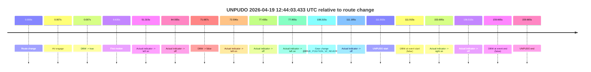

# Run Report: fme20031/2026-04-19--12-01-01--gen2-av-742dabc2-8b22-4165-8577-5e432f1829a5

| Field | Value |
|---|---|
| Run ID | `fme20031/2026-04-19--12-01-01--gen2-av-742dabc2-8b22-4165-8577-5e432f1829a5` |
| Date | `2026-04-19` |
| Model(s) | `eel-teal-outspoken` |
| Author | `zak` |
| Event count | `1` |

## unpudo 2026-04-19 12:44:03.433 UTC

| Field | Value |
|---|---|
| Model | `eel-teal-outspoken` |
| Author | `zak` |
| Run ID | `fme20031/2026-04-19--12-01-01--gen2-av-742dabc2-8b22-4165-8577-5e432f1829a5` |
| Date | `2026-04-19` |
| Time (UTC) | `12:44:03.433` |
| Event type | `unpudo` |
| Disengagement type | `failed_to_slow` |
| Route change | `found` |
| Console | [run](https://console.sso.wayve.ai/run/fme20031/2026-04-19--12-01-01--gen2-av-742dabc2-8b22-4165-8577-5e432f1829a5?id=&time-unixus=1776602643433319) |
| Foxglove | [segment](https://app.foxglove.dev/wayve-on-prem/p/prj_0dX18KZdVHg1fmmI/view?ds=foxglove-stream&ds.deviceName=fme20031&ds.start=2026-04-19T12%3A42%3A01.518221Z&ds.end=2026-04-19T12%3A45%3A01.183312Z&layoutId=lay_0e7VD4WIKDQGU73Y&time=2026-04-19T12%3A44%3A03.433319Z) |

### Event card: fail

- Fail: AV owns part of the segment, but the event still resolves as a model-performance failure under the AV-only scoring rule.

| Event | Time (UTC) | Delta from route change |
|---|---:|---:|
| Route change | 2026-04-19 12:42:11.518 | `0.000s` |
| AV engage | 2026-04-19 12:42:11.525 | `0.007s` |
| DBW -> true | 2026-04-19 12:42:11.525 | `0.007s` |
| First motion | 2026-04-19 12:42:20.153 | `8.635s` |
| Actual indicator -> left on | 2026-04-19 12:43:02.833 | `51.315s` |
| Actual indicator -> off | 2026-04-19 12:43:16.453 | `64.935s` |
| DBW -> false | 2026-04-19 12:43:23.204 | `71.687s` |
| Actual indicator -> left on | 2026-04-19 12:43:24.114 | `72.596s` |
| Actual indicator -> off | 2026-04-19 12:43:28.953 | `77.435s` |
| Actual indicator -> left on | 2026-04-19 12:43:29.473 | `77.955s` |
| Gear change (DRIVE_POSITION_V2_REVERSE) | 2026-04-19 12:43:59.833 | `108.315s` |
| Actual indicator -> off | 2026-04-19 12:44:02.713 | `111.195s` |
| UNPUDO start | 2026-04-19 12:44:03.433 | `111.915s` |
| DBW at event start (false) | 2026-04-19 12:44:03.433 | `111.915s` |
| Actual indicator -> right on | 2026-04-19 12:44:45.213 | `153.695s` |
| Actual indicator -> off | 2026-04-19 12:44:48.033 | `156.515s` |
| DBW at event end (false) | 2026-04-19 12:44:51.183 | `159.665s` |
| UNPUDO end | 2026-04-19 12:44:51.183 | `159.665s` |

| Metric | Value |
|---|---|
| Outcome | `fail` |
| Effective failure type | `failed_to_slow` |
| Route change status | `found` |
| DBW at event start | `false` |
| DBW at event end | `false` |
| Predicted gear at AV start | `DRIVE_POSITION_V2_PARK` |
| Actual gear at AV start | `DRIVE_POSITION_V2_PARK` |
| Predicted gear at event start | `DRIVE_POSITION_V2_REVERSE` |
| Actual gear at event start | `DRIVE_POSITION_V2_REVERSE` |
| Planned indicator direction | `INDICATORS_STATE_V2_OFF` |
| Controller indicator direction | `INDICATORS_STATE_V2_OFF` |
| Actual indicator direction | `INDICATORS_STATE_V2_OFF` |
| Actual indicator at maneuver end | `INDICATORS_STATE_V2_OFF` |
| Driver accel help in AV | `false` |
| Driver accel help timestamp | `n/a` |
| Max accel pedal pct in AV | `0.0%` |
| Max brake pedal pct in AV | `8.0%` |
| Max speed mps in AV | `7.789` |
| Success timing baseline | `route change` |
| Route -> AV | `0.007s` |
| AV -> event start | `111.908s` |
| AV -> first motion | `8.628s` |
| Success baseline -> event start | `111.915s` |
| Success baseline -> first motion | `8.635s` |
| AV duration before disengagement | `71.680s` |
| Trajectory waypoint count | `37` |
| Driving-plan step count | `11` |

The scored portion starts from the AV-owned window, not from the pre-AV setup. Route-change search in the stopped pre-event segment was `found`, with the baseline therefore set to route change. At the event anchor the model predicts `DRIVE_POSITION_V2_REVERSE` and the actual gear is `DRIVE_POSITION_V2_REVERSE`. The effective model outcome is `fail` because `failed_to_slow.`

### Resolution

| Field | Value |
|---|---|
| Final outcome | `fail` |
| Do we agree with this label? | `yes` |
| Source disengagement type | `failed_to_slow` |
| Resolved effective failure type | `failed_to_slow` |
| Confidence | `high` |
