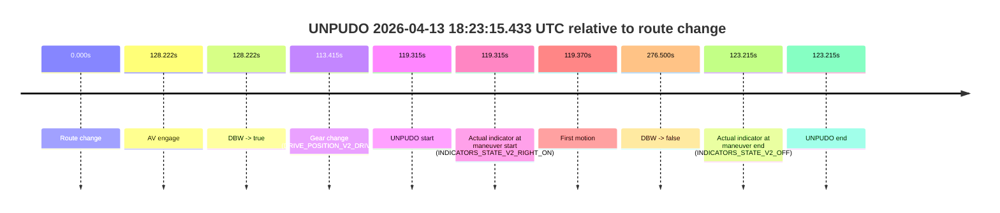
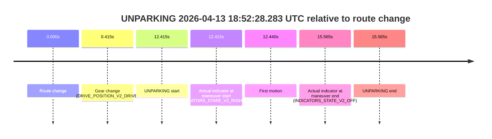

# Run Report: fme20037/2026-04-13--18-04-19--gen2-av-da487956-e6de-4b2a-8ac7-d1b2616ac0ea

| Field | Value |
|---|---|
| Run ID | `fme20037/2026-04-13--18-04-19--gen2-av-da487956-e6de-4b2a-8ac7-d1b2616ac0ea` |
| Date | `2026-04-13` |
| Model(s) | `lively-orange-horse` |
| Author | `guy.geva` |
| Event count | `4` |

## unpudo 2026-04-13 18:23:15.433 UTC

| Field | Value |
|---|---|
| Model | `lively-orange-horse` |
| Author | `guy.geva` |
| Run ID | `fme20037/2026-04-13--18-04-19--gen2-av-da487956-e6de-4b2a-8ac7-d1b2616ac0ea` |
| Date | `2026-04-13` |
| Time (UTC) | `18:23:15.433` |
| Event type | `unpudo` |
| Disengagement type | `failed_to_unpudo` |
| Route change | `found` |
| Console | [run](https://console.sso.wayve.ai/run/fme20037/2026-04-13--18-04-19--gen2-av-da487956-e6de-4b2a-8ac7-d1b2616ac0ea?id=&time-unixus=1776104595433318) |
| Foxglove | [segment](https://app.foxglove.dev/wayve-on-prem/p/prj_0dX18KZdVHg1fmmI/view?ds=foxglove-stream&ds.deviceName=fme20037&ds.start=2026-04-13T18%3A21%3A06.118236Z&ds.end=2026-04-13T18%3A26%3A02.618217Z&layoutId=lay_0e7VD4WIKDQGU73Y&time=2026-04-13T18%3A23%3A15.433318Z) |

### Event card: accidental

- Accidental: AV ownership is present for less than `2s`, so this is treated as an accidental brush with the maneuver rather than a meaningful model attempt.

| Event | Time (UTC) | Delta from route change |
|---|---:|---:|
| Route change | 2026-04-13 18:21:16.118 | `0.000s` |
| AV engage | 2026-04-13 18:23:24.339 | `128.222s` |
| DBW -> true | 2026-04-13 18:23:24.339 | `128.222s` |
| Gear change (DRIVE_POSITION_V2_DRIVE) | 2026-04-13 18:23:09.533 | `113.415s` |
| UNPUDO start | 2026-04-13 18:23:15.433 | `119.315s` |
| Actual indicator at maneuver start (INDICATORS_STATE_V2_RIGHT_ON) | 2026-04-13 18:23:15.433 | `119.315s` |
| First motion | 2026-04-13 18:23:15.487 | `119.370s` |
| DBW -> false | 2026-04-13 18:25:52.618 | `276.500s` |
| Actual indicator at maneuver end (INDICATORS_STATE_V2_OFF) | 2026-04-13 18:23:19.333 | `123.215s` |
| UNPUDO end | 2026-04-13 18:23:19.333 | `123.215s` |

| Metric | Value |
|---|---|
| Outcome | `accidental` |
| Effective failure type | `none` |
| Route change status | `found` |
| DBW at event start | `false` |
| DBW at event end | `false` |
| Predicted gear at AV start | `DRIVE_POSITION_V2_DRIVE` |
| Actual gear at AV start | `DRIVE_POSITION_V2_DRIVE` |
| Predicted gear at event start | `DRIVE_POSITION_V2_DRIVE` |
| Actual gear at event start | `DRIVE_POSITION_V2_DRIVE` |
| Planned indicator direction | `INDICATORS_STATE_V2_RIGHT_ON` |
| Controller indicator direction | `INDICATORS_STATE_V2_RIGHT_ON` |
| Actual indicator direction | `INDICATORS_STATE_V2_RIGHT_ON` |
| Actual indicator at maneuver end | `INDICATORS_STATE_V2_OFF` |
| Driver accel help in AV | `false` |
| Driver accel help timestamp | `n/a` |
| Max accel pedal pct in AV | `0.0%` |
| Max brake pedal pct in AV | `0.0%` |
| Max speed mps in AV | `0.000` |
| Route -> AV | `128.222s` |
| AV -> event start | `-8.907s` |
| AV -> first motion | `-8.852s` |
| AV duration before disengagement | `148.278s` |
| Trajectory waypoint count | `36` |
| Driving-plan step count | `11` |

The scored portion starts from the AV-owned window, not from the pre-AV setup. Route-change search in the stopped pre-event segment was `found`, with the baseline therefore set to route change. At the event anchor the model predicts `DRIVE_POSITION_V2_DRIVE` and the actual gear is `DRIVE_POSITION_V2_DRIVE`. The effective model outcome is `accidental` because `the AV-owned portion is shorter than 2s`.

### Resolution

| Field | Value |
|---|---|
| Final outcome | `accidental` |
| Do we agree with this label? | `yes` |
| Source disengagement type | `failed_to_unpudo` |
| Resolved effective failure type | `none` |
| Confidence | `high` |

## unpudo 2026-04-13 18:31:25.483 UTC

| Field | Value |
|---|---|
| Model | `lively-orange-horse` |
| Author | `guy.geva` |
| Run ID | `fme20037/2026-04-13--18-04-19--gen2-av-da487956-e6de-4b2a-8ac7-d1b2616ac0ea` |
| Date | `2026-04-13` |
| Time (UTC) | `18:31:25.483` |
| Event type | `unpudo` |
| Disengagement type | `failed_to_unpudo` |
| Route change | `found` |
| Console | [run](https://console.sso.wayve.ai/run/fme20037/2026-04-13--18-04-19--gen2-av-da487956-e6de-4b2a-8ac7-d1b2616ac0ea?id=&time-unixus=1776105085483311) |
| Foxglove | [segment](https://app.foxglove.dev/wayve-on-prem/p/prj_0dX18KZdVHg1fmmI/view?ds=foxglove-stream&ds.deviceName=fme20037&ds.start=2026-04-13T18%3A30%3A38.068319Z&ds.end=2026-04-13T18%3A32%3A57.619903Z&layoutId=lay_0e7VD4WIKDQGU73Y&time=2026-04-13T18%3A31%3A25.483311Z) |

### Event card: accidental

- Accidental: AV ownership is present for less than `2s`, so this is treated as an accidental brush with the maneuver rather than a meaningful model attempt.

| Event | Time (UTC) | Delta from route change |
|---|---:|---:|
| Route change | 2026-04-13 18:30:48.068 | `0.000s` |
| AV engage | 2026-04-13 18:31:41.140 | `53.072s` |
| DBW -> true | 2026-04-13 18:31:41.140 | `53.072s` |
| Gear change (DRIVE_POSITION_V2_DRIVE) | 2026-04-13 18:30:55.233 | `7.165s` |
| UNPUDO start | 2026-04-13 18:31:25.483 | `37.415s` |
| Actual indicator at maneuver start (INDICATORS_STATE_V2_RIGHT_ON) | 2026-04-13 18:31:25.483 | `37.415s` |
| First motion | 2026-04-13 18:31:25.507 | `37.440s` |
| DBW -> false | 2026-04-13 18:32:47.619 | `119.552s` |
| Actual indicator at maneuver end (INDICATORS_STATE_V2_OFF) | 2026-04-13 18:31:28.983 | `40.915s` |
| UNPUDO end | 2026-04-13 18:31:28.983 | `40.915s` |

| Metric | Value |
|---|---|
| Outcome | `accidental` |
| Effective failure type | `none` |
| Route change status | `found` |
| DBW at event start | `false` |
| DBW at event end | `false` |
| Predicted gear at AV start | `DRIVE_POSITION_V2_DRIVE` |
| Actual gear at AV start | `DRIVE_POSITION_V2_DRIVE` |
| Predicted gear at event start | `DRIVE_POSITION_V2_DRIVE` |
| Actual gear at event start | `DRIVE_POSITION_V2_DRIVE` |
| Planned indicator direction | `INDICATORS_STATE_V2_RIGHT_ON` |
| Controller indicator direction | `INDICATORS_STATE_V2_RIGHT_ON` |
| Actual indicator direction | `INDICATORS_STATE_V2_RIGHT_ON` |
| Actual indicator at maneuver end | `INDICATORS_STATE_V2_OFF` |
| Driver accel help in AV | `false` |
| Driver accel help timestamp | `n/a` |
| Max accel pedal pct in AV | `0.0%` |
| Max brake pedal pct in AV | `0.0%` |
| Max speed mps in AV | `0.000` |
| Route -> AV | `53.072s` |
| AV -> event start | `-15.657s` |
| AV -> first motion | `-15.632s` |
| AV duration before disengagement | `66.480s` |
| Trajectory waypoint count | `37` |
| Driving-plan step count | `11` |

The scored portion starts from the AV-owned window, not from the pre-AV setup. Route-change search in the stopped pre-event segment was `found`, with the baseline therefore set to route change. At the event anchor the model predicts `DRIVE_POSITION_V2_DRIVE` and the actual gear is `DRIVE_POSITION_V2_DRIVE`. The effective model outcome is `accidental` because `the AV-owned portion is shorter than 2s`.

### Resolution

| Field | Value |
|---|---|
| Final outcome | `accidental` |
| Do we agree with this label? | `yes` |
| Source disengagement type | `failed_to_unpudo` |
| Resolved effective failure type | `none` |
| Confidence | `high` |

## unpudo 2026-04-13 18:39:23.333 UTC

| Field | Value |
|---|---|
| Model | `lively-orange-horse` |
| Author | `guy.geva` |
| Run ID | `fme20037/2026-04-13--18-04-19--gen2-av-da487956-e6de-4b2a-8ac7-d1b2616ac0ea` |
| Date | `2026-04-13` |
| Time (UTC) | `18:39:23.333` |
| Event type | `unpudo` |
| Disengagement type | `uncommanded_disengagement` |
| Route change | `found` |
| Console | [run](https://console.sso.wayve.ai/run/fme20037/2026-04-13--18-04-19--gen2-av-da487956-e6de-4b2a-8ac7-d1b2616ac0ea?id=&time-unixus=1776105563333297) |
| Foxglove | [segment](https://app.foxglove.dev/wayve-on-prem/p/prj_0dX18KZdVHg1fmmI/view?ds=foxglove-stream&ds.deviceName=fme20037&ds.start=2026-04-13T18%3A39%3A05.118306Z&ds.end=2026-04-13T18%3A40%3A30.559088Z&layoutId=lay_0e7VD4WIKDQGU73Y&time=2026-04-13T18%3A39%3A23.333297Z) |

### Event card: accidental

- Accidental: AV ownership is present for less than `2s`, so this is treated as an accidental brush with the maneuver rather than a meaningful model attempt.

| Event | Time (UTC) | Delta from route change |
|---|---:|---:|
| Route change | 2026-04-13 18:39:15.118 | `0.000s` |
| AV engage | 2026-04-13 18:39:33.498 | `18.380s` |
| DBW -> true | 2026-04-13 18:39:33.498 | `18.380s` |
| Gear change (DRIVE_POSITION_V2_DRIVE) | 2026-04-13 18:39:18.483 | `3.365s` |
| UNPUDO start | 2026-04-13 18:39:23.333 | `8.215s` |
| Actual indicator at maneuver start (INDICATORS_STATE_V2_RIGHT_ON) | 2026-04-13 18:39:23.333 | `8.215s` |
| First motion | 2026-04-13 18:39:23.427 | `8.309s` |
| DBW -> false | 2026-04-13 18:40:20.559 | `65.441s` |
| Actual indicator at maneuver end (INDICATORS_STATE_V2_OFF) | 2026-04-13 18:39:27.433 | `12.315s` |
| UNPUDO end | 2026-04-13 18:39:27.433 | `12.315s` |

| Metric | Value |
|---|---|
| Outcome | `accidental` |
| Effective failure type | `none` |
| Route change status | `found` |
| DBW at event start | `false` |
| DBW at event end | `false` |
| Predicted gear at AV start | `DRIVE_POSITION_V2_DRIVE` |
| Actual gear at AV start | `DRIVE_POSITION_V2_DRIVE` |
| Predicted gear at event start | `DRIVE_POSITION_V2_DRIVE` |
| Actual gear at event start | `DRIVE_POSITION_V2_DRIVE` |
| Planned indicator direction | `INDICATORS_STATE_V2_RIGHT_ON` |
| Controller indicator direction | `INDICATORS_STATE_V2_RIGHT_ON` |
| Actual indicator direction | `INDICATORS_STATE_V2_RIGHT_ON` |
| Actual indicator at maneuver end | `INDICATORS_STATE_V2_OFF` |
| Driver accel help in AV | `false` |
| Driver accel help timestamp | `n/a` |
| Max accel pedal pct in AV | `0.0%` |
| Max brake pedal pct in AV | `0.0%` |
| Max speed mps in AV | `0.000` |
| Route -> AV | `18.380s` |
| AV -> event start | `-10.165s` |
| AV -> first motion | `-10.071s` |
| AV duration before disengagement | `47.060s` |
| Trajectory waypoint count | `36` |
| Driving-plan step count | `11` |

The scored portion starts from the AV-owned window, not from the pre-AV setup. Route-change search in the stopped pre-event segment was `found`, with the baseline therefore set to route change. At the event anchor the model predicts `DRIVE_POSITION_V2_DRIVE` and the actual gear is `DRIVE_POSITION_V2_DRIVE`. The effective model outcome is `accidental` because `the AV-owned portion is shorter than 2s`.

### Resolution

| Field | Value |
|---|---|
| Final outcome | `accidental` |
| Do we agree with this label? | `yes` |
| Source disengagement type | `uncommanded_disengagement` |
| Resolved effective failure type | `none` |
| Confidence | `high` |

## unparking 2026-04-13 18:52:28.283 UTC

| Field | Value |
|---|---|
| Model | `lively-orange-horse` |
| Author | `guy.geva` |
| Run ID | `fme20037/2026-04-13--18-04-19--gen2-av-da487956-e6de-4b2a-8ac7-d1b2616ac0ea` |
| Date | `2026-04-13` |
| Time (UTC) | `18:52:28.283` |
| Event type | `unparking` |
| Disengagement type | `failed_to_unpudo` |
| Route change | `found` |
| Console | [run](https://console.sso.wayve.ai/run/fme20037/2026-04-13--18-04-19--gen2-av-da487956-e6de-4b2a-8ac7-d1b2616ac0ea?id=&time-unixus=1776106348283298) |
| Foxglove | [segment](https://app.foxglove.dev/wayve-on-prem/p/prj_0dX18KZdVHg1fmmI/view?ds=foxglove-stream&ds.deviceName=fme20037&ds.start=2026-04-13T18%3A52%3A05.868268Z&ds.end=2026-04-13T18%3A52%3A41.433293Z&layoutId=lay_0e7VD4WIKDQGU73Y&time=2026-04-13T18%3A52%3A28.283298Z) |

### Event card: non-av

- Non-AV: the detected unparking starts outside AV ownership, so it is kept for coverage but excluded from model success / failure scoring.

| Event | Time (UTC) | Delta from route change |
|---|---:|---:|
| Route change | 2026-04-13 18:52:15.868 | `0.000s` |
| Gear change (DRIVE_POSITION_V2_DRIVE) | 2026-04-13 18:52:16.283 | `0.415s` |
| UNPARKING start | 2026-04-13 18:52:28.283 | `12.415s` |
| Actual indicator at maneuver start (INDICATORS_STATE_V2_RIGHT_ON) | 2026-04-13 18:52:28.283 | `12.415s` |
| First motion | 2026-04-13 18:52:28.308 | `12.440s` |
| Actual indicator at maneuver end (INDICATORS_STATE_V2_OFF) | 2026-04-13 18:52:31.433 | `15.565s` |
| UNPARKING end | 2026-04-13 18:52:31.433 | `15.565s` |

| Metric | Value |
|---|---|
| Outcome | `non-av` |
| Effective failure type | `none` |
| Route change status | `found` |
| DBW at event start | `false` |
| DBW at event end | `false` |
| Predicted gear at AV start | `n/a` |
| Actual gear at AV start | `n/a` |
| Predicted gear at event start | `DRIVE_POSITION_V2_DRIVE` |
| Actual gear at event start | `DRIVE_POSITION_V2_DRIVE` |
| Planned indicator direction | `INDICATORS_STATE_V2_RIGHT_ON` |
| Controller indicator direction | `INDICATORS_STATE_V2_RIGHT_ON` |
| Actual indicator direction | `INDICATORS_STATE_V2_RIGHT_ON` |
| Actual indicator at maneuver end | `INDICATORS_STATE_V2_OFF` |
| Driver accel help in AV | `false` |
| Driver accel help timestamp | `n/a` |
| Max accel pedal pct in AV | `0.0%` |
| Max brake pedal pct in AV | `0.0%` |
| Max speed mps in AV | `0.000` |
| Route -> AV | `n/a` |
| AV -> event start | `n/a` |
| AV -> first motion | `n/a` |
| AV duration before disengagement | `n/a` |
| Trajectory waypoint count | `37` |
| Driving-plan step count | `11` |

The scored portion starts from the AV-owned window, not from the pre-AV setup. Route-change search in the stopped pre-event segment was `found`, with the baseline therefore set to route change. At the event anchor the model predicts `DRIVE_POSITION_V2_DRIVE` and the actual gear is `DRIVE_POSITION_V2_DRIVE`. The effective model outcome is `non-av` because `the event does not begin in AV ownership`.

### Resolution

| Field | Value |
|---|---|
| Final outcome | `non-av` |
| Do we agree with this label? | `yes` |
| Source disengagement type | `failed_to_unpudo` |
| Resolved effective failure type | `none` |
| Confidence | `high` |
