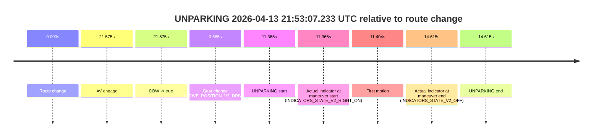

# Run Report: fme20037/2026-04-13--21-35-17--gen2-av-a682e5bb-dc88-47cc-84b5-1556cf7eb1f2

| Field | Value |
|---|---|
| Run ID | `fme20037/2026-04-13--21-35-17--gen2-av-a682e5bb-dc88-47cc-84b5-1556cf7eb1f2` |
| Date | `2026-04-13` |
| Model(s) | `lively-orange-horse` |
| Author | `guy.geva` |
| Event count | `1` |

## unparking 2026-04-13 21:53:07.233 UTC

| Field | Value |
|---|---|
| Model | `lively-orange-horse` |
| Author | `guy.geva` |
| Run ID | `fme20037/2026-04-13--21-35-17--gen2-av-a682e5bb-dc88-47cc-84b5-1556cf7eb1f2` |
| Date | `2026-04-13` |
| Time (UTC) | `21:53:07.233` |
| Event type | `unparking` |
| Disengagement type | `failed_to_unpudo` |
| Route change | `found` |
| Console | [run](https://console.sso.wayve.ai/run/fme20037/2026-04-13--21-35-17--gen2-av-a682e5bb-dc88-47cc-84b5-1556cf7eb1f2?id=&time-unixus=1776117187233321) |
| Foxglove | [segment](https://app.foxglove.dev/wayve-on-prem/p/prj_0dX18KZdVHg1fmmI/view?ds=foxglove-stream&ds.deviceName=fme20037&ds.start=2026-04-13T21%3A52%3A45.868271Z&ds.end=2026-04-13T21%3A53%3A20.483308Z&layoutId=lay_0e7VD4WIKDQGU73Y&time=2026-04-13T21%3A53%3A07.233321Z) |

### Event card: fail

- Fail: AV owns part of the segment, but the event still resolves as a model-performance failure under the AV-only scoring rule.

| Event | Time (UTC) | Delta from route change |
|---|---:|---:|
| Route change | 2026-04-13 21:52:55.868 | `0.000s` |
| AV engage | 2026-04-13 21:53:17.442 | `21.575s` |
| DBW -> true | 2026-04-13 21:53:17.442 | `21.575s` |
| Gear change (DRIVE_POSITION_V2_DRIVE) | 2026-04-13 21:52:56.533 | `0.665s` |
| UNPARKING start | 2026-04-13 21:53:07.233 | `11.365s` |
| Actual indicator at maneuver start (INDICATORS_STATE_V2_RIGHT_ON) | 2026-04-13 21:53:07.233 | `11.365s` |
| First motion | 2026-04-13 21:53:07.272 | `11.404s` |
| Actual indicator at maneuver end (INDICATORS_STATE_V2_OFF) | 2026-04-13 21:53:10.483 | `14.615s` |
| UNPARKING end | 2026-04-13 21:53:10.483 | `14.615s` |

| Metric | Value |
|---|---|
| Outcome | `fail` |
| Effective failure type | `failed_to_unpudo` |
| Route change status | `found` |
| DBW at event start | `false` |
| DBW at event end | `false` |
| Predicted gear at AV start | `DRIVE_POSITION_V2_DRIVE` |
| Actual gear at AV start | `DRIVE_POSITION_V2_DRIVE` |
| Predicted gear at event start | `DRIVE_POSITION_V2_DRIVE` |
| Actual gear at event start | `DRIVE_POSITION_V2_DRIVE` |
| Planned indicator direction | `INDICATORS_STATE_V2_RIGHT_ON` |
| Controller indicator direction | `INDICATORS_STATE_V2_RIGHT_ON` |
| Actual indicator direction | `INDICATORS_STATE_V2_RIGHT_ON` |
| Actual indicator at maneuver end | `INDICATORS_STATE_V2_OFF` |
| Driver accel help in AV | `false` |
| Driver accel help timestamp | `n/a` |
| Max accel pedal pct in AV | `0.0%` |
| Max brake pedal pct in AV | `0.0%` |
| Max speed mps in AV | `0.000` |
| Route -> AV | `21.575s` |
| AV -> event start | `-10.210s` |
| AV -> first motion | `-10.170s` |
| AV duration before disengagement | `n/a` |
| Trajectory waypoint count | `36` |
| Driving-plan step count | `11` |

The scored portion starts from the AV-owned window, not from the pre-AV setup. Route-change search in the stopped pre-event segment was `found`, with the baseline therefore set to route change. At the event anchor the model predicts `DRIVE_POSITION_V2_DRIVE` and the actual gear is `DRIVE_POSITION_V2_DRIVE`. The effective model outcome is `fail` because `failed_to_unpudo`.

### Resolution

| Field | Value |
|---|---|
| Final outcome | `fail` |
| Do we agree with this label? | `yes` |
| Source disengagement type | `failed_to_unpudo` |
| Resolved effective failure type | `failed_to_unpudo` |
| Confidence | `high` |
