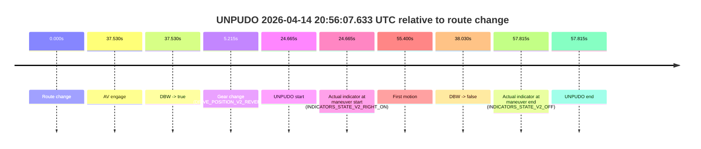
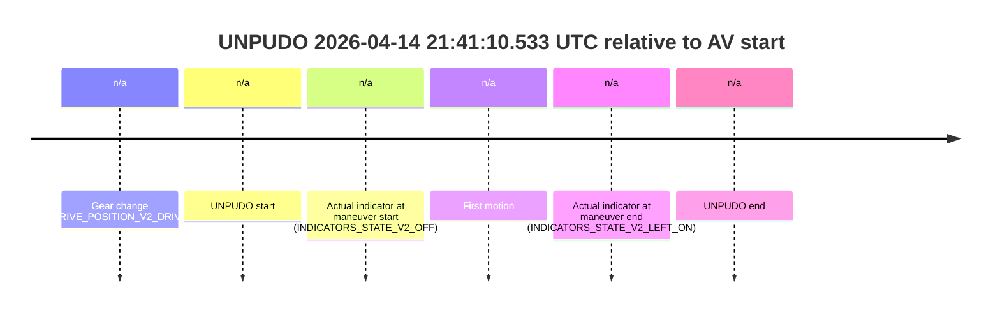

# Run Report: fme20037/2026-04-14--20-42-13--gen2-av-6a7f5a5e-b6ab-4762-9887-38a0a6bd8663

| Field | Value |
|---|---|
| Run ID | `fme20037/2026-04-14--20-42-13--gen2-av-6a7f5a5e-b6ab-4762-9887-38a0a6bd8663` |
| Date | `2026-04-14` |
| Model(s) | `apricot-crocodile-uproarious` |
| Author | `guy.geva` |
| Event count | `4` |

## unpudo 2026-04-14 20:56:07.633 UTC

| Field | Value |
|---|---|
| Model | `apricot-crocodile-uproarious` |
| Author | `guy.geva` |
| Run ID | `fme20037/2026-04-14--20-42-13--gen2-av-6a7f5a5e-b6ab-4762-9887-38a0a6bd8663` |
| Date | `2026-04-14` |
| Time (UTC) | `20:56:07.633` |
| Event type | `unpudo` |
| Disengagement type | `failed_to_unpudo` |
| Route change | `found` |
| Console | [run](https://console.sso.wayve.ai/run/fme20037/2026-04-14--20-42-13--gen2-av-6a7f5a5e-b6ab-4762-9887-38a0a6bd8663?id=&time-unixus=1776200167633300) |
| Foxglove | [segment](https://app.foxglove.dev/wayve-on-prem/p/prj_0dX18KZdVHg1fmmI/view?ds=foxglove-stream&ds.deviceName=fme20037&ds.start=2026-04-14T20%3A55%3A32.968416Z&ds.end=2026-04-14T20%3A56%3A50.783311Z&layoutId=lay_0e7VD4WIKDQGU73Y&time=2026-04-14T20%3A56%3A07.633300Z) |

### Event card: accidental

- Accidental: AV ownership is present for less than `2s`, so this is treated as an accidental brush with the maneuver rather than a meaningful model attempt.

| Event | Time (UTC) | Delta from route change |
|---|---:|---:|
| Route change | 2026-04-14 20:55:42.968 | `0.000s` |
| AV engage | 2026-04-14 20:56:20.497 | `37.530s` |
| DBW -> true | 2026-04-14 20:56:20.497 | `37.530s` |
| Gear change (DRIVE_POSITION_V2_REVERSE) | 2026-04-14 20:55:48.183 | `5.215s` |
| UNPUDO start | 2026-04-14 20:56:07.633 | `24.665s` |
| Actual indicator at maneuver start (INDICATORS_STATE_V2_RIGHT_ON) | 2026-04-14 20:56:07.633 | `24.665s` |
| First motion | 2026-04-14 20:56:38.368 | `55.400s` |
| DBW -> false | 2026-04-14 20:56:20.997 | `38.030s` |
| Actual indicator at maneuver end (INDICATORS_STATE_V2_OFF) | 2026-04-14 20:56:40.783 | `57.815s` |
| UNPUDO end | 2026-04-14 20:56:40.783 | `57.815s` |

| Metric | Value |
|---|---|
| Outcome | `accidental` |
| Effective failure type | `none` |
| Route change status | `found` |
| DBW at event start | `false` |
| DBW at event end | `false` |
| Predicted gear at AV start | `DRIVE_POSITION_V2_REVERSE` |
| Actual gear at AV start | `DRIVE_POSITION_V2_PARK` |
| Predicted gear at event start | `DRIVE_POSITION_V2_REVERSE` |
| Actual gear at event start | `DRIVE_POSITION_V2_REVERSE` |
| Planned indicator direction | `INDICATORS_STATE_V2_OFF` |
| Controller indicator direction | `INDICATORS_STATE_V2_OFF` |
| Actual indicator direction | `INDICATORS_STATE_V2_RIGHT_ON` |
| Actual indicator at maneuver end | `INDICATORS_STATE_V2_OFF` |
| Driver accel help in AV | `false` |
| Driver accel help timestamp | `n/a` |
| Max accel pedal pct in AV | `0.0%` |
| Max brake pedal pct in AV | `8.0%` |
| Max speed mps in AV | `0.000` |
| Route -> AV | `37.530s` |
| AV -> event start | `-12.865s` |
| AV -> first motion | `17.870s` |
| AV duration before disengagement | `0.500s` |
| Trajectory waypoint count | `36` |
| Driving-plan step count | `11` |

The scored portion starts from the AV-owned window, not from the pre-AV setup. Route-change search in the stopped pre-event segment was `found`, with the baseline therefore set to route change. At the event anchor the model predicts `DRIVE_POSITION_V2_REVERSE` and the actual gear is `DRIVE_POSITION_V2_REVERSE`. The effective model outcome is `accidental` because `the AV-owned portion is shorter than 2s`.

### Resolution

| Field | Value |
|---|---|
| Final outcome | `accidental` |
| Do we agree with this label? | `yes` |
| Source disengagement type | `failed_to_unpudo` |
| Resolved effective failure type | `none` |
| Confidence | `high` |

## unpudo 2026-04-14 21:01:19.183 UTC

| Field | Value |
|---|---|
| Model | `apricot-crocodile-uproarious` |
| Author | `guy.geva` |
| Run ID | `fme20037/2026-04-14--20-42-13--gen2-av-6a7f5a5e-b6ab-4762-9887-38a0a6bd8663` |
| Date | `2026-04-14` |
| Time (UTC) | `21:01:19.183` |
| Event type | `unpudo` |
| Disengagement type | `none observed` |
| Route change | `unclear` |
| Console | [run](https://console.sso.wayve.ai/run/fme20037/2026-04-14--20-42-13--gen2-av-6a7f5a5e-b6ab-4762-9887-38a0a6bd8663?id=&time-unixus=1776200479183314) |
| Foxglove | [segment](https://app.foxglove.dev/wayve-on-prem/p/prj_0dX18KZdVHg1fmmI/view?ds=foxglove-stream&ds.deviceName=fme20037&ds.start=2026-04-14T21%3A01%3A06.233300Z&ds.end=2026-04-14T21%3A02%3A08.083289Z&layoutId=lay_0e7VD4WIKDQGU73Y&time=2026-04-14T21%3A01%3A19.183314Z) |

### Event card: non-av

- Non-AV: there is no AV-owned portion anywhere inside the detected unpudo timeline, so it is kept for coverage but excluded from model success / failure scoring.

| Event | Time (UTC) | Delta from AV start |
|---|---:|---:|
| Gear change (DRIVE_POSITION_V2_REVERSE) | 2026-04-14 21:01:16.233 | `n/a` |
| UNPUDO start | 2026-04-14 21:01:19.183 | `n/a` |
| Actual indicator at maneuver start (INDICATORS_STATE_V2_OFF) | 2026-04-14 21:01:19.183 | `n/a` |
| First motion | 2026-04-14 21:01:50.167 | `n/a` |
| Actual indicator at maneuver end (INDICATORS_STATE_V2_OFF) | 2026-04-14 21:01:58.083 | `n/a` |
| UNPUDO end | 2026-04-14 21:01:58.083 | `n/a` |

| Metric | Value |
|---|---|
| Outcome | `non-av` |
| Effective failure type | `none` |
| Route change status | `unclear` |
| DBW at event start | `false` |
| DBW at event end | `false` |
| Predicted gear at AV start | `n/a` |
| Actual gear at AV start | `n/a` |
| Predicted gear at event start | `DRIVE_POSITION_V2_REVERSE` |
| Actual gear at event start | `DRIVE_POSITION_V2_REVERSE` |
| Planned indicator direction | `INDICATORS_STATE_V2_OFF` |
| Controller indicator direction | `INDICATORS_STATE_V2_OFF` |
| Actual indicator direction | `INDICATORS_STATE_V2_OFF` |
| Actual indicator at maneuver end | `INDICATORS_STATE_V2_OFF` |
| Driver accel help in AV | `false` |
| Driver accel help timestamp | `n/a` |
| Max accel pedal pct in AV | `0.0%` |
| Max brake pedal pct in AV | `0.0%` |
| Max speed mps in AV | `0.000` |
| Route -> AV | `n/a` |
| AV -> event start | `n/a` |
| AV -> first motion | `n/a` |
| AV duration before disengagement | `n/a` |
| Trajectory waypoint count | `36` |
| Driving-plan step count | `11` |

The scored portion starts from the AV-owned window, not from the pre-AV setup. Route-change search in the stopped pre-event segment was `unclear`, with the baseline therefore set to AV start. At the event anchor the model predicts `DRIVE_POSITION_V2_REVERSE` and the actual gear is `DRIVE_POSITION_V2_REVERSE`. The effective model outcome is `non-av` because `there is no AV-owned overlap inside the event timeline`.

### Resolution

| Field | Value |
|---|---|
| Final outcome | `non-av` |
| Do we agree with this label? | `yes` |
| Source disengagement type | `none observed` |
| Resolved effective failure type | `none` |
| Confidence | `medium` |

## unpudo 2026-04-14 21:38:37.333 UTC

| Field | Value |
|---|---|
| Model | `apricot-crocodile-uproarious` |
| Author | `guy.geva` |
| Run ID | `fme20037/2026-04-14--20-42-13--gen2-av-6a7f5a5e-b6ab-4762-9887-38a0a6bd8663` |
| Date | `2026-04-14` |
| Time (UTC) | `21:38:37.333` |
| Event type | `unpudo` |
| Disengagement type | `failed_to_unpudo` |
| Route change | `found` |
| Console | [run](https://console.sso.wayve.ai/run/fme20037/2026-04-14--20-42-13--gen2-av-6a7f5a5e-b6ab-4762-9887-38a0a6bd8663?id=&time-unixus=1776202717333311) |
| Foxglove | [segment](https://app.foxglove.dev/wayve-on-prem/p/prj_0dX18KZdVHg1fmmI/view?ds=foxglove-stream&ds.deviceName=fme20037&ds.start=2026-04-14T21%3A37%3A53.618350Z&ds.end=2026-04-14T21%3A40%3A21.039121Z&layoutId=lay_0e7VD4WIKDQGU73Y&time=2026-04-14T21%3A38%3A37.333311Z) |

### Event card: non-av

- Non-AV: there is no AV-owned portion anywhere inside the detected unpudo timeline, so it is kept for coverage but excluded from model success / failure scoring.

| Event | Time (UTC) | Delta from route change |
|---|---:|---:|
| Route change | 2026-04-14 21:38:03.618 | `0.000s` |
| AV engage | 2026-04-14 21:38:46.778 | `43.160s` |
| DBW -> true | 2026-04-14 21:38:46.778 | `43.160s` |
| Gear change (DRIVE_POSITION_V2_DRIVE) | 2026-04-14 21:38:27.183 | `23.565s` |
| UNPUDO start | 2026-04-14 21:38:37.333 | `33.715s` |
| Actual indicator at maneuver start (INDICATORS_STATE_V2_RIGHT_ON) | 2026-04-14 21:38:37.333 | `33.715s` |
| First motion | 2026-04-14 21:38:37.348 | `33.730s` |
| DBW -> false | 2026-04-14 21:40:11.039 | `127.421s` |
| Actual indicator at maneuver end (INDICATORS_STATE_V2_OFF) | 2026-04-14 21:38:43.533 | `39.915s` |
| UNPUDO end | 2026-04-14 21:38:43.533 | `39.915s` |

| Metric | Value |
|---|---|
| Outcome | `non-av` |
| Effective failure type | `none` |
| Route change status | `found` |
| DBW at event start | `false` |
| DBW at event end | `false` |
| Predicted gear at AV start | `DRIVE_POSITION_V2_DRIVE` |
| Actual gear at AV start | `DRIVE_POSITION_V2_DRIVE` |
| Predicted gear at event start | `DRIVE_POSITION_V2_DRIVE` |
| Actual gear at event start | `DRIVE_POSITION_V2_DRIVE` |
| Planned indicator direction | `INDICATORS_STATE_V2_RIGHT_ON` |
| Controller indicator direction | `INDICATORS_STATE_V2_RIGHT_ON` |
| Actual indicator direction | `INDICATORS_STATE_V2_RIGHT_ON` |
| Actual indicator at maneuver end | `INDICATORS_STATE_V2_OFF` |
| Driver accel help in AV | `false` |
| Driver accel help timestamp | `n/a` |
| Max accel pedal pct in AV | `0.0%` |
| Max brake pedal pct in AV | `0.0%` |
| Max speed mps in AV | `0.000` |
| Route -> AV | `43.160s` |
| AV -> event start | `-9.445s` |
| AV -> first motion | `-9.430s` |
| AV duration before disengagement | `84.260s` |
| Trajectory waypoint count | `36` |
| Driving-plan step count | `11` |

The scored portion starts from the AV-owned window, not from the pre-AV setup. Route-change search in the stopped pre-event segment was `found`, with the baseline therefore set to route change. At the event anchor the model predicts `DRIVE_POSITION_V2_DRIVE` and the actual gear is `DRIVE_POSITION_V2_DRIVE`. The effective model outcome is `non-av` because `there is no AV-owned overlap inside the event timeline`.

### Resolution

| Field | Value |
|---|---|
| Final outcome | `non-av` |
| Do we agree with this label? | `yes` |
| Source disengagement type | `failed_to_unpudo` |
| Resolved effective failure type | `none` |
| Confidence | `high` |

## unpudo 2026-04-14 21:41:10.533 UTC

| Field | Value |
|---|---|
| Model | `apricot-crocodile-uproarious` |
| Author | `guy.geva` |
| Run ID | `fme20037/2026-04-14--20-42-13--gen2-av-6a7f5a5e-b6ab-4762-9887-38a0a6bd8663` |
| Date | `2026-04-14` |
| Time (UTC) | `21:41:10.533` |
| Event type | `unpudo` |
| Disengagement type | `uncategorised` |
| Route change | `unclear` |
| Console | [run](https://console.sso.wayve.ai/run/fme20037/2026-04-14--20-42-13--gen2-av-6a7f5a5e-b6ab-4762-9887-38a0a6bd8663?id=&time-unixus=1776202870533295) |
| Foxglove | [segment](https://app.foxglove.dev/wayve-on-prem/p/prj_0dX18KZdVHg1fmmI/view?ds=foxglove-stream&ds.deviceName=fme20037&ds.start=2026-04-14T21%3A40%3A57.133300Z&ds.end=2026-04-14T21%3A41%3A32.533304Z&layoutId=lay_0e7VD4WIKDQGU73Y&time=2026-04-14T21%3A41%3A10.533295Z) |

### Event card: non-av

- Non-AV: there is no AV-owned portion anywhere inside the detected unpudo timeline, so it is kept for coverage but excluded from model success / failure scoring.

| Event | Time (UTC) | Delta from AV start |
|---|---:|---:|
| Gear change (DRIVE_POSITION_V2_DRIVE) | 2026-04-14 21:41:07.133 | `n/a` |
| UNPUDO start | 2026-04-14 21:41:10.533 | `n/a` |
| Actual indicator at maneuver start (INDICATORS_STATE_V2_OFF) | 2026-04-14 21:41:10.533 | `n/a` |
| First motion | 2026-04-14 21:41:10.628 | `n/a` |
| Actual indicator at maneuver end (INDICATORS_STATE_V2_LEFT_ON) | 2026-04-14 21:41:22.533 | `n/a` |
| UNPUDO end | 2026-04-14 21:41:22.533 | `n/a` |

| Metric | Value |
|---|---|
| Outcome | `non-av` |
| Effective failure type | `none` |
| Route change status | `unclear` |
| DBW at event start | `false` |
| DBW at event end | `false` |
| Predicted gear at AV start | `n/a` |
| Actual gear at AV start | `n/a` |
| Predicted gear at event start | `DRIVE_POSITION_V2_DRIVE` |
| Actual gear at event start | `DRIVE_POSITION_V2_DRIVE` |
| Planned indicator direction | `INDICATORS_STATE_V2_LEFT_ON` |
| Controller indicator direction | `INDICATORS_STATE_V2_LEFT_ON` |
| Actual indicator direction | `INDICATORS_STATE_V2_OFF` |
| Actual indicator at maneuver end | `INDICATORS_STATE_V2_LEFT_ON` |
| Driver accel help in AV | `false` |
| Driver accel help timestamp | `n/a` |
| Max accel pedal pct in AV | `0.0%` |
| Max brake pedal pct in AV | `0.0%` |
| Max speed mps in AV | `0.000` |
| Route -> AV | `n/a` |
| AV -> event start | `n/a` |
| AV -> first motion | `n/a` |
| AV duration before disengagement | `n/a` |
| Trajectory waypoint count | `35` |
| Driving-plan step count | `11` |

The scored portion starts from the AV-owned window, not from the pre-AV setup. Route-change search in the stopped pre-event segment was `unclear`, with the baseline therefore set to AV start. At the event anchor the model predicts `DRIVE_POSITION_V2_DRIVE` and the actual gear is `DRIVE_POSITION_V2_DRIVE`. The effective model outcome is `non-av` because `there is no AV-owned overlap inside the event timeline`.

### Resolution

| Field | Value |
|---|---|
| Final outcome | `non-av` |
| Do we agree with this label? | `yes` |
| Source disengagement type | `uncategorised` |
| Resolved effective failure type | `none` |
| Confidence | `medium` |
