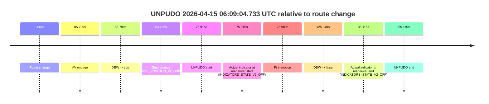
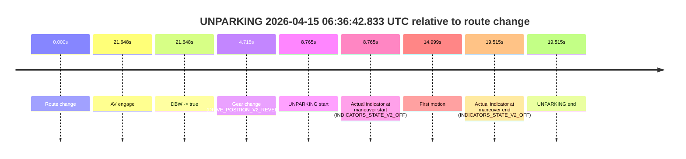

# Run Report: fme20037/2026-04-15--05-51-13--gen2-av-917aeb23-c40d-482e-bbc1-d5da32e81f5f

| Field | Value |
|---|---|
| Run ID | `fme20037/2026-04-15--05-51-13--gen2-av-917aeb23-c40d-482e-bbc1-d5da32e81f5f` |
| Date | `2026-04-15` |
| Model(s) | `satisfied-amber-moose` |
| Author | `guy.geva` |
| Event count | `3` |

## unpudo 2026-04-15 06:09:04.733 UTC

| Field | Value |
|---|---|
| Model | `satisfied-amber-moose` |
| Author | `guy.geva` |
| Run ID | `fme20037/2026-04-15--05-51-13--gen2-av-917aeb23-c40d-482e-bbc1-d5da32e81f5f` |
| Date | `2026-04-15` |
| Time (UTC) | `06:09:04.733` |
| Event type | `unpudo` |
| Disengagement type | `failed_to_unpudo` |
| Route change | `found` |
| Console | [run](https://console.sso.wayve.ai/run/fme20037/2026-04-15--05-51-13--gen2-av-917aeb23-c40d-482e-bbc1-d5da32e81f5f?id=&time-unixus=1776233344733308) |
| Foxglove | [segment](https://app.foxglove.dev/wayve-on-prem/p/prj_0dX18KZdVHg1fmmI/view?ds=foxglove-stream&ds.deviceName=fme20037&ds.start=2026-04-15T06%3A07%3A38.818253Z&ds.end=2026-04-15T06%3A10%3A03.858210Z&layoutId=lay_0e7VD4WIKDQGU73Y&time=2026-04-15T06%3A09%3A04.733308Z) |

### Event card: fail

- Fail: AV owns part of the segment, but the event still resolves as a model-performance failure under the AV-only scoring rule.

| Event | Time (UTC) | Delta from route change |
|---|---:|---:|
| Route change | 2026-04-15 06:07:48.818 | `0.000s` |
| AV engage | 2026-04-15 06:09:14.616 | `85.799s` |
| DBW -> true | 2026-04-15 06:09:14.616 | `85.799s` |
| Gear change (DRIVE_POSITION_V2_DRIVE) | 2026-04-15 06:08:52.583 | `63.765s` |
| UNPUDO start | 2026-04-15 06:09:04.733 | `75.915s` |
| Actual indicator at maneuver start (INDICATORS_STATE_V2_OFF) | 2026-04-15 06:09:04.733 | `75.915s` |
| First motion | 2026-04-15 06:09:04.807 | `75.989s` |
| DBW -> false | 2026-04-15 06:09:53.858 | `125.040s` |
| Actual indicator at maneuver end (INDICATORS_STATE_V2_OFF) | 2026-04-15 06:09:13.933 | `85.115s` |
| UNPUDO end | 2026-04-15 06:09:13.933 | `85.115s` |

| Metric | Value |
|---|---|
| Outcome | `fail` |
| Effective failure type | `failed_to_unpudo` |
| Route change status | `found` |
| DBW at event start | `false` |
| DBW at event end | `false` |
| Predicted gear at AV start | `DRIVE_POSITION_V2_DRIVE` |
| Actual gear at AV start | `DRIVE_POSITION_V2_DRIVE` |
| Predicted gear at event start | `DRIVE_POSITION_V2_DRIVE` |
| Actual gear at event start | `DRIVE_POSITION_V2_DRIVE` |
| Planned indicator direction | `INDICATORS_STATE_V2_LEFT_ON` |
| Controller indicator direction | `INDICATORS_STATE_V2_LEFT_ON` |
| Actual indicator direction | `INDICATORS_STATE_V2_OFF` |
| Actual indicator at maneuver end | `INDICATORS_STATE_V2_OFF` |
| Driver accel help in AV | `false` |
| Driver accel help timestamp | `n/a` |
| Max accel pedal pct in AV | `0.0%` |
| Max brake pedal pct in AV | `0.0%` |
| Max speed mps in AV | `0.000` |
| Route -> AV | `85.799s` |
| AV -> event start | `-9.884s` |
| AV -> first motion | `-9.809s` |
| AV duration before disengagement | `39.241s` |
| Trajectory waypoint count | `37` |
| Driving-plan step count | `11` |

The scored portion starts from the AV-owned window, not from the pre-AV setup. Route-change search in the stopped pre-event segment was `found`, with the baseline therefore set to route change. At the event anchor the model predicts `DRIVE_POSITION_V2_DRIVE` and the actual gear is `DRIVE_POSITION_V2_DRIVE`. The effective model outcome is `fail` because `failed_to_unpudo`.

### Resolution

| Field | Value |
|---|---|
| Final outcome | `fail` |
| Do we agree with this label? | `yes` |
| Source disengagement type | `failed_to_unpudo` |
| Resolved effective failure type | `failed_to_unpudo` |
| Confidence | `high` |

## unpudo 2026-04-15 06:16:07.733 UTC

| Field | Value |
|---|---|
| Model | `satisfied-amber-moose` |
| Author | `guy.geva` |
| Run ID | `fme20037/2026-04-15--05-51-13--gen2-av-917aeb23-c40d-482e-bbc1-d5da32e81f5f` |
| Date | `2026-04-15` |
| Time (UTC) | `06:16:07.733` |
| Event type | `unpudo` |
| Disengagement type | `failed_to_unpudo` |
| Route change | `found` |
| Console | [run](https://console.sso.wayve.ai/run/fme20037/2026-04-15--05-51-13--gen2-av-917aeb23-c40d-482e-bbc1-d5da32e81f5f?id=&time-unixus=1776233767733315) |
| Foxglove | [segment](https://app.foxglove.dev/wayve-on-prem/p/prj_0dX18KZdVHg1fmmI/view?ds=foxglove-stream&ds.deviceName=fme20037&ds.start=2026-04-15T06%3A14%3A56.018270Z&ds.end=2026-04-15T06%3A20%3A49.397021Z&layoutId=lay_0e7VD4WIKDQGU73Y&time=2026-04-15T06%3A16%3A07.733315Z) |

### Event card: fail

- Fail: AV owns part of the segment, but the event still resolves as a model-performance failure under the AV-only scoring rule.

| Event | Time (UTC) | Delta from route change |
|---|---:|---:|
| Route change | 2026-04-15 06:15:06.018 | `0.000s` |
| AV engage | 2026-04-15 06:16:17.017 | `70.999s` |
| DBW -> true | 2026-04-15 06:16:17.017 | `70.999s` |
| Gear change (DRIVE_POSITION_V2_DRIVE) | 2026-04-15 06:15:53.233 | `47.215s` |
| UNPUDO start | 2026-04-15 06:16:07.733 | `61.715s` |
| Actual indicator at maneuver start (INDICATORS_STATE_V2_RIGHT_ON) | 2026-04-15 06:16:07.733 | `61.715s` |
| First motion | 2026-04-15 06:16:07.887 | `61.869s` |
| DBW -> false | 2026-04-15 06:20:39.397 | `333.379s` |
| Actual indicator at maneuver end (INDICATORS_STATE_V2_OFF) | 2026-04-15 06:16:14.733 | `68.715s` |
| UNPUDO end | 2026-04-15 06:16:14.733 | `68.715s` |

| Metric | Value |
|---|---|
| Outcome | `fail` |
| Effective failure type | `failed_to_unpudo` |
| Route change status | `found` |
| DBW at event start | `false` |
| DBW at event end | `false` |
| Predicted gear at AV start | `DRIVE_POSITION_V2_DRIVE` |
| Actual gear at AV start | `DRIVE_POSITION_V2_DRIVE` |
| Predicted gear at event start | `DRIVE_POSITION_V2_DRIVE` |
| Actual gear at event start | `DRIVE_POSITION_V2_DRIVE` |
| Planned indicator direction | `INDICATORS_STATE_V2_OFF` |
| Controller indicator direction | `INDICATORS_STATE_V2_OFF` |
| Actual indicator direction | `INDICATORS_STATE_V2_RIGHT_ON` |
| Actual indicator at maneuver end | `INDICATORS_STATE_V2_OFF` |
| Driver accel help in AV | `false` |
| Driver accel help timestamp | `n/a` |
| Max accel pedal pct in AV | `0.0%` |
| Max brake pedal pct in AV | `0.0%` |
| Max speed mps in AV | `0.000` |
| Route -> AV | `70.999s` |
| AV -> event start | `-9.284s` |
| AV -> first motion | `-9.130s` |
| AV duration before disengagement | `262.379s` |
| Trajectory waypoint count | `35` |
| Driving-plan step count | `11` |

The scored portion starts from the AV-owned window, not from the pre-AV setup. Route-change search in the stopped pre-event segment was `found`, with the baseline therefore set to route change. At the event anchor the model predicts `DRIVE_POSITION_V2_DRIVE` and the actual gear is `DRIVE_POSITION_V2_DRIVE`. The effective model outcome is `fail` because `failed_to_unpudo`.

### Resolution

| Field | Value |
|---|---|
| Final outcome | `fail` |
| Do we agree with this label? | `yes` |
| Source disengagement type | `failed_to_unpudo` |
| Resolved effective failure type | `failed_to_unpudo` |
| Confidence | `high` |

## unparking 2026-04-15 06:36:42.833 UTC

| Field | Value |
|---|---|
| Model | `satisfied-amber-moose` |
| Author | `guy.geva` |
| Run ID | `fme20037/2026-04-15--05-51-13--gen2-av-917aeb23-c40d-482e-bbc1-d5da32e81f5f` |
| Date | `2026-04-15` |
| Time (UTC) | `06:36:42.833` |
| Event type | `unparking` |
| Disengagement type | `none observed` |
| Route change | `found` |
| Console | [run](https://console.sso.wayve.ai/run/fme20037/2026-04-15--05-51-13--gen2-av-917aeb23-c40d-482e-bbc1-d5da32e81f5f?id=&time-unixus=1776235002833317) |
| Foxglove | [segment](https://app.foxglove.dev/wayve-on-prem/p/prj_0dX18KZdVHg1fmmI/view?ds=foxglove-stream&ds.deviceName=fme20037&ds.start=2026-04-15T06%3A36%3A24.068406Z&ds.end=2026-04-15T06%3A37%3A03.583321Z&layoutId=lay_0e7VD4WIKDQGU73Y&time=2026-04-15T06%3A36%3A42.833317Z) |

### Event card: fail

- Fail: the credited unparking does not stay AV-owned. The event window starts with DBW false, and the maneuver outcome lands outside a clean AV-owned segment.

| Event | Time (UTC) | Delta from route change |
|---|---:|---:|
| Route change | 2026-04-15 06:36:34.068 | `0.000s` |
| AV engage | 2026-04-15 06:36:55.716 | `21.648s` |
| DBW -> true | 2026-04-15 06:36:55.716 | `21.648s` |
| Gear change (DRIVE_POSITION_V2_REVERSE) | 2026-04-15 06:36:38.783 | `4.715s` |
| UNPARKING start | 2026-04-15 06:36:42.833 | `8.765s` |
| Actual indicator at maneuver start (INDICATORS_STATE_V2_OFF) | 2026-04-15 06:36:42.833 | `8.765s` |
| First motion | 2026-04-15 06:36:49.067 | `14.999s` |
| Actual indicator at maneuver end (INDICATORS_STATE_V2_OFF) | 2026-04-15 06:36:53.583 | `19.515s` |
| UNPARKING end | 2026-04-15 06:36:53.583 | `19.515s` |

| Metric | Value |
|---|---|
| Outcome | `fail` |
| Effective failure type | `completed_outside_av` |
| Route change status | `found` |
| DBW at event start | `false` |
| DBW at event end | `false` |
| Predicted gear at AV start | `DRIVE_POSITION_V2_DRIVE` |
| Actual gear at AV start | `DRIVE_POSITION_V2_DRIVE` |
| Predicted gear at event start | `DRIVE_POSITION_V2_REVERSE` |
| Actual gear at event start | `DRIVE_POSITION_V2_REVERSE` |
| Planned indicator direction | `INDICATORS_STATE_V2_OFF` |
| Controller indicator direction | `INDICATORS_STATE_V2_OFF` |
| Actual indicator direction | `INDICATORS_STATE_V2_OFF` |
| Actual indicator at maneuver end | `INDICATORS_STATE_V2_OFF` |
| Driver accel help in AV | `false` |
| Driver accel help timestamp | `n/a` |
| Max accel pedal pct in AV | `0.0%` |
| Max brake pedal pct in AV | `0.0%` |
| Max speed mps in AV | `0.000` |
| Route -> AV | `21.648s` |
| AV -> event start | `-12.883s` |
| AV -> first motion | `-6.649s` |
| AV duration before disengagement | `n/a` |
| Trajectory waypoint count | `35` |
| Driving-plan step count | `11` |

The scored portion starts from the AV-owned window, not from the pre-AV setup. Route-change search in the stopped pre-event segment was `found`, with the baseline therefore set to route change. At the event anchor the model predicts `DRIVE_POSITION_V2_REVERSE` and the actual gear is `DRIVE_POSITION_V2_REVERSE`. The effective model outcome is `fail` because `completed_outside_av`.

### Resolution

| Field | Value |
|---|---|
| Final outcome | `fail` |
| Do we agree with this label? | `yes` |
| Source disengagement type | `none observed` |
| Resolved effective failure type | `completed_outside_av` |
| Confidence | `high` |
