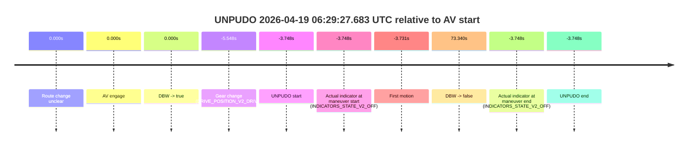
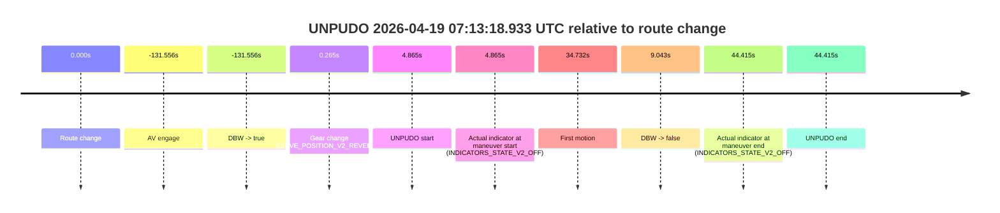

# Run Report: fme20038/2026-04-19--06-04-55--gen2-av-774b49b6-3018-4b70-878d-1dd92b6062a5

| Field | Value |
|---|---|
| Run ID | `fme20038/2026-04-19--06-04-55--gen2-av-774b49b6-3018-4b70-878d-1dd92b6062a5` |
| Date | `2026-04-19` |
| Model(s) | `plum-timeless-beaver` |
| Author | `peng.tang` |
| Event count | `17` |

## unpudo 2026-04-19 06:16:48.983 UTC

| Field | Value |
|---|---|
| Model | `plum-timeless-beaver` |
| Author | `peng.tang` |
| Run ID | `fme20038/2026-04-19--06-04-55--gen2-av-774b49b6-3018-4b70-878d-1dd92b6062a5` |
| Date | `2026-04-19` |
| Time (UTC) | `06:16:48.983` |
| Event type | `unpudo` |
| Disengagement type | `none observed` |
| Route change | `found` |
| Console | [run](https://console.sso.wayve.ai/run/fme20038/2026-04-19--06-04-55--gen2-av-774b49b6-3018-4b70-878d-1dd92b6062a5?id=&time-unixus=1776579408983304) |
| Foxglove | [segment](https://app.foxglove.dev/wayve-on-prem/p/prj_0dX18KZdVHg1fmmI/view?ds=foxglove-stream&ds.deviceName=fme20038&ds.start=2026-04-19T06%3A15%3A44.968310Z&ds.end=2026-04-19T06%3A19%3A44.330901Z&layoutId=lay_0e7VD4WIKDQGU73Y&time=2026-04-19T06%3A16%3A48.983304Z) |

### Event card: accidental

- Accidental: AV ownership is present for less than `2s`, so this is treated as an accidental brush with the maneuver rather than a meaningful model attempt.

| Event | Time (UTC) | Delta from route change |
|---|---:|---:|
| Route change | 2026-04-19 06:15:54.968 | `0.000s` |
| AV engage | 2026-04-19 06:16:54.590 | `59.623s` |
| DBW -> true | 2026-04-19 06:16:54.590 | `59.623s` |
| Gear change (DRIVE_POSITION_V2_DRIVE) | 2026-04-19 06:16:37.833 | `42.865s` |
| UNPUDO start | 2026-04-19 06:16:48.983 | `54.015s` |
| Actual indicator at maneuver start (INDICATORS_STATE_V2_OFF) | 2026-04-19 06:16:48.983 | `54.015s` |
| First motion | 2026-04-19 06:16:49.019 | `54.051s` |
| DBW -> false | 2026-04-19 06:19:34.330 | `219.363s` |
| Actual indicator at maneuver end (INDICATORS_STATE_V2_OFF) | 2026-04-19 06:16:52.083 | `57.115s` |
| UNPUDO end | 2026-04-19 06:16:52.083 | `57.115s` |

| Metric | Value |
|---|---|
| Outcome | `accidental` |
| Effective failure type | `none` |
| Route change status | `found` |
| DBW at event start | `false` |
| DBW at event end | `false` |
| Predicted gear at AV start | `DRIVE_POSITION_V2_DRIVE` |
| Actual gear at AV start | `DRIVE_POSITION_V2_DRIVE` |
| Predicted gear at event start | `DRIVE_POSITION_V2_DRIVE` |
| Actual gear at event start | `DRIVE_POSITION_V2_DRIVE` |
| Planned indicator direction | `INDICATORS_STATE_V2_RIGHT_ON` |
| Controller indicator direction | `INDICATORS_STATE_V2_RIGHT_ON` |
| Actual indicator direction | `INDICATORS_STATE_V2_OFF` |
| Actual indicator at maneuver end | `INDICATORS_STATE_V2_OFF` |
| Driver accel help in AV | `false` |
| Driver accel help timestamp | `n/a` |
| Max accel pedal pct in AV | `0.0%` |
| Max brake pedal pct in AV | `0.0%` |
| Max speed mps in AV | `0.000` |
| Route -> AV | `59.623s` |
| AV -> event start | `-5.608s` |
| AV -> first motion | `-5.571s` |
| AV duration before disengagement | `159.740s` |
| Trajectory waypoint count | `37` |
| Driving-plan step count | `11` |

The scored portion starts from the AV-owned window, not from the pre-AV setup. Route-change search in the stopped pre-event segment was `found`, with the baseline therefore set to route change. At the event anchor the model predicts `DRIVE_POSITION_V2_DRIVE` and the actual gear is `DRIVE_POSITION_V2_DRIVE`. The effective model outcome is `accidental` because `the AV-owned portion is shorter than 2s`.

### Resolution

| Field | Value |
|---|---|
| Final outcome | `accidental` |
| Do we agree with this label? | `yes` |
| Source disengagement type | `none observed` |
| Resolved effective failure type | `none` |
| Confidence | `high` |

## unpudo 2026-04-19 06:29:27.683 UTC

| Field | Value |
|---|---|
| Model | `plum-timeless-beaver` |
| Author | `peng.tang` |
| Run ID | `fme20038/2026-04-19--06-04-55--gen2-av-774b49b6-3018-4b70-878d-1dd92b6062a5` |
| Date | `2026-04-19` |
| Time (UTC) | `06:29:27.683` |
| Event type | `unpudo` |
| Disengagement type | `none observed` |
| Route change | `unclear` |
| Console | [run](https://console.sso.wayve.ai/run/fme20038/2026-04-19--06-04-55--gen2-av-774b49b6-3018-4b70-878d-1dd92b6062a5?id=&time-unixus=1776580167683299) |
| Foxglove | [segment](https://app.foxglove.dev/wayve-on-prem/p/prj_0dX18KZdVHg1fmmI/view?ds=foxglove-stream&ds.deviceName=fme20038&ds.start=2026-04-19T06%3A29%3A15.883307Z&ds.end=2026-04-19T06%3A30%3A54.771001Z&layoutId=lay_0e7VD4WIKDQGU73Y&time=2026-04-19T06%3A29%3A27.683299Z) |

### Event card: accidental

- Accidental: AV ownership is present for less than `2s`, so this is treated as an accidental brush with the maneuver rather than a meaningful model attempt.

| Event | Time (UTC) | Delta from AV start |
|---|---:|---:|
| Route change unclear | 2026-04-19 06:29:31.431 | `0.000s` |
| AV engage | 2026-04-19 06:29:31.431 | `0.000s` |
| DBW -> true | 2026-04-19 06:29:31.431 | `0.000s` |
| Gear change (DRIVE_POSITION_V2_DRIVE) | 2026-04-19 06:29:25.883 | `-5.548s` |
| UNPUDO start | 2026-04-19 06:29:27.683 | `-3.748s` |
| Actual indicator at maneuver start (INDICATORS_STATE_V2_OFF) | 2026-04-19 06:29:27.683 | `-3.748s` |
| First motion | 2026-04-19 06:29:27.700 | `-3.731s` |
| DBW -> false | 2026-04-19 06:30:44.771 | `73.340s` |
| Actual indicator at maneuver end (INDICATORS_STATE_V2_OFF) | 2026-04-19 06:29:27.683 | `-3.748s` |
| UNPUDO end | 2026-04-19 06:29:27.683 | `-3.748s` |

| Metric | Value |
|---|---|
| Outcome | `accidental` |
| Effective failure type | `none` |
| Route change status | `unclear` |
| DBW at event start | `false` |
| DBW at event end | `false` |
| Predicted gear at AV start | `DRIVE_POSITION_V2_PARK` |
| Actual gear at AV start | `DRIVE_POSITION_V2_DRIVE` |
| Predicted gear at event start | `DRIVE_POSITION_V2_DRIVE` |
| Actual gear at event start | `DRIVE_POSITION_V2_DRIVE` |
| Planned indicator direction | `INDICATORS_STATE_V2_OFF` |
| Controller indicator direction | `INDICATORS_STATE_V2_OFF` |
| Actual indicator direction | `INDICATORS_STATE_V2_OFF` |
| Actual indicator at maneuver end | `INDICATORS_STATE_V2_OFF` |
| Driver accel help in AV | `false` |
| Driver accel help timestamp | `n/a` |
| Max accel pedal pct in AV | `0.0%` |
| Max brake pedal pct in AV | `0.0%` |
| Max speed mps in AV | `0.000` |
| Route -> AV | `n/a` |
| AV -> event start | `-3.748s` |
| AV -> first motion | `-3.731s` |
| AV duration before disengagement | `73.340s` |
| Trajectory waypoint count | `37` |
| Driving-plan step count | `11` |

The scored portion starts from the AV-owned window, not from the pre-AV setup. Route-change search in the stopped pre-event segment was `unclear`, with the baseline therefore set to AV start. At the event anchor the model predicts `DRIVE_POSITION_V2_DRIVE` and the actual gear is `DRIVE_POSITION_V2_DRIVE`. The effective model outcome is `accidental` because `the AV-owned portion is shorter than 2s`.

### Resolution

| Field | Value |
|---|---|
| Final outcome | `accidental` |
| Do we agree with this label? | `yes` |
| Source disengagement type | `none observed` |
| Resolved effective failure type | `none` |
| Confidence | `medium` |

## unpudo 2026-04-19 06:33:35.433 UTC

| Field | Value |
|---|---|
| Model | `plum-timeless-beaver` |
| Author | `peng.tang` |
| Run ID | `fme20038/2026-04-19--06-04-55--gen2-av-774b49b6-3018-4b70-878d-1dd92b6062a5` |
| Date | `2026-04-19` |
| Time (UTC) | `06:33:35.433` |
| Event type | `unpudo` |
| Disengagement type | `none observed` |
| Route change | `unclear` |
| Console | [run](https://console.sso.wayve.ai/run/fme20038/2026-04-19--06-04-55--gen2-av-774b49b6-3018-4b70-878d-1dd92b6062a5?id=&time-unixus=1776580415433311) |
| Foxglove | [segment](https://app.foxglove.dev/wayve-on-prem/p/prj_0dX18KZdVHg1fmmI/view?ds=foxglove-stream&ds.deviceName=fme20038&ds.start=2026-04-19T06%3A33%3A17.033304Z&ds.end=2026-04-19T06%3A45%3A21.711293Z&layoutId=lay_0e7VD4WIKDQGU73Y&time=2026-04-19T06%3A33%3A35.433311Z) |

### Event card: accidental

- Accidental: AV ownership is present for less than `2s`, so this is treated as an accidental brush with the maneuver rather than a meaningful model attempt.

| Event | Time (UTC) | Delta from AV start |
|---|---:|---:|
| Route change unclear | 2026-04-19 06:33:41.032 | `0.000s` |
| AV engage | 2026-04-19 06:33:41.032 | `0.000s` |
| DBW -> true | 2026-04-19 06:33:41.032 | `0.000s` |
| Gear change (DRIVE_POSITION_V2_DRIVE) | 2026-04-19 06:33:27.033 | `-13.999s` |
| UNPUDO start | 2026-04-19 06:33:35.433 | `-5.599s` |
| Actual indicator at maneuver start (INDICATORS_STATE_V2_RIGHT_ON) | 2026-04-19 06:33:35.433 | `-5.599s` |
| First motion | 2026-04-19 06:33:35.479 | `-5.552s` |
| DBW -> false | 2026-04-19 06:45:11.711 | `690.679s` |
| Actual indicator at maneuver end (INDICATORS_STATE_V2_OFF) | 2026-04-19 06:33:39.683 | `-1.349s` |
| UNPUDO end | 2026-04-19 06:33:39.683 | `-1.349s` |

| Metric | Value |
|---|---|
| Outcome | `accidental` |
| Effective failure type | `none` |
| Route change status | `unclear` |
| DBW at event start | `false` |
| DBW at event end | `false` |
| Predicted gear at AV start | `DRIVE_POSITION_V2_DRIVE` |
| Actual gear at AV start | `DRIVE_POSITION_V2_DRIVE` |
| Predicted gear at event start | `DRIVE_POSITION_V2_DRIVE` |
| Actual gear at event start | `DRIVE_POSITION_V2_DRIVE` |
| Planned indicator direction | `INDICATORS_STATE_V2_RIGHT_ON` |
| Controller indicator direction | `INDICATORS_STATE_V2_RIGHT_ON` |
| Actual indicator direction | `INDICATORS_STATE_V2_RIGHT_ON` |
| Actual indicator at maneuver end | `INDICATORS_STATE_V2_OFF` |
| Driver accel help in AV | `false` |
| Driver accel help timestamp | `n/a` |
| Max accel pedal pct in AV | `0.0%` |
| Max brake pedal pct in AV | `0.0%` |
| Max speed mps in AV | `0.000` |
| Route -> AV | `n/a` |
| AV -> event start | `-5.599s` |
| AV -> first motion | `-5.552s` |
| AV duration before disengagement | `690.679s` |
| Trajectory waypoint count | `36` |
| Driving-plan step count | `11` |

The scored portion starts from the AV-owned window, not from the pre-AV setup. Route-change search in the stopped pre-event segment was `unclear`, with the baseline therefore set to AV start. At the event anchor the model predicts `DRIVE_POSITION_V2_DRIVE` and the actual gear is `DRIVE_POSITION_V2_DRIVE`. The effective model outcome is `accidental` because `the AV-owned portion is shorter than 2s`.

### Resolution

| Field | Value |
|---|---|
| Final outcome | `accidental` |
| Do we agree with this label? | `yes` |
| Source disengagement type | `none observed` |
| Resolved effective failure type | `none` |
| Confidence | `medium` |

## unpudo 2026-04-19 06:37:42.233 UTC

| Field | Value |
|---|---|
| Model | `plum-timeless-beaver` |
| Author | `peng.tang` |
| Run ID | `fme20038/2026-04-19--06-04-55--gen2-av-774b49b6-3018-4b70-878d-1dd92b6062a5` |
| Date | `2026-04-19` |
| Time (UTC) | `06:37:42.233` |
| Event type | `unpudo` |
| Disengagement type | `none observed` |
| Route change | `found` |
| Console | [run](https://console.sso.wayve.ai/run/fme20038/2026-04-19--06-04-55--gen2-av-774b49b6-3018-4b70-878d-1dd92b6062a5?id=&time-unixus=1776580662233308) |
| Foxglove | [segment](https://app.foxglove.dev/wayve-on-prem/p/prj_0dX18KZdVHg1fmmI/view?ds=foxglove-stream&ds.deviceName=fme20038&ds.start=2026-04-19T06%3A33%3A31.032218Z&ds.end=2026-04-19T06%3A45%3A21.711293Z&layoutId=lay_0e7VD4WIKDQGU73Y&time=2026-04-19T06%3A37%3A42.233308Z) |

### Event card: pass

- Pass: AV owns the credited unpudo through the official event window, the gear state is aligned at the anchor, and the vehicle moves without driver accelerator help in AV.

| Event | Time (UTC) | Delta from route change |
|---|---:|---:|
| Route change | 2026-04-19 06:37:33.618 | `0.000s` |
| AV engage | 2026-04-19 06:33:41.032 | `-232.586s` |
| DBW -> true | 2026-04-19 06:33:41.032 | `-232.586s` |
| Gear change (DRIVE_POSITION_V2_DRIVE) | 2026-04-19 06:37:26.333 | `-7.285s` |
| UNPUDO start | 2026-04-19 06:37:42.233 | `8.615s` |
| Actual indicator at maneuver start (INDICATORS_STATE_V2_OFF) | 2026-04-19 06:37:42.233 | `8.615s` |
| First motion | 2026-04-19 06:37:42.340 | `8.722s` |
| DBW -> false | 2026-04-19 06:45:11.711 | `458.093s` |
| Actual indicator at maneuver end (INDICATORS_STATE_V2_OFF) | 2026-04-19 06:37:46.583 | `12.965s` |
| UNPUDO end | 2026-04-19 06:37:46.583 | `12.965s` |

| Metric | Value |
|---|---|
| Outcome | `pass` |
| Effective failure type | `none` |
| Route change status | `found` |
| DBW at event start | `true` |
| DBW at event end | `true` |
| Predicted gear at AV start | `DRIVE_POSITION_V2_DRIVE` |
| Actual gear at AV start | `DRIVE_POSITION_V2_DRIVE` |
| Predicted gear at event start | `DRIVE_POSITION_V2_DRIVE` |
| Actual gear at event start | `DRIVE_POSITION_V2_DRIVE` |
| Planned indicator direction | `INDICATORS_STATE_V2_RIGHT_ON` |
| Controller indicator direction | `INDICATORS_STATE_V2_RIGHT_ON` |
| Actual indicator direction | `INDICATORS_STATE_V2_OFF` |
| Actual indicator at maneuver end | `INDICATORS_STATE_V2_OFF` |
| Driver accel help in AV | `false` |
| Driver accel help timestamp | `n/a` |
| Max accel pedal pct in AV | `0.0%` |
| Max brake pedal pct in AV | `14.6%` |
| Max speed mps in AV | `8.347` |
| Route -> AV | `-232.586s` |
| AV -> event start | `241.201s` |
| AV -> first motion | `241.308s` |
| AV duration before disengagement | `690.679s` |
| Trajectory waypoint count | `38` |
| Driving-plan step count | `11` |

The scored portion starts from the AV-owned window, not from the pre-AV setup. Route-change search in the stopped pre-event segment was `found`, with the baseline therefore set to route change. At the event anchor the model predicts `DRIVE_POSITION_V2_DRIVE` and the actual gear is `DRIVE_POSITION_V2_DRIVE`. The effective model outcome is `pass` because `the credited maneuver stays AV-owned through the official event end`.

### Resolution

| Field | Value |
|---|---|
| Final outcome | `pass` |
| Do we agree with this label? | `yes` |
| Source disengagement type | `none observed` |
| Resolved effective failure type | `none` |
| Confidence | `high` |

## unpudo 2026-04-19 06:45:12.833 UTC

| Field | Value |
|---|---|
| Model | `plum-timeless-beaver` |
| Author | `peng.tang` |
| Run ID | `fme20038/2026-04-19--06-04-55--gen2-av-774b49b6-3018-4b70-878d-1dd92b6062a5` |
| Date | `2026-04-19` |
| Time (UTC) | `06:45:12.833` |
| Event type | `unpudo` |
| Disengagement type | `none observed` |
| Route change | `unclear` |
| Console | [run](https://console.sso.wayve.ai/run/fme20038/2026-04-19--06-04-55--gen2-av-774b49b6-3018-4b70-878d-1dd92b6062a5?id=&time-unixus=1776581112833306) |
| Foxglove | [segment](https://app.foxglove.dev/wayve-on-prem/p/prj_0dX18KZdVHg1fmmI/view?ds=foxglove-stream&ds.deviceName=fme20038&ds.start=2026-04-19T06%3A44%3A54.733301Z&ds.end=2026-04-19T06%3A47%3A36.452217Z&layoutId=lay_0e7VD4WIKDQGU73Y&time=2026-04-19T06%3A45%3A12.833306Z) |

### Event card: non-av

- Non-AV: the detected unpudo starts outside AV ownership, so it is kept for coverage but excluded from model success / failure scoring.

| Event | Time (UTC) | Delta from AV start |
|---|---:|---:|
| Route change unclear | 2026-04-19 06:45:37.791 | `0.000s` |
| AV engage | 2026-04-19 06:45:37.791 | `0.000s` |
| DBW -> true | 2026-04-19 06:45:37.791 | `0.000s` |
| Gear change (DRIVE_POSITION_V2_REVERSE) | 2026-04-19 06:45:04.733 | `-33.058s` |
| UNPUDO start | 2026-04-19 06:45:12.833 | `-24.958s` |
| Actual indicator at maneuver start (INDICATORS_STATE_V2_OFF) | 2026-04-19 06:45:12.833 | `-24.958s` |
| First motion | 2026-04-19 06:45:52.119 | `14.329s` |
| DBW -> false | 2026-04-19 06:47:26.452 | `108.661s` |
| Actual indicator at maneuver end (INDICATORS_STATE_V2_OFF) | 2026-04-19 06:45:56.533 | `18.742s` |
| UNPUDO end | 2026-04-19 06:45:56.533 | `18.742s` |

| Metric | Value |
|---|---|
| Outcome | `non-av` |
| Effective failure type | `none` |
| Route change status | `unclear` |
| DBW at event start | `false` |
| DBW at event end | `true` |
| Predicted gear at AV start | `DRIVE_POSITION_V2_PARK` |
| Actual gear at AV start | `DRIVE_POSITION_V2_PARK` |
| Predicted gear at event start | `DRIVE_POSITION_V2_PARK` |
| Actual gear at event start | `DRIVE_POSITION_V2_REVERSE` |
| Planned indicator direction | `INDICATORS_STATE_V2_OFF` |
| Controller indicator direction | `INDICATORS_STATE_V2_OFF` |
| Actual indicator direction | `INDICATORS_STATE_V2_OFF` |
| Actual indicator at maneuver end | `INDICATORS_STATE_V2_OFF` |
| Driver accel help in AV | `false` |
| Driver accel help timestamp | `n/a` |
| Max accel pedal pct in AV | `0.0%` |
| Max brake pedal pct in AV | `8.0%` |
| Max speed mps in AV | `3.711` |
| Route -> AV | `n/a` |
| AV -> event start | `-24.958s` |
| AV -> first motion | `14.329s` |
| AV duration before disengagement | `108.661s` |
| Trajectory waypoint count | `36` |
| Driving-plan step count | `11` |

The scored portion starts from the AV-owned window, not from the pre-AV setup. Route-change search in the stopped pre-event segment was `unclear`, with the baseline therefore set to AV start. At the event anchor the model predicts `DRIVE_POSITION_V2_PARK` and the actual gear is `DRIVE_POSITION_V2_REVERSE`. The effective model outcome is `non-av` because `the event does not begin in AV ownership`.

### Resolution

| Field | Value |
|---|---|
| Final outcome | `non-av` |
| Do we agree with this label? | `yes` |
| Source disengagement type | `none observed` |
| Resolved effective failure type | `none` |
| Confidence | `medium` |

## unpudo 2026-04-19 06:48:18.283 UTC

| Field | Value |
|---|---|
| Model | `plum-timeless-beaver` |
| Author | `peng.tang` |
| Run ID | `fme20038/2026-04-19--06-04-55--gen2-av-774b49b6-3018-4b70-878d-1dd92b6062a5` |
| Date | `2026-04-19` |
| Time (UTC) | `06:48:18.283` |
| Event type | `unpudo` |
| Disengagement type | `none observed` |
| Route change | `found` |
| Console | [run](https://console.sso.wayve.ai/run/fme20038/2026-04-19--06-04-55--gen2-av-774b49b6-3018-4b70-878d-1dd92b6062a5?id=&time-unixus=1776581298283319) |
| Foxglove | [segment](https://app.foxglove.dev/wayve-on-prem/p/prj_0dX18KZdVHg1fmmI/view?ds=foxglove-stream&ds.deviceName=fme20038&ds.start=2026-04-19T06%3A47%3A58.791080Z&ds.end=2026-04-19T06%3A52%3A45.691805Z&layoutId=lay_0e7VD4WIKDQGU73Y&time=2026-04-19T06%3A48%3A18.283319Z) |

### Event card: pass

- Pass: AV owns the credited unpudo through the official event window, the gear state is aligned at the anchor, and the vehicle moves without driver accelerator help in AV.

| Event | Time (UTC) | Delta from route change |
|---|---:|---:|
| Route change | 2026-04-19 06:48:11.118 | `0.000s` |
| AV engage | 2026-04-19 06:48:08.791 | `-2.327s` |
| DBW -> true | 2026-04-19 06:48:08.791 | `-2.327s` |
| Gear change (DRIVE_POSITION_V2_DRIVE) | 2026-04-19 06:48:11.433 | `0.315s` |
| UNPUDO start | 2026-04-19 06:48:18.283 | `7.165s` |
| Actual indicator at maneuver start (INDICATORS_STATE_V2_RIGHT_ON) | 2026-04-19 06:48:18.283 | `7.165s` |
| First motion | 2026-04-19 06:48:18.379 | `7.262s` |
| DBW -> false | 2026-04-19 06:52:35.691 | `264.574s` |
| Actual indicator at maneuver end (INDICATORS_STATE_V2_OFF) | 2026-04-19 06:48:22.783 | `11.665s` |
| UNPUDO end | 2026-04-19 06:48:22.783 | `11.665s` |

| Metric | Value |
|---|---|
| Outcome | `pass` |
| Effective failure type | `none` |
| Route change status | `found` |
| DBW at event start | `true` |
| DBW at event end | `true` |
| Predicted gear at AV start | `DRIVE_POSITION_V2_PARK` |
| Actual gear at AV start | `DRIVE_POSITION_V2_PARK` |
| Predicted gear at event start | `DRIVE_POSITION_V2_DRIVE` |
| Actual gear at event start | `DRIVE_POSITION_V2_DRIVE` |
| Planned indicator direction | `INDICATORS_STATE_V2_RIGHT_ON` |
| Controller indicator direction | `INDICATORS_STATE_V2_RIGHT_ON` |
| Actual indicator direction | `INDICATORS_STATE_V2_RIGHT_ON` |
| Actual indicator at maneuver end | `INDICATORS_STATE_V2_OFF` |
| Driver accel help in AV | `false` |
| Driver accel help timestamp | `n/a` |
| Max accel pedal pct in AV | `0.0%` |
| Max brake pedal pct in AV | `8.0%` |
| Max speed mps in AV | `4.789` |
| Route -> AV | `-2.327s` |
| AV -> event start | `9.492s` |
| AV -> first motion | `9.589s` |
| AV duration before disengagement | `266.901s` |
| Trajectory waypoint count | `37` |
| Driving-plan step count | `11` |

The scored portion starts from the AV-owned window, not from the pre-AV setup. Route-change search in the stopped pre-event segment was `found`, with the baseline therefore set to route change. At the event anchor the model predicts `DRIVE_POSITION_V2_DRIVE` and the actual gear is `DRIVE_POSITION_V2_DRIVE`. The effective model outcome is `pass` because `the credited maneuver stays AV-owned through the official event end`.

### Resolution

| Field | Value |
|---|---|
| Final outcome | `pass` |
| Do we agree with this label? | `yes` |
| Source disengagement type | `none observed` |
| Resolved effective failure type | `none` |
| Confidence | `high` |

## unpudo 2026-04-19 06:53:11.833 UTC

| Field | Value |
|---|---|
| Model | `plum-timeless-beaver` |
| Author | `peng.tang` |
| Run ID | `fme20038/2026-04-19--06-04-55--gen2-av-774b49b6-3018-4b70-878d-1dd92b6062a5` |
| Date | `2026-04-19` |
| Time (UTC) | `06:53:11.833` |
| Event type | `unpudo` |
| Disengagement type | `none observed` |
| Route change | `found` |
| Console | [run](https://console.sso.wayve.ai/run/fme20038/2026-04-19--06-04-55--gen2-av-774b49b6-3018-4b70-878d-1dd92b6062a5?id=&time-unixus=1776581591833299) |
| Foxglove | [segment](https://app.foxglove.dev/wayve-on-prem/p/prj_0dX18KZdVHg1fmmI/view?ds=foxglove-stream&ds.deviceName=fme20038&ds.start=2026-04-19T06%3A52%3A46.668328Z&ds.end=2026-04-19T07%3A02%3A10.370871Z&layoutId=lay_0e7VD4WIKDQGU73Y&time=2026-04-19T06%3A53%3A11.833299Z) |

### Event card: non-av

- Non-AV: the detected unpudo starts outside AV ownership, so it is kept for coverage but excluded from model success / failure scoring.

| Event | Time (UTC) | Delta from route change |
|---|---:|---:|
| Route change | 2026-04-19 06:52:56.668 | `0.000s` |
| AV engage | 2026-04-19 06:53:26.251 | `29.583s` |
| DBW -> true | 2026-04-19 06:53:26.251 | `29.583s` |
| Gear change (DRIVE_POSITION_V2_DRIVE) | 2026-04-19 06:52:59.333 | `2.665s` |
| UNPUDO start | 2026-04-19 06:53:11.833 | `15.165s` |
| Actual indicator at maneuver start (INDICATORS_STATE_V2_RIGHT_ON) | 2026-04-19 06:53:11.833 | `15.165s` |
| First motion | 2026-04-19 06:53:11.980 | `15.312s` |
| DBW -> false | 2026-04-19 07:02:00.370 | `543.703s` |
| Actual indicator at maneuver end (INDICATORS_STATE_V2_OFF) | 2026-04-19 06:53:37.933 | `41.265s` |
| UNPUDO end | 2026-04-19 06:53:37.933 | `41.265s` |

| Metric | Value |
|---|---|
| Outcome | `non-av` |
| Effective failure type | `none` |
| Route change status | `found` |
| DBW at event start | `false` |
| DBW at event end | `true` |
| Predicted gear at AV start | `DRIVE_POSITION_V2_DRIVE` |
| Actual gear at AV start | `DRIVE_POSITION_V2_DRIVE` |
| Predicted gear at event start | `DRIVE_POSITION_V2_DRIVE` |
| Actual gear at event start | `DRIVE_POSITION_V2_DRIVE` |
| Planned indicator direction | `INDICATORS_STATE_V2_RIGHT_ON` |
| Controller indicator direction | `INDICATORS_STATE_V2_RIGHT_ON` |
| Actual indicator direction | `INDICATORS_STATE_V2_RIGHT_ON` |
| Actual indicator at maneuver end | `INDICATORS_STATE_V2_OFF` |
| Driver accel help in AV | `false` |
| Driver accel help timestamp | `n/a` |
| Max accel pedal pct in AV | `0.0%` |
| Max brake pedal pct in AV | `8.0%` |
| Max speed mps in AV | `4.431` |
| Route -> AV | `29.583s` |
| AV -> event start | `-14.418s` |
| AV -> first motion | `-14.272s` |
| AV duration before disengagement | `514.119s` |
| Trajectory waypoint count | `36` |
| Driving-plan step count | `11` |

The scored portion starts from the AV-owned window, not from the pre-AV setup. Route-change search in the stopped pre-event segment was `found`, with the baseline therefore set to route change. At the event anchor the model predicts `DRIVE_POSITION_V2_DRIVE` and the actual gear is `DRIVE_POSITION_V2_DRIVE`. The effective model outcome is `non-av` because `the event does not begin in AV ownership`.

### Resolution

| Field | Value |
|---|---|
| Final outcome | `non-av` |
| Do we agree with this label? | `yes` |
| Source disengagement type | `none observed` |
| Resolved effective failure type | `none` |
| Confidence | `high` |

## unpudo 2026-04-19 06:58:12.083 UTC

| Field | Value |
|---|---|
| Model | `plum-timeless-beaver` |
| Author | `peng.tang` |
| Run ID | `fme20038/2026-04-19--06-04-55--gen2-av-774b49b6-3018-4b70-878d-1dd92b6062a5` |
| Date | `2026-04-19` |
| Time (UTC) | `06:58:12.083` |
| Event type | `unpudo` |
| Disengagement type | `none observed` |
| Route change | `found` |
| Console | [run](https://console.sso.wayve.ai/run/fme20038/2026-04-19--06-04-55--gen2-av-774b49b6-3018-4b70-878d-1dd92b6062a5?id=&time-unixus=1776581892083301) |
| Foxglove | [segment](https://app.foxglove.dev/wayve-on-prem/p/prj_0dX18KZdVHg1fmmI/view?ds=foxglove-stream&ds.deviceName=fme20038&ds.start=2026-04-19T06%3A53%3A16.251729Z&ds.end=2026-04-19T07%3A02%3A10.370871Z&layoutId=lay_0e7VD4WIKDQGU73Y&time=2026-04-19T06%3A58%3A12.083301Z) |

### Event card: pass

- Pass: AV owns the credited unpudo through the official event window, the gear state is aligned at the anchor, and the vehicle moves without driver accelerator help in AV.

| Event | Time (UTC) | Delta from route change |
|---|---:|---:|
| Route change | 2026-04-19 06:58:04.268 | `0.000s` |
| AV engage | 2026-04-19 06:53:26.251 | `-278.017s` |
| DBW -> true | 2026-04-19 06:53:26.251 | `-278.017s` |
| Gear change (DRIVE_POSITION_V2_DRIVE) | 2026-04-19 06:57:55.933 | `-8.335s` |
| UNPUDO start | 2026-04-19 06:58:12.083 | `7.815s` |
| Actual indicator at maneuver start (INDICATORS_STATE_V2_OFF) | 2026-04-19 06:58:12.083 | `7.815s` |
| First motion | 2026-04-19 06:58:12.159 | `7.891s` |
| DBW -> false | 2026-04-19 07:02:00.370 | `236.103s` |
| Actual indicator at maneuver end (INDICATORS_STATE_V2_OFF) | 2026-04-19 06:58:16.083 | `11.815s` |
| UNPUDO end | 2026-04-19 06:58:16.083 | `11.815s` |

| Metric | Value |
|---|---|
| Outcome | `pass` |
| Effective failure type | `none` |
| Route change status | `found` |
| DBW at event start | `true` |
| DBW at event end | `true` |
| Predicted gear at AV start | `DRIVE_POSITION_V2_DRIVE` |
| Actual gear at AV start | `DRIVE_POSITION_V2_DRIVE` |
| Predicted gear at event start | `DRIVE_POSITION_V2_DRIVE` |
| Actual gear at event start | `DRIVE_POSITION_V2_DRIVE` |
| Planned indicator direction | `INDICATORS_STATE_V2_RIGHT_ON` |
| Controller indicator direction | `INDICATORS_STATE_V2_RIGHT_ON` |
| Actual indicator direction | `INDICATORS_STATE_V2_OFF` |
| Actual indicator at maneuver end | `INDICATORS_STATE_V2_OFF` |
| Driver accel help in AV | `false` |
| Driver accel help timestamp | `n/a` |
| Max accel pedal pct in AV | `0.0%` |
| Max brake pedal pct in AV | `24.5%` |
| Max speed mps in AV | `8.167` |
| Route -> AV | `-278.017s` |
| AV -> event start | `285.832s` |
| AV -> first motion | `285.908s` |
| AV duration before disengagement | `514.119s` |
| Trajectory waypoint count | `37` |
| Driving-plan step count | `11` |

The scored portion starts from the AV-owned window, not from the pre-AV setup. Route-change search in the stopped pre-event segment was `found`, with the baseline therefore set to route change. At the event anchor the model predicts `DRIVE_POSITION_V2_DRIVE` and the actual gear is `DRIVE_POSITION_V2_DRIVE`. The effective model outcome is `pass` because `the credited maneuver stays AV-owned through the official event end`.

### Resolution

| Field | Value |
|---|---|
| Final outcome | `pass` |
| Do we agree with this label? | `yes` |
| Source disengagement type | `none observed` |
| Resolved effective failure type | `none` |
| Confidence | `high` |

## unpudo 2026-04-19 07:06:40.533 UTC

| Field | Value |
|---|---|
| Model | `plum-timeless-beaver` |
| Author | `peng.tang` |
| Run ID | `fme20038/2026-04-19--06-04-55--gen2-av-774b49b6-3018-4b70-878d-1dd92b6062a5` |
| Date | `2026-04-19` |
| Time (UTC) | `07:06:40.533` |
| Event type | `unpudo` |
| Disengagement type | `none observed` |
| Route change | `unclear` |
| Console | [run](https://console.sso.wayve.ai/run/fme20038/2026-04-19--06-04-55--gen2-av-774b49b6-3018-4b70-878d-1dd92b6062a5?id=&time-unixus=1776582400533294) |
| Foxglove | [segment](https://app.foxglove.dev/wayve-on-prem/p/prj_0dX18KZdVHg1fmmI/view?ds=foxglove-stream&ds.deviceName=fme20038&ds.start=2026-04-19T07%3A06%3A26.883306Z&ds.end=2026-04-19T07%3A07%3A24.383307Z&layoutId=lay_0e7VD4WIKDQGU73Y&time=2026-04-19T07%3A06%3A40.533294Z) |

### Event card: non-av

- Non-AV: the detected unpudo starts outside AV ownership, so it is kept for coverage but excluded from model success / failure scoring.

| Event | Time (UTC) | Delta from AV start |
|---|---:|---:|
| Route change unclear | 2026-04-19 07:06:55.311 | `0.000s` |
| AV engage | 2026-04-19 07:06:55.311 | `0.000s` |
| DBW -> true | 2026-04-19 07:06:55.311 | `0.000s` |
| Gear change (DRIVE_POSITION_V2_REVERSE) | 2026-04-19 07:06:36.883 | `-18.428s` |
| UNPUDO start | 2026-04-19 07:06:40.533 | `-14.778s` |
| Actual indicator at maneuver start (INDICATORS_STATE_V2_OFF) | 2026-04-19 07:06:40.533 | `-14.778s` |
| First motion | 2026-04-19 07:07:06.420 | `11.109s` |
| DBW -> false | 2026-04-19 07:07:06.371 | `11.060s` |
| Actual indicator at maneuver end (INDICATORS_STATE_V2_OFF) | 2026-04-19 07:07:14.383 | `19.072s` |
| UNPUDO end | 2026-04-19 07:07:14.383 | `19.072s` |

| Metric | Value |
|---|---|
| Outcome | `non-av` |
| Effective failure type | `none` |
| Route change status | `unclear` |
| DBW at event start | `false` |
| DBW at event end | `false` |
| Predicted gear at AV start | `DRIVE_POSITION_V2_PARK` |
| Actual gear at AV start | `DRIVE_POSITION_V2_PARK` |
| Predicted gear at event start | `DRIVE_POSITION_V2_REVERSE` |
| Actual gear at event start | `DRIVE_POSITION_V2_REVERSE` |
| Planned indicator direction | `INDICATORS_STATE_V2_OFF` |
| Controller indicator direction | `INDICATORS_STATE_V2_OFF` |
| Actual indicator direction | `INDICATORS_STATE_V2_OFF` |
| Actual indicator at maneuver end | `INDICATORS_STATE_V2_OFF` |
| Driver accel help in AV | `false` |
| Driver accel help timestamp | `n/a` |
| Max accel pedal pct in AV | `0.0%` |
| Max brake pedal pct in AV | `8.0%` |
| Max speed mps in AV | `0.086` |
| Route -> AV | `n/a` |
| AV -> event start | `-14.778s` |
| AV -> first motion | `11.109s` |
| AV duration before disengagement | `11.060s` |
| Trajectory waypoint count | `36` |
| Driving-plan step count | `11` |

The scored portion starts from the AV-owned window, not from the pre-AV setup. Route-change search in the stopped pre-event segment was `unclear`, with the baseline therefore set to AV start. At the event anchor the model predicts `DRIVE_POSITION_V2_REVERSE` and the actual gear is `DRIVE_POSITION_V2_REVERSE`. The effective model outcome is `non-av` because `the event does not begin in AV ownership`.

### Resolution

| Field | Value |
|---|---|
| Final outcome | `non-av` |
| Do we agree with this label? | `yes` |
| Source disengagement type | `none observed` |
| Resolved effective failure type | `none` |
| Confidence | `medium` |

## unpudo 2026-04-19 07:10:24.283 UTC

| Field | Value |
|---|---|
| Model | `plum-timeless-beaver` |
| Author | `peng.tang` |
| Run ID | `fme20038/2026-04-19--06-04-55--gen2-av-774b49b6-3018-4b70-878d-1dd92b6062a5` |
| Date | `2026-04-19` |
| Time (UTC) | `07:10:24.283` |
| Event type | `unpudo` |
| Disengagement type | `none observed` |
| Route change | `unclear` |
| Console | [run](https://console.sso.wayve.ai/run/fme20038/2026-04-19--06-04-55--gen2-av-774b49b6-3018-4b70-878d-1dd92b6062a5?id=&time-unixus=1776582624283298) |
| Foxglove | [segment](https://app.foxglove.dev/wayve-on-prem/p/prj_0dX18KZdVHg1fmmI/view?ds=foxglove-stream&ds.deviceName=fme20038&ds.start=2026-04-19T07%3A10%3A02.251103Z&ds.end=2026-04-19T07%3A11%3A06.172158Z&layoutId=lay_0e7VD4WIKDQGU73Y&time=2026-04-19T07%3A10%3A24.283298Z) |

### Event card: fail

- Fail: AV owns part of the segment, but the event still resolves as a model-performance failure under the AV-only scoring rule.

| Event | Time (UTC) | Delta from AV start |
|---|---:|---:|
| Route change unclear | 2026-04-19 07:10:12.251 | `0.000s` |
| AV engage | 2026-04-19 07:10:12.251 | `0.000s` |
| DBW -> true | 2026-04-19 07:10:12.251 | `0.000s` |
| Gear change (DRIVE_POSITION_V2_PARK) | 2026-04-19 07:10:14.033 | `1.782s` |
| UNPUDO start | 2026-04-19 07:10:24.283 | `12.032s` |
| Actual indicator at maneuver start (INDICATORS_STATE_V2_OFF) | 2026-04-19 07:10:24.283 | `12.032s` |
| First motion | 2026-04-19 07:10:57.040 | `44.789s` |
| DBW -> false | 2026-04-19 07:10:56.172 | `43.921s` |
| Actual indicator at maneuver end (INDICATORS_STATE_V2_OFF) | 2026-04-19 07:10:24.283 | `12.032s` |
| UNPUDO end | 2026-04-19 07:10:24.283 | `12.032s` |

| Metric | Value |
|---|---|
| Outcome | `fail` |
| Effective failure type | `unknown_needs_review` |
| Route change status | `unclear` |
| DBW at event start | `true` |
| DBW at event end | `true` |
| Predicted gear at AV start | `DRIVE_POSITION_V2_PARK` |
| Actual gear at AV start | `DRIVE_POSITION_V2_DRIVE` |
| Predicted gear at event start | `DRIVE_POSITION_V2_PARK` |
| Actual gear at event start | `DRIVE_POSITION_V2_PARK` |
| Planned indicator direction | `INDICATORS_STATE_V2_OFF` |
| Controller indicator direction | `INDICATORS_STATE_V2_OFF` |
| Actual indicator direction | `INDICATORS_STATE_V2_OFF` |
| Actual indicator at maneuver end | `INDICATORS_STATE_V2_OFF` |
| Driver accel help in AV | `false` |
| Driver accel help timestamp | `n/a` |
| Max accel pedal pct in AV | `0.0%` |
| Max brake pedal pct in AV | `8.0%` |
| Max speed mps in AV | `0.000` |
| Route -> AV | `n/a` |
| AV -> event start | `12.032s` |
| AV -> first motion | `44.789s` |
| AV duration before disengagement | `43.921s` |
| Trajectory waypoint count | `37` |
| Driving-plan step count | `11` |

The scored portion starts from the AV-owned window, not from the pre-AV setup. Route-change search in the stopped pre-event segment was `unclear`, with the baseline therefore set to AV start. At the event anchor the model predicts `DRIVE_POSITION_V2_PARK` and the actual gear is `DRIVE_POSITION_V2_PARK`. The effective model outcome is `fail` because `unknown_needs_review`.

### Resolution

| Field | Value |
|---|---|
| Final outcome | `fail` |
| Do we agree with this label? | `yes` |
| Source disengagement type | `none observed` |
| Resolved effective failure type | `unknown_needs_review` |
| Confidence | `medium` |

## unpudo 2026-04-19 07:13:18.933 UTC

| Field | Value |
|---|---|
| Model | `plum-timeless-beaver` |
| Author | `peng.tang` |
| Run ID | `fme20038/2026-04-19--06-04-55--gen2-av-774b49b6-3018-4b70-878d-1dd92b6062a5` |
| Date | `2026-04-19` |
| Time (UTC) | `07:13:18.933` |
| Event type | `unpudo` |
| Disengagement type | `none observed` |
| Route change | `found` |
| Console | [run](https://console.sso.wayve.ai/run/fme20038/2026-04-19--06-04-55--gen2-av-774b49b6-3018-4b70-878d-1dd92b6062a5?id=&time-unixus=1776582798933296) |
| Foxglove | [segment](https://app.foxglove.dev/wayve-on-prem/p/prj_0dX18KZdVHg1fmmI/view?ds=foxglove-stream&ds.deviceName=fme20038&ds.start=2026-04-19T07%3A10%3A52.512145Z&ds.end=2026-04-19T07%3A14%3A08.483305Z&layoutId=lay_0e7VD4WIKDQGU73Y&time=2026-04-19T07%3A13%3A18.933296Z) |

### Event card: fail

- Fail: the credited unpudo does not stay AV-owned. The event window starts with DBW true, and the maneuver outcome lands outside a clean AV-owned segment.

| Event | Time (UTC) | Delta from route change |
|---|---:|---:|
| Route change | 2026-04-19 07:13:14.068 | `0.000s` |
| AV engage | 2026-04-19 07:11:02.512 | `-131.556s` |
| DBW -> true | 2026-04-19 07:11:02.512 | `-131.556s` |
| Gear change (DRIVE_POSITION_V2_REVERSE) | 2026-04-19 07:13:14.333 | `0.265s` |
| UNPUDO start | 2026-04-19 07:13:18.933 | `4.865s` |
| Actual indicator at maneuver start (INDICATORS_STATE_V2_OFF) | 2026-04-19 07:13:18.933 | `4.865s` |
| First motion | 2026-04-19 07:13:48.799 | `34.732s` |
| DBW -> false | 2026-04-19 07:13:23.111 | `9.043s` |
| Actual indicator at maneuver end (INDICATORS_STATE_V2_OFF) | 2026-04-19 07:13:58.483 | `44.415s` |
| UNPUDO end | 2026-04-19 07:13:58.483 | `44.415s` |

| Metric | Value |
|---|---|
| Outcome | `fail` |
| Effective failure type | `driver_completed_maneuver` |
| Route change status | `found` |
| DBW at event start | `true` |
| DBW at event end | `true` |
| Predicted gear at AV start | `DRIVE_POSITION_V2_DRIVE` |
| Actual gear at AV start | `DRIVE_POSITION_V2_DRIVE` |
| Predicted gear at event start | `DRIVE_POSITION_V2_REVERSE` |
| Actual gear at event start | `DRIVE_POSITION_V2_REVERSE` |
| Planned indicator direction | `INDICATORS_STATE_V2_OFF` |
| Controller indicator direction | `INDICATORS_STATE_V2_OFF` |
| Actual indicator direction | `INDICATORS_STATE_V2_OFF` |
| Actual indicator at maneuver end | `INDICATORS_STATE_V2_OFF` |
| Driver accel help in AV | `false` |
| Driver accel help timestamp | `n/a` |
| Max accel pedal pct in AV | `0.0%` |
| Max brake pedal pct in AV | `21.0%` |
| Max speed mps in AV | `7.331` |
| Route -> AV | `-131.556s` |
| AV -> event start | `136.421s` |
| AV -> first motion | `166.288s` |
| AV duration before disengagement | `140.599s` |
| Trajectory waypoint count | `36` |
| Driving-plan step count | `11` |

The scored portion starts from the AV-owned window, not from the pre-AV setup. Route-change search in the stopped pre-event segment was `found`, with the baseline therefore set to route change. At the event anchor the model predicts `DRIVE_POSITION_V2_REVERSE` and the actual gear is `DRIVE_POSITION_V2_REVERSE`. The effective model outcome is `fail` because `driver_completed_maneuver`.

### Resolution

| Field | Value |
|---|---|
| Final outcome | `fail` |
| Do we agree with this label? | `yes` |
| Source disengagement type | `none observed` |
| Resolved effective failure type | `driver_completed_maneuver` |
| Confidence | `high` |

## unpudo 2026-04-19 07:18:31.783 UTC

| Field | Value |
|---|---|
| Model | `plum-timeless-beaver` |
| Author | `peng.tang` |
| Run ID | `fme20038/2026-04-19--06-04-55--gen2-av-774b49b6-3018-4b70-878d-1dd92b6062a5` |
| Date | `2026-04-19` |
| Time (UTC) | `07:18:31.783` |
| Event type | `unpudo` |
| Disengagement type | `none observed` |
| Route change | `found` |
| Console | [run](https://console.sso.wayve.ai/run/fme20038/2026-04-19--06-04-55--gen2-av-774b49b6-3018-4b70-878d-1dd92b6062a5?id=&time-unixus=1776583111783309) |
| Foxglove | [segment](https://app.foxglove.dev/wayve-on-prem/p/prj_0dX18KZdVHg1fmmI/view?ds=foxglove-stream&ds.deviceName=fme20038&ds.start=2026-04-19T07%3A18%3A14.233299Z&ds.end=2026-04-19T07%3A19%3A44.390938Z&layoutId=lay_0e7VD4WIKDQGU73Y&time=2026-04-19T07%3A18%3A31.783309Z) |

### Event card: accidental

- Accidental: AV ownership is present for less than `2s`, so this is treated as an accidental brush with the maneuver rather than a meaningful model attempt.

| Event | Time (UTC) | Delta from route change |
|---|---:|---:|
| Route change | 2026-04-19 07:18:25.268 | `0.000s` |
| AV engage | 2026-04-19 07:18:39.370 | `14.103s` |
| DBW -> true | 2026-04-19 07:18:39.370 | `14.103s` |
| Gear change (DRIVE_POSITION_V2_DRIVE) | 2026-04-19 07:18:24.233 | `-1.035s` |
| UNPUDO start | 2026-04-19 07:18:31.783 | `6.515s` |
| Actual indicator at maneuver start (INDICATORS_STATE_V2_RIGHT_ON) | 2026-04-19 07:18:31.783 | `6.515s` |
| First motion | 2026-04-19 07:18:32.459 | `7.192s` |
| DBW -> false | 2026-04-19 07:19:34.390 | `69.123s` |
| Actual indicator at maneuver end (INDICATORS_STATE_V2_OFF) | 2026-04-19 07:18:38.183 | `12.915s` |
| UNPUDO end | 2026-04-19 07:18:38.183 | `12.915s` |

| Metric | Value |
|---|---|
| Outcome | `accidental` |
| Effective failure type | `none` |
| Route change status | `found` |
| DBW at event start | `false` |
| DBW at event end | `false` |
| Predicted gear at AV start | `DRIVE_POSITION_V2_DRIVE` |
| Actual gear at AV start | `DRIVE_POSITION_V2_DRIVE` |
| Predicted gear at event start | `DRIVE_POSITION_V2_DRIVE` |
| Actual gear at event start | `DRIVE_POSITION_V2_DRIVE` |
| Planned indicator direction | `INDICATORS_STATE_V2_RIGHT_ON` |
| Controller indicator direction | `INDICATORS_STATE_V2_RIGHT_ON` |
| Actual indicator direction | `INDICATORS_STATE_V2_RIGHT_ON` |
| Actual indicator at maneuver end | `INDICATORS_STATE_V2_OFF` |
| Driver accel help in AV | `false` |
| Driver accel help timestamp | `n/a` |
| Max accel pedal pct in AV | `0.0%` |
| Max brake pedal pct in AV | `0.0%` |
| Max speed mps in AV | `0.000` |
| Route -> AV | `14.103s` |
| AV -> event start | `-7.588s` |
| AV -> first motion | `-6.911s` |
| AV duration before disengagement | `55.020s` |
| Trajectory waypoint count | `37` |
| Driving-plan step count | `11` |

The scored portion starts from the AV-owned window, not from the pre-AV setup. Route-change search in the stopped pre-event segment was `found`, with the baseline therefore set to route change. At the event anchor the model predicts `DRIVE_POSITION_V2_DRIVE` and the actual gear is `DRIVE_POSITION_V2_DRIVE`. The effective model outcome is `accidental` because `the AV-owned portion is shorter than 2s`.

### Resolution

| Field | Value |
|---|---|
| Final outcome | `accidental` |
| Do we agree with this label? | `yes` |
| Source disengagement type | `none observed` |
| Resolved effective failure type | `none` |
| Confidence | `high` |

## unpudo 2026-04-19 07:21:48.783 UTC

| Field | Value |
|---|---|
| Model | `plum-timeless-beaver` |
| Author | `peng.tang` |
| Run ID | `fme20038/2026-04-19--06-04-55--gen2-av-774b49b6-3018-4b70-878d-1dd92b6062a5` |
| Date | `2026-04-19` |
| Time (UTC) | `07:21:48.783` |
| Event type | `unpudo` |
| Disengagement type | `none observed` |
| Route change | `found` |
| Console | [run](https://console.sso.wayve.ai/run/fme20038/2026-04-19--06-04-55--gen2-av-774b49b6-3018-4b70-878d-1dd92b6062a5?id=&time-unixus=1776583308783321) |
| Foxglove | [segment](https://app.foxglove.dev/wayve-on-prem/p/prj_0dX18KZdVHg1fmmI/view?ds=foxglove-stream&ds.deviceName=fme20038&ds.start=2026-04-19T07%3A19%3A42.531094Z&ds.end=2026-04-19T07%3A28%3A56.130978Z&layoutId=lay_0e7VD4WIKDQGU73Y&time=2026-04-19T07%3A21%3A48.783321Z) |

### Event card: pass

- Pass: AV owns the credited unpudo through the official event window, the gear state is aligned at the anchor, and the vehicle moves without driver accelerator help in AV.

| Event | Time (UTC) | Delta from route change |
|---|---:|---:|
| Route change | 2026-04-19 07:20:03.118 | `0.000s` |
| AV engage | 2026-04-19 07:19:52.531 | `-10.587s` |
| DBW -> true | 2026-04-19 07:19:52.531 | `-10.587s` |
| Gear change (DRIVE_POSITION_V2_DRIVE) | 2026-04-19 07:21:19.033 | `75.915s` |
| UNPUDO start | 2026-04-19 07:21:48.783 | `105.665s` |
| Actual indicator at maneuver start (INDICATORS_STATE_V2_OFF) | 2026-04-19 07:21:48.783 | `105.665s` |
| First motion | 2026-04-19 07:21:48.799 | `105.682s` |
| DBW -> false | 2026-04-19 07:28:46.130 | `523.013s` |
| Actual indicator at maneuver end (INDICATORS_STATE_V2_OFF) | 2026-04-19 07:21:52.083 | `108.965s` |
| UNPUDO end | 2026-04-19 07:21:52.083 | `108.965s` |

| Metric | Value |
|---|---|
| Outcome | `pass` |
| Effective failure type | `none` |
| Route change status | `found` |
| DBW at event start | `true` |
| DBW at event end | `true` |
| Predicted gear at AV start | `DRIVE_POSITION_V2_PARK` |
| Actual gear at AV start | `DRIVE_POSITION_V2_DRIVE` |
| Predicted gear at event start | `DRIVE_POSITION_V2_DRIVE` |
| Actual gear at event start | `DRIVE_POSITION_V2_DRIVE` |
| Planned indicator direction | `INDICATORS_STATE_V2_OFF` |
| Controller indicator direction | `INDICATORS_STATE_V2_OFF` |
| Actual indicator direction | `INDICATORS_STATE_V2_OFF` |
| Actual indicator at maneuver end | `INDICATORS_STATE_V2_OFF` |
| Driver accel help in AV | `false` |
| Driver accel help timestamp | `n/a` |
| Max accel pedal pct in AV | `0.0%` |
| Max brake pedal pct in AV | `19.9%` |
| Max speed mps in AV | `8.303` |
| Route -> AV | `-10.587s` |
| AV -> event start | `116.252s` |
| AV -> first motion | `116.269s` |
| AV duration before disengagement | `533.600s` |
| Trajectory waypoint count | `37` |
| Driving-plan step count | `11` |

The scored portion starts from the AV-owned window, not from the pre-AV setup. Route-change search in the stopped pre-event segment was `found`, with the baseline therefore set to route change. At the event anchor the model predicts `DRIVE_POSITION_V2_DRIVE` and the actual gear is `DRIVE_POSITION_V2_DRIVE`. The effective model outcome is `pass` because `the credited maneuver stays AV-owned through the official event end`.

### Resolution

| Field | Value |
|---|---|
| Final outcome | `pass` |
| Do we agree with this label? | `yes` |
| Source disengagement type | `none observed` |
| Resolved effective failure type | `none` |
| Confidence | `high` |

## unpudo 2026-04-19 07:24:32.083 UTC

| Field | Value |
|---|---|
| Model | `plum-timeless-beaver` |
| Author | `peng.tang` |
| Run ID | `fme20038/2026-04-19--06-04-55--gen2-av-774b49b6-3018-4b70-878d-1dd92b6062a5` |
| Date | `2026-04-19` |
| Time (UTC) | `07:24:32.083` |
| Event type | `unpudo` |
| Disengagement type | `none observed` |
| Route change | `found` |
| Console | [run](https://console.sso.wayve.ai/run/fme20038/2026-04-19--06-04-55--gen2-av-774b49b6-3018-4b70-878d-1dd92b6062a5?id=&time-unixus=1776583472083291) |
| Foxglove | [segment](https://app.foxglove.dev/wayve-on-prem/p/prj_0dX18KZdVHg1fmmI/view?ds=foxglove-stream&ds.deviceName=fme20038&ds.start=2026-04-19T07%3A19%3A42.531094Z&ds.end=2026-04-19T07%3A28%3A56.130978Z&layoutId=lay_0e7VD4WIKDQGU73Y&time=2026-04-19T07%3A24%3A32.083291Z) |

### Event card: pass

- Pass: AV owns the credited unpudo through the official event window, the gear state is aligned at the anchor, and the vehicle moves without driver accelerator help in AV.

| Event | Time (UTC) | Delta from route change |
|---|---:|---:|
| Route change | 2026-04-19 07:23:38.618 | `0.000s` |
| AV engage | 2026-04-19 07:19:52.531 | `-226.087s` |
| DBW -> true | 2026-04-19 07:19:52.531 | `-226.087s` |
| Gear change (DRIVE_POSITION_V2_DRIVE) | 2026-04-19 07:23:38.933 | `0.315s` |
| UNPUDO start | 2026-04-19 07:24:32.083 | `53.465s` |
| Actual indicator at maneuver start (INDICATORS_STATE_V2_OFF) | 2026-04-19 07:24:32.083 | `53.465s` |
| First motion | 2026-04-19 07:24:32.140 | `53.522s` |
| DBW -> false | 2026-04-19 07:28:46.130 | `307.513s` |
| Actual indicator at maneuver end (INDICATORS_STATE_V2_OFF) | 2026-04-19 07:24:35.583 | `56.965s` |
| UNPUDO end | 2026-04-19 07:24:35.583 | `56.965s` |

| Metric | Value |
|---|---|
| Outcome | `pass` |
| Effective failure type | `none` |
| Route change status | `found` |
| DBW at event start | `true` |
| DBW at event end | `true` |
| Predicted gear at AV start | `DRIVE_POSITION_V2_PARK` |
| Actual gear at AV start | `DRIVE_POSITION_V2_DRIVE` |
| Predicted gear at event start | `DRIVE_POSITION_V2_DRIVE` |
| Actual gear at event start | `DRIVE_POSITION_V2_DRIVE` |
| Planned indicator direction | `INDICATORS_STATE_V2_OFF` |
| Controller indicator direction | `INDICATORS_STATE_V2_OFF` |
| Actual indicator direction | `INDICATORS_STATE_V2_OFF` |
| Actual indicator at maneuver end | `INDICATORS_STATE_V2_OFF` |
| Driver accel help in AV | `false` |
| Driver accel help timestamp | `n/a` |
| Max accel pedal pct in AV | `0.0%` |
| Max brake pedal pct in AV | `19.9%` |
| Max speed mps in AV | `8.303` |
| Route -> AV | `-226.087s` |
| AV -> event start | `279.552s` |
| AV -> first motion | `279.609s` |
| AV duration before disengagement | `533.600s` |
| Trajectory waypoint count | `37` |
| Driving-plan step count | `11` |

The scored portion starts from the AV-owned window, not from the pre-AV setup. Route-change search in the stopped pre-event segment was `found`, with the baseline therefore set to route change. At the event anchor the model predicts `DRIVE_POSITION_V2_DRIVE` and the actual gear is `DRIVE_POSITION_V2_DRIVE`. The effective model outcome is `pass` because `the credited maneuver stays AV-owned through the official event end`.

### Resolution

| Field | Value |
|---|---|
| Final outcome | `pass` |
| Do we agree with this label? | `yes` |
| Source disengagement type | `none observed` |
| Resolved effective failure type | `none` |
| Confidence | `high` |

## unpudo 2026-04-19 07:32:21.783 UTC

| Field | Value |
|---|---|
| Model | `plum-timeless-beaver` |
| Author | `peng.tang` |
| Run ID | `fme20038/2026-04-19--06-04-55--gen2-av-774b49b6-3018-4b70-878d-1dd92b6062a5` |
| Date | `2026-04-19` |
| Time (UTC) | `07:32:21.783` |
| Event type | `unpudo` |
| Disengagement type | `none observed` |
| Route change | `found` |
| Console | [run](https://console.sso.wayve.ai/run/fme20038/2026-04-19--06-04-55--gen2-av-774b49b6-3018-4b70-878d-1dd92b6062a5?id=&time-unixus=1776583941783295) |
| Foxglove | [segment](https://app.foxglove.dev/wayve-on-prem/p/prj_0dX18KZdVHg1fmmI/view?ds=foxglove-stream&ds.deviceName=fme20038&ds.start=2026-04-19T07%3A28%3A47.430899Z&ds.end=2026-04-19T07%3A35%3A10.611645Z&layoutId=lay_0e7VD4WIKDQGU73Y&time=2026-04-19T07%3A32%3A21.783295Z) |

### Event card: pass

- Pass: AV owns the credited unpudo through the official event window, the gear state is aligned at the anchor, and the vehicle moves without driver accelerator help in AV.

| Event | Time (UTC) | Delta from route change |
|---|---:|---:|
| Route change | 2026-04-19 07:32:12.768 | `0.000s` |
| AV engage | 2026-04-19 07:28:57.430 | `-195.338s` |
| DBW -> true | 2026-04-19 07:28:57.430 | `-195.338s` |
| Gear change (DRIVE_POSITION_V2_DRIVE) | 2026-04-19 07:32:13.683 | `0.914s` |
| UNPUDO start | 2026-04-19 07:32:21.783 | `9.014s` |
| Actual indicator at maneuver start (INDICATORS_STATE_V2_OFF) | 2026-04-19 07:32:21.783 | `9.014s` |
| First motion | 2026-04-19 07:32:21.859 | `9.091s` |
| DBW -> false | 2026-04-19 07:35:00.611 | `167.843s` |
| Actual indicator at maneuver end (INDICATORS_STATE_V2_OFF) | 2026-04-19 07:33:05.383 | `52.614s` |
| UNPUDO end | 2026-04-19 07:33:05.383 | `52.614s` |

| Metric | Value |
|---|---|
| Outcome | `pass` |
| Effective failure type | `none` |
| Route change status | `found` |
| DBW at event start | `true` |
| DBW at event end | `true` |
| Predicted gear at AV start | `DRIVE_POSITION_V2_DRIVE` |
| Actual gear at AV start | `DRIVE_POSITION_V2_DRIVE` |
| Predicted gear at event start | `DRIVE_POSITION_V2_DRIVE` |
| Actual gear at event start | `DRIVE_POSITION_V2_DRIVE` |
| Planned indicator direction | `INDICATORS_STATE_V2_RIGHT_ON` |
| Controller indicator direction | `INDICATORS_STATE_V2_RIGHT_ON` |
| Actual indicator direction | `INDICATORS_STATE_V2_OFF` |
| Actual indicator at maneuver end | `INDICATORS_STATE_V2_OFF` |
| Driver accel help in AV | `false` |
| Driver accel help timestamp | `n/a` |
| Max accel pedal pct in AV | `0.0%` |
| Max brake pedal pct in AV | `22.4%` |
| Max speed mps in AV | `8.283` |
| Route -> AV | `-195.338s` |
| AV -> event start | `204.352s` |
| AV -> first motion | `204.429s` |
| AV duration before disengagement | `363.181s` |
| Trajectory waypoint count | `37` |
| Driving-plan step count | `11` |

The scored portion starts from the AV-owned window, not from the pre-AV setup. Route-change search in the stopped pre-event segment was `found`, with the baseline therefore set to route change. At the event anchor the model predicts `DRIVE_POSITION_V2_DRIVE` and the actual gear is `DRIVE_POSITION_V2_DRIVE`. The effective model outcome is `pass` because `the credited maneuver stays AV-owned through the official event end`.

### Resolution

| Field | Value |
|---|---|
| Final outcome | `pass` |
| Do we agree with this label? | `yes` |
| Source disengagement type | `none observed` |
| Resolved effective failure type | `none` |
| Confidence | `high` |

## unpudo 2026-04-19 07:35:08.383 UTC

| Field | Value |
|---|---|
| Model | `plum-timeless-beaver` |
| Author | `peng.tang` |
| Run ID | `fme20038/2026-04-19--06-04-55--gen2-av-774b49b6-3018-4b70-878d-1dd92b6062a5` |
| Date | `2026-04-19` |
| Time (UTC) | `07:35:08.383` |
| Event type | `unpudo` |
| Disengagement type | `none observed` |
| Route change | `found` |
| Console | [run](https://console.sso.wayve.ai/run/fme20038/2026-04-19--06-04-55--gen2-av-774b49b6-3018-4b70-878d-1dd92b6062a5?id=&time-unixus=1776584108383324) |
| Foxglove | [segment](https://app.foxglove.dev/wayve-on-prem/p/prj_0dX18KZdVHg1fmmI/view?ds=foxglove-stream&ds.deviceName=fme20038&ds.start=2026-04-19T07%3A34%3A31.283295Z&ds.end=2026-04-19T07%3A43%3A34.391102Z&layoutId=lay_0e7VD4WIKDQGU73Y&time=2026-04-19T07%3A35%3A08.383324Z) |

### Event card: pass

- Pass: AV owns the credited unpudo through the official event window, the gear state is aligned at the anchor, and the vehicle moves without driver accelerator help in AV.

| Event | Time (UTC) | Delta from route change |
|---|---:|---:|
| Route change | 2026-04-19 07:34:41.518 | `0.000s` |
| AV engage | 2026-04-19 07:35:04.192 | `22.674s` |
| DBW -> true | 2026-04-19 07:35:04.192 | `22.674s` |
| Gear change (DRIVE_POSITION_V2_DRIVE) | 2026-04-19 07:34:41.283 | `-0.235s` |
| UNPUDO start | 2026-04-19 07:35:08.383 | `26.865s` |
| Actual indicator at maneuver start (INDICATORS_STATE_V2_RIGHT_ON) | 2026-04-19 07:35:08.383 | `26.865s` |
| First motion | 2026-04-19 07:35:08.439 | `26.922s` |
| DBW -> false | 2026-04-19 07:43:24.391 | `522.873s` |
| Actual indicator at maneuver end (INDICATORS_STATE_V2_OFF) | 2026-04-19 07:35:11.883 | `30.365s` |
| UNPUDO end | 2026-04-19 07:35:11.883 | `30.365s` |

| Metric | Value |
|---|---|
| Outcome | `pass` |
| Effective failure type | `none` |
| Route change status | `found` |
| DBW at event start | `true` |
| DBW at event end | `true` |
| Predicted gear at AV start | `DRIVE_POSITION_V2_DRIVE` |
| Actual gear at AV start | `DRIVE_POSITION_V2_DRIVE` |
| Predicted gear at event start | `DRIVE_POSITION_V2_DRIVE` |
| Actual gear at event start | `DRIVE_POSITION_V2_DRIVE` |
| Planned indicator direction | `INDICATORS_STATE_V2_RIGHT_ON` |
| Controller indicator direction | `INDICATORS_STATE_V2_RIGHT_ON` |
| Actual indicator direction | `INDICATORS_STATE_V2_RIGHT_ON` |
| Actual indicator at maneuver end | `INDICATORS_STATE_V2_OFF` |
| Driver accel help in AV | `false` |
| Driver accel help timestamp | `n/a` |
| Max accel pedal pct in AV | `0.0%` |
| Max brake pedal pct in AV | `9.2%` |
| Max speed mps in AV | `5.378` |
| Route -> AV | `22.674s` |
| AV -> event start | `4.191s` |
| AV -> first motion | `4.248s` |
| AV duration before disengagement | `500.199s` |
| Trajectory waypoint count | `37` |
| Driving-plan step count | `11` |

The scored portion starts from the AV-owned window, not from the pre-AV setup. Route-change search in the stopped pre-event segment was `found`, with the baseline therefore set to route change. At the event anchor the model predicts `DRIVE_POSITION_V2_DRIVE` and the actual gear is `DRIVE_POSITION_V2_DRIVE`. The effective model outcome is `pass` because `the credited maneuver stays AV-owned through the official event end`.

### Resolution

| Field | Value |
|---|---|
| Final outcome | `pass` |
| Do we agree with this label? | `yes` |
| Source disengagement type | `none observed` |
| Resolved effective failure type | `none` |
| Confidence | `high` |

## unpudo 2026-04-19 07:50:00.783 UTC

| Field | Value |
|---|---|
| Model | `plum-timeless-beaver` |
| Author | `peng.tang` |
| Run ID | `fme20038/2026-04-19--06-04-55--gen2-av-774b49b6-3018-4b70-878d-1dd92b6062a5` |
| Date | `2026-04-19` |
| Time (UTC) | `07:50:00.783` |
| Event type | `unpudo` |
| Disengagement type | `none observed` |
| Route change | `found` |
| Console | [run](https://console.sso.wayve.ai/run/fme20038/2026-04-19--06-04-55--gen2-av-774b49b6-3018-4b70-878d-1dd92b6062a5?id=&time-unixus=1776585000783313) |
| Foxglove | [segment](https://app.foxglove.dev/wayve-on-prem/p/prj_0dX18KZdVHg1fmmI/view?ds=foxglove-stream&ds.deviceName=fme20038&ds.start=2026-04-19T07%3A49%3A08.518255Z&ds.end=2026-04-19T07%3A50%3A15.483293Z&layoutId=lay_0e7VD4WIKDQGU73Y&time=2026-04-19T07%3A50%3A00.783313Z) |

### Event card: pass

- Pass: AV owns the credited unpudo through the official event window, the gear state is aligned at the anchor, and the vehicle moves without driver accelerator help in AV.

| Event | Time (UTC) | Delta from route change |
|---|---:|---:|
| Route change | 2026-04-19 07:49:18.518 | `0.000s` |
| AV engage | 2026-04-19 07:49:51.691 | `33.173s` |
| DBW -> true | 2026-04-19 07:49:51.691 | `33.173s` |
| Gear change (DRIVE_POSITION_V2_DRIVE) | 2026-04-19 07:49:52.083 | `33.565s` |
| UNPUDO start | 2026-04-19 07:50:00.783 | `42.265s` |
| Actual indicator at maneuver start (INDICATORS_STATE_V2_RIGHT_ON) | 2026-04-19 07:50:00.783 | `42.265s` |
| First motion | 2026-04-19 07:50:00.839 | `42.321s` |
| Actual indicator at maneuver end (INDICATORS_STATE_V2_OFF) | 2026-04-19 07:50:05.483 | `46.965s` |
| UNPUDO end | 2026-04-19 07:50:05.483 | `46.965s` |

```mermaid
timeline
    title UNPUDO 2026-04-19 07:50:00.783 UTC relative to route change
    0.000s : Route change
    33.173s : AV engage
    33.173s : DBW -> true
    33.565s : Gear change (DRIVE_POSITION_V2_DRIVE)
    42.265s : UNPUDO start
    42.265s : Actual indicator at maneuver start (INDICATORS_STATE_V2_RIGHT_ON)
    42.321s : First motion
    46.965s : Actual indicator at maneuver end (INDICATORS_STATE_V2_OFF)
    46.965s : UNPUDO end
```

| Metric | Value |
|---|---|
| Outcome | `pass` |
| Effective failure type | `none` |
| Route change status | `found` |
| DBW at event start | `true` |
| DBW at event end | `true` |
| Predicted gear at AV start | `DRIVE_POSITION_V2_DRIVE` |
| Actual gear at AV start | `DRIVE_POSITION_V2_PARK` |
| Predicted gear at event start | `DRIVE_POSITION_V2_DRIVE` |
| Actual gear at event start | `DRIVE_POSITION_V2_DRIVE` |
| Planned indicator direction | `INDICATORS_STATE_V2_RIGHT_ON` |
| Controller indicator direction | `INDICATORS_STATE_V2_RIGHT_ON` |
| Actual indicator direction | `INDICATORS_STATE_V2_RIGHT_ON` |
| Actual indicator at maneuver end | `INDICATORS_STATE_V2_OFF` |
| Driver accel help in AV | `false` |
| Driver accel help timestamp | `n/a` |
| Max accel pedal pct in AV | `0.0%` |
| Max brake pedal pct in AV | `9.0%` |
| Max speed mps in AV | `4.431` |
| Route -> AV | `33.173s` |
| AV -> event start | `9.092s` |
| AV -> first motion | `9.149s` |
| AV duration before disengagement | `n/a` |
| Trajectory waypoint count | `37` |
| Driving-plan step count | `11` |

The scored portion starts from the AV-owned window, not from the pre-AV setup. Route-change search in the stopped pre-event segment was `found`, with the baseline therefore set to route change. At the event anchor the model predicts `DRIVE_POSITION_V2_DRIVE` and the actual gear is `DRIVE_POSITION_V2_DRIVE`. The effective model outcome is `pass` because `the credited maneuver stays AV-owned through the official event end`.

### Resolution

| Field | Value |
|---|---|
| Final outcome | `pass` |
| Do we agree with this label? | `yes` |
| Source disengagement type | `none observed` |
| Resolved effective failure type | `none` |
| Confidence | `high` |
