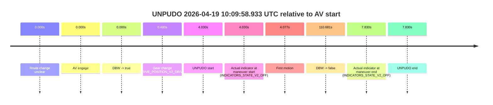
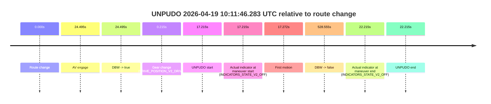
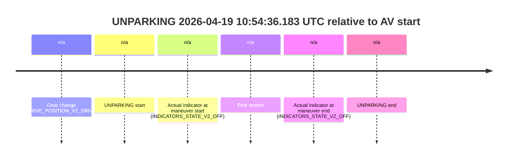

# Run Report: fme20038/2026-04-19--08-59-39--gen2-av-8ebc8398-bbac-4f39-8809-45fdddf1927e

| Field | Value |
|---|---|
| Run ID | `fme20038/2026-04-19--08-59-39--gen2-av-8ebc8398-bbac-4f39-8809-45fdddf1927e` |
| Date | `2026-04-19` |
| Model(s) | `plum-timeless-beaver` |
| Author | `peng.tang` |
| Event count | `16` |

## unpudo 2026-04-19 09:19:26.683 UTC

| Field | Value |
|---|---|
| Model | `plum-timeless-beaver` |
| Author | `peng.tang` |
| Run ID | `fme20038/2026-04-19--08-59-39--gen2-av-8ebc8398-bbac-4f39-8809-45fdddf1927e` |
| Date | `2026-04-19` |
| Time (UTC) | `09:19:26.683` |
| Event type | `unpudo` |
| Disengagement type | `none observed` |
| Route change | `found` |
| Console | [run](https://console.sso.wayve.ai/run/fme20038/2026-04-19--08-59-39--gen2-av-8ebc8398-bbac-4f39-8809-45fdddf1927e?id=&time-unixus=1776590366683308) |
| Foxglove | [segment](https://app.foxglove.dev/wayve-on-prem/p/prj_0dX18KZdVHg1fmmI/view?ds=foxglove-stream&ds.deviceName=fme20038&ds.start=2026-04-19T09%3A18%3A14.068611Z&ds.end=2026-04-19T09%3A25%3A41.084747Z&layoutId=lay_0e7VD4WIKDQGU73Y&time=2026-04-19T09%3A19%3A26.683308Z) |

### Event card: pass

- Pass: AV owns the credited unpudo through the official event window, the gear state is aligned at the anchor, and the vehicle moves without driver accelerator help in AV.

| Event | Time (UTC) | Delta from route change |
|---|---:|---:|
| Route change | 2026-04-19 09:18:24.068 | `0.000s` |
| AV engage | 2026-04-19 09:19:04.503 | `40.435s` |
| DBW -> true | 2026-04-19 09:19:04.503 | `40.435s` |
| Gear change (DRIVE_POSITION_V2_DRIVE) | 2026-04-19 09:19:04.933 | `40.865s` |
| UNPUDO start | 2026-04-19 09:19:26.683 | `62.615s` |
| Actual indicator at maneuver start (INDICATORS_STATE_V2_OFF) | 2026-04-19 09:19:26.683 | `62.615s` |
| First motion | 2026-04-19 09:19:26.739 | `62.671s` |
| DBW -> false | 2026-04-19 09:25:31.084 | `427.016s` |
| Actual indicator at maneuver end (INDICATORS_STATE_V2_OFF) | 2026-04-19 09:19:30.583 | `66.515s` |
| UNPUDO end | 2026-04-19 09:19:30.583 | `66.515s` |

| Metric | Value |
|---|---|
| Outcome | `pass` |
| Effective failure type | `none` |
| Route change status | `found` |
| DBW at event start | `true` |
| DBW at event end | `true` |
| Predicted gear at AV start | `DRIVE_POSITION_V2_DRIVE` |
| Actual gear at AV start | `DRIVE_POSITION_V2_PARK` |
| Predicted gear at event start | `DRIVE_POSITION_V2_DRIVE` |
| Actual gear at event start | `DRIVE_POSITION_V2_DRIVE` |
| Planned indicator direction | `INDICATORS_STATE_V2_RIGHT_ON` |
| Controller indicator direction | `INDICATORS_STATE_V2_RIGHT_ON` |
| Actual indicator direction | `INDICATORS_STATE_V2_OFF` |
| Actual indicator at maneuver end | `INDICATORS_STATE_V2_OFF` |
| Driver accel help in AV | `false` |
| Driver accel help timestamp | `n/a` |
| Max accel pedal pct in AV | `0.0%` |
| Max brake pedal pct in AV | `11.1%` |
| Max speed mps in AV | `4.625` |
| Route -> AV | `40.435s` |
| AV -> event start | `22.180s` |
| AV -> first motion | `22.237s` |
| AV duration before disengagement | `386.582s` |
| Trajectory waypoint count | `37` |
| Driving-plan step count | `11` |

The scored portion starts from the AV-owned window, not from the pre-AV setup. Route-change search in the stopped pre-event segment was `found`, with the baseline therefore set to route change. At the event anchor the model predicts `DRIVE_POSITION_V2_DRIVE` and the actual gear is `DRIVE_POSITION_V2_DRIVE`. The effective model outcome is `pass` because `the credited maneuver stays AV-owned through the official event end`.

### Resolution

| Field | Value |
|---|---|
| Final outcome | `pass` |
| Do we agree with this label? | `yes` |
| Source disengagement type | `none observed` |
| Resolved effective failure type | `none` |
| Confidence | `high` |

## unpudo 2026-04-19 09:31:38.083 UTC

| Field | Value |
|---|---|
| Model | `plum-timeless-beaver` |
| Author | `peng.tang` |
| Run ID | `fme20038/2026-04-19--08-59-39--gen2-av-8ebc8398-bbac-4f39-8809-45fdddf1927e` |
| Date | `2026-04-19` |
| Time (UTC) | `09:31:38.083` |
| Event type | `unpudo` |
| Disengagement type | `none observed` |
| Route change | `unclear` |
| Console | [run](https://console.sso.wayve.ai/run/fme20038/2026-04-19--08-59-39--gen2-av-8ebc8398-bbac-4f39-8809-45fdddf1927e?id=&time-unixus=1776591098083309) |
| Foxglove | [segment](https://app.foxglove.dev/wayve-on-prem/p/prj_0dX18KZdVHg1fmmI/view?ds=foxglove-stream&ds.deviceName=fme20038&ds.start=2026-04-19T09%3A31%3A12.163517Z&ds.end=2026-04-19T09%3A32%3A51.365346Z&layoutId=lay_0e7VD4WIKDQGU73Y&time=2026-04-19T09%3A31%3A38.083309Z) |

### Event card: pass

- Pass: AV owns the credited unpudo through the official event window, the gear state is aligned at the anchor, and the vehicle moves without driver accelerator help in AV.

| Event | Time (UTC) | Delta from AV start |
|---|---:|---:|
| Route change unclear | 2026-04-19 09:31:22.163 | `0.000s` |
| AV engage | 2026-04-19 09:31:22.163 | `0.000s` |
| DBW -> true | 2026-04-19 09:31:22.163 | `0.000s` |
| Gear change (DRIVE_POSITION_V2_DRIVE) | 2026-04-19 09:31:34.533 | `12.370s` |
| UNPUDO start | 2026-04-19 09:31:38.083 | `15.920s` |
| Actual indicator at maneuver start (INDICATORS_STATE_V2_OFF) | 2026-04-19 09:31:38.083 | `15.920s` |
| First motion | 2026-04-19 09:31:38.139 | `15.976s` |
| DBW -> false | 2026-04-19 09:32:41.365 | `79.202s` |
| Actual indicator at maneuver end (INDICATORS_STATE_V2_OFF) | 2026-04-19 09:31:42.533 | `20.370s` |
| UNPUDO end | 2026-04-19 09:31:42.533 | `20.370s` |

| Metric | Value |
|---|---|
| Outcome | `pass` |
| Effective failure type | `none` |
| Route change status | `unclear` |
| DBW at event start | `true` |
| DBW at event end | `true` |
| Predicted gear at AV start | `DRIVE_POSITION_V2_DRIVE` |
| Actual gear at AV start | `DRIVE_POSITION_V2_DRIVE` |
| Predicted gear at event start | `DRIVE_POSITION_V2_DRIVE` |
| Actual gear at event start | `DRIVE_POSITION_V2_DRIVE` |
| Planned indicator direction | `INDICATORS_STATE_V2_OFF` |
| Controller indicator direction | `INDICATORS_STATE_V2_OFF` |
| Actual indicator direction | `INDICATORS_STATE_V2_OFF` |
| Actual indicator at maneuver end | `INDICATORS_STATE_V2_OFF` |
| Driver accel help in AV | `false` |
| Driver accel help timestamp | `n/a` |
| Max accel pedal pct in AV | `0.0%` |
| Max brake pedal pct in AV | `8.0%` |
| Max speed mps in AV | `2.939` |
| Route -> AV | `n/a` |
| AV -> event start | `15.920s` |
| AV -> first motion | `15.976s` |
| AV duration before disengagement | `79.202s` |
| Trajectory waypoint count | `37` |
| Driving-plan step count | `11` |

The scored portion starts from the AV-owned window, not from the pre-AV setup. Route-change search in the stopped pre-event segment was `unclear`, with the baseline therefore set to AV start. At the event anchor the model predicts `DRIVE_POSITION_V2_DRIVE` and the actual gear is `DRIVE_POSITION_V2_DRIVE`. The effective model outcome is `pass` because `the credited maneuver stays AV-owned through the official event end`.

### Resolution

| Field | Value |
|---|---|
| Final outcome | `pass` |
| Do we agree with this label? | `yes` |
| Source disengagement type | `none observed` |
| Resolved effective failure type | `none` |
| Confidence | `medium` |

## unpudo 2026-04-19 09:32:48.083 UTC

| Field | Value |
|---|---|
| Model | `plum-timeless-beaver` |
| Author | `peng.tang` |
| Run ID | `fme20038/2026-04-19--08-59-39--gen2-av-8ebc8398-bbac-4f39-8809-45fdddf1927e` |
| Date | `2026-04-19` |
| Time (UTC) | `09:32:48.083` |
| Event type | `unpudo` |
| Disengagement type | `none observed` |
| Route change | `found` |
| Console | [run](https://console.sso.wayve.ai/run/fme20038/2026-04-19--08-59-39--gen2-av-8ebc8398-bbac-4f39-8809-45fdddf1927e?id=&time-unixus=1776591168083309) |
| Foxglove | [segment](https://app.foxglove.dev/wayve-on-prem/p/prj_0dX18KZdVHg1fmmI/view?ds=foxglove-stream&ds.deviceName=fme20038&ds.start=2026-04-19T09%3A32%3A20.318339Z&ds.end=2026-04-19T09%3A33%3A13.883314Z&layoutId=lay_0e7VD4WIKDQGU73Y&time=2026-04-19T09%3A32%3A48.083309Z) |

### Event card: non-av

- Non-AV: the detected unpudo starts outside AV ownership, so it is kept for coverage but excluded from model success / failure scoring.

| Event | Time (UTC) | Delta from route change |
|---|---:|---:|
| Route change | 2026-04-19 09:32:30.318 | `0.000s` |
| AV engage | 2026-04-19 09:32:55.183 | `24.865s` |
| DBW -> true | 2026-04-19 09:32:55.183 | `24.865s` |
| Gear change (DRIVE_POSITION_V2_REVERSE) | 2026-04-19 09:32:30.633 | `0.315s` |
| UNPUDO start | 2026-04-19 09:32:48.083 | `17.765s` |
| Actual indicator at maneuver start (INDICATORS_STATE_V2_OFF) | 2026-04-19 09:32:48.083 | `17.765s` |
| First motion | 2026-04-19 09:33:00.019 | `29.702s` |
| DBW -> false | 2026-04-19 09:32:58.823 | `28.505s` |
| Actual indicator at maneuver end (INDICATORS_STATE_V2_OFF) | 2026-04-19 09:33:03.883 | `33.565s` |
| UNPUDO end | 2026-04-19 09:33:03.883 | `33.565s` |

| Metric | Value |
|---|---|
| Outcome | `non-av` |
| Effective failure type | `none` |
| Route change status | `found` |
| DBW at event start | `false` |
| DBW at event end | `false` |
| Predicted gear at AV start | `DRIVE_POSITION_V2_DRIVE` |
| Actual gear at AV start | `DRIVE_POSITION_V2_PARK` |
| Predicted gear at event start | `DRIVE_POSITION_V2_REVERSE` |
| Actual gear at event start | `DRIVE_POSITION_V2_REVERSE` |
| Planned indicator direction | `INDICATORS_STATE_V2_OFF` |
| Controller indicator direction | `INDICATORS_STATE_V2_OFF` |
| Actual indicator direction | `INDICATORS_STATE_V2_OFF` |
| Actual indicator at maneuver end | `INDICATORS_STATE_V2_OFF` |
| Driver accel help in AV | `false` |
| Driver accel help timestamp | `n/a` |
| Max accel pedal pct in AV | `0.0%` |
| Max brake pedal pct in AV | `8.0%` |
| Max speed mps in AV | `0.000` |
| Route -> AV | `24.865s` |
| AV -> event start | `-7.100s` |
| AV -> first motion | `4.837s` |
| AV duration before disengagement | `3.640s` |
| Trajectory waypoint count | `37` |
| Driving-plan step count | `11` |

The scored portion starts from the AV-owned window, not from the pre-AV setup. Route-change search in the stopped pre-event segment was `found`, with the baseline therefore set to route change. At the event anchor the model predicts `DRIVE_POSITION_V2_REVERSE` and the actual gear is `DRIVE_POSITION_V2_REVERSE`. The effective model outcome is `non-av` because `the event does not begin in AV ownership`.

### Resolution

| Field | Value |
|---|---|
| Final outcome | `non-av` |
| Do we agree with this label? | `yes` |
| Source disengagement type | `none observed` |
| Resolved effective failure type | `none` |
| Confidence | `high` |

## unpudo 2026-04-19 09:36:45.483 UTC

| Field | Value |
|---|---|
| Model | `plum-timeless-beaver` |
| Author | `peng.tang` |
| Run ID | `fme20038/2026-04-19--08-59-39--gen2-av-8ebc8398-bbac-4f39-8809-45fdddf1927e` |
| Date | `2026-04-19` |
| Time (UTC) | `09:36:45.483` |
| Event type | `unpudo` |
| Disengagement type | `none observed` |
| Route change | `found` |
| Console | [run](https://console.sso.wayve.ai/run/fme20038/2026-04-19--08-59-39--gen2-av-8ebc8398-bbac-4f39-8809-45fdddf1927e?id=&time-unixus=1776591405483303) |
| Foxglove | [segment](https://app.foxglove.dev/wayve-on-prem/p/prj_0dX18KZdVHg1fmmI/view?ds=foxglove-stream&ds.deviceName=fme20038&ds.start=2026-04-19T09%3A36%3A08.983127Z&ds.end=2026-04-19T09%3A37%3A06.283305Z&layoutId=lay_0e7VD4WIKDQGU73Y&time=2026-04-19T09%3A36%3A45.483303Z) |

### Event card: fail

- Fail: the credited unpudo does not stay AV-owned. The event window starts with DBW true, and the maneuver outcome lands outside a clean AV-owned segment.

| Event | Time (UTC) | Delta from route change |
|---|---:|---:|
| Route change | 2026-04-19 09:36:24.918 | `0.000s` |
| AV engage | 2026-04-19 09:36:18.983 | `-5.935s` |
| DBW -> true | 2026-04-19 09:36:18.983 | `-5.935s` |
| Gear change (DRIVE_POSITION_V2_DRIVE) | 2026-04-19 09:36:25.083 | `0.165s` |
| UNPUDO start | 2026-04-19 09:36:45.483 | `20.565s` |
| Actual indicator at maneuver start (INDICATORS_STATE_V2_LEFT_ON) | 2026-04-19 09:36:45.483 | `20.565s` |
| First motion | 2026-04-19 09:36:45.699 | `20.782s` |
| DBW -> false | 2026-04-19 09:36:47.464 | `22.546s` |
| Actual indicator at maneuver end (INDICATORS_STATE_V2_OFF) | 2026-04-19 09:36:56.283 | `31.365s` |
| UNPUDO end | 2026-04-19 09:36:56.283 | `31.365s` |

| Metric | Value |
|---|---|
| Outcome | `fail` |
| Effective failure type | `driver_completed_maneuver` |
| Route change status | `found` |
| DBW at event start | `true` |
| DBW at event end | `true` |
| Predicted gear at AV start | `DRIVE_POSITION_V2_PARK` |
| Actual gear at AV start | `DRIVE_POSITION_V2_PARK` |
| Predicted gear at event start | `DRIVE_POSITION_V2_DRIVE` |
| Actual gear at event start | `DRIVE_POSITION_V2_DRIVE` |
| Planned indicator direction | `INDICATORS_STATE_V2_OFF` |
| Controller indicator direction | `INDICATORS_STATE_V2_OFF` |
| Actual indicator direction | `INDICATORS_STATE_V2_LEFT_ON` |
| Actual indicator at maneuver end | `INDICATORS_STATE_V2_OFF` |
| Driver accel help in AV | `false` |
| Driver accel help timestamp | `n/a` |
| Max accel pedal pct in AV | `0.0%` |
| Max brake pedal pct in AV | `8.0%` |
| Max speed mps in AV | `0.158` |
| Route -> AV | `-5.935s` |
| AV -> event start | `26.500s` |
| AV -> first motion | `26.717s` |
| AV duration before disengagement | `28.481s` |
| Trajectory waypoint count | `37` |
| Driving-plan step count | `11` |

The scored portion starts from the AV-owned window, not from the pre-AV setup. Route-change search in the stopped pre-event segment was `found`, with the baseline therefore set to route change. At the event anchor the model predicts `DRIVE_POSITION_V2_DRIVE` and the actual gear is `DRIVE_POSITION_V2_DRIVE`. The effective model outcome is `fail` because `driver_completed_maneuver`.

### Resolution

| Field | Value |
|---|---|
| Final outcome | `fail` |
| Do we agree with this label? | `yes` |
| Source disengagement type | `none observed` |
| Resolved effective failure type | `driver_completed_maneuver` |
| Confidence | `high` |

## unpudo 2026-04-19 09:46:38.983 UTC

| Field | Value |
|---|---|
| Model | `plum-timeless-beaver` |
| Author | `peng.tang` |
| Run ID | `fme20038/2026-04-19--08-59-39--gen2-av-8ebc8398-bbac-4f39-8809-45fdddf1927e` |
| Date | `2026-04-19` |
| Time (UTC) | `09:46:38.983` |
| Event type | `unpudo` |
| Disengagement type | `none observed` |
| Route change | `found` |
| Console | [run](https://console.sso.wayve.ai/run/fme20038/2026-04-19--08-59-39--gen2-av-8ebc8398-bbac-4f39-8809-45fdddf1927e?id=&time-unixus=1776591998983308) |
| Foxglove | [segment](https://app.foxglove.dev/wayve-on-prem/p/prj_0dX18KZdVHg1fmmI/view?ds=foxglove-stream&ds.deviceName=fme20038&ds.start=2026-04-19T09%3A45%3A21.468292Z&ds.end=2026-04-19T09%3A48%3A30.143122Z&layoutId=lay_0e7VD4WIKDQGU73Y&time=2026-04-19T09%3A46%3A38.983308Z) |

### Event card: non-av

- Non-AV: the detected unpudo starts outside AV ownership, so it is kept for coverage but excluded from model success / failure scoring.

| Event | Time (UTC) | Delta from route change |
|---|---:|---:|
| Route change | 2026-04-19 09:45:31.468 | `0.000s` |
| AV engage | 2026-04-19 09:46:42.383 | `70.915s` |
| DBW -> true | 2026-04-19 09:46:42.383 | `70.915s` |
| Gear change (DRIVE_POSITION_V2_REVERSE) | 2026-04-19 09:46:31.183 | `59.715s` |
| UNPUDO start | 2026-04-19 09:46:38.983 | `67.515s` |
| Actual indicator at maneuver start (INDICATORS_STATE_V2_OFF) | 2026-04-19 09:46:38.983 | `67.515s` |
| First motion | 2026-04-19 09:47:14.139 | `102.672s` |
| DBW -> false | 2026-04-19 09:48:20.143 | `168.675s` |
| Actual indicator at maneuver end (INDICATORS_STATE_V2_OFF) | 2026-04-19 09:47:20.083 | `108.615s` |
| UNPUDO end | 2026-04-19 09:47:20.083 | `108.615s` |

| Metric | Value |
|---|---|
| Outcome | `non-av` |
| Effective failure type | `none` |
| Route change status | `found` |
| DBW at event start | `false` |
| DBW at event end | `true` |
| Predicted gear at AV start | `DRIVE_POSITION_V2_DRIVE` |
| Actual gear at AV start | `DRIVE_POSITION_V2_PARK` |
| Predicted gear at event start | `DRIVE_POSITION_V2_REVERSE` |
| Actual gear at event start | `DRIVE_POSITION_V2_REVERSE` |
| Planned indicator direction | `INDICATORS_STATE_V2_OFF` |
| Controller indicator direction | `INDICATORS_STATE_V2_OFF` |
| Actual indicator direction | `INDICATORS_STATE_V2_OFF` |
| Actual indicator at maneuver end | `INDICATORS_STATE_V2_OFF` |
| Driver accel help in AV | `false` |
| Driver accel help timestamp | `n/a` |
| Max accel pedal pct in AV | `0.0%` |
| Max brake pedal pct in AV | `15.4%` |
| Max speed mps in AV | `3.206` |
| Route -> AV | `70.915s` |
| AV -> event start | `-3.400s` |
| AV -> first motion | `31.757s` |
| AV duration before disengagement | `97.760s` |
| Trajectory waypoint count | `37` |
| Driving-plan step count | `11` |

The scored portion starts from the AV-owned window, not from the pre-AV setup. Route-change search in the stopped pre-event segment was `found`, with the baseline therefore set to route change. At the event anchor the model predicts `DRIVE_POSITION_V2_REVERSE` and the actual gear is `DRIVE_POSITION_V2_REVERSE`. The effective model outcome is `non-av` because `the event does not begin in AV ownership`.

### Resolution

| Field | Value |
|---|---|
| Final outcome | `non-av` |
| Do we agree with this label? | `yes` |
| Source disengagement type | `none observed` |
| Resolved effective failure type | `none` |
| Confidence | `high` |

## unpudo 2026-04-19 09:53:12.983 UTC

| Field | Value |
|---|---|
| Model | `plum-timeless-beaver` |
| Author | `peng.tang` |
| Run ID | `fme20038/2026-04-19--08-59-39--gen2-av-8ebc8398-bbac-4f39-8809-45fdddf1927e` |
| Date | `2026-04-19` |
| Time (UTC) | `09:53:12.983` |
| Event type | `unpudo` |
| Disengagement type | `none observed` |
| Route change | `found` |
| Console | [run](https://console.sso.wayve.ai/run/fme20038/2026-04-19--08-59-39--gen2-av-8ebc8398-bbac-4f39-8809-45fdddf1927e?id=&time-unixus=1776592392983323) |
| Foxglove | [segment](https://app.foxglove.dev/wayve-on-prem/p/prj_0dX18KZdVHg1fmmI/view?ds=foxglove-stream&ds.deviceName=fme20038&ds.start=2026-04-19T09%3A51%3A08.718261Z&ds.end=2026-04-19T09%3A53%3A56.043044Z&layoutId=lay_0e7VD4WIKDQGU73Y&time=2026-04-19T09%3A53%3A12.983323Z) |

### Event card: accidental

- Accidental: AV ownership is present for less than `2s`, so this is treated as an accidental brush with the maneuver rather than a meaningful model attempt.

| Event | Time (UTC) | Delta from route change |
|---|---:|---:|
| Route change | 2026-04-19 09:51:18.718 | `0.000s` |
| AV engage | 2026-04-19 09:53:19.044 | `120.326s` |
| DBW -> true | 2026-04-19 09:53:19.044 | `120.326s` |
| Gear change (DRIVE_POSITION_V2_DRIVE) | 2026-04-19 09:52:57.483 | `98.765s` |
| UNPUDO start | 2026-04-19 09:53:12.983 | `114.265s` |
| Actual indicator at maneuver start (INDICATORS_STATE_V2_OFF) | 2026-04-19 09:53:12.983 | `114.265s` |
| First motion | 2026-04-19 09:53:13.079 | `114.361s` |
| DBW -> false | 2026-04-19 09:53:46.043 | `147.325s` |
| Actual indicator at maneuver end (INDICATORS_STATE_V2_OFF) | 2026-04-19 09:53:17.683 | `118.965s` |
| UNPUDO end | 2026-04-19 09:53:17.683 | `118.965s` |

| Metric | Value |
|---|---|
| Outcome | `accidental` |
| Effective failure type | `none` |
| Route change status | `found` |
| DBW at event start | `false` |
| DBW at event end | `false` |
| Predicted gear at AV start | `DRIVE_POSITION_V2_DRIVE` |
| Actual gear at AV start | `DRIVE_POSITION_V2_DRIVE` |
| Predicted gear at event start | `DRIVE_POSITION_V2_DRIVE` |
| Actual gear at event start | `DRIVE_POSITION_V2_DRIVE` |
| Planned indicator direction | `INDICATORS_STATE_V2_LEFT_ON` |
| Controller indicator direction | `INDICATORS_STATE_V2_LEFT_ON` |
| Actual indicator direction | `INDICATORS_STATE_V2_OFF` |
| Actual indicator at maneuver end | `INDICATORS_STATE_V2_OFF` |
| Driver accel help in AV | `false` |
| Driver accel help timestamp | `n/a` |
| Max accel pedal pct in AV | `0.0%` |
| Max brake pedal pct in AV | `0.0%` |
| Max speed mps in AV | `0.000` |
| Route -> AV | `120.326s` |
| AV -> event start | `-6.061s` |
| AV -> first motion | `-5.965s` |
| AV duration before disengagement | `26.999s` |
| Trajectory waypoint count | `37` |
| Driving-plan step count | `11` |

The scored portion starts from the AV-owned window, not from the pre-AV setup. Route-change search in the stopped pre-event segment was `found`, with the baseline therefore set to route change. At the event anchor the model predicts `DRIVE_POSITION_V2_DRIVE` and the actual gear is `DRIVE_POSITION_V2_DRIVE`. The effective model outcome is `accidental` because `the AV-owned portion is shorter than 2s`.

### Resolution

| Field | Value |
|---|---|
| Final outcome | `accidental` |
| Do we agree with this label? | `yes` |
| Source disengagement type | `none observed` |
| Resolved effective failure type | `none` |
| Confidence | `high` |

## unpudo 2026-04-19 09:54:31.483 UTC

| Field | Value |
|---|---|
| Model | `plum-timeless-beaver` |
| Author | `peng.tang` |
| Run ID | `fme20038/2026-04-19--08-59-39--gen2-av-8ebc8398-bbac-4f39-8809-45fdddf1927e` |
| Date | `2026-04-19` |
| Time (UTC) | `09:54:31.483` |
| Event type | `unpudo` |
| Disengagement type | `none observed` |
| Route change | `found` |
| Console | [run](https://console.sso.wayve.ai/run/fme20038/2026-04-19--08-59-39--gen2-av-8ebc8398-bbac-4f39-8809-45fdddf1927e?id=&time-unixus=1776592471483319) |
| Foxglove | [segment](https://app.foxglove.dev/wayve-on-prem/p/prj_0dX18KZdVHg1fmmI/view?ds=foxglove-stream&ds.deviceName=fme20038&ds.start=2026-04-19T09%3A52%3A41.068242Z&ds.end=2026-04-19T09%3A59%3A48.862980Z&layoutId=lay_0e7VD4WIKDQGU73Y&time=2026-04-19T09%3A54%3A31.483319Z) |

### Event card: accidental

- Accidental: AV ownership is present for less than `2s`, so this is treated as an accidental brush with the maneuver rather than a meaningful model attempt.

| Event | Time (UTC) | Delta from route change |
|---|---:|---:|
| Route change | 2026-04-19 09:52:51.068 | `0.000s` |
| AV engage | 2026-04-19 09:54:47.383 | `116.315s` |
| DBW -> true | 2026-04-19 09:54:47.383 | `116.315s` |
| Gear change (DRIVE_POSITION_V2_REVERSE) | 2026-04-19 09:54:26.333 | `95.265s` |
| UNPUDO start | 2026-04-19 09:54:31.483 | `100.415s` |
| Actual indicator at maneuver start (INDICATORS_STATE_V2_OFF) | 2026-04-19 09:54:31.483 | `100.415s` |
| First motion | 2026-04-19 09:54:34.999 | `103.932s` |
| DBW -> false | 2026-04-19 09:59:38.862 | `407.795s` |
| Actual indicator at maneuver end (INDICATORS_STATE_V2_OFF) | 2026-04-19 09:54:31.483 | `100.415s` |
| UNPUDO end | 2026-04-19 09:54:31.483 | `100.415s` |

| Metric | Value |
|---|---|
| Outcome | `accidental` |
| Effective failure type | `none` |
| Route change status | `found` |
| DBW at event start | `false` |
| DBW at event end | `false` |
| Predicted gear at AV start | `DRIVE_POSITION_V2_PARK` |
| Actual gear at AV start | `DRIVE_POSITION_V2_PARK` |
| Predicted gear at event start | `DRIVE_POSITION_V2_REVERSE` |
| Actual gear at event start | `DRIVE_POSITION_V2_REVERSE` |
| Planned indicator direction | `INDICATORS_STATE_V2_OFF` |
| Controller indicator direction | `INDICATORS_STATE_V2_OFF` |
| Actual indicator direction | `INDICATORS_STATE_V2_OFF` |
| Actual indicator at maneuver end | `INDICATORS_STATE_V2_OFF` |
| Driver accel help in AV | `false` |
| Driver accel help timestamp | `n/a` |
| Max accel pedal pct in AV | `0.0%` |
| Max brake pedal pct in AV | `0.0%` |
| Max speed mps in AV | `0.000` |
| Route -> AV | `116.315s` |
| AV -> event start | `-15.900s` |
| AV -> first motion | `-12.383s` |
| AV duration before disengagement | `291.480s` |
| Trajectory waypoint count | `37` |
| Driving-plan step count | `11` |

The scored portion starts from the AV-owned window, not from the pre-AV setup. Route-change search in the stopped pre-event segment was `found`, with the baseline therefore set to route change. At the event anchor the model predicts `DRIVE_POSITION_V2_REVERSE` and the actual gear is `DRIVE_POSITION_V2_REVERSE`. The effective model outcome is `accidental` because `the AV-owned portion is shorter than 2s`.

### Resolution

| Field | Value |
|---|---|
| Final outcome | `accidental` |
| Do we agree with this label? | `yes` |
| Source disengagement type | `none observed` |
| Resolved effective failure type | `none` |
| Confidence | `high` |

## unpudo 2026-04-19 10:07:29.383 UTC

| Field | Value |
|---|---|
| Model | `plum-timeless-beaver` |
| Author | `peng.tang` |
| Run ID | `fme20038/2026-04-19--08-59-39--gen2-av-8ebc8398-bbac-4f39-8809-45fdddf1927e` |
| Date | `2026-04-19` |
| Time (UTC) | `10:07:29.383` |
| Event type | `unpudo` |
| Disengagement type | `none observed` |
| Route change | `found` |
| Console | [run](https://console.sso.wayve.ai/run/fme20038/2026-04-19--08-59-39--gen2-av-8ebc8398-bbac-4f39-8809-45fdddf1927e?id=&time-unixus=1776593249383306) |
| Foxglove | [segment](https://app.foxglove.dev/wayve-on-prem/p/prj_0dX18KZdVHg1fmmI/view?ds=foxglove-stream&ds.deviceName=fme20038&ds.start=2026-04-19T10%3A07%3A06.268524Z&ds.end=2026-04-19T10%3A09%3A18.624143Z&layoutId=lay_0e7VD4WIKDQGU73Y&time=2026-04-19T10%3A07%3A29.383306Z) |

### Event card: accidental

- Accidental: AV ownership is present for less than `2s`, so this is treated as an accidental brush with the maneuver rather than a meaningful model attempt.

| Event | Time (UTC) | Delta from route change |
|---|---:|---:|
| Route change | 2026-04-19 10:07:16.268 | `0.000s` |
| AV engage | 2026-04-19 10:07:35.002 | `18.734s` |
| DBW -> true | 2026-04-19 10:07:35.002 | `18.734s` |
| Gear change (DRIVE_POSITION_V2_DRIVE) | 2026-04-19 10:07:16.583 | `0.315s` |
| UNPUDO start | 2026-04-19 10:07:29.383 | `13.115s` |
| Actual indicator at maneuver start (INDICATORS_STATE_V2_RIGHT_ON) | 2026-04-19 10:07:29.383 | `13.115s` |
| First motion | 2026-04-19 10:07:29.439 | `13.171s` |
| DBW -> false | 2026-04-19 10:09:08.624 | `112.356s` |
| Actual indicator at maneuver end (INDICATORS_STATE_V2_OFF) | 2026-04-19 10:07:33.983 | `17.715s` |
| UNPUDO end | 2026-04-19 10:07:33.983 | `17.715s` |

| Metric | Value |
|---|---|
| Outcome | `accidental` |
| Effective failure type | `none` |
| Route change status | `found` |
| DBW at event start | `false` |
| DBW at event end | `false` |
| Predicted gear at AV start | `DRIVE_POSITION_V2_DRIVE` |
| Actual gear at AV start | `DRIVE_POSITION_V2_DRIVE` |
| Predicted gear at event start | `DRIVE_POSITION_V2_DRIVE` |
| Actual gear at event start | `DRIVE_POSITION_V2_DRIVE` |
| Planned indicator direction | `INDICATORS_STATE_V2_RIGHT_ON` |
| Controller indicator direction | `INDICATORS_STATE_V2_RIGHT_ON` |
| Actual indicator direction | `INDICATORS_STATE_V2_RIGHT_ON` |
| Actual indicator at maneuver end | `INDICATORS_STATE_V2_OFF` |
| Driver accel help in AV | `false` |
| Driver accel help timestamp | `n/a` |
| Max accel pedal pct in AV | `0.0%` |
| Max brake pedal pct in AV | `0.0%` |
| Max speed mps in AV | `0.000` |
| Route -> AV | `18.734s` |
| AV -> event start | `-5.620s` |
| AV -> first motion | `-5.563s` |
| AV duration before disengagement | `93.621s` |
| Trajectory waypoint count | `37` |
| Driving-plan step count | `11` |

The scored portion starts from the AV-owned window, not from the pre-AV setup. Route-change search in the stopped pre-event segment was `found`, with the baseline therefore set to route change. At the event anchor the model predicts `DRIVE_POSITION_V2_DRIVE` and the actual gear is `DRIVE_POSITION_V2_DRIVE`. The effective model outcome is `accidental` because `the AV-owned portion is shorter than 2s`.

### Resolution

| Field | Value |
|---|---|
| Final outcome | `accidental` |
| Do we agree with this label? | `yes` |
| Source disengagement type | `none observed` |
| Resolved effective failure type | `none` |
| Confidence | `high` |

## unpudo 2026-04-19 10:09:58.933 UTC

| Field | Value |
|---|---|
| Model | `plum-timeless-beaver` |
| Author | `peng.tang` |
| Run ID | `fme20038/2026-04-19--08-59-39--gen2-av-8ebc8398-bbac-4f39-8809-45fdddf1927e` |
| Date | `2026-04-19` |
| Time (UTC) | `10:09:58.933` |
| Event type | `unpudo` |
| Disengagement type | `none observed` |
| Route change | `unclear` |
| Console | [run](https://console.sso.wayve.ai/run/fme20038/2026-04-19--08-59-39--gen2-av-8ebc8398-bbac-4f39-8809-45fdddf1927e?id=&time-unixus=1776593398933315) |
| Foxglove | [segment](https://app.foxglove.dev/wayve-on-prem/p/prj_0dX18KZdVHg1fmmI/view?ds=foxglove-stream&ds.deviceName=fme20038&ds.start=2026-04-19T10%3A09%3A44.903248Z&ds.end=2026-04-19T10%3A11%3A55.583937Z&layoutId=lay_0e7VD4WIKDQGU73Y&time=2026-04-19T10%3A09%3A58.933315Z) |

### Event card: pass

- Pass: AV owns the credited unpudo through the official event window, the gear state is aligned at the anchor, and the vehicle moves without driver accelerator help in AV.

| Event | Time (UTC) | Delta from AV start |
|---|---:|---:|
| Route change unclear | 2026-04-19 10:09:54.903 | `0.000s` |
| AV engage | 2026-04-19 10:09:54.903 | `0.000s` |
| DBW -> true | 2026-04-19 10:09:54.903 | `0.000s` |
| Gear change (DRIVE_POSITION_V2_DRIVE) | 2026-04-19 10:09:55.383 | `0.480s` |
| UNPUDO start | 2026-04-19 10:09:58.933 | `4.030s` |
| Actual indicator at maneuver start (INDICATORS_STATE_V2_OFF) | 2026-04-19 10:09:58.933 | `4.030s` |
| First motion | 2026-04-19 10:09:58.979 | `4.077s` |
| DBW -> false | 2026-04-19 10:11:45.583 | `110.681s` |
| Actual indicator at maneuver end (INDICATORS_STATE_V2_OFF) | 2026-04-19 10:10:02.733 | `7.830s` |
| UNPUDO end | 2026-04-19 10:10:02.733 | `7.830s` |

| Metric | Value |
|---|---|
| Outcome | `pass` |
| Effective failure type | `none` |
| Route change status | `unclear` |
| DBW at event start | `true` |
| DBW at event end | `true` |
| Predicted gear at AV start | `DRIVE_POSITION_V2_DRIVE` |
| Actual gear at AV start | `DRIVE_POSITION_V2_PARK` |
| Predicted gear at event start | `DRIVE_POSITION_V2_DRIVE` |
| Actual gear at event start | `DRIVE_POSITION_V2_DRIVE` |
| Planned indicator direction | `INDICATORS_STATE_V2_RIGHT_ON` |
| Controller indicator direction | `INDICATORS_STATE_V2_RIGHT_ON` |
| Actual indicator direction | `INDICATORS_STATE_V2_OFF` |
| Actual indicator at maneuver end | `INDICATORS_STATE_V2_OFF` |
| Driver accel help in AV | `false` |
| Driver accel help timestamp | `n/a` |
| Max accel pedal pct in AV | `0.0%` |
| Max brake pedal pct in AV | `9.3%` |
| Max speed mps in AV | `3.578` |
| Route -> AV | `n/a` |
| AV -> event start | `4.030s` |
| AV -> first motion | `4.077s` |
| AV duration before disengagement | `110.681s` |
| Trajectory waypoint count | `36` |
| Driving-plan step count | `11` |

The scored portion starts from the AV-owned window, not from the pre-AV setup. Route-change search in the stopped pre-event segment was `unclear`, with the baseline therefore set to AV start. At the event anchor the model predicts `DRIVE_POSITION_V2_DRIVE` and the actual gear is `DRIVE_POSITION_V2_DRIVE`. The effective model outcome is `pass` because `the credited maneuver stays AV-owned through the official event end`.

### Resolution

| Field | Value |
|---|---|
| Final outcome | `pass` |
| Do we agree with this label? | `yes` |
| Source disengagement type | `none observed` |
| Resolved effective failure type | `none` |
| Confidence | `medium` |

## unpudo 2026-04-19 10:11:46.283 UTC

| Field | Value |
|---|---|
| Model | `plum-timeless-beaver` |
| Author | `peng.tang` |
| Run ID | `fme20038/2026-04-19--08-59-39--gen2-av-8ebc8398-bbac-4f39-8809-45fdddf1927e` |
| Date | `2026-04-19` |
| Time (UTC) | `10:11:46.283` |
| Event type | `unpudo` |
| Disengagement type | `none observed` |
| Route change | `found` |
| Console | [run](https://console.sso.wayve.ai/run/fme20038/2026-04-19--08-59-39--gen2-av-8ebc8398-bbac-4f39-8809-45fdddf1927e?id=&time-unixus=1776593506283309) |
| Foxglove | [segment](https://app.foxglove.dev/wayve-on-prem/p/prj_0dX18KZdVHg1fmmI/view?ds=foxglove-stream&ds.deviceName=fme20038&ds.start=2026-04-19T10%3A11%3A19.068217Z&ds.end=2026-04-19T10%3A20%3A27.623615Z&layoutId=lay_0e7VD4WIKDQGU73Y&time=2026-04-19T10%3A11%3A46.283309Z) |

### Event card: accidental

- Accidental: AV ownership is present for less than `2s`, so this is treated as an accidental brush with the maneuver rather than a meaningful model attempt.

| Event | Time (UTC) | Delta from route change |
|---|---:|---:|
| Route change | 2026-04-19 10:11:29.068 | `0.000s` |
| AV engage | 2026-04-19 10:11:53.563 | `24.495s` |
| DBW -> true | 2026-04-19 10:11:53.563 | `24.495s` |
| Gear change (DRIVE_POSITION_V2_DRIVE) | 2026-04-19 10:11:29.283 | `0.215s` |
| UNPUDO start | 2026-04-19 10:11:46.283 | `17.215s` |
| Actual indicator at maneuver start (INDICATORS_STATE_V2_OFF) | 2026-04-19 10:11:46.283 | `17.215s` |
| First motion | 2026-04-19 10:11:46.339 | `17.272s` |
| DBW -> false | 2026-04-19 10:20:17.623 | `528.555s` |
| Actual indicator at maneuver end (INDICATORS_STATE_V2_OFF) | 2026-04-19 10:11:51.283 | `22.215s` |
| UNPUDO end | 2026-04-19 10:11:51.283 | `22.215s` |

| Metric | Value |
|---|---|
| Outcome | `accidental` |
| Effective failure type | `none` |
| Route change status | `found` |
| DBW at event start | `false` |
| DBW at event end | `false` |
| Predicted gear at AV start | `DRIVE_POSITION_V2_DRIVE` |
| Actual gear at AV start | `DRIVE_POSITION_V2_DRIVE` |
| Predicted gear at event start | `DRIVE_POSITION_V2_DRIVE` |
| Actual gear at event start | `DRIVE_POSITION_V2_DRIVE` |
| Planned indicator direction | `INDICATORS_STATE_V2_RIGHT_ON` |
| Controller indicator direction | `INDICATORS_STATE_V2_RIGHT_ON` |
| Actual indicator direction | `INDICATORS_STATE_V2_OFF` |
| Actual indicator at maneuver end | `INDICATORS_STATE_V2_OFF` |
| Driver accel help in AV | `false` |
| Driver accel help timestamp | `n/a` |
| Max accel pedal pct in AV | `0.0%` |
| Max brake pedal pct in AV | `0.0%` |
| Max speed mps in AV | `0.000` |
| Route -> AV | `24.495s` |
| AV -> event start | `-7.280s` |
| AV -> first motion | `-7.224s` |
| AV duration before disengagement | `504.060s` |
| Trajectory waypoint count | `37` |
| Driving-plan step count | `11` |

The scored portion starts from the AV-owned window, not from the pre-AV setup. Route-change search in the stopped pre-event segment was `found`, with the baseline therefore set to route change. At the event anchor the model predicts `DRIVE_POSITION_V2_DRIVE` and the actual gear is `DRIVE_POSITION_V2_DRIVE`. The effective model outcome is `accidental` because `the AV-owned portion is shorter than 2s`.

### Resolution

| Field | Value |
|---|---|
| Final outcome | `accidental` |
| Do we agree with this label? | `yes` |
| Source disengagement type | `none observed` |
| Resolved effective failure type | `none` |
| Confidence | `high` |

## unpudo 2026-04-19 10:23:31.183 UTC

| Field | Value |
|---|---|
| Model | `plum-timeless-beaver` |
| Author | `peng.tang` |
| Run ID | `fme20038/2026-04-19--08-59-39--gen2-av-8ebc8398-bbac-4f39-8809-45fdddf1927e` |
| Date | `2026-04-19` |
| Time (UTC) | `10:23:31.183` |
| Event type | `unpudo` |
| Disengagement type | `none observed` |
| Route change | `found` |
| Console | [run](https://console.sso.wayve.ai/run/fme20038/2026-04-19--08-59-39--gen2-av-8ebc8398-bbac-4f39-8809-45fdddf1927e?id=&time-unixus=1776594211183304) |
| Foxglove | [segment](https://app.foxglove.dev/wayve-on-prem/p/prj_0dX18KZdVHg1fmmI/view?ds=foxglove-stream&ds.deviceName=fme20038&ds.start=2026-04-19T10%3A23%3A03.318548Z&ds.end=2026-04-19T10%3A24%3A30.433308Z&layoutId=lay_0e7VD4WIKDQGU73Y&time=2026-04-19T10%3A23%3A31.183304Z) |

### Event card: non-av

- Non-AV: the detected unpudo starts outside AV ownership, so it is kept for coverage but excluded from model success / failure scoring.

| Event | Time (UTC) | Delta from route change |
|---|---:|---:|
| Route change | 2026-04-19 10:23:13.318 | `0.000s` |
| AV engage | 2026-04-19 10:24:11.643 | `58.325s` |
| DBW -> true | 2026-04-19 10:24:11.643 | `58.325s` |
| Gear change (DRIVE_POSITION_V2_REVERSE) | 2026-04-19 10:23:13.583 | `0.265s` |
| UNPUDO start | 2026-04-19 10:23:31.183 | `17.865s` |
| Actual indicator at maneuver start (INDICATORS_STATE_V2_OFF) | 2026-04-19 10:23:31.183 | `17.865s` |
| First motion | 2026-04-19 10:23:42.779 | `29.461s` |
| DBW -> false | 2026-04-19 10:24:15.043 | `61.725s` |
| Actual indicator at maneuver end (INDICATORS_STATE_V2_OFF) | 2026-04-19 10:24:20.433 | `67.115s` |
| UNPUDO end | 2026-04-19 10:24:20.433 | `67.115s` |

| Metric | Value |
|---|---|
| Outcome | `non-av` |
| Effective failure type | `none` |
| Route change status | `found` |
| DBW at event start | `false` |
| DBW at event end | `false` |
| Predicted gear at AV start | `DRIVE_POSITION_V2_DRIVE` |
| Actual gear at AV start | `DRIVE_POSITION_V2_PARK` |
| Predicted gear at event start | `DRIVE_POSITION_V2_REVERSE` |
| Actual gear at event start | `DRIVE_POSITION_V2_REVERSE` |
| Planned indicator direction | `INDICATORS_STATE_V2_OFF` |
| Controller indicator direction | `INDICATORS_STATE_V2_OFF` |
| Actual indicator direction | `INDICATORS_STATE_V2_OFF` |
| Actual indicator at maneuver end | `INDICATORS_STATE_V2_OFF` |
| Driver accel help in AV | `false` |
| Driver accel help timestamp | `n/a` |
| Max accel pedal pct in AV | `0.0%` |
| Max brake pedal pct in AV | `8.0%` |
| Max speed mps in AV | `0.000` |
| Route -> AV | `58.325s` |
| AV -> event start | `-40.460s` |
| AV -> first motion | `-28.864s` |
| AV duration before disengagement | `3.401s` |
| Trajectory waypoint count | `37` |
| Driving-plan step count | `11` |

The scored portion starts from the AV-owned window, not from the pre-AV setup. Route-change search in the stopped pre-event segment was `found`, with the baseline therefore set to route change. At the event anchor the model predicts `DRIVE_POSITION_V2_REVERSE` and the actual gear is `DRIVE_POSITION_V2_REVERSE`. The effective model outcome is `non-av` because `the event does not begin in AV ownership`.

### Resolution

| Field | Value |
|---|---|
| Final outcome | `non-av` |
| Do we agree with this label? | `yes` |
| Source disengagement type | `none observed` |
| Resolved effective failure type | `none` |
| Confidence | `high` |

## unpudo 2026-04-19 10:36:38.283 UTC

| Field | Value |
|---|---|
| Model | `plum-timeless-beaver` |
| Author | `peng.tang` |
| Run ID | `fme20038/2026-04-19--08-59-39--gen2-av-8ebc8398-bbac-4f39-8809-45fdddf1927e` |
| Date | `2026-04-19` |
| Time (UTC) | `10:36:38.283` |
| Event type | `unpudo` |
| Disengagement type | `none observed` |
| Route change | `found` |
| Console | [run](https://console.sso.wayve.ai/run/fme20038/2026-04-19--08-59-39--gen2-av-8ebc8398-bbac-4f39-8809-45fdddf1927e?id=&time-unixus=1776594998283313) |
| Foxglove | [segment](https://app.foxglove.dev/wayve-on-prem/p/prj_0dX18KZdVHg1fmmI/view?ds=foxglove-stream&ds.deviceName=fme20038&ds.start=2026-04-19T10%3A36%3A09.168250Z&ds.end=2026-04-19T10%3A38%3A28.764198Z&layoutId=lay_0e7VD4WIKDQGU73Y&time=2026-04-19T10%3A36%3A38.283313Z) |

### Event card: accidental

- Accidental: AV ownership is present for less than `2s`, so this is treated as an accidental brush with the maneuver rather than a meaningful model attempt.

| Event | Time (UTC) | Delta from route change |
|---|---:|---:|
| Route change | 2026-04-19 10:36:19.168 | `0.000s` |
| AV engage | 2026-04-19 10:36:41.584 | `22.416s` |
| DBW -> true | 2026-04-19 10:36:41.584 | `22.416s` |
| Gear change (DRIVE_POSITION_V2_DRIVE) | 2026-04-19 10:36:20.383 | `1.215s` |
| UNPUDO start | 2026-04-19 10:36:38.283 | `19.115s` |
| Actual indicator at maneuver start (INDICATORS_STATE_V2_OFF) | 2026-04-19 10:36:38.283 | `19.115s` |
| First motion | 2026-04-19 10:36:38.419 | `19.251s` |
| DBW -> false | 2026-04-19 10:38:18.764 | `119.596s` |
| Actual indicator at maneuver end (INDICATORS_STATE_V2_OFF) | 2026-04-19 10:36:41.683 | `22.515s` |
| UNPUDO end | 2026-04-19 10:36:41.683 | `22.515s` |

| Metric | Value |
|---|---|
| Outcome | `accidental` |
| Effective failure type | `none` |
| Route change status | `found` |
| DBW at event start | `false` |
| DBW at event end | `true` |
| Predicted gear at AV start | `DRIVE_POSITION_V2_DRIVE` |
| Actual gear at AV start | `DRIVE_POSITION_V2_DRIVE` |
| Predicted gear at event start | `DRIVE_POSITION_V2_DRIVE` |
| Actual gear at event start | `DRIVE_POSITION_V2_DRIVE` |
| Planned indicator direction | `INDICATORS_STATE_V2_RIGHT_ON` |
| Controller indicator direction | `INDICATORS_STATE_V2_RIGHT_ON` |
| Actual indicator direction | `INDICATORS_STATE_V2_OFF` |
| Actual indicator at maneuver end | `INDICATORS_STATE_V2_OFF` |
| Driver accel help in AV | `false` |
| Driver accel help timestamp | `n/a` |
| Max accel pedal pct in AV | `0.0%` |
| Max brake pedal pct in AV | `0.0%` |
| Max speed mps in AV | `5.650` |
| Route -> AV | `22.416s` |
| AV -> event start | `-3.301s` |
| AV -> first motion | `-3.165s` |
| AV duration before disengagement | `97.180s` |
| Trajectory waypoint count | `37` |
| Driving-plan step count | `11` |

The scored portion starts from the AV-owned window, not from the pre-AV setup. Route-change search in the stopped pre-event segment was `found`, with the baseline therefore set to route change. At the event anchor the model predicts `DRIVE_POSITION_V2_DRIVE` and the actual gear is `DRIVE_POSITION_V2_DRIVE`. The effective model outcome is `accidental` because `the AV-owned portion is shorter than 2s`.

### Resolution

| Field | Value |
|---|---|
| Final outcome | `accidental` |
| Do we agree with this label? | `yes` |
| Source disengagement type | `none observed` |
| Resolved effective failure type | `none` |
| Confidence | `high` |

## unpudo 2026-04-19 10:38:56.583 UTC

| Field | Value |
|---|---|
| Model | `plum-timeless-beaver` |
| Author | `peng.tang` |
| Run ID | `fme20038/2026-04-19--08-59-39--gen2-av-8ebc8398-bbac-4f39-8809-45fdddf1927e` |
| Date | `2026-04-19` |
| Time (UTC) | `10:38:56.583` |
| Event type | `unpudo` |
| Disengagement type | `none observed` |
| Route change | `found` |
| Console | [run](https://console.sso.wayve.ai/run/fme20038/2026-04-19--08-59-39--gen2-av-8ebc8398-bbac-4f39-8809-45fdddf1927e?id=&time-unixus=1776595136583314) |
| Foxglove | [segment](https://app.foxglove.dev/wayve-on-prem/p/prj_0dX18KZdVHg1fmmI/view?ds=foxglove-stream&ds.deviceName=fme20038&ds.start=2026-04-19T10%3A38%3A30.083316Z&ds.end=2026-04-19T10%3A40%3A55.903182Z&layoutId=lay_0e7VD4WIKDQGU73Y&time=2026-04-19T10%3A38%3A56.583314Z) |

### Event card: accidental

- Accidental: AV ownership is present for less than `2s`, so this is treated as an accidental brush with the maneuver rather than a meaningful model attempt.

| Event | Time (UTC) | Delta from route change |
|---|---:|---:|
| Route change | 2026-04-19 10:38:43.068 | `0.000s` |
| AV engage | 2026-04-19 10:39:03.684 | `20.616s` |
| DBW -> true | 2026-04-19 10:39:03.684 | `20.616s` |
| Gear change (DRIVE_POSITION_V2_DRIVE) | 2026-04-19 10:38:40.083 | `-2.985s` |
| UNPUDO start | 2026-04-19 10:38:56.583 | `13.515s` |
| Actual indicator at maneuver start (INDICATORS_STATE_V2_RIGHT_ON) | 2026-04-19 10:38:56.583 | `13.515s` |
| First motion | 2026-04-19 10:38:56.639 | `13.571s` |
| DBW -> false | 2026-04-19 10:40:45.903 | `122.835s` |
| Actual indicator at maneuver end (INDICATORS_STATE_V2_OFF) | 2026-04-19 10:39:01.483 | `18.415s` |
| UNPUDO end | 2026-04-19 10:39:01.483 | `18.415s` |

| Metric | Value |
|---|---|
| Outcome | `accidental` |
| Effective failure type | `none` |
| Route change status | `found` |
| DBW at event start | `false` |
| DBW at event end | `false` |
| Predicted gear at AV start | `DRIVE_POSITION_V2_DRIVE` |
| Actual gear at AV start | `DRIVE_POSITION_V2_DRIVE` |
| Predicted gear at event start | `DRIVE_POSITION_V2_DRIVE` |
| Actual gear at event start | `DRIVE_POSITION_V2_DRIVE` |
| Planned indicator direction | `INDICATORS_STATE_V2_RIGHT_ON` |
| Controller indicator direction | `INDICATORS_STATE_V2_RIGHT_ON` |
| Actual indicator direction | `INDICATORS_STATE_V2_RIGHT_ON` |
| Actual indicator at maneuver end | `INDICATORS_STATE_V2_OFF` |
| Driver accel help in AV | `false` |
| Driver accel help timestamp | `n/a` |
| Max accel pedal pct in AV | `0.0%` |
| Max brake pedal pct in AV | `0.0%` |
| Max speed mps in AV | `0.000` |
| Route -> AV | `20.616s` |
| AV -> event start | `-7.101s` |
| AV -> first motion | `-7.045s` |
| AV duration before disengagement | `102.219s` |
| Trajectory waypoint count | `37` |
| Driving-plan step count | `11` |

The scored portion starts from the AV-owned window, not from the pre-AV setup. Route-change search in the stopped pre-event segment was `found`, with the baseline therefore set to route change. At the event anchor the model predicts `DRIVE_POSITION_V2_DRIVE` and the actual gear is `DRIVE_POSITION_V2_DRIVE`. The effective model outcome is `accidental` because `the AV-owned portion is shorter than 2s`.

### Resolution

| Field | Value |
|---|---|
| Final outcome | `accidental` |
| Do we agree with this label? | `yes` |
| Source disengagement type | `none observed` |
| Resolved effective failure type | `none` |
| Confidence | `high` |

## unpudo 2026-04-19 10:45:09.283 UTC

| Field | Value |
|---|---|
| Model | `plum-timeless-beaver` |
| Author | `peng.tang` |
| Run ID | `fme20038/2026-04-19--08-59-39--gen2-av-8ebc8398-bbac-4f39-8809-45fdddf1927e` |
| Date | `2026-04-19` |
| Time (UTC) | `10:45:09.283` |
| Event type | `unpudo` |
| Disengagement type | `none observed` |
| Route change | `found` |
| Console | [run](https://console.sso.wayve.ai/run/fme20038/2026-04-19--08-59-39--gen2-av-8ebc8398-bbac-4f39-8809-45fdddf1927e?id=&time-unixus=1776595509283299) |
| Foxglove | [segment](https://app.foxglove.dev/wayve-on-prem/p/prj_0dX18KZdVHg1fmmI/view?ds=foxglove-stream&ds.deviceName=fme20038&ds.start=2026-04-19T10%3A44%3A31.018359Z&ds.end=2026-04-19T10%3A51%3A47.104184Z&layoutId=lay_0e7VD4WIKDQGU73Y&time=2026-04-19T10%3A45%3A09.283299Z) |

### Event card: accidental

- Accidental: AV ownership is present for less than `2s`, so this is treated as an accidental brush with the maneuver rather than a meaningful model attempt.

| Event | Time (UTC) | Delta from route change |
|---|---:|---:|
| Route change | 2026-04-19 10:44:41.018 | `0.000s` |
| AV engage | 2026-04-19 10:45:14.482 | `33.465s` |
| DBW -> true | 2026-04-19 10:45:14.482 | `33.465s` |
| Gear change (DRIVE_POSITION_V2_DRIVE) | 2026-04-19 10:44:41.333 | `0.315s` |
| UNPUDO start | 2026-04-19 10:45:09.283 | `28.265s` |
| Actual indicator at maneuver start (INDICATORS_STATE_V2_RIGHT_ON) | 2026-04-19 10:45:09.283 | `28.265s` |
| First motion | 2026-04-19 10:45:09.320 | `28.302s` |
| DBW -> false | 2026-04-19 10:51:37.104 | `416.086s` |
| Actual indicator at maneuver end (INDICATORS_STATE_V2_OFF) | 2026-04-19 10:45:13.783 | `32.765s` |
| UNPUDO end | 2026-04-19 10:45:13.783 | `32.765s` |

| Metric | Value |
|---|---|
| Outcome | `accidental` |
| Effective failure type | `none` |
| Route change status | `found` |
| DBW at event start | `false` |
| DBW at event end | `false` |
| Predicted gear at AV start | `DRIVE_POSITION_V2_DRIVE` |
| Actual gear at AV start | `DRIVE_POSITION_V2_DRIVE` |
| Predicted gear at event start | `DRIVE_POSITION_V2_DRIVE` |
| Actual gear at event start | `DRIVE_POSITION_V2_DRIVE` |
| Planned indicator direction | `INDICATORS_STATE_V2_RIGHT_ON` |
| Controller indicator direction | `INDICATORS_STATE_V2_RIGHT_ON` |
| Actual indicator direction | `INDICATORS_STATE_V2_RIGHT_ON` |
| Actual indicator at maneuver end | `INDICATORS_STATE_V2_OFF` |
| Driver accel help in AV | `false` |
| Driver accel help timestamp | `n/a` |
| Max accel pedal pct in AV | `0.0%` |
| Max brake pedal pct in AV | `0.0%` |
| Max speed mps in AV | `0.000` |
| Route -> AV | `33.465s` |
| AV -> event start | `-5.200s` |
| AV -> first motion | `-5.163s` |
| AV duration before disengagement | `382.621s` |
| Trajectory waypoint count | `37` |
| Driving-plan step count | `11` |

The scored portion starts from the AV-owned window, not from the pre-AV setup. Route-change search in the stopped pre-event segment was `found`, with the baseline therefore set to route change. At the event anchor the model predicts `DRIVE_POSITION_V2_DRIVE` and the actual gear is `DRIVE_POSITION_V2_DRIVE`. The effective model outcome is `accidental` because `the AV-owned portion is shorter than 2s`.

### Resolution

| Field | Value |
|---|---|
| Final outcome | `accidental` |
| Do we agree with this label? | `yes` |
| Source disengagement type | `none observed` |
| Resolved effective failure type | `none` |
| Confidence | `high` |

## unpudo 2026-04-19 10:51:57.683 UTC

| Field | Value |
|---|---|
| Model | `plum-timeless-beaver` |
| Author | `peng.tang` |
| Run ID | `fme20038/2026-04-19--08-59-39--gen2-av-8ebc8398-bbac-4f39-8809-45fdddf1927e` |
| Date | `2026-04-19` |
| Time (UTC) | `10:51:57.683` |
| Event type | `unpudo` |
| Disengagement type | `none observed` |
| Route change | `unclear` |
| Console | [run](https://console.sso.wayve.ai/run/fme20038/2026-04-19--08-59-39--gen2-av-8ebc8398-bbac-4f39-8809-45fdddf1927e?id=&time-unixus=1776595917683316) |
| Foxglove | [segment](https://app.foxglove.dev/wayve-on-prem/p/prj_0dX18KZdVHg1fmmI/view?ds=foxglove-stream&ds.deviceName=fme20038&ds.start=2026-04-19T10%3A51%3A43.733310Z&ds.end=2026-04-19T10%3A52%3A40.083317Z&layoutId=lay_0e7VD4WIKDQGU73Y&time=2026-04-19T10%3A51%3A57.683316Z) |

### Event card: non-av

- Non-AV: the detected unpudo starts outside AV ownership, so it is kept for coverage but excluded from model success / failure scoring.

| Event | Time (UTC) | Delta from AV start |
|---|---:|---:|
| Route change unclear | 2026-04-19 10:52:07.583 | `0.000s` |
| AV engage | 2026-04-19 10:52:07.583 | `0.000s` |
| DBW -> true | 2026-04-19 10:52:07.583 | `0.000s` |
| Gear change (DRIVE_POSITION_V2_REVERSE) | 2026-04-19 10:51:53.733 | `-13.850s` |
| UNPUDO start | 2026-04-19 10:51:57.683 | `-9.900s` |
| Actual indicator at maneuver start (INDICATORS_STATE_V2_OFF) | 2026-04-19 10:51:57.683 | `-9.900s` |
| First motion | 2026-04-19 10:52:17.299 | `9.717s` |
| DBW -> false | 2026-04-19 10:52:16.644 | `9.061s` |
| Actual indicator at maneuver end (INDICATORS_STATE_V2_OFF) | 2026-04-19 10:52:30.083 | `22.500s` |
| UNPUDO end | 2026-04-19 10:52:30.083 | `22.500s` |

| Metric | Value |
|---|---|
| Outcome | `non-av` |
| Effective failure type | `none` |
| Route change status | `unclear` |
| DBW at event start | `false` |
| DBW at event end | `false` |
| Predicted gear at AV start | `DRIVE_POSITION_V2_PARK` |
| Actual gear at AV start | `DRIVE_POSITION_V2_PARK` |
| Predicted gear at event start | `DRIVE_POSITION_V2_REVERSE` |
| Actual gear at event start | `DRIVE_POSITION_V2_REVERSE` |
| Planned indicator direction | `INDICATORS_STATE_V2_OFF` |
| Controller indicator direction | `INDICATORS_STATE_V2_OFF` |
| Actual indicator direction | `INDICATORS_STATE_V2_OFF` |
| Actual indicator at maneuver end | `INDICATORS_STATE_V2_OFF` |
| Driver accel help in AV | `false` |
| Driver accel help timestamp | `n/a` |
| Max accel pedal pct in AV | `0.0%` |
| Max brake pedal pct in AV | `8.3%` |
| Max speed mps in AV | `0.000` |
| Route -> AV | `n/a` |
| AV -> event start | `-9.900s` |
| AV -> first motion | `9.717s` |
| AV duration before disengagement | `9.061s` |
| Trajectory waypoint count | `37` |
| Driving-plan step count | `11` |

The scored portion starts from the AV-owned window, not from the pre-AV setup. Route-change search in the stopped pre-event segment was `unclear`, with the baseline therefore set to AV start. At the event anchor the model predicts `DRIVE_POSITION_V2_REVERSE` and the actual gear is `DRIVE_POSITION_V2_REVERSE`. The effective model outcome is `non-av` because `the event does not begin in AV ownership`.

### Resolution

| Field | Value |
|---|---|
| Final outcome | `non-av` |
| Do we agree with this label? | `yes` |
| Source disengagement type | `none observed` |
| Resolved effective failure type | `none` |
| Confidence | `medium` |

## unparking 2026-04-19 10:54:36.183 UTC

| Field | Value |
|---|---|
| Model | `plum-timeless-beaver` |
| Author | `peng.tang` |
| Run ID | `fme20038/2026-04-19--08-59-39--gen2-av-8ebc8398-bbac-4f39-8809-45fdddf1927e` |
| Date | `2026-04-19` |
| Time (UTC) | `10:54:36.183` |
| Event type | `unparking` |
| Disengagement type | `none observed` |
| Route change | `unclear` |
| Console | [run](https://console.sso.wayve.ai/run/fme20038/2026-04-19--08-59-39--gen2-av-8ebc8398-bbac-4f39-8809-45fdddf1927e?id=&time-unixus=1776596076183302) |
| Foxglove | [segment](https://app.foxglove.dev/wayve-on-prem/p/prj_0dX18KZdVHg1fmmI/view?ds=foxglove-stream&ds.deviceName=fme20038&ds.start=2026-04-19T10%3A54%3A24.683307Z&ds.end=2026-04-19T10%3A54%3A50.533320Z&layoutId=lay_0e7VD4WIKDQGU73Y&time=2026-04-19T10%3A54%3A36.183302Z) |

### Event card: non-av

- Non-AV: the detected unparking starts outside AV ownership, so it is kept for coverage but excluded from model success / failure scoring.

| Event | Time (UTC) | Delta from AV start |
|---|---:|---:|
| Gear change (DRIVE_POSITION_V2_DRIVE) | 2026-04-19 10:54:34.683 | `n/a` |
| UNPARKING start | 2026-04-19 10:54:36.183 | `n/a` |
| Actual indicator at maneuver start (INDICATORS_STATE_V2_OFF) | 2026-04-19 10:54:36.183 | `n/a` |
| First motion | 2026-04-19 10:54:36.239 | `n/a` |
| Actual indicator at maneuver end (INDICATORS_STATE_V2_OFF) | 2026-04-19 10:54:40.533 | `n/a` |
| UNPARKING end | 2026-04-19 10:54:40.533 | `n/a` |

| Metric | Value |
|---|---|
| Outcome | `non-av` |
| Effective failure type | `none` |
| Route change status | `unclear` |
| DBW at event start | `false` |
| DBW at event end | `false` |
| Predicted gear at AV start | `n/a` |
| Actual gear at AV start | `n/a` |
| Predicted gear at event start | `DRIVE_POSITION_V2_DRIVE` |
| Actual gear at event start | `DRIVE_POSITION_V2_DRIVE` |
| Planned indicator direction | `INDICATORS_STATE_V2_RIGHT_ON` |
| Controller indicator direction | `INDICATORS_STATE_V2_RIGHT_ON` |
| Actual indicator direction | `INDICATORS_STATE_V2_OFF` |
| Actual indicator at maneuver end | `INDICATORS_STATE_V2_OFF` |
| Driver accel help in AV | `false` |
| Driver accel help timestamp | `n/a` |
| Max accel pedal pct in AV | `0.0%` |
| Max brake pedal pct in AV | `0.0%` |
| Max speed mps in AV | `0.000` |
| Route -> AV | `n/a` |
| AV -> event start | `n/a` |
| AV -> first motion | `n/a` |
| AV duration before disengagement | `n/a` |
| Trajectory waypoint count | `37` |
| Driving-plan step count | `11` |

The scored portion starts from the AV-owned window, not from the pre-AV setup. Route-change search in the stopped pre-event segment was `unclear`, with the baseline therefore set to AV start. At the event anchor the model predicts `DRIVE_POSITION_V2_DRIVE` and the actual gear is `DRIVE_POSITION_V2_DRIVE`. The effective model outcome is `non-av` because `the event does not begin in AV ownership`.

### Resolution

| Field | Value |
|---|---|
| Final outcome | `non-av` |
| Do we agree with this label? | `yes` |
| Source disengagement type | `none observed` |
| Resolved effective failure type | `none` |
| Confidence | `medium` |
