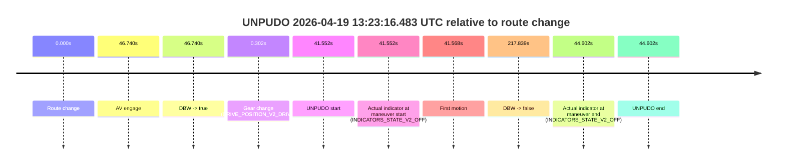
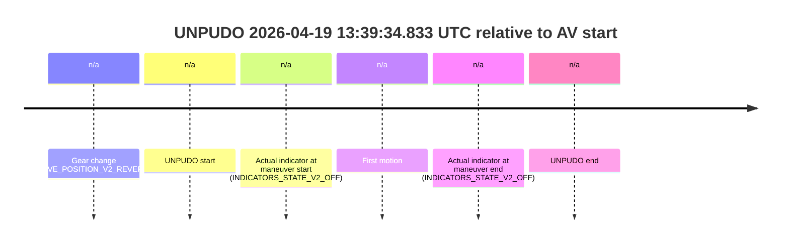
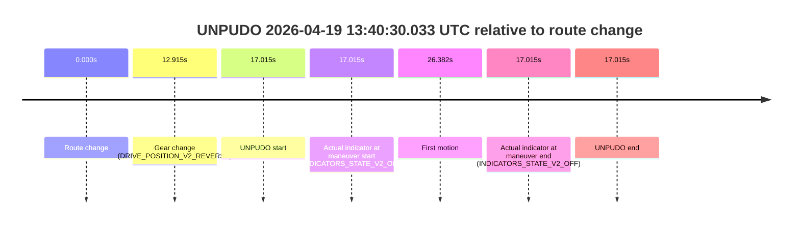
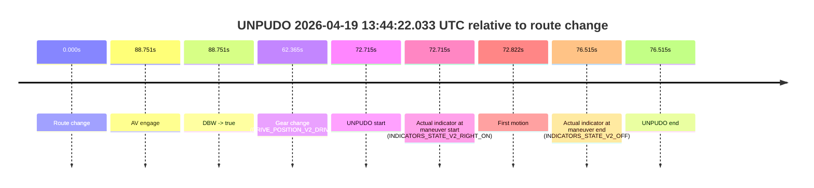

# Run Report: fme20038/2026-04-19--12-57-11--gen2-av-154af0cb-a05c-47b7-a4e7-a681fc8ea5cc

| Field | Value |
|---|---|
| Run ID | `fme20038/2026-04-19--12-57-11--gen2-av-154af0cb-a05c-47b7-a4e7-a681fc8ea5cc` |
| Date | `2026-04-19` |
| Model(s) | `plum-timeless-beaver` |
| Author | `peng.tang` |
| Event count | `8` |

## unpudo 2026-04-19 13:08:39.083 UTC

| Field | Value |
|---|---|
| Model | `plum-timeless-beaver` |
| Author | `peng.tang` |
| Run ID | `fme20038/2026-04-19--12-57-11--gen2-av-154af0cb-a05c-47b7-a4e7-a681fc8ea5cc` |
| Date | `2026-04-19` |
| Time (UTC) | `13:08:39.083` |
| Event type | `unpudo` |
| Disengagement type | `none observed` |
| Route change | `found` |
| Console | [run](https://console.sso.wayve.ai/run/fme20038/2026-04-19--12-57-11--gen2-av-154af0cb-a05c-47b7-a4e7-a681fc8ea5cc?id=&time-unixus=1776604119083298) |
| Foxglove | [segment](https://app.foxglove.dev/wayve-on-prem/p/prj_0dX18KZdVHg1fmmI/view?ds=foxglove-stream&ds.deviceName=fme20038&ds.start=2026-04-19T13%3A07%3A55.618270Z&ds.end=2026-04-19T13%3A15%3A04.390787Z&layoutId=lay_0e7VD4WIKDQGU73Y&time=2026-04-19T13%3A08%3A39.083298Z) |

### Event card: accidental

- Accidental: AV ownership is present for less than `2s`, so this is treated as an accidental brush with the maneuver rather than a meaningful model attempt.

| Event | Time (UTC) | Delta from route change |
|---|---:|---:|
| Route change | 2026-04-19 13:08:05.618 | `0.000s` |
| AV engage | 2026-04-19 13:09:37.650 | `92.033s` |
| DBW -> true | 2026-04-19 13:09:37.650 | `92.033s` |
| Gear change (DRIVE_POSITION_V2_REVERSE) | 2026-04-19 13:08:34.583 | `28.965s` |
| UNPUDO start | 2026-04-19 13:08:39.083 | `33.465s` |
| Actual indicator at maneuver start (INDICATORS_STATE_V2_OFF) | 2026-04-19 13:08:39.083 | `33.465s` |
| First motion | 2026-04-19 13:08:54.159 | `48.542s` |
| DBW -> false | 2026-04-19 13:14:54.390 | `408.773s` |
| Actual indicator at maneuver end (INDICATORS_STATE_V2_OFF) | 2026-04-19 13:09:36.083 | `90.465s` |
| UNPUDO end | 2026-04-19 13:09:36.083 | `90.465s` |

| Metric | Value |
|---|---|
| Outcome | `accidental` |
| Effective failure type | `none` |
| Route change status | `found` |
| DBW at event start | `false` |
| DBW at event end | `false` |
| Predicted gear at AV start | `DRIVE_POSITION_V2_DRIVE` |
| Actual gear at AV start | `DRIVE_POSITION_V2_DRIVE` |
| Predicted gear at event start | `DRIVE_POSITION_V2_REVERSE` |
| Actual gear at event start | `DRIVE_POSITION_V2_REVERSE` |
| Planned indicator direction | `INDICATORS_STATE_V2_LEFT_ON` |
| Controller indicator direction | `INDICATORS_STATE_V2_LEFT_ON` |
| Actual indicator direction | `INDICATORS_STATE_V2_OFF` |
| Actual indicator at maneuver end | `INDICATORS_STATE_V2_OFF` |
| Driver accel help in AV | `false` |
| Driver accel help timestamp | `n/a` |
| Max accel pedal pct in AV | `0.0%` |
| Max brake pedal pct in AV | `0.0%` |
| Max speed mps in AV | `0.000` |
| Route -> AV | `92.033s` |
| AV -> event start | `-58.567s` |
| AV -> first motion | `-43.491s` |
| AV duration before disengagement | `316.740s` |
| Trajectory waypoint count | `37` |
| Driving-plan step count | `11` |

The scored portion starts from the AV-owned window, not from the pre-AV setup. Route-change search in the stopped pre-event segment was `found`, with the baseline therefore set to route change. At the event anchor the model predicts `DRIVE_POSITION_V2_REVERSE` and the actual gear is `DRIVE_POSITION_V2_REVERSE`. The effective model outcome is `accidental` because `the AV-owned portion is shorter than 2s`.

### Resolution

| Field | Value |
|---|---|
| Final outcome | `accidental` |
| Do we agree with this label? | `yes` |
| Source disengagement type | `none observed` |
| Resolved effective failure type | `none` |
| Confidence | `high` |

## unpudo 2026-04-19 13:15:05.933 UTC

| Field | Value |
|---|---|
| Model | `plum-timeless-beaver` |
| Author | `peng.tang` |
| Run ID | `fme20038/2026-04-19--12-57-11--gen2-av-154af0cb-a05c-47b7-a4e7-a681fc8ea5cc` |
| Date | `2026-04-19` |
| Time (UTC) | `13:15:05.933` |
| Event type | `unpudo` |
| Disengagement type | `none observed` |
| Route change | `found` |
| Console | [run](https://console.sso.wayve.ai/run/fme20038/2026-04-19--12-57-11--gen2-av-154af0cb-a05c-47b7-a4e7-a681fc8ea5cc?id=&time-unixus=1776604505933303) |
| Foxglove | [segment](https://app.foxglove.dev/wayve-on-prem/p/prj_0dX18KZdVHg1fmmI/view?ds=foxglove-stream&ds.deviceName=fme20038&ds.start=2026-04-19T13%3A14%3A25.618293Z&ds.end=2026-04-19T13%3A15%3A35.083294Z&layoutId=lay_0e7VD4WIKDQGU73Y&time=2026-04-19T13%3A15%3A05.933303Z) |

### Event card: accidental

- Accidental: AV ownership is present for less than `2s`, so this is treated as an accidental brush with the maneuver rather than a meaningful model attempt.

| Event | Time (UTC) | Delta from route change |
|---|---:|---:|
| Route change | 2026-04-19 13:14:35.618 | `0.000s` |
| AV engage | 2026-04-19 13:15:15.570 | `39.952s` |
| DBW -> true | 2026-04-19 13:15:15.570 | `39.952s` |
| Gear change (DRIVE_POSITION_V2_REVERSE) | 2026-04-19 13:15:03.183 | `27.565s` |
| UNPUDO start | 2026-04-19 13:15:05.933 | `30.315s` |
| Actual indicator at maneuver start (INDICATORS_STATE_V2_OFF) | 2026-04-19 13:15:05.933 | `30.315s` |
| First motion | 2026-04-19 13:15:19.859 | `44.241s` |
| DBW -> false | 2026-04-19 13:15:16.070 | `40.453s` |
| Actual indicator at maneuver end (INDICATORS_STATE_V2_OFF) | 2026-04-19 13:15:25.083 | `49.465s` |
| UNPUDO end | 2026-04-19 13:15:25.083 | `49.465s` |

| Metric | Value |
|---|---|
| Outcome | `accidental` |
| Effective failure type | `none` |
| Route change status | `found` |
| DBW at event start | `false` |
| DBW at event end | `false` |
| Predicted gear at AV start | `DRIVE_POSITION_V2_DRIVE` |
| Actual gear at AV start | `DRIVE_POSITION_V2_DRIVE` |
| Predicted gear at event start | `DRIVE_POSITION_V2_REVERSE` |
| Actual gear at event start | `DRIVE_POSITION_V2_REVERSE` |
| Planned indicator direction | `INDICATORS_STATE_V2_OFF` |
| Controller indicator direction | `INDICATORS_STATE_V2_OFF` |
| Actual indicator direction | `INDICATORS_STATE_V2_OFF` |
| Actual indicator at maneuver end | `INDICATORS_STATE_V2_OFF` |
| Driver accel help in AV | `false` |
| Driver accel help timestamp | `n/a` |
| Max accel pedal pct in AV | `0.0%` |
| Max brake pedal pct in AV | `8.0%` |
| Max speed mps in AV | `0.000` |
| Route -> AV | `39.952s` |
| AV -> event start | `-9.637s` |
| AV -> first motion | `4.289s` |
| AV duration before disengagement | `0.500s` |
| Trajectory waypoint count | `36` |
| Driving-plan step count | `11` |

The scored portion starts from the AV-owned window, not from the pre-AV setup. Route-change search in the stopped pre-event segment was `found`, with the baseline therefore set to route change. At the event anchor the model predicts `DRIVE_POSITION_V2_REVERSE` and the actual gear is `DRIVE_POSITION_V2_REVERSE`. The effective model outcome is `accidental` because `the AV-owned portion is shorter than 2s`.

### Resolution

| Field | Value |
|---|---|
| Final outcome | `accidental` |
| Do we agree with this label? | `yes` |
| Source disengagement type | `none observed` |
| Resolved effective failure type | `none` |
| Confidence | `high` |

## unpudo 2026-04-19 13:23:16.483 UTC

| Field | Value |
|---|---|
| Model | `plum-timeless-beaver` |
| Author | `peng.tang` |
| Run ID | `fme20038/2026-04-19--12-57-11--gen2-av-154af0cb-a05c-47b7-a4e7-a681fc8ea5cc` |
| Date | `2026-04-19` |
| Time (UTC) | `13:23:16.483` |
| Event type | `unpudo` |
| Disengagement type | `none observed` |
| Route change | `found` |
| Console | [run](https://console.sso.wayve.ai/run/fme20038/2026-04-19--12-57-11--gen2-av-154af0cb-a05c-47b7-a4e7-a681fc8ea5cc?id=&time-unixus=1776604996483305) |
| Foxglove | [segment](https://app.foxglove.dev/wayve-on-prem/p/prj_0dX18KZdVHg1fmmI/view?ds=foxglove-stream&ds.deviceName=fme20038&ds.start=2026-04-19T13%3A22%3A24.931257Z&ds.end=2026-04-19T13%3A26%3A22.770002Z&layoutId=lay_0e7VD4WIKDQGU73Y&time=2026-04-19T13%3A23%3A16.483305Z) |

### Event card: accidental

- Accidental: AV ownership is present for less than `2s`, so this is treated as an accidental brush with the maneuver rather than a meaningful model attempt.

| Event | Time (UTC) | Delta from route change |
|---|---:|---:|
| Route change | 2026-04-19 13:22:34.931 | `0.000s` |
| AV engage | 2026-04-19 13:23:21.671 | `46.740s` |
| DBW -> true | 2026-04-19 13:23:21.671 | `46.740s` |
| Gear change (DRIVE_POSITION_V2_DRIVE) | 2026-04-19 13:22:35.233 | `0.302s` |
| UNPUDO start | 2026-04-19 13:23:16.483 | `41.552s` |
| Actual indicator at maneuver start (INDICATORS_STATE_V2_OFF) | 2026-04-19 13:23:16.483 | `41.552s` |
| First motion | 2026-04-19 13:23:16.499 | `41.568s` |
| DBW -> false | 2026-04-19 13:26:12.770 | `217.839s` |
| Actual indicator at maneuver end (INDICATORS_STATE_V2_OFF) | 2026-04-19 13:23:19.533 | `44.602s` |
| UNPUDO end | 2026-04-19 13:23:19.533 | `44.602s` |

| Metric | Value |
|---|---|
| Outcome | `accidental` |
| Effective failure type | `none` |
| Route change status | `found` |
| DBW at event start | `false` |
| DBW at event end | `false` |
| Predicted gear at AV start | `DRIVE_POSITION_V2_DRIVE` |
| Actual gear at AV start | `DRIVE_POSITION_V2_DRIVE` |
| Predicted gear at event start | `DRIVE_POSITION_V2_DRIVE` |
| Actual gear at event start | `DRIVE_POSITION_V2_DRIVE` |
| Planned indicator direction | `INDICATORS_STATE_V2_LEFT_ON` |
| Controller indicator direction | `INDICATORS_STATE_V2_LEFT_ON` |
| Actual indicator direction | `INDICATORS_STATE_V2_OFF` |
| Actual indicator at maneuver end | `INDICATORS_STATE_V2_OFF` |
| Driver accel help in AV | `false` |
| Driver accel help timestamp | `n/a` |
| Max accel pedal pct in AV | `0.0%` |
| Max brake pedal pct in AV | `0.0%` |
| Max speed mps in AV | `0.000` |
| Route -> AV | `46.740s` |
| AV -> event start | `-5.188s` |
| AV -> first motion | `-5.171s` |
| AV duration before disengagement | `171.099s` |
| Trajectory waypoint count | `37` |
| Driving-plan step count | `11` |

The scored portion starts from the AV-owned window, not from the pre-AV setup. Route-change search in the stopped pre-event segment was `found`, with the baseline therefore set to route change. At the event anchor the model predicts `DRIVE_POSITION_V2_DRIVE` and the actual gear is `DRIVE_POSITION_V2_DRIVE`. The effective model outcome is `accidental` because `the AV-owned portion is shorter than 2s`.

### Resolution

| Field | Value |
|---|---|
| Final outcome | `accidental` |
| Do we agree with this label? | `yes` |
| Source disengagement type | `none observed` |
| Resolved effective failure type | `none` |
| Confidence | `high` |

## unpudo 2026-04-19 13:26:13.083 UTC

| Field | Value |
|---|---|
| Model | `plum-timeless-beaver` |
| Author | `peng.tang` |
| Run ID | `fme20038/2026-04-19--12-57-11--gen2-av-154af0cb-a05c-47b7-a4e7-a681fc8ea5cc` |
| Date | `2026-04-19` |
| Time (UTC) | `13:26:13.083` |
| Event type | `unpudo` |
| Disengagement type | `none observed` |
| Route change | `found` |
| Console | [run](https://console.sso.wayve.ai/run/fme20038/2026-04-19--12-57-11--gen2-av-154af0cb-a05c-47b7-a4e7-a681fc8ea5cc?id=&time-unixus=1776605173083294) |
| Foxglove | [segment](https://app.foxglove.dev/wayve-on-prem/p/prj_0dX18KZdVHg1fmmI/view?ds=foxglove-stream&ds.deviceName=fme20038&ds.start=2026-04-19T13%3A25%3A52.768274Z&ds.end=2026-04-19T13%3A26%3A43.583295Z&layoutId=lay_0e7VD4WIKDQGU73Y&time=2026-04-19T13%3A26%3A13.083294Z) |

### Event card: non-av

- Non-AV: the detected unpudo starts outside AV ownership, so it is kept for coverage but excluded from model success / failure scoring.

| Event | Time (UTC) | Delta from route change |
|---|---:|---:|
| Route change | 2026-04-19 13:26:02.768 | `0.000s` |
| AV engage | 2026-04-19 13:26:24.909 | `22.142s` |
| DBW -> true | 2026-04-19 13:26:24.909 | `22.142s` |
| Gear change (DRIVE_POSITION_V2_DRIVE) | 2026-04-19 13:26:03.033 | `0.265s` |
| UNPUDO start | 2026-04-19 13:26:13.083 | `10.315s` |
| Actual indicator at maneuver start (INDICATORS_STATE_V2_RIGHT_ON) | 2026-04-19 13:26:13.083 | `10.315s` |
| First motion | 2026-04-19 13:26:13.140 | `10.372s` |
| DBW -> false | 2026-04-19 13:26:29.690 | `26.922s` |
| Actual indicator at maneuver end (INDICATORS_STATE_V2_LEFT_ON) | 2026-04-19 13:26:33.583 | `30.815s` |
| UNPUDO end | 2026-04-19 13:26:33.583 | `30.815s` |

| Metric | Value |
|---|---|
| Outcome | `non-av` |
| Effective failure type | `none` |
| Route change status | `found` |
| DBW at event start | `false` |
| DBW at event end | `false` |
| Predicted gear at AV start | `DRIVE_POSITION_V2_DRIVE` |
| Actual gear at AV start | `DRIVE_POSITION_V2_DRIVE` |
| Predicted gear at event start | `DRIVE_POSITION_V2_DRIVE` |
| Actual gear at event start | `DRIVE_POSITION_V2_DRIVE` |
| Planned indicator direction | `INDICATORS_STATE_V2_LEFT_ON` |
| Controller indicator direction | `INDICATORS_STATE_V2_LEFT_ON` |
| Actual indicator direction | `INDICATORS_STATE_V2_RIGHT_ON` |
| Actual indicator at maneuver end | `INDICATORS_STATE_V2_LEFT_ON` |
| Driver accel help in AV | `false` |
| Driver accel help timestamp | `n/a` |
| Max accel pedal pct in AV | `0.0%` |
| Max brake pedal pct in AV | `11.3%` |
| Max speed mps in AV | `0.000` |
| Route -> AV | `22.142s` |
| AV -> event start | `-11.826s` |
| AV -> first motion | `-11.770s` |
| AV duration before disengagement | `4.780s` |
| Trajectory waypoint count | `37` |
| Driving-plan step count | `11` |

The scored portion starts from the AV-owned window, not from the pre-AV setup. Route-change search in the stopped pre-event segment was `found`, with the baseline therefore set to route change. At the event anchor the model predicts `DRIVE_POSITION_V2_DRIVE` and the actual gear is `DRIVE_POSITION_V2_DRIVE`. The effective model outcome is `non-av` because `the event does not begin in AV ownership`.

### Resolution

| Field | Value |
|---|---|
| Final outcome | `non-av` |
| Do we agree with this label? | `yes` |
| Source disengagement type | `none observed` |
| Resolved effective failure type | `none` |
| Confidence | `high` |

## unpudo 2026-04-19 13:31:23.233 UTC

| Field | Value |
|---|---|
| Model | `plum-timeless-beaver` |
| Author | `peng.tang` |
| Run ID | `fme20038/2026-04-19--12-57-11--gen2-av-154af0cb-a05c-47b7-a4e7-a681fc8ea5cc` |
| Date | `2026-04-19` |
| Time (UTC) | `13:31:23.233` |
| Event type | `unpudo` |
| Disengagement type | `none observed` |
| Route change | `found` |
| Console | [run](https://console.sso.wayve.ai/run/fme20038/2026-04-19--12-57-11--gen2-av-154af0cb-a05c-47b7-a4e7-a681fc8ea5cc?id=&time-unixus=1776605483233307) |
| Foxglove | [segment](https://app.foxglove.dev/wayve-on-prem/p/prj_0dX18KZdVHg1fmmI/view?ds=foxglove-stream&ds.deviceName=fme20038&ds.start=2026-04-19T13%3A30%3A39.733310Z&ds.end=2026-04-19T13%3A35%3A56.369736Z&layoutId=lay_0e7VD4WIKDQGU73Y&time=2026-04-19T13%3A31%3A23.233307Z) |

### Event card: accidental

- Accidental: AV ownership is present for less than `2s`, so this is treated as an accidental brush with the maneuver rather than a meaningful model attempt.

| Event | Time (UTC) | Delta from route change |
|---|---:|---:|
| Route change | 2026-04-19 13:30:55.418 | `0.000s` |
| AV engage | 2026-04-19 13:31:28.350 | `32.933s` |
| DBW -> true | 2026-04-19 13:31:28.350 | `32.933s` |
| Gear change (DRIVE_POSITION_V2_DRIVE) | 2026-04-19 13:30:49.733 | `-5.685s` |
| UNPUDO start | 2026-04-19 13:31:23.233 | `27.815s` |
| Actual indicator at maneuver start (INDICATORS_STATE_V2_RIGHT_ON) | 2026-04-19 13:31:23.233 | `27.815s` |
| First motion | 2026-04-19 13:31:23.279 | `27.861s` |
| DBW -> false | 2026-04-19 13:35:46.369 | `290.951s` |
| Actual indicator at maneuver end (INDICATORS_STATE_V2_OFF) | 2026-04-19 13:31:26.783 | `31.365s` |
| UNPUDO end | 2026-04-19 13:31:26.783 | `31.365s` |

| Metric | Value |
|---|---|
| Outcome | `accidental` |
| Effective failure type | `none` |
| Route change status | `found` |
| DBW at event start | `false` |
| DBW at event end | `false` |
| Predicted gear at AV start | `DRIVE_POSITION_V2_DRIVE` |
| Actual gear at AV start | `DRIVE_POSITION_V2_DRIVE` |
| Predicted gear at event start | `DRIVE_POSITION_V2_DRIVE` |
| Actual gear at event start | `DRIVE_POSITION_V2_DRIVE` |
| Planned indicator direction | `INDICATORS_STATE_V2_RIGHT_ON` |
| Controller indicator direction | `INDICATORS_STATE_V2_RIGHT_ON` |
| Actual indicator direction | `INDICATORS_STATE_V2_RIGHT_ON` |
| Actual indicator at maneuver end | `INDICATORS_STATE_V2_OFF` |
| Driver accel help in AV | `false` |
| Driver accel help timestamp | `n/a` |
| Max accel pedal pct in AV | `0.0%` |
| Max brake pedal pct in AV | `0.0%` |
| Max speed mps in AV | `0.000` |
| Route -> AV | `32.933s` |
| AV -> event start | `-5.118s` |
| AV -> first motion | `-5.071s` |
| AV duration before disengagement | `258.019s` |
| Trajectory waypoint count | `36` |
| Driving-plan step count | `11` |

The scored portion starts from the AV-owned window, not from the pre-AV setup. Route-change search in the stopped pre-event segment was `found`, with the baseline therefore set to route change. At the event anchor the model predicts `DRIVE_POSITION_V2_DRIVE` and the actual gear is `DRIVE_POSITION_V2_DRIVE`. The effective model outcome is `accidental` because `the AV-owned portion is shorter than 2s`.

### Resolution

| Field | Value |
|---|---|
| Final outcome | `accidental` |
| Do we agree with this label? | `yes` |
| Source disengagement type | `none observed` |
| Resolved effective failure type | `none` |
| Confidence | `high` |

## unpudo 2026-04-19 13:39:34.833 UTC

| Field | Value |
|---|---|
| Model | `plum-timeless-beaver` |
| Author | `peng.tang` |
| Run ID | `fme20038/2026-04-19--12-57-11--gen2-av-154af0cb-a05c-47b7-a4e7-a681fc8ea5cc` |
| Date | `2026-04-19` |
| Time (UTC) | `13:39:34.833` |
| Event type | `unpudo` |
| Disengagement type | `none observed` |
| Route change | `unclear` |
| Console | [run](https://console.sso.wayve.ai/run/fme20038/2026-04-19--12-57-11--gen2-av-154af0cb-a05c-47b7-a4e7-a681fc8ea5cc?id=&time-unixus=1776605974833296) |
| Foxglove | [segment](https://app.foxglove.dev/wayve-on-prem/p/prj_0dX18KZdVHg1fmmI/view?ds=foxglove-stream&ds.deviceName=fme20038&ds.start=2026-04-19T13%3A39%3A22.183312Z&ds.end=2026-04-19T13%3A40%3A32.183316Z&layoutId=lay_0e7VD4WIKDQGU73Y&time=2026-04-19T13%3A39%3A34.833296Z) |

### Event card: non-av

- Non-AV: the detected unpudo starts outside AV ownership, so it is kept for coverage but excluded from model success / failure scoring.

| Event | Time (UTC) | Delta from AV start |
|---|---:|---:|
| Gear change (DRIVE_POSITION_V2_REVERSE) | 2026-04-19 13:39:32.183 | `n/a` |
| UNPUDO start | 2026-04-19 13:39:34.833 | `n/a` |
| Actual indicator at maneuver start (INDICATORS_STATE_V2_OFF) | 2026-04-19 13:39:34.833 | `n/a` |
| First motion | 2026-04-19 13:40:19.199 | `n/a` |
| Actual indicator at maneuver end (INDICATORS_STATE_V2_OFF) | 2026-04-19 13:40:22.183 | `n/a` |
| UNPUDO end | 2026-04-19 13:40:22.183 | `n/a` |

| Metric | Value |
|---|---|
| Outcome | `non-av` |
| Effective failure type | `none` |
| Route change status | `unclear` |
| DBW at event start | `false` |
| DBW at event end | `false` |
| Predicted gear at AV start | `n/a` |
| Actual gear at AV start | `n/a` |
| Predicted gear at event start | `DRIVE_POSITION_V2_REVERSE` |
| Actual gear at event start | `DRIVE_POSITION_V2_REVERSE` |
| Planned indicator direction | `INDICATORS_STATE_V2_LEFT_ON` |
| Controller indicator direction | `INDICATORS_STATE_V2_LEFT_ON` |
| Actual indicator direction | `INDICATORS_STATE_V2_OFF` |
| Actual indicator at maneuver end | `INDICATORS_STATE_V2_OFF` |
| Driver accel help in AV | `false` |
| Driver accel help timestamp | `n/a` |
| Max accel pedal pct in AV | `0.0%` |
| Max brake pedal pct in AV | `0.0%` |
| Max speed mps in AV | `0.000` |
| Route -> AV | `n/a` |
| AV -> event start | `n/a` |
| AV -> first motion | `n/a` |
| AV duration before disengagement | `n/a` |
| Trajectory waypoint count | `36` |
| Driving-plan step count | `11` |

The scored portion starts from the AV-owned window, not from the pre-AV setup. Route-change search in the stopped pre-event segment was `unclear`, with the baseline therefore set to AV start. At the event anchor the model predicts `DRIVE_POSITION_V2_REVERSE` and the actual gear is `DRIVE_POSITION_V2_REVERSE`. The effective model outcome is `non-av` because `the event does not begin in AV ownership`.

### Resolution

| Field | Value |
|---|---|
| Final outcome | `non-av` |
| Do we agree with this label? | `yes` |
| Source disengagement type | `none observed` |
| Resolved effective failure type | `none` |
| Confidence | `medium` |

## unpudo 2026-04-19 13:40:30.033 UTC

| Field | Value |
|---|---|
| Model | `plum-timeless-beaver` |
| Author | `peng.tang` |
| Run ID | `fme20038/2026-04-19--12-57-11--gen2-av-154af0cb-a05c-47b7-a4e7-a681fc8ea5cc` |
| Date | `2026-04-19` |
| Time (UTC) | `13:40:30.033` |
| Event type | `unpudo` |
| Disengagement type | `none observed` |
| Route change | `found` |
| Console | [run](https://console.sso.wayve.ai/run/fme20038/2026-04-19--12-57-11--gen2-av-154af0cb-a05c-47b7-a4e7-a681fc8ea5cc?id=&time-unixus=1776606030033325) |
| Foxglove | [segment](https://app.foxglove.dev/wayve-on-prem/p/prj_0dX18KZdVHg1fmmI/view?ds=foxglove-stream&ds.deviceName=fme20038&ds.start=2026-04-19T13%3A40%3A03.018257Z&ds.end=2026-04-19T13%3A40%3A40.033325Z&layoutId=lay_0e7VD4WIKDQGU73Y&time=2026-04-19T13%3A40%3A30.033325Z) |

### Event card: non-av

- Non-AV: the detected unpudo starts outside AV ownership, so it is kept for coverage but excluded from model success / failure scoring.

| Event | Time (UTC) | Delta from route change |
|---|---:|---:|
| Route change | 2026-04-19 13:40:13.018 | `0.000s` |
| Gear change (DRIVE_POSITION_V2_REVERSE) | 2026-04-19 13:40:25.933 | `12.915s` |
| UNPUDO start | 2026-04-19 13:40:30.033 | `17.015s` |
| Actual indicator at maneuver start (INDICATORS_STATE_V2_OFF) | 2026-04-19 13:40:30.033 | `17.015s` |
| First motion | 2026-04-19 13:40:39.399 | `26.382s` |
| Actual indicator at maneuver end (INDICATORS_STATE_V2_OFF) | 2026-04-19 13:40:30.033 | `17.015s` |
| UNPUDO end | 2026-04-19 13:40:30.033 | `17.015s` |

| Metric | Value |
|---|---|
| Outcome | `non-av` |
| Effective failure type | `none` |
| Route change status | `found` |
| DBW at event start | `false` |
| DBW at event end | `false` |
| Predicted gear at AV start | `n/a` |
| Actual gear at AV start | `n/a` |
| Predicted gear at event start | `DRIVE_POSITION_V2_REVERSE` |
| Actual gear at event start | `DRIVE_POSITION_V2_REVERSE` |
| Planned indicator direction | `INDICATORS_STATE_V2_OFF` |
| Controller indicator direction | `INDICATORS_STATE_V2_OFF` |
| Actual indicator direction | `INDICATORS_STATE_V2_OFF` |
| Actual indicator at maneuver end | `INDICATORS_STATE_V2_OFF` |
| Driver accel help in AV | `false` |
| Driver accel help timestamp | `n/a` |
| Max accel pedal pct in AV | `0.0%` |
| Max brake pedal pct in AV | `0.0%` |
| Max speed mps in AV | `0.000` |
| Route -> AV | `n/a` |
| AV -> event start | `n/a` |
| AV -> first motion | `n/a` |
| AV duration before disengagement | `n/a` |
| Trajectory waypoint count | `36` |
| Driving-plan step count | `11` |

The scored portion starts from the AV-owned window, not from the pre-AV setup. Route-change search in the stopped pre-event segment was `found`, with the baseline therefore set to route change. At the event anchor the model predicts `DRIVE_POSITION_V2_REVERSE` and the actual gear is `DRIVE_POSITION_V2_REVERSE`. The effective model outcome is `non-av` because `the event does not begin in AV ownership`.

### Resolution

| Field | Value |
|---|---|
| Final outcome | `non-av` |
| Do we agree with this label? | `yes` |
| Source disengagement type | `none observed` |
| Resolved effective failure type | `none` |
| Confidence | `high` |

## unpudo 2026-04-19 13:44:22.033 UTC

| Field | Value |
|---|---|
| Model | `plum-timeless-beaver` |
| Author | `peng.tang` |
| Run ID | `fme20038/2026-04-19--12-57-11--gen2-av-154af0cb-a05c-47b7-a4e7-a681fc8ea5cc` |
| Date | `2026-04-19` |
| Time (UTC) | `13:44:22.033` |
| Event type | `unpudo` |
| Disengagement type | `none observed` |
| Route change | `found` |
| Console | [run](https://console.sso.wayve.ai/run/fme20038/2026-04-19--12-57-11--gen2-av-154af0cb-a05c-47b7-a4e7-a681fc8ea5cc?id=&time-unixus=1776606262033311) |
| Foxglove | [segment](https://app.foxglove.dev/wayve-on-prem/p/prj_0dX18KZdVHg1fmmI/view?ds=foxglove-stream&ds.deviceName=fme20038&ds.start=2026-04-19T13%3A42%3A59.318268Z&ds.end=2026-04-19T13%3A44%3A35.833314Z&layoutId=lay_0e7VD4WIKDQGU73Y&time=2026-04-19T13%3A44%3A22.033311Z) |

### Event card: accidental

- Accidental: AV ownership is present for less than `2s`, so this is treated as an accidental brush with the maneuver rather than a meaningful model attempt.

| Event | Time (UTC) | Delta from route change |
|---|---:|---:|
| Route change | 2026-04-19 13:43:09.318 | `0.000s` |
| AV engage | 2026-04-19 13:44:38.069 | `88.751s` |
| DBW -> true | 2026-04-19 13:44:38.069 | `88.751s` |
| Gear change (DRIVE_POSITION_V2_DRIVE) | 2026-04-19 13:44:11.683 | `62.365s` |
| UNPUDO start | 2026-04-19 13:44:22.033 | `72.715s` |
| Actual indicator at maneuver start (INDICATORS_STATE_V2_RIGHT_ON) | 2026-04-19 13:44:22.033 | `72.715s` |
| First motion | 2026-04-19 13:44:22.139 | `72.822s` |
| Actual indicator at maneuver end (INDICATORS_STATE_V2_OFF) | 2026-04-19 13:44:25.833 | `76.515s` |
| UNPUDO end | 2026-04-19 13:44:25.833 | `76.515s` |

| Metric | Value |
|---|---|
| Outcome | `accidental` |
| Effective failure type | `none` |
| Route change status | `found` |
| DBW at event start | `false` |
| DBW at event end | `false` |
| Predicted gear at AV start | `DRIVE_POSITION_V2_DRIVE` |
| Actual gear at AV start | `DRIVE_POSITION_V2_DRIVE` |
| Predicted gear at event start | `DRIVE_POSITION_V2_DRIVE` |
| Actual gear at event start | `DRIVE_POSITION_V2_DRIVE` |
| Planned indicator direction | `INDICATORS_STATE_V2_OFF` |
| Controller indicator direction | `INDICATORS_STATE_V2_OFF` |
| Actual indicator direction | `INDICATORS_STATE_V2_RIGHT_ON` |
| Actual indicator at maneuver end | `INDICATORS_STATE_V2_OFF` |
| Driver accel help in AV | `false` |
| Driver accel help timestamp | `n/a` |
| Max accel pedal pct in AV | `0.0%` |
| Max brake pedal pct in AV | `0.0%` |
| Max speed mps in AV | `0.000` |
| Route -> AV | `88.751s` |
| AV -> event start | `-16.036s` |
| AV -> first motion | `-15.930s` |
| AV duration before disengagement | `n/a` |
| Trajectory waypoint count | `36` |
| Driving-plan step count | `11` |

The scored portion starts from the AV-owned window, not from the pre-AV setup. Route-change search in the stopped pre-event segment was `found`, with the baseline therefore set to route change. At the event anchor the model predicts `DRIVE_POSITION_V2_DRIVE` and the actual gear is `DRIVE_POSITION_V2_DRIVE`. The effective model outcome is `accidental` because `the AV-owned portion is shorter than 2s`.

### Resolution

| Field | Value |
|---|---|
| Final outcome | `accidental` |
| Do we agree with this label? | `yes` |
| Source disengagement type | `none observed` |
| Resolved effective failure type | `none` |
| Confidence | `high` |
